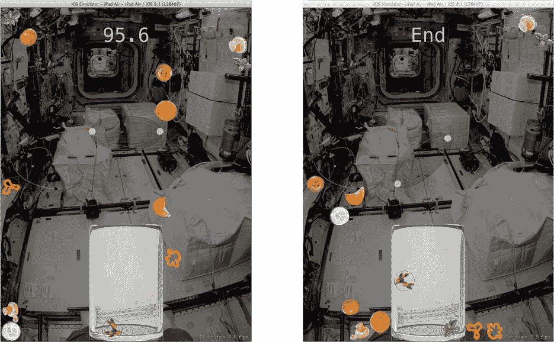

# Actions

你可以将多种动作附加到节点上。以下是一些示例：

- 将节点移动到另一个位置
- 沿任意路径移动节点
- 旋转
- 更改缩放比例
- 隐藏或显示节点
- 淡入或淡出
- 更改节点的纹理或颜色
- 从场景中移除节点
- 等待一段时间
- 运行另一个节点的动作
- 执行任意代码块
- 执行一系列动作
- 并行执行一组动作
- 重复执行一个动作

此列表开头的项目是基本动画动作。还记得我之前说你不告诉节点如何动画，而是告诉它们*为什么*吗？我稍微夸张了一点。你*通常*使用物理模拟器对节点进行动画处理，但你拥有完整的动画动作集，可以按任何你想要的方式指示它们，并且你马上就会用到这些动作。

真正开放式的动作是执行代码块的那个动作。在这里，你可以将任何你想要的逻辑附加到节点上。

最后几个动作才是真正有趣的地方。**序列**和**组**动作执行一组其他动作，要么顺序执行，要么同时执行。如果你想创建一个动画序列（移动、旋转、淡出、移除），你可以创建单个动作，从中构建一个**序列动作**，然后将该序列动作附加到节点上。混入代码块动作，你可以在序列之前、期间或结束时运行任何逻辑。

最后，**重复**动作将执行另一个动作一定次数或永远执行。它执行的动作可以是序列或组。动作可以嵌套到任意深度。

使用 `runAction(_:)` 函数将动作附加到节点上。它们运行一次然后被释放。“例外”是重复动作，它只有在所有子动作运行了所需次数后才算完成——或者永远不完成，如果是永远重复动作的话。

**提示** 还有一个特殊的 `runAction(_:, completion:)` 函数，它在节点上运行一个动作，然后执行一个代码块。这相当于创建一个序列动作，该动作先运行一个动作，然后运行一个代码块动作。

你将使用动作来更新场景中的计时器。选择 `GameScene.swift` 文件，找到 `startGame()` 函数。添加以下代码：

```
if let label = childNodeWithName("timer") as? SKLabelNode {
    let wait = SKAction.waitForDuration(0.1)
    let decrement = SKAction.runBlock({
        self.timeRemaining -= 0.1
        if self.timeRemaining < 0.0 {
            label.text = "End"
            self.endGame(self.score().score)
        } else {
            label.text = NSString(format: "%.1f", self.timeRemaining)
        }
    })
    let sequence = SKAction.sequence([wait,decrement])
    let forever = SKAction.repeatActionForever(sequence)
    label.runAction(forever)
}
```

这段新代码获取了你刚刚添加到场景中的计时器节点。然后它创建了一个动作序列。第一个动作执行无操作（等待）0.1 秒。第二个动作执行一个代码块，该代码块获取剩余时间，将其减少 0.1，并更新标签节点，直到 `timeRemaining` 达到 `0.0`。然后它将计时器的文本设置为 `End` 并结束游戏。

为了使这些动作重复运行，首先将它们组合成一个序列动作，然后用它创建一个永远重复动作。这个永远重复动作是被添加到计时器节点上的那个动作。

**提示** 大多数动作是不可变的，可以重复使用并同时运行在多个节点上。如果你有一个常用的动作，创建它一次，然后根据需要尽可能多地重复使用。

由于永远重复动作永远不会完成（从节点的角度来看），你需要在游戏结束后停止它。在 `endGame(_:)` 函数中，添加以下语句：

```
childNodeWithName("timer")?.removeAllActions()
```

`removeAllActions()` 函数的作用正如你所想的那样。

现在运行应用，如图 14-24 所示。你会看到计时器立即启动。如果你能成功将所有蔬菜放入烧杯，游戏将结束，计时器将停止。如果不能，计时器最终会达到 `0.0` 并停止游戏。



图 14-24. 带计时器的游戏

