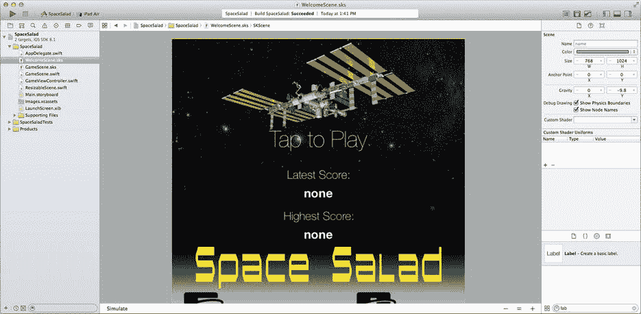
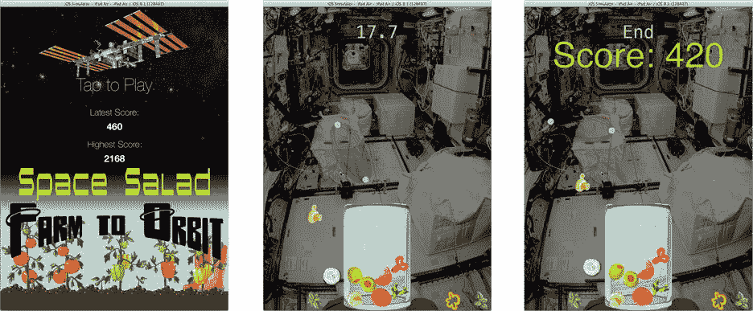

# 呈现场景

在文件模板库中，找到 `SpriteKit` 场景模板，并将其拖入你的项目导航器。将文件命名为 `WelcomeScene`。现在按照以下步骤为你的游戏创建一个欢迎场景。（或者，你可以直接从已完成项目的 `Learn iOS Development Projects`  `Ch 14`  `SpaceSalad` 文件夹中复制完成的 `WelcomeScene.sks` 和 `WelcomeScene.swift` 文件。）


1.  将场景的尺寸设置为 (768, 1024)。
2.  拖入一个彩色精灵，并按如下方式配置：
    1.  名称：`background`
    2.  纹理：`bkg_welcome.jpg`
    3.  位置：`(0, 0)`
    4.  锚点：`(0, 0)`
3.  拖入一个标签节点，并按如下方式配置：
    1.  位置：`(384, 740)`
    2.  文本：`Tap to Play`
    3.  字体：`Helvetica Neue UltraLight 59.0`
    4.  颜色：白色
    5.  Z 位置：`1`
4.  拖入另一个标签节点，并按如下方式配置：
    1.  位置：`(384, 657)`
    2.  文本：`Latest Score:`
    3.  字体：`Helvetica Neue Thin 30.0`
    4.  Z 位置：`1`
5.  按住 Option 键并拖动最后一个标签以复制它。按如下方式配置副本：
    1.  位置：`(384, 549)`
    2.  文本：`Highest Score:`
6.  拖入一个新的标签节点，并按如下方式配置：
    1.  名称：`latest`
    2.  位置：`(384, 608)`
    3.  文本：`none`
    4.  字体：`Helvetica Neue Bold 32.0`
    5.  颜色：白色
    6.  Z 位置：`1`
7.  按住 Option 键并拖动最后一个标签以复制它。按如下方式配置副本：
    1.  名称：`highest`
    2.  位置：`(384, 500)`

您欢迎场景的外观应类似于图 14-25 所示。



图 14-25. 设计欢迎场景

从文件模板库中拖入一个新的 Swift 文件，并将其命名为 `WelcomeScene`。假设您尚未复制该文件，请选择它并填入以下代码。

```swift
import SpriteKit

class WelcomeScene: ResizableScene {

    override func didMoveToView(view: SKView) {
        scaleMode = .AspectFill
        size = view.frame.size
        if let latest = childNodeWithName("latest") as? SKLabelNode {
            latest.text = "\(GameViewController.latestScore())"
        }
        if let highest = childNodeWithName("highest") as? SKLabelNode {
            highest.text = "\(GameViewController.highestScore())"
        }
    }

    override func touchesBegan(touches: NSSet, withEvent event: UIEvent) {
        if let scene = GameScene.unarchiveFromFile("GameScene") as? GameScene {
            let doors = SKTransition.doorsOpenVerticalWithDuration(1.0)
            view!.presentScene(scene, transition: doors)
        }
    }
}
```

就像 `GameScene` 中的 `didMoveToView(_:)` 函数一样，此函数会将其场景调整大小以适配视图。然后，它会使用用户的最高分和最新分更新两个标签。

单个触摸事件处理器会加载 `GameScene`（就像视图控制器当前所做的那样）并呈现它。但由于已经（或即将）显示一个场景，它会为呈现过程添加一个过渡动画。

现在，您需要对 `GameViewController` 进行一些修改。您的视图控制器将跟踪最新分和最高分。还需要对其进行修改，以便它呈现的第一个场景是欢迎场景。

选择 `GameViewController.swift` 文件。在类定义外部添加以下 `enum`：

```swift
enum GameScoreKey: String {
    case LatestScore = "latest"
    case HighestScore = "highest"
}
```

现在添加以下两个类函数：

```swift
class func latestScore() -> Int {
    return NSUserDefaults.standardUserDefaults().integerForKey(
GameScoreKey.LatestScore.rawValue)
}

class func highestScore() -> Int {
    return NSUserDefaults.standardUserDefaults().integerForKey(
GameScoreKey.HighestScore.rawValue)
}
```

这两个函数从用户默认设置中检索玩家的最新分和最高分。您将在第 18 章中了解有关用户默认设置的全部信息。现在，只需知道用户默认设置是存储少量数据的地方，这些数据在应用程序运行之间会被记住。

在 `viewDidLoad()` 函数中，找到加载初始场景的代码，并按如下方式修改（修改后的代码以粗体显示）：

```swift
if let scene = WelcomeScene.unarchiveFromFile("WelcomeScene") as? WelcomeScene {
    let skView = self.view as SKView
    skView.presentScene(scene)
}
```

趁您在这里，我认为您已经完成了调试辅助功能。找到 `let debugAids` 常量并将其更改为 `false`。

您快完成了，我保证！现在，应用程序以显示最新分的欢迎场景启动。点击它会呈现游戏场景，从而开始游戏。唯一缺失的部分是游戏结束时。游戏需要记录分数并过渡回欢迎场景。

切换到 `GameScene.swift` 文件。找到 `endGame(_:)` 函数并插入以下语句：

```swift
recordScore(score)
```

在 `endGame(_:)` 函数之后，添加该新函数。

```swift
func recordScore( score: Int ) {
    let userDefaults = NSUserDefaults.standardUserDefaults()
    userDefaults.setInteger(score, forKey: GameScoreKey.LatestScore.rawValue)
    if score > GameViewController.highestScore() {
        userDefaults.setInteger( score,
forKey: GameScoreKey.HighestScore.rawValue)
    }
}
```

回到 `endGame(_:)` 函数，找到对分数标签进行动画处理的代码。您将更改它，以便动画完成后，节点等待几秒钟，然后呈现欢迎场景。添加以下代码（新代码以粗体显示）：

```swift
let drama = SKAction.group([push,grow,appear])
let delay = SKAction.waitForDuration(4.5)
let exit = SKAction.runBlock({
    if let scene = WelcomeScene.unarchiveFromFile("WelcomeScene")
as? WelcomeScene {
        let doors = SKTransition.doorsCloseVerticalWithDuration(0.5)
        self.view?.presentScene(scene, transition: doors)
    }
})
score.runAction(SKAction.sequence([drama,delay,exit]))
```

您获取了并发的一组动画动作，并将其作为动作序列中的一个步骤，最后一步执行一个代码块以过渡回欢迎场景。您完成的游戏外观应类似于图 14-26 所示。



图 14-26. 完成的 SpaceSalad

### 超越 SpaceSalad

恭喜您，本章内容非常丰富。SpriteKit 是一个广阔的世界，您已经游览了其中很大一部分。但您还没有访问所有地方。事实上，有很多 SpriteKit 的目的地我甚至都没有提到。现在是时候纠正这一点了。

以下是您可能希望自行探索的一些主题：

*   为精灵节点创建纹理有很多不同的方法。例如，您可以加载或创建一个大的单个图形，然后创建渲染该图像部分的单个精灵。
*   您可以将 Core Graphics 滤镜（模糊、饱和、发光等）应用于精灵。请参阅 `SKEffectNode`。
*   正如我在开头提到的，可以通过编写 OpenGL ES 片段着色器程序来编写您自己的精灵渲染逻辑。如果您理解了这句话，请参阅 `SKShader` 类。
*   精灵可以具有固定的边框，并且会缩放其内部区域，这与 `UIButton` 调整图形大小以确保其边框在调整大小时不会看起来拉伸的方式非常相似。
*   对于精细的动画控制，您的场景可以在其 `update(_:)` 函数中在每个帧的末尾执行代码。还有机会在动作运行后（`didEvaluateAction()`）和物理模拟器更新所有节点后（`didSimulatePhysics()`）处理场景。
*   物理模拟引擎（`SKPhysicsWorld`）具有许多有趣的功能。您可以向整个场景应用速度和重力，添加附着关节，以及找到与一条线相交的所有物理体。
*   还有其他类型的节点。有施加力的节点和提供照明的节点。甚至有创建湍流的节点。


