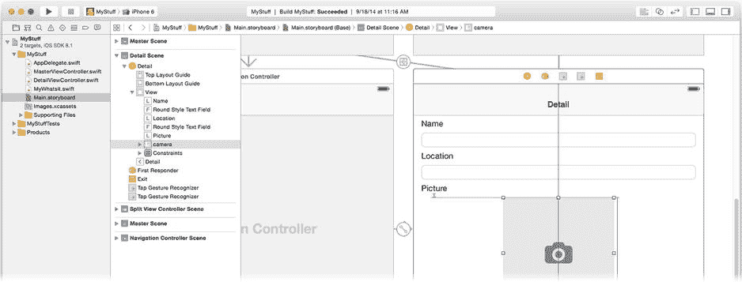
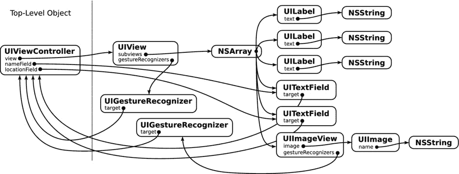
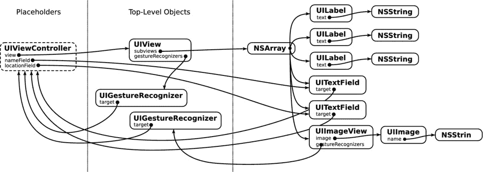
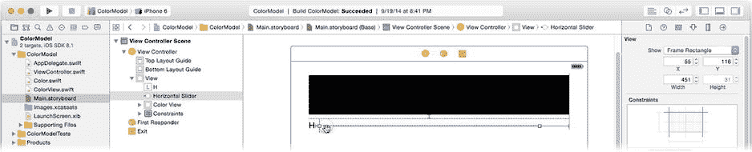
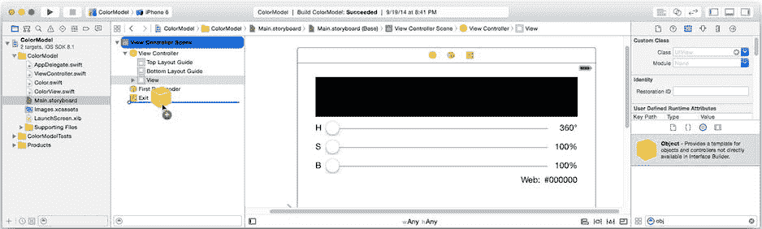
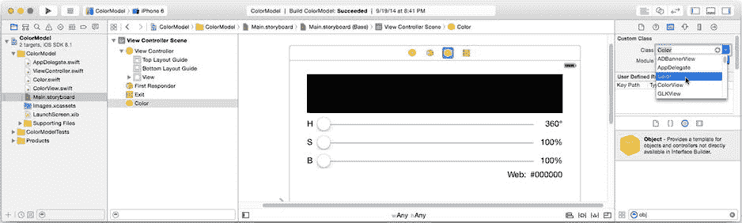
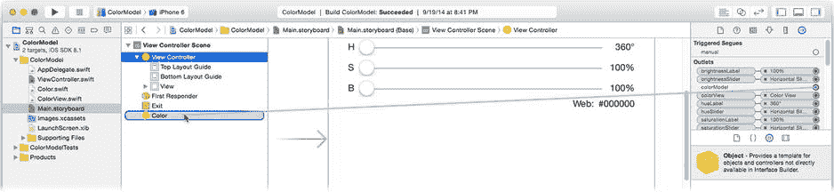
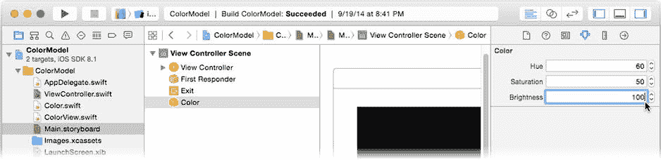
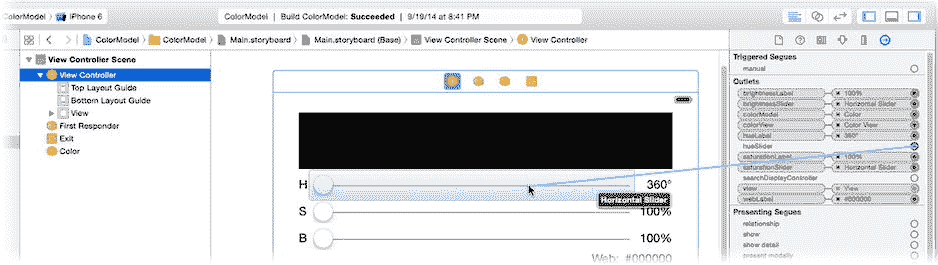

# 总结

这是值得庆祝的事情。毫无疑问，这是本书中最复杂、最困难的项目，而你使用了之前从未用过的技术完成了它。虽然 `SpriteKit` 与你之前使用过并将继续使用的视图类有许多相似之处，但很多方面却截然不同。场景设计使用专门的编辑器，你必须自行加载场景文件，动画机制也不同，更不用说还有像物理体和碰撞这样全新的概念。

凭借你已积累的势头，老实说，你可以轻松驾驭本书剩余的内容。后续章节将向你介绍更多 iOS 服务，例如地图，并且会有大量关于 Swift 的实用信息。但与你在此完成的任务相比，这些都会显得简单。

说到实用信息，下一章将重点介绍 Interface Builder——与其说是如何使用它，不如说是它如何工作的，如果你想成为 iOS 高级开发者，这一点至关重要。

## 练习

`SpaceSalad` 是一款很可爱的游戏，但操作有些生涩。也就是说，培养皿在拖拽时经常抖动。请花点时间尝试解决这个问题。

精灵的行为是所有物理体属性、几何形状以及作用于这些物理体的力的综合结果。你可以调整的属性不止一两个，每个属性都会对精灵的行为产生微妙——或并不微妙——的影响。

以下几点值得研究。玩家的拖拽位置与培养皿的拇指节点之间的“弹簧”关节具有 `damping`（阻尼）和 `frequency`（频率）属性。这些属性控制弹簧能量损失的速率以及振荡的快慢。这里的微小变化会显著影响相连节点的交互方式。物理体还有一个 `mass`（质量）属性，它是其 `area`（面积）和 `density`（密度）属性的综合结果。试着通过降低 `density`（密度）属性来让培养皿“更轻”。试着增加或减少蔬菜的阻力（`linearDamping`）。尝试调整这些属性及其他属性。如果你将蔬菜节点的 `restitution`（弹性）设置为 `0.0`，游戏玩法会发生什么变化？如果你为不同节点分配不同的弹性值，又会发生什么？这是一款游戏，尽情享受吧！

__________________

¹很遗憾，这纯粹是幻想。国际空间站上没有新鲜食物，因为担心细菌感染或其他生物侵扰。也许有一天他们能自己种植。

## 第 15 章

### 你若构建，它便成真……

Interface Builder 是 Xcode 的“秘制酱料”。它让复杂界面的创建变得毫不费力：将界面元素拖入画布，连接它们，点击按钮，它们就变成了你应用中的工作对象。这就像魔法一样。

*任何足够先进的技术都与魔法无异。*

——阿瑟·C·克拉克

“魔法”常被用来描述我们无法理解的事物。Interface Builder 有时也符合这个标准。它有效，而你只是不知道它是如何做到的。那么，走到幕后来，准备学习这些秘密吧。在本章中，你将学习以下内容：

*   了解 Interface Builder 文件究竟是什么
*   弄清 Interface Builder 文件中的对象如何变成应用中的对象
*   发现与 Interface Builder 功能等效的编程方式
*   理解占位对象是如何工作的
*   以编程方式加载你自己的 Interface Builder 文件
*   提供你自己的占位对象

你将以一种非常务实的方式学习 Interface Builder 的功能。我将向你展示实现你之前在故事板中所做操作的代码。相反地，你随后将把你之前编写的一些代码转换成一个 `.xib`（独立的 Interface Builder）文件。

### Interface Builder 文件的工作原理

Interface Builder 文件包含一个序列化的对象图。在第 14 章中，你已经初步了解了序列化的含义以及其中涉及的一些挑战。在第 18 章和第 19 章中，你将学习如何序列化对象以及如何创建可被序列化（归档）的对象。但目前，你只需知道，“序列化一个对象”意味着将其属性转换为一组可传输的字节数组，并最终逆转这个过程以恢复它们。

**注意** 我在这里仍然使用通用计算机工程意义上的术语 *序列化*。在 Cocoa Touch 的语言中，Interface Builder 文件是对象的 *归档*。加载一个 Interface Builder 文件包括 *解归档* 这些对象。

那么，什么是对象图？*对象图* 是由一个对象、该对象引用的所有对象、这些对象引用的所有对象，以此类推，所构成的一个集合。启动该图的一个对象或少数几个对象被称为 *根* 或 *顶级* 对象。

序列化始于根对象。该对象将其属性转换为序列化的字节数组。如果它的任何属性引用了其他对象，这些对象会被要求将其属性值序列化到同一个字节数组中，依此类推，直到整个图的所有对象和属性值都被转换完成。最终的字节数组描述了整个对象集合、它们的属性以及它们之间的关系。

### 编译 Interface Builder 文件

使用 Interface Builder 文件的步骤是：创建一个文件并将其添加到你的项目中。然后编辑它并构建你的应用。

但是，你在 Xcode 中编辑的 `.xib` 或 `.storyboard` 文件，最终并不会出现在你的应用包中。与你的源代码（`.swift`）文件一样，你的 Interface Builder 文件也会被编译。nib 编译器将你在 `.storyboard` 或 `.xib` 文件中的设计，转换为序列化的数据。当这些数据被解归档时，将创建具有你所描述的属性和连接的对象。这个经过编译的 nib 文件随后会作为资源文件被添加到你的应用包中。

**注意** 有些界面编辑器会将你的设计转换为源代码，等同于你绘制的内容，然后作为应用的一部分进行编译。这些工具被称为 *代码生成器*。Interface Builder 不是代码生成器。Interface Builder 是一个 *对象编译器*。

### 加载场景

当你的应用需要 Interface Builder 文件中存储的对象时，它会 *加载* 界面。图 15-1 显示了 `Main.storyboard` 文件的“详情视图”场景（来自第 7 章的 MyStuff）。图 15-2 显示了该场景中包含的对象图（简化版）。



图 15-1. Interface Builder 中的详情视图场景



图 15-2. 详情视图场景中的对象图

一个故事板场景至少包含一个顶级对象：视图控制器。视图控制器的 `view` 属性指向其唯一的根视图对象（`UIView`）。该根视图又包含一个子视图集合（由数组管理）。其中一些视图对象会引用其他对象，例如 `NSString`、`UIImage` 和 `UIGestureRecognizer` 对象。

`instantiateViewControllerWithIdentifer(_:)` 函数会触发视图控制器及其存储在故事板场景中的所有相关对象的重新创建（解归档）。当由 Storyboard Segue 触发时，该方法会自动调用；或者，正如你在 Wonderland 应用（第 12 章）中所做的那样，你可以在需要时以编程方式调用它来创建某个场景的视图控制器。


在解序列化（解归档）过程中，序列化数据中的属性值和连接关系被用于实例化新对象、设置其属性并将它们连接起来。

## 加载 `.xib` 文件

Storyboard 是设计 iOS 应用的现代方法。但 iOS 也允许你在独立的 `.xib` 文件中设计界面。视图控制器会自动加载 `.xib` 文件，或者你也可以通过编程方式加载 `.xib` 文件中的对象。当使用 `.xib` 文件时，对象之间的关系会略有不同。

再次参考 图 15-2。在 Storyboard 场景中，只有一个顶层对象（视图控制器），整个对象图通过解归档该单个对象来重建。如果这个界面存储在 `.xib` 文件中，其对象图会稍有不同，如 图 15-3 所示。



图 15-3。`.xib` 文件中的对象图

差异在于占位对象。*占位符*对象——其中最重要的是文件所有者——是在加载 Interface Builder 文件时已经存在的对象。在解归档过程中，你现有的对象会被替换为这些占位符。这些现有对象会成为对象图的一部分，但并非由 `.xib` 文件创建。占位符中的输出口可以设置为文件中创建的对象，而文件中的对象也可以连接到占位符。在 图 15-3 中，文件所有者（视图控制器）的 `view` 和 `nameField` 属性仍然指向 `UIView` 和 `UITextField` 对象。

需要理解的关键区别是：当从 Storyboard 场景加载视图控制器时，视图控制器及其所有连接的对象会一次性为你创建完成。而当使用 `.xib` 文件时，这是一个分两阶段的过程。首先是创建所有者对象（通常是视图控制器，但并非必须），通常通过编程方式创建。然后加载 `.xib` 文件。`.xib` 文件会创建所有其余对象，并将这些对象连接到已有的所有者对象上。

## 占位对象与文件所有者

当加载 Interface Builder 文件时，调用方会提供现有对象来替换文件中的占位符。最常见的场景是使用一个占位对象，称为*文件所有者*。它通常是加载该文件的对象；当一个视图控制器加载其 Interface Builder 文件时，它会声明自己为文件所有者。你可以提供你选择的任何对象，或者完全不提供，在这种情况下就没有占位对象。此外，你还可以根据需要提供任意数量的额外占位对象。（本章稍后你会加载一个包含多个占位符的 Interface Builder 文件。）可以将文件所有者视为“指定的占位符”，其设计目的是让使用单个占位对象加载 Interface Builder 文件这一常见任务尽可能简单。

需要记住的重要规则是：Interface Builder 文件中文件所有者的类*必须*与加载文件时所有者对象的类一致。你可以使用 Interface Builder 中的标识检查器设置文件所有者的类。当你设置这个类时，相当于做出一个承诺：在加载文件时，实际对象将属于该类（或其子类）。

将文件所有者的类从 `UIViewController` 改为 `UIApplication` 并不会神奇地让你的 Interface Builder 文件能够访问应用的 `UIApplication` 对象。这仅仅意味着 `UIViewController` 对象（文件的实际所有者）会被当作 `UIApplication` 对象来处理，这很可能会导致不良后果。

**警告**  当在 Interface Builder 中更改任何占位对象的类时，请确保将其设置为加载文件时提供的实际对象的类或其父类。

文件所有者的主要用途是获取对 Interface Builder 文件中创建的对象的访问权限。要访问这些对象中的任何一个，你必须获取对它们的引用。虽然可以获取对顶层对象的引用，但所有其他对象都必须间接访问，要么通过顶层对象的属性，要么通过文件所有者对象中设置的连接。在 图 15-3 所示的示例中，`UIView` 对象通过所有者对象的 `view` 属性变得可访问。如果没有占位对象的输出口，访问你刚刚创建的对象将会很麻烦（有时甚至是不可能的）。

当 Interface Builder 文件加载时，只有占位对象中在文件中连接了的那些输出口才会被设置。所有其他属性和输出口保持不变。

Interface Builder 文件中的对象只能与对象图中的其他对象或占位对象建立连接。例如，由视图控制器加载的对象不能直接连接到应用委托对象。该对象不在对象图中。唯一的例外是第一响应者。第一响应者是一个隐含的对象，它可以是响应者链中的任何对象。正如你在第 4 章中学到的，响应者链一直延伸到 `UIApplication` 对象。

现在你已经对 Interface Builder 文件中的对象如何创建有了初步了解，接下来让我们深入探讨对象如何被定义、如何相互连接，以及这对你的应用意味着什么。

## 创建对象

向 Interface Builder 文件添加对象等价于以编程方式创建该对象。这是一个需要理解的重要概念。从 Interface Builder 文件创建的对象并没有什么“特别之处”。你总是可以编写代码来实现相同的结果；这只不过是非常繁琐，而这正是 Interface Builder 最初被发明的原因。

在图 15-4 中，一个 `UISlider` 对象正在被添加到 Interface Builder 文件中。这借用于第 8 章的 ColorModel 项目。



图 15-4。向 Interface Builder 文件添加对象

该滑块将以 `((55,116),(506,147))` 的 frame 被创建，并且它是根 `UIView` 的子视图。等效的代码（在视图控制器中）如下所示：

```
let newSlider = UISlider(frame: CGRect(x: 55, y: 116, width: 451, height: 31))
view.addSubview(newSlider)
```

这段代码创建了一个具有所需尺寸的新 `UISlider` 对象，并将其添加到视图控制器的根视图对象中。在两种方法（Interface Builder 和编程方式）中，最终结果是相同的。

**注意**  Interface Builder 能识别一些特殊的对象关系，并为你创建这些关系。例如，当你将一个视图对象添加为子视图时，这相当于在父视图上调用 `addSubview(_:)`。如果你向工具栏添加栏按钮项，等效的函数是 `setItems(_:,animated:)`。将新的手势识别器拖放到视图中，等同于调用 `addGestureRecognizer(_:)`。添加约束等同于调用 `addConstraint(_:)` 或 `addConstraints(_:)`，依此类推。


在 Interface Builder 文件中创建 `UISlider` 对象的方式与通过代码创建的方式之间，仅存在一个技术性差异。当你编写代码创建视图对象时，你会使用它的 `init(frame:)` 初始化函数。而当对象被解档时——也就是 Interface Builder 文件中的对象被创建的方式——对象是通过其 `init(coder:)` 初始化函数创建的。`coder` 参数包含一个新对象所需的所有属性，包括它的 frame。你将在第 19 章中详细了解 `init(coder:)`。

## 编辑属性

但 frame 并不是 `UISlider` 对象的唯一属性。当你在 ColorModel 项目中创建滑块对象时，你使用了属性检查器来修改它的几个属性。你将其最大值范围改为 360，并勾选了“更新事件：连续”选项。这相当于编写了以下代码：

```
newSlider.maximumValue = 360.0
newSlider.continuous = true
```

再次说明，尽管这些属性值的设置方式存在细微差别，但最终生成的对象与 Interface Builder 文件创建的对象是无法区分的。

## 创建自定义对象

你也可以让 Interface Builder 创建你自定义的对象，并且你已经多次这样操作过。你首先需要将基类对象（比如 `UIViewController` 对象）添加到你的界面中，然后使用身份检查器将该对象的类更改为你想要创建的目标类。例如，在第 4 章中，你将 Touchy 项目中的根 `UIView` 改为一个 `TouchyView` 对象，该对象包含了你定义的所有方法、属性、动作和插座变量。

你可能没有注意到对象库中有一个不起眼的、名为“对象”的条目（请参见图 15-5）。没错，它就是一个对象。就其本身而言，它几乎毫无用处。但由于每一个对象本身都是一个对象，你可以将其拖放到你的设计中，然后使用身份检查器将其类更改为你想要的任何类型。



图 15-5. 添加一个对象

以第 8 章中的 ColorModel 项目为例。视图控制器创建了数据模型对象，并使用以下代码设置了其初始属性值：

```
var colorModel = Color()

...

colorModel.hue = 60.0
colorModel.saturation = 50.0
colorModel.brightness = 100.0
```

你可以使用 Interface Builder 实现相同的操作。首先，在你的设计中添加一个通用对象，如图 15-5 所示。你必须将对象拖放到大纲视图中，因为对象不是视图对象，无法添加到界面的可视化表示中。

添加对象后，选中它并使用身份检查器将其类更改为 `Color`，如 图 15-6 右侧所示。现在，当视图控制器场景加载时，storyboard 将会创建你的数据模型对象。



图 15-6. 更改通用对象的类

但该对象仍未连接到任何东西，也没有进行配置。Interface Builder 只能连接到插座变量和动作。修改 `ViewController.swift` 文件中的数据模型属性，使其成为一个插座变量，如下所示（修改的代码以粗体表示）：

```
@IBOutlet var colorModel: Color!
```

现在，你可以在 storyboard 文件中将视图控制器连接到它的数据模型对象，如图 15-7 所示。



图 15-7. 将视图控制器连接到数据模型

唯一缺少的是 `Color` 对象的属性。Interface Builder 也在此处为你提供了支持。打开 `Color.swift` 文件，并将 `@IBInspectable` 关键字添加到所有三个属性上，如下所示（新代码以粗体表示）：

```
@IBInspectable dynamic var hue: Float = 0.0
@IBInspectable dynamic var saturation: Float = 0.0
@IBInspectable dynamic var brightness: Float = 0.0
```

`@IBInspectable` 关键字使得属性可以在属性检查器中编辑。现在，这些属性可以直接在 Interface Builder 中设置，如图 15-8 所示。



图 15-8. 编辑自定义属性

Interface Builder 可以检查布尔值、整型、浮点型、字符串、点（`CGPoint`）、尺寸（`CGSize`）、矩形（`CGRect`）、范围（`NSRange`）和颜色（`UIColor`）属性。在撰写本文时，它无法编辑任何其他类型，最值得注意的是富文本字符串，也无法编辑枚举类型，即使是那些具有可编辑原始值的枚举类型也不行。理想情况下，后一个限制将来某天会改变。

`@IBInspectable` 并不仅限于对象对象。你可以将任何类的属性标记为可检查的，它就会出现在 Interface Builder 中，与你定义的动作、插座变量以及任何继承的属性并列显示。

这些简单的技术为开发带来了无限可能。你可以定义各种自定义对象，然后直接在 Interface Builder 中创建、连接和配置它们。

**提示** 你也可以设计自定义视图对象并将其显示在 Interface Builder 中。你可以通过在框架中创建自定义视图（请参见第 21 章）并使用 `@IBDesignable` 关键字来实现这一点。然后，Interface Builder 会加载该框架，并使用你的自定义显示代码来绘制视图——该视图将完全按照其在你的应用程序中显示的样子显示在 Interface Builder 画布上。请在 Xcode 文档中搜索使用 `@IBDesignable` 关键字的示例项目。

## 连接

你已经了解了 Interface Builder 文件中的对象及其属性是如何创建的，但连接呢？图 15-9 演示了将 `hueSlider` 插座变量连接到滑块对象的过程。



图 15-9. 在 Interface Builder 中连接插座变量

以下是等效的代码：

```
hueSlider = newSlider
```

而这次，当我说“等效”时，我的意思是“完全相同”。Interface Builder 文件中的对象是分阶段创建的。在第一阶段，所有对象被创建并设置其属性。在下一阶段，所有连接被建立。这些连接所使用的与你通过代码设置插座变量属性所用的方法相同。

### 建立动作连接

动作连接稍微复杂一些。一个动作连接包含两部分，也可能是三部分信息。

发送单个动作的对象（`UIGestureRecognizer`、`UIBarButtonItem` 等）通过设置两个属性来建立连接：`target` 和 `action`。`target` 属性是接收调用的对象（通常是控制器）。`action` 是选择器（`play:`、`pause:`、`someoneMashedAButton:`），用于确定调用哪个函数。某些对象（例如 `UIGestureRecognizer`）可以配置为向多个目标发送动作。你会使用如下代码以编程方式连接这些对象：

```
gestureRecognizer.addTarget(viewController, action:"changeColor:")
```

**注意** 在 Shapely 项目中，你是以编程方式创建手势识别器对象的，但在创建对象时设置了 `target` 和 `action`。这种方法同样有效。

要连接更多动作，请为每个动作再次调用 `addTarget(_:,action:)` 函数。要断开动作连接，请使用 `removeTarget(_:,action:)`。


