# 控制 Interface Builder 文件

既然你已经理解了 Interface Builder 文件是什么以及它们如何工作，你就可以轻松地向应用中添加新文件，并在需要时加载它们。这介于视图控制器完全自动使用 Interface Builder 文件与完全用代码创建视图对象这两种方式之间。在本节中，你将学习以下内容：

- 向项目中添加独立的 Interface Builder 文件
- 以编程方式加载 Interface Builder 文件
- 指定多个占位对象，供 Interface Builder 对象连接

在第 11 章中，你编写了 Shapely 应用。每次点击按钮，你都会创建一个新的 `ShapeView` 对象，对其进行配置，并附加一堆手势识别器——全程只使用 Swift。其中有多少代码可以用 Interface Builder 来完成？让我们一探究竟。

## 声明占位对象

从第 11 章中完成的 Shapely 项目开始，向项目中添加一个 Interface Builder 文件：将模板库中的 `View` 模板拖入导航器中，如图 15-10 所示。或者，你也可以选择“新建文件”命令，并从模板选择器中选取 `View` 模板。你可以在 iOS  用户界面组下找到它。将文件命名为 `SquareShape`。现在，你拥有一个独立的 Interface Builder 文件（`SquareShape.xib`），它创建了一个单一的 `UIView` 对象。

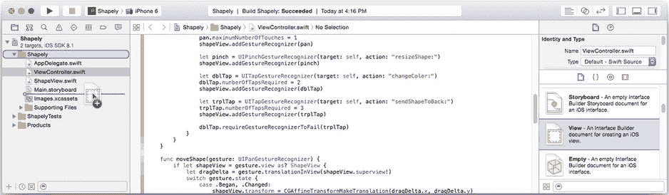

图 15-10. 添加一个新的 Interface Builder 文件

你的 `.xib` 文件需要一个所有者对象。与其使用现有对象，不如专门为此创建一个新对象。添加一个新的 Swift 类文件（从模板库中），并将其命名为 `ShapeFactory`。编辑该文件，使用以下代码为类创建一个存根：

```
import UIKit

class ShapeFactory: NSObject {
    @IBOutlet var view: ShapeView! = nil
    @IBOutlet var dblTapGesture: UITapGestureRecognizer! = nil
    @IBOutlet var trplTapGesture: UITapGestureRecognizer! = nil
}
```

`ShapeFactory` 类将成为该文件的所有者。这是你的第一个占位对象。要使用所有者对象，请在导航器中选择新的 `SquareShape.xib` 文件，然后在占位对象组中选择“文件的所有者”，并使用身份检查器将其类更改为 `ShapeFactory`，如图 15-11 所示。我还编辑了对象的标签，以便识别。

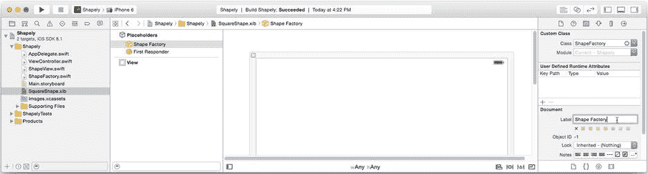

图 15-11. 设置文件所有者的类

你还需要将对象——特别是某些手势识别器——连接到你的视图控制器。为此，你需要第二个占位对象。从对象库中找到“外部对象”对象，并将其拖入大纲中，如图 15-12 左侧所示。*外部对象*是一个占位符，代表你将在加载 `.xib` 文件时提供的对象。

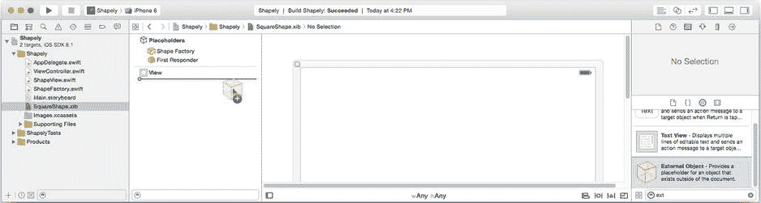

图 15-12. 添加一个外部对象占位符

选择它，并在身份检查器中将其类更改为 `ViewController`。在外部对象仍处于选中状态时，使用属性检查器为其分配一个标识符 `viewController`。额外的占位对象通过名称标识，因此你必须为每个对象分配一个唯一的标识符字符串。

现在，你拥有一个 `.xib` 文件，它可以创建一个 `UIView` 对象，并在加载时预期能够访问两个现有对象——一个 `ShapeFactory` 对象和一个 `ViewController` 对象。

具体计划如下：


1.  你将更改 `UIView` 对象的类，使其创建一个 `ShapeView` 对象。
2.  你将用所需的属性配置 `ShapeView` 对象。
3.  你将把形状视图连接到 `ShapeFactory` 的 `view` 输出口，以便工厂对象能够轻松访问新的视图对象。
4.  你将在 `.xib` 文件中设计四个手势识别器对象，将它们添加到 `ShapeView` 对象，并将其操作连接到视图控制器占位符。
5.  你将把其中两个手势识别器连接到形状工厂占位符，以便工厂对象能够执行一些无法在 Interface Builder 文件中完成的额外内务处理。

完成后的文件，概念上看起来将类似于 图 15-13 中的对象关系图。

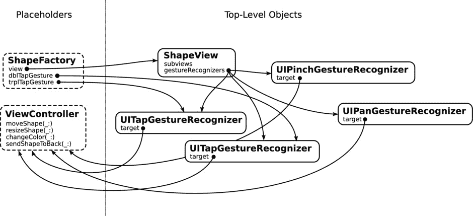

图 15-13. SquareShape.xib 对象关系图

## 设计 ShapeView

计划中的前两步是将 `.xib` 文件中当前的 `UIView` 对象转变为一个完全配置好的 `ShapeView` 对象。在 `SquareShape.xib` 文件中选择该单个视图对象，并使用标识检查器，将其类更改为 `ShapeView`。第一步完成。

切换到属性检查器。Xcode 实际上并不了解你将如何在 Interface Builder 文件中使用这些对象。默认情况下，它假定顶层视图对象将成为界面的根视图，因此它会将视图大小设置为 iPhone 或 iPad 屏幕的尺寸，并添加一个模拟的状态栏。对于 `ShapeView` 来说，情况并非如此，因此请关闭所有这些假设。将模拟尺寸更改为自由形式，并将状态栏更改为无，如 图 15-14 所示。现在使用属性和尺寸检查器设置以下属性：

*   将背景设置为默认（无）。
*   取消勾选不透明属性。
*   确保已勾选清除图形上下文。
*   将其尺寸设置为 100 x 100 点。

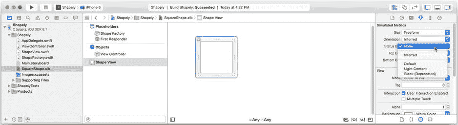

图 15-14. 设计 ShapeView 对象

至此，你已经复制了使用 `.xib` 文件创建新 `ShapeView` 对象的工作——唯一遗漏的是 `shape` 属性，稍后你将处理它。

选择 `ShapeView.swift` 文件，使用以下代码将 `shape` 属性从常量改为变量（新代码以粗体显示）：

```
var shape: ShapeSelector = .Square
```

这样做的原因是，你不会在对象创建时（在 `.xib` 文件中）设置它的形状，因此它必须是一个可变属性。仍在 `ShapeView.swift` 文件中，进行以下更改：

1.  删除 `initialSize` 和 `alternateHeight` 的定义。它们曾用于定义视图的初始尺寸，而现在该尺寸在 `.xib` 文件中声明。
2.  删除整个 `init(shape:,origin:)` 初始化函数。现在视图将完全在 `.xib` 文件中创建和配置。
3.  你也可以删除 `init(coder:)` 初始化函数。由于你的视图类不再有任何自定义初始化器，你也不需要声明这个初始化器。

看看你已经删除了多少代码？`init(shape:,origin:)` 初始化函数的全部目的就是创建和配置一个新的 `ShapeView` 对象。现在这些工作大部分都在你的新 Interface Builder 文件中完成了。

## 连接手势识别器

回到 `SquareShape.xib` 文件，现在是添加手势识别器的时候了。从对象库中，拖出一个平移手势识别器，并将其放入 Shape View 对象中，如 图 15-15 所示。选择该识别器对象，并使用属性检查器将其最小和最大触摸次数设置为 `1`。

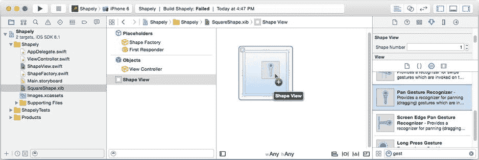

图 15-15. 添加平移手势识别器


切换到连接检查器，将其“已发送操作”（Sent Action）连接到视图控制器占位符中的`moveShape:`操作，如图 Figure 15-16 所示。

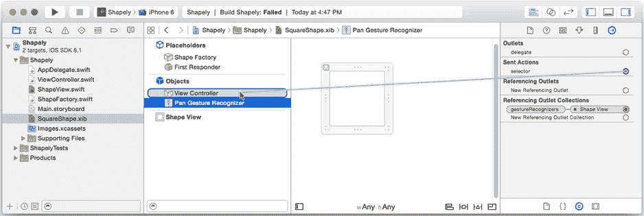

Figure 15-16. 连接平移手势识别器的操作

你现在已经创建了一个只能识别单指拖拽手势的平移手势识别器。它被附加到形状视图对象上，并在触发时向视图控制器发送`moveShape:`操作。生成的手势识别器对象与你在`ViewController`的`addShape(_:)`函数中创建、配置和连接的对象完全相同。

按如下方式添加其他三个手势识别器：

1.  将一个捏合手势识别器（Pinch Gesture Recognizer）拖入形状视图。
    1.  将其已发送操作连接到视图控制器的`resizeShape:`操作。
2.  将一个轻拍手势识别器（Tap Gesture Recognizer）拖入形状视图。
    1.  将其“轻拍次数”（Taps）设置为`2`。
    2.  将其“触摸点数”（Touches）设置为`1`。
    3.  将其已发送操作连接到`changeColor:`操作。
3.  将一个轻拍手势识别器拖入形状视图。
    1.  将其“轻拍次数”设置为`3`。
    2.  将其“触摸点数”设置为`1`。
    3.  将其已发送操作连接到`sendShapeToBack:`操作。

你在`addShape(_:)`函数中编写的大部分代码现在已通过 Interface Builder 复制。有两个步骤无法在 Interface Builder 中完成；你将稍后在代码中处理它们。

---

构建你的形状工厂（Shape Factory）

你的形状工厂对象定义了一些需要连接到形状视图和所选手势识别器的输出口（outlets）。选择`SquareShape.xib`文件，选择文件所有者（File’s Owner）（如果你重命名了它，则选择形状工厂），并使用连接检查器将`shapeView`、`dblTapGesture`和`trplTapGesture`输出口连接到各自的对象，如图 Figure 15-17 所示。保存文件。（说真的，通过选择 File  Save 来保存文件；这很重要。）

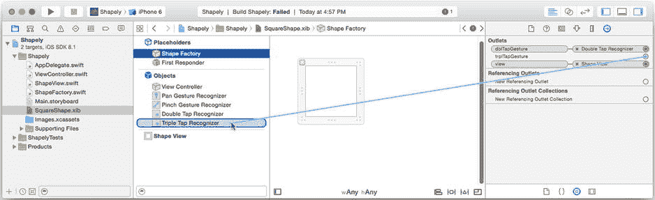

Figure 15-17. 连接工厂的输出口

**提示** 确保将正确的输出口连接到正确的对象，因为两个对象在轮廓中都以“轻拍手势识别器”（Tap Gesture Recognizer）出现。如果你有容易混淆的 Interface Builder 对象，请使用身份检查器（identity inspector）将对象的标签更改为更具描述性的名称。在 Figure 15-17 中，我将它们的标签更改为“双击…”（Double Tap…）和“三击…”（Triple Tap…），这样我就能区分它们了。对象标签是装饰性的，不会以任何方式改变你的 Interface Builder 设计的功能。

---

抱歉用了这个双关语——尚未解决的一个方面是正方形、长方形、圆形和椭圆形形状之间的差异。如果你还记得，`init(shape:,origin:)`会为长方形和椭圆形形状创建一个 100×50 点的视图，而为其他所有形状创建一个 100×100 点的视图。在这个版本中，你将使用两个 Interface Builder 文件来复制该逻辑。`ShapeFactory`将选择加载哪一个。

首先创建第二个 Interface Builder 文件。选择`SquareShape.xib`文件，然后选择 Edit  Duplicate 命令，如图 Figure 15-18 所示。

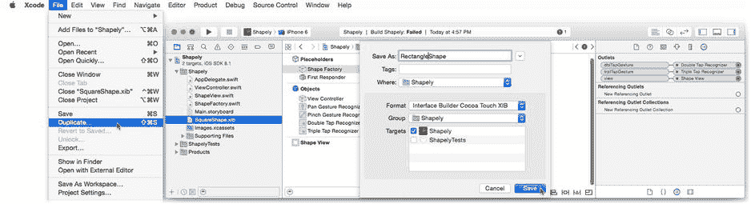

Figure 15-18. 创建`RectangleShape.xib`文件

将文件命名为`RectangleShape`。选择新文件，选择形状视图对象，并使用大小检查器（size inspector）将形状视图的高度更改为`50`。现在你有两个 Interface Builder 文件，一个生成 100×100 的视图，另一个创建 100×50 的视图。

现在切换到`ShapeFactory.swift`文件。添加一个类方法，该方法将根据给定的形状选择加载哪个 Interface Builder 文件（`SquareShape`或`RectangleShape`），如下所示：

```
class func nibNameForShape(shape: ShapeSelector) -> String {
    switch shape {
        case .Rectangle, .Oval:
            return "RectangleShape"
        default:
            return "SquareShape"
    }
}
```

---

加载一个 Interface Builder 文件

你现在已经准备好通过加载一个 Interface Builder 文件来创建你的形状视图和手势识别器对象。（是时候了！）添加`-loadShape:forViewController:`方法。

```
func load(# shape: ShapeSelector, inViewController viewController: UIViewController) 
                                                         -> ShapeView {
    let placeholders =  [ "viewController": viewController ]
    let options =  [ UINibExternalObjects: placeholders ]
    NSBundle.mainBundle().loadNibNamed( ShapeFactory.nibNameForShape(shape),
                                 owner: self,
                               options: options)
    assert(view != nil, "shape view not connected in xib file")
    view.shape =  shape
    dblTapGesture.requireGestureRecognizerToFail(trplTapGesture)
    return view!
}
```

前两个语句准备将视图控制器作为加载 Interface Builder 文件时的占位符对象。你可以根据需要传递任意数量的占位符对象；只需确保它们的类和标识符与你之前在 Interface Builder 文件中定义的外部对象一致。

第三个语句是神奇发生的地方。`loadNibNamed(_:,owner:,options:)`函数在你的应用包中搜索具有该名称的 Interface Builder 文件。名称（`SquareShape`或`RectangleShape`）由你之前添加的`nibNameForShape(_:)`函数确定。`owner`参数成为文件所有者占位符对象。`options`参数是一个特殊选项的字典。在本例中，唯一的特殊选项是额外的占位符对象（`UINibExternalObjects`）。

当调用`loadNibNamed(_:,owner:,options:)`时，所有者以及任何额外的占位符对象会取代文件的所有者以及文件中定义的相应外部对象。文件中的对象被创建，对象的属性根据你编辑的属性进行设置，最后所有的输出口和操作连接都被建立起来。

**提示** 如果你有需要在 Interface Builder 文件创建对象时执行的代码，请重写你对象的`awakeFromNib()`函数。当加载一个 Interface Builder 文件或场景时，它创建的每个对象都会收到一个`awakeFromNib()`调用。这发生在所有属性和连接都已设置之后。

该函数返回一个数组，其中包含文件中创建的所有顶级对象。你可以通过此数组或通过你连接到占位符的输出口来访问文件创建的对象。在这个应用中，你使用了后一种技术。

**注意** 创建`ShapeFactory`类的主要原因是为了提供一个所有者对象，该对象具有能方便地提供对你感兴趣的形状视图和识别器对象引用的输出口。另一种解决方案是让视图控制器成为文件的所有者，然后遍历返回的顶级对象数组以找到形状视图和识别器对象。

最后两个语句处理了无法在 Interface Builder 中完成的两个步骤。视图的`shape`属性被设置，并且双击/三击依赖关系被建立。

---

替换代码

切换到`ViewController.swift`文件。找到`addShape(_:)`函数，并将以编程方式创建新的`ShapeView`对象的代码替换为以下内容（修改过的代码以粗体显示）：

```
@IBAction func addShape(sender: AnyObject!) {
    if let button =  sender as? UIButton {
        if let shapeSelector =  ShapeSelector(rawValue: button.tag) {
            let shapeView = ShapeFactory().load(shape: shapeSelector,
                                     inViewController: self)
```


`ShapeFactory`是一个辅助类的例子。辅助类是一种对象，其唯一目的是协助其他对象完成某些任务。这些通常是不适合那些其他类的目的或职责的逻辑。

现在，进入有趣的部分。找到`addShape(_:)`中创建、配置并连接四个手势识别器的其余代码，并全部删除。你现在不再需要这些。所有四个手势识别器都已经通过 Interface Builder 文件创建、配置并连接到视图和视图控制器。

运行完成后的应用并观察结果。你应该无法区分这个版本的 Shapely 与第 11 章中的版本有何不同，这正是关键所在。这个练习虽然简单，但它演示了直接使用 Interface Builder 文件的所有关键方式，以及它们的优缺点。

- 在 Interface Builder 中，对象很容易创建、配置和连接。这减少了需要编写的代码量，节省了时间，并可能减少错误。（这是一个优点）。
- 某些属性和对象关系（例如双击/三击依赖关系）无法在 Interface Builder 中设置，必须通过编程方式实现。（这是一个缺点）。
- 可以轻松在多个 Interface Builder 文件之间选择。无需编写大量的`if`/`else`或`switch`语句，只需选择不同的 Interface Builder 文件即可创建完全不同的对象集。（这是一个优点）。
- 你受到 Interface Builder 支持的配置和初始化方法的限制。在 Shapely 中，你必须提供一个可设置的`shape`属性，以便在对象创建后“修复”它，因为你无法再使用`init(shape:,origin:)`函数。（这是一个缺点）。
- Interface Builder 使得创建复杂的对象集变得容易，尤其是手势识别器和布局约束这样的对象。通常需要数页密集且难以阅读的代码才能重现许多界面所需的布局约束。（这是一个巨大的优点）。
- 有时需要花费相当大的精力来获取在 Interface Builder 文件中创建的对象的引用。你可能需要创建特殊的占位符对象，或者费力地遍历`loadNibNamed(_:,owner:,options:)`返回的顶层对象。在本节中，你创建了一个类（`ShapeFactory`），其唯一目的是为形状视图和手势识别器的引用提供出口。（这有时是一个缺点）。

Interface Builder 文件并非适用于所有界面的最佳解决方案；有时，几行优秀的代码就足够了。但在许多情况下，Interface Builder 可以让你免于编写、维护和调试（字面意义上的）数千行代码。它是一个极其灵活且高效的工具，可以让你免去数小时的工作，并提高应用的质量。你只需要知道它如何工作以及如何让它为你工作。

**总结**

Interface Builder 是 Xcode 的基石之一，也是 iOS 应用开发如此流畅的原因。直接加载 Interface Builder 文件正是 Interface Builder 真正灵活性的体现。现在，你知道如何定义几乎任何界面、界面的一个片段，或仅仅是一些任意对象，将它们放在 Interface Builder 文件中，并在需要时加载。你知道如何创建任何你喜欢的对象，设置其自定义属性，并将其与应用中的现有对象连接起来。这是一个触手可及的极其有用的工具。

**第 16 章 具有姿态的应用**

在一项会让 Wayne Szalinski¹感到自豪的微型化壮举中，大多数 iOS 设备配备了一系列传感器，用于检测加速度、旋转和磁方向——这有很多“率”。这些传感器的组合输出，加上一些数学运算，会以惊人的精度告诉你的应用设备持有的姿态、是否在移动或旋转（以及速度）、重力方向以及磁北方向。你可以将其整合到应用中，赋予其一种不可思议的直接感。你可以根据用户手持设备的方向呈现信息，通过物理手势控制游戏，告诉他们即将拍摄的照片是否水平，以及更多。

在第 4 章中，你使用了高级的“设备摇晃”和“方向改变”事件来触发 EightBall 应用中的动画。在本章中，你将直接接入低级的加速度计信息，并对设备位置的瞬时变化做出反应。在本章中，你将学习以下内容：

- 收集加速度计和其他设备运动数据
- 使用定时器

你还将获得更多在自定义视图对象中使用仿射变换的实践，并利用 iOS 7 中新增的一些花哨动画功能。让我们开始吧。

**注意** 你需要一个已配置的 iOS 设备来测试本章中的代码。iOS 模拟器不模拟加速度计数据。

**水平仪**

你要创建的应用是一个简单的数字水平仪，称为 Leveler。² 它是一个单屏应用，显示一个刻度盘，指示设备的倾斜度（与假想铅垂线的角度），如图 16-1 所示。

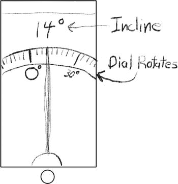

*图 16-1. Leveler 设计*

**创建 Leveler**

创建一个新的 Xcode 项目，步骤如下：

1. 使用单视图应用模板。
2. 将产品名称设置为`Leveler`。
3. 将语言设置为 Swift。
4. 将设备设置为通用（Universal）。
5. 创建项目后，编辑支持的界面方向以支持所有设备方向。

Leveler 需要一些图像和源代码资源。你可以在`Learn iOS Development Projects`  `Ch 16`  `Leveler (Resources)`文件夹中找到图像文件。将`hand.png`和`hand@2x.png`文件添加到`Images.xcassets`图像目录中。在完成的`Leveler-1`项目文件夹中，找到`DialView.swift`文件。也将其添加到你的项目中，放在其他源文件旁边。记得在导入对话框中选中“将项目复制到目标组的文件夹中”选项。你还会在`Leveler (Icons)`文件夹中找到一组应用图标，可以将其拖入图像目录的`AppIcon`组。

在开始编写收集加速度计数据的代码之前，你将首先布局并连接显示倾斜度的视图。

**思考 DialView**

你刚刚添加的源文件包含一个自定义`UIView`对象的代码，该对象绘制一个圆形“刻度盘”。阅读第 11 章后，你应该不难理解它是如何工作的。最有趣的方面是在图形上下文中使用仿射变换。在第 11 章中，你将仿射变换应用于视图对象，使其看起来相对于实际框架发生了偏移或缩放。在`DialView`中，在绘制之前，将仿射变换应用于图形上下文。之后绘制的任何内容都会使用该变换进行平移。

在`DialView`中，这种技术用于在“刻度盘”内部绘制刻度线和角度标签。如果你感兴趣，可以在`DialView.swift`中找到`drawRect(_:)`函数。关键的代码部分已用粗体标出。分散注意力的代码已用省略号替换。


```markdown

```
let circleDegrees = 360
let minorTickDegrees = 3
...

override func drawRect(rect: CGRect) {
    let context = UIGraphicsGetCurrentContext()
    let bounds = self.bounds
    let radius = bounds.height/2.0
    ...
    CGContextTranslateCTM(context,radius,radius)
    let tickAngle = CGFloat(minorTickDegrees)*CGFloat(M_PI/180.0)
    let rotation = CGAffineTransformMakeRotation(tickAngle)
    for var angle = 0; angle < circleDegrees; angle += minorTickDegrees {
        ... draw one vertical tick and label ...
        CGContextConcatCTM(context,rotation);
    }
}
```

`drawRect(_:)`函数首先对上下文应用平移变换。这会偏移绘图坐标，有效地将视图本地坐标系的原点移动到视图的中心（视图始终是正方形，稍后你会看到）。应用此变换后，如果你在`(0,0)`绘制形状，它将绘制在视图中心，而不是左上角。

循环绘制一个垂直刻度线及其下方的可选文本标签。在循环结束时，上下文的绘图坐标旋转 3°。第二次循环时，刻度线和标签将旋转 3°。第三次循环时，所有绘图将旋转 6°，依此类推，直到整个表盘绘制完成。上下文变换是累积的。

要理解的关键概念是，应用于 Core Graphics 上下文的变换会影响绘制到视图中的内容的坐标系，如图 Figure 16-2 所示。上下文变换不会改变视图的`frame`、`bounds`或其在其父视图中的位置。

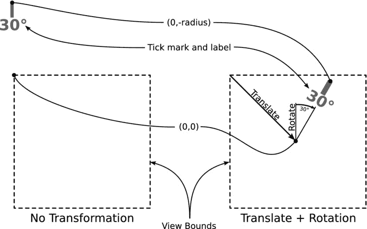

Figure 16-2. 图形上下文变换

要更改视图在其父视图中的显示方式，可以设置视图的`transform`属性，就像在 Shapely 应用中所做的那样。这正是视图控制器稍后将要做的事情——旋转屏幕上的表盘。这凸显了在绘图时使用仿射变换与使用变换来改变最终视图外观之间的区别。

还要注意，视图只绘制一次。`drawRect(_:)`中所有这些复杂的代码仅在视图首次绘制或调整大小时执行。一旦视图绘制完成，表盘的缓存图像就会显示在屏幕上，并由视图的`transform`属性旋转。这种第二次使用变换只是转录缓存图像中的像素；它不会导致视图以新角度重新绘制。在这方面，绘图是高效的。这一点很重要，因为稍后你将对其进行动画处理。

## 创建视图

你将向故事板文件添加一个标签对象，然后在`ViewController`中编写代码，以编程方式创建`DialView`和显示表盘“指针”的图像视图。从`Main.storyboard`文件开始。

将一个标签对象拖入界面。使用属性检查器，更改以下内容：

*   *文本*: 360°（按 Option+Shift+8 输入度数符号）
*   *颜色*: 白色
*   *字体*: System 90.0
*   *对齐*: 居中

选择标签对象，然后选择 Editor  Size to Fit Content。选择根视图对象，并将其背景颜色更改为黑色。此时，你的界面应类似于 Figure 16-3 所示。

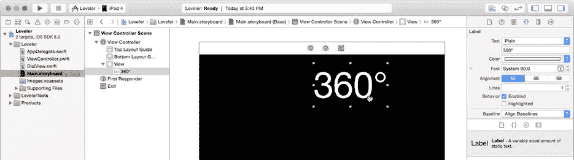

Figure 16-3. 向界面添加角度标签

选择标签并点击固定约束控件。添加一个顶部约束并将其值设为 0，如 Figure 16-4 左侧所示。点击对齐约束控件。添加一个容器中的水平居中约束，如 Figure 16-4 右侧所示，并确保其值也为 0。

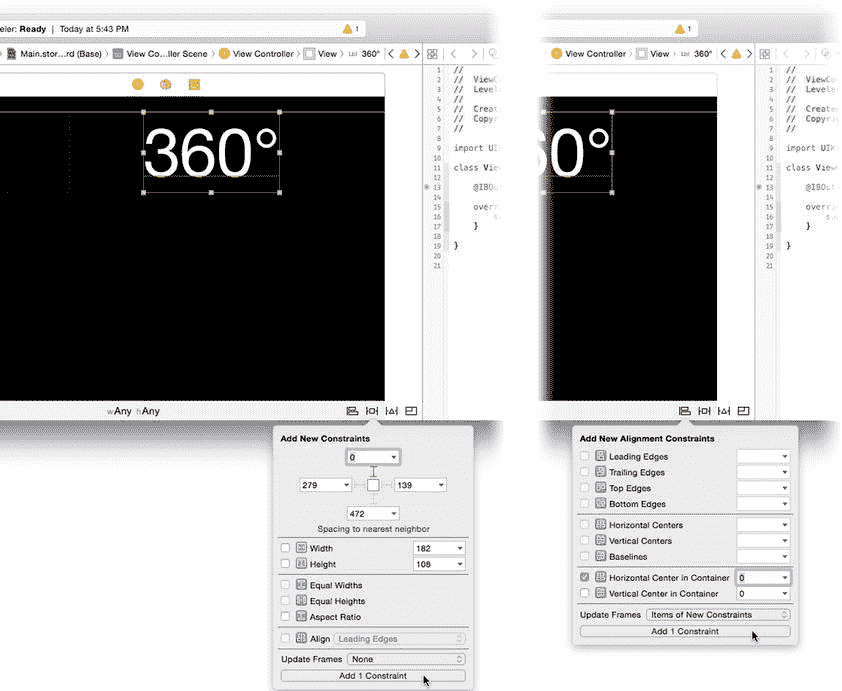

Figure 16-4. 添加标签约束

**注意**：注意没有为标签视图设置高度、宽度、左、右或底部的约束，但 Interface Builder 对布局完全满意。这是因为像`UILabel`这样的视图具有*固有大小*。对于标签来说，它就是标签中文本的大小。在没有确定视图大小（高度和宽度）的约束时，iOS 会使用其固有大小，这足以确定其`frame`。

切换到助理编辑器。编辑窗格将分割，`ViewController.swift`文件将出现在右侧窗格中。向`ViewController`类添加此输出口属性：

```
@IBOutlet var angleLabel: UILabel!
```

将输出口连接到界面中的标签视图，如 Figure 16-5 所示。

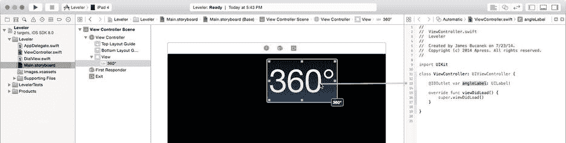

Figure 16-5. 连接角度标签输出口

你将通过编程方式创建并定位其他两个视图。切换回标准编辑器并选择`ViewController.swift`文件。你需要图像资源文件的名称和一些实例变量来保持对表盘和图像视图对象的引用。首先将这些添加到`ViewController`类的开头（新代码以粗体显示）：

```
class ViewController: UIViewController {
    let handImageName = "hand"
    @IBOutlet var angleLabel: UILabel!
    var dialView: DialView!
    var needleView: UIImageView!
```

当视图控制器加载其视图时创建这两个视图。由于这是应用中唯一的视图控制器，这只会发生一次。找到`viewDidLoad()`函数并添加以下粗体代码：

```
override func viewDidLoad() {
    super.viewDidLoad()
    dialView = DialView(frame: CGRect(x: 0, y: 0, width: 100, height: 100))
    view.addSubview(dialView)
    needleView = UIImageView(image: UIImage(named: handImageName))
    needleView.contentMode = .ScaleAspectFit
    view.insertSubview(needleView, aboveSubview: dialView)
    adaptInterface()
}
```

当视图加载时，附加代码会创建新的`DialView`和`UIImageView`对象，并将两者添加到视图中。注意`needleView`被刻意放置在`dialView`前面。

这里没有尝试调整或定位这些视图的位置。这发生在视图显示或旋转时。通过添加以下两个函数来捕获这些事件：

```
override func viewWillAppear(animated: Bool) {
    super.viewWillAppear(animated)
    positionDialViews()
}

override func viewWillTransitionToSize(size: CGSize, 
            withTransitionCoordinator coordinator: 
            UIViewControllerTransitionCoordinator) {
    coordinator.animateAlongsideTransition( {
        (context) in self.positionDialViews()
        },
        completion: nil )
}
```

在视图首次显示之前，调用`positionDialViews()`来定位`dialView`和`needleView`对象。每当视图控制器更改大小时，都会调用第二个函数。对于像 Leveler 这样的单一视图应用，这仅会在设备旋转时发生。在此函数中，再次调用`positionDialViews()`以动画过渡到新的大小。这是因为你作为第一个参数传递的闭包块作为基于块的动画执行。正如你在第 11 章中所知，在动画块中你需要做的就是设置你想要动画的视图属性——这正是`positionDialViews()`所做的。

你还需要为 iPhone 版本添加此函数：

```
override func supportedInterfaceOrientations() -> Int {
    return Int(UIInterfaceOrientationMask.All.rawValue)
}
```

```


在编辑应用支持的屏幕方向时，请记住（来自第 14 章），每个视图控制器决定了它支持哪些方向。默认情况下，iPhone 的`UIViewController`不支持倒置方向。以下代码覆盖了该设置，以允许所有方向。

最后，你需要`adaptInterface()`（见代码清单 16-1）和`positionDialViews()`（见代码清单 16-2）的代码。

***代码清单 16-1***. `adaptInterface()`

```
func adaptInterface() {
    if let label = angleLabel {
        var fontSize: CGFloat = 90.0
        if traitCollection.horizontalSizeClass == .Compact {
            fontSize = 60.0
        }
        label.font = UIFont.systemFontOfSize(fontSize)
    }
}
```

你的`adaptInterface()`函数会检查`horizontalSizeClass`，并根据设备类型调整角度标签的字体大小：对于紧凑型设备（iPhone、iPod）设为 60.0 点，对于大屏幕界面（iPad）保留 90.0 点。`horizontalSizeClass`在旋转过程中不会改变，因此`adaptInterface()`只需在`viewDidLoad()`中调用一次。如果`adaptInterface()`做了其他调整，或者苹果发布了新设备，其`horizontalSizeClass`可能在应用运行时发生变化，那么你需要从`viewWillTransitionToTraitCollection(...)`中调用它。

***代码清单 16-2***. `positionDialViews()`

```
func positionDialViews() {
    let viewBounds = view.bounds
    let labelFrame = angleLabel.frame
    let topEdge = ceil(labelFrame.maxY+labelFrame.height/3.0)
    let dialRadius = viewBounds.maxY-topEdge
    let dialHeight = dialRadius*2.0
    dialView.transform = CGAffineTransformIdentity
    dialView.frame = CGRect(x: 0.0,
                            y: 0.0,
                        width: dialHeight,
                       height: dialHeight)
    dialView.center = CGPoint(x: viewBounds.midX,
                              y: viewBounds.maxY)
    dialView.setNeedsDisplay()

let needleSize = needleView.image.size
    let needleScale = dialRadius/needleSize.height
    var needleFrame = CGRect(x: 0.0,
        y: 0.0,
        width: needleSize.width*needleScale,
        height: needleSize.height*needleScale)
    needleFrame.origin.x = viewBounds.midX-needleFrame.width/2.0
    needleFrame.origin.y = viewBounds.maxY-needleFrame.height
    needleView.frame = CGRectIntegral(needleFrame)
}
```

`positionDialViews()`看起来代码很多，但它所做的只是将`dialView`设置为正方形，将其中心定位在视图底部中央，并调整其大小使其顶部边缘紧贴标签视图的底部边缘。然后`needleView`被定位在中心，锚定到底部边缘，并按比例缩放，使其高度等于表盘的可见高度。这用文字描述比直观看到要困难得多，所以运行应用，看看图 16-6 中的效果。

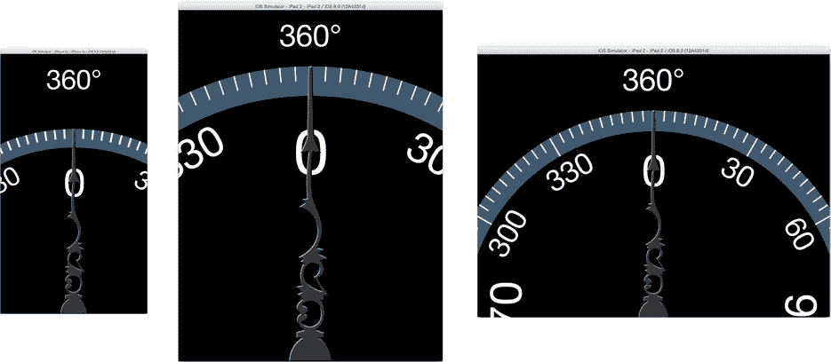

图 16-6. 表盘与指针视图的定位

这基本上完成了所有视图设计和布局。现在你需要获取加速度计信息，让你的应用动起来。

## 获取运动数据

所有 iOS 设备（截至撰写本文时）都配备了加速度计硬件。加速度计感应沿三个轴（x、y 和 z）的加速度力。如果你面对竖屏方向的 iPhone 或 iPad 屏幕，x 轴是水平的，y 轴是垂直的，z 轴是从你出发，穿过设备中部，垂直于屏幕表面的线，如图 16-7 所示。

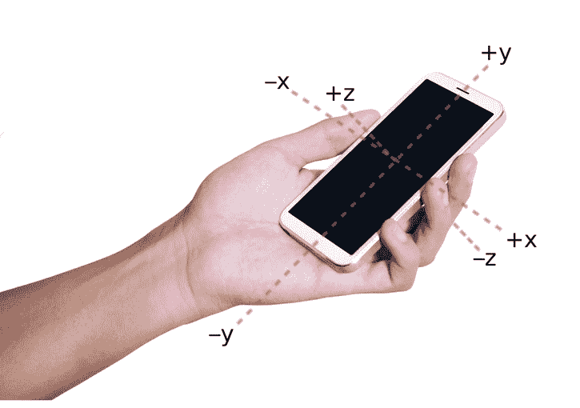

图 16-7. 加速度计轴的方向

你可以使用加速度计信息来确定设备何时改变速度以及方向。假设设备没有（明显）加速，你还可以利用这些信息推断重力的方向，因为重力对静止物体施加恒定的力。iOS 正是利用这些信息来判断你何时将 iPad 侧翻或摇晃 iPhone。

除了加速度计，最近的 iOS 设备还包括陀螺仪和磁力计。前者检测围绕三个轴（俯仰、横滚、偏航）的旋转变化，后者检测磁场方向。在没有磁干扰的情况下，这将告诉你设备相对于磁北的姿态（通俗地说，就是它有一个指南针）。

你的应用通过一个单一的看门人类`CMMotionManager`来获取所有这些信息。`CMMotionManager`类收集、解释并向你的应用传递运动和姿态信息。你告诉它你想要什么类型的信息（加速度计、陀螺仪、指南针）、更新频率以及如何将更新传递给应用。你的 Leveler 应用将仅使用加速度计信息，但通用模式对所有类型的运动数据都是一样的：

1. 创建`CMMotionManager`的实例。
2. 设置更新频率。
3. 选择你想要的信息以及应用获取它的方式（拉取或推送）。
4. 准备就绪后，启动信息传递。
5. 处理运动数据。
6. 完成后，停止信息传递。

没有比第一步更好的开始了。

### 创建`CMMotionManager`

`CoreMotion`不属于标准`UIKit`框架。在`ViewController.swift`文件的开头，引入`CoreMotion`框架的定义（新代码以粗体显示）：

```
import UIKit
import CoreMotion
```

你需要一个变量来存储`CMMotionManager`对象，以及一个常量来指定运动数据更新的速度。将两者添加到你的`ViewController`类中：

```
lazy var motionManager = CMMotionManager()
let accelerometerPollingInterval: NSTimeInterval = 1.0/15.0
```

`motionManager`变量会自动初始化为一个`CMMotionManager`对象。注意该属性是`lazy`的。Swift 中的惰性属性会自动初始化，但并非在创建`ViewController`对象时初始化，而是等到有人首次请求该值时才初始化。这将`CMMotionManager`对象的构造推迟到真正需要的时候。

你已经完成了使用运动数据的第一步——一个新的`CMMotionManager`对象将被创建并存储在`motionManager`属性中。

**注意**  不要创建`CMMotionManager`的多个实例。如果你的应用有两个或更多控制器需要运动数据，它们必须共享一个`CMMotionManager`实例。建议在你的应用委托中创建一个返回单例`CMMotionManager`对象的属性，该对象随后可以与任何其他需要它的对象共享。

现在执行使用运动数据的第二步。找到`viewWillAppear()`函数，并在其末尾添加以下代码：

```
motionManager.accelerometerUpdateInterval = accelerometerPollingInterval
```

这条语句告诉管理器测量之间的等待时间。该属性以秒为单位。对于大多数应用，每秒 10 到 30 次就足够了，但极端应用可能需要每秒 100 次更新。对于这个应用，你将`accelerometerUpdateInterval`属性设置为 1/15 秒，从每秒 15 次更新开始。

### 启动和停止更新

为了执行获取运动数据的第三步和第四步，回到`viewWillAppear()`函数，并在其末尾添加以下语句：

```
motionManager.startAccelerometerUpdates()
```


在创建并配置运动管理器后，你需要让它开始收集加速计数据。在启动更新流程之前，`CMMotionManager` 报告的加速计信息既不准确，甚至不会变化。一旦启动，运动管理器代码便会在后台持续运行，监控加速度的任何变化，并向你的应用报告这些变化。

**提示** 为了节省电池电量，你的应用*只应*在需要时向运动管理器请求更新。对于本应用，运动事件在整个应用生命周期内都会使用，因此没有代码来停止它们。然而，如果你添加了第二个不使用加速计的视图控制器，则需要添加代码到 `viewWillDisappear()` 中来调用 `stopAccelerometerUpdates()`。

## 推与拉

看起来你可能没有完成获取运动数据的第三步，但实际上你做到了。当你调用 `startAccelerometerUpdates()` 函数时，这一步就已经隐含完成了。此函数开始收集运动数据，但需要你的应用定期询问这些数值。这被称为*拉取*方式；`CMMotionManager` 对象会持续更新运动数据，而你的应用则按需从中拉取数据。

另一种方式是*推送*方式。要使用这种方式，请调用 `startAccelerometerUpdatesToQueue(_:,withHandler:)` 函数。你需要向其传递一个操作队列和一个闭包，该闭包会在运动数据更新时立即执行。这种方式实现起来复杂得多，因为闭包代码在单独的线程上执行，因此所有运动数据处理代码都必须是线程安全的。只有当你的应用必须绝对、立刻处理运动数据的*那一瞬间*，你才真正需要这种方式。属于这一类的应用很少。

## 时机就是一切

现在你可能在想，你的应用是如何“定期”拉取它感兴趣的运动数据的。运动管理器不会发布任何通知，也不会向你的对象发送任何委托消息。你需要的是一个能在固定时间间隔提醒你的应用执行某个操作的对象。它被称为*定时器*，而 iOS 正好提供了它。在 `viewWillAppear()` 函数的末尾，添加以下语句：

```
NSTimer.scheduledTimerWithTimeInterval( accelerometerPollingInterval,
                                target: self,
                              selector: "updateAccelerometerTime:",
                              userInfo: nil,
                               repeats: true)
```

一个 `NSTimer` 对象为你的应用提供了一个定时器。它是我在第 4 章中提到但一直没有机会详谈的事件源之一。

**注意** 创建一个可工作的定时器分为两步：你必须先创建定时器对象，然后将其添加到运行循环中。`scheduledTimerWithTimeInterval(_:,target:,selector:,userInfo:,repeats:)` 函数会同时为你完成这两步。如果你直接创建定时器对象，则必须在线程的运行循环对象上调用 `addTimer(_:,forMode:)` 函数，定时器才能生效。

定时器有两种类型：单次触发或重复触发。定时器具有一个 `timeInterval` 属性和一个将在对象上调用的函数。当 `timeInterval` 属性指定的一段时间过去后，定时器就会*触发*。在接下来合适的机会，事件循环会调用目标对象的函数。如果是单次触发定时器，这就结束了；定时器变为无效并停止。如果是重复触发定时器，它会继续运行，等待另一个 `timeInterval` 时间过去后再次触发。重复触发定时器会持续触发，直到你调用其 `invalidate()` 函数。

**警告** 不要使用定时器来轮询事件（例如等待网页加载完成），这些事件本可以通过事件消息、委托函数、通知或代码块来确定。定时器应仅用于与时间相关的事件和定期更新。如果你想知道原因，请重新阅读第 4 章的开头部分。

你添加到 `viewWillAppear()` 中的代码创建并安排了一个定时器，该定时器大约每秒调用你的视图控制器对象的 `updateAccelerometerTime(_:)` 函数 15 次。这与运动管理器更新其加速计信息的频率相同。检测更新的速度比 `CMMotionManager` 对象收集数据的速度更快或更慢都是没有意义的。

一切就绪，只差 `updateAccelerometerTime(_:)` 和 `rotateDialView(_:)` 函数。仍在 `ViewController.swift` 中，添加第一个函数。

```
func updateAccelerometerTime(timer: NSTimer) {
    if let data = motionManager.accelerometerData {
        let acceleration = data.acceleration
        let rotation = atan2(-acceleration.x,-acceleration.y)
        rotateDialView(rotation)
    }
}
```

第一条语句获取运动管理器的 `accelerometerData` 属性。由于你只开始收集加速计信息，这是唯一有效的运动数据属性。该属性是一个 `CMAccelerometerData` 对象，而该对象只有一个属性：`acceleration`。`acceleration` 属性包含三个数值：`x`、`y` 和 `z`。每个值都是沿该轴施加的瞬时力，以 G 值测量。³ 假设设备没有移动，这些测量值可以组合起来确定*重力矢量*；换句话说，你可以判断出哪个方向是向下。

你的应用不需要全部三个数值。你只需要确定 x-y 平面上哪个方向是向上，因为表盘就在这个平面上。忽略沿 z 轴的力，反正切函数计算的是 x-y 平面上重力矢量的角度。结果用于将 `dialView` 旋转相同的角度。很简单，不是吗？

**注意** 你可能会质疑为什么反正切函数被赋予了 x 和 y 的负值。这是因为表盘指向向上，而不是向下。翻转力的方向值计算的是*远离*重力的角度。

通过编写 `rotateDialView(_:)` 函数来完成应用：

```
func rotateDialView(rotation: Double) {
    dialView.transform = CGAffineTransformMakeRotation(CGFloat(rotation))

var degrees = Int(round(-rotation*180.0/M_PI))
    if degrees < 0 {
        degrees += 360
    }
    angleLabel.text = "\(degrees)°"
}
```

函数中的第一条语句将 `rotation` 参数转换为一个仿射变换，用于旋转 `dialView`。其余代码将 `rotation` 值从弧度转换为度，确保它不是负数，并用它来更新标签视图。

现在是时候插入你已配置的 iOS 设备，运行你的应用，并体验效果了，如图 16-8 所示。注意当你旋转设备时，应用是如何切换方向的。如果你锁定了设备的方向，它就不会切换，但表盘仍然可以工作。

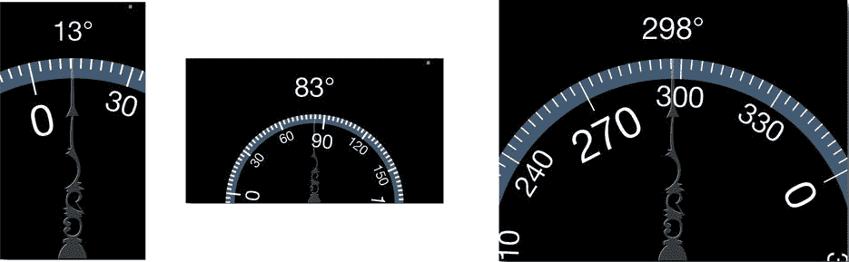

图 16-8. 工作中的水平仪应用

## 抖动的烦恼

你的应用能工作了，而且编写起来相当简单，但天哪，它看起来真费劲。如果它在我设备上的运行方式和这里描述的一样，那么表盘会不断抖动。除非设备完全静止，否则几乎无法读数。

如果表盘能够更平滑地移动——非常平滑——那就太好了。这听起来像是动画的任务。你需要的是一种动画，让表盘看起来具有质量，平滑地趋向于硬件报告的瞬时倾斜角度。


