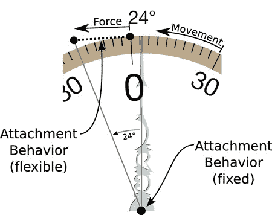

# 排版后的文本

这听起来很像你在第 14 章中使用的 Sprite Kit 物理实体。遗憾的是，Sprite Kit 的物理模拟仅适用于`SKNode`对象。要使用 Sprite Kit，你必须围绕`SKView`重新设计整个视图，然后使用`SKNode`重新创建指针、刻度盘和标签。而`SKNode`不会自行绘制，因此你还必须重写`drawRect(_:)`函数，将内容绘制到屏幕外图像中，再将其提供给`SKSpriteNode`。想想看，你倒不如创建一个新项目，从头开始。

另一种方法是通过限制视图旋转的速率来自己平滑更新。为了让效果更美观，你甚至可能进一步添加一些计算，为刻度盘模拟质量、加速度、阻力等属性。但正如我在第 11 章中提到的，自行实现动画的方法充满复杂性，通常工作量很大，而且往往效果不佳。

别慌！iOS 提供了一种解决方案，能让你在已有的工作基础上继续构建。它被称为“视图动力学”（View Dynamics），是一个专为`UIVIew`对象设计的物理引擎。它比 Sprite Kit 中的物理模拟器更简单，但这正是设计意图所在。与 Core Animation 一样，它的目标是让为`UIView`对象添加简单的物理行为变得容易——而不是用来创建小行星游戏。

与 Sprite Kit 类似，你通过描述作用在视图上的“力”来使用视图动力学，然后让动态动画师（dynamic animator）创建一个模拟视图对这些力产生反应的动画。与 Sprite Kit 不同的是，这些属性并非`UIView`的一部分。相反，你要创建一组*行为*（behavior）对象，并将它们附加到你想动画化的视图上。让我们开始吧。

## 使用动态动画

动态动画涉及三个角色。

* 动态动画师对象
* 一个或多个行为对象
* 一个或多个视图对象

*动态动画师*是执行动画的对象。它包含一个非常智能的复杂物理引擎。你需要创建一个动态动画师的单一实例。

当你创建行为对象并将它们添加到动态动画师时，动画就会发生。一个*行为*描述了对视图的单一驱动力或属性。iOS 内置了重力、加速度、摩擦力、碰撞、连接等预定义行为，你也可以自由发明自己的行为。一个行为与一个或多个视图（`UIView`）对象相关联，将该特定行为赋予其所有视图。动态动画师负责将单个视图的多个行为（例如加速度加重力加摩擦力）组合起来，以决定该视图将如何反应。

因此，动态动画的基本公式如下：

1. 创建一个`UIDynamicAnimator`实例。
2. 创建一个或多个`UIDynamicBehavior`对象，并附加到`UIView`对象上。
3. 将`UIDynamicBehavior`对象添加到`UIDynamicAnimator`中。
4. 坐下来欣赏效果。

现在，你已经准备好为“水平仪”应用添加视图动力学了。

## 创建动态动画师

你需要创建一个动态动画师对象，并且需要一个实例变量来保存它，因此在你的`ViewController`类中添加一个动画师的实例变量。趁现在，再添加一些常量和变量来容纳一个附着行为，所有这些稍后都会解释。

```
var animator: UIDynamicAnimator!
let springAnchorDistance: CGFloat = 4.0
let springDamping: CGFloat = 0.7
let springFrequency: CGFloat = 0.5
var springBehavior: UIAttachmentBehavior?
```

开始一个新函数来创建这些行为。将其命名为`attachDialBehaviors()`。

```
func attachDialBehaviors() {
    if animator != nil {
        animator.removeAllBehaviors()
    } else {
        animator = UIDynamicAnimator(referenceView: view)
    }
```

**注意** 你可以在`Learn iOS Development Projects`  `Ch 16`  `Leveler-2`文件夹中找到使用视图动力学的“水平仪”最终版本。

你要做的第一件事是创建一个新的`UIDynamicAnimator`对象（如果尚未创建）。创建动态动画师时，必须指定一个视图来建立其坐标系。动态动画师使用自己的坐标系，称为*参考坐标系*，这样位于不同视图层次结构（每个都有其自己的坐标系）中的视图对象可以在统一的坐标空间中相互交互。利用参考坐标系，例如，你可以让内容视图控制器中的一个视图与工具栏中的一个按钮发生碰撞，即使它们位于不同的父视图中。

**注意** 你不能在变量的初始化语句中创建动态动画师（`var animator = UIDynamicAnimator(referenceView: view)`），因为`UIDynamicAnimator`的初始化器需要视图控制器的`view`属性。在对象初始化期间，继承的`view`属性尚未初始化，因此无法使用——这是一个经典的先有鸡还是先有蛋的问题。解决方案是在对象初始化器之外创建动态动画师。对象初始化的顺序和规则将在第 20 章中解释。

对你的应用而言，将参考坐标系设置为视图控制器根视图的坐标系。这将使所有动态动画师的坐标与你的本地视图坐标相同。这难道不是很方便吗？（是的，确实如此。）

`if`语句的前半部分会丢弃所有已添加的行为，以防动态动画师已被创建。这种情况本不应发生，但它确保`attachDialBehaviors()`从干净的状态开始。

## 定义行为

那么，你认为刻度盘视图应该具有哪些行为呢？如果你浏览 iOS 提供的所有行为，你不会找到“旋转”行为。但如果作用在视图上的力会导致它旋转，动态动画师会旋转该视图。因此，旋转刻度盘视图并不比旋转唱片转盘、旋转木马、便当转盘或任何类似的东西更困难：固定对象的中心，然后对其中一个边缘施加一个倾斜的力。

你将使用两个附着行为来实现这一点。一个*附着行为*（attachment behavior）将视图中的一个点与另一个视图中的类似点或空间中的一个固定点（称为*锚点*）连接起来。附着的长度可以是刚性的，从而建立一种“牵引杆”关系，使附着点保持固定距离；也可以是弹性的，从而建立一种“弹簧”关系，当附着另一端移动时会对视图施加拉力。为了旋转刻度盘视图，你将各使用一个，如图图 16-9 所示。



图 16-9. *dialView 附着行为*

回到你新建的`attachDialBehaviors()`函数，创建用于固定刻度盘视图中心的行为。

```
let dialCenter = dialView.center
let pinBehavior = UIAttachmentBehavior(item: dialView,
                                       attachedToAnchor: dialCenter)
animator.addBehavior(pinBehavior)
```

这个附着行为定义了一个从刻度盘视图中心到同一位置固定锚点的刚性附着。当你创建一个附着行为时，两个附着点之间的现有距离定义了其初始长度，在此情况下为 0。由于附着是刚性的且长度为 0，最终效果就是将视图的中心固定在该坐标处。视图的中心无法移离那个位置。


**注意** 大多数动态行为都可以与任意数量的视图对象关联。例如，`Gravity` 可以同等地应用于多个视图对象。但附着行为在两个附着点之间创建关系，因此仅与一个或两个视图对象关联。

剩下的工作就是将该行为添加到动态动画器中。仅此操作本身效果有限，只能防止视图被移动到新位置。当你使用以下代码添加第二个附着行为时，事情就变得有趣了：

```
let dialRect = dialView.frame
let topCenter = CGPoint(x: dialRect.midX, y: dialRect.minY)
let topOffset = UIOffset(horizontal: 0.0, vertical: topCenter.y-dialCenter.y)
springBehavior = UIAttachmentBehavior(item: dialView,
                          offsetFromCenter: topOffset,
                          attachedToAnchor: topCenter)
springBehavior!.damping = springDamping
springBehavior!.frequency = springFrequency
animator.addBehavior(springBehavior)
}
```

前两条语句计算视图顶部中心的点。接着创建第二个附着行为。这次附着点不在视图中心，而在其顶部中心（以相对于中心的偏移量表示）。

同样，锚点与附着点位于同一位置，创建了一个零长度的附着。不同之处在于，随后将 `damping` 和 `frequency` 属性设置为非默认值。这会在锚点和附着点之间创建一个“弹簧式”连接。但由于当前锚点和附着点位置相同，因此（暂时）不会有任何力作用。

当然，在调用 `attachDialBehaviors()` 之前，这些行为都不会被创建。你需要在视图初始定位时，在 `viewWillAppear(_:)` 中执行此操作（新增代码以粗体显示）。

```
override func viewWillAppear(animated: Bool) {
    super.viewWillAppear(animated)
    positionDialViews()
    attachDialBehaviors()
```

如果视图大小发生变化，你需要再次执行此操作。此时，你应取消所有动态动画，让尺寸转换完成，然后为调整后的新视图重新创建它们。修改 `viewWillTransitionToSize(...)` 中的代码，使其如下所示（新增代码以粗体显示）：

```
animator?.removeAllBehaviors()
coordinator.animateAlongsideTransition({ (context) in
        self.positionDialViews()
        },
    completion: { (context) in
        self.attachDialBehaviors()
        })
```

### 旋转拨盘动画

舞台已就绪，所有元素都已到位。你定义了一个将拨盘中心固定到特定位置的行为，以及第二个将顶部中心点“拉向”第二个锚点的行为。当你移动第二个锚点时，动作便开始了，如图 Figure 16-9 所示。

找到 `rotateDialView(_:)` 函数，并删除第一条语句——即创建仿射变换并将其应用于视图的那条语句。用以下代码替换该段代码（新增代码以粗体显示）：

```
func rotateDialView(rotation: Double) {
    if let spring = springBehavior {
        let center = dialView.center
        let radius = dialView.frame.height/2.0 + springAnchorDistance
        let anchorPoint = CGPoint(x: center.x+CGFloat(sin(rotation))*radius,
                                  y: center.y-CGFloat(cos(rotation))*radius )
        spring.anchorPoint = anchorPoint
    }
```

不同于传统方法——直接告诉图形系统你想要什么变化（例如将视图旋转一定角度），这里你描述的是对物理环境的改变，让动态动画器模拟其结果。在这个应用中，你移动了附着在视图顶部中心点的锚点。移动锚点会在新锚点与视图内的附着点之间产生引力。由于视图中心被第一个行为固定，视图顶部点为了靠近新锚点的唯一方法就是旋转视图——而这正是实际发生的情况。

运行应用查看效果。拨盘的表现更像一个“真实的”拨盘。它会有加速、减速，甚至振荡。这些效果全都归功于动态动画器中的物理引擎。

尝试修改 `springAnchorDistance`、`springDamping` 和 `springFrequency` 的值，观察它们如何影响拨盘。为了额外加分，添加第三个行为为拨盘增加一些“阻力”。创建一个 `UIDynamicItemBehavior` 对象，将其与拨盘视图关联，并将它的 `angularResistance` 属性设置为非 `0` 的值；建议从 `2.0` 开始尝试。不要忘记将完成的行为添加到动态动画器中。你的代码应该类似这样：

```
let drag = UIDynamicItemBehavior(items: [dialView])
drag.angularResistance = 2.0
animator.addBehavior(drag)
```

现在你拥有一个精致顺滑、赏心悦目的倾斜仪了。既然你已经了解如何轻松地将运动数据添加到应用，并使用视图动态模拟运动，那么让我们来看看其他一些运动数据源。

### 获取其他类型的运动数据

截至撰写本文时，你的应用还可以使用其他三种运动数据。你可以收集并使用这些其他类型的数据，来代替加速度计数据或作为其补充。以下是 iOS 提供的运动数据类型：

*   **陀螺仪**：测量设备绕其三轴旋转的速率
*   **磁力计**：测量周围磁场的方位
*   **设备运动**：结合加速度计、磁力计和陀螺仪的信息，生成关于设备运动和空间位置的有用值

使用其他类型的运动数据与你使用加速度计数据的操作方式相同，只有一个例外。并非所有 iOS 设备都配备陀螺仪或磁力计。你需要决定你的应用是必须具备这些功能，还是可以在没有它们的情况下运行。这个决定将指导你如何配置应用项目并编写代码。让我们从陀螺仪开始。

### 陀螺仪数据

如果你对设备旋转的瞬时速率感兴趣——逻辑上等同于加速度计数据，但针对的是角力——请收集陀螺仪数据。收集陀螺仪数据的方式几乎与加速度计数据完全相同。首先设置运动管理器的 `gyroUpdateInterval` 属性，然后调用 `startGyroUpdates()` 或 `startGyroUpdatesToQueue(_:,withHandler:)` 函数。

`gyroData` 属性返回一个 `CMGyroData` 对象，该对象包含一个单独的 `rotationRate` 属性值。此属性有三个值：`x`、`y` 和 `z`。每个值代表绕该轴旋转的速率，单位为弧度每秒。

你必须考虑用户设备可能没有陀螺仪的情况。有两种处理方法。

*   如果你的应用需要陀螺仪硬件才能运行，请将 `gyroscope` 值添加到应用属性列表的 `UIRequiredDeviceCapabilities` 中。
*   如果你的应用可以在有或没有陀螺仪的情况下运行，请测试运动管理器的 `gyroAvailable` 属性。


