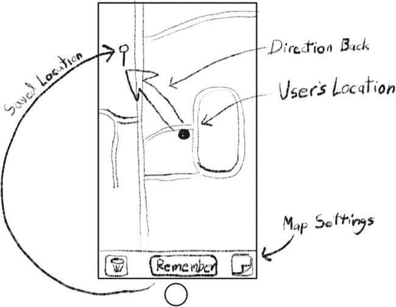
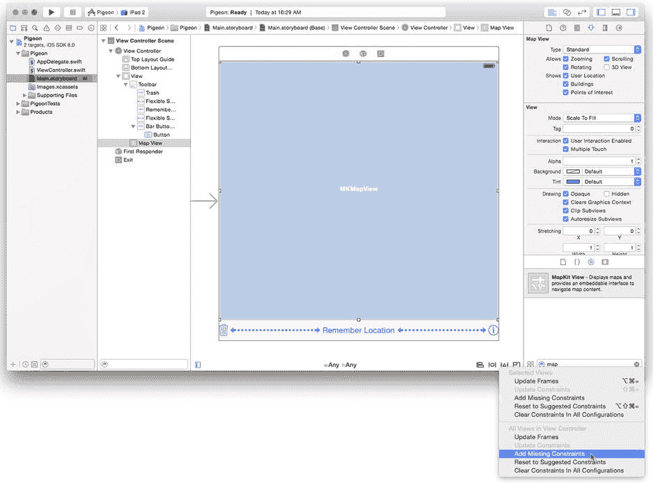
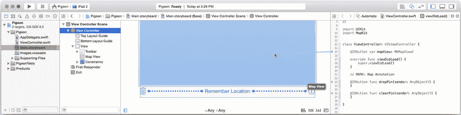
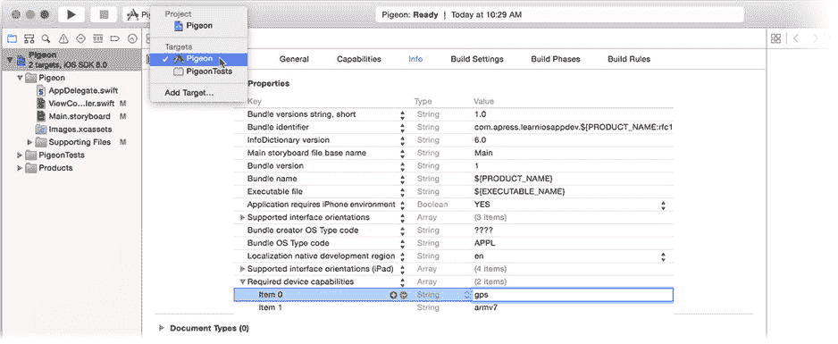
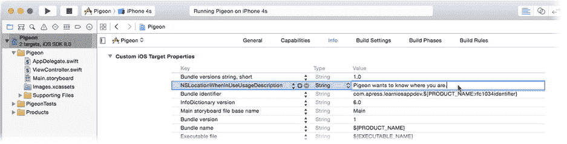
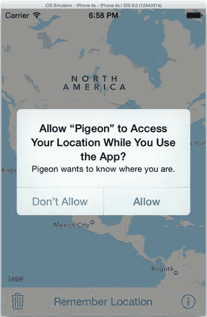
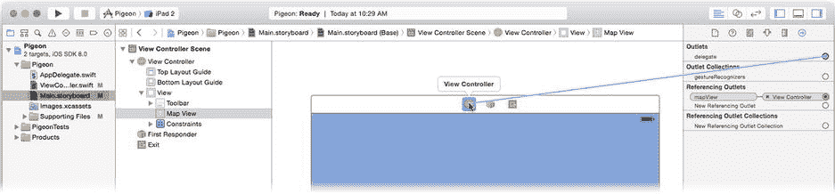
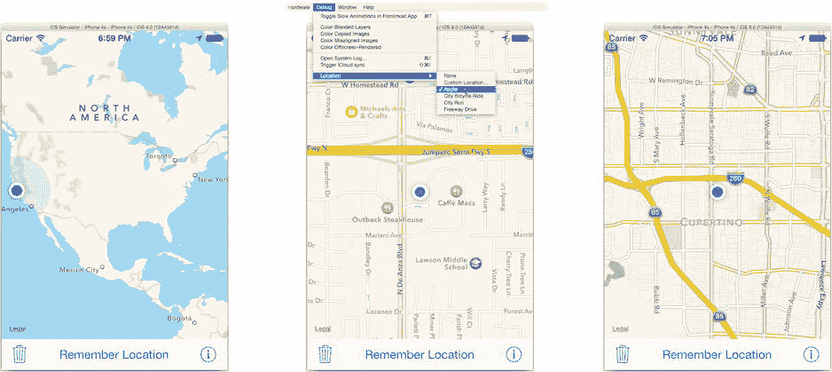
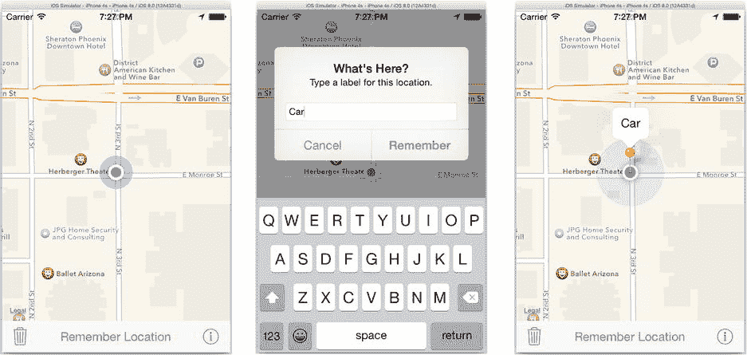
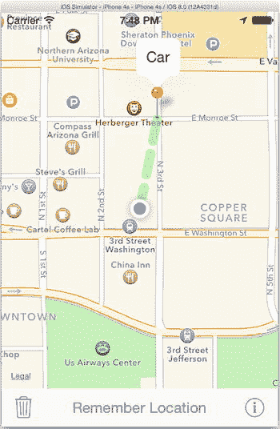

# 第十七章

## 你在哪里？

如果您觉得加速度计、陀螺仪和磁力计很酷，那么您会喜欢这一章的。除了这些仪器之外，许多 iOS 设备还包含无线电接收器，使其能够通过计时从卫星网络（全球定位系统或俄罗斯全球导航卫星系统）接收的无线电信号来三角定位。这项技术通常被称为*GPS*。

这对您意味着什么？作为用户，这意味着您的 iOS 设备知道它在地球上的位置。作为开发者，这意味着您的应用可以获取设备位置信息，并利用这些信息向用户显示他们在哪里、周围有什么、他们从哪里来，或者如何到达他们想去的地方。在本章中，您将执行以下操作：

- 收集位置信息
- 显示显示用户当前位置的地图
- 向地图添加自定义注释
- 监控用户的移动并提供方向
- 创建用于更改地图选项的界面

本章将使用两种 iOS 技术：Core Location 和 Map Kit。Core Location 提供了与 GPS 卫星接收器的接口，并以多种形式向您的应用提供设备位置数据。Map Kit 提供了用于显示、注释和动画化地图的视图对象和工具。两者可以单独使用，也可以一起使用。

## 创建 Pigeon

本章的应用叫做 Pigeon。它是一个实用程序，让您在地图上记住当前位置。稍后它会显示您的位置和标记位置，以便您可以飞回那里。图 17-1 显示了 Pigeon 的设计。



图 17-1. Pigeon 设计

该应用有一个地图和三个按钮。中间的按钮记住您当前的位置，并在地图上放置一个图钉来标记它。当您离开该位置时，地图会显示您的位置、保存的位置以及指示返回方向的线条。一个垃圾桶按钮用于忘记保存的位置，一个信息按钮让用户更改地图显示选项。让我们开始吧。

首先创建项目并布置界面。在 Xcode 中，按如下方式创建新项目：

1.  使用单视图应用模板（Single View Application template）。
2.  将项目命名为 Pigeon。
3.  使用 Swift 语言。
4.  将设备设置为通用（Universal）。

选择`Main.storyboard`文件。在界面的底部添加一个工具栏。按以下方式添加和配置工具栏按钮项（从左到右）：

1.  添加一个栏按钮项（Bar Button Item）并将其标识符（Identifier）设置为 Trash。
2.  添加一个灵活间隔栏按钮项（Flexible Space Bar Button Item）。
3.  添加一个栏按钮项（Bar Button Item）并将其标题（Title）设置为 Remember Location。
4.  添加一个灵活间隔栏按钮项（Flexible Space Bar Button Item）。
5.  添加一个按钮（Button，不是栏按钮项）并将其类型（Type）设置为 Info Light。

从对象库中，添加一个地图视图对象（Map View object）以填充界面的其余部分。为`Map View`对象设置以下属性：

1.  勾选“显示用户位置”（Shows User Location）。
2.  勾选“允许缩放”（Allows Zooming）。
3.  取消勾选“允许滚动”（Allows Scrolling）。
4.  取消勾选“3D 透视”（3D Perspective）。

通过选择“向视图控制器添加缺少的约束”（Add Missing Constraints to View Controller）命令来完成布局，可以从“编辑器”（Editor）“解决自动布局问题”（Resolve Auto Layout Issues）子菜单中选择，也可以点击编辑器窗格底部的“解决自动布局问题”按钮。完成的界面应如图 17-2 所示。



图 17-2. Pigeon 界面

您需要将这些视图连接到您的控制器，接下来执行此操作。切换到辅助编辑器，并确保`ViewController.swift`显示在右侧窗格中。您将使用 Map Kit 框架，因此添加一个`import`语句以引入 Map Kit 声明（新代码以粗体显示）。

```swift
import UIKit
import MapKit
```

向`ViewController`类添加地图视图的出口（outlet）以及两个动作（action）的存根函数。

```swift
@IBOutlet var mapView: MKMapView!

@IBAction func dropPin(sender: AnyObject!) {
}

@IBAction func clearPin(sender: AnyObject!) {
}
```

将`mapView`出口连接到地图视图对象，如图 17-3 所示。分别将左侧和中间工具栏按钮的动作连接到`clearPin(_:)`和`dropPin(_:)`函数。现在，您可以开始编写这些动作的代码了。



图 17-3. 连接地图出口

## 收集位置数据

获取位置数据遵循与第 16 章中获取陀螺仪和磁力计数据相同的模式，只需稍作修改。基本步骤如下：

1.  如果您的应用需要精确（GPS）位置信息，请将`gps`值添加到应用的“所需设备功能”（Required Device Capabilities）属性中。
2.  创建`CLLocationManager`的实例。
3.  声明您的应用需要位置信息的原因。
4.  请求收集位置信息的权限。
5.  使用`locationServicesAvailable()`或`authorizationStatus()`函数检查位置服务是否可用。
6.  在您的某个类中采纳`CLLocationManagerDelegate`协议，并使该对象成为`CLLocationManager`对象的委托。
7.  调用`startUpdatingLocation()`以开始收集位置数据。
8.  每当设备位置发生变化时，委托对象将收到函数调用。
9.  当您的应用不再需要位置数据时，发送`stopUpdatingLocation()`。


使用`CLLocationManager`和`CMMotionManager`的一个显著区别是：你可以创建多个`CLLocationManager`对象，数据会传递给它的委托对象（而不是要求你的应用主动拉取数据或将其推送到操作队列）。

另一个区别是，即使设备装有 GPS 硬件，位置数据也可能不可用。导致这种情况的原因有很多：用户可能关闭了定位服务；用户可能处于无法接收卫星信号的地方；设备可能处于“飞行模式”，该模式不允许 GPS 接收器通电；或者你的应用明确被拒绝访问位置信息。具体原因并不重要，你需要检查位置数据的可用性，并处理无法获取数据的情况。

最后，根据数据的精度和传递速度，有多种获取位置数据的函数。知道用户向左移动了 20 英尺与知道用户已到达工作地点是两个不同的问题。我将在本章末尾描述不同类型的定位监控。

Pigeon 需要只有 GPS 硬件才能提供的精确位置信息。在项目导航器中选择 Pigeon 项目，选择 Pigeon 目标（从左上角弹出菜单中，如图 17-4 所示，或从目标列表中选择），切换到“Info”标签页，在“Custom iOS Target Properties”组中找到“Required device capabilities”选项。点击`+`按钮，添加`gps`需求，如图 17-4 所示。



图 17-4 添加 GPS 设备需求

### 请求权限

接下来的两个步骤是声明你的应用需要收集位置信息的原因，并请求获取权限。从 iOS 8 开始，你的应用必须向用户明确解释为何要收集位置信息及其收集范围。

你的意图声明是应用的一个属性。由于你仍在目标的“Info”部分，现在添加它。将鼠标悬停在任意顶级属性上，点击`+`按钮创建一个新属性，将其命名为`NSLocationWhenInUseUsageDescription`，并输入**Pigeon wants to know where you are**作为其值，如图 17-5 所示。



图 17-5 添加位置使用描述

下一步是请求权限。在`AppDelegate`类（位于`AppDelegate.swift`文件中）中完成此操作。修改类的开头，使其看起来像这样（新代码以粗体显示）：

```swift
import UIKit
import CoreLocation

@UIApplicationMain
class AppDelegate: UIResponder, UIApplicationDelegate {
    var window: UIWindow?
    let locationManager = CLLocationManager()

    func application(application: UIApplication!, 
             didFinishLaunchingWithOptions launchOptions: NSDictionary!) -> Bool {
        locationManager.requestWhenInUseAuthorization()
        return true
    }
```

你将这段代码添加到`AppDelegate`类中，因为这一步是针对整个应用而非特定视图控制器的。将其放在应用的委托对象中是合适的。此外，`application(_:, didFinishLaunchWithOptions:)`函数是代码最早执行的时机之一。它会在核心应用初始化完成后、应用的第一个视图控制器出现或应用开始运行之前立即被调用。这是执行那些需要尽早且一次性完成的任务的理想位置。

应用首次运行时，`requestWhenInUseAuthorization()`函数会向用户弹出一个对话框，请求访问其位置信息，如图 17-6 所示。你希望获取此信息的原因（在`NSLocationWhenInUseUsageDescription`中设置）会包含在该提示中。



图 17-6 位置授权提示

有两个请求授权的函数：你可以调用`requestWhenInUseAuthorization()`或`requestAlwaysAuthorization()`。前者请求在应用活跃时收集位置信息的权限；后者请求始终收集位置信息的权限。由于 Pigeon 仅在运行时使用位置信息，因此你调用了第一个函数。

你的应用有可能在非活跃甚至未运行状态下监控和记录位置变化。我将在本章后面讨论备用的位置监控服务。

**注意** 从技术上讲，`requestWhenInUseAuthorization()`和`requestAlwaysAuthorization()`函数仅在你的应用的当前授权状态为`.NotDetermined`时才会提示用户。这在应用首次安装时为真。如果状态是其他值（`.Restricted`、`.Denied`、`.Authorized`或`.AuthorizedWhenInUse`），这些调用将不起作用，因为你的应用的授权（或缺乏授权）已经确定。

### 开始收集位置信息

你现在可能以为我要让你添加一些代码来完成以下工作：

- 让`ViewController`遵循`CLLocationManagerDelegate`协议
- 实现`locationManager(_:, didUpdateLocations:)`委托函数来处理位置更新
- 将`ViewController`设置为位置管理器的代理
- 调用`startUpdatingLocation()`开始收集位置数据

但你不会执行上述任何操作。

现在你肯定想知道为什么，让我来解释一下。Pigeon 同时使用了定位服务和 Map Kit。Map Kit 包含`MKMapView`对象，用于显示地图。在其众多功能中，它能够监控设备的当前位置并在地图上显示。当用户位置改变时，它甚至能通知其委托。

对于这个特定的应用，`MKMapView`已经为你完成了所有工作。当你要求它显示用户位置时，它会创建自己的`CLLocationManager`实例，并开始监控位置变化，同时更新地图及其委托。最终结果是，`MKMapView`拥有 Pigeon 工作所需的所有信息。

**注意** Pigeon 有点特殊；你将配置地图视图，使其始终跟踪用户位置并且始终处于活跃状态。如果不是这样，那么依赖地图视图来定位用户就不是一个解决方案，你必须以常规方式使用`CLLocationManager`。

这是好事。所有那些`CLLocationManager`代码看起来会与你在第 16 章中编写的代码非常相似，这会让这个应用略显乏味，我当然不想让你感到无聊。或者你还没读过第 16 章，那你可以期待一下。

无论如何，你只需要正确配置`MKMapView`。现在就开始吧。

### 使用地图视图

你的地图视图对象已经添加到界面中，并连接到了`mapView`插座。你还使用了属性检查器来配置地图视图，使其显示（并跟踪）用户位置，并禁止用户滚动。还有一项设置需要完成，且无法从属性检查器中进行设置。

选择`ViewController.swift`文件，找到`viewDidLoad()`函数。在末尾添加以下语句：

```swift
mapView.userTrackingMode = .Follow
```


此代码将地图的追踪模式设置为“跟随用户”。一共有三种追踪模式 —— 你肯定在 Apple 地图等应用中见过 —— 如表 17-1 所示。

**表 17-1. 用户追踪模式**

| `MKUserTrackingMode` | 描述 |
| --- | --- |
| `.None` | 地图不跟随用户的位置。 |
| `.Follow` | 地图以用户的当前位置为中心，当用户移动时，地图也随之移动。 |
| `.FollowWithHeading` | 地图追踪用户的当前位置，并且地图的方向会旋转以指示用户的行驶方向。 |

你在`viewDidLoad()`中添加的代码将追踪模式设置为跟随用户。`showsUserLocation`属性与追踪模式的组合，强制地图视图开始收集位置数据，这正是你想要的。

如果你使用过地图应用，你还会知道，通过手动平移地图可以“打破”追踪模式。你已禁用了地图视图的平移功能，但在某些情况下，追踪模式仍会恢复为`MKUserTrackingMode.None`。为了解决这个问题，你需要添加代码来捕获追踪模式发生变化的情况，并在必要时“纠正”它。

该信息会提供给地图视图的委托。如果您的`ViewController`对象能成为地图视图的委托，那不是很好吗？我也这么认为。

在`ViewController`中遵循`MKMapViewDelegate`协议（新代码以粗体显示）：

```
class ViewController: UIViewController, MKMapViewDelegate {
```

现在添加这个地图视图委托函数：

```
func mapView(mapView: MKMapView!, didChangeUserTrackingMode mode:
                                MKUserTrackingMode, animated: Bool) {
    if mode == .None {
        mapView.userTrackingMode = .Follow
    }
}
```

每当地图的追踪模式发生变化时，都会调用此函数。它会检查模式是否已更改为“无”，并将其重置为跟随用户。

当然，只有您的`ViewController`对象是地图视图的委托对象时，才会调用此函数。选择`Main.storyboard`文件。选择地图视图对象，并使用连接检查器将地图视图的`delegate`出口连接到视图控制器，如图 17-7 所示。



**图 17-7. 连接地图视图的`delegate`出口**

你已经完成了查看地图视图运行所需的一切操作，现在可以启动它了。在模拟器或已配置的设备上运行你的应用。你应该会看到类似于图 17-8 所示的内容。



**图 17-8. 测试地图视图**

你的应用首次运行时，iOS 会询问用户是否允许你的应用收集位置数据。点击“允许”，否则这将是一次极其短暂的测试。一旦获得权限，地图会定位你的设备，并将地图中心定位在你的位置。

iOS 模拟器会模拟位置数据，允许你测试位置感知应用。在“调试”菜单的“位置”子菜单中，你会找到多个选项（如图 17-8 中的第二个图像所示）。选择“自定义位置”项，输入模拟位置的经度和纬度。还有一些预编程的位置，例如“Apple”项，也在图 17-8 中显示。

其中一些选项会回放录制的行程。目前的选择有“城市自行车骑行”、“城市跑步”和“高速公路驾驶”。选择其中一项，会开始一系列的位置变化，地图将追踪这些变化，如同设备在自行车上、陪伴跑步者或在汽车中一样。不妨试一下；我知道你想试试。

地图还可以通过捏合或双击来放大和缩小。你不能滚动地图，因为你在 Interface Builder 中禁用了该选项。


当高速公路驾驶回放时，请添加代码在地图上标记您的位置。

## 装饰您的地图

有三种方式可以为地图添加视觉元素：标注、覆盖层和子视图。

**标注**用于标识地图上的单个点。它可以以您喜欢的任何形式出现，但 iOS 提供了使用可识别的“图钉”图像标记位置的类。标注可以选择显示一个*气泡标注*，其中包含标题、副标题和附属视图。当选中（点击）时，气泡标注会出现在图钉上方。

**覆盖层**用于标识地图上的路径或区域。覆盖层可以绘制线条（如行车路线）、突出显示任意区域（如城市公园）以及标记兴趣点（如地标）。与标注类似，您可以在地图上绘制任何内容，但 iOS 提供了绘制简单覆盖层的类。

**子视图**与其他子视图类似。`MKMapView` 是 `UIView` 的子类，您可以自由地向其中添加自定义的 `UIView` 对象。使用子视图在地图上添加额外的控件或指示器。

标注和覆盖层是附着在地图上的。它们使用地图坐标（稍后会讲到）来描述，并且会随着地图的移动而移动。子视图则位于 `MKMapView` 对象的本地图形坐标系中，不会随地图移动。

您的 Pigeon 应用将在用户点击“记住位置”按钮时，在其当前位置创建一个标注（即“放置一个图钉”）。垃圾按钮将丢弃图钉。您已经为 `dropPin(_:)` 和 `clearPin(_:)` 动作函数编写了存根。现在是时候完善它们了。

### 添加标注

当用户点击“记住位置”按钮时，您将获取其当前位置并向地图添加一个标注。我认为如果用户能为该位置选择一个标签，以便更容易记住他们想记住的内容，那会很好。为了实现所有这些，您将使用 `UIAlertController`。在 `ViewController.swift` 中，首先完成 `dropPin(_:)` 函数。

```swift
@IBAction func dropPin(sender: AnyObject!) {
    let alert = UIAlertController(title: "这里是什么位置？",
        message: "为此位置输入一个标签。",
        preferredStyle: .Alert)
    alert.addTextFieldWithConfigurationHandler(nil)
    let cancelAction = UIAlertAction(title: "取消",
                                     style: .Cancel,
                                   handler: nil)
    alert.addAction(cancelAction)
    let okAction = UIAlertAction(title: "记住",
                                 style: .Default,
                               handler: { (_) in
        if let textField = alert.textFields?[0] as? UITextField {
            var label = "在这里！"
            if let text = textField.text {
                let trimmed = text.stringByTrimmingCharactersInSet(
                            NSCharacterSet.whitespaceAndNewlineCharacterSet())
                if (trimmed as NSString).length != 0 {
                    label = trimmed
                }
            }
            self.saveAnnotation(label: label)
        }
    })
    alert.addAction(okAction)
    presentViewController(alert, animated: true, completion: nil)
}
```

此函数首先显示一个警告视图，配置为用户可以输入一些文本。然后代码添加了两个警告操作（按钮），一个用于取消，另一个用于记住位置。第二个按钮很有意思。如果用户点击了记住操作，其处理程序会获取用户输入的文本（如果有），进行清理，并在文本为空时提供默认标签。新的标签随后被传递给 `saveAnnotation(label:)` 函数。

另一个动作函数非常简单。

```swift
@IBAction func clearPin(sender: AnyObject!) {
    clearAnnotation()
}
```

创建和清除标注的工作由 `saveAnnotation(label:)` 和 `clearAnnotation()` 函数负责。首先来看 `saveAnnotation(label:)` 函数。

```swift
var savedAnnotation: MKPointAnnotation?
```


```swift
func saveAnnotation(# label: String) {
    if let location = mapView.userLocation?.location {
        clearAnnotation()
        let annotation = MKPointAnnotation()
        annotation.title = label
        annotation.coordinate = location.coordinate
        mapView.addAnnotation(annotation)
        mapView.selectAnnotation(annotation, animated: true)
        savedAnnotation = annotation
    }
}
```

第一步是获取用户的当前位置。请记住，自应用启动以来，地图视图一直在追踪用户的位置，因此此时它应该对用户的位置有相当准确的了解。但是，你必须考虑到地图视图可能不知道用户位置的可能性，在这种情况下`userLocation`将不包含值。用户可能禁用了定位服务、正在“飞行模式”下运行，或者正在探洞。无论如何，如果没有位置信息，就无事可做。

如果地图视图确实知道用户的位置，它会提取用户的地图坐标（经度和纬度），并用这些信息创建一个`MKPointAnnotation`对象。这是一种简单的标注，用于标记地图上的位置。该标注被分配标题和位置，添加到地图中，然后被选中。选中标注等同于点击它，从而让标签显示在弹出的标注框中。

应用已基本完成；你只需要实现`clearAnnotation()`函数。

```swift
func clearAnnotation() {
    if let annotation = savedAnnotation {
        mapView.removeAnnotation(annotation)
        savedAnnotation = nil
    }
}
```

就这么简单。

运行应用并尝试一下。点击“记住位置”按钮并输入一个标签，一个图钉就会出现在你的当前位置，如图 Figure 17-9 所示。



图 17-9. 测试标注

### 地图坐标

标注对象的坐标被设置为用户位置的坐标（由地图视图提供）。但这些“坐标”到底是什么？Map Kit 使用了三种坐标系，如表 17-2 所列。

表 17-2. 地图坐标系

| 坐标系 | 描述 |
| --- | --- |
| 经纬度 | 地球上某个位置的纬度和经度，有时也包括海拔。这些被称为*地图坐标*。 |
| 墨卡托 | 地球上墨卡托地图上的位置 (x,y)。墨卡托地图是地球表面在平面地图上的圆柱投影。你在地图视图中看到的就是墨卡托地图。墨卡托地图上的位置被称为*地图点*。 |
| 图形 | 界面中的图形坐标，由`UIView`使用。这些简称为*点*。 |

*地图坐标*（经度和纬度）是用于标识地图上位置的主要数值，存储在`CLLocationCoordinate2D`结构中。它们不是 xy 坐标，因此计算两个坐标之间的距离和方位是一项复杂的任务，最好交给定位服务和 Map Kit 来处理。标注和叠加层都定位在地图坐标上。

*地图点*是墨卡托地图投影中的 xy 位置。作为平面上的 xy 坐标，计算角度和距离要简单得多。地图点用于绘制叠加层。这简化了绘制过程并减少了涉及的数学运算。

**说明** 墨卡托投影对于导航特别方便，因为墨卡托地图上任意两点之间的直线描述了一个用户可以跟随的方位，以便从一点到达另一点。其缺点是东西方向和南北方向的比例尺不一致——赤道除外。

地图点最终会被转换为图形坐标，以便显示在屏幕上的某个位置。有函数可以将地图坐标转换为图形坐标。还有额外的函数可以进行反向转换。

### 添加一点弹跳效果

你的地图图钉出现在地图上，并随地图移动。你可以点击它以显示或隐藏其标注框。考虑到你只需要几行代码就能创建它，这已经相当令人印象深刻了。不过，我们确实热爱动画，而且我肯定你见过“掉落”到位的图钉。你的图钉并不会掉落；它只是出现。那么，如何让你的图钉具有动画效果、改变颜色或以其他方式自定义呢？答案是使用自定义标注视图。

地图中的标注实际上是一对对象：一个标注对象和一个标注视图对象。*标注对象*将信息与地图上的一个坐标关联起来——这是数据模型。*标注视图对象*负责该标注的外观——这是视图。如果你想自定义标注的外观，你必须提供自己的标注视图对象。

你可以通过实现`mapView(_:,viewForAnnotation:)`委托函数来做到这一点。当地图视图想要显示一个标注时，它会调用其委托的这个函数，并向其传递标注对象。这个函数的工作是返回一个代表该标注的标注视图对象。如果你不实现这个函数，或者为某个标注返回`nil`，地图视图将使用其默认的标注视图，也就是你已经见过的普通地图图钉。

将此函数添加到`ViewController.swift`中：

```swift
func mapView(mapView: MKMapView!, viewForAnnotation annotation: MKAnnotation!)
             -> MKAnnotationView! {
    if annotation === mapView.userLocation {
        return nil
    }

    let pinID = "Save"
    var pinView: MKPinAnnotationView!
    pinView = mapView.dequeueReusableAnnotationViewWithIdentifier(pinID)
                                                     as? MKPinAnnotationView
    if pinView == nil {
        pinView = MKPinAnnotationView(annotation: annotation,
                                     reuseIdentifier: pinID)
        pinView.canShowCallout = true
        pinView.animatesDrop = true
    }
    return pinView
}
```

第一条语句将标注与地图视图的用户标注对象进行比较。用户标注对象，就像任何其他标注对象一样，表示用户在地图中的位置。当你要求地图视图显示用户的位置时，它会自动添加该标注。这个自动标注可以通过地图视图的`userLocation`属性访问，但它也会出现在标注的通用集合中。如果你为此标注返回`nil`，地图视图将使用其默认的用户标注视图——我们都熟悉的脉冲蓝点。如果你想以其他方式表示用户的位置，那么就在这里提供该视图。

代码的其余部分与第 4 章中的表格视图单元格代码类似。地图视图维护着一个可重用的`MKAnnotationView`对象缓存，你可以通过标识符来回收使用它们。你的地图只使用一种标注视图：由`MKPinAnnotationView`类提供的标准地图图钉视图。图钉被配置为显示标注框，并在添加到地图时自行生成动画（“落下”）。

**提示** 如果你想赋予用户移动他们刚放置的图钉的能力，你只需将标注视图对象的`draggable`属性设置为`true`。

再次运行应用。现在当你保存位置时，图钉会以动画方式插入到地图中，这更具吸引力。

你的`mapView(_:,viewForAnnotation:)`委托函数可以返回一个内置标注视图类的自定义版本，就像你在这里所做的那样。`MKPinAnnotationView`可以显示不同颜色的图钉，可以允许或禁止标注框，可以在其标注框中拥有自定义的附属视图，等等。或者，你可以继承`MKAnnotationView`并创建自己的标注视图，自定义你想要的任何图形和动画。你可以将用户的位置表示为一摇一摆的鸭子。让你的想象力尽情驰骋吧。

### 指引回家的路


## 使用叠加层装饰地图

装饰地图的第二种技术是使用叠加层。叠加层占据地图上的一个区域，而非仅一个点。它们用于表示驾驶路线、地理特征等内容。

叠加层与标注类似。存在一个*叠加层*对象，用于描述叠加层在地图上的位置——即数据模型。同时还有一个配套的*叠加层渲染器*对象，负责绘制该叠加层——即视图。

**注意** `MKAnnotation` 和 `MKOverlay` 都是协议，而非类。任何类都可以通过遵循相应的协议并实现所需函数，为地图视图提供标注或叠加层信息。协议在第 20 章中有详细说明。

与标注不同，叠加层渲染器不是 `UIView` 对象。它是一个轻量级对象，仅包含将叠加层直接绘制到地图视图图形上下文中的代码。简而言之，它有一个 `draw...()` 函数，就像 `UIView` 的 `drawRect(_:)` 函数一样，但除此之外别无他物。这意味着你无法对叠加层进行动画处理，也无法使用任何标准的 `UIView` 对象。

同样与标注类似，iOS 提供了一组有用的叠加层和叠加层渲染器类。让我们使用 `MKPolyline` 和 `MKPolylineRenderer` 类，在用户保存的位置与其当前位置之间绘制一条连线。

### 添加叠加层

在 Pigeon 应用中，每当用户位置发生变化时，你将动态添加一个叠加层。“这何时会发生？”你可能会问。当用户移动时就会发生。“我如何得知？”你可能会问。当地图视图中正在显示用户的位置*并且*其位置发生变化时，地图视图会通知你的委托。现在将该委托函数添加到 `ViewController` 中——你可以在 `Learn iOS Development Projects` → `Ch 17` → `Pigeon-2` 文件夹中找到完成的应用。

```
func mapView(mapView: MKMapView!, didUpdateUserLocation userLocation:
                                                     MKUserLocation!) {
    clearOverlay()
    if let saved = savedAnnotation {
        if let user = userLocation {
            var coords = [ user.coordinate, saved.coordinate ]
            returnOverlay = MKPolyline(coordinates: &coords, count: 2)
            mapView.addOverlay(returnOverlay)
        }
    }
}
```

每当用户位置发生变化时，首先丢弃任何现有的叠加层——它已经不再准确。获取保存的位置和用户当前的位置。如果两者都已知，则创建一个包含两个点（用户和保存位置的地图坐标）的 `MKPolyline` 叠加层数据模型，并将其添加到地图中。就是这样。

**注意**  `MKPolyline` 可以描述任意复杂的线条，很像贝塞尔路径。它用于描述旅行路线、地缘政治边界等内容。还有一个用于实心形状（如为某个国家公园所占区域添加阴影）的 `MKPolygon` 类，以及一个特殊的 `MKGeodesicPolyline` 类，后者对于表示非常长的距离（如飞机的飞行路径）非常有用。

接下来编写 `clearOverlay()` 函数，并添加一个变量来保存当前的叠加层。

```
var returnOverlay: MKPolyline?

func clearOverlay() {
    if let overlay = returnOverlay {
        mapView.removeOverlay(overlay)
        returnOverlay = nil
    }
}
```

### 提供渲染器

与标注不同，地图视图不提供默认的叠加层渲染器。要使用叠加层，你必须实现以下委托函数：

```
func mapView(mapView: MKMapView!, rendererForOverlay overlay: MKOverlay!)
                                                 -> MKOverlayRenderer! {
    if overlay === returnOverlay {
        let renderer = MKPolylineRenderer(overlay: returnOverlay)
        renderer.strokeColor = UIColor(red: 0.4,
                                     green: 1.0,
                                      blue: 0.4,
                                     alpha: 0.7)
        renderer.lineCap = kCGLineCapRound
        renderer.lineWidth = 16.0
        renderer.lineDashPattern = [ 38.0, 22.0 ]
        return renderer
    }
    return nil
}
```

该代码询问地图视图是否正在为你的返回路径叠加层请求渲染器。如果是，则创建一个 `MKPolylineRenderer` 对象，并将其配置为绘制一条浅绿色、半透明、带有圆角端点的虚线。请注意，这里没有渲染器缓存，因为渲染器对象不可复用；每个叠加层对象对应一个渲染器对象。

### 创建自定义叠加层渲染器

创建自定义叠加层渲染器（几乎）和创建自定义 `UIView` 一样简单，就像你在第 11 章中编写的那样。至少，你需要创建 `MKOverlayRenderer` 的子类，然后重写 `drawMapRect(_:,zoomScale:,inContext:)` 函数。

与 `UIView` 的 `drawRect(_:)` 函数类似，你的 `drawMapRect(...)` 函数是在 Core Graphics 上下文中进行绘制。但与 `drawRect(_:)` 不同的是，该上下文并非你所独有。你的代码直接绘制到地图视图的上下文中，用叠加层装饰地图。

你的对象通过继承得到的 `overlay` 属性，从与渲染器对象关联的叠加层对象获取数据。如果需要显示自定义数据，你可以定义自己的叠加层类，然后在自定义渲染器中使用该对象。超类还提供了有用的转换函数，用于将地图点转换为图形坐标，反之亦然。

渲染器绘制确实带来一个复杂性。出于性能原因，地图视图的绘制是在后台线程上执行的。这意味着某些 `UIKit` 绘制对象和函数无法使用，因为它们不是线程安全的。可以通过坚持使用 Core Graphics 函数（所有以 `CGContext...()` 开头的函数）进行所有绘制来避免这个问题。`MKOverlayRenderer` 的文档描述了使用 `UIKit` 类进行绘制所需的特殊步骤和限制。

Homer 应用中有一个自定义渲染器类的示例，该应用在 App Store 中免费提供。你可以从 `https://github.com/JamesBucanek/Pigeon` 下载 Homer 的源代码。

使用模拟器或已配置的设备运行 Pigeon，保存一个位置，然后远离该位置。只要两者都已知，渲染器对象就会在你的当前位置和保存的位置之间绘制一条粗虚线，如图 17-10 所示。



图 17-10. 测试叠加层渲染器

标注和叠加层为在地图上添加内容提供了几乎无限的方式。你可以突出兴趣点、提供地理信息、绘制旅行路线、叠加天气信息、推广商家或显示其他玩家的位置——可能性无穷无尽。如果你需要的功能超出了 iOS 提供的基本地图大头针、线条和区域，你可以自由地发明自己的标注视图和叠加层渲染器。

你是否还在思考工具栏中信息按钮的用途？我把它留给了本章末尾的练习。在进入那部分之前，让我们简要了解一下你还未探索的一些定位服务和地图功能。

## 位置监控


以下是排版后的 Markdown 文档：

Pigeon 是一款需要实时、精确（尽可能）且持续监控用户位置的应用程序。因此，它要求 iOS 设备具备 GPS 功能，并持续收集位置数据。并非所有应用都如此。许多应用不需要精确的位置信息、持续的监控，或即时获得移动通知。

对于位置需求不那么高的应用，`Core Location`框架提供了多种信息和传递方法。每种方法涉及的硬件和 CPU 使用量不同，这意味着它们会以不同的方式影响 iOS 设备的电池寿命和性能。

作为一个通用原则，你应该只收集应用运行所需*最少*的位置信息。假设你正在编写一个旅行应用，需要知道用户何时离开一个城市并到达下一个城市。不要像 Pigeon 那样启动 GPS 硬件并开始监控他们的每一次移动。为什么？因为你的应用永远无法收到用户已到达目的城市的通知，因为*用户的电池会被完全耗尽*！而用户在充电后做的第一件事，就是删除你的应用。请考虑其他一些不需要那么多电量的获取位置信息的方法。

### 近似定位与非 GPS 设备

没有 GPS 硬件的 iOS 设备也可以获取位置信息。这些设备使用从 Wi-Fi 基站、手机信号塔和其他来源收集到的位置信息。精度可能很粗略——有时是公里级别而非米级别——但这足以将用户定位到一个城镇。这对于推荐餐馆或列出他们附近正在上映的电影来说，信息已经绰绰有余。

因此，即使你的应用没有`gps`硬件要求，你仍然可以请求位置信息，并且你可能会得到它。请查阅`CLLocation`对象的`horizontalAccuracy`属性，以了解所报告位置的不确定性（以米为单位）。如果该值很大，那么设备可能没有使用 GPS，或者处于 GPS 精度不佳的环境中。

**注意** 具备 GPS 功能的 iOS 设备也会使用这种替代位置信息来提高 GPS 三角定位的速度——GPS 三角定位本身相当缓慢——并降低功耗。这个系统被称为*辅助 GPS（Assisted GPS）*。

如果你的应用只需要近似的位置信息，请通过`CLLocationManager`发送`startMonitoringSignificantLocationChanges()`函数，而不是`startUpdatingLocation()`函数来收集位置数据。此函数仅获取用户位置的粗略估计，并且仅在该位置发生重大变化时（通常为 500 米或更多）通知你的应用，从而节省大量处理能力和电池寿命。

重大位置变化服务甚至可以在你的应用未运行时通知它——这是常规位置监控（通过`startUpdatingLocation()`）无法做到的。如果你启动了重大位置变化更新，而后你的应用被停止，iOS 将重新启动你的应用（在后台）并通知它新的位置。

**注意** 使用重大位置变化通知，或任何其他会在应用未运行时发生的位置收集方式，都需要你使用`requestAlwaysAuthorization()`函数请求授权以持续监控用户的位置。如果你未能做到这一点，或者用户明确拒绝你的应用在后台收集位置数据的权限，那么这些 API 将无法执行任何有效操作。

### 监控区域

回到那个旅行应用，一些 iOS 设备能够监控重大的位置变化，即使设备处于空闲状态。这是通过*区域监控*实现的。区域监控允许你在地图上定义一个区域，并在用户进入或离开该区域时得到通知。这是一种判断用户是否移动的极其高效（低功耗）的方法。

例如，你可以创建一个包含他们下一个要前往的机场的`CLRegion`对象。你最多可以为每个区域调用位置管理器对象的`startMonitoringForRegion(_:)`函数，最多 20 个。然后，你的应用所要做的就是等待，直到代理对象收到对`locationManager(_:,didEnterRegion:)`或`locationManager(_:,DidExitRegion:)`的调用。

使用区域监控可以在用户到达工作地点或家庭聚会时得到通知。要了解有关区域监控的更多信息，请查阅《定位服务与地图编程指南》中的“监控基于形状的区域”部分，你可以在 Xcode 的文档和 API 参考窗口中找到该指南。《定位服务与地图编程指南》还描述了如何在你的应用非活跃应用时在后台接收位置数据，这是我在本书中尚未讨论的内容。

### 减少位置变化消息

延长电池寿命的另一种方法是减少应用接收的位置信息量。我已经讨论过仅接收重大变化或监控区域，但在这种极限情况与每秒获取用户位置更新之间，存在一个中间地带。

第一种方法是设置位置管理器的`distanceFilter`和`desiredAccuracy`属性。`distanceFilter`属性减少了应用接收的位置更新次数。它会等待设备移动了设定距离后，才再次更新你的应用。`desiredAccuracy`属性告诉 iOS 应该花费多少精力来确定用户的精确位置。放宽该属性意味着定位硬件不必那么费力工作。

你可以提供的另一个提示是`activityType`属性。这告诉管理器你的应用用于汽车导航，而不是个人健身应用。位置管理器将利用这个提示来优化其硬件使用。例如，一个汽车导航应用可能会在用户长时间没有移动时，暂时关闭 GPS 接收器。

### 移动与方向

你的应用可能更关心用户前进的方向和速度，而非他们所在的位置。如果你关注方向，可以查阅从`CLLocationManager`的`location`属性获得的`CLLocation`对象的`speed`和`course`属性。

如果你只想知道用户的方向，你可以通过调用`startUpdatingHeading()`函数（而不是`startUpdatingLocation()`）来仅获取该信息。确定用户的方向比确定其精确位置要稍微高效一些。

要了解更多关于方向信息的内容，请阅读《定位感知编程指南》中的“获取方向相关事件”章节。

## 地理编码

如果你的应用对地图上的地点感兴趣怎么办？它可能想知道某个企业的位置。或者，它可能有一个地图坐标，并想知道那里有什么。

将关于位置的信息（企业名称、地址、城市、邮政编码）转换为地图坐标，以及反过来，这个过程被称为*地理编码*。地理编码是苹果提供的一项网络服务，它会尽可能地将一个包含地点信息的字典（例如，一个地址）转换为经纬度，并再次转换回来。将地点信息转换为地图坐标称为*正向地理编码*。将地图坐标转换为对那里有什么的描述称为*反向地理编码*。


