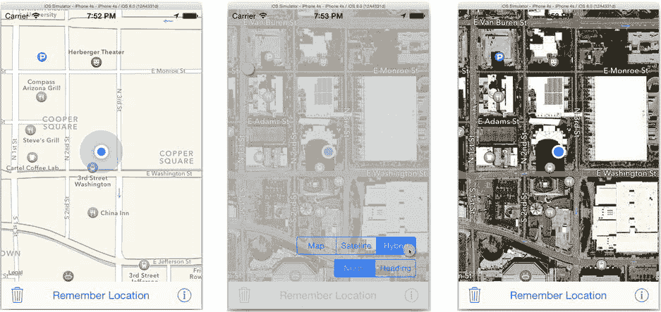

# 总结

在掌握 iOS 应用开发的旅程中，你已经走了很远。你已跨越众多里程碑，而学会使用定位服务是重要的一步。现在你已经知道如何出于各种目的获取用户位置，并将其显示在地图上。

说到地图，你还学到了很多相关知识。现在你知道如何在应用中呈现地图、用兴趣点添加标注，以及自定义标注的显示样式。你还学会了如何在地图上追踪和显示用户位置，并添加自己的覆盖层。

但你知道吗？Pigeon 仍然存在与 MyStuff 相同的问题。如果一个号称能记住东西的应用，在你退出后却忘掉了一切，那它还有什么用呢？应该有某种方法将数据存储在某处，这样当你返回应用时，它不会丢失所有内容。毫不意外，确实有一系列数据保存技术，接下来的两章将专门讨论这个问题。

## 练习

`MKMapView` 可以显示图形地图、卫星图像或两者结合。它可以将地图朝正北方向，或根据设备方向旋转地图。不让用户自由选择这些选项是很不礼貌的。Pigeon 锁定了地图视图的方向和显示模式。你的练习就是解决这个问题。

地图显示的两个方面由两个属性控制：`mapType` 和 `userTrackingMode`。地图类型可设置为图形显示（`MKMapType.Standard`）、卫星图像（`MKMapType.Stellite`）或两者结合（`MKMapType.Hybrid`）。用户追踪模式可以是跟随用户（`MKUserTrackingMode.Follow`）或带方向跟随（`MKUserTrackingMode.FollowWithHeading`）。

界面中添加哪些控件由你决定。有些应用会在地图界面上直接添加一个按钮，用于切换不同的地图类型和追踪模式。对于 Pigeon，我决定将设置放在一个单独的视图控制器中。

你可以在 `Learn iOS Development Projects`  `Ch 17`  `Pigeon E1` 文件夹中找到完成的项目。基本上，我是这样做的：

1.  创建一个名为 `OptionsViewController` 的新 Swift 类，它是 `UIViewController` 的子类。
2.  在 `Main.storyboard` 文件中添加一个新的视图控制器，并将其类改为 `OptionsViewController`。
3.  在新视图中添加两个分段控件。将第一个配置为三个分段（地图、卫星、混合），第二个配置为两个分段（正北、方向）。
4.  将根视图的背景色设为略带色调的半透明。
5.  在 `OptionsViewController` 中，为分段控件添加输出口，并添加两个 `@IBAction` 函数来更改设置。
6.  重写 `viewWillAppear()` 函数，从 `presentingController` 获取 `MKMapView` 对象的引用。使用地图的当前属性值更新分段控件的初始选择状态。
7.  在两个操作函数中，使用对呈现控制器地图视图的引用，根据所选分段更改地图类型或追踪模式。
8.  添加一个 `done()` 函数来关闭视图控制器。
9.  将分段控件连接到输出口，并将每个发送动作连接到相应的 `OptionsViewController` 操作。
10. 添加一个单点手势识别器，将其附加到根视图，并连接到 `done()` 函数。这将关闭视图控制器。
11. 从工具栏中的信息按钮创建一条到新视图控制器的转场。将转场设置为 `Present Modally`，呈现方式设置为 `Over Full Screen`，过渡效果设置为 `Cover Vertically`。

这些内容你已经在第 10 章和第 12 章中学过。以下是完成后的界面效果：

## 第 18 章：还记得我吗？

iOS 设备最卓越的特性之一——也是它们成为我们生活中不可或缺之物的原因——是它们能记住如此多的东西：照片、电话号码、地址、约会、待办事项清单、课堂笔记、项目创意、主题演讲、播放列表、你想阅读的文章……这份清单似乎无穷无尽。但到目前为止，你在本书中开发的所有应用都不具备记忆功能。每次启动 MyStuff，它都从一个空列表开始。Wonderland 甚至不记得你正在阅读哪一页。再看看 Pigeon，可怜的 Pigeon。它唯一的任务就是记住一个位置，却连这个也做不到。你将解决所有这些问题，甚至更多。

可以想象，iOS 中有许多不同的信息存储方式。接下来的两章将探讨一些基础方法。你将先从用户默认设置（有时称为*偏好设置*）开始。这项技术最常用于记住少量信息，例如你的设置、正在查看的标签页、上次查看的页码、收藏的网址列表等。在本章中，你将完成以下任务：

*   了解属性列表
*   在用户默认设置中添加和检索值
*   为你的应用创建设置捆绑包
*   在云端存储和同步属性列表数据
*   保存和恢复视图及视图控制器

## 属性列表

属性列表的机制及其使用方法非常简单；只需一两页篇幅就能解释清楚所有内容。但如何最佳地运用它们则是另一回事。本章大部分内容将聚焦于使用属性列表的策略，因此请戴上你的思考帽，让我们开始吧。

## 属性列表

属性列表是一个对象图，其中每个对象都属于以下类之一：

- `NSDictionary`
- `NSArray`
- `NSString`
- `NSNumber`（任何整数、浮点数或布尔值）
- `NSDate`
- `NSData`

虽然属性列表可以是一个单独的字符串，但通常情况下它是一个包含字符串、数字、日期或其他数组和字典的字典。这些类的实例被称为*属性列表对象*。

真的，就这么简单。

## 序列化属性列表

属性列表在 iOS 中被广泛使用，因为它们灵活、通用且易于序列化。在这种情况下，*序列化*（Cocoa 术语）指的是“序列化”（计算机科学术语）。Cocoa 使用术语*序列化*来表示将属性列表转换为可传输的字节流。你通常不会自己序列化属性列表，但它们经常在后台被序列化。

**注意**：属性列表可以序列化为两种不同的格式：二进制格式和 XML 格式。二进制格式是 Cocoa 独有的。它只能被另一个 Cocoa（OS X）或 Cocoa Touch（iOS）应用读取和理解。XML 格式是通用的，几乎可以与世界上任何计算机系统交换。二进制格式的优势在于效率（体积和速度）。XML 格式的优势在于可移植性。

写入文件的序列化属性列表被称为*属性列表文件*，通常是一个 `.plist` 文件。Xcode 包含一个属性列表编辑器，因此你可以直接创建和修改属性列表文件的内容。你将在本章后面用到属性列表编辑器。

对于 Wonderland 应用，我编写了一个 Mac（OS X）实用工具应用来生成 `Characters.nsarray` 资源文件。那是一个属性列表（一个包含字符串的字典数组），以 XML 格式序列化，并写入一个属性列表文件。随后，你将此文件添加为资源文件，你的应用通过*反序列化*该文件将其还原为 `NSArray` 对象。

**提示**：如果你希望自行序列化属性列表，请使用 `NSPropertyListSerialization` 类，或者使用 `NSArray` 和 `NSDictionary` 中的 `writeTo(...)` 方法。

## 用户默认设置

属性列表对象最重要的用途之一是在用户默认设置中。*用户默认设置*是一个属性列表对象的字典，你可以用它来存储少量持久性信息，例如偏好设置和显示状态。你可以将任何想要的属性列表值存入用户默认设置（`NSUserDefaults`）对象，并在稍后检索出来。你存储的值会被序列化并在应用的不同运行之间保留。

当你的应用启动时，会创建一个用户默认设置（`NSUserDefaults`）对象。你上次存储的任何值都会被反序列化并立即可用。如果你对用户默认设置做出任何更改，它们会被自动序列化并保存，以便你的应用下次运行时可用。

**注意**：用户默认设置的值仅限于你的应用内部。换句话说，你的应用无法获取或更改其他 iOS 应用存储的值。

使用 `NSUserDefaults` 非常简单。你可以使用 `NSUserDefaults.standardUserDefaults()` 函数获取应用的单例用户默认设置对象。调用“set”函数来存储值（`setInteger(_:,forKey:)`、`setObject(_:,forKey:)`、`setBool(_:,forKey:)` 等）。通过调用“get”函数来检索值（`integerForKey(_:)`、`objectForKey(_:)`、`boolForKey(_:)` 等）。

## 让鸽子记住

你将使用用户默认设置来赋予鸽子一些长期记忆。当你为应用添加用户默认设置时，需要考虑以下几点：

- 存储哪些值
- 将使用哪些属性列表对象和键
- 何时存储这些值
- 何时检索这些值

每个决策都会影响后续决策，所以从头开始。对于鸽子，你希望它记住以下内容：

- 记住的地图位置（显而易见）
- 地图类型（标准、卫星或混合）
- 跟踪模式（无或跟随航向）

下一步是决定使用哪些属性列表对象来表示这些属性。地图类型和跟踪模式很简单；它们都是整数属性，你可以直接将任何整数值存储在用户默认设置中。

然而，封装了地图位置的 `MKPointAnnotation` 对象并不是属性列表对象，不能直接存储在用户默认设置中。相反，需要将其重要属性转换为可以存储的属性列表对象。典型的方法是将你的信息转换为一个字符串或一个属性列表对象的字典，两者都与用户默认设置兼容。对于鸽子，你将把标注转换为一个包含三个值的字典：其纬度、经度和标题。这些信息足以在应用再次运行时重建该标注。

你还必须选择键来标识存储的每个值。在顶层，你需要选择那些不会与 iOS 可能使用的任何键混淆的键。许多 iOS 框架也会使用你应用的用户默认设置来保存信息。最简单的方法是使用 iOS 未使用的前缀。iOS 属性的键总是使用存储该值的类的两个字母前缀。（这是 Objective-C 类名的遗留问题）。例如，键 `HPMapType` 和 `HPFollowHeading` 不太可能与任何保留的 iOS 键冲突，因为没有任何 Cocoa Touch 类具有 `HP` 前缀。子字典中用于值的键可以是任何你想要的。

**提示**：如何知道一个两个字母的前缀是否被 Cocoa Touch 类使用？打开“文档和 API 参考”窗口。输入你的两个字母，查看搜索结果中是否出现任何类名。

## 最小化更新与代码

解决了第一部分之后，你现在可以将注意力转向一个更微妙的问题：决定何时何地将值保存到用户默认设置中，以及如何再次取回它们。

首先处理存储问题。作为一般原则，你希望在保持代码简洁的同时，尽可能少地更新用户默认设置。以下是常见的解决方案：

- 在值发生变化时捕获它。
- 在某个可靠的退出点捕获值。

第一个解决方案非常适合鸽子。它只保存三个值，而且这些值都不是频繁变化的。用户可能会偶尔更改地图类型和航向，但不太可能在一分钟内摆弄这些设置一百次。同样，用户会在到达某地时保存一个位置，但在到达另一个地方之前不会保存另一个位置。

你希望限制用户默认设置更新的原因是，每次更改都会触发一系列事件，导致后台完成相当多的工作。只要不过度复杂化你的设计，就应该避免这样做。一个好的设计会用最少的代码来最小化更新。当你开始使用基于云的存储时（本章后面会讲到），避免不必要的更改甚至更为重要。

另一方面，某些你想要保存的值可能随时变化或在许多不同的地方变化。例如，记住有声读物的播放位置就是一个不断变化的值。如果每秒都捕获音频播放时的位置，那将是荒谬的。相反，更合理的做法是在用户退出应用时简单地记录当前的播放位置。你将在本章后面探讨这种技术。

