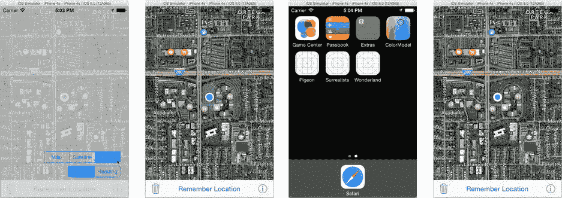

# 使用用户默认设置保存地图配置

首先，你将开始保存地图类型和跟踪模式，因为它们是最简单的设置。然后，你将处理地图位置的保存与恢复。

### 定义键值

本教程以第 17 章练习中的`Pigeon`版本为起点。你可以在`Learn iOS Development Projects` → `Ch 17` → `Pigeon E1`文件夹中找到该版本。如果你自己完成了练习的解决方案，应该可以轻松地将此代码适配到你的应用中。

首先，定义用于标识用户默认设置中值的键。选择`ViewController.swift`文件，并添加一个包含三个常量的枚举。

```
enum PreferenceKey: String {
    case MapType = "HPMapType"
    case Heading = "HPFollowHeading"
    case SavedLocation = "HPLocation"
}
```

### 向用户默认设置写入值

找到地图类型和跟踪模式发生变化的代码。如果你使用的是我为第 17 章编写的`Pigeon`版本，该代码位于`OptionsViewController.swift`中。找到每个设置发生变化时的代码。在`OptionsViewController`中，这些操作发生在`changeMapStyle(_:_)`和`changeHeading(_:)`函数中。修改代码如下（新增代码以**粗体**显示）：

```
@IBAction func changeMapStyle(sender: UISegmentedControl!) {
    if let selectedMapType = MKMapType(rawValue:UInt(sender.selectedSegmentIndex)) {
        if let mapView = (presentingViewController as? ViewController)?.mapView {
            mapView.mapType = selectedMapType
            let userDefaults = NSUserDefaults.standardUserDefaults()
            userDefaults.setInteger( Int(selectedMapType.rawValue),
                             forKey: PreferenceKey.MapType.rawValue)
        }
    }
}

@IBAction func changeHeading(sender: UISegmentedControl!) {
    if let selectedTrackingMode = MKUserTrackingMode(rawValue:sender.selectedSegmentIndex+1) {
        if let mapView = (presentingViewController as? ViewController)?.mapView {
            mapView.userTrackingMode = selectedTrackingMode
            let userDefaults = NSUserDefaults.standardUserDefaults()
            userDefaults.setInteger( selectedTrackingMode.rawValue,
                             forKey: PreferenceKey.Heading.rawValue)
        }
    }
}
```

这一改动非常直接，你应该能够轻松地将相同的思路适配到自己的应用中。当设置发生变化时，新值也会同时存储到用户默认设置中。你只需要做这些就够了。`NSUserDefaults`会处理其余所有事情：将简单的整数值转换为适当的属性列表（`NSNumber`）对象、序列化这些值并将其存储，以便下次应用运行时能够使用。

这是前半部分。现在，你需要添加代码来检索这些保存的值，并在应用启动时恢复地图选项。

### 从用户默认设置获取值

选择`ViewController.swift`文件，找到`viewDidLoad()`函数。将`mapView.userTrackingMode = .Follow`语句替换为以下代码：

```
let userDefaults = NSUserDefaults.standardUserDefaults()
mapView.mapType = MKMapType(rawValue: UInt(userDefaults.integerForKey( 
                                                    PreferenceKey.MapType.rawValue)))!

if let trackingValue = userDefaults.objectForKey(PreferenceKey.Heading.rawValue) 
                                                     as? NSNumber {
    mapView.userTrackingMode = MKUserTrackingMode(rawValue: trackingValue.integerValue)!
} else {
    mapView.userTrackingMode = .Follow
}
```

这段新代码从用户默认设置中检索地图类型和跟踪模式的整数值，并在地图显示之前用它们恢复这些属性。现在，当用户运行应用并更改地图类型后，每次启动应用，地图类型都将保持不变。

但这里有一个问题。当应用首次运行时——或者如果用户从未更改过地图类型或跟踪模式——用户默认设置中根本没有这些键对应的值。如果你请求一个不存在的键的属性列表对象，用户默认设置将返回`nil`。如果你请求一个标量值（布尔值、整数或浮点数），用户默认设置将返回`NO`、`0`或`0.0`。以下是处理这种情况的三种方法：

*   选择你的值，使`nil`、`false`、`0`或`0.0`成为默认值
*   检测用户默认设置是否包含该键的值
*   为该键注册一个默认值

地图类型属性采用了第一种解决方案。方便的是，`Pigeon`中的初始地图类型是`.Standard`，其整数值为`0`。因此，如果用户默认设置中没有`.MapType`键的值，它将返回`0`，并将地图类型设置为标准——这非常完美。

跟踪模式就没那么幸运了。`Pigeon`使用的初始跟踪模式是`.Follow`，其整数值为`1`。如果`.Heading`键没有值，你不希望错误地将`trackingMode`设置为`.None`（`0`）。

因此，代码采用了第二种解决方案。它首先获取该键的属性列表（`NSNumber`）对象。如果该键没有值，用户默认设置会返回`nil`，你就知道跟踪值从未被设置过。利用这个信息，你可以恢复用户选择的模式，或者设置正确的默认值。

**提示** 使用`objectForKey(_:)`方法来检测任何值是否存在。属性列表中的每个值最终都由一个属性列表*对象*表示。`objectForKey(_:)`函数返回一个可选值，你可以用它来测试是否为`nil`。

以上就是保存和恢复这些地图设置所需的全部内容。现在可以测试了，但这需要一点技巧。

### 测试用户默认设置

使用已配置的设备或模拟器，运行更新后的`Pigeon`应用。点击设置按钮，更改地图类型和跟踪模式，如图 18-1 所示。这将用新值更新用户默认设置，但这些值可能尚未保存到持久化存储中。这是因为用户默认设置会尽量提高效率，可能会等待更多更改后才开始序列化和存储过程。



图 18-1. 测试地图设置

让用户默认设置“行动起来”的一种方法是将应用推入后台。通过点击“主页”按钮或在模拟器中使用“硬件”→“主页”命令（如图 18-1 中的第三张图片所示）来实现。当应用进入后台时，它不会立即停止运行，但会为这种可能性做准备。其中一个步骤就是序列化并保存所有的用户默认设置。深呼吸，慢慢数到五。

在用户默认设置被安全存储后，你现在可以停止应用并重新启动它。切换回 Xcode，点击停止按钮。应用停止后，点击运行按钮。应用将再次启动。这次，它会从保存的用户默认设置中加载地图类型和跟踪模式，并恢复这些属性。当视图控制器加载时，地图将与用户上次离开时的状态完全一致。

恭喜你，你已经掌握了在用户默认设置中保存和恢复值的基本方法。在接下来的几个部分中，你将进一步完善你的技术，并处理更（稍微）复杂的问题：保存和恢复用户保存的地图位置。

### 注册默认值

用于恢复跟踪模式的代码非常难看。好吧，也许不是*非常难看*，但确实有点难看。如果你要恢复十几个这样的设置，就需要编写大量重复的代码。幸运的是，有一个更优雅的解决方案。


