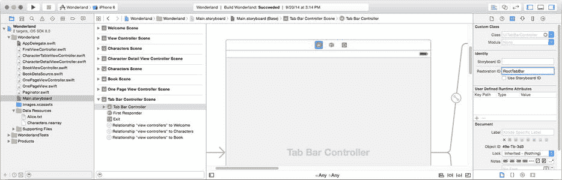
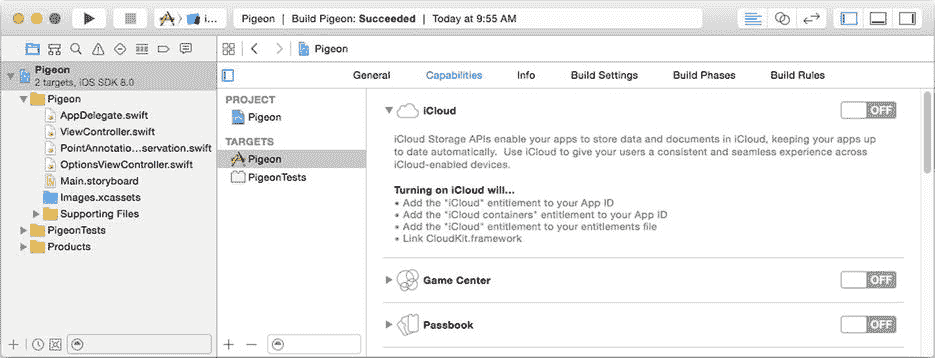
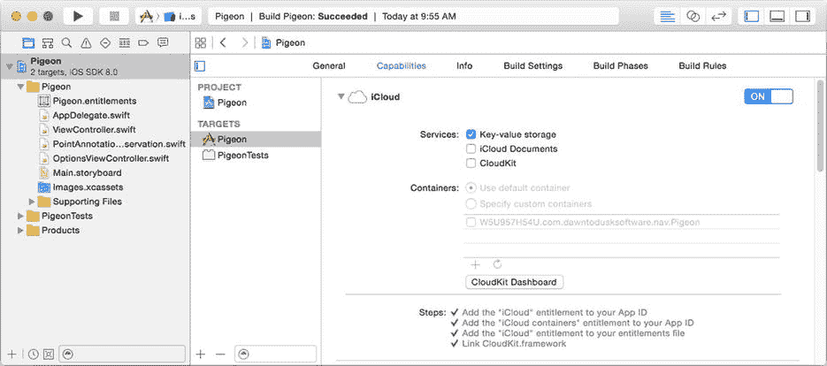
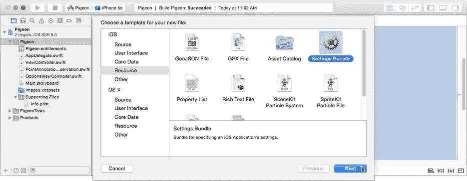
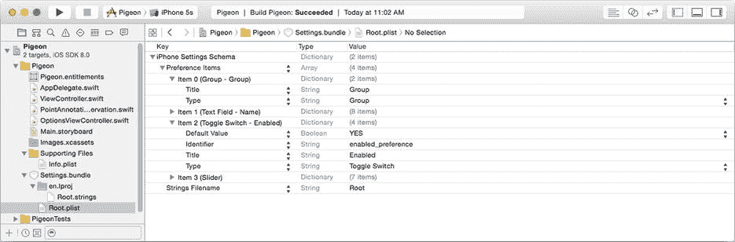
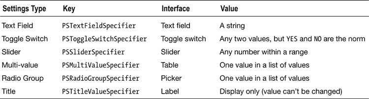
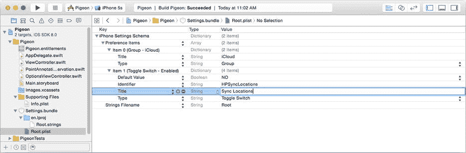
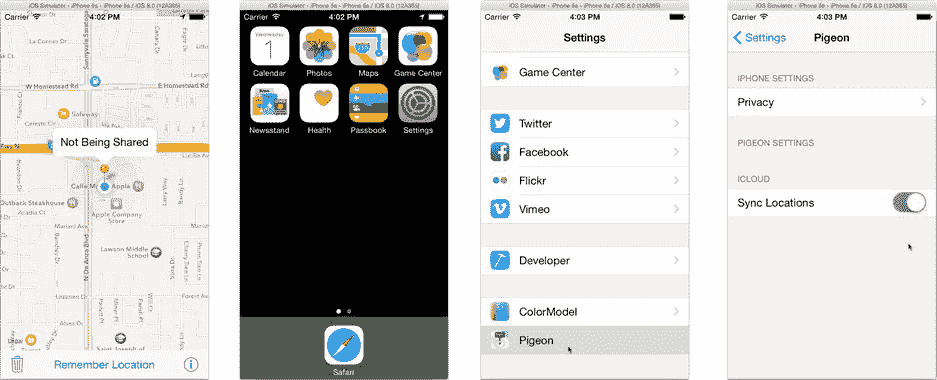

# 排版后内容

你的应用可以在用户偏好中为特定键注册一组默认值——没错，它们就是默认的默认值。当你的代码请求一个值时（`userDefaults.integerForKey("Key")`），用户偏好会检查该键是否已设置过值。如果没有，则返回一个默认值。对于整数类型，该值默认为 `0`——除非你指定了其他数值。你可以使用 `registerDefaults(_:)` 方法来实现这一点。

选择 `AppDelegate.swift` 文件。这是你应用委托对象。它会接收大量关于应用状态的回调。其中之一是 `application(_:,willFinishLaunchingWithOptions:)` 函数。这是应用委托对象接收到的第一个回调，通常也是你编写的代码首次执行的机会。

在文件顶部附近，添加以下 `import` 语句，以便你的新代码能够使用 Map Kit 常量。（你可以在 `Learn iOS Development Projects`  `Ch 18`  `Pigeon-2` 文件夹中找到最终版本。）

```
import MapKit
```

在你的 `AppDelegate` 类中，添加以下函数（如果已存在则更新它）：

```
func application(application: UIApplication, willFinishLaunchingWithOptions 
                                 launchOptions: [NSObject : AnyObject]?) -> Bool {
    let userDefaults = NSUserDefaults.standardUserDefaults()
    let pigeonDefaults = [ PreferenceKey.Heading.rawValue: 
                                                 MKUserTrackingMode.Follow.rawValue ]
    userDefaults.registerDefaults(pigeonDefaults)
    return true
}
```

`registerDefaults(_:)` 函数为用户偏好的主字典建立了一个备用字典。实际上，用户偏好对象管理着按域（domain）组织的多个字典。当你请求检索一个值时，它会依次搜索每个域，直到找到值并返回。`registerDefaults(_:)` 方法在所有其他域之后设置了一个域，因此如果其他域中都不包含 `PreferenceKey.Heading` 的值，这个字典就会提供一个值。

**注意** 用户偏好中的每个域都有其自身的用途和属性。用于存储值的域是持久化的；它会在应用运行之间序列化和保存。注册域则不是持久化的。你传递给 `registerDefaults(_:)` 的值在应用退出时会消失。你可以阅读《偏好和设置编程指南》中的“偏好的组织”章节，了解更多关于域的内容。

现在你可以清理 `viewDidLoad()` 中的代码了。返回 `ViewController.swift`，将之前添加的代码替换为以下内容（更新部分以粗体显示）：

```
let userDefaults = NSUserDefaults.standardUserDefaults()
mapView.mapType = MKMapType(rawValue: UInt(userDefaults.integerForKey( 
                                                PreferenceKey.MapType.rawValue)))!
mapView.userTrackingMode = MKUserTrackingMode(rawValue: userDefaults.integerForKey( 
                                                PreferenceKey.Heading.rawValue))!
```

是不是简单多了？因为你已经注册了一个默认字典，你的代码不再需要担心 `.Heading` 没有值的情况，因为现在总会有一个值。

既然你的地图设置已经是持久化的了，是时候对保存的地图位置做些什么了。

## 将对象转换为属性列表对象

属性列表的最大限制是它们只能包含属性列表对象（`NSNumber`、`NSString`、`NSDictionary` 等）。任何你想存储在用户偏好（或任何属性列表）中的东西，*必须*被转换为这些对象中的一个或多个。以下是存储其他类型值的三种最常见技术：

* 将值转换为字符串
* 将值转换为包含其他属性列表对象的字典
* 将值序列化为 `NSData` 对象

第一种技术足够简单，尤其是有许多 Cocoa Touch 函数可以为你完成这项工作。例如，假设你需要在用户偏好中存储一个 `CGRect` 值。`CGRect` 不是一个属性列表对象——它甚至不是一个对象。你可以将其四个浮点字段分别存储为单独的值，如下所示：

```
let saveRect = someView.frame
let userDefaults = NSUserDefaults.standardUserDefaults()
userDefaults.setFloat(Float(saveRect.origin.x), forKey: "HPFrame.x")
userDefaults.setFloat(Float(saveRect.origin.y), forKey: "HPFrame.y")
userDefaults.setFloat(Float(saveRect.height), forKey: "HPFrame.height")
userDefaults.setFloat(Float(saveRect.width), forKey: "HPFrame.width")
```

而且你还得逆向操作来恢复这个矩形。这看起来很麻烦。幸运的是，有两个函数——`NSStringFromCGRect()` 和 `CGRectFromString()`——可以将矩形转换为字符串对象，然后再转换回来。现在，保存矩形的代码可以这样写：

```
userDefaults.setObject(NSStringFromCGRect(saveRect), forKey: "HPFrame")
```

所以，如果你能找到能将值转换为属性列表对象并转换回来的函数，就使用它们。

第二种技术正是你将用于地图位置的方法。你将编写一对函数。第一个函数将以 `NSString` 和 `NSNumber` 对象组成的字典形式返回 `MKPointAnnotation` 对象的主要属性。第二个方法将使用该字典重新设置这些属性。

首先，在你的项目中添加一个新的 Swift 文件。从模板库中拖拽一个 Swift 文件模板（或选择 New  File... 命令）并将其放入你的项目中。（你可以在 `Learn iOS Development Projects`  `Ch 18`  `Pigeon-3` 文件夹中找到最终版本。）将文件命名为 `PointAnnotationPreservation`。然后在其中编写以下代码：

```
import MapKit

enum LocationKey: String {
    case Latitude = "lat"
    case Longitude = "long"
    case Title = "title'"
}

extension MKPointAnnotation {

var propertyState: [NSObject: AnyObject] {
        get {
            return [ LocationKey.Latitude.rawValue: NSNumber(double: coordinate.latitude),
                     LocationKey.Longitude.rawValue: NSNumber(double: coordinate.longitude),
                     LocationKey.Title.rawValue: title ]
        }
        set {
            let lat = (newValue[LocationKey.Latitude.rawValue] as NSNumber).doubleValue
            let long = (newValue[LocationKey.Longitude.rawValue] as NSNumber).doubleValue
            coordinate = CLLocationCoordinate2D(latitude: lat, longitude: long)
            title = newValue[LocationKey.Title.rawValue] as NSString
        }
    }
}
```

这段代码为 `MKPointAnnotation` 类定义了一个扩展。它添加了一个名为 `propertyState` 的新（计算）属性。获取该属性会返回一个描述注解位置和标题的字典。设置该属性则会根据字典中的值更新注解的位置和标题。

**注意** 扩展为现有类添加额外的方法或属性。你可以用它为不是自己编写的类添加新功能。我在第 20 章中详细解释了扩展的细节。

这个属性允许你以适合用户偏好的形式获取和设置注解的相关属性。现在让我们用它来保存和恢复地图位置。

## 保存和恢复 savedLocation


```markdown
返回`ViewController.swift`。你将使用与保存和恢复地图设置相同的技术来保存和恢复已记忆的地图位置。你将在位置建立时保存位置信息（字典），并在应用重新启动时恢复它。然而，`savedLocation`对象并非简单的整数，因此代码会稍微复杂一些。此外，你现在需要从代码中的两个位置建立新位置：用户设置时以及应用重新启动时。如你所知，我不喜欢重复代码，因此我将让你整合设置位置的代码。这在以后添加第三种设置位置的途径时会派上用场。

总结一下，你需要进行以下更改：

-   定义一个`setAnnotation(_:)`函数来设置或清除已保存的位置。
-   编写`preserveAnnotation()`和`restoreAnnotation()`函数，用于从用户默认设置中存储和检索地图位置。
-   在`saveAnnotation(_:)`和`clearAnnotation(_:)`中添加代码以保存地图位置。
-   在应用启动时恢复任何已记忆的位置。

首先，向`ViewController`类添加新的`setAnnotation(_:)`函数：

```
func setAnnotation(annotation: MKPointAnnotation?) {
    if savedAnnotation != annotation {
        if let oldAnnotation = savedAnnotation {
            mapView.removeAnnotation(oldAnnotation)
            clearOverlay()
        }
        savedAnnotation = annotation
        if annotation != nil {
            mapView.addAnnotation(annotation)
            mapView.selectAnnotation(annotation, animated: true)
        }
    }
}
```

此方法将在整个`ViewController`中用于设置或清除注释对象。它遵循一个通用的 setter 方法模式，处理`savedAnnotation`变量为`nil`、`annotation`参数为`nil`、两者都为`nil`或两者都不为`nil`的情况。它还特意在设置相同注释对象时不执行任何操作。

下一步是创建使用用户默认设置保存和恢复注释对象的函数。将以下代码添加到`ViewController`类：

```
func preserveAnnotation() {
    let userDefaults = NSUserDefaults.standardUserDefaults()
    if let annotation = savedAnnotation {
        userDefaults.setObject( annotation.propertyState, 
                        forKey: PreferenceKey.SavedLocation.rawValue)
    } else {
        userDefaults.removeObjectForKey(PreferenceKey.SavedLocation.rawValue)
    }
}

func restoreAnnotation() {
    let userDefaults = NSUserDefaults.standardUserDefaults()
    if let state = userDefaults.dictionaryForKey(PreferenceKey.SavedLocation.rawValue) {
        let restoreAnnotation = MKPointAnnotation()
        restoreAnnotation.propertyState = state
        setAnnotation(restoreAnnotation)
    }
}
```

第一个函数使用你刚刚编写的`propertyState` getter 将保存的位置转换为属性列表字典。然后将该字典值存储在用户默认设置中。如果没有保存的位置，它会特意移除任何先前存储的值。第二个函数反向操作，从用户默认设置中获取保存的字典，使用它重建一个等效的`MKPointAnnotation`对象，并将其设置为保存的位置。

现在，你可以修改`saveAnnotation(label:)`和`clearAnnotation()`函数，使其使用新的`setAnnotation(_:)`和`preserveAnnotation()`函数（新代码以粗体显示）。

```
func saveAnnotation(# label: String) {
    if let location = mapView.userLocation?.location {
        let annotation = MKPointAnnotation()
        annotation.title = label
        annotation.coordinate = location.coordinate
        setAnnotation(annotation)
        preserveAnnotation()
    }
}

func clearAnnotation() {
    setAnnotation(nil)
    preserveAnnotation()
}
```

**注意** 这是重构的另一个示例。你将维护`savedAnnotation`变量的工作整合到一个新函数中，但保留了现有`saveAnnotation(label:)`和`clearAnnotation()`函数的行为。

只剩下一件事要做。在`viewDidLoad()`中，将以下语句添加到函数末尾：

```
restoreAnnotation()
```

Pigeon 现在拥有了大象般的记忆力！复用你之前测试地图设置的测试流程：

1.  运行 Pigeon。
2.  在地图上记忆一个位置。
3.  按下 Home 键将应用置于后台。
4.  在 Xcode 中停止应用。
5.  再次运行应用。

当应用重新启动时，保存的位置仍然存在。成功！

这个项目演示了在应用中使用用户默认设置的几种常见技术。记住用户偏好、设置和工作数据（例如保存的地图位置）都是用户默认设置的完美用途。

另一个常见用途是保存应用的显示状态。当用户在音乐应用中选择了“艺术家”标签页，并深入点击进入专辑，最终访问一首歌曲时，第二天启动音乐应用时，他们不会惊讶地发现自己位于“艺术家”标签页的同一艺术家、同一专辑、同一首歌曲。这是因为音乐应用付出了努力，记住了用户上次离开的具体视图控制器，并在下次启动时重建了它。

根据你目前所知，你可能会认为需要编写代码来捕获标签视图和导航视图控制器的状态，将其转换为属性列表对象，存储在用户默认设置中，并在应用重新启动时再次展开这一切。这基本上就是发生的事情，但你会很高兴地知道，你不需要（大量）自己完成这项工作。iOS 有一个特定的机制用于保存和恢复视图控制器的状态。

**持久化视图**

在“最小化更新和代码”部分，我说捕获用户默认设置的主要技术是（a）当值发生变化时，以及（b）在可靠的退出点。你在 Pigeon 中使用了技术（a），因为它非常合适。你要保存的值只在少数几个地方更改，并且更改频率很低。但情况并非总是如此。

有些变化不断发生（例如用户当前所在的视图控制器），有些变化以多种不同方式发生，使得捕获所有变化变得困难。在这些情况下，第二种方法是最好的。你无需担心尝试监控甚至关心哪些更改正在发生。只需安排在用户退出应用、关闭视图控制器或退出他们正在使用的任何界面之前捕获该值。有两个退出点是捕获更改的好位置：

-   关闭视图控制器
-   应用进入后台

对于视图控制器，你可以在关闭视图控制器的代码中捕获值。在某些情况下，你可能需要做一些额外的工作，例如弹出视图控制器，因为点击弹出视图外部会隐式关闭它。你可能希望重写视图控制器的`viewDidDisappear(_:)`函数，以免错过那个退出路径。但大多数情况下，捕获视图控制器可以被关闭的所有方式通常相当容易。

**淡入后台**

另一个捕获更改（特别是视图状态）的好时机是应用切换到后台时。要理解这种技术，你需要了解 iOS 应用经历的状态。你的 iOS 应用总是处于以下状态之一：

-   未运行
-   前台
-   后台
-   挂起

你的应用在被启动之前或最终被终止之后处于“未运行”状态。当它未运行时，几乎不会发生任何事情。
```


## 应用生命周期状态

前台状态是你最熟悉的状态。此时你的应用会显示在设备屏幕上，用户正在与其交互。前台状态包含两个子状态：活跃（active）和非活跃（inactive），应用会在这两个状态间切换。活跃状态表示你的应用正在运行。当有电话或提醒等事件中断应用时，会进入非活跃状态，但应用仍显示在屏幕上。应用处于非活跃状态时不会执行代码。非活跃状态通常不会持续太久。

当你按下主屏幕按钮、切换到其他应用或屏幕锁定时，应用会进入后台状态。应用会短暂运行一段时间，但很快会进入挂起状态。

应用一旦被挂起，就不会再执行任何代码。如果 iOS 后续判定需要释放应用所占用的内存，或者用户关闭了设备，你的挂起应用将会（在无警告的情况下）终止，并回到未运行状态。

但你的应用也可能不会被终止。如果用户重新启动你的应用，或仅仅解锁屏幕且应用仍处于后台状态，应用不会被重新启动，而是直接被再次激活。它会直接进入前台状态并立即恢复执行。在应用的生命周期中，可能会多次进入和退出后台状态。

**注意**  你可以进行特殊设置，让你的应用在后台继续运行。例如，即使你的应用不是前台应用，你也可以请求播放音乐或接收用户位置变化。详情请参阅《iOS 应用编程指南》中的“后台执行与多任务”一节。

应用会利用这段短暂的后台处理窗口来为终止做准备。此时用户默认对象会序列化其属性值并保存到持久化存储中，这也是捕获界面状态的最佳时机。

你的应用可以通过两种方式得知自己已进入后台状态。应用委托对象的`applicationDidEnterBackground(_:)`函数会被调用。与此同时，系统会发布一个`UIApplicationDidEnterBackgroundNotification`通知。你可以覆盖该函数，或让任意对象监听该通知，并保存所需的任何状态信息。

**警告**  iOS 会为你的应用预留大约五秒的后台处理时间来保存状态并完成正在进行的任务。应用必须在这段时间内完成收尾工作，或采取明确步骤来启用后台处理。

iOS 还提供了一种机制来捕获并随后恢复视图控制器的状态。当你的应用进入后台状态时，该机制会自动调用。

## 保存视图控制器

以 Wonderland 应用为例。（我是认真的，请先找到第 12 章中完成的 Wonderland 应用。你将对其进行修改。）用户可以整天在标签页之间切换、浏览表格视图中的角色、翻阅页面视图。你需要捕捉应用切换到后台的时刻，记住用户当时激活了哪个标签页以及正在查看书的哪一页。下次启动应用时，你将利用这些信息恢复这些视图。

当 iOS 应用进入后台时，iOS 会检查当前活跃的视图控制器。如果配置正确，它会自动在用户默认设置中保存其状态。这结合了 iOS 已知的视图控制器信息以及你的代码提供的附加信息。具体来说，iOS 会记住正在显示的标签视图、表格视图的滚动位置等。

在此基础上，你可以添加只有你的应用才能理解的自定义信息。对于 Wonderland 应用，你需要记住用户正在阅读的页码。（请记住，页面视图控制器本身没有页码的概念；这是你为页面视图控制器的数据源自定义的内容。）

### 保存与恢复的步骤

首先要解决的是“配置正确”这个前提条件。要让 iOS 为你工作，保存和恢复你的视图控制器，你必须完成以下两个步骤：

1.  实现应用委托函数`application(_:,shouldSaveApplicationState:)`和`application(_:,shouldRestoreApplicationState:)`。
2.  为你的视图控制器分配恢复标识符，从根视图控制器开始。

第一步是告诉 iOS 你需要它在保存和恢复应用视图状态方面提供帮助。这些函数必须实现，并且必须返回`true`，否则 iOS 会忽略你的应用。它们还有第二个作用：如果你有任何自定义的、应用级别的状态信息需要保存，这些函数正是执行该操作的地方。Wonderland 应用没有这样的信息，因此只需返回`true`即可。

打开第 12 章中的 Wonderland 项目，选择`AppDelegate.swift`文件。添加以下两个函数：

```
func application(application: UIApplication, 
                 shouldSaveApplicationState coder: NSCoder) -> Bool {
    return true
}

func application(application: UIApplication, 
                 shouldRestoreApplicationState coder: NSCoder) -> Bool {
    return true
}
```

## 分配恢复标识符

一旦 iOS 获准保存你的视图状态，它会从当前显示的根视图控制器开始，检查是否存在恢复标识符。恢复标识符是一个字符串属性（`restorationIdentifier`），用于标记该视图控制器的状态信息。它也是一个标志，邀请 iOS 保存并最终恢复该视图控制器的状态。如果`restorationIdentifier`属性为`nil`，iOS 会忽略该视图控制器；不做任何保存，也不会恢复任何内容。

然后，iOS 会查找任何设置了`restorationIdentifier`的视图（`UIView`）对象并进行保存。如果根视图控制器是一个容器视图控制器，整个过程会针对每个子视图控制器重复进行，捕获具有恢复标识符的每个视图控制器的状态，并忽略那些没有恢复标识符的视图控制器。

**注意**  搜索可恢复视图控制器时，会跳过任何没有恢复标识符的视图控制器。因此，要保存标签视图控制器内导航视图控制器内表格视图控制器的状态，这些控制器中的每一个都必须有一个恢复标识符，否则将无法捕获表格视图控制器的状态。

你可以通过编程方式设置恢复标识符，但如果你的视图控制器是在 Interface Builder 文件中定义的，那么直接在文件中设置最为简单。在 Wonderland 项目中选择`Main.storyboard`文件。在标签栏控制器场景中选择根标签栏控制器，切换到标识检查器，如图 18-2 所示。找到恢复标识符属性，将其设置为`RootTabBar`。



图 18-2. 设置恢复标识符属性

至此，你已经完成了让 iOS 保存和恢复标签视图控制器状态所需的所有步骤。然而，这并不会带来多大好处。你希望的是，当用户再次启动 Wonderland 应用时，能够重现他们退出时可见的子视图控制器。要实现这一点，每个子视图控制器也必须被恢复。使用标识检查器，选择每个子视图控制器，并根据表 18-1 的指导为它们分配恢复标识符。

表 18-1. Wonderland 视图控制器恢复标识符

| 视图控制器 | 恢复标识符 |
| --- | --- |
| 根标签视图控制器 | RootTabBar |
| `FirstViewController` | Welcome |
| `UINavigationController` | CharacterNav |
| `BookViewController` | Book |

这足以记住并在之后恢复用户退出应用时所查看的顶级标签页。尝试一下吧。


1. 运行 Wonderland 应用。
2. 选择“角色”或“书籍”标签页。
3. 按下主屏幕按钮，将应用推入后台。
4. 稍等片刻。
5. 在 Xcode 中停止应用。
6. 再次运行应用。

恢复标识字符串（Restoration ID）可以是任何你想要的；它们只需要在其他视图控制器的范围内保持唯一。

## 自定义恢复

到目前为止，唯一能被恢复的视图状态是用户所在的标签页。如果用户在浏览某个角色的信息，或者已将书翻到第 87 页，当应用重新启动时，他们将回到角色列表和第 1 页。

决定保留多少视图状态信息取决于你。作为一般规则，用户期望回到他们退出应用前正在做的事情。但这也存在限制。如果用户之前进入了一个模态视图控制器来选择歌曲或输入密码，那么两天后把他们带回那个精确的视图可能没有意义。你需要决定你的恢复逻辑要深入到什么程度。

对于 Wonderland 应用，你肯定希望用户回到他们上次阅读的书页。如果用户必须重新翻过 86 页才能回到昨天阅读的地方，他们会非常恼火。然而，页面视图控制器对书籍数据的组织方式一无所知。这是你在编写 `BookDataSource` 类时自行创建的内容。如果你想保存并恢复用户正在阅读的页面，你必须编写一些代码来实现。

每个具有恢复标识的视图和视图控制器对象在应用进入后台时都会收到一个 `encodeRestorableStateWithCoder(_:)` 调用。在应用启动期间，它会收到一个 `decodeRestorableStateWithCoder(_:)` 消息来恢复自身。如果要保存自定义的状态信息，请重写这两个函数。

选择 `BookViewController.swift` 文件。添加以下常量和两个函数：

```
let pageStateKey = "pageNumber"

override func encodeRestorableStateWithCoder(coder: NSCoder) {
    super.encodeRestorableStateWithCoder(coder)
    let currentViewController = viewControllers[0] as OnePageViewController
    coder.encodeInteger(currentViewController.pageNumber, forKey: pageStateKey)
}

override func decodeRestorableStateWithCoder(coder: NSCoder) {
    super.decodeRestorableStateWithCoder(coder)
    let page = coder.decodeIntegerForKey(pageStateKey)
    if page != 0 {
        let currentViewController = viewControllers[0] as OnePageViewController
        currentViewController.pageNumber = page;
    }
}
```

第一个函数获取当前在页面视图控制器中显示的单个页面视图控制器。`OnePageViewController` 知道它当前显示的是哪一个页码。这个数字被保存在 `NSCoder` 对象中。

**注意**: `NSCoder` 是 iOS 归档框架的主力。它的使用方式是存储值和属性，这些值和属性会被转换为序列化数据。你将在下一章全面了解 `NSCoder`。

当你的应用重新启动时，页面视图控制器收到一个 `decodeRestorableStateWithCoder(_:)` 调用。它会检查 `NSCoder` 对象中是否包含一个已保存的（非零）页码。如果有，它会在视图显示之前恢复该页码，将用户带回他们退出应用时所处的位置。这并不太难，对吧？

测试你的新代码。启动 Wonderland 应用，翻阅几页书籍，然后退出应用并在 Xcode 中停止它。再次启动应用，你最后阅读的那一页将会重新出现，仿佛你从未离开过一样。

## 更深层次的恢复

究竟要保留多少视图状态信息完全取决于你。以下是制定恢复策略的一些提示：

*   `UIView` 对象也可以保存它们的状态。为它们分配一个恢复标识，并在必要时实现 `encodeRestorableStateWithCoder(_:)` 和 `decodeRestorableStateWithCoder(_:)` 函数。请记住，包含这些视图的视图控制器必须有一个恢复标识，此过程才会生效。
*   如果你想恢复表格或集合视图的数据模型状态，你的数据源对象应采用 `UIDataSourceModelAssociation` 协议。然后，你实现两个函数（`indexPathForElementWithModelIdentifier(_:,inView:)` 和 `modelIdentifierForElementAtIndexPath(_:,inView:)`），用于记住和恢复用户在表格中的位置。
*   你可以在应用委托的 `application(_:,shouldSaveApplicationState:)` 和 `application(_:,shouldRestoreApplicationState:)` 函数中编码和恢复任何你想要的内容。你可以使用这些方法执行你自己的视图控制器恢复，或者结合使用自动恢复和自定义解决方案。

详细的细节都在 Xcode 的“文档和 API 参考”窗口中的 *iOS App 编程指南* 的“状态保存与恢复”章节中进行了说明。

## 云中的鸽子

云存储和同步是热门的新技术，它们使 iOS 设备变得更加有用。在一台设备上设置一个约会，它会自动出现在你所有其他设备上。这项魔法背后的技术很复杂，但 iOS 让你的应用能够轻松地利用它。

iOS 中有许多云存储和同步功能，但目前为止，最容易使用的是 `NSUbiquitousKeyValueStore` 对象。它的工作方式几乎与用户默认设置（User Defaults）相同。区别在于，你存储在那里的任何内容都会自动与你的所有其他 iOS 设备同步。哇！

关于你应该或可以同步哪些信息在设备之间，既有实际限制，也有政策约束。你的首要任务是决定分享哪些信息是有意义的。通常，用户设置和视图状态仅在本地保存。在你的 iPhone 上更改地图类型，然后突然导致你 iPad 上的地图视图也随之变化，这会很奇怪。另一方面，如果你的用户正在 iPad 上阅读 *Alice's Adventures in Wonderland*，如果他们能拿起 iPhone，在同一页打开它，那岂不是一种魔法？

另一个需要谨慎选择同步内容的原因是，iCloud 服务严格限制你可以通过 `NSUbiquitousKeyValueStore` 共享的数据量。这些限制如下：

*   总数据量不超过 1MB
*   对象数量不超过 1000 个
*   “合理”数量的更新

苹果并没有明确说明“合理”的具体标准，但最好将对 `NSUbiquitousKeyValueStore` 的更改次数保持在最低限度。

**警告**: 如果你滥用这些限制，iCloud 服务器可能会延迟你的更新，甚至完全停止同步你的数据。

### 在云中存储值

让我们通过添加云同步功能，让你的 Pigeon 应用展翅高飞。你将同步的唯一信息是保存过的地图位置——地图类型和跟踪模式不适合进行同步。你使用 `NSUbiquitousKeyValueStore` 的方式几乎与你使用 `NSUserDefaults` 的方式完全相同。事实上，它们非常相似，以至于你将重用你在本章开头编写的许多相同策略和方法。

你可以通过 `NSUbiquitousKeyValueStore.defaultStore()` 获取对单例 `NSUbiquitousKeyValueStore` 对象的引用。你设置的所有值都会自动序列化并与 iCloud 服务器同步。

选择 `ViewController.swift` 文件，并添加一个变量来保存对单例云存储对象的引用。（你可以在 `Learn iOS Development Projects`  `Ch 18`  `Pigeon-4` 文件夹中找到完成的版本。）

```
var cloudStore: NSUbiquitousKeyValueStore?
```


在`viewDidLoad()`函数开头添加以下语句：

```
cloudStore = NSUbiquitousKeyValueStore.defaultStore()
cloudStore?.synchronize()
```

第一条语句获取云存储对象。调用`synchronize()`会提示 iOS 联系云服务器并更新存储中可能已被其他 iOS 设备更改的任何值，反之亦然。这最终会发生，但此操作会在应用首次启动时加速此过程，并且这是唯一需要调用`synchronize()`的时机。

**注意**：我让您创建并存储对单个`NSUbiquitousKeyValueStore`对象的引用，而不是在需要时才使用`NSUbiquitousKeyValueStore.defaultStore()`，这自有其原因。在本章结束时，一切都会明朗。

现在更新`preserveAnnotation()`函数，使其将注释信息同时存储在用户默认设置和云端（新代码以粗体显示）。

```
func preserveAnnotation() {
    let userDefaults = NSUserDefaults.standardUserDefaults()
    if let annotation = savedAnnotation {
        userDefaults.setObject( annotation.propertyState,
                        forKey: PreferenceKey.SavedLocation.rawValue)
        cloudStore?.setDictionary( annotation.propertyState,
                           forKey: PreferenceKey.SavedLocation.rawValue)
    } else {
        userDefaults.removeObjectForKey(PreferenceKey.SavedLocation.rawValue)
        cloudStore?.removeObjectForKey(PreferenceKey.SavedLocation.rawValue)
    }
}
```

### 云端监控

与用户默认设置不同，云中的值随时可能发生变化。因此，在应用启动时仅读取它们是不够的。您的应用必须准备好随时对变化做出反应。此外，您的 iOS 设备并不总是能访问云端。它可能处于“飞行”模式，蜂窝信号不稳定，或者您为了隐私而在法拉第笼中使用设备。无论如何，您的应用都应在所有这些情况下智能地继续工作。

首选的解决方法是将云设置镜像到本地用户默认设置中。这正是`preserveAnnotation()`所做的。每当位置发生变化时，用户默认设置和云端都会同时更新为相同的值。如果此时无法更新云端，也不会影响应用运行。如果云中的某个值发生变化，您应该相应地更新用户默认设置。

这就引出了观察云端变化的任务。那么，如何得知云端何时发生了变化？在本书的当前阶段，您应该高呼“通知、通知、通知”，因为这正是观察这些变化的方式。您的视图控制器会观察`NSUbiquitousKeyValueStoreDidChangeExternallyNotification`通知（这也是 iOS 中最长的通知名称之一）。您将创建一个新函数来处理这些变化，并且需要注册以接收它们。

在`ViewController.swift`文件中，找到`viewDidLoad()`函数并按下述方式增强设置云存储的代码（新代码以粗体显示）：

```
cloudStore = NSUbiquitousKeyValueStore.defaultStore()
let center = NSNotificationCenter.defaultCenter()
center.addObserver( self,
          selector: "cloudStoreChanged:",
              name: NSUbiquitousKeyValueStoreDidChangeExternallyNotification,
            object: cloudStore)
cloudStore?.synchronize()
```

**注意**：您必须在调用`synchronize()`*之前*注册观察变更通知，否则您的应用可能会错过云端已有的变化。

当云端发生任何变化时，`cloudStoreChanged(_:)`函数将被调用。最后一步是编写该函数。

```
func cloudStoreChanged(notification: NSNotification) {
    let localStore = NSUserDefaults.standardUserDefaults()
    if let cloudInfo = cloudStore?.dictionaryForKey(PreferenceKey.SavedLocation.rawValue) {
        localStore.setObject(cloudInfo, forKey: PreferenceKey.SavedLocation.rawValue)
    } else {
        localStore.removeObjectForKey(PreferenceKey.SavedLocation.rawValue)
    }
    restoreAnnotation()
}
```

每当云端值发生变化时——由于只有一个值，您甚至无需担心是哪个发生了变化——它会检索新值并将其复制到本地用户默认设置中。然后调用`restoreAnnotation()`从用户默认设置中恢复地图位置，此时该位置与云端的值一致。

通过`preserveAnnotation()`和`cloudStoreChanged(_:)`，用户默认设置始终拥有最新的（已知）位置。即使云端同步出现问题，应用在用户默认设置中依然拥有有效的位置，并能正常运行。

最后，考虑一下您之前编写的`restoreAnnotation()`函数。它从未考虑过存在现有地图注释的可能性。这是因为它之前只在应用启动时被调用。现在，它可以在任何时候被调用，用于设置或清除已保存的地图位置。在方法的末尾添加一个`else`子句来处理这种情况（新代码以粗体显示）。

```
func restoreAnnotation() {
    let userDefaults = NSUserDefaults.standardUserDefaults()
    if let state = userDefaults.dictionaryForKey(PreferenceKey.SavedLocation.rawValue) {
        let restoreAnnotation = MKPointAnnotation()
        restoreAnnotation.propertyState = state
        setAnnotation(restoreAnnotation)
    } else {
        setAnnotation(nil)
    }
}
```

## 启用 iCloud

您的所有 iCloud 代码都已准备就绪，但有一个问题：它们都无法运行。在应用可以使用 iCloud 服务器之前，您必须为其添加 iCloud 授权。这反过来要求您向 Apple 注册应用的包标识符（Bundle Identifier）并获取授权证书。这些步骤并不复杂，但却是必需的。

在导航器中选择 Pigeon 项目。确保选中了 Pigeon 目标（从侧边栏或弹出菜单中），并切换到“General”标签。确保您的包标识符是一个有效的（即您拥有的）反向域名，能够唯一标识您的应用（参见第 1 章中的“首次启动 Xcode”）。这是您将向 Apple 服务器注册的标识符，一旦注册，便无法更改。

现在切换到“Capabilities”标签，找到 iCloud 部分，如图 18-3 所示。将其打开。



图 18-3. 定位 iCloud 功能

选择将测试此应用的开发者团队，然后点击“Choose”。Xcode 会将应用的唯一 ID 注册到 iOS Dev Center，并启用该 ID 以使用 iCloud 服务。然后，它将下载并安装必要的授权证书，允许您的应用使用 iCloud 服务器。现在，您应该启用键值存储功能，如图 18-4 所示（如果尚未勾选）。这是`NSUbiquitousKeyValueStore`类所依赖的 iCloud 服务。



图 18-4. 启用 iCloud 的键值存储


当你启用键值存储时，Xcode 会生成一个通用容器标识符，如 Figure 18-4 的“Containers”部分所示。此标识符用于整理和同步你放入 `NSUbiquitousKeyValueStore` 中的所有值。通常，你会使用应用程序的包标识符（这是默认设置）。这可以使你应用的 iCloud 值与用户其他应用的 iCloud 值保持分离。

**提示** 你可以共享由其他应用（你编写并注册的）使用的键值存储标识符。这允许你的应用与另一个应用共享单个键值存储。例如，如果你创建了应用的“精简版”和“专业版”，可以这样做。两个应用可以使用同一个键值存储来共享和同步其设置。

## 测试云

要测试 Pigeon 的云版本，你需要两台已配置的 iOS 设备。iOS 模拟器无法访问通用云存储。两台设备都需要具有有效的互联网连接，登录到同一个 iCloud 帐户，并开启“iCloud 文稿与数据”。

在两台设备上同时启动 Pigeon 应用。在一台设备上点击“记住位置”按钮，为其命名，然后等待。如果一切设置正确，另一台设备上通常会在一分钟内出现一个相同的大头针。尝试在第二台设备上记住一个位置。尝试清除该位置。

**提示** 即使你只有一台 iOS 设备，你也可以通过检查 `synchronize()` 调用返回的值来判断 `NSUbiquitousKeyValueStore` 是否正常工作。如果 `synchronize()` 返回 `true`，则表示云值已成功同步，一切正常。如果返回 `false`，则说明存在问题。可能是网络问题，也可能意味着你的应用标识符、授权或配置文件配置不正确。

你不需要让两个应用同时运行——但这只是体验 iCloud 同步最酷的方式。在一台设备上启动 Pigeon 并记住一个位置。在第二台设备上启动 Pigeon。开始计数，很可能在你数到 20 之前，你就会看到相同的位置出现在第二台设备上。在第二台设备上删除该位置，然后在不到一分钟的时间内，它就会从第一台设备上消失。这是因为通用键值存储只要有互联网连接，就会在后台持续工作，以保持你所有值的同步。

并非所有人都希望他们的地图位置与所有其他设备共享。有些用户会对第一个非云版本的 Pigeon 非常满意。为什么不让你所有的用户都满意，给他们一个选择呢？

添加一个配置设置，以便他们可以选择加入云同步，或者保持关闭。现在的问题是，你把这个设置放在哪里？你把它添加到地图选项视图控制器中吗？你是否创建另一个设置按钮，将用户带到第二个设置视图？也许你会在地图视图上添加一个带有小云图标的小按钮？那会非常可爱。

有很多可能性，但我希望你跳出框框思考。或者，更准确地说，我希望你跳出你的应用来思考。你的任务是创建一个界面，让用户打开或关闭云同步，但不要把它放在你的应用里。困惑吗？别担心，这比你想象的要简单。

## 打包你的设置

*设置捆绑包*是一个属性列表文件，描述用户可以设置的一个或多个用户默认值。看，属性列表的另一个用途。用户不是在应用内设置它们，而是在每个 iOS 系统自带的“设置”应用中设置它们。使用设置捆绑包非常简单。

1.  你创建一个值描述的列表。
2.  iOS 将该列表转换为显示在“设置”应用中的界面。
3.  用户启动“设置”应用并更改其设置。
4.  更新后的值会出现在你应用的用户默认值中。

设置捆绑包对于用户不经常更改并且你不希望其杂乱地出现在应用界面中的设置特别有用。对于 Pigeon，你将创建一个极其简单的设置捆绑包，其中包含一个选项：使用 iCloud 同步。可能的值是开或关（`true` 或 `false`）。让我们开始吧。

### 创建设置捆绑包

在 Pigeon 项目中，选择“新建” “文件”命令（通过文件菜单，或者右键单击或按住 Control 键单击项目导航器）。在 iOS 部分，找到“资源”组，然后选择“设置捆绑包”模板，如 Figure 18-5 所示。（你可以在 `Learn iOS Development Projects`  `Ch 18`  `Pigeon-5` 文件夹中找到此项目的完成版本。）



Figure 18-5. 创建设置捆绑包资源

确保选择了 Pigeon 目标，并将新的“设置”资源添加到你的项目中。

**警告** 不要更改新文件的名称。你的设置捆绑包*必须*命名为 `Settings.bundle`，否则 iOS 将忽略它。

一个设置捆绑包包含一个名为 `Root.plist` 的属性列表文件。此文件包含一个字典。你可以在 Figure 18-6 中看到这一点。`Root.plist` 文件描述了用户在“设置”应用中选择你的应用时首先出现的设置。



Figure 18-6. 来自设置捆绑包模板的属性列表

该字典包含一个键为 `Preference Items` 的数组值。该数组包含一个字典列表。每个字典描述一个设置或组织项。你可以包含的设置类型列在 Table 18-2 中，组织项列在 Table 18-3 中。每种类型的详细信息在 *Preferences and Settings Programming Guide* 的“Implementing an iOS Settings Bundle”章节中描述，你可以在 Xcode 的文档和 API 参考窗口中找到该指南。

Table 18-2. 设置捆绑包值类型



Table 18-3. 设置捆绑包组织类型

| 设置类型 | 键 | 描述 |
| --- | --- | --- |
| 组 | `PSGroupSpecifier` | 将后续的设置组织成一个组 |
| 子列表 | `PSChildPaneSpecifier` | 呈现一个表格项，点击后显示另一组设置，创建设置的层级结构 |

你的设置捆绑包可以邀请用户输入字符串（例如昵称），让他们打开或关闭设置，从值列表（地图、卫星、混合）中选择，或者使用滑块选择一个数字。如果你的应用有很多设置，你可以将它们组织成组，甚至链接到具有更多设置的其他屏幕。

Figure 18-6 中显示的值在单个名为 `Group`（相当乏味）的组中呈现了三个设置。这些设置包括一个文本字段、一个切换开关和一个滑块。

对于 Pigeon，你只有一个布尔设置。选择 `Root.plist` 文件，并使用 Xcode 的属性列表编辑器进行以下更改。你将丢弃滑块和文本字段（你不需要它们），然后重新利用该组和切换开关。


1.  选择“项目 3（滑块）”所在行，然后按下 Delete 键（或选择“编辑”“删除”）。
2.  选择“项目 1（文本字段 - 名称）”所在行，然后按下 Delete 键（或选择“编辑”“删除”）。项目 2 现在将被重命名为项目 1。
3.  展开“项目 0（组 - 组）”所在行。
    1.  将其“标题”的值更改为 iCloud。
4.  展开“项目 1（切换开关 - 已启用）”所在行。
    1.  将“默认值”更改为 NO。
    2.  将“标识符”更改为 `HPSyncLocations`。
    3.  将“标题”更改为 Sync Locations。

你完成的设置束应该看起来像图 18-7 所示。



图 18-7. Pigeon 设置束

### 使用你的设置束值

你的设置束已经完成。剩下要做的就是把刚才定义的值应用到你的应用中。选择 `ViewController.swift` 文件，并添加一个枚举 case（新代码以粗体显示）。

```swift
enum PreferenceKey: String {
    case MapType = "HPMapType"
    case Heading = "HPFollowHeading"
    case SavedLocation = "HPLocation"
    case CloudSync = "HPSyncLocations"
}
```

找到 `viewDidLoad()` 函数，并在你的云存储设置代码周围添加以下条件判断（新代码以粗体显示）：

```swift
if userDefaults.boolForKey(PreferenceKey.CloudSync.rawValue) {
    cloudStore = NSUbiquitousKeyValueStore.defaultStore()
    let center = NSNotificationCenter.defaultCenter()
    center.addObserver( self,
              selector: "cloudStoreChanged:",
                  name: NSUbiquitousKeyValueStoreDidChangeExternallyNotification,
                object: cloudStore)
    cloudStore?.synchronize()
}
```

现在，只有当用户在“设置”应用中打开了 `.CloudSync` 开关时，你的 `cloudStore` 对象才会被设置和初始化。

就是这样！如果你在问“但是代码中那些向 `cloudStore` 存储值的地方怎么办？”，你不用担心这些。你现有的代码利用了 Swift 的可选项特性，可以忽略对 `nil` 对象调用的函数。如果 `.CloudSync` 值是 `false`，`cloudStore` 永远不会被设置并保持为 `nil`。当你在属性或函数调用前用 `?` 后缀对象名时（例如 `cloudStore?.setDictionary(...)`），Swift 会首先检查 `cloudStore` 是否包含一个引用。如果它是一个有效的对象，就调用该函数。但如果它是 `nil`，则什么也不做并跳转到下一条语句。最终结果是，当 `cloudStore` 设置为 `nil` 时，Pigeon 不会对 iCloud 的通用键值存储做任何更改，也不会收到任何更改通知。关于完整的解释，请参见第 20 章中的“可选链”部分。

### 测试你的设置束

运行 Pigeon，如图 18-8 所示。如果你仍然连接着两台 iOS 设备，你可以验证你的应用是否不再将地图位置保存到云端。每个应用都独立运行。



图 18-8. 测试设置束

在 Xcode 中，停止你的应用。这将使你回到主屏幕（图 18-8 中的第二张图片）。找到你的“设置”应用并启动它。向下滚动直到找到 Pigeon 应用（图 18-8 中的第三张图片）。点击它，你就会看到你定义的设置（图 18-8 右侧）。

在两个设备上都打开“同步位置”设置，然后再次运行你的应用。这一次，Pigeon 使用 iCloud 同步来共享地图位置。

