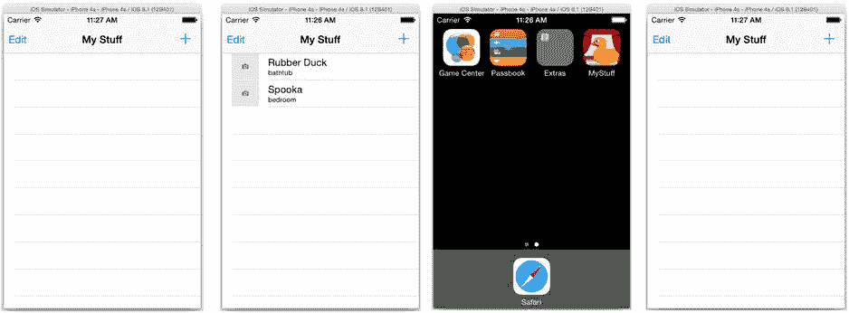
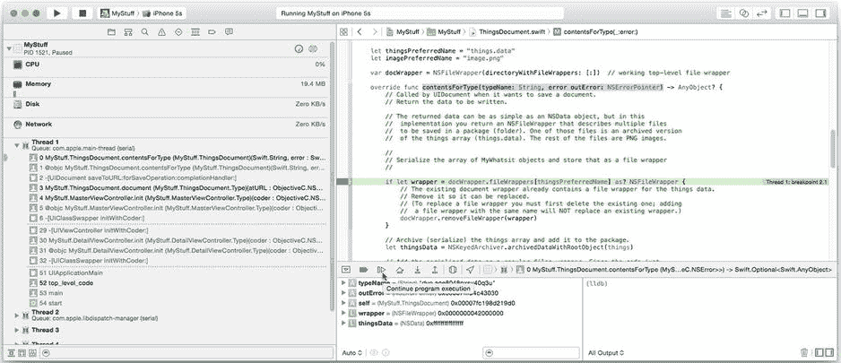
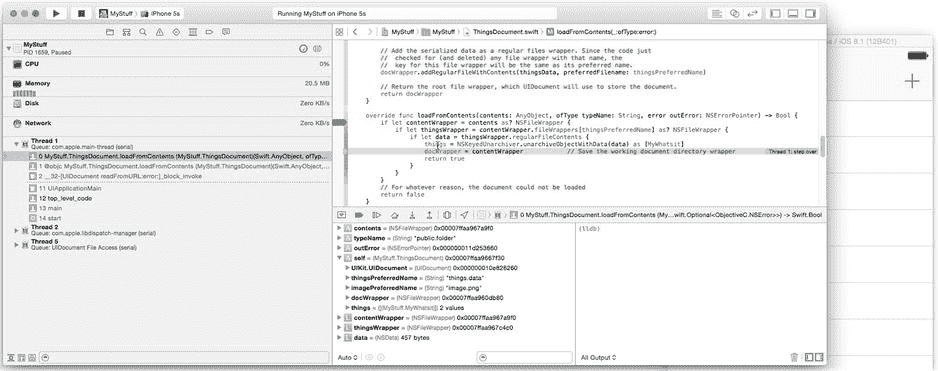
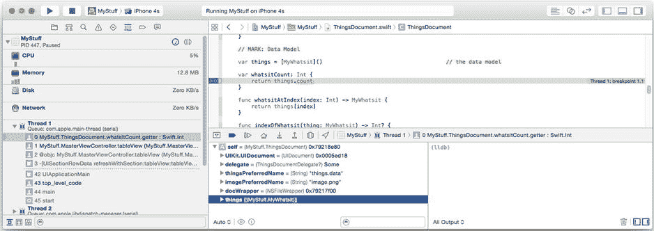
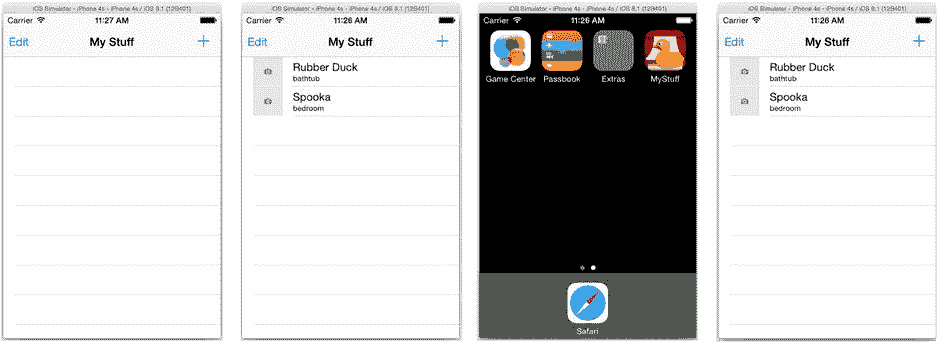
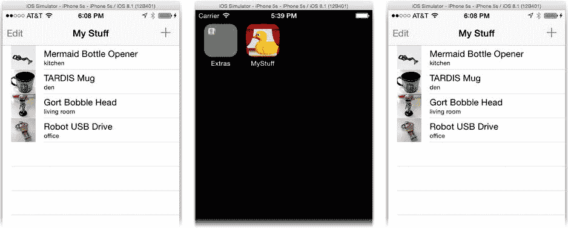
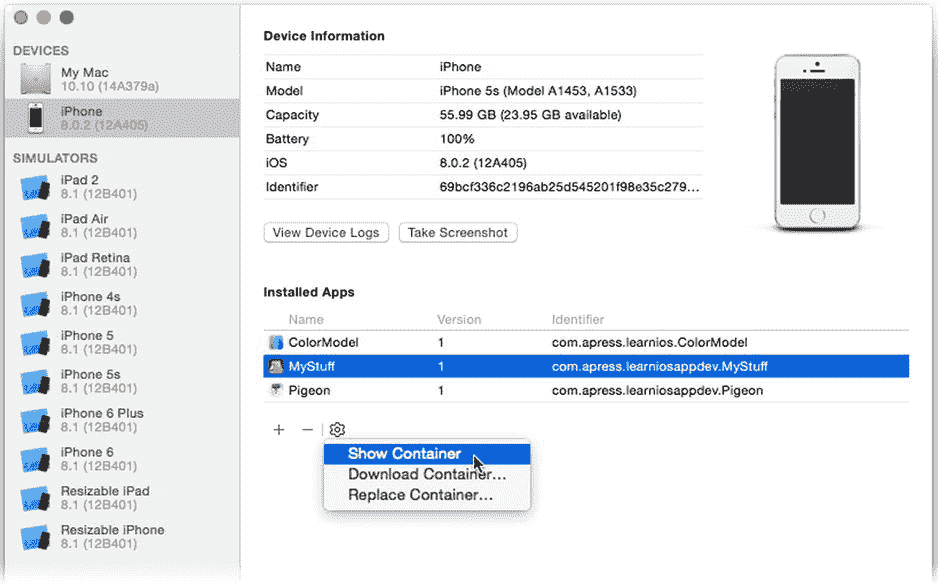
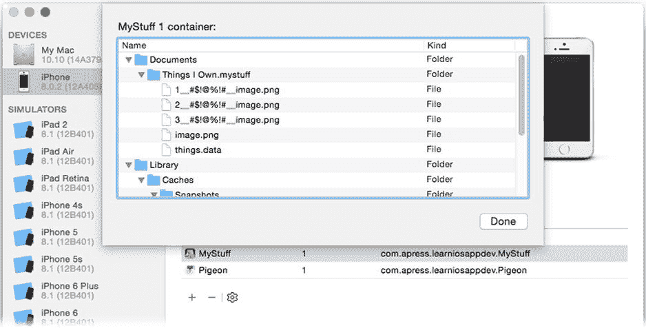

# 排版后的文本

函数`anotherWhatsit()` -> `(object: MyWhatsit, index: Int)` {
```
    let newThing = MyWhatsit(name: "My Item \(whatsitCount+1)")
    things.append(newThing)
    return (newThing, things.count-1)
}
```

这些方法的目的显而易见。视图控制器现在将调用这些函数来计数项目数量、获取特定索引处的项目、查找现有项目的索引、删除项目或创建新项目。下一步是更改视图控制器以使用此接口。选择你的`MasterViewController.swift`文件。将`var things: [MyWhatsit]...`声明替换为以下内容：

```
var document = ThingsDocument.document()
```

你的文档对象现在就是你的数据模型。你还移除了用于测试而创建虚假项目的代码。现在你的应用正在使用文档，它会在你创建项目时保存它们。现在你需要遍历视图控制器代码，将所有对旧的`things`数组的引用替换为文档的等效代码。

**提示** 你的文件现在充满了编译器错误。这不是很棒吗？我一直使用这种技术。当我需要重新定义或重新调整属性值时，我会故意更改属性/变量的名称——哪怕是暂时的。Xcode 会立即将所有对旧名称的引用标记为错误。这成为我需要进行更改的路线图。如果我喜欢原始属性名称，我会在一切正常后恢复它。

其余的工作主要是将使用`things`的代码替换为使用`document`的代码。找到`insertNewObject(_:)`函数并将其修改为如下所示（修改后的代码以粗体显示）：

```
func insertNewObject(sender: AnyObject) {
    let fresh = document.anotherWhatsit()
    let indexPath = NSIndexPath(forRow: fresh.index, inSection: 0)
    self.tableView.insertRowsAtIndexPaths([indexPath], withRowAnimation: .Automatic)
}
```

`document`对象现在负责创建新的`MyWhatsit`对象——当你处理`MyWhatsit`图像的代码时，你会理解原因。代码还从文档中获取新对象的索引，而不是假设它被插入到数组的开头或结尾。这是一个明智的更改，因为`anotherWhatsit()`函数实际上有一天可能会改变主意。如果你曾经修改过它，此代码仍然可以工作。

另一个“大”更改在`whatsitDidChange(_:)`函数中。按如下所示修改它（修改后的代码以粗体显示）：

```
func whatsitDidChange(notification: NSNotification) {
    if let changedThing = notification.object as? MyWhatsit {
        if let index = document.indexOfWhatsit(changedThing) {
            let path = NSIndexPath(forItem: index, inSection: 0)
            tableView.reloadRowsAtIndexPaths([path], withRowAnimation: .None)
        }
    }
}
```

在数组中查找对象的循环被替换为执行相同操作的函数调用。其余更改非常普通，我在此处进行了总结。（提示：只需跟随编译器错误的踪迹，将`things`语句替换为等效的`document`语句。）

* 在`tableView(_:,numberOfRowsInSection:)`中，语句`things.count`变为`document.whatsitCount`。
* 在`tableView(_:,cellForRowAtIndexPath:)`和`prepareForSegue(_:)`中，表达式`things[indexPath.row]`变为`document.whatsitAtIndex(indexPath.row)`。
* 在`tableView(_:,commitEditingStyle:,forRowAtIndexPath:)`中，表达式`things.removeAtIndex(indexPath.row)`变为`document.removeWhatsitAtIndex(indexPath.row)`。

你的`ThingsDocument`对象现在是你应用的数据模型。这是一个重要的步骤。将文档和数据模型合并为一个对象并不重要，但重要的是你将所有对数据模型的更改（计数、获取、删除和创建项目）封装在自己的方法后面，而不是仅仅使用数组方法。你很快就会明白原因。

你可能会认为你已经编写了足够的代码，使你的应用能够将`MyWhatsit`对象（至少是名称和位置信息）存储在文档中并再次检索它们。但是文档拼图仍然缺少几个小部分。

## 跟踪更改

你还没有编写任何保存文档的代码。你已经编写了将数据模型对象转换为可保存格式的代码，但你从未请求`UIDocument`对象保存自身。

而且你也不会这样做。

至少，这不是理想的技术。`UIDocument`采用了*自动保存文档模型*，其中用户的文档在操作期间定期保存到持久存储，并在应用退出前自动再次保存。这是 iOS 应用首选的文档保存模型。

为了使自动保存工作，你的代码必须通知文档已进行了更改。然后`UIDocument`会在后台安排并执行新数据的保存。有两种方法可以向文档传达更改：调用`updateChangeCount(_:_)`函数或使用文档的`NSUndoManager`对象。当你向`NSUndoManager`注册更改时，它会自动通知其文档对象有关更改的信息。

**注意** 使用撤销管理器和自动保存的替代方法是显式调用`saveToURL(_:,forSaveOperation:,completionHandler:)`（或密切相关的函数之一）来保存文档。这将意味着一个更像传统桌面应用程序的界面，用户必须刻意保存他们的文档。

对于这个应用，你不会使用`NSUndoManager`——尽管它是一个值得考虑的伟大功能，而且使用起来并不困难。因此，你需要在每次发生更改时调用文档对象的`updateChangeCount(_:)`函数。`UIDocument`会处理后续工作。

那么，你的数据模型何时会发生变化？一个明显的地方是添加或删除项目时。选择`ThingsDocument.swift`文件。找到`removeWhatsitAtIndex(_:)`和`anotherWhatsit()`函数。在`removeWhatsitAtIndex(_:)`的末尾以及在`anotherWhatsit()`中的`return`语句之前，添加以下语句：

```
updateChangeCount(.Done)
```

此消息告诉文档对象其内容已更改，并且这些更改是`.Done`的。还有其他类型的更改（例如，由于撤消或重做操作导致的更改），但除非你创建了自己的撤销管理器，否则这是你需要传递的唯一常量。

文档发生更改的另一个地方是用户编辑单个项目时。你早在第 4 章就已经解决了这个问题！每当编辑`MyWhatsit`对象时，你的对象会发布一个`MyWhatsitDidChange`通知。你的文档需要做的就是观察该通知。

仍在你的`ThingsDocument.swift`文件中，添加以下初始化和反初始化方法：

```
override init?(fileURL url: NSURL) {
    super.init(fileURL: url)
    let center = NSNotificationCenter.defaultCenter()
    center.addObserver( self,
              selector: "thingsDidChange:",
                  name: WhatsitDidChangeNotification,
                object: nil)
}

deinit {
    NSNotificationCenter.defaultCenter().removeObserver(self)
}
```

初始化方法注册你的文档以接收`WhatsitDidChangeNotification`通知，反初始化方法在文档对象被销毁前取消注册。

最后，添加新的通知处理方法。

```
func thingsDidChange(notification: NSNotification) {
    if indexOfWhatsit(notification.object as MyWhatsit) != nil {
        updateChangeCount(.Done)
    }
}
```

它唯一的目的就是通知文档此文档中的`MyWhatsit`对象已更改，并且它正是这样做的。

## 测试你的文档


想必您现在已经编写了足够多的代码，足以看到文档的实际运行效果。在模拟器或已配置的设备上运行您的应用程序。首次启动时，界面是空的，如图 19-1 左侧所示。请为几个项目输入详细信息。



图 19-1. 测试文档存储

现在，等待大约 20 秒，或者按下主页按钮将应用程序推入后台状态。当您创建新项目时，文档会收到变更通知。`UIDocument` 的自动保存功能会在用户没有其他操作时定期保存文档，并在应用程序移至后台状态时立即保存。

在数据安全保存到文档后，停止应用程序并从 Xcode 再次运行它。您之前输入的项目列表应该会出现，以奖励您的辛勤工作。

然而，您看到的却是一个空白屏幕，如图 19-1 右侧所示。

那么，哪里出错了？也许您的文档在应用程序启动时没有被打开？也许它一开始就没有被保存？您知道的是，代码中肯定存在一个错误；是时候使用调试器了。

### 设置断点

切换回 Xcode，在您的 `contentsForType(_:,error:)` 方法中，通过点击代码左侧的装订线区域来设置一个断点，如图 19-2 所示。断点会显示为一个蓝色标签。



图 19-2. 在 `contentsForType(_:,error:)` 中设置断点

在您的设备或模拟器上卸载“我的物品”应用程序。（长按主屏幕上的“我的物品”应用图标，直到它开始抖动，点击删除[x]按钮，确认删除应用，然后再次按下主页按钮。）这将删除您的应用程序以及存储在设备上的所有数据，包括任何文档。再次运行应用程序。Xcode 将重新安装该应用，并以全新状态启动。

几乎立刻，Xcode 就会在 `contentsForType(_:,error:)` 函数的断点处停下，如图 19-2 所示。如果您查看左侧的堆栈跟踪，可以看到 `contentsForType(_:,error:)` 函数是由 `document()` 函数调用的，而 `document()` 函数又是由 `MasterViewController.init()` 调用的。这表明，当文档不存在时，系统会调用 `contentsForType(_:,error:)` 来创建初始的空文档。请记住，当文档不存在时，`document()` 所做的第一件事就是通过保存空文档对象来创建一个文档。

### 单步执行代码并检查变量

那么，我们知道空文档已被保存。下一步呢？点击调试器工具栏中的“继续”按钮（同样显示在图 19-2 中）。这将让您的应用程序恢复正常执行。添加一些新对象，然后稍等片刻或按下主页按钮将应用程序推入后台。Xcode 将再次停在 `contentsForType(_:,error:)` 的断点处。这表明您的文档在您对其做出更改时正在进行自动保存。到目前为止，一切顺利。

如果文档被正确写入，那也许问题出在加载环节。在 `loadFromContent(_:,ofType:,error:)` 方法中设置另一个断点，然后再次运行应用程序，如图 19-3 所示。一旦 Xcode 停在该函数内，点击“单步跳过”按钮（紧挨着“继续执行”按钮）来一次执行一条语句。反复点击，直到设置 `things` 数组的语句被执行，如图 19-3 所示。



图 19-3. 单步执行 `contentsForType(_:,error:)`

**提示** “单步跳过”会执行源代码中的一条完整语句，并在执行完毕后停止。“单步进入”会执行一条语句；如果该语句是一个函数调用，则会进入该函数内部并再次停止。“单步跳出”允许执行完当前函数的剩余部分，并在返回到其调用者时再次停止。

这是用于加载文档内容的函数。它会对数据进行解归档，并填充 `things` 数组。查看工作区窗口底部的调试器区域，您将看到该函数中的所有活动变量。其中之一是 `self`，即正在被操作的文档对象。展开它以检查其属性值。在其中，您会找到一行类似于以下内容的语句：

```
things = ([MyStuff.MyWhatsit]) 2 values
```

该语句表明，您的文档对象的 `things` 属性由一组 `MyWhatsit` 对象组成的数组，并且当前包含两个对象。这太棒了！这意味着您的文档已成功读取，并且之前序列化的数据已被重构为两个 `MyWhatsit` 对象。

那么，为什么它们没有显示在您的表格视图中呢？让我们来找出原因。定位到 `whatsitCount` 属性，并在其唯一的返回语句上设置一个断点。（保留其他已设置的断点。）再次运行您的应用程序。表格视图首先会做的事情之一，就是通过其数据源委托获取表格中的行数。而该函数又会读取您的 `whatsitCount` 属性。果然，一旦您运行应用程序，Xcode 就会在您的 `whatsitCount` 属性 getter 方法处停下，如图 19-4 所示。



图 19-4. 检查 `whatsitCount` 属性

再次，在调试窗格中展开 `self` 变量并查看 `things` 属性。这次它是空的。您已经找出问题所在了吗？点击“继续执行”按钮，让您的应用程序运行。接下来发生的事情是，您将命中断点 `loadFromContent(_:,ofType:,error:)`。您现在搞清楚问题了吗？

**提示** 顺便说一句，这被称为“分而治之”调试技术。判断您的代码应该执行什么操作，在流程中间某处设置一个断点，并观察该步骤是否正确执行。如果不正确，问题要么就在此处，要么在代码更早的位置。如果正确执行，那么问题就在此之后。选择另一个断点并重复此过程，直到找到错误。

问题就在这里。`UIDocument` 的 `openWithCompletionHandler(_:)` 函数（从 `document()` 中调用）是*异步*的。它会在后台启动检索文档数据的过程，并立即返回。您的应用程序代码继续执行，显示表格视图，而此时的数据模型仍然是空的。

过了一段时间，文档的数据加载完成，并传递给 `loadFromContents(_:,ofType:,error:)` 以转换成数据模型。这个转换是成功的，但表格视图对此一无所知，并继续显示它认为的空列表。

您的文档需要做的，是在数据模型更新后通知您的视图控制器，以便表格视图能够刷新自身。您可以使用通知来实现这一点，但我认为最合理的解决方案是使用委托函数。作为额外收获，您将获得创建自己协议的经验。

**提示** 将断点拖出装订线区域即可移除。将断点拖到新位置即可重新定位。单击断点可禁用或启用它。

## 创建 `ThingsDocument` 委托

定义一个全新的委托协议。您可以为了这个协议专门向项目中添加一个新的 Swift 文件，但由于它与 `ThingsDocument` 类紧密相关，我建议将其直接添加到 `ThingsDocument.swift` 文件中。

```
protocol ThingsDocumentDelegate {
    func gotThings(document: ThingsDocument)
}
```


该协议定义了一个包含单个函数（`gotThings(_:)`）的协议，当你的文档对象从文档中加载新内容时，会调用该函数。在 `ThingsDocument` 类中，添加一个新的委托属性，如下所示（新增代码以**粗体**标注）：

```
class ThingsDocument: UIDocument, ImageStorage {
    var delegate: ThingsDocumentDelegate?
```

找到 `document(atURL:)` 函数。将打开文档的语句修改为以下内容（修改后的代码以**粗体**标注）：

```
document.openWithCompletionHandler() { (success) in
    if success {
        document.delegate?.gotThings(document)
    }
}
```

修改后的代码会在文档加载完成后执行一个操作，其中包括对数据模型对象进行解归档。现在，它会调用委托函数 `gotThings(_:)`，从而让委托对象（你的视图控制器）知道数据模型已发生改变。

切换到 `MasterViewController.swift` 文件，让你的视图控制器成为文档委托对象（新增代码以**粗体**标注）。

```
class MasterViewController: UITableViewController, ThingsDocumentDelegate {
```

找到 `awakeFromNib()` 函数，并在末尾添加一条语句，使视图控制器成为文档的 `delegate` 对象（新增代码以**粗体**标注）。

```
document.delegate = self
```

最后，编写协议函数 `gotThings(_:)`，如下所示：

```
func gotThings(_: ThingsDocument) {
    tableView.reloadData()
}
```

再次运行你的应用，如图 19-5 所示，瞧！文档中的数据就出现在表格视图中了。



图 19-5。工作中的文档

进行修改或添加新项目。按下 Home 键，给 `UIDocument` 一个保存文档的机会，然后停止应用，重新启动，你的修改将会保留。MyStuff 唯一不保存的内容是你添加的任何图片。这是因为图片不属于归档对象数据的一部分。你将直接把图片数据添加到文档的目录包装器中，所以接下来要解决这个问题。

**提示** 调试  停用断点命令会禁用项目中的所有断点，让你能够不间断地运行和测试应用。

## 存储图片文件

在前面的章节中，你学习了序列化数据模型对象、将其存储在文档文件中以及重新检索它们的所有基础知识。图片数据的存储方式与 `MyWhatsit` 对象中的其他属性不同。其工作原理如下：

- 当一个新的或更新过的图片（`UIImage`）对象被添加到 `MyWhatsit` 对象时，该图片会被转换为可移植网络图形（PNG）数据格式，并以文件包装器的形式存储在文档中。`MyWhatsit` 对象会记住该文件包装器的键。
- 当文档被保存时，`UIDocument` 会将文档包装器中所有文件包装器的数据包含进来。图片文件包装器的键由 `MyWhatsit` 对象进行归档。
- 当文档再次被打开时，图片数据的文件包装器对象会被恢复。
- 当客户代码请求 `MyWhatsit` 对象的图片属性时，`MyWhatsit` 会使用其保存的键来定位并加载文件包装器中的数据，最终将其转换回原始的 `UIImage` 对象。

这种设计的关键（无意双关）在于 `MyWhatsit` 对象与文档对象之间的关系。`MyWhatsit` 对象将使用文档对象来存储，并在之后检索单个图片的数据。然而，从软件设计的角度来看，我们希望将实际存储和检索图片数据的代码保留在 `MyWhatsit` 对象之外。单一职责原则鼓励 `MyWhatsit` 对象做好自己的事情（表示数据模型中的值），而文档对象也做好自己的事情（管理文档数据的存储和转换），避免用一方的职责污染另一方。

解决方案是在 `ThingsDocument` 类中创建一个**抽象层**或**抽象服务**，用于存储和检索图片。`MyWhatsit` 仍将发起图片管理，但这些图片如何转换为文件包装器的具体机制则保留在 `ThingsDocument` 内部。让我们开始吧。

在 `ThingsDocument.swift` 文件中添加第二个协议，如下所示：

```
protocol ImageStorage {
    func keyForImage(newImage: UIImage?, existingKey: String?) -> String?
    func imageForKey(key: String?) -> UIImage?
}
```

该协议定义了一个服务，用于存储和检索图片。第一个函数将存储、替换或移除存储中的图片，并返回一个可用于后续检索的键。第二个函数执行检索操作。你的 `ThingsDocument` 类将提供此服务，因此将其添加到它的功能列表中（修改后的代码以**粗体**标注）。

```
class ThingsDocument: UIDocument, ImageStorage {
```

现在修改 `MyWhatsit`，使其使用这些方法来保存和恢复其图片属性。选择 `MyWhatsit.swift` 文件，并添加两个新属性，如下所示，一个用于图片存储提供者，另一个用于记住图片在存储中的键：

```
var imageStorage: ImageStorage?
var imageKey: String?
```

现在重写 `image` 属性。你将把它从一个简单的存储属性改成一个计算属性，该属性在请求时从 `imageStore` 延迟获取图片，并在设置时将图片编码到 `imageStore` 中。按如下方式重写 `var image`（新增代码以**粗体**标注）：

```
var image: UIImage? {
    get {
        if image_private == nil {
            image_private = imageStorage?.imageForKey(imageKey)
        }
        return image_private
    }
    set {
        image_private = newValue
        imageKey = imageStorage?.keyForImage(newValue, existingKey: imageKey)
        postDidChangeNotification()
    }
}
private var image_private: UIImage?
```

你已经重构了 `image` 属性，使其能够从外部源存储和检索其图片，具体的实现细节只有 `imageStorage` 知道。使用 `image` 属性的代码无需更改。就应用的其余部分而言，你的 `MyWhatsit` 对象仍然有一个可以获取或设置的 `image` 属性。

为了在下次加载文档时检索图片，你的新 `MyWhatsit` 对象必须记住从 `keyForImage(_:,existingKey:)` 返回的键。修改你的 `NSCoding` 函数，如下所示，以便 `imageKey` 属性也能被序列化（新增代码以**粗体**标注）：

```
let nameKey = "name"
let locationKey = "location"
let imageKeyKey = "image.key"

required init(coder decoder: NSCoder) {
    name = decoder.decodeObjectForKey(nameKey) as String
    location = decoder.decodeObjectForKey(locationKey) as String
    imageKey = decoder.decodeObjectForKey(imageKeyKey) as? String
}

func encodeWithCoder(coder: NSCoder) {
    coder.encodeObject(name, forKey: nameKey)
    coder.encodeObject(location, forKey: locationKey)
    coder.encodeObject(imageKey, forKey: imageKeyKey)
}
```

**注意** 你的 `NSCoding` 方法不会对对象的 `image` 或 `document` 属性进行编码或解码。当对象被解归档时，这些属性值将为 `nil`。这使得它们成为**瞬态**属性。通过归档保留的属性称为**持久**属性。

至此，对 `MyWhatsit` 类的大部分修改就完成了。现在，你实际上需要提供你在协议中承诺的图片存储服务。选择 `ThingsDocument.swift` 文件。首先编写图片存储函数，如下所示：


`keyForImage(newImage:existingKey:)`函数如下：

```swift
func keyForImage(newImage: UIImage?, existingKey: String?) -> String? {
    if let key = existingKey {
        if let wrapper = docWrapper.fileWrappers[key] as? NSFileWrapper {
            docWrapper.removeFileWrapper(wrapper)
        }
    }
    var newKey: String? = nil
    if let image = newImage {
        let imageData = UIImagePNGRepresentation(image)
        newKey = docWrapper.addRegularFileWithContents(imageData,
                                     preferredFilename: imagePreferredName)
    }
    updateChangeCount(.Done)
    return newKey
}
```

`newImage`参数要么是要存储的图像，要么是`nil`（表示不应存储图像）。图像通过转换为 PNG 文件格式并存储为常规文件包装器中的数据来保存。

`existingKey`参数是之前存储图像的键，如果没有则为`nil`。如果提供了该键，则首先用于丢弃之前存储的图像文件。

函数返回用于检索存储图像（如果有）的键。通过使用不同的值和`nil`组合，该函数可用于存储新图像（有图像，无键）、替换图像（有图像和键）或删除图像（无图像，有键）。

### 检索图像

上述函数负责在文档中存储新图像以及用新图像替换现有图像。现在添加从文档中检索图像的代码，如下所示：

```swift
func imageForKey(imageKey: String?) -> UIImage? {
    if let key = imageKey {
        if let wrapper = docWrapper.fileWrappers[key] as? NSFileWrapper {
            return UIImage(data: wrapper.regularFileContents!)
        }
    }
    return nil
}
```

此函数使用`imageKey`在文档中查找文件包装器，调用包装器的`regularFileContents()`函数检索其数据，并使用该数据重构原始的`UIImage`对象，然后将其返回给调用者。

**注意**：常规文件包装器所表示的数据在调用其`regularFileContents()`函数之前不会读入内存。文件包装器只是持久化存储中数据的轻量级占位符，直到你请求这些数据为止。

### 删除图像

巧妙的是，还有一处会从文档中移除图像——当用户删除`MyWhatsit`对象时。找到`removeWhatsitAtIndex(_:)`函数。在该方法开头添加代码，以在移除项目之前，移除该项目的图像文件包装器。

但这段代码应该是什么样的？就像你不希望数据模型类密切了解图像如何存储在文档中一样，你的文档对象也不应密切了解数据模型类如何使用`ImageStorage`。因此，让我们将这种了解保留在`MyWhatsit`类中。将以下代码添加到`removeWhatsitAtIndex(_:)`函数中（新代码以粗体显示）：

```swift
func removeWhatsitAtIndex(index: Int) {
    let thing = whatsitAtIndex(index)
    thing.willRemoveFromStorage()
    thing.imageStorage = nil
    things.removeAtIndex(index)
    updateChangeCount(.Done)
}
```

你不是直接移除它的图像文件包装器，而是简单地让`MyWhatsit`对象知道它即将从文档中移除。然后它会自行处理移除自身所需的一切。最后，你将其与文档（图像）存储断开连接，使其再次表现为独立的`MyWhatsit`对象。

哦，你最好将那个函数添加到你的`MyWhatsit.swift`文件中，如下所示：

```swift
func willRemoveFromStorage() {
    imageStorage?.keyForImage(nil, existingKey: imageKey)
    imageKey = nil
}
```

## 连接文档与数据模型

所有从文档中保存、检索和删除图像的机制都已就位。遗憾的是，它们都不会工作。`MyWhatsit`必须通过其`imageStore`属性连接到正在工作的`ThingsDocument`对象，这些新代码才能起作用。目前，还没有人设置该属性。

那么，`imageStore`属性应该在何处设置，以及哪个对象应该负责设置它？答案是`ThingsDocument`对象。它应该负责维护自身与其数据模型对象之间的连接。

事实证明，这是一个非常容易解决的问题，因为只有两个位置会创建`MyWhatsit`对象：解档文档时以及用户创建新项目时。从`anotherWhatsit()`函数开始，添加一条语句来设置新对象的`imageStore`属性（新代码以粗体显示），如下所示：

```swift
func anotherWhatsit() -> (object: MyWhatsit, index: Int) {
    let newThing = MyWhatsit(name: "My Item \(whatsitCount+1)")
    newThing.imageStorage = self
```

**注意**：诸如`anotherWhatsit()`之类的函数被称为工厂方法。*工厂方法*会为客户端创建新的、正确配置的对象。这些对象可能是不同的类，或者需要以特殊方式初始化——例如添加到集合中并在返回前设置其`imageStore`属性——再返回。编写工厂方法来创建那些需要以调用者不应负责的方式创建的对象。

找到`loadFromContents(_:ofType:error:)`函数。在`things`数组解档之后立即添加一个循环，将此文档指定为所有对象的图像存储（新代码以粗体显示）。

```swift
things = NSKeyedUnarchiver.unarchiveObjectWithData(data) as [MyWhatsit]
for thing in things {
    thing.imageStorage = self
}
docWrapper = contentWrapper
return true
```

你的文档实现终于完成了！通过运行 MyStuff 来试一试。添加一些项目，附加一些图片，然后退出应用程序，如图 19-6 所示。在 Xcode 中停止应用程序并重新启动。所有项目及其图片都保留在文档中。



图 19-6. 测试图像存储

**注意**：在匆忙为`MyWhatsit`对象添加图像存储功能的过程中，我想确保你没有错过一个显著的事实：你并未更改数据模型的接口。任何使用`MyWhatsit`对象的代码（例如`DetailViewController`中的代码）都不需要修改。这是因为`image`属性的含义和用法从未改变。唯一改变的是这些数据如何存储。这就是封装和重构的效果。

如果你在已配置的设备上运行 MyStuff，你可以在 Xcode 的设备窗口（Window  Devices）中查看应用的文档文件。打开设备窗口并选择你的设备，设备上安装的应用程序就会列出，如图 19-7 所示。选择 MyStuff 应用程序，然后选择“Show Container”命令，同样如图 19-7 所示。



图 19-7. 显示 MyStuff 的沙盒容器

在出现的面板中（见图 19-8），你可以浏览构成应用沙盒的文件。你可以清楚地看到应用`Documents`文件夹中的`Things I Own.mystuff`文档包。那些奇怪的文件名（例如`1__#$!@%!#__image.png`）是`UIDocument`处理两个或多个具有相同首选名称的文件包装器的方式。它会为文件分配奇葩的名称，以便它们都可以存储在同一目录中。



图 19-8. MyStuff 沙盒中的文件

如果你需要获取这些文件，请改用“Download Container”命令（见图 19-7）。Xcode 会将文件从你的 iOS 设备复制到你的硬盘驱动器，你可以在那里使用它们。

## 杂项


