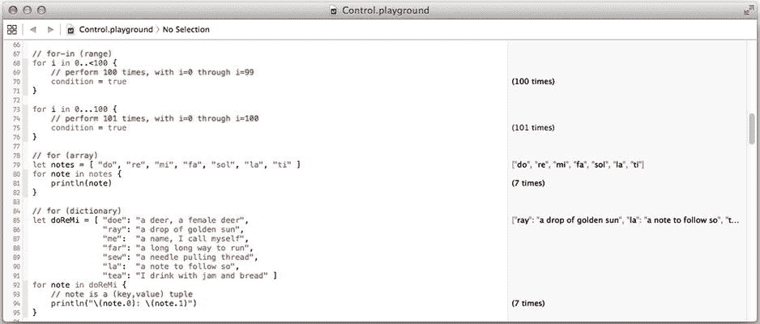

# 访问控制

到目前为止，您应该已经理解本章的大部分内容。唯一尚未提及的关键字是访问控制指令。变量或函数的可见性决定了哪些代码可以访问它们。表 20-1 列出了这些选项。

**表 20-1.** 访问控制指令

| 指令 | 含义 |
| --- | --- |
| `public` | 任何代码都可以使用此属性或函数。 |
| `internal` | 只有定义该类的应用或框架内的代码才能访问此属性或函数。 |
| `private` | 只有此类中的函数才能访问此属性或函数。 |

当我说“访问”时，是指在任何语句中引用该属性或调用该函数。`internal`关键字仅在开发框架时才有意义。它是`private`和`public`之间的中间地带。对于同一应用或框架内的代码，它的行为类似于`public`访问。对于应用或框架外部的代码，它的行为类似于`private`访问。

**注意：** 如果您省略访问控制，则默认为`internal`。几乎在所有情况下，这意味着您的属性和函数将是`public`。如果您开始在框架中使用您的类，则需要使用`public`关键字显式声明您的公共接口。

## 游乐场

但不要只相信我的话。创建一个新的游乐场，并尝试本章中的任何代码片段，或您想在 Swift 中尝试的任何其他内容。游乐场是一个交互式 Swift 文档，可以同时编译并运行您放入其中的任何代码。

从 Xcode 的“文件”菜单中选择“新建”“游乐场”命令，或者创建一个新文件并选择“游乐场”模板。为游乐场指定一个文件名并保存在某个位置。您现在拥有一个空白画布来尝试 Swift 功能，如图 20-1 所示。



**图 20-1.** Swift 游乐场

您在左侧输入代码，结果会出现在右侧。右侧窗格将向您显示设置了哪些值、表达式的结果是什么、循环运行了多少次、函数返回的最后一个值等等。更改您的代码后，所有内容都会重新计算。

本章大部分章节都有游乐场文件。它们包含了此处描述的代码片段，以及额外的示例和注释。本章的游乐场文件可以在`Learn iOS Development Projects` `Ch 20`文件夹中找到，并且都有相当明显的名称。本节的游乐场文件是`Classes.playground`。

## 属性

*属性*是归属于该类实例（即对象）的值。有两种属性：存储属性和计算属性。*存储属性*在对象内分配变量空间以保留一个值。您按如下方式声明一个存储属性：

```
class ClassStoringProperties {
    let constantProperty: String = "never changes"
    var variableProperty: Int = 1
}
```

`let`定义了一个常量（不可变）属性。`var`定义了一个变量（可变）属性。您可以获取两者的值，但只能更改（改变）`var`的值。

一个属性有名称、类型和可选的默认值。您可以省略类型或值。如果您省略类型，则会根据您为其设置的值来推断类型，如下所示：

```
let constantProperty = "never changes"
var variableProperty = 1
```

这两个属性与之前的两个属性完全相同。它们的类型（`String`和`Int`）是从其默认值的类型推断出来的。如果您没有指定属性的类型，其类型将是您为其设置的值的类型。

在 Swift 中，*所有*变量在声明时必须被初始化。严格禁止声明没有设置初始值的变量或常量。这消除了由未初始化变量引起的整类常见编程错误。

在类（或结构体）内部，您可以稍微放宽此规则。您可以声明一个没有默认值的存储属性，只要您在对象初始化时提供其初始值。在类中，编写以下内容是合法的：

```
var uninitializedProperty: Int
```

如果这样做，您必须提供一个初始化函数，在对象可以被使用之前将`uninitializedProperty`设置为一个值。我将在本节稍后部分介绍初始化程序的要求。

## 计算属性

*计算属性*，有时被称为*合成属性*，是由代码块计算出的属性值。它们没有与之关联的变量存储，但通常在计算中使用其他存储属性。以下是计算属性的示例：

```
class ClassCalculatingProperties {
    var height: Double = 0.0
    var width: Double = 0.0
    var area: Double {
        get {
            return height * width
        }
        set(newArea) {
            width = sqrt(newArea)
            height = width
        }
    }
}
```

这个类有两个存储属性和一个计算属性。计算出的`area`属性可以像任何其他属性一样使用，如下所示，但其取值时的值由属性`get`块中的代码决定。这被称为属性的*getter*。getter 是必需的。

```
let calculatingObject = ClassCalculatingProperties()
calculatingObject.height = 9.0
calculatingObject.width = 5.0
let area = calculatingObject.area /* area = 45.0 */
```

如果您希望该属性是可变的，您也可以提供一个*setter*函数，如图所示。`set(newArea)`代码块的参数包含要设置的值。如果您省略 setter，则该属性是只读的。这也意味着您可以使用一种省略`get { ... }`部分的简写语法，如下所示：

```
var area: Double { return height * width }
```

即使只读计算属性返回的值永远不会改变，您仍然必须使用`var`关键字声明该属性。逻辑是值可能会改变——Swift 无法知道是否改变——因此必须声明为变量。

## 属性观察者

您还可以将代码附加到存储属性。当存储属性被设置时，您有两个机会执行代码：`willSet`和`didSet`代码块。您可以在存储属性之后立即声明它们，就像计算属性一样，如下所示：

```
class ObservantView: UIView {
    var text: String = "" {
        didSet(oldText) {
            if text != oldText {
                setNeedsDisplay()
            }
        }
    }
}
```

在这个例子中，每当`text`属性被赋值时，`didSet(oldText)`块中的代码就会执行。`didSet`代码块在属性被更新*之后*执行；参数包含先前的值。这里，它用于确定字符串是否实际发生了变化，并且仅在发生变化时重绘视图。

类似地，`willSet`代码块在存储属性被更新*之前*执行。它的单个参数是要设置的新值。如果您想覆盖正在设置的值，可以在`didSet`函数中将属性的值更改为不同于已设置的值。

**提示：** 当编写`set`、`willSet`和`didSet`代码块时，您可以为单个参数选择一个名称，也可以省略它。如果您省略它，Swift 会分别提供一个名为`newValue`、`newValue`或`oldValue`的参数供您在代码中使用。

您不能附加在读取存储属性时执行的代码。并且您不能将属性观察者附加到计算属性。后者会是多余的，因为 setter 代码可以执行属性观察者可以做的任何事情。


