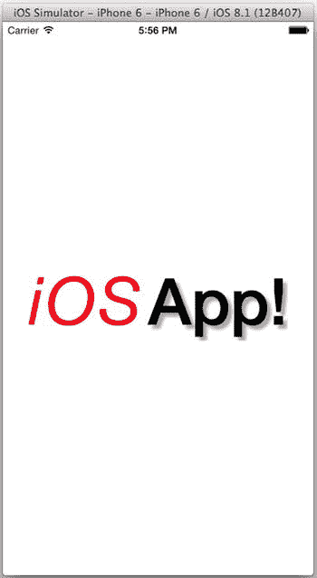

# 浮点数

浮点数有两种类型：`Float` 和 `Double`。`Float` 始终是 32 位，`Double` 始终是 64 位。

在 32 位处理器上运行 Swift 程序时，`Int` 和 `UInt` 类型的宽度为 32 位（相当于 `Int32` 和 `UInt32`）。为 64 位处理器编译时，它们都是 64 位宽。iOS Foundation 库定义了 `CGFloat` 类型。为 32 位处理器编译时，它是 32 位（`Float`）；在 64 位处理器上，则为 64 位（`Double`）。Cocoa Touch 框架广泛使用了 `CGFloat`。

## 隐式类型转换

与你可能遇到的大多数计算机语言不同，Swift 没有隐式类型转换。当你赋值变量、传递参数值或对两个值执行操作时，提供的值必须*精确*匹配期望的类型（只有少数例外，稍后会谈到）。下面的例子展示了这一点：

```
var signed: Int = 1
var unsigned: UInt = 2
var double: Double = 3.0
var float: Float = 4.0
signed = unsigned // <-- 无效
unsigned = signed // <-- 无效
double = float    // <-- 无效
```

Swift 能够推断类型（让你无需重复输入类型）的原因之一，是因为数字或表达式是什么类型从来没有任何歧义，也绝不可能通过赋值或转换意外丢失数值精度。这也意味着你必须有意转换任何类型不正确的值。

这就是我建议尽可能使用 `Int` 的原因。如果你的所有整数都是 `Int`，就不需要做任何转换。

如果你有一种类型但需要另一种类型，则必须显式创建所需的类型。创建整数和浮点类型的方式与创建对象、结构和枚举完全相同。下面的代码通过创建新的、兼容的类型，修复了前面展示的类型不匹配问题：

```
signed = Int(unsigned)
unsigned = UInt(signed)
double = Double(float)
```

`Int` 类型拥有接受所有其他整数和浮点类型的初始化器，反之亦然。通常，如果转换无法完成，这些构造函数会通过抛出异常来防止数据丢失。下面的例子会导致错误，因为 300 这个整数值无法用 8 位整数表示：

```
let tooBigToFit = UInt8(300) // 错误
```

唯一的例外是浮点数值的整数初始化器。这些初始化器会静默地截断数值的小数部分。表达式 `Int(2.6)` 的结果将是整数值 `2`。

## 数字字面量

相比之下，数字字面量灵活得多。Swift 能识别多种数字格式，如表 20-2 所示。

表 20-2. 字面量数字格式

| 形式 | 描述 |
| --- | --- |
| `123` | 正整数 |
| `-86` | 负整数 |
| `0xa113cafe` | 十六进制数 |
| `0o557` | 八进制数 |
| `0b010110110` | 二进制数 |
| `1.5` | 浮点数 |
| `6.022e23` | 带指数的浮点数 |
| `0x2ff0.7p2` | 带指数的十六进制浮点数 |

任何数字字面量都可以包含前导零，并混合使用下划线以提高可读性。这都不会改变数值。这让你可以写 `23_000_000_000` 而不是 `23000000000`。如果字面量的类型未被暗示或指定，表 20-2 中的前五种格式会产生一个 `Int` 值。其余三种格式则为 `Double`。在下面的例子中，变量是 `Double` 类型，因为字面量默认为 `Double` 类型且你未指定类型：

```
let avogadroNumber = 6.022_141_29e23
```

然而，当你将字面量赋值给变量或将其作为参数传递时，Swift 会尽可能地将字面量转换为接收类型。这几乎是 Swift 自动为你转换类型的唯一场景。在下面的例子中，一个整数字面量被赋值给一个 `Double` 变量：

```
var double: Double = 3
```

字面量 `3` 是一个整数。但由于你将它赋值给一个浮点变量，Swift 会自动将 `3` 转换为 `3.0`，就像你写了 `var double: Double = Double(3)` 一样。

## 数字也是类型

出乎意料的是，在 Swift 中，即使是简单的数字类型也是完整的类型。数字类型可以拥有计算属性和方法，并且可以通过扩展进行扩展。下面的扩展为 `Int` 类型添加了一个 `casualName` 属性：

```
extension Int {
    var casualName: String {
        switch self {
            case 0:
                return "no"
            case 1:
                return "just one"
            case 2:
                return "a couple"
            case 3:
                return "a few"
            default:
                return "many"
        }
    }
}
```

现在，任何 `Int` 值都有一个可以像其他任何属性一样使用的属性。下面的代码会打印消息“There are a few people here for ice cream.”

```
let headCount: Int = 3
println("There are \(headCount.casualName) people here for ice cream.")
```

标准数字类型已经拥有许多有用的属性。例如，`min` 和 `max` 属性返回该类型能表示的最小值和最大值。表达式 `Int.max` 将是你可以在 `Int` 变量中存储的最大正数。

## 溢出和下溢

Swift 拥有常用的数学运算集：加法（`+`）、减法（`-`）、乘法（`*`）、除法（`/`）、取余（`%`）、自增（`++`，前缀和后缀形式）和自减（`--`，前缀和后缀形式）。还有一套标准的重新赋值运算符：加等于（`+=`）、减等于（`-=`）、乘等于（`*=`）、除等于（`/=`）等等。再加上位移运算符（`<<` 和 `>>`）、按位逻辑运算（`&`、`|` 和 `^`）以及布尔逻辑运算符（`&&` 和 `||`）。你应该熟悉所有这些运算符。如果有具体问题，请参考 iBooks 中的《Swift 编程指南》。

Swift 在所有算术运算中严格检查溢出和下溢。如果你增加一个整数，而结果超出了该类型能表示的范围，Swift 会抛出程序异常。在下面的例子中，两个数相乘的结果超过了 `Int.max` 的值，导致程序终止：

```
let big: Int = 999_999_999
let bigger: Int = 9_999_999_999
let wayTooBig = big * bigger // <-- 溢出
```

如果你有理由接受或忽略这种情况，Swift 提供了一组忽略溢出和下溢的运算符：忽略溢出乘法（`&*`）、忽略溢出除法（`&/`）、忽略溢出取余（`&%`）、忽略溢出加法（`&+`）、忽略溢出减法（`&-`）等。

## 字符串和字符

字符串和字符是 Swift 中的基础类型。Swift 中的 `String` 是一个值类型。这意味着如果你将字符串作为参数传递，你传递的是该字符串的一个副本，而不是对原始字符串的引用。作为一种值类型，字符串可以是变量（可变）或常量（不可变），如下所示：

```
var string: String = "Hello!"
let immutableString: String = "Salut!"
```

### 字符串和字符字面量

字符串字面量写在双引号之间。字符串字面量可识别多种转义序列，所有转义序列都以单个 `\`（反斜杠）字符开头。表 20-3 显示了可以在字符串中包含的转义码。

表 20-3. 字符串字面量转义码


### Swift 字符串详解

#### 转义序列

| 转义序列 | 字符串中的字符 |
| --- | --- |
| `\\` | 一个 `\` 字符 |
| `\"` | 一个 `"` 字符 |
| `\'` | 一个 `'` 字符 |
| `\t` | 水平制表符 |
| `\r` | 回车符 |
| `\0` | 空字符 |
| `\u{`*nnnn*`}` | 十六进制代码为 *nnnn* 的 Unicode 标量 |
| `\(`*expression*`)` | 表达式的字符串表示（字符串插值） |

Swift 对字符字面量使用相同的语法。字符串字面量的默认类型是 `String` 类型。但与数字字面量类似，当单个字符的字符串字面量被赋值给 `Character` 类型，或者你显式创建了一个 `Character` 值时，Swift 会将其转换为字符字面量。以下示例演示了这一点：

```
let thisIsAString = "String"
let thisIsAlsoAString = "c"
let thisIsACharacter = Character("c")
let thisIsAlsoACharacter: Character = "c"
```

当期望的类型是 `Character` 时，包含单个字符的字符串字面量会被转换为 `Character` 类型。否则，它会表现得像 `String` 类型。

如果你需要创建一个空的 `String`，可以使用空字符串字面量（`""`）或创建一个空的 `String` 值（`String()`）。

#### Unicode

Swift 完全支持 Unicode 字符集。所有 Swift 字符串都使用 Unicode 编码。此外，Swift 源文件接受 Unicode 编码，因此你可以直接在程序的源文件中包含任何 Unicode 字符。以下字符串字面量是一个完美的例子：

```
let hungary = "Üdvözlöm!"
```

Unicode 字符在 Swift 语言中也是可接受的。变量、类、方法、参数和属性名称都可以包含 Unicode 字符。基本上，任何不属于 Swift 语言本身的字符在符号名中都是有效的。以下两个变量名在 Swift 中都是合法的，并且可以在任何普通变量名使用的地方使用。（请参阅 `Learn iOS Development Projects`  `Ch 20`  `Strings.playground` 文件，查看使用 Emoji 字符的变量名示例。）

```
let olá = "Hello!"
let π = 3.14159265359
return π * (r*r)
```

**提示** Swift 字符串由 ASCII 双引号字符（`"`，Unicode 0x22）分隔。更符合印刷习惯的“花引号”（例如包围“curly quotes”这个词的引号）不会被识别为字符串分隔符。这意味着你可以在字符串中包含单花引号和双花引号而无需转义，就像这样：`"Rose said "Let's Go!""`.

Unicode 编码通常是透明的，但偶尔会产生奇怪的副作用。Swift 使用一种特定的编码风格，要求某些 Unicode 字符由两个或多个值表示。某些字符串方法会处理字符串中的各个值，而其他方法则会解释字符串中的字符。在以下示例中，`tricky` 值包含一个由两个 Unicode 标量组成的 Unicode 字符：

```
let tricky = "\u{E9}\u{20DD}" // é
```

如果你查询这个字符串的 `length`，它会返回 2。如果你查询它有多少个字符，它会返回 1。有关详细信息，请参阅 *The Swift Programming Guide* 中关于 Unicode 字符编码和转换的章节。

#### 字符串插值

字符串插值只是一个花哨的名称，用于在字符串字面量中嵌入表达式。表达式会被转换为字符串，并成为结果字符串的一部分。你在前面的章节中已经多次看到这一点。在以下示例中，`aboutPi` 变量被设置为 "The value of π is approximately 3.14159265359."

```
let aboutPi = "The value of π is approximately \(π)"
let truth = "The character count of \"\(tricky)\" is \(countElements(tricky))"
```

之前创建的 `π` 变量被解释并转换为字符串，然后替换了字符串字面量中的 `\(`*expression*`)`。表达式可以是任何 Swift 可以转换为字符串的内容（公式、对象、函数调用）。

**提示** 要想让自定义类的对象将自己转换为字符串，请重写 `description` 属性。

虽然极其方便，但字符串插值没有提供任何格式化控制。表达式会按照 Swift 认为的最佳方式转换为字符串；你只能接受或放弃。如果你需要控制值的格式化方式，例如你想将一个整数值转换为十六进制，可以求助于 `NSString` 类。以下示例使用 `NSString(format:)` 初始化器来创建一个具有精确格式的字符串：

```
let aboutPi: String = NSString(format: "The value of %C is about %.4f", 0x03c0, π)
```

以 `%`（百分号）开头的格式说明符可以执行多种转换，并且你可以对其格式进行大量控制。例如，`%f` 转换可以限制小数点后的有效数字位数。在这个例子中，它被限制为四位数字。数字 `0x03c0` 本来可以转换为十进制或八进制数字，但这里使用 `%C` 将其转换为其 Unicode 字符。结果得到的 `NSString` 被赋值给 `aboutPi` 变量，这将我们引向下一个主题。

#### 字符串即 NSString

Swift 的 `String` 值可以与 Objective-C 的 `NSString` 对象互换使用。你可以在需要 `NSString` 对象引用的地方使用 `String` 值，反之亦然。在上一节中，创建了一个 `NSString` 对象，然后将其赋值给 `aboutPi: String` 变量。你可以像使用任何 `String` 一样使用它，然后将其传递给任何期望 `NSString` 参数的函数。

然而，Swift 仍然将 `String` 值和 `NSString` 对象视为不同的类型。如果你创建了一个 `String` 值，Swift 假定它只具有 `String` 的方法和属性。如果你有一个 `NSString` 变量，Swift 假定它只具有 `NSString` 类的方法和属性——尽管它实际上两者都具备。要在 `String` 值上使用 `NSString` 的方法，只需将一种类型转换为另一种类型，如下所示：

```
let sparkRange = (string as NSString).rangeOfString("spark")
let objcString = string as NSString
let words = objcString.componentsSeparatedByString(" ")
```

在第一条语句中，`String` 值被临时转换为 `NSString` 类型，并用于调用 `rangeOfString(_:)` 函数。在第二条语句中，字符串再次被转换为 `NSString` 对象，但随后被赋值给一个变量。由于变量的类型是 `NSString`，你无需转换即可使用任何 `NSString` 的属性或方法。你也可以反向操作，将任何 `NSString` 对象转换为 `String` 值。

**注意** 一个 `String`，即使它是可变的，也不能被转换为 `NSMutableString` 对象。

`NSString` 是一个庞大的类，拥有许多有用的函数。相比之下，`String` 类型拥有的函数非常少。通过将 `String` 转换为 `NSString`，你可以立即获得对 `NSString` 大量功能的访问权限。请参阅 `NSString` 类文档以了解其提供的功能。

#### 字符串拼接

`String` 值提供的一个功能是字符串和字符拼接。`+` 运算符可以通过拼接两个字符串来创建一个新字符串，如下所示：

```
let message = "Amber says " + hungary
```

你可以使用 `+=` 运算符将一个字符串添加到可变字符串的末尾。你也可以使用 `append(_:)` 函数来追加一个字符串或单个字符，如下所示：

```
var mutableString = "¡Hola!"
mutableString += " James"
let exclamation: Character = "!"
mutableString.append(exclamation)
```

当这段代码执行完毕时，`mutableString` 变量包含 "¡Hola! James!"

#### 属性字符串


您在本章中已经看到许多`UIView`类和绘图方法使用的是属性字符串，而非普通字符串。*属性字符串*会将属性值与字符串中的字符范围关联起来。属性可以表示字符的字体（字体系列、字号、样式）、颜色、排版调整（字符间距）、对齐方式（右对齐、上标、下标）、文本装饰（下划线、删除线）等。属性字符串非常灵活，能够描述各种复杂的排版。虽然概念上并不复杂，但在实际使用中可能会有些繁琐。

属性以值字典的形式表示。键用于标识属性的种类。然后，该字典与一个字符范围关联。以下示例展示了如何构建属性字符串，您可以在`/Learn iOS Development Projects/Ch 20/AttributedString`项目中找到这些示例：

```
let fancyString = NSMutableAttributedString(string: "iOS ")
let iOSAttrs = [ NSFontAttributeName:            UIFont.italicSystemFontOfSize(80),
                 NSForegroundColorAttributeName: UIColor.redColor(),
                 NSKernAttributeName:            NSNumber(integer: 4) ]
fancyString.setAttributes(iOSAttrs, range: NSRange(location: 0, length: 3))
```

第一段代码从一个普通字符串创建了一个可变属性字符串。然后，它创建了一个字典，定义了三个属性：80 号的斜体系统字体、红色以及 4 磅的字距（字符间距）。这些属性被应用于字符串的前三个字符。请注意，空格字符（字符串中的第四个字符）没有属性。

该技术使用了`NSMutableAttributedString`类。当您希望逐步组合属性字符串，或希望为字符串中的特定范围分配不同属性时，请使用此类。下一个示例使用了一种更简单的技术：

```
let shadow = NSShadow()
shadow.shadowOffset = CGSize(width: 5, height: 5)
shadow.shadowBlurRadius = 3.5

let appAttrs = [ NSFontAttributeName:           UIFont.boldSystemFontOfSize(78),
                 NSShadowAttributeName:         shadow ]
let secondString = NSAttributedString(string: "App!", attributes: appAttrs)
```

第二种技术直接从字符串和属性字典创建了一个属性字符串。`appAttrs`字典描述了 78 号的系统粗体字体。它还应用了一个投影，其偏移量为（5.0，5.0），模糊半径为 3.5。当以这种方式创建属性字符串时，属性会应用于所有字符，并且该对象是不变的。

```
fancyString.appendAttributedString(secondString)
label.attributedText = fancyString
```

最后，第二个属性字符串被追加到第一个字符串。追加的字符串保留其所有属性。现在，`fancyString`对象有八个字符，前三个字符有一套属性，后四个字符有另一套属性，而两者之间的空格字符仍然没有属性。所有属性都有默认值，每个字符对任何缺失的属性都将使用默认值。

当属性字符串被分配给`UILabel`时（如图 20-2 所示），其属性决定了它的绘制方式。



图 20-2。标签中的属性字符串

以下是使用属性字符串的一些提示：

*   属性字符串*不是*`String`或`NSString`的子类。它包含一个`NSString`（即它的`string`属性），但它不是`NSString`，您不能将它用作`String`或`NSString`。
*   如果属性适用于整个字符串，您可以使用`NSAttributedString(string:,attributes:)`创建一个同质化的、不可变的属性字符串。
*   如果您想创建一个包含多种不同属性的属性字符串，则必须创建一个`NSMutableAttributedString`并逐步构建它。
*   使用可变属性字符串，您可以为某个字符范围设置属性（`setAttributes(_:,range:)`），这会替换该范围之前的任何属性。您还可以添加（`addAttributes(_:,range:)`）或移除（`removeAttributes(_:,range:)`）属性。这些方法会与现有属性结合，或从现有属性中选择性地移除。

**注意**：切勿通过修改已分配给某个范围的属性字典中的值对象来更改属性。您必须始终替换属性来更改它们。

在 Xcode 的“文档和 API 参考”窗口中查找 *NSAttributedString UIKit Additions Reference*。“常量”部分列出了 iOS 支持的所有属性键以及为每个键应提供的值对象类型。

## 集合

Swift 有两种原生集合类型：数组和字典。数组是有序的值集合。您通过数值索引访问单个元素。字典将键映射到值。您使用其键访问每个元素。字典有时被称为*关联数组*。

您已经在本书中一直使用数组和字典。我不会赘述细节（尽管很多可以在 *The Swift Programming Guide* 中找到），但这里有一些您应该了解的事情。

首先，所有 Swift 数组和字典都有类型；它们不是通用的集合对象。一个`[Int]`类型的数组只能存储`Int`值。对于字典，您需要同时指定键的类型和值的类型。声明数组类型的首选语法是`[Type]`。对于字典，则是`[Type:Type]`，其中第一个是键的类型，第二个是值的类型。以下示例展示了一些数组变量的声明：

```
var emptyArrayOfInts: [Int] = []
var anotherEmptyArrayOfInts = [Int]()
var arrayTypeInferredFromElements = [ 1, 2, 3 ]
var arrayWithADozenPis = Double
```

`emptyArrayOfInts`被显式声明为`Int`值数组。其默认值为一个空数组。`anotherEmptyArrayOfInts`变量具有相同的类型，从其默认值的类型推断而来。这是用于创建特定类型空数组的语法。`arrayTypeInferredFromElements`也是一个`Int`值数组。Swift 通过查看字面量数组中值的类型来确定其类型。

最后，`arrayWithADozenPis`变量使用了一个特殊的数组初始化器，该初始化器生成一个任意大小的数组，并用相同的值填充每个元素。以下是字典的一些示例：

```
var emptyDictionary = [String:String]()
var dictionaryTypesInferredFromElements = ["red": UIColor.redColor() ]
```

`emptyDictionary`包含一个空字典，它将`String`键映射到`String`值。`dictionaryTypesInferredFromElements`变量具有`String`键和`UIColor`值，这些值从默认值推断而来。

字面量数组的语法是`[` *元素*`,` *元素* `]`。字面量数组可以包含任意数量（甚至零个）的元素，用逗号分隔。字面量字典的书写形式为`[` *键*`:` *值*`,` *键*`:` *值* `]`。如果您将集合赋值给变量或参数，所有元素、键和值必须与数组或字典的类型兼容。


与`String`值类似，数组可与`NSArray`对象互换，字典可与`NSDictionary`对象互换。同样与`String`值一样，数组和字典也是值类型。当你将数组或字典作为参数传递时，整个集合都会被复制。

**注意** 数组和字典在作为参数传递时实际上并不会被立即复制。Swift 采用一种称为“惰性复制”的技术，只有当被调用的函数真正尝试修改集合时才会进行复制。由于大多数函数不会修改传递给它们的集合，Swift 避免了反复复制集合的开销，同时保持了“集合始终会被复制”的表象。

以下是关于访问和修改数组的快速入门指南：

-   使用下标语法获取元素的值：`array[1]`
-   通过赋值并使用下标语法替换元素：`array[1] = value`
-   使用`append(_:)`函数在数组末尾追加一个元素：`array.append(value)`
-   使用连接赋值（`+=`）运算符将另一个数组追加到当前数组末尾：`array += [ value, value ]`
-   使用`insert(_:,atIndex:)`函数在任意位置插入一个元素：`array.insert(value, atIndex: 3)`
-   使用`removeAtIndex(_:)`函数移除一个元素：`array.removeAtIndex(2)`
-   从`count`属性获取数组中的元素数量：`array.count`
-   从其`isEmpty`属性查看数组是否为空：`array.isEmpty`

使用字典类似，但并非通过索引而是通过键来访问每个元素。

-   使用下标语法和键获取一个值：`dictionary["key"]`
-   通过赋值并使用下标语法和键来添加或替换值：`dictionary["key"] = value`
-   使用`updateValue(_:,forKey:)`函数添加或替换值，同时确定被替换的值：`let previousValue = dictionary.updateValue(value,"key")`
-   通过将值设为`nil`并使用下标语法来移除一个值：`dictionary["key"] = nil`
-   使用`removeValueForKey(_:)`函数移除一个值并获知被移除的值：`let removedValue = dictionary.removeValueForKey("key")`

字典中的键是唯一的。为已有键设置新值会替换该键之前存储的值。字典的键通常是字符串，但也可以是任何符合`Hashable`协议的类型。Swift 中的`String`、`Int`、`Double`和`Bool`类型都是合适的键。符合`Hashable`协议的类型必须提供以下内容：

-   它实现`==`运算符，以便能够与相同类型的其他值进行比较。
-   它高效地实现一个`hashValue`属性。

你还需要做的另一件事是遍历数组、字典甚至字符串中的值。为此，你需要对`for`循环有一定了解。

## 控制语句

与所有类 C 语言一样，Swift 拥有常见的控制语句：`if`、`if-else`、`else-if`、`for`、`while`、`do-while`和`switch`。`if`、`if-else`、`else-if`、`while`和`do-while`没有什么特别之处，但 Swift 与类似语言之间存在一些形式上的差异。

-   条件表达式不必用括号括起来。
-   条件必须是布尔表达式。
-   条件代码块的花括号是必需的。

以下是一些简单示例。你可以在 `Learn iOS Development Projects`  `Ch 20`  `Control.playground` 文件中找到它们。

```
var condition = true
var otherCondition = true

if condition {
    // condition 为 true
}

if condition {
    // condition 为 true
} else {
    // condition 为 false
}

if condition {
    // condition 为 true
} else if otherCondition {
    // condition 为 false 且 otherCondition 为 true
} else {
    // condition 和 otherCondition 均为 false
}
```


