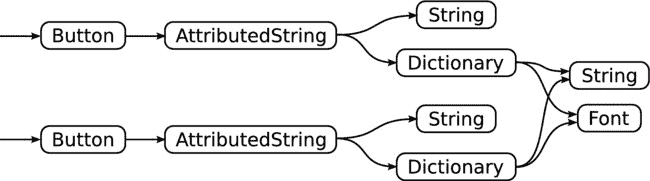
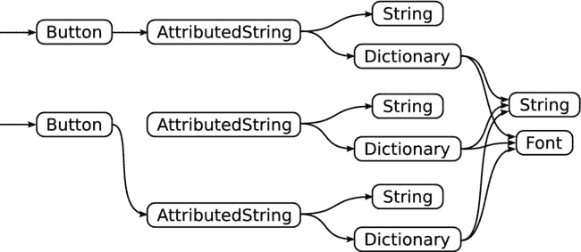
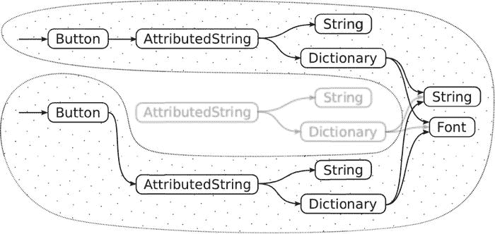
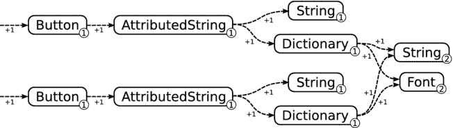
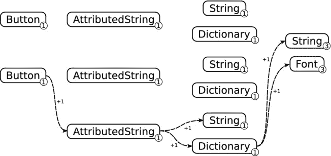
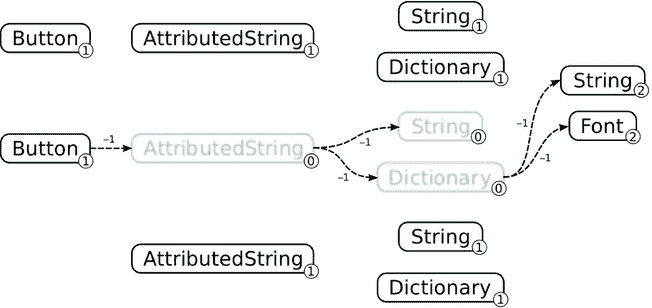
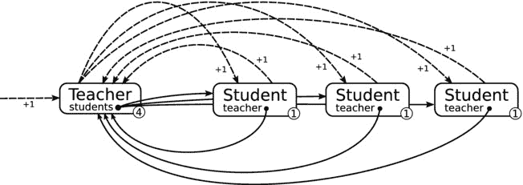
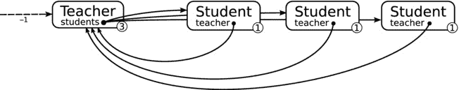
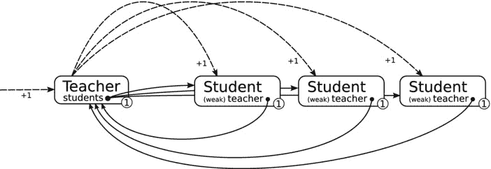

# 内存管理

我之前写了整本书，直到这里，竟然都没有提过内存管理，这简直是不可思议。最初，iOS 中的内存管理给程序员带来了沉重的负担。随着最近自动引用计数 (ARC) 的引入，情况有所改善，但即使如此，仍然存在大量异常、限制和注意事项。

Swift 从一张白纸开始重新设计。iOS，以及 Swift，仍然使用 ARC。但是 Swift 处理 ARC 的方式非常完美，以至于程序员几乎不需要做什么，只需将过去用于内存管理的那部分大脑重新用于更愉快的事情。

这并不是说你在 iOS 中不需要了解任何关于内存管理的知识。粗略地理解是极其有帮助的。ARC 是一项了不起的技术，但它有一个**致命**的缺陷。在某些情况下，你可能会在应用中造成内存泄漏。而你用来对抗这些泄漏的工具有时也会产生其他不想要的副作用。所以，欢迎来到内存管理 101。（别担心，这是一门速成课程。）

## 垃圾回收

最初，有手动内存管理。程序员负责分配他们需要的每一个内存块，并在使用完后将其释放回系统。随着程序复杂度的增加，很快人们就发现这不是一个高效的解决方案。哦，而且程序员对一遍又一遍地编写相同的代码感到非常厌倦。

随之而来的是各种形式的自动内存管理。其中之一被称为垃圾回收。*垃圾回收* 负责回收你不再使用的值和对象，将这些内存返还给操作系统。下次你需要创建一个对象或连接一个字符串时，就有可用的内存来完成这些操作。

从概念上讲，垃圾回收很简单。在图 20-3 所示的示例中，你有两个按钮对象。这些按钮对象又引用了属性字符串，而这些属性字符串又引用了字符串、字典和字体对象。



**图 20-3.** 应用中的对象引用

现在你决定更改一个按钮的标题。你创建一个新的属性字符串，可能会重用之前使用过的字符串和字体对象，并将这个新对象分配给按钮的 `attributedString` 属性，如图 20-4 所示。



**图 20-4.** 替换属性字符串对象

问题来了，Swift 如何处理旧的属性字符串对象？它已经不再被使用了。如果允许它和其他所有未使用的对象继续占用内存，你的应用很快就会耗尽内存并崩溃。事实上，世界上几乎所有的应用都会很快耗尽内存。

我们需要做的是销毁那些不再使用的对象，并回收它们的内存。但是 “不再使用” 是什么意思？在这个例子中，这是一个有趣的组合。显然，旧的属性字符串对象不再有任何用途。它的字符串和字典对象也是如此。但是字典所引用的字符串和字体对象仍在被其他对象使用。所以，你不能简单地销毁旧的属性字符串对象及其引用的所有东西。

一种解决方案是确定正在使用的对象图。这包括你应用的根对象（你的 `UIApplication` 对象）、它所引用的所有对象（你的视图控制器对象）、这些对象所引用的所有对象（视图对象），以及这些对象所引用的所有对象（字符串、字体、颜色等）。完成后，你就得到了你应用正在使用的所有对象的完整集合。这些被称为 *可达对象*。其他所有东西都是 *垃圾*，如图 20-5 所示。



**图 20-5.** 垃圾回收

这是传统的垃圾回收。垃圾回收的绝妙之处在于，你，作为程序员，无需做任何事情。你只需创建并使用你需要的对象。只要你停止使用某个对象，操作系统就会替你处理它。这听起来很像你在 Swift 中编写的代码。那么，Swift 一定在使用垃圾回收，对吗？

不幸的是，这种内存管理在计算上过于密集，无法为移动设备提供有效的解决方案。iOS 使用了一种不同的内存管理方式，它试图完成与垃圾回收相同的事情，但开销要小得多。

## 引用计数

iOS 使用一种名为 *引用计数* 的技术。在引用计数中，所有对象都维护一个引用计数。引用计数是仍在“使用”（持有对该对象的引用）该对象的数量。如果你将一个对象赋值给一个属性，它的引用计数就会增加。当你从该属性中移除这个对象时，引用计数就会减少。当引用计数变为零时，就没有对该对象的引用了，它就会被销毁。Swift 会自动为每一个对象引用执行此操作。

图 20-6 显示了与图 20-3 中相同的对象集合，但这次使用了引用计数。所有对象的引用计数都不为零，因此它们仍在使用中。



**图 20-6.** 带有引用计数的对象

当你将一个*新*的属性字符串赋值给按钮时，会发生以下情况。新对象的引用计数会增加，并作为新的属性值存储起来，如图 20-7 所示。这被称为 *保留*。当属性字符串在构建过程中，它会保留它引用的所有对象，也如图 20-7 所示。



**图 20-7.** 保留新对象


随后，前一个属性值的引用计数会递减，如图 20-8 所示。这被称为**释放**。由于按钮是其唯一的引用，其计数变为零，该对象被销毁。在销毁过程中，它会释放其引用的所有对象，此过程会重复进行。



图 20-8. 释放旧对象

当整个过程结束时，旧的属性字符串对象及其正在使用的字符串和字典对象都已消失。但字典所引用的字符串和字体对象仍然存在，因为它们继续被其他对象引用。

引用计数快速、简单且高效，最终结果与垃圾回收相同。嗯，在大多数情况下确实如此。但有一种情况下引用计数无法很好地工作，你需要了解这一点。

## 循环保留

让我们来看一个不同的情况。你正在创建一个注册系统。其中有`Teacher`对象和`Student`对象。教师持有对每个学生的引用，而所有学生也都持有对其教师的引用。这些对象及其引用计数如图 20-9 所示。



图 20-9. 循环引用

每个`Student`都有一个保留计数（来自教师的引用）。`Teacher`的引用计数为四——一个来自其拥有者，三个来自其三位学生。

现在拥有者已经完成了这些对象的操作，并释放了`Teacher`，如图 20-10 所示。这会释放教师对象，递减其引用计数，然后……什么也没发生。教师的引用计数仍然是三，所以它没有被销毁。因为它没有被销毁，它也从未释放其学生对象，因此学生对象也从未释放它们的教师。



图 20-10. 释放`Teacher`对象

这被称为**循环保留周期**。它也被称为**内存泄漏**。这些对象将永远存在，除非终止你的应用，否则无法清除它们。

有一种方法可以摆脱这个陷阱。解决方案是不让`Student`对象保留`Teacher`对象。Swift 提供了一种特殊类型，称为**弱引用**；它是一种不保留其所引用对象的对象引用。常规的引用类型称为**强引用**。

让我们将学生的`teacher`引用替换为弱引用，看看会发生什么，如图 20-11 所示。



图 20-11. 使用弱引用

弱引用仍然包含`Teacher`值，但这些不会增加其引用计数。现在当教师对象被释放时，它会被销毁，并且会销毁其引用的所有学生对象。以下语句声明了一个弱引用：

```
weak var teacher: Teacher?
```

搞定！问题解决了。但你知道那句老话：“每个伟大的解决方案都会带来自己的问题。” 或许没人这么说；也许只是我杜撰的。无论如何，弱引用也有自己的一系列问题。以下是需要你了解的内容：

- 弱引用指向一个对象，但不会保留它。
- 如果弱引用中的对象被销毁，该值会被静默地设置为 `nil`。
- 弱引用必须是可选类型或隐式解包可选类型（因为它随时可能被设置为 `nil`）。

弱引用非常适合“树状”或“父子”对象关系，其中子对象持有对其父对象的引用。你还会在代理和数据源属性中发现弱引用的使用。实际上——你在本书中一直这样做——对象的代理对象通常是其自身或其父对象，例如视图控制器。这会产生与图 20-9 所示相同的循环保留周期。（是的，一个对象可以保留自身。）

但这也会带来后果。你在第 12 章的 Wonderland 应用中已经处理过这个问题。在 `BookViewController.swift` 文件中，你创建了一个属性来存储书籍视图的数据源，如下所示：

```
let bookSource = BookDataSource()
...
dataSource = bookSource
```

随后，你将 `bookSource` 赋值给页面视图控制器的 `dataSource`，但仍在 `bookSource` 属性中保留了相同的引用。这是因为 `dataSource` 是一个弱引用。如果你没有至少一个对 `BookDataSource` 对象的强引用，它会被立即销毁，那么你的页面视图控制器就没有数据源了。相信我，这种问题调试起来会令人抓狂。

保留周期可能很隐蔽。另一个可能出现的地方是闭包，其中闭包引用了拥有该闭包的对象。在《The Swift Programming Language》中有一大节关于循环保留的内容。既然你已经理解了这个问题，不妨花点时间快速浏览那一节。

就像可选类型有其隐式解包的兄弟一样，弱引用也有一个危险的表亲。**无主引用**是一个具有弱引用特性的非可选变量。你可以使用 `unowned` 关键字声明一个无主变量，如下所示：

```
unowned var teacher: Teacher = ...
```

你可能猜到了，只有当你绝对确定引用中的对象在你再次使用它之前不会被销毁时，才应使用此方式。如果你在 `Teacher` 对象被销毁后使用此变量，应用将会崩溃。更糟的是，它不是可选类型；无法测试它是否为 `nil`。考虑改用弱引用的隐式解包变量。

## 还有更多 Swift 特性

但等等，还有更多！Swift 语言内容繁多，这一章的长度就足以证明——而本章本应是“快速”入门。然而，我仍然没有涉及到一些精彩的内容。随着你 Swift 技能的日益成熟，以下还有一些主题值得你探索：


*   类型别名可以为现有类型创建一个新名称，这很类似于 C 语言的 `typedef`。
*   你可以对运算符进行重载。例如，一个类可以为 `==` 和 `!=` 运算符定义自己的代码，实际上就是定义该类中两个对象“相等”的含义。
*   你也可以创建自己的运算符。没错，你可以自行创造运算符。如果你觉得你的枚举需要一个`+&-`运算符，以便写出 `myEnum +&- 3`，那就尽管去做吧。（我为之后必须弄懂这代码含义的程序员感到同情。）
*   函数可以拥有可变参数。这是对接受不定数量参数的函数的形象称呼，比如 `NSString(format:,_:...)` 初始化器。这里的 `...` 表示你可以用任意数量的额外参数来调用这个函数。
*   Swift 支持泛型。泛型是一种能以类型安全的方式根据不同类型进行变异的类型。通俗来说，你可以创建一个能处理不同类型对象的类。当你使用这个类时，你告诉它你正在处理的类型，然后 Swift 就会像为这个类创建一个专门针对该类型的新子类一样。Swift 中所有的集合类型都是泛型。只有一种 `Array` 类型，但当你声明一个 `UITouch` 对象数组（`[UITouch]`）时，Swift 会创建一个仅能存储 `UITouch` 对象的数组，其他对象一概不行。
*   Swift 提供了一套字节访问类型，它们能赋予你大部分 C 语言指针的能力。你可以使用字节访问类型来处理原始数据，如图像像素缓冲区，并与仍使用指针的 C 函数进行交互。

