# 文档格式

-   *包含应用*是你的应用，它包含作为资源的扩展框架。
-   *宿主应用*是想使用你扩展的应用。
-   你扩展中的代码在单独的进程中执行，与包含应用和宿主应用相互隔离。
-   扩展的生命周期独立于包含应用和宿主应用，通常相当短暂。
-   每个扩展只定义*一种*服务类型。如果你希望应用提供三种不同的服务，你的应用必须包含三个独立的扩展。
-   你的应用可以直接使用框架中的代码。一个框架*不能*使用你应用中的代码，尽管它可以引用其他框架的代码。

我们不妨开始吧。这个项目没有用户界面设计，因为 Action 扩展没有 UI。从第 3 章中找到 Shorty 项目。从文件菜单中，选择新建  目标命令。在目标模板选择器中，选择 iOS 应用扩展组并选取 Action 扩展，如图 21-1 所示。

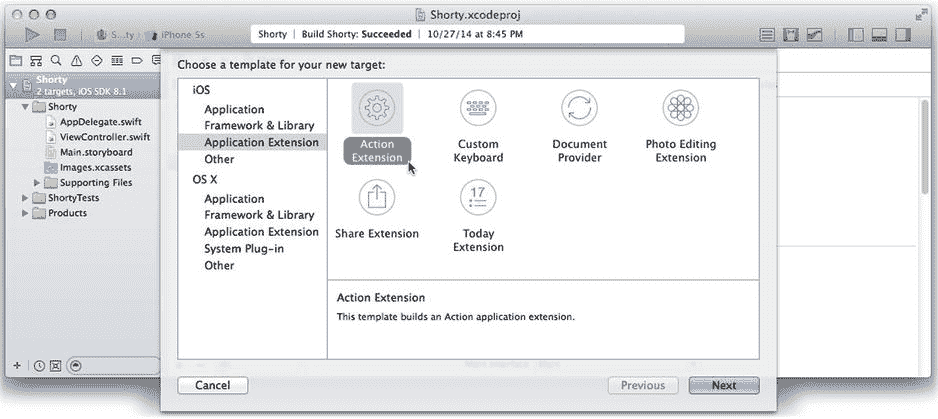

图 21-1. 选择 Action 扩展模板

将新扩展的产品名称设置为 `ShortenAction`，如图 21-2 所示。确保语言为 Swift。将 Action Type 设置为 No User Interface。Xcode 会自动将此新目标设为现有应用的一部分，并将框架嵌入到你的 Shorty 应用中。这正是你所需要的。

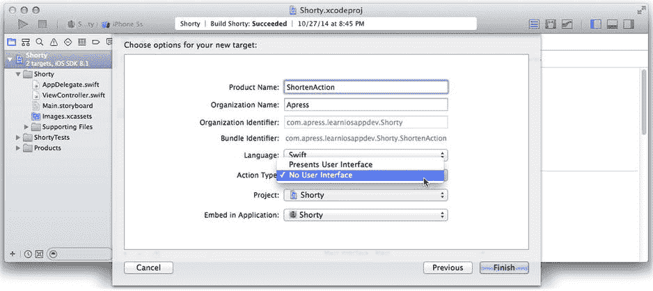

图 21-2. 设置 Action 扩展详细信息

点击“完成”按钮后，你很可能会看到另一个对话框，提示 Xcode 正在为你的新扩展准备运行方案。到目前为止，本书中你一直使用默认的运行方案来在各种模拟器和设备上调试应用。然而，要调试扩展，你不能直接运行扩展。记住，扩展在特殊进程中运行，并且受另一个（宿主）应用的调用。Xcode 会便捷地创建一个运行方案，该方案启动另一个应用，并让 Xcode 准备好在该宿主应用加载你的扩展时拦截其中的代码。设置这类事情比较棘手，所以当 Xcode 询问时，请务必点击“激活”按钮。

**提示** Xcode 为你的扩展创建的运行方案每次运行时都会询问你要使用哪个宿主应用。如果你反复使用同一个宿主应用，可以编辑该方案，让它改为运行特定的宿主应用，这样你就不必每次都选择了。

一个目标会在你的项目中生成某种产物。到目前为止，你实际上只使用了一个目标，即你的应用目标。还有其他目标，比如单元测试目标，但本书尚未涉及这些。现在，你的项目有两个重要的目标：一个应用目标和一个扩展目标。

Xcode 刚刚做了相当多的工作，所以在继续进行之前，我们先回顾一下刚刚发生的情况。当你添加一个扩展目标时，Xcode 执行了以下操作：

-   Xcode 在你的项目中创建了一个名为 `ShortenAction` 的新目标。该目标生成一个名为 `ShortenAction.appex` 的扩展框架。
-   Xcode 将 `ShortenAction` 目标添加为 `Shorty` 目标的*依赖目标*。*依赖目标*是指必须在父目标构建之前完成构建的目标。这确保了当你构建 `Shorty` 应用目标时，`ShortenAction` 目标也会被构建。
-   `ShortenAction.appex` 包（即 `ShortenAction` 目标的产物）已被添加到嵌入到你的 `Shorty` 应用中的二进制文件列表中。*嵌入的二进制文件*是一个包含可执行代码的库或框架，这些代码会被复制到你的成品应用中作为资源。
-   `ShortenAction.appex` 也被添加到了嵌入的应用扩展列表中。这准备了嵌入的框架，使其能被识别为扩展。没有这一步，iOS 将无法识别你的扩展。

### 连接你的扩展

所有扩展都通过一个扩展点来工作。*扩展点*是 iOS 提供的一项服务，扩展在此处可以拓展用户的选择。当用户点击活动按钮时，共享扩展会提供更多共享选项。键盘扩展会增加用户可选择的键盘布局数量，以此类推。

一个扩展连接到一个扩展点，该扩展点在其 `Info.plist 文件中指定。选择 `ShortenAction` 目标的 `Info.plist` 文件，如图 21-3 所示。你可以在 `ShortenAction` 组的 Supporting Files 分组中找到扩展的 `Info.plist` 文件。这是你的扩展的属性列表，其中包含关于它是什么类型扩展的重要信息，决定了它在何种情况下可用，甚至决定了它的显示名称。我们先处理简单的部分。

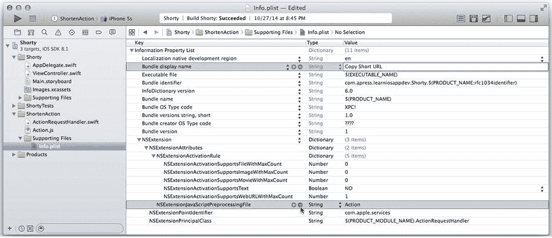

图 21-3. Action 扩展的 `Info.plist`

编辑 Bundle 显示名称的值为 `Copy Short URL`，如图 21-3 所示。这是该操作名称将向用户呈现的样子。接下来的问题是“它何时以及如何出现？”答案在 `NSExtension` 字典中。展开该条目以查看详情。

`NSExtension` 中使用的第一个值是 `NSExtensionPointIdentifier`。这告诉 iOS 你的扩展适用于哪种扩展点。`com.apple.service` 标识符表示你的扩展是一个无 UI 的 Action。其余属性主要取决于该扩展的类型。

对于无 UI 的 Action 扩展，iOS 需要知道提供你服务的对象所属的类。这存储在 `NSExtensionPrincipleClass` 属性中，并被设置为 `ActionRequestHandler`。iOS 将创建一个 `ActionRequestHandler` 对象，然后调用它来执行工作。

如果这是一个带有用户界面的扩展，过程略有不同。`NSExtensionMainStoryboard` 属性将包含你的扩展主故事板文件的名称。这个文件又包含了一个包含实现用户界面的 `UIViewController` 的场景。

这就解释了“如何”的问题，现在你必须描述“何时”使用。有些扩展是上下文相关的。假设你创建了一个用于分享电影的共享扩展。如果用户试图分享地图位置或联系人信息，那么向他们展示该共享扩展就不合适。你在 `NSExtensionActivationRule` 属性中描述应使用扩展的上下文。有两种方法可以实现这一点。第一种也是最简单的方法，是存储一个预定义规则的字典，如图 21-3 所示。


每个`Info.plist`中的值都定义了一条简单的规则，用于指定你的扩展应在何种情况下被使用。例如，`NSExtensionActivationSupportsImageWithMaxCount`规则是你的扩展能够处理的最大图片数量。如果该值设为`3`，用户最多可以使用你的扩展一次性分享三张图片。在模板中，它被设置为`0`，这意味着你的扩展不处理图片。你可以将这些规则保留为`0`或`NO`，或者直接将其从`Info.plist`中删除。这两种做法效果相同，因为表示的意义一致。

你需要关注的规则是`NSExtensionActivationSupportsWebURLWithMaxCount`，并应将其设置为`1`。当用户想要对单个 URL 进行操作时，此规则将激活你的扩展。

**注意**：不要将`NSExtensionActivationSupportsWebURLWithMaxCount`与`NSExtensionActivationSupportsWebPageWithMaxCount`混淆。前者通过 URL 激活你的扩展，后者则通过网页内容激活扩展——该页面可能包含也可能不包含 URL。

另一种确定“何时”激活扩展的方法是编写一条激活规则谓词语句，并将其作为字符串属性存储在`NSExtensionActivationRule`中。如果 iOS 检测到一个字符串值，它会执行该谓词语句来决定是否应激活你的扩展。*谓词语句*是一种类似数据库查询的表达式，能够进行各种复杂的决策。例如，它可以判断用户想要分享的 URL 是否已被缩短。在这种情况下，你可以停用扩展，因为再次缩短一个已缩短的 URL 毫无意义。有关谓词语言的详细说明，请参阅*谓词编程指南*。

在解决了“如何”和“何时”这两个问题之后，让我们继续实际操作。

### 运行你的 Action

与其他优秀的模板一样，Xcode 创建了一个开箱即用的 Action 扩展。选择`ShortenAction`方案（即 Xcode 为你创建的那个），然后选择一个目标，如图 Figure 21-4 所示。

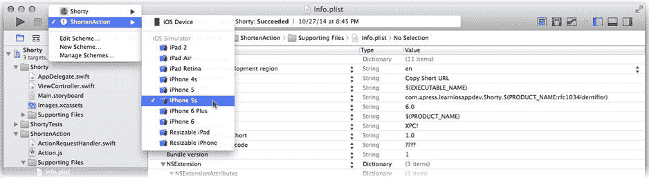

**Figure 21-4** 选择扩展方案

运行你的扩展。扩展的运行方案需要一个宿主应用。宿主应用是请求使用你的扩展的应用。Xcode 会提示你选择要启动的宿主应用，如图 Figure 21-5 所示。在此次测试中，请选择`Safari`。

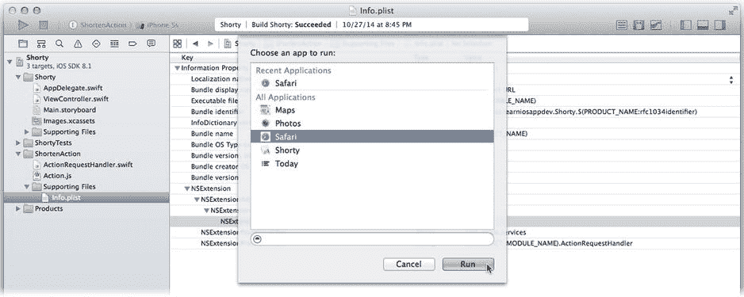

**Figure 21-5** 选择宿主应用

`Safari`在模拟器中启动，如图 Figure 21-6 左侧所示。选择`Safari`是因为它是一个能够分享 URL 的应用，这正是你的扩展工作的上下文。在`Safari`中访问任意页面，然后点击操作按钮。活动选择器会出现，如图[Figure 21-6]中部所示。选择器中同时显示分享活动和操作。滑动操作列表，你会发现一个新的`Copy Short URL`操作，但明显缺少图标，如图[Figure 21-6]右侧所示。

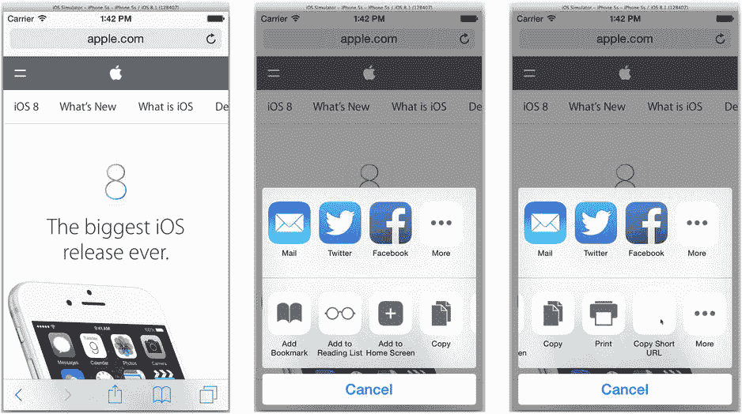

**Figure 21-6** ShortenAction 扩展出现在活动选择器中

恭喜！你的扩展已经成功出现在`Safari`中。现在，如果它能做点有用的事情就好了。

### 灯光，代码，Action

在 Xcode 中停止正在运行的应用，并返回你的项目。是时候熟悉 Action 的内部工作机制了。

选择`ActionRequestHandler.swift`文件，查看其中的代码。这就是你的 Action 发生的地方。对于一个无界面的 Action 扩展，你需要定义一个执行工作的类。该类必须遵循`NSExtensionRequestHandling`协议，并实现`beginRequestWithExtensionContext(_:)`函数。

**提示**：实现扩展的类可以是任何你想要的类。但如果你更改了它，别忘了同时更新`Info.plist`中的`NSExtensionPrincipalClass`属性以保持一致。

如果你查看模板中的代码，会发现它做了相当多的事情。实际上，它并没有做什么实质性的工作；它只是演示了如何实现某些复杂功能。模板代码展示了如何对用户的网页运行 JavaScript 探针。这个 JavaScript 可以从页面中提取各种信息，供你的扩展使用。例如，设想一个旅行应用中的扩展：它可以从网页中提取预订信息，并自动将其添加到用户的行程中。如果你需要做类似的事情，请仔细研究模板代码。

你的扩展不需要这些。你需要精简`ActionRequestHandling`类，并用缩短 URL 的代码替换它。不幸的是，这部分代码目前固化在`Shorty`应用中的`ViewController`类里。

### 每个扩展都是一座孤岛

正如我之前提到的，扩展是一个框架。框架*提供*类、代码和资源给消费者（通常是应用）。它不能*消费*来自包含或托管它的应用中的任何类、代码或资源。框架就是一座孤岛；如果它没有自带，那就没有。

显然，下一步是与扩展共享执行 URL 缩短的代码，以便两者都能使用。有几种方法可以实现这一点。以下是其中两种显而易见的方式：

- 为扩展编写第二份相同的代码。
- 重新组织代码，将 URL 缩短逻辑封装在一个可移植的类中。

我甚至不打算讨论第一种方法。

在你的应用项目中拖入一个新的 Swift 文件，并将其命名为`Squeezer.swift`。你将把 URL 缩短逻辑整合到这个类中。添加新文件时，请确保只将该文件添加到`Shorty`目标中，如图 Figure 21-7 所示。

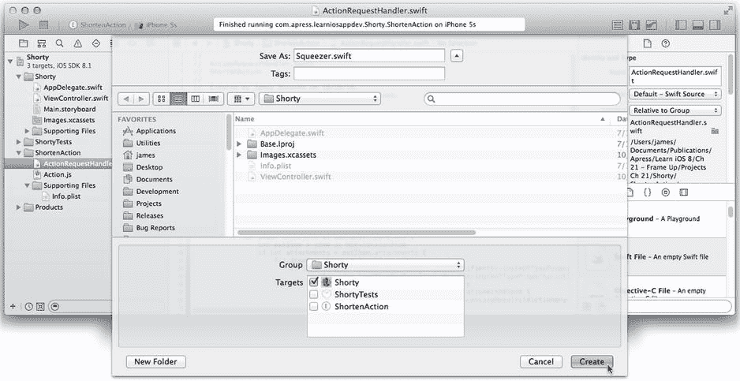

**Figure 21-7** 将 Squeezer 添加到应用目标

你想重新组织 URL 缩短逻辑，使其能够为你的应用和扩展执行相同的功能。你的应用需要异步进行 URL 缩短，因为应用绝不应阻塞其主事件循环。扩展对此没有严格要求，但这样做也无妨。两者都需要的是在转换完成后，能够轻松获取缩短后的 URL，因为应用和扩展会对结果进行不同的处理。因此，计划如下：

- `Squeezer`类将拥有一个`shortenURL(longURL:, completion:)`方法。
- 该函数将接收长 URL，构建缩短请求，启动网络事务进行转换，并立即返回。
- 当获得结果时，它将调用由调用者提供的完成闭包。
- 该完成闭包接收两个参数：缩短后的 URL 或发生的错误。

这与应用当前的处理方式类似，但重新打包了代码，以便于在其他方面轻松重用。以下是完成后的`Squeezer.swift`代码：

```
import Foundation

let GoDaddyAccountKey = "0123456789abcdef0123456789abcdef"
```


```swift
public class Squeezer {
    public class func shortenURL(longURL: NSURL, completion: ((NSURL?, NSError?) -> Void)) {
        if let absoluteURL = longURL.absoluteString {
            if let encodedURL = absoluteURL.stringByAddingPercentEscapesUsingEncoding(NSUTF8StringEncoding) {
                let urlString = "http://api.x.co/Squeeze.svc/text/\(GoDaddyAccountKey)?url=\(encodedURL)"
                let request = NSURLRequest(URL: NSURL(string: urlString)!)
                NSURLConnection.sendAsynchronousRequest(request, queue: NSOperationQueue.mainQueue()) {
                    (_, shortURLData, error) in
                    if error == nil && shortURLData != nil {
                        var shortURL: NSURL?
                        if let data = shortURLData {
                            if let short = NSString(data: data, encoding: NSUTF8StringEncoding) {
                                shortURL = NSURL(string: short)
                            }
                        }
                        completion(shortURL, nil)
                    } else {
                        completion(nil, error)
                    }
                }
            }
        }
    }
}
```

就像在第 3 章中一样，你需要将 `GoDaddyAccountKey` 的值替换为你的 X.co 账户密钥。

这个新版本完成了 Shorty 中 `ViewController` 类的所有功能。在 Shorty 中，你创建了 `NSURLRequest` 的委托和数据源，异步启动 `NSURLRequest`，然后等待委托调用以收集响应数据并完成事务。

这是一个非常常见的任务，以至于 iOS 8 新增了一个便捷方法，只需一次调用就能完成所有操作：`sendAsynchronousRequest(_:,queue:,completion:)`。无需定义委托方法，你只需提供一个闭包，在事务完成后执行该闭包即可。

`shortenURL(longURL:,completion:)` 中的完成块会检查结果以确定是否成功。如果成功，它会解码响应数据并将其转换为 `NSURL` 对象——就像该应用之前所做的那样。然后，它调用传递给 `shortenURL(longURL:,completion:)` 函数的完成闭包，并将转换后的 `NSURL` 对象或错误信息传递给它。

你现在可以大幅简化 `ViewController` 中的代码了。选择 `ViewController.swift` 文件，并进行以下修改：

1. 从类声明中移除 `NSURLConnectionDelegate` 和 `NSURLConnectionDataDelegate` 协议。你不再需要这些协议了；`Squeezer` 现在会处理所有的通信任务。
2. 删除 `GoDaddyAccountKey`、`shortenURLConnection` 和 `shortURLData` 属性。
3. 删除 `connection(_:,didFailWithError:)`、`connection(_:,didReceiveData:)` 和 `connectionDidFinishLoading(_:)` 函数。
4. 按如下方式重写 `shortenURL(_:)` 操作方法：

```swift
@IBAction func shortenURL(AnyObject) {
    if let toShorten = webView.request?.URL {
        Squeezer.shortenURL(longURL: toShorten) { (shortURL, _) in
            if let urlString = shortURL?.absoluteString {
                self.shortLabel.title = urlString
                self.clipboardButton.enabled = true
            } else {
                self.shortLabel.title = "failed"
                self.clipboardButton.enabled = false
                self.shortenButton.enabled = true
            }
        }
        shortenButton.enabled = false
    }
}
```

现在 `Squeezer` 负责所有通信和 URL 缩短工作。成功和失败两种情况都由闭包处理。

花一点时间运行你的 Shorty 应用——将目标方案切换回 Shorty——并再次确认它仍能正常工作。在重新组织代码后重新测试应用总是一个好习惯。

### 获取用户数据

将缩短逻辑封装在 `Squeezer` 中后，你现在可以复用它来实现你的扩展。选择 `ActionRequestHandler.swift` 文件。保留 `extensionContext` 属性，并将 `beginRequestWithExtensionContext(_:)` 函数替换为以下内容：

```swift
func beginRequestWithExtensionContext(context: NSExtensionContext) {
    self.extensionContext = context
    for item in context.inputItems as [NSExtensionItem] {
        if let attachments = item.attachments as? [NSItemProvider] {
            for itemProvider in attachments {
                let urlType = String(kUTTypeURL)
                if itemProvider.hasItemConformingToTypeIdentifier(urlType) {
                    itemProvider.loadItemForTypeIdentifier(urlType, options: nil) {
                        (item, error) in
                        dispatch_async(dispatch_get_main_queue()) {
                            if let url = item as? NSURL {
                                self.actionWithURL(url)
                            }
                        }
                    }
                }
            }
        }
    }
}
```

当用户点击你的扩展时，此函数会被调用。它首先将 `NSExtensionContext` 保存到一个属性中。你的代码稍后还会需要这个上下文。

`NSExtensionContext` 对象包含你的扩展处理用户选择所需的所有信息。首先，它会检查 `inputItems`，这是一个由 `NSExtensionItem` 对象组成的数组。每个项目都是一种数据类型，每个数据包含一个或多个附件。你需要检查这些项目，然后提取你的扩展需要处理的附件。

### 带有界面的 NSExtensionContext

对于像这样需要 `NSExtensionContext` 的无界面扩展，扩展上下文会作为参数传递给 `beginRequestWithExtensionContext(_:)`。然而，如果你的扩展有界面，你需要通过另一种途径获取扩展上下文。

你的界面会放在 storyboard 中。扩展点会加载你的 storyboard。在此过程中，会创建实现界面的 `UIViewController`。在你的视图控制器被呈现之前，iOS 8 会设置其 `extensionContext` 属性为活动的扩展上下文（这是在 iOS 8 中新增的一个属性）。

当你的视图控制器代码开始执行时，你可以从视图控制器的 `extensionContext` 属性中获取用户想要处理的项目的相关信息。之后的操作都是一样的。

假设用户选择了两个图片和一个电影进行分享。上下文将包含两个项目：一个用于图片，另一个用于电影。图片项目包含两个附件，电影项目包含一个附件。

回到你的代码中，两个循环会遍历所有附件，寻找 URL 类型的附件。这是通过使用 `hasItemConformingToTypeIdentifier(_:)` 函数实现的。你向此函数传递一个 URL 的通用类型标识符，或者任何你感兴趣的类型，如果附件是该类型或可以转换为该类型，则返回 `true`。

一旦你找到了想要处理的附件，下一步就是提取它。附件可能代表大量数据——例如，整个电影。附件内容是使用 `loadItemForTypeIdentifier(_:,options:,completionHandler:)` 函数异步获取的。该函数会获取附件的内容，可能将其转换为目标类型，然后在准备就绪时执行一个闭包。你的闭包会调用 `actionWithURL(_:)` 函数，这个函数你还没有编写。

在此之前，删除模板中包含的任何其他方法。你也可以从项目中删除 `Action.js` 文件；你不会用到它。

### 复用 Squeezer

按如下所示，将 `actionWithURL(_:)` 函数的代码添加到 `ActionRequestHandler` 类中。这个是实现你的操作的函数。


```swift
func actionWithURL(url: NSURL) {
    Squeezer.shortenURL(longURL: url) { (shortURL, error) in
        if error == nil {
            if let url = shortURL {
                UIPasteboard.generalPasteboard().URL = url
            }
            self.extensionContext?.completeRequestReturningItems( nil,
                                                   completionHandler: nil)
        } else {
            self.extensionContext?.cancelRequestWithError(error!)
        }
    }
}
```

这段代码复用了 `Squeezer` 在后台进行 URL 缩短。任务完成后，它会执行闭包。闭包会检查转换是否成功。如果成功，就将缩短后的 URL 放入剪贴板。

现在到了重要部分。一旦你的扩展完成了它的任务，你*必须*调用一开始收到的 `NSExtensionContext` 对象的 `completeRequestReturningItems(_:,completionHandler:)` 或 `cancelRequestWithError(_:)` 函数。这些调用告诉扩展点：你的操作已完成，或者用户（或某些不可见的力量）取消了它。

这里的时机非常重要。扩展必须快速进入、完成任务然后退出。如果你的扩展执行的是直接且快速的操作，它应该执行完毕后就调用这些函数之一。这个 Action 扩展就属于此类。缩短一个 URL 最多只需要一两秒钟。因此，你的代码会等待 URL 转换完成，然后发出完成信号。

另一方面，如果你的扩展需要执行耗时的操作，例如将整个电影上传到服务器，你应该启动一个后台上传任务，然后立即发出扩展已完成信号。上传操作会在后台继续，而用户可以继续做其他事情。*《App Extension Programming Guide》* 中有一节名为“执行上传和下载”，解释了如何设置。

这一切都很好，但这并不是你最大的问题。Xcode 告诉你没有名为 `Squeezer` 的类，这没错；你的扩展（框架）中确实没有名为 `Squeezer` 的类。请记住，框架无法访问其容器应用中的代码或资源。

你再次回到了那个问题：如何让应用和扩展共享 URL 缩短代码。最简单的方法之一不是共享，而是复制。选中 `Squeezer.swift` 文件，使用文件检查器更改该文件的目标成员关系，使其同时属于 Shorty 和 ShortenAction 目标，如图 21-8 所示。

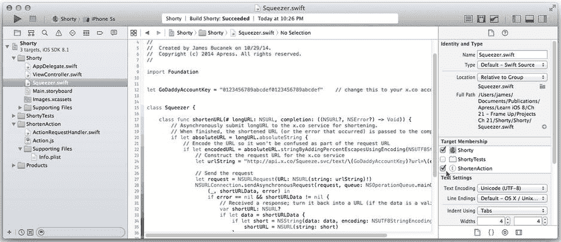

图 21-8. 编译 Squeezer 两次

通过将 `Squeezer.swift` 文件设置为两个目标的成员，该文件会被编译两次：一次在构建 ShortenAction 框架时，另一次在构建 Shorty 应用时。最终的效果是，你的应用和扩展都可以使用同一个类。

现在让我们来实际测试一下。再次选择 ShortenAction 方案（参见图 21-4），并在 Safari 中测试。浏览一个页面，点击操作按钮，然后点击你的“复制短 URL”操作。如果一切正常，页面的 URL 将被缩短并复制到剪贴板。为了验证这一点，在 `actionWithURL(_:)` 函数中设置一个断点，如图 21-9 所示。

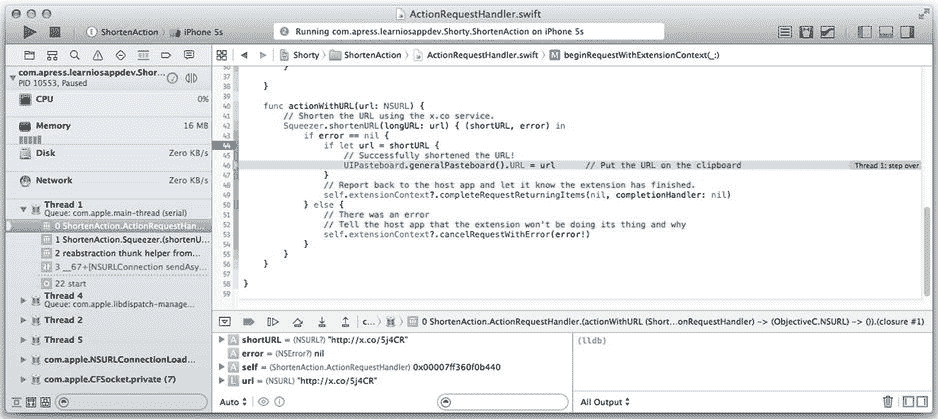

图 21-9. 检查运行中的 `actionWithURL(_:)`

当操作执行时，它会调用 `actionWithURL(_:)` 来转换 URL。如图 21-9 所示，单步执行闭包代码时，你可以在变量面板中看到成功缩短后的 URL，并逐步执行将其放入剪贴板的代码。

这非常了不起。只需很少的工作，你就创建了一个新的操作，用户可以在成千上万个分享 URL 的应用中使用它。同样的基本技术也可用于创建新的分享服务、照片滤镜和交互式通知。

但你的工作还没有完成。还有一些外观问题和更严重的工程问题需要处理。所以，在你把这本书放回书架之前，让我们先来解决这些问题。

### 操作图标

Action 扩展有自己的图标。这很不寻常；大多数扩展使用其容器应用的图标。原因是操作图标并非普通图标，它们是模板。*模板*是一种利用图像 Alpha 通道（决定每个像素透明度的图像层）创建的图标。像素颜色被忽略，Alpha 通道用于创建单色按钮。

第一步是将必要的图像文件添加到你的项目中，特别是扩展的资源中。首先设置你的扩展，使其拥有图标资源。在项目导航器中选择 Shorty 项目，选择 ShortenAction 目标，然后选择常规（General）选项卡。找到“应用图标与启动图像”部分，点击“应用图标来源”旁边的“使用资源目录”按钮，如图 21-10 所示。

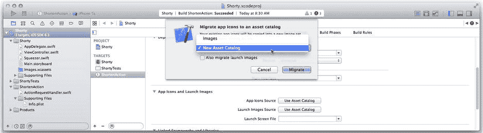

图 21-10. 为扩展配置图标来源

在对话框中，将迁移选项改为“新建资源目录”，并确保“同时迁移启动图像”选项未被勾选（扩展没有启动图像，你也不需要提供）。

点击“迁移”按钮，Xcode 会为你的扩展创建一个新的资源目录。我建议更改该目录的名称，以免与容器应用的资源目录混淆，如图 21-11 所示。

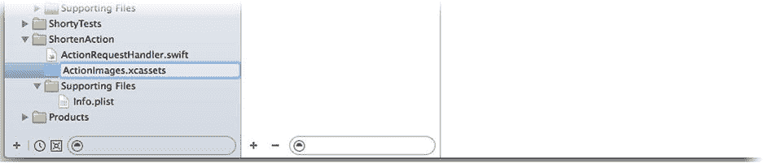

图 21-11. 重命名扩展的资源目录

如果新的资源目录中有一个 AppIcon 组，请选中并删除它。选中 `ActionImages.xcassets` 目录后，添加一个新的应用图标，如图 21-12 所示。

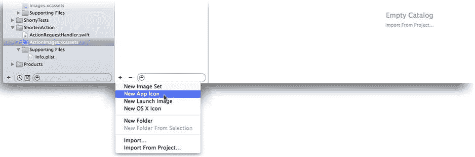

图 21-12. 添加新的应用图标集

找到 `Learn iOS Development Projects`  `Ch 21`  `ShortenAction (Resources)` 文件夹。将四个图像文件拖入新目录的 AppIcon 集中，如图 21-13 所示。这些是模板图像，其 Alpha 层包含了实际设计。图像的彩色像素是多余的，但为了在处理时不会显示为空白，将它们设置为灰色。

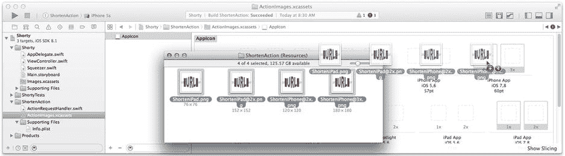

图 21-13. 添加操作图标模板

再次在 Safari 中测试你的扩展，如图 21-14 所示。这次，你的操作将像其他操作一样拥有一个模板生成的图标，如图 21-14 右侧所示。如果看不到，请尝试使用 iOS 模拟器的“重置内容和设置”命令，然后重新运行测试。此命令相当于将 iOS 设备恢复出厂设置，焕然一新。它会抹掉设备上的所有应用、文档和偏好设置。iOS 倾向于缓存扩展的信息，可能不会注意到后台所做的细微更改。重置模拟器会强制它重新开始。

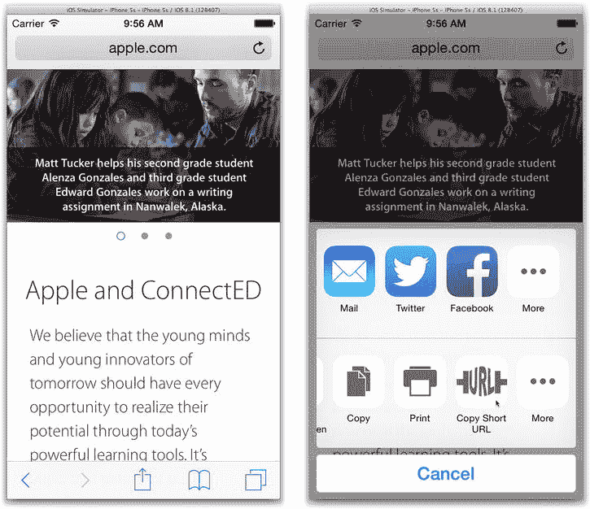

图 21-14. 你的扩展图标


您的操作扩展已经完成，可以发布了。你可以就此止步，也可以迈入更广阔的领域。

### 真正复用 Squeezer

像这样的小项目，把 `Squeezer` 类编译两次或许没什么问题。但项目不会一直停留在小规模。随着你添加更多扩展，并且这些扩展的能力不断增长，你需要与主应用共享的代码也会越来越多，有时甚至会大幅增长。显然，你需要共享所有的数据模型类。如果你有自定义文档类，你的扩展可能也想使用它们。此外，还有用于确保上传图片不会太大的降采样代码、防止魔多（Mordor）截获消息的加密程序、获取夏尔（Shire）当前天气预报的代码等等，不胜枚举。

你需要某种方法，将编译后的代码和资源打包，以便主应用和扩展都能使用它们。朋友，这正是*框架*的定义。在本节中，你将创建第二个框架，一个专门用于共享代码的框架，并在你的主应用和扩展中使用它。让我们开始吧。

### 创建一个框架

首先，向你的项目添加一个新的框架目标。在项目导航器中选择 `Shorty`。如果目标已折叠，请展开它们。点击目标底部的 `+` 按钮。在出现的“目标选择器”中，选择 `iOS Framework & Library` 组，然后选择添加一个 `Cocoa Touch Framework`，如图 Figure 21-15 所示。

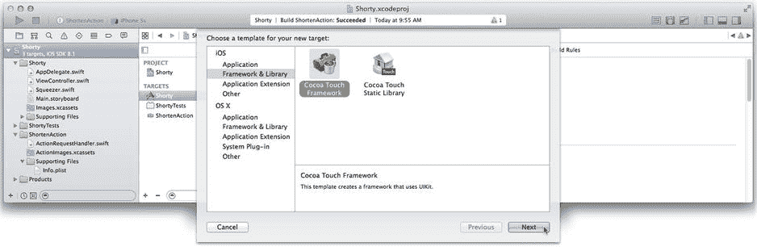

图 21-15. 选择框架模板

在下一个对话框中，将产品命名为 `SqueezeKit`，如图 Figure 21-16 所示。确保 `Project` 和 `Embed in Application` 两个设置都设为 `Shorty`。这会将新框架作为该项目的一部分，然后自动将该框架嵌入到 `Shorty` 应用中。它将成为 `Shorty` 应用的一个资源，就像 `ShortenAction` 现在这样。

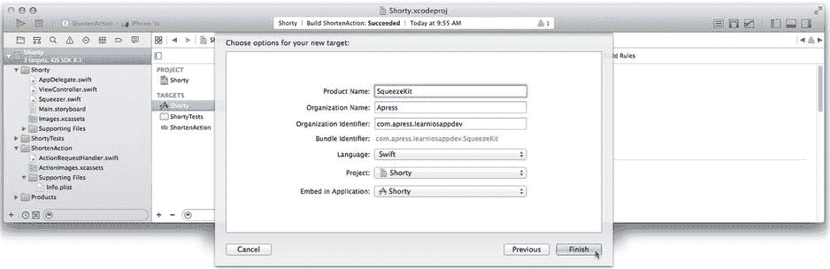

图 21-16. 创建框架

### 向框架添加代码

下一步是向框架中添加一些内容。选择 `Squeezer.swift` 文件，如图 Figure 21-17 所示，并使用文件检查器更改其目标成员身份。你希望 `Squeezer` 类在 `SqueezeKit` 目标中编译，但不在主应用或扩展中编译。

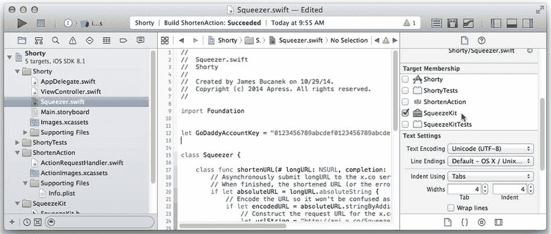

图 21-17. 将 `Squeezer` 设为 `SqueezeKit` 的成员

为了更清晰地体现这种新关系，将 `Squeezer.swift` 文件从项目导航器中的当前位置拖放到 `SqueezeKit` 组中。

### 真正移动 `SQUEEZER.SWIFT`

你可以随意拖拽项目导航器中的项目，并按任何你喜欢的方式组织它们。然而，导航器中的组织方式与文件在你的文件系统中的组织方式是相互独立的。当你将 `Squeezer.swift` 从顶层项目组移动到 `SqueezeKit` 组时，源文件并不会实际移动。

如果你使用源代码控制系统，或者像我一样有点洁癖，希望项目的文件夹结构能够反映其组织方式，那么你还需要将源文件移动到框架的子文件夹中。以下是最简单的操作方法：

1.  选择源文件。
2.  右键点击或 Control+点击该文件，然后选择 `Show in Finder` 命令。这样你就知道真实文件在哪里了。
3.  回到 Xcode，从项目中删除该文件，并选择 `Remove Reference`；不要将其移到废纸篓。
4.  回到 Finder，将文件移动到新位置。在本例中，即 `SqueezeKit` 文件夹内。
5.  将移动后的文件从 Finder 拖回您的项目（放在 `SqueezeKit` 组内）。当 Xcode 询问时，将“新”文件仅添加到 `SqueezeKit` 目标。

虽然还有其他不删除并重新添加文件到项目就能进行重定位的方法，但本技巧可以避免很多操作中可能出现的奇怪问题。

现在，你的 `Squeezer` 类在一个框架中编译，并且该框架已嵌入并链接到你的应用。你应该可以在任何地方使用它了，对吧？还不行。

尝试构建你的应用，看看会发生什么。在 `ViewController.swift` 文件中，编译器现在报告找不到 `Squeezer` 类。这是因为 `Squeezer` 现在位于一个框架中。要使用框架中的代码，你必须导入它。在 `ViewController.swift` 文件的顶部，为 `SqueezeKit` 框架添加一条 `import` 语句，如下所示（新代码以粗体显示）：

```swift
import UIKit
import SqueezeKit
```

再次构建你的应用，然而（！）编译器依然说找不到这个类。还记得 第 20 章 开头提到过访问控制指令，并且说过在开始构建框架之前通常可以忽略它们吗？现在你不能再忽略它们了。

`Squeezer` 类及其所有属性和方法都被赋予了默认的 `internal` 访问权限，这意味着该类及其成员仅在其编译所在的应用或框架内可见。当你之前在自己的应用中编译它时，这不成问题。现在问题来了。

选择 `Squeezer.swift` 文件，并为该类及其方法添加 `public` 访问关键字，如下所示（新代码以粗体显示）：

```swift
public class Squeezer {
public class func shortenURL(# longURL: NSURL, ...
```

再次编译你的应用，编译错误消失了！恭喜你，你已经创建了一个框架，用有用的代码填充了它，决定了代码的哪些部分是公开的，并在你的应用中使用了它。

对于 `Shorty` 来说，你还没完全完成。现在你在 `ActionRequestHandler` 类的 `actionWithURL(_:)` 函数中看到了相同的错误。这与之前是同一个问题。在 `ActionRequestHandler.swift` 的开头添加一条新的 `import` 语句，就像你为 `ViewController.swift` 所做的那样。

```swift
import UIKit
import MobileCoreServices
import SqueezeKit
```

### 与扩展共享框架

在收工之前，还有一个很小的细节需要你处理。扩展在受控环境中运行。为了保护该环境，iOS 禁止扩展使用某些 Cocoa Touch 类和方法。例如，你无法获得运行你扩展的进程的 `UIApplication` 对象。

Xcode 通过一个特殊的编译器标志来帮助你避免尝试做不允许做的事情，如果你试图使用超出范围的内容，该标志会发出警告。你扩展中的代码是在该标志开启的情况下编译的。但你的框架中的代码并非如此。如果你在扩展中使用了一个框架，你也应该在该框架中设置此标志。这样，框架就不会让你编译那些在扩展中无法使用的代码。

在导航器中选择 `Shorty` 项目，选择 `SqueezeKit` 目标，然后切换到 `Build Settings` 标签页。确保你查看的是 `All` 设置。在搜索字段中输入术语 **safe**，然后找到 `Require Only App-Extension-Safe API` 设置，如图 Figure 21-18 所示。点击 `SqueezeKit` 目标的设置值，并将其更改为 `YES`，同样如图 Figure 21-18 所示。

就这样，大功告成！

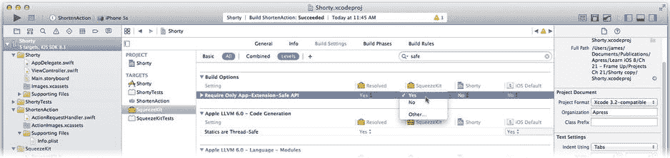


图 21-18. 让 SqueezeKit 扩展安全可靠

