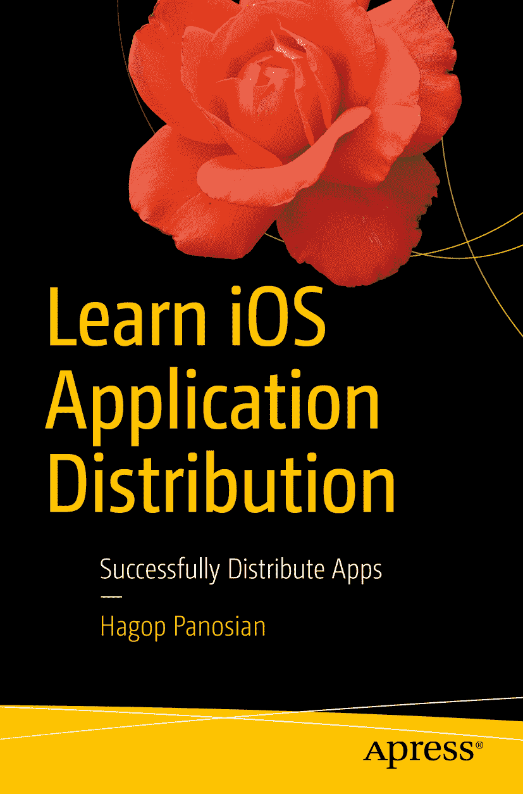
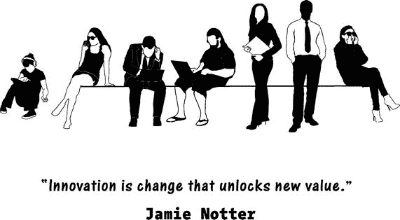
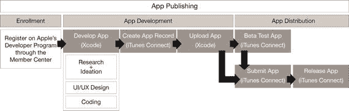

**哈戈普·帕诺西安**  
*学习 iOS 应用分发：成功分发应用*

作者在本书中引用的任何源代码或其他补充材料，读者均可通过本书产品页面访问 GitHub 获取，该页面位于 [`www.apress.com/978-1-4842-2682-7`](http://www.apress.com/978-1-4842-2682-7)。如需了解更多详细信息，请访问 [`http://www.apress.com/source-code`](http://www.apress.com/source-code)。

ISBN 978-1-4842-2682-7  
电子版 ISBN 978-1-4842-2683-4  
[`doi.org/10.1007/978-1-4842-2683-4`](https://doi.org/10.1007/978-1-4842-2683-4)  
美国国会图书馆控制号：2017955380

© 哈戈普·帕诺西安 2017  
本作品受版权保护。出版商保留所有商业权利，无论涉及材料的全部或部分，特别是翻译、重印、插图再利用、朗诵、广播、微缩胶片复制或任何其他物理形式的复制权，以及信息存储与检索、电子改编、计算机软件，或当前已知或未来开发的类似或不同方法的传输权。本书可能出现商标名称、标识和图像。对于商标名称、标识或图像的每次出现，我们并未一律使用商标符号，而是仅以编辑方式使用这些名称、标识和图像，并用于维护商标所有者的利益，无意侵犯其商标。在本书中使用商品名称、商标、服务标志及类似术语（即使未明确标识为注册商标）也不应被视为对其是否受所有权保护的立场表达。尽管本书中的建议和信息在出版时被认为是真实准确的，但作者、编辑和出版商均不对可能存在的任何错误或遗漏承担法律责任。出版商对本书所含材料不作任何明示或暗示的担保。

采用无酸纸印刷  
全球图书发行由 Springer Science+Business Media New York 负责，地址：233 Spring Street, 6th Floor, New York, NY 10013。电话：1-800-SPRINGER，传真：(201) 348-4505，电子邮件：`orders-ny@springer-sbm.com`，或访问 `www.springeronline.com`。Apress Media, LLC 是加利福尼亚州的有限责任公司，其唯一成员（所有人）是 Springer Science + Business Media Finance Inc（SSBM Finance Inc）。SSBM Finance Inc 是特拉华州的公司。

献给我的妻子阿加夫尼以及我的孩子艾伦和拉娜，你们是我生命中最亮的光芒！

## 引言

欢迎来到过去十年中最令人惊叹的技术创新之一。

应用产业诞生于 2008 年 7 月 10 日，当时苹果首次“敞开”其 App Store 的大门，允许 iPhone 用户将应用下载到他们的设备上。根据 CA Technologies 与《连线》杂志联合创办的在线期刊 Rewrite（[`www.ca.com/us/rewrite.html`](http://www.ca.com/us/rewrite.html)）报道，仅在短短七年内，截至 2015 年，应用经济已：

*   发展成为一个价值约 1430 亿美元的产业；
*   创造了至少 627,000 个就业岗位（仅通过 iOS App Store）；
*   在 2012 年至 2014 年间，为 iOS 开发者创造了 54% 的就业增长；
*   带来了预计到 2020 年将增长至略低于 3000 亿次的应用下载量；
*   并且仅通过 iOS App Store，每年的应用收入预计将在 2017 年增长至 770 亿美元，到 2020 年超过 1000 亿美元。

应用革命为美国和全球经济创造了全新的领域，带来了几年前还不存在的新市场、新营销渠道和新职业。它为供应商开辟了接触客户并与之互动的新方式，赋予了数十亿智能手机用户力量并带来了娱乐。最重要的是，它为资源丰富且富有创造力的企业家和普通人创造了一条途径，通过让他们接触庞大的市场，凭借其创造力和独创性赚取数百万美元。毫无疑问，在历史上，对于那些拥有好创意和营销头脑的人来说，很少有像今天这样容易接触市场和财富的时期。

应用产业在其发展初期所展现的巨大变革力量，正是我多年前对应用产生兴趣的原因。当时一位朋友建议我放下手头的工作，转而开发应用。作为一个自学成才者，我花了数月时间试图了解应用业务的运作方式以及应用的构建方法，并在我能找到的任何地方收集零散的可操作信息。

最终，我明显意识到，市面上帮助像我这样自我驱动的局外人学习应用开发的资源可以分为两大类：一类是由技术人员为技术人员编写的技术书籍；另一类则是“无需资金、无需编码、无需努力，一夜之间赚取数百万”的书籍，这些书兜售梦想，却几乎不提供可操作的信息。与此同时，有无数专家建议、技巧和窍门、最佳实践以及深刻见解，散布在由众多作者撰写的无数书籍、电子书、博客文章和文章中，而这些作者的专业知识正与行业本身一同发展。显然，市场需要一本能够融合应用设计、开发和分发的基本原理与最佳实践的书，为内部人士和局外人提供一站式服务，而不仅仅是对该行业的介绍——一本包含新入行者需要了解的所有关于应用发布行业知识的手册。这便是本书的灵感来源。

### 本书面向的读者

市面上固然有许多关于应用开发、应用设计、应用业务以及相关领域的优秀书籍，但有一点让我印象深刻：它们很难吸引或满足一个非常特定且相当庞大的群体。这群人对作为投资机会的应用非常感兴趣，但（错误地）认为在应用业务中取得成功需要大量的技术知识。他们也可能因为没有一本书能让他们轻松找到易于吸收、直击要点、可操作的信息和指导，从而学会如何在应用丛林中导航，并能够理解他们将参与竞争的市场而感到沮丧。他们想知道如何做出明智的决策，判断是否投资应用，以及如何选择正确类型的应用。他们还希望知道如何制定预算、创建投资计划，以及如何衡量项目的成功并获得投资回报。

最终，本书的研究成果不仅对追求回报的投资者有价值，对其他读者群体也同样具有参考意义。在写作过程中，我心中一直有一个非常具体的潜在读者名单，你将在后文中看到。尽管他们之间存在着差异，但这些读者画像有一个共同特征：他们对编码兴趣不大。要么是因为他们已经是资深程序员，要么是因为他们计划让别人来编写应用代码。因此，本书中没有一行代码。市面上已经有很多优秀的应用编码书籍。本书是关于其他所有方面的。

以下类别的读者最关心的是理解行业的方方面面，并掌握足够的知识来做出明智的决策，而不是盲目相信专家。其中一些人，比如程序员和数字营销人员，主要关心的是补充他们已经掌握的知识，并跟上这个令人惊叹的行业的发展步伐。

-   **神童**是编码大师。他精通如何编写 iOS 应用代码，并且已经编写过一些基础游戏。他希望成为一名应用分发专家。
-   **新手**对应用业务几乎一无所知，除了她自己使用的那些应用，其中一些她非常喜欢，以至于对它们是如何制作出来的感到好奇。此外，她正在考虑进入应用设计领域。
-   **投资者**对作为一种投资机会的应用感兴趣，并想知道与其他投资相比，他可以从应用中期望获得怎样的回报。他还想决定是成立一家应用设计公司，还是与一家公司合作来创建一个应用产品组合。
-   **专业程序员**希望超越编码，学习应用设计和营销，以改善自己的职业前景，这可能是成为独立应用专业人士的前奏。
-   **教育者**从设计、编码或营销的角度向学生教授应用行业知识，并且正在寻找一本既包含基础知识又涵盖行业最新动态的书籍。
-   **研究员**希望有一本书可以作为参考，为他提供有用的数据、额外的资料来源和信息，并作为一种跟上行业发展的方式。
-   **学生**正在学习作为商业、编码或营销课程一部分的应用知识，并且希望有一本书能简洁地解释这些业务流程中每个方面的基本概念和流程。

在《学习 iOS 应用分发》中，所有这些群体都能找到适合自己的内容。尽管他们对同一个主题有不同的看法，但他们都有一个共同点：编码方面对他们来说不如其他所有方面重要。他们要么已经知道如何编码，要么计划将应用的编码部分外包出去，或者有其他优秀的编码书籍，觉得不需要再买一本。

作为作者，我觉得需要一本关于全局的书籍，它足够全面，能让读者超越基础知识，并做出明智的决策，从而找到通往成功的道路。

### 前提假设

本书基于以下假设：

1.  你对应用业务或行业几乎一无所知（因此，我们将从头开始审视一切）。
2.  你想要直击要点的知识，这些知识虽然精炼，但易于理解且可操作。
3.  你希望在读完本书后感觉自己像个专家，或者至少在与你交谈时赢得专家的尊重。

这三个要素贯穿了《学习 iOS 应用分发》的内容和基调。

### 什么是应用分发？

应用分发到底是什么？它与应用开发或应用发布有何不同？

在本书中，应用发布是创建应用并将其投放市场的完整过程。应用开发是将构思、设计和编码相结合的过程。应用分发，正如苹果公司所定义的那样，是应用发布过程中一个非常具体的阶段，它结合了测试、提交和发布。

这是苹果公司在自己的在线《应用分发指南》（[`developer.apple.com/library/content/documentation/IDEs/Conceptual/AppDistributionGuide/Introduction/Introduction.html`](https://developer.apple.com/library/content/documentation/IDEs/Conceptual/AppDistributionGuide/Introduction/Introduction.html)）中对应用分发的定义：

尽管 iOS 应用分发是本书的主要焦点，但我们仍将详细审视整个应用发布过程，包括应用发布后发生的事情。

### 本书内容

本书整合了三个主要来源的信息：我个人的知识、苹果公司的官方指南，以及来自备受尊敬的开发者和公司的最佳实践与内容。这些来源各自贡献了非常特定类型的知识，当它们相互结合时，就形成了你在任何地方都能找到的最佳且最具可操作性的信息。

我将自己最初探索应用业务时希望学到的一切都写进了这本书。我希望这本书能让你在一夜之间成为专家，为你提供做出明智决策和在应用业务中留下印记所需的所有信息。

### 本书并非什么

这不是一本编码书。编码不在本书的讨论范围之内，而且本书中没有一行代码也并非巧合。《学习 iOS 应用分发》旨在满足一种不同的需求。

这本书也不是一本旨在兜售虚假希望作为卖点的“快速致富指南”。就我而言，在这个行业或任何其他行业都没有快速致富的捷径。只有决心和投入才能创造财富的机会。

本书的结构旨在向读者介绍应用行业，让他们能够在一夜之间自在、得体地与专家交谈，并选择最适合自己的行业领域。《学习 iOS 应用分发》面向那些对应用开发感兴趣，但对那些代码繁重或内容超出基础知识的书籍不感兴趣的读者。

### 本书内容概览

《学习 iOS 应用分发》共包含 15 个章节，内容按逻辑顺序编排，从应用行业简介开始，贯穿应用分发的完整流程，直至应用营销与性能评估。

每个章节都完整介绍了应用开发过程中不同方面的基本原理、活动与流程。按顺序阅读这些章节会很有帮助，但读者日后也可以单独回顾每个章节。

第 1 章“智能手机格局”介绍了承载我们所用应用的设备。我们将探讨智能手机和 iOS 设备的发展历程及其全球分销情况。我们将更深入地了解现有 iOS 设备的类型以及它们在全世界范围内的用户数量。

在第 2 章“应用格局”中，我们将应用视为实体进行探讨：它们是什么，从何开始、到何结束，以及应用商店中的顶级应用有哪些。

第 3 章“应用生态系统”探讨了应用行业中各司其职的角色，将其划分为三个基本群体：在应用发布前产生影响的人、在应用发布后产生影响的人，以及将开发与发布应用作为事业的“应用创业者”。

第 4 章“应用经济学”讲述了应用如何盈利，有哪些可用且流行的应用盈利模式，以及在应用世界中如何衡量投资回报率。

在第 5 章“构思你的应用”中，我们将探讨应用创意是如何产生的，最有效的创意产生流程是怎样的，以及如何寻找灵感。

在第 6 章“设计你的应用”中，我们将探讨应用如何从概念演变为设计。我们还将审视影响应用设计的方方面面，以及组建团队来开发应用概念的基础知识。

第 7 章“构建你的应用”讲述了如何将概念和设计转化为原型，涉及所需的软件、创建故事板和线框图，以及组建团队。我们还将探讨应用是如何组装的，其组成部分，托管平台，以及开发一个成熟应用所需的一切。

在第 8 章“配置你的应用”中，我们将探讨在 Apple iTunes 上为应用分发进行配置所需完成的所有工作。

在第 9 章“测试你的应用”中，我们将探讨 iOS 应用在提交审批前是如何在 TestFlight 上进行测试的。

第 10 章“提交你的应用”详细阐述了提交流程，并探讨了应用可能被拒绝的各种原因以及如何避免这些情况。

在第 11 章“分发你的应用”中，我们将了解应用在 App Store 上获得批准和发布后，其分发是如何管理的。

第 12 章“营销你的应用”全面讲述了如何营销应用，用于营销应用渠道有哪些，以及能够促成成功营销的最佳实践。

第 13 章“应用营销概念”探讨了营销人员近年来使用的最新概念和技术，旨在让他们的产品和价值主张脱颖而出，并使其营销活动尽可能高效且有效。

第 14 章“为成功做准备”将帮助你在各个基本方面为意想不到的成功做好准备。本书的结论部分着眼于当今应用世界的最大趋势以及应用的未来。

附录“在线资源”汇集了可用的资源，帮助你获取更多信息并提升技能。

### 如何使用本书

正如你所注意到的，本书各章节按照逻辑顺序编写，旨在为行业新手优化学习过程。但如果读者希望专注于某一特定方面，每个章节也可以单独阅读。

我写这本书的初衷是，当我作为一个完全的初学者学习应用发布时，多么希望有人能写出这样一本书。我希望你读这本书时能像我写它时一样开心。

### 致谢

这本书的诞生，既源于我个人的努力，也得益于家人的支持与启发，以及 Apress 团队的专业指导和编辑工作。

我深深感激我的父母，他们倾尽一生，只为让我们的童年比他们自己过得更好。他们做到了。在八十年代中期，当周围没人认为电脑重要时，他们为我弟弟和我买了一台电脑，这让我们成为了自我驱动、精通技术的自学者。我弟弟为这本书做出了巨大贡献，他确保我在花时间写作时不会陷入财务困境，同时也是本书最主要的读者原型。我正是以他为目标读者来写这本书的。

这本书同样是我妻子和孩子爱与耐心的结晶，他们是我每一天每一刻前进的动力。当你的家人如此信任你时，你很容易就会相信自己！

最后，衷心感谢 Aaron Black、Jessica Vakili 以及 Apress 的所有同仁，他们为将我的努力转化为高质量的产品做出了贡献。他们的专业精神让我备受鼓舞，也让我深感谦卑，期待与他们合作开展新项目！

