# 智能手机格局

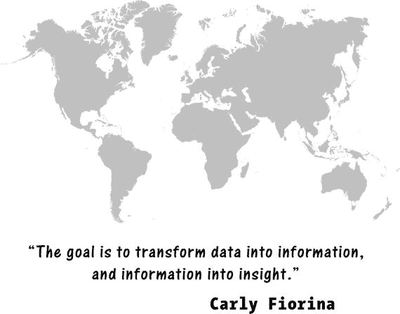

要理解应用行业的演变，我们首先需要了解承载这些应用的设备——智能手机——的演变过程。

众所周知，智能手机正在（或者说已经）席卷全球。目前全球有 20 亿智能手机用户，每人设备上平均安装 27 款应用，每天会查看其中 35 到 75 次。

应用与承载它们的设备的功能和特性紧密相连。了解智能手机、平板电脑及其平台在全球的分布情况，对于规划你的应用开发项目和营销活动至关重要。

那么，你能从全球智能手机出货量和地理分布信息中提取出哪些洞见呢？出货统计数据将帮助你识别应重点关注的市场——那些智能手机用户最多、使用最广泛的国家。

这些国家使用的语言将帮助你决定如何本地化你的应用。你是只发布英文版，还是也要发布中文版或俄文版？

此外，每个国家或市场智能手机用户的**人口统计数据**——年龄分布、性别分布、职业，以及他们的偏好和习惯信息——将非常有助于你构思应用创意。

因此，你应用开发之旅的起点是智能手机用户。让我们来看看智能手机是如何演变的，以及它们的使用情况在全球是如何分布的。

### 从手机到智能手机

就在几年前，手机还是一种又大又笨重的设备，除了让你在移动中打电话之外几乎做不了什么。它配备了一块巨大的电池，续航时间不过几个小时，却需要充电很长时间。最初的屏幕只能支持两种颜色，而最早的“智能手机”——即能做打电话之外更多事情的手机——上唯一的“应用”只有简单的日历、计算器和几个原始的游戏。

#### “砖头”与西蒙

第一款手机是摩托罗拉 DynaTAC 8000X（很有 80 年代风格的名字，对吧？）。它于 1983 年首次发布，重约 2.5 磅，售价高达惊人的 3,995 美元，外加月费。它被亲切地称为“砖头”。

第一款真正的“智能手机”是 IBM 西蒙，它在 2014 年迎来了 20 岁生日。售价 899 美元，IBM 在六个月内售出了约 5 万台。除了拨打电话和接听电话外，它还可以发送和接收传真和电子邮件。

#### 竞争

在手机早期，制造商对其设备的内部工作原理高度保密，所有为其开发的软件都在内部进行，作为严格保护的商业机密。直到 2007 年，苹果才将其设备软件向全球所有开发者开放，引发了开发热潮。如今，开源已成为提升软件质量、围绕产品建立社区的非常普遍的策略。

### 当今的智能手机市场

仅仅十年间，全球在用的智能手机数量已增长到超过 20 亿部。其中许多设备由苹果这样的先驱公司制造，但也有越来越多的设备由几年前还不存在的公司生产（图 1-1）。苹果的操作系统 iOS 仅运行在苹果设备上，如 iPhone 和 iPad，但谷歌的操作系统 Android 可以运行在任何为其设计的设备上。因此，有众多公司制造了多种专为 Android 设计的智能手机型号，这使得谷歌在智能手机市场的份额提升至今天的 80%以上。

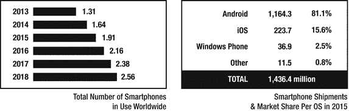

图 1-1. 智能手机统计数据

如今，Android 运行在市场上绝大多数智能手机上，包括三星、华为、小米等品牌。根据 Gartner 的数据，在 2016 年第二季度售出的手机总数中，Android 的市场份额占 86.2%，约 2.96913 亿部；紧随其后的是 iOS，市场份额 12.9%，约 4439.5 万部；Windows 市场份额 0.6%，约 197 万部；黑莓市场份额 0.1%，约 40.04 万部；其他制造商市场份额 0.2%，约 68.06 万部。

过去几年，华为和小米等几家中国智能手机制造商崛起，以满足中国消费者对智能手机快速增长的需求，而苹果设备在北美仍然很受欢迎。根据 `expandedramblings.com` 的数据，2016 年 iPhone 在美国和加拿大智能手机市场占有 41.9%的份额，但在中国市场仅占 8.2%的份额。

同样根据 Gartner 的数据，在 2016 年第二季度，三星售出约 7675 万部手机，市场份额为 22.3%；其次是苹果，约 4439 万部，市场份额 12.9%；华为 3067 万部，市场份额 8.9%；欧珀约 1849 万部，市场份额 5.4%；小米 1553 万部，市场份额 4.5%。其他制造商在 2016 年第二季度共售出 1.5853 亿部手机，市场份额为 46%。

三星是全球销量最高的智能手机制造商，2016 年第二季度市场份额为 22.8%，同比增长 7.7%，主要得益于 Galaxy S7 和 Galaxy S7 Edge 的成功。2016 年第二季度，苹果销量为 4040 万部，较 2015 年第二季度同比下降 15%。苹果全球最畅销的设备是 iPhone 6s。

### 全球智能手机使用情况

中国、印度和美国是三大智能手机消费国，也是目前仅有的三个智能手机用户均超过 1 亿的国家。在这三个国家中，中国正成为巨头，不仅在智能手机使用数量上。2016 年底，中国在 iOS App Store 收入上超过了美国。

图 1-2 基于 Gartner 和 eMarketer 2014 年 12 月的数据，展示了这三个国家及其 2015 年和 2016 年的智能手机用户预测数量。

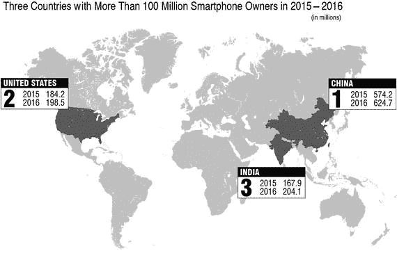

图 1-2. 美国、印度和中国的智能手机用户（2015 年和 2016 年预测），单位：百万

### 智能手机用户

使用来自 Gartner 和 eMarketer 的相同数据，图 1-3 列出了按 2015 年智能手机用户预测数量（基于 2014 年 12 月信息）排名的全球前 25 个国家，以及 2016 年的预测数据。

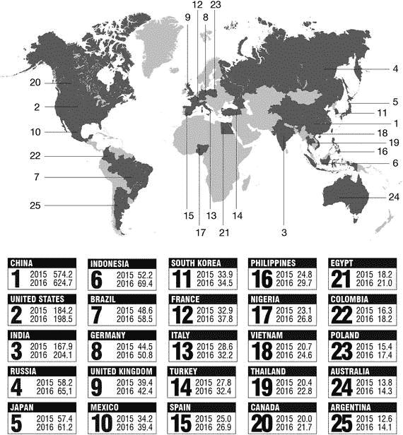

图 1-3. 2015–2016 年智能手机用户最多的前 25 个国家（预测），单位：百万

### 智能手机用户增长

智能手机市场也可以按用户增长最快来排名。使用 Gartner 2014 年 12 月的数据，图 1-4 展示了按 2015 年智能手机用户增长率预测排名的全球前 25 个国家。

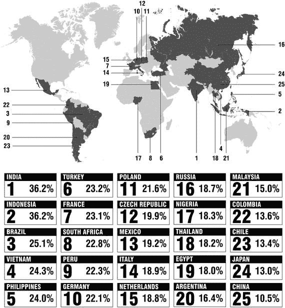

图 1-4. 2015 年智能手机用户增长最快的 25 个国家（同比增长率）

#### 主要市场

通过观察各国市场规模与增长率的排名，你可以识别出应用项目潜力最大的国家。例如，印度市场规模排名第三，但在用户增长方面位居第一。印度尼西亚显然是一个顶级市场，其规模排名第六，但在增长率上却与排名第一的印度持平。巴西同样如此，其规模排名第七，增长排名第三。

中国市场如何？尽管 2015 年中国智能手机用户增长率仅为 10.5%，排名第 25 位，但考虑到中国的人口规模和初始智能手机用户基数，这一增长率仍然代表着极其庞大的用户数量。

#### 智能手机普及率

一个国家拥有智能手机的人口比例，是衡量该国市场潜力的另一指标。智能手机饱和度越高，用户增长的空间就越小。

图 1-5 根据市场情报机构 SMSGlobal（[`www.smsglobal.com/`](https://www.smsglobal.com/)）、DIGIECO（[www.digieco.co.kr/](http://www.digieco.co.kr/)）、comscore（[`www.comscore.com/`](https://www.comscore.com/)）、eMarketer（[`www.emarketer.com/`](https://www.emarketer.com/)）以及韩国中央日报（[koreajoongangdaily.joins.com/](http://koreajoongangdaily.joins.com/)）的数据，列出了全球智能手机普及率最高的国家。

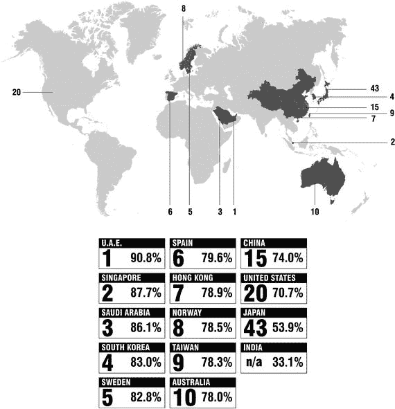

图 1-5. 2015 年智能手机普及率最高的国家（以人口百分比计）

#### 苹果设备：iPhone

苹果公司于 2007 年 6 月 29 日改变了世界，当时它向我们介绍了 iPhone，引发了智能手机革命，迄今已让超过 20 亿人用上了这些设备。迄今为止，苹果已售出超过 10 亿部智能手机，仅在美国就有超过 1 亿人在使用其设备。

自 2007 年发布以来，iPhone 已经发生了巨大的演变。图 1-6 对比了第一款 iPhone 机型与 2016 年发布的 iPhone 7 Plus 的规格参数。

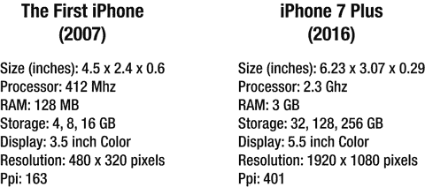

图 1-6. 第一代 iPhone 与 iPhone 7 Plus 的对比

在初代 iPhone 发布后的最初几年里，苹果领先于其他智能手机制造商，但随着华为和小米等使用谷歌安卓操作系统的中国智能手机制造商崛起，它们抢占了中国市场及其对新技术永不满足的需求的很大份额，苹果的市场份额因此缩水。2016 年第二季度，苹果在全球智能手机销量中占据 12.9%的市场份额，而安卓系统则占据了 86.2%（来源：[www.gartner.com/](http://www.gartner.com/)）。

苹果的智能手机操作系统 iOS 也随其设备一同演进。图 1-7 展示了各款 iPhone 机型与不同 iOS 版本的兼容性。

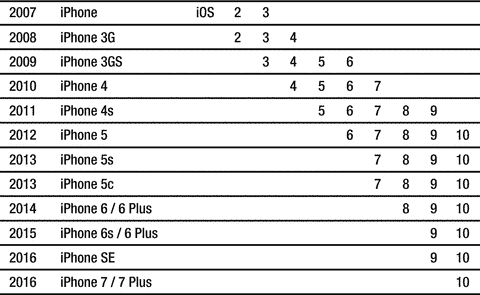

图 1-7. iPhone 型号的 iOS 版本兼容性图表

#### 苹果设备：iPad

苹果于 2010 年 1 月首次发布 iPad，到 2015 年 1 月，其销量已超过 2.5 亿台。首发当日售出约 30 万台，到 2010 年 5 月销量已超过 100 万台。iPad Mini 于 2012 年首次发布，iPad Air 于 2013 年发布，iPad Pro 于 2015 年发布。图 1-8 展示了不同型号的规格参数。

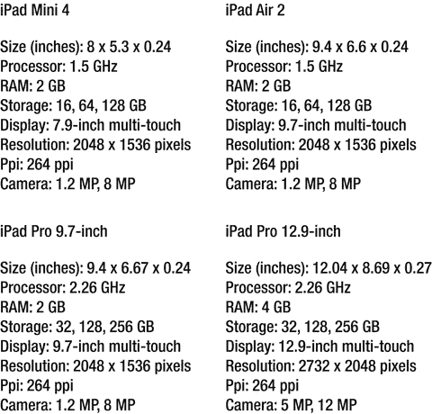

图 1-8. iPad 型号规格参数

#### 苹果部落

作为一家软硬件制造商，苹果率先制造设备、创建在这些设备上运行的软件和操作系统，并运营着销售为这些设备所开发应用的市场。

苹果还对 iOS 应用的设计、美学和功能施加严格的标准和质量控制。所有这些使得该公司能够为客户提供与其预期形象一致的用户体验。

早在 iPhone 和 iPad 问世之前，苹果客户就以品牌忠诚度而闻名，该公司也已将这种信任关系延伸到了其智能手机和平板电脑客户身上（图 1-9）。这一点体现在 iPhone 和 iPad 用户愿意通过其设备在应用和游戏上花钱。尽管苹果整体的智能手机市场份额约为 20%至 25%，但其用户在应用上的消费仍然超过运行其他操作系统的智能手机用户。

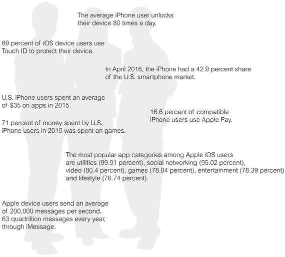

图 1-9. 苹果部落

### 本章小结

了解智能手机市场随时间如何演变，是制定良好应用开发和营销策略的基础。关于智能手机使用情况、增长率和市场普及率的可靠且最新的信息，将告诉你哪些国家是最佳选择，哪些语言应列入你的本地化清单，以及你的应用在何处最有可能最快实现可持续性。在本书后续内容中，你将把这些信息与应用使用情况、用户行为和消费习惯的数据结合起来，确定如何为你目标受众设计具有竞争力的产品。

## 2\. 应用格局

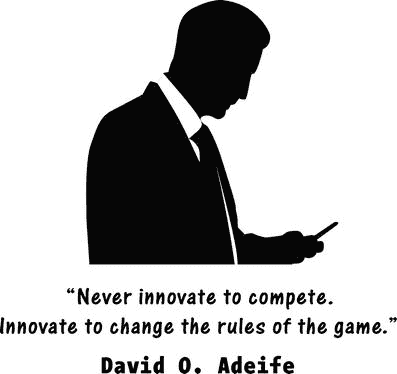

软件程序也称为应用程序，或简称应用。在台式电脑上运行的应用称为桌面应用，而在移动设备上运行的应用则称为移动应用。

移动应用只是一个程序，但它是专门为在智能手机上运行而设计的。应用改变了我们与软件交互的方式，以及我们使用软件来完成想做的事情的方式。在承载它们的智能手机的支持下，应用为通信创造了不可思议的可能性。它们还使得许多曾经远离编程和软件开发的人能够通过创建软件来获利。

### 应用的演进

应用与其承载设备——智能手机和平板电脑——共同演进。最初的应用只是如今新智能手机内置功能的原始版本：日历、通讯录和一些基本游戏。由于第一代移动电话的根本创新在于移动性本身，而且技术尚处于起步阶段，所有软件都是内置的。浏览互联网的概念，更不用说下载应用的想法，在当时还遥不可及，因为我们今天习以为常的带宽当时根本不存在。

1983 年 6 月在阿斯彭举行的一次技术会议上，史蒂夫·乔布斯预测，未来软件将能够通过电话线从分发中心购买。随着移动电话在 20 世纪 90 年代变得越来越普及，对更多功能的需求急剧增长，移动电话也随之演变成了今天的智能手机。

### 打好基础

手机已演进到能够满足用户对各种特性和功能的需求，而手机制造商只保留了数量有限的预装应用，并允许第三方开发者构建用户渴望的应用。这要求他们授予开发者访问智能手机内部功能的权限。2007 年 6 月，苹果公司发布了第一代 iPhone，在 30 小时内售出了 27 万台，并允许开发者构建基于苹果标准、能够使用其服务的 Web 2.0 应用。

开放访问的理念是当今应用商店和应用行业的基础。当苹果在 2008 年 7 月首次为 iPhone 推出 App Store 时，只有 500 个应用可供下载。第一周内，下载量就达到了一千万次。仅仅 60 天后，到了 9 月，应用数量已超过 3000 个，累计下载量突破一亿次。如今，苹果和谷歌的应用商店中各有约 180 万到 200 万个应用，服务于全球超过 20 亿部智能手机。2015 年，大约有 250 亿个 iOS 应用和 500 亿个 Android 应用被下载到智能手机上。

苹果和谷歌应用商店上的首批应用只是先前手机功能的简单延伸。TechCrunch (`https://techcrunch.com/`) 的联合编辑马修·潘萨里诺将智能手机应用的第一阶段称为“信息设备”阶段——这些应用将手机变成执行单一功能的设备，比如计算器或日历。潘萨里诺认为，下一阶段是“主屏幕”时代，每个应用都争相成为用户处理一切事务的主要应用。

### 应用的边界

一个应用不仅仅是存储在智能手机内存中的一小段软件。根据其类型和功能，它可以通过互联网与后端服务器通信，与其他智能手机上相同应用的其他实例进行交互，并受益于与其用途相关的无数服务。通常，一个成熟的应用会包含以下组件：

*   图标 – 这是你在智能手机上点击运行应用的“按钮”。
*   启动画面 – 这是告知你应用正在加载的不可交互屏幕。通常只是一张图片和一条让你等待的消息。
*   关键功能 – 除了执行其主要功能（无论是娱乐、工具还是其他），一个成熟的应用还会具备与安全、离线功能、用户支持、更新能力、联系应用发布者以提供反馈或提交查询的方式、个性化、响应式设备设计、内部搜索以及与社交媒体集成以便分享相关的功能。
*   分析 – 分析是嵌入应用中的代码片段，用于监控、分析和预测用户在应用内的行为。
*   后端 – 移动后端是托管在服务器上的软件，应用的发布者用它来与所有用户保持联系、存储相关信息、更新应用内容，并以不同方式补充应用功能。应用的后端可以托管在定制服务器上；云服务器如 Amazon AWS、Google App Engine 或 Windows Azure；或者像 Stackmob、Kinvey、Appcelerator 和 Parse 这样的 MBaaS（移动后端即服务）初创公司。

### 苹果的 App Store

苹果于 2008 年 7 月 10 日开放了 App Store，并在 2009 年 4 月 23 日达到十亿次下载量，同年 6 月达到 14 亿次。到 11 月，App Store 上已有 10 万个应用，苹果在 12 月达到了 30 亿次下载量。2010 年 4 月，应用数量达到 22.5 万个，到 6 月，这些应用的总下载量已达 50 亿次。到 2010 年 11 月，应用数量达到 30 万个。

2011 年 5 月，App Store 上的应用数量达到了 50 万个。截至 2017 年 5 月，约有 220 万个应用可供下载，到 2017 年 6 月，这些应用的总下载量已达 1800 亿次。

根据 Appboy (`https://www.appboy.com/`) 在 2016 年 4 月 (`https://www.appboy.com/blog/mobile-customer-99-stats/`) 发布的研究，如今超过 50%的智能手机用户在其设备上安装了 40 到 70 个应用，而 80%的用户每天至少与应用互动 15 次。只有 8%的用户每天使用超过 10 个应用，而 63%的用户使用 4 到 10 个应用。

### 应用类型与分类

每个应用都属于描述其主要功能的特定类别。每个应用发布平台，如苹果 App Store 或 Google Play，都有自己的应用类别列表，发布者用这些类别对应用进行分类，使其易于被找到。

截至 2016 年 10 月，苹果 App Store 的应用类别列表如下：图书、商务、目录、教育、娱乐、财务、美食佳饮、游戏、健康健美、生活、儿童、杂志与报纸、医疗、音乐、导航、新闻、照片与视频、效率、参考、购物、社交、体育、旅行和实用工具。

每个类别都有其子类别。例如，游戏类别包含以下子类别：动作、冒险、街机、桌面、家庭、音乐、益智、竞速、角色扮演、模拟、购物、体育和策略。

为了便于比较，截至 2016 年 10 月，Google Play 的应用类别如下：Android Wear、艺术与设计、汽车与车辆、美容、图书与工具书、商务、漫画、通讯、交友、教育、娱乐、活动、财务、美食佳饮、健康健美、家居、图书馆与演示、生活、地图与导航、医疗、音乐与音频、新闻与杂志、育儿、个性化、摄影、效率、购物、社交、体育、工具、旅行与本地、视频播放与编辑和天气。

#### 最受欢迎的应用类别

就可用应用和用户参与度而言，有些应用和应用类别比其他更受欢迎。根据 statista.com 的数据，截至 2017 年 7 月，按可用应用份额计算，苹果 App Store 上最受欢迎的类别是游戏（25.08%）、商务（9.83%）、教育（8.47%）、生活（8.33%）、生活（8.33%）、娱乐（6.1%）、实用工具（4.89%）、旅行（3.93%）、（6.31%）、图书（3.02%）、健康健美（2.98%）、美食佳饮（2.86%）、效率（2.61%）、音乐（2.54%）、财务（2.23%）、照片与视频（2.22%）、参考（2.21%）、体育（2.18%）、社交（2.11%）、新闻（2.11%）、医疗（1.86%）和购物（1.29%）。

### 热门应用

根据数字营销公司 Smart Insights（`http://www.smartinsights.com/`）的数据，截至 2013 年，美国成年人每天在移动设备上花费的时间已超过在台式机或笔记本电脑上的时间；到 2015 年，成年人平均每天在移动设备上花费 2.8 小时（占总时长的 51%）。他们都在使用哪些类型的应用呢？

根据媒体分析公司 comScore（`https://www.comscore.com/`）的数据，2015 年用户花费时间最多的应用类别是**社交网络**（29%），其次是**广播**（15%）、**游戏**（11%）、**多媒体**（6%）和**即时通讯**（6%）。

#### Apple App Store 热门应用

这一点在苹果和谷歌应用商店的热门应用排行榜上也有所体现。应用市场数据与洞察公司 App Annie（`https://www.appannie.com/en/`）每日都会列出应用商店中的热门应用。让我们看看 2016 年 10 月 27 日 App Store 的排行榜。

在免费应用中，排名领先的是`Facebook Messenger`、`Snapchat`、`YouTube`、`Facebook`、`Instagram`、`Ever`和`Bitmoji`。

在付费应用中，排名领先的是`Toca Life: Farm`、`Minecraft: Pocket Edition`、`Earn to Die`、`Heads Up!`、`Plague Inc.`、`Enlight`和`Bloons TD 5`。

2016 年 10 月 27 日苹果 App Store 上收入最高的应用是`Pokémon Go`、`Mobile Strike`、`Game of War: Fire Age`、`Clash Royale`、`Netflix`、`Candy Crush Saga`和`Clash of Clans`。

### Google Play 热门应用

我们来看看 2016 年 10 月 27 日 Google Play 的排行榜。

在免费应用中，排名领先的是`Facebook Messenger`、`Facebook`、`Snapchat`、`Ever`、`Instagram`、`Pandora Studio`和`Plants vs. Zombies`。

在付费应用中，排名领先的是`Minecraft: Pocket Edition`、`Don't Starve: Pocket Edition`、`Toca Lab`、`Tamotions`、`Bloons TD 5`、`Mini Metro`和`Reigns`。

2016 年 10 月 27 日 Google Play 上收入最高的应用是`Mobile Strike`、`Clash of Clans`、`Game of War: Fire Age`、`Clash Royale`、`Pokémon Go`、`Candy Crush Saga`和`Candy Crush Soda Saga`。

根据数字营销机构 Ironpaper（`www.ironpaper.com`）的数据，2016 年 6 月以下 iOS 应用的市场覆盖率最高，按降序排列：

-   `Facebook`，68%
-   `YouTube`，60%
-   `Instagram`和`iBooks`，各占 44%
-   `Skype for iPhone`，40%
-   `Podcasts`，38%
-   `Twitter`，34%
-   `Facebook Messenger`，31%

#### 游戏：规模最大的应用类别

游戏在收入方面超越了所有其他应用类别。根据`statista.com`的数据，2013 年至 2016 年美国移动游戏总收入（以美元计）分别为：2013 年 20.3 亿美元，2014 年 26.1 亿美元，2015 年 30.4 亿美元，2016 年 36.1 亿美元。与此同时，截至 2016 年 10 月，美国收入最高的 iPhone 移动游戏应用（按每日美元收入排名）为：`Clash Royale`（1,969,094 美元）、`Pokémon GO`（1,562,029 美元）、`Game of War: Fire Age`（1,226,442 美元）、`Mobile Strike`（690,275 美元）、`Candy Crush Saga`（478,159 美元）、`Clash of Clans`（402,001 美元）、`Candy Crush Soda Saga`（337,727 美元）、`MADDEN NFL Mobile`（281,295 美元）、`Toy Blast`（213,516 美元）和`Slotomania Free Slots`（186,724 美元）。

#### 开发者收入

各类应用的开发者通过苹果 App Store 赚取了巨额收入。根据`statista.com`的数据，截至 2014 年 1 月，苹果支付给开发者的总额已达 150 亿美元。到 2015 年 1 月，这一数字增至 250 亿美元，而截至 2016 年 6 月，App Store 累计支付给移动应用开发者的总额已达 500 亿美元。

#### 顶级应用开发者及收入

截至 2016 年 2 月，苹果 App Store 上约有 40 万注册开发者，每天发布约 1000 款应用。表现最好的公司通常是游戏开发商，其中几家公司的销售额达到 10 亿美元或更高。

根据 Pocketgamer（`www.pocketgamer.biz`）的数据，以下公司在 2015 年的销售额至少达到 10 亿美元：`Blizzard`（美国，47 亿美元）、`NetEase`（中国，35 亿美元）、`Tencent`（中国，30 亿美元）、`Supercell`（芬兰，23 亿美元）、`Mixi`（日本，20 亿美元）、`King`（英国，20 亿美元）、`Ubisoft`（法国，15 亿美元）、`GungHo`（日本，13 亿美元）、`Dena`（日本，12 亿美元）和`Machine Zone`（美国，估计 10 亿美元）。

以下公司在 2015 年的销售额在 1 亿到 10 亿美元之间：`CyberAgent`（日本）、`Netmarble`（韩国）、`Zynga`（美国）、`GREE`（日本）、`Colopi`（日本）、`EA Mobile`（美国）、`Elex Technology`（中国）、`Nexon`（日本）、`Square Enix`（日本）、`Kabam`（美国）、`Com2uS`（韩国）、`Jam City`（美国）、`Wargaming`（白俄罗斯）、`Gameloft`（法国）、`Disney Mobile`（美国）、`Sega Networks`（日本）、`Glu Mobile`（美国）、`IGG`（新加坡）、`Scopely`（美国）、`Rovio`（芬兰）、`Pocket Games`（美国）、`Miniclip`（英国）、`Gamevil`（韩国）和`Etermax`（阿根廷）。

以下公司在 2015 年的销售额在 100 万到 1 亿美元之间：`ZeptoLab`（俄罗斯）、`Seriously`（芬兰）、`TinyCo`（美国）、`Wooga`（德国）、`Kiloo`（丹麦）、`Space Ape Games`（英国）、`IUGO Mobile`（加拿大）、`Bethesda Studios`（美国）、`Hister Whale`（澳大利亚）、`Next`（芬兰）、`KetchApp`（法国）、`Super Evil`（美国）、`Gram Games`（土耳其）、`Everywear Games`（芬兰）和`Mediocre`（瑞典）。

应用为许多开发者和公司带来了巨额财富，但最新趋势表明，应用行业早期的“淘金热”正接近尾声，应用开发的“中产阶层”正逐渐让位于一个两极分化的体系：少数公司赚取丰厚利润，大量小开发者收入平平，中间存在巨大鸿沟。

大公司投入巨资开发顶级游戏和应用。他们利用庞大的营销预算以及用户参与技巧和经验来获取并留住用户，使得小公司难以找到可借以蓬勃发展的突破口。随着用户获取成本达到每位用户约 3.50 美元且不断增长，开发者需要大笔预算才能获得生存所需的用户，这构成了强大的进入壁垒。

这并不是说没有新进入者的空间。这只意味着新进入者在进入这个行业之前需要做好充分准备，要有完善、成型的好创意，强有力的规划和预算，并对什么方法有效以及如何运作有深刻的理解。

### 总结

监控应用类别和热门应用的受欢迎程度及财务表现，将有助于你在应用设计阶段获得关键洞察——此时你的重点是将产品与同类竞品进行定位，并创造独特的价值主张以使其脱颖而出。这也能帮助你识别那些具备特定功能集的产品能够获得成功的细分市场，从而围绕这些功能进行产品设计。

作为应用开发者，你需要持续监控应用商店，因此，寻找多个可靠、准确且最新的信息来源，并将其作为优先事项，至关重要。

接下来，我们将探讨应用行业的生态系统——谁负责什么，谁与谁合作，共同打造出你喜爱的应用和游戏。

## 3. 应用生态系统

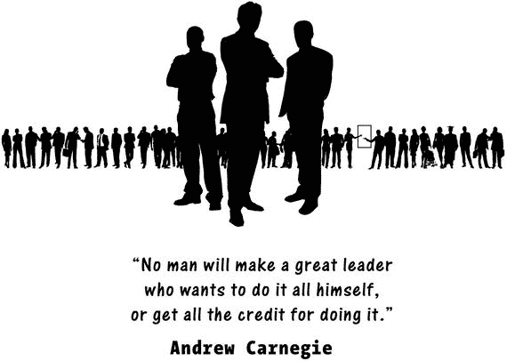

在应用从创意诞生到演变成一款诱人、功能齐全、可供你从应用商店下载的完整产品之间，发生了什么？在这个过程中，又是谁影响了这款应用从概念到产品的演变？

一款应用在演变成最终产品的过程中会经历几个阶段。每个阶段都会越来越详细地定义应用的功能、外观和感觉，之后才会创建第一个原型，并在发布最终版本之前对其进行全面测试。

随着你对应用行业越来越熟悉，你会注意到，外面有成千上万的公司——其中许多最初也和你的初创公司一样——它们提供与应用发布相关的服务、资源或产品，而非自己发布应用；或者它们在某种程度上规范着应用发布流程、整个行业或市场。每天都有越来越多的公司成立，每一家都瞄准行业的特定环节或应用发布流程的某个特定方面。你和你的应用要么受益于它们的产品和服务，要么必须遵守它们制定的规则和规定。它们是连接你初创公司创始团队和应用用户之间的中介。

### 设备制造商

设备制造商是制造硬件——即承载你的应用并增强其功能的智能手机、平板电脑、iPod 以及其他设备和配件的公司。这个群体还包括制造其他设备和配件的公司，例如连接到你的设备并由应用管理的 3D 摄像头、2D 和 3D 打印机以及信用卡读卡器。

正如我们在上一章所见，与应用行业相关的主要设备制造商是三星和苹果，其次是华为、小米、联想，以及像 Oppo 这样的新进入者。根据 `statista.com` 的数据，2016 年第二季度，三星以 22.4%的市场份额位居智能手机市场首位，其次是苹果（11.8%）、华为（9.4%）、Oppo（6.6%）和 Vivo（4.5%），而其他制造商合计占据了 45.1%的市场份额。其他已经或曾经制造智能手机的公司包括 LG、RIM、黑莓、HTC、诺基亚、摩托罗拉、中兴、索尼和微软。

你设计的任何应用都必须考虑这些设备的规格、特性和组件，例如屏幕分辨率、像素密度、可用摄像头（一个或两个）及其分辨率和功能、GPS、加速度计、处理器速度、存储容量等等。

许多应用的核心功能依赖于这些设备中某个特定组件的数据，例如使用加速度计数据来运行的应用或游戏、使用 GPS 数据的基于位置的应用，或使用摄像头拍摄照片的滤镜应用。你的应用也会利用这些组件来收集用户信息，例如使用 GPS 数据按位置对用户进行细分。

### 操作系统开发商

诸如苹果和谷歌之类的操作系统开发商构建了帮助你在设备上进行管理并运行应用的操作系统。以苹果为例，设备的制造商（iPhone、iPad、iPod）和其运行的操作系统（iOS）的开发商是同一家公司。另一方面，Android 是由谷歌构建的操作系统，它可以运行在一长串制造商销售的大量设备上，这其中包括谷歌自己的 Nexus 系列智能手机，以及绝大多数其他制造商，尤其是三星、华为和小米。

操作系统开发商还为应用及其用户界面的设计制定了严格的指导方针。苹果和谷歌对应用的设计和功能都有严格的设计指南，并将这些指南发布在其网站上供开发者遵循。

### 应用分发平台

通常，应用分发平台是移动操作系统的原生部分，这是技术集成所决定的。截至 2017 年 5 月，最大的平台是拥有 280 万个应用的 Google Play 和拥有 200 万个应用的苹果 App Store。除了这两个最受欢迎的平台，还有拥有 669,000 个应用的 Windows Store、拥有 600,000 个应用的 Amazon Appstore 以及拥有 234,000 个应用的 Blackberry World。仅在 2017 年，通过这些应用商店，应用的下载量已超过 1800 亿次。

### 应用营销与分析平台

应用营销平台是数字营销的推动者，它们将通过以下几种方式支持你的营销活动：

- 它们将提供市场研究和数据，用以支持决策。
- 它们将组织和标准化你的营销材料。
- 它们将帮助你测试你的设计和原型。
- 它们将自动化你的营销活动，并帮助你提高其有效性。
- 它们将提供关于用户反馈的分析数据。

你可以在本书末尾的“资源”部分找到一长串应用营销平台。

### 监管机构

监管机构制定法律，规范应用及其运行设备的制造、销售和使用。监管机构处理的问题包括设备的安全性和可用性、数据安全、用户隐私、标准化、公平竞争、防止欺诈和滥用、应用商店许可证发放、打击恶意软件、强制实名注册，以及向用户披露应用内支付和信息收集情况，特别提防儿童进行的未经授权收费。它们还解决在特定情境下使用应用所产生的法律纠纷，例如在 Uber（优步）使用的国家，其出租车服务应用与当地出租车司机之间的冲突。

有时，应用的设计并非受其自身行业法规的影响，而是受其目标服务行业法规的影响。例如，医疗行业应用必须遵守严格的法规，主要涉及通过应用收集并存储在记录中的患者信息的安全性、通过应用传播的医疗信息的可靠性以及数据泄露通知。

### 投资者

投资者在基于应用的科技初创公司生命周期的不同阶段，对有前景的应用进行投资。一个应用初创公司最初的资金来源很可能是个人储蓄、家人和朋友。为了在第一阶段之后继续发展，他们通常会寻找其他资金来源，无论是通过贷款、股权，还是来自导师、创业孵化器、天使投资人、风险投资家和银行，通常从所谓的种子资金开始。应用初创公司筹集资金的另一种方式是通过像 Kickstarter 和 Indiegogo 这样的平台进行众筹。

### 开发者

开发者，无论是作为个人还是公司，是将应用概念转变为可工作应用的人。开发者可以是自己初创公司的全职或兼职员工，也可以根据项目需求和预算进行雇用或外包。他们包括编码人员、用户界面（UI）和用户体验（UX）设计师、游戏设计师以及网页设计师。

开发者将从概念入手，根据你的规格和意图、你想要构建应用的操作系统、平台和市场，以及你的预算，制定项目计划。开发者会为众多设备、屏幕和用户群体设计用户体验和用户界面，优化应用的技术、体验和商业性能。在将应用发布到应用商店之前，他们还会对其进行广泛测试。目前，全球已有超过 1300 万注册的苹果开发者。

### 资源制作者

资源是指在应用设计和推广中广泛使用的数字产品，例如图片、音效、游戏角色，甚至是可以插入到应用和游戏中的代码片段。资源制作者设计、销售或分享诸如以下的产品：

*   图片——用于应用推广的设备与屏幕模型、游戏背景、标准屏幕布局类型（如登录屏幕、注册屏幕）
*   线框图——预设计的、应用常见各种屏幕（或页面）的骨架式示意图
*   模板——用户界面（UI）和图形用户界面（GUI，发音为"gooey"）套件与模板，可加速开发者的设计、迭代和线框图绘制工作
*   游戏资源——关卡、角色和诸如武器等对象
*   代码——预编写的实现特定功能、为程序员节省时间的代码片段

### 市场营销与广告公司

营销人员将通过多种渠道帮助你最大化应用的曝光率及其成功机会。服务范围涵盖从用于自动化管理大量订阅者沟通的简单电子邮件营销服务，到由专业应用营销机构提供的全方位营销策划与执行。

如果你想与专业的市场营销和广告公司合作，明智的做法是在你的应用仍处于开发阶段时就开始，甚至更早。在应用生命周期的早期阶段，即应用进入市场之前，应用营销机构为你做的事情包括：分析竞争格局、创建独特的价值主张、识别适合你应用的市场和细分领域、进行用户反馈与收入预测、在发布前进行测试、启动早期营销活动以围绕你的应用制造兴趣、设计并制作优化的推广素材（如应用商店中的应用描述、截图和视频），并为你管理应用提交与审核流程。营销机构还会制定一份专注的发布后营销与推广计划，并代表你实施和管理该计划。

### 教育者

如今，技术使得人们能够便捷且廉价地获取关于应用开发各个方面的海量学习资源，从博客、网站、文章、论坛到 YouTube 视频，求知者总能找到他们所需的一切帮助。

如果你致力于学习应用开发，那么在 `Udemy`、`Udacity`、`Lynda`、`Coursera`、`Team Treehouse`、`Code.org`、`Code Academy`、`iTunes U`、`Khan Academy`、`Pluralsight`、`Skillcrush`、`Tuts Plus`、`Skillshare` 和 `Sitepoint` 等网站上都有在线课程。此外，还有由哈佛、麻省理工、耶鲁、伯克利、卡内基梅隆、德克萨斯大学等知名学府提供的 MOOC（大规模在线开放课程）。

在线导师可以教授你编程技能，并就你遇到的任何应用开发问题提供建议。你可以在 `CodeTutor`、`Chegg`、`Presto Experts`、`Tutor Universe`、`Wyzant`、`Tutors Live`、`eTutoring` 等网站上寻找导师。辅导公司还会组织关于应用开发广泛及具体主题的研讨会。在这些研讨会中，学习是以小组形式进行的。通常通过简单搜索就能找到它们。最受欢迎的科目是编程和应用营销。

如果你是一位充满热情且积极主动的自学者，市面上有印刷版或在线版的书籍，几乎涵盖所有与应用开发相关的主题。所有主要的科技类出版社，如 `Apress`、`McGraw Hill`、`New Riders`、`Wrox` 和 `Wiley`，都有数百本关于应用开发各个方面的书籍，内容涵盖从编程、UI/UX 设计到市场营销。

### 在线求职市场

在应用发布流程中，你需要管理的一个重要方面是决定哪些任务由内部处理，哪些任务外包或作为服务雇佣他人来完成。

作为应用发布者，你可能会决定将应用开发过程的某部分外包，根本原因是为了节省成本，并避免因空间限制或项目规模较小等原因而招聘内部人员。

随着"零工经济"的发展，在线雇佣变得非常流行，尤其是对于与技术相关的工作。你主要需要雇佣两种类型的工作：设计和编程。设计师会为你提供应用品牌创意和 UI/UX 设计，而程序员则会为你的应用编写代码。

最流行的在线求职市场有 `Upwork.com`、`Freelancer.com`、`Guru.com`、`Elance.com`、`Toptal.com`、`99designs.com`、`Fiverr.com`、`MatchList.com`、`Gun.io`、`Crew.co`、`LocalSolo.com`、`Onsite.io`、`Folyo.me`、`Crowdsite.com`、`GetaCoder` 和 `PeoplePerHour.com`。

这便引出了应用发布行业中最重要的参与者——应用创业者（app entrepreneur）。那就是你！

### 应用创业者

如果你正进入应用行业，意图发布一个或多个应用并围绕它们建立业务，那么你就是一位应用创业者。正如我们稍后将看到的，除极少数例外，独自完成构思、设计、编码和发布应用的全过程并不是一个明智的应用发布方式，原因有几个，其中最重要的是，这种策略无法最大化应用成功的潜力。

你不太可能精通引导应用成功所需的所有技能，更不用说时间限制和工作量了，因此更好的方法是组建一个团队，汇集所有需要的技能并高效地分配任务。

为什么组建团队比单打独斗更明智？以下部分将指出其原因。

#### 技能组合

无论你多么聪明，你也不太可能掌握让应用成功所需的所有技能。发布一款应用需要以下技能：视觉设计、UI/UX 设计、编码、项目管理、会计、财务管理、商业法与知识产权保护、时间管理、市场营销、客户关系管理（CRM）等等。一个构建良好的团队成员将汇聚应用项目所需的所有关键技能，并实现彼此优缺点的互补。

#### 时间管理

简而言之，一天的时间根本不够你独自完成一个严肃应用项目的所有事情，除非你打算花上数年时间将它推向市场，而到那时，竞争对手可能已经使市场饱和。凡事亲力亲为还会迫使你进行微观管理，并可能因此失去对项目更宏大愿景的关注。

#### 反馈

当你独自工作时，你会错失来自队友的持续反馈机会，而这对项目的效率和成功至关重要。并不是说你不能独自完成——很多人都做到了——但有了团队，你的潜力和能力会大得多。

#### 人脉

除了个人对项目的贡献外，团队的每个成员都会将自己的人脉圈——朋友、同事和其他联系人——带入项目，从而成倍增加项目的可见度以及获得强有力导师支持的可能性，尤其是在项目初期。

##### 可信度

投资者很少会认真对待一个人的团队。“我完全能靠自己完成所有事，不需要其他人”这种态度必然会扼杀你的可信度，并吓跑投资者。这表明：1）你并不完全了解应用发布所涉及的工作内容和各项独立任务；2）你可能偏执多疑，或对自己的项目过于痴迷和情感投入，因而不愿与任何人分享你的想法；3）你可能过于贪婪，不愿为了融资而让渡股权。这些印象都会向投资者发出非常糟糕的信号，削弱你作为创始人的可信度，让你显得还不够成熟，无法将你的项目当作一门未来的生意来对待。任何严肃的应用项目都将围绕一个团队来构建，而一个由合适技能、合适人才和合适人脉网络有效结合的团队，其整体价值将远超各部分之和。

接下来，让我们看看创始团队的各个成员。

#### 创始团队

创始团队由三个子群体组成：创始人、联合创始人（一名或多名），以及导师（一名或多名）（图 3-1）。每一方在公司的创立和发展中都扮演着重要角色。

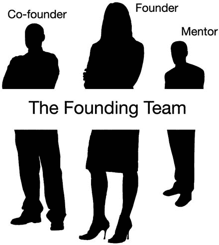

图 3-1. 创始团队

##### 创始人

每个项目或企业都始于创始人。除了是“最初的构想者”和愿景的承载者之外，创始人还是推动者，他/她会确保项目保持在正轨上并朝着正确的方向发展，尤其当他/她还同时担任`CEO`时。

##### 联合创始人

联合创始人为初创企业贡献自己的技能、经验和社交网络，并帮助向投资者传递一个积极的信号，表明创始人们正在如何推进他们的项目。

组建团队始于创始人。作为一个聪明的创始人，你首先要对自己能完成的事情和拥有的技能进行现实而准确的评估，识别出所欠缺的关键技能，然后通过引入那些理解并分享你愿景的、可靠且投入的联合创始人来补充这些技能。从一开始就对应用初创公司不可或缺的人员，是创始团队的最佳候选人。

然而，在组建创始团队时，作为创始人，你也需要确保创始团队不会变得过于庞大，因为成员过多会稀释对项目或初创企业的所有权，并增加发生冲突的可能性。创始团队成员需要分享你的愿景，而随着团队规模的扩大，这种可能性就会减小。一个将远见与管理技能、财务技能和技术技能结合起来的精干创始团队，会向投资者传递正确的信号，并在你成长的过程中提高成功的机会。

##### 导师

导师对应用项目或初创企业来说是极具价值的贡献者。他们可能加入也可能不加入最初的创始团队，但合适的导师会贡献他们的经验、知识和社交网络，提升你初创企业的可信度和知名度。当管理团队进入未知领域时，他们会提供指导；如果你刚接触应用发布，你将经常需要这样的指导。

#### 用户

到目前为止，让应用产业不断发展的最大群体是用户。全球有超过 20 亿用户，他们手握智能手机，平均每天查看约 15 次。他们会下载你的应用、与之互动、进行评价、分享使用体验，并希望最终能为你的应用付费。

你与用户的关系对你应用的成功至关重要。了解你的用户是谁、他们想要什么、喜欢什么、以及他们对你的应用有何期望，是创建一款成功应用的关键。这款应用能完美契合产品与市场，最终为你带来可观的收入。

关于你的用户，最重要的一点是，他们彼此各不相同。忽视这个事实，你将自担风险。正如你将看到的，用户可以根据他们共有的特征划分为不同的群体，但每个人都期望你把他们当作独立的个体来对待，并且每个人对针对其个人进行营销的内容的反应，远比对千篇一律的营销内容要积极得多。随着你业务的扩展，你的营销工作会逐步自动化，但你能越深入地理解用户之间的差异，就越能更好地理解是什么激励了他们并促使他们产生购买欲望，从而使你的营销工作越有效。

那么，你将如何通过你的应用和营销活动与用户互动呢？你与用户的关系包含三个方面：信息收集、用户细分，以及关联/响应。我们现在就来逐一探讨。

##### 收集信息

在你的应用中使用的分析软件将收集所有用户愿意分享的关于他们的信息。分析工具会收集三类信息：用户属性、用户偏好和用户行为。

用户属性是对用户的描述：所在位置（城市和国家，以及基于位置的应用所需的`GPS`数据）、年龄、性别、出生日期、母语、所使用设备的数量和类型，以及它们的操作系统。

用户偏好是指用户喜欢什么，以及他们希望你如何与他们联系。根据应用的类型，分析工具会告诉你他们使用哪些社交媒体、他们最喜欢的内容类型是什么、他们喜欢去哪里消遣、喜欢吃什么、旅行的频率，以及他们喜欢去哪里度假。你的用户还会告诉你他们希望你如何与他们互动——比如他们是否喜欢通过推送通知接收消息、他们对应用内服务和内容的订阅情况、他们已启用的设备设置，以及他们的社交媒体连接状态。

用户行为监测则告诉你用户在做什么，并收集关于他们行为的统计数据，从而创建一个用户画像。你可以利用这个画像来开发下一个版本的应用，并用于营销目的，向他们提供合适的方案。

用户行为信息包括：应用使用频率和间隔、应用访问时长、应用交互深度，以及财务信息，例如应用内购买的平均值和总价值、购买频率、最后打开的一封邮件或推送通知、他们从哪个营销活动转化而来，以及在应用内执行的最后操作。

##### 用户细分

有效营销用户的第一步是细分。细分是指根据年龄、性别、地理位置、行为模式和偏好等不同特征，将用户群体划分为更小的细分市场的过程。不过，细分首先应基于你的营销目标。你可能正试图将非付费用户转化为付费用户，因此会根据用户的财务数据进行细分。你会将非付费用户筛选出来，并尝试向他们提供优惠，可能是你为深度参与的用户群体设计的新功能。你可能想通过奖励最忠诚的用户（即那些最常使用你的应用的用户）来增强留存率，并向活跃但尚未忠诚的用户推广忠诚度奖励，以鼓励他们更积极地参与。

你可能正在尝试重新定位那些设备上安装了你的应用但很少使用（甚至几乎不用）的用户。他们被称为流失用户或不活跃用户。在这种情况下，你会筛选出与你的应用互动最少的用户，并引导他们重新使用。这完全取决于你想要实现的目标，但你的分析数据越详细，你就越能有效地达成营销目标。

一个值得注意的例子是超本地化营销，它根据用户与营销活动相关特定地点的距离来细分用户。例如，一个自动化营销平台会利用 GPS 数据，向所有位于某餐厅、商店或其他场所一公里范围内的用户展示该场所的广告。

##### 关联与响应

一旦你收集并整理了通过分析工具获取的所有用户数据，你就可以利用这些宝贵的信息，通过以下方式个性化你的营销：

*   **通过内容**：你可以设计营销内容，使之匹配用户偏好的主题。
*   **通过设计**：用户对营销信息的响应历史可以提供线索，帮助你了解他们最喜欢的信息类型和设计风格。
*   **通过时机**：如果你在一天中的某个特定时间联系用户，比如下班后，他们可能会积极响应；而在中午发送的消息则可能被忽略。
*   **通过合适的优惠**：根据目标细分人群的特征量身定制优惠方案，你将获得成功。

### 总结

本章主要探讨了不同角色如何决定一款应用的功能、外观与感受，并最终决定其命运。业余应用发布者往往对自己的项目感情深厚，将其视为自身想法和意图的体现；而更专业的发布者则明白，像所有产品一样，应用是由不同的人塑造的，旨在满足用户的特定需求，其成功与否取决于在满足用户需求方面的表现。

应用就像一个与用户共同成长的活体。通过用户对产品的回应，他们会告诉你他们想要什么；作为发布者，你的使命就是跟上用户不断变化的需求和期望。

## 4. 应用经济学

这一章是关于钱的。在这一章中，我们提出（并回答）每个对应用作为投资或商业项目感兴趣的人都想知道的五个大问题：

1.  开发一款应用需要多少钱？
2.  应用如何赚钱？
3.  应用能赚多少钱？
4.  如何衡量应用的表现？
5.  如何衡量应用的 ROI（投资回报率）？

让应用盈利是一件棘手的事情，也是一门不断发展的科学。它既关乎好的设计、营销以及通过移动界面与客户的互动，也关乎财务头脑，因此它同时依赖于理性思考和直觉。

那么，我们应该从财务角度如何看待应用呢？

应用的收入周期如图 4-1 所示。

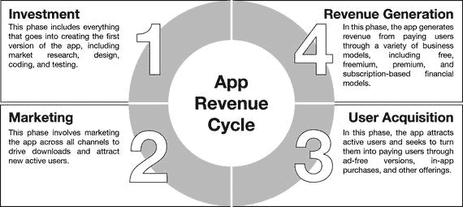

图 4-1. 应用收入周期

尽管看起来第一个阶段“投资”只需要执行一次来创建应用的第一个版本，但重要的是要理解，一旦应用上线，这些阶段中的每一个都是持续进行的。作为发布者，你将不断地投资，不断地营销，不断地获取用户，并（希望如此）不断地产生更多收入。如果你在应用上线后停止对其投资，你最终也会停止产生收入。

同样重要的是要注意，除了用于支付工资和其他运营成本外，你的应用产生的部分收入将用于创建新版本、添加新功能、创建新的应用内购买项目（以及游戏中的新关卡），并总体上构思新的方法，以保持现有用户的参与度和付费意愿。

### 大问题 1：开发一款应用需要多少钱？

这个问题没有一个明确的答案，因为成本因多种因素而异，差别巨大。开发一款应用的成本可以低至几乎为零（如果你是专业程序员，自己开发一个非常简单的游戏），也可以高达数百万美元（如果一个热门游戏需要同时支持数百万用户在线游玩其移动版本）。

一个简单的独立应用，其成本可能从几百美元（如果你自己设计和编码）到数万美元不等，具体取决于其规模、复杂性和平台。估算应用成本还取决于你如何计算完成任务所需的硬件和软件成本，以及开发者的订阅费用。如果你正在开发多个应用，这些成本将在你发布的应用总数中分摊。地理位置是另一个重要因素：编码、测试和调试应用的成本，在东亚可能是每小时 10 到 20 美元，而在欧洲和北美则可能超过每小时 200 美元。创建一个后端数据库的成本可能从几千美元到数万美元不等。

对于一个中等复杂程度的应用，集成社交媒体功能也可能需要花费数千美元，应用内购买系统也是如此。一个企业级应用的成本可能高达数万美元，而一个设计精良、关卡众多、支持应用内购买的复杂游戏，其成本可能高达数十万美元，甚至数百万美元。

以下章节将回顾影响应用开发和发布成本的主要因素。回答这些章节中的问题，将有助于你很好地估算你设计的应用需要花费多少钱。

#### 应用类型

你想创建哪种类型的应用？它是一个简单的独立应用或游戏，不需要后端，可以完全在用户设备上下载运行且无需网络连接（例如手电筒应用）？它是一个关卡众多、角色和玩家数量庞大的复杂游戏？它是一个社交媒体应用、一个拥有固定用户群的企业应用，还是其他类型的应用？

#### 应用平台

您正在为哪些平台开发应用？您的应用可以是原生应用，即专门为 Android、iOS 或其他平台设计；也可以是跨平台应用，意味着一次构建即可在多个平台上运行；或者可以是混合应用，即在一个允许像原生应用一样被下载和运行的代码“包装器”内的网页应用（类似于移动网站）。

跨平台或混合应用的成本远低于原生应用（后者需要为每个平台单独开发），但它们也有缺点，尤其是在可访问的服务方面。原生应用是专门为其运行的操作系统设计的，例如针对 Apple 设备的 iOS 应用，因此可以充分利用其所在设备的功能。

作为策略的一部分，您可能决定为所选的每个平台构建原生应用，但您会希望先只为一个平台构建，以测试用户反应，然后再为多个平台构建第二个版本。这将对您的成本产生重大影响，因为一开始只为单个平台构建的成本远低于为两个或更多平台构建的成本。

#### 编码

谁来编写应用的代码？您计划自己编写、雇佣内部编码人员，还是在线上雇佣？应用需要多少测试和调试工作？

与内部雇佣相比，在`Upwork.com`或`Freelancer.com`等网站上外包编码工作可以节省大量资金，而且在东亚或远东国家完成的编码成本可能仅是欧洲或北美编码成本的一小部分，但这也有其缺点。与远方的编码人员合作会影响开发速度，因为这可能对变更和改进的速度以及错误修复的速度产生负面影响。您可能会因为反复沟通而感到疲惫，并因难以通过 Skype 或电子邮件准确表达自己的需求而感到沮丧。可能还会存在语言相关的问题。在做出决策时，必须考虑所有这些因素。

### 功能

应用将包含哪些功能？它是否有后端数据库或社交媒体集成？它是否包含具有登录和内容共享功能（这将需要额外的数据隐私和安全规定）的独立用户账户？它是否有应用内购买？

应用功能是您的应用可能需要的各个组件，例如实时聊天、新闻推送、内容管理功能、二维码阅读器以及配送或订单追踪，具体取决于应用的类型。

##### 用户界面设计

应用将采用什么样的 UI（用户界面）？是简单的、标准的、通过互联网购买的预制设计，还是专为您设计、具有独特设计元素的定制 UI？您是否需要徽标设计，如果需要，谁来设计？您是会聘请专业设计师为您的应用打造品牌，还是计划在`Freelancer.com`上举办一场快速设计竞赛？

#### 图形

应用的图形密集程度如何？它是否需要持续且大量的设计工作，例如游戏中的关卡和角色，还是需要大量付费图片，例如新闻应用？创建和维护三维世界和游戏角色可能成本高昂，同样，持续购买图片或自行创建内容作为应用素材也可能花费不菲。

#### 营销

您的成本估算中是否包含营销费用？您计划如何推广和营销您的应用？您为营销留出了多少预算？您是否有一个经过深思熟虑且预算明确的营销策略？

例如，如果您计划将应用营销到其类别的顶部排名，您必须考虑到，寻找和吸引付费用户是一项昂贵的投资。您将要做出的最重要计算之一是确定您平均为每个获取的用户花费多少钱，并与您预计在该用户整个生命周期内从该用户身上平均获得的收入进行比较。我们将在本章后面更详细地讨论这一点。

#### 内容

您的应用是否有独特的内容？它是什么类型的内容？是信息、音乐、新闻、电影还是图片？内容由谁创建——应用的员工、付费作者，还是用户自己？创建内容的成本是多少？

#### 更新

应用的内容在发布后多久更新一次？它是固定不变的（如电子书应用的内容），还是会不断更新（如新闻应用的内容）？

#### 运营成本

管理应用需要考虑哪些运营成本？包括需要支付的工资、租用的办公空间、应缴的税款，以及需要在服务器上托管的内容吗？

对这些问题的回答也将有助于回答另一个重要问题：开发一个应用需要多长时间？一个基本的独立应用可能需要大约两个月完成。一个需要后端服务器和数据库的应用可能需要额外两个月。应用的开发时间因平台而异。Android 应用的构建时间比 iOS 应用长。像游戏这样图形密集型的应用，在发布前可能需要长达一年或更长时间来设计、编码和调试。

### 大问题 2：应用如何赚钱？

应用通过基于四种不同组件组合的商业模式产生收入，如图 4-2 所示。

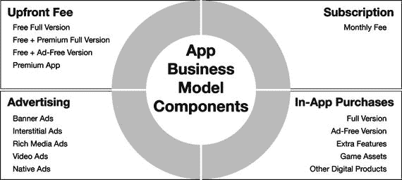

图 4-2.

应用商业模式组件

让我们逐一仔细分析这些组件。

#### 前期付费

决定是否收取前期费用本质上是一个营销和增长决策。通常，你需要有充分的理由来收取前期费用，因为绝大多数应用都是免费下载的，如果有一款免费应用与你竞争，你将毫无胜算。

通常，在应用发布后的初期阶段，你可能侧重于增长和建立足够大的用户基础。庞大的用户基础对于应用作为一项业务的可持续性至关重要，即使其中绝大多数用户永远不会为你支付一分钱，因为在这个用户群体中，隐藏着你所寻找的潜在付费用户群。这意味着你需要免费提供你的应用，并寻找其他创收途径。

在你的商业模式中，这一部分有四种选择：

1.  你可以免费提供你的应用。这是迄今为止最流行的模式，通常与广告和应用内购买等创收选项结合使用。如果你在应用生命周期初期侧重于增长，这些也将是你战略中不可或缺的部分。如果你的战略是增长优先、营收在后，那么免费提供应用是正确的做法。之后，一旦你的用户基础足够大，你转向创收时，收取前期费用就无关紧要了，因为你会通过其他方式（如应用内购买）来创收。
2.  免费提供应用，但对完整版收费。这种方法允许用户在决定购买付费版本之前先试用应用。这种模式被称为“免费增值”（免费 + 高级）模式。
3.  免费提供应用，但对无广告版本收费。这也被称为免费增值。在此选项中，你免费提供包含所有功能的完整应用，但免费用户会看到带广告的版本，需要付费才能使用无广告版本。通过这种方式，你可以从所有用户身上获利——从免费用户那里获得广告收入，从付费用户那里获得费用。
4.  你可以收取前期费用。在应用业务中，通常很难说服用户预先支付任何费用，因为用户只会为某些特定的应用付费，比如热门游戏或专业实用工具。当你收取前期费用时，本质上是在要求人们对你做出承诺，即使费用很低，用户也不喜欢在试用之前就承诺使用某个应用。

有些应用将前期费用与特定功能的应用内购买结合起来，但这可能是最难实施而不流失用户的方法。仅针对特定类型的应用采用此选项。

#### 订阅制

前期费用的一种替代方案是基于订阅的应用，这种方式可以创造一种收入流，以支持你应用的未来发展以及更新和新版本的开发成本。

这种创收方式正变得越来越流行，因为它能创造稳定的收入流，并且比其他模式产生更多收入。为什么只收取`$1`的前期费用，而你可以每月收取`$1`呢？然而，要说服用户注册，你必须拥有内容可更新的正确类型的应用（如音乐服务或杂志应用），或者提供始终如一的出色用户体验（如每月推出新关卡或挑战的游戏）。

#### 广告

移动广告有不同的尺寸和格式，并采用不同的方法触达用户。五种基本类型如图 4-3 所示。

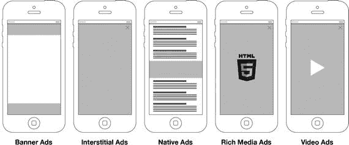

图 4-3. 移动广告类型

##### 横幅广告

横幅广告是最流行、最常见的广告形式。横幅是位于屏幕顶部或底部的窄水平条，用于展示不同的广告。由于横幅空间有限，此类广告包含非常简短的信息，并依靠视觉冲击力来影响用户。

##### 插屏广告

插屏广告会占据整个屏幕，让用户选择点击广告或关闭广告以返回当前应用屏幕。插屏广告需要谨慎使用，因为它们往往会干扰用户体验，并可能激怒和疏远用户，而非带来收入。

插屏广告会在发布者设定的时间和事件发生时出现，例如在应用启动或退出时，或者当特定屏幕首次被访问时，或者按特定间隔（如每三次启动时）。

##### 原生广告

原生广告嵌入在应用内容中，旨在尽可能不引人注目。它们适用于特定类型的内容展示型应用，如新闻应用。

原生广告一个明显的优势是它们不受广告拦截器的影响，广告拦截器可以拦截所有其他类型的广告。然而，事实并非如此，因为广告拦截器同样可以拦截原生广告。

##### 富媒体广告

富媒体广告有不同尺寸，结合了文本以及所有图片和视频格式。

##### 视频广告

视频广告展示可点击的全屏视频。视频广告是一种昂贵但极具吸引力的方式，可以吸引用户注意力并提高参与度。

##### 广告拦截器

广告拦截器的作用正是——拦截广告。最流行的广告拦截方式是使用具有广告拦截功能的移动网页浏览器和可下载的内容拦截应用。如果应用用户的智能手机上安装了广告拦截器，你的应用将无法显示广告，你的广告也将无法产生收入。

自 2015 年以来，广告拦截在智能手机用户中如野火般蔓延。根据 PageFair 和 Priori Data 的一项研究，2016 年春季，超过 4.19 亿智能手机用户在其手机上安装了广告拦截器，全球 22% 的智能手机用户在移动网页浏览时拦截广告。

#### 应用内购买

你可以从应用内向用户销售的商品清单是无穷无尽的，并且会根据应用类型和你的营收目标而发生根本性变化。以下是一份你可以向用户提供的应用内购买示例清单：

*   游戏市场中的道具
*   助推器
*   武器
*   新关卡
*   虚拟货币
*   新角色

其他类型的应用则会销售特殊功能、无广告版本或应用独有的其他优惠。

应用内购买也可以根据你的营收目标进行添加或移除。例如，你可以针对假日季创建特殊优惠，或者将多个商品捆绑打折销售。唯一的限制是你的想象力和策略。

研究表明，在应用发布者可用的变现模式中，订阅制产生的每用户平均收入（ARPU）明显高于其他选项，如应用内广告、付费下载、应用内购买和免费增值模式。然而，这种模式可能不适合你的应用。为你的应用选择正确的变现模式或模式组合，取决于你提供的用户体验类型以及你计划如何为用户所获得的价值收费。

#### 构建稳健的变现策略

我们刚才探讨的四种应用收入来源——前期费用、订阅制、广告和应用内购买——将是在你为应用制定变现策略时可用的主要选项。一个稳健的变现策略首先建立在对用户和你应用价值主张的透彻理解之上。

你的应用能为用户做什么？你价值主张的哪一部分可以免费提供以吸引用户的注意力和忠诚度，哪些功能需要定价？你的用户是否愿意为应用内购买支付费用？

事实是，拥有出色营销、互动和变现策略的应用发布者（尤其是游戏制作商）赚得盆满钵满。我们接下来将探讨应用收入的情况。

### 大问题三：应用能赚多少钱？

对于这个问题，最直接的答案是“很多”。成功的应用能赚很多钱，尤其是游戏。2014 年，应用总收入达到 250 亿美元，预计 2016 年将达到 460 亿美元。其中大部分收入来自游戏。例如，根据`statista.com`的数据，截至 2016 年 10 月，按日收入计算，美国收入最高的 iPhone 游戏是`皇室战争`，日收入为 1,969,094 美元，其次是`精灵宝可梦 GO`，日收入为 1,562,029 美元，`战争游戏：火时代`日收入为 1,226,442 美元，`移动打击`日收入为 690,275 美元，`糖果粉碎传奇`日收入为 478,159 美元，`部落冲突`日收入为 402,001 美元，`糖果粉碎苏打传奇`日收入为 337,727 美元，`Madden NFL Mobile`日收入为 281,295 美元，`玩具爆破`日收入为 213,516 美元，以及`老虎机狂热免费老虎机`日收入为 186,724 美元。

同样根据`statista.com`的数据，美国移动游戏总收入已从 2013 年的 20.3 亿美元增长到 2016 年的 26.1 亿美元。全球移动游戏总收入已从 2012 年的 91 亿美元增长到 2014 年的 244 亿美元和 2016 年的 356 亿美元，预计到 2018 年将增长到 446 亿美元。

#### 每位玩家的移动游戏支出

以下是另一个视角的游戏收入分析：根据`Slice Intelligence`的一项研究，2015 年排名前 25 的移动游戏中，每位玩家的支出范围从`战争游戏：火时代`的 549.99 美元（没错，每位玩家 549.99 美元）到`我的世界`的 6.50 美元。介于两者之间的有：`魔灵召唤`为 272.41 美元，`大赌场：免费老虎机`为 232.67 美元，`城堡争霸`为 202.26 美元，`勇者前线`为 156.20 美元，`漫威：超级争霸战`为 127.77 美元，`双倍下注赌场：免费老虎机`为 126.82 美元，`海灘混战`为 117.91 美元，`Covet Fashion`为 116.25 美元，`部落冲突`为 112.99 美元，`Gummy Drop`为 100.15 美元，`恶搞之家：寻找东西`为 83.93 美元，`卡通农场`为 80.81 美元，`金·卡戴珊：好莱坞`为 80.15 美元，`辛普森一家： tapped out`为 72.14 美元，`FarmVille 2：乡村逃亡`为 70.19 美元，`Cookie Jam`为 67.52 美元，`糖果粉碎苏打传奇`为 66.24 美元，`炉石传说：魔兽英雄传`为 65.76 美元，`糖果粉碎传奇`为 61.49 美元，`Madden NFL Mobile`为 57.08 美元，`模拟城市：建造`为 55.67 美元，`农场英雄传奇`为 55.21 美元，以及`模拟人生：自由行动`为 38.55 美元。

#### 开发者收入

据估计，2015 年有超过 37,000 名开发者的收入超过 10,000 美元。同年，估计有 17,024 名开发者收入超过 50,000 美元，11,273 名开发者收入超过 100,000 美元。

那一年，估计有 6,000 名开发者收入超过 250,000 美元，3,525 名开发者收入超过 500,000 美元。

同样在 2015 年，估计有 1,887 名应用开发者仅通过 iOS 或 Android 平台收入超过 100 万美元，而有 132 名同时在 iOS 和 Android 平台上开发的开发者收入超过 100 万美元。

应用商店收入的 45%将流向排名前 100 之外的开发者，他们仅在 2015 年第二季度就赚了 23 亿美元。78%的百万富翁开发者的收入来自游戏。

#### 移动支付

但这并不全是关于游戏。移动金融交易每年都在快速增长，这表明用户对移动交易的可靠性和安全性的信心不断增强。应用用户越来越愿意通过移动设备进行支付。你面临的挑战是，想出开发一个能够吸引部分付费用户的产品的方法。然而，这一努力是值得的。根据`statista.com`的数据，过去几年，移动支付交易年价值实际上呈爆炸式增长，并且看起来还将继续下去，从 2014 年的 49.3 亿美元增长到 2015 年的 227.4 亿美元和 2016 年的 742.9 亿美元，预计到 2017 年将增长到 1,634.7 亿美元，到 2020 年将增长到 7,451.2 亿美元。

#### 独角兽

应用的成功不仅仅体现在日收入上，也体现在价值上。有些初创公司从根本上围绕移动端构建，其估值比一些小国的国内生产总值还要高。一些公司产生了可观的收入，但另一些则没有，它们的估值基于其他因素，例如它们对细分市场的统治地位、在其领域创造颠覆性创新的能力以及预期的未来变现潜力。

以下是 2015 年投资估值超过 10 亿美元的基于应用的初创公司名单。这类初创公司被称为独角兽，你的智能手机上很可能有它们的产品：

- `优步`（美国，410 亿美元）
- `色拉布`（美国，150 亿美元）
- `拼趣`（美国，110 亿美元）
- `多宝箱`（美国，100 亿美元）
- `爱彼迎`（美国，100 亿美元）
- `声破天`（瑞典，84 亿美元）
- `方块支付`（美国，60 亿美元）
- `来福车`（美国，25 亿美元）
- `Ola Cabs`（印度，24 亿美元）
- `印象笔记`（美国，20 亿美元）
- `Tango`（美国，11 亿美元）

### 大问题四：如何衡量应用的性能？

你如何衡量与应用表现相关的任何指标？应用的性能可以从技术、财务或用户参与的角度来衡量，数据则由所谓的分析工具提供。

分析信息是由嵌入到应用代码中的软件生成的，该软件持续监控应用中发生的一切以及每个用户如何与之交互。性能度量被称为指标和关键绩效指标。

#### 应用指标与关键绩效指标

与应用性能和成功相关的指标和关键绩效指标可分为五大类：

1.  性能分析
2.  用户分析
3.  用户参与度分析
4.  财务分析
5.  营销分析

前四个类别产生的度量来自应用内部，并与应用本身直接相关。第五个类别，营销分析，部分来自应用内部（来自应用内广告），部分来自外部（你自己的印刷品、社交媒体和其他渠道的营销活动），衡量你自身营销努力的效果。

尽管这些分析从五个角度审视应用性能，但它们都在衡量你的应用表现如何，并且紧密相连。

从这些不同角度衡量应用性能的指标和关键绩效指标数以千计，分析软件允许你根据想要回答的关于应用性能、用户行为或偏好的问题，自定义分析报告。

指标和关键绩效指标也因应用类型而异。游戏、企业应用和商业应用会为用户参与度、盈利能力和社交媒体上的传播性设定各自的基准，使用截然不同的指标来衡量成功，并从非常不同的角度监控用户行为。即使在同一款应用中，基于你不断变化的战略目标，指标和关键绩效指标也会有所不同。当你专注于快速增长时，用于衡量表现如何的指标将与专注于收入最大化时使用的指标不同。

#### 基本应用指标

这些应用指标是最基本且最常用的。以下构成创建更详细指标的基础，并让你快速评估应用的表现如何。

*   `平均下载率` – 该指标告诉你，在一段设定时间内，你的应用被下载了多少次，例如每周 500 次下载，或每月 150,000 次下载。
*   `用户留存率` – 在一段设定时间内，应用所保留的用户数量。留存率是指在一定时期内应用获得的新用户数量，与在另一段时期后与应用互动的用户数量之间的差值。例如，如果一个应用在 6 月份获得了 500 名新用户，其中 75 人在 7 月份使用了该应用，那么该应用针对这一用户群体的留存率为 75/500，即 15%。
*   `用户流失率` – 在一段设定时间内，应用流失的用户数量。流失率与留存率相反，两者关系如下：
    *   `流失率 = (100 - 留存率)`。例如，如果刚刚提到的应用留存率为 15%，那么它的流失率就是 85%。这是指该应用“流失”的用户所占的百分比。
    *   衡量在一段固定时间内流失的用户数量是很困难的，因为用户可能已经对某个应用失去兴趣，但仍将其保留在设备上。什么算作“流失”的客户取决于你自己：一个月未打开你的应用但还保留在设备上的用户，算“流失”用户吗？有些用户喜欢在手机上保留某些应用以备不时之需，但可能不会经常使用。
    *   因此，对于某些发布商来说，更准确的指标制定基础应该是关注那些与应用频繁互动的活跃用户，尤其是在他们想要衡量用户参与度和财务表现时。
*   `DAU` — `日活跃用户数` – 该指标更接近实际活跃使用你应用的用户数量。`DAU` 是指每天至少启动一次你应用的用户数量。他们可能一天内使用你的应用几十次，但只被计数一次，因为你将他们视为独立的个体，而不是他们与你的应用互动时开启的会话次数（这是另一个指标）。
*   `每 DAU 日均会话次数` – 该指标告诉你，你的日活跃用户每天使用你应用的次数。要得出这个数字，你需要将日均会话次数除以 `DAU` 的数量。如果你的应用平均每天被拥有 75 个 `DAU` 的用户使用 150 次，那么你的每 `DAU` 日均会话次数就是 2。换句话说，你的每个用户每天与应用互动两次。
*   `MAU` — `月活跃用户数` – 该指标与 `DAU` 类似，区别在于它衡量的是在给定月份内至少使用过一次你应用的用户数量。请注意，`MAU` 会包含一个月内只使用过一次你应用的用户。
*   `用户粘性` – 这是指用户与应用互动的持续性，或者用户对应用的参与深度。应用营销公司 Appboy 在其 Relate 博客上将用户粘性计算为 `DAU` 除以 `MAU`。这个百分比越高，你的应用“粘性”就越强。另一家应用营销公司 Localytics 则对应用粘性有不同的定义，将其视为应用“重度用户”和“忠诚用户”的平均值。“重度用户”指的是“每月至少启动应用 10 次的用户百分比”，而“忠诚用户”指的是“在首次使用后 3 个月内会再次回归到应用的用户百分比”。重度用户代表参与度，忠诚用户代表留存率。Localytics 每季度发布一次《应用粘性指数》，根据该指数，应用粘性在 2015 年第一季度达到了 26% 的历史最高点。
*   `客户获取成本` ( `CAC` ) – 这是获取一个客户的成本，也称为 `CPA`（单次获取成本）。要衡量 `CAC` 或 `CPA`，只需将某段时间内的营销活动成本除以该时期内营销活动所带来的新用户数量。你也可以用同样的方法来衡量特定营销活动（如假日季活动）或特定渠道（如社交媒体或平面广告）的效果。近年来，客户获取成本上升是一个大问题，特别是考虑到如果用户没有长期留存，那么获取该用户所花费的资金就浪费了。2015 年第四季度，这一成本约为 2.80 美元。普遍认为，一个应用长期内只会留存 10% 到 20% 的用户，因此获取用户的成本部分是经常性支出，而要维持稳定且足够数量的用户，每位用户的成本将远高于 2.80 美元。结论：强大的用户参与度将对你的客户获取成本和应用盈利能力产生巨大影响，因为你会花更少的钱去用新用户替换流失用户，而将更多资金用于构建真正庞大的用户基础。用户参与度和忠诚度是在应用世界取得成功的关键。
*   `每用户平均收入` ( `ARPU` ) – 这是特定时期内活跃用户产生的平均收入。如果你的应用在 3 月份有 1000 名活跃用户，并且他们在同月产生了 1000 美元的收入，那么你 3 月份的 `ARPU` 就是 1 美元。`ARPU` 帮助发布商监控收入变化并采取相应措施。
*   `每付费用户平均收入` ( `ARPPU` ) – 这是特定时期内付费用户产生的平均收入。由于付费用户数量远少于活跃用户数量，`ARPPU` 自然显著高于 `ARPU`。
*   `客户生命周期` – 这是你的应用用户在放弃应用前的平均保留时间。客户生命周期与流失率成反比。例如，如果你的流失率是 20%，那么你的平均客户生命周期就是 `1/0.2 = 5` 个月。
*   `生命周期价值` ( `LTV` ) – 这是平均每个客户在整个使用你应用期间，预计会在你的应用上花费的金额。它也被称为 `CLTV`，即客户生命周期价值。衡量 `LTV` 的一种方法，是将你的应用产生的单笔交易平均价值乘以一段时间内的交易次数，再乘以平均客户生命周期时长。例如，如果你每笔交易的平均毛利润是 2 美元，平均每个客户每月交易 4 次，用户的平均生命周期是 3 个月，那么你的 `LTV` 就是 `2 × 4 × 3 = 24` 美元。当然，棘手的部分在于准确衡量客户生命周期，特别是当你的应用是新的且没有过往经验可参考时。衡量客户生命周期的方法是使用流失率的倒数，或者说是你的应用在一段时间内流失的客户数量。衡量月度流失率的公式如下：将某个月份流失的客户数量除以该月初拥有的客户数量。流失率的倒数就是预期的客户生命周期。如果你每月流失 50% 的用户（顺便说一句，这相当正常），你的流失率将是 50%，客户生命周期将为 `1/0.5 = 2` 个月。然后，你可以将该数字乘以平均交易价值以及平均每个客户在你的应用中进行交易的次数，就能得出 `LTV`。`LTV` 通常与 `CAC` 进行比较，作为衡量应用财务可持续性的指标。如果一个普通用户在其生命周期内对你的应用的花费高于你获取该用户的成本（即 `LTV` 高于 `CAC`），这通常预示着你的应用表现良好且能够扩展。同样，就像 `CAC` 的情况一样，用户忠诚度将极大地影响 `LTV` 的价值，因为作为一个乘数，更长的生命周期会将你的 `LTV` 值推得很高。在前面的例子中，将生命周期从 3 个月增加到 4 个月将使 `LTV` 增加 33.3%，从 `(2 × 4 × 3) = 24` 美元增加到 `(2 × 4 × 4) = 32` 美元。
*   `回本周期` ( `PBP` ) – 这是指累计 `ARPU` 与 `CAC` 持平所需的时间，这意味着获取客户所花费的资金已通过该客户产生的收入收回。

下图 4-4 展示了关键财务指标之间的关系。

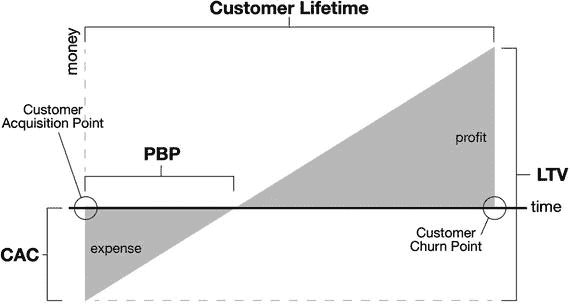

图 4-4. 关键财务指标之间的关系

### 性能分析

性能分析用于衡量应用的技术表现，例如加载耗时以及崩溃频率。

应用的加载时间看似无关紧要，但它会影响用户的体验满意度以及因此沮丧放弃的人数。快速、高效且可靠的性能是提升用户参与度的关键因素。

###### 性能指标与关键绩效指标类型

应用性能指标与关键绩效指标包括：

- 应用吞吐量 – 应用在设定时间内能够处理的请求数量
- 应用延迟 – 应用响应请求所需的时间
- API 延迟 – API 响应请求的时间
- 每周期应用加载量 – 应用中不同类型请求的加载时间
- 应用崩溃率 – 应用在设定激活次数内发生崩溃的频率
- 应用加载时间 – 点击图标后应用完成加载所需的时间
- 端到端应用延迟 – 从按下应用按钮到该请求结果到达用户之间所经过的时间

### 用户分析

用户分析提供与您应用交互的用户信息。它会告诉您用户所在的国家和城市、年龄、母语、使用的设备、使用应用的频率以及平均使用时长。

用户指标类型包括操作系统版本分布、地理位置分布、年龄段分布、性别分布、设备类型分布以及用户母语分布。

##### 用户参与度分析

用户参与度分析提供有关用户如何与您的应用交互的信息。它可以告知您有多少人下载了您的应用，有多少人保留（留存率）或在一天、一周或一个月后删除（流失率）。用户参与度分析还会创建所谓的会话记录。当您与应用交互时，您在“会话”中所做的一切都会被“记录”，并与其他所有用户的会话记录汇总，为应用发布者生成可执行的信息。

用户参与度分析还能告诉您用户最喜欢应用的哪些内容、哪些被忽略、点击最多的图标或按钮、分享的内容以及分享频率。关于用户的详细信息有助于您根据他们的喜好定制应用，并提高他们与应用的互动度。

###### 事件追踪

事件追踪是用户参与度分析的一个方面，它监控用户在应用内执行的特定操作，而非只是浏览内容。例如，事件追踪用于统计有多少用户正在回答问题或点击特定按钮，并可用于测试特定应用功能的效果。事件追踪在设定时间段内实施，并根据您的设计、交互和营销目标而变化。

###### 触控热力图、群组分析与会话回放

触控热力图、用户旅程记录、会话回放和实时报告等工具可以帮助您了解用户如何与您的应用交互，他们按下了哪些按钮或图标，以及忽略了应用的哪些部分或功能。

通过提供准确的实时信息，显示用户是否按照您期望的方式与应用交互，触控热力图将帮助您识别并纠正令用户沮丧的 UI 问题，优化用户体验，并最大化您的应用收入潜力。

群组分析根据不同的因素将用户分为不同群体，以监控用户行为并衡量功能和产品的有效性。

会话回放提供特定用户在应用内操作的“记录”，以描绘用户如何导航应用的画面，并识别需要修复的痛点。

###### 用户参与度指标与关键绩效指标类型

用户参与度指标与关键绩效指标包括：

- 每活跃用户日均会话数 – 每日活跃用户每天启动应用的次数
- 平均访问时长 – 用户每次访问应用的平均停留时间
- 每次访问的屏幕浏览量 – 单次会话中浏览的平均屏幕数量
- 应用会话间隔 – 用户两次会话之间的平均时间间隔
- 下载量 – 应用被下载的总次数
- 活跃用户数 – 被视为活跃用户的数量
- 目标完成率 – 完成您设定特定目标的应用用户数量
- 首周会话次数 – 新用户在下载后第一周内启动的会话次数
- 每日高峰使用时段 – 一天中使用应用的用户数量达到最高的时段
- 会话频率 – 用户首次会话与下一次会话之间的时间跨度
- 访问深度 – 用户在单次应用会话期间访问的页面数量
- 自然用户增长率 – 在没有主动营销的情况下应用用户数量的增长速度
- 每月新用户数 – 特定月份内下载应用的新用户数量
- 授予权限数 – 应用用户平均授予应用的权限数量
- 用户生命周期时长 – 从新用户发现并下载应用到其放弃应用之间的时间跨度
- 客户支持响应时间 – 客户支持回复咨询所需的时间
- 净推荐值 – 特定用户愿意向他人推荐您应用的可能性
- 选择加入与退出率 – 选择加入或退出与应用相关的特定优惠的用户百分比

### 财务分析

财务分析提供有关您应用商业表现的信息，并会告诉您用户在其上花费了多少钱、谁花钱最多，以及哪些是您的最佳收入来源。

财务指标与关键绩效指标类型如下：

- 每周期总收入（小时、天、周、月、年）
- 按来源划分的每周期总收入（广告、应用内购买等）
- 每周期收入分布（星期几、月份中的第几天）
- 购物车放弃率
- 品牌认知率
- 获客用户总收入
- 平均每笔交易收入
- 交易高峰时段
- 购物车中商品数量
- 每秒、每小时或每天的交易次数
- 从注册到首次付款的天数

### 营销分析

营销和广告分析能够显示你的营销支出究竟效果如何。营销分析告诉你，你的营销资金使用效率如何，广告策略是否高效，以及哪些营销渠道吸引了最多的用户。在应用业务中，很容易出现投入大量资金却回报甚微的情况，原因可能是策略不当，定位了错误的用户群体，广告文案撰写拙劣，或者开展了成本高昂却无法吸引新用户的营销活动。广告活动分析用于衡量特定营销活动或特定广告类型在特定时间段内的有效性。

营销指标和关键绩效指标（KPI）包括以下内容：

- `Pay per Click (PPC)`（每次点击付费）
- `Cost per Click (CPC)`（每次点击成本）
- `Cost per Loyal User (CPLU)`（每忠诚用户成本）
- `Cost per Thousand Impressions (CPM)`（每千次展示成本）
- `Cost per Install (CPI)`（每次安装成本）
- `Customer Acquisition Cost (CAC)`（用户获取成本）
- `Average Revenue per User (ARPU)`（每用户平均收入）
- `Cost per Install (CPI)`（每次安装成本）
- `Effective Cost per Install (eCPI)`（有效每次安装成本）
- `Fill Rate`（填充率）
- `Click-through Rate (CTR)`（点击率）
- `Viral Coefficient (K)`（病毒系数）
- `Number of Shares`（分享次数）
- `Number of Product Likes`（产品点赞数）
- `Conversion Rate`（转化率）
- `Number of Subscriptions/Registrations`（订阅/注册数）
- `Number of User Likes`（用户点赞数）
- `Percentage of Mobile Influenced Customers`（受移动端影响的客户百分比）
- `Paid Conversion Rate`（付费转化率）
- `Percentage of New Leads`（新线索占比）
- `Organic User Growth Rate`（自然用户增长率）
- `Push Notification Open Rate`（推送通知打开率）
- `E-mail Open Rates`（邮件打开率）
- `E-mail Click-through Rate`（邮件点击率）
- `E-mail Click-to-Open Rate`（邮件点击打开率）
- `Campaign Conversion Rate`（广告活动转化率）

### 应用分析工具

以下工具可以为你的应用生成分析数据。请分别访问各网站了解更多信息：

- Flurry Analytics（[`developer.yahoo.com/analytics/`](https://developer.yahoo.com/analytics/)）
- Google Analytics（[`analytics.google.com/`](https://analytics.google.com/)）
- App Annie Analytics（[`www.appannie.com/en/`](https://www.appannie.com/en/)）
- AppsFlyer（[`www.appsflyer.com/`](https://www.appsflyer.com/)）
- Localytics（[`www.localytics.com/`](https://www.localytics.com/)）
- Countly（[`count.ly/`](https://count.ly/)）
- MixPanel（[`mixpanel.com/`](https://mixpanel.com/)）
- Swrve（[`www.swrve.com/`](https://www.swrve.com/)）
- Kochava（[`www.kochava.com/`](https://www.kochava.com/)）
- Upsight（[`www.upsight.com/`](https://www.upsight.com/)）
- Tapstream（[`www.tapstream.com/`](https://www.tapstream.com/)）
- Appsee（[`www.appsee.com/`](https://www.appsee.com/)）
- Appboy（[`www.appboy.com/`](https://www.appboy.com/)）
- Apsalar（[`apsalar.com/`](https://apsalar.com/)）
- Taplytics（[`taplytics.com/`](https://taplytics.com/)）
- Game Analytics（[www.gameanalytics.com/](http://www.gameanalytics.com/)）
- AppAnalytics（[appanalytics.io/](https://appanalytics.io/)）
- AppDynamics（[`www.appdynamics.com/`](https://www.appdynamics.com/)）
- HeapAnalytics（[`heapanalytics.com/`](https://heapanalytics.com/)）
- MoEngage（[`www.moengage.com/`](https://www.moengage.com/)）

对于新手而言，理解应用分析数据所传达的信息并非易事，但随着时间的推移，你在用户信息上的投入终将得到回报。作为精通分析数据的读者，你将能够做出更明智的营销决策，从而节省大量资金和精力。

### 大问题 5：如何衡量应用的投资回报率？

一旦你理解了各项指标和关键绩效指标（KPI），监控应用的财务表现就并非难事。提升应用的财务表现是艺术与科学的结合，是设计与良好规划的统一。

如果你拥有一个应用发行业务或已发布多款应用，那么你的每一款独立应用都会产生其自身的投资回报率。利用每款应用的收入预测，你还可以计算出`内部收益率`（使投资中所有现金流的净现值等于零的利率）和`净现值`（未来现金流的现值），从而评估你的各项投资乃至整个应用业务的收益情况。

`ROI`的计算方式取决于你正在开发的应用类型及其相关目标。移动游戏的目标可以很容易地通过广告和应用内购买收入来衡量；而企业级应用的目标则还需衡量因工作效率提升、以及用移动解决方案取代过时技术所带来的财务影响。移动企业应用的优势可能包括：缩短业务周期、降低沟通成本、提升客户满意度和客户服务、自动化业务流程以及减少人力资源需求。在计算投资价值和回报时，必须全面考虑企业移动解决方案的所有净收益和影响。

#### 基本投资回报率

某项活动或产品的`ROI`是投资金额与产生收入之间的函数。用于计算应用`ROI`的各项指标如图 4-5 所示。

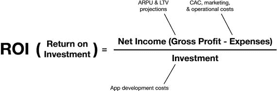

图 4-5. 衡量应用 ROI

### 净现值

`净现值`是预计的未来现金流（包括正负现金流）以及折现率（通常是资本成本或投资者可接受的其它利率）的函数。用于计算应用`NPV`的各项指标如图 4-6 所示。

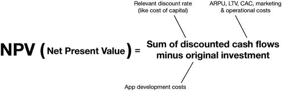

图 4-6. 衡量 NPV

#### 内部收益率

应用投资的`IRR`可以很容易地使用与计算`NPV`相同的指标作为其扩展来计算。用于计算应用`IRR`的各项指标如图 4-7 所示。

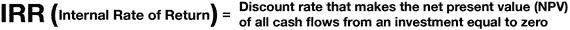

图 4-7. 计算 IRR

准确衡量应用的`ROI`并非易事，它取决于应用发布背后的目标。例如，衡量一款带有应用内购买的独立游戏的盈利能力，与衡量一款企业应用为公司带来的财务影响，其方法会有所不同。

然而，总的来说，移动应用的投资回报率取决于初始投资金额、持续的用户获取成本，以及这些获取的用户在其整个生命周期内为开发者带来的收入这三者之间的关系。

#### 如何保持应用盈利？

一旦你开始追踪用户行为并生成分析数据，你就能够识别出应用中或营销策略中损害盈利潜力的薄弱环节。本书末尾列出的许多资源将帮助你将自己的应用性能与行业基准进行比较，从而明确你所处的位置。那么，你的关键指标目标是什么？见图 4-8。

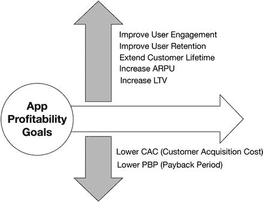

图 4-8. 如何让应用更盈利

作为一条规则，你总是希望保持客户生命周期价值`LTV`高于`CAC`，这基本上意味着你期望从用户身上赚到的钱多于你获取他们所付出的成本。专家建议，为了保持项目盈利，`LTV`应至少是`CAC`的三倍。

因此，你的变现目标是：降低`CAC`，缩短`PBP`，提高`ARPU`和`ARPPU`，并提升`LTV`。

##### 降低 CAC

你的 CAC 越低，投资回报率就越高。那么，如何将 CAC 降到最低呢？

获取用户不可避免地需要花费成本，但有一些方法可以最大化你应用的获客能力。与提高 ARPU 的情况类似，秘诀在于应用的设计。给你的用户提供一切机会，让他们与朋友分享在应用中的所作所为，这样你的用户就会像免费的营销机器一样为你工作。分享是用户获取最强大的渠道，而且它是免费的！

##### 提高 ARPU

ARPU 越高，投资回报率就越大。那么，如何才能最大化 ARPU 呢？

实现高 ARPU 的第一个秘诀是创造卓越的用户体验。运用应用设计和交互的最佳实践来增强用户参与度。一个高度投入的用户会保留你的应用并定期使用它。实现高 ARPU 的第二个秘诀是制定高效的变现计划。不同类型的应用和游戏变现方式不同；确定哪些方法最适合你的应用，并将它们有效地整合到你的设计中。那些喜爱你的应用并信任你这位开发者的用户，会愿意为优秀的功能或其他应用内购买付费。让他们的付费物有所值，他们就会回报你。见图 4-9。

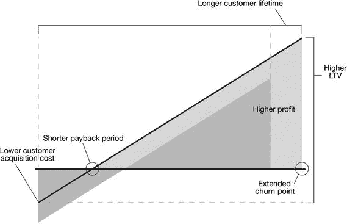

**图 4-9.** 更高的用户参与度和留存率的积极影响

这引出了应用发行成功的黄金法则：

如果你希望你的应用取得巨大成功并盈利，就必须掌握用户参与度和应用营销。

简而言之，出色的用户体验 + 明智的营销 = 稳赚不赔

**强大的用户参与度有何价值？**

-   强大的用户参与度意味着更高的留存率和更低的流失率。这意味着你的客户保留你的应用时间比平均水平更长。低流失率意味着更高的客户生命周期，从而产生更高的 `LTV`。
-   强大的用户参与度意味着更低的客户获取成本。随着用户更长时间地使用你的应用，你将花费更少的成本在留住现有客户上，而将更多成本用于获取新客户。
-   强大的用户参与度意味着更高的病毒传播率。强大的用户参与度能提高应用的病毒传播性，或者说提高了用户向他人推荐或在社交网络上分享相关信息的可能性。如果每个用户都能说服其他一个人下载你的应用，你的客户获取成本将减少 50%。

**明智的营销有何价值？**

-   明智的营销能带来更多的下载量。强大的营销策略将在下载量上创造坚实的增长势头，从中你将识别出付费客户并捕获收入。
-   明智的营销能带来更多的付费客户。下载你应用的所有用户中，只有极小部分会向你付费。这个数字越高，你的利润就越高。
-   明智的营销能带来更多的收入。一旦你拥有了一定数量的付费客户，营销目标就是尽可能从他们身上创造更多收入。
-   明智的营销能带来更高的留存率。如果你不知道如何在用户使用你的应用时留住他们，他们最终会放弃它，尤其是在有竞品应用吸引他们注意力的时候。留住现有用户本身就是一个营销领域，特别是考虑到留住一个现有客户比用新客户替代流失的客户要便宜得多。

##### 应用业务中最重要的问题

在准备发布应用并制定营销策略时，你必须回答的最重要的问题是：

我需要多少付费客户才能使我的应用业务可持续发展？

要回答这个问题，你需要知道以下几点：

-   你的运营费用。你每月将在应用业务上花费多少钱，包括营销成本和 CAC？这将根据你应用的类型和规模有很大差异，并且随着你的应用吸引越来越多的用户，这个数字也会随时间变化。
-   你预估的 ARPU 和 ARPPU。
-   你的用户中将成为付费客户的预估百分比。

让我们基于以下假设做一个非常基础的计算：

-   你计划每月在你的应用业务上花费 10,000 美元，包括工资、营销和其他运营费用。
-   你的用户中有 5%（二十分之一）将是付费客户，他们每月平均产生 2 美元的 ARPPU（每付费用户平均收入）。

这意味着你需要 5,000 名付费用户（10,000 除以 2）才能每月产生 10,000 美元来维持你的业务。如果每 20 个用户中有 1 个是付费用户，那么你总共需要至少 100,000 名（5,000 乘以 20）用户（包括付费和非付费用户）才能产生同样的收入。在这种情况下，你的 ARPU 将是 0.10 美元（10,000 除以 100,000）。如果 CAC 的市场基准是 3 美元，你需要投资 300,000 美元才能将你的用户增长到 100,000。

现在，如果你提高用户参与度和留存率，例如通过改进营销和重新设计 UI，使得付费客户的比例从 5% 增长到 10%，并且 ARPPU 从 2 美元增长到 4 美元，这将如何改变你应用的财务表现？

首先，你现在只需要 2,500 名付费用户（10,000 除以 4）就能每月产生维持业务所需的 10,000 美元。其次，既然每 10 个用户中就有 1 个是付费用户，你需要的付费和非付费用户总数要少得多，只需 25,000 名（2,500 乘以 10）就能产生同样的收入，并且你的 ARPU 将是 0.4 美元（10,000 除以 25,000）。在每位用户 CAC 为 3 美元的情况下，你需要花费的金额大大减少，只需 75,000 美元（相比之下原为 300,000 美元）就能将你的用户基础增长到业务的可持续水平。

这些数字清楚地显示了提高用户参与度和留存率对应用财务表现的影响。将付费用户比例从 5% 提高到 10%，并将 ARPPU 从 2 美元提高到 4 美元，乍一听可能不算什么，但它将你应用业务的最低可持续规模从 100,000 名用户缩减到了 25,000 名，并将你的营销预算从 300,000 美元缩减到了 75,000 美元，减少了 75%。

### 总结

在本章及前三章中，我们考察了全球应用发行行业，包括其演变、规模和基本经济结构。

在接下来的章节中，我们将探讨应用创意如何产生并最终发展成为成熟的应用。

## 5. 想象你的应用

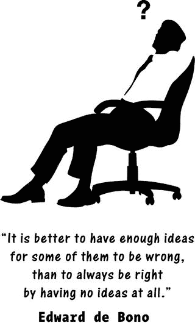

欢迎来到应用开发的商业世界。

此时，相比你刚拿起这本书时，你应该已经对应用开发行业有了更深入的了解。通过吸收前几章的信息，你现在已经能够通过就应用相关的所有事宜——从名称、尺寸、配色、内容，到用于推广的营销策略——做出明智决策，来开启你的应用发行生涯。

应用世界里充满了关于意外暴富者的故事，他们仅仅为了好玩而开发了一款应用，却没想到它一夜爆红，带来了巨额财富。这些故事在很大程度上激发了人们对应用行业的迷恋，以及围绕其周围的“淘金热”光环，尤其是在完全局外人眼中。快速在线搜索就能找到数百个指向书籍、课程、视频、博客和其他资源的链接，这些资源利用了这种“淘金热”光环，声称可以教你如何快速构建并发布一款应用，让你不费吹灰之力就能一夜暴富。

然而，随着市场日趋成熟，横扫应用商店并快速致富的可能性已变得越来越渺茫。如今，真正有机会在应用商店取得成功的人，是那些对应用成功要素有着最透彻理解的人：出色的设计、高用户参与度和留存率，以及扎实而巧妙的营销。此外，随着用户对应用功能的要求越来越挑剔，稍有瑕疵便会弃用，吸引用户的注意力并使其保持足够长的时间以投入应用并为之付费，正成为一项需要专业方法才能应对的挑战。

在迈出作为应用发行商的第一步之前，你需要做的是进入专业应用发行商的思维模式。这包括摒弃那些制造不合理期望的迷思和误解，并有意识地选择依赖扎实的知识和技能。在这种思维模式下，你永远不会对自己应用的走向、资金的去向以及你的时间和精力应获得何种回报感到迷茫。你不会将时间浪费在非理性的期望上，也不会将金钱浪费在错误的营销活动上，更不会因忽视重要步骤而浪费时间，到头来才意识到自己本应更早完成某些事情。

让我们来看看，成为专业应用发行商的思维模式意味着什么。

### 正确的思维模式

专业应用发行商的思维模式融合了发明家和投资者的心态。作为发明家，应用发行商将其创造力用于构思成功前景光明的可靠应用创意，以及用于以出人意料的方式解决设计、开发和营销中的问题，从而获得竞争优势。他对新想法保持开放，并保持灵活性，以适应应用设计、开发和营销方面的新概念和方法。这使他能够随着市场的成熟和演变而始终站在市场前沿。

作为投资者，应用发行商会意识到他正在投入大量的时间、精力和金钱，将一个想法转化为盈利的业务。他意识到，没有有效的执行，一个伟大的想法就价值甚微；没有丰厚的回报，那就是浪费时间。因此，他专注于善用时间和金钱等资源，善于管理开发团队，并善于推广自己的产品。

通过将发明家心态的创造力和直觉，与投资者心态的方法、知识和管理技能相结合，你将一开始就走上正确的道路，明智地运用你的资产和资源，并在应用商店中创造大热作品的可能性最大化。你还会抵制被快速致富心态及其赖以传播的四大应用开发迷思所干扰。我们接下来将讨论这些迷思。

### 应用开发的四大迷思

在那些将应用发行视为无需投入时间、金钱或精力就能快速致富手段的人群中，有四大关于应用开发的迷思颇为流行。这种认知也得到了实际案例的支持：一些业余爱好者确实获得了超出其最疯狂预期的意外成功。但如果你仔细观察他们的成功是如何发生的，你会发现他们并非靠着无所事事而成功。没有人是坐等钱自己送上门来的。恰恰相反，这些成功的应用发行商迅速响应了用户对其应用或游戏的强烈反响，迅速改变了他们的前景和生活方式，招聘了合适的人才来弥补自身技能不足，并围绕他们成功的想法建立了真正的业务。你必须做好准备，当这种机会降临到你身上时，也要同样做到。

有四个广为流传的应用开发迷思会制造错误的期望，并可能将你引向错误的方向。

#### 迷思一：你需要一个惊天创意

我们之前已经讨论过这一点。这是那些想进入应用发行领域的应用爱好者中最大的误解。为什么这是个误解？

嗯，首先，你几乎能想到的任何东西，很可能早已被人做过，而且做过很多次了。随着应用商店中数百万款应用和游戏的出现，想出完全新颖或前所未见的东西的可能性几乎为零。当然，也有例外，但举个例子，绝大多数游戏都基于已有的游戏概念或物理模拟原理构建。

绝大多数游戏的概念并不原创，但这并不意味着应用设计中没有原创性或创造力。这仅仅意味着这种原创性和创造力通常体现在其他方面。例如，成功的应用可以轻松地通过对一款已受欢迎的应用或游戏提供新的诠释而脱颖而出并吸引用户。《糖果粉碎传奇》和《愤怒的小鸟》就是极具说服力的例子：它们的游戏概念并不原创，但却因其提供的卓越体验和巧妙的用户留存方式而极具吸引力并大获成功。其他应用则通过提供新功能，或结合多个应用的功能以创造新的价值主张来建立自己的成功。

### 误区二：开发应用非常简单

开发一款应用的难易程度取决于其功能、规模、复杂度，以及开发者的技能水平。一位经验丰富的程序员，如果购买了一款无需后端、完全功能且小到可以下载到智能手机的现成简易游戏，只需几天时间就能修改游戏的外观和体验，并以不同名称重新发布——他会告诉你：是的，开发应用很容易。而另一方面，一家专业应用开发公司如果正在开发一款个人银行应用，允许用户查询账户余额、转账和执行其他个人银行功能，则会告诉你开发这类应用远非易事——因为它需要具备适当规模和复杂度的高级后端、极其严格的安全系统、一套用于维持银行客户满意度的客户关系管理（`CRM`）系统、与银行形象和目标一致的用户体验设计，以及一支随时待命、能快速响应突发问题的程序员团队。

所谓“容易”这一误区的目的，在于帮助新手克服恐惧和畏难情绪——尤其面对编程等看似艰巨的开发环节。这里的关键在于：任何值得你投入时间的应用，都需要付出努力。开发一款毫无前途的“简单”应用又有什么意义呢？为什么应用开发就应该比其他行业更容易呢？如果应用开发真的简单到任何人都能做、人人都去做，这难道是一件好事吗？

### 误区三：你可以免费做到

这是另一个针对新手的误区，利用的是应用行业的“淘金热”形象，但这次它抓住了人们对财务风险的恐惧。确实，你可以使用网站上发布的基础应用模板，填充自己的内容，然后发布。在制作电子书应用、个人婚礼应用或其他依赖现成模板的简单应用项目时，确实可以做到。然而，由于这些模板是通用的，并未针对应用的具体需求进行定制，因此使用这些模板发布的应用将受到极大限制，并缺乏成熟应用应有的许多标准功能，例如用于更新和内容管理的后端。它们还会展示免费应用模板的创建者，这意味着你会损失大部分盈利机会，而模板制作商会通过你的应用推广他们自己的付费服务。

这一误区背后的真相是：从长远来看，你免费得到的东西，其价值恰好等同于你所付出的代价。

### 误区四：不写代码也能开发应用

这是四个误区中的最后一个，它意在让你在不付出真正投入或努力的情况下，就能尝到发布应用的甜头。同样，这个误区涉及现成的应用模板，你只需填充内容，无需编写一行代码就能发布到应用商店。

是的，通过获取在线模板并填充自己的内容，你可能独自发布一款应用——但这仅适用于少数情况，即应用用途有限，且发布后内容无法更改。

如果你想构建一款成熟的应用，你需要程序员搭建后端，以便你能更新和管理内容。你需要集成社交媒体 API 的代码，让用户能够分享内容；需要插入到应用中的分析代码，用于追踪用户行为；还需要管理应用中广告位的代码。这些只是应用的部分基本功能，没有程序员编写定制代码，这些功能就无法提供给用户。

此外，如果你的应用并非一次性使用（例如婚礼应用），你不可避免地会想要更新应用并发布新版本，而这也必然需要编程技能。

#### 认真对待

这四个广为流传的误区，旨在制造一种印象：在应用商店取得成功可以毫无风险。然而事实是，任何值得投入的事业都伴随着一定风险，而降低风险的唯一真正途径，是坚持专业化的方法——依靠扎实的知识和最佳实践，才能打造出用户喜爱的产品。

如果你想以专业态度进军应用业务，就不要依赖“免费、快速、简单”的方法，因为它只会让你一事无成。相反，要依靠出色的设计、巧妙的营销和卓越的价值主张，来推动应用的普及。

### 应用发布最重要的原则

在应用的设计、开发和分发过程中，如果有一条原则你必须时刻铭记，那就是：

*   营销就是一切，一切皆为营销。

先看这句话的前半部分：营销就是一切。首先，这暗示了在开发前阶段，仅靠想法本身去说服投资者是行不通的。没有哪个想法好到能自我推销，如果投资者觉得你无法将想法贯彻到底，他们就不会在意你的创意。同样，无论设计得多好，任何已发布的应用如果没有你的帮助，都无法独自成功。

无论你发布的是什么应用，都必须付出极大的努力、保持极高的智慧，并对市场和用户有深刻的理解，才能引导应用走向成功。就应用的成功而言，营销就是一切。没有扎实的营销，你的应用将永远沉沦在应用商店的底层。因此，请准备好投入营销工作，并学习做好这份工作所需的知识。

营销早在应用发布之前就已经开始了。这是因为应用发布后的最初几天和几周对其成功至关重要。如果没有一群等待发布的粉丝，没有杂志等着发布相关报道，应用就无法获得初始动力。这意味着你必须在实际发布应用之前，就开始建立你的粉丝社群。如果你在发布应用的那一刻才开始营销，很可能已经太晚了。

这句话的后半部分——一切皆为营销——意味着应用开发过程中发生的一切，以及应用的每一个组成部分，都是为了营销目的而设计的。除了显而易见的部分，例如应用图标的设计、App Store 页面以及你自己的营销活动，还有应用的加载速度、关卡结构、内容、配色方案、社交媒体分享功能、关卡结构（如果是游戏）、所使用的服务以及所执行的功能——应用的每一个细节——都围绕着确保用户喜爱它、沉迷使用它，并帮助你推广它。

#### 内部与外部营销工具

不得不承认，应用用户是一群极其善变的消费者。他们可能会因为微小的故障、烦人的广告或响应延迟而放弃你的应用。这就引出了另一个重要观点：你应用的最佳营销者就是你的用户。没有什么比满意的用户分享他们的看法更能推广你的应用了。这意味着在发布时，你必须准备好让用户在下载应用后保持愉悦。这包括提供论坛供他们提问和获取用户支持。例如，如果你的应用分析发现应用中有大量用户放弃使用或未能完成客户旅程的节点，你就可以发起讨论来找出问题所在。是技术故障、设计问题，还是其他原因？这个反馈循环将非常宝贵，能助你快速解决问题，从而让用户保持满意。

这也意味着要尽可能为用户创造机会，让他们与社交圈分享自己使用应用的体验。请记住，用户就像免费为你推广应用的广告商。在应用的关键节点集成诸如在 `Facebook`、`Google Plus` 等平台发帖的功能，例如当游戏用户打破个人记录或通过一个困难关卡时。这是一个强大的营销系统，你千万不要犯忽视它的错误。邀请用户为你的应用评分是另一种策略。

总的来说，请记住，在任何应用中都有两种主要的营销机制在起作用。一种是内部推广机制，比如分享功能、发帖、内容分享以及应用评分和评论。另一种是外部营销机制，涉及你自己的营销活动，比如促销、`Google AdWords`、杂志广告、在线广告等等。

那么，这一切意味着什么呢？这意味着你必须在开始设计和构建应用时就融入接下来几个小节所涵盖的内容，而不仅仅只考虑如何将你的想法转化为一个应用。

##### 反馈支持、内部推广与创收策略

如果你只在完成应用设计后才开始考虑这些事情，那你就白费功夫了，因为你最终还得回头去把它们加进去。如果你从一开始就理解这些原则，并将其融入你的思维和设计方法中，那么你已经在打造一款设计精良、具备成功要素的应用之路上迈进了。

##### 尽早确定你的营销与收入策略

从构思应用的那一刻起，你就必须对营销策略有一个清晰的想法。事实上，你应用的本质（比如它是什么类型的游戏，或者它产生什么样的内容）将在很大程度上决定你将采用的营销、广告和变现策略，因为这些策略已经针对每种应用类型进行了优化。

例如，一款游戏应用会很大程度上依赖应用内购买来获取收入，但同时也会结合插屏广告、横幅广告和视频广告，并销售其无广告版本（需付费）。而一本杂志应用，则会免费发布部分内容，并专注于说服用户按月付费订阅完整版本，同时限制或去除应用内广告。

为什么这一切如此重要？因为这些因素会影响你的应用布局、如果是游戏则会影响关卡层级、应用内购买的类型和价格、基于内容的应用的内容结构，以及几乎每一个设计或技术细节。

### 如何产生应用创意

一切都始于一个绝妙的创意——真的是这样吗？如果你刚开始涉足应用开发，你很可能相信要在这一行成功，你需要从一个没人想到过的、能改变世界并让你一夜暴富的惊人创意开始。或者，至少你或多或少希望这种情况会发生，因为这种事已经发生在其他人身上不止一次了。

然而，为了不浪费时间追逐幻想，更明智的做法是摒弃这种互联网“淘金热”的幻想，并习惯这样一个观念：成功与失败的差异，与你和朋友吃饭时谈论你的创意听起来有多棒关系不大，而完全取决于决心和明智的决策。

在没有那个惊人创意的情况下进入应用发行行业，并期望做得很好，这是非常现实的。成功与其说是改变你的生活，不如说是深入了解应用行业和市场、透彻理解用户及其行为、为产品找到正确的利基市场、打造精心设计的价值主张以及交付该价值的应用，并在调整营销策略以积聚势能的同时跟踪应用表现，直到它能够自给自足并带来利润。

换句话说，这需要大量的辛勤工作和明智决策。

这就是区分成功与失败的关键：投入、“汗水股权”和智慧。当你开启应用发行之旅时，你需要开始越来越少地像魔术师那样思考，而越来越多地像投资者那样思考。你将在你的项目中投入大量的时间、精力和金钱，所以像专业人士一样处理事务是值得的。

从这个意义上说，应用业务和其他任何业务一样。与其他更传统的行业相比，应用行业确实提供了巨大的潜力，让你可以用较少的投资创造产品并将其推向全世界，但成功并没有保证，如果你认为有，那你很可能在浪费时间。如果这不符合你的想法，你最好还是继续你的日常工作，因为一个仅围绕你自认为很棒的创意构建的应用，无法在争夺人们注意力的残酷竞争中生存下来。这引出了重要的一点：

-   不要沉迷于你的应用创意。

要抵制住钟情于你应用创意的诱惑。那是浪费时间，而且很危险。之所以危险，是因为当你对自己的创意深深依恋时，即使它失败了，你也会拒绝放弃。你会不断向其中投入资源，因为你“就是知道它行得通”，最终把自己拖垮。

应用世界确实有其魅力，光是成为一名应用发行商这个想法可能就让你两眼放光，但应用就是应用，创意就是创意。它只是一个面向市场的产品，需要产品与市场相匹配才能奏效，所以请这样对待它，并专注于让它成功。如果它因任何原因无法奏效，或者没有独特的功能或价值主张使其脱颖而出，那么它几乎不可能抓住用户的注意力或在竞争中生存。

#### 那么，我该从哪里开始？

“产生”应用创意有可能吗？它们不是会随机地自己蹦到你脑子里吗？嗯，有时候会，但大多数时候不会。有高度理性、客观且可靠的方法来产生应用创意，也有理性、客观且可靠的方法来测试这些创意的可持续性以及它们成功的可能性，而不是依赖于“我就是知道它会成功”。

通过理性方法产生应用创意有两个主要起点：1）从用户出发，2）从应用商店出发。不过，首先让我们来看看直观方法。

#### 方法一：头脑风暴

头脑风暴是一种活动，在此过程中你为自己创造引发“灵光乍现”效应的机会。其目标是汇聚富有创造力的人才，借助他们的想象力和经验，期望通过自发的洞察催生意想不到的想法。当然，你也可以独自进行头脑风暴，但与他人组队进行时，更有可能通过互动机会激发出有趣的想法。

如果你决定组建一个头脑风暴小组，请确保小组规模既不要过大也不要过小。小组规模太小会缺乏多样性和意义，而规模太大则容易偏离主题、陷入混乱。通常建议五到七人一组为最佳。

如果没有引导，小组头脑风暴会议很容易偏离轨道。因此，通过始终聚焦于你的目标来确保讨论富有成效。关键在于找到引导与控制之间的平衡。过多的指导会扼杀创造力，过少的指导则会导致混乱，这两种情况都会让你的头脑风暴会议变成浪费时间。要让小组不偏离主题，但也要为自发和意外的想法留出空间，这样才能最大限度地利用你的会议。

头脑风暴也可以单独进行，但这会缺乏小组所产生的多样化洞察。在小组中，创造性能量流主要通过对话产生，但当你独自一人时，这就不存在了。当身边没有其他人时，你如何营造积极的创造性能量流呢？诀窍在于通过让自己置身于与要解决的问题相关的物品、文本、图像、音频和其他素材之中来激发想象力。当然，准备好笔和大量纸张用于涂鸦或记录任何闪现的想法总是好的。

**提示**

用笔记录想法的价值怎么强调都不为过。要多多益善。把创造力想象成水流过管道并从水龙头中流出的过程。试图在脑中抓住一个想法而不把它记在纸上，就像关上了水龙头，创造性的流动会减慢或完全停止。通过将脑中闪现的想法记录在纸上，你就能将大脑从精确记忆的负担中解放出来，从而保持创造力的持续流动。

**注意**

通过头脑风暴，你可以产生大量的想法，但并非所有想法都值得深入。在头脑风暴会议之后，要对每个想法的潜力进行全面评估，然后缩小真正好想法的范围，直到你决定哪一个值得投入。

头脑风暴是通过直觉和非正式互动来产生应用创意的一种方式。另一种产生应用创意的方式是依赖分析的理性路径。

理性路径有两个主要起点。你可以从目标用户入手，分析他们的职业、习惯、偏好和日常生活规律；或者从应用商店入手，分析趋势，寻找你可以主导的细分市场，并利用其他应用的优势或劣势。让我们先来看看以用户为中心的产生应用创意的方法。

#### 方法二：从用户出发

开始产生创意的一个好方法是瞄准一个特定的用户群体。这个用户群体定义得越清晰，就越容易通过你的应用为他们提供积极的用户体验。

为所有人打造应用就像试图让每个人都满意，注定会失败。瞄准那些有非常具体需求、并且你的应用能高效满足这些需求的特定用户群体，更有可能获得积极的用户反馈。

##### 用户画像与场景

开始创意产生过程的一个极佳方法是选择一个你想要为其构建应用的用户群体。你的目标用户群体可以很广泛（比如制作一个面向尽可能多人的简单游戏），也可以很狭窄（比如面向儿童的教育应用、面向女性的杂志应用、面向医生的效率应用等）。

一旦你选定了目标用户群体，就要尽可能详细地勾勒出该群体成员的画像。创建该群体中一个典型成员的肖像。尽可能多地收集关于他们的信息。提出相关的问题，例如：

-   他们是谁？
-   他们住在哪里？
-   他们属于哪个年龄段？
-   他们以什么为生？
-   他们共同的习惯是什么？
-   他们的教育水平如何？
-   他们的性别比例如何（男性占比多少，女性占比多少）？
-   他们的核心价值观是什么？
-   他们空闲时间喜欢做什么？
-   他们喜欢什么娱乐活动？
-   他们如何获取信息（互联网、电视、应用等）？
-   他们的饮食习惯是什么？
-   他们去哪里度假？
-   他们最喜欢的消遣是什么？
-   他们的主流感情状况如何（单身、已婚等）？
-   他们的收入水平如何？
-   他们普遍的性格特征是什么？

然后，询问你的应用将如何为这些用户提供价值，例如：

-   这些用户画像将如何使用你的应用？
-   他们使用你应用的目标或目的是什么？
-   他们试图通过你的应用解决哪些问题？
-   你的应用将如何解决这些问题？
-   什么原因会导致这些用户拒绝你的应用？

接下来，问自己关于如何向这些用户营销你的应用的问题，例如：

-   这些用户将如何找到你？他们可能使用哪些渠道？
-   你将如何向他们推荐你的应用？你会宣传哪些好处？
-   你将如何击败竞争对手来触达你的用户？
-   你的用户愿意为你的应用支付多少钱？

将所有对这些问题的答案整合成一个典型画像，或者说你目标用户的*用户画像*。你对目标用户群体的了解越详细，你的价值主张就越能匹配该群体的需求或解决他们的问题。用户希望应用能*准确*满足他们的需求，这通常是非常具体的事情（看视频、听音乐、打车、订餐等）。让你的应用设计与用户最核心的需求细节相匹配，是确保你的应用能迅速被接受的保证。

你的应用定价策略也将极大地受益于对用户的深入了解，尤其是他们的收入水平以及在应用内消费的可能性——这是一项在不同用户群体和平台间差异巨大的指标。

同样重要的是，你越了解你的用户群体，你的广告、推送消息或营销活动就越有效和个性化。例如，如果你想要设计一个通过向应用用户发送推送通知的自动化广告活动（称为程序化广告），你需要知道一天中的什么时间、一周中的哪一天是发送这些通知的最佳时机，这样你的用户才更有可能阅读并做出回应。不了解触达用户的最佳时机，将导致大量资金和时间浪费在失败的广告活动上。

##### 创建用户画像

创建详细的用户画像是你应用成功的关键。这涉及分析人类行为并与你的未来用户沟通。

###### 分析人类行为

在选定目标用户群体后，开始观察该群体成员在日常生活中的行为。重点在于识别模式与痛点。问问自己，你能通过应用解决什么问题或简化什么流程，从而节省他们的时间、金钱或精力，或者让他们能够通过你的应用做到以前做不到的事情，从而从根本上改善他们的生活。

##### 与你的未来用户对话

从被动观察转向主动互动。采访你目标用户群体中的成员，让他们告诉你，他们在应用程序中需要什么。也许他们为了某个特定目的已经在使用某个应用，但希望它有更多对他们来说重要的功能。与用户交谈对于产生创意来说价值不可估量，因为用户会告诉你该为他们构建什么，从而节省你大量自行摸索所需的时间和精力。

用户画像是对你应用目标用户的描述，并且该描述需要与设计、开发和营销团队中的每个人共享，以便所有人朝着同一个方向、为同一个目标用户工作（图 5-1）。

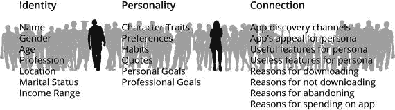

图 5-1. 典型的用户画像特征

在很多情况下，你会有多个用户画像，因为你的产品可能适用于多类用户。如果是这种情况，那么整个团队在开发应用时，同样必须将所有这些画像牢记于心。负面画像也很有用，即那些不会对你的产品感兴趣的人，这样团队就知道在开发策略中应该避免使用哪些设计和营销方法。

你的应用开发团队会将关于用户画像的这些知识应用到从设计到营销的方方面面。你将识别出能吸引该画像用户的关键词，以及专门为该画像用户设计的设计和布局风格、色彩代码、营销方法和独特的销售主张。

##### 创建用户场景

用户画像描述的是你的用户是谁，而用户场景则描述的是你的典型用户在追求特定目标时的行为方式，以及他们如何通过一系列步骤来完成特定任务。同样，观察你的用户并与他们交谈，是开发用户场景的正确方法。

用这些方法构建用户画像和场景，不仅应该为你提供应用方面的抽象想法，还能让你详细理解你的应用如何为他们提供价值。

应用这些用户画像。它们将帮助你更好地为用户设计应用及其内容，并帮助你根据用户的人口统计特征和习惯来定制你的广告和营销策略。

##### 通过本地化进行优化

本地化一个应用始于国际化，这使得应用能够根据用户所在位置和所说语言显示不同的界面和语言。一个已本地化的应用拥有多种语言的内容，并为用户显示合适的语言。这是应用开发中一个非常重要的方面，能显著提高采用率。例如，一个英文应用，无论设计得多好，在像中国这样的国家，其表现也不会像中文版本那样好。苹果应用商店覆盖超过 150 个国家，而其中只有大约一半的国家广泛使用英语。

当涉及到瞄准特定用户群体时，本地化的重要性再怎么强调也不为过。本地化通常是指用不同语言发布你的应用，但文化因素在使应用适应不同市场方面也起着（或应该起）作用。即使你的目标用户群非常广泛，在一个国家或文化中有效瞄准某个群体，与在另一个国家或文化中瞄准同一群体相比，会有天壤之别。美国的青少年与印度或日本的青少年在想法和行为上截然不同，而一个非洲国家的初创小企业与德国的初创企业所关注的问题也会不同。

本地化的另一个方面是营销。如果你想在用户下班时通过推送通知来触达他们，在西班牙，你可以在傍晚早些时候进行。在阿拉伯联合酋长国的夏季，当大多数人都在晚上外出消遣、避开白天的炎热时，深夜发送推送通知是一个好策略。

最后，本地化也是一种有用的应用商店优化策略。将你的应用名称、描述、关键词、图片和视频进行翻译，将其作为独立的应用发布，并在目标用户所在地区的本地应用商店中，用他们的语言创建一个定制化的应用商店页面，这可以帮助你的应用快速攀升排行榜，尤其是在当地商店竞争应用较少的情况下。在另一个国家拥有一个排名靠前的本地化应用，无论那个国家有多小，都会为你原有的应用带来强大的营销推动力。你看到过多少次应用宣称自己是“克罗地亚排名第一！”或“越南同类应用中的佼佼者！”？这都是通过本地化实现的。应用的以下部分可以针对不同国家和语言进行本地化，以助力你的应用向上发展：应用名称、内容、日期和时间格式、键盘、单位、应用商店描述、关键词、图片、截图上的文字以及视频。

本地化需要花费金钱，当你在产生应用创意和制定营销策略时，应该将本地化的规模和复杂性考虑在内。无论你在设计什么或为谁设计，本地化都是游戏的一部分。它适用于所有类型的应用和所有用户群体，所以请给予它应有的关注。

现在，让我们来看看另外两种有趣的、以用户为中心的创意生成方法：改进一个职业和改进一个流程。

##### 改进一个职业

这是产生应用创意的另一个良好起点。选择一个职业（可能是你自己的），你想要通过一个应用来改进它。详细分析构成该职业实践的各项任务和流程。识别出存在瓶颈、延迟或复杂性的流程，而这些是应用可以修复或消除的。设计一个应用，以尽可能高效和有效的方式提供这个解决方案。不要把你的应用仅仅看作是提高职业效率的工具，还要把它视为潜在的规则改变者，可能彻底革新你所针对的职业。

##### 改进一个流程

在我们职业生活之外，我们的个人生活和工作生活也由长度与复杂性各不相同的流程和惯例组成。每一个都值得我们分析和重新思考：订披萨、付账单、买机票、找水管工、监测病人生命体征、找最近的药店、查询银行账户余额、兑换货币、从相机里给别人发照片、学一门新语言，等等。

#### 方法三：从 App Store 入手

应用创意的第三个主要来源是应用商店本身，所有竞争和部分营销活动都在这里展开。苹果拥有一个主要的 App Store，以及覆盖超过 150 个国家的本地应用商店。应用在人气排行榜上不断起伏，争夺排名位置和用户关注。

每个应用在各类应用商店的榜单中都有其独特的发展路径，同时存在短期和长期的整体应用商店趋势。如果你知道如何以及在哪里观察，关注这些趋势并密切追踪应用的表现，可以产生无数应用创意。

iTunes 应用排行榜是一个不错的起点，你可以随时看到免费应用、付费应用和收入最高应用的排行榜。你还可以查看不同类别中的热门应用，比如游戏、社交、生活、工具、教育、摄影与录像、效率以及旅行。你甚至可以进一步缩小搜索范围，例如 `App Store` ➤ `游戏` ➤ `益智解谜`。

然而，务必记住，应用排行榜显示的结果基于你所在的国家/地区，因此无法用来追踪全球趋势。对于可能更重要的全球趋势，`App Trace` ([`www.apptrace.com`](http://www.apptrace.com)) 是一个优质信息来源，它收集并展示 iOS 和 Android 应用在全球表现的数据统计。你可以查看 iTunes 或 Google Play 上的前 300 名应用整体排名，或者特定类别中的前 300 名应用，甚至可以按特定日期搜索，这有助于你识别随时间变化的趋势，或追踪某一应用的发展轨迹。

例如，如果你的目标是 `教育` 类别，你会发现一个有趣的现象：2016 年 9 月 21 日，iTunes 上教育类应用的中位价格为 2.99 美元，而当天该类别中仅有 16.2% 的应用是免费的，相比之下，所有应用的整体免费比例为 64.7%。如你所见，只需简单扫描，`App Trace` 就能帮助你为应用做出关键决策，这里指的就是定价策略。

`App Annie` ([`www.appannie.com`](http://www.appannie.com)) 发布了关于应用商店监控几乎所有方面的详细信息，包括应用排名和应用商店趋势，你可以据此监控哪些应用表现最佳，追踪单个应用随时间变化的排名和下载量，或使用 `关键词探索器` 工具了解特定关键词的走势。它甚至还提供视频教程，向订阅者介绍监控应用商店趋势的基础知识。

##### 识别一个有利可图的关键词利基

找到一个有利可图的关键词利基是产生成功几率更高的应用创意的好方法，这基于高需求与低供给的关系。它涉及定位应用业务中受用户高度关注，但现有供给却低于需求的领域。为此，你需要使用关键词工具来发现所谓的长尾关键词（图 5-2）。

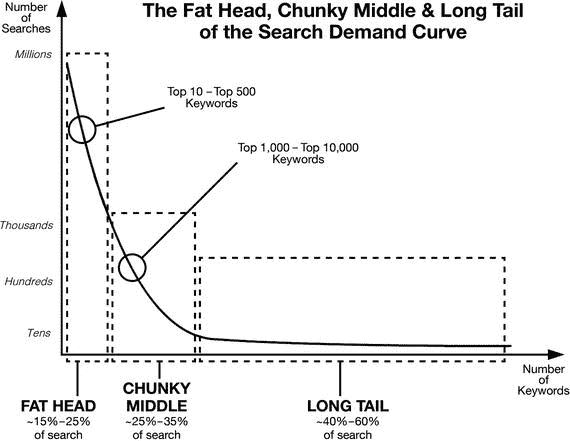

图 5-2. 搜索需求曲线的各个部分

长尾关键词是一种更长、更聚焦的关键词，网络和应用用户使用它来搜索他们想要的产品。例如，关键词 `"car"` 是一个短关键词，而 `"used car parts stores for Ford Mustangs in Alabama"` 则是一个长尾关键词。

术语 `"长尾"` 源于搜索词分布图的形状。简短、通用的关键词构成了“龙首”。然而，尽管使用短关键词的搜索量非常巨大，但绝大多数搜索却是由长尾关键词完成的；换句话说，长尾确实非常长。根据 `Wordstream` ([`www.wordstream.com`](http://www.wordstream.com)) 的数据，在任何时间段内，头部关键词搜索仅占搜索总量的 10%到 15%。中等长度的关键词再占 15%到 20%，而长尾关键词在任何时间段内至少占搜索量的 70%。这个数量非常庞大。

长尾关键词之所以重要，是因为它们让你有机会在特定领域获得很高的排名，而不是在一个竞争过于激烈、过于宽泛的利基中苦苦挣扎以吸引注意。通过专注于长尾关键词，你缩小了目标用户的利基范围，这看似有悖常理，但你也为自己创造了主导这一狭窄利基的重大机遇。

此外，专注于狭窄的利基还有一个额外优势，即可以精准定位那些正在寻找你恰好能提供的内容的用户。这意味着，如果你能向他们提供合适的产品，他们成为付费客户的可能性要大得多。所以，简短宽泛的关键词与长尾关键词之间的区别，就是数量与质量的区别：是触及一千个不确定自己需求的客户更好，还是触及十个恰好想要你所提供产品的客户更好？

长尾关键词的另一个优势是，由于在狭窄类别中竞争要小得多，在线广告成本也更低。

然而，并非所有长尾关键词都是有利可图的利基。有些长尾关键词并不存在对应的用户市场。关键词利基成功的秘诀在于找到一个需求大但供给有限的特定领域。换句话说，存在大量使用某个长尾关键词的搜索（需求的证明），但满足该需求的优质产品却很少（市场的证明）。当你找到这样的关键词时，下一步就是围绕它构建一个应用。

###### 如何找到一个好的长尾关键词？

首先，从你考虑的主题中选取一个简短术语，例如 `"recipe"` 或 `"car"`。使用关键词工具生成该类别中排名靠前的长尾关键词。有许多在线关键词生成工具，包括免费、免费增值和订阅制工具，可以为你完成这项工作。关键词工具会生成关键词利基，或一系列可用于构建应用并推广它们的相关关键词。优秀的关键词工具还会发布有关某个长尾关键词的竞争程度和总搜索量的信息，你可以利用这些信息来识别可以瞄准的“低竞争、高需求”利基。以下是一些工具的简要列表：

- `Google Keyword Planner`
- `Google Trends`
- `Wordstream's Free Keyword Tool`
- `Yoast Suggests`

你用于构建应用的那些关键词，也同样会用于 `ASO`，即`应用商店优化`，以最大限度地提高应用脱颖而出的机会，并让目标用户能够找到它。

##### 比较、改进或复制应用

这种开发应用概念的方法聚焦于现有应用，以其功能、优势、劣势以及应用商店排名位置为起点，开发出能从现有已验证需求中受益的改进版本。

在审视不同应用时，你可能会发现某个表现尚可的应用，但缺少一项能使其在竞争中更具优势的关键功能。这可以成为新应用概念的基础，因为原应用的成功表明市场对其有强烈需求，而改进或增强版应用有望吸引大量原应用用户。

事实上，一个绝佳的应用概念开发策略是：将特定类别中所有成功的应用归类，分析它们的关键功能和弱点，然后开发一款融合所有优秀功能并消除缺陷的新应用。这绝对是一条有望获得成功前景的应用概念之路。

要应用这一方法，你需要成为一个痴迷的应用下载者和测试者。选择一个应用类别，找出该类别中的佼佼者，并根据需要下载尽可能多的应用，以便对它们进行彻底比较。使用高度分析性的流程，找出每款应用成功的关键。如果某个类别中有多款应用都取得了成功，这表明每款应用都有用户喜爱且不可或缺的特定功能。这无疑是一个机会。识别这些功能，将其整合到一款拥有出色 UI/UX（用户界面/用户体验）设计的新应用中，你就能打造出一款成功产品。

另一种利用热门应用优势的思路，则是利用表现不佳应用的弱点。应用商店的底层充斥着大量概念不错、但因设计或玩法缺陷、缺少一两个功能、或营销策略不当而失败的应用。这是一个绝佳的探索领域：选取一款概念或功能集不错但失败的应用，开发一款消除其原有短板的新应用，从而找到潜在的成功产品。

**应用翻新**，或称**应用换皮**，相当有趣，是快速进入应用业务并赚取第一桶金的方式。它基于与房屋翻新相同的原理，完全不需要原创或其他任何形式的整体构思。

要翻新一款应用，你首先要购买原应用（通常是游戏）的源代码，修改其外观和风格（颜色、内容、图片、角色、关卡），最大化广告位，然后以不同名称发布。一种流行的应用翻新策略是：选择一款已经相对流行的游戏，找到类似游戏的源代码，改变外观和风格，并以更成功那款游戏的类似名称发布。这不仅让你能以相对较低的成本发布应用，还能借势其他应用的成功。

#### 其他灵感来源

最后，获取应用创意的第三个领域来自外部来源，即潜在用户和应用商店之外的渠道。这个领域是无限的，因为任何事物都可能成为应用创意的灵感来源。

作为应用发布者，要专注于敏锐观察身边发生的一切——从全球事件到周遭环境，并以应用发布者的视角审视事物。你会发现灵感并不遥远。社交媒体——例如 `Facebook`、`Twitter`、`Pinterest` 等——是获取新兴趋势信息的绝佳来源，因为社交媒体上对事件的反应非常迅速。

成功做到这一点的秘诀在于快速响应，以应用的形式利用任何全球或本地趋势，同时选择一个不易迅速消退、预计能持续足够长的时间让你从中获利的趋势。这意味着你需要身边有一个随时能快速行动、抢占市场份额并在趋势消退前最大化收益的团队。以下是一些可以作为应用创意来源的事件和趋势示例：

-   某个旅游目的地日益流行
-   围绕某款应用的突然媒体热潮（例如《Flappy Bird》的热潮）
-   改变行业运作方式的新政府法规
-   将催生全新一代应用的新技术（例如机器人技术、无人机和自动驾驶汽车）
-   政治事件（如选举）和体育赛事（如超级碗或奥运会）

### 如何评估和验证应用创意

你基于我们讨论过的策略所开发的应用概念目前仍只是概念，在投入资源之前，必须经过全面评估，以确定其成功的潜力。至少，如果你是应用行业的新手，并且尚未准备好同时开发多个应用，那么明智的做法是将列表缩小到最佳概念，按开发优先级排序，然后从最佳方案入手。

要找出列表中的优胜者，请回答以下一系列问题并评估答案：

1.  你的应用是满足需求、满足欲望，还是两者兼而有之？“需求”与“欲望”的区别在于，需求是用户认为不可或缺的东西，而欲望是非必需但非常渴望的东西。你的应用在多大程度上能持续满足用户的这种需求或欲望？
2.  你的应用是否提供了某种功能、服务或体验，使其在该类别中脱颖而出，尤其是在与最受欢迎的应用相比之下？这种功能、服务或体验是否足以吸引大量用户并保持他们的参与度？
3.  你将如何设计用户体验以保持用户粘性？你是否准备好在应用发布后投入更多时间和金钱，以长期保持用户参与度并留住他们？
4.  你的应用将针对哪个细分市场？这个市场有多宽泛或多狭窄？你是否准确估算了你应用的市场规模？这是一个重要的问题，答案将决定最终产品的许多方面。例如，针对青少年等广泛细分市场的应用，将侧重于通过免费版本驱动大量下载，然后在应用内销售额外功能以盈利。而针对医生等狭窄细分市场的应用，则更可能是一款付费应用，具有非常特定的目的和针对愿意付费的用户群量身定制的功能集。如果你正在寻求外部融资，了解目标市场规模也至关重要。同样重要的是，要确保你瞄准的市场是一个增长中的市场，或者至少是一个稳定的市场。你肯定不想登上一个正在沉没的船。这里值得提及的一个重要点是，许多成功的应用并没有瞄准现有市场，而是自己创造了全新的市场并主导了它们。苹果公司基本上创造了智能手机市场，优步创造了打车应用市场。
5.  你的应用概念能否成功变现？这个细分市场是愿意为你的应用或应用内购买付费，还是你将依赖广告收入？你盈利的可能性有多大，需要多少用户才能实现盈利，以及你应如何构建你的产品以最大化收益？简而言之，要赚取比如 1 万美元（在应用商店抽成之前），你是让 100 万用户每人支付 1 美分，还是让 1 万名用户每人支付 1 美元？你的用户属于哪个收入群体，他们在应用和应用内购买上花钱的意愿如何？
6.  你的收支平衡点是多少？你将在应用上投资多少，运营成本又是多少？你预计是否有足够的收入来收回初始投资并覆盖运营成本？
7.  如果你的应用获得了发展势头并建立了强大的用户基础，你是否准备好投入更多资金并围绕它建立一个业务？

这些问题的答案将提供大量信息，指导你如何设计应用以及它需要如何运作，才能让用户满意并让你获利。如果答案足够全面，那么可以说你已经完成了应用发布的一半准备工作，因为从此刻起，你将非常清楚自己想要什么、什么可行或不可行，以及从哪里开始。你将从一开始就按照设计流程做需要做的事情，以确保最终产品符合你的期望。

从这些问题的答案中得出的结论，将帮助你围绕使其脱颖而出的功能或体验来设计应用，确定能最大化用户基础和收入的定价策略，并有效地将你的应用推广到目标细分市场。

#### 验证

当你从成功前景的角度评估应用创意时，有一种方法能在你投入之前就知晓是否存在需求，这非常有帮助。验证是在投资于你的应用概念之前，确认你的预测和期望的一种方式。通过验证你的应用概念，你可以确保有足够的需求让你的应用获得成功，并且你并没有在人们不再感兴趣的“死胡同”项目上浪费时间和资源。

当然，验证并非一门精确的科学，无论你能力多强，也永远无法保证你的应用会被大量采用。准确预测采用率即使不是不可能，也是极其困难的，但至少有一些方法可以确保你的应用很可能会获得积极反响，并且有足够多的人想要你计划构建的产品。

下面列出的所有方法都是验证应用创意的公认方式。理想情况下，你应该使用所有方法（或至少大部分方法）来生成尽可能多的有用信息，了解你的目标用户群对即将发布的应用的反应。

##### 方法一：为你的应用创建一个基本的“即将上线”网站和/或社交媒体页面

创建一个关于你即将推出的应用的基础落地页，并在其中嵌入分析工具。该网站的目的不是为了宣传应用，而是为了收集潜在用户对其反应的信息。描述你的应用以及你认为它会成功的原因，并包含某种行动号召来衡量访问者的反应，例如邀请他们订阅邮件列表，或在应用即将发布时注册获取通知，邀请他们分享页面，或邀请他们提供反馈。你也可以询问他们类似“如果这个应用可用，你会下载它吗？”的问题。对于回答“不会”的用户，请询问他们原因。可能是因为市场上已有激烈竞争，他们认为该类别下不再需要另一个应用；也可能是因为他们发现了你设计中的缺陷，或者其他完全不同的原因。

你也可以创建一个 Facebook 页面，利用 Facebook 广告向公众测试你的概念，并为你的产品积累受众。

落地页不仅对你自身有用。如果你计划为应用或初创公司筹集资金，它还能作为概念验证的有力工具。页面上的点赞数量和分析数据，将极大有助于证明你的概念需求足够大，值得投资。

现在，开始推广你的应用网站。采用能精准触达目标市场用户的方式进行广告投放。网站中嵌入的分析工具将为你提供大量关于用户的信息。将这些信息与行动号召的反馈相结合，你将生成大量有用的信息，了解未来用户对你的应用可能会如何反应，以及他们下载应用的可能性有多大。

根据 Apptentive（`www.apptentive.com`）的说法，对你的应用创意获得积极反馈是好事，但就验证而言，其价值有限。有效验证的关键在于判断你的访问者是否愿意为应用付费，而这正是衡量你的应用在财务上是否可持续或可能盈利的关键。

如果你想利用网站为应用发布造势，可以添加博客和/或邮件列表，邀请人们注册接收新闻通讯或最新博文通知。这样，当你的应用发布时，你的受众就会翘首以待。

##### 方法二：了解有多少人在搜索类似你的应用

使用与应用创意相关的关键词，借助关键词工具来确定这些关键词的搜索量。同时采用宽泛关键词和具体关键词。如果你所选关键词的搜索量，相较于应用商店中现有产品数量来说相当高，这就是一个明确的信号：围绕该特定关键词构建的应用，将会拥有市场。

##### 方法三：了解与你的应用类似的应用表现如何

这个对比过程包含两个方面。一方面，观察你的应用类别中的应用在应用商店的表现如何，它们的下载量是多少，排名上升或下降的速度有多快，以及它们的整体需求随时间如何变化。这将告诉你，你身处的是一个增长型、稳定型还是萎缩型的市场。同时，它也会告诉你，随着时间的推移，你大致可以预期到多少下载量。

另一方面，更仔细地审视市场上的主要竞争对手，尤其是用户评论、反馈以及在论坛和博客上关于这些应用的讨论。利用这些信息来确定你的竞争对手在哪里犯了错，或者用户认为这些应用缺少什么，从而决定你的应用应如何调整，以吸引尽可能广泛的用户群。

##### 方法四：检查与应用主题相关的关键词需求

如果你有一个应用创意，它基于某个外部趋势、话题或事件，比如奥运会、选举、黑色星期五、圣诞购物季、狂欢节等等，那么请使用关键词工具来检查与该创意相关的术语在搜索中的表现如何，有多少应用试图满足该搜索领域的需求，以及这些应用的表现如何。如果你的应用无法与其它应用充分区分来脱颖而出，并且这些竞争应用的表现也不佳，那么除非你对应用进行充分修改，否则你的应用也不太可能成功。

#### 给认真的应用创业者：用于 Beta 测试的 MVP 发布

如果你对你的应用创意充满信心，那么测试它并生成大量有用信息的一个好方法，就是发布一个 MVP（最简可行产品）给一小群测试者，并获取他们的反馈。作为一个应用，MVP 将包含你最终产品计划的核心功能，没有任何花哨的附加功能。其目的在于了解 Beta 测试者是如何使用该应用的，他们在哪里遇到了问题，以及他们不喜欢应用的哪些方面。这也能防止你浪费时间在用户不关心的功能上。

通过构建一个 MVP，你作为应用发布者已经成功了一半，并且你已经拥有一个目标市场（至少是其中一部分）正在使用的产品。事实上，没有其他方法能实时了解你预期的用户是如何与应用互动的。你甚至可能会发现，你的用户正以创新和意想不到的方式与你的应用互动！发布 MVP 是一个应用验证信息的金矿！

### 总结

一切就绪！用理性且系统的方法来处理应用创意的生成过程。使用你最心仪的方法，或者更好的是，使用本章列出的所有方法，来生成一个足够大的初始应用创意集。

使用关键词搜索和其它方法，来相当准确地描绘出供需状况以及预期利润。将你的候选列表缩小到最具成功机会的那个创意。接下来，验证你的应用创意。下定决心，付诸行动。

## 6. 设计你的应用

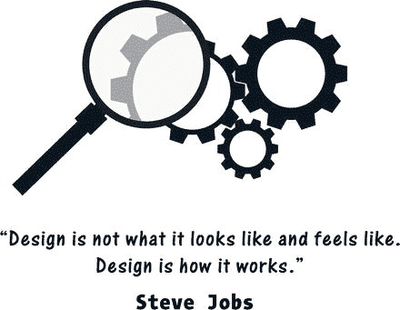

每个应用都有一个生命周期，一段始于创意、最终成熟为可在应用商店下载的、功能完整的应用的旅程。

但在中间阶段会发生什么？一个应用在从一个想法变得不止于一个想法时，会经历怎样的过程？

应用演变为最终产品要经历若干阶段。每个阶段都更详细地定义了应用的功能、外观和体验。之后，第一个原型会被创建并进行彻底测试，最终版本才会为发布而制作。

然而，成功上线只是故事的一半。上线之后还有大量工作要做，包括营销、性能监控和调整。事实上，随着你的应用获得动力、下载量增加，你将不可避免地投入更多精力，寻求改进方法、超越竞争对手并实现盈利。

应用远不止是代码。在本章中，我们将探讨应用是如何组装起来的，它们的重要部分是什么，设计和编码时采用哪些标准，以及应用设计师若想拥有一个能在应用商店取得成功的好产品，必须遵循哪些原则。

在此阶段，你正在定义所谓的用户体验（User Experience），也就是用户将如何与你的应用进行交互。

### 在启动设计流程之前：了解你在做什么

既然我们已经了解了关于应用开发的常见误区（参见前一章），让我们来窥探一下应用到底由什么构成，以及我们在开发过程中必须牢记什么。对构建应用所需内容的现实而透彻的理解，将有助于你从一开始就确保你的应用是专业构建的。

#### 选择平台

在开始开发应用之前，首先要选择目标平台，最常见的是 iOS 或 Android。两者各有优缺点。

优先开发 iOS 的优势在于：设备种类相对较少、产品上市速度更快、用户忠诚度更高，且系统能更有效地防范恶意软件。

缺点是审核标准更严格，应用获批时间更长。在盈利方面，虽然苹果的用户数量少于安卓，但众所周知，苹果用户的平均消费更高。

优先开发 Android 的优势在于拥有更庞大的潜在用户市场（约占全球设备的 80%）。Android 的其他关键优势包括应用审批速度快、分发便捷。

缺点则是应用需要适配种类繁多的设备、屏幕尺寸和分辨率。开发 Android 应用通常也比开发 iOS 应用耗时更长。

##### iOS 原生应用：占智能手机市场的 13.9%（2015 年第二季度）

iOS 原生应用在苹果设备上运行，使用 Objective-C 或 Swift 编程语言，借助 `Xcode` 软件进行开发。注册开发者支付年费后，便可在苹果电脑上免费下载和使用该软件。

##### Android 原生应用：占智能手机市场的 82.8%（2015 年第二季度）

Android 原生应用在所有搭载 Android 操作系统的设备上运行。包括三星、华为、联想、小米和 HTC 在内的数百种不同智能手机品牌均使用 Android 系统。Android 应用使用 Java 编程语言，并借助 Google 的 `Android Studio`、`Eclipse`、`NetBeans`、`JEdit` 以及其他 Java 编程工具等免费软件进行开发。

##### Windows 原生应用：占智能手机市场的 2.6%（2015 年第二季度）

Windows 原生应用在使用 Windows Phone 操作系统的设备上运行。Windows 应用使用 `C++` 和 `C#` 编程语言以及 `.NET` 框架，并借助 Microsoft `Visual Basic` 等免费软件进行开发。

##### 混合应用

混合应用，也称为跨平台应用或通用应用，是使用 `HTML`、`CSS` 和 `JavaScript` 等 Web 开发语言一次性开发完成的应用，然后为其添加一个“外壳”，使其可以部署在 Android、iOS 或 Windows 操作系统上。

开发混合应用而非多个原生应用的优势在于成本显著降低、发布速度更快以及维护需求简单得多。缺点在于混合应用可能缺乏原生应用的精致度，并且在利用各种设备功能方面比原生应用更有限。

混合应用是借助 `PhoneGap`、`Appcelerator Titanium` 和 `Telerik` 等服务开发的。大多数允许用户免费或无需编码技能构建应用的网站，所生成的都是混合应用。

##### 最优策略

任何应用的第一个版本几乎总是需要改进。如果你想开发原生应用，先在一个平台上进行开发以降低成本并缩短学习曲线，然后在所有平台上发布新版本。或者，如果成本是最大的挑战，那就从开发混合应用开始。

#### 明确概念

在你的应用生命周期中，这个阶段是你的创意迈向成熟应用的第一步。此阶段的关键活动是缩小关注范围，整合你在上一章中收集的信息和做出的决策，并以可用于构建产品原型的方式描述你的创意。

现在，你的创意将经历一个关于以下方面的明确过程：

-   **类型** – 你正在构建哪种类型的应用？是游戏、社交应用、实用工具应用还是其他类型？它在应用商店中应属于哪个类别？
-   **目的** – 应用的主要功能是什么？用户应该用它来做什么？
-   **功能** – 它还能做什么？这些能力是支持主要功能，还是最低可行产品可以没有的次要功能，但因其能带来附加价值而值得拥有？
-   **市场** – 它面向谁？它的主要用户是谁？你的目标是狭窄的利基市场还是广泛的用户群体？

这些问题的答案将指导你设计应用的结构、外观与感觉，及其细节。

#### 明确规模与成本

还有一些相关问题将决定你的应用将有多大、多复杂，从而决定构建它需要多长时间。为了进一步完善应用概念，你需要回答以下问题：

-   **规模** – 你的应用有多大？它是一个小型独立应用，即使没有网络连接也能完全下载并在智能手机上运行，还是一个需要移动后端进行管理的较大应用？
-   **内容** – 应用的内容是什么？如果是游戏，内容将是游戏角色、关卡、图像、声音等。如果是新闻应用，内容则需要不断更新，在某些情况下是自动生成或由用户生成的。
    -   你将创建内容，还是由用户彼此分享？内容是需要策划的，还是必须从不同地方获取并需要你支付费用？
-   **数据收集** – 你是否会通过分析工具收集用户信息？这个问题在早期阶段可能看起来不重要，但它高度相关，因为你收集用户信息的方法将影响应用的设计，尤其是在用户体验的不同阶段你希望从用户那里获得怎样的反馈。
-   **盈利模式** – 你的应用将如何赚钱？这个问题与应用的设计密切相关，而不是之后简单应用到设计上的附加事项。
    -   许多应用是围绕特定的盈利方法设计的。例如，看起来像其他游戏副本的小游戏，被精确复制以受益于原游戏的成功，并提供免费下载以最大化下载量。它们塞满了不同类型的广告以从点击中获利。这些应用在每次打开或关闭应用、每次从一个关卡切换到另一个关卡时，以及任何可能的机会，都会显示插屏（全页）广告。它们纯粹是为了不费力气地赚钱而设计的。
    -   其他应用，例如更复杂的游戏，拥有功能齐全的免费版本，并对应用内购买以及额外的功能或关卡收费。这种模式被称为“免费增值”。
    -   某些类型的应用是基于订阅的。这种盈利模式适用于杂志或视频应用，可以合理地每月对其内容收取一定费用，并且由于其能够为发布者产生稳定的收入流，其受欢迎程度正在增长。
    -   你想为你的应用使用哪种盈利模式？基于广告的盈利模式除了占用永久的屏幕空间（并可能激怒用户）外，不会对设计产生深远影响，但基于应用内购买的盈利模式将影响应用如何运作、如何吸引和留住用户的核心。
-   **图形** – 你的应用对设计的依赖程度如何？它需要多少设计工作才能正常运行？一个简单的游戏不需要太多的视觉效果，但有些应用，尤其是复杂的游戏，需要持续的图形工作。你必须决定是否需要定期制作视觉效果。

### 应用的组成部分

在设计应用时，请牢记你设计的并非一个局限于手机屏幕、拥有固定用户界面的有限软件（尽管如果是一个小游戏，它也可能是这样）。它是一个生动的实体，延伸到承载它的手机之外，并且，根据应用的类型，它会定期更改其内容和感受，同时不断收集有关其用户及行为的数据。会有数据库管理员和内容管理者在某个地方协同工作，以维护应用并保持用户对其产品的参与度，同时还有一个客户关系管理团队负责响应用户的咨询和反馈。如图 6-1 所示，一个应用包含几组标准组件，每一组都必须单独管理才能打造出成功的应用。下面将对每个组件进行讨论。

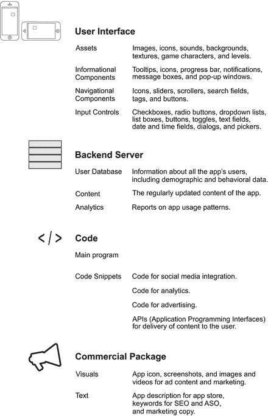

图 6-1. 标准应用组件

#### 用户界面

这是应用中与用户交互的部分，负责接收命令并显示内容。它通常通过以下元素来定义用户体验：

*   **资源** 是应用使用的文件，例如图片、声音、游戏角色或纹理以及图标。
*   **信息性组件** 是向用户传达信息的视觉元素，例如工具提示、图标、进度条、通知、消息框和弹出窗口。
*   **导航组件** 帮助用户在应用中导航，例如滑块、滚动条、搜索字段、标签、按钮和导航图标。
*   **输入控件** 允许应用通过用户界面元素接收用户输入，例如复选框、单选按钮、下拉列表、列表框、按钮、开关、文本字段、日期和时间字段、对话框以及选择器。

#### 后端

这是应用发布者托管和管理应用所显示内容及其收集数据的地方。后端通常包括：应用内容（由发布者在相关时间间隔内修改或更新）、用户数据库（包含应用用户的人口统计和行为信息）以及分析组件（用于提供这些信息并为发布者生成报告）。

#### 代码

运行应用的代码根据编程语言和平台有不同的组件，但所有相对复杂的应用都包含以下部分：应用的主程序、插入到主程序中的用于分析功能的代码片段、用于社交媒体分享应用内容的代码片段、用于在应用内显示广告的代码片段，以及允许应用向用户提供内容的 API（应用程序编程接口）。

#### 商业包

应用的商业包包含了所有将用于在应用商店和线上推广应用的材料：应用图标图片、截屏、用于广告内容和营销目的的视频图片或视频，以及文本，例如应用商店的应用描述、用于 SEO（搜索引擎优化）和 ASO（应用商店优化）的关键词，以及营销文案。

### 应用设计的目标

正如史蒂夫·乔布斯所说，设计不在于它的外观和感觉，而在于它如何运作。然而，除了看起来不错和性能良好之外，设计在用户参与的不同层面也服务于不同的目的。

你的应用将与数百万其他应用争夺注意力，用户只会花几微秒来决定一个应用图标和简短描述是否值得进一步关注。因此，你的设计策略和质量最好足够出色，否则你的应用就会失败。

如图 6-2 所示，你的应用需要引导用户经历四个互动层级：发现、参与、留存和变现。

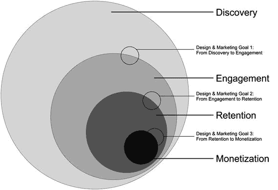

图 6-2. 应用设计的目标

在每一个层级，设计对于最大化应用潜力都至关重要。最终，看到你应用的用户中，只有很小一部分会下载它，而下载的用户中，只有极少数会花钱。设计在最大化这个数字方面起着重要作用，这意味着好的设计会带来强劲的收入和可观的投资回报。

#### 发现：让用户找到应用

应用发现主要关乎有效的营销，但设计在应用发现中也起作用吗？

是的，它确实起作用！面对如此多的竞争应用，你在应用商店中的应用名称、图标、截屏、视频和描述页面都需要精心设计，以吸引眼球，产生正确的视觉冲击，从而说服用户尝试你的应用。

用户只需几秒钟就能决定一个应用是否值得下载，所以要好好利用这几秒钟。

#### 参与：让用户喜欢应用

用户也只需几秒钟就能决定他们是否喜欢一个应用，所以在这里时间也同样至关重要。

让用户快速体验到他们期望应用能做的事情。近乎即时的满足感是让用户持续探索并“参与”你的应用的最佳方式。

通过围绕满足感和成就感构建体验，来最大化用户参与度。你的应用应该快速有效地实现其承诺，这样用户才会认为它值得保留。

#### 留存：让用户保留应用

留存完全关乎为用户创造长期价值。

绝大多数应用大约一周后就会被弃用。为了避免这种命运，你需要让你的应用成为用户生活中不可或缺的一部分，从而持续吸引用户。

根据你应用的类型，通过适时推送通知、更新以及新功能、关卡、内容和优惠来保持用户的参与度。

#### 变现：让用户花钱

最终目标当然是创造价值和利润。通过向那些参与度最高、并愿意为此付费的用户提供额外价值来赚钱。

这种额外价值通常以应用内购买的形式出售，例如新功能、免费应用的专业版或完整版，或者游戏中的新关卡、角色或武器。

应用内购买可以作为单次交易提供，也可以作为每月或每年的订阅提供。

#### 转换点

一旦你的应用上线运行，你许多额外的设计和营销想法都将围绕用户与你应用关系阶段之间的三个转换点展开。你将修改应用的设计和营销内容，以推动用户从发现进入参与，从参与进入留存，再从留存进入变现。每个转换点性质都不同，需要不同的方法和技术。

### 移动应用优化

移动应用优化是一个持续对应用进行小幅、递增式更改以衡量用户反应的过程，直到你找到能够带来最大利润的最优设计。

应用的第一个版本在发布时，极不可能完全符合用户的期望。它很可能存在“初期问题”。同时，很难确切知道问题出在哪里。如何解决这个问题？

这时，增量更改就派上用场了。首先，确定用户在你的应用中特定节点预期会执行的操作——例如打开文件、发送消息、分享体验、创建内容等。然后，观察用户为执行该操作所经历的路径。这些路径被称为漏斗（图 6-3）。

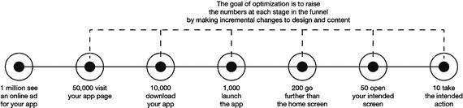

图 6-3. 应用优化漏斗

### 实现价值时间

衡量一款应用吸引用户能力的一个指标被称为**实现价值时间**。这是一个商业术语，用于衡量从用户提出被定义为价值（某个商业目标）的请求，到该价值交付给客户之间的时间。

在应用中，这衡量的是用户需要多长时间才能到达应用实现其主要功能的节点。例如，如果是一款即时通讯应用，**实现价值时间**衡量的就是用户撰写信息、确定收件人并发送信息的快捷程度。

用户希望应用能成为他们意图的延伸。如果你想发送一条信息，你不会希望在点击`发送`按钮之前经历太多步骤。如果**实现价值时间**过长，用户可能会觉得该应用过于繁琐或复杂。**实现价值时间**并非对所有应用都相同。作为一个过程，它会根据应用主要功能的不同而有所差异。

然而，有必要记住，**实现价值时间**并非决定应用对用户价值的唯一设计方面。

#### 从出色的应用设计开始

出色的应用设计由多个组成方面构成，每个方面都有其基本要素（图 6-4）。

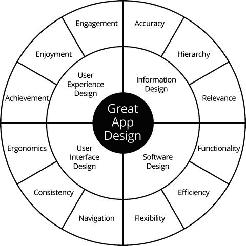

图 6-4. 出色应用设计的组成部分

具体来说，有四个基本方面结合在一起，可以增加获得用户积极响应的可能性：

- **信息设计** – 应用的内容需要有用、相关、准确且结构合理，以便用户轻松找到所需信息。同时，要确保定期更新内容，以吸引用户持续回访。
- **软件设计** – 运行应用的软件需要高效工作，避免崩溃，并能处理新功能和快速增长的用户数量。
- **用户界面设计** – 精心设计的用户界面是获得用户认可的关键，它需要考虑人体工程学（应用是否支持单手或仅用拇指操作？）、导航（是否直观快捷？）以及一致性（图标和导航按钮在整个应用中是否一致，并通过颜色、形状和声音进行编码？）。
- **用户体验设计** – 为用户创造积极体验是应用成功的保证。积极的体验包括参与度（用户与应用互动多久？）、愉悦感（使用应用是否有趣？）和成就感（应用是否帮助用户完成有用的事情？）。

应用的编码方式因其运行的平台（如`iOS`或`Android`）而异。它们的影响力也远超你的智能手机。它们会连接数据库以下载内容和记录用户数据；而一些使用地理定位的应用则会与应用内的其他用户通信，将用户连接起来。大多数应用会帮助你发布想要在社交媒体上分享的内容，并且它们对你的了解远超你的想象。

让我们更详细地看看这四个组成部分。

##### 信息设计

信息设计涵盖了应用内容的结构方式，以及用户在不同应用部分能访问到的不同层级的信息（图 6-5）。

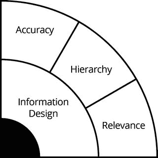

图 6-5. 信息设计

应用内部信息的结构取决于两个主要考量。第一，内容性质：是图片、视频、文本，还是三者的结合？第二，用户参与策略：你希望用户在初次浏览时看到多少内容，又希望将多少内容深藏？你希望在一个页面上集中展示多少信息，又如何从这个页面链接到更深层的内容（图 6-6）？

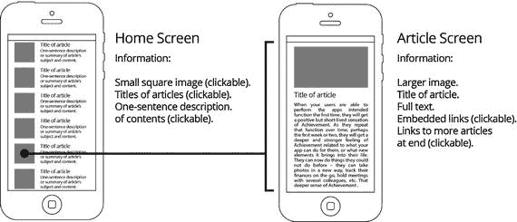

图 6-6. 信息设计

为了使信息设计成功，你所使用的信息需要具备三个特性：准确性、层次结构和相关性。

###### 准确性

这是你在应用中发布的所有信息最基本的特性，如果你计划定期更新内容，这一点尤为重要。务必确保应用内发布的任何信息都是准确的。

对于新闻类或杂志类这类发布大量定期更新内容的应用来说尤其如此。核查已发布信息的准确性，或者确保你使用的信息来自可靠且值得信赖的来源，这必须成为你内容创作体系中不可或缺的一部分。

###### 层次结构

应用中的信息层次结构决定了用户在初次浏览时能看到多少内容，以及他们需要深入多少层级才能访问其余内容。这种信息结构由导航一致性的需求以及你的变现策略共同决定。例如，用户可以免费阅读文章的简短摘要，但需要订阅才能访问全文。

逻辑地组织你计划发布的信息，并创建适合你需求的层次结构。如果你想吸引用户进入你的应用，你必须决定在主页或其他关键屏幕（例如`我们所有的博客文章`）上发布什么内容，来引导用户进一步探索并阅读你的博文。

###### 相关性

你提供给用户的所有信息都需要与他们的需求相关。相关性涉及整个应用内容的一致性，以及你向用户传递的形象的一致性。例如，如果你的应用是一款健康相关应用，那么所有内容都需要围绕用户的健康展开，并增强用户正在获取改善健康的有用信息的感受。

##### 软件设计

软件设计（图 6-7）可能看起来与应用本身的设计没有直接联系，但联系是存在的，而且很重要：如果你的软件无法正常运作，你的应用就没有成功的可能。

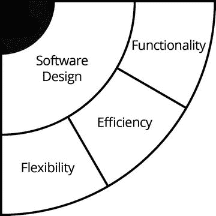

图 6-7. 软件设计

就设计方式而言，应用的软件需要遵循三个原则：功能性、效率和灵活性。

###### 功能性

你的代码必须能够工作，仅此而已。没有崩溃，没有错误，没有死胡同式的导航。它必须万无一失地向用户交付它应该交付的功能。作为发布者，你有责任在发布前彻底测试应用，消除崩溃并修复错误。

注意：此处的术语`functional`（功能性）意为`能工作`，与代表完全不同概念的术语`functional programming`（函数式编程）无关。

###### 效率

拥有高效的代码意味着以尽可能小的代价向用户传递价值。低效的代码，即使功能完备，也会让应用感觉笨重和缓慢。一个很好的例子就是应用的加载时间。如果你的应用加载主界面（或至少一个启动画面）耗时超过一瞬间的 1 到 2 秒，那么你已经让用户感到沮丧了。

###### 灵活性

灵活的软件从一开始就为扩展而设计。它会考量应用未来可能增长的任何预测，并且其结构已经为尽可能平滑、快速地推进发展过程做好了准备。

##### 用户界面设计

用户界面是用户与应用交互的空间（图 6-8）。

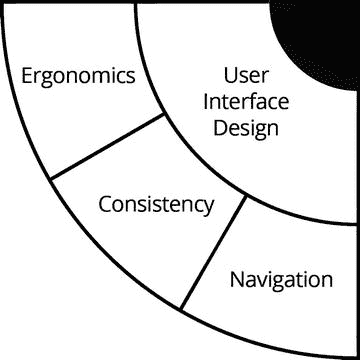

图 6-8. 用户界面设计

为了正常运作并带来良好体验，用户界面应围绕三个原则构建：**人体工程学**、**一致性**和**导航**。

###### 人体工程学

人体工程学在用户界面布局中会考虑人体因素，例如人手的尺寸和拇指的弧形运动范围。你的应用能否单手使用且不让用户感到不便？成人和儿童都能单手操作吗？你是否避免了将按钮放置在屏幕上操作不便的位置？这些都是精心考虑人体工程学设计的标志。

###### 一致性

一致性意味着满足用户对各个元素应处位置的预期。如果你在某个屏幕上将导航按钮置于角落，那么在其他所有用到该按钮的屏幕上也应将其保持在同一角落，因为用户会预期它在那里。

一致性同样适用于应用对手势操作的响应。点击、长按、短滑或长滑的每一次操作都应产生相同的结果。

一致性创造了熟悉感，而熟悉感通过最大化用户在使用应用时的舒适度和信心来提升用户体验。当用户不会感到困惑时，他们操作应用的速度会更快，手指动作也会更敏捷，应用便更能成为他们意图的延伸以及高效完成任务的工具，从而培养用户对应用的依恋感和长期使用的可能性。

###### 导航

清晰的导航沟通意味着用户始终能凭直觉知道自己身在何处、如何返回，以及如果决定返回起点如何操作。清晰的导航通过确保用户从未在应用中迷失方向来支持积极的用户体验。

##### 用户体验设计

为用户提供积极的体验是推广应用最有效的方法之一（图 6-9）。

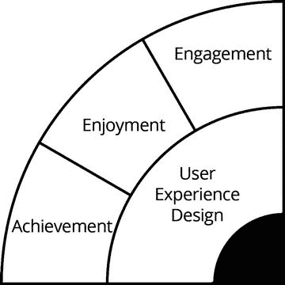

图 6-9. 用户体验设计

一群用户热烈称赞你的应用有多么出色，这是一种无可比拟的营销工具，而建立这样一群用户取决于你能否实现以下互动与情感层级：**参与感**、**愉悦感**和**成就感**。

###### 参与感

积极的用户体验包含三个层级。第一是参与感。具有参与感的用户已经对你应用的第一印象做出了积极回应。他们喜欢它并希望进一步探索。他们对应用的特性和功能充满好奇。

###### 愉悦感

当用户对你的应用熟悉后，他们会进入愉悦感阶段。他们从应用中获得了乐趣，而这种愉悦感比参与感更强烈、更深刻。

###### 成就感

当用户能够实现应用的预期功能时，他们会获得一种积极但短暂的成就感。随着他们在一两周内重复使用该功能，他们会获得一种更深沉、更强烈的成就感，这与应用能为他们做什么，或为他们的生活带来哪些新元素有关。他们现在可以做到以前做不到的事情——用新的方式拍照、随时追踪财务状况、与多位同事开会等等。这种更深层的成就感，正是将用户与你的应用紧密联系的关键。

#### 卓越设计的其他方面

卓越的设计能让用户理解应用中所有功能是如何运作的，并能毫不费力地达成目标。任何费力感都会让用户感到沮丧并产生疏离，因此用户体验设计师会应用以下原则来避免这种情况。

##### 清晰性（导向性设计）

清晰性涉及一致性地使用颜色、形状和文字，以快速告知用户应用的功能、以及在应用内任何时刻可用的选项。

导向性设计的要点在于确保用户绝不会对自己身处何处、需要去往哪里、或需要做什么来达成目标感到困惑。

##### 直观设计的价值

为了使你的应用吸引用户，其视觉设计和导航需要尽可能直观。这意味着用户应该能够在他们预期出现的位置，精确地找到他们想要的一切。换句话说，直观设计就是用户期望与用户体验之间的精确匹配。直观意味着几乎或完全不需要理性思考；用户在与应用互动时，不会问自己“我现在该做什么？”相反，无论他们决定做什么，要达成目的所需按下的按钮就在他们面前。这让用户对你的应用感到舒适，并帮助他们寻求更深入的用户体验。导航问题总会阻止用户深入使用你的应用，并会想尽一切办法把他们赶走。

要让应用设计变得直观，你需要具备以下几点：

- **核心路径** – 用户使用应用核心功能的路径，应该始终保持直接可见和可访问。
- **指令** – 指令是你发出的“命令”，要求用户在应用的不同节点执行特定的操作。表明“打开”、“发送”、“复制”或其他含义的图标，本质上都是在向用户下达指令，让他们执行你的意图，或者从你创建的一系列选项中进行选择。
- **锚定** – 任何在应用中执行关键导航功能的图标，都应该始终位于同一位置，不应根据内容的变化或随意移动。如果在应用启动时，你让用户预期某个特定按钮位于特定位置，那么当用户需要它时，就会一直期望在那里找到它。iPhone 上的 Home 键不仅在视觉上是锚定的，在物理上也是锚定的。因此，用户总是知道如何随时返回主屏幕。锚定对于返回主屏幕、离开应用等关键功能尤其有用（图 6-10）。

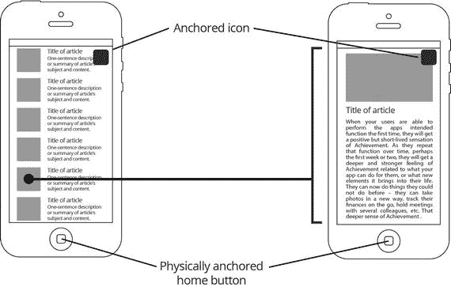

图 6-10. 锚定：图标位置的一致性

- **熟悉感** – 应用发布者总是在寻找让应用设计脱颖而出、与众不同的方法。虽然追求原创性和独特性通常是个好主意，但有一件事你永远不应碰触，那就是你将使用的图标的象征意义和熟悉感。同一个图标有多种样式——方形、圆形、带阴影、无阴影、彩色、黑白等等——但图标的含义保持不变，你永远不应改变它，因为你会冒着失去其象征意义的风险。
- **简洁性** – 始终抵制使设计复杂化的诱惑。这一点在智能手机屏幕上比在任何其他地方都更为真实。智能手机屏幕越来越大，但它们仍然代表着你可使用的非常有限的视觉空间。将越来越多的功能挤在一个屏幕上，是你既不理解自己的应用、也不理解其核心功能、更不清楚哪些需要直接访问、哪些可以放在一边的明确信号。然而，简洁是需要经过努力才能达到的境界。这种努力通常涉及理解你的用户，以及你的应用如何构建来满足用户的需求。正如史蒂夫·乔布斯曾经说过的：“简洁可能比复杂更难做到。你必须努力让你的思维变得清晰，从而使其简单。但最终这是值得的，因为一旦你做到了，你就可以移山填海。”

在你为当前的设计问题寻找最简单的解决方案时，设计指南会给你带来很多帮助，这些指南旨在确保达到最低要求的人机工程学和功能性水平。

#### 应用设计标准与指南

应用设计标准和指南是由构建应用运行平台的公司制定的。这些标准和指南基于对人类工效学以及最佳设计实践的理解。它们旨在确保应用正常运行，为用户提供必要的体验质量，并创造一种与苹果和谷歌等平台制造商希望塑造的形象相符的、一致的美学体验。

通过在应用设计和布局中遵守这些指南，你可以确保应用更有可能获得发布批准，并且用户会认为该应用具有吸引力、易于理解、导航和使用。你还可以通过下载和使用基于这些指南构建的 UI 套件和模板来节省大量时间。

##### 平台指南

平台指南是由构建应用运行平台的公司制定的设计指南。

苹果人机界面指南可访问：

[`https://developer.apple.com/design/`](https://developer.apple.com/design/)

安卓人机界面指南可访问：

[`http://developer.android.com/design/index.html`](http://developer.android.com/design/index.html)

Windows 人机界面指南可访问：

[`https://dev.windows.com/en-us/design`](https://dev.windows.com/en-us/design)

###### 苹果

对于像苹果这样的公司，在应用设计中应用其人机界面指南对于应用获得发布批准至关重要。该公司为 iOS、macOS、watchOS 和 tvOS 提供了详细的人机界面指南。

#### 工具与资源

以下章节讨论了一些在设计应用时可能对你有帮助的工具和资源。

##### 设计模式

设计模式是可用于解决用户交互问题的标准化解决方案，可以反复使用。线上和印刷品中有成千上万种模式集合，几乎可以解决你可能遇到的任何交互设计问题。例如，针对 iOS、安卓和其他平台的设计模式，为设计对话框、提示、邀请、演示、透明度、弹出视图、侧边栏、通知、照片、标签栏、注册、引导页、视频、图表、小部件、购物车、评论、帖子、事件、筛选器、空状态、网格、主屏幕等等，提供了最佳方法。

如需 iOS 设计模式灵感，请访问 iOS Patterns（[`http://ios-patterns.com/`](http://ios-patterns.com/)）或 Pttrns（[`http://pttrns.com/ios-patterns/`](http://pttrns.com/ios-patterns/)）。

##### 从草图到应用

现在，把你的想法变成草图，草图变成设计，设计变成编码后的应用。

将概念转化为设计需要从不同的角度审视它。你可以绘制流程图，将你的概念描述为一系列步骤，或者做一些布局草图，将你的概念描述为一组应用界面。以下章节讨论了不同的方法和工具。

###### 纸和笔

没有什么比在纸上涂鸦更能激发想法了。在一张干净的纸上，你可以画任何东西，从图标设计到界面布局，再到流程图，或者任何其他想到的东西。在转向数字工具之前，这种自由涂鸦、在不同想法和选项之间切换的自由，对创作过程至关重要。

###### 用户流程图

用户流程图从用户的角度审视应用设计。它们描绘了用户在应用中的旅程，他们在关键交互点必须做出的决定以及必须提交的信息。

有了流程图和决策树，下一步通常是为流程图的每个部分设计界面。

### 应用设计模板

为了让屏幕设计更精确，请使用模板来按比例设置图标、按钮和其他视觉元素。你也可以使用带有智能手机模板和点状网格的特殊应用设计速写本，从而快速、准确地可视化你的设计。此处推荐模板均可免费下载为`.pdf`和`.png`格式。

免费和付费的设计模板及速写本可在以下网站获取：`interfacesketch.com`、`sneakpeekit.com`、`ideatoappbook.com`、`dotgrid.co`、`appsketchbook.com`、`popapp.in`、`uistencils.com` 以及 `smashingmagazine.com`。

#### 模板片

模板片与模板配合使用效果极佳，可生成精确的布局。它们包含了应用设计中最常用的按钮和视觉元素。免费和付费的模板片可在 `uistencils.com`、`mobilestencil.com` 等网站获取。模板片也有数字格式，例如 Basiliq（`https://castle.co/design/basiliq`）。

#### 线框图和 UI 工具包

线框图是应用中各屏幕布局的详细设计。它们展示了不同元素在屏幕上的排列方式，以及不同屏幕之间的连接关系。线框图会告诉你，点击一个屏幕上的某个按钮会跳转到另一个屏幕，或激活某个特定功能。它们还会显示应用总共包含多少个屏幕，以及每个屏幕的外观。

鉴于许多应用功能相似，并遵循设计标准和指南，因此可以从各种平面设计网站下载不同格式（例如适用于`Photoshop`、`Illustrator`和`Sketch`）的标准化屏幕布局合集，即线框图工具包。

UI 工具包和模板是完整设计好的用户界面合集，用于加速设计流程。它们自带一系列元素，如图标、按钮、滑块、字体、背景和纹理，以及针对电子商务或聊天等功能的预设计布局。

许多工具包都有名称，如`Helium UI Kit`、`Flat UI Kit`和`Universe UI Kit`，并提供适用于`Adobe Photoshop`、`Adobe Illustrator`和`Sketch`等平面设计软件的多种格式。这些工具包可以轻松地在 `speckyboy.com`、`sketchappsources.com`、`wireframes.tumblr.com` 等网站上找到。

应用开发公司也会创建自己的 UI 工具包，以使其产品保持统一的美学风格和视觉语言；而数字艺术家则创建并销售 UI 工具包，这些工具包可在应用项目的布局和线框图阶段下载使用。

以下部分将介绍一些流行的应用线框图和设计工具。

##### Adobe Photoshop、Illustrator、InDesign、Experience Design（`www.adobe.com`）

Adobe 提供了一套适用于应用设计的设计工具，包括用于图像处理和应用布局的`Photoshop`、用于矢量图形的`Illustrator`以及用于排版的`InDesign`。Adobe 还拥有其他用于 HTML 应用的 Creative Cloud 工具，如`Edge CC`和`PhoneGap Build`。

`Adobe Experience Design` 是 Adobe 推出的、用于设计网站和移动应用的一站式工具；而`Adobe Digital Publishing` 则是一个内容管理系统，可与`Experience Design`配合使用，通过移动设备分发内容。

##### Omnigraffle（`https://www.omnigroup.com/omnigraffle`）

`Omnigraffle` 是一套专为苹果设备设计的用户体验数字设计工具之一。

##### Sketch（`https://www.sketchapp.com`）

`Sketch` 是一款专为苹果 Mac 电脑开发的矢量图形编辑器，并在 2012 年获得了苹果设计大奖。

##### 更多应用线框图和原型设计工具

`UXPin`（`www.uxpin.com`）
`FluidUI`（`www.fluidui.com`）
`Balsamiq`（`www.balsamiq.com`）
`Visio`（`www.visio.com`）
`Pidoco`（`www.pidoco.com`）
`JustinMind`（`www.justinimind.com`）
`Gliffy`（`www.gliffy.com`）
`HotGloo`（`www.hotgloo.com`）
`Solidify`（`www.solidifyapp.com`）
`Mockups.me`（`http://mockups.me`）
`Protoshare`（`www.protoshare.com`）
`Invision`（`www.invisionapp.com`）
`Flinto`（`www.flinto.com`）

### 自行开发应用

在回答这个问题之前，你需要先回答另一个问题：你是否了解为主要应用平台 iOS 或 Android 编写代码？

如果你具备所需的编码技能，那么自行开发应用会容易得多。如果你缺乏编码技能但计划自行开发应用，有一些平台可以帮助你（参见本书末尾“资源”部分的列表）。

如果你计划自行开发应用，为了取得合理的成功，你需要具备以下技能：

- 分别使用`Swift`和`Java`编程语言为 iOS 和 Android 应用编写代码。
- 网页设计和图形处理。你需要为应用制作图标，以及用于 App Store 和 Google Play 应用页面的截图等视觉素材，还有用于推广应用的不同尺寸和格式的广告。如果你计划在 YouTube 或 Vimeo 上推广应用，可能还需要视频制作技能（及软件）。最后，你还需要为应用的官方网站掌握网页设计技能。
- 营销技能。你需要知道如何为 App Store 优化确定最佳关键词、如何撰写富含关键词的广告文案，以及如何设计和撰写营销电子邮件及在线广告。

#### 时间因素

与团队合作或将工作外包相比，自行开发应用自然需要更长的时间。在独立工作时，必须考虑到完成一个应用所需的时间。

#### 成本因素

与聘请专业人士开发相比，自行开发应用的成本自然要低得多。然而，也必须考虑到自行开发应用的机会成本：你能否承担这些时间成本？

### 质量因素

如果你想自行开发应用，需要确保自己能够植入诸如社交媒体分享功能或分析代码等对应用成功至关重要的关键组件。你能否在没有任何专业人士帮助的情况下，切实地开发出一款高质量的应用？

#### 下一步

完成线框图后，你只需以下内容即可构建应用：

- 应用设计线框图，包含屏幕布局、按钮和表单等活跃及交互元素，以及屏幕之间的连接。
- 应用内容，即应用中以文本形式永久存在的部分（区别于定期更新的内容，如新闻），包括按钮名称、游戏说明、免责声明和应用文档。这也包含首次下载应用时作为其组成部分的可更新内容。
- 所有资源，如图标、图片、视频、音效、背景和游戏角色等应用引用的素材。
- 所有必要的访问信息。例如，如果你在某个分析平台注册过，但程序员在另一地点，你需要提供用户名和密码，以便他们根据你的要求为应用配置分析功能。

之后，你可以将此套资料交给编写应用代码的程序员。线框图越详尽，编码过程就越快速、成本越低。因设计不佳而陷入编码故障，对相关人员而言都极其令人沮丧，并且修复起来非常耗时。这还可能推高开发成本，因此投入时间和精力打造周密、深思熟虑的设计和线框图，将在编码阶段获得数倍回报。

##### 苹果之道

如果你为 iOS 进行开发，苹果提供了完整的应用设计与开发环境，可同时进行应用的设计和编码。这个开发环境 Xcode 还与苹果的内容管理系统 iTunes Connect 全面集成。你将使用 iTunes Connect 提交应用以供审核，若通过审核，则在 App Store 上发布。下一章我们将探讨如何完成所有这些步骤。

### 总结

应用的设计阶段，你的概念将逐渐成型为一款具有独特价值主张的产品。在此阶段，你将就应用的外观和功能做出所有关键决策。追求的是基于对用户的透彻理解、能够随用户基础增长轻松扩展，并具备明智盈利策略的深思熟虑的设计。

优秀的设计不仅仅是打造一款外观漂亮的产品。你的应用可能需要经历多次设计迭代，才能实现良好的产品市场契合。最重要的是，优秀的设计关乎在不丧失核心特性的前提下保持适应性，因为它从一开始就考虑了你应用未来的成功，以便在成功来临时，你能迅速适应并做好准备。

## 7. 构建你的应用

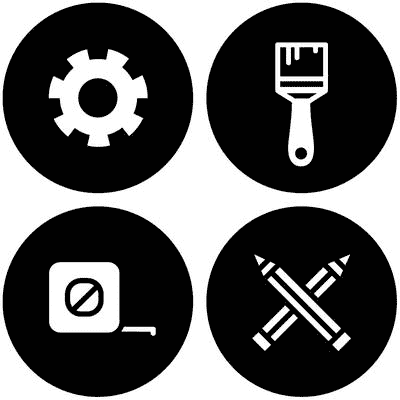

一旦你的应用设计完成，便可进入构建阶段。在开始为 iOS 构建应用之前，你必须首先在苹果公司注册成为开发者，并组建一个开发团队。团队成员将根据其角色拥有各自的状态和权限级别。团队组建完毕并分配好角色后，你就可以开始将你的设计转化为故事板或线框图。但首先，我们来看看是什么让苹果系统如此独特。

### 为苹果而用苹果开发：一个完整的系统

从硬件到软件，从编程语言和操作系统到在线市场，苹果为开发者提供了完整的专有系统，用于为苹果设备设计、开发和发布应用（图 7-1）。

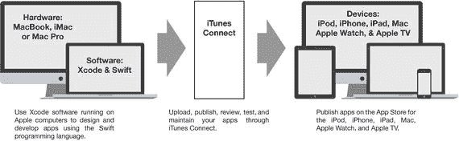

图 7-1. 为苹果而用苹果开发

这与谷歌的系统有着根本区别。在谷歌系统中，操作系统安卓运行在几乎由同样众多制造商生产的数百种设备型号上，并使用非常流行的编程语言 Java，这意味着可以使用任何基于 Java 的工具构建应用。谷歌也生产自己的设备，如 Nexus 和 Pixel，并有自己的应用构建软件 Android Studio，但它绝未对托管在 Google Play 上的应用如何设计和构建进行排他性控制。

我们来看看苹果应用开发和发布系统的组成部分。

#### iOS (http://www.apple.com/ios/ios-10/)

iOS 是苹果为其移动设备（包括 iPhone、iPad 和 iPod Touch）开发的移动操作系统。所有托管在苹果移动设备上的应用都是 iOS 应用。

该操作系统的最新版本是 iOS 10。截至 2016 年 11 月，App Store 上 92%的应用是为 iOS 9 或 iOS 10 设计的。

#### Swift (https://developer.apple.com/swift/)

Swift 是苹果专门为其操作系统（即 iOS、macOS、watchOS、tvOS 和 Linux）开发的编程语言。1.0 版本于 2014 年 9 月首次发布，截至 2017 年 4 月，最新的稳定版本是 Swift 3.1.1。在 Swift 之前，苹果的操作系统是用 Objective-C 编写的，而 Objective-C 本身基于 C 编程语言。Swift 保留了许多 Objective-C 的概念，但设计得更安全、更简洁、更易于使用。2016 年，苹果推出了 Swift Playgrounds，这是一款 iPad 应用，通过交互式、游戏化的界面教授 Swift 编程。

#### Xcode (https://developer.apple.com/xcode)

Xcode 是苹果的 IDE（集成开发环境），旨在为 iOS 系统（包括 macOS、iOS、WatchOS 和 tvOS）进行应用的故事板设计、线框图绘制和原型制作。换句话说，开发者可以使用 Xcode 设计和编码 iOS 应用，然后直接通过 Xcode 将完成的应用提交给苹果进行审核和批准。

### 应用开发与分发流程

开始前，请准备好合适的设备。你将需要一台或多台 iMac、Mac Pro 或 MacBook 电脑进行开发。然后，按照以下步骤为苹果设备构建应用，如图 7-2 所示。

1. 注册 Apple Developer Program。
2. 组建开发团队。团队中的每个成员都会被分配相应的状态、适当的 ID 和证书。
3. 开发团队在 Xcode 上设计和开发应用，从故事板设计和线框图绘制到原型制作，利用 Xcode 的并行可视化设计和代码界面。
4. 当应用的测试版准备就绪后，上传到 iTunes Connect，然后组建内部和/或外部测试团队。
5. 根据测试人员的反馈调试应用并改进设计。
6. 当应用准备好发布后，提交给苹果进行审核。
7. 当应用通过审核并获准发布后，在 iTunes Connect 上发布应用。

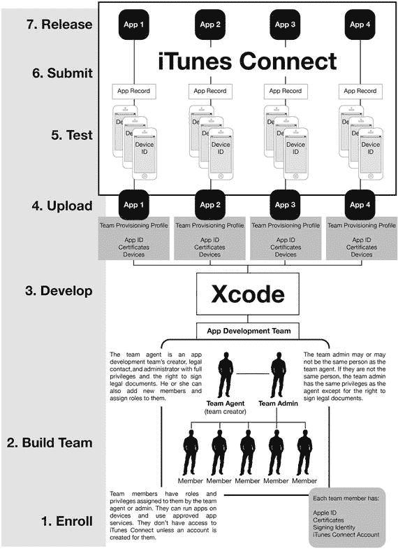

图 7-2. 应用开发与分发流程

在本章和第 8 章中，我们将介绍前三个步骤。在第 9 章中，我们将讨论测试阶段；在第 10 章中，讨论提交过程；在第 11 章中，讨论分发过程。完整流程如图 7-2 所示。

### 注册 Apple Developer Program

只有在 Apple Developer Program 上注册后，您才能在 Apple 系统上开发和分发 App。注册成为开发者需要以下步骤：

1.  在 Apple 网站（[`https://developer.apple.com/`](https://developer.apple.com/)）上创建一个 Apple ID。确保验证您的电子邮件。
2.  同意 Apple 开发者协议。
3.  注册 Apple Developer Program（点击 Apple Developer Program“计划概览”页面右上角的“注册”按钮）。如果您以个人身份注册，将需要提供基本个人信息，例如您的法定姓名和地址。如果您以组织身份注册，则需要提供一个 D-U-N-S 编号，这是一个由 Dun & Bradstreet (D&B) 免费发放的九位数字编号，所有需要与美国联邦政府签约的商业实体都必需此编号以便与 Apple 签订合同。您还需要提供您组织的法律实体状态信息，以及证明您获得组织授权代表其向 Apple 注册的文件。注册 Apple Developer Program 每年需支付 $99.00 美元。一旦您成功注册 Apple Developer Program，您将能够：
   1.  根据平台和会员级别使用各种 App 服务；
   2.  使用您的开发者账户和 `iTunes Connect` 等工具，通过这些工具您可以管理您的团队和 App；以及
   3.  有权通过 App Store、Mac App Store 和 Apple TV Store 分发 App。
4.  下载并安装 `Xcode`。

#### 将您的 Apple ID 添加到 Xcode

您可能还记得前一章的内容，`Xcode` 是一个用于在 Apple 系统上设计、构建、测试和发布 App 的完整软件包。如果您使用其他软件工具绘制了 App 设计的线框图，则必须将该设计转移到 `Xcode` 中。`Xcode` 的一大特色是您可以直接从零开始在 `Xcode` 中启动项目，直接在内部进行布局、线框图和故事板操作，并在组装 App 时将其转换为代码。

要下载 `Xcode`，请点击 Apple 开发者网站上 Xcode 页面（[`https://developer.apple.com/xcode/`](https://developer.apple.com/xcode/)）右上角的“下载”按钮。截至 2017 年 4 月的最新版本是 `Xcode 8.3.2`。

按照说明进行操作。`Xcode` 运行后，将您的 Apple ID 添加到其中，以便您可以作为已注册的 Apple 开发者开始构建 App。您可以通过在 `Xcode` 的“帐户”界面中点击右下角的 `+` 按钮，选择“添加 Apple ID”，然后使用您的 Apple ID 登录 iCloud，将您的 ID 添加到 `Xcode` 中。请按照图 7-3 中的步骤将您的 Apple ID 添加到 `Xcode`。

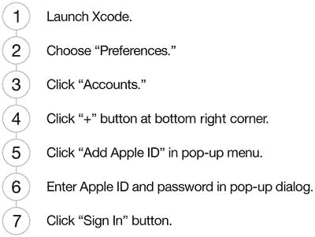

图 7-3. 将您的 Apple ID 添加到 Xcode

#### 组建 App 开发团队

作为开发者，您可能以领导者或成员的身份，扮演不同角色并拥有不同访问权限，成为多个团队的一员。您可以在您的 Apple ID 信息下查看您的团队。

作为团队的创建者，您被称为团队代理人。您可以邀请新成员加入您的团队，并为他们分配不同的角色。您还可以将某个成员设为团队管理员，该角色除了无权签署法律文件外，拥有与团队代理人相同的权限。

您的每位团队成员（包括您自己）都拥有一个 Apple ID、Apple 根据其角色和权限颁发的证书、用于签署 App 的签名标识，以及（如果团队代理人授予他们）他们的 `iTunes Connect` 账户。证书让 Apple 能够知道是谁签署了提交审核或发布的 App，获取证书的最佳方式是通过 `Xcode` 直接申请。

### 标识符

对于您构建的任何 App，每个团队成员都将拥有一个独立的 ID 和证书，这些证书允许他们签署 App 的代码，并根据其访问权限开发、提交和分发 App。连接到 `Xcode` 进行 App 测试的每台设备也将拥有一个独立的 ID。

签名标识是开发者用于对 App 进行代码签名的唯一 ID，这是一个与安全相关的步骤，用于证明是谁创建了 App 的代码，并确认代码自开发者签名后未被修改。

Apple 将配置描述文件描述为“准备和配置 App 以在设备上启动并使用 App 服务的过程”。这涉及到选择您的 App 将运行的设备以及它将使用的服务。您需要从您的帐户中下载一个开发配置描述文件用于该 App，并将其嵌入到 App 包中。

Apple 系统中的团队配置描述文件“允许您团队的所有成员在所有团队设备上对所有 App 进行签名和运行”。要创建团队配置描述文件，您需要连接您想要用于测试 App 的设备，然后选择您的团队成员。创建团队配置描述文件后，您需要将所有签名标识和配置描述文件导出到一个单一文件中，如果您想在另一台计算机上继续开发，则可以移动该文件。

#### 设计并开发 App

现在，您可以通过选择 `文件 ➤ 新建 ➤ 项目`，或单击 `欢迎使用 Xcode` 窗口中的“创建一个新的 Xcode 项目”来开始构建您的 App。执行此操作时，系统会要求您选择要创建哪种类型的 App。有多种模板可供您选择：`主从应用程序`、`游戏应用程序`、`基于页面的应用程序`、`单视图应用程序`、`标签栏应用程序`、`实用工具应用程序` 或 `空应用程序`。

这些模板具有预设计的功能，可帮助您快速设置和构建 App 的结构，您或您的开发者将为您的 App 选择合适的模板。

选择模板后，系统会要求您填写一些基本信息，我们之前已经看过这些信息。您还将被问及是否要使用故事板（建议使用）、是否要使用自动引用计数（建议使用）以及是否要包含单元测试（也推荐使用）。

然后，Apple 会为 App 创建所需的签名标识和配置描述文件。`Xcode` 还会为您的 App 创建一个 App ID，该 ID 可以是单个 App 的显式 ID，也可以是多个 App 的通配符 ID。

系统还会要求您标识您自己或您的组织、您希望用于构建 App 的编程语言，以及该 App 所针对的设备。然后，您将选择保存项目的位置。之后，您就可以创建团队并开发 App 了。

##### Xcode 集成开发环境

在构建应用时，开发者需要访问三个要素：代码、显示屏幕布局和屏幕间连接的应用整体布局，以及在特定设备上的最终运行结果。Xcode 集成开发环境将这些视图整合到一个主界面中：代码编辑器、界面构建器和模拟器。

###### 代码编辑器

顾名思义，Xcode 中的代码编辑器窗口是开发者编写和编辑 iOS 应用代码的地方。编码窗格中的内容会同步反映到界面构建器中相关联的屏幕上，对代码的任何修改、添加或删除都会立即体现在关联的屏幕上。

###### 界面构建器

界面构建器允许开发者使用可视化的资源来设计应用的屏幕，而无需编写代码。Xcode 会自动将所有布局转换为其在 Swift 中对应的代码，这些代码可以在编码窗格（也称为助理编辑器）中进行编辑。

###### iOS 模拟器

在开发过程中的任意时刻，Xcode 都允许开发者通过 iOS 模拟器查看应用在实际设备上的外观和运行效果。可以通过点击 Xcode 界面左上角的“播放”按钮来激活模拟器。

##### 框架

框架是开发者可以通过 Xcode 访问的共享资源。这样，负责不同产品的不同团队就不必每次都重新发明轮子，他们可以通过访问基本任务和功能的资源及解决方案来节省大量时间。框架用于编码应用，以执行显示用户界面、播放媒体、保存密码等绝大多数应用共有的标准功能。

##### 故事板

Xcode 中的故事板以不同方式将应用的所有屏幕整合显示在一起。Xcode 提供了用于表格视图控制器、集合视图控制器、导航控制器、标签栏控制器、页面视图控制器和 GLKit 视图控制器的故事板控制器。这些故事板根据开发者希望查看屏幕的方式以及屏幕之间的连接和转场（图 7-4），以不同的方式组织应用的各种屏幕。开发者也可以选择构建自己的故事板。

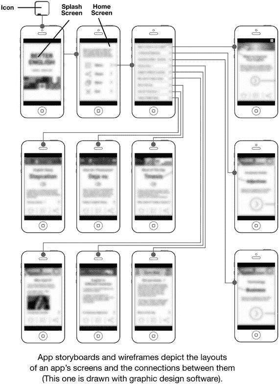

图 7-4. 一个示例应用故事板

##### 原型设计

开发团队使用 Xcode 构建应用原型，这是完整应用的交互式表示，可以在目标设备上查看和测试。这个原型本质上是应用的测试版，接下来将对其进行调试和测试。

### 总结

苹果公司创建了一个完整的系统，拥有相互关联的硬件、软件以及用于应用开发和分发的平台。这使得该公司能够对苹果 App Store 上发布的应用质量拥有完全的控制权。

在下一章中，我们将探讨如何配置应用以进行分发。

