# 配置您的应用


配置应用以进行分发涉及定义与您的应用将使用的框架和服务、以及因此具备的能力相关的重要设置，并通过 Xcode 向 iTunes Connect 提交关于您应用的关键身份信息。

在本章中，我们将详细介绍应用框架（绝大多数应用共有的共享资源）、应用服务（允许应用使用这些资源执行特定功能）以及能力（通过结合框架和服务定义应用能为用户做什么）。

### 配置项目

在选择支持您应用的框架和服务之前，需要在 iTunes 中创建应用的标识和基本信息。以下各节列出了创建应用标识所需的步骤顺序。

#### 创建捆绑包 ID

在应用项目的“通用”类别下的“身份”部分，您将输入一个捆绑包标识符。捆绑包标识符或捆绑包 ID 是应用的唯一名称。它可以包含字母数字字符（A–Z、a–z、0–9）、连字符（`-`）和句点（`.`），并采用反向 DNS 顺序书写（例如，`"com.Company.ProductName"`）。在 Xcode 的开发过程中以及通过 iTunes Connect、iCloud 和苹果服务分发时，都会在不同时刻使用捆绑包 ID 来识别应用。您还需要提交应用的版本号和构建号。

#### 标识您的团队

在您标识了负责开发应用的团队后，Xcode 将创建一个团队预置描述文件，以允许所有团队成员对应用进行代码签名和运行。它还会创建一个与捆绑包 ID 匹配的显式应用 ID，或一个用于多个应用的通配符应用 ID，然后启用应用服务。在这里，您还可以输入应用的版本号和构建号。

#### 输入产品信息

系统将要求您输入产品信息，包括产品名称、组织名称、组织标识符、应用语言以及目标设备。

#### 输入部署信息

在此部分，开发者输入以下信息：部署目标（应用将运行的最低 iOS 版本）；应用的预期目标设备（iPhone、iPad、通用）；期望的设备方向（竖屏、倒置、横屏右、横屏左）；以及状态栏样式（浅色、深色或半透明，并且是固定还是隐藏）。

#### 提交视觉资源

必须作为资源上传到应用包中的视觉资源包括应用图标和启动屏幕文件（或闪屏）。iOS 引用的所有视觉资源都存储在应用构建中，而 iTunes 或苹果 App Store 使用的视觉资源则存储在 iTunes Connect 中。Xcode 会将一组图像（例如各种尺寸或分辨率下的应用图标）存储在资源目录中。

#### 设置架构、基础 SDK 和调试信息

在此部分，开发者定义应用的目标 iOS 设备架构，包括 `armv7` 和 `arm64`。基础 SDK 设置是应用的基础软件级别，建议设置为最高级别，即 `"Latest iOS"` 设置，以便 Xcode 可以在正在调试应用的设备上实施调试。最后，选择允许实现崩溃报告的符号化（将事件回溯到源代码）的适当设置。

### 应用记录

应用记录包含应用的所有信息，这些信息必须在应用上传到 iTunes Connect 进行分发之前提交给苹果。应用记录包含将在应用 App Store 页面上发布的信息，以及在应用分发期间管理应用所必需的信息。

只有团队代理或具有管理员、技术或应用管理员身份的团队成员有权将应用上传到 iTunes Connect。

#### 应用信息

当您在 iTunes Connect 的“我的 App”下创建新应用时，系统将要求您使用已在 Xcode 中创建的身份信息填写相关字段，例如捆绑包 ID、应用名称和默认语言。这些信息会显示在 App Store 部分的“App 信息”窗口中。

可配置的字段还包括用户访问限制、用于在 iCloud 显示集存储数据的设置、本地化信息（如额外支持的语言），以及定价与销售范围设置——这些设置确定了应用将在哪些地区提供，以及应用是按原价销售、提供批量折扣还是私下发布。


### 应用框架

正如我们在前一章所见，框架是开发者可通过`Xcode`访问的共享资源，旨在编码时节省时间和精力。这些框架实现了绝大多数应用通用的标准功能。每个框架都可以被添加到应用中，使其用户能够受益于该框架的功能。在编码阶段通过代码即可将框架添加到应用中。以下各节将讨论与 iOS 设备相关的应用框架。

#### 3D Touch

`3D Touch`允许应用对用户行为做出反应，而不仅仅是识别用户何时按下显示屏；它根据用户按压显示屏的力度大小执行不同的操作。这种`3D Touch`响应能力使用户能够更快地完成任务、在访问内容之前预览内容，并且通常能通过应用做更多事情。

#### 应用扩展

顾名思义，`App Extensions`（应用扩展）允许应用将其功能和内容扩展到其所在设备的整个操作系统中，而不仅仅是一个由图标激活的独立实体。例如，应用扩展可以使应用在社交网络上共享内容、对设备相机中的照片应用特效、发布更新以及提供自定义键盘。

#### Bonjour

`Bonjour`是一个框架，它使应用能够自动发现并连接到本地网络上的设备和服务，无需任何配置要求。

#### CarPlay

`CarPlay`将用户的设备连接到车辆自带的显示屏上，从而使 iPhone 的功能，如播放音乐、使用地图、收发信息和拨打电话，都可以在车内使用。

#### Handoff

`Handoff`是一个框架，它支持功能或活动在不同设备间的连续性，例如允许用户在 iOS 设备上开始一项活动，然后在 macOS 设备（如`Macbook`）上继续进行。它让拥有多个设备的用户能够协同使用这些设备来执行活动。

#### 通知

`Notifications`（通知）框架支持向 iOS 设备上的用户投递本地通知和推送通知。当应用在后台运行时，本地通知会提醒用户与应用相关的变更，有时还会请求用户响应。本地通知包括警告对话框、徽章、横幅消息和锁定屏幕。它们也可以是交互式的，向用户提供与应用相关的多个操作选项，这些操作无需完全启动应用即可执行。本地通知由应用自身安排，并针对已下载该应用的特定用户。例如，用户屏幕上弹出的日历提醒就是本地通知的一个例子。

另一方面，推送通知（或远程通知）并非由应用安排，而是由服务器发送到许多用户设备上。推送通知由应用发布者创建，用于同时与其所有或部分应用用户通信。想要使用推送通知的发布者需要注册`Apple Push Notifications (APN)`服务并生成相关证书。

### 应用服务

Apple 为应用开发者提供了多种建立在框架之上的服务，以增强其应用的能力，并启用单个应用无法完全独立实现的功能，例如支付。

应用的服务和能力是在`Xcode`项目编辑器的`Capabilities`窗口中启用和配置的。

#### Apple Pay

`Apple Pay`使应用用户能够在其所使用的应用内轻松、安全地进行支付和捐赠。

#### CallKit

`CallKit`使应用能够使用手机的原生用户界面进行拨号和接听电话。

#### CareKit, HealthKit, ResearchKit

`CareKit`面向健康相关的应用，使使用它的应用能够收集用户的健康信息。然后，它允许该用户访问这些信息并与他们的医生共享。使用`HealthKit`的应用也能监测用户的健康和活动指标，并作为应用功能的一部分生成健康相关信息。`ResearchKit`旨在为医学研究设计的应用提供数据收集能力；它与`HealthKit`协同工作，以支持复杂的健康相关应用。

#### HomeKit

`HomeKit`使应用能够连接并控制用户家中的设备，包括灯、门、窗户、百叶窗、摄像头和门铃。

#### iBeacon

`iBeacon`旨在支持使用基于位置信息的应用。这些应用连接到启用了`iBeacon`技术的设备（信标），以便向应用用户传达与位置相关的信息。

#### iCloud 和 CloudKit

`CloudKit`使应用能够访问 Apple 基于云的数据存储服务`iCloud`，并包括身份验证、公共数据库、私有数据库和资产存储服务。

#### iMessage

`iMessage`使应用能够在用户聊天时触达他们并进行交互，而无需强迫他们结束对话。`iMessage`应用允许用户在不退出`Messages`的情况下完成诸如支付和共享内容等操作。

#### MapKit

`MapKit`框架使应用能够显示交互式地图和位置信息。

#### SiriKit

`SiriKit`使应用能够与 Apple 的语音激活虚拟助手`Siri`协作。

#### StoreKit

`StoreKit`使应用能够向用户提供各种类型的应用内购买，包括内容、产品、虚拟商品和订阅服务。

#### Wallet 和 PassKit

`Wallet`和`PassKit`允许应用用户管理和使用奖励卡、门票、登机牌和礼品卡。


### 功能

你的应用所使用的框架与服务组合，定义了其功能（即应用能做什么）。作为一种安全措施，Apple 允许开发者仅指定并启用应用所需的服务与功能，从而最大程度降低对应用及其数据进行未授权恶意访问和操作的可能性。

一旦开发者选定了要使用的框架和服务，`Xcode` 便会利用开发团队的代码签名和预置资源，根据 App ID 向相关应用授予权限。每个应用关联的功能在默认情况下是关闭的，若你的应用需要使用，则可以将其开启。iOS 支持的功能包括：`App Groups`、`Apple Pay`、`Associated Domains`、`Background Modes`、`Data Protection`、`Game Center`、`HealthKit`、`HomeKit`、`CloudKit`、`iCloud Documents`、`iCloud: Key-Value Storage`、`In-App Purchase`、`Interapp Audio`、`Keychain Sharing`、`Personal VPN`、`Push Notifications`、`Wallet` 和 `Wireless Accessory Configuration`。我们来逐一仔细了解这些功能。

`App Groups` 允许归组在一起的应用共享数据。`Apple Pay` 前面已经介绍过。`Associated Domains` 允许应用连接到一个网站（主要用于深度链接）。启用 `Background Modes` 后，如果你指定了特定任务（包括播放媒体、更新应用位置、处理 VoIP 通话、从 Newsstand 下载内容、通过 `Background Fetch` 保持内容更新、以及与外部配件通信），则允许应用在后台执行这些特定任务。`Data Protection` 使应用能加密其存储的数据，作为防止未授权访问的额外保护层。`Game Center` 是 Apple 创建的社交游戏网络，帮助玩家追踪分数，邀请他人加入，并参与多人游戏。

`HealthKit`、`HomeKit` 和 `CloudKit` 前面已经介绍过。`iCloud Documents` 和 `iCloud: Key-Value Storage` 属于 iCloud 权限的一部分，允许你的应用在云端存储文档和键值对。顾名思义，启用 `In-App Purchases` 允许发布商在应用内部销售功能、数字内容和产品。`Interapp Audio` 允许一个应用生成的音频被其他应用使用。`Keychain Sharing` 允许应用与其他应用共享密码、信用卡号及其他信息。`Personal VPN`（虚拟专用网络）允许应用在其安装的设备上提供 VPN 服务。`Push Notifications` 允许应用向设备所有者发送包含更新或新内容信息的推送通知。`Wallet` 前面已经介绍过。最后，`Wireless Accessory Configuration` 允许应用与配件进行通信。

#### 附加配置

如果你的应用使用了 Apple 服务，可能需要额外的配置，例如对于 `In-App Purchases`，需要创建购买项；定义其类型、特性、视觉元素、价格和可用性；并在这些购买项可供应用用户使用之前，提交给 Apple 审核。这很可能是贯穿应用整个生命周期的持续过程，并与你的营销、增长和留存策略紧密相关。

`Game Center` 是另一个可能需要额外配置信息的服务。如果你的应用是游戏，则需要将其连接到 `Game Center`，以便玩家能够提交分数、查看排行榜并交换游戏信息。

#### 应用瘦身、应用切片与按需资源

根据他们使用的设备，下载你应用的用户可能无法使用你应用的所有特性和功能。`App Store` 和 iOS 只会下载执行下载操作的设备能够使用的那些功能，从而减小应用的体积并优化用户体验。这被称为**应用瘦身**。

`App Store` 还会根据你的应用所支持的设备组来创建应用的变体。例如，它会使用你在 `Xcode` 中指定的目标设备和构建的资源目录，为 iPad 创建使用适合其尺寸和分辨率的图片的变体，同时省去为 iPhone 准备的资源。这被称为**应用切片**。

最后，为了通过较小的应用体积和较快的下载速度进一步优化用户体验，应用可以被设计为仅在预期用户将要访问时才下载资源，例如游戏的附加关卡或其他类型的、直到用户请求时才需要提供的内容。这被称为**按需资源**。

### 总结

配置你的应用，核心在于功能和效率——定义你的应用能做什么，确保其尽可能高效地运行，并确保它能访问所需的服务，排除那些不需要的服务。一个配置得当的应用，是采用专业方法进行应用开发的可靠标志。

## 9. 测试你的应用


作为其完整应用开发和分发系统的一部分，Apple 允许发布商在提交审核之前进行测试。尽管测试不是提交的强制要求，但在提交或发布之前全面测试应用始终是一个好主意。

为什么全面测试应用是明智之举？无论开发团队多么优秀，应用内部总有可能存在一个或多个设计或编程缺陷。在 Apple 审核你的应用或用户使用之前，发现并修复或移除这些缺陷至关重要。

在你提交应用进行审核后，Apple 无论如何都会对其进行彻底检查，如果发现缺陷，应用将被拒绝。你将不得不返回去修复缺陷，然后重新提交应用，这会带来种种失望以及宝贵时间和资源的损失。

如果你的应用通过了审核但仍存在缺陷（这不太可能，尤其是重大缺陷），它们最终会被失望和愤怒的用户发现，届时他们会用差评和负面宣传来惩罚你。既然你为应用创造了积极且吸引人的用户体验付出了如此多的努力，为何要因为忽视在发布前完善应用的机会而冒着毁掉一切的风险呢？

简而言之，测试至关重要，不容忽视。在 `TestFlight` 上测试应用涉及以下阶段：

1.  将测试构建上传到 `iTunes Connect`。
2.  为 Beta 测试创建 iTunes Record。
3.  提交应用进行 Beta 审核。
4.  创建测试团队，邀请测试者。
5.  测试者使用测试应用并提供反馈。
6.  收集反馈以修复和改进你的应用。
7.  开发用于发布的最终构建。
8.  在发布前提交最终构建进行审核。

### 上传测试构建

测试阶段的第一步是将应用的 Beta 版本或测试构建上传到 `iTunes Connect`。这可以直接从 `Xcode` 完成，也可以通过 `Application Loader` 工具完成，该工具可通过 `Xcode` 中的 `Open Developer Tool` 按钮访问。

如果你的应用包含应用内购买，则通过 `Application Loader` 工具上传应用构建是相关的，因为它允许开发者详细创建和配置应用所有可用的应用内购买项目，包括它们的显示名称、描述、价格以及可用的起止日期。

一旦测试构建被上传，它就会显示在开发者 `iTunes Connect` 账户的 `Activity` 部分。


### 创建用于 Beta 测试的 iTunes 记录

与所有应用一样，此应用需要一条 iTunes 记录，但用于 Beta 测试版本所需的元数据远少于最终版本，因此流程更简单、更快捷。然而，如果外部测试人员参与测试过程，iTunes 记录必须包含以下内容：测试内容说明、应用描述、用于反馈的电子邮件地址、营销和支持 URL、应用隐私政策 URL，以及开发者的联系信息。

### 提交应用进行 Beta 应用审核

如果某个应用要提供给外部测试人员进行测试，Beta 版本必须经过 Beta 应用审核。要通过审核，它必须像最终版本一样遵守《App Store 审核指南》。因此，即使作为 Beta 版本，应用在设计或编程方面也必须在进入测试阶段前处于非常好的状态。

### 创建测试团队

下一步是邀请内部和外部测试人员来测试 Beta 版本。

要邀请内部测试人员加入测试团队，只需在 `TestFlight` 中输入他们的电子邮件地址。对于外部测试人员，提供电子邮件和全名即可。这些测试人员随后会收到一封邀请他们加入测试团队并下载 `TestFlight` 的电子邮件，这是他们用来测试应用并提交反馈的 iOS 应用。最多可以邀请 2000 名外部测试人员来创建测试团队，与内部测试人员不同，他们无需拥有 Apple ID 即可参与。

### TestFlight Beta 测试

iOS 应用使用 Apple 的 `TestFlight` Beta 测试工具进行测试。`TestFlight` 允许应用发布者同时在最多 25 名内部测试人员和最多 10000 名测试人员中测试多达 100 个 iOS、watchOS 和 tvOS 应用。内部和外部测试人员可以随时测试最多 100 个应用，每个测试应用持续超过 90 天。

内部测试人员如果拥有开发者或管理员权限则可以加入测试团队，每人可以同时测试最多 30 个应用，而非开发团队的外部测试人员只需通过电子邮件邀请即可加入测试过程。

### 使用 TestFlight 应用测试 Beta 应用

在测试应用 Beta 版本之前，测试团队的每位成员，无论是内部还是外部，都必须在其计划测试 Beta 应用的每台设备上从 App Store 下载免费的 iOS 版 `TestFlight` 应用。当测试人员收到并接受测试应用的邀请后，他们可以将 Beta 版本下载到自己的设备上。

`TestFlight` 应用允许测试人员同时处理多个应用。对于每个应用，`TestFlight` 会显示应用描述以及发布者提供的“测试内容”指南。

测试人员需要向开发者提供关于其用户体验以及他们可能发现的任何缺陷的反馈。通过按下应用详情视图上的 `Provide Feedback` 按钮来完成此操作，该操作会为此目的打开一个电子邮件窗口。测试人员还可以使用 `TestFlight` 中的应用详情视图来取消测试人员身份并退出测试组。

### 利用反馈开发最终版本

来自测试团队的反馈将用于识别应用中的缺陷和错误，并为应用最终版本的设计和编码提供信息。

测试人员的反馈以电子邮件形式发送到相关测试信息中 `Feedback E-mail` 字段指定的地址。

开发者利用测试人员的反馈来改进应用、修复错误和缺陷，并上传新版本。他们会邀请测试人员测试这些新版本，直到最终版本准备好提交审核为止。

### 总结

测试是开发过程中的一个重要阶段，应给予其应有的重视。应用发布后，错误、缺陷和崩溃将对应用采用率和用户留存率产生灾难性影响，因此测试阶段是消除这些问题的时机。

当然，最后一步是提交应用的最终版本进行审核。我们将在下一章中介绍提交流程。

## 10. 提交你的应用


一旦你的应用准备发布，它需要获得 Apple 的批准才能上架 App Store，而要获得 Apple 的批准，它需要经过应用审核。在提交之前，了解 Apple 对应用发布批准非常严格是有好处的；审核过程至少需要两周。Apple 会彻底检查你的应用，并可能因多种原因拒绝应用。被拒绝是一次非常痛苦且代价高昂的经历，无论是金钱还是浪费在试图找出导致发布失败的缺陷上的时间——更不用说对团队士气的影响了。简而言之，应用在提交时应完美运行并满足 Apple 的所有要求，因此在点击 `Submit for Review` 按钮之前，请彻底测试并确保它符合要求。

### 避免应用被拒

根据 Apple 的说法，应用被拒绝的最常见原因如下：

* **崩溃**。你的应用持续崩溃并存在错误（这并不意外）。如果你的应用有崩溃倾向，它将永远不会向用户开放。应用需要不断测试直至所有错误被修复才能提交。
* **无效链接**。你有指向无效页面的链接。确保应用内所有链接的连通性，并确保有指向用户支持的链接（包含准确的联系信息），以及指向你应用隐私政策和所有免责声明的链接。
* **占位内容**。如果你的应用中有占位文本或图像，则说明它尚未最终完成。确保你的所有应用内容都已定稿并可用。
* **信息错误**。信息不完整、具有误导性或不准确。这包括 Apple 全面审核你的应用所需的所有信息，例如你的联系信息、特殊访问的用户名和密码（例如用于演示登录过程的演示账户），以及使某项功能正常运作所需的设置。
* **误导性描述**。你的应用描述及其所有相关视觉效果需要准确传达应用的功能和特性；否则，它们将被视为具有误导性，并导致你的应用被拒绝。
* **设计问题**。Apple 为开发者和设计师提供了设计标准和指南，以确保 App Store 上的所有应用都具有一致的良好用户界面设计。要获得批准，你必须遵循这些指南。
* **未格式化的网页内容**。当应用访问未针对 iOS 格式化的网页内容时，这会降低用户体验质量。
* **相似应用**。彼此非常相似且可以轻松合并到一个应用中的应用很可能会被拒绝。
* **缺少广告功能**。你的应用需要一个广告标识符 (`IDFA`) 来展示广告。如果你提交了 `IDFA`，但你的应用缺乏正确展示广告的功能，它将被拒绝。
* **缺乏持久价值**。如果某个应用与其类别中的类似应用相比，无法为其用户提供太多使用价值，Apple 将拒绝该应用。


### 应用提交流程清单

在提交应用以供审核之前，请仔细核对以下清单，确保您对每一项问题都给予肯定回答。

- **测试**。应用是否经过充分测试，足以消除所有崩溃和错误？
- **准确性**。应用中的所有信息（包括您的联系信息）是否均为最新且准确无误？
- **后端服务器**。后端服务是否已准备就绪，并可在审核期间正常访问？
- **支持信息**。提交通道是否包含了所有可用功能的完整支持信息？
- **合规性**。应用是否遵守了苹果公司的所有设计和技术规范？
- **配置项**。您是否已配置好应用所需的所有设置？
- **应用大小**。应用的大小是否在苹果规定的限制范围内？
- **应用记录**。您是否已核实应用在 Game Center（若为游戏）和 iCloud Display 设置（允许多个应用访问相同数据文件）中的所有属性，并完成了应用记录的填写，包括类别、关键词、捆绑包 ID 以及 App Store 版本号？这些属性在应用提交审核后将无法更改。
- **应用沙盒**。您是否为应用配置了应用沙盒？应用沙盒出于安全目的提供访问控制，它限制应用仅能访问其正常运行所必需的数据、系统资源和及服务。它虽不能提供绝对安全的防护，但能在应用被攻破时显著减少损害。详见图 10-1。

    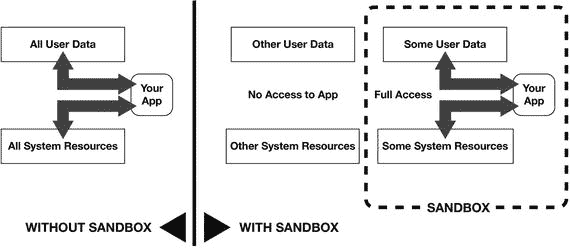

    图 10-1. 应用沙盒

- **服务**。您是否已配置好应用将使用的各项服务？请确保应用将使用的所有苹果应用服务均配置正确且运行正常：Apple Pay、CallKit、CareKit、CloudKit JS、HealthKit、HomeKit、iBeacon、iCloud 与 CloudKit、iMessage、应用内购买、地图与定位、ResearchKit、SiriKit、Wallet 以及 PassKit。

#### 立即提交！

当您准备好提交应用时，请遵循以下流程：

1.  **指定应用的构建版本**。一个应用可以向 App Store 上传任意数量的构建版本，但同一时间只能有一个版本与应用关联，而该版本就将是被提交审核的版本。因此，您需要上传构建版本，并从应用的可用版本列表中选择它。这被称为当前构建版本。
2.  **满足出口合规法规并指定加密特性**。您的应用将托管在位于美国的苹果服务器上，这意味着它将受美国出口法规的约束。iTunes Connect 会向应用发布者询问有关应用所需加密级别的问题，并在相关情况下要求发布者提交相关文件。如果您未使用加密，您可以在开发应用时提交出口合规及加密相关信息，这样在提交时就不必再经历此流程。您可以通过 Xcode 提交相关文档，待其获批后，您将收到一个密钥，可随您的构建版本一同提交。
3.  **确认使用第三方内容的权限**。如果您的应用将托管第三方内容，您必须确认您拥有在应用可供下载的所有地区使用该内容的权利。
4.  **确认使用广告标识符**。广告标识符是为每台 iOS 设备创建的独有 ID，用于两个目的：在您的应用内显示广告，以及将安装和应用内操作归因于该设备。
5.  **指定发布时间**。如果您作为发布者出于任何原因不希望应用在获批后立即自动发布，而更希望等待特定时间，您可以指定一个获批后的“不早于”发布日期。您也可以选择随时手动发布应用（例如，与您的营销活动协调在特定时刻发布）。
6.  **点击“提交以供审核”**（位于应用“应用详情”页面的 App Store 部分，页面右上角）。应用状态将变为“等待审核”。
7.  **关注审核状态**。您的应用版本的状态分为三大类，由关联状态指示器的颜色定义：红色、黄色或绿色。红色状态指示器意味着应用因特定原因被拒绝，或发布者需要在应用获得 App Store 批准前修改某些内容。以下状态以红色显示：被拒绝（应用因未能满足验收标准而被拒绝）、元数据被拒绝、已从销售中移除、二进制文件无效、开发者已拒绝（开发者将构建版本从审核中移除）、开发者已从销售中移除（开发者将应用从审核中移除）。黄色状态指示器意味着应用正处于由苹果或应用发布者正在实施的流程中。以下状态以黄色显示：准备提交、等待审核、正在审核、待定合同、等待出口合规、待开发者发布、正在为 App Store 处理、以及待苹果发布。绿色状态指示器意味着您的应用已完全获批，并可供分发。
8.  **等待**。如果您的应用被拒绝，您作为发布者将会收到拒绝原因的通知。苹果设有“解决方案中心”，您可以联系该中心以获取更多信息和额外指导。

在下一章中，我们将探讨如何监控应用的进展以及收集用户与您应用交互的数据。

### 总结

应用提交需要细心和耐心。在提交前确保一切就绪，通过应用审核便会轻而易举。然后，您就可以专注于发布后的活动，例如监控应用的进展和收集用户如何与您的应用交互的数据，这些内容将在下一章中介绍。

## 11. 分发您的应用


### 应用分发方法

应用分发是指使应用可供下载的过程。iOS 应用的发布者有三种分发方式可选：App Store、企业版和 Ad Hoc。

#### App Store

此方法涉及将您的应用发布到 App Store，并向任何人提供下载到其设备的功能。这是绝大多数应用发布者最常用的方法。如果您像大多数发布者一样以盈利为目的进行开发，这是一种合适的方法。App Store 拥有市场营销和金融交易系统，可促进应用的营销和销售流程。

#### 企业版

顾名思义，企业应用分发是指公司向其员工内部发布应用的过程。此方法对于希望使用应用改进工作流程的公司来说很受欢迎；例如，为营销团队创建一个销售报告应用。下载企业应用的设备数量没有限制。

这种分发方式的费用为每个企业每年 299 美元，并需要其自己的特殊分发渠道，例如一个网站。企业计划的订阅者必须提供证据，证明其拥有代表公司签署具有约束力协议的法律权利。

#### Ad Hoc

Ad Hoc 分发主要用于开发阶段的测试目的，因为它仅限有限数量的设备使用，并且只对拥有开发者帐户的用户开放。单一 Ad Hoc 分发许可证有效期为 90 天，最多可用于 100 台设备。与企业版方法一样，此方法需要其自己的分发渠道。


### 归档与上传应用

分发流程始于将应用上传至 `iTunes Connect`，应用将在此进入归档状态。但在用户能够下载并使用应用之前，需要先对其进行验证；换句话说，需要检查它是否正确配置以在 App Store 上分发。让我们更详细地了解这一流程。

#### 创建归档

在将应用上传至 `iTunes Connect` 之前，你需要创建一个归档，该归档将被存储并在 App Store 上线前进行验证。无论你选择哪种分发方式，这一点都适用。为此，必须首先在 `Xcode` 项目编辑器的 `Product ➤ Scheme ➤ Edit Scheme` 窗格中检查归档方案设置。这些设置会根据应用的性质而有所不同。然后，选择 `Product ➤ Archive` 为你的项目创建一个归档。

#### 在 iTunes Connect 上验证应用

在 `iTunes Connect` 上验证项目，涉及确保应用已针对 App Store 进行了正确配置。当应用上传到 `iTunes Connect` 时以及上传之后，都会执行验证测试。

要验证一个归档，请从 `Xcode` 的 `Archives` 管理器列出的归档中选择它，然后点击右侧窗格中的 `Validate` 按钮。此时会弹出一个窗口，显示应用的二进制文件、授权和配置文件。点击弹出窗口右下角的 `Validate` 按钮。`Xcode` 会将归档上传到 `iTunes Connect` 以运行验证测试。

#### 将应用上传到 App Store

当你的归档通过验证测试后，你可以点击 `Xcode` 窗口右侧窗格中的 `Upload to App Store` 按钮来上传归档。在出现的弹出窗口中，勾选“为你的应用包含应用符号”选项，以便你的应用能够向你发送崩溃报告。如果你希望能够在 App Store 中更新应用而无需每次都提交新版本以供审核，请勾选“包含 bitcode”选项。

当你点击弹出窗口右下角的 `Upload` 按钮时，`Xcode` 会将归档上传至 `iTunes Connect` 并再次运行验证测试。

### 你的应用产品页面

你的应用在 App Store 中的产品页面是应用与用户之间的第一个真正接触点，而你所有的营销渠道可能都会将潜在用户引导至此。因此，这个页面设计精良至关重要，这样才能最大化应用在搜索中的可发现性，以及对访问者的吸引力。

在此，访问者能获取决定是否下载你的应用所需的所有信息，并且他们会在几秒钟内做出决定。作为发布者，你的职责是确保访问者不会因糟糕的设计、拼写错误或其他问题而却步。你要让他们在最初的几秒后仍然驻留，并决定尝试你的应用。

你的应用在 App Store 中的产品页面将展示所有吸引访问者的关键视觉和文本信息。这是你第一次全面的营销“推广”，旨在说服访问者下载应用。在 App Store 页面上，访问者将看到你的应用名称、图标、价格、年龄分级、评分星级、预览视频和海报帧（搜索结果中显示的视频静态画面）、屏幕截图、描述、以及“新内容”相关信息，还有发布公司或个人的名称、应用类别、最后更新日期、应用版本和应用大小。

在创建你的 App Store 页面时，你还需要提交关键词，这些是与你的应用相关的词语，有助于提升应用的可发现性并决定其在 App Store 搜索中的排名。苹果对关键词设置了`100`个字符的限制，并对它们进行审核，以确保其不违反规定。

更多关于关键词的信息，请参见第`12`章“营销你的应用”。

### 管理你的应用和团队

作为应用发布者，你将通过 `iTunes Connect` 来管理你的应用及所有相关的财务活动。如我们所见，通过 `iTunes Connect` 你可以验证归档、上传应用并进行测试分发、在 App Store 上营销和分发应用、创建开发团队以及为每个成员分配角色。

在应用发布后，你将使用 `iTunes Connect` 将应用替换为新版本、根据营销策略更改应用在 App Store 中的元数据、创建和销售应用内购买，以及开展商业活动，例如签署商业合同、进行财务交易和生成财务信息。你还需要管理你的团队、邀请成员、为他们分配角色并签署合同。

随着你的应用发展为一项业务，开发者将主要与 `Xcode` 打交道，只有涉及应用业务方面的人员才需要访问 `iTunes Connect`。因此，控制团队中谁在 `iTunes Connect` 上拥有哪些访问权限非常重要。例如，如果你有一名营销经理，他或她能够修改应用元数据或访问分析数据或财务报告是合乎逻辑的。

通过为不同的团队和成员分配权限和角色，团队代理可以控制对 `iTunes Connect` 的不同级别的访问权限。一些团队成员拥有非常具体的头衔和相关权限。例如，具有 `Admin` 角色的成员拥有除签署合同之外的所有权限。`App Manager` 拥有与管理应用相关的权限：包括创建和更新应用以及管理测试流程。被分配了 `Developer` 角色的团队成员，拥有与应用开发技术方面相关的权限，例如处理应用构建和测试人员相关事宜。

### 管理你的账户

苹果要求所有应用都必须进行代码签名，这可以确认提交给苹果的所有代码均由注册开发者创建，并且不包含任何恶意内容。苹果要求使用其系统的所有人员、设备以及在其上创建的任何代码，都必须以 ID 或附加证书/签名的形式拥有唯一的签名。此要求有两个目的：安全性和质量。

在苹果系统上创建应用时，你需要在注册过程中或开发过程中创建签名身份、证书、钥匙串、标识符和配置文件。你还需要将用于测试的设备添加进来，方法是向你的账户中添加测试设备的设备 ID。

#### 签名身份

在苹果系统上创建代码的开发者，会将其签名身份附加到该代码上，即对应用进行代码签名，以此证明他或她是最后编辑该代码的人，并且自那以后该代码未被修改过。

签名身份是公钥和私钥的组合，通过 `Keychain Services API` 存储在团队成员的钥匙串中。被授权的团队成员使用他们在 `Xcode` 中创建的签名身份，以及存储在其账户中的中间证书，对应用进行代码签名。

#### 证书

证书用于验证团队成员身份并定义他们在团队中的状态。一个团队包括一个代理，以及拥有 `Admin`、`Developer` 或 `Member` 身份的成员。

具有 `Developer` 身份的团队成员会由拥有 `Agent` 或 `Admin` 身份的团队成员签发一个开发证书，这允许该开发者将任何他们已代码签名的应用部署到设备上。拥有分发证书的团队成员有权将应用提交到 App Store。分发证书也由拥有 `Agent` 或 `Admin` 身份的团队成员创建。

团队成员钥匙串中的中间证书，用于确认颁发给该成员的证书是由证书颁发机构签发的。


### 钥匙串

钥匙串是应用开发团队中某位成员所拥有的密钥和身份信息的集合。这些密钥定义了团队成员的状态、权限以及他们在应用项目不同方面的访问级别。

### 标识符

标识符是由数字、字母和符号组成的唯一组合，除了标识你和你所有的团队成员之外，还能唯一标识你在 Apple 系统中创建的应用以及用于测试的设备。例如，你开发的每个应用都有一个`app ID`与之关联。如果该`app ID`是显式的，它将完美匹配应用包（app bundle）的名称。如果是通配符 ID，它将标识一个或多个应用。

创建`app ID`后，开发者需要选择应为该应用启用哪些服务。可用的服务包括：应用组（App Groups）、关联域名（Associated Domains）、数据保护（Data Protection）、游戏中心（Game Center）、HealthKit、HomeKit、无线配件配置（Wireless Accessory Configuration）、Apple Pay、iCloud、应用内购买（In-App Purchases）、应用间音频（Inter-App Audio）、钱包（Wallet）、推送通知（Push Notifications）以及 VPN 配置与控制（VPN Configuration & Control）。这些服务在第 8 章“配置你的应用”中有详细说明。

### 配置文件

配置文件通常由开发者创建，用于标识团队成员以及与应用项目或应用生命周期中特定阶段相关联的设备。配置文件分为两种类型：开发配置文件（development provisioning profiles）和分发配置文件（distribution provisioning profiles）。分发配置文件包括临时配置文件（ad hoc provisioning profiles）和商店配置文件（store provisioning profiles）。

开发配置文件在开发阶段将团队成员和设备分组。在分发阶段，当上传应用包进行测试时，`Xcode`会根据请求创建临时配置文件；而当应用上传到 App Store 时，商店配置文件用于标识授权的团队成员。

### 设备

应用发布者可以将设备添加至其账户，主要用于测试目的。每个为测试或其他目的注册到账户的设备都有一个唯一的 ID 与之关联，称为唯一设备标识符（Unique Device Identifier），即`UDID`。

### 应用性能与分析

当你的应用在 App Store 发布后，你将致力于管理和优化应用的性能，无论是技术层面还是财务层面。

#### 崩溃报告

应用发布者最关心的问题首先是确保应用不会崩溃——如果崩溃了，则需要修复代码。为此，你需要了解你的应用实例何时、如何以及为何崩溃，以及发生在哪些设备上。你需要崩溃报告来实现这一点。

iOS 应用的崩溃报告由 Apple 的崩溃服务生成，该服务会根据应用用户同意与 Apple 共享的数据，生成记录应用崩溃所有必要细节的崩溃日志。

崩溃报告将告知你应用代码中发生崩溃的位置，以及在特定时间段内发生崩溃的设备数量。崩溃报告非常有帮助，能协助你（作为发布者）在应用发布前识别其中的错误和问题，以便及时修复，并向市场发布一个可靠、没有 Bug 的应用。

崩溃服务最早会在应用在 App Store 发布后的三天后开始生成崩溃报告。要理解一个崩溃，开发者需要查看与之相关的源代码，这可以通过在项目中打开崩溃日志来完成。点击`Open in Project`按钮，将在调试导航器中显示源代码以及与崩溃相关的具体代码行。

#### 分析与财务报告

一旦你的应用进入 App Store，Apple 会为其生成关于使用情况和盈利能力的非常详细的分析数据。拥有管理员、财务或销售身份的团队成员可以在`iTunes Connect`主页上查看应用分析数据。

`iTunes Connect`上的应用分析界面提供了详细的应用使用情况和销售数据，并允许你根据营销活动目标对这些数据应用筛选条件。

在销售方面，你可以查看应用销售、应用内购买、总销售额以及付费用户的收入数据。在使用情况方面，你可以查看安装在设备上的应用实例数量、用户启动的应用会话次数、一段时间内（包括过去一个月）安装了你应用的活跃设备数量，以及应用崩溃的原因和频率。这些数据能让你深入了解用户参与度。

应用分析还会生成留存报告。这些报告通过详细的图表告诉你应用的使用情况如何随时间变化。

#### 财务报告

`iTunes Connect`还利用分析数据生成不同类型的财务报告，供你下载。这些报告分为两大类：销售与趋势（Sales and Trends）以及付款与财务报告（Payments and Financial Reports）。在每个类别中，选择你需要报告的财政月份和地区，然后点击`Create Reports`。一个下载链接将允许你下载所请求的报告。

### 总结

将应用发布到市场是应用生命周期中一个非常激动人心但也非常敏感的时刻，因为最小的失误都可能导致整个流程脱轨。勤勉可以帮助你避免沮丧，并且如本章所示，成功发布一个应用远不止在某个地方按下`Publish`按钮那么简单。从性能监控的角度来看，发布后的时期至关重要，因为你急于想知道应用如何被用户接受，以及哪些技术或其他方面的问题可能阻碍你的发展。

## 12. 营销你的应用


本章是你应用迈向成功之路上的一个重要里程碑。这是因为在本节之前的所有章节中，应用都是作为想法、开发中的产品或等待审核批准的产品来讨论的。从现在开始，我们通常会将应用视为已完全开发好、可供下载或购买的产品。

然而，正如你将看到的，营销实际上在发布之前就开始了，并且是应用设计和规划阶段非常重要的一部分。对于专家来说，应用的概念在一定程度上需要通过考虑其能否有效向目标受众营销来验证。发布前建立兴趣的营销阶段也是应用成功发布的关键，但大多数情况下，营销自然会成为发布后的活动，因为你需要创造动力并建立你的受众群。你将不断寻找新用户，管理现有用户，并通过找出那些弃用的用户是谁、他们想从你的应用中得到什么、如何以及在何处接触他们、以及什么优惠最能吸引他们，来召回他们。

### 营销速成

一旦你的应用在应用商店发布，你就需要支持和推广它，推动其下载量并产生收入。正如我们在本书开头所看到的，营销即一切，一切皆营销。让我们再次审视这两个原则。

#### 营销即一切

简而言之，这意味着营销将是决定你的应用有多成功的因素。即使是一个围绕好点子精心设计的应用，如果没有你的帮助，也走不了多远。巧妙的营销是帮助你的应用在应用商店中脱颖而出并推动下载的关键。


#### 一切皆与营销有关

这实质上意味着，与你的应用相关的一切——从应用图标的设计、`App Store`页面和你的营销活动；应用加载的速度；关卡结构（针对游戏）；内容；色彩搭配；社交媒体的分享功能；它使用的服务；以及它执行的功能——几乎应用的每一个方面都围绕着确保用户喜爱它，并愿意帮助你推广它。而在这方面，你确实面临着激烈的竞争，如图 12-1 所示。

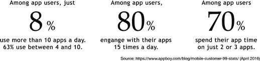

图 12-1. 应用使用统计数据

这就是你应该如何看待营销的基础：营销就是一切，你将随时随地、尽你所能地进行营销。既然你打算用一切可能的方式来推广你的应用，那么让我们来看看所有可用的选择——所有营销渠道。你应用的成功取决于两个因素：应用本身的质量以及你营销的效果。同样，即使是一个出色的应用，没有营销也不会走得太远，但出色的营销也救不了一个设计糟糕的应用。

任何业务的成功都在很大程度上依赖于良好的营销，而在应用业务中这一点尤为突出（图 12-2）。应用通过线上和线下渠道进行营销，每个渠道要么在特定时刻使用，比如新闻稿或正式发布；要么按特定时间间隔使用，比如每周向邮件列表发送新闻简报；要么在应用的整个生命周期内持续使用，比如`AdWords`或 Facebook 广告宣传活动。

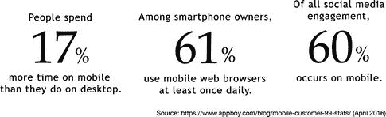

图 12-2. 应用互动统计数据

有效的营销是一门精妙的艺术，营销活动的效果将是决定你应用盈利能力和商业成功的两个关键因素之一（另一个是收入）。应用营销在不断发展，新的原则、策略和方法层出不穷，因此与时俱进很重要。幸运的是，有许多出色的应用开发和营销公司，如`Marketo`、`Appsee`、`Buzinga`和`Localytics`，它们不断提供大量免费资源，你可以利用这些资源将你的营销技巧磨练到专业水平。你可以在本书末尾找到这些资源的链接。

### 应用营销：关键原则

既然你的应用已经上线应用商店，你必须考虑如何尽你所能地支持、培育和推广它。你的应用现在比以往任何时候都需要更多关注。

#### 营销早在发布前就已开始

如果你认为营销是从应用发布那一刻才开始的事情，那你就大错特错了。如果在发布时（甚至发布前）你的营销策略尚未到位并全面运作，你就已经失去了宝贵的时间和机会。一场营销活动需要时间才能产生预期效果，所以如果你的应用在零动力的情况下发布，并等待动力逐渐积累，你很可能已经输了。

`牵引力`是应用在发布时就需要具备的东西，而不是在发布后才去构建的。作为发布者，你有责任确保你的应用一炮而红，获得大量媒体关注，引发社交媒体热潮——这些都是你营销活动的一部分——并从第一天起就获得海量下载。你如何做到这一点呢？通过将你的营销活动启动时间与设计和开发阶段的特定时刻对齐，这样你就能拥有一支渴望试用你的应用并分享他们想法的用户大军。

在应用的设计和开发阶段，你可能会通过搭建一个迷你网站或社交媒体页面，并使用广告活动来测试用户反应和征求反馈，以此验证你的应用概念。这是从验证阶段过渡到主动营销阶段的绝佳方式。

社交媒体是开始你发布前营销活动的好地方。为你的应用创建一个社交媒体身份。向人们介绍应用的进展，并允许人们分享他们的看法和提供反馈。创建简短的调查，询问人们希望在你的这类应用中看到哪些功能。邀请感兴趣的人测试测试版。创建博客或视频日志，让人们关注应用的进展。如果你的发布前营销行之有效，那么当你的应用接近发布时，你将拥有一大群 Facebook 好友或 Twitter 粉丝，他们将为你提供成功所需的宝贵动力。

#### 每个应用都有自我营销机制

你的应用拥有内部营销机制，你可以利用这些机制来最大化其传播性并推动下载。其中之一是让用户有机会在社交媒体上与朋友分享他们使用你应用的体验。这是一个不应被浪费的绝佳营销渠道，尤其是因为它还是免费的。免费营销将大大有助于降低你的`客户获取成本` (`CAC`)，这是一个影响应用财务可持续性的非常重要的指标。

另一个内部营销机制是交叉推广，即在一个应用中使用推送通知和插屏广告来推广另一个应用。这适用于在市场上拥有多个应用的发布者，是一种非常有用的免费营销机制，也能降低你的整体营销成本。

如果你是一个聪明的营销者，你不会单打独斗地做所有营销，而是会让你的用户为你推广应用。最好的营销团队是一支由满意的用户组成的军队，他们在社交媒体上向朋友热情推荐你的应用，鼓励朋友和同事下载，并给你五星好评。最重要的是，所有这些他们都会免费为你做！从这个意义上说，建立强大的用户支持系统和反馈循环，根据用户反馈定期更新应用，并且通常不遗余力地让用户满意，将是你将采用的最重要的营销策略。

#### 自动化和个性化你的营销活动

将你的营销活动视为一个基于四个支柱运行的系统：信息、细分、个性化和自动化。首先，利用你的应用收集用户信息。其次，利用这些信息根据用户的特征（位置、语言、性别等）或行为（使用应用的频率和时长等）对用户进行细分。第三，基于这些细分群体创建个性化信息。第四，自动化整个过程（每个细分群体的触达频率、使用的渠道、最有效的内容等）。所有这些都能对转化率和利润产生重大影响，正如来自`Appboy`的统计数据在图 12-3 中所建议的那样。

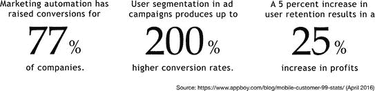

图 12-3. 应用转化统计数据

### 制定营销策略

营销策略是你需要在项目早期就考虑的事情，最早可以追溯到创意验证阶段，因为你应用的成功将取决于增长和收入，而不仅仅是你的创意有多好。

一个全面的应用营销策略结合了多个关键组成部分，这些组成部分可能会随着用户采用你的应用以及营销活动的目标根据用户行为和反馈进行调整而随时间变化。

你的营销活动将基于你设定的目标、你为活动设定的预算、你想要瞄准的用户群体、你将用来触达该用户群体的一个或多个渠道、你的营销信息内容，以及你的报价或价值主张。任何营销策略的两个重要元素是归因和细分。


#### 归因分析

你的营销策略只有在能够衡量自身行动及用户反应时才会有效。鉴于接触潜在客户的渠道众多，最基本的衡量指标之一就是找出哪个渠道最具成本效益、哪个渠道利润最高，从而明确应将精力聚焦何处，以及哪种营销内容效果最佳。对你而言，是 Facebook 广告还是 YouTube 视频最有效？你是通过广告还是联盟营销赚取更多收入？哪种邮件风格能获得最佳响应？

要衡量这一切，你需要进行归因分析。归因分析涉及衡量特定事件的发生次数和频率（例如用户何时下载应用、启动应用、重新启动应用、在应用中查看广告、点击广告等）。通过记录这些事件并将其“归因”到用户或设备，你可以获取大量关于客户行为的有用信息，并据此推断出哪些渠道对你最有效。

#### 用户分层

用户分层是指将目标用户划分成不同的子群体，以便根据他们的需求和兴趣来定制营销策略。你的用户群体包含不同年龄段、不同职业以及各种偏好的聚集地。有些用户可能是活跃于 Facebook 的少女，而另一些用户则可能是正值壮年、花在社交媒体上的时间较少但频繁使用邮件的男性专业人士。试图以相同的方式向他们推销相同的内容，效果会非常有限。每个群体都会对不同渠道上的不同营销内容做出积极回应。第一个群体可能对 Facebook 上的内容营销和广告反应良好，而第二个群体则可通过邮件广告触达。第一个群体的消费方式及消费内容将与第二个群体的消费习惯不同，你必须采用不同的策略才能让他们愿意花钱。用户分层正能帮助你做到这一点。

### 营销策略的组成部分

一个营销策略包含几个组成部分（图 12-4）：目标、预算、用户分层、渠道、内容及提供物。针对不同目标、不同场合、不同用户群体而制定的各项营销活动，其每个组成部分都会有所不同。

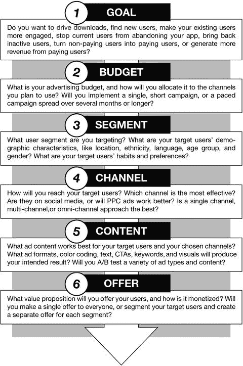

图 12-4. 应用营销策略的组成部分

#### 营销策略组成部分 1：目标

你营销策略背后的驱动原则是什么？你追求的是增长和收入两者，而在应用世界里，同时实现这两点非常困难，尤其是在早期阶段。那么，你将优先考虑哪一个？

经验表明，出于以下几个原因，初期重点应放在增长上。

##### 采用率

采用侧重于增长的定价策略，你的应用采用率会提升得更快。换句话说，如果你的应用是免费的，其表现可能会好得多，因为用户习惯使用免费应用，除非有非常充分的理由，否则不会付费。用户极不可能为了一款新应用预先付费，这样你的采用率和下载量都会非常低。

请记住，你将与众多其他应用竞争，而其中超过 93%的应用都是免费下载的。因此，通过提供免费版本的应用，你更有可能最大化下载率。

变现可以从一开始就成为应用的一部分——例如以应用内购买的形式——但核心功能在初期应免费提供。

##### 信息收集

当你的应用刚进入市场时，不管设计得多么出色，都需要一段时间才能实现稳固的产品-市场契合，换句话说，才能在你的产品与用户之间建立起牢固的关系。在开始建立强大且忠诚的用户基础之前，你需要调整应用、消除缺陷、发布多个新版本或更新，可能还要加入你最初未曾计划的新功能。

为此，你需要收集用户信息以及他们的反馈和评价。要使这些信息和反馈发挥作用，你需要大量的用户，并通过分析工具追踪他们的使用习惯和应用模式，同时通过推送通知征求他们的反馈、意见和评价。你的用户基数越大，你收集到的信息就越相关、越有用，你的产品质量及其与用户的相关性也就越高。

#### 融资

你是否打算通过种子轮融资、风险投资等方式将你的应用带入创业领域？一个拥有庞大用户基数但尚未实现正向现金流的应用，比一个收入低、用户基数小的变现应用，更有可能吸引到风险投资。在早期阶段，市场份额比收入更重要。当你拥有了市场份额，实现收入就成为一个更容易达成的目标。

此外，在应用早期阶段过度强调变现会严重损害你的发展势头，并可能吓跑潜在用户群。

诚然，作为一名应用创业者，你的目标很可能是尽快实现正向现金流，但一开始就专注于变现并不会帮助你做到这一点。将关注收入的时点推迟到你建立了足够大的用户基数之后，然后在特定时间点用深思熟虑的变现策略来瞄准用户，这更有可能带来正向现金流。

在你的应用生命周期的不同阶段，你可能会关注以下一个或多个目标：寻找更多用户并推动更多下载、加强现有用户的参与度和留存率、召回已下载但失去兴趣的用户、将参与但未付费的用户转化为付费用户、以及让已付费用户支付更多。

你也可以将用户视为处于用户生命周期的不同阶段：发现、参与、留存、忠诚、流失。你可以基于此方法对用户进行分层，并相应地设定营销目标。这些营销目标彼此截然不同，因此将需要完全不同的营销策略，以及不同的营销内容和价值主张。


#### 营销活动类型

营销活动因主要目的不同而差异巨大，其名称也常与目的相对应。最常见的活动类型如下：

- **新手引导** – 新手引导是指欢迎已迈出第一步的新用户或客户的过程。在应用领域，这通常指刚下载并首次启动应用的用户。新手引导的目的是欢迎新用户，并指导他们如何充分利用应用。新手引导的有效性如下方的图 12-5 所示。

    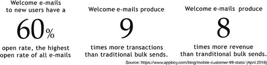

    图 12-5. 电子邮件营销数据

- **滴灌活动** – 滴灌活动是一种按预设时间表自动发送电子邮件的营销活动。
- **购物车放弃挽回活动** – 此活动主要面向在线网站与电子商务应用，针对在购买过程中中途放弃购物车的用户或客户。其目的是找出购物车被放弃的原因，并说服消费者返回。愿意通过你的应用花钱的客户十分宝贵，不应轻易流失，应设法吸引他们回头。
- **重新订阅活动** – 此类活动针对已取消订阅新闻通讯或其他内容营销工具的用户或客户。
- **流失管理活动** – 此类活动针对已放弃应用的用户，通过提供诱人优惠（例如推送关于新版本新增功能或付费转免费功能的提醒）来尝试召回他们。
- **产品推荐活动** – 顾名思义，这类活动旨在推广可能吸引用户的产品。你可以推广与应用相关的产品，包括应用内购买或付费功能等数字产品，也可以作为联盟计划的一部分向用户推广其他人的产品。
- **用户增长活动** – 此类活动针对新用户，旨在推动下载量并扩大的用户基础。
- **线索资格认定活动** – 线索资格认定活动旨在识别用户群体中具备良好变现潜力的用户。这些用户有应用的能满足的特定需求，并愿意为此付费。
- **线索培育** – 线索培育是指在客户旅程的不同阶段，与用户群体细分建立关系，并帮助用户从当前阶段过渡到下一阶段的过程。

#### 营销策略组成部分 2：预算

预算规模将不可避免地决定营销活动的覆盖范围。营销预算的秘诀在于知晓如何将资金分配到计划使用的各个渠道，以及如何最大化每一分营销费用的价值。同时，比较不同渠道以确定哪个能更有效地触达目标细分市场和实现目标，也至关重要。

为此，你需要一套系统来评估营销活动的投资回报率。你可以衡量多渠道活动的整体 ROI（投资回报率），或选择特定渠道单独测算，以了解该渠道上的营销活动效果如何。

#### 营销策略组成部分 3：细分市场

当营销活动针对特定细分市场时，其效果远比内容泛泛、试图同时用同一条信息触达所有人的活动有效得多。

应用中的分析功能会生成关于用户及其行为的详细信息，你可以根据目标利用这些信息对用户进行细分。主要有两种细分方式：

- **按用户特征细分** – 根据地理位置、年龄、性别、居住国家、使用语言和职业等特征将用户分组。
- **按行为细分** – 根据用户与应用的互动方式及其在客户旅程中的位置（新用户、“轻度”用户、深度参与用户——基于会话频率、时长和间隔、流失用户以及已放弃应用的用户）进行分组。通过仔细审视你决定定位的每个细分群体，你可以确定使用哪个渠道来触达他们，以及如何接近该群体以使他们对你的价值主张做出积极响应。

##### 个性化与时机

对目标市场或用户群体进行细分的目的是创造个性化的营销机会。个性化可以基于用户或群体的任何特征或行为方面。例如，你可以利用位置数据针对用户所在城镇的活动进行推广，或用特定用户群体的语言向他们推送信息。你也可以把握营销信息发送的时机，以最大化积极响应的可能性，例如在非工作时间或周末针对忙碌的专业人士进行推广，或在 11 月底至 12 月初建立与圣诞节相关的活动。见图 12-6。

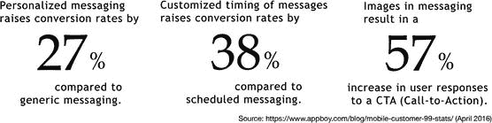

图 12-6. 消息推送数据

为用户个性化的应用需经过以下流程：

- **细分** – 首先，根据广告活动的目的以及可获取的用户信息量，以恰当的方式对用户或目标市场进行细分。
- **个性化** – 其次，为每个细分群体创建独特的内容。信息的内容——布局、色彩编码、行动号召——都旨在吸引目标细分群体，并产生关于哪种设计最有效用的实用信息。作为进一步优化，信息可以直接面向用户个人。
- **时机** – 第三，根据每个特定用户的习惯来安排信息推送活动，以最大化实现高打开率和积极响应的可能性。


#### 市场营销策略第四部分：渠道

你的客户在哪里？最合适的方式、最佳媒介是什么，能将你的产品送到他们手中？这就是“渠道”的含义。如果你发现由年轻用户构成的细分群体在社交媒体上非常活跃，那么聚焦于 Facebook、Twitter、Instagram、Pinterest 及其他社交媒体网站，无论是在内容还是付费广告方面，都是正确的渠道。如果你的目标群体由 30 至 44 岁的专业人士组成，那么 LinkedIn 广告和电子邮件营销活动可能是更高效的渠道组合。

务必记住，要利用一切相关且有效的渠道来推广和营销你的应用，并掌握每个渠道的秘诀。实际上，有数十种渠道可以触达你想要的用户群体，其中最重要的列举在图 12-7 中。它们包括数字和非数字渠道、免费和付费渠道、传统和非常规渠道。如果你能将细分群体与正确的渠道或多个渠道相匹配，这些渠道都可能产生极高的效益。

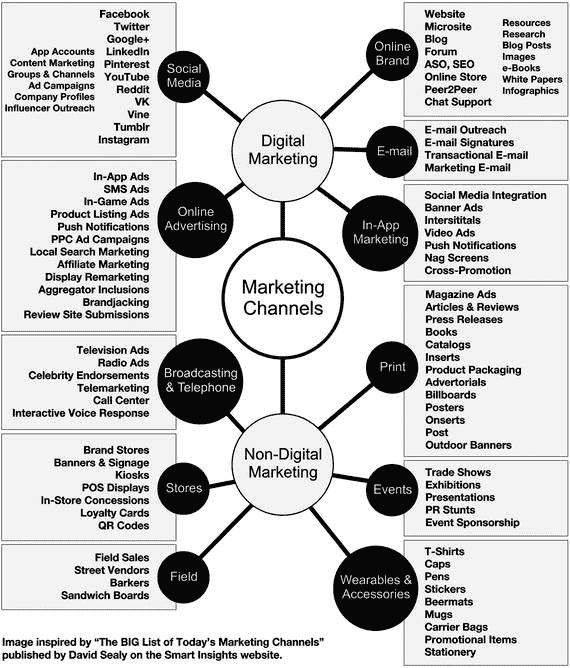

图 12-7. 应用营销渠道

如下方庞大的营销渠道列表所示，可以将这些渠道划分为数字和非数字两大类别，然后进一步细分为子类别。例如，数字营销包括社交媒体、在线品牌推广、在线广告、电子邮件和应用内营销。非数字渠道则分为广播电视和电话渠道、门店相关渠道、活动营销、印刷品、现场营销以及可穿戴设备和配件。每个渠道都有其方法、特点以及为你带来目标客户的价值。在营销应用的过程中，你会发现并非所有渠道都适合你，因此要努力识别出哪些渠道对你最高效，并将大部分精力和资源投入到这些渠道上。

#### 数字营销：社交媒体

忽视这个渠道将自担风险。社交媒体是推广应用最有效的渠道之一，即使不是最有效的。社交媒体已发展成为可能是最重要的广告和推广渠道。

社交媒体为你的应用提供了庞大的受众群体，因此它也是最大的渠道之一（图 12-8）。像 Facebook 和 YouTube 这样的社交网络拥有超过十亿的月活跃用户，而 Google+、Twitter 和 Instagram 等其他平台则拥有数亿月活跃用户。

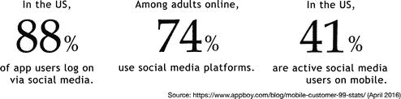

图 12-8. 社交媒体统计数据

在社交媒体上进行营销有两种方式。一种是付费渠道，比如 Facebook 广告；另一种是“免费”渠道，比如发布帖子、上传内容和内容营销。

##### 在 Facebook 上营销

在社交媒体上营销的第一步是设定一个具体目标，然后围绕它组织你的策略和内容。你的应用目前处于哪个阶段？如果你的应用处于概念开发阶段，你可能想要验证概念并测试受众反应，看看人们如何回应你的想法，并对下载量做出预测。你的目标是让人们告诉你他们的想法。如果你的应用处于开发阶段，那么你会希望在应用即将发布前制造热度，因此你的主要目标是分享。如果你已经发布了应用，你会利用社交媒体来推动下载，因此你的主要目标是引导人群前往你的应用商店下载页面。

在发布前和发布后的每个阶段，Facebook 都会为你提供多种推广应用的方式。一种方式是通过群组。为那些对你的产品感到兴奋的人创建一个群组，在应用发布前定期发布相关新闻，征求群组成员的意见和反馈，并鼓励成员与他们的朋友分享看法。

另一种推广应用的方式涉及付费选项，这些选项将帮助你获得更多点赞并扩大触达范围，以及 Facebook 广告，它会向你所定义的目标受众展示应用广告。

##### 指令

一旦你明确自己希望受众做什么，就告诉他们。确保你的社交媒体漏斗能有效引导访问者前往你期望他们去的地方，并通过正确的行动号召告诉他们你想让他们做什么，例如“分享”、“赞此页面”或“立即下载”。

##### 在 Twitter 上营销

在 Twitter 上进行有效营销的关键是创作简短、易于转推的恰当内容，并巧妙利用相关话题标签，将它们与当前事件联系起来，以从公众不断变化的兴趣中获益。关注影响者并让影响者关注你，是提升应用在 Twitter 上曝光度的另一项关键策略。影响者是指那些在其专业领域内意见重要的人；他们只需向自己的粉丝发布一条关于你应用的推文，或者关注你并向其列表中的所有联系人分享你的消息，就能为你的应用带来提升。

##### 在 Instagram 上营销

作为一款照片分享社交媒体网站和应用，Instagram 是分享与应用相关照片（包括截图和模型图）的绝佳渠道。使用相关的话题标签——与 Twitter 相反，这里要使用多个——将有助于提升你照片的在线曝光度。

##### 尽早采取行动

当你在社交媒体上拥有大量关注者时，营销最为有效，但这需要时间。理想情况下，为了让你的应用获得最大动力，在发布应用时你应该已有相当庞大的受众在等待。这意味着要尽早建立你的受众群体。如果等到应用发布后再去建立受众，对应用几乎没什么帮助，所以请尽早开始。一旦你的应用进入概念设计阶段，就制定社交媒体营销策略，并用它来评估受众反应，建立一个核心的宣传者群体，并找到更广泛的潜在客户群。

在社交媒体上营销时，你的重点应放在逐步建立忠诚且感兴趣的受众群体上，这需要通过持续的存在感、定期发布内容和积极互动来实现。


#### 智能营销

在实施你的营销策略时，运用以下基本原则与技巧，有助于最大限度地激发目标受众的积极反馈：

- **感恩** – 通过提供与你应用相关的特别优惠和免费物品来奖励你的忠实受众。如果你正在为即将发布的新版本造势，可以考虑让用户抢先“尝鲜”。或者，如果应用内有购买项目，你可以为社交媒体上的粉丝提供购买折扣。
- **互动** – 专注于人际互动，而非直接营销。只有当你直接与人互动时，你的社交媒体受众才会增长；如果你用直接营销内容去接触他们，他们几乎不会关注你。要积极分享，但不要用重复的内容轰炸你的受众。
- **态度** – 培养积极的态度，并对受众的反馈做出积极回应。如果你的用户反馈了你应用的缺点，你最不应该做的就是防卫和批评他们。相反，要持积极态度，感谢每一位提供反馈的用户，采取行动修复这些缺点，并让受众知道你在针对他们的反馈做些什么。你的用户会感激你的努力，你将获得更忠实的用户作为回报，同时，你还会拥有一个强大的反馈渠道，这将有助于你开发下一个版本的应用。
- **参与感** – 让你的受众感觉他们是项目的一部分。向他们征求反馈和意见。邀请一些最忠实的粉丝来测试应用的新版本，并听取他们的想法。
- **整合** – 让社交媒体成为应用本身的关键部分。允许并鼓励用户在社交媒体上分享他们的体验、成就和观点，他们就会像免费为你工作的营销人员一样。通过在应用内分享免费物品来激励分享，你将显著提升营销势头。

根据 Openxcell（`www.openxcell.com`）的数据，在应用发现过程中，社交媒体营销仅次于移动搜索，并且“在转化率、用户质量和安装量等多个方面，超越了交叉销售、广告网络、激励广告和应用发现平台。”因此，很容易看出社交媒体营销渠道对应用的价值，以及掌握这一渠道的秘诀是多么有用。

是否有一个完整的社交媒体平台列表，可供你在社交媒体活动中使用？我们都熟悉 Facebook、Google+、Pinterest、LinkedIn、Twitter 以及其他已成为家喻户晓名字的网络，但是，你可以加入的社交网络以及社交与专业互动空间，少说也有几十个，以便与可能对你的产品感兴趣的人建立联系。这里列出的社交媒体网络是其中一些最大、最受欢迎的，常用于社交、产品推广和信息分享：

- Facebook（`http://www.facebook.com`），月度活跃用户 16 亿
- YouTube（`https://www.youtube.com`），月度活跃用户 10 亿
- Google+（`https://plus.google.com`），月度活跃用户 4.4 亿
- Instagram（`http://www.instagram.com`），月度活跃用户 4.3 亿
- LinkedIn（`http://www.linkedin.com`），月度活跃用户 4.29 亿
- Twitter（`http://www.twitter.com`），月度活跃用户 3.25 亿
- Pinterest（`http://pinterest.com`），月度活跃用户 1.1 亿

#### 个人资料视觉元素速查表

对于这些社交媒体网络中的每一个，你都必须创建与营销相关的视觉元素，例如封面照片、横幅、个人资料照片、页眉和背景。每个网络对这些视觉元素的尺寸要求都不同。使用图 12-9 中的速查表来加快你的工作速度。

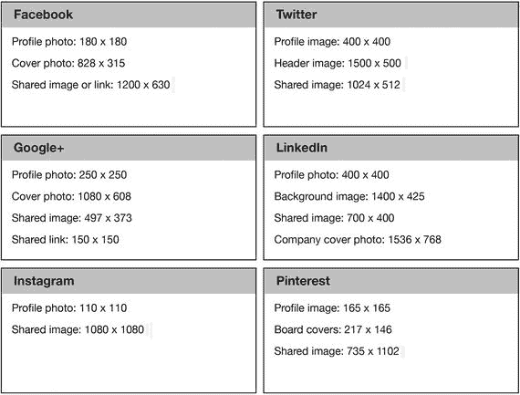

**图 12-9.** 社交媒体视觉元素基础速查表

### 数字营销：在线品牌与身份

你用于推广应用的大部分渠道，都会将目标用户引导至一个特定位置，在那里他们将响应行动号召（CTA），例如下载你的应用或订阅新闻简报。入站漏斗，即那些不通过你的直接努力（例如通过网络搜索或朋友推荐）而自行发现你应用的人，也会到达这些在线位置之一。此类位置包括你的网站或迷你网站，以及你的应用商店页面或在线商店。

这些位置将成为你在线品牌（即应用身份）的组成部分，这意味着它们在设计、布局、色彩编码和内容方面必须保持一致，以便向访问者呈现统一的形象。

你的客户很可能首先在三个关键位置发现你的应用：你的社交媒体页面（尤其是你的 Facebook 个人主页）、你的网站（可以是一个支持搜索的简单迷你网站）以及你的应用商店页面。你的社交媒体个人资料页面和网站应导向最终目的地，即可以下载你应用的应用商店页面。

一旦你的应用发布，在网站和应用内设置好可以接收反馈并提供用户支持的渠道将是明智之举。当你拥有足够大的用户基础时，你还可以创建一个论坛，以便用户之间互相帮助并分享经验。这些渠道将成为宝贵的信息来源，帮助你识别在发布下一个版本应用之前需要修复的痛点与不足。在应用发布前，博客是建立受众群体的极好工具；在发布后，通过提供相关内容，博客也有助于提高用户留存率。


```markdown
#### 应用商店优化

用户搜索应用的主要途径是通过应用商店。应用商店优化（ASO）是发行商用来最大化吸引用户注意力、优化应用在商店中的表现及与竞争对手竞争能力的一套技术。

ASO 始于对目标受众搜索内容的清晰理解。用户研究的质量决定了 ASO 工作的效果，因为研究结果会产出一组最可能为应用带来最高流量和下载量的关键词。所选关键词可能会根据排名变化以及与竞争对手的表现差异而随时调整。

在 ASO 中，需优化的内容包括：应用标题、图标、类别、描述及截图。影响 ASO 的其他因素还包括总下载量和应用评论，因为它们能带来更高的排名。不过，应用评论难以优化，因为发行商对其控制有限。

以下是优化应用标题、图标、描述及截图的方法：

- **标题** – 基于用户研究，为应用选择一个对目标用户最具吸引力的标题，并使用从所选关键词中确定的主关键词。根据 MobileDevHQ 和 Apptentive 的数据，包含关键词的应用标题平均排名比不含关键词的标题至少高出 10%。  
  建议标题简短（不超过 25 个字符），以免在智能手机屏幕上被截断。标题还应具有原创性，以便用户容易记住，避免淹没在相似通用名称的应用中。
- **图标** – 设计视觉吸引力强的图标，最好地传达应用功能及其为用户提供的主要用途。理想情况下，图标应由专业人士设计，因为质量差异会显著改善应用给用户留下的印象。
- **描述** – 应用描述对 ASO 的影响不仅限于访客在应用商店页面看到的文字。在描述中自然融入应用关键词，会影响应用商店算法对应用的分类和排名。用所选关键词填充应用描述，以最大化应用在搜索结果中排名靠前的机会。  
  根据显示应用商店页面的屏幕大小，描述会被截断，访客需点击“更多”按钮才能继续阅读。请确保应用的功能和优势位于描述的“首屏”区域，以便触及所有访客。

#### 评分与评论

应用评分和评论在用户旅程的特定阶段作用最大——即当用户已到达应用商店页面，并想评估应用的热度及其他用户评价时。

当访客到达应用商店页面，意味着你的营销已获成功，他们已对你的应用产生兴趣。你已拥有潜在客户。评分和评论很可能是说服访客下载应用前需跨越的最后一道障碍，因此它们对应用的成功至关重要。

访问应用商店页面的用户数与实际下载量的差值，能让你了解页面给访客带来的影响（图 12-10）。

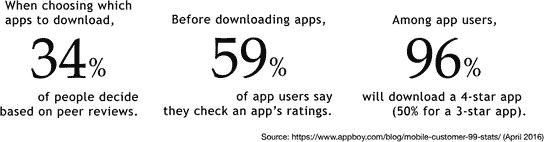

**图 12-10.** 应用下载统计数据

然而，对用户来说，评论并不完全可靠，这存在风险。鉴于评论对下载或购买决策的重要性，伪造应用评论已成为一大趋势。应用发行商会付费为自己的应用获取正面评论，同时为竞品应用刷负面评论。

#### 数字营销：联盟营销

联盟营销被视为一种潜在的高收益替代方案，以取代应用最流行的变现模式，即应用内购买（用户支付）和免费增值（广告支持）。

联盟营销是一种广告形式，其中销售产品的商家会使用你应用中的广告空间来销售商品。如果他们通过你的应用促成一笔销售，你将获得固定金额或销售额的一定比例。联盟营销可通过两种方式为你服务：你可以用应用为其他应用做推广获取收益，或者招募联盟成员推广你的应用以带动下载。

联盟计划还包括奖励用户向他们认识的人推荐你的应用。联盟营销可能很具成本效益，因为人们更倾向于下载熟人推荐的应用。

推荐行为通过联盟平台软件进行追踪。这些平台通过衡量可获报酬的具体事件（如下载应用、订阅邮件列表、进行应用内购买、查看或点击广告）来追踪和报告联盟计划的执行情况。

你也可以开发以联盟营销为主要收入来源的应用。例如，发行商可开发一款与食物相关的应用，根据用户位置将其推荐到附近的特色食品店，围绕从这些商店获得的联盟营销收入构建商业模式。

尽管联盟营销相比其他广告方式可能更有利可图，但仍需考虑两个关键障碍：一是难以全面追踪用户行为，尤其是识别特定广告所在的营销平台；二是涉及在应用内容中使用链接的问题，这在联盟营销中至关重要。另一个可能破坏联盟营销活动的障碍是，当你引导用户前往商家网站购买产品时，该网站可能未针对移动端进行适当优化或支付流程不畅，导致购买中断，从而导致你的收入因他人而受损。

#### 数字营销：电子邮件营销

电子邮件当然是最古老的在线营销渠道之一。它自互联网发明以来便存在，至今仍是主要营销渠道，且点击率高于许多其他渠道（图 12-11）。

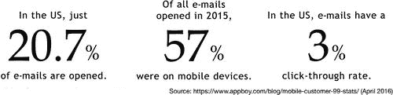

**图 12-11.** 电子邮件营销统计数据

许多公司可帮助你通过邮件列表、遵循最佳实践的邮件模板以及其他实用功能实现电子邮件营销活动的自动化。

#### 数字营销：推送通知与应用内消息

推送通知和应用内消息是应用在移动屏幕上显示的消息。推送通知是当用户使用其他应用时，你的应用弹出的一条消息（图 12-12）；而应用内消息是当用户使用你的应用时出现的消息，换句话说，是从应用内部发出的消息。两者均可包含文本、图片及操作按钮。

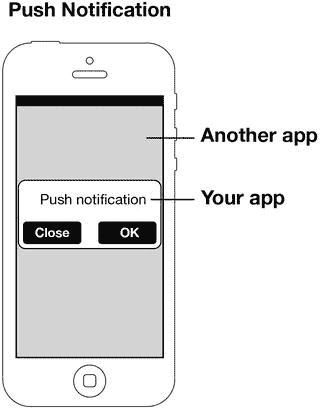

**图 12-12.** 推送通知
```


##### 推送通知

推送通知是一种消息类型。它们会在特定时间或时间间隔内弹出在移动屏幕上，无需用户任何干预。即使未使用的应用，甚至用户并未实际操作设备，也能发送推送通知。推送通知的发送时间由广告商选择，但应用用户可以自行决定是否接收此类通知。

应用屏幕上的推送通知可用于推广应用发布商的其他产品，也可用于再营销（例如鼓励长期未使用应用的用户回归），在用户收到邮件或帖子时进行提醒，以及通常将用户定制的信息直接推送到其锁定屏幕上。此外，推送通知还可用于向用户征求反馈和收集信息。

推送通知有助于你将触达范围扩展到已下载应用但并未实际使用的用户。这类消息可用于向客户传递信息、收集调查所需信息、征求改进用户体验的反馈、发布行动号召，或推广产品或服务。许多在应用商店拥有多个应用的应用发布商会利用推送通知，在所有应用之间相互推广。图 12-13 展示了一些有趣的数据。

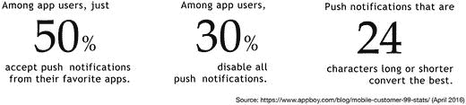

图 12-13. 推送通知数据

诸如 Facebook、Twitter、LinkedIn 和 Pinterest 等社交媒体应用严重依赖推送通知来保持用户活跃度。它们提供了长长的推送通知选项列表，例如：当有人上传照片、发表评论、发送邀请、接受你的邀请、决定关注你、转发你的推文、点赞或点踩你的帖子、邀请你加入群组或参加活动时进行通知。某些应用默认开启所有推送通知类型，你需要手动关闭不想要接收的类型。

在线推送通知服务商可以帮助你自动化推送通知的发送流程，并借此收集用户数据，以便更有效地向用户进行营销。许多服务商允许你结合位置信息和行为数据来个性化推送通知，从而提高正向响应率。

推送通知的效果取决于用户何时收到消息（通知时机）、消息内容（主题），以及用户收到相同或不同消息的频率（通知频率）。向用户发送过多通知可能会引起反感，导致用户流失。

##### 应用内消息

应用内消息是指当用户实际位于应用内部时，在移动屏幕上显示的消息（图 12-14）。

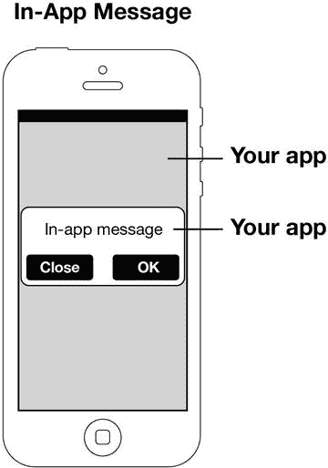

图 12-14. 应用内消息

这些消息会因用户在应用内的位置、正在进行的操作以及你希望用户执行的操作而有很大差异。许多应用内消息由用户行为触发。据应用设计公司 Localytics 称：“应用内消息应当感觉像是应用的自然组成部分，而非额外的营销内容，营销人员可以利用它来微调应用内容或促销策略。”通过精心的设计、时机把握和内容选择，实现与用户体验的无缝集成是关键。

推送通知和应用内消息在以下方面非常有效：

-   通过新的优惠和免费内容维持用户留存率，让用户保持对应用的参与度；
-   针对特定行为（如购买、查看或分享特定内容）提高转化率；
-   告知用户有关更新、升级、优惠或任何新内容的信息；
-   征求用户意见并与用户进行普通沟通；
-   提升应用的评分和评论。

#### 数字营销：启动屏

启动屏是一种全屏静态图像，在你按下应用图标启动应用时显示。它填充了从按下图标到应用实际启动之间的时间，通常持续几秒钟。

启动屏是在单色或相关有趣的背景上放置你的标志，从而强化品牌形象的绝佳机会。另一种选择是利用启动屏让用户进入恰当的情绪状态，尤其是当应用是游戏时。由于它只持续几秒钟，启动屏几乎无法承载其他功能。

确保用户在查看启动屏时知道应用正在加载，因为启动屏只是一张图片，用户很容易误认为应用无响应。

同时，确保为不同的设备分辨率准备启动屏。以 Android 为例，由于存在大量不同的设备和屏幕分辨率，确保你的启动屏显示正确是一个重要问题。为每种屏幕分辨率设计一个启动屏是不可能的，因此最佳策略是为小屏、中屏和大屏分别设计三张启动屏。

#### 付费广告

付费广告适用于在线渠道，例如网站、博客和社交网络上的广告，以及其他应用内的广告。付费广告也包括线下渠道，如报纸、杂志、广播和电视。根据你的目标市场以及触及目标市场的最佳方式，有数百甚至数千种选择。不过，营销人员通常会将营销活动分为付费活动和免费活动（或称之为“入站营销”），以便更清晰地确定营销支出的效率。相关的应用变现统计数据可参见下方图 12-15。

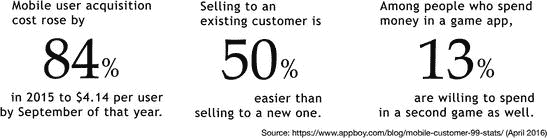

图 12-15. 应用变现数据

无论你的预算大小如何，都很容易在营销上过度支出却回报甚微，因此，为了获得期望的结果，明智地将资金花在正确的渠道上至关重要。尽管在不同国家和应用类型之间差异很大，且随时间波动，但让用户安装你的应用的平均成本，即 CAC（用户获取成本），估计在 2.50 美元到 3.50 美元之间。这意味着，如果你设定的目标是至少获得 10 万次安装以产生维持运营所需的收入，那么你预计需要在营销上花费 25 万到 35 万美元。

#### 数字营销：提交至评测网站

应用上线后，应尽可能将其提交到更多的应用评测网站。大多数是免费的，也有一些是付费的。它们是为你的应用提供免费（或付费）曝光的绝佳途径。

请访问以下链接，获取前 200 多个应用评测网站的列表：

- `http://translatelab.com/android-ios-app-review-sites-list/`
- `http://app-apes.com/2014/09/list-of-the-greatest-app-review-websites/`

#### 非数字营销：印刷媒体与新闻界——广告、文章与采访

印刷媒体与新闻界并非你会持续使用的渠道；你不会每周都发表文章或购买报纸广告。在印刷品上做广告是你只在特定时间点做的事情，这些时间点经过精心安排，以配合诸如应用发布等活动。例如，你可以利用整版报纸广告来为应用发布造势，或者向杂志社约稿或安排一篇关于你创业公司的采访。最关键的是时机：你应该准备好利用广告或文章能激起的兴趣，来推广你的应用或已计划好的活动。


##### 口碑传播

不要低估最传统的渠道：口碑传播。抓住每一个机会公开谈论你的应用。在发布前后，通过接受广播和电视采访、建立活跃的社交媒体粉丝群来营造话题热度。制作一个或多个视频介绍和讨论你的应用，并将其发布在视频分享网站上。

不要只有你一个人在说！发布后，创建一个论坛让用户能够分享观点、提供反馈并获得他们可能遇到问题的答案，从而让他们主动谈论你的应用。

### 营销策略要素 5：内容

你将生成多种营销内容，具体内容因渠道和格式而异，从 `AdWords` 广告到文章或社交媒体帖子。营销活动的内容需要精心设计以吸引目标受众，为此应考虑到以下几点：

-   让内容富含关键词。你的内容不仅要能被阅读，还要在搜索中容易被发现。为此，它必须包含与你受众会使用的搜索词相匹配的关键词。
-   使用高能词汇。营销中的高能词汇，例如“发现”、“简单”、“保证”、“免费”、“即时”和“真实”，能够激发、激励和促成转化。在营销文案中巧妙使用这些词汇，让读者点击 `立即下载` 按钮。
-   巧妙利用行动号召。`CTA` 是指示读者采取某种行动的断言式语句，比如“立即下载！”或“立即加入！”。在信息中正确定位、搭配恰当颜色编码和措辞的 `CTA`，将对你营销活动的效果产生巨大影响。建立有效信息和 `CTA` 库的最佳方法是测试多种变体以找出效果最佳的一种，这种方法被称为多变量测试，或 `A/B` 测试。

### 营销策略要素 6：产品/服务

营销策略的最后一个要素是你的产品/服务，或者叫价值主张。再次强调，你为目标受众提供什么，取决于该细分市场的特征、他们在客户旅程中的位置，以及你自己的增长和用户获取目标。你是在试图让新访客下载你的应用，通过赠送免费物品来奖励忠实用户以提高用户参与度和留存率，还是敦促流失用户重新使用应用？每个细分市场都会对相关的产品/服务做出积极回应，而细分，一如既往，是让你的营销活动获得强`ROI`的关键。

### 巧用策略扩大影响力

为了最大限度地利用你的营销预算，请运用以下部分概述的策略，让你的营销活动更具优势。

#### 深度链接

应用世界中的深度链接，是指一个应用内的内容连接到另一个应用内的内容。深度链接是一种方式，让应用可以通过直接营销之外的方式，成倍地增加其用户曝光度，从而通过自然渠道提高用户获取和（希望如此）留存。

例如，假设你正在浏览一个时尚杂志应用 A，然后你看到了一个销售美容产品套装的广告，该产品通过另一个应用——电商应用 B——销售。当你点击应用 A 中的链接时，你将被直接引导到应用 B 内的产品页面，你的购物车中会自动装入该特定产品，准备结算。如果你没有安装电商应用 B，你将被引导至`App Store`。在你下载并启动该应用后，你将被直接引导到应用 B 内的产品页面。这就是深度链接的工作原理——将你从一个应用的深处引导到另一个应用的深处。

然而，虽然以这种方式从一个网站导航到另一个网站很容易，但从一个应用到另一个应用则复杂得多，因为你可能需要在不同平台、应用和设备之间进行导航。有效的深度链接被视为降低移动应用每次安装成本的一种手段。特别是包含指向你应用内内容深度链接的社交媒体广告，是一种非常高效的应用营销工具。

#### 桌面端到移动端营销

桌面端到移动端应用营销允许你定位那些使用台式电脑而非手机进行浏览的用户。用户在诸如 `Groupon` 这样的网站上提交他们的手机号码，然后通过 `SMS` 收到一个链接，点击后即可将应用下载到他们的手机上。

#### 内部营销渠道

就本书而言，内部营销渠道是指那些在你的应用内部运作的渠道，有效地将你的用户转变为免费为你工作的应用推广者。通过分享他们的体验或他们创建的内容，并给出对应用的评价或反馈，用户也在帮你免费推广你的应用，而他们作为用户的话语非常有影响力。因此，从营销角度来看，你的用户具有极高的价值。

你可以通过以下技巧将用户转变为推广者。

##### 请求评价

通过请求评价，你为用户创造了一个机会来热情赞扬你的应用有多么出色以及他们有多喜欢它。

当然，风险在于他们可能会给出负面评价，这会产生相反的效果。然而，一条差评对你可能很有用，因为它能告诉你你在哪里犯了错误，导致用户流失。好评的价值在于推广，而差评的价值在于提供反馈，以支持你下一个版本应用的设计。但无论如何，你希望尽可能避免差评。

这意味着好评和差评应该区别对待。好评应被引导至你的 `App Store` 页面，而差评应直接反馈给你。但是你如何能提前知道用户打算如何评价你的应用呢？

不要直接要求用户评价你的应用。首先，通过推送通知询问用户是否喜欢你的应用。如果他们回答“是”，就将他们引导至你的 `App Store` 页面。如果回答“否”，则请他们告诉你原因，并启动一封电子邮件对话框来帮助他们完成反馈。这样，差评就会直接发给到你，而不会出现在 `App Store` 页面上，从而提升你应用的平均评分。

优秀的营销需要你以某种方式促使用户表达他们的意见。而如何、何时以及多久促使用户这样做，则由你决定。你可以使用推送通知定期提示用户，例如每启动应用四次提示一次，或者每次他们关闭应用时（即退出时）提示一次。这完全取决于你。

### 衡量应用表现

既然你正在营销你的应用，你将使用分析工具、`KPI`（关键绩效指标）和基准来衡量你的表现如何以及营销效果如何。当你的决策基于准确的信息并得到其支持时，它们才会有效。分析主要分为四大类：用户分析提供关于用户及其行为的信息；表现分析衡量应用本身的运行情况；财务分析告诉你应用在财务上的表现如何；视觉分析衡量应用在视觉上将正确信息有效传达给用户方面的效果。

这些不同类型的指标组合在一起，描绘出你的应用表现如何，以及在设计、内容和变现方面的效果如何。最重要的是，分析将帮助你找出应用中最大的问题所在，以及需要进行哪些改变才能实现完全优化。

### 用户分析

用户分析提供关于你的用户是谁、他们如何与应用互动、他们使用什么设备、他们使用应用的频率以及他们平均花费多少时间在应用上的信息。关于用户的详细信息有助于你根据他们的喜好来定制应用，并提高他们对应用的参与度。


### 性能分析

性能分析衡量应用的技术表现，例如加载耗时以及崩溃频率。应用的加载时间看似无关紧要，但它会影响用户的喜爱程度，以及有多少用户因沮丧而放弃使用。

快速、高效且可靠的性能是确保用户深度参与的关键要素，这归功于发布前娴熟的编程与广泛测试，以及发布后的密切监控与持续改进。如下图 12-16 所示，用户重视即时响应，并会惩罚无法提供此体验的应用。

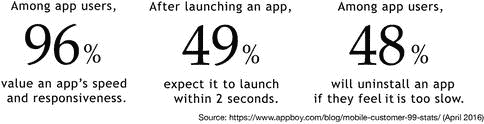

图 12-16.

用户行为统计

### 财务分析

财务分析提供应用商业表现的信息，包含两部分：收入分析以及市场与广告分析。

收入分析会告诉你用户在应用上花费了多少钱、谁消费最多、哪些渠道是收入的最佳来源。市场与广告分析则会告诉你哪些营销渠道带来了最多的用户，以及你的营销支出实际效果如何。同时，活动分析是整体营销分析中的一个核心部分，用于衡量特定营销活动或特定广告类型在设定时间段内的效果。

#### 视觉分析

视觉分析涉及使用触摸热力图、用户旅程记录、会话回放以及实时报告等工具，来了解用户如何与你的应用交互、他们点击了哪些按钮或图标、忽略了哪些部分。

通过提供用户是否按预期方式与应用交互的精确实时信息，视觉分析将帮助你识别并纠正让用户感到困扰的 UI 问题，优化用户体验，并最大化应用收入潜力。

#### 指标

实际上有成千上万种指标和 KPI 可用于从不同角度衡量应用的表现。分析软件允许你根据想了解应用表现或用户行为偏好的问题，来自定义分析报告。

指标和 KPI 也会因应用类型（如游戏、企业应用或商业应用）而异。每种应用都会为用户参与度、盈利能力和社交媒体传播性设定自己的基准，使用截然不同的指标来衡量成功，并从非常不同的角度监控用户行为。

#### 关键分析 KPI

以下是营销人员用于衡量营销活动效果的最重要 KPI 中的一部分。

-   **访问深度** – 用户在单次会话期间查看的屏幕数量
-   **会话间隔** – 用户关闭应用后再次启动所需的时间
-   **自然用户增长率** – 非来自营销活动而“自然”获取的新用户数量
-   **生命周期价值 (LTV)** – 用户在使用应用整个生命周期内产生的总收入

其他 KPI 如**流失率**和**留存率**已在前面章节讨论过。

#### 用户参与度和财务指标示例

用户参与度和财务指标包括`用户母语分布`、`目标完成率`、`第一周会话次数`、`每日使用高峰时段`、`放弃率`、`会话间隔`、`活跃用户数`、`品牌知名度`、`行为流`、`留存率`、`访问屏幕数`、`内容上传次数`、`分享次数`、`访问深度`、`流失率`、`转化率`、`会话频率`、`操作系统版本分布`、`设备类型分布`、`用户地理分布`、`会话时长`、`自然用户增长率`、`下载量`、`已授予权限`、`用户生命周期时长`、`产品点赞数`、`平均每笔交易收入`、`每次点击付费 (PPC)`、`获取用户总收入`、`每次点击成本 (CPC)`、`每月新客户数`、`每次安装成本 (CPI)`、`每千次展示成本 (CPM)`、`付费转化率`、`购物车放弃率`、`交易高峰时段`、`客户获取成本 (CAC)`、`新线索百分比`、`每用户平均收入 (ARPU)`、`用户点赞数`、`每秒/每小时/每日交易数`、`应用延迟`、`购物车商品数`、`网络错误率`、`订阅/注册数`、`API 延迟`、`客户生命周期价值 (LTV)`、`每周期应用加载量`、`移动端影响客户百分比`、`应用崩溃率`、`应用用户评论频率`、`吞吐量`和`应用加载时间`。

#### 如何在应用中使用分析？

Apple 会在应用发布后自动为您生成分析报告，但您可能也希望使用其他分析提供商。在您的应用中使用外部分析供应商很简单。首先，向分析提供商注册（请参阅第[15](https://doi.org/10.1007/978-1-4842-2683-4_15)章中的列表）。其次，创建一个将作为应用代码一部分的唯一跟踪 ID。在您填写完关于应用的必要信息后，分析供应商会为您创建该 ID。第三，在发布前，将带有此 ID 的一段代码片段插入到您的应用代码中。

就这样！您的应用将开始创建报告。

### 总结

营销是一门科学与艺术的结合，其效率会随着用户数据的增多而提升。你掌握的用户信息越多，就越能更好地对他们进行营销。因此，成功营销的第一步是尽可能多地获取关于受众的信息，然后让你的应用用户尽可能多地分享他们对产品的喜好或厌恶之处。

## 13. 应用营销概念


数字营销的演进已经催生并且仍在不断催生出新的概念、策略、技术和方法，营销人员利用这些来定位、触达和转化潜在客户。以下是构成这些概念基础的若干基本假设和观察：

- 应用用户行为方式各异，使用已下载应用的方式也与其他用户不同。
- 处于与应用、品牌或产品不同参与阶段的用户，对营销内容的反应也不同，因此营销活动需要基于不同因素对用户进行细分，并根据这些细分群体的习惯和偏好定制营销内容。
- 新技术使得大量营销相关活动（如购买广告内容（程序化营销））实现自动化。实现营销流程自动化的公司可以创造更高的效率并提升营销投资回报率。

让我们来看看应用营销中最流行的概念。

### 预测性营销

预测性营销涉及利用基于客户行为和习惯的数据科学来做出更明智的营销决策（图 13-1）。通过收集和分析用户行为数据并识别模式，营销人员能够预测用户行为，并就其营销内容和产品的成功可能性做出明智决策。

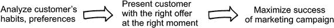

图 13-1.

预测性营销

通过在正确的时间用正确的报价定位正确的用户，营销人员可以从营销支出中获得更好的回报。预测性营销通常与个性化相结合进行优化。


### A/B 测试

A/B 测试（也称为分割测试或多变量测试）涉及使用同一广告的多个版本，分发给不同群体，这些版本具有不同的设计、配色方案、行动号召和消息内容，以确定哪个版本能带来最高的转化率。通常，预测哪种广告设计效果最好是不可能的，因此 A/B 测试填补了这一空白，让用户自己告诉营销人员哪个版本最具说服力。

### 再营销/重定向

接触到某一应用的人中，只有极少数会对行动号召做出积极回应并下载该应用。在互动过的用户中，又有相当一部分人会很快放弃使用，或者虽然保留应用但极少使用。一般来说，超过 90% 的网站访问者会在未转化的情况下离开，而 70% 的用户会放弃购物车。

再营销的目标人群是所有曾接触过你的产品但未完成转化的人，或者是那些完成转化但后来放弃了该应用的人。它使营销人员能够与这些类别的用户重新建立联系，并“将他们带回来”，或者增加他们在应用上花费的互动时间。

再营销名单上的客户比普通客户更有价值，因为他们仅通过下载你的应用、访问你的网站或应用页面就已经表达了一定形式的兴趣。这意味着，旨在转化他们的营销活动，其效果很可能优于针对新客户的活动。

#### 个性化

个性化，也称为以客户为中心的营销或一对一营销，涉及根据目标用户的偏好、习惯和行为模式，定制营销消息的时间和内容。个性化消息会直呼每位用户的名字，并根据他们的特征（如年龄、性别、位置、职业和财务层级）提供适当的激励，以吸引他们更多地与应用互动。个性化的目标是通过向用户提供最有可能吸引他们的优惠，来提高营销活动的效果。

个性化是转化客户的一个非常强大的工具。超过 40% 的消费者表示，他们看重那些能记住过去购物行为的公司，而近 70% 的消费者表示他们更喜欢个性化的购物体验。

### 营销漏斗

营销漏斗是客户在转化旅程中经历的不同阶段及其与产品关系的可视化表示（图 13-2）。

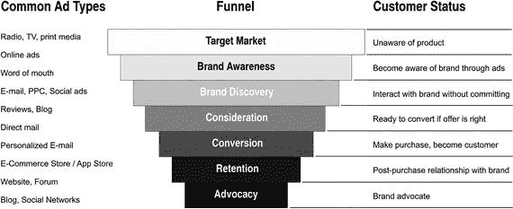

图 13-2. 营销漏斗

细分用户的一种方法是根据他们在营销漏斗中的位置，或者他们在客户旅程中的阶段。他们是新用户，还是下载应用一段时间后，现在的互动度不如以前高的用户？通过根据用户在漏斗中所处的位置对其进行细分，营销人员可以更有效地定位这些群体，发送最有可能促使他们进入下一阶段的优惠。例如，将毫无品牌意识的访客转变为有品牌意识的潜在客户，与试图将正在与你的品牌互动的潜在客户转化为付费客户相比，需要采用通过不同渠道进行的完全不同策略。

漏斗通常分为三个主要部分——TOFU（漏斗顶部）、MOFU（漏斗中部）和 BOFU（漏斗底部）——并为每个部分分配不同的营销策略。

### 激励

激励模式（也称为赞助模式、奖励模式或价值交换广告模式）是一种策略，通过提供激励来换取用户的购买或参与行为，从而使产品、项目或其他服务对客户更具吸引力。

在应用业务中，激励通常用于快速积累应用安装量。例如，一家零售公司可能会为客户提供折扣和/或忠诚度奖励，如果客户通过其应用进行购买。内容发布商可以提供仅在其应用上提供的独家内容，或者游戏可以为首次下载者提供一定数量的可在游戏中使用的虚拟货币。发布商和营销人员使用激励安装来比使用非激励方法更快、更便宜地生成安装量，因为所提供的激励使得潜在客户更有可能在他们的设备上安装该应用。然而，由于因附带激励而下载应用的用户保留应用的可能性较低，因此应针对他们采取有针对性的留存策略以防止流失。

### 思想领导力营销

思想领导力营销是通过向客户提供高质量信息，将公司定位为特定领域领导者的过程。这通常是通过在公司网站上创建一个提供免费电子书、信息图表和其他下载物的专区；启动一个博客并用顶尖作者的内容填充；组织网络研讨会；以及在 YouTube 或 Vimeo 上开设一个视频内容频道，为客户提供质量内容（如操作方法、指南以及公司现有客户和新访客可能觉得非常有用的其他信息）来完成的。

思想领导力营销背后的理念是建立公司的声誉，使其达到每当客户想要解决问题或回答问题时，该公司就是他们脑海中首先浮现的对象。

### 程序化营销

程序化营销是通过竞价系统，自动化、基于算法、实时地买卖广告空间，目的是在正确的时间触达正确的客户。

根据 `iab.com` 的说法，程序化营销涉及“四种主要交易类型——公开竞价、仅限邀请/私人竞价、无保留固定价格/优先交易、以及自动化保量/程序化保量交易。”

程序化营销极大地提高了广告内容及其投放时间的个性化水平，并大大提高了营销活动和支出的效率。

在 2016 年数字广告总支出 586 亿美元中，程序化广告购买从 2014 年的约 100 亿美元增长到 2015 年的近 150 亿美元。

### 身份解析

身份解析是一个过程，通过分析独立数据库中的大量数据来寻找身份匹配并“解析”身份。在应用业务中，身份解析主要用于防止客户通过多个设备或多个身份与品牌或应用互动时被计为不同的人。它也用于避免将同名但不同的人计为同一个人。身份解析的另一个重要用途是防止欺诈和身份盗窃。

### 单渠道、多渠道、全渠道营销

单渠道、多渠道和全渠道营销是指在营销活动中用于触达客户的渠道数量。例如，单渠道营销活动是通过单一渠道（如 Facebook 广告）触达用户。多渠道活动使用一个以上的渠道，而全渠道营销活动则试图通过所有可用的渠道触达用户。

全渠道活动的主要目的是确保客户在与品牌互动的所有渠道或设备上获得一致、无缝的体验。全渠道策略利用搜索、社交媒体、SEO、企业网站、印刷品、应用、论坛、在线广告以及所有其他可用渠道来获取客户。


### 移动应用归因

移动应用归因是记录和衡量应用用户行为的过程，例如安装、关卡完成、应用内购买及其他里程碑事件。

移动应用归因与传统在线归因不同，后者使用 Cookie 和像素标签。这些方法在移动应用归因中并不适用，因此移动营销人员以及苹果、谷歌等平台开发者提出了新的归因方法。最常见的方法如下：

* **设备指纹识别** – 设备上展示的广告会收集该设备的信息以创建唯一标识，并将这些信息提交给营销人员。
* **唯一标识符匹配** – 移动归因工具会自动实时比对唯一标识符，将这些标识符相互匹配，从广告点击到安装及其他行为。

移动应用归因对应用营销至关重要，因为它有助于生成所需的数据，用于收集和分析，以衡量营销活动的效果。它支持更高级别的效果追踪，以及个性化营销和预测营销等策略。

### 内容营销

内容营销是一种营销策略，涉及制作潜在客户认为有用、有价值且相关的内容。随着社交媒体的发展（如今已成为向用户分发内容的主要媒介），内容营销的受欢迎程度和相关性也随之增长。

内容营销的一大优势在于，嵌入内容中的广告或链接能够绕过广告拦截器，更可靠地触达客户。例如，文章中作为链接嵌入到广告商页面的广告不会被广告拦截器移除。

内容营销在建立忠实用户群以及将潜在客户转化为实际客户方面非常有效。它也有助于帮助公司树立行业领导者的声誉，在这方面，它属于思想领导力营销的一部分。在 YouTube 上发布游戏关卡攻略视频的游戏开发者，就是在运用内容营销。一个出色的内容营销案例是《部落冲突》游戏，该游戏的粉丝可以在其 Facebook 页面上发布自己的游戏作品。

### 忠诚度营销

忠诚度营销是一种专注于培养现有客户而非获取新客户的营销策略。忠诚度营销设定的目标包括：提高现有客户的平均收入、通过邀请忠实客户分享有关产品或品牌的内容将其转变为传播者、以及通过提供激励措施提高现有客户与品牌的互动水平。

### 行为营销

行为营销涉及根据用户行为对应用的用户群进行细分，旨在优化营销策略并更有效地定位用户。例如，下载某服装制造商应用并搜索皮夹克优惠信息的用户，会收到关于皮夹克折扣或新品到货的通知。另一个例子是，向刚完成基础级别的语言学习应用用户发送“干得漂亮！”消息，该消息还包含付费高级别课程的折扣或特别优惠。

行为营销帮助营销人员了解构成其客户群的不同子群体，从而帮助他们根据这些群体的选择，创建针对性的内容并定制广告。

### 总结

随着新技术不断创造新方法来提升营销活动的效果和效率，营销领域正在飞速发展。当新的营销方法出现时，及时跟进是保持相对于其他竞争应用的优势、最大化营销预算回报的关键。

