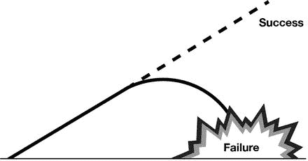
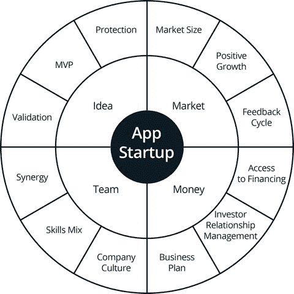
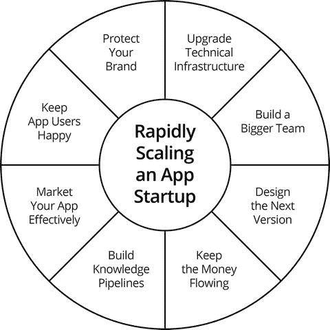

# 为成功做好准备


任何应用创业者最害怕的，当然是失败。但正如我们在本章中会看到的，有比失败更糟糕的事情——你尚未准备好的成功。这更糟糕，因为当你意识到自己几乎成功却失之交臂时，比从未有过机会时的回味更加苦涩。因此，当你的应用大获成功时，必须准备好迅速适应并随其一同成长。


### 突如其来的成功

这是每个应用开发者的梦想：你设计并发布了一款应用，一夜之间它就成了超级爆款，下载量飞速增长，吸引了投资者和媒体的特别关注，甚至可能被提名几个奖项。而你，正欣喜若狂地试图消化这份成功。

先别急。如果你对突如其来的成功和快速增长毫无准备，这个梦想很可能瞬间变成噩梦。如果你不能快速适应，你的应用的人气会像增长时一样迅速消退，最终石沉大海。

这并不意味着你必须在没有任何迹象表明你的应用一定是超级爆款之前就投入大量资金。那样做既不现实也很愚蠢。然而，参与应用项目的整个团队需要了解并理解快速增长所需的各个要素，以便在必要时尽可能做好准备，适应新情况。如果你只在取得突如其来的成功之后才考虑这些要素，恐怕为时已晚，那将是一个真正的遗憾，不是吗？一个“本可以成功却差点成功”的应用，比一个“从未有过机会”的应用更糟糕，所以别让这种事发生在你身上。

让我们首先仔细看看在最坏的情况下会发生什么：当你的应用意外地一夜爆红，但你完全 unprepared 且无法适应时。

首先，你会看到应用下载量和活跃用户数开始出现滚雪球效应。人们大量使用你的应用，与其他人分享体验，并给予热烈好评，而你和你的团队则在庆祝成功，坚信自己打出了全垒打，成功将是永久性的（图 14-1）。



图 14-1. 应用初创公司的最坏情况

在顶级应用行业博客发表了一系列正面评论后，媒体开始蜂拥而至。这引起了投资者和风险投资家的注意，他们对你的应用潜力很感兴趣。与此同时，你和你的朋友们仍在忙于庆祝。

然后，事情开始出问题。你的服务器和后端无法处理众多用户带来的流量。你需要带宽来维持应用的内容交付响应时间，以及存储空间来存放你正在收集和处理的所有数据。

你的用户开始变得不满。许多人在你的设计中发现了漏洞并向你指出，但似乎没有回应，或者你的回应不够快。你仅靠一个小团队根本无法应对用户的投诉，而且你可能还没有建立客户关系管理部门。随着用户数量的增加，崩溃率也在上升。没有人着手开发新版本。由于漏洞仍未修复，人们开始抱怨，五星和四星好评逐渐变成了一星和两星差评。最终，你的用户开始放弃这款应用，因为另一家开发商推出了设计更优秀的替代品。

与此同时，应用行业媒体已经转向报道下一个明星应用，而原本感兴趣的投资者也转向了其他项目，因为你根本没有为你的项目未来制定详细的愿景，也没有详细的商业计划来证明你知道如何实现目标。

最后，你的团队成员纷纷跳槽，去启动他们自己的项目，或者被竞争对手挖走。你独自留在空荡荡的办公室里， wondering 这一切是如何以及为何发生的。

这描述有点戏剧化，没错，但对于 unprepared 的人来说，这很容易成为现实。在这种情况下，失败与你最初的想法或应用的设计无关。事实上，你应用的早期成功证明你做对了很多事情，并找到了你一直在寻求的成功。你应用的失败是你未能管理好那份成功的结果。你有一个很棒的概念，但执行得很糟糕。一个概念，无论多好，如果没有出色的执行，就毫无价值。

#### 初创企业的陷阱：为何高达 90% 会失败

你必须小心，避免犯下许多初创企业导致失败的常见错误。因此，在我们审视一个成功的初创企业将面临的命运之前，先来看看初创企业失败的最常见原因。

对科技初创企业失败率的估计在 75% 到 90% 以上之间。风险投资家预计他们投资的科技初创企业中有十分之四会失败，只有十分之一能取得巨大成功，这也是一个公开的秘密。既然在你开始之前胜算就这么低，那么了解等待你的陷阱就非常值得了。

科技初创企业失败的原因主要分为四类：技术类、财务类、战略类和行为类。所有这些都可能削弱一家初创企业，使其在达到财务可持续性这一里程碑之前就分崩离析。一些初创企业在达到这一里程碑后，在消耗了数百万美元的投资者资金后仍然会失败。

- 技术类
    - 选择了错误的平台，或者试图同时为所有平台进行开发
    - 过早发布应用
    - 发布应用过晚，已被竞争对手超越
    - 发布前未能测试漏洞
    - 发布设计糟糕的应用
    - 未能在应用设计中包含推广方法（社交媒体分享、推送通知）
    - 未能包含分析功能

- 财务类
    - 筹集的资金不足
    - 筹集的资金过多
    - 支出过多（特别是通过按小时付费和在付费推广渠道上高额投入）
    - 支出过少
    - 为你的应用使用了错误的盈利策略（例如，向用户预先收费而不提供免费版本，并且未能包含有吸引力的应用内购买）

- 战略类
    - 未能将必要的技能整合到初创企业的创始团队中
    - 目标市场过于狭窄
    - 选择了不利的地点，无法接触到适合快速成长型初创企业的支持环境
    - 投资于一个需求很小的想法
    - 未能定位一个明确界定的用户类别

- 行为类
    - 坚持追求一个糟糕的想法
    - 不想参与初创企业的日常管理
    - 创始团队内部冲突
    - 与投资者发生冲突
    - 招聘了不合适的人

#### 转变你的思维模式

作为应用开发团队的一员，为成功做准备需要采取的第一个也是最重要的步骤，就是改变你的思维方式以及你对项目需求的理解。你必须从发明家思维转变为投资者思维。

如果你到现在还没注意到，你其实已经是一名投资者了。你投入了大量的时间、金钱和精力来创造“汗水股权”，并且你可能已经拥有了这款应用的大部分（如果不是全部）所有权，它有望发展成为一个成熟的企业。所以，开始像投资者对待宝贵资产一样对待你的应用，给予它应有的关注和规划，这样它才能走向成功。

如果你致力于引导你的应用走向成功，你不需要等到应用真正成功后才去改变你的思维模式。尽快行动吧。这对于你、你的团队和你的应用都将带来巨大的益处。

此刻，你的精力可能集中在防止失败，而不是追求成功。你很可能正努力维持应用的生命力，尤其是在发布后的关键几周内，并试图积累发展势头。然而，成功可能会不期而至，关键在于你和你的团队需要确切知道需要做什么，才能最好地利用成功所创造的机会。


### 成功创业公司需要什么

一个应用初创公司需要具备哪些条件才能有较大成功机会？它需要一个伟大的创意、一个将创意转化为产品和业务的团队、一个消费该产品的市场，以及实现这一切所需的资金。如图 14-2 所示，每个组成部分在具备适当特征或属性时才能良好运作。



图 14-2. 成功创业公司的四个组成部分

#### 创意

创意是一切的开端，对吧？然而，并非所有创意生而平等，即使你脑中有一个绝妙的想法，如果别人没有机会去验证它，这个想法也几乎没有实际价值。要做到这一点，应用创业者需要再迈出两步：一是验证创意，二是创建所谓的最小可行产品（`MVP`）。

-   **已验证的创意** —— 一个想法与经过验证的想法之间存在巨大差异，而这差异可能价值数百万美元。对于风投以及其他能影响你应用命运的人来说，未经验证的想法不过是新奇之物，因为验证的责任落在你身上，而提出未经验证的想法是不明智的。
-   **最小可行产品（`MVP`）** —— 根据企业家、《精益创业》作者埃里克·莱斯的观点，最小可行产品是“新产品的某个版本，能让团队用最少的努力收集到关于客户最大量经过验证的认知”。另一种描述最小可行产品的方式是“一套功能组合，帮助你避免构建客户不想要的产品”。`MVP` 允许你省去产品与主要功能无关的特性，同时评估客户对其核心功能的反应，从而节省时间和金钱。如果反馈积极，那么最初省去的附加功能会随着产品的每次迭代而逐步添加。
-   **保护** —— 保护你的创意成本高昂但必不可少。没有保护，任何投资者或风投都不会认真对待你，因为没人愿意把钱投入一个产品，却眼睁睁看着它被竞争对手四处复制而束手无策。如果你想在国际上注册商标和版权，一开始就对你的创意进行全面保护会带来沉重的财务负担。还有其他同样重要的方法可以保护你的创意。一种方法是要求任何你正式展示项目的人签署保密协议。这是一种阻止他人与他人分享你创意的简单方式。一种证明你是第一个想到该创意的方法，是将你应用概念的所有内容放在一个文档中（如 `PDF` 或 Word 文档），然后通过电子邮件发送给自己，并且不要打开它。在你与任何人分享创意之前这样做。这样，就没有人能声称他们比你先想到你的应用。一种反直觉的保护方法是反其道而行之，正式向全世界分享你的创意，尤其是在技术交流会或比赛中。当所有人都看到你的创意并将其与你联系起来时，其他人就很难复制它并将其据为己有。这样做的一个重要优点是，它有助于在你即将发布的应用周围建立热度，而这是你在开发阶段无论如何都会做的事情。

#### 团队

应用初创公司创始团队的目的是执行推动增长的核心任务，并引导应用走向成功并最终退出。为此，团队成员需要（或创建）彼此之间的协同效应，并具备实施业务核心任务所需的完整技能组合。由于成本或隐私考量，这些任务在早期阶段无法外包。

当初创公司需要快速扩张时，创始人之间的关系需要演变以满足增长的需求。例如，假设一个应用初创公司的创始团队有三名成员，一名负责编程，一名负责财务问题，第三名负责市场营销。顺便说一句，这是一个相当不错的技能组合。理想情况下，创始团队应该足够大，以整合启动初创公司所需的所有技能，但又足够小，以降低发生冲突的可能性并避免稀释所有权。

当初创公司需要快速扩张时，每位成员都需要将自己的工作提升到新的水平，创建部门并雇用新员工。为此，成员必须评估未来 18 到 24 个月内有效增长可能需要的人力资源。每个人都需要快速学习新技能以确保工作完成，尤其是管理团队和建立正确的问责层级。

还必须注意逐步建立正确的企业文化，这种文化与应用的品牌形象一致，并能鼓励员工最大程度地提高生产力。正确的公司文化也很重要，因为它是公司作为工作场所形象的关键组成部分，并将有助于吸引公司发展所需的新人才。

#### 市场

为了维持你的应用，你需要为其寻找市场。为了让应用值得投资，该市场必须足够大并且仍在增长。为了跟上市场步伐，你需要一种方式来了解你的用户是谁以及他们希望从你这里得到什么，换句话说，需要一个反馈循环。

-   **市场规模** —— 毋庸赘言，如果你的应用有任何成功机会，它需要一个足够大的市场来支撑它。这并不意味着不管是谁，尽可能多地瞄准人群，而是指要瞄准足够多的、愿意付费使用你应用的目标用户，以使你的业务可持续。这将帮助你迅速实现业务中最重要的里程碑之一——正向现金流。拥有 1000 名每月支付 10 美元使用你应用高级版的用户，胜过拥有 10 万名每月通过广告支持版总共为你贡献 1000 美元的用户。每个群体都属于不同的类别。你可能会先从向 100 万潜在用户投放广告开始，其中 10 万人会下载免费增值版，1000 人会获取高级版。这里的重点是要找到能够支撑你应用业务的核心付费用户群。
-   **正向增长** —— 你是在朝着正确的方向前进吗？每月新增的付费下载用户是否多于弃用你应用的用户？有许多指标可以告诉你你的应用是否在积聚动力并朝着正确的方向前进，比如用户流失率，但你在市场方面需要做的最重要的衡量是，你的应用盈利能力是否在提升。
-   **反馈循环** —— 与你的用户建立反馈循环，是你与市场和用户关系的基础。如果你给予用户合适的工具，他们几乎会告诉你所有你需要知道的东西，以便你改进应用并确保其满足他们的需求。他们会告诉你哪些做得好，哪些做得不对，以及你的应用缺少什么。他们可能会以意想不到的方式使用你的应用（取决于应用类型），并为你开辟新的机会。


##### 资金

资金是决定应用创业公司未来走向的最关键因素。你能获得多少资金、何时获得、以及如何使用，将决定你的应用成败。成功实现规模化增长，需要你在需要资金时能够及时获得，这意味着你必须提前采取行动，确保在预计需要之前资金就已到位。如果等到问题出现后才去寻求资金，那就为时已晚，因为当你拿到钱去做想做的事时，随用户基础共同成长的机会已经错失。

确保在需要时拥有资金的最佳策略是预先收集投资承诺。制定你的商业计划，为应用的关键里程碑做出预测，并与可能感兴趣的投资者沟通。向他们询问：如果你的应用达到了特定的增长里程碑或基准，他们准备投资多少。准备好一个规模足够大的投资者群体，以确保你的应用在需要时能获得所需的资金。

如果投资者看到你有一个深思熟虑的商业计划，表明你理解驱动增长的关键要素、致力于引导项目走向成功，并能产生他们预期的回报，他们就会把钱投入你的应用。

### 管理快速增长

要成功实现创业公司的规模化增长，你必须为成功做好准备，当它发生时你得能接得住。如图 14-3 所示，你必须同时在多个方向扩展公司，以适应成功带来的变化，并且要随时准备好迎接那一刻的到来。



图 14-3. 应用创业公司规模化的各个方面

#### 高效扩展：硬件与软件

如果你的应用一夜爆红，你将需要快速成长以跟上需求。这涉及多个方面，其中最基本的是基础设施和硬件。你需要更大的服务器来处理激增的流量，还需要一个强大的后端来管理用户并定期更新应用内容。

#### 高效扩展：人员与空间

为了有效扩展应用、构建和管理新的后端、服务用户、推广应用，并实施所有与规模化相关的活动，你还需要启动一轮大规模的招聘。你将需要程序员、UI/UX 设计师、市场营销人员、会计师、律师以及各部门经理。

建立一个与公司目标相契合的企业层级结构或角色矩阵。

对所需员工进行初期和持续的评估。为他们创建职位描述，在公司矩阵中定位其角色，并为所有员工制定薪酬和福利标准。

开发一套招聘系统，帮助快速找到合适的人才。你可以利用招聘网站、猎头机构、社交媒体、公司官网以及本地和国际人脉来寻找并招募最优秀的候选人。

招聘时，你需要决定是雇用内部员工，还是将工作外包给通过 `Upwork` 等求职网站招聘的、基于合同的远程自由职业者。雇用自由职业者可以显著降低成本，但请记住，远程办公带来的距离、时差，以及非面对面工作之间的反复沟通，都会产生影响，拖慢项目和反馈周期，甚至可能影响质量。此外，临时雇佣那些对你的项目没有真正承诺的人员，也可能引入安全和知识产权风险。

管理成本、速度、质量和安全性，需要在招聘内部员工和使用自由职业者之间找到平衡。然而，在所有情况下，最佳实践都是保持核心员工在内部，只外包那些易于远程管理且不会带来安全和知识产权风险的项目部分。

当然，你的新团队也需要办公空间。一个完美满足需求的办公室，应位置优越且价格合理，并且面积应大于当前所需，以便在未来扩张时无需再次搬迁。提前至少一年规划人力资源和办公空间需求，并据此寻找办公室，这是明智之举。

#### 保护你的品牌

一个成功的应用需要重新审视其形象。你最初构建的应用或 MVP，其标志和形象很可能达不到所需的质量。因此，你需要重新设计应用的市场营销视觉元素，包括标志、广告和应用商店图片及截图、网站设计以及用于推广的视频内容。为此，如果预算允许，你可以签约专业营销机构；如果预算有限，也可以在 `Upwork` 或 `eLance` 等求职网站上举办在线竞赛。

#### 知识产权保护

采取行动保护你的品牌。如果你的概念值得投资，就需要通过一切可能的方式进行保护。这种保护有三种形式——**版权**、**商标**和**专利**——分别适用于你认为值得保护的不同类型资产。

-   **版权** – 版权是保护任何原创文学或艺术作品的方式。就你的应用而言，它将保护以文本、图片、声音、图标等形式呈现的应用内容。
-   **商标** – 商标保护公司的标志、名称以及与公司身份直接相关的任何内容。它可以防止竞争对手利用你公司的身份，也防止他们使用非常相似但并非完全相同的标志和名称来从你的成功中获利。
-   **专利** – 专利通常适用于设备与发明。如果你的应用涉及一种新设备或设备的组合来执行某项功能，明智的做法是申请专利，以防止他人复制该技术。

#### 公司注册：时间、地点与原因

对于发布应用而言，为应用创业公司注册公司并非绝对必要，因为你可以以个人身份发布。然而，注册公司的价值在于使你的身份正式化，这对于为创业公司筹集资金来说，即便不是必需，也是非常有帮助的。

公司注册流程因所在国家和地区的不同而异。如果你打算在当地扩展业务，选择在所在国注册是自然之选，但也有许多其他选择。其中之一是在美国特拉华州注册公司。

通过快速的在线流程在特拉华州注册公司，是许多科技公司的热门选择，原因是注册速度快、成本低且税法优惠。如果你身在美国境外，在外国注册的缺点主要在于法律问题，以及作为外国公司在你所在国运营所涉及的各种意外费用和开支。

如果你对中东北非地区感兴趣，一个选择是在阿拉伯联合酋长国的某个迪拜自由区注册公司，例如 `Dubai Silicon Oasis` 或 `Dubai Internet City`。在这种情况下也有优势，比如免税、100% 所有权（这在阿联酋自由区以外不适用），并且能直接接触市场和人力资源。


### 尽早注册公司：优势所在

尽早注册初创公司具有诸多优势，其中之一便是能明确所有权——谁拥有公司多少股份，而谁仅仅只是员工。

#### 所有权

如果你的公司突然大获成功，而你不得不考虑注册事宜，那么很可能每个曾为你工作过一段短暂时间、甚至只送过一两次外卖的人，都会觉得自己有权获得公司的一部分股份。届时，你将几乎无法避免陷入法律纠纷的噩梦。

#### 股票价值与利润

第二个优势是，作为创始人或联合创始人，你将持有公司的股票。在早期，以极低的名义价格购买股票非常容易；而等到后期，当产品已注册了知识产权并拥有大量用户时，情况就完全不同了。那时公司股票的价值会高得多，绝非名义价格。这也意味着，注册公司越早，创始人从中获利的潜力就越大。

#### 融资

如果你计划日后通过风险投资、贷款或其他形式的外部融资来支持公司发展，尽早注册也颇为有利。一家拥有公司身份的初创企业，比一群计划在获得融资后再注册的、临时拼凑起来的开发者团队，更容易吸引到资金。

这里需要了解的一个重要点是，你的国家允许哪些类型的公司存在，以及哪种类型对投资者最具吸引力。例如，在美国，有限责任公司（LLC）因其融资和运营相关的法律规定，对投资者而言通常缺乏吸引力。例如，它们属于"穿透实体"，这意味着它们本身无需缴纳所得税，而是由 LLC 的拥有者根据其从公司利润中分得的份额来缴纳所得税。

#### 知识产权

尽早注册可以让初创公司对其应用相关的所有知识产权保持最大程度的控制，因为所有资产都是在公司注册后，由员工或外部承包商开发的，而他们无法对这些资产主张所有权。

#### 对创始人的保护

公司注册可以让初创公司的创始人免于承担与项目相关的个人责任，因为所有对债权人的法律和财务责任都将归属于公司。

### 规模化扩展：行动建议指南

以下章节提供了一些关于如何成功构建应用项目的见解。

#### 让用户满意

对于一个意外取得成功的应用初创公司来说，最糟糕的事情莫过于成千上万的人下载了应用，但随后却因对产品或用户支持不满，导致用户数量不断流失。用户可能会抱怨应用崩溃或设计缺陷，但当他们发现自己的意见被忽视后，就会弃用该应用。

这种情况甚至比完全吸引不到用户更糟糕。为了避免这种情况，你需要建立一个体系来满足用户需求，利用他们提供的宝贵反馈来改进应用，并引导他们在应用商店、你的网站、社交媒体或论坛上为你的应用留下好评。

简而言之，没有用户你将一无所有，所以要让他们满意并保持他们的满意度。与用户建立牢固的关系，回应他们的投诉，并鼓励他们分享对应用的看法。他们是你的免费营销人员，他们的话语影响力深远。

监控负面评价。它们会告诉你很多关于你产品弱点的信息。快速响应并及时修复需要解决的问题。让你的用户能够轻松地联系你提出投诉，并让他们感觉到你在倾听。准备好倾听他们的意见，将他们的反馈纳入你的迭代流程，并快速发布新版本的应用。

#### 有效营销

要建立在应用成功的基础上，你需要以全新的视角来思考如何将你的应用作为产品进行定位和营销。应用的早期成功会为你带来大量关注，在这种情况下，你的任务不再是脱颖而出（你已经做到了），而是要将你的产品稳固地置于市场和用户心中，积累达到巨大成功所需的临界用户量。

为此，你的营销策略应追求三个目标：获取更多用户、留住现有用户、以及让现有用户带来更多新用户。每个目标都需要不同的策略，采用不同的方法、信息内容和行动号召。

#### 构建知识管道

你的初创公司的营销和产品设计工作，其效果取决于支撑它们的信息质量。为了获取所需信息，你必须构建知识管道，为你提供数据，帮助你监控和理解用户行为，并设计符合他们期望的产品。否则，你的一切努力都将偏离目标，浪费时间和金钱。

尽可能地在各处使用分析工具来监控用户，并收集关于他们的信息——他们的模式、偏好和习惯。利用这些信息以不同方式对你的用户群进行细分，然后为他们量身定制营销活动。

随着你的初创公司规模扩大，你的知识管道也会变得越来越复杂。你在数据收集和分析过程中引入的自动化程度越高，这个过程就会越高效、越经济。你还需要开发内部的知识管道，例如绩效仪表盘，以确保公司随着规模的扩大而高效运转。

拥有关于公司和用户的信息，在你需要吸引投资时也至关重要。这很大程度上取决于绩效指标，包括对你感兴趣并愿意投资的投资者或风险资本对你公司的估值。因此，数据越准确、越丰富，从中得出的结论就越准确、质量越高。

#### 确保持续的现金流

创建并维持稳定的融资流，将使你能够以必要的速度扩展初创公司，以实现目标。正如我们在本章前面所述，建立这种资金流需要在规模化扩展之前开始，而不是之后，否则规模化过程可能会在最糟糕的时刻受阻甚至崩溃。在扩展初创公司的过程中，要利用你掌握的数据定期更新你的商业计划，并随时准备好向他人展示这份计划。

#### 升级技术基础设施

一个快速增长的应用将需要越来越强大的计算能力和存储空间来应对其快速增长的客户群，你必须确保你正在使用的基础设施能够扩展以跟上需求。在预测未来所需资源方面保持领先，这样你就能有足够的时间来更换服务提供商或迁移服务器（如果需要的话）。

#### 组建更大的团队

成功的应用项目另一个快速增长的方面是团队的规模。快速发展公司以跟上成功的步伐并非易事，因为寻找并吸引有才华的团队不仅耗时，而且成本高昂。这也要求你准确预测人力资源需求。你需要多少设计师来制作图形、数字产品和游戏关卡？你的团队需要增加多少程序员，以及何时需要他们？人手过少会让你落后于用户需求，而人手过多则会耗尽你的资金，因此准确的预测至关重要。


### 设计你的下一版应用

研究表明，在应用商店中，频繁更新的应用比不常更新的应用表现更好。你发布的第一版应用不太可能是完美的，它也不太可能是你发布的最后一个版本。为什么会这样呢？

首先，尽管经过了发布前的所有测试，你的应用在发布后仍难免会出现一两个小故障。

其次，你的用户可能会以你意想不到的方式使用应用，或者非常喜欢或不喜欢应用的某个特定部分或其特定功能。这会提示你，你的应用中有值得保留的方面，也有需要移除的部分，以使你的应用更精简、更具吸引力。

你如何知道应用的哪些部分该留，哪些该去呢？更新的设计将受到来自多个渠道信息的影响：

-   你自己的分析
-   以评论、评分和电子邮件形式呈现的用户反馈
-   崩溃报告，它会告诉你应用在哪个环节可能存在导致崩溃的编码问题
-   关于用户行为的分析数据，它会告诉你应用中是否存在用户喜欢并花大量时间浏览的“页面”或部分，或者他们不喜欢且基本忽略的部分。

所有这些信息综合起来，将为你如何设计下一版应用提供大量参考。通常来说，你收集的信息越多（特别是关于用户喜好的信息），你的下一次设计迭代就会越有依据、越有效。

#### 接下来做什么？

你的应用表现良好。接下来你该做什么？

##### 利用你的专业技能

当你发布应用并监控其进展几个月后，你可能已经掌握了一些几个月前还不具备的新技能。事实上，如果你采用了本书中的建议，你很可能已经成为应用发布某一两个方面的专家。在应用行业成长的一个方法是，利用你擅长的一项技能并围绕它建立一项业务。也许你已经变得擅长应用营销，或者发现自己是个应用设计天才！

编码、应用设计、UI/UX 设计、ASO（应用商店优化）、应用营销和分析这些行业自身都在快速增长，这些领域的专家总是供不应求。

##### 出售你的应用

如果你认为你的应用没有达到预期的成功，并且想转向其他事情，这可能是从应用项目中最快退出的方式。如果你选择出售你的应用，有一些在线交易平台（例如 `chupamobile.com` 和 `flippa.com`）可以买卖应用和游戏。

##### 创办一家初创公司

如果你的应用出人意料地大受欢迎，并且你选择利用其成功，那么这就是你的方向。你需要快速成长以跟上不断增长的用户数量——招聘新员工、投资新技术、规划下一版应用。要做到这一切，你需要资金注入。为了获得资金，你需要建立一个强大的团队，制定一份深思熟虑的商业计划，并创建一个法律实体，使其发展成围绕你的应用的业务。

### 退出策略

退出并不一定意味着原始创始团队必须离开。许多人在退出后仍留下来管理一个羽翼丰满的公司。它仅仅意味着初创公司的投资者将如何获得其初始投资的回报。

一个深思熟虑的退出策略是你在投资者或风险投资家投资你的初创公司之前就必须向他们展示的东西，而不是在你应用创业成功之后才想出来的。

退出是你应用旅程中的一个重要里程碑。这是你的应用的标志性事件，是自创意诞生以来你所付出的一切努力的最高潮。

四种最可能的成功退出类型是：合并、IPO（首次公开募股）、收购和现金牛。

让我们逐一详细了解。

#### 合并

合并是两家公司的结合，其中一家公司被另一家公司完全吸收。合并中的两家公司可能视彼此为平等伙伴，这种情况下合并是友好的；或者合并的一方可能积极试图与另一方合并，这种情况被称为收购，在某些情况下则是敌意收购。

两家公司可能合并的主要原因是为了增加市场份额、消除竞争以及实现规模经济。

#### IPO

IPO，即首次公开募股，是将公司一定比例的股份在证券交易所出售的过程，这意味着公司从私有变为上市。

#### 收购

收购是指一家公司或个人的大部分股份或所有权权益被另一家公司或个人收购的过程。实际上，收购方“买断了”公司的现有所有者。收购还涉及收购目标公司的未偿债务。

收购的主要原因是：1）通过出售目标公司的资产获利；2）进入新市场；3）获取新的客户群；以及 4）消除竞争。

#### 现金牛

现金牛是指一家公司变得高度盈利，从其活动中产生大量收入。所有者决定维持公司现状，保护其免受恶意收购，并拒绝在合并、收购或 IPO 中放弃所有权。

### 应用行业趋势

应用世界瞬息万变，变化从未停止。应用设计、营销和分销都受到由用户行为和偏好、应用商店新规以及智能手机和平板电脑制造商新设备功能引发的趋势影响。

#### 进一步打破人机界限

人工智能、机器学习、大数据和日益增长的互联互通正在帮助设备更好地响应用户请求，并为用户提供更高质量的体验。苹果的 Siri 和微软的 Cortana 是这方面的早期例子，而即将到来的机器人时代将进一步推动这一趋势。

#### 更强的设备能力

设备能力的不断增强将越来越多的力量交到设计师手中，他们正在投资于微妙而复杂的交互。这种能力的增强也允许广告商使用视频广告等广告类型，以期提高用户参与度。

#### 保持用户参与度的新方法

应用设计师不断想出新的方法来保持用户对应用的参与度，并防止他们放弃使用。2017 年最受关注的趋势之一被称为“触幻反馈”，这个词结合了“触觉”和“催眠”。触觉技术在用户交互中模拟触觉。“触幻反馈”涉及使用微妙的触觉线索来引导用户进行所需的操作，例如一个跳动的按钮将用户引导至所需的活动，或者一种愉悦的纹理或图像以防止用户放弃应用。

#### 改善用户体验

有时，用户并不会按照预期的方式与产品互动。失败映射是用户体验设计的一个方面，它涉及映射非理想场景，这些场景展示了用户已经或可能与应用进行交互的意外方式，从而使设计师能够更好地管理不可预测的使用模式并改善用户体验。另一个用户体验趋势被称为用户离船体验——即在用户完成预期操作后、当用户完成与应用交互时、或者当用户想要放弃或删除应用时，改善用户体验。良好的用户离船体验实践包括：让用户知道删除应用后他们的个人数据是否会被保留，以及询问他们删除应用的原因。


#### 更个性化的体验

个性化体验的一个新趋势是**年龄响应式设计**，即按年龄对用户进行细分，并为同一产品的不同年龄段用户提供差异化的用户体验。

#### 新技术的普及

增强现实（`AR`）和虚拟现实（`VR`）的出现，正在为`AR`和`VR`应用及视频广告创造一个新市场。视频是一种快速增长的广告媒介，其增长得益于设备性能的提升和可用带宽的增加。据数字营销协会称，可穿戴设备也是一种快速增长的媒介，预计到 2016 年底，至少有四分之一的美国人会佩戴可穿戴设备，从而为广告商开辟了一个新的投放渠道。

#### 大数据

对用户习惯和偏好的深入了解，正支持着基于地理位置和年龄的广告及内容实现更精细化的个性化，同时也催生了基于用户在特定情境或地点可能采取的行动的预测性广告。

#### 用户赋权

广告拦截功能让用户能够在移动设备上禁用广告，这迫使广告商寻找不那么侵扰的方式来触达应用用户。

#### 即刻购买

电子商务与社交媒体的整合，例如 Facebook 的 `Buy Now`（立即购买）按钮，让用户无需访问电商网站即可通过社交媒体直接购买。

#### 新型应用

随着物联网（`IoT`）的持续发展，数百万旨在帮助用户与各种设备交互的新型应用将涌入应用商店。部分受`IoT`以及传感器和其他设备接入互联网的推动，应用的使用也正在向那些此前采用速度较慢的行业（如建筑业和农业）蔓延。

### 应用的未来

应用关乎赋能。我们每个人如今都手握一台超级计算机，并能访问海量数据，这些数据能娱乐我们，让我们知悉信息，并支持我们的决策。

应用让我们能够做到就在几年前还被认为是天方夜谭的事情。每天，应用开发者们都在提出新的事物，以及用更新、更好的方式来完成我们一直以来的任务。

未来的趋势又如何呢？如今的应用正在从运行在前台的实体，演变为在后台运行的服务，分析用户的历史记录，并预测他们将会在哪里、将要做什么。这种由应用催生的进化飞跃使之成为可能。

#### 应用催生的进化飞跃：大数据

最初在智能手机上可玩的游戏包括贪吃蛇、乒乓球、俄罗斯方块和井字棋。每款游戏都是单色，大小只有几 KB。贪吃蛇首次出现是在 1997 年的诺基亚 6110 上。当今的应用与这些如今已显古老的应用相比已是天壤之别，但差异不仅仅在于大小、色彩、分辨率或交互能力；应用和游戏实现的最大技术飞跃，在于它们能够生成关于用户的巨量信息。应用和游戏已从执行某种功能的程序，演变为监视你一举一动并生成大数据的程序，开发者和营销人员利用这些大数据，通过为用户进行个性化定制，来创造更好的产品并进行更有效的营销，使这些产品成为用户生活中不可或缺的一部分。

应用革命将走向何方？应用淘金热是否已经终结？

应用行业的趋势表明，应用革命确实在放缓脚步，是时候思考下一个重大突破了。为什么会这样？因为智能手机的出货量和用户增长正在放缓，而且应用用户也不再像以前那样下载那么多新应用了。

诚然，在应用商店中一炮而红的机会已经缩小。然而，所有这些都不是应用热潮终结的迹象，反而表明行业正在走向成熟，应用及其功能——曾经是神奇的奇观——如今已变得为人熟知。现在，要想用前人未曾做过的事情来打动人们，要困难得多。

不过，应用行业并不会消失，就像在其诞生之初堪称奇迹的互联网也未曾消失一样。每隔几年涌现一次的新技术浪潮，不过是我们正在经历的这场技术革命的不同层次，是未来社会的基础。这场革命的新层次，例如机器人技术、物联网、无人机和 3D 打印，将为精通技术的设计师和发明家开辟新的前沿领域，他们将提出新的想法，来应用这些技术改善我们的生活。

应用只是软件，而离开了软件一切都无法实现。过去，软件表现为你需要下载或购买的程序形式。现在，它就在你手中。明天，它可能会通过智能手机之外的硬件，以另一种形式被访问。改变的只是硬件和软件的形式，以更好地服务于用户的需求，但机遇从未减少。

革命才刚刚开始，改变世界并在这一过程中获得巨大成功和财富的机会绝不会匮乏。

那么，当前应用演化的关键方向是什么？我们正朝着哪个方向前进？

#### 更多赋能

尽管应用已经帮助我们做到了以前无法做到的事情，但未来它们将帮助我们做得更多。随着越来越多的设备（如家用电器、汽车和房屋）可通过网络和应用访问，这股赋能的浪潮将进一步得到加强。

几年前，谁会想到技术会让非常强大的软件程序和机器（如机器人和 3D 打印机）任我们使用，让我们可以通过应用来控制它们？

#### 个性化

在分析工具持续提供关于你的位置、偏好、习惯以及对你对不同内容和广告的反应等信息的基础上，应用将越来越多地为你量身定制其内容、通知，甚至是界面设计和颜色。

#### 应用的本质

有人认为，应用的本质正在发生改变，从屏幕图标背后一个静止的程序，变为一个持续在后台运行的系统，以通知的形式向你推送所需信息，你可以通过发出指令来回应这些通知。

这意味着应用不再提供一种浏览式的体验，而是仅在必要时与用户沟通，利用传感器和用户生成的数据（如使用历史）进行预测并相应地发出通知。用户不再需要每次使用时都启动应用，只需下载并运行一次。随后，应用会整合一组自动化功能在后台运行，并定期向用户推送所需内容。在此背景下，应用的目的将从按需执行任务，转变为在后台提供服务。

#### 单一全平台应用

应用正朝着为桌面端、移动网页、`iOS`、`Android`以及任何其他在线平台或设备提供统一设计的趋势发展。

#### AI 的影响

`AI`是一个快速发展的领域，它正在改善计算和人机交互的方方面面。除了用仿生机器人行为来惊艳用户之外，`AI`还被用来通过应用提升向消费者提供的服务和内容的质量。

据 TechCrunch 的一篇文章称：“这些`AI`程序并非引入一层`AI`来帮助用户使用某个特定应用，而是在后台运行，使应用变得更好。”


#### 机器人

机器人是运行在大型程序内部的智能软件片段，能帮助你解决问题并获取所需。机器人是一种新趋势，有人认为它可能最终宣告许多类型应用的终结，用基于文本的服务取代它们，通过聊天为你预订机票、餐厅或酒店房间。机器人会取代应用吗？还是像有些人说的，应用“只会被更好的应用取代”？时间会给出答案。

#### 深度链接

深度链接旨在构建应用之间越来越紧密的联系，模糊移动应用与网页应用之间的界限。它的设计目标是融合网页的轻量与可浏览特性，以及移动应用的高用户参与度和个性化，同时解决诸如应用商店中绝大多数应用可发现性极低等问题。

#### 泛在计算与物联网

物联网（IoT）是一种互联网愿景，其中环境中的一切事物都相互连接并通信，包括设备（如汽车、家电、智能手机和电脑）、材料（如“智能”或“自愈合”混凝土）以及空间（如我们的家庭和办公室）。预计到 2020 年，将有约 260 亿台设备通过物联网相互连接。

物联网需要可访问信息量呈指数级增长，这些信息通过为设备、材料和环境配备传感器来生成，传感器持续测量众多参数，并将信息提供给分析程序，从而从数据中得出有用的结论。

我们与这些程序的互动将通过应用进行，这些应用将使我们能够访问和控制环境中大量全新的参数。借助新的知识和感知能力，应用还将使我们能够自动化环境及日常习惯的许多方面，例如自动购买杂货或监控健康状况。

从前面提到的因素中，我们可以很容易地得出结论：该行业正呈现出非常强劲的增长和多个方向的发展。能够想象通过将新技术与应用能力相融合来创造新事物的开发者，将获得最大的成功。

### 结语

新技术正以越来越快的速度涌现，即使是完全不了解情况的人也清楚，世界正乘着一波创新浪潮，无论好坏，它将改变我们生活的方方面面。即将到来的机器人革命将淘汰许多工作岗位，但也会开启我们今天甚至无法想象的种种可能性。技术赋予我们监控、理解和改造环境的巨大力量，并激励着我们中最勇敢的人去构想不久之前还无法想象的事物。

应用不过是程序，就像应用出现之前我们习以为常的程序一样。它们的魔力在于，能够通过另一项技术“奇迹”——智能手机，将如此强大的计算能力、通信能力和信息访问能力置于我们掌心，而目前有超过二十亿人无论走到哪里都随身携带智能手机。

### 总结

应用行业是一场规模更大的信息技术与计算革命中年轻且快速发展的部分。它的未来与这场革命的其他部分（如机器人技术和人工智能）紧密相连，这些技术几乎每天都在创造新的潜力和可能性。寻找应用行业下一阶段发展方向的开发者，需要跟上这场革命的势头，以预测这些新技术将帮助我们接下来实现什么，并成为新前沿领域出现时首批探索者之一。

接下来会怎样？正如我们之前讨论的，当前的趋势指向将建立在现有浪潮之上的下一波浪潮，但可以肯定地说，未来许多事物甚至还没有被想象到。

应用和智能手机不仅将强大的能力交到您手中；它们还使您能够成为它们所引发革命的一部分，这也是我撰写本书的主要原因。如今，技术对于初学者来说比以往任何时候都更容易获得，它正在邀请您参与其中——每当您看向智能手机屏幕时便是如此。本书的目的正是为了给您，亲爱的读者，提供一切理由投身于技术和应用发行的世界，并消除任何可能阻碍您的理由。我相信我做到了。

## 附录：在线资源

由于贡献者众多，且应用行业发展如此迅速，我们不可能将所有人都列入资源部分。然而，任何遗漏都非故意。为了让本书尽可能有用，我们打算收录在本行业任何领域处于领先或创新地位的每一位人士。

如果您认为自己是行业中不可或缺的一部分，而不应被本书遗漏，请给作者发送邮件至`contact@hagoppanosian.am`，您一定会被列入下一版！

### 应用开发

| Andromo | [`http://www.andromo.com/`](http://www.andromo.com/) |
| Ambrowse | [`http://www.ambrowse.com/`](http://www.ambrowse.com/) |
| Appery | [`https://appery.io/`](https://appery.io/) |
| Appmachine | [`http://www.appmachine.com/`](http://www.appmachine.com/) |
| Appmakr | [`https://www.appmakr.com/`](https://www.appmakr.com/) |
| Appsbar | [`http://www.appsbar.com/`](http://www.appsbar.com/) |
| Appsme | [`http://www.appsme.com/`](http://www.appsme.com/) |
| Appypie | [`http://www.appypie.com/`](http://www.appypie.com/) |
| Biznessapps | [`https://www.biznessapps.com/index.php`](https://www.biznessapps.com/index.php) |
| Buzztouch | [`http://www.buzztouch.com/`](http://www.buzztouch.com/) |
| Codiqa | [`https://codiqa.com/`](https://codiqa.com/) |
| Como | [`http://www.como.com/`](http://www.como.com/) |
| Eachscape | [`https://eachscape.com/`](https://eachscape.com/) |
| Fabric.io | [`https://get.fabric.io/`](https://get.fabric.io/) |
| Good Barber | [`http://www.goodbarber.com/`](http://www.goodbarber.com/) |
| Infinite Monkeys | [`https://www.infinitemonkeys.mobi/`](https://www.infinitemonkeys.mobi/) |
| Kinvey | [`http://www.kinvey.com/`](http://www.kinvey.com/) |
| Knackhq | [`https://www.knackhq.com/`](https://www.knackhq.com/) |
| Learn App Making | [`https://learnappmaking.com/`](https://learnappmaking.com/) |
| Mippin | [`http://www.mippin.com/appfactory/`](http://www.mippin.com/appfactory/) |
| Mobile Roadie | [`http://mobileroadie.com/`](http://mobileroadie.com/) |
| Pubnub | [`https://www.pubnub.com/`](https://www.pubnub.com/) |
| Shoutem | [`http://www.shoutem.com/`](http://www.shoutem.com/) |
| The App Builder | [`http://www.theappbuilder.com/`](http://www.theappbuilder.com/) |

### 游戏开发

| Cocos 2d | [`http://cocos2d.org/`](http://cocos2d.org/) |
| Corona Labs | [`https://coronalabs.com/`](https://coronalabs.com/) |
| Game Salad | [`http://www.gamesalad.com/`](http://www.gamesalad.com/) |
| Getmoai | [`http://getmoai.com/`](http://getmoai.com/) |
| Scirra | [`https://www.scirra.com/`](https://www.scirra.com/) |
| Stencyl | [`http://www.stencyl.com/`](http://www.stencyl.com/) |
| Unity 3d | [`http://unity3d.com/`](http://unity3d.com/) |
| Yoyogames | [`http://www.yoyogames.com/`](http://www.yoyogames.com/) |


### 市场信息

| Comscore | [`comscore.com/`](http://comscore.com/) |
| 消费者晴雨表 | [`www.consumerbarometer.com/`](http://www.consumerbarometer.com/) |
| Device Atlas | [`deviceatlas.com`](https://deviceatlas.com/) |
| Flurry 博客 | [`blog.flurry.com/`](https://blog.flurry.com/) |
| Forrester | [`go.forrester.com/`](https://go.forrester.com/) |
| Gartner | [`www.gartner.com/`](http://www.gartner.com/) |
| IDC | [`idc.com/`](http://idc.com/) |
| Net Market Share | [`netmarketshare.com/`](https://netmarketshare.com/) |
| Smart Insights | [`www.smartinsights.com/`](http://www.smartinsights.com/) |
| Statista | [`www.statista.com/`](https://www.statista.com/) |

### 开发者网站

| Android | [`developers.google.com`](https://developers.google.com/) |
| Apple | [`developer.apple.com/`](https://developer.apple.com/) |
| Microsoft | [`developer.microsoft.com/`](https://developer.microsoft.com/) |
| Blackberry | [`developer.blackberry.com/`](https://developer.blackberry.com/) |

### 应用市场

| Chupamobile | [`www.chupamobile.com/`](http://www.chupamobile.com/) |
| Code Canyon | [`codecanyon.net/`](https://codecanyon.net/) |

### 云后端服务

| Amazon AWS | [`aws.amazon.com/mobile/`](http://aws.amazon.com/mobile/) |
| Apiomat | [`www.apiomat.com/`](http://www.apiomat.com/) |
| Appacitive | [`appacitive.com/`](http://appacitive.com/) |
| Appery | [`appery.io/`](http://appery.io/) |
| Applicasa | [`www.applicasa.com/`](http://www.applicasa.com/) |
| Backbeam | [`backbeam.io/`](https://backbeam.io/) |
| Backendless | [`backendless.com`](https://backendless.com/) |
| Google | [`developers.google.com/cloud/`](https://developers.google.com/cloud/) |
| Kii | [`en.kii.com/`](http://en.kii.com/) |
| Kinvey | [`www.kinvey.com/`](http://www.kinvey.com/) |
| Kumulos | [`www.kumulos.com/`](http://www.kumulos.com/) |
| Microsoft Azure | [`azure.microsoft.com/`](http://azure.microsoft.com/) |
| Netmera | [`www.netmera.com/`](http://www.netmera.com/) |
| Openkit | [`openkit.io/`](http://openkit.io/) |
| Parse | [`parse.com/`](https://parse.com/) |
| Quickblox | [`quickblox.com/`](http://quickblox.com/) |
| Shephertz | [`api.shephertz.com/`](http://api.shephertz.com/) |
| Telerik | [`www.telerik.com/`](http://www.telerik.com/) |

### 免费电子书

| Appsee | [`www.appsee.com/ebooks`](https://www.appsee.com/ebooks) |
| Apptamin | [`www.apptamin.com/blog/`](http://www.apptamin.com/blog/) |
| Apptentive | [`www.apptentive.com/resources/`](https://www.apptentive.com/resources/) |
| Buzinga | [`www.buzinga.com.au/`](http://www.buzinga.com.au/) |
| Localytics | [`www.localytics.com/resources/`](https://www.localytics.com/resources/) |
| Marketo | [`blog.marketo.com/`](http://blog.marketo.com/) |
| Openxcell | [`portfolio.openxcell.com/resources/ebook.html`](http://portfolio.openxcell.com/resources/ebook.html) |
| UXPin | [`www.uxpin.com/knowledge.html`](https://www.uxpin.com/knowledge.html) |

### 应用开发公司


| Affle AppStudioz | [`http://www.appstudioz.com/`](http://www.appstudioz.com/) |
| Algoworks | [`http://www.algoworks.com/`](http://www.algoworks.com/) |
| Apadmi | [`http://www.apadmi.com/`](http://www.apadmi.com/) |
| Appster | [`http://appsterhq.com/`](http://appsterhq.com/) |
| Apptology | [`http://apptology.com/`](http://apptology.com/) |
| Apptraction | [`http://www.apptraction.com/`](http://www.apptraction.com/) |
| ArcTouch | [`http://arctouch.com/`](http://arctouch.com/) |
| Belatrix | [`http://www.belatrixsf.com/`](http://www.belatrixsf.com/) |
| Blue Label Labs | [`https://www.bluelabellabs.com/`](https://www.bluelabellabs.com/) |
| Blue Whale Apps | [`http://www.bluewhaleapps.com/`](http://www.bluewhaleapps.com/) |
| Borne | [`http://borneagency.com/`](http://borneagency.com/) |
| Brightec | [`http://www.brightec.co.uk/`](http://www.brightec.co.uk/) |
| Buzinga | [`http://www.buzinga.com.au/`](http://www.buzinga.com.au/) |
| Cheesecake Labs | [`https://www.ckl.io/`](https://www.ckl.io/) |
| Chelsea Apps Factory | [`http://chelsea-apps.com/`](http://chelsea-apps.com/) |
| ChromeInfo | [`http://www.chromeinfotech.com/`](http://www.chromeinfotech.com/) |
| Clavax | [`http://www.clavax.com/`](http://www.clavax.com/) |
| Cleveroad | [`https://www.cleveroad.com/`](https://www.cleveroad.com/) |
| CodigoDelSur | [`http://www.codigodelsur.com/`](http://www.codigodelsur.com/) |
| Creative 27 | [`http://creative27.com/`](http://creative27.com/) |
| Creative 360 | [`http://creative360.co/`](http://creative360.co/) |
| Credencys Solutions | [`http://www.credencys.com/`](http://www.credencys.com/) |
| Customer Lifetime Value | [`http://customerlifetimevalue.co`](http://customerlifetimevalue.co/) |
| Debut Infotech | [`http://www.debutinfotech.com/`](http://www.debutinfotech.com/) |
| Digital Brand Group | [`http://digitalbrandgroup.com/`](http://digitalbrandgroup.com/) |
| DMI | [`http://dminc.com/`](http://dminc.com/) |
| Dogtown Media | [`http://dogtownmedia.com/`](http://dogtownmedia.com/) |
| Dom And Tom | [`http://domandtom.com/`](http://domandtom.com/) |
| Dot Com Infoway | [`http://www.dotcominfoway.com/`](http://www.dotcominfoway.com/) |
| e-Legion | [`http://www.e-legion.com/`](http://www.e-legion.com/) |
| Eleks | [`http://eleks.com/`](http://eleks.com/) |
| Elinext Group | [`http://www.elinext.com/`](http://www.elinext.com/) |
| Ethervision | [`http://ethervision.net/`](http://ethervision.net/) |
| Fan Studio | [`http://www.fanstudio.co.uk/`](http://www.fanstudio.co.uk/) |
| Five | [`http://five.agency/`](http://five.agency/) |
| Fueled | [`http://www.fueled.com/`](http://www.fueled.com/) |
| Future Platforms | [`http://www.futureplatforms.com/`](http://www.futureplatforms.com/) |
| Guarana Technologies | [`http://guarana-technologies.com/`](http://guarana-technologies.com/) |
| Halcyon Mobile | [`http://halcyonmobile.com/`](http://halcyonmobile.com/) |
| Hedgehog Lab | [`http://hedgehoglab.com/`](http://hedgehoglab.com/) |
| Hidden Brains | [`http://www.hiddenbrains.com/`](http://www.hiddenbrains.com/) |
| Iflexion | [`https://www.iflexion.com/`](https://www.iflexion.com/) |
| Impiger Technologies | [`http://www.impigertech.com/`](http://www.impigertech.com/) |
| Infinum | [`https://infinum.co/`](https://infinum.co/) |
| IntellectSoft | [`http://www.intellectsoft.net/`](http://www.intellectsoft.net/) |
| Intersog | [`http://intersog.com/`](http://intersog.com/) |
| July Rapid | [`http://julyrapid.com/`](http://julyrapid.com/) |
| Kogi Mobile | [`http://www.kogimobile.com/`](http://www.kogimobile.com/) |
| Konstant Infosolutions | [`http://www.konstantinfo.com/`](http://www.konstantinfo.com/) |
| Lemberg | [`http://lemberg.co.uk/`](http://lemberg.co.uk/) |
| Live Typing | [`http://livetyping.com/en/`](http://livetyping.com/en/) |
| Locassa | [`http://locassa.com/`](http://locassa.com/) |
| Macadamian | [`http://www.macadamian.com/`](http://www.macadamian.com/) |
| MentorMate | [`http://mentormate.com/`](http://mentormate.com/) |
| MindInventory | [`http://www.mindinventory.com/`](http://www.mindinventory.com/) |
| Miquido | [`http://www.miquido.com/`](http://www.miquido.com/) |
| MLSDev | [`http://mlsdev.com/`](http://mlsdev.com/) |
| MOBIKASA | [`http://www.mobikasa.com/`](http://www.mobikasa.com/) |
| Mobits | [`http://mobits.com.br/`](http://mobits.com.br/) |
| Mubaloo | [`http://mubaloo.com/`](http://mubaloo.com/) |
| Nomtek | [`https://www.nomtek.com/`](https://www.nomtek.com/) |
| Octal Info Solutions | [`http://www.octalsoftware.com/`](http://www.octalsoftware.com/) |
| OpenXcell | [`https://www.openxcell.com/`](https://www.openxcell.com/) |
| Peerbits | [`http://www.peerbits.com/`](http://www.peerbits.com/) |
| PointClear Solutions | [`http://www.pointclearsolutions.com/`](http://www.pointclearsolutions.com/) |
| Polidea | [`https://www.polidea.com/`](https://www.polidea.com/) |
| Prismetric | [`https://www.prismetric.com/`](https://www.prismetric.com/) |
| QBurst | [`http://www.qburst.com/`](http://www.qburst.com/) |
| QSoft Vietnam | [`http://www.qsoftvietnam.com/`](http://www.qsoftvietnam.com/) |
| QuyTech | [`http://www.quytech.com/`](http://www.quytech.com/) |
| RaizLabs | [`http://www.raizlabs.com/`](http://www.raizlabs.com/) |
| RapidOps | [`http://www.rapidops.com/`](http://www.rapidops.com/) |
| Ratio | [`http://www.weareratio.com/`](http://www.weareratio.com/) |
| Ready4S | [`http://www.ready4s.com/`](http://www.ready4s.com/) |
| Red C | [`http://www.red-c.co.uk/`](http://www.red-c.co.uk/) |
| Redmadrobot | [`http://www.redmadrobot.com/`](http://www.redmadrobot.com/) |
| Reinvently | [`http://reinvently.com/`](http://reinvently.com/) |
| Reliant Tekk | [`https://www.relianttekk.com/`](https://www.relianttekk.com/) |
| Robosoft Technologies | [`https://www.robosoftin.com/`](https://www.robosoftin.com/) |
| Savvycom Software | [`http://savvycomsoftware.com/`](http://savvycomsoftware.com/) |
| SIMPalm | [`http://www.simpalm.com/`](http://www.simpalm.com/) |
| Skylark Infotech | [`http://www.skylarkinfotech.com/`](http://www.skylarkinfotech.com/) |
| Small Planet Digital | [`http://smallplanet.com/`](http://smallplanet.com/) |
| SnapMobile | [`http://www.snapmobile.io/`](http://www.snapmobile.io/) |
| Snowman Labs | [`http://snowmanlabs.com/`](http://snowmanlabs.com/) |
| Softeq | [`http://www.softeq.com/`](http://www.softeq.com/) |
| Somo Global | [`http://www.somoglobal.com/`](http://www.somoglobal.com/) |
| Sourcebits | [`http://sourcebits.com/`](http://sourcebits.com/) |
| Stanfy | [`https://stanfy.com/`](https://stanfy.com/) |
| Stuzo | [`http://www.stuzo.com/`](http://www.stuzo.com/) |
| TechAhead | [`http://www.techaheadcorp.com/`](http://www.techaheadcorp.com/) |
| The Software House | [`http://tsh.io/`](http://tsh.io/) |
| The Sound Pipe Media | [`http://thesoundpipemedia.com/`](http://thesoundpipemedia.com/) |
| Touch Instinct | [`http://touchinstinct.com/`](http://touchinstinct.com/) |
| UruIT | [`http://www.uruit.com/`](http://www.uruit.com/) |
| Ustwo | [`https://ustwo.com/`](https://ustwo.com/) |
| Viteb | [`http://www.viteb.com/`](http://www.viteb.com/) |
| White Widget | [`http://whitewidget.com/`](http://whitewidget.com/) |
| Willowtree | [`http://willowtreeapps.com/`](http://willowtreeapps.com/) |
| Worry Free Labs | [`http://worryfreelabs.com/`](http://worryfreelabs.com/) |
| Y Media Labs | [`http://www.ymedialabs.com/`](http://www.ymedialabs.com/) |
| Zco | [`http://www.zco.com/`](http://www.zco.com/) |


### 跨平台应用开发

| 5 App | [`http://5app.com/`](http://5app.com/) |
| Alpha Anywhere | [`http://www.alphasoftware.com/`](http://www.alphasoftware.com/) |
| Apache Cordova | [`https://cordova.apache.org/`](https://cordova.apache.org/) |
| Appcelerator | [`http://www.appcelerator.com/`](http://www.appcelerator.com/) |
| Corona Labs | [`https://coronalabs.com/`](https://coronalabs.com/) |
| Famo.us | [`http://famous.co/`](http://famous.co/) |
| Feed Henry | [`http://www.feedhenry.com/`](http://www.feedhenry.com/) |
| Ionic | [`http://ionicframework.com/`](http://ionicframework.com/) |
| JQuery Mobile | [`http://jquerymobile.com/`](http://jquerymobile.com/) |
| Kony | [`http://www.kony.com/`](http://www.kony.com/) |
| Lungo | [`http://lungo.tapquo.com/`](http://lungo.tapquo.com/) |
| PhoneGap | [`http://phonegap.com/`](http://phonegap.com/) |
| Qt | [`http://www.qt.io/`](http://www.qt.io/) |
| Ratchet | [`http://goratchet.com/`](http://goratchet.com/) |
| Sencha | [`https://www.sencha.com/`](https://www.sencha.com/) |
| Visual Studio | [`https://www.visualstudio.com/`](https://www.visualstudio.com/) |
| Xamarin | [`https://xamarin.com/`](https://xamarin.com/) |

### 应用设计


```markdown

| 2ttf | [`http://2ttf.com/`](http://2ttf.com/) |
| 365psd | [`http://365psd.com/`](http://365psd.com/) |
| 99 Designs | [`https://99designs.com/`](https://99designs.com/) |
| 亚当·惠特克罗夫特 | [`http://adamwhitcroft.com/wirekit/`](http://adamwhitcroft.com/wirekit/) |
| Adobe | [`http://sketch.adobe.com/`](http://sketch.adobe.com/) |
| Android 应用模式 | [`http://www.android-app-patterns.com/`](http://www.android-app-patterns.com/) |
| App Cooker | [`http://www.appcooker.com/`](http://www.appcooker.com/) |
| 应用图标模板 | [`http://appicontemplate.com/`](http://appicontemplate.com/) |
| 阿尔特·托尔斯泰赫 | [`http://arttolstykh.com/lookamore/`](http://arttolstykh.com/lookamore/) |
| 酷炫工具包 | [`http://awesomekit.me/`](http://awesomekit.me/) |
| Axure | [`http://www.axure.com/`](http://www.axure.com/) |
| Balsamiq | [`https://balsamiq.com/`](https://balsamiq.com/) |
| Bitique | [`http://blog.bitique.co.uk/`](http://blog.bitique.co.uk/) |
| Bootstrap UI 套件 | [`http://bootstrapuikit.com/`](http://bootstrapuikit.com/) |
| Brusheezy | [`http://www.brusheezy.com/`](http://www.brusheezy.com/) |
| Cabana 应用 | [`http://www.cabanaapp.com/`](http://www.cabanaapp.com/) |
| 创意市场 | [`https://creativemarket.com/`](https://creativemarket.com/) |
| Creattica | [`http://creattica.com/`](http://creattica.com/) |
| 巨量交易 | [`http://dealjumbo.com/`](http://dealjumbo.com/) |
| 设计众包 | [`http://www.designcrowd.com/`](http://www.designcrowd.com/) |
| 设计相关 | [`http://www.designrelated.com/`](http://www.designrelated.com/) |
| 设计小屋 | [`http://designshack.net/`](http://designshack.net/) |
| 设计冲击 | [`http://www.designshock.com/`](http://www.designshock.com/) |
| 设计 TNT | [`http://www.designtnt.com/`](http://www.designtnt.com/) |
| 设计匠心 | [`http://www.designious.com/`](http://www.designious.com/) |
| Deviant Art | [`http://www.deviantart.com/browse/all/`](http://www.deviantart.com/browse/all/) |
| Dexigner | [`http://www.dexigner.com/`](http://www.dexigner.com/) |
| 设计师作品集 | [`http://www.dezinerfolio.com/`](http://www.dezinerfolio.com/) |
| Dmonzon | [`http://www.dmonzon.com/`](http://www.dmonzon.com/) |
| Dribbble | [`https://dribbble.com/`](https://dribbble.com/) |
| Endloop | [`http://www.endloop.ca/imockups/`](http://www.endloop.ca/imockups/) |
| Fiftythree | [`http://www.fiftythree.com/`](http://www.fiftythree.com/) |
| Fluid UI | [`http://www.fluidui.com/`](http://www.fluidui.com/) |
| 免费 UI 套件 | [`http://www.freeuikits.com/`](http://www.freeuikits.com/) |
| Freebbble | [`http://freebbble.com/`](http://freebbble.com/) |
| 免费资源虫 | [`http://freebiesbug.com/`](http://freebiesbug.com/) |
| 免费资源画廊 | [`http://www.freebiesgallery.com/`](http://www.freebiesgallery.com/) |
| Freepik | [`http://www.freepik.com/`](http://www.freepik.com/) |
| Graffletopia | [`https://www.graffletopia.com/`](https://www.graffletopia.com/) |
| 图形河流 | [`http://graphicriver.net/`](http://graphicriver.net/) |
| 图形燃料 | [`http://www.graphicsfuel.com/`](http://www.graphicsfuel.com/) |
| Gusto | [`http://horseandtherook.com/gusto/`](http://horseandtherook.com/gusto/) |
| 热力图 | [`https://heatma.ps/`](https://heatma.ps/) |
| 灵感 UI | [`http://inspired-ui.com/`](http://inspired-ui.com/) |
| 界面草图 | [`http://interfacesketch.tumblr.com/`](http://interfacesketch.tumblr.com/) |
| Invision 应用 | [`http://www.invisionapp.com/`](http://www.invisionapp.com/) |
| iOS 字体 | [`http://iosfonts.com/`](http://iosfonts.com/) |
| Lookback | [`https://lookback.io/`](https://lookback.io/) |
| 可爱 UI | [`http://www.lovelyui.com`](http://www.lovelyui.com/) |
| 制作应用图标 | [`http://makeappicon.com/`](http://makeappicon.com/) |
| 媒体战利品 | [`http://medialoot.com/`](http://medialoot.com/) |
| Mobify | [`http://www.mobify.com/`](http://www.mobify.com/) |
| 移动马赛克 | [`http://www.mobilemozaic.com/`](http://www.mobilemozaic.com/) |
| 移动模式 | [`http://www.mobile-patterns.com/`](http://www.mobile-patterns.com/) |
| Mockuuups | [`https://www.mockuuups.com/`](https://www.mockuuups.com/) |
| 我的色彩屏幕 | [`http://mycolorscreen.com/`](http://mycolorscreen.com/) |
| 新老库存 | [`http://nos.twnsnd.co/`](http://nos.twnsnd.co/) |
| Omnigraffle | [`https://www.omnigroup.com/omnigraffle/`](https://www.omnigroup.com/omnigraffle/) |
| Oxygenna | [`http://www.oxygenna.com/`](http://www.oxygenna.com/) |
| Patterntap | [`http://patterntap.com/`](http://patterntap.com/) |
| Pixeden | [`http://www.pixeden.com/`](http://www.pixeden.com/) |
| 像素推送 | [`http://www.pixel-push.com/`](http://www.pixel-push.com/) |
| 每日像素 | [`http://pixelsdaily.com/`](http://pixelsdaily.com/) |
| Placeit | [`https://placeit.net/`](https://placeit.net/) |
| 高级像素 | [`http://www.premiumpixels.com/`](http://www.premiumpixels.com/) |
| Pttrns | [`http://pttrns.com/`](http://pttrns.com/) |
| 公共领域档案 | [`http://publicdomainarchive.com/`](http://publicdomainarchive.com/) |
| Sketch 应用资源 | [`http://www.sketchappsources.com/`](http://www.sketchappsources.com/) |
| Sketch 宝石 | [`http://www.sketchgems.com/`](http://www.sketchgems.com/) |
| Spark Tech Soft | [`http://www.sparktechsoft.com/`](http://www.sparktechsoft.com/) |
| 流线型图标 | [`http://www.streamlineicons.com/`](http://www.streamlineicons.com/) |
| 符号集 | [`https://symbolset.com/`](https://symbolset.com/) |
| Symbolset | [`https://www.symbolset.com/`](https://www.symbolset.com/) |
| Teehanlax | [`http://www.teehanlax.com/`](http://www.teehanlax.com/) |
| 名词项目 | [`http://thenounproject.com/`](http://thenounproject.com/) |
| The Ultralinx | [`http://ui.theultralinx.com/`](http://ui.theultralinx.com/) |
| 网络融合 | [`http://thewebblend.com/`](http://thewebblend.com/) |
| 主题设计师 | [`http://themedesigner.in/`](http://themedesigner.in/) |
| UI 云 | [`http://ui-cloud.com/`](http://ui-cloud.com/) |
| UI 盛宴 | [`http://uifest.com/`](http://uifest.com/) |
| UI 游行 | [`http://www.uiparade.com/`](http://www.uiparade.com/) |
| UI8 | [`https://ui8.net/`](https://ui8.net/) |
| Ultrashock | [`http://www.ultrashock.com/`](http://www.ultrashock.com/) |
| Unsplash | [`http://unsplash.com/`](http://unsplash.com/) |
| 用户中心 | [`http://usercentred.net/`](http://usercentred.net/) |
| 矢量查找器 | [`http://www.vectorfinder.com/`](http://www.vectorfinder.com/) |
| 矢量门户 | [`http://www.vectorportal.com/`](http://www.vectorportal.com/) |
| 视觉化 | [`http://visual.ly/`](http://visual.ly/) |
| W3 标记 | [`http://w3-markup.com/`](http://w3-markup.com/) |
| 网页设计冲击 | [`http://www.webdesignshock.com/`](http://www.webdesignshock.com/) |
| Wikichen | [`https://github.com/wikichen/sketch-android-kit`](https://github.com/wikichen/sketch-android-kit) |
| Yosemite UI | [`http://yosemiteui.com/`](http://yosemiteui.com/) |

### 应用广告、营销、盈利与分析

```


| Accengage | [`http://www.accengage.com/`](http://www.accengage.com/) |
| Ad Buddiz | [`https://www.adbuddiz.com/developers`](https://www.adbuddiz.com/developers) |
| Ad Colony | [`http://www.adcolony.com`](http://www.adcolony.com/) |
| Adjust | [`https://www.adjust.com/`](https://www.adjust.com/) |
| Aerserv | [`https://www.aerserv.com/`](https://www.aerserv.com/) |
| Airpush | [`http://www.airpush.com/`](http://www.airpush.com/) |
| Amplitude | [`https://amplitude.com/`](https://amplitude.com/) |
| App Analytics | [`https://appanalytics.io/`](https://appanalytics.io/) |
| App Annie | [`http://www.appannie.com/`](http://www.appannie.com/) |
| App Codes | [`http://www.appcodes.com/`](http://www.appcodes.com/) |
| App Figures | [`https://appfigures.com/`](https://appfigures.com/) |
| App Statics | [`http://www.appstatics.com/`](http://www.appstatics.com/) |
| Appboy | [`https://www.appboy.com/`](https://www.appboy.com/) |
| Appdriver | [`https://appdriver.asia/`](https://appdriver.asia/) |
| Appflood | [`http://appflood.com/`](http://appflood.com/) |
| Appia | [`http://www.appia.com/`](http://www.appia.com/) |
| Apple | [`http://advertising.apple.com/`](http://advertising.apple.com/) |
| Applicasa | [`http://www.applicasa.com/`](http://www.applicasa.com/) |
| Applift | [`http://www.applift.com/`](http://www.applift.com/) |
| Applovin | [`http://www.applovin.com/`](http://www.applovin.com/) |
| AppsFlyer | [`https://www.appsflyer.com/`](https://www.appsflyer.com/) |
| Appsee | [`http://www.appsee.com/`](http://www.appsee.com/) |
| Apptamin | [`http://www.apptamin.com/`](http://www.apptamin.com/) |
| Apptentive | [`http://www.apptentive.com/`](http://www.apptentive.com/) |
| Apptimize | [`https://apptimize.com/`](https://apptimize.com/) |
| Apptopia | [`https://www.apptopia.com/`](https://www.apptopia.com/) |
| Apsalar | [`https://apsalar.com/`](https://apsalar.com/) |
| Asking Point | [`https://www.askingpoint.com/`](https://www.askingpoint.com/) |
| Avazu | [`http://avazuinc.com/`](http://avazuinc.com/) |
| BlisMedia | [`http://www.blis.com/`](http://www.blis.com/) |
| Branch | [`https://branch.io/`](https://branch.io/) |
| Brokerbabe | [`https://brokerbabe.com/`](https://brokerbabe.com/) |
| Byyd | [`https://byyd-tech.com/`](https://byyd-tech.com/) |
| Chartboost | [`https://www.chartboost.com/`](https://www.chartboost.com/) |
| Cheetah Media Link | [`http://www.cheetahmedialink.com/`](http://www.cheetahmedialink.com/) |
| Clickdealer | [`https://www.clickdealer.com/`](https://www.clickdealer.com/) |
| Clicksmob | [`http://clicksmob.com/`](http://clicksmob.com/) |
| Clicktale | [`http://www.clicktale.com/`](http://www.clicktale.com/) |
| Clicky | [`http://clicky.com/`](http://clicky.com/) |
| Conversant Media | [`http://www.conversantmedia.com/`](http://www.conversantmedia.com/) |
| Converser | [`http://converser.io/`](http://converser.io/) |
| Countly | [`http://count.ly/`](http://count.ly/) |
| Crashlytics | [`http://try.crashlytics.com/`](http://try.crashlytics.com/) |
| Criteo | [`http://www.criteo.com/`](http://www.criteo.com/) |
| Devtodev | [`https://www.devtodev.com/`](https://www.devtodev.com/) |
| Digital Turbine | [`https://www.digitalturbine.com/`](https://www.digitalturbine.com/) |
| Distimo | [`http://www.distimo.com/`](http://www.distimo.com/) |
| Everyplay | [`https://everyplay.com/`](https://everyplay.com/) |
| Fabric | [`https://get.fabric.io`](https://get.fabric.io/) |
| Flight Recorder | [`http://flightrecorder.io/`](http://flightrecorder.io/) |
| Flurry | [`http://www.flurry.com/`](http://www.flurry.com/) |
| Fyber | [`http://www.fyber.com/`](http://www.fyber.com/) |
| Geckoboard | [`https://www.geckoboard.com/`](https://www.geckoboard.com/) |
| Good UI | [`http://www.goodui.org/`](http://www.goodui.org/) |
| Google Admob | [`http://www.google.com/admob/`](http://www.google.com/admob/) |
| Google Analytics | [`http://www.google.com/analytics/`](http://www.google.com/analytics/) |
| GoWide | [`https://gowide.com/`](https://gowide.com/) |
| Heat Maps | [`https://heatmaps.io/`](https://heatmaps.io/) |
| Heyzap | [`https://www.heyzap.com/`](https://www.heyzap.com/) |
| Hockeyapp | [`https://hockeyapp.net/`](https://hockeyapp.net/) |
| Imobitrax | [`https://www.imobitrax.com/`](https://www.imobitrax.com/) |
| Indicative | [`http://www.indicative.com/`](http://www.indicative.com/) |
| Inmobi | [`http://www.inmobi.com/`](http://www.inmobi.com/) |
| Jammp | [`http://www.jampp.com/`](http://www.jampp.com/) |
| Kimia | [`https://kimia.mobi/`](https://kimia.mobi/) |
| Kissmetrics | [`https://www.kissmetrics.com/`](https://www.kissmetrics.com/) |
| Kissmyads | [`http://www.kissmyads.com`](http://www.kissmyads.com/) |
| Kochava | [`https://www.kochava.com/`](https://www.kochava.com/) |
| Lead Bolt | [`https://www.leadbolt.com/`](https://www.leadbolt.com/) |
| Leadbolt | [`http://www.leadbolt.com/`](http://www.leadbolt.com/) |
| Leanplum | [`https://www.leanplum.com/`](https://www.leanplum.com/) |
| Life Street | [`http://www.lifestreet.com/`](http://www.lifestreet.com/) |
| Localytics | [`http://www.localytics.com/`](http://www.localytics.com/) |
| Madvertise | [`http://madvertise.com/`](http://madvertise.com/) |
| Marchex | [`http://www.marchex.com/`](http://www.marchex.com/) |
| Marin Software | [`http://www.marinsoftware.com/`](http://www.marinsoftware.com/) |
| Matomy | [`http://www.matomy.com/`](http://www.matomy.com/) |
| Mdotm | [`http://www.mdotm.com/`](http://www.mdotm.com/) |
| Medialets | [`http://www.medialets.com/`](http://www.medialets.com/) |
| Millenial Media | [`http://www.millennialmedia.com/`](http://www.millennialmedia.com/) |
| Mixpanel | [`https://mixpanel.com/`](https://mixpanel.com/) |
| Mobfox | [`http://www.mobfox.com/`](http://www.mobfox.com/) |
| Mobidea | [`https://www.mobidea.com/`](https://www.mobidea.com/) |
| Mobile Action | [`https://www.mobileaction.co/`](https://www.mobileaction.co/) |
| Mobilecore | [`https://www.mobilecore.com/`](https://www.mobilecore.com/) |
| Mobvista | [`http://www.mobvista.com/`](http://www.mobvista.com/) |
| Mobyd | [`http://www.mobyd.com/`](http://www.mobyd.com/) |
| Mojiva | [`http://welcome.mojiva.com/`](http://welcome.mojiva.com/) |
| Monetate | [`http://www.monetate.com/`](http://www.monetate.com/) |
| Mopapp | [`http://www.mopapp.com/`](http://www.mopapp.com/) |
| Mopub | [`http://www.mopub.com/`](http://www.mopub.com/) |
| Mpire Network | [`https://www.mpirenetwork.com/`](https://www.mpirenetwork.com/) |
| Mundo Media | [`https://www.mundomedia.com/`](https://www.mundomedia.com/) |
| Nativex | [`http://nativex.com/`](http://nativex.com/) |
| Nend | [`http://nend.net/en`](http://nend.net/en) |
| New Relic | [`http://newrelic.com/`](http://newrelic.com/) |
| OneSkyApp | [`https://www.oneskyapp.com/`](https://www.oneskyapp.com/) |
| Optimizely | [`https://www.optimizely.com/`](https://www.optimizely.com/) |
| Performance Revenues | [`http://www.performancerevenues.com/`](http://www.performancerevenues.com/) |
| Phunware | [`http://www.phunware.com/`](http://www.phunware.com/) |
| Playhaven | [`http://www.playhaven.com/`](http://www.playhaven.com/) |
| Revmob | [`https://www.revmobmobileadnetwork.com/`](https://www.revmobmobileadnetwork.com/) |
| Sensor Tower | [`https://sensortower.com/`](https://sensortower.com/) |
| Slice Intelligence | [`https://intelligence.slice.com/`](https://intelligence.slice.com/) |
| Smart App Marketer | [`http://www.smartappmarketer.com/`](http://www.smartappmarketer.com/) |
| Soomla | [`https://soom.la/`](https://soom.la/) |
| Sparkpage | [`https://www.sparkpage.com/`](https://www.sparkpage.com/) |
| Startapp | [`http://www.startapp.com/`](http://www.startapp.com/) |
| Straply | [`https://www.straply.com/`](https://www.straply.com/) |
| Supersonic | [`https://www.supersonic.com/`](https://www.supersonic.com/) |
| Swrve | [`https://www.swrve.com/`](https://www.swrve.com/) |
| Tapjoy | [`http://home.tapjoy.com/`](http://home.tapjoy.com/) |
| Tapstream | [`https://tapstream.com/`](https://tapstream.com/) |
| Taptica | [`http://www.taptica.com/`](http://www.taptica.com/) |
| Tune | [`https://www.tune.com/`](https://www.tune.com/) |
| Unilead | [`http://www.unileadnetwork.com/`](http://www.unileadnetwork.com/) |
| Upsight | [`http://www.upsight.com/`](http://www.upsight.com/) |
| Urban Airship | [`https://www.urbanairship.com/`](https://www.urbanairship.com/) |
| User Onboard | [`https://www.useronboard.com/`](https://www.useronboard.com/) |
| Wap Empire | [`http://wapempire.com/`](http://wapempire.com/) |
| Wire Stone | [`http://www.wirestone.com/`](http://www.wirestone.com/) |
| YeahMobi | [`http://en.yeahmobi.com/`](http://en.yeahmobi.com/) |
| Youappi | [`http://www.youappi.com/`](http://www.youappi.com/) |


### 应用评测网站

| Android 应用 | http://www.androidapps.com/ |
| :--- | :--- |
| Android Central | http://www.androidcentral.com/ |
| Android Tapp | http://www.androidtapp.com/ |
| Androlib | http://www.androlib.com/ |
| App Apes | http://app-apes.com/ |
| App Brain | http://www.appbrain.com/ |
| App Chatter | http://www.appchatter.com/ |
| App Chronicles | http://appchronicles.com/ |
| App Craver | http://www.appcraver.com/ |
| App Scout | http://appscout.pcmag.com/ |
| App Shout | http://www.appshout.com/ |
| Apps Zoom | http://www.appszoom.com/ |
| Appsized | http://www.appsized.com/ |
| Appsmile | http://www.appsmile.com/ |
| Fresh Apps | http://www.freshapps.com/ |
| Gamespot | http://www.gamespot.com/ |
| Gizmodo | http://gizmodo.com/ |
| iPhone Gamer Blog | http://www.iphonegamerblog.com/ |
| iPhone Games | http://www.iphonegames.com/ |
| iPhone Life | http://www.iphonelife.com/ |
| I Use This App | http://www.iusethisapp.com/ |
| Mashable | http://mashable.com/apps-software/ |
| Pocket Gamer | http://www.pocketgamer.co.uk/ |
| Preapps | http://www.preapps.com/ |
| Slide to Play | http://www.slidetoplay.com/ |
| Tech Chrunch | http://techcrunch.com/mobile/ |
| The iPhone App Review | http://www.theiphoneappreview.com/ |
| Wind8apps | http://wind8apps.com/ |
| Wired | http://www.wired.com/reviews/ |
| WP Central | http://www.wpcentral.com/ |

### 无需编程的应用制作平台

| Andromo | http://www.andromo.com/ |
| :--- | :--- |
| Ambrowse | http://www.ambrowse.com/ |
| App Factory | http://www.mippin.com/appfactory/ |
| App Machine | http://www.appmachine.com/ |
| Appery | https://appery.io/ |
| Appmaker | https://www.appmakr.com/ |
| Appsbar | http://www.appsbar.com/ |
| Appsme | http://www.appsme.com/ |
| Appy Pie | http://www.appypie.com/ |
| Biznessapps | https://www.biznessapps.com/index.php |
| Buzztouch | http://www.buzztouch.com/ |
| Codiqa | https://codiqa.com/ |
| Como | http://www.como.com/ |
| Eachscape | https://eachscape.com/ |
| Good Barber | http://www.goodbarber.com/ |
| Infinite Monkeys | https://www.infinitemonkeys.mobi/ |
| Kinvey | http://www.kinvey.com/ |
| Knack HQ | https://www.knackhq.com/ |
| Microsoft Power Apps | https://powerapps.microsoft.com/en-us/ |
| Mobile Roadie | http://mobileroadie.com/ |
| Shoutem | http://www.shoutem.com/ |
| The App Builder | http://www.theappbuilder.com/ |

### 社交媒体平台及其他应用推广网站

| Bing | https://www.bing.com/ |
| :--- | :--- |
| Blab | https://blab.im |
| Blogger | https://www.blogger.com |
| Buffer | https://buffer.com/ |
| Delicious | https://del.icio.us/ |
| Digg | http://digg.com/ |
| Facebook | http://www.facebook.com |
| Flickr | https://www.flickr.com/ |
| Ghost | https://ghost.org |
| Google+ | https://plus.google.com |
| Hi5 | http://www.hi5.com |
| HootSuite | https://hootsuite.com/ |
| Howcast | http://www.howcast.com/ |
| Instagram | https://www.instagram.com/ |
| LinkedIn | http://www.linkedin.com |
| Medium | https://medium.com |
| Meerkat | https://meerkatapp.co |
| Movable Type | https://movabletype.com |
| Mylife | http://www.mylife.com |
| MySpace | https://myspace.com/ |
| Ning | http://www.ning.com |
| Path | https://www.path.com/ |
| Periscope | https://www.periscope.tv |
| Pinterest | https://www.pinterest.com/ |
| Plaxo | http://www.plaxo.com |
| Quora | https://www.quora.com/ |
| Reddit | https://www.reddit.com/ |
| Scribd | https://www.scribd.com/ |
| SlideShare | http://www.slideshare.net/ |
| StumbleUpon | https://www.stumbleupon.com/ |
| Tumblr | https://www.tumblr.com/ |
| TweetDeck | https://tweetdeck.twitter.com/ |
| Twitter | http://www.twitter.com |
| TypePad | http://www.typepad.com |
| Vimeo | https://vimeo.com/ |
| Vox | http://www.vox.com/ |
| Wix | http://www.wix.com |
| Wordpress | https://wordpress.com |
| Wikipedia | https://www.wikipedia.org/ |
| Xanga | http://xanga.com/ |
| Xing | http://www.xing.com |
| Yahoo | https://www.yahoo.com/ |
| Yelp | https://www.yelp.com/ |
| Youtube | https://www.youtube.com/ |


## 索引 A

### A/B 测试
安卓应用开发，应用商店，翻转，改进版本，盈利关键词利基，评估与验证，头脑风暴，创造力与直觉，自定义代码，事件与趋势，免费应用模板，内部与外部营销工具，关键词工具，应用制作，营销策略，MVP，发布，优化，原创性与创新性，流程改进，发布，用户角色与场景，网站/社交媒体创建。

### 应用发布平台
应用信息，苹果开发者计划，设备，开发，发布流程，标识符，iOS，Pay，Swift，Xcode，苹果应用商店。

### 应用营销平台
应用指标：`ARPPU`、`ARPU`、`CAC`、流失率、客户生命周期、`DAU`、下载率、`LTV`、`MAU`、`PBP`、留存率、用户粘性。

### 应用性能与分析
崩溃报告，财务报告，应用记录。

### 应用/应用程序
分析，应用商店开发者收入，演变，图标，关键功能，移动端，后端，启动屏，顶尖开发者与收入，类型与分类（苹果应用商店热门应用与游戏，Google Play 热门应用）。

### 应用服务
`CallKit`、`CareKit`、`CloudKit`、`HealthKit`、`HomeKit`、`iBeacon`、`iCloud`、`iMessage`、`MapKit`、`ResearchKit`、`SiriKit`、`StoreKit`、钱包与 PassKit。

### 应用切片
应用启动，规模化，广告屏蔽，行为，机器人，收购，现金牛，组件，深度链接，设备能力，赋能，财务，触觉反馈，反馈，创意，`IoT`、`IPO`、机器学习，市场，合并，资金，个性化，预测性广告，产品设计，快速增长，融资，软硬件整合，知识产权保护，所有权，规模，股价与利润，战略，突然成功，团队，技术，技术飞跃，用户体验，版本，虚拟现实。

### 应用商店优化（ASO）
应用提交，检查清单，流程，被拒。

### 应用瘦身
素材生产者。

### 每用户平均收入（ARPU）

## B

### 行为营销
测试版应用审核。

## C

### `CallKit`
`CareKit`
中国智能手机制造商。
编程技能。
内容营销。
成本因素。
客户获取成本（`CAC`）。
以客户为中心的营销。
客户关系管理（`CRM`）。

## D

### 设计流程
Adobe Experience，应用发现，后端，澄清流程，清晰性，代码，商业包，组件，混合应用，变现模式，模式，留存，规模与成本，选择平台，软件标准与指南，模板，`UI`套件，用户互动，用户体验，用户流程图，用户界面，直觉化设计的价值，线框图。

### 桌面到移动应用
设备制造商。
数字营销（联盟营销、电子邮件营销、促进工具、应用内消息、在线品牌与身份、`ASO`、评分与评论、推送通知、评论网站提交、社交媒体速查指南、指令、Facebook、Instagram、智能营销、Twitter、启动屏）。
发布流程（账号管理、临时分发、应用商店、归档与上传、企业分发、产品页面）。

## E

### 经济学
广告：广告屏蔽、横幅广告、插屏广告、原生广告、富媒体广告、视频广告。
分析工具。
商业模式组件：编码、内容、跨平台/混合应用、开发者收入、功能、游戏收入、图形、营销、移动支付、运营成本、收入周期、社交媒体整合、订阅、应用类型、`UI`设计、独角兽、更新、前期费用。
生态系统：应用分发平台、应用营销与分析平台、应用创业者、素材生产者、组合技能、人脉、可信度、开发者、设备制造商、反馈、投资者、创始团队、`iOS`、营销与广告代理、`MOOCs`、监管机构、关联与响应、用户属性。

### 电子邮件营销

## F

### 财务分析
框架：`bonjour`、`CarPlay`、`3D Touch`、扩展、`handoff`、通知。

## G

### Google Play 热门应用
优秀应用设计。

## H

### `HealthKit`
`HomeKit`
华为。
混合应用。

## I, J

### `iBeacon`
`iCloud`
身份解析。
`iMessage`
应用内购买。
激励措施。
信息设计：准确性、层级、相关性。
内部营销渠道。
内部收益率（`IRR`）。
`iOS`版本兼容性图表，iPhone 型号，iPad，iPhone。
`iTunes Connect`（配置、应用切片、应用瘦身、基础`SDK`、包`ID`、调试信息、应用内购买、输入部署信息、输入产品信息、按需资源、视觉元素）。

## K

### 关键绩效指标（`KPIs`）

## L

### 忠诚度营销

## M

### `MapKit`框架
营销：采纳与广告代理、分析、归因、自动化与个性化、预算、活动类型、渠道、数字营销（参见数字营销）、非数字营销（参见非数字营销）、付费广告、内容、深度链接、桌面到移动应用、财务分析、财务指标、融资、漏斗、信息、内部营销渠道、发布前的`KPIs`、营销渠道、指标、报价、性能分析、评价、细分、自我营销技能、用户分析、用户互动、视觉分析。
大规模开放在线课程（`MOOCs`）。
最小可行产品（`MVP`）。
移动应用归因优化。
多渠道营销。
多变量测试（参见 A/B 测试）。

## N

### 净现值
非数字营销。

## O

### 全渠道营销
按需资源。
一对一营销。
在线自由职业平台。
开源。
操作系统开发者。
Oppo。

## P

### 性能分析
预测性营销。
程序化营销。

## Q

### 质量因素

## R

### 再营销/重定向
`ResearchKit`
投资回报率（`ROI`）。

## S

### 三星
签名标识符。
单渠道营销。
`SiriKit`
智能手机：人口统计数据、`IBM Simon`、市场渗透率、出货量统计、统计数据、顶级市场、用户增长、用户统计、全球使用情况。
软件设计：效率、灵活性、功能性。
软件程序。
稳健的变现策略。
分拆测试（参见 A/B 测试）。
`Statista.com`
`StoreKit`
`Swift`编程语言。

## T

### `Testflight`测试版测试
应用测试：应用构建、测试版应用审核、测试版测试反馈、`Testflight`测试版测试。
思想领导力营销。
时间因素。
时间管理。
价值实现时间。

## U

### 用户分析
用户互动分析：群组分析、事件跟踪、指标与`KPIs`、会话回放、触摸热力图。
用户体验设计。
用户界面设计。

## V

### 虚拟专用网络（`VPN`）

## W

### 钱包与 PassKit

## X, Y, Z

### `Xcode` `IDE`（代码编辑器、框架、Interface Builder、`iOS`模拟器、故事板）
小米。
