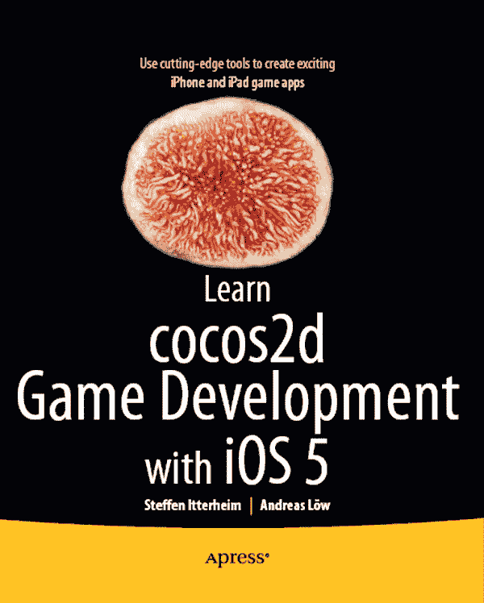
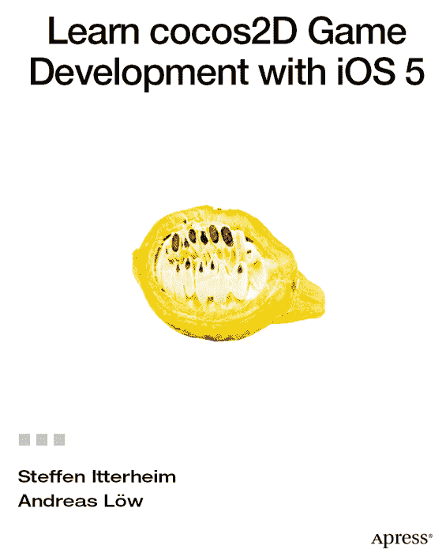

**学习使用 iOS 5 进行 cocos2D 游戏开发**

版权所有 © 2011 由 Steffen Itterheim 和 Andreas Löw 所有。

保留所有权利。未经版权所有者及出版商的书面许可，不得以任何形式或通过任何方式（电子或机械，包括影印、录音或任何信息存储或检索系统）复制或传播本作品的任何部分。

ISBN-13（平装版）：978-1-4302-3813-3  
ISBN-13（电子版）：978-1-4302-3814-0

本书中可能出现商标名称、标识和图像。我们并非在每次出现商标名称、标识或图像时都使用商标符号，而是仅以编辑方式使用这些名称、标识和图像，以维护商标所有者的利益，并且无意侵犯商标权。

本出版物中使用的商品名称、商标、服务标记和类似术语，即使未明确标识，也不应被视为对其是否受专有权利保护的观点表达。

总裁兼出版商：Paul Manning  
首席编辑：Steve Anglin  
开发编辑：Chris Nelson  
技术审阅：Boon Chew  
编辑委员会：Steve Anglin, Mark Beckner, Ewan Buckingham, Gary Cornell, Jonathan Gennick, Jonathan Hassell, Michelle Lowman, Matthew Moodie, Duncan Parkes, Jeffrey Pepper, Frank Pohlmann, Douglas Pundick, Ben Renow-Clarke, Dominic Shakeshaft, Matt Wade, Tom Welsh  
协调编辑：Kelly Moritz  
文字编辑：Kim Wimpsett  
排版：MacPS, LLC  
索引制作：SPi Global  
插画制作：SPi Global  
封面设计：Anna Ishchenko

本书通过 Springer Science+Business Media, LLC 向全球图书业发行，地址：233 Spring Street, 6th Floor, New York, NY 10013。电话：1-800-SPRINGER，传真：(201) 348-4505，电子邮件：`orders-ny@springer-sbm.com`，或访问 `www.springeronline.com`。

如需翻译相关信息，请发送电子邮件至 `rights@apress.com`，或访问 `www.apress.com`。

Apress 及 friends of ED 的书籍可用于学术、企业或促销用途的大宗采购。大多数图书也提供电子书版本和许可证。如需更多信息，请参考我们的特殊大宗销售–电子书许可网页：`www.apress.com/info/bulksales`。

本书中的信息按“原样”提供，不提供任何保证。尽管在编写本作品时已采取所有预防措施，但作者和 Apress 均不对因使用本书中的信息而直接或间接导致的任何损失或损害向任何个人或实体承担责任。

本书的源代码可供读者在 `www.apress.com` 和 `www.learn-cocos2d.com/store/book-learn-cocos2d` 获取。

*献给 Gabi，独一无二的空间蚂蚁。*  
*时而古怪，常常焦躁，始终被爱。*  
*(Steffen)*

*献给 Saskia & Renate，是你们让我得以*  
*将时间倾注于我最热爱的事物。*  
*(Andreas)*

## 内容概览

目录  
关于作者  
关于技术审阅  
致谢  
前言

第 1 章：引言  
第 2 章：入门  
第 3 章：基础知识  
第 4 章：你的第一个游戏  
第 5 章：游戏构建模块  
第 6 章：深入探讨精灵  
第 7 章：畅享滚动  
第 8 章：射击游戏  
第 9 章：粒子效果  
第 10 章：使用瓦片地图  
第 11 章：等距瓦片地图  
第 12 章：物理引擎  
第 13 章：弹球游戏  
第 14 章：游戏中心  
第 15 章：将 Cocos2d 与 UIKit 视图结合使用  
第 16 章：Kobold2D 简介  
第 17 章：非同凡响  
索引

