# 引言

你是否曾想象过自己编写一款电脑游戏，并靠它赚钱？借助苹果的 iTunes App Store 以及配套的移动设备 iPhone、iPod touch 和 iPad，这比以往任何时候都更容易实现。当然，这并不意味着一蹴而就——关于游戏开发和编程，仍有大量知识需要学习。但既然你正在阅读这本书，我相信你已经下定决心踏上这段旅程。而你选择了一个最有趣的游戏引擎之一：iOS 平台的 `cocos2d`。

使用 `cocos2d` 的开发者背景千差万别。有些人像我一样，已经做了多年甚至几十年的专业游戏开发者。另一些人则刚刚开始学习 iOS 设备的编程，或是初次涉足激动人心的游戏开发领域。无论你的背景如何，我相信你都能从这本书中获得收获。

将所有 `cocos2d` 开发者团结在一起的有两件事：我们热爱游戏，并且我们热爱创造和编写游戏。本书将向这一点致敬，同时也不会忘记那些能简化开发流程的工具。最重要的是，你将在这个过程中制作出有意义的游戏，并看到这些知识如何应用到真实的游戏开发中。

你看，我会对那些通篇只教我用某个特定游戏编程 API 制作又一个无聊的《小行星》克隆版的书籍感到厌倦。我认为，更重要的其实是游戏编程的概念和工具——那些即使 API 或你的个人编程偏好发生变化，你也能随身携带的东西。在 20 年间，我收集了数百本编程和游戏开发的书籍。直到今天，我最珍视的是那些超越了技术本身，教导我为什么某些东西要以特定方式设计和编写的书。本书将不仅关注可运行的游戏代码，还会解释它为何能工作以及需要考虑哪些权衡。

我希望你能学会编写有意义的游戏——那些在 App Store 上受欢迎且与玩家息息相关的游戏。在本书中，我将引导你理解这些游戏背后的想法和技术概念，当然，还有 `cocos2d` 和 `Objective-C` 是如何让这些游戏运转起来的。你会发现，本书附带的源代码充满了大量注释，这应该能帮助你浏览并理解代码的每一个角落和细节。

在对某个新事物进行学习时，对我最有效的方法是：借助一份指南，从他人的源代码中学习，同时专注于重要部分——我认为这对你也会非常有效。由于你可以基于本书的源代码来开发自己的游戏，我期待在不久的将来能玩到你的游戏！别忘了告诉我关于它们的信息！你可以在 Cocos2D Central（[`www.cocos2d-central.com`](http://www.cocos2d-central.com)）上分享你的项目并提出问题，也可以通过 [`steffen@learn-cocos2d.com`](http://steffen@learn-cocos2d.com) 联系我。你可能还想访问我的网站 [`www.learn-cocos2d.com`](http://www.learn-cocos2d.com)，这是一个致力于学习 `cocos2d` 的网站，并且你应该通过访问 [`www.kobold2d.com`](http://www.kobold2d.com) 来看看我是如何用 Kobold2D 改进 `cocos2d` 的。

### 第二版的新增内容

首先，我很自豪能与 Andreas Löw 共同撰写第二版。Andreas 是 TexturePacker 和 PhysicsEditor 工具的开发者，他尤其付出了巨大努力，用新代码和更好的图像更新了多个章节的项目。

最重要的是，第二版的目标是使本书与最新发展保持同步，其中包括 `cocos2d` 的最终 1.0.1 版本，以及与 Xcode 4 和 iOS 5 的兼容性。文本、代码和插图都已更新，以反映 `cocos2d`、Xcode 和 iOS SDK 的新版本。

根据读者反馈，还进行了更多改动。第 3 章 经过了彻底重写，以改进和扩展对 `cocos2d` 基本特性的描述。它也变得更加直观，使用了更多的插图来说明关键概念和类。全书插图的数量都有所增加。

在过去的一年里，出现了适用于 `cocos2d` 游戏开发的新工具。为了反映不断变化的工具格局，本书现在推荐使用 TexturePacker 而非 Zwoptex 作为主要的纹理图集创建工具。由于 Löw 全职开发他的工具，他的客户通过获得频繁更新、新功能和出色的支持而受益。类似地，第二版使用 PhysicsEditor 替代了 VertexHelper，因为它提供了更好的工作流程和强大的便捷功能。最后，第二版向您介绍了 Glyph Designer，它本质上是 Hiero 位图字体工具，但具有原生的 Mac OS X 用户界面，并且没有困扰 Hiero 的那些错误。

最初在第 6 章 中介绍并贯穿第 7 章 到第 9 章 使用的射击游戏项目，已经进行了图形大修。这么说吧，它的外观比之前我的程序员画风要好看得多。同样地，第 13 章 的弹球物理游戏，也通过新代码和改进的图形得到了提升。相应地，上述章节经历了一些较大的改动。

最后但同样重要的是，第二版新增了两个全新的章节。

第 15 章 探讨了经常被误解且未充分利用的一种可能性：将 `cocos2d` 与常规的 UIKit 视图混合使用。你将学习如何将 UIKit 视图添加到 `cocos2d` 应用中，以及如何将 `cocos2d` 添加到已有的 UIKit 应用中。无论你从哪边出发，这一章都将使你更容易跨越纯 UIKit 和纯 `cocos2d` 应用之间的鸿沟。

第 16 章 向你介绍了 Kobold2D（[`www.kobold2d.com`](http://www.kobold2d.com)），这是我对让 `cocos2d` 成为更好的游戏开发环境的设想。Kobold2D 旨在让常见任务变得简单，同时在发行版中加入了预配置的库，例如 `wax`（Lua 脚本）、`ObjectAL`（OpenAL 音频）和 `cocos3d`（3D 渲染）。它还附带了许多项目模板，其中许多基于本书讨论的项目。

### 为什么在 iOS 上使用 cocos2d？

当游戏开发者寻找游戏引擎时，他们首先会评估各种选择。我认为 `cocos2d` 对许多开发者来说是一个很好的选择，原因很多。

#### 它是免费的

首先，它是免费的。使用它不会花费你一分钱。你可以用它创建免费和商业版的 iPhone、iPod 和 iPad 应用。你甚至可以用它制作 Mac OS X 应用。你无需支付版税。真的，没有任何附加条件。

#### 它是开源的

使用 `cocos2d` 的另一个好理由是它是开源的。这意味着没有黑匣子阻止你从游戏引擎代码中学习，或在必要时对其进行修改。这使得 `cocos2d` 既可扩展又灵活。

你可以从 [`www.cocos2d-iphone.org/download`](http://www.cocos2d-iphone.org/download) 下载 `cocos2d`。


#### 它很客观，明白吗？

此外，`cocos2d` 是用 `Objective-C` 编写的，这是苹果公司用于编写 iOS 应用的原生编程语言。它与 iOS SDK 使用相同的语言，这使得理解苹果文档和实现 iOS SDK 功能变得更加容易。

许多其他有用的 API，如 `Facebook Connect` 和 `OpenFeint`，也是用 `Objective-C` 编写的，因此集成这些 API 也变得更加容易。

**注意：** 即使你偏爱其他语言，也建议学习 `Objective-C`。我本人有扎实的 C++ 和 C# 背景，`Objective-C` 的语法初看时非常奇怪。对于要学习一种据称老旧过时的新编程语言，我并不感到高兴。毫不意外，我挣扎了一段时间才掌握这种编程语言的写法，因为它要求我摒弃旧习惯和固有预期。

不过，别让使用 `Objective-C` 编程的想法困扰你。它确实需要一些时间适应，但仅凭其海量的文档资源，这点付出很快就能得到回报。我保证你不会后悔！

#### 它是 2D 的

当然，`cocos2d` 的名字里带着“2D”是有原因的。它专注于帮助你创建 2D 游戏。这是目前其他 iOS 游戏引擎很少提供的专业化方向。

它并不阻止你加载和显示 3D 对象。事实上，一个名为 `cocos3d` 的完整附加产品已经作为开源项目创建，用于为 `cocos2d` 添加 3D 渲染支持。

但我必须说，iOS 设备是优秀 2D 游戏的理想平台。即使在今天，iTunes App Store 上发布的大部分新游戏仍然是纯 2D 游戏。2D 游戏通常更易于开发，其算法也更易于理解和实现。几乎在所有情况下，2D 游戏对硬件的要求更低，允许你创建更加生动、细节更丰富的图形。

#### 它自带物理引擎

还有两个物理引擎可供选择，它们已经与 `cocos2d` 集成。一个是 `Chipmunk`，另一个是 `Box2d`。这两个物理引擎表面上的主要区别在于它们使用的编程语言：`Chipmunk` 用 C 语言编写，而 `Box2d` 用 C++ 编写。功能集几乎相同。如果你要寻找差异，也是能找到一些的，但这需要对物理引擎的工作原理有很好的理解，才能基于差异做出选择。通常，你只需选择你认为更易理解且文档更完善的物理引擎，对大多数开发者来说，这往往是 `Box2d`。此外，其面向对象的特性使其与 `Objective-C` 配合使用起来稍微容易一些。

#### 它不那么技术化

游戏开发者最喜欢 `cocos2d` 的一点是它隐藏了底层的 `OpenGL ES` 代码。大多数图形都是通过从图像文件创建的简单精灵类来绘制的。换句话说，精灵是一个纹理，只需更改 `CCSprite` 类的相应 `Objective-C` 属性，就可以对其应用缩放、旋转和颜色。你无需关心这是如何通过 `OpenGL ES` 代码实现的，这是一件好事。

同时，`cocos2d` 赋予你灵活性，可以随时为任何需要它的游戏对象添加你自己的 `OpenGL ES` 代码。如果你正在考虑添加一些 Cocoa Touch 用户界面元素，你会很高兴知道这些元素也可以混合使用。

而且，`cocos2d` 不仅让你免受 `OpenGL ES` 复杂细节的困扰；它还提供了对常见任务的高级抽象，其中一些任务若没有它，则需要广泛的 iOS SDK 知识。但如果你确实需要更底层的访问权限或想使用 iOS SDK 功能，`cocos2d` 也不会阻碍你。

#### 它仍然是编程

总的来说，你可以说 `cocos2d` 让 iOS 游戏编程变得更简单，同时仍然首先要求你具备出色的编程技能。其他 iOS 游戏引擎，如 `Unity`、`iTorque` 和 `Shiva`，致力于提供工具集和工作流程，以减少所需的编程知识量。相应地，你会牺牲一些技术自由度——以及金钱。使用 `cocos2d`，你需要多付出一点努力，但你能在无需真正处理核心的情况下，尽可能地接近游戏编程的核心。

#### 它拥有一个很棒的社区

`cocos2d` 社区里总是有人能快速回答问题，开发者们也普遍乐于分享知识和信息。你可以通过官方论坛（[`www.cocos2d-iphone.org/forum`](http://www.cocos2d-iphone.org/forum)）或我自己的论坛“Cocos2D Central”（[`http://cocos2d-central.com`](http://cocos2d-central.com)）与社区联系。

新的教程和示例源代码几乎每天都有发布，其中大部分是免费的。你可以在互联网上找到大量资源来学习和汲取灵感。

一旦你的游戏完成并在 App Store 上发布，你甚至可以在 `cocos2d` 网站上推广它。至少，你会得到同行开发者的关注，理想情况下还能获得宝贵的反馈。

**提示：** 为了跟上 `cocos2d` 社区的最新动态，我建议在 Twitter 上关注 `cocos2d`：[`http://twitter.com/cocos2d`](http://twitter.com/cocos2d)。

既然你关注了，或许也可以关注我：[`http://twitter.com/gaminghorror`](http://twitter.com/gaminghorror)。

接下来，在 Twitter 的搜索框中输入 `cocos2d`，然后点击“保存此搜索”链接。这样，你可以定期通过一次点击来查看关于 `cocos2d` 的新帖子。很多时候，你会遇到有用的 `cocos2d` 相关信息，否则这些信息可能会被你错过。而且，你绝对会结识同样在使用 `cocos2d` 的同行开发者。


#### `cocos2d-iphone` 项目的未来

2011 年 5 月，Zynga 宣布已聘用 `cocos2d-iphone` 项目的核心贡献者 Ricardo Quesada 和 Rolando Abarca。

Zynga 是热门社交游戏《Farmville》的开发商。《Farmville》的 iPhone 版本正是使用 `cocos2d-iphone` 开发的，并于 2010 年 6 月发布。随着 Quesada 和 Abarca 加入 Zynga，预计该公司将基于 `cocos2d-iphone` 开发更多 iOS 游戏。

Quesada 是 `cocos2d-iphone` 的创始人和首席开发者。事实上，自 2008 年以来，他一直负责 `cocos2d-iphone` 的方方面面：管理网站、培育社区，并且是推动 `cocos2d-iphone` 项目发展和成功的核心力量。Abarca 是该项目的贡献者，以其为 `cocos2d-iphone` 编写的 Ruby 封装器而闻名。

两位开发者分别从阿根廷和智利搬迁至旧金山为 Zynga 工作。与此同时，他们之前所在的公司 Sapus Media 在将两款旗舰产品 Sapus Tongue Source Code 和 Level SVG 出售给 Zynga 后，已停止销售这两款产品。

这意味着 Quesada 和 Abarca 现在有了稳定的薪水，无需再通过销售、支持和维护他们的商业产品来谋生。另一方面，他们现在将主要为 Zynga 工作，他们的工作成果最终有多少会融入到公开可用的开源版本 `cocos2d-iphone` 中，还有待时间验证。目前，Ricardo 正在致力于 `cocos2d 2.0` 的开发，该版本将**专门**使用 `OpenGL ES 2.0`。

尽管 Zynga 承诺会推动 `cocos2d-iphone` 项目和社区的发展，但我们仍有理由怀疑 `cocos2d-iphone` 项目是否能保持与过去相同的发展速度。不过，社区可以自力更生，部分成员已经启动了一个名为 `cocos2d-iphone-extensions` 的项目，为 `cocos2d-iphone` 游戏引擎提供额外的功能。

我认为我们不必过分担心 `cocos2d` 的未来。`cocos2d-iphone` 项目拥有强大的社区并被广泛采用，即使存在其他竞争性的游戏引擎，但其中大多数是商业和专有的，不像 `cocos2d-iphone` 那样免费且开源。

#### 其他 `cocos2d` 游戏引擎

你可能已经注意到，`cocos2d` 有适用于多种平台的移植版本，包括 Windows、JavaScript 和 Android。甚至还有一个名为 `cocos2d-x` 的 C++ 版本，它支持包括 iOS 和 Android 在内的多个移动平台。

这些 `cocos2d` 移植版本共享相同的名称和设计理念，但由不同的作者使用不同的语言编写，并且通常与 iOS 版的 `cocos2d` 有很大差异。例如，Android 版 `cocos2d` 是用 Java 编写的，而 Java 正是 Android 设备开发的原生语言。

如果你有兴趣将游戏移植到其他平台，你应该知道各种 `cocos2d` 游戏引擎之间差异很大。例如，将游戏移植到 Android 并非易事。首先是语言障碍——你所有的 Objective-C 代码都必须用 Java 重写。即使完成了这一步，你仍然需要进行大量修改，以应对 `cocos2d` API 的众多变化，或者移植版本或目标平台可能不支持的特性。最后，每个移植版本都可能存在自己特有的 bug，每个平台也都有自己的技术限制和挑战。

总的来说，将使用 `cocos2d` 编写的 iOS 游戏移植到同样拥有 `cocos2d` 游戏引擎的其他平台，其工作量几乎等同于使用其他游戏引擎为目标平台重写游戏。这意味着没有一键切换就能搞定的方法。各个平台上 `cocos2d` 引擎的相似性主要体现在名称和理念上。如果你的目标是跨平台开发，你应该关注一下 `cocos2d-x`，它拥有 `cocos2d-iphone` 的大部分功能，并获得了中国联通的资金支持。

无论如何，你仍然应该了解最流行的 `cocos2d` 游戏引擎。表 1-1 列出了那些更新频繁且足够稳定、可用于生产环境的 `cocos2d` 游戏引擎。我没有将那些严重过时且数月甚至数年未更新的 `cocos2d` 移植版本列入此表。

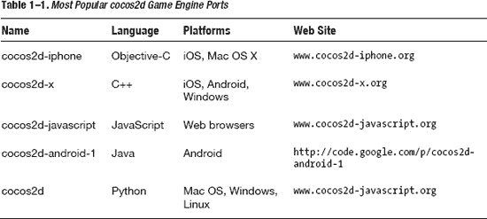

#### 本书适合你

我想象你选择这本书是因为它的标题引起了你的兴趣。我猜想你想为 iPhone、iPod touch 和 iPad 制作 2D 游戏，并且你选择的游戏引擎是适用于 iOS 的 `cocos2d`。或者你可能并不在意使用什么游戏引擎，但确实想为 iOS 设备制作 2D 游戏。又或者你已经使用 `cocos2d` 一段时间了，正在寻找一些深入的讨论。无论你选择这本书的原因是什么，我相信你都会从中受益匪浅。

#### 先决条件

与每本编程书籍一样，有些事情最好能满足，而另一些几乎是必须的。

##### 编程经验

本书唯一必须的条件是具备一定的编程经验，所以我们先把这个说清楚。你应该理解循环、函数、类等编程概念。如果你以前编写过计算机程序，最好是使用面向对象的编程语言，那应该就没问题了。

还在看吗？很好。

##### Objective-C

那么，你确实有编程经验，但也许你从未用那种晦涩的语言 `Objective-C` 写过任何东西。

阅读本书你不需要掌握 `Objective-C`，但了解这门语言的基础知识绝对会有帮助。如果你已经熟悉至少一种其他的面向对象编程语言，例如 `C++`、`C#` 或 `Java`，你也许可以在学习本书的过程中顺便掌握它。但说实话，即使我在使用 `C++`、`C#` 和各种脚本语言方面已有大约 15 年的编程经验，我自己也觉得这么做很难。总会有那些关于小细节的烦人问题，让你无法立刻理解，并且它们往往会分散你的注意力。在这种情况下，如果有一个参考资料，在你需要理解 `Objective-C` 的某些内容时可以随时查阅，那会非常方便。

`Objective-C` 的方括号可能看起来有点吓人，你可能也听说过一些关于它内存管理的恐怖故事，以及 iOS 设备上没有垃圾回收机制。别担心。

首先，`Objective-C` 只是换了件外衣。它看起来不熟悉，但底层的编程概念，如循环、类、继承和函数调用，仍然与其他编程语言的工作方式相同。术语可能不同；例如，`Objective-C` 开发者所说的*发送消息*，本质上与调用方法是一回事。至于内存管理，可以这么说，`cocos2d` 已经尽可能让你轻松了，我会帮助你理解那些你可以遵循的非常简单和基本的规则。

我曾有一本非常宝贵的 `Objective-C` 书籍供我学习，我全心全意推荐它作为辅助读物，以备你想了解更多关于 `Objective-C` 和 `Xcode` 的知识。这本书是由 Mark Dalrymple 和 Scott Knaster 合著的《在 Mac 上学习 Objective-C》，由 Apress 出版。

此外，苹果公司的《Objective-C 编程语言介绍》也是一份非常有价值的在线参考资料。你可以在这里找到它：[`http://developer.apple.com/mac/library/DOCUMENTATION/Cocoa/Conceptual/ObjectiveC/Introduction/introObjectiveC.html`](http://developer.apple.com/mac/library/DOCUMENTATION/Cocoa/Conceptual/ObjectiveC/Introduction/introObjectiveC.html)。


### 你将学到什么

我将与你分享大量游戏开发经验，展示交互式游戏是如何制作的。我认为学习编程并非死记 API 方法，但过去二十年我读过许多游戏开发书籍都遵循那种"参考手册"式的思路。可那本是 API 文档该做的事。大约 20 年前我开始编程时，觉得仅靠堆积如山的编译器参考手册和指南根本学不会编程。那时编译器手册还是印刷版，当然也没有在线版本。万维网尚处萌芽阶段。所以那些资料在我桌上堆了约 15 英寸高，想全部学完简直让人望而生畏。

直到今天，我依然记不住大部分方法和 API，曾经熟悉的也总在遗忘。我不得不反复查阅。经过 20 年编程实践，我清楚真正该学的是什么：概念。优秀的编程概念和最佳实践能长久留存，并帮助你用任何语言编程。学习概念的最佳方式是理解源码设计、架构和编写背后的决策逻辑。这正是我最关注的重点。

#### 初学 iOS 游戏开发者将学到什么

我将循序渐进地引导你掌握`cocos2d`最重要的特性。重点讲解那些因在`cocos2d`编程中极为基础而应该牢记的类、方法和概念。

你还会学习支持或被`cocos2d`支持的核心工具。没有这些工具，你的`cocos2d`编程能力只能发挥一半。你将使用`TexturePacker`和`ParticleDesigner`等工具创建复杂度递增、开发挑战性越来越强的游戏。受本书篇幅限制，这些游戏不会是完整精良的作品，我也无法讨论每一行代码。取而代之，我会在代码中添加大量注释，便于你理解和跟进。

我留给你改进这些游戏骨架项目的空间，并且很期待看到你的成果。相比用整本书带你玩典型的《小行星》游戏，提供多个起点让你基于它们创作自己的作品效果更好。

我根据 App Store 的热度以及与游戏开发者（他们经常询问如何解决这些游戏呈现的具体问题）的相关性选择了本书的游戏项目。例如，划线类游戏是 cocos2d 开发者最爱的类型之一，但这类游戏需要你克服看似简单实则复杂的挑战。

我还浏览过不少其他开发者的 cocos2d 代码，并关注了关于代码设计、结构和风格的讨论。我的代码示例将基于一个"组合优于继承"的框架，并解释为什么这种方案更可取。另一个与代码设计相关的常见问题是不同对象如何相互通信。每种代码设计和结构方法都有有趣的优缺点，我希望传达这些概念，因为它们能帮助你编写更稳定、更少 bug 且性能更优的代码。

#### iOS App 开发者将学到什么

那么，你是 iOS app 开发者，之前用过 iOS SDK？太棒了。那你最感兴趣的可能是游戏开发如何在脱离 Interface Builder 的世界中运作。事实上，你会使用其他工具。它们可能不如苹果工具那么炫酷，但同样实用。

编程思路也会改变。游戏编程中通常不需要发送和接收大量事件，而是让更多对象自行决定如何处理事件。出于性能考虑和减少用户输入延迟，游戏引擎系统往往更紧密地协同工作。大量工作通过循环和更新方法完成，这些方法在每一帧或特定时间点被调用。当 UI 驱动的应用大部分时间在等待用户输入时，游戏即使在玩家没有任何操作时也在后台持续推送数据和像素。因此，游戏中有更多事情在同时发生，出于性能考虑，游戏代码往往更精简高效。

#### Cocos2d 开发者将学到什么

你已经熟悉`cocos2d`了？你可能怀疑这本书能否让你学到新东西。我保证可以。也许你需要跳过前几章，但一定会被随书附带的游戏示例源代码吸引。你会学到如何组织代码及其背后的逻辑。阅读各种游戏实现方式可能会给你带来启发。此外还有大量实用技巧让你受益。

最重要的是，这本书并非由某个你闻所未闻、日后也不会再联系的极客所写（甚至不提供邮箱或网站供你提问）。相反，作者是你可能没听说过但会持续活跃的极客。我活跃在`cocos2d`社区，在我的[`www.learn-cocos2d.com`](http://www.learn-cocos2d.com)博客上，可以说我一直在延续这本书的写作。

### 本书内容概览

以下是各章简要介绍。本书第二版新增了两个章节：第 15 章讨论 UIKit 视图与`cocos2d`的集成，第 16 章介绍 Kobold2D——我基于`cocos2d`开发环境打造的增强版本。

## 第 2 章"起步"

我将介绍搭建`cocos2d`开发环境、安装项目模板以及创建第一个"Hello World"项目。你将学习场景和节点等`cocos2d`基础概念。

## 第 3 章"核心要素"

我将解释你最常用的核心`cocos2d`类，如精灵、转场和动作。当然，你也会学会如何使用它们。

## 第 4 章"你的第一个游戏"

敌人从屏幕顶端掉落，你需要倾斜设备躲避它们。这将是首个使用加速度计控制的简易游戏。

## 第 5 章"游戏构建模块"

现在准备迎接一个需要更好代码结构的更大游戏。你将学习场景和节点的分层方式，以及游戏对象交换信息的多种方法。

## 第 6 章"精灵深度解析"

你将了解什么是纹理图集、为何要在下一个游戏中使用它，以及如何用`TexturePacker`工具创建纹理图集。

## 第 7 章"快乐滚动"

准备好纹理图集后，你将学习如何实现通过触摸控制、带视差滚动的射击游戏。

## 第 8 章"射击游戏"

没有敌人，射击游戏就无物可射，对吧？我将展示如何添加游戏逻辑来生成、移动、击中并动画化敌人军团。

## 第 9 章"粒子特效"

通过使用`ParticleDesigner`工具，你将给横版卷轴游戏添加粒子特效。


#### 第 10 章，《使用瓦片地图》

无限向上跳跃，你将运用从纵向卷轴游戏中学到的知识，来打造另一种流行的 iOS 游戏类型。

#### 第 11 章，《等距瓦片地图》

由于 `cocos2d` 支持 `TMX` 文件格式，你将了解如何使用 `Tiled` 编辑器创建基于瓦片的游戏。

#### 第 12 章，《物理引擎》

用手指尖的动作控制物体的去向——你将在这里学习如何实现。

#### 第 13 章，《弹球游戏》

这是一份关于使用 `Chipmunk` 和 `Box2d` 物理引擎的入门教程——以及你能用它们做的疯狂事情。

#### 第 14 章，《Game Center》

这一次，你将利用真实的物理引擎，在太空中制作一款反抗重力、弹跳星球、发射弹珠的射击游戏。它不会很写实，但会具备真实的物理效果。这或许是个难题，但无论如何都很有趣。

#### 第 15 章，《Cocos2d 与 UIKit 视图》

本章深入探讨了如何将 `cocos2d` 与常规的 Cocoa Touch（特别是 UIKit 视图）混合搭配使用。你将学习如何向 `cocos2d` 游戏添加 UIKit 视图，或者反过来，如何在现有的 UIKit 应用中使用 `cocos2d`。

#### 第 16 章，《Kobold2D 介绍》

`Kobold2D` 是我对改进 `cocos2d` 游戏引擎的尝试，通过添加流行的库并将它们整合成一个可直接使用的单一包。在本章中，你将学习如何设置新的 `Kobold2D` 项目，了解 Lua 脚本在 `Kobold2D` 中的作用，并初步了解使用 `cocos3d` 进行 3D 游戏开发。

#### 第 17 章，《结论》

这里就是本书的结尾了。不过别担心，你的旅程不会就此结束。你将获得关于下一步走向何方的灵感。

### 如何获取本书的源代码？

本书第一版发布后，最常被问到的问题之一就是如何获取本书的源代码。我添加了这个小节来回答这个问题。

你可以通过以下链接在 Apress 网站的“源代码/下载”部分获取本书的源代码：[`www.apress.com/9781430233039`](http://www.apress.com/9781430233039)。或者，你也可以在 Cocos2D Central 的“下载”部分下载源代码：`cocos2d-central.com/files/file/2-source-code`。

当然，如果你愿意，也始终可以直接从书中输入代码。

### 问题与反馈

我真心希望我能把握好分寸，既让你轻松上手 `cocos2d` 和 iOS 游戏开发，又能用高级游戏编程概念给你带来挑战。

如果我在任何时候未能做到这一点，让你感到困惑，请随时在 Cocos2D Central（[`www.cocos2d-central.com`](http://www.cocos2d-central.com)）提出你的问题。我也会继续在本书的配套网站 Learn Cocos2D（[`www.learn-cocos2d.com`](http://www.learn-cocos2d.com)）上频繁发布关于 `cocos2d` 新闻和进展的帖子。你的反馈总是受欢迎的！

## 第 2 章

## 入门

我将尽快让你跟上进度，并开始开发 `cocos2d` 游戏。到本章结束时，你将能够基于提供的 Xcode 项目模板创建新的 `cocos2d` 项目。我还会向你介绍在游戏开发过程中需要牢记的一些重要知识点。而且，由于内存管理一直是一个容易混淆的地方，我将解释 `cocos2d` 中内存管理的工作原理，理想情况下，帮助你避免一些常见的陷阱。在本章末尾，你将拥有一个基于项目模板的、正常运行起来的第一个 `cocos2d` 项目。

### 入门所需条件

在本节中，我将快速带你了解入门所需的条件和必要步骤。苹果公司对如何注册成为 iOS 开发者以及创建必要的配置文件都提供了极好的文档说明，因此我不会在此重复这些详细信息。

#### 系统要求

以下是开发 iOS 应用程序的最低硬件和软件要求：

*   基于 Intel 的 Mac 电脑，配备 1GB 内存
*   Mac OS X 10.6（雪豹）或更高版本
*   任意 iOS 设备

对于开发而言，任何基于 Intel 的 Mac 电脑都足够了。即使是 Mac mini 和 MacBook Air 也完全可以胜任 iOS 应用程序和游戏的开发任务。不过，我建议你安装 2GB 的内存。这会让你的电脑运行更流畅，尤其因为游戏开发工具通常比其他大多数软件需要更多的内存。你将处理大量的图像、音频文件和程序代码，而且很可能会并行运行所有这些工具。

请注意，自 2010 年 6 月 iOS SDK 4 发布以来，Mac OS X 10.6 是进行 iOS 开发的必备系统。随着 Mac OS X 10.7 Lion 的发布，可以预期它最终会成为 iOS 开发的必要条件。作为苹果开发者，你通常需要定期使用最新的 OS X 版本。

如果你运行的是较旧版本的 Mac OS X，请查阅 Max OS X 技术规格网站（[`www.apple.com/macosx/specs.html`](http://www.apple.com/macosx/specs.html)），了解你的 Mac 是否符合系统要求，以及如何购买并升级到最新的 Mac OS X 版本。

#### 注册成为 iOS 开发者

如果你还没有这样做，你可能想要在苹果公司注册成为一名 iOS 开发者。iOS 开发者项目的访问权限每年需要 99 美元。如果你打算向 Mac App Store 提交 Mac OS X 应用，你还需要注册成为 Mac OS X 开发者，这需要额外支付每年 99 美元。

作为注册开发者，你可以访问 iOS SDK、Xcode 和 iOS 开发者门户，你需要在门户上设置你的开发设备和配置文件，以便将你的应用部署到 iOS 设备上。你还可以访问 iTunes Connect，在那里可以管理你的合同、管理和提交你的应用，并查看财务报告。此外，你还能获得苹果软件的预览（测试版）。注册的 Mac OS X 开发者还可以免费访问最新的 Mac OS。

你可以在 [`http://developer.apple.com/programs/ios`](http://developer.apple.com/programs/ios) 注册成为 iOS 开发者。

要注册成为 Mac OS X 开发者，请访问 [`http://developer.apple.com/programs/mac`](http://developer.apple.com/programs/mac)。

**提示：** 你也可以从 Mac App Store 免费获取 Xcode。这个下载包含了 iOS SDK 和 Mac OS X SDK。你将能够为 iOS 和 Mac OS X 开发 `cocos2d` 应用。但缺点是：除非你注册成为 iOS 开发者，否则无法在 iOS 设备上运行你的 iOS 应用，因此你将仅限于使用 iOS 模拟器。而且，在分别注册成为 iOS 或 Mac OS 开发者之前，你无法将你的应用提交到 iOS App Store 或 Mac App Store。

#### 证书和配置文件

最终，你会想要将你正在构建的游戏部署到你的 iOS 设备上。为此，你必须创建一个 iOS 开发证书，注册你的 iOS 设备，并将其启用用于开发。最后，你需要创建开发或分发配置文件，将它们下载到你的电脑上，并设置每个 Xcode 项目来使用它们。

所有这些步骤在 iOS 配置门户中都有很好的说明。苹果公司在配置门户每个部分的“如何操作”选项卡中对这些步骤进行了出色的文档说明。

注册的 iOS 开发者可以访问 iOS 配置门户，地址是：[`http://developer.apple.com/ios/manage/overview/index.action`](http://developer.apple.com/ios/manage/overview/index.action)。


### 下载并安装 iOS SDK

作为已注册的 iOS 开发者，你可以从 iOS Dev Center 下载最新的 iOS SDK。该下载包体积超过 4GB，下载和安装需要一些时间，因此建议你立即开始操作。

iOS SDK 安装完成后，你就拥有了开发 iOS 应用所需的一切环境，包括 Xcode 集成开发环境（IDE）。如果你之前从未使用过 Xcode，我建议你先熟悉它。我推荐 Ian Piper 所著的《*Learn Xcode Tools for Mac OS X and iPhone Development*》（Apress, 2010）。

**注意：** 你可能会倾向于尝试 iOS SDK 的最前沿开发版本。iOS SDK 的测试版会不时发布。我建议除非你有非常非常充分的理由，否则不要使用 iOS SDK 的测试版！

测试版可能包含错误，可能与当前的 cocos2d 版本不兼容，并且受保密协议（NDA）约束。这意味着，如果出现与测试版相关的任何问题，你将难以找到解决方案，因为任何人都不能公开讨论测试版 SDK。

此外，你必须在设备上安装 iOS 的测试版，并且无法回退到之前的 iOS 版本。你设备上已安装的应用可能与新的 iOS 测试版不兼容，而且这些应用通常要等到新版 iOS SDK 正式发布后才会更新。如果你的工作依赖于任何应用，请不要升级。

### 下载并安装 cocos2d

下一步是获取 cocos2d。你可以从 [`www.cocos2d-iphone.org/download`](http://www.cocos2d-iphone.org/download) 下载。由于许多新开发者在使用模板安装脚本时仍会遇到问题，我也提供了一个 cocos2d 和 cocos3d 的安装程序，它可以为你自动运行模板安装脚本。你可以从 Cocos2d Central 下载该安装程序：[`http://cocos2d-central.com/files/file/6-installer`](http://cocos2d-central.com/files/file/6-installer)。

我建议下载并解压 cocos2d 的**稳定版**。**非稳定版**并非意味着它会频繁崩溃，但它是一个测试版。它通常可以正常工作，但可能存在一些粗糙之处、未经测试的功能或与第三方工具不兼容的情况。在考虑使用非稳定版之前，请先查看发布说明，确认其中是否包含对你特别有用的内容。如果没有，就坚持使用稳定版。

下载并解压 cocos2d 后，你会看到一个名为 `cocos2d-iphone-1.0.1` 或类似名称的子文件夹，具体取决于你下载的 cocos2d 版本号。

#### 安装 cocos2d Xcode 项目模板

**注意：** 如果你使用了我提供的 cocos2d/cocos3d 安装程序，可以跳过本节内容。Xcode 项目模板已被安装程序自动安装。

打开 **终端** 应用，你可以在 Mac 上“应用程序”文件夹中的“实用工具”文件夹里找到它。或者在 Spotlight 中直接输入 `Terminal.app` 来定位。cocos2d Xcode 项目模板的安装过程由一个 shell 脚本驱动，你需要从命令行程序“终端”中运行它。

首先，切换到 cocos2d 的安装目录。例如，如果你的 cocos2d 版本安装在“文稿”目录下的 `cocos2d-iphone-1.0.0` 文件夹中，则输入以下内容：

`cd ~/Documents/cocos2d-iphone-1.0.0`

按下回车键进入 cocos2d 目录，然后输入以下内容：

`./install-templates.sh –f -u`

按下回车键运行模板安装脚本。如果一切顺利，你应该会在终端窗口中看到多行输出文本。其中大部分会以“…copying”开头。如果是这种情况，那么模板应该已经安装成功。

如果出现任何错误，请确认你已使用 `cd` 命令进入了 `cocos2d-iphone` 目录，并且 `install-templates.sh` 脚本的命令正确无误，包括命令与 `–f` 和 `–u` 选项之间的空格。如果这样仍无法解决，可以考虑使用我创建的 cocos2d 安装程序，它正是为了缓解这类令人头疼的模板安装问题而设计的。你可以从这里下载该安装程序：

`cocos2d-central.com/files/file/6-installer`

#### 创建一个 cocos2d 应用

现在打开 Xcode，选择 **文件  新建项目**。在“用户模板”下，你应该能看到 cocos2d 项目模板，如 图 2-1 所示。

**注意：** Box2d 和 Chipmunk 应用模板将在第 13 章中讨论。如果你想现在就体验一下物理引擎的乐趣，可以随意试用它们。

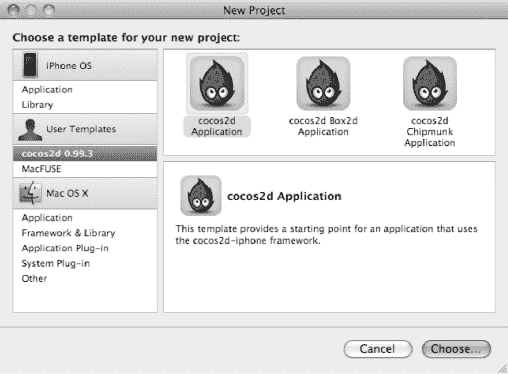

**图 2-1.** *cocos2d Xcode 项目模板*

选择 **cocos2d Application** 模板，并将其命名为 `HelloWorld`。

**提示：** 建议不要在项目名称中使用空格字符。Xcode 并不介意，但你可能会用到的一些其他工具可能会介意。这纯粹是一种预防性措施，以避免任何潜在问题。

在很长很长一段时间里，构建操作系统和应用程序的程序员可以依赖文件名不包含空格这一惯例。即使在现代操作系统允许文件名包含空格至少 10 年后的今天，文件名的空格和特殊字符仍然偶尔会引发问题。我始终避免在与代码相关的任何命名中使用空格或其他特殊字符，无论是项目、源文件还是资源文件。只有数字、字母、减号和下划线对开发者来说是确保安全的。

Xcode 将基于模板创建项目。一个类似 图 2-2 所示的 Xcode 项目窗口将会打开。

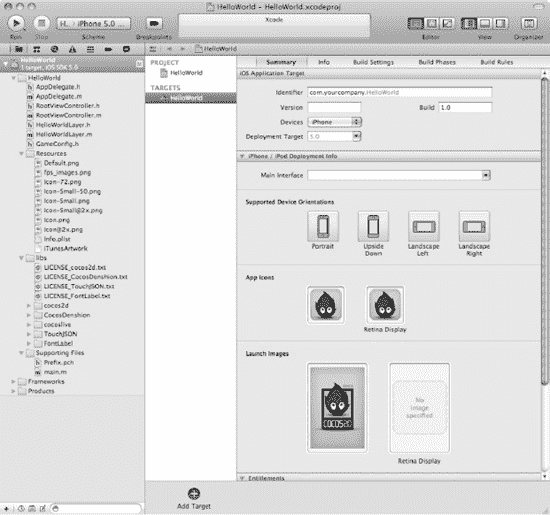

**图 2-2.** *Xcode 4 中新创建的 HelloWorld 项目*

当你点击 **运行** 按钮时，项目将会编译并在 iOS 模拟器中运行。结果应如 图 2-3 所示。

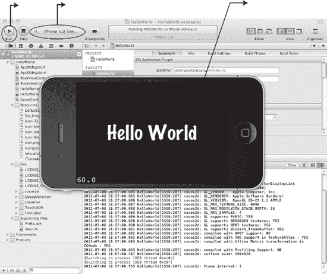

**图 2-3.** *成功了！模板项目运行正常，并在 iPhone 模拟器中显示了一个“Hello World”标签。*

### HelloWorld 应用

就这样——你几乎毫不费力就创建了一个可以运行的 cocos2d 应用。完美。无需多言。无需多言。

但现在你想知道它是如何工作的，对吗？好吧，我可不指望你会这么轻易放过我。我有种预感，无论我在本书中深入探讨多少细节，你都会想了解更多。这就是求知精神！

让我们检查一下 HelloWorld 代码项目的内容，了解其工作原理，这样你就能对整个架构有个大致的了解。你可以随意摆弄这个 HelloWorld 项目。如果不小心搞坏了，只需从 cocos2d 模板重新创建一个新项目即可。随着本书的深入，你将学习到 all 关于 cocos2d 以及本章首次提到的各项设置的详细信息。


### 定位 HelloWorld 文件

首先，为您快速介绍一下。默认情况下，您会在 Xcode 项目窗口左侧看到一个名为 **项目导航器** 的面板，如图 2–4 所示。Xcode 在此处保存所有文件引用，以及目标和可执行文件等其他内容。先暂时关注 HelloWorld 项目下的组和文件。

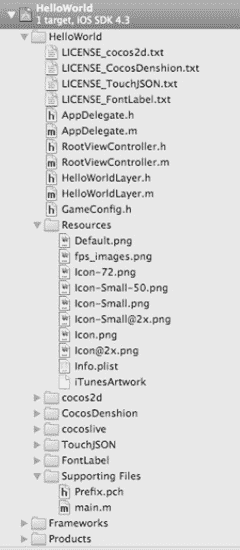

**图 2–4.** *Xcode 的项目导航器面板。展开的组包含了我们将要查看的项目文件。*

在名为 `cocos2d` 的组中，您可以找到构成 cocos2d 游戏引擎的所有文件。如果好奇，可以随意浏览这些文件，但除非您清楚自己在做什么，否则不应修改它们。其他与 cocos2d 相关的组也是如此；这些是在图 2–4 中未展开的组。

您无需了解 cocos2d 游戏引擎的细节，但能够访问源文件是件好事，尤其是在调试时，或者当您感到好奇，想了解其底层运作机制并学习一些技巧时。

**注意：** Xcode 的项目导航器面板看起来很像 **访达** 中的文件夹和文件。请不要将 Xcode 所谓的 *组* 与 *访达* 的文件夹混淆。您可以在 Xcode 中将文件组织成多个组，但在 *访达* 中，它们通常（也可能始终）位于同一个文件夹中。这就是它们被称为 *组* 而非 *文件夹* 的原因。它们允许您逻辑地排列文件，而不会影响它们在计算机硬盘上的物理位置。

### 资源

在 **资源** 组中，您可以找到（稍后也会添加）所有非源代码的额外文件，例如图片和音频文件。

`Default.png` 文件是 iOS 加载您的应用时显示的图片，而 `Icon.png` 当然是应用的图标。`fps_images.png` 文件被 cocos2d 用来显示帧率；您不应移除或修改它。

在 `Info.plist` 文件中，您可以找到应用的大量设置。只有当您接近发布应用时，才需要在此处进行修改。

### 支持文件

如果您熟悉 C 或类似语言的编程，可能会认出 **其他源文件** 组中的 `main.m` 是应用程序的起点。该组中唯一的另一个文件是预编译头文件 `Prefix.pch`。

#### Main.m

从 `main` 函数到 `HelloWorldAppDelegate` 类之间发生的所有事情，都是 iOS SDK 在幕后施展的魔法，您无法控制。由于您几乎不需要更改 `main.m`，因此可以安全地忽略其内容。不过，瞄一眼也并无坏处。

简单总结一下，`main` 函数创建了一个 `NSAutoreleasePool`，然后调用 `UIApplicationMain` 来启动应用程序，其中 `HelloWorldAppDelegate` 作为实现 `UIApplicationDelegate` 协议的类。

```
int main(int argc, char *argv[])
{
    NSAutoreleasePool *pool = [NSAutoreleasePool new];
    int retVal = UIApplicationMain(argc, argv, nil,        @"HelloWorldAppDelegate");
    [pool release];
    return retVal;
}
```

从中需要了解的唯一有趣点是：每个 iOS 应用程序都使用 `NSAutoreleasePool` 来帮助您管理内存。简而言之，通过对对象使用自动释放（`autorelease`）消息，您无需担心向它们发送 `release` 消息。自动释放池确保自动释放对象的内存最终会被释放。如果您对这里所说的内容一头雾水，也不必担心。本章稍后我将向您介绍 cocos2d 的内存管理。

您还可以在 Apple 的内存管理编程指南（[`http://developer.apple.com/library/mac/#documentation/Cocoa/Conceptual/MemoryMgmt/Articles/mmAutoreleasePools.html`](http://developer.apple.com/library/mac/#documentation/Cocoa/Conceptual/MemoryMgmt/Articles/mmAutoreleasePools.html)）中了解有关使用自动释放池的更多信息。

#### 预编译前缀头文件

如果您想知道 `Prefix.pch` 头文件的作用，它是一种用于加速编译的工具。您应该将那些从不或极少更改的框架的头文件添加到前缀头文件中。这会使框架的代码被预先编译，并可供您的所有类使用。不幸的是，它也有一个缺点：如果添加到前缀头文件中的头文件发生了更改，您的所有代码都将重新编译，这就是为什么您只应添加那些很少或从不更改的头文件。

例如，`cocos2d.h` 头文件就是添加到前缀头文件的不错候选，如清单 2–1 所示。不过，要让编译时间有显著的提升，您的项目需要足够的复杂，所以先别急着拿出秒表。但将 `cocos2d.h` 立即作为前缀头文件添加是一个好习惯，仅仅是为了再也不用在源文件中编写 `#import "cocos2d.h"`。

**清单 2–1.** *将 `cocos2d.h` 头文件添加到前缀头文件*

```
#ifdef __OBJC__
    #import <Foundation/Foundation.h>
    #import <UIKit/UIKit.h>
    #import "cocos2d.h"
#endif
```

再次提醒，如果您想了解更多关于使用前缀头文件减少构建时间的信息，可以参考 Apple 的开发者文档：[`http://developer.apple.com/mac/library/documentation/DeveloperTools/Conceptual/XcodeBuildSystem/800-Reducing_Build_Times/bs_speed_up_build.html`](http://developer.apple.com/mac/library/documentation/DeveloperTools/Conceptual/XcodeBuildSystem/800-Reducing_Build_Times/bs_speed_up_build.html)。

### HelloWorld 类

有两个类构成了 HelloWorld 项目的核心。`AppDelegate` 类处理应用程序的全局事件和状态变更，而 `HelloWorldLayer` 类则包含显示“Hello World”标签的所有代码。


### `AppDelegate`

每个 iOS 应用程序都有一个实现 `UIApplicationDelegate` 协议的 `AppDelegate` 类。在我们的 HelloWorld 项目中，它被简单地称为 `AppDelegate`。

`AppDelegate` 是一个全局概念，你会在每个 iOS 应用程序中找到它。它用于追踪应用程序的状态变化，为此，它会在特定时间点从 iOS 接收消息。例如，它允许你确定用户何时收到来电，或者应用程序何时内存不足。你的应用程序收到的第一个消息将是 `applicationDidFinishLaunching` 方法。所有启动代码都在此处，并且 cocos2d 在此处初始化。

如果你想了解更多关于 `AppDelegate` 的各种方法、它们的作用以及 iOS SDK 何时发送这些消息，你可以在苹果关于 `UIApplicationDelegate` 协议的参考文档中查找，地址是 [`http://developer.apple.com/iphone/library/documentation/uikit/reference/UIApplicationDelegate_Protocol`](http://developer.apple.com/iphone/library/documentation/uikit/reference/UIApplicationDelegate_Protocol)。

**注意**：既然我在谈论应用程序启动，我不妨也谈谈应用程序关闭。你最终可能会注意到 `AppDelegate` 的 `dealloc` 方法有一个奇怪之处：它永远不会被调用！任何在 `AppDelegate` 的 `dealloc` 方法中设置的断点都不会被触发！

这是正常行为。当 iOS 终止一个应用程序时，它只是将内存清空以加速关闭过程。这就是为什么 `AppDelegate` 类的 `dealloc` 方法中的任何代码都不会被执行的原因。此外，手动调用 `dealloc` 是一种不好的做法，所以不要试图通过这样做来“修复”这个问题。如果你需要在应用程序终止前在 `AppDelegate` 中运行代码，请在 `applicationWillTerminate` 方法中进行。

在大多数情况下，在 cocos2d 初始化过程中你可能只想更改三件事：

```
[[CCDirector sharedDirector] setDeviceOrientation:kCCDeviceOrientationLandscapeLeft];
[[CCDirector sharedDirector] setAnimationInterval:1.0/60];
[[CCDirector sharedDirector] setDisplayFPS:YES];
```

我将在以下章节中对每一项提供一些细节。

### 设备方向

最重要的一项是设置设备方向。HelloWorld 应用程序使用了横向方向，这意味着你将横向手持你的 iOS 设备。如果你将此选项从 `kCCDeviceOrientationLandscapeLeft` 更改为 `kCCDeviceOrientationLandscapeRight`，你会发现“Hello World”消息现在与之前相比是上下颠倒显示的。

以下是支持的设备方向列表。尝试每一种，看看它们如何改变“Hello World”文本标签的方向。

*   `kCCDeviceOrientationPortrait`
*   `kCCDeviceOrientationPortraitUpsideDown`
*   `kCCDeviceOrientationLandscapeLeft`
*   `kCCDeviceOrientationLandscapeRight`

**提示**：你可以在稍后的时间点更改设备方向，甚至在游戏过程中也可以。例如，你可以将其设置为用户可选择的游戏设置。只要你从一种横向模式更改为另一种横向模式，或从一种纵向模式更改为另一种纵向模式，你甚至不需要修改代码。允许用户选择以两种横向或纵向方向中的任何一种来玩游戏，实现起来非常简单。由于每个人对此都有不同的看法，让用户能够在常规方向和上下颠倒方向之间进行选择是一个好主意。请参考第 15 章，该章解释了如何实现自动旋转到当前设备方向。

### 动画间隔

动画间隔决定了 cocos2d 更新屏幕的频率。实际上，这影响你的游戏能达到的最大帧率。

然而，动画间隔不是以每秒帧数给出的。它是倒数，因为它决定了 cocos2d 更新屏幕的频率。这就是为什么参数是 `1.0/60`——因为 1 除以 60 等于 0.0167，这是每次调用更新屏幕之间的时间（以秒为单位）。当然，如果你的游戏很复杂，CPU 或 GPU 显示一帧可能需要超过 0.0167 秒，因此无法保证始终达到 60 fps。事实上，保持游戏以高帧率运行是你的责任。我将在本书中解释提高性能的技巧。

在某些情况下，将帧率锁定为每秒 30 帧可能是可取的。这在非常复杂的游戏中可能很有帮助，因为在这些游戏中你无法持续达到 60 fps，并且帧率在 30 到 60 fps 之间大幅波动。在这种情况下，通常最好将帧率锁定到最低共同标准，因为对于玩家来说，较低但稳定的帧率比即使实际平均帧率可能更高但趋于突然波动的帧率感觉更流畅。人类感知是一件棘手的事情。

**注意**：在 iOS 设备上，你无法渲染超过每秒 60 帧。设备的显示器被锁定为以每秒 60 帧（Hz）更新，强制 cocos2d 每秒渲染超过 60 帧，往好了说是没有任何作用，往坏了说实际上可能会降低你的帧率。如果你希望以最快速度运行 cocos2d，请坚持使用 `1.0/60` 的 `animationInterval`。

### 显示 FPS

启用 FPS 显示将在屏幕左下角显示一个小数字。这是你的帧率，即屏幕更新的每秒帧数。理想情况下，你的游戏应始终以 60 fps 运行，特别是如果它是动作或快速反应类游戏。某些游戏，例如大多数益智游戏，以稳定的 30 fps 运行就很好。FPS 显示有助于你跟踪帧率以及游戏遇到的任何卡顿或停顿。

**注意**：如果你需要调整 FPS 显示的响应能力，你可以通过修改 `ccConfig.h` 中的 `CC_DIRECTOR_FPS_INTERVAL` 行来实现。你会在 cocos2d Sources/cocos2d 组中找到这个文件。默认情况下，它被设置为 0.1，这意味着帧率显示每秒会更新十次。如果你增加这个值，FPS 显示将在更长的时间段内取平均值。但是，你将无法看到任何突然的、短暂的帧率下降，而这仍然是能被注意到的。请记住这一点。


### `HelloWorldLayer`

`HelloWorldLayer` 类中，纯 cocos2d 代码施展魔法，显示了“Hello World”标签。在深入讲解之前，你需要了解 cocos2d 使用 `CCNode` 对象的层级结构来决定显示内容的位置。

所有节点的基类是 `CCNode` 类，它包含位置属性但没有可视化表现形式。它是所有其他节点类的父类，包括两个最基础的类：`CCScene` 和 `CCLayer`。

`CCScene` 是一个抽象概念，其唯一作用是允许根据对象的像素坐标在场景中正确放置对象。因此，`CCScene` 节点始终用作每个 cocos2d 场景层级结构的父对象。大多数情况下，你只会有一个运行中的场景，除非正在进行场景切换。

`CCLayer` 类本身功能很少，仅支持触摸和加速计输入。通常你会将它作为添加到 `CCScene` 的第一个类，因为大多数游戏至少会使用简单的触摸输入。

如果你打开 `HelloWorldLayer.h` 头文件，会看到 `HelloWorldLayer` 类派生自 `CCLayer`。那么，`CCScene` 类是如何发挥作用的呢？

由于 `CCScene` 只是一个抽象概念，设置场景的默认方法是在你的类中使用静态初始化方法 `+(id) scene`。该方法会创建一个常规的 `CCScene` 对象，然后将 `HelloWorldLayer` 类的实例添加到场景中。在几乎所有情况下，这是唯一创建和使用 `CCScene` 的地方。以下是 `+(id) scene` 方法的通用示例：

```
+(id) scene
{
    CCScene *scene = [CCScene node];
    id layer = [HelloWorldLayer node];
    [scene addChild:layer];

    return scene;
}
```

首先，使用 `CCScene` 类的静态初始化方法 `+(id) node` 创建一个 `CCScene` 对象。接着，使用相同的 `+(id) node` 方法创建我们的 `HelloWorldLayer` 类，并将其添加到场景中。然后场景被返回给调用者。

继续看清单 2–2 中的 `-(id) init` 方法，你会注意到一个看似奇怪的地方：`self` 被赋值为调用 `self = [super init]` 时向 `super` 对象发送 `init` 消息的返回值。如果你有 C++ 背景，看到这个可能会感到不安。别太纠结，这没问题。这仅仅意味着在 Objective-C 中，我们必须手动调用父类的 `init` 方法。没有对父类的自动调用。而且我们必须将 `[super init]` 消息的返回值赋给 `self`，因为它可能返回 `nil`。

**清单 2–2.** *init 方法创建并添加“Hello World”标签*

```
-(id) init
{
    if ((self = [super init])) {
        // 创建并初始化一个标签
        CCLabelTTF* label = [CCLabelTTF labelWithString:@"Hello World"
                                               fontName:@"Marker Felt"
                                               fontSize:64];

        // 从 CCDirector 获取窗口（屏幕）尺寸
        CGSize size = [[CCDirector sharedDirector] winSize];

        // 将标签放置在屏幕中心
        label.position = CGPointMake(size.width / 2, size.height / 2);

        // 将标签作为子节点添加到此 Layer
        [self addChild:label];
    }
    return self;
}
```

`CCLabelTTF` 类使用 TrueType 字体在屏幕上绘制文本。

如果你对 Objective-C 程序员编写 `[super init]` 调用的方式感到困惑，这里有一种可能让你放心的替代写法。它本质上相同，只是不符合传统惯例：

```
-(id) init
{
    self = [super init];
    if (self != nil) {
        // 在此处执行初始化操作 …
    }
    return self;
}
```

现在让我解释一下标签是如何添加到场景中的。如果你再次查看清单 2–2 中的 `init` 方法，会看到使用 `init` 的一个静态初始化方法创建了一个 `CCLabelTTF` 对象。该方法会将 `CCLabelTTF` 类的一个新实例作为自动释放对象返回。为了在控制离开 `init` 方法后其内存不被释放，你必须使用 `[self addChild:label]` 消息将标签作为子节点添加到 `self`。在此过程中，标签被分配了一个位于屏幕中心的位置。注意，在调用 `addChild` 之前还是之后分配位置并不重要。


### `cocos2d` 的内存管理

在此，我需要谈一谈内存管理和 `autorelease` 消息。在使用引用计数的 Objective-C 世界中，内存管理遵循两条简单规则：

- 如果你拥有（通过 `alloc`、`copy` 或 `retain`）一个对象，则之后必须`release`或`autorelease`它。
- 如果你向一个对象发送了 `autorelease`，则不得再`release`它。

通常，在 Objective-C 中创建对象时，你会调用 `alloc`。这样做，你就有责任在不再需要该对象时释放它。下面是一个典型的 `alloc`/`init` 和 `release` 周期：

```
// 分配 NSObject 的一个新实例
NSObject* myObject = [[NSObject alloc] init];

// 在此处对 myObject 进行操作 ...

// 释放 myObject 占用的内存
// 如果不释放它，对象就会泄漏，
// 它所占用的内存永远不会被释放。
[myObject release];
```

现在，借助 `autorelease` 消息以及 iOS 应用始终使用自动释放池这一事实，你可以避免发送 `release` 消息。下面是使用 `autorelease` 重写的相同示例：

```
// 分配 NSObject 的一个新实例
NSObject* myObject = [[[NSObject alloc] init] autorelease];

// 在此处对 myObject 进行操作 ...

// 无需调用 release，实际上你也不应该发送 release，否则会导致崩溃。
```

如你所见，这在一定程度上简化了内存管理，因为你不再需要记住发送 `release` 消息。自动释放池会在当前帧更新结束时，如果该对象不再被引用，则自动向其发送 `release` 消息来处理这一切。由于添加了 `autorelease` 消息，创建对象的过程会稍微复杂一点。

现在考虑以下代码，它展示了如果你遵循传统的释放风格，将如何分配一个 `CCNode` 对象：

```
// 分配 CCNode 的一个新实例
CCNode* myNode = [[CCNode alloc] init];

// 对 myNode 进行操作 ...

[myNode release];
```

这并不是创建 `cocos2d` 对象的推荐方式。更简单的方法是使用静态初始化方法，它们会返回一个 `autorelease` 对象。与苹果的建议相反，`cocos2d` 引擎的设计中一贯内置了 `autorelease` 的使用，方式是将诸如 `[[[NSObject alloc] init] autorelease]` 的调用移至类本身的静态方法中。这是一件好事——不要与之对抗！它会让你的生活更轻松，因为你无需记住哪些对象需要释放，而这一点常常会导致因过度释放某些对象而崩溃，或因未释放所有对象而导致内存泄漏。

对于 `CCNode` 类，其静态初始化方法是 `+(id) node`。以下代码向 `self` 发送 `alloc` 消息，这等价于在 `CCNode` 的实现中使用 `[CCNode alloc]`。

```
+(id) node
{
    return [[[self alloc] init] autorelease];
}
```

在这种情况下使用 `self` 只是更具通用性，并且如果你碰巧是一个现在挠头的 C++ 程序员，这样做也完全合法。

看到这一点，我们可以重写 `CCNode` 的分配来使用静态初始化方法，并且毫不意外的是，代码现在变得非常简短、简洁和整洁。这正是我喜欢的方式：

```
// 分配 CCNode 的一个新实例
CCNode* myNode = [CCNode node];

// 对 myNode 进行操作 ...
```

这就是使用 `autorelease` 对象的美妙之处。你无需记住向它们发送 `release` 消息。每当 `cocos2d` 前进到下一帧时，不再使用的 `autorelease` 对象会被自动释放。但这里也有一个注意事项。如果你使用这段代码，并且在一帧或更多帧之后想要访问 `myNode` 对象，它可能已经不存在了。向它发送任何消息都会导致 `EXC_BAD_ACCESS` 崩溃。

仅仅将 `CCNode* myNode` 变量作为成员添加到你的类中，并不意味着该对象使用的内存会被自动保留。如果你希望一个 `autorelease` 对象在后续帧中持续存在，你需要显式地 `retain` 它，然后在你没有显式将其添加为子节点时再进行 `release`。

还有一种更好的方式来使用 `autorelease` 对象并让它们持续存在，而无需显式调用 `retain`。通常，你会创建 `CCNode` 对象，并通过将这些节点作为子节点添加到另一个 `CCNode` 派生对象中，从而将它们添加到场景层次结构中。如果你愿意，甚至可以去掉成员变量，依靠 `cocos2d` 来为你存储对象。

```
// 创建一个 autorelease 的 CCNode 实例
-(void) init
{
    myNode = [CCNode node];
    myNode.tag = 123;

    // 将该节点作为子节点添加到 self
    [self addChild:myNode];
}

-(void) update:(ccTime)delta
{
    // 之后再次访问并使用 myNode 对象
    CCNode* myNode = [self getChildByTag:123];

    // 对 myNode 进行操作
}
```

神奇之处在于 `addChild` 将对象添加到一个集合中，在这个例子中是 `CCArray`，它类似于 iOS SDK 的 `NSMutableArray`，但速度更快。`CCArray`、`NSMutableArray` 以及任何其他 iOS SDK 集合都会自动向添加进去的任何对象发送 `retain` 消息，并向从集合中移除的任何对象发送 `release` 消息。因此，该对象会持续存在并保持有效，可以在之后被访问，同时当它从集合中移除后又会自动被释放。

你应该记住的是，管理 `cocos2d` 对象的内存最好按照我在这里描述的方式进行。你可能会遇到其他开发者说 `autorelease` 不好或效率低，不应该使用。不要向他们妥协。

**注意：** 苹果开发者文档建议减少 `autorelease` 对象的数量。然而，大多数 `cocos2d` 对象都是作为 `autorelease` 对象创建的。正如我所示，这使得内存管理变得容易得多。

如果你开始为每个 `cocos2d` 对象使用 `alloc`/`init` 和 `release`，你将给自己带来很多痛苦，却几乎没有什么好处。这并不是说你永远不会使用 `alloc`/`init`；它确实有其用途，有时甚至是必需的。但对于 `cocos2d` 对象，你应该依赖使用静态 `autorelease` 初始化方法。

`autorelease` 对象只有一个注意事项，那就是它们的内存会一直被占用，直到游戏前进一帧。这意味着如果你每帧创建大量一次性的 `autorelease` 对象，你可能会浪费内存。但这实际上很少发生。

以上就是我对 `cocos2d` 内存管理的快速入门介绍。有关内存管理的更深入讨论，请参考苹果的内存管理编程指南（`http://developer.apple.com/iphone/library/documentation/Cocoa/Conceptual/MemoryMgmt/MemoryMgmt.html`）。


### 改变世界

一个像 HelloWorld 这样的模板项目，如果我不让你至少动手稍微修改一下，那还有什么意义呢？我将让你通过触摸来改变世界！这个开头怎么样？

首先，你需要对 `init` 方法做两处修改：启用触摸输入，并使用标签值（tag）在后续阶段获取标签对象。修改的部分已在代码清单 2–3 中高亮显示。

**代码清单 2–3.** *启用触摸并获取标签对象的访问权限*

```
-(id) init
{
    if ((self = [super init])) {
        // 创建并初始化一个标签
        CCLabelTTF* label = [CCLabelTTF labelWithString:@"Hello World"
                                               fontName:@"Marker Felt"
                                               fontSize:64];

        // 从 CCDirector 获取窗口（屏幕）尺寸
        CGSize size = [[CCDirector sharedDirector] winSize];

        // 将标签定位在屏幕中心
        label.position = CGPointMake(size.width / 2, size.height / 2);

        // 将标签作为子节点添加到这个 Layer
        [self addChild: label];

        // 我们的标签需要一个标签值，以便以后能找到它
        // 你可以任意选一个数字
        label.tag = 13;

        // 如果你想接收触摸事件，必须启用此属性！
        self.isTouchEnabled = YES;
    }
    return self;
}
```

`label` 对象的 `tag` 属性被赋值为 13。你为什么要这么做呢？我知道，是我让你这么做的，但我肯定有理由，对吧？在上一节中，我解释过，这样你就可以通过 `tag` 来访问类中的子对象——你可以通过标签值来引用它。标签值完全可以是任意的，但它必须是一个正数，并且每个对象应该有自己的标签值，这样就不会有两个相同的数字，否则你就无法区分你检索到的是哪一个。

**提示：** 与其使用像 13 这样的魔法数字作为标签值，你应该养成定义常量来配合标签使用的习惯。与写一个有意义的变量名如 `kTagForLabel` 相比，你很难记住标签值 13 代表什么。我会在第 5 章中讲到这一点。

此外，`self.isTouchEnabled` 被设置为 `YES`。这是 `CCLayer` 类的一个属性，告诉它你想要接收触摸消息。只有这样，`ccTouchesBegan:` 方法才会被调用：

```
-(void) ccTouchesBegan:(NSSet*)touches withEvent:(UIEvent*)event
{
    CCLabelTTF* label = (CCLabelTTF*)[self getChildByTag:13];
    label.scale = CCRANDOM_0_1();
}
```

通过使用 `[self getChildByTag:13]`，你可以通过标签值属性访问你在 `init` 方法中赋值的 `CCLabelTTF` 对象。然后你就可以像平常一样使用这个标签了。在这个例子中，我们使用了 cocos2d 便捷的 `CCRANDOM_0_1()` 宏，将标签的 `scale` 属性改变为 0 到 1 之间的一个值。这样，每次你触摸屏幕时，标签的大小都会改变。

由于 `getChildByTag:` 总是返回标签对象，我们可以安全地将其转换为 `CCLabelTTF*` 对象。然而，你应该知道，如果检索到的对象由于某些原因不是从 `CCLabelTTF` 类派生出来的，这样做会导致游戏崩溃。如果你不小心给了另一个对象同样的标签值 13，这种情况很容易发生。因此，良好的做法是采用防御性编程风格，并验证你所操作的对象正是你所期望的。防御性编程使用断言来验证所做的假设是否成立。为此，你应该使用 `NSAssert` 方法：

```
-(void) ccTouchesBegan:(NSSet*)touches withEvent:(UIEvent*)event;
{
    CCNode* node = [self getChildByTag:13];

    // 防御性编程：验证返回的节点是 CCLabelTTF
    NSAssert([node isKindOfClass:[CCLabelTTF class]], 
        @"node is not a CCLabelTTF!");

    CCLabelTTF* label = (CCLabelTTF*)node;
    label.scale = CCRANDOM_0_1();
}
```

在这个例子中，我们期望 `getChildByTag:` 返回的节点是一个派生自 `CCLabelTTF` 的对象，但我们永远无法百分百确定，因此添加一个 `NSAssert` 来验证这一事实，有助于在错误导致崩溃之前发现它们。

请注意，这增加了一行代码，但在性能方面没有什么变化。`NSAssert` 的调用在 Release 版本中会被完全移除，而 `CCLabelTTF* label = (CCLabelTTF*)node;` 的转换操作我们之前已经做过，只是现在放在了单独的一行。本质上，两种版本的执行效果完全相同，但在第二种情况下，你获得了这样的好处：当你没有获得预期的 `CCLabelTTF` 对象时，你会收到通知，而不是因为 `EXC_BAD_ACCESS` 错误而崩溃。

### 你还应了解的其他内容

由于这是“入门”章节，我认为有必要借此机会向你介绍一些 iOS 游戏开发中至关重要但常被忽视的方面。我希望你能意识到不同 iOS 设备之间的细微差别。特别是，可用内存常常被错误地考虑，因为你只能安全地使用每台设备内存的一部分。

我还想让你知道，iOS 模拟器是测试游戏的一个极好工具，但它不能用来评估性能、内存使用情况和其他特性。模拟器的体验可能与在实际 iOS 设备上运行游戏有很大不同。不要陷入基于游戏在 iOS 模拟器中的行为来做出评估的陷阱。只有设备本身才是评判的标准。


### iOS 设备

在为 iOS 设备开发应用时，你需要考虑它们之间的差异。大多数独立及业余游戏开发者无力购买每一款略有不同的 iOS 设备——截至本文撰写时，市面上已有八款设备，且每年大约还会发布两款新机型。但至少，你必须认识到它们之间存在重要差异。

你可能需要查阅苹果的规格说明表，以熟悉 iOS 设备的技术规格。以下链接分别列出了 iPhone、iPod touch 和 iPad 的设备规格：

*   [`http://support.apple.com/specs/#iphone`](http://support.apple.com/specs/#iphone)
*   [`http://support.apple.com/specs/#ipodtouch`](http://support.apple.com/specs/#ipodtouch)
*   [`http://support.apple.com/specs/#ipad`](http://support.apple.com/specs/#ipad)

表 2-1 总结了与游戏开发者相关的最重要的硬件差异。该表按代列出了 iPod touch 设备，因为苹果并未为 iPod touch 机型使用像“3G”这样的后缀。这张表旨在说明，iOS 设备并非你想象的那样同质化。例如，值得注意的是，第二代 iPod touch 的 CPU 比第二代 iPhone 3G 更快，但第四代 iPod touch 的内存却只有 iPhone 4 的一半。而 iPad 2 则首次引入了双核处理器。

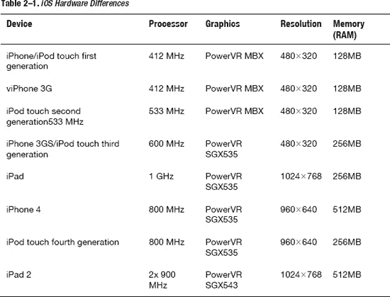

如上所述，每一代新的 iOS 设备通常都拥有更快的 CPU、更强大的图形芯片，以及更大的内存和屏幕分辨率。这一趋势将持续下去，新设备会变得越来越强大。如果你想通过 iOS 游戏赚钱，请记住，旧款机型仍然占据着相当大的市场份额，而且这种变化非常缓慢，远低于新设备的发布速度。即便在今天，如果你不设计能在第二代设备上运行的游戏，你将放弃相当大一部分市场！

通常，当游戏开发者审视硬件特性时，他们倾向于关注 CPU 速度和图形芯片，以评估技术上的可能性。然而，作为移动设备，在最新款 iPhone 4 之前，iOS 设备主要受限于可用 RAM 的大小。

**注意：** 不要将 RAM 与存储 MP3、视频、应用和照片的闪存存储混淆，即便是容量最小的 iOS 设备也有 8GB 闪存。闪存存储相当于台式电脑的硬盘。RAM 则是你的应用程序在运行时用于存储代码、数据和纹理的内存。

#### 关于内存使用

目前的 iOS 设备配备有 128MB、256MB 或 512MB 的 RAM。然而，这并非应用可用的内存量。iOS 系统本身会持续占用大量内存，而 iOS 4 引入的多任务功能则加剧了这种情况。每台运行 iOS 4 或更新系统的设备，都可能同时运行着各种后台任务，它们会消耗数量不确定的额外内存。

随着时间的推移，iOS 开发者已经能够接近应用在被操作系统强制关闭前所能使用的理论最大 RAM 量。表 2-2 展示了你可预期的可用内存。理想情况下，你应始终将内存使用量保持在“内存警告阈值”列所列数值以下。对于仅有 128MB RAM 的设备而言，这一点尤其具有挑战性，因为基本上只能保证有 20MB 到 25MB 的内存可供应用使用。接近这个临界点时，你的应用可能会开始收到内存警告通知。你可以忽略一级内存警告，但如果应用继续消耗更多内存，你可能会收到二级内存警告消息，此时操作系统基本上会威胁说，如果你不立即释放一些内存，就会关闭你的应用。这就像你妈妈威胁说，如果你不马上打扫房间，就不给你买新电脑一样！请务必配合。

Cocos2d 可以通过调用 `purge` 方法在一定程度上帮助你释放内存。通过在 `AppDelegate` 的 `applicationDidReceiveMemoryWarning` 方法中添加 `purgeCachedData` 方法，你可以让 cocos2d 尝试释放一些不再使用的内存：

```
- (void)applicationDidReceiveMemoryWarning:(UIApplication *)application {
    [[CCTextureCache sharedTextureCache] removeUnusedTextures];
    [[CCDirector sharedDirector] purgeCachedData];
}
```

但当你的游戏变得越来越复杂时，你可能需要实现自己的方案来处理内存警告通知。内存警告通知固有的问题是，当你的应用释放大块内存时，可能会导致性能卡顿。如果你依赖 cocos2d 的机制来做这件事，它可能会从内存中移除一个精灵的纹理，但如果几帧之后又需要这个精灵，则需要在游戏过程中重新加载纹理，这很慢。这会产生明显的卡顿，因此最好实现你自己的内存管理方案。你应该能够区分哪些纹理很快会再次需要，哪些当前完全不需要。遗憾的是，没有一种万能的解决方案——否则我肯定会提供给你。

如果你正在使用 256MB 或 512MB 内存的设备进行开发，请记住，有大量 iOS 设备型号仅有 128MB 内存。除非你计划将游戏限制在第三代及更新的 iOS 设备上，否则最好购买一台便宜的二手第一代或第二代设备，并主要在该设备上测试你的游戏，以便尽早发现内存过度消耗的问题。此时修复问题仍然简单且便宜，尤其是当问题需要对游戏设计进行修改时。一般来说，建议使用你手中硬件性能最弱的设备进行开发。这有助于你尽早发现任何性能或内存不足的问题。

**注意：** 还建议你在一台具备多任务处理能力且运行着大量后台任务的设备上测试你的应用，以便测试后台任务占用额外内存的最坏情况。只有第三代及更新的设备才支持多任务处理，这意味着只有 256MB RAM 的设备才允许在后台运行应用。这是个好消息，因为第一代和第二代设备 128MB 的内存对于单个应用来说都勉强够用。如果你为这些设备进行设计（我认为你应该这样做），那么你就不必太担心后台任务会消耗掉应用宝贵的内存。

对于 128MB RAM 的设备，你最多可以分配约 35MB 到 40MB 的内存。请记住，这只是一个理论最大值；实际数值因设备而异，甚至可能取决于用户之前使用过哪些应用。这就是应用开发者建议在遇到崩溃时重启设备的原因。重启可以释放一些额外的内存。导致应用意外退出的首要原因就是设备内存耗尽。因此，务必警惕应用的内存使用情况，并在遇到异常行为时频繁重启设备。

你可以使用 Instruments 应用来测量内存使用情况，详细介绍请参见苹果的《Instruments 用户指南》：[`http://developer.apple.com/iphone/library/documentation/DeveloperTools/Conceptual/InstrumentsUserGuide/Introduction/Introduction.html`](http://developer.apple.com/iphone/library/documentation/DeveloperTools/Conceptual/InstrumentsUserGuide/Introduction/Introduction.html)。


### iOS 模拟器

Apple 的 iOS SDK 允许你通过 iOS 模拟器在 Mac 上运行和测试 iPhone 及 iPad 应用。iOS 模拟器的主要目的是让你更快速地测试应用，因为随着游戏规模的增大，部署到 iOS 设备所需的时间会越来越长。尤其游戏会使用大量需要传输的图片和其他资源，这会拖慢部署速度。

然而，使用 iOS 模拟器存在几个需要注意的问题。以下内容将揭示 iOS 模拟器无法实现的功能。基于这些原因，建议你尽早并经常在真机设备上测试游戏。至少在进行重大改动后或每天工作结束前，你应该在 iOS 设备上运行一次测试，以验证游戏的行为完全符合预期。

#### 无法评估性能

在 iOS 模拟器中运行游戏的性能完全取决于你电脑的 CPU。图形渲染过程甚至不会使用你 Mac 显卡的硬件加速功能。这就是为什么在模拟器中运行游戏的帧率毫无意义。你甚至无法确定，在真机设备上比较改动前后的帧率是否会得到相同的结果。在极端情况下，模拟器中的帧率可能会上升，而真机上的帧率却在下降。请始终在真机设备上，使用 Release 构建配置进行性能测试。

#### 无法评估内存使用情况

iOS 模拟器能够使用你计算机上的所有可用内存，因此模拟器可用的内存远多于真机设备。这意味着你不会收到内存警告通知，游戏在 iOS 模拟器上也能正常运行，但当你首次在 iOS 设备上运行游戏时，可能会遭遇（崩溃的）冲击。

不过，你仍然可以使用 iOS 模拟器来评估游戏当前使用了多少内存。

#### 无法使用所有 iOS 设备功能

某些功能（例如设备方向）可以通过菜单项或键盘快捷键进行模拟，但这远不及真实设备的体验。而某些硬件功能，如多点触控输入、加速度计、振动或获取位置信息，根本无法在 iOS 模拟器上进行测试，因为你的计算机硬件无法模拟这些功能。不，摇晃你的 Mac 或触摸它的屏幕是没有用的。如果你不信，可以试试看。

**提示：** iSimulate 应用（`www.vimov.com/isimulate`）是一款宝贵的开发工具，它允许 iOS 设备将加速度计、GPS、罗盘和多点触控事件发送到 iOS 模拟器中运行的应用。

#### 运行时行为可能不同

你可能会不时遇到棘手的情况，即游戏在 iOS 模拟器上运行良好，却在真机设备上崩溃，或者游戏无故变慢。也可能出现只在 iOS 模拟器上或只在真机设备上才有的图形异常。如果存疑，在深入探究问题原因之前，如果你在 iOS 模拟器上遇到问题，请始终尝试在真机设备上运行游戏，反之亦然。有时，问题可能会自行消失，但如果没有，你也能获得一些关于问题所在之处的线索。

### 关于日志记录

默认情况下，Xcode 项目会拥有两个构建配置，名为 Debug 和 Release。两者主要区别在于，只有在 Debug 构建中，像 `CCLOG` 这样的特定函数才会被编译。这通常由像 `DEBUG` 和 `COCOS2D_DEBUG` 这样的预处理器宏控制，它们决定了编译到应用中的调试代码级别。这是 Debug 和 Release 构建之间性能差异的最关键因素。

**注意：** `CCLOG` 宏封装了 Apple 的 `NSLog` 方法，使得 `CCLOG` 仅在 Debug 构建中被编译，而在 Release 构建中被忽略。我建议使用 `CCLOG` 代替 `NSLog`，因为日志记录仅供你查看。`NSLog` 会拖慢你发布的游戏，因为它即使在 Release 构建中也会运行！

在错误的位置使用一个 `NSLog` 或 `CCLOG` 就会向调试器控制台窗口输出大量日志消息，导致运行缓慢和延迟。日志记录非常慢，持续不断向调试器控制台打印日志消息会严重拖慢你的游戏性能。如果你怀疑游戏在 Debug 构建中性能特别慢，请务必检查调试器控制台是否有过多的日志活动。从 Xcode 的“Run”菜单中选择“Console”即可显示调试器控制台窗口。

排除日志记录以及通常更优的代码优化设置，是为什么你应该只使用 Release 构建来测试游戏性能的主要原因。

### 总结

哇，对于一个“入门”章节来说，内容可真不少！在本章的第一部分，你学会了下载和设置所有必要的工具，直到你成功运行了第一个 cocos2d 模板项目。

接着，我带你了解了模板项目的工作原理，让你快速掌握 iOS cocos2d 应用是如何在原理上、以及部分细节上工作的。我对正确的内存管理有特别的偏好，这也是我包含这些细节的原因。我认为这很重要，因为人们很容易误解甚至完全忽略内存管理，然后你可能会在一个非常脆弱的基础上构建你的游戏。

我还设法悄悄加入了一个简短的“动手实践”部分，至少向你展示了如何在 cocos2d 中处理触摸输入，以及如何存储和检索 cocos2d 对象。

最后，我认为向你详细介绍各种 iOS 设备以及它们在可用内存方面的预期表现非常重要。我还讨论了模拟器，以及在模拟器上测试游戏与在真机设备上测试的区别。

在下一章中，你将学习 cocos2d 的所有基本功能，这将使你离制作一个完整的 cocos2d 游戏更近一步。

## 第三章

## 基础

本章将向你介绍 cocos2d 游戏引擎的基本构建模块。在你创建的每个游戏中，你都会用到这些类中的大部分，所以了解有哪些类可用以及它们如何协同工作，将有助于你编写更好的游戏。掌握了这些知识，你会发现开始使用 cocos2d 要容易得多。

本章附带了一个名为 Essentials 的 Xcode 项目，其中包含我在这里讨论的所有内容以及额外的示例。源代码中充满了注释，因此你可以像阅读本书的附录一样阅读它。

我们将从 cocos2d 游戏引擎架构的高级概述开始。每个游戏引擎在游戏对象的管理和屏幕呈现方式上都有所不同。最好从理解各个元素是什么以及它们如何组合在一起开始。


### cocos2d 场景图

有时也被称为*场景层次结构*，场景图是当前所有活跃 cocos2d 节点的层级结构。

cocos2d 节点是任何派生自 `CCNode` 类的对象。大多数节点如 `CCSprite` 和 `CCLabelTTF` 会显示在屏幕上，但也有一些没有视觉表现，包括 `CCNode`、`CCScene` 和 `CCLayer`。它们同样重要；恰恰相反，它们经常让 cocos2d 新手感到困惑。

我将在后续章节中更详细地介绍这些类，并解释它们的用途。现在，我先专注于高级概念，你只需知道 `CCSprite` 在屏幕上显示纹理，`CCLabelTTF` 打印任意文本，而 `CCNode`、`CCScene` 和 `CCLayer` 主要用于将节点组合在一起。

图 3–1 描绘了你将从第 6 章开始创建的射击游戏，并展示了玩家不易察觉但对游戏开发者至关重要的理解要点。

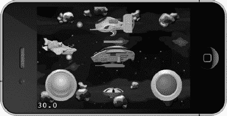

**图 3–1.** *一款射击游戏*

图 3–1 中的场景完全由 `CCSprite` 对象构成。至少这是你所能看到的。你看不到的是 `CCScene` 和 `CCLayer` 类如何用于分组和排列各种精灵：多个背景层、玩家飞船、敌人、子弹以及虚拟摇杆和按钮。为了说明该场景元素的层叠关系，我在图 3–2 中绘制了该场景的分解视图。

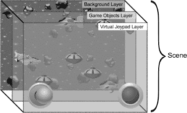

**图 3–2.** *说明典型 cocos2d 游戏场景布局的分解视图*

在这个具体示例中，三个层有助于维护精灵之间正确的绘制顺序：背景层、游戏对象层和虚拟摇杆层。如果你想要隐藏整个层的节点、移动该层及其包含的所有节点，或者重新排序层使其节点绘制在另一层节点的上方或后方，使用场景中的多个层也会很有帮助。你甚至可以旋转和缩放一个层，这将旋转和缩放该层中包含的所有节点。这使得使用层成为一个强大的概念。

在这方面，游戏场景是使用层来建模的，就像你在 Photoshop、Seashore 或 Gimp 等图像编辑程序中编辑图像一样。不过，每一层中的节点（笔触）不是静态的，而是保持为独立的元素。

实际的 `Scene` 对象只是所有层的容器（可以说是实际的图像），就像层是其他节点的容器一样。这些节点中的每一个都可以运行逻辑——场景、层、各个节点、精灵、标签等，具体取决于你如何组织代码。

任何节点都可以将其他任何节点作为子节点，并且层级结构中的每个节点（场景本身除外）都有一个父对象，即该节点作为子节点所从属的对象。如果你从场景图中移除该节点，或者尚未添加它，则它不会有父对象。请注意，节点的这种父子关系不要与面向对象编程中的继承混淆。换句话说，父节点不是该节点的 `super` 类！

你可以创建的这种树状节点层级结构被称为*场景图*，在本书中我有时会将其称为*节点层级结构*。对于熟悉编程设计模式的人来说，你会认识到这种层级结构就是复合设计模式。图 3–3 向你展示了该场景的简化节点层级结构，以树状结构呈现。

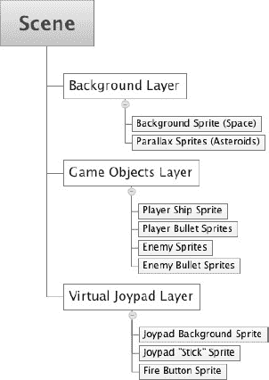

**图 3–3.** *图 3–2 中所示场景的节点层级结构*

请注意，这种场景/层/节点结构并非由 cocos2d 强制规定，只是场景图始终有一个 `CCScene` 类对象作为其根节点。但除此之外，你可以使用任何 `CCNode` 类代替 `CCLayer` 来创建你的“层”。

事实上，我通常更倾向于使用普通的 `CCNode` 类而不是 `CCLayer` 来进行分层和分组对象；在大多数情况下，`CCLayer` 类会增加不必要的开销，因为它能够接收触摸和加速度计输入（在 Mac OS X 上还有键盘和鼠标输入）。剥离对输入处理的支持后，`CCLayer` 类实际上就只是一个 `CCNode` 类。`CCScene` 也是如此，它本质上只是一个抽象概念，用于强制规定一个共同的根节点类。否则，`CCScene` 类实际上与 `CCNode` 相同。

**注意：** cocos2d 节点层级结构中的节点是相对于其父节点定位的。子节点会继承父节点的某些属性，例如 `scale` 和 `rotation`，但不会继承 `color` 和 `opacity`。这在初次接触时可能会令人困惑。

例如，如果一个 `CCLabelTTF` 节点的父节点是像 `CCNode`、`CCScene` 或 `CCLayer` 这样的非绘制节点，并且它们本身是其他非绘制节点的唯一子节点，那么该标签的位置将是相对于视图左下角的。所以，一切正常且符合预期。但是，如果你将另一个 `CCLabelTTF` 作为子节点添加到该标签，那么子标签的位置将是相对于父标签的。

你有理由期望子标签以父标签的位置为中心。可惜，情况并非如此，如图 3–4 所示。你会发现子标签反而以父标签纹理的左下角为中心，这是 cocos2d 设计中一个令人遗憾的异常之处。要正确定位这样一个节点并使其以父节点为中心，你必须使用父节点的 `contentSize.width / 2` 和 `contentSize.height / 2` 作为子节点的 `position.x` 和 `position.y`。

我创建了 NodeHierarchy 项目，为你提供父子关系节点中相对定位和旋转的示例，并让你熟悉 cocos2d 节点层级结构。可以将其视为你自己实验的测试平台。

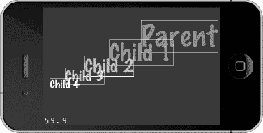

**图 3–4.** *注意：子节点的默认位置会意外地偏离其父节点的位置。*

### CCNode 类层次结构

此时，你可能想知道哪些类派生自 `CCNode`。图 3–5 展示了 `CCNode` 类层次结构。你最常使用的节点类已被突出显示，仅使用这些类就能制作出相当令人印象深刻的游戏。我将稍后解释最重要的类，随着本书的深入，你甚至将深入了解那些更不为人知的类。

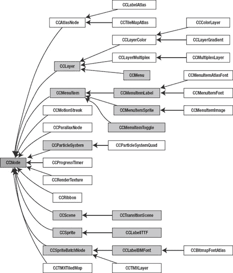

**图 3–5.** *CCNode 类层次结构*

### CCNode

`CCNode` 是所有节点的基类。它是一个没有视觉表现的抽象类，定义了所有节点共有的属性和方法。


### 节点操作

`CCNode` 类实现了添加、获取和移除子节点的所有方法。以下是一些操作子节点的方式：
- 你可以创建一个新节点：`CCNode* childNode = [CCNode node];`
- 你可以将新节点添加为子节点：`[myNode addChild:childNode z:0 tag:123];`
- 你可以检索子节点：`CCNode* retrievedNode = [myNode getChildByTag:123];`
- 你可以通过标签移除子节点；`cleanup` 参数会同时停止所有正在运行的动作：`[myNode removeChildByTag:123 cleanup:YES];`
- 如果你持有节点指针，可以直接移除该节点：`[myNode removeChild:retrievedNode];`
- 你可以移除节点的所有子节点：`[myNode removeAllChildrenWithCleanup:YES];`
- 你可以将 `myNode` 从其父节点中移除：`[myNode removeFromParentAndCleanup:YES];`

`addChild` 中的 `z` 参数决定了节点的绘制顺序。`z` 值最低的节点最先绘制，`z` 值最高的节点最后绘制。如果多个节点具有相同的 `z` 值，则按添加顺序依次绘制。当然，这一条仅适用于拥有视觉表现的节点，例如精灵。

`tag` 参数让你能够在后续通过 `getChildByTag` 方法识别和获取特定节点。

**注意：** 如果多个节点最终使用了相同的标签编号，`getChildByTag` 将返回第一个具有该标签编号的节点，其余节点将无法访问。请确保为你的节点使用唯一的标签编号。

请注意，动作也可以拥有标签。不过，节点标签和动作标签不会冲突，因此一个动作和一个节点可以使用相同的标签编号而不会产生任何问题。

### 动作操作

节点同样可以运行动作。稍后我会更详细地介绍动作。现在，只需了解动作可以让节点移动、旋转、缩放，并随时间执行其他操作。
- 以下是动作的声明方式：`CCAction* action = [CCBlink actionWithDuration:10 blinks:20];` `action.tag = 234;`
- 运行动作使节点闪烁：`[myNode runAction:action];`
- 如果你稍后需要访问该动作，可以通过其标签获取：`CCAction* retrievedAction = [myNode getActionByTag:234];`
- 你可以通过标签停止动作：`[myNode stopActionByTag:234];`
- 或者通过指针停止动作：`[myNode stopAction:action];`
- 或者停止该节点上运行的所有动作：`[myNode stopAllActions];`

### 定时消息

节点可以定时消息，这是 Objective-C 中调用方法的术语。在很多情况下，你可能希望某个特定的更新方法在节点上运行以进行某些处理，例如碰撞检测。让特定的更新方法每帧都被调用的最简单方式如下：
```
-(void) scheduleUpdateMethod
{
    [self scheduleUpdate];
}

-(void) update:(ccTime)delta
{
    // 此方法每帧都会被调用
}
```

非常简单，不是吗？注意，update 方法具有固定的签名，这意味着它总是以这种方式定义。`delta` 参数是自上次调用该方法以来经过的时间。这是安排每帧更新时的首选方式，但也有一些理由让你使用其他更灵活的更新方法。

如果你希望运行不同的方法，或者不希望方法每帧都被调用，而是每十分之一秒调用一次，那么应使用此方法：
```
-(void) scheduleUpdateMethod
{
    [self schedule:@selector(updateTenTimesPerSecond:) interval:0.1f];
}

-(void) updateTenTimesPerSecond:(ccTime)delta
{
    // 此方法根据其间隔被调用，每秒十次
}
```

请注意，如果 `interval` 为 0，则应改用 `scheduleUpdate` 方法。然而，如果你日后需要取消调度某个特定的选择器，前面的代码是首选。`scheduleUpdate` 方法不允许你这样做。

`update` 方法的签名仍然相同；它接收一个增量时间作为其唯一参数。但这次它可以按你的意愿任意命名，并且仅每十分之一秒被调用一次。这在检查胜负条件时可能很有用，特别是当条件非常复杂以至于你不想每帧都运行时。或者，如果你希望某事在 10 分钟后发生，你可以调度一个间隔为 600 的选择器。

**注意：** `@selector(…)` 的语法可能看起来有些奇怪。这是 Objective-C 中通过名称引用特定方法的方式。这里关键的一点是不要忽略末尾的冒号。它告诉 Objective-C 查找具有给定名称且恰好有一个参数的方法。如果你忘记在末尾添加冒号，程序仍然可以编译，但随后会崩溃。在调试器控制台中，错误日志将显示“向实例发送了无法识别的选择器...”。

`@selector(…)` 中冒号的数量必须始终与方法参数的数量和名称相匹配。对于以下方法：
```
-(void) example:(ccTime)delta sender:(id)sender flag:(bool)aBool
```
对应的 `@selector` 应如下所示：
```
@selector(example:sender:flag:)
```

调度自己的选择器，或普遍使用 `@selector(…)` 关键字时，存在一个主要的陷阱。默认情况下，如果方法的名称不存在，编译器根本不会报错。相反，当该选择器被调用时，你的应用会直接崩溃。由于调用是由 cocos2d 内部完成的，你将很难找出问题的原因。幸运的是，你可以启用一个编译器警告。图 3–6 显示了在 NodeHierarchy 项目中启用了“未声明的选择器”警告，本章的 EssentialsXcode 项目也已启用该警告。

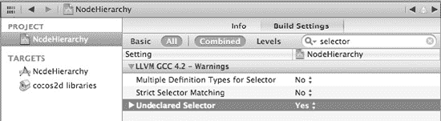

**图 3–6.** *激活构建设置以警告未声明的选择器*

剩下的就是展示如何停止这些已调度的方法的调用。你可以通过取消调度来实现。
- 你可以停止节点的所有选择器，甚至包括那些通过 `scheduleUpdate` 调度的：`[self unscheduleAllSelectors];`
- 你可以停止特定的选择器，在本例中为 `updateTenTimesPerSecond` 方法：`[self unschedule:@selector(updateTenTimesPerSecond:)];`

注意，这不会停止由 `scheduleUpdate` 调度的 `update` 方法。


`在调度和取消调度选择器时，有一个实用的小技巧。你经常会发现，在已调度的某个方法中，你希望某个特定方法不再被调用，但又不想重复写出该方法确切的名字和参数数量，因为这些内容可能发生变化。以下展示如何运行一个已调度的选择器，并在首次调用时停止它：

```
-(void) scheduleUpdates
{
    [self schedule:@selector(tenMinutesElapsed:) interval:600];
}

-(void) tenMinutesElapsed:(ccTime)delta
{
    // 通过使用 _cmd 关键字来取消当前方法的调度
    [self unschedule:_cmd];
}
```

所有 Objective-C 方法中都存在隐藏变量 `_cmd`，它代表当前方法的选择器。在上一个示例中，`_cmd` 等同于书写 `@selector(tenMinutesElapsed:)`。取消调度 `_cmd` 能有效阻止 `tenMinutesElapsed` 方法被再次调用。如果你希望当前方法被调度，也可以先用 `_cmd` 来调度该选择器。假设你需要一个以不同间隔调用的方法，且每次调用后间隔都会改变。这种情况下，你的代码可以像这样利用 `_cmd`：

```
-(void) scheduleUpdates
{
    // 像往常一样调度第一次更新
    [self schedule:@selector(irregularUpdate:) interval:1];
}

-(void) irregularUpdate:(ccTime)delta
{
    // 首先取消当前方法的调度
    [self unschedule:_cmd];

    // 假设你会用某种逻辑（而非随机）来确定方法下次被调用的时间
    float nextUpdate = CCRANDOM_0_1() * 10;

    // 然后使用 _cmd 作为选择器，以新的间隔重新调度它
    [self schedule:_cmd interval:nextUpdate];
}
```

从长远来看，使用 `_cmd` 关键字能省去很多麻烦，因为它避免了调度或取消调度错误选择器这一棘手问题，并且将代码与它所处方法的名称解耦。

最后还有一个关于调度的问题需要提及，那就是更新操作的优先级。请看以下代码：

```
// 在节点 A 中
-(void) scheduleUpdates
{
    [self scheduleUpdate];
}

// 在节点 B 中
-(void) scheduleUpdates
{
    [self scheduleUpdateWithPriority:1];
}

// 在节点 C 中
-(void) scheduleUpdates
{
    [self scheduleUpdateWithPriority:-1];
}
```

这可能需要一点时间才能理解。所有节点仍然都在调用各自的 `–(void) update:(ccTime)delta` 方法。然而，通过优先级来调度更新方法，会导致节点 C 中的方法最先运行。接着调用节点 A 中的方法，因为默认情况下 `scheduleUpdate` 使用的优先级是 0。节点 B 的更新方法最后被调用，因为它的优先级数字最高。更新方法按照优先级从低到高的顺序依次被调用。

你可能会想这有什么用。老实说，这些优先级很少用到，但在某些情况下，能够对更新操作进行优先级排序非常有用。例如，在物理模拟本身更新之前或之后对物理对象施加力，或者确保只有在所有游戏对象都执行完它们的 `update` 方法后才检查游戏结束条件。有时，尤其是在项目后期，你可能会发现一个奇怪的 Bug，而它本质上是一个时序问题，这会迫使你在所有其他对象完成自身更新后，再运行玩家的更新方法。

在你需要通过使用优先级更新来解决特定问题之前，可以安全地忽略它们。此外，请记住，每次调用优先级更新的方法都会增加一点开销，因为这些方法需要按特定顺序调用。

### 导演、场景与层

与 `CCNode` 类似，`CCScene` 和 `CCLayer` 类也没有可视化表现，它们内部被用作场景图起始点的抽象概念，而场景图的起始点总是一个继承自 `CCScene` 的对象。`CCScene` 类是场景中所有其他节点的容器。而 `CCLayer` 通常用于将节点分组，特别是为了在多个层之间维持正确的绘制顺序。同时，在 iOS 上它用于接收触摸和加速度计输入，在 Mac OS X 上则分别用于接收鼠标和键盘输入。

不过，我将从 `CCDirector` 类开始本节内容，因为它是一个能够让你运行和替换场景的类。


### Director

`CCDirector`类（或简称为 Director）是 cocos2d 游戏引擎的核心。如果你还记得第 2 章中的 HelloWorld 应用，你会记得许多 cocos2d 初始化过程都涉及对`[CCDirector sharedDirector]`的调用。

`CCDirector`类是一个单例，这意味着在任何时候只能有一个`CCDirector`类的实例，并且可以通过调用类方法`sharedDirector`进行全局访问。目前，这就是你需要了解关于单例的全部内容。本章后面“关于 cocos2d 中单例的说明”部分将解释什么是单例以及 cocos2d 提供了哪些其他单例类。

`CCDirector`类存储 cocos2d 的全局配置设置，并管理 cocos2d 场景。`CCDirector`类的主要职责包括：

- 提供对当前运行场景的访问
- 运行、替换、压栈和弹出场景
- 提供对 cocos2d 配置细节的访问
- 提供对 cocos2d 的 OpenGL 视图和窗口的访问
- 暂停、恢复和结束游戏
- 转换 UIKit 和 OpenGL 坐标
- 决定游戏状态的更新方式

你可以从四种不同的 Director 类型中选择，这会影响 Director 更新游戏状态的方式。这反过来会对渲染性能以及与 UIKit 视图的兼容性产生重大影响。你通常会在应用委托类中找到设置 Director 类型的如下行：

```
// 优先尝试使用 CADisplayLink director。
// 如果 CADisplayLink 不可用（iOS < 3.1），则回退到 NSTimer director。
if ( ! [CCDirector setDirectorType:kCCDirectorTypeDisplayLink] )
    [CCDirector setDirectorType:kCCDirectorTypeDefault];
```

你可以设置四种 Director 类型：

- `kCCDirectorTypeDisplayLink`（最快；需要 iOS 3.1 或更高版本）
- `kCCDirectorTypeNSTimer`（最慢）
- `kCCDirectorTypeThreadMainLoop`（快速，但与 UIKit 视图存在兼容性问题）
- `kCCDirectorTypeMainLoop`（快速，但与 UIKit 视图存在兼容性问题）

最常用且推荐的 Director 类型是`kCCDirectorTypeDisplayLink`，它在内部使用 Apple 的`CADisplayLink`类。这是首选和默认的选择，并且仅在 iOS 3.1 或更高版本上可用。`CADisplayLink`类确保屏幕更新与屏幕刷新同步，从而实现非常流畅的滚动。它还能与 UIKit 视图良好协作。

**提示：** 由于所有设备都可以升级到 iOS 3.1.3，并且 iOS 3.1 已于 2009 年 9 月发布，因此可以安全地假设只有极少数的设备没有运行至少 iOS 3.1。应用开发者和分析公司发布的各种设备统计数据支持了这一观点，甚至显示截至 2011 年 4 月，iOS 4 在 iPhone 设备上的采用率已超过 90%。为了确保`CADisplayLink`类在运行你应用的任何设备上都可用，你应该将项目的 iOS 部署目标设置为 iOS 3.1，而不是 iOS 3.0（Xcode 当前允许你选择的最低部署目标）。

默认的备用选项是`kCCDirectorTypeNSTimer`，它默认仅在运行 iOS 3.0.1 或更旧版本的设备上使用。不建议使用`kCCDirectorTypeNSTimer`，因为它是最慢的 Director 类型，并且在内部使用`NSTimer`对象来驱动帧更新。根据 Apple 的文档，`NSTimer`的分辨率大约在 50 到 100 毫秒之间。如果你考虑到需要每 16.6 毫秒更新一次才能渲染 60 帧每秒，那么在使用`kCCDirectorTypeNSTimer`时，特别是在第一代和第二代设备上，不要期望能够渲染 60 fps。更糟糕的是，由于超出你控制的原因，更新之间的时间可能会显著波动，导致帧率波动。不过它至少能与 UIKit 视图良好协作。

比`kCCDirectorTypeNSTimer`更快的备用选项是`kCCDirectorTypeMainLoop`或`kCCDirectorTypeThreadMainLoop`，除非你想在你的游戏中添加 UIKit 视图。在这种情况下，这两种 Director 类型可能会导致 UIKit 视图响应缓慢、无响应以及其他问题。这是因为它们使用一种老式的、非协作的更新循环来驱动 cocos2d 更新，一旦上一个更新结束，就会立即开始下一个更新。这几乎没有给包括 UIKit 视图在内的其他事物留下 CPU 时间，尽管`kCCDirectorTypeThreadMainLoop`在这方面表现更好。

总而言之，使用`kCCDirectorTypeDisplayLink`（默认），并将你的项目 iOS 部署目标设置为 iOS 3.1 或更高版本（参见图 3-7），以确保`CADisplayLink`在运行你应用的所有设备上始终可用。其他 Director 类型可以被视为远古时代的遗物（就像：上个月的计算机技术），但在某些不常见的场景中可能仍然有用。

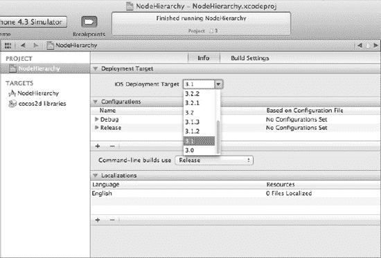

**图 3-7.** *将 iOS 部署目标设置为 3.1 确保`CADisplayLinkDirector`类型可用。*

### CCScene

`CCScene`对象始终是场景图中的第一个节点。在 cocos2d 中，场景是一个抽象概念，并且`CCScene`类与`CCNode`相比几乎不包含额外的代码。但是`CCDirector`需要一个派生自`CCScene`的类，以便能够通过`CCDirector`的`runWithScene`、`replaceScene`和`pushScene`方法更改当前活动的场景图。你还可以将`CCScene`类包装到一个派生自`CCSceneTransition`的类中，以便在当前运行场景和新场景之间制作过渡动画。

通常，`CCScene`的唯一子节点是那些派生自`CCLayer`的节点，这些节点又包含各个游戏对象，尽管 cocos2d 并不强制这一约定。由于场景对象本身在大多数情况下不包含任何游戏特定的代码，并且很少被子类化，它通常是在`CCLayer`对象内部的静态方法`+(id) scene`中创建的。我在第 2 章中已经提到过这个方法，但这里再次提及以唤起你的记忆：

```
+(id) scene
{
    CCScene *scene = [CCScene node];
    CCLayer* layer = [HelloWorld node];
    [scene addChild:layer];

    return scene;
}
```

你创建场景的第一个地方是在应用委托的`applicationDidFinishLaunching`方法末尾。你使用 Director 通过`runWithScene`方法启动第一个场景：

```
// 仅用于运行第一个场景
[[CCDirector sharedDirector] runWithScene:[HelloWorld scene]];
```

对于所有后续的场景更改，你必须使用恰如其名的`replaceScene`方法来替换现有场景：

```
// 使用 replaceScene 更改所有后续场景
[[CCDirector sharedDirector] replaceScene:[HelloWorld scene]];
```

正如你将在接下来的章节中很快学到的，你也可以在替换场景时使用过渡效果。以下是一个示例，它使用`CCTransitionShrinkGrow`类作为管理过渡动画的中间场景：

```
CCScene* scene = [HelloWorld scene];
CCSceneTransition* tran = [CCTransitionShrinkGrow transitionWithDuration:2 scene:scene];
[[CCDirector sharedDirector] replaceScene:tran];
```

**注意：** 如果你在`HelloWorld`场景中运行此代码，它将正常工作。它会创建一个`HelloWorld`的新实例并替换旧实例，有效地重新加载场景。但是，不要尝试通过将`self`作为参数传递给`replaceScene`来重新加载当前场景。这会导致你的游戏卡死！


### 场景与内存

请记住，当您用一个场景替换另一个场景时，新场景会在旧场景的内存被释放之前加载到内存中。这会导致内存使用量短暂激增。场景替换始终是一个关键时刻，您可能会在此遇到内存警告，或因可用内存不足而直接导致崩溃。当您的应用占用大量内存时，应尽早并频繁测试场景切换。

**注意：** Cocos2d 在您替换场景时能够很好地清理自身内存。它会移除所有节点、停止所有动作并取消所有选择器的调度。我提到这一点，是因为我有时会遇到一些代码显式调用了各自的 `removeAll` cocos2d 方法。请记住，如果存疑，请相信 Cocos2d 的内存管理。

当您开始使用转场效果时，这个问题会变得更加明显。此时发生的情况是：新场景被创建，转场效果运行，只有在转场效果完成后，旧场景才会从内存中移除。良好的做法是在场景中，或者更确切地说，在创建场景的图层中添加日志语句：

```
-(id) init
{
    if ((self = [super init]))
    {
        CCLOG(@"%@: %@", NSStringFromSelector(_cmd), self);
    }
}

-(void) dealloc
{
    CCLOG(@"%@: %@", NSStringFromSelector(_cmd), self);

    // 始终在 dealloc 方法中调用 [super dealloc]！
    [super dealloc];
}
```

密切关注这些日志消息。如果您发现当从一个场景切换到另一个场景时，`dealloc` 日志消息从未被发送，这是一个巨大的警示信号。在这种情况下，您正在泄漏整个场景，而没有释放其内存。这种情况极不可能由 Cocos2d 引起。在几乎所有情况下，它都归结为保留（retain）了节点或未正确释放（release）节点。

有一件事您绝对不应该做：将一个节点作为子节点添加到场景图中，然后又为了其他目的自行保留它。请使用 Cocos2d 的方法来访问节点对象，或者至少保持对指针的弱引用（weak reference），而不是保留它。只要您让 Cocos2d 负责管理节点的内存，一切就相安无事。

### 场景的推送与弹出

当我还在讨论场景切换时，应该提一下导演类（Director）的 `pushScene` 和 `popScene` 方法，它们可以是很有用的工具。它们的作用是在不将旧场景从内存中移除的情况下运行新场景。如果您将场景想象成一张张纸，那么推送一个场景意味着在当前可见纸张的顶部添加一张新纸。底层的纸张保持原位并保留在内存中，这与场景替换不同。对于每个推送的场景，您随后需要调用 `popScene`（这相当于移除最顶层的纸张），直到只剩下初始场景。

其想法是让场景切换更快。但这里存在一个难题：如果您的场景足够轻量，能够彼此共享内存，那么它们无论如何都会加载得很快。但如果它们很复杂，因此加载缓慢，那么它们很可能会占用彼此宝贵的内存——内存使用量会迅速达到临界水平。

`pushScene` 和 `popScene` 最大的问题在于，您需要跟踪推送了多少个场景，以便精确地弹出相同数量的场景。如果您不非常小心地管理推送和弹出，最终会忘记一次弹出，或者多弹出了一个场景。这还不算所有那些场景必须共享同一片内存的事实。

在某些情况下，`pushScene` 和 `popScene` 非常方便；一种情况是，您有一个在许多地方都会用到的通用场景，例如可以调整音乐和音量的设置屏幕。您可以推送设置场景来显示它，而设置场景的“返回”按钮则只需调用 `popScene`；游戏将返回到之前的状态。无论您是从主菜单、游戏内还是其他地方打开设置菜单，这种技术都很好用，并且能让您避免跟踪设置菜单是在哪里打开的。

`pushScene` 和 `popScene` 非常有用的另一种情况是，您希望保留初始场景的状态，而无需回退到保存和加载该场景的状态。例如，您可以推送一个显示多人游戏中当前排行榜的场景，然后再将其弹出，而无需保存和加载游戏状态，因为游戏场景仍保留在内存中。而且，当玩家查看排行榜时，游戏不会继续推进，因为在排行榜场景可见时，游戏场景会自动暂停。

然而，您需要确保在任何可能推送场景的时刻，都有足够的额外可用内存供推送的场景使用，这很难测试。建议任何您可能想要推送的场景都应该非常轻量，消耗极少内存，并且只能弹出自身，绝不能推送其他场景或甚至调用 `replaceScene`。

例如，要从当前场景的任意位置之上显示一个设置场景，请使用以下代码：

```
[[CCDirector sharedDirector] pushScene:[Settings scene]];
```

现在，在设置场景内部，当您想要返回到仍在内存中的上一个场景时，需要调用 `popScene`：

```
[[CCDirector sharedDirector] popScene];
```

**注意：** 您只能使用 `CCSceneTransition` 类来为 `pushScene` 调用添加动画效果，而不能用于 `popScene`。这是推送和弹出场景的一个缺点，您应该了解。


### `CCTransitionScene`

过渡效果，即任何从 `CCTransitionScene` 派生的类，都能让你的游戏看起来真正专业。图 3–8 为你概述了 `CCTransitionScene` 的类层次结构，并展示了可用的过渡类。图 3–8 还补充了图 3–5 中的 `CCNode` 类层次结构，为了清晰起见，图 3–5 中并未包含 `CCTransitionScene` 的子类。

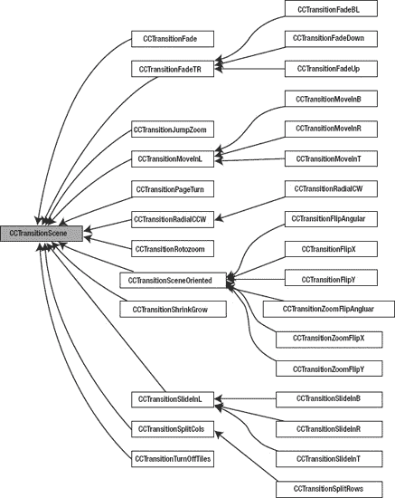

**图 3–8.** *`CCTransitionScene` 类层次结构*

**注意：** 并非所有过渡效果在游戏中都真正有用，尽管它们看起来都很酷。玩家最关心的是过渡的速度。哪怕只是让他们等待三秒钟才能与下一个场景交互，都是一种煎熬；我倾向于在一秒内完成场景过渡，或者如果情况更适合，就完全避免使用过渡。

你绝对应该避免的是在替换场景时随机选择过渡效果。玩家并不在意这些，而作为游戏开发者，我们知道你只是对那些酷炫的过渡效果有点过于兴奋了。如果你不确定某个特定场景切换应该使用哪种过渡，那就根本不要使用任何过渡。换句话说，能做不代表应该做。

虽然过渡效果只为替换场景增加了一行代码，但不可否认，鉴于过渡效果的名称长度以及它们通常需要的参数数量会使名称变得更长，这一行代码可能会很长。以下是一个非常流行的淡入淡出过渡效果示例；它会在 1 秒内淡出为白色：

```
// 用一个过渡场景来初始化，该场景包含我们接下来要显示的场景
CCTransitionFade* tran = [CCTransitionFade transitionWithDuration:1
                                                           scene:[HelloWorld scene]  
                                                       withColor:ccWHITE];
// 使用过渡场景对象替代 HelloWorld
[[CCDirector sharedDirector] replaceScene:tran];
```

你可以将 `CCTransitionScene` 与 `replaceScene` 和 `pushScene` 一起使用，但正如我之前所说，不能将过渡效果与 `popScene` 一起使用。

有各种各样的过渡效果可用，尽管大多数只是方向上的变化，例如过渡效果移动到的方向或起始的方位。以下是当前可用的过渡效果列表，以及每个效果的简短描述：

*   `CCTransitionFade`：淡出到特定颜色，再淡入回来。
*   `CCTransitionFadeTR`（另有三种变体）：瓦片翻转以显示新场景。
*   `CCTransitionJumpZoom`：场景弹跳并缩小；新场景则反向进行（弹跳并放大）。
*   `CCTransitionMoveInL`（另有三种变体）：原场景移出；新场景同时移入，可从左侧、右侧、顶部或底部进入。
*   `CCTransitionSceneOriented`（另有六种变体）：将整个场景翻转的多种过渡效果。
*   `CCTransitionPageTurn`：像翻书页一样的效果。
*   `CCTransitionRadialCCW`（另有一种变体）：类似雷达屏幕，通过径向擦除动画显示新场景。
*   `CCTransitionRotoZoom`：场景旋转并缩小；新场景则反向进行（旋转并放大）。
*   `CCTransitionShrinkGrow`：当前场景缩小；新场景在其上放大。
*   `CCTransitionSlideInL`（另有三种变体）：新场景从左侧、右侧、顶部或底部滑入，覆盖当前场景。
*   `CCTransitionSplitCols`（另有一种变体）：场景的列向上或向下移动以显示新场景。
*   `CCTransitionTurnOffTiles`：瓦片被新场景的瓦片随机替换。

### `CCLayer`

有时你需要在场景中使用多个层。在这种情况下，你可以像这样向场景添加更多的 `CCLayer` 对象：

```
+(id) scene
{
    CCScene* scene = [CCScene node];

    CCLayer* backgroundLayer = [HelloWorldBackground node];
    [scene addChild: backgroundLayer];

    CCLayer* layer = [HelloWorld node];
    [scene addChild:layer];

    CCLayer* userInterfaceLayer = [HelloWorldUserInterface node];
    [scene addChild: userInterfaceLayer];

    return scene;
}
```

这个场景现在有三个不同的层：`backgroundLayer`、常规的游戏对象层 `layer`，以及在其上方的 `userInterfaceLayer`。由于层是按创建顺序添加到场景中的，因此添加到 `backgroundLayer` 的任何节点都将绘制在其他层的后面。同样，添加到 `userInterfaceLayer` 的节点将始终绘制在 `layer` 和 `backgroundLayer` 中任何节点的上方。

**提示：** 再次强调，严格来说，一个层不必派生自 `CCLayer` 类；它也可以是一个简单的 `CCNode`。当你只需要将节点分组在一起，而不需要该层来处理输入时，这通常是更好的选择。

你可能想要在每个场景中使用多个层的一种情况是，你有一个滚动的背景和一个围绕背景的静态框架，其中可能包括用户界面元素。使用两个独立的层，只需调整背景层的位置即可轻松移动它，而前景层则保持不动。此外，同一层的所有对象将根据层的 z 顺序，要么位于另一层对象的前面，要么位于其后面。当然，不使用层也能达到同样的效果，但这需要单独移动背景中的每个独立对象。这效率很低，所以如果可能的话，尽量避免这样做。

与场景一样，层的尺寸与 cocos2d OpenGL 视图的尺寸相同。对于 iOS 设备，这几乎总是屏幕的尺寸；在 Mac OS X 上，则是窗口的尺寸。

层主要是一种分组概念。例如，你可以对层使用任何动作，该动作将影响该层上的所有对象。这意味着你可以同步移动层上的所有对象，或者一次性旋转或缩放它们。通常，如果你需要一组对象执行相同的动作和行为，就使用一个层。移动所有对象以滚动它们就是其中一种情况；有时你可能想要旋转它们或重新排序它们，以便它们绘制在其他对象之上。如果所有这些对象都是一个层的子对象，你可以简单地更改层的属性，或者对层运行动作，以影响其所有子节点。

**注意：** 有一个建议是不要在每场景中使用过多的 `CCLayer` 对象。这经常被误解。你可以使用任意多的层，而不会比使用任何其他节点对性能产生更大的影响。但是，如果该层也接受输入，情况就不同了，因为接收触摸或加速度计事件是开销很大的任务。因此，你不应该使用多个层来接收触摸或加速度计输入；一个就够了。最好是由一个层接收和处理输入，并在必要时通过将输入事件转发给注册的对象来通知其他节点或类。你通常通过 `performSelector` 方法来实现这一点，该方法会调用一个具有定义方法签名的方法。参见 cocos2d 的 `CCScheduler` 类以获取实现示例。


### 接收触摸事件

`CCLayer` 类设计用于接收触摸输入，但前提是您需要显式启用它。要启用触摸事件接收，请将属性 `isTouchEnabled` 设置为 `YES`：

`self.isTouchEnabled = YES;`

最好在类的 `init` 方法中执行此操作，但也可以随时更改。

一旦设置了 `isTouchEnabled` 属性，一系列用于接收触摸输入的方法就会被调用。这些事件会在新触摸开始、手指在触摸屏上移动以及用户将手指从屏幕上抬起时被接收。取消触摸的情况很少见，大多数情况下您可以安全地忽略此方法，或者直接将其转发到 `ccTouchesEnded` 方法。

-   当手指刚开始触摸屏幕时调用：`-(void) ccTouchesBegan:(NSSet *)touches withEvent:(UIEvent *)event`
-   每当手指在屏幕上移动时调用：`-(void) ccTouchesMoved:(NSSet *)touches withEvent:(UIEvent *)event`
-   当手指从屏幕上抬起时调用：`-(void) ccTouchesEnded:(NSSet *)touches withEvent:(UIEvent *)event`
-   用于取消触摸时调用：`-(void) ccTouchesCancelled:(NSSet *)touches withEvent:(UIEvent *)event`

取消事件很少见，在大多数情况下其行为应与触摸结束一致。

在许多情况下，您需要知道触摸发生的位置。由于触摸事件由 Cocoa Touch API 接收，因此必须将位置转换为 OpenGL 坐标。以下是一个为您完成此操作的方法：

```
-(CGPoint) locationFromTouches:(NSSet *)touches
{
    UITouch *touch = [touches anyObject];
    CGPoint touchLocation = [touch locationInView: [touch view]];
    return [[CCDirector sharedDirector] convertToGL:touchLocation];
}
```

此方法仅适用于单点触摸，因为它使用了 `[touches anyObject]`。要跟踪多点触摸位置，您必须单独跟踪每个触摸。

默认情况下，图层接收与 Apple 的 `UIResponder` 类相同的事件。Cocos2d 也支持目标触摸处理程序。区别在于，与总是接收一组触摸的 `UIResponder` 触摸事件相比，目标触摸一次只接收一个触摸。目标触摸处理程序只是将这些触摸拆分为单独的事件，根据您的游戏需求，这可能更容易处理。更重要的是，它允许您从事件队列中移除某些触摸，指定您已经处理过此触摸并且不希望它被转发到其他图层。这使得判断触摸是否位于屏幕的特定区域变得容易；如果是，您可以将该触摸标记为已占用，其余图层就不需要再次执行此区域检查。

要启用目标触摸处理程序，请将以下方法添加到您的图层类中：

```
-(void) registerWithTouchDispatcher
{
    [[CCTouchDispatcher sharedDispatcher] addTargetedDelegate:self
                                                     priority:INT_MIN+1
                                              swallowsTouches:YES];
}
```

**注意：** 如果您将 `registerWithTouchDispatcher` 方法留空，您将根本收不到任何触摸！如果您想保留该方法但同时希望使用默认处理程序，则必须在此方法中调用 `[super registerWithTouchDispatcher]`。

现在，您将使用一组略微不同的方法，而不是默认的触摸输入方法。它们几乎是等效的，区别在于第一个参数接收的是 `(UITouch*) touch` 而不是 `(NSSet*) touches`：

```
-(BOOL) ccTouchBegan:(UITouch *)touch withEvent:(UIEvent *)event {}
-(void) ccTouchMoved:(UITouch *)touch withEvent:(UIEvent *)event {}
-(void) ccTouchEnded:(UITouch *)touch withEvent:(UIEvent *)event {}
-(void) ccTouchCancelled:(UITouch *)touch withEvent:(UIEvent *)event {}
```

这里需要注意的是 `ccTouchBegan` 返回一个 `BOOL` 值。如果您在该方法中返回 `YES`，则表示您不希望该特定触摸被传播给优先级较低的其他目标触摸处理程序。您实际上已经“吞没”了这个触摸。

**注意：** Cocos2d 没有内置的手势识别支持。您需要自行编写手势识别代码，可能还需要借助 Apple 的手势识别器：[`http://developer.apple.com/library/ios/#documentation/EventHandling/Conceptual/EventHandlingiPhoneOS/GestureRecognizers/GestureRecognizers.html`](http://developer.apple.com/library/ios/#documentation/EventHandling/Conceptual/EventHandlingiPhoneOS/GestureRecognizers/GestureRecognizers.html)。

### 接收加速计事件

与触摸输入类似，必须专门启用加速计才能接收加速计事件：

`self.isAccelerometerEnabled = YES;`

同样，有一个特定的方法需要添加到接收加速计事件的图层中：

```
-(void) accelerometer:(UIAccelerometer *)accelerometer
                                        didAccelerate:(UIAcceleration *)acceleration
{
    CCLOG(@"acceleration: x:%f / y:%f / z:%f",
                                        acceleration.x, acceleration.y, acceleration.z);
}
```

您可以使用 `acceleration` 参数来确定任意三个方向上的加速度。

### 接收键盘事件

如果您正在创建 Mac OS X 应用程序，您将需要能够处理键盘按键。您首先需要启用键盘事件：

`self.isKeyboardEnabled = YES;`

用于接收键盘事件的回调方法在 `CCKeyboardEventDelegate` 协议中定义如下：

```
-(BOOL) ccKeyDown:(NSEvent*)event
{
    CCLOG(@"key pressed: %@", [event characters]);
}

-(BOOL) ccKeyUp:(NSEvent*)event
{
    CCLOG(@"key released: %@", [event characters]);
}

-(BOOL) ccFlagsChanged:(NSEvent*)event
{
    CCLOG(@"flags changed: %@", [event characters]);
}
```

每当用户按下或释放修饰键时，无论是否同时按下任何其他键，都会接收到标志更改事件。您可以使用它来实现直接分配给修饰键的控件。

一个非常简单的键盘事件检查，用于响应 D 键的按下或释放，可以像这样实现：

```
NSString* key = [event charactersIgnoringModifiers];
if ([key isEqualToString:@"d"] || [key isEqualToString:@"D"])
{
    CCLOG(@"D key");
}
```

检查大写变体是一种良好的风格，因为玩家可能无意中或由于其他原因启用了 Caps Lock 键。cocos2d 论坛有一个包含更复杂示例代码的帖子，用于实现键盘控制：[`www.cocos2d-iphone.org/forum/topic/11725`](http://www.cocos2d-iphone.org/forum/topic/11725)。

要更全面地了解键盘事件处理，我建议阅读 Apple 关于处理按键事件的文档：
[`http://developer.apple.com/library/mac/#documentation/cocoa/conceptual/EventOverview/HandlingKeyEvents/HandlingKeyEvents.html`](http://developer.apple.com/library/mac/#documentation/cocoa/conceptual/EventOverview/HandlingKeyEvents/HandlingKeyEvents.html)。

`NSEvent` 类不仅对键盘事件至关重要，对鼠标和其他事件也是如此。因此，查看 `NSEvent` 类的参考文档是个好主意：
[`http://developer.apple.com/library/mac/#documentation/Cocoa/Reference/ApplicationKit/Classes/NSEvent_Class/Reference/Reference.html`](http://developer.apple.com/library/mac/#documentation/Cocoa/Reference/ApplicationKit/Classes/NSEvent_Class/Reference/Reference.html)。


### 接收鼠标事件

与其他所有输入方式类似，你首先需要通过以下方式启用鼠标输入：

`self.isMouseEnabled = YES;`

然后你的层将开始接收`CCMouseEventDelegate`协议消息，这些消息的数量相当多：

```
// 当鼠标在无按键按下时移动时收到
-(BOOL) ccMouseMoved:(NSEvent*)event {}

// 当对应的鼠标键按住时移动时收到
-(BOOL) ccMouseDragged:(NSEvent*)event {}
-(BOOL) ccRightMouseDragged:(NSEvent*)event {}
-(BOOL) ccOtherMouseDragged:(NSEvent*)event {}

// 当对应的鼠标键按下时收到（左键、右键、其他键）
-(BOOL) ccMouseDown:(NSEvent*)event {}
-(BOOL) ccRightMouseDown:(NSEvent*)event {}
-(BOOL) ccOtherMouseDown:(NSEvent*)event {}

// 当对应的鼠标键松开时收到（左键、右键、其他键）
-(BOOL) ccMouseUp:(NSEvent*)event {}
-(BOOL) ccRightMouseUp:(NSEvent*)event {}
-(BOOL) ccOtherMouseUp:(NSEvent*)event {}

// 当滚轮滚动时收到
-(BOOL) ccScrollWheel:(NSEvent*)event {}
```

由于你为每个鼠标按钮都获得了特定事件，`NSEvent`对象主要用于获取当前鼠标光标位置。你需要通过导演类的`convertEventToGL`方法将该位置转换为 cocos2d 坐标：

```
CGPoint mousePos = [[CCDirector sharedDirector] convertEventToGL:event];
```

如果你需要了解更多关于处理鼠标事件的知识，苹果官方有一份很棒的教程：  
[`http://developer.apple.com/library/mac/#documentation/Cocoa/Conceptual/EventOverview/HandlingMouseEvents/HandlingMouseEvents.html`](http://developer.apple.com/library/mac/#documentation/Cocoa/Conceptual/EventOverview/HandlingMouseEvents/HandlingMouseEvents.html).

### CCSprite

`CCSprite`无疑是最常用的类。它使用图像在屏幕上显示精灵。创建精灵最简单的方法是从一个文件加载，该文件将被加载到`CCTexture2D`纹理中并分配给精灵。你必须将图像文件添加到 Xcode 的 Resources 组中；否则，应用程序将无法找到该文件：

```
CCSprite* sprite = [CCSprite spriteWithFile:@”Default.png”];
[self addChild:sprite];
```

这里有个问题：你认为这个精灵会被定位在屏幕的什么位置？与你可能习惯的其他游戏引擎不同，纹理是居中于精灵位置的。刚刚初始化的精灵将位于位置 0,0，因此它被定位在屏幕的左下角。由于精灵的纹理是居中于精灵位置的，纹理将只能部分可见。假设图像大小为 80×30 像素，你需要将精灵移动到位置 40,15，才能使纹理与屏幕左下角完美对齐并完全可见。

虽然乍看起来不寻常，但将纹理居中于精灵确实有很大优势。一旦你开始使用精灵的旋转或缩放属性，精灵将始终保持在其位置的中心。

**警告：** 在 iOS 设备上，文件名是区分大小写的。在模拟器上时，文件名的大小写无关紧要，但当切换到设备上测试时，如果文件名确实像示例中的`@“default.PNG”`，则很可能会导致崩溃。

这曾让许多开发者头疼不已，这也是你应该经常在设备上进行测试的另一个原因。制定一套文件命名方案并坚持执行也是个好主意。就我个人而言，我通常使用小写字母，并在需要时用破折号分隔单词。

#### 锚点揭秘

每个节点都有一个锚点，但只有当节点有纹理时（例如`CCSprite`或`CCLabelTTF`），它才会发挥作用。默认情况下，`anchorPoint`属性位于 0.5,0.5，换句话说，位于纹理的中心。

锚点与节点的位置无关，尽管更改`anchorPoint`会改变纹理在屏幕上的渲染位置。通过修改`anchorPoint`，你只改变了节点的纹理相对于节点位置的绘制位置。但这又引出了一个问题：为什么要修改`anchorPoint`，以及这样做能达到什么效果？

例如，将`anchorPoint`设置为 0,0，可以有效地移动纹理，使其左下角与节点的位置对齐。如果改为将`anchorPoint`设置为 1,1，纹理的右上角将与节点的位置对齐。有时这有助于将纹理与屏幕边界或其他元素对齐；特别是，它对于`CCLabel`类实现文本的右对齐或顶对齐非常有用。

通常情况下，除非你有充分的理由，否则最好不要修改`anchorPoint`，因为它可能会产生广泛的影响，例如使基于位置的碰撞检测产生偏移。它还会影响旋转和缩放，因为纹理将不再围绕其中心位置进行旋转或缩放。

在下面的示例代码中，精灵图像将与屏幕左下角完美对齐，因为它的`anchorPoint`被设置为 0,0，这使得纹理的左下角与精灵的默认`position`（也是 0,0）对齐：

```
CCSprite* sprite = [CCSprite spriteWithFile:@”Default.png”];
sprite.anchorPoint = CGPointMake(0, 0);
[self addChild:sprite];
```

#### 纹理尺寸

纹理尺寸值得特别提及。到目前为止，iOS 设备只能处理尺寸为 2 的幂的纹理，因此纹理的单个宽度和高度可以是 2、4、8、16、32、64、128、256、512、1024，并且从第三代设备开始，甚至可以是 2048 像素。纹理不需要是正方形，因此大小为 8×1024 像素的纹理完全没问题。

无论何时创建纹理（例如通过图像文件创建精灵），这一点都会起作用。让我们立刻来看一个最坏的情况：假设你有一个大小为 260×260 像素、32 位颜色的图像。在内存中，纹理应占用约 270KB，但实际上纹理居然占用了 1MB！

这种近乎四倍的增长源于纹理的宽度和高度必须是 2 的幂这一事实，因此 iOS 设备会简单地创建一个宽度和高度都是 2 的幂、但足以容纳该图像的最小纹理。对于 260×260 的纹理，次优的选择是在内存中创建一个 512×512 像素的纹理，这占用了 1MB 的内存。

对此你无能为力，只能一开始就创建尺寸已经是 2 的幂的图像。260×260 像素的纹理实际上应该做成 256×256 纹理，这样才能避免浪费那么多内存。如果你与美工合作，请确保她了解这个问题。

在第 6 章中，我将向你展示如何通过创建和使用纹理图集来在很大程度上缓解这个问题。


### CCLabelTTF

`CCLabelTTF` 是在屏幕上显示文本时最简单的选择。以下是创建 `CCLabelTTF` 对象来显示文本的方法：

```
CCLabelTTF* label = [CCLabelTTF labelWithString:@"文本内容"
                                       fontName:@"AppleGothic"
                                       fontSize:32];
[self addChild:label];
```

如果你想知道 iOS 设备上有哪些可用的 TrueType 字体，可以在本章的 Essentials 代码项目中找到字体列表。

在内部，给定的 TrueType 字体用于在 `CCTexture2D` 纹理上渲染文本。由于每次文本变化时都会执行此操作，因此不建议每帧都进行。重新创建 `CCLabelTTF` 的纹理速度非常慢，并且每次修改标签的字符串时都会执行此操作：

```
[label setString:@"新文本"];
```

你还会注意到，如果增加或减少标签文本的长度，文本会表现为以标签位置居中对齐。以下句子居中对齐以展示此效果：

```
              你好，世界!
              你好，世界，再来一次!
你好，我们的世界以及外面所有的世界!
```

居中对齐是因为锚点及其默认位置为 0.5, 0.5，这会导致纹理的中心（在此示例中，标签的文本即为纹理）与标签位置居中对齐。在许多情况下，你可能希望将标签左对齐、右对齐、上对齐或下对齐，你可以使用 `anchorPoint` 属性轻松实现。以下代码展示了如何通过简单地更改 `anchorPoint` 属性来对齐标签：

```
// 将标签右对齐
label.anchorPoint = CGPointMake(1, 0.5f);
// 将标签左对齐
label.anchorPoint = CGPointMake(0, 0.5f);
// 将标签顶部对齐
label.anchorPoint = CGPointMake(0.5f, 1);
// 将标签底部对齐
label.anchorPoint = CGPointMake(0.5f, 0);
// 使用场景：将标签放置在屏幕右上角
// 标签文本向左和向下延伸，并且始终完全显示在屏幕上
CGSize size = [[CCDirector sharedDirector] winSize];
label.position = CGPointMake(size.width, size.height);
label.anchorPoint = CGPointMake(1, 1);
```

### 菜单

你很快就会需要某种用户可点击以执行操作的按钮，例如跳转到另一个场景或打开/关闭音乐。这时 `CCMenu` 类就派上用场了。`CCMenu` 是 `CCLayer` 的一个子类，并且只接受 `CCMenuItem` 节点作为子节点。`CCMenuItem` 类层次结构可以在图 3-5 中查看，为了清晰起见，在此再次展示于图 3-9。

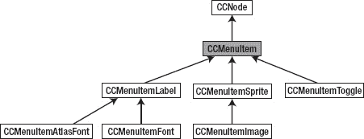

**图 3-9.** *CCMenuItem 类层次结构*

清单 3-1 展示了设置菜单的代码。你可以在 Essentials 项目的 `MenuScene` 类中找到菜单代码。

**清单 3-1.** *在 cocos2d 中使用文本和图片菜单项创建菜单*

```
CGSize size = [[CCDirector sharedDirector] winSize];

// 设置 CCMenuItemFont 默认属性
[CCMenuItemFont setFontName:@"Helvetica-BoldOblique"];
[CCMenuItemFont setFontSize:26];

// 创建几个带文本和选择器的标签
CCMenuItemFont* item1 = [CCMenuItemFont itemFromString:@"返回!" target:self
                                              selector:@selector(menuItem1Touched:)];

// 使用现有精灵创建菜单项
CCSprite* normal = [CCSprite spriteWithFile:@"Icon.png"];
normal.color = ccRED;
CCSprite* selected = [CCSprite spriteWithFile:@"Icon.png"];
selected.color = ccGREEN;
CCMenuItemSprite* item2 = [CCMenuItemSprite
                                    itemFromNormalSprite:normal
                                          selectedSprite:selected
                                                  target:self
                                                selector:@selector(menuItem2Touched:)];
// 使用另外两个菜单项创建切换项（切换也适用于图片）
[CCMenuItemFont setFontName:@"STHeitiJ-Light"];
[CCMenuItemFont setFontSize:18];
CCMenuItemFont* toggleOn = [CCMenuItemFont itemFromString:@"我开了!"];
CCMenuItemFont* toggleOff = [CCMenuItemFont itemFromString:@"我关了!"];
CCMenuItemToggle* item3 = [CCMenuItemToggle itemWithTarget:self
                                                  selector:@selector(menuItem3Touched:)
                                                     items:toggleOn, toggleOff, nil];

// 使用这些项创建菜单
CCMenu* menu = [CCMenu menuWithItems:item1, item2, item3, nil];
menu.position = CGPointMake(size.width / 2, size.height / 2);
[self addChild:menu];

// 对齐很重要，这样菜单项才不会占据同一位置
[menu alignItemsVerticallyWithPadding:40];
```

**警告：** 菜单项列表始终以 `nil` 作为最后一个参数结束。这是一个技术要求。如果你忘记将 `nil` 添加为最后一个参数，你的应用程序将在该特定行崩溃。

设置菜单需要相当多的代码。第一个菜单项基于 `CCMenuItemFont`，仅显示一个字符串。当菜单项被触摸时，它会调用方法 `menuItem1Touched`。在内部，`CCMenuItemFont` 只是创建了一个 `CCLabel`。如果你已经有一个 `CCLabel`，你可以使用 `CCMenuItemLabel` 类来替代。

同样，有两个用于图像的菜单项类；一个是 `CCMenuItemImage`，它从文件创建图像并在内部使用 `CCSprite`；另一个是我在此处使用的 `CCMenuItemSprite`。这个类将现有精灵作为输入，我认为这更方便，因为你可以使用相同的图像，只需调整其色调即可在触摸时实现高亮效果。

`CCMenuItemToggle` 恰好接受两个派生于 `CCMenuItem` 的对象，当被触摸时，它会在两个项之间切换。你可以将文本标签或图片与 `CCMenuItemToggle` 一起使用。

最后，`CCMenu` 本身被创建并定位。由于菜单项都是 `CCMenu` 的子节点，它们将相对于菜单进行定位。为了防止它们相互堆叠，你必须调用 `CCMenu` 的某个对齐方法，例如我在清单 3-1 末尾所做的 `alignItemsVerticallyWithPadding`。

由于 `CCMenu` 是一个包含所有菜单项的节点，你可以对菜单使用动作来让它滑入和滑出。这会使你的菜单屏幕看起来不那么静态，这通常是一件好事。有关示例，请参阅 Essentials 项目。同时，请查看图 3-10，了解我们当前菜单的外观。

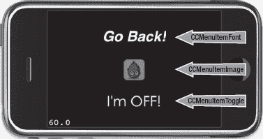

**图 3-10.** *这是由清单 3-1 中的代码生成的菜单。*


### 动作

动作是轻量级类，用于在节点上执行特定的操作。它们允许你对节点进行移动、旋转、缩放、着色、淡入淡出以及执行许多其他操作。由于它们适用于所有节点，因此你可以在精灵、标签甚至菜单或整个场景中使用它们！这正是它们强大之处。

在图 3-11 中，你可以看到 `CCAction` 类的层次结构，其中省略了 `CCActionInterval` 和 `CCActionInstant` 的众多子类。你将在图 3-12 和图 3-17 中分别看到它们的类层次结构。

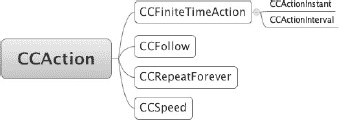

**图 3-11.** *省略了 CCActionInstant 和 CCActionInterval 子类的 CCAction 类层次结构*

仅有三个动作直接派生自 `CCAction`：

- `CCFollow`（允许一个节点跟随另一个节点）
- `CCRepeatForever`（无限重复某个动作）
- `CCSpeed`（在动作运行时改变其更新频率）

使用 `CCFollow` 动作，你可以指示一个节点跟随另一个节点。例如，要让一个标签跟随玩家角色精灵，代码可能如下所示：

```
[label runAction:[CCFollow actionWithTarget:playerSprite]];
```

你也可以使用 `CCRepeatForever` 让动作甚至整个动作序列无限重复（循环）。例如，你可以通过这种方式创建无限循环的动画。以下代码让一个节点像无限旋转的轮子一样永久旋转：

```
CCRotateBy* rotateBy = [CCRotateBy actionWithDuration:2 angle:360];
CCRepeatForever* repeat = [CCRepeatForever actionWithAction:rotateBy];
[myNode runAction:repeat];
```

`CCSpeed` 动作可用于在动作运行时影响其速度。让我们以前面的旋转示例为例，并用 `CCSpeed` 动作将其包装起来：

```
CCRotateBy* rotateBy = [CCRotateBy actionWithDuration:2 angle:360];
CCRepeatForever* repeat = [CCRepeatForever actionWithAction:rotateBy];
CCSpeed* speedAction = [CCSpeed actionWithAction:repeat speed:0.5f];
speedAction.tag = 1;
[myNode runAction:speedAction];
```

现在，节点完成一次完整旋转所需的时间将加倍，因为 `CCSpeed` 动作的速度被设置为 `0.5f`。之后，你可以更改 `CCSpeed` 动作的 `speed` 属性，以在包装的动作运行时影响其速度。要让节点突然旋转得更快，你只需获取速度动作并修改其 `speed` 属性：

```
CCSpeed* speedAction = (CCSpeed*)[myNode getActionByTag:1];
speedAction.speed = 2;
```

**注意：** 你不能将 `CCSpeed` 动作添加到 `CCSequence` 动作中，因为只有派生自 `CCFiniteTimeAction` 的动作才能用于序列。

#### 区间动作

由于大多数动作都是随时间发生的，例如持续三秒的旋转，通常你需要编写一个更新方法并添加变量来存储中间结果。图 3-12 中显示的 `CCActionInterval` 动作为你封装了这类逻辑，并将其转化为简单的参数化方法：

```
// 让 myNode 移动到 100, 200 并在 3 秒内到达那里
CCMoveTo* move = [CCMoveTo actionWithDuration:3 position:CGPointMake(100, 200)];
[myNode runAction:move];
```

一旦你开始使用这段特定代码，你会注意到，根据 `myNode` 需要移动的距离，其速度会有所不同。这是一个非常常见的问题，并且有一个简单的解决方案。你需要计算从当前位置到目标位置的距离，然后将其除以你希望节点移动的速度。得到的结果就是正确的持续时间，无论节点和目标位置在哪里，都能让节点以相同速度移动到目标位置。

```
// 让 myNode 以固定速度移动到任意位置
CGPoint targetPos = CGPointMake(100, 200);
float speed = 10; // 单位：像素/秒
float duration = ccpDistance(myNode.position, targetPos) / speed;

CCMoveTo* move = [CCMoveTo actionWithDuration:duration position:targetPos];
[myNode runAction:move];
```

顺便提一下，你不需要手动移除动作。一旦动作完成其任务，它会自动从节点上移除自己并释放其使用的内存。

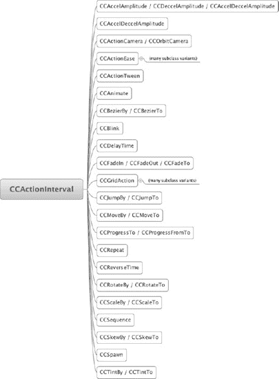

**图 3–12.** *省略了 CCActionEase 和 CCGridAction 子类的 CCActionInterval 类层次结构*

#### 动作序列

通常，当你向节点添加多个动作时，它们会同时执行各自的职责。例如，你可以通过添加相应的动作让一个对象同时旋转和淡出。但如果你想一个接一个地执行动作呢？

有时，将动作序列化会更有用，这就是 `CCSequence` 的用武之地。由于它非常常用，因此值得特别提一下。你可以在一个序列中使用任意数量和类型的动作，这使得可以轻松地让一个节点移动到目标位置，到达后旋转，然后淡出，每个动作依次执行，直到序列完成。

以下是如何循环改变标签颜色，从红色到蓝色再到绿色：

```
CCTintTo* tint1 = [CCTintTo actionWithDuration:4 red:255 green:0 blue:0];
CCTintTo* tint2 = [CCTintTo actionWithDuration:4 red:0 green:0 blue:255];
CCTintTo* tint3 = [CCTintTo actionWithDuration:4 red:0 green:255 blue:0];
CCSequence* sequence = [CCSequence actions:tint1, tint2, tint3, nil];
[label runAction:sequence];
```

你也可以将 `CCRepeatForever` 动作与序列一起使用：

```
CCSequence* sequence = [CCSequence actions:tint1, tint2, tint3, nil];
CCRepeatForever* repeat = [CCRepeatForever actionWithAction:sequence];
[label runAction:repeat];
```

并且，能够修改整个重复序列的速度有时也会派上用场：

```
CCSequence* sequence = [CCSequence actions:tint1, tint2, tint3, nil];
CCRepeatForever* repeat = [CCRepeatForever actionWithAction:sequence];
CCSpeed* speedAction = [CCSpeed actionWithAction:repeat speed:0.75f];
[label runAction:speedAction];
```

**注意：** 与菜单项一样，动作列表总是以 `nil` 结尾。如果你忘记添加 `nil` 作为最后一个参数，创建 `CCSequence` 的那一行代码将会崩溃！


#### 缓动动作

通过使用基于`CCActionEase`类的动作，动作会变得更加强大。缓动动作允许你随时间改变动作的效果。例如，如果你对一个节点使用`CCMoveTo`动作，该节点会以恒定速度移动整个距离直至到达终点。使用`CCActionEase`，你可以让节点先缓慢移动，然后加速移向目标，或者相反。你也可以让它越过目标位置一小段距离后再弹回。缓动动作可以创造出通常需要大量时间才能实现的非常动态的动画效果。以下代码展示了如何使用缓动动作来修改常规动作的行为。`rate`参数决定了缓动效果的显著程度，并且必须大于 1 才能看到效果。

```
// 我希望 myNode 在 3 秒内移动到 100, 200 的位置
CCMoveTo* move = [CCMoveTo actionWithDuration:3 position:CGPointMake(100, 200)];
// 这次，节点应该在移动过程中先缓慢加速，再减速
CCEaseInOut* ease = [CCEaseInOut actionWithAction:move rate:4];
[myNode runAction:ease];
```

**注意：** 在示例中，是缓动动作在节点上运行，而不是移动动作。在处理动作时，很容易忘记修改`runAction`这一行。即使是经验最丰富的 cocos2d 开发者，也经常会犯这个常见错误。如果你发现动作没有按预期工作或完全不起作用，请仔细检查你运行的是否是正确动作。如果使用了正确的动作但仍未达到预期效果，请验证是否是正确的节点在运行该动作。这是另一个常见错误。

Cocos2d 实现了以下`CCActionEase`类：

- `CCEaseBackIn`、`CCEaseBackInOut`、`CCEaseBackOut`
- `CCEaseBounceIn`、`CCEaseBounceInOut`、`CCEaseBounceOut`
- `CCEaseElasticIn`、`CCEaseElasticInOut`、`CCEaseElasticOut`
- `CCEaseExponentialIn`、`CCEaseExponentialInOut`、`CCEaseExponentialOut`
- `CCEaseIn`、`CCEaseInOut`、`CCEaseOut`
- `CCEaseSineIn`、`CCEaseSineInOut`、`CCEaseSineOut`

在第 4 章中，我将在 DoodleDrop 项目中使用其中一些缓动动作，以便你能看到它们的效果。我已在图 3–13 中添加了`CCActionEase`类的层次结构供参考。

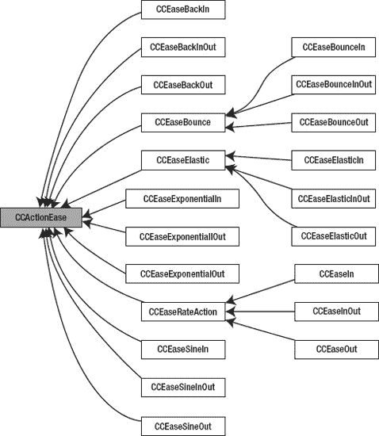

**图 3–13.** *`CCActionEase`* *类层次结构*

#### 网格动作

网格动作是纯视觉动作，派生自`CCGridAction`及其两个子类之一：`CCGrid3DAction`和`CCTiledGrid3DAction`。它们的类层次结构分别如图 3–14 和图 3–15 所示。

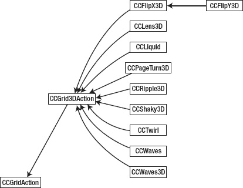

**图 3–14.** *`CCGrid3DAction`* *类层次结构*

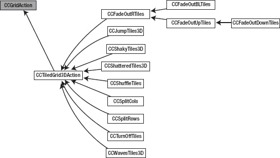

**图 3–15.** *`CCTiledGrid3DAction`* *类层次结构*

网格动作的特色在于三维效果，例如翻页（`CCPageTurn3D`；参见图 3–16）或模拟波浪和液体（`CCWaves`、`CCLiquid`）。缺点是，除非你启用深度缓冲，否则 3D 效果可能会出现视觉伪影。启用深度缓冲需要更多内存，并对渲染性能产生负面影响，尤其是在第一代和第二代设备上。

要启用深度缓冲，你需要修改项目中应用代理类中初始化`EAGLView`类的代码行，以添加深度缓冲支持。具体操作是将`depthFormat`参数从其默认值 0 改为`GL_DEPTH_COMPONENT16_OES`（用于 16 位深度缓冲）或`GL_DEPTH_COMPONENT24_OES`（用于 24 位深度缓冲）：

```
EAGLView *glView = [EAGLView viewWithFrame:[window bounds]
                               pixelFormat:kEAGLColorFormatRGB565
                               depthFormat:GL_DEPTH_COMPONENT16_OES];
```

理想情况下，你应该先尝试 16 位深度缓冲；它占用更少的内存，但在极少数情况下，如果使用 3D 动作时仍然出现视觉伪影，则可能需要 24 位深度缓冲。

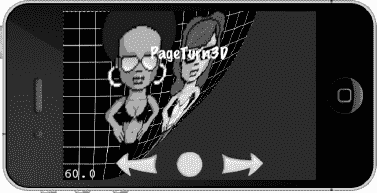

**图 3–16.** *运行中的* `CCPageTurn3D` *动作*

#### 即时动作

你可能会想，既然可以直接改变节点属性达到相同效果，为什么还需要基于`CCInstantAction`类的即时动作（类层次结构见图 3–17）？例如，存在一些即时动作用于翻转节点、将其放置到特定位置或切换其可见性属性。

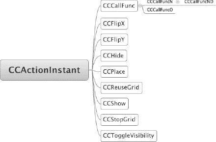

**图 3–17.** *`CCActionInstant`* *类层次结构*

即时动作存在的主要原因在于它们在动作序列中非常有用。有时，在动作序列中你需要改变节点的某个属性（如可见性或位置），然后继续执行序列。即时动作使这成为可能。诚然，它们很少被使用——但有一个例外：`CCCallFunc`动作。

在使用动作序列时，你可能希望在特定时刻收到通知，例如序列结束时，然后可能在之后立即启动另一个序列。为此，你可以使用`CCCallFunc`动作的几个变体，这些变体会在序列中轮到它们时发送一条消息。让我们重写颜色循环序列，使其在每个`CCTintTo`动作完成其任务时调用一个方法：

```
CCCallFunc* func = [CCCallFunc actionWithTarget:self
                                       selector:@selector(onCallFunc)];

CCCallFuncN* funcN = [CCCallFuncN actionWithTarget:self
                                          selector:@selector(onCallFuncN:)];

CCCallFuncND* funcND = [CCCallFuncND actionWithTarget:self
                                             selector:@selector(onCallFuncND:data:)
                                                 data:(void*)self];

CCCallFuncO* funcO = [CCCallFuncO actionWithTarget:self
                                          selector:@selector(onCallFuncO:)
                                            object:(id)self];

CCSequence* seq = [CCSequence actions:
    tint1, func, tint2, funcN, tint3, funcND, funcO, nil];
[label runAction:seq];
```

这些`CCCallFunc`变体之间的区别在于它们调用的选择器不同，因此它们所调用的方法可访问的上下文也不同。例如，当`CCCallFunc`调用`onCallFunc`方法时，你无法知道是谁调用了该方法或为什么调用。没有上下文信息，但在许多情况下，这种上下文是不需要的。

动作序列`seq`将依次调用以下代码中的方法。`sender`参数始终派生自`CCNode`，即正在运行动作的节点。`data`参数可以以任何你希望的方式使用，包括传递值、结构体或其他指针。你只需正确地转换数据指针即可。

```
-(void) onCallFunc
{
        CCLOG(@"tint1 结束!");
}

-(void) onCallFuncN:(id)sender
{
        CCLOG(@"tint2 结束! 发送者: %@", sender);
}

-(void) onCallFuncND:(id)sender data:(void*)data
{
        // 像这样转换指针时要小心！
        // 你必须 100%确定该对象属于此类型！
        CCSprite* sprite = (CCSprite*)data;
        CCLOG(@"序列结束! 发送者: %@ - 数据: %@", sender, sprite);
}
-(void) onCallFuncO:(id)object
{
    // object 是你传递给 CCCallFuncO 的对象
    CCLOG(@"使用对象 %@ 调用 func", object);
}
```

当然，`CCCallFunc`动作也可以与`CCRepeatForever`序列一起使用。你的方法将在适当的时间被重复调用。


### 关于 cocos2d 中单例模式的说明

Cocos2d 很好地运用了单例设计模式，我认为这值得一提，因为该模式经常引发激烈争论。原则上，单例是一个常规类，在应用程序的整个生命周期中仅被实例化一次。为了确保这一点，需要使用静态方法来创建和访问该对象的实例。因此，你无需使用 `alloc`/`init` 或静态的自动释放初始化器，而是通过以 `shared` 开头的方法来访问单例对象。以下是 cocos2d 最常用的一些单例类及其访问方式：

```
CCActionManager* sharedManager = [CCActionManager sharedManager];
CCDirector* sharedDirector = [CCDirector sharedDirector];
CCSpriteFrameCache* sharedCache = [CCSpriteFrameCache sharedSpriteFrameCache];
CCTextureCache* sharedTexCache = [CCTextureCache sharedTextureCache];
CCTouchDispatcher* sharedDispatcher = [CCTouchDispatcher sharedDispatcher];
CDAudioManager* sharedManager = [CDAudioManager sharedManager];
SimpleAudioEngine* sharedEngine = [SimpleAudioEngine sharedEngine];
```

单例的优势在于，它可以在任何时候被任何类在任何地方使用。它就像一个全局类，非常类似于全局变量。如果你有一组需要在许多不同地方使用的数据和方法的组合，单例非常有用。音频就是一个很好的例子，因为你的任何类——无论是玩家、敌人、菜单按钮还是过场动画——都可能需要播放音效或改变背景音乐。因此，使用单例来播放音频是非常合理的。同样，如果你有全局游戏统计数据，比如玩家军队的规模和每个排的兵力数量，你可能希望将这些信息存储在一个单例中，以便从一个关卡携带到另一个关卡。实现单例很直接，如代码清单 3-2 所示。这段代码用最少的代码将 `MyManager` 类实现为单例。`sharedManager` 静态方法提供了对 `MyManager` 唯一实例的访问。如果该实例不存在，则会分配并初始化一个 `MyManager` 实例；否则，返回现有的实例。

**代码清单 3-2.** *将示例类 MyManager 实现为单例*

```
static MyManager *sharedManager = nil;

+(MyManager*) sharedManager
{
    if (sharedManager == nil)
    {
        sharedManager = [[MyManager alloc] init];
    }
    return sharedManager;
}
```

然而，单例也有其丑陋的一面。因为它们易于使用和实现，并且可以从任何其他类访问，所以存在过度使用的倾向。它们就像全局变量，大多数程序员认为应该谨慎且有节制地使用。

例如，你可能认为只有一个玩家对象，那为什么不将玩家类设为单例呢？一切似乎都很好——直到你发现，每当玩家从一个关卡进入另一个关卡时，这个单例不仅保留了玩家的分数，还保留了上一帧的动画、生命值以及所有拾取的道具，甚至可能因为离开上一关卡时处于狂暴模式，而在新关卡开始时也处于该模式。

为了解决这个问题，你添加了另一个方法，在切换关卡时重置某些变量。到目前为止还不错，但随着你为游戏添加更多功能，在切换关卡时，你将不得不添加和维护越来越多的变量。更糟的是，假设有一天一位朋友建议你为 iPad 版本增加双人模式。但是，哦等等，你的玩家是单例；你任何时候都只能有一个玩家！这会让你非常头疼：是重构大量代码，还是放弃酷炫的双人模式？

或者，为什么不把第二个玩家也做成单例呢？每当第二个玩家需要知道第一个玩家的某些信息时，就直接使用那个单例。这样，它们相互持有引用，这意味着你在单机游戏中也不得不初始化其他玩家。这是类之间强依赖的副作用之一，也被称为*紧耦合*。类之间耦合得越紧密，对代码任何部分进行修改就越困难。这就像你在搅拌水泥，它慢慢变干，直到硬得任何改动都更容易通过粗暴修改而非改进代码来完成。到了那个地步，似乎 BUG 会到处随机出现，与最近的修改毫无关联。一言以蔽之：令人沮丧。

对单例的依赖越强，出现此类问题的可能性就越大。在创建单例类之前，始终要考虑是否真的只需要该类及其数据的唯一实例，以及这种情况将来是否会改变。

我知道初学者很难判断何时何地使用单例，特别是如果你在面向对象编程方面经验不足。问答网站 Stackoverflow.com 上有一个讨论，附带了额外链接，阐述了对单例设计模式的争议，并引发了一些思考：[`http://stackoverflow.com/questions/137975/what-is-so-bad-about-singletons`](http://stackoverflow.com/questions/137975/what-is-so-bad-about-singletons)。

我的建议是研究单例的常见用法。在 cocos2d 游戏引擎中，将单例用于资源管理是可以接受的，因为它简化了游戏引擎的整体设计。大多数其他游戏引擎也出于类似目的使用单例，并且我很少听到有人对此抱怨。你甚至在 iOS SDK 中也能找到单例。单例通常不像有些人说得那么糟糕，尽管它们确实容易通过引入强依赖而引发问题，而且问题会随着代码库规模的增大而呈指数级增长。

### Cocos2d 测试用例

你知道 cocos2d 附带了大量示例代码吗？在你的 `cocos2d-iphone` 文件夹中，你会发现一个恰当命名为 `cocos2d-iphone` 的项目，其中包含许多你可以构建和运行的测试目标。你可以观察事物如何运作，然后检查代码以了解其实现方式。

### 总结

哇！内容可真不少！我不指望你能一次性记住本章的所有内容。随时欢迎你回来重温 cocos2d 的场景图以及如何使用各种 `CCNode` 类。我写本章的目的是在你需要时提供一个良好的参考，同样还有配套的 NodeHierarchy 和 Essentials Xcode 项目。

掌握本章的知识，并怀揣相当的积极性，你现在就可以开始编写自己的游戏了。

你知道吗，让我们一起动手吧。请继续阅读下一章，我将引导你完成第一个完整的游戏项目！

## 第 4 章

## 你的第一个游戏

在本章中，你将构建你的第一个完整游戏。它不会赢得任何奖项，但你会学到如何让 cocos2d 的核心元素协同工作。我将引导你完成每一步，所以你还会在这个过程中学到一些使用 Xcode 的知识。

这个游戏是著名的涂鸦跳跃（Doodle Jump）游戏的变体，恰当地命名为 DoodleDrop。玩家的目标是通过旋转设备来移动玩家精灵，从而尽可能长时间地躲避下落的障碍物。请查看图 4-1 中的最终版本，以了解本章将创建的内容。

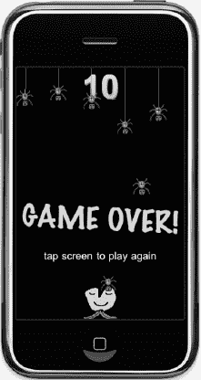

**图 4-1.** *DoodleDrop 游戏的最终版本*


### 分步项目设置

现在启动 `Xcode`，我将引导您完成创建第一个 cocos2d 游戏的步骤。在 `Xcode` 中，选择 **文件  新建  新建项目…**，然后选择 cocos2d 应用程序模板，如图 4–2 所示。当系统提示您输入新项目的名称时，请输入 **DoodleDrop**，并在必要时选择合适的位置来保存项目。`Xcode` 会自动创建一个名为 `DoodleDrop` 的子文件夹，因此您无需手动创建该文件夹。

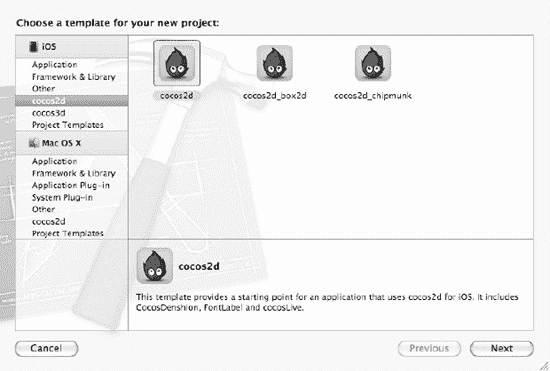

**图 4–2.** *从 cocos2d 应用程序模板创建项目。*

`Xcode` 应会显示一个类似于图 4–3 的项目视图。根据您使用的 cocos2d 和 `Xcode` 版本，可能会显示更多文件，或者组名可能略有不同。

我已经展开了 `Classes` 和 `Resources` 组，因为您将分别在其中添加源代码和游戏资源文件。任何非源代码的内容都被视为资源，无论是图像、音频文件、文本文件还是 `plist`。这种分组并非严格必要，但如果将相似的文件保持在一起，确实能让您更轻松地浏览项目。

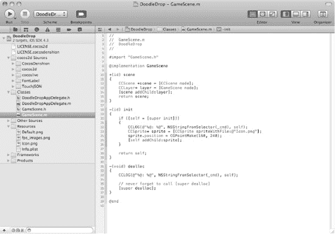

**图 4–3.** *游戏开始吧！此时的 `DoodleDrop` 项目基于 `HelloWorld` cocos2d 项目模板。请确保后续将文件相应地添加到 `Classes` 和 `Resources` 组中，以保持游戏项目的井然有序。*

接下来您面临一个选择：是直接使用现有的 `HelloWorldScene`，稍后再重命名它？还是通过额外的步骤创建自己的场景来替换 `HelloWorldScene`？我选择了后者，因为最终您无论如何都需要添加新场景，所以现在学习基本方法并从头开始是个好主意。

确保选中 `Classes` 组，然后选择 **文件  新建  新建文件…**，或右键单击 `Classes` 文件夹并选择 **新建文件…**，打开如图 4–4 所示的新建文件对话框。由于 cocos2d 为最重要的节点提供了类模板，不使用它们实在可惜。从 cocos2d 用户模板部分，选择 `CCNode` 类，点击 **下一步**，并确保其设置为 **CCLayer 的子类**，然后再次点击 **下一步** 以调出如图 4–5 所示的保存文件对话框。

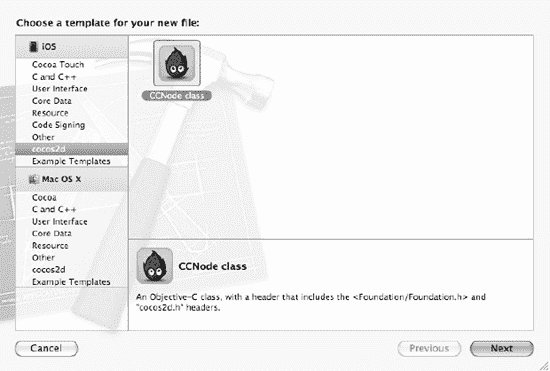

**图 4–4.** *添加新的 `CCNode` 派生类最好使用 cocos2d 提供的类模板。在本例中，我们希望 `CCNode` 类是 `CCLayer` 的子类，因为我们正在设置一个新场景。*

我倾向于按功能并以通用方式命名类。这里我使用的是 `GameScene.m`。它将是 `DoodleDrop` 游戏玩法发生的场景，因此这个名称很合适。请确保选中 `DoodleDrop` 目标复选框。如果您使用的是 `Xcode 3`，则还必须选中 **同时创建 “GameScene.h”** 复选框。目标是 `Xcode` 创建可执行文件不同版本的一种方式。例如，游戏的 iPad 版本通常作为一个单独的目标创建。在本例中，我们只有一个目标，但一旦您创建了 iPad 目标，就需要确保，例如，iPad 的高分辨率图像不会意外添加到 iPhone/iPod touch 目标中。

**注意：** 不检查目标复选框可能会导致各种问题，从编译错误到“文件未找到”错误，或者在游戏过程中因文件未添加到所需目标而导致崩溃。或者，您也可能仅仅因为将文件添加到不需要它们的目标（例如将 iPad 和 iPhone 4 的高分辨率图像添加到普通 iPhone/iPod touch 目标）而浪费空间。

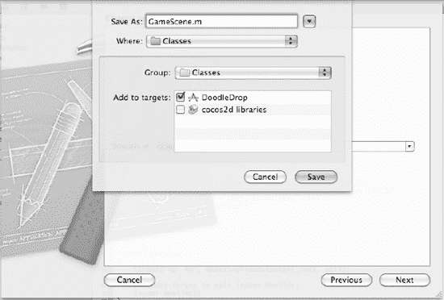

**图 4–5.** *命名新场景并确保将其添加到适当的目标*

此时，我们的 `GameScene` 类是空的，我们需要做的第一件事是添加 `+(id) scene` 方法来将其设置为场景。我们将插入的代码与第 3 章 中的代码基本相同，仅更改了层的类名。在任何类中，您几乎总是需要 `-(id) init` 和 `-(void) dealloc` 方法，因此立即添加它们是有意义的。我也是非常谨慎的程序员，决定添加第 3 章 中介绍的日志记录语句。生成的 `GameScene.h` 如代码清单 4–1 所示，`GameScene.m` 如代码清单 4–2 所示。

**代码清单 4–1.** *包含场景方法的 `GameScene.h`*

```
#import <Foundation/Foundation.h>
#import "cocos2d.h"

@interface GameScene : CCLayer
{
}

+(id) scene;

@end
```

**代码清单 4–2.** *包含场景方法以及包括日志记录在内的标准方法的 `GameScene.m`*

```
#import "GameScene.h"

@implementation GameScene

+(id) scene
{
    CCScene *scene = [CCScene node];
    CCLayer* layer = [GameScene node];
    [scene addChild:layer];
    return scene;
}

-(id) init
{
    if ((self = [super init]))
    {
        CCLOG(@"%@: %@", NSStringFromSelector(_cmd), self);
    }

    return self;
}

-(void) dealloc
{
    CCLOG(@"%@: %@", NSStringFromSelector(_cmd), self);

    // 切勿忘记调用 [super dealloc]
    [super dealloc];
}

@end
```

现在您可以安全地删除 `HelloWorldScene` 类。当系统询问时，选择 **也移动到废纸篓** 选项，将文件从硬盘驱动器以及 `Xcode` 项目中一并移除。选择这两个文件，然后选择 **编辑  删除**，或者右键单击文件并从上下文菜单中选择 **删除**。删除 `HelloWorldScene` 类后，您需要修改 `DoodleDropAppDelegate.m`，将对 `HelloWorldScene` 的所有引用更改为 `GameScene`。代码清单 4–3 突出显示了对 `#import` 和 `runWithScene` 语句的必要更改。我还将设备方向更改为纵向模式，因为该游戏设计为该模式下效果最佳。

**代码清单 4–3.** *修改 `DoodleDropAppDelegate.m` 文件以使用 `GameScene` 类而非 `HelloWorldScene`*

```
// 将 #import "HelloWorldScene.h" 这一行替换为此处：
#import "GameScene.h"

- (void) applicationDidFinishLaunching:(UIApplication*)application
{
    …

    // 设置纵向模式
    [director setDeviceOrientation:kCCDeviceOrientationPortrait];

    …

    // 将 HelloWorld 替换为 GameScene
[[CCDirector sharedDirector] runWithScene: [GameScene scene]];
}
```

编译并运行，您应该会看到一个……空白场景。成功了！如果您遇到任何问题，请将您的项目与本书附带的 `DoodleDrop01` 项目进行比较。

**注意：** 从 cocos2d 版本 0.99.5 开始，一个名为 `GameConfig.h` 的文件被添加到 cocos2d `Xcode` 项目模板中。如果您发现纵向模式不起作用，并且您是根据某个 cocos2d `Xcode` 项目模板创建的新项目，那很可能是因为游戏默认启用了自动旋转。如果您在 `GameConfig.h` 中看到 `#define GAME_AUTOROTATION kGameAutorotationUIViewController`，您需要将其更改为以下代码以禁用自动旋转：`#define GAME_AUTOROTATION kGameAutorotationNone`。


### 添加玩家精灵

接下来，你将添加玩家精灵，并使用加速度计来控制其行为。要添加玩家图像，请在 Xcode 中选择 **Resources** 组，然后选择 **File**  **Add Files to “DoodleDrop”…**，或者右键单击并从上下文菜单中选择 **Add Files to “DoodleDrop”…** 以打开文件选择对话框。玩家图像 `alien.png` 位于本书提供的 DoodleDrop 项目的 **Resources** 文件夹中。你也可以选择自己的图像，只要它的大小是 64 x 64 像素即可。

随后 Xcode 会询问你添加文件的详细方式和位置，如 图 4–6 所示。确保为每个将使用这些文件的目标选中 **Add To Targets** 复选框，在这种情况下，只有 DoodleDrop 目标。默认设置已经足够。

**提示：** iOS 游戏的首选图像格式是 PNG（可移植网络图形格式）。它是一种压缩文件格式，但与 JPG 不同，这种压缩是无损的，可以保持原始图像的所有像素不变。虽然你也可以保存未压缩的 JPEG 文件，但相同图像的 PNG 格式通常比未压缩的 JPEG 文件更小。这只会影响应用大小，不会影响纹理的内存（RAM）使用。在第 16 章中，你还会了解 TexturePacker，这是一个为你管理图像的工具。它允许你将图像转换为各种压缩格式，或者通过抖动和其他技术在保持尽可能好的图像质量的同时降低颜色深度。

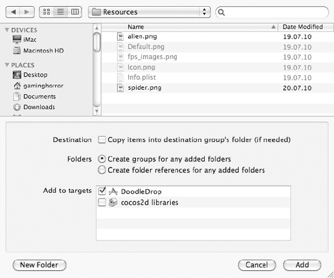

**图 4–6.** *每次添加资源文件时都会看到此对话框。大多数情况下，你应该使用这些默认设置。*

现在我们将玩家精灵添加到游戏场景中。我决定将其作为 `CCSprite*` 成员变量添加到 `GameScene` 类中。目前这样做更简单，而且游戏足够简单，所有内容都可以放在同一个类中。通常，这不是推荐的方法，因此后续的项目会为单独的游戏组件创建独立的类，这是良好代码设计的体现。

代码清单 4–4 展示了将 `CCSprite*` 成员添加到 GameScene 头文件的过程。

**代码清单 4–4.** *将 CCSprite* Player 作为成员变量添加到 GameScene 类*

```
#import <Foundation/Foundation.h>
#import "cocos2d.h"

@interface GameScene : CCLayer
{
    CCSprite* player;
}

+(id) scene;

@end
```

代码清单 4–5 包含了我添加到 `init` 方法中的代码，用于初始化精灵，将其赋值给成员变量，并将其定位在屏幕底部中央。同时启用了加速度计输入。

**代码清单 4–5.** *启用加速度计输入并创建和定位玩家精灵*

```
-(id) init
{
    if ((self = [super init]))
    {
        CCLOG(@"%@: %@", NSStringFromSelector(_cmd), self);

        self.isAccelerometerEnabled = YES;

        player = [CCSprite spriteWithFile:@"alien.png"];
        [self addChild:player z:0 tag:1];

        CGSize screenSize = [[CCDirector sharedDirector] winSize];
        float imageHeight = [player texture].contentSize.height;
        player.position = CGPointMake(screenSize.width / 2, imageHeight / 2);
    }

    return self;
}
```

玩家精灵作为子节点添加，标签为 1，稍后将用于识别玩家精灵并将其与所有其他精灵区分开来。注意，我没有保留玩家精灵。由于我们将其作为子节点添加到图层，cocos2d 会保留它，并且因为玩家精灵从未从图层中移除，所以无需特意保留就足以保持玩家精灵的存在。不保留由另一个类或对象管理内存的对象称为*保持弱引用*。

**注意：** iOS 设备上的文件名是区分大小写的。如果你尝试加载 `Alien.png` 或 `ALIEN.PNG`，它在模拟器中可以运行，但在任何 iOS 设备上都不行，因为实际名称是全小写的 `alien.png`。因此，最好坚持使用诸如严格保持所有文件名全小写的命名约定。为什么用全小写？因为全大写的文件名通常更难阅读。

你通过将 x 位置居中于屏幕宽度一半处来设置玩家精灵的初始位置，这使精灵在水平方向上居中。在垂直方向上，我们希望玩家精灵纹理的底部与屏幕底部对齐。如果你还记得上一章的内容，就知道精灵纹理是围绕节点位置居中的。将精灵垂直定位在 0 会导致精灵纹理的下半部分位于屏幕下方。这不是我们想要的；我们想将其向上移动半个纹理高度。

这是通过调用 `[player texture].contentSize.height` 实现的，该方法返回精灵纹理的内容大小。内容大小到底是什么？在第 3 章中，我提到 iOS 设备的纹理尺寸只能是 2 的幂。但实际图像大小可能小于纹理大小。例如，如果图像是 100 x 100 像素，而纹理必须是 128 x 128 像素，就会出现这种情况。纹理的 `contentSize` 属性返回原始图像的尺寸，即 100 x 100 像素。大多数情况下，你会希望使用内容大小，而不是纹理大小。即使你的图像是 2 的幂，你也应该使用 `contentSize`，因为纹理可能是一个包含多个图像的纹理图集。纹理图集将在第 6 章中描述。

通过取图像高度的一半并将其设置为 y 轴上的位置，精灵图像将与屏幕底部整齐对齐。

**提示：** 在可能的情况下避免使用固定位置是一个好习惯。如果你简单地将玩家位置设置为 `160,32`，你就做出了两个应该避免的假设。首先，你假设屏幕宽度为 320 像素，但这并不适用于所有 iOS 设备。其次，你假设图像高度为 64 像素，但这也可能改变。一旦你开始做出这样的假设，你就会在整个项目中形成这样做的习惯。

我编写定位代码的方式涉及更多的输入，但从长远来看，这会带来巨大的回报。你可以部署到不同的设备上，它都能正常工作；你也可以使用不同尺寸的图像，它也能正常工作。再也不需要更改这段特定的代码了。程序员面临的最耗时的任务之一就是修改基于假设编写的代码。

想象一下，三个月后，你的游戏中添加了大量图像和对象，你必须更改所有这些固定数字，以创建一个显然也需要不同尺寸图像的 iPad 版本，然后为了适配 iPhone 4 的 Retina 显示屏再次做同样的事情。到那时，你会有三个不同的 Xcode 项目需要维护和添加功能。最终，这将导致“复制粘贴地狱”，这是更不可取的——千万别走到那一步！


### 加速度计输入

最后一步，完成这些我们就能让玩家精灵倾斜移动了。正如我在第三章中演示的，你需要在接收加速度计输入的图层中添加相应方法。这里我使用`acceleration.x`参数并将其添加到玩家的位置中；乘以 10 是为了加快玩家的移动速度。

```
-(void) accelerometer:(UIAccelerometer *)accelerometer
        didAccelerate:(UIAcceleration *)acceleration
{
    CGPoint pos = player.position;
    pos.x += acceleration.x * 10;
player.position = pos;
}
```

发现什么奇怪的地方了吗？我写了三行代码，而原本一行似乎就够了：

```
// 错误：需要左值作为赋值操作数
player.position.x += acceleration.x * 10;
```

与 Java、C++和 C#等其他编程语言不同，在 Objective-C 的属性中，像`player.position.x += value`这样的写法是行不通的。`position`属性是一个`CGPoint`，这是一种常规的 C 语言结构体数据类型。Objective-C 的属性无法直接给结构体中的字段赋值。问题出在 Objective-C 中属性的工作方式，以及作为其基础的 C 语言的赋值机制上。

语句`player.position.x`实际上是对位置的获取方法`[player position]`的调用，这意味着你实际上获取了一个临时位置，然后试图修改这个临时`CGPoint`对象的`x`成员。但这个临时`CGPoint`随后会被丢弃。位置的设置方法`[player setPosition]`并不会被自动调用。你只能直接给`player.position`属性赋值，即赋给一个新的`CGPoint`。在 Objective-C 中，你不得不面对这个令人遗憾的问题——如果你有 Java、C++或 C#背景，可能还需要改变编程习惯。

这就是为什么之前的代码必须创建一个临时的`CGPoint`对象，修改该对象的`x`字段，然后再将临时`CGPoint`赋值给`player.position`。遗憾的是，在 Objective-C 中必须这样做。

### 首次测试运行

你的项目现在应该与本章提供的代码中`DoodleDrop02`文件夹内的项目处于同一水平。现在试运行一下。请确保选择在设备上运行该应用，因为你无法从模拟器获得加速度计输入。测试此版本中加速度计输入的表现。

如果你尚未在 Xcode 中为这个特定项目安装开发配置文件，将会遇到 CodeSign 错误。在 iOS 设备上运行应用需要代码签名。请参考 Apple 的文档了解如何创建和安装必要的开发配置文件（[`http://developer.apple.com/ios/manage/provisioningprofiles/howto.action`](http://developer.apple.com/ios/manage/provisioningprofiles/howto.action)）。

### 玩家速度

注意到加速度计输入不太对劲了吗？它反应缓慢，而且运动不流畅。这是因为玩家精灵没有体验到真正的加速和减速。现在我们来修复这个问题。相关的代码改动可以在`DoodleDrop03`项目中找到。

实现加速和减速的概念不是直接改变玩家的位置，而是使用一个单独的`CGPoint`变量作为速度向量。每次收到加速度计事件时，速度变量会累积来自加速度计的输入。当然，这也意味着我们必须将速度限制在一个任意最大值内；否则减速会需要太长时间。然后，无论是否收到加速度计输入，每一帧都会将速度加到玩家位置上。

**注意：** 为什么不使用动作（actions）来移动玩家精灵呢？当你需要频繁改变对象的速度或方向时（例如每秒多次），移动动作是一个糟糕的选择。动作被设计为相对长期存在的对象，频繁创建新动作会在分配和释放内存方面产生额外开销。这会迅速拖累游戏的性能。

更糟的是，如果你不给动作留出执行时间，它们根本不会工作。这就是为什么每帧添加一个新动作来替换前一个动作，不会产生任何效果。许多 cocos2d 开发者都曾遇到过这种看似怪异的行为。

例如，每帧停止所有动作，然后给一个对象添加一个新的`MoveBy`动作，根本不会让它移动！`MoveBy`动作只会在下一帧改变对象的位置。但那时你又已经停止了所有动作，并添加了另一个新的`MoveBy`动作。如此无限循环，对象根本不会移动。这就像俗话里说的驴子：逼得太紧，它反而会变成固执不动的对象。

让我们来看一下代码改动。`playerVelocity`变量被添加到了头文件中：

```
@interface GameScene : CCLayer
{
    CCSprite* player;
    CGPoint playerVelocity;
}
```

如果你想知道为什么我使用`CGPoint`而不是`float`，谁说你以后肯定不想稍微向上或向下加速呢？所以，为未来的扩展做好准备没什么坏处。

代码清单 4-6 展示了加速度计的代码，我对其进行了修改，改为使用速度而非直接更新玩家位置。它引入了三个新的设计参数：减速度、加速度计灵敏度和最大速度。这些值没有最优解；你需要进行调整，找到最适合你游戏设计的设置（这就是为什么它们被称为*设计参数*）。

减速的工作原理是，在加上新的加速度计值乘以灵敏度之前，先降低当前速度。减速度越低，玩家改变外星人方向的速度越快。灵敏度越高，玩家对加速度计输入的反应越灵敏。这些值会相互影响，因为它们修改的是同一个变量，所以请务必一次只调整一个数值。

**代码清单 4-6.** *GameScene 实现获取 playerVelocity*

```
-(void) accelerometer:(UIAccelerometer *)accelerometer
        didAccelerate:(UIAcceleration *)acceleration
{
    // 控制速度减速的快慢 (值越小 = 改变方向越快)
    float deceleration = 0.4f;
    // 决定加速度计反应的灵敏度 (值越高 = 越灵敏)
    float sensitivity = 6.0f;
    // 速度的最大可能值
    float maxVelocity = 100;

    // 根据当前加速度计的加速度调整速度
    playerVelocity.x = playerVelocity.x * deceleration + acceleration.x * sensitivity;
```


// 我们必须限制玩家精灵在正反两个方向上的最大速度
if (playerVelocity.x > maxVelocity)
{
    playerVelocity.x = maxVelocity;
}
else if (playerVelocity.x < -maxVelocity)
{
    playerVelocity.x = -maxVelocity;
}

现在 `playerVelocity` 会被修改，但如何将速度应用到玩家的位置呢？你可以在 `GameScene` 的 init 方法中调度 `update` 方法，通过添加以下代码行来实现：

// 调度 `–(void) update:(ccTime)delta` 方法，使其在每一帧被调用
[self scheduleUpdate];

你还需要添加 `–(void) update:(ccTime)delta` 方法，如代码清单 4-7 所示。被调度的 `update` 方法会在每一帧被调用，而正是在这个方法中，我们将速度应用到玩家的位置上。这样一来，无论加速度计输入的频率如何变化，我们都能在两个方向上获得平滑且恒定的移动。

**代码清单 4-7。** *使用当前速度更新玩家的位置*

```
-(void) update:(ccTime)delta
{
    // 不断将 playerVelocity 累加到玩家的位置上
    CGPoint pos = player.position;
    pos.x += playerVelocity.x;

    // 同时应阻止玩家移出屏幕
    CGSize screenSize = [[CCDirector sharedDirector] winSize];
    float imageWidthHalved = [player texture].contentSize.width * 0.5f;
    float leftBorderLimit = imageWidthHalved;
    float rightBorderLimit = screenSize.width - imageWidthHalved;

    // 阻止玩家精灵移出屏幕
    if (pos.x < leftBorderLimit)
    {
        pos.x = leftBorderLimit;
        playerVelocity = CGPointZero;
    }
    else if (pos.x > rightBorderLimit)
    {
        pos.x = rightBorderLimit;
        playerVelocity = CGPointZero;
    }

    // 将修改后的位置重新赋值给玩家
    player.position = pos;
}
```

**提示：** 在计算 `imageWidthHalved` 时，`contentSize` 的宽度并未除以二，而是乘以了 `0.5`。这是一个有意为之的选择，并且结果相同，因为任何除法运算都可以改写为乘法运算。

`update` 方法在每一帧都会被调用，因此每一帧中运行的每一段代码都必须以最高速度执行。由于 iOS 设备的 ARM CPU 不支持硬件除法操作，乘法通常速度稍快。虽然在这种情况下这种差异并不明显，但养成这个习惯是个好主意——与其他（过早的）优化不同，它并不会使代码更难阅读或维护。

另一种让这段代码稍微提速的方法是预计算 `imageWidthHalved`、`leftBorderLimit` 和 `rightBorderLimit` 等值，并将它们存储在实例变量中。只要游戏运行时玩家的纹理保持不变，这种方法就能一直有效。这是一种用更高的内存占用换取更少的 CPU 周期的权衡，你通常会发现这种权衡在大多数代码优化中非常常见。不过，只要你不需要极致地压榨速度，建议首先编写可读性强、灵活性高的代码，只有在真正必要时才进行优化。

边界检查可以防止玩家精灵离开屏幕。再次强调，我们必须考虑玩家纹理的 `contentSize`，因为玩家的位置位于精灵图像的中心，但我们不希望图像的任一侧超出屏幕边缘。为此，我们计算了 `imageWidthHalved`，并用它来检查新更新后的玩家位置是否处于左右边界内。目前这段代码可能略显冗长，但这使得它更容易理解。至此，玩家的加速度计输入逻辑就完成了。

**提示：** 你会注意到，这种直接的加速度计控制实现无法带来你在《Tilt to Live》等游戏中习以为常的动态感。原因是流畅、动态的加速度计控制需要对输入值进行额外计算，这超出了本书的讨论范围。

平滑加速度计输入的技术被称为*滤波*。具体来说，你可能会在 cocos2d 论坛上主要搜索高通滤波和低通滤波。对加速度计输入值进行滤波可以减少加速度突变峰值的影响（高通滤波），同时消除重力效应，或者仅仅是因脉搏引起的自然手抖（低通滤波）的影响。

此外，有几种方法可以让受加速度计控制的对象表现出动量感。要实现这种效果，你可以对输入值应用缓动函数。缓动函数可以模拟这样一个效果：除非有外力作用，否则物体会倾向于以相同的速度沿相同方向继续移动。换句话说，缓动能够模拟牛顿第一和第二运动定律。


### 添加障碍物

在玩家需要躲避的物体出现之前，这款游戏都算不上好。`DoodleDrop04`项目引入了一种违反自然规律的恐怖生物：六足人面蜘蛛。谁不想躲开它呢？

与玩家精灵一样，你需要将`spider.png`添加到`Resources`组中。然后，在`GameScene.h`文件的接口中添加三个新的成员变量：一个`spiders` `CCArray`（其类引用见代码清单 4–9），以及`spiderMoveDuration`和`numSpidersMoved`（用于代码清单 4–12）：

```
@interface GameScene : CCLayer
{
    CCSprite* player;
    CGPoint playerVelocity;

    CCArray* spiders;
    float spiderMoveDuration;
    int numSpidersMoved;
}
```

接着，在`GameScene`的`init`方法中，紧接`scheduleUpdate`之后，添加对下文将要讨论的`initSpiders`方法的调用：

```
-(id) init
{
    if ((self = [super init]))
    {
        ...

        [self scheduleUpdate];
        [self initSpiders];
    }
    return self;
}
```

之后，在`GameScene`类中添加相当数量的代码，首先是代码清单 4–8 中的`initSpiders`方法，该方法用于创建蜘蛛精灵。

**代码清单 4–8.** *为方便访问，初始化蜘蛛精灵并将其添加到 CCArray*

```
-(void) initSpiders
{
    CGSize screenSize = [[CCDirector sharedDirector] winSize];

    // 使用临时蜘蛛精灵是获取图像尺寸最简单的方法
    CCSprite* tempSpider = [CCSprite spriteWithFile:@"spider.png"];
    float imageWidth = [tempSpider texture].contentSize.width;

    // 根据屏幕宽度，尽可能多地放置蜘蛛精灵
    int numSpiders = screenSize.width / imageWidth;

    // 使用 alloc 初始化蜘蛛数组
    spiders = [[CCArray alloc] initWithCapacity:numSpiders];

    for (int i = 0; i < numSpiders; i++)
    {
        CCSprite* spider = [CCSprite spriteWithFile:@"spider.png"];
        [self addChild:spider z:0 tag:2];

        // 也将蜘蛛添加到 spiders 数组中
        [spiders addObject:spider];
    }

    // 调用方法重新定位所有蜘蛛
    [self resetSpiders];
}
```

有几点需要注意。我创建一个`tempSpider` `CCSprite`仅仅是为了获取精灵图像的宽度，然后利用这个宽度决定可以并排放置多少只蜘蛛精灵。获取图像尺寸最简单的方法就是创建一个临时的`CCSprite`。注意，我没有将`tempSpider`作为子节点添加到任何其他节点中。这意味着它的内存会自动释放。

这与用来保存蜘蛛精灵引用的`spiders`数组形成对比。该数组必须使用`alloc`创建；否则，它的内存会被释放，后续对精灵数组的访问会导致应用程序因`EXC_BAD_ACCESS`错误而崩溃。而且，由于我自行管理精灵数组的内存，一定不能忘记在`dealloc`方法中释放`spiders`数组，如下所示：

```
-(void) dealloc
{
    CCLOG(@"%@: %@", NSStringFromSelector(_cmd), self);

    // 必须释放 spiders 数组，它是通过[CCArray alloc]创建的
    [spiders release];
    spiders = nil;        

    // 永远不要忘记调用[super dealloc]！
    [super dealloc];
}
```

在撰写本文时，`CCArray`类虽然缺乏文档，但它是 cocos2d 中完全受支持的类。你可以在 Xcode 项目的`cocos2d/Support`组中找到`CCArray`类文件。它在 cocos2d 内部使用，类似于 Apple 的`NSMutableArray`类——但性能更优。`CCArray`类实现了`NSArray`和`NSMutableArray`类的一个子集，并添加了从`NSArray`初始化`CCArray`的新方法。它还通过简单地将数组中的最后一个对象赋值给被删除的位置，来实现`fastRemoveObject`和`fastRemoveObjectAtIndex`方法，从而避免复制数组内存的部分内容。这样做速度更快，但也意味着`CCArray`中的对象会改变位置，因此如果你依赖对象的特定顺序，就不应使用`fastRemoveObject`方法。在代码清单 4–9 中，你可以看到完整的`CCArray`类引用，因为它并未实现`NSArray`和`NSMutableArray`的所有方法，同时还添加了自己的方法。

**代码清单 4–9.** *CCArray 类引用*

```
+ (id) array;
+ (id) arrayWithCapacity:(NSUInteger)capacity;
+ (id) arrayWithArray:(CCArray*)otherArray;
+ (id) arrayWithNSArray:(NSArray*)otherArray;

- (id) initWithCapacity:(NSUInteger)capacity;
- (id) initWithArray:(CCArray*)otherArray;
- (id) initWithNSArray:(NSArray*)otherArray;

- (NSUInteger) count;
- (NSUInteger) capacity;
- (NSUInteger) indexOfObject:(id)object;
- (id) objectAtIndex:(NSUInteger)index;
- (id) lastObject;
- (BOOL) containsObject:(id)object;

#pragma mark 添加对象

- (void) addObject:(id)object;
- (void) addObjectsFromArray:(CCArray*)otherArray;
- (void) addObjectsFromNSArray:(NSArray*)otherArray;
- (void) insertObject:(id)object atIndex:(NSUInteger)index;

#pragma mark 移除对象

- (void) removeLastObject;
- (void) removeObject:(id)object;
- (void) removeObjectAtIndex:(NSUInteger)index;
- (void) removeObjectsInArray:(CCArray*)otherArray;
- (void) removeAllObjects;
- (void) fastRemoveObject:(id)object;
- (void) fastRemoveObjectAtIndex:(NSUInteger)index;

- (void) makeObjectsPerformSelector:(SEL)aSelector;
- (void) makeObjectsPerformSelector:(SEL)aSelector withObject:(id)object;

- (NSArray*) getNSArray;
```

在代码清单 4–8 的末尾，调用了`[self resetSpiders]`方法；该方法显示在代码清单 4–10 中。将精灵的初始化与定位分开的原因是，游戏最终会出现结束画面，之后需要重置游戏。最有效的方法是将所有游戏对象移回它们的初始位置。然而，一旦游戏场景达到一定复杂度，这种做法可能就不再可行。最终，更简单的方法就是直接重新加载整个场景，代价是玩家需要等待场景重新加载。

**注意：** 说到重新加载场景，你可能会想在`GameScene`类中写类似`[[CCDirector sharedDirector] replaceScene:[GameScene node]];`这样的代码，甚至`[[CCDirector sharedDirector] replaceScene:self];`来重新加载同一场景。这两种尝试都会导致崩溃！正确的做法是，在再次加载同一场景之前，先加载另一个（中间的）场景。你将在第 5 章中学习如何编写加载场景。

**代码清单 4–10.** *重置蜘蛛精灵位置*

```
-(void) resetSpiders
{
    CGSize screenSize = [[CCDirector sharedDirector] winSize];

    // 获取任意一只蜘蛛以获取其图像宽度
    CCSprite* tempSpider = [spiders lastObject];
    CGSize size = [tempSpider texture].contentSize;
```


```objc
    int numSpiders = [spiders count];
    for (int i = 0; i < numSpiders; i++)
    {
        // 将每只蜘蛛放置到屏幕外指定位置
        CCSprite* spider = [spiders objectAtIndex:i];
        spider.position = CGPointMake(size.width * i + size.width * 0.5f,
            screenSize.height + size.height);

        [spider stopAllActions];
    }

    // 以防万一取消定时器调度。如果它未被调度，则不会有任何影响。
    [self unschedule:@selector(spidersUpdate:)];

    // 按照给定时间间隔调度蜘蛛更新逻辑。
    [self schedule:@selector(spidersUpdate:) interval:0.7f];

    // 重置已移动的蜘蛛计数器和蜘蛛移动持续时间（影响速度）
    numSpidersMoved = 0;
    spiderMoveDuration = 4.0f;
}
```

我再次获取一个现有蜘蛛的引用，以便通过纹理的`contentSize`属性获得其图像尺寸。此处我没有创建新精灵，因为已有同类的精灵存在。既然所有蜘蛛使用相同尺寸的同一图片，我不在乎获取的是哪只蜘蛛。因此我直接从数组中取最后一只蜘蛛。

随后修改每只蜘蛛的位置，使它们共同铺满整个屏幕宽度。我加上了图像宽度的一半，这同样是因为精灵的纹理是以节点位置为中心定位的。至于高度，我将每只精灵放置在屏幕上边界上方一个图像尺寸的位置。这是一个任意距离，只要图像不可见即可——这正是我追求的效果。由于重置时蜘蛛可能仍在移动，我还会在此刻停止它的所有动作。

**提示：** 为了节省少量 CPU 周期，如果非必要，在`for`或其他循环的条件判断块中应避免使用方法调用。本例中我创建了一个变量`numSpiders`来保存`[spiders count]`的结果，并在`for`循环的条件判断中使用该变量。在`for`循环迭代期间，数组的计数保持不变，因为该循环内并未修改数组本身。因此我可以缓存该值，避免在`for`循环的每次迭代中重复调用`[spiders count]`。

我还将`spidersUpdate:`选择器调度为每 0.7 秒运行一次，即每隔这么长时间就会有一只蜘蛛从屏幕顶部掉落下来。但在此之前，我会确保取消同一个选择器的调度，以防万一。`resetSpiders`方法可能在`spidersUpdate:`仍在调度时被调用，我不希望该方法被调用两次，导致蜘蛛掉落频率翻倍。如清单 4-11 所示，`spidersUpdate:`方法随机选择一只现有蜘蛛，检查其是否空闲，然后通过一系列动作使其从屏幕上落下。

**清单 4-11.** *spidersUpdate: 方法经常让一只蜘蛛下落*

```objc
-(void) spidersUpdate:(ccTime)delta
{
    // 尝试找到当前未在移动的蜘蛛。
    for (int i = 0; i < 10; i++)
    {
        int randomSpiderIndex = CCRANDOM_0_1() * [spiders count];
        CCSprite* spider = [spiders objectAtIndex:randomSpiderIndex];

        // 如果蜘蛛没有正在执行的动作，则它不在移动。
        if ([spider numberOfRunningActions] == 0)
        {
            // 控制蜘蛛移动的动作序列
            [self runSpiderMoveSequence:spider];

            // 每次只让一只蜘蛛开始移动。
            break;
        }
    }
}
```

我总会在每个代码清单中加入一些引发好奇心的内容，不是吗？在本例中，你可能会好奇为何我循环刚好十次来获取一只随机蜘蛛。原因是我不确定随机生成的索引是否指向一只尚未移动的蜘蛛，因此我希望合理地确保最终能随机选到一只当前空闲的蜘蛛。如果经过十次尝试（这个数字是任意的）仍未能幸运地随机选到空闲蜘蛛，我就跳过本次更新，等待下一次。

我也可以用蛮力方式，直接用`do`/`while`循环持续尝试寻找空闲蜘蛛。然而，可能所有蜘蛛都在同时移动，因为这取决于设计参数，比如新蜘蛛的掉落频率。在这种情况下，游戏可能会卡死，陷入无限循环寻找空闲蜘蛛。而且我对此并不执着：即使无法在几秒钟内再派一只蜘蛛下落，对这个游戏来说也无伤大雅。顺便一提，如果你查看`DoodleDrop04`项目，会发现我添加了一条日志语句，它会打印出找到空闲蜘蛛所需的重试次数。

由于移动序列是蜘蛛执行的唯一动作，我只需检查蜘蛛是否在执行任何动作。如果没有，就假设它处于空闲状态。这便引出了清单 4-12 中的`runSpiderMoveSequence`方法。

**清单 4-12.** *蜘蛛移动由动作序列处理*

```objc
-(void) runSpiderMoveSequence:(CCSprite*)spider
{
    // 随时间逐步提高蜘蛛速度。
    numSpidersMoved++;
    if (numSpidersMoved % 8 == 0 && spiderMoveDuration > 2.0f)
    {
        spiderMoveDuration -= 0.1f;
    }

    // 控制蜘蛛移动的动作序列。
    CGPoint belowScreenPosition = CGPointMake(spider.position.x,
        -[spider texture].contentSize.height);
    CCMoveTo* move = [CCMoveTo actionWithDuration:spiderMoveDuration
                                         position:belowScreenPosition];
    CCCallFuncN* callDidDrop = [CCCallFuncN actionWithTarget:self
                                                    selector:@selector(spiderDidDrop:)];
    CCSequence* sequence = [CCSequence actions:move, callDidDrop, nil];
    [spider runAction:sequence];
}
```

`runSpiderMoveSequence`方法会记录掉落蜘蛛的数量。每掉落八只蜘蛛，`spiderMoveDuration`就会减少一次，从而加快所有蜘蛛的速度。如果你对`%`运算符感到疑惑，它被称为*取模*运算符，返回的是除法运算的余数——即当`numSpidersMoved`能被 8 整除时，取模结果为 0。

该动作序列仅包含一个`CCMoveTo`动作和一个`CCCallFuncN`动作。可以优化成让蜘蛛先下落一小段，稍作停顿，再完全落下——就像邪恶的六足人形蜘蛛通常会做的那样。我把这个优化留给你。目前只需知道，我选择了`CCCallFuncN`变体，是因为我希望`spiderDidDrop`方法以蜘蛛精灵作为发送者参数被调用。这样我就能获取到已到达目的地（即落过玩家角色下方）的蜘蛛引用，无需费周折去定位正确的蜘蛛。清单 4-13 揭示了具体做法：每当蜘蛛到达屏幕下方目的地时，将其位置重置回屏幕上方边缘处。

**清单 4-13.** *重置蜘蛛位置使其能够再次下落*

```objc
-(void) spiderDidDrop:(id)sender
{
    // 确保发送者确实是正确的类。
    NSAssert([sender isKindOfClass:[CCSprite class]], @"sender 不是 CCSprite 类型！");
    CCSprite* spider = (CCSprite*)sender;
```


// 将蜘蛛移回屏幕顶部之外
`CGPoint pos = spider.position;`
`CGSize screenSize = [[CCDirector sharedDirector] winSize];`
`pos.y = screenSize.height + [spider texture].contentSize.height;`
`spider.position = pos;`
`}`

**注意：** 作为一名防御性程序员，我添加了 `NSAssert` 这行代码以确保 `sender` 属于正确的类，因为我假设 `sender` 是一个 `CCSprite`，但它可能并非如此。

实际上，当我第一次运行这段代码时，我忘记使用 `CCCallFuncN` 而误用了 `CCCallFunc`，这导致 `sender` 为 `nil`，因为 `CCCallFunc` 不会传递 `sender` 参数。`NSAssert` 也捕捉到了这种情况。由于 `sender` 为 `nil`，方法 `isKindOfClass` 从未被调用，返回值变为 `nil`，从而触发了 `NSAssert`。这不是我预期的错误，但 `NSAssert` 还是抓住了它。有了这些信息，就很容易找出问题所在并加以修复。

一旦我确定 `sender` 属于 `CCSprite` 类，我就可以将其转换为 `CCSprite*` 类型，并用它来调整精灵的位置。这个流程你现在应该很熟悉了。

到目前为止，一切顺利。你可能会想试着运行一下游戏并体验片刻。我想你很快就会发现还缺少什么。提示：请阅读下一个标题。

### 碰撞检测

你可能会惊讶地发现，碰撞检测可以像代码清单 4-14 中那样简单。无可否认，这仅检查玩家与所有蜘蛛之间的距离，因此这种碰撞检测属于径向检测。对于这类游戏来说，这已经足够了。对 `[self checkForCollision]` 的调用被添加到 `-(void) update:(ccTime)delta` 方法的末尾。

**代码清单 4-14.** *简单的范围检测或径向碰撞检测就足够了*

```
-(void) checkForCollision
{
    // 假设：玩家和蜘蛛图像均为正方形。
    float playerImageSize = [player texture].contentSize.width;
    float spiderImageSize = [[spiders lastObject] texture].contentSize.width;
    float playerCollisionRadius = playerImageSize * 0.4f;
    float spiderCollisionRadius = spiderImageSize * 0.4f;

    // 此碰撞距离将大致与图像形状相符。
    float maxCollisionDistance = playerCollisionRadius + spiderCollisionRadius;

    int numSpiders = [spiders count];
    for (int i = 0; i < numSpiders; i++)
    {
        CCSprite* spider = [spiders objectAtIndex:i];

        if ([spider numberOfRunningActions] == 0)
        {
            // 这只蜘蛛甚至没有移动，因此我们可以跳过检查。
            continue;
        }

        // 获取玩家与蜘蛛之间的距离。
        float actualDistance = ccpDistance(player.position, spider.position);

        // 这两个物体是否比允许的距离更近？
        if (actualDistance < maxCollisionDistance)
        {
            // 游戏结束（目前仅重新开始游戏）
            [self resetSpiders];
            break;
        }
    }
}
```

玩家和蜘蛛的图像大小被用作碰撞半径的参考。这种近似对于本游戏来说已经足够。如果你查看 `DoodleDrop05` 项目，还会发现我添加了一个调试绘制方法，可以渲染每个精灵的碰撞半径。

**注意：** radius（半径）的正确复数形式是 *radii*。你也可以说 *radiuses* 而不会被逐出国门，不过我可不敢在程序员周围这么说。相比之下不那么严重但同样争议激烈的是 vertex（顶点）的复数形式，正确拼写是 *vertices*，但 *vertexes* 也被认为是可以接受的。

我遍历所有蜘蛛，但忽略那些当前不在移动的蜘蛛，因为它们肯定超出范围。当前蜘蛛与玩家之间的距离由 `ccpDistance` 方法计算得出。这是另一个未记录但完全受支持的 cocos2d 方法。你可以在 Xcode 项目中 `cocos2d/Support` 组下的 `CGPointExtension` 文件中找到这些以及其他有用的数学函数。

计算出的距离随后与玩家和蜘蛛碰撞半径之和进行比较。如果实际距离小于该总和，则发生了碰撞。由于尚未实现游戏结束逻辑，我选择简单地重置蜘蛛来重新开始游戏。

### 标签与位图字体

在 cocos2d 游戏中，标签是仅次于精灵的第二重要的图形元素。最简单且最灵活的方案似乎是 `CCLabelTTF` 类，但如果你需要频繁更改显示的文本，其性能会非常糟糕。另一种选择是 `CCLabelBMFont` 类，它渲染的是位图字体而非 TrueType 字体。与此同时，我将向你介绍 Glyph Designer，这是一款将 TrueType 字体转换为位图字体并为其添加阴影、颜色渐变等效果的精良工具。

#### 添加分数标签

游戏需要某种计分机制。我决定添加一个简单的时间流逝计数器作为分数。首先，在 `GameScene` 类的 `init` 方法中添加分数标签：

```
scoreLabel = [CCLabelTTF labelWithString:@"0" fontName:@"Arial" fontSize:48];
scoreLabel.position = CGPointMake(screenSize.width / 2, screenSize.height);

// 调整标签 anchorPoint 的 y 位置，使其与顶部对齐。
scoreLabel.anchorPoint = CGPointMake(0.5f, 1.0f);

// 添加分数标签，z 值为 -1，使其绘制在所有其他元素之下
[self addChild:scoreLabel z:-1];
```

我有意选择了 `CCLabelTTF` 对象，这很可能是大多数初学者 cocos2d 程序员的首选。不过，我将向你展示这些标签对象很快就会暴露其缺点。在 `update:` 方法中的任意位置添加以下代码，使分数标签像秒表计数器一样每秒更新一次：

```
// 每秒更新一次分数（计时器）。
totalTime += delta;
int currentTime = (int)totalTime;
if (score < currentTime)
{
    score = currentTime;
    [scoreLabel setString:[NSString stringWithFormat:@"%i", score]];
}
```

`update:` 方法的 `delta` 参数被不断累加到 `totalTime` 成员变量中，以追踪经过的时间。由于 `totalTime` 是浮点数变量，我只需将其赋值给一个整数变量，即可有效去除小数部分。这样就可以将 `score` 与 `currentTime` 进行比较；如果 `score` 较低，`currentTime` 就成为新的分数，并更新 `CCLabelTTF` 的字符串。

而问题就出在这里。在上一章中，我提到更新 `CCLabelTTF` 的文本速度很慢。整个纹理使用 iOS 字体渲染方法重新创建，这很耗时，此外还要分配新纹理并释放旧纹理。如果你在设备上运行此版本的游戏，可能会注意到每次分数标签变化时，蜘蛛似乎都会轻微跳动。游戏不再流畅运行。

如果你想更明显地看到这个效果，可以注释掉包含 `if` 语句的那行代码，使 `[scoreLabel setString:…]` 每帧都执行。在我的 iPhone 3GS 上，帧率会从之前稳定的每秒 60 帧骤降至 30 帧以下——这一切都只是因为每帧更新一个微不足道的 `CCLabelTTF`！

但请记住，`CCLabelTTF` 只有在频繁更改其字符串时才慢。如果你只创建一次 `CCLabelTTF` 并且从不修改它，它与其他相同尺寸的 `CCSprite` 一样快。


#### 介绍 `CCLabelBMFont`

以牺牲更多内存为代价实现快速更新的标签，与其他任何 `CCSprite` 一样，是 `CCLabelBMFont` 类的专长。我在 `DoodleDrop07` 中已将 `CCLabelTTF` 替换为 `CCLabelBMFont`。这相对简单：除了在头文件中将 `scoreLabel` 变量的声明从 `CCLabelTTF` 改为 `CCLabelBMFont` 之外，你只需修改 `init` 方法中的一行代码，如下所示：

`scoreLabel = [CCLabelBMFont labelWithString:@"0" fntFile:@"bitmapfont.fnt"];`

**注意：** 位图字体非常适合游戏，因为它们速度快，但有一个缺点。任何位图字体的大小都是固定的。如果你需要同样字体但更大或更小的尺寸，可以对 `CCLabelBMFont` 进行缩放——但放大时会损失图像质量，缩小时可能浪费内存。另一种选择是创建一个新尺寸的单独字体文件，但这会占用更多内存，因为每个位图字体都带有自己的纹理，即使只改变了字体大小。

但显然有一个问题。你需要添加 `bitmapfont.fnt` 文件以及配套的 `bitmapfont.png`，这两个文件都在项目的 `Resources` 文件夹中。更重要的是，你迟早会想创建自己的位图字体。过去用于此目的的工具是 `Hiero`；后来 `Glyph Designer` 出现了。现在，如果你真的不想花钱，`Hiero` 仍是唯一的选择。`Hiero` 由 Kevin James Glass 编写，是一个免费的 Java Web 应用程序，可从 [`http://slick.cokeandcode.com/demos/hiero.jnlp`](http://slick.cokeandcode.com/demos/hiero.jnlp) 获取。

缺点在于它是一个免费的 Java Web 应用程序。由于缺少安全证书，它会要求你信任该应用程序。另一方面，许多开发者都在使用这个工具，到目前为止，没有证据表明该应用程序不可信。`Hiero` 还有一些奇怪且令人恼火的 bug，包括一个讨厌的 bug 会导致生成的图像文件上下颠倒。如果你在应用程序中只看到垃圾内容而不是位图字体文本，你可能需要使用图像编辑程序将位图字体的 PNG 图像上下翻转。我已在 `Hiero` 教程中记录了这些问题及其解决方法：[`www.learn-cocos2d.com/knowledge-base/tutorial-bitmap-fonts-hiero/`](http://www.learn-cocos2d.com/knowledge-base/tutorial-bitmap-fonts-hiero/)。

一些开发者还推荐使用 `BMFont`。但作为一个 Windows 程序，它需要一台 Windows 电脑或在 Mac 上通过虚拟机安装 Windows。这就是它在 Mac 开发者社区中未被广泛使用的原因。你可以从 [`www.angelcode.com/products/bmfont/`](http://www.angelcode.com/products/bmfont/) 下载 `BMFont`。

最后，出现了一个让所有愿意为便捷和可靠性花点钱的人都满意的工具：`Glyph Designer`。

#### 使用 `Glyph Designer` 创建位图字体

本书第一版出版后，[`www.71squared.com`](http://www.71squared.com) 的开发人员发布了一款名为 `Glyph Designer` 的 `Hiero` 替代工具。虽然它不是免费的，但绝对物有所值。

你可以在 [`http://glyphdesigner.71squared.com`](http://glyphdesigner.71squared.com) 下载 `Glyph Designer` 的试用版。如果你已经熟悉 `Hiero`，你会注意到功能上有惊人的相似之处，但用户界面更易于使用并鼓励尝试。Mike Daley 在 [`http://cocos2dpodcast.wordpress.com`](http://cocos2dpodcast.wordpress.com) 上的一期 `Cocos2D` 播客中也提到，`Glyph Designer` 将增加一个新功能，允许你与其他用户共享字体设计。

图 4-7 展示了 `Glyph Designer` 的运作画面。创建位图字体的过程相对轻松，你可以随意调整各种旋钮、按钮和颜色。我将为你概述基本的编辑区域。

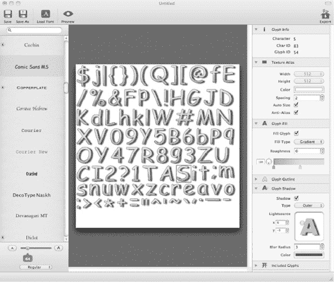

**图 4-7.** *`Glyph Designer` 允许你从任何 TrueType 字体创建位图字体。它可以导出与 cocos2d 的 `CCLabelBMFont` 类兼容的 FNT 和 PNG 文件。*

在左侧，你有一个 TrueType 字体列表，如果这些还不够，你可以使用 `Load Font` 图标加载任何 TTF 文件。在列表下方，你可以通过滑块更改字体大小，并切换到粗体、斜体和其他字体样式。

**提示：** 创建支持 Retina 的位图字体很容易。按常规创建字体并导出。这将是你的非 Retina 或 SD 字体。然后只需在 `Glyph Designer` 中将字体大小改为正常大小的两倍；例如，将滑块从字体大小 30 移动到字体大小 60。然后使用相同的名称重新导出字体，但添加 `-hd` 后缀。这样你就拥有了相同字体的普通/SD 和 Retina/HD 尺寸。

如果启用了 Retina 支持且游戏运行在 Retina 设备上，cocos2d 会自动识别并使用带有 `-hd` 后缀的字体。

在屏幕中央，你会看到用于当前字体设置的最终纹理图集。你会注意到，当你修改字体设置时，纹理图集的大小和字形的顺序会频繁变化。你也可以选择一个字形，并在右侧窗格的 `Glyph Info` 下查看其信息。

在右侧窗格的下方，你可以更改纹理图集设置，不过在大多数情况下你不需要这样做。`Glyph Designer` 确保纹理图集的大小始终足以在单个纹理中包含所有字形。

通过 `Glyph Fill` 设置，你可以更改颜色以及填充字形的方式，包括渐变设置。除此之外，你还可以选择更改 `Glyph Outline`，即每个字形周围的黑色细线，以及 `Glyph Shadow`，它可以为字体营造 3D 外观效果。

在右侧窗格的最底部，你会找到 `Included Glyphs` 部分。通过它，你可以从预定义的字符集中选择要包含在图集中的字形。如果你十分确定不需要某些字符，你也可以输入自己的字符列表以减小纹理的大小。这对于只需要数字和极少数额外字符的分数字符串尤其有用。

一旦你对位图字体感到满意，你可以保存整个项目，以便恢复先前的设置。要以 cocos2d 可用的格式保存字体，你需要通过 **文件  导出** 以 `.fnt`（Cocos2d 文本）格式保存。然后你可以将 `Glyph Designer` 创建的 FNT 和 PNG 文件添加到你的 Xcode 项目中，并将 FNT 文件与 `CCLabelBMFont` 类一起使用。

**注意：** 如果你尝试使用 `CCLabelBMFont` 显示 `.fnt` 文件中不存在的字符，这些字符将被跳过且不显示。例如，如果你执行 `[label setString:@"Hello, World!"]` 但位图字体只包含小写字母且没有标点符号，你将看到字符串 "ello orld" 被显示。


### 简单播放音频

我添加了一些音频文件来完成这个游戏。在 `DoodleDrop07` 项目的 Resources 文件夹中，你可以找到名为 `blues.mp3` 和 `alien-sfx.caf` 的音频文件，你可以将它们添加到你的项目中。在 `cocos2d` 中播放音频文件的首选且最简单的方法是使用 `SimpleAudioEngine`。音频支持并非 `cocos2d` 的核心组成部分；这属于 `CocosDenshion` 的领域，它是 `cocos2d` 的第三方扩展，并且幸运的是它与 `cocos2d` 一起分发。

**提示：** 如果你在寻找替代的声音引擎，我推荐从 [`http://kstenerud.github.com/ObjectAL-for-iPhone`](http://kstenerud.github.com/ObjectAL-for-iPhone) 获取的 `ObjectAL`，它是 `Kobold2D` 中首选的音频引擎（参见 第 16 章）。`ObjectAL` 具有编写整洁的 API 和优秀的文档。

由于 `CocosDenshion` 被视为与 `cocos2d` 分离的代码，因此每当你使用 `CocosDenshion` 的音频功能时，都必须添加相应的头文件，如下所示：

```
#import "GameScene.h"
#import "SimpleAudioEngine.h"
```

你会发现使用 `SimpleAudioEngine` 播放音乐和音频非常直接，如下所示：

```
[[SimpleAudioEngine sharedEngine] playBackgroundMusic:@"blues.mp3" loop:YES];
[[SimpleAudioEngine sharedEngine] playEffect:@"alien-sfx.caf"];
```

对于音乐和较长的语音文件，播放 MP3 文件是首选。请注意，你一次只能播放一个 MP3 背景音乐文件。从技术上讲，同时播放两个或多个 MP3 文件是可能的，但只有一个能通过硬件解码。额外的 CPU 负担对游戏来说是不可取的，因此对大多数人来说，同时播放多个 MP3 文件是不现实的。这也意味着短促的音效不应采用 MP3 格式。对于这些音效，我使用 WAV 或 CAF 文件格式的 16 位 PCM（未压缩）音频效果一直很好。大多数游戏音效的采样率可以是 22.5 kHz，除非你需要或想要水晶般清晰的音质，在这种情况下你应该使用 44.1 kHz 的采样率。

Mac OS X 上一个优秀且完整的音频编辑工具是 `Audacity`，你可以从 [`http://audacity.sourceforge.net`](http://audacity.sourceforge.net) 免费下载。如果你只需要快速将音频文件从一种格式转换为另一种格式，可能还会更改一些基本设置（如采样率），我推荐 Steve Dekorte 开发的 `SoundConverter`。该工具对大小不超过 500KB 的文件免费使用，而无限制使用 `SoundConverter` 的许可只需 15 美元。你可以从 [`http://dekorte.com/projects/shareware/SoundConverter/`](http://dekorte.com/projects/shareware/SoundConverter/) 下载 `SoundConverter`。

`SoundConverter` 的一个免费替代品是命令行工具 `afconvert`。建议熟悉终端。你可以用 `afconvert` 做很多事情，但作为命令行工具，你需要手动输入所有设置。要获取 `afconvert` 的帮助，请打开终端应用程序并输入以下内容：

```
afconvert -h
```

根据 Apple 的音频编码操作指南（其中包含对音频编程通常有用的建议，[`http://developer.apple.com/library/ios/#codinghowtos/AudioAndVideo/_index.html`](http://developer.apple.com/library/ios/#codinghowtos/AudioAndVideo/_index.html)），iOS 设备首选的音频格式是 16 位、小端序、线性 PCM，并打包为 CAF 文件（Apple CAF 音频格式代码：`LEI16`）。

要将 `afconvert` 支持的任何音频文件转换为首选的 iOS 音频格式，你可以像这样运行 `afconvert` 命令：

```
afconvert -f caff -d LEI16 myInputFile.mp3 myOutputFile.caf
```

`-f`（或 `-file`）开关指定文件格式，对于 CAF 文件是 `caff`。使用 `-d` 开关，你可以指定音频数据格式，此处为 `LEI16`。你可以通过运行带 `-hf` 开关的 `afconvert` 来获取 `afconvert` 支持的音频数据格式列表。

**注意：** 如果你遇到某个音频文件无法播放或产生混乱噪音的情况，请不要担心。有无数音频应用程序和音频编解码器都会创建各自格式的变体。有些格式在 iOS 设备上无法播放，但在其他设备上却能正常播放。特别是 WAV 文件似乎容易受到影响，这就是为什么我更倾向于使用 Apple 更原生的音频容器格式 CAF。通常，修复损坏音频文件的方法是在一个你知道能够保存 iOS 兼容音频文件的音频编辑程序中打开该音频文件，然后重新保存。你可以使用名称贴切的 `SoundConverter` 或你选择的音频应用程序来做到这一点。通常，在重新保存后，该文件就能在 iOS 设备上正常播放了。

### 移植到 iPad

由于所有坐标都考虑了屏幕尺寸，因此当游戏在 iPad 更大的屏幕上运行时，它应该可以毫无问题地简单缩放。事实也确实如此。就这么简单。相比之下，如果你之前使用了固定坐标，那么你将面临对游戏进行重大返工的情况。

#### 一个通用应用还是两个独立的应用？

当将你的应用移植到 iPad 时，你通常需要决定你的应用在 App Store 上是作为一个单一（通用）应用，还是作为两个独立的应用。这两种选择各有利弊，通常可以说，通用应用对客户来说更好、更公平，而独立应用通常对开发者更有利。

通用应用包含适用于 iPhone/iPod touch 和 iPad 设备的代码和资源。这有一个缺点：所有资源都添加到同一个 Xcode 目标中，会增加应用的体积。这是一个技术上的缺点；在性能方面没有影响。

使用通用应用，你将无法为 iPhone/iPod touch 和 iPad 版本设置不同的价格，并且所有设备的用户评论和留言都将列在同一个应用下。此外，你无法知道你的下载量中有多少百分比是来自 iPad 用户。

尽管如此，通用应用在 App Store 排行榜中仍将按设备分别排名。如果用户在 iPhone 或 iPod touch 设备上下载或购买该应用，则计入 iPhone 排行榜。在 iPad 上的下载/购买同样如此，这有助于提升你的应用在 iPad 排行榜中的排名。这留下了一个问题：iTunes 的下载/购买如何计算？它们仅仅被计入 iPhone 排名。这使得你甚至无法估计你的用户中有多少是 iPad 用户，除非你在应用中添加分析跟踪代码。

将你的应用拆分为适用于 iPhone/iPod touch 和 iPad 的两个独立应用，可以让你将游戏资源分离。最重要的是，如果 iOS 用户想要同时拥有 iPhone 和 iPad 版本，他就必须购买两次。这对你有利，但对客户不利。有些用户会毫不犹豫地仅仅因为这个原因就给你的应用打低分。

但是，由于你的应用在 App Store 中将被视为两个完全独立的应用，至少客户的评论和留言将是针对特定应用版本的。你还可以针对目标平台优化每个应用的描述和截图，并分别更新每个版本。如果你的应用已经在 App Store 上架了一段时间，拆分应用也是一个不错的选择，因为在一个通用应用中为新设备添加支持不会让你的应用出现在 App Store 的“新内容”部分。


#### 使用 Xcode 3 移植到 iPad

移植 iPhone 项目是一个简单的过程。如果你使用的是 Xcode 3，请在 `Groups & Files` 面板中选择要转换的目标，然后选择**项目** → **将当前目标升级到 iPad…**，这将弹出如图 4-8 所示的对话框。

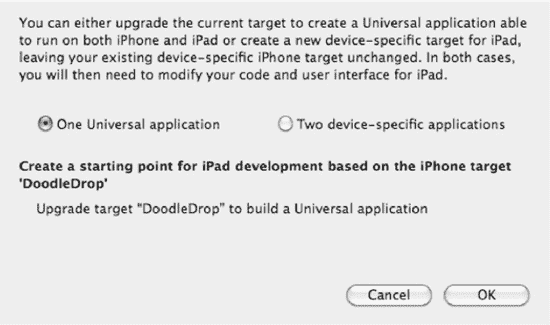

**图 4-8.** *在 Xcode 3 中将目标升级到 iPad 会提供两个选项。通用应用程序要求你将 iPhone 和 iPad 资源都添加到同一个目标中，这会增加应用的下载体积。*

对于简单的游戏，默认的**一个通用应用程序**选项就足够了。它的缺点是所有资源都会被添加到同一个目标中，从而增加应用的体积。这是唯一的技术缺陷，并不会带来性能上的惩罚。生成的应用可以在 iPhone 和 iPad 上运行。选择**两个特定设备应用**选项可以让你将游戏资源分离，但最终会得到两个应用，你需要分别将它们提交到 App Store。

目前更简单的做法是选择**一个通用应用程序**并运行代码。在设备上，应用会自动检测连接到哪个设备，并运行相应的版本。如果你想在 iPad 模拟器中尝试，只需将 iPad 模拟器设置为活动可执行文件，如图 4-9 所示。

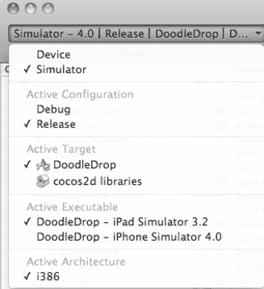

**图 4-9.** *要在 iPad 模拟器中运行新的通用应用，请将其设为活动可执行文件。*

#### 使用 Xcode 4 移植到 iPad

Xcode 4 让应用移植变得极其直接，你甚至可以通过一个简单的下拉菜单来更改目标设备。

首先，在项目导航器中选择项目 `DoodleDrop`。这会显示目标列表，在其中选择 `DoodleDrop` 目标，然后选择**摘要**选项卡。在 iOS 应用目标部分，有一个标记为 `Devices` 的弹出控件，提供三个选项：iPhone、iPad 和 Universal。

根据设备设置，你的应用将专门为 iPhone 或 iPad 构建，或者作为通用应用同时支持 iPhone 和 iPad 构建。在图 4-10 中，目标被设置为构建通用应用。

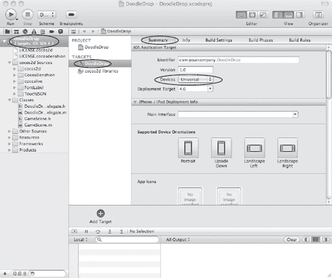

**图 4-10.** *将应用目标更改为构建通用应用*

现在你可能会想，如果我想为 iPhone 和 iPad 分别设置两个独立的目标该怎么办？这对于为 iPhone 和 iPad 版本设定不同价格，或者单纯为了减小任一版本的下载体积来说非常有用。

在这种情况下，你只需选择目标（本例中为 `DoodleDrop`），然后从菜单中选择**编辑** → **复制**。或者直接右键单击目标并选择**复制**。这会创建一个目标的副本，使你可以将一个目标的 `Devices` 设置设为 iPhone，另一个目标的 `Devices` 设置设为 iPad。现在你为每种设备类型都拥有了独立的目标，并且你可能希望相应地标记这些目标以避免混淆。

### 摘要

我希望你在构建这第一个游戏时玩得开心。这当然需要吸收很多东西，但我宁愿信息过多，也不愿信息过少。

至此，你已经学会了如何创建自己的游戏层类以及如何使用精灵。你使用了加速度计来控制玩家，并添加了速度以使玩家精灵能够加速和减速，从而赋予其更具动感的感觉。

我还向你介绍了未文档化的 `CCArray` 类，它是 cocos2d 对 `NSMutableArray` 的替代品。当需要存储数据列表时，这应该是你的首选。同样来自未文档化的 `CGPointExtensions` 中，使用距离检测方法的简单径向碰撞检测也一并为你呈现。

作为餐后甜点，你还接触了标签、位图字体和 Glyph Designer 工具的混合大杂烩，并点缀了一些音频编程。

还剩下什么？或许可以浏览一下本章的源代码。我已经添加了本游戏的最终版本，其中包含了一些游戏玩法的改进、一个启动菜单以及一个游戏结束信息。

关于 `DoodleDrop` 项目，我还没有提到一件事：它全部放在一个类中。对于一个小项目来说，这可能足够了，但随着你继续实现更多功能，它会很快变得混乱。你需要在代码设计中增加一些结构。下一章将为你提供 cocos2d 编程的最佳实践，并展示如何布局你的代码，以及在对象不再属于同一个类时，它们之间传递信息的各种方式。

## 第 5 章

## 游戏构建块

上一章中的游戏 `DoodleDrop` 被编写得易于理解，适合刚接触 cocos2d 的新手。不过，如果你是一位经验更丰富的开发者，你可能会注意到代码没有分离；所有内容都放在一个文件中。显然，这无法扩展，如果你要制作比 `DoodleDrop` 更大、更刺激的游戏，你必须找到适合的方式来组织你的代码。否则，你可能会用一个类来驱动游戏的所有逻辑。代码量可能会迅速增长到数千行，使得导航变得困难，并容易从任何地方修改任何内容，很可能会引入难以发现的细微错误。

每个新项目都需要其自己的代码设计。在本章中，我将介绍一些用于编写更复杂 cocos2d 游戏的构建块。本章奠定的代码基础将用于创建我们在接下来几章中将要构建的横向卷轴射击游戏。

### 使用多个场景

`DoodleDrop` 游戏只有一个场景和一个图层。更复杂的游戏肯定需要多个场景和多个图层。如何使用它们以及何时使用它们将逐渐成为你的本能。让我们来看看具体内容。


#### 添加更多场景

基础内容仍然适用。在上一章的代码清单 4-1 和 4-2 中，我概述了创建场景所需的基本代码。添加更多场景就是基于相同的基础代码构建更多类。真正有趣的是场景之间的过渡。当您通过 `CCDirector` 的 `replaceScene` 方法替换场景时，当前场景层级中的每个节点对象都会调用 `CCNode` 中的三个方法。

`onEnter` 和 `onExit` 方法会在场景切换的特定时刻被调用，具体取决于是否使用了 `CCTransitionScene`。您必须始终调用这些方法的父类实现，以避免输入问题和内存泄漏。请看代码清单 5-1，请注意所有这些方法都调用了 `super` 实现。

**代码清单 5-1.** *onEnter 和 onExit 方法*

```
-(void) onEnter
{
    // 在节点的 init 方法被调用后立即调用。
    // 如果使用了 CCTransitionScene：则在过渡开始时调用。

    [super onEnter];
}

-(void) onEnterTransitionDidFinish
{
    // 在 onEnter 之后立即调用。
    // 如果使用了 CCTransitionScene：则在过渡结束时调用。

    [super onEnterTransitionDidFinish];
}

-(void) onExit
{
    // 在节点的 dealloc 方法被调用前立即调用。
    // 如果使用了 CCTransitionScene：则在过渡结束时调用。

    [super onExit];
}
```

**注意：** 如果您在 `onEnter` 方法中没有调用 `super` 实现，您的新场景可能无法响应触摸或加速计输入。如果您在 `onExit` 中没有调用 `super`，当前场景可能无法从内存中释放。由于这一点很容易被遗忘，并且由此产生的行为不会让您意识到可能与此有关，因此强调这一点非常重要。您可以在 `ScenesAndLayer01_WithBugs` 项目中看到这种行为。

这些方法在您需要在场景即将改变或刚刚改变后，对任何节点（`CCNode`、`CCLayer`、`CCScene`、`CCSprite`、`CCLabelTTF` 等）执行某些操作时非常有用。与简单地在节点的 `init` 或 `dealloc` 方法中编写相同代码的区别在于：在 `onEnter` 期间，场景已经完全设置好；在 `onExit` 期间，场景仍然包含所有节点。

这可能很重要。例如，如果您执行一个过渡来切换场景，您可能希望暂停某些动画或隐藏用户界面元素，直到过渡完成。以下是这些方法的调用顺序，基于 `ScenesAndLayers02` 项目的日志信息：

1.  `scene: OtherScene`
2.  `init: <OtherScene = 066B2130 | Tag = -1>`
3.  `onEnter: <OtherScene = 066B2130 | Tag = -1>`
4.  `// 过渡在此处运行...`
5.  `onExit: <FirstScene = 0668DF40 | Tag = -1>`
6.  `onEnterTransitionDidFinish: <OtherScene = 066B2130 | Tag = -1>`
7.  `dealloc: <FirstScene = 0668DF40 | Tag = -1>`

首先，调用 `OtherScene` 的 `+(id) scene` 方法来初始化 `CCScene` 及其包含的 `CCLayer`。接着调用 `OtherSceneCCLayer` 的 `init` 方法，随后在第 3 行立即调用 `onEnter` 方法。在第 4 行，过渡正在将新场景滑入，完成后，调用 `FirstScene` 的 `onExit` 方法，接着调用 `OtherScene` 中的 `onEnterTransitionDidFinish`。

**提示：** 类名后面的数字，例如 `FirstScene = 0668DF40`，是此对象在内存中存储的内存地址。如果您有多个同一类的对象，它们会记录相同的类名，但内存地址会不同。这以及可能唯一的标签值可以帮助您识别同一类的对象并辅助调试。如果您在调试代码方面经验不足，我强烈建议您阅读苹果 iOS 开发指南中关于调试应用程序的部分：`developer.apple.com/library/ios/#documentation/Xcode/Conceptual/iphone_development/130-Debugging_Applications/debugging_applications.html`。

调试应用程序并不像听起来那么难。您不需要了解汇编器或机器码，也不需要成为黑客或专家级程序员。调试器是每个开发者定位问题（尤其是崩溃）的宝贵工具。大量用户在互联网上寻求帮助，因为他们的应用程序崩溃了，其实只要他们了解基本的调试知识：设置断点、单步执行代码以及检查变量值，他们就可以轻松解决自己的问题。这涵盖了大约 80% 的调试器使用场景。

请注意，`FirstScene` 的 `dealloc` 方法最后才被调用。这意味着在 `onEnterTransitionDidFinish` 期间，上一个场景仍在内存中。如果您此时想要分配内存密集型节点，则必须安排一个选择器，等待至少一帧后再进行内存分配，以确保上一个场景的内存已被释放。您可以通过在调度方法时省略间隔参数，来保证调度的方法在下一帧被调用：

```
[self schedule:@selector(waitOneFrame:)];
```

随后被调用的方法需要调用 `unschedule` 并使用隐藏参数 `_cmd` 来取消自身调度：

```
-(void) waitOneFrame:(ccTime)delta
{
    [self unschedule:_cmd];

    // 延迟执行的代码写在这里...
}
```

另一种策略是在上一个场景的 `onExit` 方法中尽可能多地释放内存。但这仅在内存是由您分配时才有效。例如，如果您的 `init` 方法像这样分配了一个 `NSMutableArray` 实例变量：

```
myArray = [[NSMutableArray alloc] init];
```

您最终将需要调用 `myArray` 上的 `release` 来释放其内存。通常您会在 `dealloc` 方法中这样做，但您也可以在 `onExit` 方法中提前释放内存：

```
-(void) onExit
{
    [super onExit];

    [myArray release];
    myArray = nil;
}
```

请注意，我将 `myArray` 设置为 `nil`。在 `onExit` 之后、节点被释放之前，`myArray` 仍有可能被使用。在释放实例变量时将其设置为 `nil` 是防止潜在崩溃的良好实践。由于 `myArray` 指向的内存地址已被释放，任何试图向已释放的 `myArray` 发送消息的代码都会导致 `EXC_BAD_ACCESS` 错误。


#### 正在加载下一场景，请稍候

在场景切换过程中，你迟早会遇到明显的加载时间。随着内容不断增加，加载时间也会相应延长。新建场景实际上是在场景切换开始之前就进行的。如果在新场景的 `init` 或 `onEnter` 方法中包含了非常复杂的代码或加载了大量资源，那么在切换开始前就会出现明显的延迟。尤其是当新场景加载时间超过一秒，且用户是通过点击按钮触发场景切换时，这个问题尤为突出。用户可能会误以为游戏已卡死或冻结。缓解此问题的方法是在两者之间添加一个过渡场景：加载场景。你可以在 `ScenesAndLayers03` 项目中找到一个示例实现。

实际上，`LoadingScene` 起到了中间场景的作用。它派生自 cocos2d 的 `CCScene` 类。你不必为每个过渡都创建新的 `LoadingScene`；只需使用一个场景，并指定要加载的目标场景即可。使用 `enum` 是最佳方式；该枚举在 `LoadingScene` 头文件中定义，如代码清单 5–2 所示。

**代码清单 5–2.** *LoadingScene.h*

```
typedef enum
{
    TargetSceneINVALID = 0,
    TargetSceneFirstScene,
    TargetSceneOtherScene,
    TargetSceneMAX,
} TargetScenes;

// LoadingScene 直接派生自 Scene。此场景无需 CCLayer。
@interface LoadingScene : CCScene
{
    TargetScenes targetScene_;
}

+(id) sceneWithTargetScene:(TargetScenes)targetScene;
-(id) initWithTargetScene:(TargetScenes)targetScene;
```

**提示：** 建议将枚举的第一个值设为 `INVALID` 值，除非你打算将第一个值作为默认值。在 Objective-C 中，变量会被自动初始化为 0，除非你指定了其他值。

此外，如果你打算遍历所有枚举值，还可以在枚举末尾添加 `MAX` 或 `NUM` 条目，如下所示：

```
for (int i = TargetSceneINVALID + 1; i < TargetScenesMAX; i++) { .. }
```

对于 `LoadingScene` 来说，这并非必需，但我出于习惯通常会添加这些条目，即使并不需要它们。

接下来，我们来看代码清单 5–3 中 `ScenesAndLayers03` 项目的 `LoadingScene` 类实现。你会注意到该场景的初始化方式有所不同，并且它使用了 `scheduleUpdate` 来延迟将 `LoadingScene` 替换为实际的目标场景。

**代码清单 5–3.** *LoadingScene 类使用 switch 语句决定是否加载目标场景*

```
+(id) sceneWithTargetScene:(TargetScenes)targetScene;
{
    // 这会创建当前类的一个自动释放对象
    return [[[self alloc] initWithTargetScene:targetScene] autorelease];
}

-(id) initWithTargetScene:(TargetScenes)targetScene
{
    if ((self = [super init]))
    {
        targetScene_ = targetScene;

        CCLabelTTF* label = [CCLabelTTF labelWithString:@"正在加载..."
                                               fontName:@"Marker Felt"
                                               fontSize:64];
        CGSize size = [[CCDirector sharedDirector] winSize];
        label.position = CGPointMake(size.width / 2, size.height / 2);
        [self addChild:label];

        // 必须等待一帧后再加载目标场景！
        [self scheduleUpdate];
    }

    return self;
}

-(void) update:(ccTime)delta
{
    [self unscheduleAllSelectors];

    // 根据 TargetScenes 枚举决定加载哪个场景。
    switch (targetScene_)
    {
        case TargetSceneFirstScene:
            [[CCDirector sharedDirector] replaceScene:[FirstScene scene]];
            break;
        case TargetSceneOtherScene:
            [[CCDirector sharedDirector] replaceScene:[OtherScene scene]];
            break;

        default:
            // 使用未指定的枚举值时，始终发出警告
            NSAssert2(nil, @"%@: 不支持的 TargetScene %i", 
                NSStringFromSelector(_cmd), targetScene_);
            break;
    }
}
```

由于 `LoadingScene` 派生自 `CCScene` 并且需要传入一个新参数，因此仅仅调用 `[CCScene node]` 已经不够了。`sceneWithTargetScene` 方法先分配 `self`，调用 `initWithTargetScene` 方法，然后将新对象以自动释放的形式返回。这与 cocos2d 初始化自身类的方式相同，也是你可以依赖 cocos2d 对象会被自动释放的原因。如果你在派生自己的类，也应该始终添加相应的静态自动释放初始化方法，就像这里的 `sceneWithTargetScene`。

`init` 方法仅仅是将目标场景存储在一个成员变量中，创建"正在加载..."标签，然后运行 `scheduleUpdate`。

**注意：** 为什么不在 `init` 方法中直接调用 `replaceScene`？关于这点有两条规则。规则 1：绝不要在节点的 `init` 方法中调用 `CCDirector` 的 `replaceScene`。规则 2：遵循规则 1。原因是：这样会导致崩溃。`Director` 无法处理从当前正在初始化的节点中替换场景的情况。

`update` 方法随后使用一个基于所提供 `TargetScenes` 枚举的简单 `switch` 语句，来判断需要替换哪个场景。`switch` 的 `default` 分支包含一个 `NSAssert`，当触发 default 情况时，该断言总会生效。这是一种良好的实践，因为你会多次编辑和扩展这个列表，如果你忘记在 `switch` 语句中更新新的分支，系统就会提醒你。

这是一个非常简单的 `LoadingScene` 实现，你可以在自己的游戏中使用。只需扩展 `enum` 和 `switch` 语句来增加更多目标场景，或者多次使用同一个目标场景但搭配不同的过渡效果。但正如我提到的，不要因为过渡效果看起来很酷就过度使用它们。

使用 `LoadingScene` 在内存方面有一个重要效果。由于你正在用轻量级的 `LoadingScene` 替换现有场景，然后再将 `LoadingScene` 替换为实际的目标场景，这给了 cocos2d 足够的时间来释放上一个场景的内存。实际上，两个复杂场景同时存在于内存中的重叠情况就不再发生了，从而减少了场景切换期间内存使用的峰值。


好的，作为一名高级文档工程师和翻译员，我将遵循您提供的格式和注意事项，将给定的英文文本翻译成中文。


### 使用多个层

项目 `ScenesAndLayers04` 演示了如何使用多个层来实现游戏对象层内容的滚动，同时保持用户界面层（显示“Here be your Game Scores”文本，参见 图 5-1）的内容静止不动。您将学习如何让多个层协同工作，并仅响应各自的触摸输入，以及如何从任何节点访问这些不同的层。

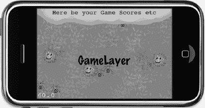

**图 5–1.** *`ScenesAndLayers04` 项目。到目前为止，一切正常。*

首先，我将在 `init` 方法中组装 `MultiLayerScene`。如果您快速浏览一下代码清单 5-4 中的代码，几乎看不出与我们目前所做的工作有什么不同。

**代码清单 5–4.** *初始化 `MultiLayerScene`*

```
-(id) init
{
    if ((self = [super init]))
    {
        multiLayerSceneInstance = self;

        // The GameLayer will be moved, rotated and scaled independently
        GameLayer* gameLayer = [GameLayer node];
        [self addChild:gameLayer z:1 tag:LayerTagGameLayer];
        gameLayerPosition = gameLayer.position;

        // The UserInterfaceLayer remains static and relative to the screenarea.
        UserInterfaceLayer* uiLayer = [UserInterfaceLayer node];
        [self addChild:uiLayer z:2 tag:LayerTagUserInterfaceLayer];
    }

    return self;
}
```

**提示：** 值得一提的是，我已经开始使用 `enum` 值作为标签，例如 `LayerTagGameLayer`。与使用数字相比，这样做的好处是你可以直接读懂标签归属，而不必记住标签 7 分配给了哪个层。这也表明实际的标签值并不重要；重要的是你为同一个节点使用相同的值。使用人类可读的标签使这项任务更容易且不易出错。当然，动作标签也是如此。

您可能注意到了 `multiLayerSceneInstance` 变量，并且它被赋值为 `self`。这有点奇怪，不是吗？这有什么好处呢？如果您还记得第 3 章，我曾解释过如何创建单例类。在这里，我将把 `MultiLayerScene` 类变成一个单例。参见代码清单 5-5，如果您愿意，可以将其与代码清单 3-1 进行比较，找出差异。

**代码清单 5–5.** *将 `MultiLayerScene` 变成半单例对象*

```
static MultiLayerScene* multiLayerSceneInstance;

+(MultiLayerScene*) sharedLayer
{
    NSAssert(multiLayerSceneInstance != nil, @"MultiLayerScene not available!");
    return multiLayerSceneInstance;
}

-(void) dealloc
{
    // MultiLayerScene will be deallocated now, you must set it to nil
    multiLayerSceneInstance = nil;

    // don't forget to call "super dealloc"
    [super dealloc];
}
```

简而言之，`multiLayerSceneInstance` 是一个 `static` 全局变量，它将在其生命周期内保存当前的 `MultiLayerScene` 对象。`static` 关键字表示 `multiLayerSceneInstance` 变量只能在其定义的实现文件内访问。同时，它不是一个实例变量；它存在于任何类的作用域之外。这就是为什么它在任何方法之外定义，并且可以在 `sharedLayer` 这样的类方法中访问。

当层被释放时，`multiLayerSceneInstance` 变量会被设置回 `nil` 以避免崩溃，因为在 `dealloc` 方法之后，`multiLayerSceneInstance` 变量将指向一个已释放的对象。请记住，声明为 `static` 的变量在类的释放后依然存在。使用 `static` 变量来存储动态分配类的指针需要非常小心，以确保 `static` 变量要么指向一个有效的对象，要么是 `nil`。

使用这个半单例的原因是，您将使用多个层，每个层都有自己的子节点，但您仍然需要以某种方式访问主层。这是一种非常方便的方式，可以为当前场景中的其他层和节点提供对主层的访问权限。

**注意：** 这个半单例仅在任意时刻只有一个 `MultiLayerScene` 实例被分配的情况下才有效。与常规的单例类不同，它也不能用于初始化 `MultiLayerScene`。

为了方便使用，通过属性 getter 方法来授予对 `GameLayer` 和 `UserInterfaceLayer` 的访问权限。这些属性在代码清单 5-6 中定义，展示了 `MultiLayerScene.h` 中的相关部分。

**代码清单 5–6.** *用于访问 `GameLayer` 和 `UserInterfaceLayer` 的属性定义*

```
@property (readonly) GameLayer* gameLayer;
@property (readonly) UserInterfaceLayer* uiLayer;
```

这些属性被定义为 `readonly`，因为我们只希望检索这些层，而从不通过属性来设置它们。它们在代码清单 5-7 中的实现对 `getChildByTag` 方法进行了简单的封装，但它们也执行了一次安全检查，以防万一，验证检索到的对象是否属于正确的类。

**代码清单 5–7.** *属性 Getter 方法的实现*

```
-(GameLayer*) gameLayer
{
    CCNode* layer = [self getChildByTag:LayerTagGameLayer];
NSAssert([layer isKindOfClass:[GameLayer class]], @"%@: not a GameLayer!", 
        NSStringFromSelector(_cmd));
    return (GameLayer*)layer;
}

-(UserInterfaceLayer*) uiLayer
{
    CCNode* layer = [[MultiLayerScene sharedLayer] getChildByTag:LayerTagUILayer];
    NSAssert([layer isKindOfClass:[UserInterfaceLayer class]],@"%@: not a UILayer!",
        NSStringFromSelector(_cmd));
    return (UserInterfaceLayer*)layer;
}
```

这使得从 `MultiLayerScene` 的任何节点访问各个层变得非常容易。

- 您可以访问 `MultiLayerScene` 的“场景”层：
  `MultiLayerScene* sceneLayer = [MultiLayerScene sharedLayer];`
- 您可以通过场景层访问其他层：
  `GameLayer* gameLayer = [sceneLayer gameLayer];`
  `UserInterfaceLayer* uiLayer = [sceneLayer uiLayer];`
- 作为替代方案，由于 `@property` 定义，您也可以使用点访问器：
  `GameLayer* gameLayer = sceneLayer.gameLayer;`
  `UserInterfaceLayer* uiLayer = sceneLayer.uiLayer;`

`UserInterfaceLayer` 和 `GameLayer` 类都处理触摸输入，但相互独立。为了实现正确的效果，我们需要使用 `TargetedTouchHandlers`，并通过使用 `priority` 参数，我们可以确保 `UserInterfaceLayer` 在 `GameLayer` 之前查看触摸事件。`UserInterfaceLayer` 使用 `isTouchForMe` 方法来确定它是否应该处理该触摸，如果它处理了触摸，它将从 `ccTouchBegan` 方法返回 `YES`。这将阻止其他目标触摸处理程序接收此触摸。代码清单 5-8 说明了 `UserInterfaceLayer` 的触摸事件代码的关键部分。

**代码清单 5–8.** *使用 `TargetedTouchDelegate` 处理触摸输入*

```
// Register TargetedTouch handler with higher priority than GameLayer
-(void) registerWithTouchDispatcher
{
    [[CCTouchDispatcher sharedDispatcher] addTargetedDelegate:self
                                                      priority:-1
                                              swallowsTouches:YES];
}

// Checks if the touch location was in an area that this layer wants to handle as input.
-(bool) isTouchForMe:(CGPoint)touchLocation
{
    CCNode* node = [self getChildByTag:UILayerTagFrameSprite];
    return CGRectContainsPoint([node boundingBox], touchLocation);
}
```


```markdown

`-(BOOL) ccTouchBegan:(UITouch*)touch withEvent:(UIEvent *)event`
{
    CGPoint location = [MultiLayerScene locationFromTouch:touch];
    bool isTouchHandled = [self isTouchForMe:location];
    if (isTouchHandled)
    {
        CCNode* node = [self getChildByTag:UILayerTagFrameSprite];
        NSAssert([node isKindOfClass:[CCSprite class]], @"node is not aCCSprite");

        // 高亮触摸持续期间的用户界面图层精灵
        ((CCSprite*)node).color = ccRED;

        // 通过 MultiLayerScene 访问 GameLayer。
        GameLayer* gameLayer = [MultiLayerScene sharedLayer].gameLayer;

        // 在 GameLayer 上执行动作……（为清晰起见，移除代码）
    }

    return isTouchHandled;
}

-(void) ccTouchEnded:(UITouch*)touch withEvent:(UIEvent *)event
{
    CCNode* node = [self getChildByTag:UILayerTagFrameSprite];
    NSAssert([node isKindOfClass:[CCSprite class]], @"node is not a CCSprite");
    ((CCSprite*)node).color = ccWHITE;
}

在`registerWithTouchDispatcher`中，`UserInterfaceLayer`将自己注册为优先级为-1 的目标触摸处理程序。因为`GameLayer`使用相同的代码但优先级为 0，所以`UserInterfaceLayer`将是第一个接收触摸输入的图层。

在`ccTouchBegan`中，首先要检查此触摸是否与`UserInterfaceLayer`相关。`isTouchForMe`方法通过`CGRectContainsPoint`实现了一个简单的“边界框内的点”检查，以查看触摸是否始于`uiframe`精灵。`CGGeometry`中还有更多有用的方法可用于测试相交、包含点或相等性。请参考 Apple 文档以了解更多关于`CGGeometry`方法的信息（[`developer.apple.com/mac/library/documentation/GraphicsImaging/Reference/CGGeometry/Reference/reference.html`](http://developer.apple.com/mac/library/documentation/GraphicsImaging/Reference/CGGeometry/Reference/reference.html)）。

如果触摸位置检查确定触摸在精灵上，`ccTouchBegan`将返回`YES`，表示此触摸事件已被使用，不应由其他优先级较低的目标触摸委托的图层处理。

只有当`isTouchForMe`检查失败时，`GameLayer`才会接收触摸输入，并在用户在屏幕上移动手指时使用它来滚动自身。您可以在清单 5-9 中比较`GameLayer`的输入处理代码。

**清单 5–9.** *GameLayer 接收剩余的触摸事件并使用它们滚动自身*

```
-(void) registerWithTouchDispatcher
{
    [[CCTouchDispatcher sharedDispatcher] addTargetedDelegate:self
                                                  priority:0
                                          swallowsTouches:YES];
}

-(BOOL) ccTouchBegan:(UITouch*)touch withEvent:(UIEvent *)event
{
    lastTouchLocation = [MultiLayerScene locationFromTouch:touch];

    // 停止移动动作，使其不干扰用户滚动。
    [self stopActionByTag:ActionTagGameLayerMovesBack];

    // 始终吞噬触摸，GameLayer 是最后一个接收触摸的图层。
    return YES;
}

-(void) ccTouchMoved:(UITouch*)touch withEvent:(UIEvent *)event
{
    CGPoint currentTouchLocation = [MultiLayerScene locationFromTouch:touch];

    // 计算当前触摸位置与上一个触摸位置的差值。
    CGPoint moveTo = ccpSub(lastTouchLocation, currentTouchLocation);

    // 然后反转，以产生移动背景的视觉效果
    moveTo = ccpMult(moveTo, -1);

    lastTouchLocation = currentTouchLocation;

    // 相应地调整图层位置，以及所有子节点。
    self.position = ccpAdd(self.position, moveTo);
}

-(void) ccTouchEnded:(UITouch*)touch withEvent:(UIEvent *)event
{
    // 将游戏图层移回其指定位置。
    CCMoveTo* move = [CCMoveTo actionWithDuration:1 position:gameLayerPosition];
    CCEaseIn* ease = [CCEaseIn actionWithAction:move rate:0.5f];
    ease.tag = ActionTagGameLayerMovesBack;
    [self runAction:ease];
}
```

由于`GameLayer`是最后一个接收输入的图层，它不需要进行任何`isTouchForMe`检查，只是简单地吞噬所有触摸。

使用`ccTouchMoved`事件，计算上一个和当前触摸位置之间的差异。然后通过乘以-1 进行反转，以将效果从在背景上移动摄像机改为在摄像机下移动背景。如果您很难想象我的意思，请尝试`ScenesAndLayers04`项目，然后第二次尝试，注释掉`moveTo = ccpMult(moveTo, -1);`这一行。您会注意到第二次时，每次手指移动都会使图层向相反方向移动。

在`ccTouchEnded`中，当用户将手指从屏幕上抬起时，图层会自动移回其中心位置。图 5-2 展示了该项目实际运行的效果，整个`GameLayer`被旋转并缩小。`GameLayer`上的每个游戏对象都会自动遵循`GameLayer`的每一次移动、旋转和缩放，而`UserInterfaceLayer`始终保持不变。

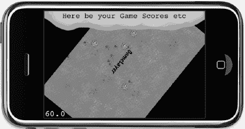

**图 5–2.** *多图层的实用性在 GameLayer 被缩小和旋转时变得明显，其所有节点都遵循图层的动作，而顶部的 UserInterfaceLayer 则不受影响地保持在原位。*

### 如何最佳实现关卡

到目前为止，我们已经探讨了多个场景和多个图层。现在您想了解关卡是什么吗？

嗯，关卡的概念在许多游戏中非常常见，所以我认为不需要解释。更难的是决定哪种方法最适合基于关卡的游戏。在 cocos2d 中，您可以采用两种方式：为每个关卡创建一个新场景，或者使用单独的图层来管理多个关卡。两者各有用途，选择哪一种主要取决于关卡在游戏中的目的。

#### 场景作为关卡

最直接的方法是将每个关卡作为一个单独的场景来运行。您可以为每个关卡创建一个新的`Scene`类，或者选择初始化一个通用的`LevelScene`类，并传递关卡编号或其他必要的信息作为参数来加载正确的关卡数据。

如果您的关卡划分清晰，并且关卡中发生的大部分事情在玩家通关后不再相关或需要，这种方法效果最好。也许您会保留玩家的分数和剩余生命数，但仅此而已。用户界面可能最小化且非交互式，很可能纯粹是信息性的，除了暂停按钮外没有任何交互元素。

我想这种方法最适合基于快速反应的动作游戏关卡。

```


#### 图层即关卡

在同一场景中使用单独的图层加载和显示关卡，是一种值得推荐的方法，尤其是当您拥有一个不应在关卡切换时重置的复杂用户界面时。您甚至可能希望在切换关卡时，让玩家和其他游戏对象保持完全相同的位置和状态。

您可能会拥有许多用于保存当前游戏状态和用户界面设置的变量，例如物品栏。与在同一场景内将一个图层切换为另一个图层相比，保存并恢复这些游戏设置以及重置所有视觉元素的工作量要大得多。对于隐藏物体游戏或冒险游戏来说，这可能是理想的解决方案，尤其是当您希望使用在用户界面下方移入或移出的动画来替换关卡内容时。

`CCMultiplexLayer` 类可能是实现此类方法的理想选择。它可以包含多个节点，但在任何给定时间只有一个节点处于激活状态。代码清单 5–10 展示了如何使用 `CCMultiplexLayer` 类的示例。其唯一的缺点是无法在图层之间进行过渡转换。一次只能看到一个图层，这使得任何过渡效果都无法实现。

**代码清单 5–10.** *使用 `CCMultiplexLayer` 类在多个图层之间切换*

```
CCLayer* layer1 = [CCLayer node];
CCLayer* layer2 = [CCLayer node];
CCMultiplexLayer* mpLayer = [CCMultiplexLayer layerWithLayers:layer1, layer2, nil];

// 切换到 layer2，但保留 layer1 作为 mpLayer 的子节点。
[mpLayer switchTo:1];                          

// 切换到 layer1，将 layer2 从 mpLayer 中移除并释放其内存。
// 此调用后，您不能再切换回 layer2（索引：1）！
[mpLayer switchToAndReleaseMe:0];
```

### `CCLayerColor`

在 `ScenesAndLayers` 项目中，到目前为止，背景只是一个黑屏。当您滚动到草地背景图像的边缘，或点击“用户界面”使 `GameLayer` 缩小时，就能看到它。为了改变背景颜色，cocos2d 提供了 `CCLayerColor`，它已被添加到 `ScenesAndLayers05` 项目中，用法如下：

```
// 将背景颜色设置为洋红色。可以想象，这是最不显眼的颜色。
CCLayerColor* colorLayer = [CCLayerColor layerWithColor:ccc4(255, 0, 255, 255)];
[self addChild:colorLayer z:0];
```

如果您对 OpenGL 有一定了解，可能会觉得为了改变背景颜色而添加一个单独的图层有些小题大做。您可以使用 OpenGL 达到同样的效果，如下所示：

```
glClearColor(1, 0, 1, 1);
```

但请务必先在您游戏的场景过渡效果中测试一下，因为更改 `glClearColor` 可能会对场景过渡产生负面影响。例如，当使用 `CCTransitionFade` 时，无论您使用什么颜色来初始化 `CCTransitionFade`，清除颜色都会透出来。

### 从 `CCSprite` 派生游戏对象子类

很多时候，您的游戏对象会实现自己的逻辑。为每种类型的游戏对象创建一个单独的类是很有意义的。这可以包括您的玩家角色、各种敌人类型、子弹、导弹、平台，以及几乎所有可以在游戏场景中单独放置并需要运行自身逻辑的对象。那么问题来了，从哪里派生子类呢？

许多开发者选择了看似显而易见的路径：从 `CCSprite` 派生子类。我认为这不是一个好主意。派生子类的关系是“是一个”的关系。仔细想想，您的玩家角色“是一个” `CCSprite` 吗？您的所有敌方角色“都是” `CCSprite` 吗？起初，答案似乎合乎逻辑：它们当然是精灵！它们就是靠精灵来显示自身的。但请稍等。它们能否是 `CCSprite` 之外的其他东西？据我所知，游戏角色也可以是字面意义上的字符。在 Roguelike 游戏中，您的玩家角色是一个 `@`。那么，这个角色会是一个 `CCLabelTTF` 吗？

我认为困惑来自 `CCSprite` 是在屏幕上显示任何内容时使用最广泛的类。但您的游戏角色与 `CCNode` 类之间的真正关系是“有一个”的关系。您的玩家类“拥有一个”用于显示自身的 `CCSprite`。在 Roguelike 游戏中，玩家角色类“拥有一个”用于显示自身的 `CCLabelTTF`。如果您想玩得更高级，比如使用 OpenGL 和大量粒子效果，那么您的玩家类“拥有一个”粒子效果系统，用于在屏幕上直观地表现它。

当您思考为什么通常要从 `CCSprite` 类派生时，这种区别会变得更加清晰：一般来说，是为了向 `CCSprite` 类添加新功能——例如，拥有一个使用 `CCRenderTexture` 的 `CCSprite` 类，以便根据屏幕下方的内容修改其显示方式。但是，当您想要从 `CCSprite` 派生玩家对象子类时，您会在其中添加什么样的代码呢？输入处理、玩家动画、碰撞检测、物理效果；总的来说：游戏逻辑。这些都不属于 `CCSprite` 类，因为这类代码关乎对象的运作方式以及您如何与之交互，而非精灵如何在屏幕上绘制。另一种看待这个问题的方式是考虑：您添加到派生自 `CCSprite` 的子类中的哪些代码通常对所有精灵都是有用且可用的。例如，处理用于控制玩家角色的用户输入的代码，通常仅对玩家对象有用且可用，而不适用于所有精灵。

您可能仍然想知道这有什么意义，或者为什么您应该在意？考虑一下这种情况：您希望玩家拥有几种视觉表现形式，并且能够无缝切换。如果玩家需要使用 `FadeIn`/`FadeOut` 动作从一个精灵变形到另一个精灵，那么您将不得不使用两个精灵。或者，如果您希望游戏对象同时出现在屏幕的不同部分，比如在《小行星》这样的游戏中，从屏幕顶部离开的小行星也应该部分显示在屏幕底部。您需要两个精灵来实现这一点，而这仅仅是组合优于派生子类（或继承）的原因之一。继承会导致类之间的紧密耦合，对父类的更改可能会在子类中引入错误和异常。类层次结构越深，基类中的代码就越多，这会放大问题。

另一个充分理由是，游戏对象封装了其视觉表示。如果逻辑是自包含的，那么只有游戏对象本身才应该更改任何 `CCNode` 的属性，例如位置、缩放、旋转，甚至是运行和停止动作。许多游戏开发者迟早会遇到的一个核心问题是，他们的游戏对象受到外部因素的直接操纵。例如，您可能会在不经意间造成这样的情况：场景的图层、用户界面和玩家对象本身都改变了玩家精灵的位置。这是不可取的。您希望所有其他系统通知玩家对象以改变其位置，让玩家对象本身对如何解释这些命令、是否应用、修改或忽略它们拥有最终决定权。


### 使用 CCSprite 组合游戏对象

让我们来尝试一下。与其创建一个继承自 `CCSprite` 类的新类，不如从 cocos2d 的基类 `CCNode` 来创建它。虽然你也可以将类基于 Objective-C 基类 `NSObject`，但坚持使用 `CCNode` 更简单，因为通常以 `CCNode` 作为基类会更容易操作。

我决定将 ScenesAndLayers05 项目中的蜘蛛转换成一个独立的类。这个类简称为 `Spider`。代码清单 5–11 展示了 `Spider` 类的头文件。

**代码清单 5–11.** *Spider 类的接口*

```
#import "cocos2d.h"

@interface Spider : CCNode
{
    CCSprite* spiderSprite;
    int numUpdates;
}

+(id) spiderWithParentNode:(CCNode*)parentNode;
-(id) initWithParentNode:(CCNode*)parentNode;

@end
```

可以看到，`CCSprite` 作为成员变量被添加到该类中，并命名为 `spiderSprite`。这被称为*组合*，因为你将 `Spider` 类由一个用于显示它的 `CCSprite` 以及之后可能添加的其他对象（包括额外的 `CCSprite` 类）和变量组合而成。

代码清单 5–12 中的 `Spider` 类与任何 `CCNode` 类一样，有一个静态自动释放初始化器。这模仿了 cocos2d 的内存管理方案，遵循这种做法是好的。我添加的另一个便捷特性是将 `parentNode` 作为参数传递给 `initWithParentNode` 方法。通过这样做，`Spider` 类可以通过调用 `[parentNode addChild:self]` 将自己添加到节点层级中，这使得在 `GameLayer.m` 中创建 `Spider` 类的实例只需一行代码，因为你只需要编写 `[Spider spiderWithParentNode:self]`。

另一方面，`spiderSprite` 应该是自包含的，因为它由 `Spider` 类创建和管理。`spiderSprite` 通过 `[self addChild:spiderSprite]` 添加到 `Spider` 类，而不是 `parentNode`。虽然你也可以这样做，但不推荐，因为它破坏了封装性。例如，`parentNode` 的代码可能会从其层级中移除 `spiderSprite`，并且移动 `Spider` 对象将不再同时移动 `spiderSprite`。

**代码清单 5–12.** *Spider 类的实现*

```
#import "Spider.h"

@implementation Spider

// 静态自动释放初始化器，模仿 cocos2d 的内存分配方案。
+(id) spiderWithParentNode:(CCNode*)parentNode
{
    return [[[self alloc] initWithParentNode:parentNode] autorelease];
}

-(id) initWithParentNode:(CCNode*)parentNode
{
    if ((self = [super init]))
    {
        [parentNode addChild:self];

        CGSize screenSize = [[CCDirector sharedDirector] winSize];

        spiderSprite = [CCSprite spriteWithFile:@"spider.png"];
        spiderSprite.position = CGPointMake(CCRANDOM_0_1() * screenSize.width,
            CCRANDOM_0_1() * screenSize.height);
        [self addChild:spiderSprite];

        [self scheduleUpdate];
    }

    return self;
}

-(void) update:(ccTime)delta
{
    numUpdates++;
    if (numUpdates > 50)
    {
        numUpdates = 0;
        [spiderSprite stopAllActions];

        // 让蜘蛛随机移动。
        CGPoint moveTo = CGPointMake(CCRANDOM_0_1() * 200 - 100,
            CCRANDOM_0_1() * 100 - 50);
        CCMoveBy* move = [CCMoveBy actionWithDuration:1 position:moveTo];
        [spiderSprite runAction:move];
    }
}

@end
```

`Spider` 类现在使用自己的游戏逻辑让蜘蛛在屏幕上移动。诚然，它不会在今年的人工智能研讨会上获奖；它仅仅是一个例子。

到目前为止，你知道可以使用 `CCLayer` 节点接收触摸输入，但实际上任何类都可以通过直接使用 `CCTouchDispatcher` 类来接收触摸输入。你的类只需要实现 `CCStandardTouchDelegate` 或 `CCTargetedTouchDelegate` 协议。你可以在 ScenesAndLayers06 项目中发现这些更改，并且代码清单 5–13 显示了添加到头文件中的相应协议定义。

**代码清单 5–13.** *CCTargetedTouchDelegate 协议*

```
@interface Spider : CCNode <CCTargetedTouchDelegate>
{
    …
}
```

代码清单 5–14 中的实现突出显示了 `Spider` 类的更改。`Spider` 类现在对定点触摸输入做出反应。每当你点击一只蜘蛛，它会迅速远离你的手指。与普遍看法相反，蜘蛛通常更害怕人类，而不是人类害怕它们，尽管也有例外。

`Spider` 类向 `CCTouchDispatcher` 注册，以作为触摸委托接收输入，但该委托关联也必须在 `dealloc` 时移除。否则，即使该类已从内存中释放，调度器或触摸调度器仍会保留对 `Spider` 类的引用，这很可能很快就会导致崩溃。

**代码清单 5–14.** *修改后的蜘蛛类*

```
-(id) initWithParentNode:(CCNode*)parentNode
{
    if ((self = [super init]))
    {
        …

        // 手动将此类添加为定点触摸事件的接收者。
        [[CCTouchDispatcher sharedDispatcher] addTargetedDelegate:self
                                                         priority:-1
                                                  swallowsTouches:YES];
    }

    return self;
}

-(void) dealloc
{
    // 必须手动将此类作为触摸输入接收者移除！
    [[CCTouchDispatcher sharedDispatcher] removeDelegate:self];

    [super dealloc];
}

// 将通用逻辑提取到一个接受参数的独立方法中。
-(void) moveAway:(float)duration position:(CGPoint)moveTo
{
    [spiderSprite stopAllActions];
    CCMoveBy* move = [CCMoveBy actionWithDuration:duration position:moveTo];
    [spiderSprite runAction:move];
}

-(void) update:(ccTime)delta
{
    numUpdates++;
    if (numUpdates > 50)
    {
        numUpdates = 0;

        // 以常规速度移动。
        CGPoint moveTo = CGPointMake(CCRANDOM_0_1() * 200 - 100,
            CCRANDOM_0_1() * 100 - 50);
        [self moveAway:2 position:moveTo];
    }
}

-(BOOL) ccTouchBegan:(UITouch *)touch withEvent:(UIEvent *)event
{
    // 检查此触摸是否在蜘蛛精灵上。
    CGPoint touchLocation = [MultiLayerScene locationFromTouch:touch];
    BOOL isTouchHandled = CGRectContainsPoint([spiderSprite boundingBox],
        touchLocation);
    if (isTouchHandled)
    {
        // 重置移动计数器。
        numUpdates = 0;

        // 快速远离触摸位置。
        CGPoint moveTo;
        float moveDistance = 60;
        float rand = CCRANDOM_0_1();

        // 随机选择四个角落之一来移开。
        if (rand < 0.25f)
            moveTo = CGPointMake(moveDistance, moveDistance);
        else if (rand < 0.5f)
            moveTo = CGPointMake(-moveDistance, moveDistance);
        else if (rand < 0.75f)
            moveTo = CGPointMake(moveDistance, -moveDistance);
        else
            moveTo = CGPointMake(-moveDistance, -moveDistance);

        // 快速移动：
        [self moveAway:0.1f position:moveTo];
    }

    return isTouchHandled;
}
```


