# 排版后的 Markdown 文档

我决定通过将功能提取到单独的方法中来改进移动逻辑。直接的做法是从`update`方法复制现有代码到`ccTouchBegan`方法。然而，复制粘贴是邪恶的。如果你加入了编程教派，请注意复制现有代码被视为一种致命罪行。

**注意：** 使用复制粘贴非常容易，而且每个人都知道如何操作，这使得它极具诱惑力。但每当你复制代码时，你也复制了以后修改该代码所需的工作量。考虑这样一种情况：你将相同的动作序列复制了十次，然后需要更改动作序列的持续时间。你无法只修改一次；你必须修改十次，而且更重要的是，你必须测试十次更改，因为你可能忘记了将更改应用到十个位置中的某一个。更多的代码也意味着引入 bug 的几率更高，而且由于这个 bug 可能只发生在十个情况中的一个，它也将更难被发现。

使用方法提取通用功能，并将需要灵活调整的部分暴露为参数，确实是一项非常简单的任务。我希望`moveAway`方法能很好地说明我的观点。它并没有包含太多代码，但即使是最少量的重复代码也会增加你维护代码的时间。

`ccTouchBegan`方法获取触摸位置，并通过`CGRectContainsPoint`检查触摸位置是否在蜘蛛精灵的`boundingBox`内。如果是，它处理触摸并运行让蜘蛛快速朝四个方向之一移开的代码。

总之，使用`CCNode`作为游戏对象的基类乍一看会使一些事情变得不太方便。然而，当你开始创建更大的项目时，比如处理超过十几个游戏对象类时，其好处就变得明显了。如果你现在更倾向于继承`CCSprite`，这完全没问题。但当你变得更加熟练——并且更有雄心——时，请再次回到本章并尝试这种方法。它将带来更好的代码结构，以及更清晰分离的各个游戏元素的边界与职责。

### 有趣的 `CCNode` 类

请坐稳，我将带你了解几个用于特定目的的`CCNode`派生类。它们是`CCProgressTimer`、`CCParallaxNode`、`CCRibbon`和`CCMotionStreak`。

### `CCProgressTimer`

在`ScenesAndLayers07`项目中，我向`UserInterfaceLayer`类添加了一个`CCProgressTimer`节点。你可以在图 5-3 中看到它是如何以径向方式从精灵上切下一部分的。

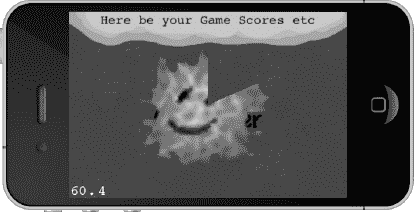

**图 5-3.** *工作中的`CCProgressTimer`。我会说大约是 12 点过 10 分。*

进度计时器类适用于任何类型的进度显示，比如加载条或图标重新可用所需的时间。想想《魔兽世界》中的动作按钮及其重新施法计时器。进度计时器接受一个精灵，并根据百分比仅显示其一部分，以可视化游戏中的某种进度。有关如何初始化`CCProgressTimer`节点，请参见清单 5-15。

**清单 5-15.** *初始化一个`CCProgressTimer`节点*

```
// Progress timer is a sprite that is only partially displayed
// to visualize some kind of progress.
CCProgressTimer* timer = [CCProgressTimer progressWithFile:@"firething.png"];
timer.type = kCCProgressTimerTypeRadialCCW;
timer.percentage = 0;
[self addChild:timer z:1 tag:UILayerTagProgressTimer];
// The update is needed for the progress timer.
[self scheduleUpdate];
```

`timer`类型来自定义在`CCProgressTimer.h`中的`CCProgressTimerType`枚举。你可以选择径向、垂直和水平进度计时器。但有一个警告：计时器不会自我更新。你必须频繁更改计时器的`percentage`值来更新进度。这就是我在清单 5-15 中包含`scheduleUpdate`的原因。执行实际进度更新的`update`方法的实现如清单 5-16 所示。`CCProgressTimer`节点的`percentage`属性必须根据需要频繁更新——它不会自动推进进度。这里的进度只是时间的流逝。这不就是游戏的全部意义吗？

**清单 5-16.** *`update`方法的实现*

```
-(void) update:(ccTime)delta
{
    CCNode* node = [self getChildByTag:UILayerTagProgressTimer];
    NSAssert([node isKindOfClass:[CCProgressTimer class]], @"node is not a
        CCProgressTimer");

    // Updates the progress timer
    CCProgressTimer* timer = (CCProgressTimer*)node;
    timer.percentage += delta * 10;
    if (timer.percentage >= 100)
    {
        timer.percentage = 0;
    }
}
```


### `CCParallaxNode`

视差效果是一种用于 2D 游戏中的技术，通过使用以不同速率移动的分层图像来营造深度感。前景中的图像相对背景中的图像移动得更快。尽管你无法在静态图像中看到视差效果，但图 5–4 至少能让你对由多个独立图层构成的背景有个初步印象。云朵位于最远处；山脉在云朵前方，但位于（丑陋的）树木后方。最底部是道路，你通常可以在此处添加一个玩家角色，沿着这片场景左右移动。

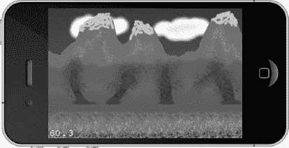

**图 5–4.** `CCParallaxNode` 让你能够创造出深度的错觉。

**注意：** 为什么视差效果能创造出深度的错觉？因为我们的思维已经习惯了这种效果。想象一下你正高速驾车行驶，透过侧窗向外看。你会注意到路边的树木（离你最近）飞速掠过，快到你几乎无法聚焦于任何一棵。再看远一点，你会发现远处的农舍以看似慢得多的速度从你身旁经过。然后望向地平线上的山脉，你几乎察觉不到自己正在经过它们。这就是三维世界中的视差效果，那里存在无数个视差图层。在 2D 游戏中，我们必须（非常粗略地）用大约两到八个视差图层来模拟同样的效果。每个图层都试图欺骗你的大脑，让它以为该图层距离你的视点有一定距离，原因仅仅在于它相对于其他图层以某个特定的速度移动。这种效果出奇地好。

Cocos2d 有一个专门的节点，你可以用它来创建这种效果。在代码清单 5–17 中创建 `CCParallaxNode` 的代码也包含在 ScenesAndLayers08 项目中。

**代码清单 5–17.** `CCParallaxNode` 需要大量设置工作，但结果值得如此投入

```
// 加载每个视差图层的精灵，从背景到前景。
CCSprite* para1 = [CCSprite spriteWithFile:@"parallax1.png"];
CCSprite* para2 = [CCSprite spriteWithFile:@"parallax2.png"];
CCSprite* para3 = [CCSprite spriteWithFile:@"parallax3.png"];
CCSprite* para4 = [CCSprite spriteWithFile:@"parallax4.png"];

// 根据屏幕和图像大小设置正确的偏移量。
para1.anchorPoint = CGPointMake(0, 1);
para2.anchorPoint = CGPointMake(0, 1);
para3.anchorPoint = CGPointMake(0, 0.6f);
para4.anchorPoint = CGPointMake(0, 0);
CGPoint topOffset = CGPointMake(0, screenSize.height);
CGPoint midOffset = CGPointMake(0, screenSize.height / 2);
CGPoint downOffset = CGPointZero;

// 创建一个视差节点并将精灵添加到其中。
CCParallaxNode* paraNode = [CCParallaxNode node];
[paraNode addChild:para1
                 z:1
     parallaxRatio:CGPointMake(0.5f, 0)
    positionOffset:topOffset];

[paraNode addChild:para2 z:2 parallaxRatio:CGPointMake(1, 0) positionOffset:topOffset];
[paraNode addChild:para3 z:4 parallaxRatio:CGPointMake(2, 0) positionOffset:midOffset];
[paraNode addChild:para4 z:3 parallaxRatio:CGPointMake(3, 0) positionOffset:downOffset];
[self addChild:paraNode z:0 tag:ParallaxSceneTagParallaxNode];

// 移动视差节点以展示视差效果。
CCMoveBy* move1 = [CCMoveBy actionWithDuration:5 position:CGPointMake(-160, 0)];
CCMoveBy* move2 = [CCMoveBy actionWithDuration:15 position:CGPointMake(160, 0)];
CCSequence* sequence = [CCSequence actions:move1, move2, nil];
CCRepeatForever* repeat = [CCRepeatForever actionWithAction:sequence];
[paraNode runAction:repeat];
```

要创建一个 `CCParallaxNode`，你首先要创建构成各个视差图像的所需 `CCSprite` 节点，然后必须将它们正确放置在屏幕上。在这个例子中，我选择修改它们的锚点，因为这样更容易让精灵与屏幕边界对齐。`CCParallaxNode` 的创建方式与其他节点类似，但其子节点是通过一个特殊的初始化方法添加的。通过该方法，你可以指定 `parallaxRatio`（视差比率），它是一个 `CGPoint`，用作 `CCParallaxNode` 任何移动的乘数。在此例中，`CCSprite` `para1` 将以一半的速度移动，`para2` 以正常速度移动，`para3` 以 `CCParallaxNode` 的双倍速度移动，依此类推。

通过使用一系列 `CCMoveBy` 动作，`CCParallaxNode` 被从左向右移动，然后再返回。你会注意到，背景中的云朵移动得最慢，而前景中的树木和碎石滚动得最快。这就营造出了深度的错觉。

**注意：** 一旦子节点被添加到 `CCParallaxNode` 中，你就不能再修改它们各自的位置了。你只能滚动到最大且移动最快的图像边界，否则背景就会透出来。如果你修改 `CCMoveBy` 动作使其滚动更远的距离，就能看到这种效果。你可以通过添加更多相同的精灵并设置适当的偏移量来增加滚动距离。但是，如果你需要在单一方向或双方向上实现无限滚动，就必须自行实现视差系统。事实上，这正是我们将在第 7 章中要做的事情。

### `CCRibbon`

`CCRibbon` 节点会创建一条图像带，就像一条链子，或者像图 5–5 中那样，像一条千足虫在 ScenesAndLayers09 项目的视差场景上爬行。

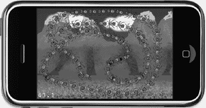

**图 5–5.** 真恶心。一条由蜘蛛组成的 `CCRibbon`，看起来像一条千足虫在屏幕上爬行。

`CCRibbon` 类结合触摸输入，可用于创建流行游戏中的线条绘制效果。代码清单 5–18 展示了如何使用触摸事件实现 `CCRibbon`。值得注意的是，你无法从 `CCRibbon` 中移除单个点。你只能通过将其作为子节点从父节点中移除来删除整个 `CCRibbon`。`CCRibbon` 初始化方法中的宽度和长度参数决定了单个带状元素绘制的大小。在这个例子中，我选择将其设置为与 `spider.png` 图像相同的大小，即宽高均为 32 像素。如果你选择其他值，图像会相应地按比例缩放。

**代码清单 5–18.** `CCRibbon` 类

```
-(void) resetRibbon
{
    // 移除丝带并创建一个新的。
    [self removeChildByTag:ParallaxSceneTagRibbon cleanup:YES];
    CCRibbon* ribbon = [CCRibbon ribbonWithWidth:32
                                           image:@"spider.png"
                                          length:32
                                           color:ccc4(255, 255, 255, 255)
                                            fade:0.5f];
    [self addChild:ribbon z:5 tag:ParallaxSceneTagRibbon];
}

-(CCRibbon*) getRibbon
{
    CCNode* node = [self getChildByTag:ParallaxSceneTagRibbon];
    NSAssert([node isKindOfClass:[CCRibbon class]], @"node is not a CCRibbon");

    return (CCRibbon*)node;
}

-(void) addRibbonPoint:(CGPoint)point
{
    CCRibbon* ribbon = [self getRibbon];
    [ribbon addPointAt:point width:32];
}

-(BOOL) ccTouchBegan:(UITouch*)touch withEvent:(UIEvent *)event
{
    [self addRibbonPoint:[MultiLayerScene locationFromTouch:touch]];
    return YES;
}

-(void) ccTouchMoved:(UITouch*)touch withEvent:(UIEvent *)event
{
    [self addRibbonPoint:[MultiLayerScene locationFromTouch:touch]];
}

-(void) ccTouchEnded:(UITouch*)touch withEvent:(UIEvent *)event
{
    [self resetRibbon];
}
```


### `CCMotionStreak`

`CCMotionStreak`本质上是`CCRibbon`的一个封装器。它会使`CCRibbon`元素在绘制后或多或少地缓慢淡出并消失。你可以在`ScenesAndLayers10`项目中试用它，并查看图 5-6 来了解淡出效果的大致样貌。

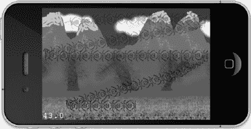

**图 5-6.** *`CCMotionStreak`类允许你让`CCRibbon`元素缓慢淡出。*

如代码清单 5-19 所示，其用法与`CCRibbon`几乎相同，区别仅在于`CCRibbon`现在成了`CCMotionStreak`的一个属性。`fade`参数决定了条带元素淡出的速度；数值越小，消失越快。`minSeg`参数似乎没有明显效果，不过如果将其设为负值，会出现一个有趣的图形显示异常。

**代码清单 5-19.** *`CCMotionStreak` 使条带的元素淡出，从而产生拖尾效果*

```
-(void) resetMotionStreak
{
    // 移除当前的 CCMotionStreak 并创建一个新的。
    [self removeChildByTag:ParallaxSceneTagRibbon cleanup:YES];
    CCMotionStreak* streak = [CCMotionStreak streakWithFade:0.7f
                                                    minSeg:10
                                                     image:@"spider.png"
                                                     width:32
                                                    length:32
                                                     color:ccc4(255, 0, 255, 255)];
    [self addChild:streak z:5 tag:ParallaxSceneTagRibbon];
}

-(void) addMotionStreakPoint:(CGPoint)point
{
    CCMotionStreak* streak = [self getMotionStreak];
    [streak.ribbon addPointAt:point width:32];
}
```

### 本章小结

在本章中，你学习了更多关于场景和层的内容——如何使用它们、何时使用以及用于何种目的。我解释了为什么通常不建议直接从`CCSprite`继承子类化游戏对象，并展示了如何创建一个完全自包含的、继承自`CCNode`的游戏对象类。

最后，你学习了如何使用诸如`CCProgressTimer`、`CCParallaxNode`、`CCRibbon`和`CCMotionStreak`等专门的`CCNode`类。

现在，你已经掌握了足够的 cocos2d 知识，可以开始创建更复杂的游戏了，比如我为你准备的横向卷轴射击游戏。而复杂的游戏必然伴随着复杂的图形，包括动画。如何高效地（无论是在内存还是性能方面）处理所有这些精灵，将是下一章的主题。

## 第 6 章

## 深入理解精灵

在本章中，我将重点讲解精灵的使用。有多种方法可以从单个图像文件和纹理图集中创建精灵。我还会解释如何创建和播放精灵动画。

*纹理图集*是一种包含多个图像的常规纹理。它通常被用来将单个角色的所有动画帧存储在一个纹理中，但其用途不仅限于此。事实上，你可以将任何图像放入纹理图集。目标是让每个纹理图集包含尽可能多的图像。`TexturePacker`是一个可以帮助创建纹理图集的出色工具，我也会在本章中介绍它。

*精灵批处理*是一种加速精灵绘制的技术。顾名思义，批处理精灵允许 GPU 一次性渲染所有精灵，用技术术语来说，就是一次绘制调用。它能够加速相同精灵的绘制，但在使用纹理图集时效果最为显著。如果你将纹理图集与精灵批处理结合使用，就可以在一次绘制调用中绘制该纹理图集中的所有图像。

*绘制调用*是将必要信息传输到图形硬件以渲染纹理或其部分的过程。当你使用`CCSprite`时，每个`CCSprite`都会导致一次绘制调用。每次绘制调用带来的 CPU 开销会累积起来，从而降低帧率，尤其是在需要显示更多精灵时。

`CCSpriteBatchNode`的作用就像一个额外的层，只要所有精灵节点都使用相同的纹理，你就可以将它们添加到这个层上。此后，`CCSpriteBatchNode`的所有子节点都将通过一次绘制调用来完成绘制。实际上，CPU 会告诉 GPU 应该从哪个纹理进行绘制，同时还会向 GPU 传递一长串帧和位置信息，以便 GPU 能自行从该纹理渲染大量精灵。

总而言之，精灵批处理通过使用相同纹理来加速相同精灵的绘制，并在使用纹理图集时效果最佳。

你在本章学到的知识，将成为我将在第 7 章和第 8 章中讨论的视差滚动射击游戏的基础。


### `Retina Display`

从`iPhone 4`开始，新款`iPhone`机型采用了名为`Retina`显示屏的新型高分辨率屏幕。其分辨率为`960×640`像素，在水平和垂直方向上的像素数均为上一代设备（`480×320`像素）的两倍。为区分两者，`Retina`显示屏图形被称为高清（`HD`）图形，而非`Retina`设备则被称为标准清晰度（`SD`）图形。

在表 6–1 中，您将简要了解包括第四代在内的`iOS`设备的技术规格。

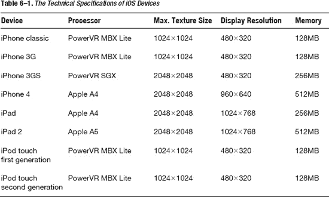

对于使用`PowerVR MBX Lite`的`GPU`的设备，还存在一个重要的限制：它们只能使用`24MB`的显存。这个限制在新款设备上不存在。这一限制对图形密集型应用尤为重要，因为您需要在纹理内存的使用与应用所需的常规内存之间取得平衡。

尽管第一代和第二代设备已不再生产或销售，但仍有数百万用户拥有并使用它们。是否支持这些设备由您决定。但这是一个应该在开始编写应用之前就做出的决定，因为在开发过程中甚至完成后再去优化，使其在性能较弱的硬件上良好运行，要困难得多。幸运的是，`cocos2d`能帮助您同时兼顾新旧设备的适配。

`Cocos2d`使用基于点（`points`）而非像素（`pixels`）的与分辨率无关的坐标系。在`SD`设备上，一个点正好是一个像素；而在`Retina`显示屏设备上，一个点则是两个像素。通过使用点来编写所有位置坐标，这些坐标在两种设备上将是相同的！

**提示：** 若要在`Retina`设备上将对象设置到精确的像素位置，点可以用分数表示。例如，点`100.5,99.5`会在`Retina`设备上设置到像素坐标`201,200`。然而，在非`Retina`设备上，这也会将像素位置设置为`100.5,99.5`，这被称为**亚像素渲染**。由于图像未处于精确的像素位置，可能会发生一些混合，导致对象对齐不正确或出现间隙。通常建议避免这种情况。

`Cocos2d`在加载图像方面非常智能。如果您的代码启用了`Retina`支持，并且应用运行在配备`Retina`显示屏的设备上，`cocos2d`会先尝试加载带有`-hd`后缀的精灵。因此，如果您在`Retina`显示屏设备上加载一个名为`ship.png`的文件，它会先尝试加载`ship-hd.png`；如果该文件不存在或设备不是`Retina`显示屏设备，则会加载`SD`分辨率图像`ship.png`。

当然，这只有在所有`-hd`图像的分辨率恰好是非`-hd`图像的两倍时才有效。否则，您会发现，不是正好两倍分辨率的`-hd`图像在应用中显示时会出现或多或少的偏移。通常，您应避免使用像素分辨率不能被二整除（无余数）的`-hd`图像。如果您确实要支持`Retina`显示屏，应创建所有图像的`HD`分辨率版本，然后简单地将其缩小`50%`保存为`SD`图像。将`SD`图像放大并不会带来`Retina`显示屏的画质。

`Cocos2d`的`HD`图像支持的好处在于，您的游戏甚至不需要知道它是否运行在`Retina`设备上。代码将是完全相同的。您唯一需要关心的是，需要准备两张图像而不是一张。

理论上，也可以只使用`HD`图形，然后通过精灵的`scale`属性动态缩小它们以匹配显示分辨率。但这有一个主要缺点：内存使用量会翻两番！假设使用`32`位色彩质量，图 6–1 中的`HD`图像占用`128KB`纹理内存，而`SD`版本仅占用`32KB`内存。非`Retina`设备的内存通常比`Retina`设备要小，会很快耗尽内存。此外，考虑一下，显示缩小版图像还会带来性能损失，因为每帧需要处理四倍于原图的像素来显示缩小后的版本。

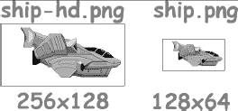

**图 6–1.** *适用于高清（`Retina`）和标清（非`Retina`）显示的两种分辨率的精灵*

要在`cocos2d`中启用对`Retina`显示屏分辨率的支持，您必须调用`CCDirector`的`enableRetinaDisplay`方法：

```
if(![director enableRetinaDisplay:YES])
{
    CCLOG(@"Retina Display Not supported");
}
```

**警告：** 如果您启用了`Retina`显示屏支持，则应为所有精灵、位图字体、粒子效果等提供`HD`图像。否则，您应用在`SD`设备上看起来正常，但在`Retina`显示屏上，所有没有`HD`版本的视觉元素将会以一半大小绘制。

### `CCSpriteBatchNode`

每次在屏幕上绘制纹理时，图形硬件都需要准备渲染、执行渲染并在渲染后进行清理。启动和结束单个纹理的渲染会带来固有的开销。通过让图形硬件知道您有一组应使用相同纹理渲染的精灵，可以缓解这一问题。在这种情况下，图形硬件将仅对一组精灵执行一次准备和清理步骤。

图 6–2 展示了这种批量渲染的示例。如您所见，屏幕上出现了数百个完全相同的子弹。如果逐一渲染它们，在这种情况下帧率会下降至少`15%`。使用`CCSpriteBatchNode`，可以避免这种重复性的开销。

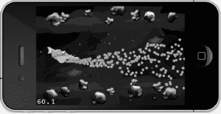

**图 6–2.** *将多个使用相同纹理的`CCSprite`节点添加到一个`CCSpriteBatchNode`中进行绘制会更高效*

作为回顾，以下是创建`CCSprite`的常规方式：

```
CCSprite* sprite = [CCSprite spriteWithFile:@"bullet.png"];
[self addChild:sprite];
```

代码清单 6–1 将同一个`CCSprite`的创建方式改为使用`CCSpriteBatchNode`。当然，仅添加一个`CCSprite`到其中是没有任何好处的，因此我会向`CCSpriteBatchNode`中添加多个使用同一纹理的精灵。

**代码清单 6–1.** *创建多个`CCSprite`并将其添加至`CCSpriteBatchNode`以加速渲染*

```
CCSpriteBatchNode* batch = [CCSpriteBatchNode batchNodeWithFile:@"bullet.png"];
[self addChild:batch];

for (int i = 0; i < 100; i++)
{
    CCSprite* bullet = [CCSprite spriteWithFile:@"bullet.png"];
    [batch addChild:bullet];
}
```

您会注意到，在代码清单 6–1 中，`CCSpriteBatchNode`将一个文件作为参数，尽管`CCSpriteBatchNode`本身并不显示。在这方面，它更像是一个`CCLayer`，只不过您只能向其中添加`CCSprite`节点。它接受一个图像文件作为参数的原因是，添加到`CCSpriteBatchNode`的所有`CCSprite`节点必须使用相同的纹理。如果您犯了这样的错误，会在调试器控制台窗口中看到如下错误信息：

```
SpriteBatches[13879:207] *** Terminating app due to uncaught exception
'NSInternalInconsistencyException', reason: 'CCSprite is not using the same texture id'
```


#### 何时使用 `CCSpriteBatchNode`

当你需要显示两个或更多同类别的 `CCSprite` 时，就可以使用 `CCSpriteBatchNode`。你能归为一组的 `CCSprite` 越多，使用 `CCSpriteBatchNode` 带来的好处就越明显。

不过，它也存在局限性。由于所有 `CCSprite` 节点都添加到 `CCSpriteBatchNode` 中，因此添加到其中的所有 `CCSprite` 节点都会以相同的 z 顺序（深度）进行绘制。如果你的游戏中，子弹需要在敌人前后飞行，那么你就得使用两个 `CCSpriteBatchNode`，分别将低 z 顺序和高 z 顺序的子弹精灵归为一组。

另一个缺点是，添加到 `CCSpriteBatchNode` 中的所有 `CCSprite` 都必须使用相同的纹理。但这也意味着，当你使用纹理图集时，`CCSpriteBatchNode` 变得最为重要。有了纹理图集，你就不限于只绘制一张图片；相反，你可以将多个不同的图片添加到同一个纹理图集中，并使用同一个 `CCSpriteBatchNode` 绘制所有这些图片，从而加快该纹理图集中所有图片的渲染速度。

如果你游戏中的所有图片都能放入同一个纹理图集，那么你几乎可以仅使用一个 `CCSpriteBatchNode` 来构建整个游戏（尽管这种情况比较少见）。

你可以将 `CCSpriteBatchNode` 视为类似于 `CCLayer`，只不过它只接受使用相同纹理的 `CCSprite` 节点。带着这种理解，我相信你一定能找到使用 `CCSpriteBatchNode` 的正确场景。

#### 演示项目

这里有四个项目——分别命名为 Sprites01 到 Sprites04——旨在演示如何使用 `CCSpriteBatchNode`。它们是我将在第 7 章和第 8 章中讨论的纵向卷轴射击游戏的第一步。由于开发者通常从仅使用 `CCSprite` 节点开始，然后改进代码以支持 `CCSpriteBatchNode`，我发现展示这一过程以及代码在此过程中的变化非常有趣。

这些项目使用了两个类，分别名为 `Ship` 和 `Bullet`，两者都派生自 `CCSprite`，用于说明项目如何从使用常规的 `CCSprite` 对象转变为使用 `CCSpriteBatchNode`。

##### 一个常见且致命的错误

Sprites01 项目展示了刚接触 Objective-C 的开发者容易陷入的一个常见陷阱。犯这个错误很容易，但找出原因和解决方案却很难。我来帮你省去这个麻烦。请看一下列表 6–2；你能看出这段代码有什么问题吗？

**列表 6–2.** *对 CCSprite（或类似类）进行子类化时常犯的致命错误*

```
-(id) init
{
    if ((self = [super initWithFile:@"ship.png"]))
    {
        [self scheduleUpdate];
    }
    return self;
}
```

不，问题不在于 `scheduleUpdate`；那只是为了分散你的注意力。问题在于，`-(id) init` 方法是默认初始化器，任何其他特定的初始化器（如 `initWithFile`）最终都会调用它。现在你能想象出代码有什么问题了吗？

嗯，`initWithFile` 最终会调用默认初始化器 `-(id) init`。然后，由于这个类的实现重写了它，它又会再次调用 `[super initWithFile: ..]`。如此循环往复，*无穷无尽*。

解决方案非常简单。如列表 6–3 所示，只需给初始化器方法起一个不同的名称——而不是 `-(id) init` 即可。

**列表 6–3.** *修复由列表 6–2 中的代码引起的无限循环*

```
-(id) initWithShipImage
{
    if ((self = [super initWithFile:@"ship.png"]))
    {
        [self scheduleUpdate];
    }
    return self;
}
```

**注意：** 一般来说，为避免此问题，你绝不应在默认初始化器 `-(id) init` 中调用除 `[super init]` 之外的任何内容。如果你必须在类的初始化器方法中调用 `[super initWith...]`，那么你应该将该初始化器方法相应地命名为 `-(id) initWith...`（例如，像列表 6–3 中的 `-(id) initWithShipImage` 一样）。

##### 没有 SpriteBatch 的子弹

Sprites02 项目为每个`Bullet`创建一个新的 `CCSprite`。请注意，在列表 6–4 中，飞船精灵是如何将子弹添加到其父节点中的——它并没有将子弹添加到自身；否则，所有飞行的子弹都将相对于飞船定位，并模仿飞船的运动。

**列表 6–4.** *飞船发射子弹*

```
-(void) update:(ccTime)delta
{
    // 不断创建新的子弹
    Bullet* bullet = [Bullet bulletWithShip:self];

    // 将子弹添加到飞船的父节点
    CCNode* gameScene = [self parent];
    [gameScene addChild:bullet z:0 tag:GameSceneNodeTagBullet];
}
```

将 `Bullet` 精灵添加到飞船的父节点，原因很简单：将它们添加到飞船会导致所有飞行的子弹相对于飞船有一个偏移量。这意味着，如果飞船移动——我猜你最终会想要实现这一点；否则，这游戏就太无聊了——所有飞行的子弹都会相对于飞船改变位置，就好像它们以某种方式附着在飞船上一样。

**提示：** 所有子弹都以相同的 z 顺序（0）添加。使用相同 z 顺序的所有节点，按照它们添加到场景层次结构的顺序进行绘制。这意味着，最后添加的节点将绘制在所有先前添加的具有相同 z 顺序的节点之前。

此外，所有子弹都使用相同的标签。标签不必唯一，有时使用标签来表示节点所属的组会很有帮助。然后，你可以遍历一个节点的所有子节点，并根据节点标签执行不同的代码。

子弹还使用一个 `update` 方法来更新它们的位置，并在某个时刻将自己移除。虽然精灵在屏幕外不会被绘制，但它们仍然会消耗内存和 CPU 资源，因此有必要在某个时间点移除所有离开屏幕区域的游离物体。在这种情况下，你只需检查子弹位置相对于屏幕右侧的位置，如列表 6–5 所示。

**列表 6–5.** *移动并移除子弹*

```
-(void) update:(ccTime)delta
{
    // 更新子弹位置
    // 将速度乘以上次更新以来的时间
    // 确保即使帧率下降，子弹速度也保持不变
    self.position = ccpAdd(self.position, ccpMult(velocity, delta));

    // 如果子弹离开屏幕，则删除它
    if (self.position.x > outsideScreen)
    {
        [self removeFromParentAndCleanup:YES];
    }
}
```

通过将速度（由 `CGPoint` 给定的速度和方向）乘以时间，然后将结果加到子弹位置上，来更新子弹位置。速度简单地决定了每秒在每个方向上移动多少像素。用速度乘以时间得到子弹移动的距离。在更新位置时使用增量时间的原因在于，这会使子弹的运动独立于帧率。如果你不对所有移动对象都这样做，你的游戏会随着帧率下降而按比例变慢，例如，当出现大量精灵在屏幕上的 Boss 战时。

在这种情况下，在名为 `update` 的恰当方法中计算移动，要比使用 `CCMoveTo` 或 `CCMoveBy` 动作高效得多。这可以避免一些开销，并避免动作在给定持续时间内运行的问题。如果飞船向右屏幕边缘移动，则移动动作会导致子弹移动得更慢，因为它们需要在相同时间内移动更短的距离。


**提示：** 你可以让`CCMoveTo`和`CCMoveBy`动作以固定速度将节点移动到任意位置。为此，首先需要使用`ccpDistance`方法计算节点当前位置与目标位置之间的距离，然后将该距离除以所需速度（以每帧像素数表示）。这种方法效果不错，但其缺点是`ccpDistance`调用了`sqrtf`（平方根）方法，这在计算上开销较大。应避免频繁使用该方法。因此，对于像每帧更新节点位置这样简单的操作，通常建议避免对连续移动的节点使用移动动作。

### 引入`CCSpriteBatchNode`

在 Sprites03 项目中，已为子弹添加了`CCSpriteBatchNode`。我决定将其添加到`GameScene`自身中，因为子弹不应被添加到`Ship`类中。由于`Ship`类无法访问`GameScene`，我还需要添加伪单例访问器`sharedGameScene`，以使飞船能够获取`CCSpriteBatchNode`，如代码清单 6-6 所示。

**代码清单 6-6.** `GameScene`为子弹获取`CCSpriteBatchNode`并为`Ship`类提供访问器

```
static GameScene* instanceOfGameScene;
+(GameScene*) sharedGameScene
{
    NSAssert(instanceOfGameScene != nil, @" instance not yet initialized!");
    return instanceOfGameScene;
}

-(id) init
{
    if ((self = [super init]))
    {
        instanceOfGameScene = self;

…

        CCSpriteBatchNode* batch = [CCSpriteBatchNode batchNodeWithFile:@"bullet.png"];
        [self addChild:batch z:1 tag:GameSceneNodeTagBulletSpriteBatch];
    }
    return self;
}

-(void) dealloc
{
    instanceOfGameScene = nil;
    [super dealloc];
}

-(CCSpriteBatchNode*) bulletSpriteBatch
{
    CCNode* node = [self getChildByTag:GameSceneNodeTagBulletSpriteBatch];
    NSAssert([node isKindOfClass:[CCSpriteBatchNode class]], @"not a SpriteBatch");
    return (CCSpriteBatchNode*)node;
}
```

**警告：** 我知道这个单例以及额外的访问器方法`bulletSpriteBatch`可能不符合所有人的喜好。为什么我不简单地将`CCSpriteBatchNode`作为指针传递给`Ship`类，无论是在初始化器中还是通过属性？

一个原因是`Ship`并不拥有子弹精灵批次，因此它不应保留对该批次的引用。此外，如果`Ship`类也保留了精灵批次，若不小心处理，可能导致整个场景无法释放。节点绝不应保留不属于它们的其他节点。

特别地，子节点不应保留其父节点。首先，子节点从不需要保留其父节点，因为 cocos2d 的节点层级结构已经处理了这一点。如果子节点保留了其父节点或任何祖先节点，由于父节点被子节点持有，将导致父节点无法释放。而父节点若不释放，子节点也无法释放。这种循环会导致内存泄漏，并可能引发奇怪的副作用，例如本应早已消失的节点仍持续执行其代码。

现在，`Ship`类可以通过使用`sharedGameScene`和`bulletSpriteBatch`访问器直接向精灵批次添加子弹。如代码清单 6-7 所示。

**代码清单 6-7.** `GameScene`为子弹获取`CCSpriteBatchNode`并为`Ship`类提供访问器

```
-(void) update:(ccTime)delta
{
    Bullet* bullet = [Bullet bulletWithShip:self];
    [[[GameScene sharedGameScene] bulletSpriteBatch] addChild:bullet
                                                            z:0
                                                          tag:GameSceneNodeTagBullet];
}
```

### 优化

在优化这段代码的同时，为何不消除由`Bullet`类引起的不必要内存分配和释放呢？分配和释放内存是一项开销巨大的操作，应在游戏过程中尽量减少。一种常见的解决方案是在游戏开始时实例化固定数量的对象，然后根据需要简单地启用或禁用/隐藏这些对象。这被称为**对象池**（object pooling）。

由于可以安全地定义屏幕上同时存在的子弹数量上限，子弹是对象池的绝佳候选，以避免在游戏过程中分配和释放子弹。由于所有子弹共享相同的纹理，即使内存中始终驻留更多子弹，其额外内存消耗也可以忽略不计。代码清单 6-8 展示了 Sprites04 项目中`GameScene`的`init`方法的变更。

**代码清单 6-8.** 预先创建合理数量的子弹精灵可避免游戏过程中不必要的内存分配

```
CCSpriteBatchNode* batch = [CCSpriteBatchNode batchNodeWithFile:@"bullet.png"];
[self addChild:batch z:0 tag:GameSceneNodeTagBulletSpriteBatch];

// 预先创建一定数量的子弹，并在需要时重用它们。
for (int i = 0; i < 400; i++)
{
    Bullet* bullet = [Bullet bullet];
    bullet.visible = NO;
    [batch addChild:bullet];
}
```

所有子弹都被设为不可见，因为我们暂时还不使用它们。在代码清单 6-9 中，`GameScene`类获得了一个新方法，通过按顺序重新激活非活动子弹，使飞船能够发射子弹。这个过程通常被称为**对象池**（object pooling）。现在，射击过程通过`GameScene`重新路由，因为它包含了用于子弹的`CCSpriteBatchNode`。一旦选中一个非活动子弹，它就会被指示自行发射。

**代码清单 6-9.** 射击现在被重新路由

```
-(void) shootBulletFromShip:(Ship*)ship
{
    CCArray* bullets = [self.bulletSpriteBatch children];

    CCNode* node = [bullets objectAtIndex:nextInactiveBullet];
    NSAssert([node isKindOfClass:[Bullet class]], @"not a bullet!");

    Bullet* bullet = (Bullet*)node;
    [bullet shootBulletFromShip:ship];

    nextInactiveBullet++;
    if (nextInactiveBullet >= [bullets count])
    {
        nextInactiveBullet = 0;
    }
}
```

通过维护引用计数器`nextInactiveBullet`，每次射击都使用该索引处的精灵批次子弹。一旦所有子弹都被射击过一次，索引便会重置。只要池中的子弹数量始终大于屏幕上同时出现的最大子弹数量，这种方法就能正常工作。

在代码清单 6-10 中，`Bullet`类的`shoot`方法仅执行重新初始化子弹的必要步骤，包括通过首先取消调度更新选择器（如果它已经在运行中）来重新调度其更新选择器。最重要的是，`Bullet`被重新设为可见。其位置和速度也被重置。`Bullet`类的`shoot`方法简单地重置诸如位置和速度等相关变量，然后将子弹设为可见。一旦子弹生命周期结束，它就会被再次设为不可见。

**代码清单 6-10.** `Bullet`类的`shoot`方法重新初始化子弹

```
-(void) shootBulletFromShip:(Ship*)ship
{
    float spread = (CCRANDOM_0_1() - 0.5f) * 0.5f;
    velocity = CGPointMake(1, spread);

    outsideScreen = [[CCDirector sharedDirector] winSize].width;

self.position = CGPointMake(ship.position.x + ship.contentSize.width * 0.5f, 
        ship.position.y;
    self.visible = YES;

    [self unscheduleUpdate];
    [self scheduleUpdate];
}

-(void) update:(ccTime)delta
{
    self.position = ccpAdd(self.position, velocity);
```


```objectivec
if (self.position.x > outsideScreen)
{
    self.visible = NO;
    [self unscheduleUpdate];
}
```

**提示:** 注意在`shootBulletFromShip`方法中，更新选择器首先被取消调度，以防止更新选择器被重复调度（这会导致错误）。不过，你无需检查选择器是否已被调度即可取消调度。如果该选择器当前未调度，`Cocos2d`可能会向调试器控制台窗口输出一条警告消息，但除此之外会忽略该命令。`Cocos2d`所不允许的是尝试调度一个已经处于调度状态的选择器；因此，在使用`Cocos2d`的调度选择器时，预先取消调度是一个相对常见的操作。

#### 棘手的精灵动画实现方式

现在请做好准备，我将向你展示精灵动画的工作原理。图 6-3 展示了飞船的动画帧。请注意，我们同时拥有高清和标清分辨率的完整动画。

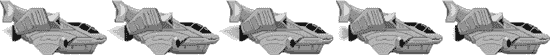

**图 6-3.** *飞船动画——五个火焰效果不同的帧*

精灵动画是使用`CCSpriteBatchNode`的另一个好理由，因为你可以将所有动画帧放入同一纹理中以节省内存。实际上，这需要编写相当多的代码，如代码清单 6-11 和`Sprites05`项目所示。之后，我将展示如何使用纹理图集创建相同的动画，这可以显著减少你需要编写的代码量。

**代码清单 6-11.** *不使用纹理图集为飞船添加动画需要相当多的代码*

```objectivec
// 将飞船动画帧作为纹理加载并创建精灵帧
NSMutableArray* frames = [NSMutableArray arrayWithCapacity:5];
for (int i = 0; i < 5; i++)
{
    // 为动画帧创建纹理
    NSString* file = [NSString stringWithFormat:@"ship-anim%i.png", i];
    CCTexture2D* texture = [[CCTextureCache sharedTextureCache] addImage:file];

    // 整个图像应作为动画帧使用
    CGSize texSize = [texture contentSize];
    CGRect texRect = CGRectMake(0, 0, texSize.width, texSize.height);

    // 从纹理创建精灵帧
    CCSpriteFrame* frame = [CCSpriteFrame frameWithTexture:texture rect:texRect];
    [frames addObject:frame];
}

// 从所有精灵动画帧创建动画对象
CCAnimation* anim = [CCAnimation animationWithFrames:frames delay:0.08f];

// 通过 CCAnimate 动作运行动画，并使用 CCRepeatForever 循环
CCAnimate* animate = [CCAnimate actionWithAnimation:anim];
CCRepeatForever* repeat = [CCRepeatForever actionWithAction:animate];
[self runAction:repeat];
```

所有这些代码只是为了创建一个包含五帧的精灵动画？恐怕是的。这次我将逆向为你讲解这段代码，这可能有助于更好地理解其结构。在代码末尾，我们使用了`CCAnimate`动作来播放动画。在此例中，我们还使用了`CCRepeatForever`动作来循环播放动画。

`CCAnimate`动作使用`CCAnimation`对象（它是动画帧的容器），该对象定义了每帧之间的延迟。在很多情况下，你后续可能需要引用之前创建的动画。为此，`Cocos2d`提供了`CCAnimationCache`类，它可以通过名称存储`CCAnimation`实例，如代码清单 6-12 所示。使用`CCAnimationCache`，你以后可以通过名称访问特定的动画。

**代码清单 6-12.** *`CCAnimationCache`类可以为你存储动画，并可通过名称检索*

```objectivec
CCAnimation* anim = [CCAnimation animationWithFrames:frames delay:1];

// 将动画存储在 CCAnimationCache 中
[[CCAnimationCache sharedAnimationCache] addAnimation:anim name:@"move"];

// 稍后：从 CCAnimationCache 中检索 move 动画
CCAnimation* move = [[CCAnimationCache sharedAnimationCache] animationByName:@"move"];
```

回到代码清单 6-11，注意其中的`for`循环，这是复杂之处所在。`CCAnimation`类必须使用包含`CCSpriteFrame`对象的`NSArray`来初始化。一个*精灵帧*仅包含对纹理的引用以及一个定义纹理绘制区域的矩形。纹理矩形等于纹理的`contentSize`属性——换句话说，它就是纹理中包含的实际图像的大小。请记住，纹理可能比其包含的图像更大，因为纹理的尺寸只能是 2 的幂。

现在，遗憾的是`CCSpriteFrame`不接受图像文件名作为输入，它只接受已有的`CCTexture2D`对象。纹理是通过`CCTextureCache`单例的`addImage`方法创建的，该方法通常用于将图像作为纹理预加载到内存中，而无需创建`CCSprite`或其他对象。文件名是通过`NSString`的`stringWithFormat`方法构建的，这允许我使用循环变量`i`附加到文件名上，而不必逐一写出所有五个文件名。

总结一下，从顶层到底层，创建并运行精灵动画的步骤如下：

1. 创建`NSMutableArray`。
2. 对于每个动画帧：
   1. 为每个图像创建`CCTexture2D`。
   2. 使用`CCTexture2D`创建`CCSpriteFrame`。
   3. 将每个`CCSpriteFrame`添加到`NSMutableArray`中。
3. 使用`NSMutableArray`中的帧创建`CCAnimation`。
4. （可选）将`CCAnimation`以指定名称添加到`CCAnimationCache`。
5. 使用`CCAnimate`动作播放动画。

嘘，放松点——没必要吃镇静剂。如果你将动画帧打包到纹理图集中，事情会变得更容易，同时效率也更高。更有帮助的做法是将所有这些代码封装到一个辅助方法中，并为动画文件制定统一的命名约定。
```


### 动画辅助类

由于创建动画帧和动画的代码在所有动画中都是通用的，你应该考虑将这些代码封装到一个辅助方法中。我在 Sprite05_WithAnimHelper 项目中已经这样做了。我没有使用静态方法，而是决定通过一个名为*类别*的 Objective-C 特性来扩展 `CCAnimation` 类。它提供了一种向现有类添加方法的方式，而无需修改原始类。唯一的缺点是你无法通过类别向类中添加成员变量，只能添加方法。以下代码是 `CCAnimation` 类别的 `@interface`，我将其简单地命名为 `Helper`：

```
@interface CCAnimation (Helper)
+(CCAnimation*) animationWithFile:(NSString*)name
                       frameCount:(int)frameCount
                            delay:(float)delay;
@end
```

Objective-C 类别的 `@interface` 使用与其扩展的类相同的名称，并在括号内添加一个类别名称。类别名称类似于变量名，因此不能包含空格或其他不能在变量中使用的字符（例如标点符号）。`@interface` 也不能包含花括号，因为向类别添加成员变量是不可能的，也是不允许的。

`CCAnimation` 类别的实际 `@implementation` 使用与 `@interface` 相同的模式，即在类名后面的括号内附加类别名称。其他所有内容都像编写常规类方法一样；在本例中，我的扩展方法名为 `animationWithFile`，并将文件名、帧数和动画延迟作为输入：

```
@implementation CCAnimation (Helper)

// 根据单个文件创建动画
+(CCAnimation*) animationWithFile:(NSString*)name
                       frameCount:(int)frameCount
                            delay:(float)delay
{
    // 将动画帧作为纹理加载并创建精灵帧
    NSMutableArray* frames = [NSMutableArray arrayWithCapacity:frameCount];
    for (int i = 0; i < frameCount; i++)
    {
        // 假设所有动画文件都命名为 "nameX.png"
        NSString* file = [NSString stringWithFormat:@"%@%i.png", name, i];
        CCTexture2D* texture = [[CCTextureCache sharedTextureCache]addImage:file];

        // 假设图像文件动画始终使用整张图像
        CGSize texSize = texture.contentSize;
        CGRect texRect = CGRectMake(0, 0, texSize.width, texSize.height);
        CCSpriteFrame* frame = [CCSpriteFrame frameWithTexture:texture rect:texRect];

        [frames addObject:frame];
    }

    // 从所有精灵动画帧返回一个动画对象
    return [CCAnimation animationWithFrames:frames delay:delay];
}

@end
```

这就是命名约定发挥作用的地方。`Ship` 的动画的基本名称为 `ship-anim`，后面跟着从 0 开始的连续数字，并以 `.png` 文件扩展名结尾。例如，`Ship` 动画的文件名从 `ship-anim0.png` 到 `ship-anim4.png`。如果你使用这种命名方案创建所有动画，那么上述 `CCAnimation` 扩展方法就可以用于你所有的动画。

**提示：** 我忍不住注意到，许多开发者和美术人员习惯于使用固定位数对文件进行连续命名，必要时会添加前导零。例如，你可能会倾向于将文件命名为 `my-anim0001` 到 `my-anim0024`。我认为这个习惯可以追溯到那些无法进行自然排序的老式计算机操作系统，因此会对带有连续数字的文件名进行错误排序。那些日子早已一去不复返了，而且你实际上会让程序员更难在 `for` 循环中加载像这样命名的文件，因为你需要考虑应该添加多少个前导零。有一个不错的格式化快捷方式 `%03i` 可以用于补零，这样数字至少是三位数。然而，我认为在我们现代世界中，更好的做法是直接对文件进行连续命名，而不添加任何前导零。这样你会获得一点简单和安心。

这大大简化了从单个文件创建动画的代码：

```
// 整个繁重的工作现在封装到了一个 Category 扩展方法中
CCAnimation* anim = [CCAnimation animationWithFile:@"ship-anim"
                                        frameCount:5
                                             delay:0.08f];
```

基本上，这将代码行数从九行缩减到了这一行。作为文件名，你只需要传入动画的基本名称——在本例中是 `ship-anim`。辅助方法会根据 `frameCount` 参数添加连续的数字，并附加 `.png` 文件扩展名。当你将动画添加到 `CCAnimationCache` 时，你也可以使用动画的基本名称作为动画的名称，这样你就不必记住同一个动画的备用名称了。之前我将飞船的动画命名为 `move`。现在它被称为 `ship-anim`，与文件名一致。你可以通过使用其基本名称来存储和访问来自 `CCAnimationCache` 的动画，如下所示：

```
NSString* shipAnimName = @"ship-anim";

CCAnimation* anim = [CCAnimation animationWithFile:shipAnimName
                                        frameCount:5
                                             delay:0.08f];
[[CCAnimationCache sharedAnimationCache] addAnimation:anim name:shipAnimName];

// 稍后：
CCAnimation* shipAnim = [shipSprite animationByName:shipAnimName];
```

`animationWithFile` 辅助方法做了两个假设：动画图像文件名从 0 开始连续编号，并且文件必须是 `.png` 文件。是否坚持使用这种精确的命名约定，还是根据自己的需求进行更改，这完全取决于你。例如，你可能会发现从 1 而不是 0 开始对动画进行编号更方便。在这种情况下，你需要修改 `for` 循环，以便名称字符串使用 `i + 1` 进行格式化。重要的是坚持你所选择的任何命名约定，从而让你的生活（以及你的代码）更轻松。

你应该从中学到三点：

- 通过定义自己的方法来封装常用代码。
- 使用 Objective-C 类别向现有类添加方法。
- 定义资源文件命名约定以支持你的代码。

### 使用纹理图集

纹理图集有助于节省宝贵的内存，同时也有助于提高精灵渲染的速度。由于纹理图集不过是一张大纹理，你可以使用 `CCSpriteBatchNode` 来渲染它包含的所有图像，从而减少绘制调用的开销。使用纹理图集在内存使用和性能方面是双赢的。


#### 什么是纹理图集？

到目前为止，对于使用的所有精灵，我都只是简单地加载了它们需要显示的图像文件。在内部，这个图像会成为精灵的纹理，其中包含了图像，但纹理的宽度和高度必须始终是 2 的幂次方——例如 `1024×128` 或 `256×512`。纹理尺寸会自动增大以符合这一规则，这可能会占用比图像尺寸所提示的更多的内存。例如，一个尺寸为 `140×600` 的图像在内存中会变成一个尺寸为 `256×1024` 的纹理。这种纹理浪费了大量宝贵的内存，如果你有多个这样的图像并将它们分别加载到各自的纹理中，浪费的内存数量会变得非常显著。

这就是纹理图集的用武之地。它本质上是一张已经对齐到 2 的幂次方尺寸并包含多个图像的图片。纹理图集中的每个图像都有一个精灵帧，该帧定义了该图像在纹理图集内的矩形区域。换句话说，精灵帧是一个 `CGRect` 结构，它定义了纹理图集的哪一部分应被用作该精灵的图像。这些精灵帧被保存在一个单独的 `.plist` 文件中，以便 cocos2d 能够从一张大的纹理图集纹理中渲染出非常具体的图像。

#### 介绍 TexturePacker

如果没有 TexturePacker 这个 2D 精灵打包工具（如图 6-4 所示），将图像打包到纹理图集并记录它们所占用的矩形精灵帧将是一项艰巨的任务。TexturePacker 应用程序有免费版和付费版，可以从 [`www.texturepacker.com`](http://www.texturepacker.com) 下载。

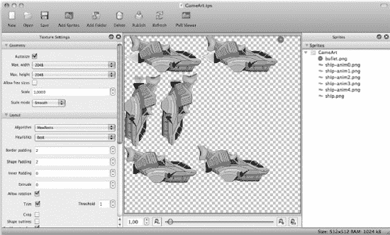

**图 6-4.** *TexturePacker 已将飞船的动画帧打包到一个纹理图集中*

免费版的 TexturePacker Essential 足以满足基本需求，并可用来创建商业应用。它不具备 Pro 版中更高级的功能，比如保存用于 Retina 显示屏的高分辨率数据、实时为非 Retina 显示屏缩小图像，或优化图形以节省内存。Pro 版需要购买许可证，价格相当合理。

TexturePacker 也可以通过终端应用程序作为命令行工具运行。这使得它可以集成到你的 Xcode 构建流程中。你可以从 TexturePacker 网页上找到关于 TexturePacker 命令行工具以及如何使用它的更多信息。

在本章中，我们将使用 TexturePacker Pro，因为它还可以导出到 PVR 图像格式，这是 iPhone 的 PowerVR 图形芯片的原生图像格式。Pro 版还能方便地创建我们所需的 SD 和 HD 纹理，以便我们在所有 iPhone 变体上运行项目。

#### 为 TexturePacker 准备项目

要使用 TexturePacker，需要稍微重新组织 Sprites06 项目。目前，所有 HD 和 SD 变体的图像都位于 Resources 文件夹中。由于你将使用一个包含所有图像的纹理图集，单个图像就不再需要复制到设备上了。

首先，创建一个名为 Assets 的新文件夹，用于存放所有源图像和纹理图集的保存文件。你不再需要同时拥有每个图像的 HD 和 SD 版本，因为 TexturePacker 会为你缩小图像。因此，使用 TexturePacker 时，你将只处理 HD 变体，并且图像文件不再需要 `-hd` 后缀。图 6-5 显示了 Sprites06 项目的 Assets 文件夹。

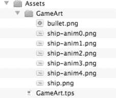

**图 6-5.** *Assets 文件夹的内容*

另一个让图像文件处理更简便的技巧是，将所有应打包到同一个纹理图集的图像文件放在同一个子文件夹中。在 Sprites06 项目的情况下，Assets 文件夹有一个名为 GameArt 的子文件夹，其中包含了所有被打包到游戏美术纹理图集中的图像文件。

当你在 TexturePacker 中刷新纹理图集时，TexturePacker 会简单地添加该文件夹中的新图像文件，因此你不再需要手动添加单个图像。TexturePacker 会为每个文件夹创建一个 `.tps`（TexturePacker 保存）文件。

**注意：** 如果你有一个名为 `bullet.png` 的图像，HD 版本必须命名为 `bullet-hd.png`，并且在 cocos2d 中，你需要使用字符串 `@"bullet.png"` 来加载文件。在 Retina 设备上，cocos2d 会自动加载 `-hd` 版本。

当你从单个图像迁移到纹理图集时，一个常见的错误是将文件名中包含 `-hd` 前缀的图像添加到纹理图集中。在这种情况下，为 SD 和 HD 版本生成的纹理图集可能被命名为 `bulletatlas.pvr.czz` 和 `bulletatlas-hd.pvr.czz`。但纹理图集中包含的图像（现在称为精灵帧）即使在 SD 纹理图集中也会全部命名为 `bullet-hd.png`。因此，你将不得不把所有在 cocos2d 中的引用从 `@"bullet.png"` 改为 `@"bullet-hd.png"`。为了避免这个问题，建议使用文件名中不带 `-hd` 后缀的 HD 版本来创建纹理图集。

更糟糕的做法是手动创建两个纹理图集：一个用于 SD 图像，仅包含不带 `-hd` 后缀的图像文件；另一个用于 HD 图像，仅包含带 `-hd` 后缀的图像文件。如果你随后在 cocos2d 中加载 `@"bullet.png"`，它将无法在 Retina 设备上找到 `-hd` 图像。如果你加载 `@"bullet-hd.png"`，则 SD 图像将无法加载。这是因为 SD 和 HD 的区别是在纹理图集层级进行的：你会有一个带 `-hd` 后缀的纹理图集和一个不带后缀的。纹理图集内部精灵帧的名称在 SD 和 HD 纹理图集中必须完全相同。


#### 使用 TexturePacker 创建纹理图集

使用 TexturePacker 非常直观，只需几个步骤即可完成，如图 图 6-6 所示。在大多数情况下，使用默认设置即可满足需求。

首先，你需要添加要纳入纹理图集的图像。之后随时可以添加更多图像或移除现有图像。点击 **添加精灵**（Add Sprites）或 **添加文件夹**（Add Folder）按钮，或直接将精灵或文件夹拖放到右侧窗格中。TexturePacker 能够加载大多数常见图形格式的图像。在此示例中，我们将添加所有飞船图像、动画帧以及子弹图像。你可以在 `Sprites06` 示例的 `Assets` 文件夹中找到它们。

直接将 `GameArt` 文件夹拖放到右侧窗格。操作完成后，精灵会立即出现在中央窗格中，这是纹理图集的实时预览。当你更改任何设置（包括图像优化和布局）时，预览会立即更新。

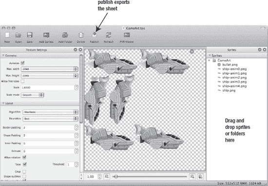

**图 6-6.** *使用 TexturePacker 的过程非常简单。*

在右下角的状态栏中，你还可以看到生成的纹理大小以及它在设备上将占用的内存。在此案例中，纹理图集为 512×512 像素，将占用 1MB 内存。此信息针对高清（HD）纹理。标清（SD）纹理尺寸约为 256×256 像素，内存消耗为四分之一，即 256KB。请注意，标清纹理图集不总是恰好为高清纹理宽度和高度的一半。这是因为某些布局特性（如边距）在创建标清纹理时不会缩放。

**注意：** 除非你的游戏专门针对第三代及更新的设备开发，否则不应使用 2048 的宽度或高度。较旧设备仅支持最大 1024×1024 像素的纹理尺寸。你可以在左侧窗格的“几何”部分限制 TexturePacker 生成的最大纹理尺寸。

TexturePacker 使用多种技巧优化纹理空间，以达到最佳填充率。首先，它会裁剪每个图像的透明边框像素。Cocos2d 通过在绘制精灵时，将裁剪区域作为偏移量添加到精灵位置来补偿这一操作。这样做有两个优点：减小纹理尺寸，并加快精灵的渲染速度。

你可能还会注意到某些图像被旋转了。TexturePacker 这样做是为了优化纹理图集空间的利用率。同样，Cocos2d 会在将图像加载到内存时恢复其原始方向来补偿。如果你添加了两个或更多完全相同的图像，TexturePacker 只会添加一个图像，以进一步节省纹理图集空间。如果这些图像通过不同的文件名被引用，你可以在 Cocos2d 中使用任意一个源文件名加载该图像。当纹理图集中的某个图像对应多个包含相同图像的源文件时，TexturePacker 会在中央窗格中在该图像上绘制一个小叠加层（一叠纸）。

如果你对 `Border Padding` 和 `Shape Padding` 设置感到好奇，它们决定了所有图像之间以及图像与图集边界之间保留多少像素的空间。默认的 2 像素可确保纹理图集中的所有图像在绘制时不会出现任何伪影。边距过小时，图像在游戏中显示时，其边缘周围可能会出现杂散像素。这些杂散像素的数量和颜色取决于纹理图集中其他图像周围的像素。这是一个技术问题，与图形硬件如何过滤纹理有关，唯一的解决方案是在纹理图集的所有图像之间留出一定量的边距。

在保存纹理图集之前，需要对 TexturePacker 的 `Output` 设置进行调整，如图 图 6-7 所示。

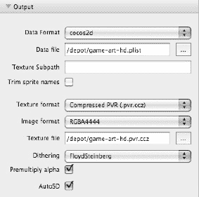

**图 6-7.** *TexturePacker 输出设置*

首先，确保数据格式设置为 `cocos2d`，因为 TexturePacker 也可用于其他游戏引擎。

对于数据文件，你应该指定一个位于项目 `Resources` 文件夹中的文件。确保文件名包含 `-hd` 后缀。在 `Sprites06` 项目中，文件名为 `game-art-hd.plist`。TexturePacker 会将高清纹理保存到指定的文件名，但对于标清版本会省略 `-hd` 后缀，这正是 Cocos2d 所需的数据格式。要让 TexturePacker 自动创建纹理图集的标清版本，你还需要勾选底部的 `AutoSD` 复选框。

最后，为导出的纹理图集选择 **纹理格式**（Texture Format）和 **图像格式**（Image Format）。推荐的 **纹理格式** 设置为 **Compressed PVR (.pvr.ccz)**，这是 iPhone 原生 PVR 格式的压缩版本。这种格式通常比 PNG 加载更快，并且如果你的图像是 16 位色深，压缩的 PVR 格式将生成比 PNG 更小的文件。无论图像的实际颜色位深如何，PNG 文件格式始终存储 32 位颜色值。

**注意：** 颜色深度、位深或每像素位数是存储像素颜色信息所用的位数。4 位色深允许图像中的每个像素拥有 16 种可能的颜色之一。使用 16 位色深，图像像素可以显示 65,536 种颜色范围。而使用 24 位色深，图像可以拥有数百万种颜色——数量之多，以至于 24 位色深的图像有时被称为*真彩色*图像。为什么这种格式通常被称为 32 位？因为大多数常见文件格式中额外的 8 位用于存储每个像素的不透明度。

我鼓励你阅读维基百科上关于颜色深度（[`http://en.wikipedia.org/wiki/Color_depth`](http://en.wikipedia.org/wiki/Color_depth)）和 RGB 颜色模型（[`http://en.wikipedia.org/wiki/RGB`](http://en.wikipedia.org/wiki/RGB)）的文章，以了解更多关于计算设备如何显示颜色的信息。

使用 PVR 格式时，你还应启用 **Premultiply alpha** 复选框，以避免在某些情况下精灵周围出现黑色边框。在你的项目应用委托中，在 Cocos2d 初始化之后、运行第一个场景之前，你应该让 Cocos2d 知道你的 PVR 图像使用了预乘 alpha：

**`// 为 PVR 纹理启用预乘 alpha 以避免伪影`**
**`[CCTexture2D PVRImagesHavePremultipliedAlpha:YES];`**

```
// 运行主场景
[[CCDirector sharedDirector] runWithScene: [GameScene scene]];
```

对于 **图像格式**（Image Format）设置，你有多种选择。默认格式是 `RGBA8888`，它提供最佳视觉效果。它提供 24 位色深和 8 位 alpha 通道。缺点是该格式渲染速度也最慢，尤其是在第一代和第二代设备上，建议回退到较低质量的图像格式以优先保证渲染速度。然而，提供设备特定的纹理图集变体操作起来很麻烦。你可能只想在旧设备上渲染较少的精灵，或者甚至完全放弃对这些设备的支持。

在质量、内存使用和渲染速度之间取得最佳平衡的是 `RGBA4444` 格式。它为每种颜色使用 4 位，为 alpha 通道使用 4 位。这是精灵最常用的图像格式。

如果透明度对你来说不重要，并且你希望获得更多颜色变化，则应使用 `RGB5551` 格式。它为每种颜色提供 5 位，仅为 alpha 通道提供 1 位。alpha 通道的 1 位只能设置为开或关，这意味着你的图像只能有完全透明或完全不透明的像素。换句话说，`RGB5551` 精灵无法与背景像素进行混合。


如果你完全不需要任何透明度（例如用于背景图片），可以使用 `RGB565` 格式，该格式为红色提供 5 位，绿色提供 6 位，蓝色通道提供 5 位。它不使用 Alpha 通道。绿色有 6 位而其他两个颜色通道只有 5 位，这与我们狩猎采集时代的背景有关。我们的视网膜更擅长区分绿色调，因此额外的位数被分配给了绿色通道，这样一来我们就更容易察觉到“缺失的颜色位数”。

`PVRTC2` 和 `PVRTC4` 图像格式分别提供每像素 2 位和 4 位，且没有 Alpha 通道。这种格式应仅用于单调或深色背景图像，并且当你确实需要节省内存和提升渲染速度时使用，因为这些格式会严重影响图像质量。可以想象一下 JPEG 图像在较低质量设置下的伪影。

“抖动”选项允许你在图像格式需要降低色彩深度时优化图像质量。抖动通过在大面积区域内随机分布具有相似色调的像素来模拟渐变。这能有效减少图像色彩深度降低时的“条带”效应。由于所有抖动选项在 TexturePacker 预览中都是实时应用的，且不会影响源图像，你可以尝试不同的抖动算法，以找出提供最佳质量的那一种。

**提示：** 在评估抖动算法时，请记住最终的质量测试当然是在设备上运行你的游戏。有些在电脑屏幕上清晰可见的伪影，在设备上可能并不明显。这主要是因为电脑屏幕的色彩配置文件与设备不同，原因包括手动调整（例如亮度、对比度、色调）、显示技术的限制，或者显示器老化导致的色彩鲜艳度变化。这也意味着单一设备并不能代表游戏的最终视觉效果。至少，你应该在设备亮度设置为最低和最高水平时测试游戏。

完成**输出**设置后，只需点击**发布**，TexturePacker 就会将 HD 和 SD 纹理以及相应的 plist 文件写入你的 Resources 文件夹。

#### 将纹理图集与 cocos2d 一起使用

接下来要做的是将新的纹理图集添加到 Xcode 项目的 Resource 组中。Cocos2d 只需要 `game-art-hd.pvr.ccz`、`game-art.pvr.ccz`、`game-art-hd.plist` 和 `game-art.plist` 这四个文件用于纹理图集。TexturePacker 的 `.tps` 文件和单个源图像文件不应添加到项目中。代码清单 6-13 中的代码现在取代了代码清单 6-11 中的代码。

**代码清单 6-13.** *飞船类现在使用纹理图集作为其初始帧和动画*

```
// Load the texture atlas sprite frames; this also loads the Texture with the same name
CCSpriteFrameCache* frameCache = [CCSpriteFrameCache sharedSpriteFrameCache];
[frameCache addSpriteFramesWithFile:@"game-art.plist"];

// Loading the ship's sprite using a sprite frame name (e.g., the file name)
if ((self = [super initWithSpriteFrameName:@"ship.png"]))
{
    // Load the ship's animation frames
    NSMutableArray* frames = [NSMutableArray arrayWithCapacity:5];
    for (int i = 0; i < 5; i++)
    {
        NSString* file = [NSString stringWithFormat:@"ship-anim%i.png", i];

        CCSpriteFrame* frame = [frameCache spriteFrameByName:file];
        [frames addObject:frame];
    }

    // Create an animation object from all the sprite animation frames
    CCAnimation* anim = [CCAnimation animationWithFrames:frames delay:0.08f];

    // Run the animation by using the CCAnimate action
    CCAnimate* animate = [CCAnimate actionWithAnimation:anim];
    CCRepeatForever* repeat = [CCRepeatForever actionWithAction:animate];
    [self runAction:repeat];
}
```

在代码的最开始，我将 `sharedSpriteFrameCache` 赋值给一个局部变量。这样做的唯一原因是 `[CCSpriteFrameCache sharedSpriteFrameCache]` 这个单例访问器写起来相当冗长。

要加载纹理图集，你可以使用 `CCSpriteFrameCache` 的方法 `addSpriteFramesWithFile`，并向它传递该纹理图集的 `.plist` 文件名。`CCSpriteFrameCache` 会加载精灵帧，同时也会尝试加载纹理。Cocos2d 会自动为 Retina 显示屏设备尝试加载带有 `-hd` 后缀的文件。

**注意：** 如果你使用较大的纹理图集纹理（尺寸为 1024×1024 或更大），你应该在游戏开始前加载此纹理。加载这样大的纹理需要一点时间（在最坏的情况下，会使游戏冻结几秒钟）。

由于 `Ship` 类继承自 `CCSprite`，并且我希望它使用纹理图集中的 `ship.png` 图像，因此我将其初始化方法改为使用 `initWithSpriteFrameName`。这与使用精灵帧名称从纹理图集初始化标准 `CCSprite` 的代码完全相同。

```
CCSprite* sprite = [CCSprite spriteWithSpriteFrameName:@"ship.png"];
```

如果你加载了多个纹理图集，并且其中只有一个包含名为 `ship.png` 的精灵帧，Cocos2d 仍然会找到该帧，并为精灵使用正确的纹理。本质上，你可以像处理图像文件名一样，通过名称来使用精灵帧，但你不需要知道哪个纹理包含了实际的图像（当然，除非你使用 `CCSpriteBatchNode`，它要求其所有子节点使用相同的纹理）。

在代码清单 6-13 中，我摆脱了初始化 `CCSpriteFrame` 对象所需的大部分额外代码。不再需要加载 `Texture2D` 并定义纹理的尺寸。相反，我可以简单地调用 `[CCSpriteFrame spriteFrameByName:file]` 来创建具有相应名称的精灵帧。


#### 更新 CCAnimation 辅助类别

虽然使用纹理图集可以显著减少创建 `CCAnimation` 的代码量，但将这些代码封装到 `CCAnimationHelper` 类中仍然值得。毕竟，一行代码总比五行代码更简洁，特别是当你需要在各处重复使用同样的五行代码时。闲话少叙，代码清单 6–14 展示了扩展后的 `CCAnimation` 辅助接口声明，它添加了 `animationWithFrame` 方法。

**代码清单 6–14.** *CCAnimation 辅助类别的 @interface*

```objectivec
@interface CCAnimation (Helper)
+(CCAnimation*) animationWithFile:(NSString*)name
                       frameCount:(int)frameCount
                            delay:(float)delay;

+(CCAnimation*) animationWithFrame:(NSString*)frame
                        frameCount:(int)frameCount
                             delay:(float)delay;
@end
```

这段代码本质上与 `animationWithFile` 方法使用相同的参数，区别在于它使用精灵帧而不是文件名。其实现并不复杂，与代码清单 6–15 中展示的 `animationWithFile` 方法非常相似。

**代码清单 6–15.** *animationWithFrame 辅助方法简化了动画创建过程*

```objectivec
// 从精灵帧创建动画
+(CCAnimation*) animationWithFrame:(NSString*)frame
                        frameCount:(int)frameCount
                             delay:(float)delay
{
    // 将飞船的动画帧加载为纹理并创建精灵帧
    NSMutableArray* frames = [NSMutableArray arrayWithCapacity:frameCount];
    for (int i = 0; i < frameCount; i++)
    {
        NSString* file = [NSString stringWithFormat:@"%@%i.png", frame, i];
        CCSpriteFrameCache* frameCache = [CCSpriteFrameCache sharedSpriteFrameCache];
        CCSpriteFrame* frame = [frameCache spriteFrameByName:file];
        [frames addObject:frame];
    }

    // 返回由所有精灵动画帧组成的动画对象
    return [CCAnimation animationWithFrames:frames delay:delay];
}
```

现在最大的优势再次体现：你可以只使用一行代码，通过精灵帧名称从纹理图集创建动画：

```objectivec
// 从所有精灵动画帧创建动画对象
CCAnimation* anim = [CCAnimation animationWithFrame:@"ship-anim"
                                         frameCount:5
                                              delay:0.08f];
```

然而，更大的优势在于，你现在可以将动画作为单个文件处理，并在后期才创建纹理图集。你只需将一行代码从使用 `animationWithFile` 改为 `animationWithFrame` 方法。这让你能够使用单个文件快速制作动画原型，只有当你对效果满意后，再将动画帧打包到纹理图集中，并从中加载动画图像。

你可以在 `Sprites06_WithAnimHelper` 项目中找到这段代码。

#### 合而为一，一应俱全

只要有可能，你应该将游戏的所有图像放入一个纹理图集，或尽可能少的图集中。从工作流程和性能角度来看，使用三个 1024×1024 尺寸的纹理图集比使用 20 个较小的图集更加高效。

与代码不同（代码应拆分为清晰的逻辑组件），使用纹理图集时，你的目标应是尽可能多地将图像放入同一个纹理图集，同时尽量减小每个纹理图集中的浪费空间。

为玩家的图像使用一个纹理图集，为怪物 A、B、C 及其动画使用另一个图集，似乎是合乎逻辑的。但这会导致更多的绘制调用。然而，只有当你对每个游戏对象都有大量图像，并且希望随时有选择地加载某些图像到内存时，这种方法才有帮助。一个典型的场景是射击游戏中的不同世界，你知道每个世界有不同类型敌人。在这种情况下，不将不同世界的敌人混杂在同一个纹理图集中是合理的。否则，仅出于组织目的，你不应按游戏对象拆分纹理图集，而应尽可能填满每个纹理图集。

只要游戏图像能塞进三到四个 1024×1024 尺寸的纹理图集，你就应该将所有图像放入这些图集并预先加载。这会为纹理占用 12MB 到 16MB 内存。你的实际程序代码和音频文件等其他资源不会占用太多空间，因此即使在只有 24MB 纹理内存的第一代和第二代 iOS 设备上，你也能将这些纹理图集保留在内存中。较新的设备则没有纹理内存限制。

然而，一旦超出这个范围，你就需要更好的策略来管理纹理内存。如前所述，一种策略是将游戏图像按世界划分，仅加载当前世界所需的纹理图集。这会在加载新世界时引入短暂延迟，而这正是第 5 章中描述的 `LoadingScene` 的用武之地。

由于 cocos2d 会自动缓存所有图像，你需要一种方法来专门卸载确定不再需要的纹理。你可以依靠 cocos2d 为你处理：

```objectivec
[[CCSpriteFrameCache sharedSpriteFrameCache] removeUnusedSpriteFrames];
[[CCTextureCache sharedTextureCache] removeUnusedTextures];
```

显然，只有当你希望移除未使用的纹理时，才应调用这些方法。这通常在场景切换后执行，而不应在游戏进行中执行。请记住，场景切换会导致前一个场景在新场景初始化完成后才被释放。这意味着你不能在场景的 `init` 方法中使用 `removeUnused` 方法——除非你在两个场景之间使用了第 5 章中的 `LoadingScene`，在这种情况下，你应该扩展它，使其在替换为新场景之前先移除未使用的纹理。

如果你绝对想在加载新纹理之前从内存中移除所有纹理，则应改用清除方法：

```objectivec
[CCSpriteFrameCache purgeSharedSpriteFrameCache];
[CCTextureCache purgeSharedTextureCache];
```

### 总结

在本章中，你学习了如何使用 `CCSpriteBatchNode` 来更快地渲染使用相同纹理的多个精灵，无论该纹理是单个图像还是纹理图集中的精灵帧。

从 `CCSprite` 继承游戏对象也会带来一些细微的差异和陷阱，我在本章前面部分进行了演示，随后转向展示如何创建精灵动画。由于创建动画的代码非常复杂，我以 `CCAnimationHelper` 类别的形式给出了解决方案。

我还向你展示了如何使用纹理图集，以及为什么及如何应使用它们。当然，提到“纹理图集”就不能不提 TexturePacker。它是创建和修改纹理图集的最佳工具，如果你不想花钱购买，仍然可以使用免费版本，只是缺少高级功能。

在下一章中，你将着手开发下一款游戏，我们将致力于让射击游戏具备可玩性。

## 第 7 章


# 滚动之乐

延续上一章的游戏初始内容，现在我想将其打造成一款真正的射击游戏。首要任务是让玩家的飞船可控。加速度计控制在此场景下并不适用；虚拟手柄则更为合适。不过，我们不必重新发明轮子，将使用一个名为 `SneakyInput` 的酷炫源代码包，为这款 `cocos2d` 游戏添加虚拟手柄。

让玩家飞船移动只是其一。我们还希望背景能滚动，从而营造出向某一方向移动的视觉效果。为此，我们将自行实现视差滚动方案，因为 `CCParallaxNode` 存在局限，无法支持无限滚动的视差背景。

此外，我将结合你在前一章学到的纹理图集和精灵批处理知识进行讲解。游戏中所有图形将整合到同一个纹理图集中，因为使用纹理图集时无需单独对图像进行分组。

### 高级视差滚动

我之前提到过，`CCParallaxNode` 的局限性在于它不支持无限滚动。针对这款射击游戏，我们将添加一个 `ParallaxBackground` 节点来实现这一功能。此外，它还将使用 `CCSpriteBatchNode` 来加速背景图像的渲染。

#### 将背景创建为条带

首先，我想说明一下我是如何创建用于产生视差效果的背景条带的。这对于理解 `TexturePacker` 创建的纹理图集如何帮你节省内存和提升性能，以及如何节省单独定位各条带的时间至关重要。请看 图 7-1；它展示了由多个独立视差层组成的海景背景图层。该图片也位于 `ScrollingWithJoy01` 项目的 Assets 文件夹中，文件名为 `background-parallax.xcf`。

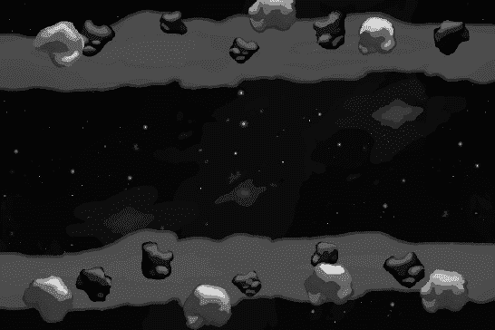

**图 7-1.** *视差滚动背景的源图像*

在图像编辑程序 Seashore 中，每条条带都位于独立的图层上。在 图 7-2 中你可以看到各个图层，如果查看 Assets 文件夹，你会注意到存在名为 `bg0.png` 至 `bg6.png` 的图片，它们对应组成背景的七条独立条带。

采用这种方式创建视差背景图像有若干原因。你可以整体创建图像，但又能将每个图层保存为独立文件。所有这些文件的大小均为 960×640 像素，乍看之下可能有些浪费。但你不会将这些独立图像直接添加到游戏中，而是将它们放入纹理图集。由于 `TexturePacker` 会去除每张图像周围透明的空白区域，它会将各条带压缩至最小尺寸。你在 图 7-3 中可以看到这一点。

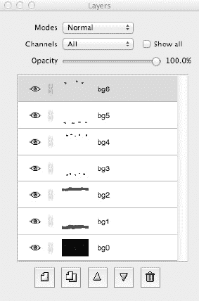

**图 7-2.** *背景的每条条带位于独立图层上。这有助于创建独立图像并在游戏中进行定位。*

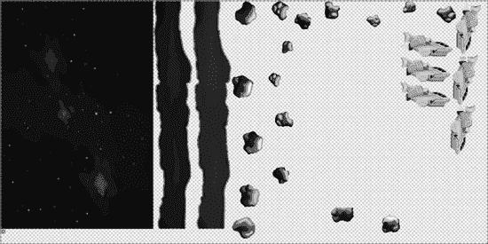

**图 7-3.** *背景条带在纹理图集中的呈现效果*

将条带分割成独立图像不仅有助于按正确的 z 顺序绘制图像。严格来说，图像 `bg5.png` 和 `bg6.png` 可以处于相同的 z 顺序，因为它们并不重叠，但我还是选择将它们保存为单独的文件。在 图 7-3 中，你可以看到这两个文件作为最上方的两条条带。你会发现它们在纹理图集中实际占用的空间非常小，这是因为 `TexturePacker` 能够移除这些图像周围大部分透明的部分。

现在假设我将这两条条带保留在同一张 960×640 的图像中——一条位于图像顶部，另一条位于底部，两者之间留有大片的透明区域。`TexturePacker` 无法移除这两个精灵之间的透明部分，因此它们会以 960×640 的完整图像保留在纹理图集中，这比作为独立图像所占用的空间要大得多。

将条带分割成独立图像也有助于维持高帧率。iOS 设备的**填充率**（即每帧能绘制的像素数量）非常有限。由于图像可能相互重叠，而且这种情况经常发生，iOS 设备通常每帧需要多次绘制同一个像素。极端情况是一张全屏图像叠在另一张全屏图像之上。你只能看到两张图像中的一张，但设备实际上必须同时绘制这两张。这种技术术语称为**过度绘制**。将背景分离成尽可能少重叠的独立条带，可以减少需要绘制的像素数量。

**提示：** 使用 16 位纹理（`RGB565`、`RGBA5551` 和 `RGBA4444`）乃至 PVR 压缩纹理，可以提升游戏的渲染性能。当然，这会损失一些图像质量，但在许多情况下，这种损失在 iPhone 屏幕上几乎难以察觉，尽管在电脑屏幕上可能会看到一些伪影。`TexturePacker` 让你能够降低图像的颜色深度，同时通过抖动技术保留大部分图像质量。如果遇到加载时间过长的问题，值得尝试将图像保存为压缩的 `pvr.czz` 格式，因为这种特定图像文件格式的加载速度明显快于其他格式。


#### 在代码中重构背景

你可能现在想知道，如何在不花费大量时间精确定位这些剥离后的图片的情况下，在源代码中将它们重新组合起来。答案是：你不必这样做。由于所有这些图片都以全屏模式保存，`TexturePacker` 会记住它们的偏移量。你真正需要做的只是将每张图片居中放置在屏幕上，它们就会出现在正确的位置。

让我们来看看 `ScrollingWithJoy01` 项目中新增的 `ParallaxBackground` 节点的代码。头文件相当简单明了：

```
@interface ParallaxBackground : CCNode
{
    CCSpriteBatchNode* spriteBatch;
    int numSprites;
}
@end
```

我只选择保留一个对 `CCSpriteBatchNode` 的引用，因为我会在代码中频繁访问它。将节点作为成员变量存储，比通过 `getNodeByTag` 方法向 cocos2d 请求节点要快。如果你每帧都这样做，可以节省一些 CPU 周期。这并不算多大的优化，当然也不值得保留几百个成员变量。这只是一个小优化，在本例中使用起来非常方便。

在 `ParallaxBackground` 类的 `init` 方法中，创建了 `CCSpriteBatchNode`，并从纹理图集中添加了全部七张背景图片，如 代码清单 7–1 所示。

**代码清单 7–1.** 加载背景图片

```
CGSize screenSize = [[CCDirector sharedDirector] winSize];

// 通过添加纹理来获取游戏纹理图集纹理
CCTexture2D* gameArtTexture = [[CCTextureCache sharedTextureCache]
    addImage:@"game-art.pvr.czz"];

spriteBatch = [CCSpriteBatchNode batchNodeWithTexture:gameArtTexture];
[self addChild:spriteBatch];

numSprites = 7;

// 添加六个不同的图层对象并将它们定位在屏幕上
for (int i = 0; i < numSprites; i++)
{
    NSString* frameName = [NSString stringWithFormat:@"bg%i.png", i];
    CCSprite* sprite = [CCSprite spriteWithSpriteFrameName:frameName];
    sprite.position = CGPointMake(screenSize.width / 2, screenSize.height / 2);
    [spriteBatch addChild:sprite z:i];
}
```

你会看到，我首先将 `game-art.pvr.czz` 纹理图集图像添加到 `CCTextureCache` 中。实际上，这个纹理图集已经在 `GameScene` 类中添加过了，为什么我要在这里再次添加呢？原因很简单：我需要 `CCTexture2D` 对象来创建 `CCSpriteBatchNode`，而再次添加相同的图像是从 `CCTextureCache` 中检索已缓存图像的唯一方法。这并不会第二次加载纹理；`CCTextureCache` 单例知道纹理已经被加载过，并返回缓存版本，这是一个快速操作。只是没有特定的 `getTextureByName` 方法这一点不太寻常，但事实就是这样。

创建并设置好 `CCSpriteBatchNode` 后，下一步是加载七张独立的背景图片。我特意将它们从 0 到 6 编号，这样可以使用 `stringWithFormat` 以一种非常高效的方式将文件名创建为字符串：

```
NSString* frameName = [NSString stringWithFormat:@"bg%i.png", i];
```

有了这个精灵的 `frameName`，我像往常一样创建一个 `CCSprite`，然后将其定位在屏幕中央：

```
sprite.position = CGPointMake(screenSize.width / 2, screenSize.height / 2);
```

当然，一旦你创建了这个项目的 iPad 版本，由于这些图片是为 960×640 分辨率的屏幕设计的，它们将不再完美适配。如果你想要创建 iPad 版本，可以遵循完全相同的步骤，只是将原始图像的大小设为 1024×768。然后，你可以轻松地从这些图像中缩小出 960×640 的版本，因为只有少量额外的重叠像素。

**提示：** 在 cocos2d 中重构原始图像几乎不费吹灰之力，这完全归功于 `TexturePacker` 帮你保存了图像偏移量。这也是创建游戏屏幕布局的绝佳方式。你可以让美术师将每个屏幕设计为独立的图层，数量根据需要而定。然后，每个图层被导出为带透明度的独立全屏文件。接着，你根据这些文件创建一个纹理图集，最终在 cocos2d 中实现美术师设想的屏幕设计，无需费心定位单个文件，也不会浪费内存。

因为 `ParallaxBackground` 类继承自 `CCNode`，我只需要将它添加到 `GameScene` 层，就能将 `ParallaxBackground` 加入游戏，如下所示：

```
ParallaxBackground* background = [ParallaxBackground node];
[self addChild:background z:-1];
```

这替换了上一章中作为占位符使用的 `CCLayerColor` 和背景 `CCSprite`。

#### 移动 ParallaxBackground

在 `ScrollingWithJoy01` 项目中，我还添加了一个快速而粗糙的背景条纹滚动效果。它确实显示出了视差效果，尽管图片很快就会离开屏幕，露出背后的空白背景。图 7–4 并不完全是我设想的样子，但我正在接近目标。

**注意：** 你也会注意到 图 7–4 看起来完全不像 图 7–1 或游戏项目。图 7–4 使用了虚拟图形来更好地说明视差图片“离开”屏幕的效果。你会在动态中更清楚地看到这种效果。

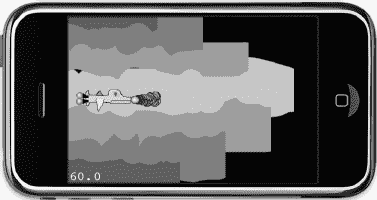

**图 7–4.** 背景条纹正在移动，但它们也会永远离开屏幕。

尽管如此，代码清单 7–2 显示，作为首次测试，让背景滚动的代码出乎意料地简单。

**代码清单 7–2.** 移动背景条纹

```
-(void) update:(ccTime)delta
{
    CCSprite* sprite;
    CCARRAY_FOREACH([spriteBatch children], sprite)
    {
        CGPoint pos = sprite.position;
        pos.x -= (scrollSpeed + sprite.zOrder) * (delta * 20);
        sprite.position = pos;
    }
}
```

每帧会从每张背景图片的 `x` 坐标中减去一点值，使其从右向左滚动。每张图片移动的距离取决于预定义的 `scrollSpeed` 加上精灵的 `zOrder`。delta 乘法器用于使滚动速度不受帧率影响，然后再乘以 20 以使滚动速度合理且足够快。离屏幕更近的图片滚动得更快。然而，使用 `zOrder` 属性会导致本应在同一视觉深度的条纹以不同速度滚动。

移动距离还会乘以 **delta 时间**，以使滚动速度不受帧率影响。delta 时间本身只是一个很小的分数——它是两次 `update` 方法调用之间的时间间隔。在精确的每秒 60 帧（fps）下，它是 1/60 秒，即 delta 时间为 0.167 秒。因此，我将 delta 乘以 20 只是为了获得一个合理的滚动速度；否则，图片会移动得太慢。


##### 视差速度系数

同一颜色的条纹需要以相同的速度滚动，并且条纹必须能够重复，这样背景才不会露出来。针对这些问题，我在`ScrollingWithJoy02`项目中提供了解决方案。

第一个改动涉及滚动速度。我决定使用`CCArray`来存储每条条纹移动的速度系数。虽然还有其他解决方案，但这种方法能让我说明`CCArray`以及所有 iOS SDK 集合类的一个关键问题：它们只能存储对象，而不能存储诸如整数和浮点数之类的值。

解决方法是先将数值装箱到`NSNumber`对象中。以下代码是新添加的`CCArray* speedFactors`，其中存储了浮点数值。该数组在`ParallaxBackground`类的头文件中定义：

```
@interface ParallaxBackground : CCNode
{
    CCSpriteBatchNode* spriteBatch;
    int numStripes;
    CCArray* speedFactors;
    float scrollSpeed;
}
@end
```

随后，在`ParallaxBackground`类的`init`方法中用这些系数填充该数组。请注意如何使用`[NSNumber numberWithFloat:]`将浮点值存储到数组中：

```
// 初始化包含各条纹滚动系数的数组
speedFactors = [[CCArray alloc] initWithCapacity:numStripes];
[speedFactors addObject:[NSNumber numberWithFloat:0.3f]];
[speedFactors addObject:[NSNumber numberWithFloat:0.5f]];
[speedFactors addObject:[NSNumber numberWithFloat:0.5f]];
[speedFactors addObject:[NSNumber numberWithFloat:0.8f]];
[speedFactors addObject:[NSNumber numberWithFloat:0.8f]];
[speedFactors addObject:[NSNumber numberWithFloat:1.2f]];
[speedFactors addObject:[NSNumber numberWithFloat:1.2f]];
NSAssert([speedFactors count] == numStripes, @"speedFactors 个数不匹配！");
```

最后的断言只是针对人为失误的安全检查。试想一下，你可能因为某些原因添加或移除背景条纹，却忘记调整添加到`speedFactors`数组中的数值个数。如果你忘记修改`speedFactors`的初始化代码，断言会提醒你，而不是让游戏看似随机地崩溃。

在图 7-5 中，你可以看到每个条纹应用了哪个速度系数。速度系数较高的条纹比系数较低的条纹移动得更快，从而产生了视差效果。这里再次使用占位图形，以便清晰显示每一条条纹。

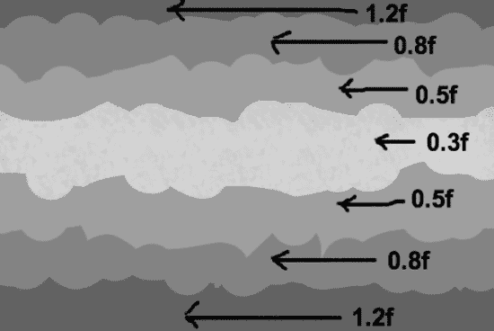

**图 7-5.** *应用于各背景条纹的速度系数*

`speedFactors`数组是通过`alloc`创建的，因此其内存也必须被释放，这在新添加的`dealloc`方法中完成：

```
-(void) dealloc
{
    [speedFactors release];
    [super dealloc];
}
```

为了使用新引入的速度系数，`update`方法已修改如下：

```
-(void) update:(ccTime)delta
{
    CCSprite* sprite;
    CCARRAY_FOREACH([spriteBatch children], sprite)
    {
        NSNumber* factor = [speedFactors objectAtIndex:sprite.zOrder];

        CGPoint pos = sprite.position;
        pos.x -= scrollSpeed * [factor floatValue] * (delta * 50);
        sprite.position = pos;
    }
}
```

基于精灵的`zOrder`属性，从`speedFactors`数组中获取一个速度系数`NSNumber`。该系数将与`scrollSpeed`相乘，以加速或减速各条纹的移动。你不能直接对`NSNumber`对象进行乘法运算，因为它是一个类实例，内部存储着浮点数、整数、字符等基本数据类型。`NSNumber`提供了`floatValue`方法来返回其浮点值，当然它也支持多种不同的取值方法。你也可以使用`intValue`，即使这个`NSNumber`存储的是浮点值，这本质上相当于将浮点数强制转换为整数。同样，delta 时间也被考虑在内，以使滚动速度与帧率无关。

通过使用`speedFactors`数组并为相同颜色的条纹赋予相同的系数，背景条纹现在将按预期移动。但还有一个问题需要解决，那就是如何实现无限滚动。


##### 滚动至无限远方

同样在 `ScrollingWithJoy02` 工程中，我们迈出了实现无尽滚动的第一步。正如你将在代码清单 7–3 中看到的，我仅仅在 `CCSpriteBatchNode` 中添加了七个额外的背景条纹，不过其设置方式略有不同。

**代码清单 7–3.** *添加屏幕外背景图像*

```
// 添加七个额外条纹，翻转它们，并让它们的相邻条纹彼此对齐
for (int i = 0; i < numStripes; i++)
{
    NSString* frameName = [NSString stringWithFormat:@"bg%i.png", i];
    CCSprite* sprite = [CCSprite spriteWithSpriteFrameName:frameName];

    // 将新精灵定位在屏幕宽度右侧一个屏幕的位置
    sprite.position = CGPointMake(screenSize.width + screenSize.width / 2,
        screenSize.height / 2);

    // 翻转精灵，使其与相邻条纹完美对齐
    sprite.flipX = YES;

    // 使用偏移了 numStripes 的相同标签添加精灵
    [spriteBatch addChild:sprite z:i tag:i + numStripes];
}
```

其思路是每种类型再添加一个条纹。这些条纹的定位方式使其与第一个条纹位置的右端对齐。实际上，这会将背景条纹的总宽度加倍，足以实现无尽滚动。我马上就会谈到这一点。

首先，我需要指出，这些新相邻图像的 X 坐标是被翻转过的（沿 y 轴镜像）。这样做是为了让图像在视觉上对齐时能够自然衔接，避免出现明显的接缝。这些新图像还被赋予了不同的标签编号，该编号偏移了当前使用的条纹数量。这样一来，通过标签编号加减 `numStripes`，就能轻松获取相邻的条纹。

目前，背景图像在显示图像后方空白画布之前，其滚动距离仅仅稍长了一些。`ScrollingWithJoy03` 工程完成了这项任务，并实现了完全无限的滚动。但首先，需要更改条纹的 `anchorPoint` 属性，以使操作更简便一些。现在，`x` 位置统一设为 0：

```
sprite.anchorPoint = CGPointMake(0, 0.5f);
sprite.position = CGPointMake(0, screenSize.height / 2);
```

对于次要的、被翻转的条纹也是如此，现在它们只需要偏移屏幕宽度即可：

```
sprite.anchorPoint = CGPointMake(0, 0.5f);
sprite.position = CGPointMake(screenSize.width, screenSize.height / 2);
```

条纹的 `anchorPoint` 从默认的 `(0.5f, 0.5f)` 更改为 `(0, 0.5f)`。这使得处理视差精灵更加方便，因为在当前特定情况下，你不需要再去考虑纹理原点与精灵 `x` 位置不在同一点的问题。图 7–6 展示了这样做如何能更简便地计算 `x` 位置。

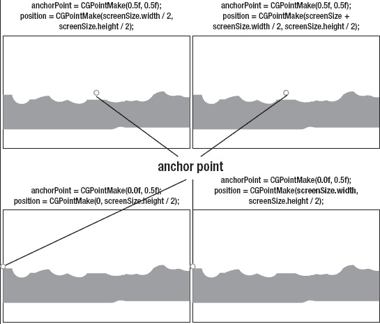

**图 7–6.** *为了简便起见，将锚点移至左侧*

你可以在代码清单 7–4 中看到，这在修改后的 `update` 方法中非常有用，该方法现在为我们提供了无尽滚动效果。

**代码清单 7–4.** *无缝移动图像对*

```
-(void) update:(ccTime)delta
{
    CCSprite* sprite;
    CCARRAY_FOREACH([spriteBatch children], sprite)
    {
        NSNumber* factor = [speedFactors objectAtIndex:sprite.zOrder];
        CGPoint pos = sprite.position;
        pos.x -= scrollSpeed * [factor floatValue] * (delta * 50);

        // 当条纹超出边界时重新定位
        if (pos.x < -screenSize.width)
        {
            pos.x += screenSize.width * 2;
        }

        sprite.position = pos;
    }
}
```

现在只需检查条纹的 `x` 位置是否小于负屏幕宽度，如果是，则将其加上两倍的屏幕宽度。其本质是，将刚离开屏幕左侧的精灵移动到屏幕右侧、刚好在屏幕外的位置。这一过程由相同的两个精灵无限重复，从而产生无尽滚动的效果。

**提示：** 请注意，屏幕背景在滚动，但飞船保持不动。缺乏经验的游戏开发者常常会误以为，要实现游戏对象在玩家角色穿越游戏世界时从其身旁掠过的效果，屏幕上的所有内容都需要滚动。然而，更简便的方法是移动背景层，同时将玩家角色固定在原位，从而在屏幕上营造出物体移动的错觉。利用这种视觉错觉的知名游戏示例包括 `Super Turbo Action Pig`、`Canabalt`、`Super Blast`、`Doodle Jump` 和 `Zombieville USA`。通常，即将滚入视线的游戏对象会在出现前不久随机生成，并在离开屏幕后从游戏中移除。在第 11 章中，我将利用同样的效果，让玩家角色保持在屏幕中心，而只有玩家脚下的游戏世界在真正移动，从而给玩家一种在游戏世界中自由移动的印象。

##### 修复闪烁问题

到目前为止，一切顺利。只剩下一个问题。如果你仔细观察，会发现两个背景条纹拼接处出现了一条垂直的闪烁线。那是它们彼此对齐的地方。这条线是由于子像素渲染结合其位置的四舍五入误差造成的。有时，一个 1 像素宽的间隙会出现，仅仅持续一瞬间。但这仍然很显眼，对于商业品质的游戏来说需要消除。

最简单的解决方案是让条纹重叠 1 像素。在 `ScrollingWithJoy04` 工程中，我将翻转背景条纹的初始 `x` 位置减去了 1 像素，如下所示：

```
sprite.position = CGPointMake(screenSize.width - 1, screenSize.height / 2);
```

这还需要更新 `update` 方法中的条纹重新定位代码，以便将条纹向左定位的位置比以前多 2 像素：

```
// 当条纹超出边界时重新定位
if (pos.x < -screenSize.width)
{
    pos.x += (screenSize.width * 2) - 2;
}
```

为什么是 2 像素？这是因为翻转条纹的初始位置已经向左移动了 1 像素，所以每次它们翻转时，我们都必须将它们全部向左移动 2 像素，才能保持相同的距离并维持 1 像素的重叠。

另一种解决方案是只更新当前最左侧精灵的位置，然后找到与之右侧对齐的精灵，并将其偏移正好一个屏幕宽度。这样也能避免四舍五入误差。图 7–7 展示了使用最终图形完成后的效果。

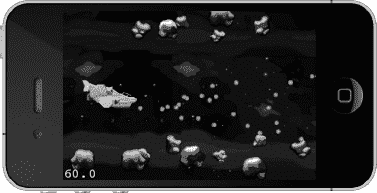

**图 7–7.** *成果：无限滚动的视差背景*


##### 重复，重复，再重复

本章中还有一个值得一提的巧妙技巧。你可以将任意纹理设置为在某个矩形区域内重复。如果将该区域设得足够大，就可以让纹理近乎无限地重复。至少可以覆盖数千个像素或几十个屏幕区域，而不会对性能或内存使用造成任何影响。

这个技巧的关键在于使用 OpenGL 支持的 `GL_REPEAT` 纹理参数。但它仅适用于边长恰好为 2 的幂次方的正方形图像，例如 32×32 或 128×128 像素。代码清单 7–5 展示了相关代码。

**代码清单 7–5.** *使用 GL_REPEAT 实现重复背景*

```
CGRect repeatRect = CGRectMake(-5000, -5000, 5000, 5000);
CCSprite* sprite = [CCSprite spriteWithFile:@”square.png” rect:repeatRect];
ccTexParams params =
{
    GL_LINEAR, // 纹理缩小函数
    GL_LINEAR, // 纹理放大函数
    GL_REPEAT, // 纹理在 X 坐标上的环绕方式
    GL_REPEAT  // 纹理在 Y 坐标上的环绕方式
};
[sprite.texture setTexParameters:&params];
```

在此例中，精灵必须使用一个 `rect` 来初始化，该矩形决定了精灵将占据的区域。`ccTexParams` 结构体通过将纹理坐标的环绕参数设置为 `GL_REPEAT` 进行初始化。如果你不理解这些内容，也无需担心。这些 OpenGL 参数随后会通过 `CCTexture2D` 的 `setTexParameters` 方法设置到精灵的纹理上。

最终结果是一个平铺区域，反复重复显示相同的 `square.png` 图像。如果移动精灵，`repeatRect` 覆盖的整个区域也会随之移动。你可以利用这个技巧移除最底部的背景条，并用一个更小的图像替代，使其简单地重复。我将把这个留给你作为练习。

### 虚拟摇杆

由于 iOS 设备均使用触摸屏进行输入，并且没有传统移动游戏设备上的方向键或模拟摇杆，因此我们需要一种称为*虚拟摇杆*的东西。它通过允许你触摸屏幕上显示数字方向键或摇杆的位置，并在其上滑动手指来控制屏幕上的动作，从而模拟数字或模拟摇杆的行为。按钮也是触摸屏上的指定区域，你可以点击或按住它们来触发屏幕上的操作。图 7–8 展示了一个工作中的虚拟摇杆。

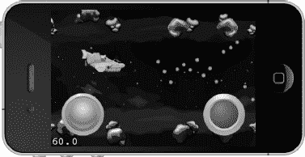

**图 7–8.** *使用 SneakyInput 创建的、带有皮肤的模拟摇杆和开火按钮*

**警告：** 虚拟摇杆在外观上模仿了摇杆控制器，但在手感上永远无法比拟。用户仍然是在触摸一个平坦的表面，手指无法获得关于虚拟摇杆移动了多远或虚拟按钮是否正确按下的反馈。许多玩家在使用虚拟摇杆控制游戏时会感到不适。一个普遍的经验法则是，虚拟摇杆最多不应超过两到三个控制元件，通常是一个摇杆/方向键（有时限制为两个方向）和一两个按钮。如果再增加，你的游戏操控难度将会呈指数级增长。

#### 介绍 SneakyInput

长期以来，许多开发者都面临过实现虚拟摇杆的问题。实现的方式有很多种，而失败的方式甚至更多。但既然已经有了现成的解决方案，为什么还要在那上面耗费时间呢？

这通常是一个明智的建议。在编写任何看起来相当常见且可能已被他人攻克过的代码之前，总是先检查一下是否有可用的通用解决方案，这样你就可以直接使用，而不必花费大量时间自己创建。在这种情况下，SneakyInput 简直好得让人无法忽视。

SneakyInput 由 Nick Pannuto 创建，皮肤示例由 CJ Hanson 提供。SneakyInput 是一款开源软件，可免费下载，但如果你喜欢这个产品，请考虑通过此链接向 Nick Pannuto 捐款：
[`http://pledgie.com/campaigns/9124`](http://pledgie.com/campaigns/9124)。

SneakyInput 的源代码托管在社交编码网站 GitHub 上，链接为：
[`http://github.com/sneakyness/SneakyInput`](http://github.com/sneakyness/SneakyInput)。

从 GitHub 下载源代码的方式可能不是一目了然的。当你浏览该网站并点击任何文件时，你会在浏览器中看到实际的源代码。但你想要的是完整的源代码项目，而不是单个文件。你需要做的是在网站右上角找到**下载源代码**按钮。然后选择一种存档格式（选哪种都无所谓），将文件保存到你的计算机并解压。

此时，你可能想打开 `SneakyInputXcode` 项目并进行编译。由于 SneakyInput 与集成到项目中的 cocos2d 一起提供，因此 SneakyInput 使用的 cocos2d 版本可能不是最新的。如果项目能够正常运行，你会看到一个模拟摇杆和一个按钮，它们都是简单的圆形。模拟摇杆可以移动屏幕上的“Hello World”标签，而按钮则在触摸时改变标签的颜色。

图 7–9 展示了在 iPhone 模拟器中运行的 SneakyInput 示例项目。该示例项目包含一个控制“Hello World”标签位置的虚拟模拟摇杆，以及右下角的一个按钮，该按钮在被触摸时改变标签的颜色。这些按钮没有皮肤；它们使用的是 `ColoredCircleSprite` 类。

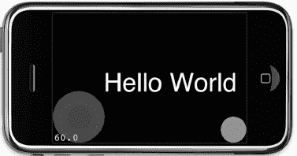

**图 7–9.** *SneakyInput 示例项目*

当然，摇杆和按钮也可以添加皮肤。皮肤（有时称为*纹理贴图*）指的是使用纹理图像而不是纯色来显示摇杆和按钮，正如你在图 7–8 中所见。

#### 集成 SneakyInput

我已经有了一个完全设置好并正常工作的项目——在本例中是 `ScrollingWithJoy05`。我不想使用 SneakyInput 提供的项目。我该怎么做才能让它与我的项目一起工作？

这个问题并不仅限于 SneakyInput，任何你下载的、已经捆绑了自身 cocos2d 版本的源代码项目都可能遇到。在大多数情况下，只要该源代码的编程语言是 Objective-C，你只需要弄清楚该项目中哪些文件是必需的，然后将它们添加到你的项目中。然而，并没有明确的指导方针，因为每个项目都不同。

不过，我可以告诉你关于 SneakyInput，你需要将哪些文件添加到你的项目中。其核心由五个类组成：

*   `SneakyButton` 和 `SneakyButtonSkinnedBase`
*   `SneakyJoystick` 和 `SneakyJoystickSkinnedBase`
*   `ColoredCircleSprite`（可选）

其余的文件并非必需，但可作为参考。图 7–10 展示了我在**添加文件到……**对话框中所做的选择。我决定不包含某些类的理由是，首先进行有根据的猜测，然后在添加了自认为必要的文件后，通过编译项目来验证猜测是否正确。

`HelloWorldScene` 类由 cocos2d 项目模板创建，很可能只包含示例代码。当然，我的项目中已经有了一个 `AppDelegate`，因此我不需要再添加 SneakyInput 的 `AppDelegate` 类——它可能会与现有的 `AppDelegate` 冲突。此外，还有两个类明确以 `Example` 作为后缀，这表明这些文件不是 SneakyInput 的核心类，而是额外的示例代码。

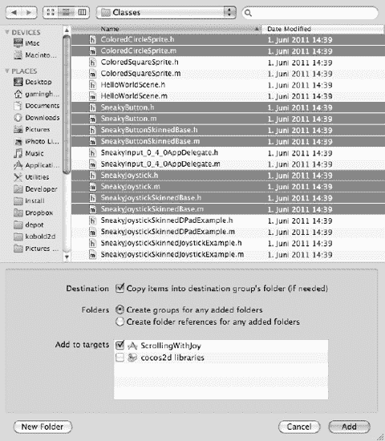

**图 7–10.** *这些文件是让 SneakyInput 在你的项目中工作所必需的；其余文件仅用于示例代码。*


##### 触摸按钮发射子弹

我们来试试看。在项目`ScrollingWithJoy05`中添加了 SneakyInput 源代码后，首要目标是添加一个按钮，让玩家能够从飞船发射子弹。我将为项目添加一个独立的`InputLayer`类，它继承自`CCLayer`并加入`GameScene`类。在代码清单 7–6 中，我更新了`scene`方法以添加新的`InputLayer`，并为两个层都添加了标签，以便后续可能需要识别它们。

**代码清单 7–6** *向 GameScene 添加 InputLayer*

```
+(id) scene
{
    CCScene* scene = [CCScene node];
    GameScene* layer = [GameScene node];
    [scene addChild:layer z:0 tag:GameSceneLayerTagGame];
    InputLayer* inputLayer = [InputLayer node];
    [scene addChild:inputLayer z:1 tag:GameSceneLayerTagInput];
    return scene;
}
```

新的标签定义在`GameScene`头文件中，如下所示：

```
typedef enum
{
    GameSceneLayerTagGame = 1,
    GameSceneLayerTagInput,
} GameSceneLayerTags;
```

`InputLayer`就位后，下一步是将我们想用的 SneakyInput 文件的头文件添加到`InputLayer.h`头文件中。我并不挑剔，而且我们很可能会用到大部分类，所以我直接将所有 SneakyInput 头文件都添加了进去：

```
#import <Foundation/Foundation.h>
#import "cocos2d.h"

// SneakyInput headers
#import "ColoredCircleSprite.h"
#import "SneakyButton.h"
#import "SneakyButtonSkinnedBase.h"
#import "SneakyJoystick.h"
#import "SneakyJoystickSkinnedBase.h"

@interface InputLayer : CCLayer
{
    SneakyButton* fireButton;
}
@end
```

此外，我还添加了一个`SneakyButton`成员变量，以便更轻松地访问即将创建的按钮。这一操作在代码清单 7–7 的`addFireButton`方法中完成。

**代码清单 7–7** *创建一个 SneakyButton*

```
-(void) addFireButton
{
    float buttonRadius = 80;
    CGSize screenSize = [[CCDirector sharedDirector] winSize];

    fireButton = [[[SneakyButton alloc] initWithRect:CGRectZero] autorelease];
    fireButton.radius = buttonRadius;
    fireButton.position = CGPointMake(screenSize.width - buttonRadius, buttonRadius);
    [self addChild:fireButton];
}
```

按钮的`initWithRect`方法中的`CGRect`参数未被`SneakyButton`使用，因此我直接传入了`CGRectZero`。实际的触摸代码使用`radius`属性来判断按钮是否应对触摸做出反应。此情况下的按钮应完美贴合在右下角。从屏幕宽度减去`buttonRadius`并将其高度设为`buttonRadius`，就能精确地将其放置在所需位置。

**提示：** 使用`buttonRadius`变量可以让你在一个地方更改按钮的半径。否则，你将不得不在多个地方更新多个数值。这不仅对于你可能需要反复调整以找到完美效果的数值来说是额外的工作，还可能引入细微的错误，因为作为人类，你容易遗忘事情，比如忘记更改某处的某个值。突然按钮位置偏移了——或者更糟，输入与按钮位置不匹配。

`InputLayer`类调度了`update`方法：

```
[self scheduleUpdate];
```

`update`方法用于检查按钮是否被触摸：

```
-(void) update:(ccTime)delta
{
    if (fireButton.active)
    {
        CCLOG(@"FIRE!!!");
    }
}
```

为了保持简单，我没有实际发射子弹，只是记录一次成功的按钮按下。现在如果你尝试`ScrollingWithJoy05`项目，你会注意到没有任何按钮被绘制出来。然而，当你触摸屏幕右下角时，会在调试器控制台窗口中看到“FIRE!!!”消息。所以一切正常，只是看不到按钮——我们需要解决这个问题。

##### 为按钮添加皮肤

嗯！不，这不是你想的那样。计算机图形学中的*皮肤*是指为原本没有特征的对象赋予纹理或不同的外观。在这个例子中，我们希望实际看到我们的按钮，所以需要一个图片。

我还倾向于像上一章那样，使用类别为外部类添加 cocos2d 风格的静态初始化方法。这有助于避免可能忘记向`SneakyButton`对象发送`alloc`或`autorelease`消息的情况。我将从向`ScrollingWithJoy06`项目添加一个`SneakyExtensions`类开始，然后将头文件精简为：

```
#import <Foundation/Foundation.h>

// SneakyInput headers
#import "ColoredCircleSprite.h"
#import "SneakyButton.h"
#import "SneakyButtonSkinnedBase.h"
#import "SneakyJoystick.h"
#import "SneakyJoystickSkinnedBase.h"
@interface SneakyButton (Extension)
+(id) button;
+(id) buttonWithRect:(CGRect)rect;
@end
```

再次，我添加了所有`SneakyInput`头文件，因为我计划为每个不符合常规 cocos2d 初始化方法的`SneakyInput`类创建更多的类别。在此例中，添加了一个名为`Extension`的`SneakyButton`类别，它添加了两个方法，名为`button`和`buttonWithRect`。它们的实现如代码清单 7–8 所示。

**代码清单 7–8** *包含 SneakyButton 自动释放初始化方法的类别*

```
#import "SneakyExtensions.h"

@implementation SneakyButton (Extension)
+(id) button
{
    return [[[SneakyButton alloc] initWithRect:CGRectZero] autorelease];
}

+(id) buttonWithRect:(CGRect)rect
{
    return [[[SneakyButton alloc] initWithRect:rect] autorelease];
}
@end
```

它们简单地包装了`alloc`和`autorelease`调用。另外，我决定添加一个简单的、无参数的按钮初始化方法，因为`CGRect`参数实际上并没有被用到。这使得我可以用一种直接的方式初始化`fireButton`：

```
fireButton = [SneakyButton button];
```

这只是为了更方便和更简洁的代码而付出的一点额外努力。我将在`SneakyExtensions`中添加更多的便捷方法，但不在书中讨论它们，因为原理是相同的。

现在我可以安心开始为按钮添加皮肤了。我创建了四个按钮图片，尺寸为 100×100 像素——是我将采用的最终按钮半径 50 的两倍。按钮图片有四种变体：默认、按下、激活和禁用。默认状态是按钮未被按下时的外观，这应该能清楚表明按下状态是什么。激活状态仅用于切换按钮，意味着切换按钮处于*激活*或*开启*状态。禁用图像用于按钮当前无功能的情况。例如，当飞船武器过热，你暂时无法射击时，可以禁用按钮，并显示禁用图像。对于射击按钮，我只需要使用默认和按下图像。代码清单 7–9 显示了更新后的`addFireButton`方法。

**代码清单 7–9** *用带皮肤的按钮替换代码清单 7–7*

```
float buttonRadius = 50;
CGSize screenSize = [[CCDirector sharedDirector] winSize];

fireButton = [SneakyButton button];
fireButton.isHoldable = YES;
SneakyButtonSkinnedBase* skinFireButton = [SneakyButtonSkinnedBase skinnedButton];
skinFireButton.position = CGPointMake(screenSize.width - buttonRadius, buttonRadius);
skinFireButton.defaultSprite = [CCSprite spriteWithSpriteFrameName:
    @"fire-button-idle.png"];
skinFireButton.pressSprite = [CCSprite spriteWithSpriteFrameName:
    @"fire-button-pressed.png"];
skinFireButton.button = fireButton;
[self addChild:skinFireButton];
```


# 排版后的文本

我像往常一样初始化了 `fireButton`，但使其能够被长按，这意味着你可以持续按住它来连续发射子弹。它也不再设置 `radius` 属性，因为现在 `SneakyButtonSkinnedBase` 类的图像决定了半径。请记住，我在之前创建的 `SneakyExtension` 源文件中为 `SneakyButtonSkinnedBase` 添加了一个分类。`skinnedButton` 初始化器就在其中，并封装了 `alloc` 和 `autorelease` 消息。

现在不再直接定位 `fireButton`，而是使用蒙皮按钮来在屏幕上定位按钮；`SneakyButtonSkinnedBase` 会相应地更新实际按钮的位置。

此时，编写开火代码也合情合理；代码清单 7–10 展示了 `update` 方法现在如何向 `GameScene` 类发送开火消息。

**代码清单 7–10.** *当开火按钮激活时发射子弹*

```
-(void) update:(ccTime)delta
{
    totalTime += delta;

    if (fireButton.active && totalTime > nextShotTime)
    {
        nextShotTime = totalTime + 0.5f;

        GameScene* game = [GameScene sharedGameScene];
        [game shootBulletFromShip:[game defaultShip]];
    }

    // 通过快速点击开火按钮实现更快的射击
    if (fireButton.active == NO)
    {
        nextShotTime = 0;
    }
}
```

两个 `ccTime` 类型的变量，`totalTime` 和 `nextShotTime`，用于限制飞船每秒最多发射两枚子弹。如果开火按钮未激活（即未被按下），则将 `nextShotTime` 设置为 0，这样下次按下按钮时，一定会发射子弹。快速点击按钮，你应该能够比连续开火发射更多的子弹。

##### 控制操作

没有某种形式的输入，你就无法驾驶飞船。这正是 `SneakyJoystick` 要助我们一臂之力（我是说虚拟摇杆）的地方。看好了，ScrollingWithJoy07 来了！

像往常一样，我做的第一件事就是为新类添加另一个 `Extension` 分类，这样我就可以像初始化其他任何 `CCNode` 一样初始化它们。对于摇杆，我将在代码清单 7–11 中的 `addJoystick` 方法里直接创建一个蒙皮摇杆。

**代码清单 7–11.** *添加一个蒙皮摇杆*

```
-(void) addJoystick
{
    float stickRadius = 50;

    joystick = [SneakyJoystick joystickWithRect:CGRectMake(0, 0, stickRadius,
        stickRadius)];
    joystick.autoCenter = YES;
    joystick.hasDeadzone = YES;
    joystick.deadRadius = 10;

    SneakyJoystickSkinnedBase* skinStick = [SneakyJoystickSkinnedBase
        skinnedJoystick];
    skinStick.position = CGPointMake(stickRadius * 1.5f, stickRadius * 1.5f);
    skinStick.backgroundSprite = [CCSprite spriteWithSpriteFrameName:
        @"joystick-back.png"];
    skinStick.backgroundSprite.color = ccYELLOW;
    skinStick.thumbSprite = [CCSprite spriteWithSpriteFrameName:
        @"joystick-stick.png"];
    skinStick.joystick = joystick;
    [self addChild:skinStick];
}
```

`SneakyJoystick` 使用一个 `CGRect` 进行初始化，与 `SneakyButton` 不同，这个 `CGRect` 实际上用于确定摇杆的半径。我将摇杆设置为 `autoCenter`，这样拇指控制器就会弹回中立位置，就像大多数现实世界的游戏控制器一样。同时启用了死区；这是由 `deadRadius` 定义的一个小区域，在此区域内移动拇指控制器不会产生任何效果。这为用户提供了一个特定半径，他们可以在其中保持拇指控制器居中。没有死区的话，几乎不可能手动将拇指控制器居中。

`SneakyJoystickSkinnedBase` 的位置距离屏幕边缘有一小段距离。按钮的位置和大小对于游戏来说可能并非理想，但这让我能更好地展示控制效果。如果你将拇指控制器与屏幕边缘对齐，手指很容易无意中移出触摸屏，从而失去对飞船的控制。

**提示：** 灰色区域很有用！我指的是像 `joystick-back.png` 这样的灰色图像。通过仅使用灰度颜色，你可以使用精灵的 `color` 属性为图像着色。你可以创建同一图像的红色、绿色、黄色、蓝色、洋红色及其他彩色版本，从而节省下载大小和游戏内存。唯一的缺点是它会变成纯色，因此你的图像将使用红色阴影，而不是灰色阴影。这个技巧最适合那些本该是单一颜色深浅变化的图像。

当然，你希望屏幕上的摇杆用于控制飞船。像往常一样，`update` 方法处理输入，如代码清单 7–12 所示。

**代码清单 7–12.** *基于摇杆输入移动飞船*

```
-(void) update:(ccTime)delta
{
    …

    // 使用拇指控制器移动飞船
    GameScene* game = [GameScene sharedGameScene];
    Ship* ship = [game defaultShip];

    // 速度必须按感觉合适的比例进行缩放
    CGPoint velocity = ccpMult(joystick.velocity, 7000 * delta);
    if (velocity.x != 0 && velocity.y != 0)
    {
        ship.position = CGPointMake(ship.position.x + velocity.x * delta,
            ship.position.y + velocity.y * delta);
    }
}
```


在此期间，我为 `GameScene` 类添加了一个 `defaultShip` 访问器方法，以便 `InputLayer` 能够访问飞船。摇杆的 `velocity` 属性用于改变飞船的位置，但必须进行缩放。`velocity` 的值只是像素的极小一部分，因此需要使用 cocos2d 的 `ccpMult` 方法（该方法接收一个 `CGPoint` 和一个浮点因子）来乘以速度，才能使游戏摇杆的速度产生明显效果。缩放因子是任意的；只是一个对这个游戏感觉合适的数值。

为了确保即使在 `update` 方法以不均匀的时间间隔被调用时也能实现平滑移动，`update` 方法的 `delta` 参数也被考虑在内。`delta` 参数由 cocos2d 传递，包含自上次调用 `update` 方法以来经过的时间。这并非严格必要，但这是一个好习惯。如果不这样做，当帧率低于 60 fps 时，飞船的移动速度就会变慢。像这样的小细节可能会让玩家感到相当恼火，而作为游戏开发者，我们的目标恰恰与惹恼玩家相反。

目前，飞船仍然可能移动到屏幕区域之外。我敢肯定，你和我一样希望飞船能停留在屏幕上。你可能会想直接将这段代码添加到更新飞船位置的 `InputLayer` 中。这就引出了一个问题：你是想阻止摇杆输入将飞船移出屏幕，还是想从根本上阻止飞船移出屏幕的可能性？后者是更通用的解决方案，在这种情况下也更可取。为此，你只需要在 `Ship` 类中重写 `setPosition` 方法，如列表 7–13 所示。

**列表 7–13.** *重写飞船的 setPosition 方法*

```
// 重写 setPosition 以将飞船保持在边界内
-(void) setPosition:(CGPoint)pos
{
    CGSize screenSize = [[CCDirector sharedDirector] winSize];
    float halfWidth = contentSize_.width * 0.5f;
    float halfHeight = contentSize_.height * 0.5f;

		`// 限制位置，使飞船精灵保持在屏幕上`
	    if (pos.x < halfWidth)
    {
        pos.x = halfWidth;
    }
    else if (pos.x > (screenSize.width - halfWidth))
    {
        pos.x = screenSize.width - halfWidth;
    }

    if (pos.y < halfHeight)
    {
        pos.y = halfHeight;
    }
    else if (pos.y > (screenSize.height - halfHeight))
    {
        pos.y = screenSize.height - halfHeight;
    }

	    // 必须使用新位置调用父类方法
    [super setPosition:pos];
}
```

每次更新飞船的位置时，上述代码都会进行检查，看飞船的精灵是否仍在屏幕边界内。如果不是，则将 X 或 Y 坐标设置为距离相应屏幕边框 `contentSize` 一半的位置。

因为 `position` 是一个属性，`setPosition` 方法会被以下代码调用：

```
ship.position = CGPointMake(200, 100);
```

点语法是向 Objective-C 属性发送 getter 和 setter 消息的简写形式，可以改写为：

```
[ship setPosition:CGPointMake(200, 100)];
```

你可以通过这种方式重写其他基类的方法来改变游戏对象的行为。例如，如果一个对象只允许在 0 到 180 度之间旋转，你可以重写 `setRotation:(float)rotation` 方法，并添加代码来限制旋转角度。

##### 数字控制

你也可以将 `SneakyJoystick` 类变成数字控制器，通常称为 *D-pad*。所需的代码改动很小。你可以在 ScrollingWithJoy08 项目中或此处找到它们：

```
joystick = [SneakyJoystick joystickWithRect:CGRectMake(0, 0, stickRadius, stickRadius)];
joystick.autoCenter = YES;

// 现在方向更少了
joystick.isDPad = YES;
joystick.numberOfDirections = 8;
```

死区属性已被移除——数字控制器不需要它们。通过将 `isDPad` 属性设置为 `YES`，可以将摇杆设置为数字控制。你还可以定义方向的数量。虽然 D-pad 通常有四个方向，但在许多游戏中，你可以同时按住两个方向来让角色沿对角线移动。为了达到同样的效果，`numberOfDirections` 属性被设置为 8。`SneakyJoystick` 会自动确保这些方向均匀分布在拇指摇杆控制器上。当然，如果你将方向数设置为 6，你会得到奇怪的结果，但话说回来，这也许正是你在六边形瓦片地图上移动所需要的。

### 总结

在本章中，你学习了几种制作有效视差滚动背景的技巧。你不仅学会了如何无限滚动背景且无闪烁边缘，还学会了如何正确分离视差层，以便 TexturePacker 可以减少任何不必要的透明区域，同时保留图像的偏移量，这样你就不必费力定位视差层了。

这种方法的缺点在于它特定于某种屏幕分辨率。例如，如果你想创建 iPad 版本，可以使用相同的过程，只是需要以 1024×768 的分辨率创建图像。我把这作为练习留给你。

本章的后半部分向你介绍了 SneakyInput，这是一个开源项目，用于为任何 cocos2d 游戏添加虚拟摇杆和按钮。它可能并不完美，但对于大多数游戏来说已经足够好了，而且绝对比自己编写虚拟摇杆代码要好。

现在，飞船已可控并保持在屏幕边界内，并且可以通过按下按钮进行射击——但游戏仍缺少一些东西。一个射击游戏如果没有可以击落的目标，还叫射击游戏吗？下一章将解决这个问题。

## 第 8 章

## 射击游戏

这类游戏最需要什么？需要射击的目标和需要躲避的子弹。在本章中，你将向游戏添加敌人，甚至一个 Boss 怪物。

敌我双方都将使用新的 `BulletCache` 类从同一个对象池中发射各种子弹。缓存类会重用未激活的子弹，以避免不断地从内存中分配和释放子弹。同样，敌人也会使用它们自己的 `EnemyCache` 类，因为它们也会大量出现在屏幕上。

显然，玩家将能够射击这些敌人。我还将介绍基于组件的编程概念，它允许你以模块化的方式扩展游戏角色。除了射击和移动组件，我们还为 Boss 怪物创建了一个生命条组件。毕竟，Boss 怪物不应该被一击毙命，而是需要多次命中才能被摧毁。


### 添加 BulletCache 类

在 ShootEmUp01 项目中，`BulletCache` 类是创建新子弹的一站式服务类。此前所有相关代码都位于 `GameScene` 类中，但管理和创建新子弹不应是 `GameScene` 的职责。代码清单 8-1 展示了新的 `BulletCache` 头文件，其中包含了 `CCSpriteBatchNode` 和非活跃子弹计数器。

**代码清单 8–1.** *`BulletCache` 类的 @interface*

```objective-c
#import <Foundation/Foundation.h>
#import "cocos2d.h"

@interface BulletCache : CCNode
{
    CCSpriteBatchNode* batch;
    int nextInactiveBullet;
}

-(void) shootBulletAt:(CGPoint)startPosition velocity:(CGPoint)velocity
                                            frameName:(NSString*)frameName;
@end
```

为了将子弹发射代码从 `GameScene` 类中重构出来，我需要将初始化和发射子弹的方法都迁移到新的 `BulletCache` 类中（代码清单 8-2）。在此过程中，我决定将 `CCSpriteBatchNode` 保存在成员变量中，而不是在每次需要精灵批处理对象时都调用 `CCNodegetChildByTag` 方法。这是一种微小的性能优化。由于我会将 `BulletCache` 类作为子节点添加到 `GameScene` 中，因此只需将精灵批处理节点添加到 `BulletCache` 类即可。

**注意：** 通过添加像 `BulletCache` 这样的中间 `CCNode` 来增加场景层次深度，几乎不会带来负面影响。如果你担心场景层次深度问题，另一种方案是像往常一样将精灵批处理节点添加到 `GameScene` 类，并在 `BulletCache` 类中使用访问器方法获取该精灵批处理节点。但额外的函数调用开销可能会抵消任何性能提升。如有疑问，应始终优先保证代码可读性，然后仅在必要时对性能进行重构优化。

**代码清单 8–2.** *BulletCache 维护一个供复用的子弹池*

```objective-c
#import "BulletCache.h"
#import "Bullet.h"

@implementation BulletCache

-(id) init
{
    if ((self = [super init]))
    {
        // 从纹理图集中获取任意子弹图片
        CCSpriteFrame* bulletFrame = [[CCSpriteFrameCache sharedSpriteFrameCache] spriteFrameByName:@"bullet.png"];

        // 使用子弹的纹理
        batch = [CCSpriteBatchNode batchNodeWithTexture:bulletFrame.texture];
        [self addChild:batch];

        // 预先创建一批子弹并重复使用
        for (int i = 0; i < 200; i++)
        {
            Bullet* bullet = [Bullet bullet];
            bullet.visible = NO;
            [batch addChild:bullet];
        }
    }

    return self;
}

-(void) shootBulletAt:(CGPoint)startPosition velocity:(CGPoint)velocity
                                            frameName:(NSString*)frameName
{
    CCArray* bullets = [batch children];
    CCNode* node = [bullets objectAtIndex:nextInactiveBullet];
    NSAssert([node isKindOfClass:[Bullet class]], @"不是 Bullet 类型！");

    Bullet* bullet = (Bullet*)node;
    [bullet shootBulletAt:startPosition velocity:velocity frameName:frameName];

    nextInactiveBullet++;
    if (nextInactiveBullet >= [bullets count])
    {
        nextInactiveBullet = 0;
    }
}
@end
```

如你所见，`shootBulletAt` 方法变化最大。它现在接收三个参数：`startPosition`、`velocity` 和 `frameName`，取代了之前指向 `Ship` 类的指针。随后它将这些参数传递给 `Bullet` 类的 `shootBulletAt` 方法，而该方法也经过了重构：

```objective-c
-(void) shootBulletAt:(CGPoint)startPosition velocity:(CGPoint)vel
                                            frameName:(NSString*)frameName
{
    self.velocity = vel;
    self.position = startPosition;
    self.visible = YES;

    // 通过设置不同的 SpriteFrame 来更改子弹纹理
    CCSpriteFrame* frame = [[CCSpriteFrameCache sharedSpriteFrameCache] spriteFrameByName:frameName];
    [self setDisplayFrame:frame];

    [self unscheduleUpdate];
    [self scheduleUpdate];
}
```

现在 `velocity` 和 `position` 都直接赋值给子弹。这意味着调用 `shootBulletAt` 方法的代码必须自行确定子弹的位置、方向和速度。这正是我期望的效果：实现发射子弹的完全灵活性，包括使用 `setDisplayFrame` 方法更改子弹的精灵帧。由于所有子弹都位于同一纹理图集中，使用同一纹理，因此只需设置所需的精灵帧即可更改显示的子弹。实际上，这仅仅是在渲染纹理的不同区域，不会产生额外开销。

在处理 `Bullet` 类时，我还修复了子弹可能存在的边界问题——此前只有移动到屏幕右侧之外的子弹会被设为不可见并放回待命列表。通过在 `update` 方法中使用 `CGRectIntersectsRect` 检查子弹的 `boundingBox` 和 `screenRect`，任何完全移出屏幕区域的子弹都将被标记为可复用：

```objective-c
// 当子弹离开屏幕时，将其设为不可见
if (CGRectIntersectsRect([self boundingBox], screenRect) == NO)
{
    …
}
```

为了便利和性能考虑，`screenRect` 变量现在存储为静态变量，这样其他类可以直接访问，无需每次使用时重新创建。像 `screenRect` 这样的静态变量可在其声明所在的类实现文件中访问。它们类似于类的全局变量；任何类实例都可以读取和修改该变量，这与类成员变量不同（后者对每个类实例是局部的）。由于游戏运行时屏幕尺寸不会改变，且所有 `Bullet` 实例都需要使用该变量，因此将其存储在静态变量中供所有类实例使用是合理的。第一个初始化的子弹会设置 `screenRect` 变量。`CGRectIsEmpty` 方法用于检查 `screenRect` 变量是否仍未初始化；由于该变量是静态的，我希望仅初始化一次。

```objective-c
static CGRect screenRect;

…

// 确保屏幕矩形只初始化一次
if (CGRectIsEmpty(screenRect))
{
    CGSize screenSize = [[CCDirector sharedDirector] winSize];
    screenRect = CGRectMake(0, 0, screenSize.width, screenSize.height);
}
```

实施这些更改后，剩下的工作就是清理 `GameScene`，移除之前用于发射子弹的所有方法和成员变量。具体来说，我需要将 `CCSpriteBatchNode` 的初始化替换为 `BulletCache` 类的初始化：

```objective-c
BulletCache* bulletCache = [BulletCache node];
[self addChild:bulletCache z:1 tag:GameSceneNodeTagBulletCache];
```

我还需要添加一个 `bulletCache` 访问器，以便其他类可以通过 `GameScene` 访问 `BulletCache` 实例：

```objective-c
-(BulletCache*) bulletCache
{
    CCNode* node = [self getChildByTag:GameSceneNodeTagBulletCache];
    NSAssert([node isKindOfClass:[BulletCache class]], @"不是 BulletCache 类型");
    return (BulletCache*)node;
}
```

现在 `InputLayer` 可以使用新的 `BulletCache` 类来发射玩家子弹。子弹属性（如起始位置、速度和要使用的精灵帧）现在由 `InputLayer` 的 `update` 方法中的发射代码传入：

```objective-c
if (fireButton.active && totalTime > nextShotTime)
{
    nextShotTime = totalTime + 0.4f;

    GameScene* game = [GameScene sharedGameScene];
    Ship* ship = [game defaultShip];
    BulletCache* bulletCache = [game bulletCache];
```


// 在射击前设置位置、速度和精灵帧
`CGPoint shotPos = CGPointMake(ship.position.x + 45, ship.position.y – 19);`

`float spread = (CCRANDOM_0_1() - 0.5f) * 0.5f;`
`CGPoint velocity = CGPointMake(200, spread * 50);`
`[bulletCache shootBulletAt:shotPos velocity:velocity frameName:@"bullet.png"];`

这次简短的重构为子弹射击增添了亟需的灵活性。相信你可以想象敌人现在也能使用完全相同的代码来发射子弹。

### 敌人又该如何？

目前，我们对敌人的形象、行为以及行动模式只有一个模糊的概念。敌人就是如此——你永远不知道它们要耍什么花样。

就游戏而言，这意味着要回到绘图板，规划好你期望敌人执行的动作，然后根据这个规划推导出需要编程实现的内容。与现实生活相反，你对敌人拥有完全的控制权。这难道不让你感到强大吗？但在你或任何人能享受乐趣之前，你需要制定一个征服世界的计划。

我已经为三种不同类型的敌人创建了图形资源。目前我只知道其中至少有一个是 Boss 级怪物。请看图 8-1，试着想象这些敌人可能会做些什么。

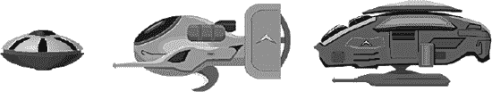

**图 8-1.** *用作游戏敌方角色的图形资源*

在开始编程之前，你应该充分了解敌人有哪些共同行为，这样只需编写一次通用代码。消除代码重复是整洁代码设计的唯一最重要目标。

让我们看看已知的所有敌人的共同点：

-   发射子弹
-   拥有决定何时、何地、发射何种子弹的逻辑
-   可被玩家子弹击中
-   不能被其他敌人子弹击中
-   可以承受一次或多次攻击（拥有生命值）
-   拥有特定的行为和移动模式
-   被摧毁时有特定的行为或动画
-   会从屏幕外区域出现并移入屏幕内
-   一旦进入屏幕就不会离开屏幕区域

查看这个列表时，你可能会注意到其中一些属性也适用于玩家的飞船。它当然可以发射子弹，我们希望它能承受多次攻击，并且被摧毁时应有特定的行为或动画。将玩家的飞船视为一种特殊类型的敌人，并将其纳入考量，是合理的。

审视这些功能集，我看到了三种可能的实现方法。我可以创建一个类，包含飞船、敌人和 Boss 怪物的所有代码。代码的某些部分将根据敌人的类型有条件地执行。例如，射击代码可能为每种游戏对象类型提供不同的代码路径。对于数量有限的不同对象，这种方法效果还算不错——但它不具备可扩展性。随着游戏对象类型不断增加，你最终会得到一个包含所有游戏逻辑代码、日益臃肿的类。对该类任何部分的修改，都可能对敌人甚至玩家飞船的行为产生不良副作用。根据类型变量决定执行哪个代码路径，非常类似于纯粹的 C 语言编程，没有利用 Objective-C 编程语言的面向对象特性。但如果谨慎使用，即使在今天，这依然是一个非常强大的概念。

第二种方法是创建一个类层次结构，以`Entity`类作为基类，然后从中派生出飞船、两种怪物和一个 Boss 怪物类。这是许多程序员实际采用的做法，对于少量游戏对象来说，效果也不错。但本质上，它与第一种方法差别不大，因为当某些（而非全部）子类需要通用代码时，这些代码最终往往会堆积在基类`Entity`中。一旦`Entity`类中的代码开始根据敌人类型添加开关，以跳过部分代码或执行特定于该敌人类型的代码路径，情况就会变得更糟。这与第一种 C 风格编程方法的问题相同。稍加注意，你可以确保特定于敌人的代码归属于该敌人的类，但最终在`Entity`类本身进行大部分修改，是极其容易发生的情况。

第三种选择是使用组件系统。这意味着将各个代码路径从`Entity`类层次结构中分离出来，只添加到需要这些组件的子类中，例如生命条组件。由于基于组件的开发本身就值得写一本书，而且对于像这个射击类这样的小项目来说可能过于复杂，我将混合使用类层次结构方法和组件设计，至少让你了解如何从各个部件组合成游戏对象，以及这样做的好处。

我想指出的是，没有唯一最佳的代码设计方法。某些选择完全是主观的，取决于个人偏好和经验。如果你愿意在了解所开发游戏的过程中经常重构代码库，那么能运行的代码通常比整洁的代码更可取。经验让你能够在规划阶段预先做出更多此类决策，从而更快地创建更复杂的游戏。因此，如果这是你的目标，请从制作并完成小型游戏开始，逐步将自己推向新的极限和新的挑战。这是一个学习过程，不幸的是，最容易被消磨动力的事情就是过于雄心勃勃。所有经验丰富的游戏程序员都会告诉新手从简单做起，先重现《俄罗斯方块》、《吃豆人》或《爆破彗星》等经典街机游戏，这是有原因的。

### Entity 类层次结构

对于基类，我在`ShootEmUp02`项目中创建了`Entity`类。`Entity`是一个从`CCSprite`派生的通用类，仅包含`Ship`类的`setPosition`代码，以将所有`Entity`实例限制在屏幕内。我对这段代码做了一个小改进，允许屏幕外的对象移入屏幕内，但一旦进入屏幕，就无法再离开屏幕区域。在这个射击示例游戏中，敌人不会从你身边掠过；它们会停在屏幕中间，以便接下来介绍`EnemyCache`。屏幕区域检查只是简单地检查屏幕矩形是否完全包含精灵的`boundingBox`，只有满足该条件时，才会运行将精灵保持在屏幕矩形内的代码：

```
-(void) setPosition:(CGPoint)pos
{
    // 如果当前位置在屏幕外，则无需调整！
    // 这允许实体从屏幕外移入屏幕内。
    if ([self isOutsideScreenArea])
    {
        …
    }

    [super setPosition:pos];
}
```

函数`isOutsideScreenArea`实现如下：

```
-(BOOL) isOutsideScreenArea
{
    return (CGRectContainsRect([GameScene screenRect], [self boundingBox]));
}
```

`Ship`类已被替换为`ShipEntity`。由于`Entity`基类现在包含了`setPosition`代码，`ShipEntity`中唯一剩下的就是`initWithShipImage`方法。这与之前相同，因此此处不再重复。


### `EnemyEntity` 类

我确实需要更深入地讲解`EnemyEntity`类及其功能，首先从代码清单 8-3 中的头文件开始。

**代码清单 8-3.** *`EnemyEntity`类的@interface*

```
#import <Foundation/Foundation.h>
#import "Entity.h"

typedef enum
{
    EnemyTypeUFO = 0,
    EnemyTypeCruiser,
    EnemyTypeBoss,

    EnemyType_MAX,
} EnemyTypes;

@interface EnemyEntity : Entity
{
    EnemyTypes type;
}

+(id) enemyWithType:(EnemyTypes)enemyType;
+(int) getSpawnFrequencyForEnemyType:(EnemyTypes)enemyType;
-(void) spawn;
@end
```

这里没什么特别之处。`EnemyTypes`枚举用于区分当前支持的三种不同类型敌人，其中`EnemyType_MAX`用作循环的上限（你很快就会看到）。`EnemyEntity`类有一个存储类型的成员变量，这样我就可以使用`switch`语句根据需要根据敌人类型来分支代码。

`EnemyEntity`的实现包含很多需要讨论的代码，因此我将把讨论分成几个主题，仅展示相关代码，首先从代码清单 8-4 中的`initWithType`方法开始。

**代码清单 8-4.** *用类型初始化敌人*

```
-(id) initWithType:(EnemyTypes)enemyType
{
    type = enemyType;

    NSString* enemyFrameName;
    NSString* bulletFrameName;
    float shootFrequency = 6.0f;
    switch (type)
    {
        case EnemyTypeUFO:
            enemyFrameName = @"monster-a.png";
            bulletFrameName = @"shot-a.png";
            break;
        case EnemyTypeCruiser:
            enemyFrameName = @"monster-b.png";
            bulletFrameName = @"shot-b.png";
            shootFrequency = 1.0f;
            break;
        case EnemyTypeBoss:
            enemyFrameName = @"monster-c.png";
            bulletFrameName = @"shot-c.png";
            shootFrequency = 2.0f;
            break;

        default:
            [NSException exceptionWithName:@"EnemyEntity Exception"
                                    reason:@"unhandled enemy type"
                                  userInfo:nil];
    }

    if ((self = [super initWithSpriteFrameName:enemyFrameName]))
    {
        // 创建游戏逻辑组件
        [self addChild:[StandardMoveComponent node]];

        StandardShootComponent* shootComponent = [StandardShootComponent node];
        shootComponent.shootFrequency = shootFrequency;
        shootComponent.bulletFrameName = bulletFrameName;
        [self addChild:shootComponent];

        // 敌人初始化为不可见
        self.visible = NO;

        [self initSpawnFrequency];
    }

    return self;
}
```

代码首先通过`switch`语句根据敌人类型设置变量，为每种敌人类型提供默认值——要使用的精灵帧名称、子弹精灵帧名称以及射击频率。`switch`语句的默认情况会抛出异常，因为这种情况通常是由于在`EnemyTypes`枚举中添加了新敌人类型，却没有相应扩展此`switch`语句导致的。以这种方式保护你的`switch`语句，不接受任何默认情况，是一个避免因简单的人为错误而花费过多调试时间的好策略。而且你也是人，对吧？所以你容易忘记这些事。我知道我自己就是。与其纳闷为什么新敌人不移动或发射错误的子弹，你会得到一个崩溃，它挥舞着一面大红旗子说：“嘿，你忘记更新我了！”

在赋值给`self`之前运行代码也是完全可以的，只要最终没有忘记调用`[super init…]`方法即可。否则，父类将无法正确初始化，这可能导致奇怪的错误和崩溃。

创建并添加到`EnemyEntity`中的组件类包含可替换的代码。我很快就会讲到组件；目前只需知道`StandardMoveComponent`允许敌人移动，而`StandardShootComponent`允许它——你猜对了——射击。

现在让我们把注意力集中在`initSpawnFrequency`方法上。相关代码如代码清单 8-5 所示。

**代码清单 8-5.** *控制敌人的生成*

```
static CCArray* spawnFrequency;

-(void) initSpawnFrequency
{
    // 初始化敌人的生成频率
    if (spawnFrequency == nil)
    {
        spawnFrequency = [[CCArray alloc] initWithCapacity:EnemyType_MAX];
        [spawnFrequency insertObject:[NSNumber numberWithInt:80]
                                                     atIndex:EnemyTypeUFO];
        [spawnFrequency insertObject:[NSNumber numberWithInt:260]
                                                     atIndex:EnemyTypeCruiser];
        [spawnFrequency insertObject:[NSNumber numberWithInt:1500]
                                                     atIndex:EnemyTypeBoss];

        // 立即生成一个敌人
        [self spawn];
    }
}

+(int) getSpawnFrequencyForEnemyType:(EnemyTypes)enemyType
{
    NSAssert(enemyType < EnemyType_MAX, @"invalid enemy type");
    NSNumber* number = [spawnFrequency objectAtIndex:enemyType];
    return [number intValue];
}

-(void) dealloc
{
    [spawnFrequency release];
    spawnFrequency = nil;

    [super dealloc];
}
```

我们将每种敌人类型的生成频率值存储在一个静态的`spawnFrequency` `CCArray`中。它是一个静态变量，因为生成频率不是每个敌人需要的，而是每种敌人类型需要的。第一个执行`initSpawnFrequency`方法的`EnemyEntity`实例会发现`spawnFrequency` `CCArray`为`nil`，因此会初始化它。

由于`CCArray`只能存储对象，而不能存储整数这样的原始数据类型，因此必须使用`numberWithInt`初始化器将这些值封装到`NSNumber`类中。我选择在这里使用`insertObject`而不是`addObject`，不仅因为它能确保这些值的索引与`enum`中定义的敌人类型相同，还因为它能告诉任何查看这段代码的其他程序员，所使用的索引是有意义的。在这种情况下，索引与敌人类型是同义词。虽然从技术上讲，在这里指定索引并非必要，但它有助于说明哪个值用于哪种敌人类型。

当然，`dealloc`方法会释放`spawnFrequency` `CCArray`，并将其设置为`nil`，这一点非常重要。作为一个静态变量，第一个运行其`dealloc`方法的`EnemyEntity`对象会释放`spawnFrequency`的内存。如果此后没有立即将其设置为`nil`，下一个运行其`dealloc`方法的`EnemyEntity`会尝试同样的操作，从而导致过度释放`spawnFrequency` `CCArray`，引发崩溃。另一方面，如果`spawnFrequency`变量为`nil`，发送给它的任何消息（如 release 消息）都会被忽略。我之前说过，但再怎么重复也不为过：在 Objective-C 中，向`nil`对象发送消息是完全没问题的；该消息只会被忽略。

生成实体是通过`spawn`方法完成的：

```
-(void) spawn
{
    // 在屏幕右侧外部选择一个生成位置
    CGRect screenRect = [GameScene screenRect];
    CGSize spriteSize = [self contentSize];
    float xPos = screenRect.size.width + spriteSize.width * 0.5f;
    float yPos = CCRANDOM_0_1() * (screenRect.size.height - spriteSize.height) +
        spriteSize.height * 0.5f;
    self.position = CGPointMake(xPos, yPos);

    // 最后将自身设置为可见，这也标志着敌人“正在使用中”
    self.visible = YES;
}
```


由于所有敌机实例都预先通过`EnemyCache`创建，整个生成过程仅需在屏幕右侧外随机选择一个`y`坐标，然后将`EnemyEntity`精灵设为可见。`visible`状态在项目的其他位置（尤其是组件类）用于判断`EnemyEntity`是否正在使用。若不可见，可通过生成操作使其可见，但游戏逻辑代码仅在可见状态下执行。

### EnemyCache 类

我刚刚提到了`EnemyCache`类。从其命名不难联想到`BulletCache`类——同样持有大量预初始化对象，以实现快速便捷的复用。这种做法避免了游戏过程中反复创建和释放对象，从而防止可能导致的轻微性能卡顿。尤其在动作游戏中，此类微小卡顿可能严重破坏玩家体验。基于此，让我们看看代码清单 8-6 中`EnemyCache`朴实无华的头文件。

**代码清单 8-6.** *EnemyCache 类的 @interface 声明*

```
#import <Foundation/Foundation.h>
#import "cocos2d.h"

@interface EnemyCache : CCNode
{
    CCSpriteBatchNode* batch;
    CCArray* enemies;

    int updateCount;
}
@end
```

在包含所有敌机精灵的`spriteBatch`之后，有一个`enemiesCCArray`（注：`[enemies]`为原文笔误，此处指`enemies`），它按类型存储敌机列表。`updateCount`变量每帧递增，用于按固定间隔生成敌机。`EnemyCache`的`init`方法与`BulletCacheinit`极为相似，都涉及`CCSpriteBatchNode`的初始化：

```
-(id) init
{
    if ((self = [super init]))
    {
        // 从当前使用的纹理图集中获取任意图像
        CCSpriteFrame* frame = [[CCSpriteFrameCache sharedSpriteFrameCache] spriteFrameByName:@"monster-a.png"];
        batch = [CCSpriteBatchNode batchNodeWithTexture:frame.texture];
        [self addChild:batch];

        [self initEnemies];
        [self scheduleUpdate];
    }

    return self;
}
```

由于敌机初始化代码稍显复杂，我将其单独提取为一个方法，如代码清单 8-7 所示。

**代码清单 8-7.** *初始化敌机对象池以供后续复用*

```
-(void) initEnemies
{
    // 创建敌机数组，其内每个元素为对应类型的子数组
    enemies = [[CCArray alloc] initWithCapacity:EnemyType_MAX];

    // 为每种类型创建子数组
    for (int i = 0; i < EnemyType_MAX; i++)
    {
        // 根据敌机类型设定数组容量，以容纳所需数量的敌机
        int capacity;
        switch (i)
        {
            case EnemyTypeUFO:
                capacity = 6;
                break;
            case EnemyTypeCruiser:
                capacity = 3;
                break;
            case EnemyTypeBoss:
                capacity = 1;
                break;

            default:
                [NSException exceptionWithName:@"EnemyCache Exception"
                                        reason:@"unhandled enemy type"
                                      userInfo:nil];
                break;
        }

        // 无需 alloc，因为 enemies 数组会自动 retain 所有添加的对象
        CCArray* enemiesOfType = [CCArray arrayWithCapacity:capacity];
        [enemies addObject:enemiesOfType];
    }

    for (int i = 0; i < EnemyType_MAX; i++)
    {
        CCArray* enemiesOfType = [enemies objectAtIndex:i];
        int numEnemiesOfType = [enemiesOfType capacity];

        for (int j = 0; j < numEnemiesOfType; j++)
        {
            EnemyEntity* enemy = [EnemyEntity enemyWithType:i];
            [batch addChild:enemy z:0 tag:i];
            [enemiesOfType addObject:enemy];
        }
    }
}

-(void) dealloc
{
    [enemies release];
    [super dealloc];
}
```

有趣的是，`CCArray*enemies` 本身包含多个 `CCArray*` 对象，每种敌机类型对应一个。这即所谓二维数组。成员变量 `enemies` 需使用 `alloc` 创建，否则其内存会在离开 `initEnemies` 方法后释放。相比之下，添加到 `enemiesCCArray` 中的 `CCArray*` 对象则无需通过 `alloc` 创建，因为 `enemiesCCArray` 会 retain 所有加入的对象。


每个`enemiesOfTypeCCArray`的初始容量也决定了该类型敌人可同时出现在屏幕上的数量。通过这种方式，你可以控制屏幕上敌人的最大数量。每个`enemiesOfTypeCCArray`随后会被通过`addObject`添加到`enemiesCCArray`中，就像其他任何对象一样。如果需要，你可以通过这种方式创建深层层次结构。事实上，cocos2d 节点层次结构正是建立在包含`CCArray*children`成员变量的`CCNode`类之上，这些成员变量可以包含更多`CCNode`类，依此类推。

我将数组初始化与敌人创建拆分为两个独立的循环，尽管它们可以在同一个循环中完成。它们是不同的任务，应该保持分离。额外遍历所有敌人类型一次的开销可以忽略不计。

基于`CCArray`初始化循环中设置的初始容量，创建所需数量的敌人，将其添加到`CCSpriteBatchNode`，然后添加到对应的`enemiesOfTypeCCArray`中。虽然通过`CCSpriteBatchNode`也能访问这些敌人，但将敌人实体引用保存在独立的数组中，可以在后续活动（如生成）中更轻松地处理它们，如清单 8–8 所示。

**清单 8–8.** *生成敌人*

```
-(void) spawnEnemyOfType:(EnemyTypes)enemyType
{
    CCArray* enemiesOfType = [enemies objectAtIndex:enemyType];

    EnemyEntity* enemy;
    CCARRAY_FOREACH(enemiesOfType, enemy)
    {
        // 找到第一个空闲的敌人并重新生成它
        if (enemy.visible == NO)
        {
            CCLOG(@"生成敌人类型 %i", enemyType);
            [enemy spawn];
            break;
        }
    }
}

-(void) update:(ccTime)delta
{
    updateCount++;

    for (int i = EnemyType_MAX - 1; i >= 0; i--)
    {
        int spawnFrequency = [EnemyEntity getSpawnFrequencyForEnemyType:i];

        if (updateCount % spawnFrequency == 0)
        {
            [self spawnEnemyOfType:i];
            break;
        }
    }
}
```

`update`方法增加了一个简单的`update`计数器。它没有考虑实际经过的时间，但由于差异通常很小，为了简化处理，这是一个合理的权衡。这个`for`循环从`EnemyType_MAX – 1`开始，一直运行到`i`为负数。这样做的唯一目的是让编号较高的`EnemyTypes`拥有比编号较低的`EnemyTypes`更高的生成优先级。如果某个 Boss 怪物与一艘巡洋舰同时被预定生成，Boss 会先生成。否则，巡洋舰可能会在同一时间尝试生成，占用 Boss 的生成槽位，从而阻止 Boss 生成。这是生成逻辑的一个副作用，我将其留给你来扩展和改进，因为如果你决定编写自己的经典射击游戏版本，你很可能需要这样做。

`spawnFrequency`通过`EnemyEntity`的`getSpawnFrequencyForEnemyType`方法获取：

```
+(int) getSpawnFrequencyForEnemyType:(EnemyTypes)enemyType
{
    NSAssert(enemyType < EnemyType_MAX, @"无效的敌人类型");
    NSNumber* number = [spawnFrequency objectAtIndex:enemyType];
    return [number intValue];
}
```

该方法首先断言`enemyType`的编号确实在定义的范围内。然后获取该敌人类型对应的`NSNumber`对象，并将其作为`intValue`返回。

模运算符`%`返回两个操作数`updateCount`和`spawnFrequency`相除后的余数。这意味着只有当`updateCount`能被`spawnFrequency`整除（余数为 0）时，才会生成敌人。

`spawnEnemyOfType`方法随后从`enemiesCCArray`中获取`CCArray`，该数组包含了`enemiesOfType`列表（另一个`CCArray`）。现在你可以只遍历所需的敌人类型，而无需遍历所有添加到`CCSpriteBatchNode`中的精灵。一旦找到一个不可见的敌人，就会调用它的`spawn`方法。如果该类型的所有敌人都可见，则说明当前屏幕上的敌人数量已达到最大值，不再生成新的敌人，从而有效限制了任何时刻屏幕上每种类型敌人的数量。


### 组件类

组件类旨在作为游戏逻辑的插件。如果你向实体添加一个组件，该实体将执行组件的行为：移动、射击、动画、显示血条等。其巨大优势在于，你可以将这些组件编程为几乎自动地通用工作，因为它们与父类`CCNode`交互，并应尽可能少地对父类做出假设。当然，在某些情况下，组件要求父类为`EnemyEntity`类，但你仍然可以将其用于任何`EnemyEntity`。

组件类也可以根据使用该组件的类进行配置。以组件类为例，我们来看一下`EnemyEntity`类中的`StandardShootComponent`初始化：

```
StandardShootComponent* shootComponent = [StandardShootComponent node];
shootComponent.shootFrequency = shootFrequency;
shootComponent.bulletFrameName = bulletFrameName;
[self addChild:shootComponent];
```

变量`shootFrequency`和`bulletFrameName`已根据`EnemyType`预先设置。通过将`StandardShootComponent`添加到`EnemyEntity`类，敌人将以特定间隔发射特定子弹。由于此组件对父类不做任何假设，你甚至可以将其实例添加到`ShipEntity`类，让玩家的飞船以特定间隔自动射击！或者，只需激活和停用专门的射击组件，就能用很少的代码实现玩家更换武器的效果。你只需独立编写射击代码，然后将其插入游戏实体并添加一些参数。切换武器编程剩下的逻辑仅仅是何时停用哪些组件。更重要的是，如果这些组件合理，你可以在其他游戏中复用它们。组件非常适合编写可复用代码，并且是许多游戏引擎中的标准机制。如果你想了解更多关于游戏组件的信息，请参考我网站上的博客文章：[`www.learn-cocos2d.com/2010/06/prefer-composition-inheritance/`](http://www.learn-cocos2d.com/2010/06/prefer-composition-inheritance/)。

让我们看看`StandardShootComponent`的源代码，从头文件开始：

```
#import <Foundation/Foundation.h>
#import "cocos2d.h"

@interface StandardShootComponent : CCSprite
{
    float updateCount;
    float shootFrequency;
    NSString* bulletFrameName;
}

@property (nonatomic) float shootFrequency;
@property (nonatomic, copy) NSString* bulletFrameName;

@end
```

有两点值得注意。第一，`StandardShootComponent`派生自`CCSprite`，尽管它不使用任何纹理。这是一种变通方法，因为所有`EnemyEntity`对象都被添加到一个`CCSpriteBatchNode`中，而该节点只能包含基于`CCSprite`的对象。这也适用于`EnemyEntity`类的任何子节点；因此，`StandardShootComponent`需要继承自`CCSprite`以满足`CCSpriteBatchNode`的要求。

接下来是一个`NSString*`指针`bulletFrameName`，带有相应的`@property`。如果仔细观察，你会注意到`@property`定义中的关键字`copy`。这意味着将`NSString`赋值给此属性会创建其副本。这对字符串很重要，因为它们通常是自动释放的对象，我们希望确保这个字符串归我们所有。我们也可以保留它，但问题在于源字符串可能是一个可更改的`NSMutableString`，这也会改变`bulletFrameName`，在本例中是不可取的。当然，使用`copy`关键字意味着需要在`dealloc`中释放`bulletFrameName`内存，如代码清单 8-9 的实现所示。

**代码清单 8-9.** *StandardShootComponent 的完整实现*

```
#import "StandardShootComponent.h"
#import "BulletCache.h"
#import "GameScene.h"

@implementation StandardShootComponent

@synthesize shootFrequency;
@synthesize bulletFrameName;

-(id) init
{
    if ((self = [super init]))
    {
        [self scheduleUpdate];
    }

    return self;
}

-(void) dealloc
{
    [bulletFrameName release];
    [super dealloc];
}

-(void) update:(ccTime)delta
{
    if (self.parent.visible)
    {
        updateCount += delta;

        if (updateCount >= shootFrequency)
        {
            updateCount = 0;

            GameScene* game = [GameScene sharedGameScene];
            CGPoint startPos = ccpSub(self.parent.position, 
                CGPointMake(self.parent.contentSize.width * 0.5f, 0));
            [game.bulletCache shootBulletFrom:startPos
                        velocity:CGPointMake(-200, 0)
                        frameName:bulletFrameName];
        }
    }
}
@end
```

实际的射击代码首先检查父节点是否可见，因为如果父节点不可见，代码显然不应射击。`BulletCache`负责发射子弹，使用提供给组件的`bulletFrameName`和固定速度。对于起始位置，组件本身的位置无关紧要。相反，使用父节点的位置和`contentSize`属性来计算正确的起始位置：在此例中，位于敌人精灵的左侧。

这个子弹的`startPos`对普通敌人来说效果尚可，但可能需要对首领敌人进行调整。我将留给你来为此组件添加另一个属性，用于设置子弹的`startPosition`。或者，你也可以创建一个单独的`BossShootComponent`，仅将其添加到首领敌人，以实现更复杂的射击模式。`StandardMoveComponents`也是如此，对于首领敌人，可能需要其在屏幕右侧的某个位置悬停。


### 射击目标

我差点忘了——你其实是想射击敌人，对吧？在 `ShootEmUp03` 项目中，你可以做到！

检查子弹是否击中目标的理想起点在 `BulletCache` 类中。我刚刚添加了实现此功能的方法。实际上，我添加了三个方法，其中两个是公开的；第三个是类的私有方法，用于合并通用代码（参见代码清单 8–10）。使用两个包装方法 `isPlayerBulletCollidingWithRect` 和 `isEnemyBulletCollidingWithRect` 的目的是隐藏判断哪些类型子弹用于碰撞检测的内部细节。你也可以将 `usePlayerBullets` 参数暴露给其他类，但这样做只会让你将来更难将这个参数从 `bool` 类型改为 `enum` 类型——假如你打算引入第三种子弹类型的话。

**代码清单 8–10.** *检测子弹碰撞*

```
-(bool) isPlayerBulletCollidingWithRect:(CGRect)rect
{
    return [self isBulletCollidingWithRect:rect usePlayerBullets:YES];
}

-(bool) isEnemyBulletCollidingWithRect:(CGRect)rect
{
    return [self isBulletCollidingWithRect:rect usePlayerBullets:NO];
}

-(bool) isBulletCollidingWithRect:(CGRect)rect usePlayerBullets:(bool)usePlayerBullets
{
    bool isColliding = NO;

    Bullet* bullet;
    CCARRAY_FOREACH([batch children], bullet)
    {
        if (bullet.visible && usePlayerBullets == bullet.isPlayerBullet)
        {
            if (CGRectIntersectsRect([bullet boundingBox], rect))
            {
                isColliding = YES;

                // remove the bullet
                bullet.visible = NO;
                break;
            }
        }
    }

    return isColliding;
}
```

当然，只有可见的子弹才能发生碰撞。通过检查子弹的 `isPlayerBullet` 属性，我们确保敌人不会误伤自己。实际的碰撞检测是一个简单的 `CGRectIntersectsRect` 测试；如果子弹确实击中了目标，该子弹自身也会被设置为不可见，从而消失。

持有所有 `EnemyEntity` 对象的 `EnemyCache` 类是调用此方法检查是否有敌人被玩家子弹击中的理想场所。该类新增了一个 `checkForBulletCollisions` 方法，该方法在其 `update` 方法中被调用：

```
-(void) checkForBulletCollisions
{
    EnemyEntity* enemy;
    CCARRAY_FOREACH([batch children], enemy)
    {
        if (enemy.visible)
        {
            BulletCache* bulletCache = [[GameScene sharedGameScene] bulletCache];
            CGRect bbox = [enemy boundingBox];
            if ([bulletCache isPlayerBulletCollidingWithRect:bbox])
            {
                // This enemy got hit ...
                [enemy gotHit];
            }
        }
    }
}
```

这里再次体现了遍历游戏中所有敌人实体的便利性，同时跳过当前不可见的实体。利用每个敌人的 `boundingBox` 与 `BulletCache` 中的 `isPlayerBulletCollidingWithRect` 方法进行检测，我们可以快速找到是否有人被玩家子弹击中。如果是，则调用 `EnemyEntity` 的 `gotHit` 方法，该方法仅将敌人设置为不可见。

我将把实现玩家飞船被敌方子弹击中的功能留作你的练习。你需要在 `ShipEntity` 中安排一个 `update` 方法，然后实现 `checkForBulletCollisions` 方法并从 `update` 方法中调用它。你需要将对 `isPlayerBulletCollidingWithRect` 的调用改为 `isEnemyBulletCollidingWithRect`，并决定被子弹击中后如何做出反应，例如播放音效。

### BOSS 的生命条

Boss 怪物不应该被一枪轻易干掉。它还应通过显示一条随每次命中而减少的生命条，向玩家反馈其生命值。实现生命条的第一步是在 `EnemyEntity` 类中添加 `hitPoints` 成员变量，该变量告诉我们敌人在被摧毁前能承受多少次攻击。`initialHitPoints` 变量则存储最大生命值，因为在敌人被击杀后，我们需要能够恢复初始生命值。这是 `EnemyEntity` 类中修改后的头文件：

```
@interface EnemyEntity : Entity
{
    EnemyTypes type;
    int initialHitPoints;
    int hitPoints;
}

@property (readonly, nonatomic) int hitPoints;
```

为了显示生命条，组件类是最理想的选择，因为它提供了一种即插即用的解决方案。`HealthbarComponent` 的头文件显得非常平淡无奇：

```
#import <Foundation/Foundation.h>
#import "cocos2d.h"

@interface HealthbarComponent : CCSprite
{
}

-(void) reset;

@end
```

`HealthbarComponent` 类的实现则更有趣一些，如代码清单 8–11 所示。

**代码清单 8–11.** *HealthBarComponent 根据敌人剩余生命值更新其 `scaleX` 属性*

```
#import "HealthbarComponent.h"
#import "EnemyEntity.h"

@implementation HealthbarComponent

-(id) init
{
    if ((self = [super init]))
    {
        self.visible = NO;
        [self scheduleUpdate];
    }

    return self;
}

-(void) reset
{
    float parentHeight = self.parent.contentSize.height;
    float selfHeight = self.contentSize.height;
    self.position = CGPointMake(self.parent.anchorPointInPixels.x,
        parentHeight + selfHeight);
    self.scaleX = 1;
    self.visible = YES;
}

-(void) update:(ccTime)delta
{
    if (self.parent.visible)
    {
        NSAssert([self.parent isKindOfClass:[EnemyEntity class]], @"不是 EnemyEntity");
        EnemyEntity* parentEntity = (EnemyEntity*)self.parent;
        self.scaleX = parentEntity.hitPoints / (float)parentEntity.initialHitPoints;
    }
    else if (self.visible)
    {
        self.visible = NO;
    }
}
@end
```

生命条会同步自身及其父级 `EnemyEntity` 对象的可见状态。`reset` 方法将生命条精灵放置在 `EnemyEntity` 精灵头部正上方的合适位置。由于生命值的减少是通过修改 `scaleX` 属性来显示的，因此它也需要重置为默认状态。

在 update 方法中，当父级对象可见时，`HealthbarComponent` 首先断言父级是 `EnemyEntity` 类。由于此组件依赖于 `EnemyEntity` 类及其子类中才有的特定属性，我们需要确保父级是正确的类。我们将 `scaleX` 属性修改为当前生命值除以初始生命值的百分比。由于目前无法获知生命值何时变化，因此每帧都会进行计算，无论是否需要。这里的开销极小，但对于更复杂的计算，从 `EnemyEntity` 类的 `onHit` 方法中调用 `HealthbarComponent` 会更优。

**注意：** `parentEntity.initialHitPoints` 被强制转换成了 `float` 类型。如果我不这样做，除法将变成整数除法，由于整数无法表示小数且结果总是向下取整，所以结果永远为 0。将除数强制转换为 `float` 数据类型可确保进行浮点数除法并返回预期的结果。

在 `EnemyEntity` 的 `init` 方法中，如果敌人类型是 `EnemyTypeBoss`，则会添加 `HealthbarComponent`：


# 排版结果

```c
if (type == EnemyTypeBoss)
{
    HealthbarComponent* healthbar = [HealthbarComponent
        spriteWithSpriteFrameName:@"healthbar.png"];
    [self addChild:healthbar];
}
```

`spawn` 方法已被扩展，新增了将生命值重置为初始值，并调用添加到实体上的任何可能的 `HealthbarComponent` 的 `reset` 方法的功能。这里我省略了对敌人是否为 BOSS 类型的显式检查，原因很简单：`HealthbarComponent` 是通用的，任何类型的敌人都可以使用。

```objectivec
-(void) spawn
{
    // 在屏幕右侧外部选择一个生成位置
    CGRect screenRect = [GameScene screenRect];
    CGSize spriteSize = [self contentSize];
    float xPos = screenRect.size.width + spriteSize.width * 0.5f;
    float yPos = CCRANDOM_0_1() * (screenRect.size.height - spriteSize.height) +
        spriteSize.height * 0.5f;
    self.position = CGPointMake(xPos, yPos);

    // 最后将自身设置为可见，这也标志着敌人“正在使用中”
    self.visible = YES;

    // 重置生命值
    hitPoints = initialHitPoints;

    // 重置某些组件
    CCNode* node;
    CCARRAY_FOREACH([self children], node)
    {
        if ([node isKindOfClass:[HealthbarComponent class]])
        {
            HealthbarComponent* healthbar = (HealthbarComponent*)node;
            [healthbar reset];
        }
    }
}
```

### 总结

创建一个完整且精致的游戏需要付出相当大的努力，这涉及到大量的重构、修改现有的工作代码以改进其设计，并允许更多功能和谐共存。

在本章中，你学习了像 `BulletCache` 和 `EnemyCache` 这样的类的价值，它们负责管理特定类的所有实例，让你能够从一个中心点轻松访问它们。而将对象汇集在一起有助于提高性能。

`Entity` 类的层次结构只是一个示例，展示了如何在不要求每个游戏对象都拥有独立类的情况下划分你的类。通过利用组件类和 cocos2d 的节点层级结构，你可以创建具有非常特定功能的即插即用类。这有助于你使用组合而非继承来构建游戏对象。这种方式编写游戏逻辑代码更加灵活，并能实现更好的代码复用。

最后，你学习了如何射击敌人，以及 `BulletCache` 和 `EnemyCache` 类如何以直接明了的方式帮助完成这类任务。而 `HealthbarComponent` 则为组件系统的实际运作提供了完美的示例。

到目前为止的游戏还有一些空白等待你去填充。首先也是最重要的一点是，玩家还没有受到攻击。你可能还想为巡洋舰怪物添加一个生命条，并为 BOSS 怪物的行为编写专门的移动和射击组件。总体而言，这是一个极好的横版卷轴游戏起点，正等待你去改进它。

在下一章中，我将向你展示如何通过使用粒子效果为这款射击游戏增添视觉亮点。

## 第 9 章

## 粒子效果

为了创建特殊的视觉效果，游戏程序员经常使用*粒子系统*。粒子系统的工作原理是发射大量微小的粒子并高效地进行渲染，其效率远高于将它们作为精灵渲染。这使你能够模拟雨、火、雪、爆炸、蒸汽尾迹等众多效果。

粒子系统由大量属性驱动。这里的“大量”指的是大约 30 个属性，这些属性不仅影响单个粒子的外观和行为，还会影响整个粒子效果。粒子效果是所有粒子协同工作以产生特定视觉结果的整体。单独一个粒子无法形成火焰效果；十个粒子也远远不够。你需要几十个甚至几百个粒子以恰到好处的方式一起工作，才能创造出火焰效果。

创建令人信服的粒子效果是一个反复试错的过程。在源代码中尝试各种属性，并通过编译游戏、查看效果、做出修改、重复这个过程来调整粒子系统，至少可以说是很繁琐的。这时，粒子设计工具就派上了用场，而我知道一个非常合适的工具：它叫做 **Particle Designer**，我将在本章中解释它的工作原理。


### 示例粒子效果

Cocos2d 内置了多种粒子效果，能让你直观地了解它们能产生的视觉效果类型。你可以在游戏中将其用作占位效果，或者，如果只想进行微调，可以创建`CCParticleExamples.m`文件中定义示例的子类并进行修改。这些效果的优势在于你无需任何外部帮助；你可以像创建简单的`CCNode`对象一样创建这些示例粒子效果。事实上，它们确实是从`CCNode`派生而来的。

我创建了一个名为`ParticleEffects01`的项目，它展示了所有 cocos2d 示例粒子效果。你可以通过快速点击屏幕来循环切换这些示例，也可以用手指拖动它们移动。许多粒子效果一旦开始移动，就会呈现出截然不同的外观，正如你在图 9–1 中所见。因此，看似只是一大团粒子的效果，在移动时很可能会表现得像一个引擎排气效果。

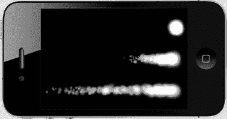

**图 9–1.** *从上到下为同一粒子效果：静止、慢速移动、快速移动*

只有一种效果在启动后无法移动，那就是像图 9–2 中所示的`CCParticleExplosion`这类一次性效果。这种效果的特殊之处在于它会一次性发射所有粒子，并立即停止发射新粒子。所有其他粒子效果都是持续运行的，在生成新粒子的同时，会移除那些已经超过生命周期的粒子。这种情况下，挑战在于平衡屏幕上的粒子总数。

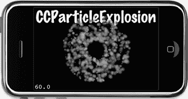

**图 9–2.** *`CCParticleExplosion`是 cocos2d 提供的一个示例效果。*

代码清单 9–1 展示了在`ParticleEffects01`示例项目中使用的相关方法。通过在`switch`语句中使用当前的`particleType`变量，可以创建相应的内置粒子效果。请注意，我们使用一个`CCParticleSystem`指针来存储粒子，因此只需在`runEffect`方法的末尾使用一次`addChild`代码。每个示例粒子效果都派生自`CCParticleSystem`。

**代码清单 9–1.** *使用内置效果*

```
-(void) runEffect
{
    // 移除之前的任何粒子特效
    [self removeChildByTag:1 cleanup:YES];

    CCParticleSystem* system;

    switch (particleType)
    {
        case ParticleTypeExplosion:
            system = [CCParticleExplosion node];
                        break;
        case ParticleTypeFire:
            system = [CCParticleFire node];
            break;
        case ParticleTypeFireworks:
            system = [CCParticleFireworks node];
            break;
        case ParticleTypeFlower:
            system = [CCParticleFlower node];
            break;
        case ParticleTypeGalaxy:
            system = [CCParticleGalaxy node];
            break;
        case ParticleTypeMeteor:
            system = [CCParticleMeteor node];
            break;
        case ParticleTypeRain:
            system = [CCParticleRain node];
            break;
        case ParticleTypeSmoke:
            system = [CCParticleSmoke node];
            break;
        case ParticleTypeSnow:
            system = [CCParticleSnow node];
            break;
        case ParticleTypeSpiral:
            system = [CCParticleSpiral node];
            break;
        case ParticleTypeSun:
            system = [CCParticleSun node];
            break;

        default:
            // 不做任何操作
            break;
    }

    [self addChild: system z:1 tag:1];

    [label setString:NSStringFromClass([system class])];
}

-(void) setNextParticleType
{
    particleType++;
    if (particleType == ParticleTypes_MAX)
    {
        particleType = 0;
    }
}
```

**注意：** 在此示例中，`NSStringFromClass` 方法非常有用，它无需输入数十个匹配的字符串即可打印出类的名称。这是 Objective-C 语言一个很酷的运行时特性之一，即能够获取类名作为字符串。如果想在 C++ 中实现这一点，那将是一件非常麻烦的事。如果你喜欢深入研究这个高级主题，或者只是想了解 Objective-C 在底层是如何工作的，可以从《Objective-C 运行时编程指南》开始： [`developer.apple.com/library/mac/#documentation/Cocoa/Conceptual/ObjCRuntimeGuide/Introduction/Introduction.html`](http://developer.apple.com/library/mac/#documentation/Cocoa/Conceptual/ObjCRuntimeGuide/Introduction/Introduction.html)。

对于游戏逻辑代码而言，`NSStringFromClass` 及相关方法几乎用不上，但它们是非常有用的调试和日志记录工具。你可以在 Apple 的 Foundation 函数参考中找到这些方法的完整列表和描述： [`developer.apple.com/mac/library/documentation/Cocoa/Reference/Foundation/Miscellaneous/Foundation_Functions/Reference/reference.html`](http://developer.apple.com/mac/library/documentation/Cocoa/Reference/Foundation/Miscellaneous/Foundation_Functions/Reference/reference.html)。

如果你在自己的项目中使用了这些示例效果之一，可能会因为看到丑陋的方形像素而感到震惊。图 9–3 清晰地展示了这种效果。发生这种情况是因为所有内置粒子效果都试图加载一个名为`fire.png`的特定纹理，该纹理随 cocos2d-iphone 一起分发在`Resources/Images`文件夹中。即使没有纹理，只要粒子尺寸保持相当小，你仍然可以创建出非常好的粒子效果。但是，要看到内置粒子效果的本意，你需要将`fire.png`图像添加到你的 Xcode 项目中。

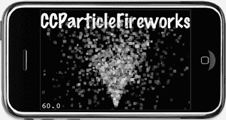

**图 9–3.** *如果你的示例粒子效果（如此处的`CCParticleFireworks`）显示巨大的方形粒子，那是因为你忘了将`fire.png`图像添加到你的 Xcode 项目中。*

### 手动创建粒子效果（传统方式）

你可以轻松创建自己的`CCParticleSystem`类子类。但不那么容易的是，用它创建一个令人信服的粒子效果，更不用说创建一个接近你最初设想的效果了。以下是按功能分组、决定粒子系统外观和行为的属性列表：

- `emitterMode = gravity`
    - `sourcePosition`
    - `gravity`
    - `radialAccel`, `radialAccelVar`
    - `speed`, `speedVar`
    - `tangentialAccel`, `tangentialAccelVar`
- `emitterMode = radius`
    - `startRadius`, `startRadiusVar`, `endRadius`, `endRadiusVar`
    - `rotatePerSecond`, `rotatePerSecondVar`
- `duration`
- `posVar`
- `positionType`
- `startSize`, `startSizeVar`, `endSize`, `endSizeVar`
- `angle`, `angleVar`
- `life`, `lifeVar`
- `emissionRate`
- `startColor`, `startColorVar`, `endColor`, `endColorVar`
- `blendFunc`, `blendAdditive`
- `texture`

可以想象，这里有大量参数可以调整，而这正是实现你目标的主要问题所在：你必须重新构建并运行项目才能看到修改的效果。在阅读本章后面关于 Particle Designer 的部分时，你将了解到它是如何极大地简化新粒子效果创建过程的。

现在，让我们先采用传统方式从头开始，以便理解 cocos2d 粒子系统的工作原理。要从头编写一个粒子效果，你首先要学习如何创建`CCParticleSystem`类的子类以及如何初始化它。随后是对粒子系统属性的详细描述。


### 子类化`CCParticleSystem`：`CCParticleSystemPoint`还是`CCParticleSystemQuad`？

要创建自己的粒子效果而不使用 Particle Designer，你应该从`CCParticleSystemPoint`或`CCParticleSystemQuad`进行子类化。点粒子在第一代和第二代 iOS 设备上运行稍快，但在第三代和第四代设备（如 iPhone 3GS、iPad 和 iPhone 4）上性能不佳。这是由于 CPU 架构的变化。第三代和第四代设备使用的 ARMv7 CPU 架构引入了优化和新特性，例如向量浮点处理器和 SIMD 指令集（NEON）。`CCParticleSystemQuad`类同时受益于这些特性。

如果拿不准，我倾向于使用`CCParticleSystemQuad`，因为它在所有设备上性能表现都相当不错，并且能产生完全相同的视觉效果。或者，让 cocos2d 根据构建目标为你做出决定。你将在`ParticleEffectSelfMade`类中看到如何做到这一点，我将其添加到了 ParticleEffects02 项目中，详情请见清单 9–2。

**清单 9–2.** *从最佳粒子系统类进行子类化*

```
#import <Foundation/Foundation.h>
#import "cocos2d.h"

// 根据目标设备，ParticleEffectSelfMade 类将从 CCParticleSystemPoint 或 CCParticleSystemQuad 派生
@interface ParticleEffectSelfMade : ARCH_OPTIMAL_PARTICLE_SYSTEM
{
}
@end
```

预处理定义`ARCH_OPTIMAL_PARTICLE_SYSTEM`代替了实际的类名，用于在编译期间确定该类应从哪个粒子系统进行子类化。cocos2d 中的定义基于处理器架构，结果为`CCParticleSystemQuad`或`CCParticleSystemPoint`：

```
// 为每个架构构建最优粒子系统
#ifdef __ARM_NEON__
    // armv7
    #define ARCH_OPTIMAL_PARTICLE_SYSTEM CCParticleSystemQuad
#elif __arm__ || TARGET_IPHONE_SIMULATOR
    // armv6 或模拟器
    #define ARCH_OPTIMAL_PARTICLE_SYSTEM CCParticleSystemPoint
#else
    #error(unknown architecture)
#endif
```

现在，让我们看看这个自制的粒子效果的实现，它使用了所有可用的属性。我将尝试解释每一个属性，但最好还是亲自查看并试验这些参数，所以我鼓励你在这个项目中调整这些属性。在 ParticleEffects02 项目中（清单 9–3），你还会找到简要描述每个参数的注释。

**清单 9–3.** *手动设置粒子系统的属性*

```
#import "ParticleEffectSelfMade.h"

@implementation ParticleEffectSelfMade
-(id) init
{
    return [self initWithTotalParticles:250];
}

-(id) initWithTotalParticles:(int)numParticles
{
    if ((self = [super initWithTotalParticles:numParticles]))
    {
        self.duration = kCCParticleDurationInfinity;
        self.emitterMode = kCCParticleModeGravity;

        // 某些属性必须仅与特定的 emitterMode 一起使用！
        if (self.emitterMode == kCCParticleModeGravity)
        {
            self.sourcePosition = CGPointMake(-15, 0);
            self.gravity = CGPointMake(-50, -90);
            self.radialAccel = -90;
            self.radialAccelVar = 20;
            self.tangentialAccel = 120;
            self.tangentialAccelVar = 10;
            self.speed = 15;
            self.speedVar = 4;
        }
        else if (self.emitterMode == kCCParticleModeRadius)
        {
            self.startRadius = 100;
            self.startRadiusVar = 0;
            self.endRadius = 10;
            self.endRadiusVar = 0;
            self.rotatePerSecond = -180;
            self.rotatePerSecondVar = 0;
        }

        self.position = CGPointZero;
        self.posVar = CGPointZero;
        self.positionType = kCCPositionTypeFree;

        self.startSize = 40.0f;
        self.startSizeVar = 0.0f;
        self.endSize = kCCParticleStartSizeEqualToEndSize;
        self.endSizeVar = 0;

        self.angle = 0;
        self.angleVar = 0;

        self.life = 5.0f;
        self.lifeVar = 1.0f;

        self.emissionRate = 30;
        self.totalParticles = 250;

        startColor.r = 1.0f;
        startColor.g = 0.25f;
        startColor.b = 0.12f;
        startColor.a = 1.0f;
        startColorVar.r = 0.0f;
        startColorVar.g = 0.0f;
        startColorVar.b = 0.0f;
        startColorVar.a = 0.0f;
        endColor.r = 0.0f;
        endColor.g = 0.0f;
        endColor.b = 0.0f;
        endColor.a = 1.0f;
        endColorVar.r = 0.0f;
        endColorVar.g = 0.0f;
        endColorVar.b = 1.0f;
        endColorVar.a = 0.0f;

        self.blendFunc = (ccBlendFunc){GL_SRC_ALPHA, GL_DST_ALPHA};
        // 或使用此快捷方式将 blend func 设置为：GL_SRC_ALPHA, GL_ONE
        //self.blendAdditive = YES;

        self.texture = [[CCTextureCache sharedTextureCache] addImage:@"fire.png"];
    }
    return self;
}
@end
```

### `CCParticleSystem`属性

在清单 9–3 中，你会注意到代码相当冗长，原因是有太多粒子系统属性需要初始化。而且，其中大部分属性需要设置为可接受的值，才能在屏幕上显示出一个合理且有意义的粒子效果。有些属性甚至是互斥的，不能一起使用。是时候仔细研究一下这些粒子系统属性具体是做什么的了。

#### 方差属性

你会注意到，许多属性都有后缀为`Var`的伴随属性。这些是方差属性，它们决定了相应属性所允许的模糊范围。以属性`life = 5`和`lifeVar = 1`为例。这些值意味着平均每个粒子会存在 5 秒钟。方差允许的范围是 5-1 到 5+1。因此，每个粒子将获得一个 4 到 6 秒之间的随机生命周期。

如果你不希望有任何变化，请将`Var`变量设置为 0。正是方差赋予了粒子效果那种有机、模糊的行为和外观。但是，当你设计一个新效果时，方差也可能造成混淆，所以除非你有一些经验，否则我建议从一个方差很小或没有方差的粒子效果开始。

#### 粒子数量

让我们从粒子效果中的粒子总数开始了解粒子，该数量由`totalParticles`属性控制。`totalParticles`变量通常由`initWithTotalParticles`方法设置，但之后可以更改。粒子数量直接影响效果的外观和性能。

```
-(id) init
{
    return [self initWithTotalParticles:250];
}
```

如果粒子太少，你将无法获得漂亮的辉光，但可能足以在玩家撞墙时在他头上撒几颗星星。如果粒子太多，也可能不是你想要的，因为许多粒子会重叠渲染并且可能混合，导致你最终看到的是一团白色。此外，使用太多粒子很容易导致帧率下降。这就是 Particle Designer 工具不允许你创建超过 2000 个粒子的效果的原因。

**提示：** 通常，你应该力求使用最少的粒子数来达到理想效果。粒子大小也扮演着重要角色——单个粒子的尺寸越小，性能就会越好。特别是对于粒子效果，在第一代和第二代设备上进行测试非常重要，因为它们会严重且负面地影响旧设备的性能。


#### 发射器持续时间

`duration` 属性决定了粒子将被发射多长时间。如果设置为 2，它将持续两秒生成新粒子，然后停止。就是这么简单：

```
self.duration = 2.0f;
```

如果你希望在粒子系统停止发射粒子且最后一批粒子消散后，自动将粒子效果节点从其父节点中移除，请将 `autoRemoveOnFinish` 属性设置为 `YES`：

```
self.autoRemoveOnFinish = YES;
```

`autoRemoveOnFinish` 属性是一个便捷特性，仅当与**非无限运行**的粒子系统（如一次性爆炸效果）结合使用时才有意义。Cocos2d 为无限运行的粒子效果定义了一个常量 `kCCParticleDurationInfinity (等于: -1)`：

```
self.duration = kCCParticleDurationInfinity;
```

大多数粒子效果是无限运行的，只能通过将其从节点层级中移除来停止。无限运行的粒子效果会忽略 `autoRemoveOnFinish` 属性。

#### 发射器模式

有两种发射器模式：`gravity`（重力）和 `radius`（半径），由 `emitterMode` 属性控制。即使大部分参数相同，这两种模式也会产生截然不同的效果，比较图 9-4 和 图 9-5 即可看出。两种模式都使用了一些专属属性（见列表 9-3），如果当前模式不支持这些属性，则不应设置它们；否则，你会收到来自 cocos2d 的运行时异常，如下所示：

```
ParticleEffects[6332:207] *** Terminating app due to uncaught exception
            'NSInternalInconsistencyException', reason: 'Particle Mode should be Radius'
```

##### 发射器模式：重力

重力模式让粒子飞向或飞离一个中心点。其优势在于能够创造出非常动态、有机的效果。你可以通过以下代码设置重力模式：

```
self.emitterMode = kCCParticleModeGravity;
```

重力模式使用以下专属属性，仅在 `emitterMode` 设置为 `kCCParticleModeGravity` 时才能使用：

```
self.sourcePosition = CGPointMake(-15, 0);
self.gravity = CGPointMake(-50, -90);
self.radialAccel = -90;
self.radialAccelVar = 20;
self.tangentialAccel = 120;
self.tangentialAccelVar = 10;
self.speed = 15;
self.speedVar = 4;
```

`sourcePosition` 决定了新粒子出现时相对于节点位置的偏移量（`CGPoint`）。这个名称有些误导性，因为实际的重力中心是节点的位置，而 `sourcePosition` 是相对于该重心的偏移。`gravity` 属性则决定了粒子在 `x` 和 `y` 方向上加速的速度。在此例中，负值表示重力会使粒子向左（-50）和向下（-90）加速。但这个加速度是相对于粒子节点位置的。由于粒子从 `sourcePosition` 偏移量 -15（略微偏左）的位置开始，它们将围绕粒子节点位置进行逆时针运动。你可以在图 9-4 中看到这种效果，在 ParticleEffects02 项目中调整这些数值有助于理解 `sourcePosition` 和 `gravity` 如何影响粒子的运动。

要使重心产生任何影响，粒子的重力不应太大，并且 `sourcePosition` 的偏移量也不应过远。上述数值为你提供了一个良好的工作示例，你可以对其进行调整。

`radialAccel` 属性定义了粒子远离发射器时加速的速率。该参数也可以是负值，这会使粒子在远离时减速。`tangentialAccel` 属性类似，它使粒子围绕发射器旋转，并在远离时加速。负值使粒子顺时针旋转，正值则使其逆时针旋转。

`speed` 属性应该相当直观——它只是粒子的速度。它没有特定的度量单位。图 9-4 展示了一个使用重力模式的粒子效果示例。粒子被粒子节点的位置所吸引，并且起始位置略微偏左，因此它们进行逆时针径向运动。

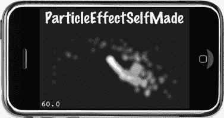

**图 9-4.** *ParticleEffects02 项目中重力模式下的 ParticleEffectSelfMade*

##### 发射器模式：半径

半径模式使粒子沿圆周旋转。它还允许你创建螺旋效果，粒子既可以向内旋转，也可以向外旋转。你可以通过以下代码设置半径模式：

```
self.emitterMode = kCCParticleModeRadius;
```

与重力模式一样，半径模式也有专属属性。以下属性仅在 `emitterMode` 设置为 `kCCParticleModeRadius` 时才能使用：

```
self.startRadius = 100;
self.startRadiusVar = 0;
self.endRadius = 10;
self.endRadiusVar = 0;
self.rotatePerSecond = -180;
self.rotatePerSecondVar = 0;
```

`startRadius` 属性决定了粒子在被发射时距离粒子效果节点位置的距离。同样，`endRadius` 决定了粒子在旋转过程中最终应到达的距离节点位置的距离。如果你想实现完美的圆形效果，可以将 `endRadius` 设置为与 `startRadius` 相同，使用以下常量：

```
self.endRadius = kCCParticleStartRadiusEqualToEndRadius;
```

通过 `rotatePerSecond` 属性，你可以影响粒子的运动方向和速度，从而在 `startRadius` 和 `endRadius` 不同时，控制它们围绕旋转的次数。

在图 9-4 中使用重力模式展示的同一个粒子效果，在图 9-5 中则使用了半径模式，你会注意到它的外观有多么不同，尽管所有其他属性（专属属性除外）都是相同的。要进行测试，请在 ParticleEffects02 项目中取消注释以下代码行：

```
//self.emitterMode = kCCParticleModeRadius;
```

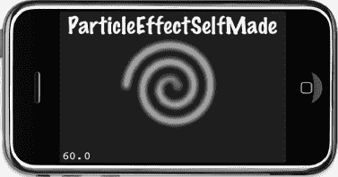

**图 9-5.** *使用半径模式的同一个效果看起来完全不同。*

#### 粒子位置

通过移动节点，你也会移动效果。但该效果也有一个 `posVar` 属性，它决定了新粒子生成位置的方差。默认情况下，两者都位于节点的中心：

```
self.position = CGPointZero;
self.posVar = CGPointZero;
```

粒子位置的一个非常重要的方面是，现有粒子是应随节点移动而移动，还是根本不受节点位置的影响。例如，如果你有一个在玩家角色头部周围产生星星的粒子效果，你会希望星星在玩家移动时跟随玩家。你可以通过设置以下属性来实现此效果：

```
self.positionType = kCCPositionTypeGrouped;
```

另一方面，如果你想让玩家着火，并希望粒子在玩家移动时产生类似拖尾的效果，则应将 `positionType` 属性设置如下：

```
self.positionType = kCCPositionTypeFree;
```

自由移动最适合用于蒸汽、火焰、引擎排烟等效果，以及类似的效果，这些效果会随所附着对象一起移动，并且应该给人一种与其发射粒子的对象没有关联的印象。


好的，作为一名高级文档工程师和翻译员，我将严格遵循您的注意事项和示例格式，将给定的英文文本翻译成专业、准确的中文。


#### 粒子大小

粒子的大小由 `startSize` 和 `endSize` 属性以像素为单位给出，它们决定了粒子发射时的大小以及被移除时的大小。粒子的大小会从 `startSize` 逐渐缩放至 `endSize`。

```
self.startSize = 40.0f;
self.startSizeVar = 0.0f;
self.endSize = kCCParticleStartSizeEqualToEndSize;
self.endSizeVar = 0;
```

常量 `kCCParticleStartSizeEqualToEndSize` 可用于确保粒子在其生命周期内大小保持不变。

#### 粒子方向

粒子初始发射的方向由 `angle` 属性设置，以 0 到 360 度的角度为单位。值为 `0` 表示粒子将向上发射，但这仅适用于重力 `emitterMode`。在半径 `emitterMode` 中，`angle` 属性决定了粒子将在 `startRadius` 上的哪个位置发射；值越大，发射点将沿半径逆时针移动。

```
self.angle = 0;
self.angleVar = 0;
```

#### 粒子生命周期

粒子的生命周期决定了它从开始到结束需要多少秒，结束时会淡出并消失。`life` 属性设置单个粒子的生命周期。请记住，粒子的生命周期越长，任何时刻屏幕上显示的粒子就越多。如果达到了粒子的总数上限，则在部分现有粒子消亡之前，不会生成新的粒子。

```
self.life = 5.0f;
self.lifeVar = 1.0f;
```

`emissionRate` 属性直接影响每秒创建的粒子数量。与 `totalParticles` 属性一起，它对粒子效果的外观有很大影响。

```
self.emissionRate = 30;
self.totalParticles = 250;
```

通常，您需要平衡 `emissionRate`，使其与粒子生命周期以及粒子效果中允许的 `totalParticles` 相匹配。您可以通过将 `totalParticles` 除以 `life` 并将结果设置为 `emissionRate` 来实现这一点：

```
self.emissionRate = self.totalParticles / self.life;
```

**提示：** 通过调整粒子生命周期、系统中允许的粒子总数以及 `emissionRate`，您可以创建爆发效果，即让粒子流频繁中断，仅仅因为屏幕上的粒子数量有限，而新粒子发射得相对较快。另一方面，如果您注意到粒子流中出现不希望的间隙，则需要增加允许的粒子数量，或者更好的做法是减少生命周期和/或发射速率。在这种情况下，您应该使用 `emissionRate = totalParticles / life`。

#### 粒子颜色

每个粒子可以从起始颜色过渡到结束颜色，从而产生粒子效果闻名的鲜艳色彩。您至少应该在粒子效果中设置 `startColor`；否则，由于默认颜色是黑色，粒子可能完全不可见。颜色类型为 `ccColor4F`，这是一个具有四个浮点成员的结构体：`r`、`g`、`b` 和 `a`，分别对应红色、绿色、蓝色以及决定颜色不透明度的 alpha 通道。每个成员的值范围是 0 到 1，其中 1 代表全色。

如果您想要一个纯白色的粒子颜色，需要将 `r`、`g`、`b` 和 `a` 四个成员全部设置为 `1`。如果您想要红色，只需要将 `r` 和 `a` 的值设置为 `1.0f`。如果您想要蓝色，则将 `b` 和 `a` 设置为 `1.0f`。请注意，`a` 值是颜色的 alpha 透明度。如果您将其保留在默认值 `0.0f`，颜色将完全透明，因此不可见。

```
// startColor 主要为红色且完全不透明
startColor.r = 1.0f;
startColor.g = 0.25f;
startColor.b = 0.12f;
startColor.a = 1.0f;
// startColor 没有变化（正负 0.0f）
startColorVar.r = 0.0f;
startColorVar.g = 0.0f;
startColorVar.b = 0.0f;
startColorVar.a = 0.0f;
// endColor 是完全不透明的黑色
endColor.r = 0.0f;
endColor.g = 0.0f;
endColor.b = 0.0f;
endColor.a = 1.0f;
// endColorVar 为蓝色指定了全范围的变化
// 粒子在生命周期结束时的颜色将在黑色和蓝色之间随机
endColorVar.r = 0.0f;
endColorVar.g = 0.0f;
endColorVar.b = 1.0f;
endColorVar.a = 0.0f;
```

#### 粒子混合模式

*混合* 是指粒子的像素在显示到屏幕之前所经过的计算过程。`blendFunc` 属性接收一个 `ccBlendFunc` 结构体作为输入，该结构体提供源混合模式和目标混合模式：

```
self.blendFunc = (ccBlendFunc){GL_SRC_ALPHA, GL_DST_ALPHA};
```

混合的工作原理是，获取源图像（粒子）的红、绿、蓝和 alpha 值，并将其与渲染粒子时屏幕上已有的任何图像的颜色混合。实际上，粒子以其背景特定方式进行混合，而 `blendFunc` 决定了源图像的颜色有多少以及与背景的哪些颜色进行混合，以及混合的程度。

确定屏幕上最终像素颜色的公式如下：

```
(源颜色 * 源混合函数) + (目标颜色 * 目标混合函数)
```

假设示例中的源像素的 RGB 值为 `(0.1, 0.2, 0.3)`，目标像素的 RGB 值为 `(0.4, 0.5, 0.6)`。两个颜色值都乘以混合函数，最简单的就是 `GL_ONE`，它等于 `1.0`。这意味着生成的像素颜色将如下：

```
(0.1 * 1 + 0.4 * 1, 0.2 * 1 + 0.5 * 1, 0.3 * 1 + 0.6 * 1) = (0.5, 0.7, 0.9)
```

`blendFunc` 属性对粒子的显示方式有着非常深远的影响。通过对源和目标使用以下混合模式的组合，您可以创建相当奇异的效果，或者简单地导致效果渲染为黑色方块。这为实验提供了很大空间。

*   `GL_ZERO`
*   `GL_ONE`
*   `GL_SRC_COLOR`
*   `GL_ONE_MINUS_SRC_COLOR`
*   `GL_SRC_ALPHA`
*   `GL_ONE_MINUS_SRC_ALPHA`
*   `GL_DST_ALPHA`
*   `GL_ONE_MINUS_DST_ALPHA`

您可以在 OpenGL ES 文档中找到关于 OpenGL 混合模式的更多信息以及混合计算的细节，地址是 [www.khronos.org/opengles/documentation/opengles1_0/html/glBlendFunc.html](http://www.khronos.org/opengles/documentation/opengles1_0/html/glBlendFunc.html)。

**提示：** 由于很难想象哪些混合函数会在不同图像上产生何种结果，我想为您推荐一篇描述了最常见混合操作并附有示例图像的文章：[www.machwerx.com/2009/02/11/glblendfunc/](http://www.machwerx.com/2009/02/11/glblendfunc/)。

更有趣的是 Anders Riggelsen 开发的 Visual glBlendFunc 工具：[www.andersriggelsen.dk/OpenGL/](http://www.andersriggelsen.dk/OpenGL/)。使用任何兼容 HTML5 的浏览器，您都可以尝试各种图像和混合函数，并立即看到结果。

请注意，您也可以修改其他 cocos2d 节点的 `blendFunc` 属性，即所有遵循 `CCBlendProtocol` 协议的节点，例如 `CCSprite`、`CCSpriteBatchNode`、`CCLabelTTF`、`CCLayerColor` 和 `CCLayerGradient` 等类。

源混合模式和目标混合模式 `GL_SRC_ALPHA` 和 `GL_ONE` 经常组合使用以创建加法混合，从而在许多粒子相互叠加绘制时产生非常明亮甚至白色的颜色：

```
self.blendFunc = (ccBlendFunc){GL_SRC_ALPHA, GL_ONE};
```

或者，您也可以简单地将 `blendAdditive` 属性设置为 `YES`，这与将 `blendFunc` 设置为 `GL_SRC_ALPHA` 和 `GL_ONE` 效果相同：

```
self.blendAdditive = YES;
```

使用 `GL_SRC_ALPHA` 和 `GL_ONE_MINUS_SRC_ALPHA` 可以设置常规混合模式，这将创建透明粒子：

```
self.blendFunc = (ccBlendFunc){GL_SRC_ALPHA, GL_ONE_MINUS_SRC_ALPHA};
```


#### 粒子纹理

如果没有纹理，所有粒子都将是扁平的彩色方块，如图 9–3 所示。要为粒子效果使用纹理，请使用 `CCTextureCache` 的 `addImage` 方法提供一个纹理，该方法会返回给定图像文件的 `CCTexture2D`：

```
self.texture = [[CCTextureCache sharedTextureCache] addImage:@"fire.png"];
```

粒子纹理的最佳效果是呈云状且大致为球形。如果纹理具有高对比度区域，类似于特定的形状或形态（例如射击游戏中的 `redcross.png`），通常会对粒子效果产生不利影响。这使得单个粒子更容易被识别出来，因为它们之间的融合效果不佳。某些效果可以巧妙地利用这一点，比如之前提到的在玩家头部周围旋转的星星。此外，卡通风格的图片或渐变效果最佳，而逼真照片风格的图片往往会产生难以辨认的像素混乱。为了验证这一点，你将在图 9–6 中看到三种不同纹理应用于同一粒子效果的情况。

粒子纹理最重要的一点是：图像的尺寸**必须**不超过 64x64 像素。纹理尺寸越小，粒子效果的运行性能越好。

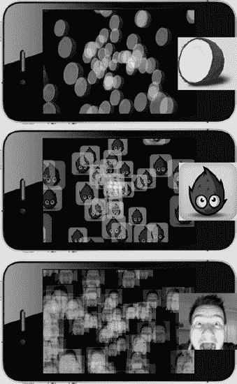

**图 9–6.** *同一粒子效果使用不同纹理的情况。逼真照片风格的图像效果不佳。*

### 粒子设计器

粒子设计器是一款用于为 cocos2d 和 iOS OpenGL 应用程序创建粒子效果的交互式工具。你可以从 [`http://particledesigner.71squared.com`](http://particledesigner.71squared.com) 下载试用版。

这是一款非常宝贵的工具，能为你节省大量创建粒子效果的时间。它的强大之处在于，你可以立即看到更改粒子效果属性时屏幕上发生的变化，并且你可以与他人分享你的创作，同时从其他开发者的粒子效果中获得灵感。

#### 粒子设计器介绍

默认情况下，粒子设计器的用户界面会显示一个粒子效果的视觉列表。要编辑特定效果，请选中它，然后通过双击或点击右上角的 `Emitter Config`（发射器配置）按钮，切换到 `Emitter Config` 视图（图 9–7）。

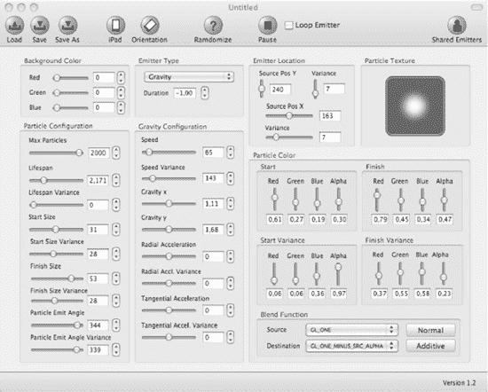

**图 9–7.** *粒子设计器充满了可以交互式调整的属性。一个单独的窗口（图 9–8）会在你编辑时同步显示效果。*

你应该能认出这些参数，它们与之前描述的自制粒子效果属性一致。只有少数属性在粒子设计器中不可用或无法编辑。一个是 `positionType`，另一个是半径发射器模式的 `endRadiusVar` 属性。后者意味着你无法创建在半径模式下向外旋转的粒子效果。但你可以随时加载一个粒子设计器效果，然后通过覆盖某些属性（例如将 `positionType` 设置为 `kCCPositionTypeFree`，稍后将在代码清单 9–4 中实现）在代码中对其进行微调。与实际看到滑块移动时效果如何变化相比，这只是一点小麻烦。

**注意**：粒子设计器的开发者目前正在开发粒子设计器 2.0，该版本将拥有重新设计的、不那么拥挤的用户界面。他们还计划创建专门的控件，允许你通过单个类似计量器的控件同时更改值和方差。因此，如果你的粒子设计器与图 9–7 中的外观大不相同，你可能正在使用 2.0 版本。如果你阅读本文时 2.0 版本尚未发布，请知悉现有客户可以免费升级至 2.0 版本。

唯一不常用的控件是“粒子纹理”。这里没有用于加载图像的按钮，双击该字段也不会产生任何效果。其中的诀窍在于：粒子纹理框只接受拖放至其上的图像。只需从 Finder 中拖动任意图像到该框上，该框就会变绿，表示它可以接受该图像。一旦你放下图像，它就会被粒子效果使用。

**警告：** 如果你拖放的图像尺寸大于 512x512 像素，粒子设计器会发出警告。它仍会使用该图像，但会将其缩小至 512x512 像素，而忽略其原始宽高比。另外请注意，粒子设计器 1.3 版本已经移除了此前对纹理 64x64 像素的限制。

图 9–8 中的粒子设计器预览窗口看起来与 iPhone 模拟器一模一样。它也可以设置为 iPad 屏幕尺寸，并且可以通过点击粒子设计器菜单栏中“Load”、“Save”和“Save As”按钮右侧的 `iPad`/`iPhone` 和 `Orientation`（方向）按钮来更改方向。通过点击并在预览窗口内拖动，你可以移动粒子效果，这有助于你了解效果在移动物体上可能呈现的样子。

请注意，背景颜色设置并非实际效果的组成部分。它们只会改变预览窗口的背景色。如果你的游戏色彩明亮，而你想要设计一个暗淡或微弱的效果，并且仍然能够看清你在做什么，这个功能会很有用。

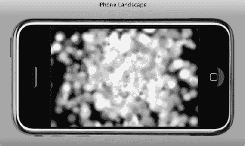

**图 9–8.** *粒子设计器有一个类似于 iPhone 模拟器的预览窗口。你也可以将其设置为 iPad 屏幕尺寸并更改其方向。如果在屏幕内点击并拖动，你甚至可以移动粒子效果，以查看其在移动物体上可能呈现的效果。*

如果你缺乏灵感，可以随时使用 `Ramdomize`（随机化）按钮。你也可以琢磨一下 *ramdomize* 这个单词的含义，在粒子设计器中它就是这么拼写的。根据《城市词典》的解释，*ramdom* 是随机（random）的一种更酷的说法。所以，我猜开发者只是觉得他们的随机化工具格外酷。嗯，尽管它并没有随机化所有可用属性，但它的确能激发灵感。例如，`Ramdomize` 永远不会更改发射器类型、发射器位置以及许多发射器类型特有的参数。

一旦你找到了灵感，你就可以滑动滑块，观察预览窗口中的变化。慢慢来，调整一个效果，直到你满意为止。不过要小心，因为这确实是一项极具吸引力甚至令人着迷的活动，你会很容易发现自己仅仅为了乐趣而创建新的粒子效果。

**警告：** 设计粒子效果时请务必谨慎！首先，请记住，你的游戏还需要计算和渲染许多其他内容。如果你当前设计的效果在粒子设计器的预览窗口中以 60 FPS 运行，这并不意味着它在你的游戏中使用时不会拖慢帧率。始终在游戏中测试新的粒子效果，并密切关注帧率。此外，请务必在设备上（尤其是在旧款设备上！）运行这些测试！你的游戏在 iPhone/iPad 模拟器中的性能表现通常具有误导性，因此必须视为完全不可靠。粒子设计器预览窗口也是如此。


#### 使用粒子设计器效果

假设几小时后，你已经制作出完美的粒子效果，并希望在 cocos2d 中使用它。我制作完成后，第一步就是保存粒子效果。在粒子设计器中点击 `Save` 或 `Save As` 按钮时，会弹出一个对话框，如图 9-9 所示。

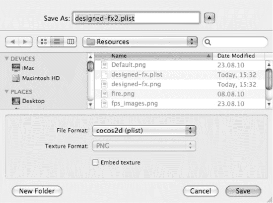

**图 9–9.** *从粒子设计器保存粒子效果时，需要将文件格式设置为 cocos2d。可选择将纹理嵌入 plist 文件。*

要使保存的粒子效果能被 cocos2d 使用，必须将`文件格式`设置为`cocos2d (plist)`。你还可以勾选`嵌入纹理`复选框，这样纹理将保存在 plist 文件中。这样做的好处是只需将 plist 文件添加到 Xcode 项目中；缺点则是如果不将粒子效果重新加载回粒子设计器，就无法更改效果的纹理。

保存效果后，你需要将效果 plist 文件（如果未嵌入纹理，还需添加效果的 PNG 文件）添加到 Xcode 项目的资源组中。在 `ParticleEffects03` 项目中，我添加了两种变体：一种使用单独的 PNG 纹理，另一种将纹理嵌入 plist 文件中。

代码清单 9–4 展示了如何修改 `runEffect` 方法来加载粒子设计器效果。

**代码清单 9–4.** *使用粒子设计器创建的粒子效果*

```
-(void) runEffect
{
    // 移除之前的粒子效果
    [self removeChildByTag:1 cleanup:YES];

    CCParticleSystem* system;

    switch (particleType)
    {
        case ParticleTypeDesignedFX:
            system = [CCParticleSystemQuad particleWithFile:@"fx1.plist"];
            break;
        case ParticleTypeDesignedFX2:
            system = [CCParticleSystemQuad particleWithFile:@"fx2.plist"];
            system.positionType = kCCPositionTypeFree;
            break;
        case ParticleTypeSelfMade:
            system = [ParticleEffectSelfMade node];
            break;

        default:
            // 不执行任何操作
            break;
    }

    CGSize winSize = [[CCDirector sharedDirector] winSize];
    system.position = CGPointMake(winSize.width / 2, winSize.height / 2);
    [self addChild:system z:1 tag:1];

    [label setString:NSStringFromClass([system class])];
}
```

要使用粒子设计器效果初始化 `CCParticleSystem`，需调用 `particleWithFile` 方法，并将粒子效果的 plist 文件作为参数传入。这里我选择了 `CCParticleSystemQuad`，因为它在所有 iOS 设备上性能表现良好。你也可以使用 `ARCH_OPTIMAL_PARTICLE_SYSTEM` 关键字代替具体的类名，将这一决定交给 cocos2d：

```
system = [ARCH_OPTIMAL_PARTICLE_SYSTEM particleWithFile:@"fx1.plist"];
```

**注意：** 粒子设计器效果必须用 `CCParticleSystemQuad` 或 `CCParticleSystemPoint` 初始化。尽管上述子类的父类 `CCParticleSystem` 实现了 `particleWithFile` 方法，但在加载粒子设计器效果时，如果不使用 Quad 或 Point 粒子系统这两个子类，则不会显示任何内容。

顺便提一下，我将定位粒子系统节点到屏幕中心的两行代码移到了 `switch` 语句之外，以避免重复代码。如我之前所述，尽量减少代码重复始终是一个好习惯，而这也是我经常看到开发者直接复制粘贴已有代码的地方。

#### 分享粒子效果

粒子设计器非常酷的一点是，你可以与其他用户分享你的创作。从粒子设计器菜单中，选择`分享`，然后点击`分享发射器`，即可打开一个对话框，让你为粒子效果输入标题和描述，如图 9-10 所示。

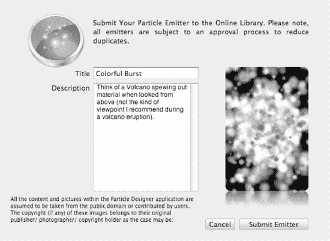

**图 9–10.** *通过将粒子效果提交到在线库，你可以与其他用户分享创作。*

**注意：** 如图 9-8 中的消息所示，请务必小心，只上传你拥有共享和分发权限的艺术作品，或者你拥有版权的作品。否则，你可能面临侵犯他人版权，或违反保密协议或其他合同条款的风险（如果你是按合同工作的话）。

在图 9-11 中，你可以在右下角看到我刚刚提交的效果。

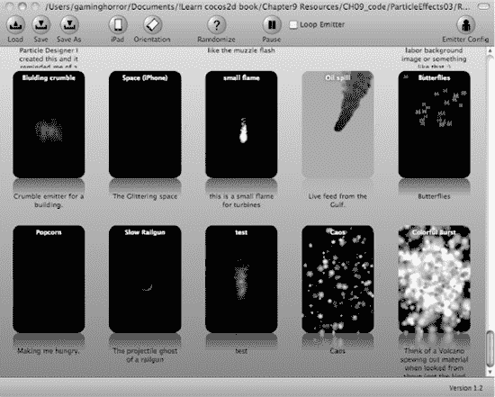

**图 9–11.** *提交的效果会迅速出现在在线库中。我刚刚提交的效果位于右下角。显然我的描述太长，无法在显示区域内完整显示。*

分享的粒子效果可能并非总是完美满足你的需求，但它们通常为你自己的效果提供了良好的起点。它们能帮助你更快地达到所需效果，至少也能提供灵感。我鼓励你浏览效果列表，尽可能多地尝试，以充分了解哪些效果可行、哪些看起来不错、以及哪些完全不起作用。


### 用粒子效果打造弹幕射击游戏

我非常希望能在游戏中看到这些效果！让我们把这款弹幕射击游戏提升到一个新高度。你可以在本章的 `ShootEmUp04` 项目中找到相关成果，其中还加入了音效，具体效果如图 9-12 所示。

在 `EnemyEntity` 类中，`gotHit` 方法是添加破坏性粒子爆炸效果的绝佳位置，如代码清单 9-5 所示。我决定让 Boss 怪物拥有专属的粒子效果，主要因为它体型庞大，而且颜色是紫色的。

**代码清单 9-5.** *为弹幕射击游戏添加爆炸效果*

```
-(void) gotHit
{
    hitPoints--;
    if (hitPoints <= 0)
    {
        self.visible = NO;

        // 当敌人被摧毁时播放粒子效果
        CCParticleSystem* system;

        if (type == EnemyTypeBoss)
        {
            system = [ARCH_OPTIMAL_PARTICLE_SYSTEM particleWithFile:@"fx-explosion2.plist"];
        }
        else
        {
            system = [ARCH_OPTIMAL_PARTICLE_SYSTEM particleWithFile:@"fx-explosion.plist"];
        }

        // 设置一些无法在粒子设计器中设置的参数
        system.positionType = kCCPositionTypeFree;
        system.autoRemoveOnFinish = YES;
        system.position = self.position;

        [[GameScene sharedGameScene] addChild:system];
    }
}
```

粒子效果文件 `fx-explosion.plist` 和 `fx-explosion2.plist` 必须作为资源添加到 Xcode 项目中。粒子系统的初始化方式与之前相同。由于粒子效果应该且必须独立于创建它的敌人，因此需要进行一些准备工作。首先，将 `autoRemoveOnFinish` 标志设置为 `YES`，以便效果自动移除。这之所以可行，是因为两种爆炸效果的持续时间都很短。此外，效果还需要获取敌人的当前位置，以便在正确的位置显示。

我将粒子效果添加到 `GameScene` 中，因为敌人本身无法显示粒子效果。一开始，敌人是不可见的，而且它可能很快会重生，这会影响粒子效果。但最重要的是，所有 `EnemyEntity` 对象都添加到了 `CCSpriteBatchNode` 中，该节点只允许添加 `CCSprite` 对象。如果粒子效果直接添加在 `EnemyEntity` 对象上，必然会导致运行时异常。

当你使用新的粒子效果玩游戏时，可能会注意到第一次显示这些效果时，游戏会短暂地暂停一下。这是因为 cocos2d 正在加载粒子效果的纹理——这一过程相当缓慢，无论纹理是如本例这样嵌入 plist 文件，还是作为独立的纹理提供。为了避免这种情况，我在 `GameScene` 中添加了一个预加载机制：现在 `init` 方法会为游戏过程中使用的每个粒子效果调用 `preloadParticleEffect` 方法：

```
// 为了预加载纹理，在屏幕外播放每个效果一次
[self preloadParticleEffects:@"fx-explosion.plist"];
[self preloadParticleEffects:@"fx-explosion2.plist"];
```

`preloadParticleEffects` 方法只是简单地创建粒子效果。由于返回的对象是自动释放对象，其内存会被自动释放。但它加载的纹理仍会保存在 `CCTextureCache` 中。

```
-(void) preloadParticleEffects:(NSString*)particleFile
{
    [ARCH_OPTIMAL_PARTICLE_SYSTEM particleWithFile:particleFile];
}
```

如果你选择不将纹理嵌入粒子效果的 plist 文件，那么只需调用 `CCTextureCacheaddImage` 方法即可预加载粒子效果纹理：

```
[[CCTextureCache sharedTextureCache] addImage:particleFile];
```

**图 9-12.** *我干掉了 Boss，眼前一片模糊。但那些粒子效果真是太美了！*

### 小结

本章真是一场视觉盛宴！cocos2d 提供的内置效果很好地展示了粒子系统所能实现的效果，而且使用起来快速便捷。

但在代码中创建粒子效果也相当繁琐。需要调整的属性太多：有些属性是特定发射器模式专用的；有些名称具有误导性，而且理解起来并不直接。然而，通过对每个属性的解释，你现在应该对粒子效果的构成以及最重要的参数有了很好的理解。

接着，我们看到了粒子效果如何通过 `Particle Designer` 大放异彩。这款工具非常有用，而且使用起来乐趣无穷。当你能够移动滑块并在屏幕上即时看到结果时，它彻底改变了你对粒子效果的看法，更棒的是，你可以与他人分享你的创作，并体验其他设计师制作的效果。

最后，弹幕射击游戏进行了改造，现在敌人被摧毁时会播放粒子爆炸效果。这让游戏变得更加生动。

在下一章中，我将暂时放下弹幕射击游戏，向你介绍关于瓦片地图你需要了解的一切。

## 第 10 章

## 使用瓦片地图

在接下来的两章中，我将带你进入基于瓦片的游戏世界。无论你是从《创世纪》这类经典角色扮演游戏时代就开始玩游戏，还是最近才加入 Facebook 上与朋友一起玩《Farmville》，我相信你一定玩过使用瓦片地图概念来显示图形的游戏。

在瓦片地图游戏中，图形由少量可相互对齐的图像（称为 *瓦片*）组成；将它们放置在网格上，就能构建出相当可信的游戏世界。这个概念非常有吸引力，因为与将整个世界绘制成独立纹理相比，它节省了内存，同时仍然允许大量的变化。

本章将通过使用最简单的瓦片地图——*正交瓦片地图*——来介绍瓦片地图的通用概念。它们通常由正方形瓦片构建而成，偶尔也会使用非正方形的矩形瓦片，并且通常以俯视方式显示世界。我将讨论瓦片地图的各种显示风格，下一章将重点介绍等距瓦片地图，并会基于你在本章学到的瓦片地图编程基础知识进行讲解。


### 什么是瓦片地图？

瓦片地图是由独立瓦片构成的二维游戏世界。你只需使用少量尺寸相同的图像，就能创建出庞大的世界地图。这意味着瓦片地图在节省大型地图（游戏世界）内存方面非常高效。因此，它们最早出现在计算机游戏发展的初期也就不足为奇了。许多经典的角色扮演游戏都使用方形瓦片来构建奇幻世界。这些游戏看起来有点像图 10-1 中的瓦片地图，它也是一个正交瓦片地图的完美示例。它看起来像是从正上方俯视的鸟瞰图。因此，正交瓦片地图通常看起来是平面的。

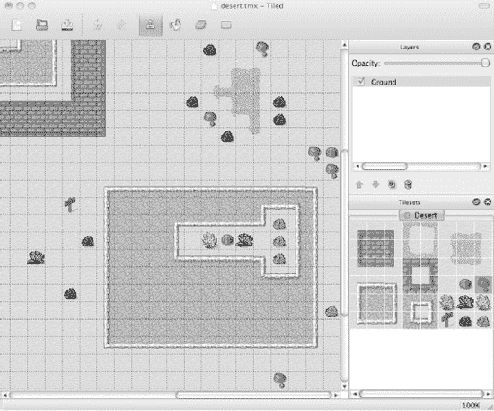

**图 10-1.** *Tiled (Qt) 地图编辑器中的正交瓦片地图*

实际上，正交瓦片地图中的瓦片不一定是方形的；你也可以使用矩形图像创建正交瓦片地图。这类地图在亚洲角色扮演游戏中最为常见，例如《勇者斗恶龙》。虽然仍使用正交视角，但它允许设计者创建出看似高大于宽的物体。这使得设计者能够通过将多个瓦片组合绘制成房屋等物体，并允许游戏角色被部分瓦片遮挡，从而营造出体积感的错觉。

这种方法在《创世纪 6》和特别是《创世纪 7》中大放异彩。通过倾斜绘制瓦片的视角，其效果接近等距瓦片地图，但本质上仍是正交瓦片地图。使用这种方法，设计者能够创造出深度感的错觉，如图 10-2 所示。

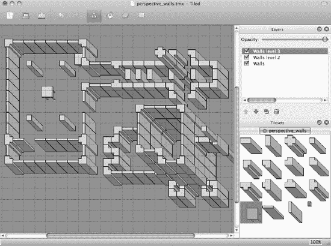

**图 10-2.** *一种带有透视瓦片的正交瓦片地图，设计为通过多层构建来营造深度感。这种瓦片地图风格因《创世纪 7》而闻名。*

等距瓦片地图则更进一步，它不仅以特定透视角度绘制瓦片，还将瓦片旋转了 45 度。等距瓦片地图能非常有效地欺骗我们的大脑，让我们相信这个世界中确实存在第三维度，尽管所有图像本质上仍然是平面的。等距瓦片地图通过使用绘制成菱形（菱形形状）的瓦片图像，并允许靠近观察者的瓦片覆盖远离观察者的瓦片，从而实现了这种深度感。请参见图 10-3 中的等距瓦片地图示例，我将在下一章中更详细地讨论它。

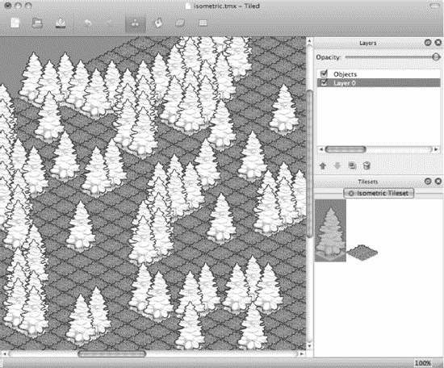

**图 10-3.** *Tiled (Qt) 地图编辑器中的等距瓦片地图*

图 10-2 和图 10-3 中的瓦片地图证明，瓦片地图不必看起来是平面的。瓦片的分层或堆叠技术也可用于某些允许玩家与游戏世界互动的游戏，许多《Farmville》粉丝视频就展示了其绝佳效果。一些《Farmville》用户仅通过堆叠瓦片，就利用农田建造了房屋甚至摩天大楼。他们利用了等距瓦片地图中可能实现的光学错觉。

编辑瓦片地图通常使用编辑器完成，而 `cocos2d` 直接支持的编辑器名为 Tiled (Qt) 地图编辑器。Tiled 是免费开源软件，允许你编辑包含多个图层的正交和等距瓦片地图。Tiled 还允许你添加触发区域（对象图层），在游戏中可用于在角色进入该区域时触发特定动作。它们也可以用来在地图上添加任意位置，例如定义生成点。通过编辑瓦片属性，你可以确定它是何种类型的瓦片。这也可以用于阻止角色进入某些瓦片，或者例如在角色经过熔岩瓦片时受到伤害。

**注意：** Qt 指的是诺基亚的 Qt 框架，Tiled 正是基于此框架构建。由于还存在一个已停止维护的 Java 版 Tiled，因此通过写作 Tiled (Qt) 来区分两者就很重要。Java 版已不再更新，但包含一些值得一试的额外功能。但在本章及下一章中，我将使用并讨论 Tiled (Qt)。

### 使用 TexturePacker 准备图像

在开始使用 Tiled (Qt) 地图编辑器之前，你需要准备好瓦片地图图形。瓦片地图的瓦片图像集通常被称为*瓦片集*。从技术上讲，它只是一个包含瓦片图像的纹理图集。

在本章的 `Tilemap01` 项目中，你会在 `Assets/tiles` 文件夹中找到一些方形瓦片图像。将所有瓦片图像添加到 `TexturePacker`，然后取消勾选 `Allow Rotation`，将 `Algorithm` 设置为 `Basic`，并将 `Sort by` 设置为 `Name`。这些设置确保瓦片能正确排序并对齐，以供 Tiled 使用。在 `TexturePacker` 中生成的瓦片集看起来应该类似于图 10-4。

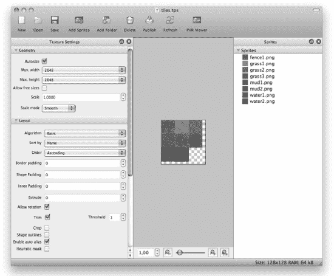

**图 10-4.** *使用 TexturePacker 创建包含几个方形瓦片的纹理图集*

对于 Tiled 来说，保持瓦片位置不变至关重要——这就是按名称排序如此重要的原因——因为 Tiled 仅通过位置和偏移来引用瓦片集中的单个瓦片。这意味着如果纹理中的瓦片位置发生改变，使用此瓦片集纹理的 Tiled 瓦片地图将会看起来完全不同。瓦片地图仍然引用瓦片集中相同的位置，但例如，原本在草地瓦片的位置现在可能变成了水瓦片。

**注意：** `TexturePacker` 将新增一个名为 `TileMap` 的算法——这是一种为瓦片地图创建瓦片集的特殊模式，允许你手动在网格中排列瓦片。请访问 [`www.texturepacker.com`](http://www.texturepacker.com) 了解此新功能的可用性和更多信息。

### Tiled (Qt) 地图编辑器

创建可与 `cocos2d` 配合使用的瓦片地图最流行的工具是我在前面章节中已经提到的 Tiled (Qt) 地图编辑器。它生成的 `TMX` 文件受到 `cocos2d` 游戏引擎的原生支持。`TMX` 文件本质上是 `XML` 文件，必要时你可以使用文本编辑器进行编辑。

Tiled 可供免费下载，在撰写本文时，最新版本是 0.7 版。你可以从 Tiled 的主页 [`www.mapeditor.org`](http://www.mapeditor.org) 下载它。

如果你想支持 Tiled 的开发，可以考虑向项目开发者 Thorbjørn Lindeijer 捐款。你可以在此处向项目捐款： [`http://sourceforge.net/donate/index.php?group_id=161281`](http://sourceforge.net/donate/index.php?group_id=161281)。


#### 创建新地图

下载、解压、安装并启动 Tiled 后，第一件事是进入 `View` 菜单，勾选 `Tilesets` 和 `Layers` 这两个选项。这样，Tiled 窗口的右侧就会显示图层列表和当前图块集。然后选择 `File`  `New` 来创建新地图。这将弹出如图 10-5 所示的“新建地图”对话框。

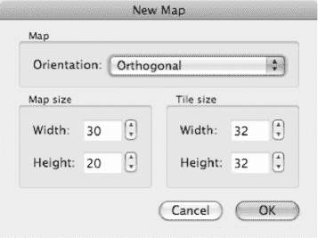

**图 10-5.** *在 Tiled 中创建新地图*

目前，Tiled 既支持正交（矩形）地图，也支持等轴测地图。地图尺寸以图块为单位，而非像素。在本例中，新地图为 30×20 个图块，每个图块图像的尺寸为 32×32 像素，因为图块图像本身就是这样大。至关重要的是，图块尺寸必须与你的图块图像尺寸相匹配，否则它们将无法对齐。

新地图将完全是空的，并且没有加载任何可供你绘制的图块集。你可以通过选择 Tiled 菜单中的 `Map`  `New Tileset` 来添加图块集。这将打开 `New Tileset` 对话框（如图 10-6 所示），你可以在其中浏览并找到合适的图块集图像。图块集只是一个名称，指代包含多个等间距图块的图像，因此你也可以称其为仅包含相同尺寸图像的纹理图集。

**注意：** `Map`  `Add External Tileset` 功能仅用于导入先前导出的图块集，以便与多个 TMX 地图共享同一个图块集。你可以通过右键单击 Tiled 窗口右下角的图块集视图，然后选择 `Export Tileset As` 来导出图块集。

我将使用 `dg_grounds32.png` 这个图块集。这些图块由 David E. Gervais 绘制，并在知识共享许可协议下发布，这意味着你可以自由分享和改编他的作品，只要注明他的贡献即可。你可以从他的网站下载更多图块集：[`http://pousse.rapiere.free.fr/tome/index.htm`](http://pousse.rapiere.free.fr/tome/index.htm)。

在图 10-6 中，我已经通过 Tilemap01 项目 Resources 文件夹中的 `Browse` 按钮定位并添加了 `dg_grounds32.png` 图块集图像。如果你勾选了“`Use transparent color`”复选框，透明区域将默认以粉色绘制。目前你可以不勾选此框，因为使用的图块没有透明区域。

图块宽度和高度是图块集中每个独立图块的尺寸。它们应与你在创建新地图时设置的 32×32 像素图块尺寸相匹配。`Margin` 和 `Spacing` 设置决定了图块距离图像边框的像素数以及图块之间的间隔像素数。对于 `dg_grounds32.png`，图块之间完全没有间隔，因此我将两个值都设为 0。

如果你使用 TexturePacker 对齐图块来创建图块集纹理，则必须在 `Margin` 和 `Spacing` 字段中输入 TexturePacker 使用的像素填充值。默认情况下，TexturePacker 使用的填充值为 0 像素。

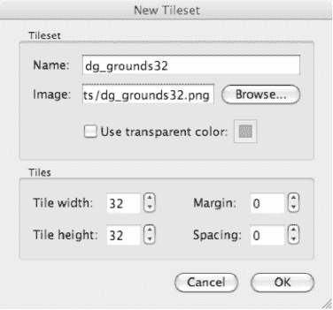

**图 10-6.** *从图像文件创建新的图块集*

加载新的图块集图像时，请确保该图像已经位于你项目的资源文件夹中。然后你还应确保将地图的 TMX 文件保存到地图所使用的图块集图像所在的同一文件夹中。否则，cocos2d 可能无法加载图块集图像；尝试加载 TMX 文件将导致运行时异常。问题在于 TMX 文件是相对于其自身保存位置来引用图块集图像的。如果两者不在同一文件夹中，cocos2d 可能找不到图像，因为在模拟器或设备上安装应用时，文件夹结构不会被保留。

**提示：** TMX 文件是纯 XML 文件，如果你好奇，可以打开看看。如果你看到图像文件引用包含路径部分，那么 cocos2d 很可能无法加载所引用的图像文件。图像引用应该只列出图像文件名，不带任何路径成分，如下所示：`<image source="tiles.png"/>`。

#### 设计地图

加载图块集后，你将面对一张空白地图，这是对你的创造力发出的邀请，去构思一个绝佳的地图方案。更好的做法是，将消除空白地图作为第一步。从一个默认的地面图块开始设计地图是非常有帮助的。我选择了 `Bucket Fill tool`（桶填充工具），并选取了一块明亮的草地砖，这样我的地图现在看起来就像是一片茂盛的草地——大致如此。你可以在图 10-7 中看到效果。

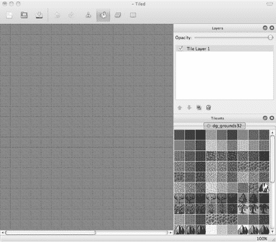

**图 10-7.** *加载了 dg_grounds32 图块集的空白地图，等待你的灵感*

**提示：** 如果你发现 Tiled 窗口中缺少某些内容，请检查 `View` 菜单。你可以隐藏或显示图块集（Tilesets）、图层（Layers）和历史记录（History）视图。知道这一点很重要，因为如果你不小心点击了某个视图上的 `X` 按钮，这是将它们重新显示出来的唯一方法。

Tiled 使用四种模式来编辑地图，由工具栏最右侧的四个图标表示。它们分别是：`Stamp Brush`（快捷键 B），允许你绘制图块集中的当前选中项；`Bucket Fill`（快捷键 F），用于填充相连且相同的图块区域；`Eraser`（快捷键 E），用于擦除图块；以及 `Rectangular Select`（快捷键 R），用于选择一定范围的图块，然后复制并粘贴所选内容。

你还可以缩放地图。如果你有带滚轮的鼠标，只需按住 Command 键并滚动滚轮即可放大和缩小。此外，你也可以通过按住 Command 键并分别按下加号或减号键来放大和缩小。

你大部分时间将花在从图块集中选择图块，并在选中 `Stamp Brush` 工具后将其绘制到地图上。逐个放置图块，你将逐步构建出基于图块的游戏世界。

你还可以通过在图层面板中添加更多图层来编辑多层图块。从菜单中选择 `Layer`  `Add Tile Layer` 来为图块创建一个新图层。使用多个图块图层可以让你在 `cocos2d` 中切换地图的不同区域。在 TileMap01 示例项目中，我利用这一点在地图的冬季和夏季部分之间进行切换。

你也可以选择 `Layer`  `Add Object Layer` 来添加一个用于放置对象的图层。对象有两种类型：常规对象只是你可以放置的矩形；另一种类型是图块对象，允许你在地图上任意位置自由放置一个图块，而无需对齐到图块网格。你可以使用矩形对象来为地图添加自定义信息，例如生成点、传送点或触发器区域。图块对象最常用于直接在基于图块的世界中放置较小的物品，如剑、花、蜡烛和其他物品。

要处理对象，Tiled 工具栏中还有额外的按钮：选择对象（快捷键 S）、插入对象（快捷键 O）和插入图块对象（快捷键 T）。要插入一个矩形对象，请单击 `Insert Objects` 图标，然后在地图世界中点击以创建点对象（宽度和高度为零的矩形），或点击并向右下方拖拽以创建一个矩形。要插入一个图块对象，请单击 `Insert Tile Objects` 图标，从图块集中选择一个图块，然后点击地图世界以添加一个新的图块对象。

Tiled 中的某些功能隐藏在上下文菜单中。例如，我刚刚提到的矩形对象可以通过在地图视图中右键单击它们并选择 `Remove Object` 来删除。请注意，你也需要确保在图层面板中选中了对象图层，上下文菜单才会出现。


您还可以通过右键单击对象、图层和切片，然后点击相应的`Properties`菜单项来编辑它们的属性。其中一个用途是使用`Layer``Add Tile Layer`创建额外的切片图层。这个图层将用于告知游戏有关某些切片属性的信息。我将其命名为`GameEventLayer`，因为它将用于定义特定游戏事件的触发区域。

选中`GameEventLayer`后，选择`Map``New Tileset`，并从`dg_grounds32.png`所在文件夹加载`game-events.png`。该文件仅包含三个切片。右键单击其中一个，选择`Tile Properties`，并添加`isWater`属性，如图 Figure 10–8 所示。

**警告：**请记住，每个切片图层都会产生一些开销，尤其是在同一位置的多图层中放置切片时。这会导致两个图层都被绘制，从而对游戏性能产生不利影响。建议尽量保持最少的切片图层数量。两到四个切片图层对大多数游戏来说应该足够了。添加新的切片图层并进行绘制后，请务必在设备上检查游戏的帧率。

您还应注意，Tiled 允许一个图层添加多个切片集。但是，cocos2d 每个图层仅支持一个切片集。

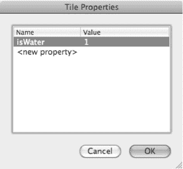

**Figure 10–8.** *添加切片属性*

然后，您可以使用刚刚添加了`isWater`属性的切片在切片地图上进行绘制。理想情况下，应将其绘制在河流区域。如果您想查看正在绘制的下层切片，可以使用图层视图中的`GameEventLayer`的`Opacity`滑块。或者，单击图层复选框，以隐藏或取消隐藏此特定图层上绘制的内容。

在保存 TMX 切片地图之前，请确保启用所有图层复选框。cocos2d 不加载在 Tiled 中未选中的图层。

完成此操作后，您应获得一个类似于 Figure 10–9 所示的切片地图。将其保存到与切片集图片相同的`TileMap01 Resources`文件夹中。

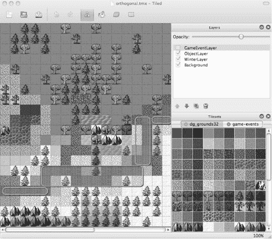

**Figure 10–9.** *包含三个切片图层和一个对象图层的完整切片地图*

### 将正交切片地图与 Cocos2d 结合使用

要在 cocos2d 中使用 TMX 切片地图，首先需要将 TMX 文件及其附带切片集图片文件作为资源添加到 Xcode 项目中。在`TileMap01`项目中，我添加了`orthogonal.tmx`以及切片集`dg_grounds32.png`和`game-events.png`。加载和显示切片地图非常简单；以下代码来自`TileMapLayer`类的`init`方法：

```
CCTMXTiledMap* tileMap = [CCTMXTiledMap tiledMapWithTMXFile:@"orthogonal.tmx"];
[self addChild:tileMap z:-1 tag:TileMapNode];

CCTMXLayer* eventLayer = [tileMap layerNamed:@"GameEventLayer"];
eventLayer.visible = NO;
```

`CCTMXTiledMap`类使用 TMX 文件名进行初始化，然后作为子节点添加并附带一个标签，以便后续检索。当然，使用成员变量同样有效。下一步，通过使用`layerNamed`方法并提供在 Tiled 中命名的图层名称，来检索用于游戏事件的`CCTMXTiledMap`。由于游戏事件图层仅作为代码判定特定切片属性的提示，因此该图层不应被渲染。请注意，如果您在 Tiled 中取消选中该图层，它不仅不会被显示，您也无法访问其切片及切片属性。

如果您现在运行项目，您将看到一个与 Figure 10–10 中相同的切片地图。

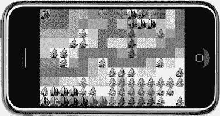

**Figure 10–10.** *iPhone 模拟器中的正交切片地图*

现在您无法对切片地图进行任何操作，但我希望改变这一点。继续到`TileMap02`项目，我希望能够找到标记了`isWater`的切片。我已经添加了`ccTouchesBegan`方法，如 Listing 10–1 所示，以便确定玩家正在触摸的切片。

**Listing 10–1.** *确定切片属性*

```
-(void) ccTouchesBegan:(NSSet *)touches withEvent:(UIEvent *)event
{
    CCNode* node = [self getChildByTag:TileMapNode];
    NSAssert([node isKindOfClass:[CCTMXTiledMap class]], @"not a CCTMXTiledMap");
    CCTMXTiledMap* tileMap = (CCTMXTiledMap*)node;

    // 将触摸位置转换为切片坐标
    CGPoint touchLocation = [self locationFromTouch:[touches anyObject]];
    CGPoint tilePos = [self tilePosFromLocation:touchLocation tileMap:tileMap];

    // 检查触摸是否在水面上（例如，带有 isWater 属性的切片）
    bool isTouchOnWater = NO;

    CCTMXLayer* eventLayer = [tileMap layerNamed:@"GameEventLayer"];
    int tileGID = [eventLayer tileGIDAt:tilePos];

    if (tileGID != 0)
    {
        NSDictionary* properties = [tileMap propertiesForGID:tileGID];
        if (properties)
        {
            NSString* isWaterProperty = [properties valueForKey:@"isWater"];
            isTouchOnWater = ([isWaterProperty boolValue] == YES);
        }
    }

    // 根据触摸位置决定下一步操作
    if (isTouchOnWater)
    {
        [[SimpleAudioEngine sharedEngine] playEffect:@"alien-sfx.caf"];
    }
    else
    {
        // 获取冬季图层并切换其可见性
        CCTMXLayer* winterLayer = [tileMap layerNamed:@"WinterLayer"];
        winterLayer.visible = !winterLayer.visible;
    }
}
```

`CCTMXTiledMap`以常规方式检索。触摸位置首先被转换为屏幕坐标，然后用于获取包含该特定屏幕位置切片地图索引的`tilePos`。稍后我会介绍`tilePosFromLocation`方法。现在，只需知道它返回了被触摸切片的索引即可。


好的，作为高级文档工程师和翻译员，我将严格按照您提供的格式和注意事项，对给定的英文文本进行专业、准确的中文翻译。


#### 图块全局标识符（GID）介绍

现在，我想介绍一下图块的全局标识符（GID）这个概念。GID 是分配给 tilemap 中每个图块的唯一整数编号。地图中的图块从 1 开始连续编号。GID 为 0 表示一个空图块。通过 `CCTMXLayer` 的 `tileGIDAt` 方法，你可以获取指定图块坐标处的图块的 GID 编号。

接下来，从 tilemap 中获取名为 `GameEventLayer` 的 `CCTMXLayer`。这是我定义 `isWater` 图块并将其绘制在河流图块上的图层。`tileGIDAt` 方法返回该图块的唯一标识符。如果标识符恰好是 0，则表示该图层的此位置上没有图块——在这种情况下，很明显触摸到的图块不可能是 `isWater` 图块。

`CCTMXTiledMap` 有一个 `propertiesForGID` 方法，如果具有给定标识符（GID）的图块有可用属性，该方法会返回一个 `NSDictionary`。这个 `NSDictionary` 包含了在 Tiled 中编辑的属性（参见图 10–8）。该字典将任何键/值对存储为 `NSString` 对象。如果你出于调试目的想查看特定 `NSDictionary` 的内容，可以使用如下 `CCLOG` 语句：

```
CCLOG(@"NSDictionary 'properties' 包含:\n%@", properties);
```

这将在调试器控制台窗口中打印出类似于下面一行内容：

```
2010–08-30 19:50:52.344 Tilemap[978:207] NSDictionary 'properties' 包含:
{
    isWater = 1;
}
```

在处理 tilemaps 时，你会接触到各种 `NSDictionary` 对象。记录其内容可以让你窥探任何 `NSDictionary` 的内部，或者就此而言，任何 iPhone SDK 集合类的内部。这在某些时候会派上用场。

`NSDictionary` 中的每个属性都可以通过 `NSDictionary` 的 `valueForKey` 方法根据其名称来检索，该方法返回一个 `NSString`。要从 `NSString` 获取布尔值，你可以简单地使用 `NSString` 的 `boolValue` 方法。以类似的方式，你可以分别使用 `NSString` 的 `intValue` 和 `floatValue` 方法来检索整型和浮点型数值。

在 `ccTouchesBegan` 方法的末尾，我检查触摸点是否在水面上，如果是，则播放一个音效。否则，我获取 `WinterLayer` 并通过对其取反来切换其 `visible` 属性。改变季节从未如此简单！这个效果应该能说明如何使用 Tiled 中的多个图层来实现全局范围内的变化，而无需加载一个完全独立的 tilemap。

对于单个图块的局部更改，你可以利用 `removeTileAt` 和 `setTileGID` 方法在游戏过程中移除或替换特定图层的图块：

```
[winterLayer removeTileAt:tilePos];
[winterLayer setTileGID:tileGID at:tilePos];
```

#### 定位触摸的图块

我之前提到过 `tilePosFromLocation` 方法，这里重复一下相关的两行代码：

```
// 从触摸位置获取图块坐标中的位置
CGPoint touchLocation = [self locationFromTouch:[touches anyObject]];
CGPoint tilePos = [self tilePosFromLocation:touchLocation tileMap:tileMap];
```

首先，触摸的位置被映射到屏幕坐标。我之前做过这个，但由于你会经常需要这段代码，我在代码清单 10–2 中提供了它供你参考。

**代码清单 10–2.** *确定触摸的位置*

```
-(CGPoint) locationFromTouch:(UITouch*)touch
{
    CGPoint touchLocation = [touch locationInView: [touch view]];
    return [[CCDirector sharedDirector] convertToGL:touchLocation];
}
```

将触摸位置转换为屏幕坐标后，调用 `tilePosFromLocation` 方法。它以触摸位置和一个指向 `tileMap` 的指针作为参数。代码清单 10–3 中的方法包含一些数学运算，我将马上解释——屏住呼吸：

**代码清单 10–3.** *将位置转换为图块坐标*

```
-(CGPoint) tilePosFromLocation:(CGPoint)location tileMap:(CCTMXTiledMap*)tileMap
{
    // 必须偏移 Tilemap 位置，以防 tilemap 正在滚动
    CGPoint pos = ccpSub(location, tileMap.position);

    // 转换为 int 确保结果是整数
    pos.x = (int)(pos.x / tileMap.tileSize.width);
    pos.y = (int)((tileMap.mapSize.height * tileMap.tileSize.height - pos.y) /
        tileMap.tileSize.height);

    CCLOG(@"触摸位置 (%.0f, %.0f) 在图块坐标 (%i, %i)", location.x, location.y,
        (int)pos.x, (int)pos.y);
    NSAssert(pos.x >= 0 && pos.y >= 0 && pos.x < tileMap.mapSize.width &&
        pos.y < tileMap.mapSize.height, @"%@: 坐标 (%i, %i) 超出范围!",
        NSStringFromSelector(_cmd), (int)pos.x, (int)pos.y);

    return pos;
}
```

还在听吗？如果你以前处理过 tilemaps，这段代码应该很熟悉，但如果没有，你可能一头雾水。我来解释一下。这个方法做的第一件事是从触摸位置中减去当前的 `tileMap.position`。即将推出的 Tilemap03 示例项目添加了 tilemap 滚动功能，因此 tilemap 的位置很可能不在 (0,0)。

要使视点进一步向上（北）和向右（东）滚动，实际上必须通过负值来改变其位置。这是因为 tilemap 从位置 (0,0) 开始，这会将地图的左下角定位在屏幕的最左下角。最初，tilemap 的 (0,0) 点与屏幕的 (0,0) 点重合。如果你将 tilemap 移动到位置 (100,100)，看起来好像视点正在向左和向下移动。常见的错误是认为你正在移动视点，但实际上并非如此。移动的是 tilemap 图层，要更进一步向 tilemap 的中心滚动，你必须用负值来偏移 tilemap。

剩下的就是简单的数学运算了：为了从 tilemap（我们知道其位置总是负数）获取正确的偏移量，我们必须减去触摸位置和 `tileMap.position`。具体数字表明，减去一个负数实际上就是加法：

`location(240, 160) – tileMap.position(-100, -100) = pos(340, 260)`

当 tilemap 图层从屏幕的 (0,0) 点移动了 (-100,-100) 像素，而触摸点在屏幕上的 (240,160) 像素处时，触摸位置相对于 tilemap 当前位置的总偏移量为 (340,260) 像素。


考虑到滚动偏移后，我们可以获取该位置在图块地图中的图块坐标。此时，你需要注意：图块坐标的`(0,0)`图块位于图块地图的左上角。与屏幕坐标相反，屏幕坐标的`(0,0)`点（原点）位于左下角，而图块地图坐标从左上角开始。图 10-11 展示了一系列图块的`x`、`y`坐标。该截图是通过在 Tiled Java 版本中启用`View``Show Coordinates`功能制作的，该功能在 Tiled Qt 版本中尚未提供。

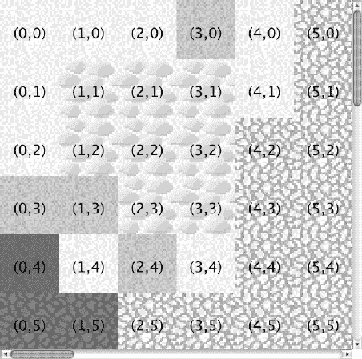

**图 10-11.** *正交图块地图的坐标系*

为了避免混淆，以下是计算图块坐标`x`位置的代码行：

`pos.x = (int)(pos.x / tileMap.tileSize.width);`

`tileMap.tileSize`属性是图块集中图块的尺寸，本例中为 32×32（另请参见图 10-6）。如果触摸点位于`340`的`x`位置，计算结果如下：

`340 / 32 = 10.625`

然而这不可能正确。我们寻找的是图块的`x`坐标，它绝不会是小数！原因当然在于，触摸点位于我们所需图块的内部（即一个 32×32 的方形区域内）。将结果强制转换为`int`值的简单技巧可以去除小数部分，并将其赋值给`pos.x`：

`pos.x = (int)10.625        // pos.x == 10`

强制转换为`int`会去除小数部分。你可以安全地丢弃小数部分，因为它根本不相关——实际上它是有害的。如果你没有舍弃小数部分，而是使用了非整数坐标（本例中为`10.625`）来尝试检索图块，你会收到一个运行时错误，因为在`x`坐标为`10`和`11`处才有图块，而不是在`10.625`处。

获取图块`y`坐标的计算稍微复杂一些：

`pos.y = (int)((tileMap.mapSize.height * tileMap.tileSize.height - pos.y) /`
`     tileMap.tileSize.height);`

注意，括号很重要，以确保除法最后执行。用实际数字来看，这个计算更容易理解。如图 10-5 所示，`tileMap.mapSize`是 30×20 个图块，而如前所述，`tileMap.tileSize`是 32×32 像素。计算过程如下：

`pos.y = (int)((20 * 32 – 260) / 32)`

将`tileMap.mapSize.height`与`tileMap.tileSize.height`相乘，得到图块地图的像素总高度。这是必要的，因为图块地图的`y`坐标从顶部向底部计数，而屏幕的`y`坐标从底部向顶部计数。通过计算图块地图的最底部`y`坐标，并从中减去当前`y`位置`260`，就能得到触摸点在图块地图中以像素为单位的正确`y`位置。由于这是一个像素坐标，你需要除以`tileSize.height`，然后向下转换为`int`值，以获取图块的`y`坐标。

`CCLOG`和`NSAssert`这两行有助于在调试器控制台窗口中查看计算结果，并确保图块坐标永远不会取非法值。这既是一个学习工具，也是一份保障策略。

##### 优化与可读性的练习

由于图块地图的大小从不改变，你可以对计算进行一点优化，通过在类的`@interface`中添加一个成员变量来存储图块地图的像素高度，从而获取`y`图块坐标：

`float tileMapHeightInPixels;`

然后，你可以在`init`方法中，就在图块地图加载完成后，仅计算一次`tileMapHeightInPixels`：

`CCTMXTiledMap* tileMap = [CCTMXTiledMap tiledMapWithTMXFile:@"orthogonal.tmx"];`  
`tileMapHeightInPixels = tileMap.mapSize.height * tileMap.tileSize.height;`

接着你可以重写计算过程，这样每次调用`tilePosFromLocation`方法时，就节省了一次乘法运算：

`pos.y = (int)((tileMapHeightInPixels - pos.y) / tileMap.tileSize.height);`

这可能不会赢得最佳优化奖——这只是性能上非常微小的提升。但点滴积累都很重要，并且它通过降低复杂性，用一个可读性强的变量名取而代之，使计算更易于阅读。  


#### 使用对象层

我在本章中用作示例瓦片地图的 `orthogonal.tmx` 文件也包含一个对象层，它的名称恰如其分地叫做 `ObjectLayer`。你可以在 Tiled 中通过选择 `图层` -> `添加对象层` 来创建对象层。然后，你就能点击瓦片地图内部并绘制矩形。我认为 *对象层* 这个名称有点不幸且容易让人误解，因为大多数游戏会把这些矩形用作兴趣点和触发区域，而不是当作实际的对象。

在 `Tilemap03` 项目中，我在 `ccTouchesBegan` 方法中增加了一些代码来处理对象层。清单 10–4 展示了紧随 `isWater` 检查之后的相关代码部分：

**清单 10–4.** *检测触摸点是否位于对象层矩形内*

```
// 检查触摸点是否在矩形对象内部
CCTMXObjectGroup* objectLayer = [tileMap objectGroupNamed:@"ObjectLayer"];

bool isTouchInRectangle = NO;
int numObjects = [objectLayer.objects count];
for (int i = 0; i < numObjects; i++)
{
    NSDictionary* properties = [objectLayer.objects objectAtIndex:i];
    CGRect rect = [self getRectFromObjectProperties:properties tileMap:tileMap];

    if (CGRectContainsPoint(rect, touchLocation))
    {
        isTouchInRectangle = YES;
        break;
    }
}
```

由于对象层是一种不同类型的图层，你不能通过瓦片地图的 `layerNamed` 方法来获取它。cocos2d 中的对象层是 `CCTMXObjectGroup` 类，这又是一个不幸的命名失误，因为 Tiled 将其称为 *对象层*，而非 *对象组*。无论如何，你可以通过使用瓦片地图的 `objectGroupNamed` 方法，并指定在 Tiled 中定义的对象层名称，来获取名为 `ObjectLayer` 的对象层所对应的 `CCTMXObjectGroup`。

接下来，我遍历 `objectLayer.objects` 这个 `NSMutableArray`，它包含了一个 `NSDictionary` 项的列表。听起来很熟悉对吧？是的，这些正是之前展示的、由瓦片地图的 `propertiesForGID` 方法返回的 `NSDictionary` 属性——不过，这些 `NSDictionary` 项的内容是由 Tiled 提供的，并且用户不可编辑。它们只是包含了每个矩形的坐标。`getRectFromObjectProperties` 方法用于获取矩形：

```
-(CGRect) getRectFromObjectProperties:(NSDictionary*)dict tileMap:(CCTMXTiledMap*)tileMap
{
    float x, y, width, height;

    x = [[dict valueForKey:@"x"] floatValue] + tileMap.position.x;
    y = [[dict valueForKey:@"y"] floatValue] + tileMap.position.y;
    width = [[dict valueForKey:@"width"] floatValue];
    height = [[dict valueForKey:@"height"] floatValue];

    return CGRectMake(x, y, width, height);
}
```

键 `x`、`y`、`width` 和 `height` 是由 Tiled 设置的。我只需通过 `valueForKey` 从 `NSDictionary` 中获取它们，并使用 `floatValue` 方法将这些值从 `NSString` 转换为实际的浮点数。x 和 y 的值需要加上 `tileMap` 的偏移量，因为矩形需要跟随瓦片地图一起移动。最后，通过调用 `CGRectMake` 便捷方法来返回一个 `CGRect`。

`ccTouchesBegan` 中剩下的代码则简单地通过 `CGRectContainsPoint` 检查触摸点是否位于 `rect` 内。如果是，则将 `isTouchInRectangle` 标志设置为 `true`，并使用 `break` 语句中止 `for` 循环。这里无需再检查其他矩形是否包含该触摸点。在 `ccTouchesBegan` 的末尾，根据 `isTouchInRectangle` 标志决定是否在触摸点处播放粒子效果。因此，这段代码会在你触摸矩形内部时创建一个爆炸粒子效果：

```
if (isTouchOnWater)
{
    [[SimpleAudioEngine sharedEngine] playEffect:@"alien-sfx.caf"];
}
else if (isTouchInRectangle)
{
    CCParticleSystem* system = [CCQuadParticleSystem particleWithFile:
        @"fx-explosion.plist"];
    system.autoRemoveOnFinish = YES;
    system.position = touchLocation;
    [self addChild:system z:1];
}
```


#### 绘制对象层矩形

当你运行 `Tilemap03` 项目时，会注意到对象层矩形被绘制在瓦片地图上方，如图 10-12 所示。这并不是瓦片地图或对象层的标准功能。实际上，这些矩形是通过 OpenGL ES 代码绘制的。每个 `CCNode` 都有一个 `–(void) draw` 方法，你可以覆写该方法来添加自定义的 OpenGL ES 代码。我经常使用这个方法来进行可视化的代码调试，例如绘制直线、圆形和矩形，这些图形可用于碰撞检测、距离测试等场景。在这里，能够直观地看到对象层区域的位置非常有用。将此类信息可视化，远比在调试器中查找和比较坐标要高效。我们的大脑更擅长处理视觉信息，而非比较和计算数字。请善加利用这一点！

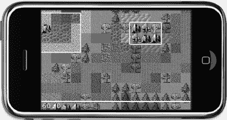

**图 10-12.** *使用 OpenGL ES 代码在瓦片地图上显示的对象层矩形*

`–(void) draw` 方法只需放在类中，它会在每一帧自动被调用。但是，应避免在 `draw` 方法中修改节点的属性，因为这可能会干扰节点的绘制。代码清单 10-5 展示了 `TileMapLayer` 类的 `draw` 方法。

**代码清单 10-5.** *绘制对象层矩形*

```
-(void) draw
{
    CCNode* node = [self getChildByTag:TileMapNode];
    NSAssert([node isKindOfClass:[CCTMXTiledMap class]], @"not a CCTMXTiledMap");
    CCTMXTiledMap* tileMap = (CCTMXTiledMap*)node;

    // 获取对象层
    CCTMXObjectGroup* objectLayer = [tileMap objectGroupNamed:@"ObjectLayer"];

    // 将线条宽度设为 3 像素
    glLineWidth(3.0f);
    glColor4f(1, 0, 1, 1);

    int numObjects = [[objectLayer objects] count];
    for (int i = 0; i < numObjects; i++)
    {
        NSDictionary* properties = [[objectLayer objects] objectAtIndex:i];
        CGRect rect = [self getRectFromObjectProperties:properties tileMap:tileMap];
        [self drawRect:rect];
    }

    glLineWidth(1.0f);
    glColor4f(1, 1, 1, 1);
}
```

首先，我通过标签获取瓦片地图，然后使用 `objectGroupNamed` 方法获取 `CCTMXObjectGroup`。接着，我使用 OpenGL ES 方法 `glLineWidth` 将线条宽度设为 3 像素，并使用 `glColor4f` 将颜色设为紫色。这会影响随后所有用 OpenGL ES 绘制的线条的粗细和颜色——不仅限于当前方法，还可能影响其他使用 OpenGL ES 代码进行绘制的节点（例如，cocos2d 的 `CCDrawingPrimitives.h` 头文件中定义的用于绘制直线、圆形和多边形的任何便捷方法）。这就是为什么我在完成绘制后要重置 `glLineWidth` 和 `glColor4f`。在 OpenGL 代码中，保持良好的风格意味着将状态恢复为你最初发现它时的样子；否则，它可能会改变其他绘制代码的输出方式。OpenGL 是一个状态机，因此你更改的每一个设置都会被记住，并可能影响后续的绘制方法。为避免这种情况，你应该在完成绘制后，将任何更改过的 OpenGL 设置恢复到安全的默认值。

**注意：** `-(void) draw` 方法内的代码始终以 z 轴顺序 0 进行绘制。它也会在所有 z 轴顺序为 0 的其他节点之前绘制。这意味着，如果其他节点也处于 z 轴顺序 0，它们会覆盖掉任何 OpenGL ES 绘制的代码。就对象层 `draw` 代码而言，我必须将 `tileMap` 的 z 轴顺序设为 -1，这样矩形才能显示在瓦片地图的上方。

和之前一样，我遍历所有对象层的对象，从 `NSDictionary` 中获取它们的属性，从而得到该对象的 `CGRect`，然后将其传递给 `drawRect` 方法。遗憾的是，cocos2d 省略了这个特定的便捷方法，但使用 `ccDrawLine` 来添加它很容易，如代码清单 10-6 所示。

**代码清单 10-6.** *绘制矩形*

```
-(void) drawRect:(CGRect)rect
{
    // 使用四条直线绘制矩形
    CGPoint pos1, pos2, pos3, pos4;
    pos1 = CGPointMake(rect.origin.x, rect.origin.y);
    pos2 = CGPointMake(rect.origin.x, rect.origin.y + rect.size.height);
    pos3 = CGPointMake(rect.origin.x + rect.size.width,
        rect.origin.y + rect.size.height);
    pos4 = CGPointMake(rect.origin.x + rect.size.width, rect.origin.y);

    ccDrawLine(pos1, pos2);
    ccDrawLine(pos2, pos3);
    ccDrawLine(pos3, pos4);
    ccDrawLine(pos4, pos1);
}
```

为矩形的每个角创建一个 `CGPoint`，然后在四个 `ccDrawLine` 方法中使用这些点来绘制矩形各角之间的连线。你可能会想记住这个方法并将其放在一个安全的地方，因为你可能以后还会用到它。

请注意，`draw` 和 `drawRect` 方法被包裹在 `#ifdef DEBUG` 和 `#endif` 语句中。这意味着在发布版本中，对象层矩形将不会被绘制，因为我仅将其用于调试和演示目的——最终用户绝不应看到它们。

```
#ifdef DEBUG
-(void) drawRect:(CGRect)rect
{
    ...
}

-(void) draw
{
    ...
}
#endif
```


#### 滚动瓦片地图

最精彩的部分留到最后：滚动。实际上这很简单，因为只需移动 `CCTMXTiledMap` 即可。在 Tilemap04 项目中，我在 `ccTouchesBegan` 方法中获取触摸的瓦片坐标后，紧接着添加了对 `centerTileMapOnTileCoord` 方法的调用：

```
-(void) ccTouchesBegan:(NSSet *)touches withEvent:(UIEvent *)event
{
    ...
    // 从触摸位置获取瓦片坐标下的位置
    CGPoint touchLocation = [self locationFromTouches:touches];
    CGPoint tilePos = [self tilePosFromLocation:touchLocation tileMap:tileMap];

    // 移动瓦片地图，使被触摸的瓦片位于屏幕中央
    [self centerTileMapOnTileCoord:tilePos tileMap:tileMap];
    ...
}
```

代码清单 10-7 展示了 `centerTileMapOnTileCoord` 方法，该方法移动瓦片地图，使被触摸的瓦片位于屏幕中央。同时，如果瓦片地图的任何边界已与屏幕边缘对齐，它也会阻止瓦片地图继续滚动。

**代码清单 10-7.** *将瓦片地图居中于某个瓦片坐标*

```
-(void) centerTileMapOnTileCoord:(CGPoint)tilePos tileMap:(CCTMXTiledMap*)tileMap
{
    // 将瓦片地图居中于给定的瓦片位置
    CGSize screenSize = [[CCDirector sharedDirector] winSize];
    CGPoint screenCenter = CGPointMake(screenSize.width * 0.5f,
        screenSize.height * 0.5f);

    // 瓦片坐标从左上角开始计数
    tilePos.y = (tileMap.mapSize.height - 1) - tilePos.y;

    // 该点现在位于屏幕左下角
    CGPoint scrollPosition = CGPointMake(-(tilePos.x * tileMap.tileSize.width),
        -(tilePos.y * tileMap.tileSize.height));

    // 将点偏移到屏幕中心和瓦片中心
    scrollPosition.x += screenCenter.x - tileMap.tileSize.width * 0.5f;
    scrollPosition.y += screenCenter.y - tileMap.tileSize.height * 0.5f;

    // 确保瓦片地图滚动在瓦片地图边界处停止
    scrollPosition.x = MIN(scrollPosition.x, 0);
    scrollPosition.x = MAX(scrollPosition.x, -screenSize.width);
    scrollPosition.y = MIN(scrollPosition.y, 0);
    scrollPosition.y = MAX(scrollPosition.y, -screenSize.height);

    CCAction* move = [CCMoveTo actionWithDuration:0.2f position: scrollPosition];
    [tileMap stopAllActions];
    [tileMap runAction:move];
}
```

在获取屏幕中心位置后，我修改了 `tilePos` 的 y 坐标，因为瓦片地图坐标是从上到下计数的（参见图 10-11），而屏幕坐标是从下到上递增。实际上，我将 `tilePos` 的 y 坐标转换成了从下到上计数的方式。此外，我从地图高度中减去了 1，以考虑瓦片坐标是从 0 开始计数的这一事实。换句话说，如果地图高度为 10，则只有瓦片坐标 0 到 9 是有效的。

接下来创建了 `scrollPosition` CGPoint，它将成为瓦片地图移动到的位置。第一步是将瓦片坐标乘以瓦片地图的 `tileSize`。你可能会疑惑为什么我对 `tilePosInPixels` 坐标取负值。原因很简单：如果我想要瓦片从右上角移动到左下角，就必须通过减小坐标值来将瓦片地图向下和向左移动。

下一个大块代码修改了 `scrollPosition` 的坐标，以将瓦片居中于屏幕中心点。你还需要考虑瓦片本身的中心，这就是为什么从 `screenCenter` 偏移量中减去了 `tileSize` 的一半。

通过使用 Objective-C 语言的 `MIN` 和 `MAX` 宏，确保了 `scrollPosition` 被限制在瓦片地图的边界内，从而不会露出瓦片地图边界之外的任何内容。`MIN` 和 `MAX` 分别返回其两个参数的最小值和最大值，相比使用 `if` 和 `else` 语句的条件赋值，这是一种更紧凑且更易读的解决方案。

最后，使用 `CCMoveTo` 动作来滚动瓦片地图节点，使被触摸的瓦片居中于屏幕。其效果是让瓦片地图滚动到你点击的瓦片位置。你可以使用同样的方法滚动到感兴趣的瓦片，例如玩家的位置。

**提示：** 至于玩家角色本身，你将在下一章关于等距瓦片地图的内容中找到相关实现。你可以将同样的原理应用于正交瓦片地图。并且，这个 Cocos2D 论坛帖子将帮助你入门正交瓦片地图上的寻路算法，其中包含源代码：[`www.cocos2d-iphone.org/forum/topic/19463`](http://www.cocos2d-iphone.org/forum/topic/19463)。

如果你对正交瓦片地图上完整、可用且立即可用的砍杀游戏解决方案感兴趣（包括一份优秀的教程），我推荐查看 Nate Weiss 的 iPhone 游戏工具包：[`www.iphonegamekit.com`](http://www.iphonegamekit.com)。

### 总结

现在，你应该对什么是瓦片地图，以及如何使用 Tiled Map Editor 创建包含多层和多种属性（可供游戏使用）的瓦片地图有了相当的理解。

使用 cocos2d 加载和显示瓦片地图是一项简单的任务，但当涉及到获取瓦片层和对象层、修改它们以及读取其属性时，其复杂性会迅速增加。你还学习了如何确定触摸位置的瓦片坐标，以及如何使用瓦片坐标来滚动瓦片地图，使被触摸的瓦片居中于屏幕。

我甚至让你初步了解了自定义绘图和一些 OpenGL ES 代码，用于在瓦片地图上渲染对象层矩形，以便进行调试。

## 第 11 章

## 等距瓦片地图

使用等距瓦片地图，你可以两全其美——利用二维图形实现三维外观。这就是等距瓦片地图游戏如此广受欢迎的原因。等距瓦片地图游戏在 20 世纪 90 年代末期开始占据重要地位，但随着台式电脑和游戏主机 3D 渲染性能的提升而逐渐消失。近年来，它们在移动游戏和社交网页游戏中强势复兴，在这些场景中，3D 渲染成本高昂，甚至不可用。从《创世纪 VII》和《暗黑破坏神》等经典电脑角色扮演游戏，到当前 Facebook 上火爆的《Farmville》及其众多官方和非官方衍生游戏，皆是如此。

等距游戏允许你使用相对简单的图形和工具，创建出看似具有空间深度的可信游戏世界。此外，与真正的 3D 计算机图形相比，2D 图形所需的设备性能要低得多。

图 11-1 展示了我们将在本章中构建的等距瓦片地图游戏示例。你将控制一名忍者角色在这个世界中潜行，避开墙壁和山脉的碰撞。忍者还能隐藏在树木、仙人掌等特定物体后面。

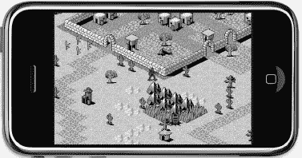

**图 11-1.** *一个等距瓦片地图游戏*

**注意：** 本章使用的所有图块集均由 David E. Gervais 创作，并根据知识共享许可发布。你可以从他的网站下载更多作品：[`http://pousse.rapiere.free.fr/tome/index.htm`](http://pousse.rapiere.free.fr/tome/index.htm)。


### 设计等距瓦片图形

在了解如何设计等距图形之前，我将首先介绍投影的概念。在三维世界中，你可以从各个角度观察物体，因为三维世界能够从任意角度和位置将三维世界自由地投影到二维屏幕上。这种从三维世界到二维屏幕的转换被称为*透视投影*。拍照也是将真实世界投影到二维图像上的一种透视投影形式。这两种投影都保留了观察者视角下的透视效果。

在等距瓦片地图世界中，每个单独的瓦片地图图像已经是将看似三维的物体投影到平面上的结果。这种投影通常采用一种称为*等距投影*的特殊平行投影形式。经过投影，图像会或多或少地发生倾斜，但我们的思维仍能将其识别为三维物体。

**提示：** 如果你想了解更多关于各种投影技术及其技术细节，我建议浏览维基百科上关于平行投影的章节：[`http://en.wikipedia.org/wiki/Parallel_projection`](http://en.wikipedia.org/wiki/Parallel_projection)

就瓦片地图而言，如果你看一下图 11-2，就能看到将正交图像创建为等距投影的具体步骤。正方形首先旋转 45 度，然后沿其`y`轴缩小，以形成典型的等距菱形形状。

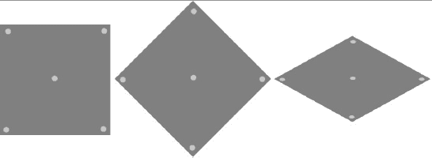

**图 11-2.** *通过旋转 45 度并垂直压缩，将正交图形转变为等距图形*

然而，图 11-2 只是说明等距形状投影的理论方法。你不能通过简单地旋转和压缩来将正交图像变成等距图像，因为旋转会影响图像内容。这样只会让图像看起来扁平且非常错误，就像图 11-3 那样。

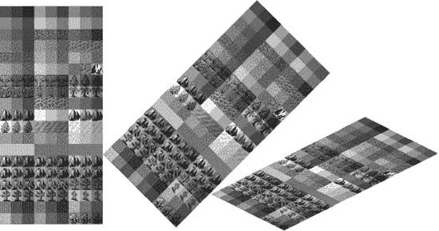

**图 11-3.** *将正交瓦片集转变为等距瓦片集——没那么简单！*

相反，请将图 11-2 中创建的菱形视为你的地面绘制画布。你能设计的最简单的等距瓦片是平坦的地面瓦片。只需用某种图案填充菱形，你就可以获得可用的等距瓦片。图 11-4 展示了一系列相邻排列的纯色等距瓦片，形成了地面图案。地面瓦片并不起眼，看起来非常平坦。然而，它们作为游戏世界的背景层是必不可少的。

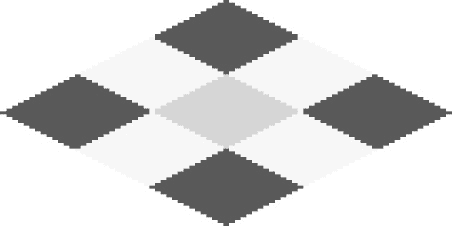

**图 11-4.** *地面等距瓦片没有深度，它们被用作实体表面区域。*

要为等距瓦片地图增加实际的视觉深度，你需要有超出菱形形状的物体瓦片。最常用的方法是绘制三维物体，仿佛以 45 度角观察它们，然后将其绘制在菱形形状之上并超出其范围，通常不超过一个瓦片的高度。在图 11-5 的示例中，通过观察门口可以很好地看到这一点。门拱的大部分绘制在门框所在瓦片之上的那个等距瓦片上。这赋予了门视觉深度。


**图 11-5.** *通过绘制高达菱形形状两倍的物体来增加深度。*

等距瓦片地图允许物体瓦片相互重叠，因为瓦片是从后向前绘制的，这意味着离观察者更近的物体瓦片总是绘制在它们后面的瓦片之上，从而增强了深度感。但这种方法需要精心设计单个瓦片和瓦片地图本身，因为过多的重叠或错误地重叠瓦片会很快破坏深度的错觉。

一个好的做法是，尽量不要重叠形状差异很大但使用相同或相似色调的物体瓦片。例如，在图 11-5 中，你不应该将水晶瓦片直接放置在门口后面。对比度的损失和这些瓦片轮廓的融合很容易破坏对深度的感知。

同样地，虽然你可以创建高度远超瓦片高度两倍的等距物体瓦片，但如果物体显得非常高，玩家将只能看到瓦片地图的一部分，这样就很难创造出令人信服的 3D 外观。如果你建造一座墙壁高达十几个瓦片高度的巨大城堡，而玩家从下方接近它，这些墙壁很容易被误认为是很大一片地面。你甚至可能最终创造出像 M.C.埃舍尔画作那样的视错觉，因为等距瓦片并不会随着离屏幕越远而变小。因此，在设计等距瓦片和瓦片地图时，有效与无效之间常常只有一线之隔。

图 11-6 展示了一个精心制作的等距瓦片集，名为`dg_iso32.png`，其中包含了丰富多样的地面瓦片；诸如墙壁、树木和房屋等物体瓦片；以及可以放置在任何地面瓦片上的装饰物或物品。该瓦片集中的每个瓦片尺寸为 54x49 像素。高度可以任意选择；它可以大于或小于 49 像素，这取决于你希望在瓦片地图中瓦片之间有多少重叠。菱形形状的实际高度是 27 像素。当你在 Tiled（Qt）地图编辑器中创建瓦片地图时，这一点将变得很重要。


**图 11-6.** *David Gervais 精心制作的等距瓦片集*

### 使用 Tiled 编辑等距瓦片地图

我将再次使用 Tiled 地图编辑器来创建等距瓦片地图。基本的瓦片地图编辑与正交地图相同，但在正确设置新的等距瓦片地图和加载等距瓦片集时，有一些关键的步骤。


#### 创建新的等距瓦片地图

打开 `Tiled`，选择 `文件` → `新建`，打开如图 11–7 所示的新建地图对话框。方向显然应设置为等距（Isometric），地图宽度和高度均设为 30 个瓦片，这正好适合我们的示例项目。奇怪的是瓦片尺寸的宽度和高度，看起来有些偏差。我之前提到过，`dg_iso32.png` 中的单个瓦片尺寸是 54x49 像素。在铺设瓦片时需要考虑的菱形区域的尺寸是 54x27 像素。然而新建地图对话框中的瓦片尺寸却是 52x26。这是因为 David Gervais 在设计他的瓦片时，为了消除所有瓦片之间的间隙，需要在水平方向上重叠 2 像素，在垂直方向上重叠 1 像素。

这种偏移是有意为之的，因为等距瓦片通常被设计成相互之间略有重叠。在这种情况下，Tiled 中等距地图的瓦片尺寸必须比瓦片集中菱形区域的实际尺寸宽度少 2 像素，高度少 1 像素。其他等距瓦片集可能需要不同的偏移量，甚至完全不需要偏移。


**图 11–7.** *在 Tiled 中创建新的等距瓦片地图。*

如果你看到类似 图 11–8 中的瑕疵，说明在使用 David Gervais 的瓦片集创建新等距地图时，你设置了错误的瓦片尺寸。为了方便说明，你可以在 `Tilemap05` 项目的资源文件夹中找到这个错误的瓦片地图文件，名为 `isometric-no-offset.tmx`。


**图 11–8.** *像这样的瑕疵表明存在瓦片尺寸偏移问题。*

如果你确实犯了错误，选择了错误的偏移量，并且不想丢失你花了数小时设计的瓦片地图，或者你有其他原因想要调整瓦片地图尺寸或瓦片集尺寸，有一种简单的方法可以实现，但这需要直接操作 TMX 文件，因为 Tiled 本身没有这样的选项。

下面的技巧让你可以轻松尝试各种偏移量，直到找到正确的设置。如果 Tiled 正在运行，请先关闭它，然后在你的 Xcode 项目中选择 TMX 文件；你会看到它以纯文本 XML 文件的形式显示。在文件开头，你会找到地图部分：

```xml
<map version="1.0" orientation="isometric" width="30" height="30" tilewidth="54"
    tileheight="27">
```

你可以编辑 `tilewidth` 和 `tileheight` 参数，直到找到瓦片地图的正确偏移量。同样，如果你在确定所使用的等距瓦片集的瓦片大小时遇到问题，你也可以修改瓦片集的 `tilewidth` 和 `tileheight` 参数：

```xml
<tileset firstgid="1" name="dg_iso32" tilewidth="54" tileheight="49">
    <image source="dg_iso32.png"/>
</tileset>
```

在对 TMX 文件进行任何手动修改后，请务必在 Tiled 中重新加载该文件，因为 Tiled 不会自动更新文件。

#### 创建新的等距瓦片集

接下来，你需要加载一个包含等距瓦片的瓦片集。本章我将使用 `Tilemap05` 项目资源文件夹中的 `dg_iso32.png` 瓦片集图片。在 Tiled 中，选择 `地图` → `新建瓦片集...`，然后浏览到 `dg_iso32.png` 文件。

请注意，Tiled 会根据图 11–7 中新建地图对话框的设置，自动设置默认的瓦片宽度和高度。对于等距瓦片地图，由于等距瓦片之间的重叠，这些默认值通常需要修正。正如我之前提到的，`dg_iso32.png` 瓦片集使用的瓦片宽度为 54 像素，瓦片高度为 49 像素。请注意，你必须使用等距瓦片的完整画布高度，而不是 27 像素的菱形区域高度。图 11–9 显示了该瓦片集的正确设置。


**图 11–9.** *添加宽度为 54 像素、高度为 49 像素的瓦片集*

#### 制定一些基本规则

设计等距地图最重要的规则是，你需要至少两个图层，以便游戏角色可以在某些瓦片后面行走。一个图层用于平坦的地面物体和地板瓦片，另一个图层用于所有其他物体，这些物体要么与其他瓦片重叠，要么不完全透明，例如物品。在图 11–6 的瓦片集中，前两行是地面瓦片，需要放置在地面层上，而第 3 行中的山脉以及第 4 行及之后几乎所有瓦片都需要放置在物体层上。

在 Tiled 中，通过 `图层` → `添加瓦片图层...` 添加两个新图层，并将其命名为 Ground 和 Objects。确保 Objects 图层绘制在 Ground 图层之上。在设计瓦片地图时，你应特别注意只在 Ground 图层上放置完全透明、平坦的地板瓦片。所有其他瓦片都必须放置在 Objects 图层上。

除非你应用以下步骤，否则 Cocos2d 在瓦片地图中正确显示被部分遮挡瓦片后面的游戏角色和其他精灵时会存在问题。作为解决方案的一部分，需要向 Tiled 图层添加一个名为 `cc_vertexz` 的特殊属性。稍后我将更详细地解释这个解决方案；现在，请选择 Ground 图层，点击 `图层` → `图层属性...`。添加一个名为 `cc_vertexz` 的新属性，并将其值设置为 `-1000`。对 Objects 图层执行相同操作，但不要输入 `-1000`，而是输入字符串 `automatic`，如图 11–10 所示。


**图 11–10.** *Objects 图层需要将 `cc_vertexz` 属性设置为 `automatic`。*

现在你可以花些时间设计一个漂亮的瓦片地图，或者直接加载我在 `Tilemap05` 项目中设计好的那个。请务必确保只将地板瓦片放在 Ground 图层上，只将重叠和透明的瓦片放在 Objects 图层上。完成后，你应该会得到一个像图 11–11 那样漂亮的瓦片地图。


**图 11–11.** *在 Tiled 中使用 David Gervais 的瓦片集完成的等距瓦片地图*

### 等距游戏编程

让我们在 cocos2d 游戏中使用这个等距瓦片地图。正如你所料，与使用正交瓦片地图相比，有些事情需要改变。特别是，你需要正确设置 cocos2d，以允许等距瓦片部分遮挡游戏角色。确定触摸的瓦片也需要与正交瓦片地图不同的代码，而且在滚动时，你不能再在瓦片地图的边界处停止滚动，因为瓦片地图本身是菱形形状。

#### 在 Cocos2d 中加载等距瓦片地图

这很简单。与正交瓦片地图相比，你只需要加载 `isometric.tmx` 文件而不是 `orthogonal.tmx`，其他无需任何更改。

```objc
CCTMXTiledMap* tileMap = [CCTMXTiledMap tiledMapWithTMXFile:@"isometric.tmx"];
[self addChild:tileMap z:-1 tag:TileMapNode];
tileMap.position = CGPointMake(-500, -300);
```

我立即将等距瓦片地图的位置设置为 `-500, -300`，假设瓦片地图大小为 30x30 个瓦片。这大致使屏幕中心对准图 11–11 中瓦片地图北部小村庄的下角。我这样做是为了说明下面关于为等距瓦片地图正确设置 Cocos2D 的观点，从图 11–12 中你可以看到瓦片地图明显存在问题。


### 为等距瓦片地图设置 Cocos2d

如果你按照之前的步骤创建了瓦片地图，并按照前文所述在 Tiled 中为地面层和物体层设置了 `cc_vertexz` 属性，那么生成的瓦片地图可能会像图 11-12 所示。不知为何，地面层被缩小得很远，而物体层的瓦片似乎悬浮在半空中。这看起来像是个可怕的场景。


**图 11–12.** *没有 2D 投影，地面层将渲染错误。*

要修复此问题并实现重叠精灵的正确渲染，需要以不同于 Xcode 中 Cocos2d 应用模板默认设置的方式来初始化 Cocos2d。Xcode 模板以标准方式初始化 Cocos2d，这对大多数游戏来说没问题，但无法正确支持等距瓦片地图游戏。在 Tilemap05 项目中，Cocos2d 的启动代码已被替换为代码清单 11-1 中的代码，重要更改部分已高亮显示。

**代码清单 11–1.** *手动初始化 Cocos2d 的 `EAGLView`*

```
window = [[UIWindow alloc] initWithFrame:[[UIScreen mainScreen] bounds]];
if ([CCDirector setDirectorType:kCCDirectorTypeDisplayLink] == NO)
    [CCDirector setDirectorType:kCCDirectorTypeNSTimer];

CCDirector *director = [CCDirector sharedDirector];
[director setAnimationInterval:1.0/60];
EAGLView *glView = [EAGLView viewWithFrame:[window bounds]
                               pixelFormat:kEAGLColorFormatRGB565
                               depthFormat:GL_DEPTH_COMPONENT24_OES];
[director setOpenGLView:glView];
[window addSubview:glView];
[window makeKeyAndVisible];

// 修复地面层被缩小的问题：
[director setProjection:kCCDirectorProjection2D];
```

你需要修改两处：首先，需要启用 OpenGL 深度缓冲区，以便对对象的 z 轴排序进行更精细的控制。其次，`CCDirector` 必须使用 2D 投影才能配合深度缓冲区工作。

**注意：** 从项目模板创建的 Cocos2d 项目中的实际初始化代码可能不同于代码清单 11-1。但如果你逐行查看初始化代码，会发现本质上运行的是相同的代码；不过，顺序可能不同，或者中间可能添加了其他额外的代码。Cocos2d 的初始化代码变化频繁，实际上几乎每个主要新版本都会有所变化，因此如果你的初始化代码看起来不同，这不成问题。例如，我在之前所有项目中都没有包含 `RootViewController` 类的初始化代码，因为我们还没有用到它。但在第 15 章中，我会详细介绍这一点，届时我们将把 Cocos2d 与 Cocoa Touch 混合使用。

你首先创建一个 `UIWindow`，然后决定使用哪种 `CCDirector` 类型，并将动画间隔设置为每秒 60 帧。这是默认行为。

`EAGLView` 这一行很重要，因为要正确渲染重叠的瓦片，必须使用 `depthFormat` 参数指定一个深度缓冲区。在本例中，使用的是 `GL_DEPTH_COMPONENT24_OES`，它会创建一个 24 位的深度缓冲区。为了节省内存，你也可以使用 16 位深度缓冲区，这可能也足够了。

深度缓冲允许 OpenGL 确定某个像素是在另一个像素的前面还是后面，从而决定是实际绘制新像素还是丢弃它。这需要额外的内存开销——对于 24 位深度缓冲区大约 500KB——但它允许精灵和瓦片正确重叠。

创建 `glView` 后，将其分配给 `CCDirector`，作为子视图添加到窗口中，然后使窗口可见。

初始化过程中另一个非常重要的代码行是 `setProjection`，它将 Cocos2d 置于 2D 投影模式。这会更改一些影响 Cocos2d 渲染节点方式的 OpenGL 参数。在这种情况下，它修复了图 11-12 中地面层未按预期渲染的问题，得到了图 11-13 中的结果。但它也使你能够通过使用精灵的 `vertexZ` 属性，而不是 `zOrder` 属性，来精细调整精灵的 z 轴顺序。

默认情况下，Cocos2d 对节点的 z 轴排序是基于你通过 `addChild` 方法添加节点时的 z 值。`zOrder` 较低的节点会先于 `zOrder` 较高的节点绘制。具有相同 `zOrder` 的节点则按照它们添加到节点层次结构中的顺序绘制，这意味着后添加的节点将绘制在先添加的节点之上。这使得 Cocos2d 无需使用深度缓冲区即可对节点进行排序。

如果启用了深度缓冲，你还可以使用 `vertexZ` 属性自由更改每个节点的绘制顺序。Cocos2d 需要这种自由度才能让 `cc_vertexz` 瓦片地图属性发挥其神奇作用。我们稍后将操纵玩家角色的 `vertexZ` 属性，以正确地将玩家精灵绘制在其他等距瓦片的前面或后面。


**图 11–13.** *有了 2D 投影，地面层显示正常。*


### 定位等距瓦片

接下来要做的，是根据触摸位置确定被触摸瓦片的坐标。这将在 `Tilemap06` 项目中完成。

如果你回顾上一章的图 10-11 就会记得，正交瓦片地图的索引原点 (`0, 0`) 位于左上角。而对于等距瓦片地图，不再有左上角的概念。瓦片地图本身旋转了 45 度，使得最顶部的瓦片成为原点。图 11-14 清晰地展示了这一点。朝右下方的瓦片其 X 坐标递增，而朝左下方的瓦片其 Y 坐标递增。在一个由 `30x30` 个瓦片组成的地图中，最底部的瓦片坐标为 `29, 29`。


**图 11-14.** *等距瓦片地图的坐标系*

乍看之下可能有些奇怪，但如果你把头向右偏一点，可能会注意到瓦片坐标的顺序与正交瓦片地图完全相同，只是整个地图旋转了 45 度。

现在你可以把头正过来了，因为我需要你专注于修改后的 `tilePosFromLocation` 方法，它根据屏幕上的触摸位置计算被触摸的瓦片坐标。如列表 11-2 所示，它比正交版本要稍微复杂一些。

**列表 11-2.** *根据触摸位置计算瓦片坐标*

```
-(CGPoint) tilePosFromLocation:(CGPoint)location tileMap:(CCTMXTiledMap*)tileMap
{
    // 必须减去瓦片地图位置，以防瓦片地图位置在滚动
    CGPoint pos = ccpSub(location, tileMap.position);

    float halfMapWidth = tileMap.mapSize.width * 0.5f;
    float mapHeight = tileMap.mapSize.height;
    float tileWidth = tileMap.tileSize.width;
    float tileHeight = tileMap.tileSize.height;

    CGPoint tilePosDiv = CGPointMake(pos.x / tileWidth, pos.y / tileHeight);
    float inverseTileY = mapHeight - tilePosDiv.y;

    // 转换为 int 确保结果是整数
    float posX = (int)(inverseTileY + tilePosDiv.x - halfMapWidth);
    float posY = (int)(inverseTileY - tilePosDiv.x + halfMapWidth);

    // 确保坐标在等距地图边界内
    posX = MAX(0, posX);
    posX = MIN(tileMap.mapSize.width - 1, posX);
    posY = MAX(0, posY);
    posY = MIN(tileMap.mapSize.height - 1, posY);

    return CGPointMake(posX, posY);
}
```

减去瓦片地图位置以考虑其滚动，这与该方法的正交版本相同。接下来我创建了几个变量，只是为了让代码更易读并减少输入量，然后我将地图尺寸宽度除以一半。接着我创建了一个 `CGPoint tilePosDiv`，它是瓦片地图内的像素位置除以瓦片地图的宽度和高度，以及一个 `inverseTileY` 变量，简单来说就是瓦片地图 Y 坐标的取反。之所以需要取反，是因为瓦片地图的 Y 坐标从上往下计数，而屏幕的 Y 坐标是从下往上计数。

现在我来实际计算被触摸瓦片的 X、Y 坐标。计算从取反后的 Y 坐标开始，对于一个高度为 30 个瓦片的地图，其范围是 0 到 29。它定义了我们在瓦片地图中的垂直位置，我们将从这个位置水平地寻找瓦片的 x 和 y 坐标。

如果你查看图 11-4 并定位瓦片坐标 (`3,3`)，这就变得更清晰了。你会注意到，当你沿着 (`3,3`) 瓦片坐标左侧的水平线移动时，x 坐标递减而 y 坐标递增：(`2,4`)、(`1,5`)、(`0,6`)。同样地，如果你向 (`3,3`) 右侧移动，x 坐标递增而 y 坐标递减：(`4,2`)、(`5,1`)、(`6,0`)。

这意味着你可以从 `inverseTileY` 位置同时获得 x 和 y 瓦片坐标。对于 x 瓦片坐标，你加上 `tilePosDiv.x` 坐标，然后减去 `halfMapWidth`。对于 y 瓦片坐标，你从 `inverseTileY` 中减去 `tilePosDiv.x` 与 `halfMapWidth` 之和。

**注意：** 我将略过此计算背后的数学概念细节，因为你可以直接应用此代码，无需做任何更改。如果你有兴趣理解等距投影及其背后数学的复杂细节，我推荐阅读 Herbert Glarner 撰写的图文并茂的文章，网址是 [`www.gandraxa.com/isometric_projection.aspx`](http://www.gandraxa.com/isometric_projection.aspx)。

通过应用 Objective-C 的 `MIN` 和 `MAX` 宏，我确保返回的瓦片坐标在瓦片地图边界内。换句话说，对于等距瓦片地图项目所使用的 `30x30` 瓦片地图，它将返回范围在 (`0, 0`) 到 (`29, 29`) 内的坐标。


#### 滚动等距瓦片地图

在更新了`tilePosFromLocation`方法使其支持等距瓦片地图后，Tilemap06 项目接下来利用该方法返回的瓦片坐标，实现了等距瓦片地图的滚动。与正交瓦片地图项目类似，这是通过`centerTileMapOnTileCoord`方法完成的，如代码清单 11-3 所示。

**代码清单 11-3.** *滚动屏幕以特定瓦片坐标为中心*

```
-(void) centerTileMapOnTileCoord:(CGPoint)tilePos tileMap:(CCTMXTiledMap *)tileMap
{
    // 以指定瓦片位置为中心滚动瓦片地图
    CGSize screenSize = [[CCDirector sharedDirector] winSize];
    CGPoint screenCenter = CGPointMake(screenSize.width * 0.5f,
        screenSize.height * 0.5f);

    // 获取地面层
    CCTMXLayer* layer = [tileMap layerNamed:@"Ground"];
    NSAssert(layer != nil, @"未找到地面层！");

    // 内部瓦片 Y 坐标需减 1
    tilePos.y -= 1;

    // 获取指定坐标处瓦片的像素坐标
    CGPoint scrollPosition = [layer positionAt:tilePos];

    // 取反以处理滚动偏移
    scrollPosition = ccpMult(scrollPosition, -1);

    // 加上屏幕中心偏移量
    scrollPosition = ccpAdd(scrollPosition, screenCenter);

    // 移动瓦片地图
    CCAction* move = [CCMoveTo actionWithDuration:0.2f position:scrollPosition];
    [tileMap stopAllActions];
    [tileMap runAction:move];
}
```

首先，像之前一样确定屏幕中心位置。接着，我希望使用层的便捷方法`positionAt`，该方法能根据瓦片坐标返回屏幕位置。为此，我获取了地面层并断言其存在。只要所有层使用相同尺寸的瓦片，选择哪一层都没有关系。

在调用`positionAt`方法前，需要从瓦片 Y 坐标中减去 1，以修正一个持续的偏移问题。经验丰富的程序员可能会担心，如果瓦片 Y 坐标为 0 并减去 1，会导致无效索引从而引发灾难性崩溃。但在此例中，`positionAt`方法并不将瓦片坐标用作索引，它可以处理任何瓦片坐标，甚至负数坐标。

`positionAt`方法返回给定瓦片坐标在瓦片地图中的像素位置，并将其存储在`scrollPosition`变量中。此方法并非专用于等距瓦片地图，它适用于所有类型的瓦片地图：正交、等距和六边形。在内部，cocos2d 会检测当前使用的瓦片地图类型，然后采用相应的计算方法，因为这些类型在根本上是不同的。如果你对这些计算的具体实现感兴趣，可以查看`CCTMXLayer.m`实现文件中的`positionForOrthoAt`、`positionForIsoAt`和`positionForHexAt`方法。

由于瓦片地图可能正在滚动，此时其位置为负数，因此将`scrollPosition`乘以-1 进行取反。之后，只需将`screenCenter`位置加到这个值上，就能知道滚动目标位置。`move`动作与之前相同，负责移动瓦片地图，使触摸到的瓦片居中显示在屏幕上。

#### 这个世界值得拥有更好的边界

由于等距瓦片地图的菱形特性，滚动时不可避免地会显示出瓦片地图之外的区域，如图 11-15 所示。事实上，`tilePosFromLocation`方法确保返回的瓦片坐标始终在边界内，因此即使玩家触摸到地图外部，你也可以安全使用该坐标。但如果你不想让玩家看到等距瓦片地图世界的尽头，就需要使用一个小技巧。

打开 Tiled，加载 Tilemap06 项目资源文件夹中的`isometric.tmx`文件。你需要做的是在现有地图周围添加一个边框，并用瓦片填充它，使其看起来像不可通过的区域。在 Tiled 中，使用`Map` → `Resize Map…`打开如图 11-16 所示的调整大小对话框。你需要在此瓦片地图的每一边添加 10 个瓦片，以完全填充边框。根据瓦片尺寸，你可能需要试验以找到需要附加的最小瓦片数。在此例中，将新的宽度和高度都设置为**50**，并在偏移框中输入**10**。这样会使瓦片地图扩大 20x20 个瓦片，并将之前编辑的所有内容移至中心，最终在每边形成 10 个瓦片的边框。


**图 11-15.** *我们所知的世界尽头（而且感觉不对劲）。*


**图 11-16.** *在 Tiled 中调整地图大小以添加边框*

现在你可以填充这个边框区域，使其看起来像是地图中完全无法通过的区域。选择一个颜色较深的地面瓦片有助于提示玩家此区域无法进入，当然，你还应该在 Objects 层添加障碍物，环绕可玩区域的边界。最终效果应类似于图 11-17。我将我的版本保存到 Tilemap07 项目的资源文件夹中，并命名为`isometric-with-border.tmx`。


**图 11-17.** *一个令人信服的不可通过地图边界区域*

**注意：** 图 11-17 中的不可通过区域看起来确实相当重复且乏味。你可能会想为该区域添加更多细节，但这是一把双刃剑。一方面，在不可通过区域内增加更多细节和变化会让它看起来更好。另一方面，这也会误导玩家，让他们思考甚至浪费时间试图到达不可通过区域中某个看起来可以到达的地点。玩家可能会认为这是一个秘密区域，只需要想办法到达那里。如果你有玩家产生这样的想法，对你的游戏是不利的。你不应该引诱玩家尝试那些完全不可能实现的事情。这只是浪费他们的时间，并最终导致挫败感。

Tilemap07 项目还实现了通过定义可玩区域内部瓦片坐标来防止滚动到可玩区域之外的代码。我在`TileMapLayer`类中添加了两个`CGPoint`变量：`playableAreaMin`和`playableAreaMax`：

```
@interface TileMapLayer : CCLayer
{
    CGPoint playableAreaMin, playableAreaMax;
}
```

可玩区域变量在类的`init`方法中初始化为 10 个瓦片的边框大小：

```
const int borderSize = 10;
playableAreaMin = CGPointMake(borderSize, borderSize);
playableAreaMax = CGPointMake(tileMap.mapSize.width - 1 - borderSize,
    tileMap.mapSize.height - 1 - borderSize);
```

可玩区域定义为瓦片坐标`(10, 10)`到`(39, 39)`范围内的任意位置。该区域之外的所有瓦片不应被视为游戏区的一部分。剩下的工作就是更新`tilePosFromLocation`方法，用`MIN`/`MAX`行替换以实现可玩区域的规则。现在你不希望将瓦片坐标限制在整个瓦片地图的边界内，而是要限制在可玩区域的边界内，如下所示：

```
posX = MAX(playableAreaMin.x, posX);
posX = MIN(playableAreaMax.x, posX);
posY = MAX(playableAreaMin.y, posY);
posY = MIN(playableAreaMax.y, posY);
```

如果你尝试这个代码，会发现只有可玩区域内的瓦片可以被居中显示到屏幕上。更重要的是，点击可玩区域之外并不会被忽略；瓦片地图会滚动到尽可能接近你点击的瓦片位置。通过这种方式，你不会破坏玩家对一个看似无限延伸的世界的印象。


### 添加可移动玩家角色

通过添加一个在瓦片地图世界中移动的玩家角色，你就能更接近真实的等距游戏了。此处，我选择了`ninja.png`作为玩家角色，并将其添加到`Tilemap08`项目中。该玩家角色是一个继承自`CCSprite`的类，恰如其分地命名为`Player`。代码清单 11-4 显示了其头文件。

**代码清单 11–4.** *玩家类接口*

```
#import <Foundation/Foundation.h>
#import "cocos2d.h"

@interface Player : CCSprite
{
}

+(id) player;

@end
```

代码清单 11-5 中的`+(id) player`方法是静态的自动释放初始化方法，它同时也使用`ninja.png`文件初始化了精灵。

**代码清单 11–5.** *玩家类实现*

```
#import "Player.h"

@implementation Player

+(id) player
{
    return [[[self alloc] initWithFile:@"ninja.png"] autorelease];
}

@end
```

接着，你在`TileMapLayer`类的`init`方法中创建玩家角色：

```
CGSize screenSize = [[CCDirector sharedDirector] winSize];

// 创建玩家角色并添加
player = [Player player];
player.position = CGPointMake(screenSize.width / 2, screenSize.height / 2);

// 大致调整玩家纹理位置，使其与瓦片中心位置对齐
player.anchorPoint = CGPointMake(0.3f, 0.1f);
[self addChild:player];
```

玩家角色的位置被有意设置到屏幕中心。既然你已经有了一个能将指定瓦片居中到屏幕的方法，将玩家精灵也居中到屏幕，就能让它表现得像是在瓦片地图上移动，而实际上它始终保持在相同位置。你根本不需要移动玩家精灵！

玩家的`anchorPoint`从其默认的`(0.5f, 0.5f)`偏移到了`(0.3f, 0.1f)`，以便大致将精灵的脚部居中在瓦片的中心位置上。否则，看起来就可能不对劲，因为所有其他游戏对象，如树木和仙人掌，其根部（可说是）都位于瓦片中心。因此，尝试将玩家的脚部也放置在该位置是很自然的。

现在如果你尝试运行，尽管玩家精灵从未移动，但看起来就像玩家正在瓦片地图世界中行走。完美！

嗯，还不完全是。如果你移动到山脉、墙壁、树木和建筑物之上，玩家精灵总是绘制在它们前面。

### 让玩家能移动到瓦片后方

为了让玩家能够被其前方的大型物体瓦片（如建筑物、墙壁、树木等等）部分遮挡，你需要在玩家在地图上移动时改变他的`vertexZ`值。在本章开头，当你在 Tiled 中创建 Objects 层时，你为其赋予了一个名为`cc_vertexz`的属性并将其设置为`automatic`。这指示 cocos2d 为该层中的瓦片分配连续的`vertexZ`值。图 11-18 展示了在大小为 50x50 瓦片的地图中，瓦片被分配了哪些`vertexZ`值。这与图 11-14 中显示的瓦片索引不同，因为`vertexZ`值在 X 和 Y 两个方向上都会增加。可以说，`vertexZ`值随着瓦片地图的每一水平行而递减。


**图 11–18.** *50x50 瓦片地图中瓦片的 vertexZ 值*

这在代码中通过添加到`Player`类的`updateVertexZ`方法得以体现：

```
-(void) updateVertexZ:(CGPoint)tilePos tileMap:(CCTMXTiledMap*)tileMap
{
    float lowestZ = -(tileMap.mapSize.width + tileMap.mapSize.height);
    float currentZ = tilePos.x + tilePos.y;
    self.vertexZ = lowestZ + currentZ - 1;
}
```

最低的`vertexZ`值就是地图尺寸宽度与高度之和的相反数。同样地，你可以计算地图中任意瓦片坐标与最低`vertexZ`值的差值，最低值对应于坐标为`0, 0`的瓦片。这个差值就是该位置 X 坐标与 Z 坐标之和。例如，位置`2, 2`上的瓦片比最低`vertexZ`值小`2 + 2 = 4`。将两者相加，得到`-100 + 4 = -96`。由于玩家精灵是在瓦片地图之后添加到`TileMapLayer`中的，它会渲染在具有相同`vertexZ`值的瓦片之上。正因如此，我减去了`1`，这样如果玩家站在瓦片坐标`2, 2`上，最终得到的`vertexZ`值就是`-97`。

为了使这段代码生效，你还需要在`Player`类的接口中声明`updateVertexZ`方法：

```
@interface Player : CCSprite
{
}

+(id) player;
-(void) updateVertexZ:(CGPoint)tilePos tileMap:(CCTMXTiledMap*)tileMap;
@end
```

然后，你需要在每次移动瓦片地图时调用`updateVertexZ`方法，这将在`TileMapLayer`类的`ccTouchesBegan`方法中完成：

```
-(void) ccTouchesBegan:(NSSet *)touches withEvent:(UIEvent *)event
{
    CCNode* node = [self getChildByTag:TileMapNode];
    NSAssert([node isKindOfClass:[CCTMXTiledMap class]], @"not a CCTMXTiledMap");
    CCTMXTiledMap* tileMap = (CCTMXTiledMap*)node;

    CGPoint touchLocation = [self locationFromTouches:touches];
    CGPoint tilePos = [self tilePosFromLocation:touchLocation tileMap:tileMap];

    [self centerTileMapOnTileCoord:tilePos tileMap:tileMap];

    // 修正玩家的 Z 轴位置
    [player updateVertexZ:tilePos tileMap:tileMap];
}
```

现在如果你尝试运行，你会看到忍者玩家会像一位真正的忍者一样，躲到墙壁、树木和其他大型物体的后面。


### 逐格移动玩家

到目前为止，玩家（实际上是屏幕）的移动速度会随着触摸点远离屏幕中心而加快。玩家也可以在地砖上自由移动，但理想情况下，他应该只能在四个方向上逐格移动。`Tilemap09` 项目将控制机制改为：只要手指在屏幕上保持接触，你就能让玩家在四个允许方向之一移动。移动方向取决于你触摸屏幕时相对于玩家的位置。

这需要对 `TileMapLayer` 接口进行一些补充，如代码清单 11–6 所示。

**代码清单 11–6.** *TileMapLayer 类接口*

```objc
typedef enum
{
    MoveDirectionNone = 0,
    MoveDirectionUpperLeft,
    MoveDirectionLowerLeft,
    MoveDirectionUpperRight,
    MoveDirectionLowerRight,

    MAX_MoveDirections,
} EMoveDirection;

@interface TileMapLayer : CCLayer
{
    CGPoint playableAreaMin, playableAreaMax;

    Player* player;

    CGPoint screenCenter;
    CGRect upperLeft, lowerLeft, upperRight, lowerRight;
    CGPoint moveOffsets[MAX_MoveDirections];
    EMoveDirection currentMoveDirection;
}
```

`EMoveDirection` 枚举后续用于确定玩家意图行走的方向，其中 `MoveDirectionNone` 表示无移动。让我们看看代码清单 11–7 中 `TileMapLayer` 类 `init` 方法实现的改动。

**代码清单 11–7.** *初始化玩家的移动方向*

```objc
// 将屏幕划分为 4 个区域
screenCenter = CGPointMake(screenSize.width / 2, screenSize.height / 2);
upperLeft = CGRectMake(0, screenCenter.y, screenCenter.x, screenCenter.y);
lowerLeft = CGRectMake(0, 0, screenCenter.x, screenCenter.y);
upperRight = CGRectMake(screenCenter.x, screenCenter.y, screenCenter.x,
    screenCenter.y);
lowerRight = CGRectMake(screenCenter.x, 0, screenCenter.x, screenCenter.y);

moveOffsets[MoveDirectionNone] = CGPointZero;
moveOffsets[MoveDirectionUpperLeft] = CGPointMake(-1, 0);
moveOffsets[MoveDirectionLowerLeft] = CGPointMake(0, 1);
moveOffsets[MoveDirectionUpperRight] = CGPointMake(0, -1);
moveOffsets[MoveDirectionLowerRight] = CGPointMake(1, 0);

currentMoveDirection = MoveDirectionNone;

// 持续检测行走状态
[self scheduleUpdate];
```

四个 `CGRect` 变量 `upperLeft`、`lowerLeft`、`upperRight` 和 `lowerRight` 将屏幕划分为四个象限，每个象限都是将玩家向期望方向移动的触摸区域。因此，触摸屏幕右下区域将使玩家沿瓦片地图向右下方移动。

`moveOffsets` 数组为每个移动方向包含一个 `CGPoint`，该点与当前瓦片坐标相加后，即可得到该方向的下一个瓦片坐标。`currentMoveDirection` 变量仅保存玩家当前移动的方向，你需要通过 `scheduleUpdate` 持续检查玩家是否仍想移动。

`ccTouchesBegan` 方法（代码清单 11–8）已改为仅检查屏幕的哪个象限接收了触摸，然后设置 `currentMoveDirection`。新增的 `ccTouchesEnded` 方法则将 `currentMoveDirection` 重置为 `MoveDirectionNone`。

**代码清单 11–8.** *基于触摸位置移动玩家*

```objc
-(void) ccTouchesBegan:(NSSet *)touches withEvent:(UIEvent *)event
{
    // 从触摸位置获取瓦片坐标中的位置
    CGPoint touchLocation = [self locationFromTouches:touches];

    // 检查触摸位置并据此设置移动方向
    if (CGRectContainsPoint(upperLeft, touchLocation))
    {
        currentMoveDirection = MoveDirectionUpperLeft;
    }
    else if (CGRectContainsPoint(lowerLeft, touchLocation))
    {
        currentMoveDirection = MoveDirectionLowerLeft;
    }
    else if (CGRectContainsPoint(upperRight, touchLocation))
    {
        currentMoveDirection = MoveDirectionUpperRight;
    }
    else if (CGRectContainsPoint(lowerRight, touchLocation))
    {
        currentMoveDirection = MoveDirectionLowerRight;
    }
}

-(void) ccTouchesEnded:(NSSet *)touches withEvent:(UIEvent *)event
{
    currentMoveDirection = MoveDirectionNone;
}
```

现在，主要工作已转移到 `update` 方法，该方法被安排每帧调用一次：

```objc
-(void) update:(ccTime)delta
{
    CCNode* node = [self getChildByTag:TileMapNode];
    NSAssert([node isKindOfClass:[CCTMXTiledMap class]], @"not a CCTMXTiledMap");
    CCTMXTiledMap* tileMap = (CCTMXTiledMap*)node;

    // 如果瓦片地图正在移动，则等待其移动完成
    if ([tileMap numberOfRunningActions] == 0)
    {
        if (currentMoveDirection != MoveDirectionNone)
        {
            CGPoint tilePos = [self tilePosFromLocation:screenCenter tileMap:tileMap];

            CGPoint offset = moveOffsets[currentMoveDirection];
            tilePos = CGPointMake(tilePos.x + offset.x, tilePos.y + offset.y);
            tilePos = [self ensureTilePosIsWithinBounds:tilePos];

            [self centerTileMapOnTileCoord:tilePos tileMap:tileMap];
        }
    }

    // 持续修正玩家的 Z 位置
    CGPoint tilePos = [self floatingTilePosFromLocation:screenCenter tileMap:tileMap];
    [player updateVertexZ:tilePos tileMap:tileMap];
}
```

瓦片地图只有在移动时才会有一个正在运行的 action，因此只有当它当前没有运行移动 action 并且 `currentMoveDirection` 不为 `MoveDirectionNone` 时，我才会给它分配一个新的移动 action。`tilePosFromLocation` 不再从屏幕触摸位置获取，而是使用 `screenCenter` 位置。由于玩家始终居中于屏幕，这是获取屏幕中心瓦片坐标的一个便捷捷径。

`moveOffsets` 数组返回一个 `CGPoint`，将其与 `tilePos` 相加即可得到我们打算移动到的目标瓦片坐标。由于这可能会超出可玩区域，因此目标瓦片坐标会通过 `ensureTilePosIsWithinBounds` 方法进行处理。这与我们之前用来将瓦片坐标保持在可玩区域内的代码相同，只是将其重构为一个单独的方法以避免代码重复。最后，调用 `centerTileMapOnTileCoord` 方法将屏幕移动并居中到目标瓦片坐标，同时也会添加移动 action。

现在玩家能逐格穿越瓦片地图，我们可以持续更新玩家的 `vertexZ` 值。此前，`vertexZ` 值会立即设置为目标瓦片坐标，导致玩家在移动过程中被绘制到所有他经过的物体瓦片下方。通过持续更新玩家在瓦片地图上移动时的 `vertexZ` 值，其 Z 位置现在更加精确，消除了之前 `Tilemap08` 项目中出现的任何重叠图形异常。

**注意：** 当你引导玩家穿过拱门时，会注意到当他在拱门下移动时，会突然出现在拱门前方或消失在拱门后方，具体取决于移动方向。这是 2D 等距瓦片地图不可避免的副作用。你只能通过将拱门绘制得比游戏中的任何角色都更高来减小这种影响。你也可以将拱门拆分为三个瓦片，这样只有中间部分可通过，而拱门两侧则视为阻挡瓦片。


### 碰撞时阻止玩家移动

最后，我们不希望角色能穿越墙壁和山脉。虽然他可能是个忍者，但也没*那么*厉害。为了解决这个问题，在 Tiled 中通过 `层` -> `添加图块层…` 新建一个名为 `Collisions` 的层；然后将 `不透明度` 滑块拖到 `层` 列表上方大约中间的位置。现在从图块集中选择一个颜色与当前地图形成强烈对比的图块，因为我们要用它在地图上绘制碰撞区域，即便透明度较低，这些区域也应该易于识别。

我选择了其中一个紫色图块。右键单击你选择的图块，从上下文菜单中选择`图块属性…`。请注意，Tiled 菜单中没有与此等效的命令；图块属性只能通过右键单击图块来访问。在 图 11–19 所示的图块属性对话框中，添加一个名为 `blocks_movement` 的属性，并将值设置为 `1`。实际上，在代码中我将忽略这个值；重要的是 `blocks_movement` 属性存在。


**图 11–19.** *添加 `blocks_movement` 图块属性*

选中 `Collisions` 层后，使用设置了 `blocks_movement` 属性的图块在地图上绘制。在你不想让玩家移动到的任何位置放置该图块，例如墙壁、山脉、房屋等。

`Tilemap10` 项目中的 `isometric-with-border.tmx` 地图已经预先配置了一个碰撞层。碰撞层仅用于检查图块是否可移动，不应在游戏中显示，因此你在 `TileMapLayer` 类的 `init` 方法中首先要做的就是将该层设置为不可见（参见代码清单 11–9）。

**代码清单 11–9.** *隐藏碰撞层*

```c
CCTMXTiledMap* tileMap = [CCTMXTiledMap tiledMapWithTMXFile:
    @"isometric-with-border.tmx"];
[self addChild:tileMap z:-1 tag:TileMapNode];

CCTMXLayer* layer = [tileMap layerNamed:@"Collisions"];
layer.visible = NO;
```

为了检查某个特定图块坐标是否被阻挡，我在 `Tilemap10` 项目中添加了 `isTilePosBlocked` 方法，如代码清单 11–10 所示。

**代码清单 11–10.** *判断图块是否被阻挡*

```c
-(bool) isTilePosBlocked:(CGPoint)tilePos tileMap:(CCTMXTiledMap*)tileMap
{
    CCTMXLayer* layer = [tileMap layerNamed:@"Collisions"];
    NSAssert(layer != nil, @"Collisions layer not found!");

    bool isBlocked = NO;
    unsigned int tileGID = [layer tileGIDAt:tilePos];
    if (tileGID > 0)
    {
        NSDictionary* tileProperties = [tileMap propertiesForGID:tileGID];
        id blocks_movement = [tileProperties objectForKey:@"blocks_movement"];
        isBlocked = (blocks_movement != nil);
    }

    return isBlocked;
}
```

代码首先尝试从碰撞层获取指定坐标处的图块。如果该位置没有图块，`tileGID` 将为 `0`，我们可以安全地假设该图块未被阻挡。但如果 `tilePos` 坐标处存在有效的 `tileGID`，则会查询该图块的属性，返回一个 `NSDictionary` 对象。如果字典的 `objectForKey` 方法对于键 `blocks_movement` 返回了一个有效对象，则说明该图块被阻挡。

碰撞检测的位置在 `update` 方法中，如代码清单 11–11 所示。

**代码清单 11–11.** *在 `update` 方法中检测碰撞*

```c
-(void) update:(ccTime)delta
{
    …

    // 如果地图正在移动，则等待其移动完成
    if ([tileMap numberOfRunningActions] == 0)
    {
        if (currentMoveDirection != MoveDirectionNone)
        {
            CGPoint tilePos = [self tilePosFromLocation:screenCenter tileMap:tileMap];

            CGPoint offset = moveOffsets[currentMoveDirection];
            tilePos = CGPointMake(tilePos.x + offset.x, tilePos.y + offset.y);
            tilePos = [self ensureTilePosIsWithinBounds:tilePos];

            if ([self isTilePosBlocked:tilePos tileMap:tileMap] == NO)
            {
                [self centerTileMapOnTileCoord:tilePos tileMap:tileMap];
            }
        }
    }

    …
}
```

在移动地图之前，会调用 `isTilePosBlocked` 方法来检查玩家是否真的可以移动到那里。如果目标图块坐标未被阻挡，则玩家会移动；否则不会。

### 为游戏增加更多内容

到目前为止，我们有了一个在等距地图世界中引导角色的游戏。隐藏在树后和避免碰撞只是这个游戏世界的基础。如果你想在世界中添加更多角色，无论是敌人还是非玩家角色（NPC），该怎么办？

原则上，移动它们的方式和移动玩家类似，只不过玩家是居中在屏幕上的，而 NPC 可以在地图的任何位置。不过，你仍然只需要确定 NPC 应该朝哪个方向移动，然后像 `centerTileMapOnTileCoord` 方法中移动图层那样移动它。唯一的区别是动作是在 NPC 上执行的，并且方向需要反转，因为你不是在移动地图，而是 NPC 在地图上移动。

一旦有了四处游荡的 NPC，下一步就是思考如何让它们从 A 点移动到 B 点，同时避开障碍物并找到最短路径。答案是 A* 寻路算法，这是一种行业标准算法，并已在许多场景中被改编和优化。基于图块的游戏是该寻路算法的理想应用场景，因为角色的位置通常限制在图块坐标上。想要深入了解 A* 寻路算法，坦白说，想要了解许多游戏编程主题，你必须访问 Amit 的 A* 页面：[`http://theory.stanford.edu/~amitp/GameProgramming/`](http://theory.stanford.edu/~amitp/GameProgramming/)。

你也会想访问 Amit 的游戏编程信息页面。他链接了关于人工智能和基于图块的游戏的文章，包括程序化世界生成。许多文章可能看起来已经过时，但事实上，它们大多是经典之作，仍然是宝贵的信息来源。可以前往 [`http://www-cs-students.stanford.edu/~amitp/gameprog.html`](http://www-cs-students.stanford.edu/~amitp/gameprog.html) 查看。

### 本章小结

在本章中，你学习了等距地图的特殊之处、等距图块的设计方法，以及如何创建具有深度感的地图。你还学习了如何使用 Tiled 创建和优化等距地图，包括添加不可穿越的边界和防止碰撞。

你还学习了为在 cocos2d 中使用而设置地图的必要技术，以及如何配置 cocos2d 本身，使其使用 2D 投影和深度缓冲区，以便正确渲染重叠的图块和精灵。

最后，我们添加了一个玩家，其精灵会依据前方或后方是否有图块进行正确的裁剪。你也可以通过点击并按住屏幕相对于玩家精灵的方向，让玩家逐图块移动过去——除非该方向被你用 Tiled 设置的山脉、墙壁或其他阻挡移动的图块挡住了。

到目前为止，你所处理的游戏都需要以离散步骤进行控制和动画。你需要负责实现所有角色的移动和旋转，以及碰撞检测。在接下来的两章中，我将向你介绍物理引擎，它可以让你轻松地观看游戏物体自行弹来弹去、相互碰撞。如果这是你第一次接触物理引擎，那将是一次神奇的经历。系好你的帽子！

## 第 12 章


# 物理引擎

物理引擎是驱动《愤怒的小鸟》、《黏黏高尔夫》、《果冻赛车》和《楼梯坠落》等热门 iOS 游戏的核心技术。它们让你能够创造一个更具动态感和真实感的世界。

Cocos2d 内置了两款物理引擎：Box2D 和 Chipmunk。两者都仅支持二维空间的计算，因此与 Cocos2d 完美契合。

在本章中，你将学习这两款物理引擎的基础知识，在此过程中，你可能会对某一款产生偏好。我会简要说明两者之间的差异，但很大程度上，选择哪一款取决于个人喜好。

如果你从未接触过物理引擎，我还会快速为你介绍它们的基本概念和关键要素。

### 物理引擎的基本概念

你可以将物理引擎视为游戏对象的动画系统。当然，游戏开发者需要将精灵等游戏对象与物理对象（称为**刚体**）进行连接和同步。之所以叫刚体，是因为物理引擎将其视为坚硬且不可变形的物体来驱动动画。这种简化使得物理引擎能够计算大量的刚体。

刚体通常分为两类：**动态**（可移动）物体和**静态**（不可移动）物体。这种区分很重要，因为静态物体永远不会移动——也*不应被移动*——并且物理引擎可以基于静态物体之间永不碰撞的特性，采用特定的优化策略。

另一方面，动态物体会相互碰撞，也会与静态物体碰撞。除了位置和旋转角度外，它们还至少具有三个关键参数：一是**密度**或**质量**，即物体重量的度量；二是**摩擦力**，即动态物体在表面上移动时的阻力或光滑程度；最后是**恢复系数**，它决定了物体的弹性。虽然在现实世界中不可能实现，但物理引擎可以创建出在弹跳过程中永不损失动量，甚至每次撞击其他物体后速度反而增加的动态物体。

动态和静态物体都拥有一个或多个**形状**，这些形状决定了物体所占据的区域。最常见的形状是圆形或矩形，但也可以是多边形、由多个顶点组成的复杂形状，或者仅仅是一条直线。物体的形状决定了其他物体及其形状将在何处发生碰撞。而每一次碰撞都会产生**接触点**——即两个物体形状相交的点。这些接触点可用于在物体碰撞的确切位置触发粒子效果或添加划痕。

物理引擎通过施加**力**、**冲量**和**扭矩**来驱动动态物体运动，而不是直接设置其位置和旋转角度。不建议直接修改位置和旋转角度，因为物理引擎会基于某些预测进行计算，如果你手动重新定位物体，这些预测将不再成立。

最后，物体之间可以通过多种**关节**进行连接，这些关节以不同方式限制连接物体的运动。部分关节可能带有**马达**，例如，它可以充当汽车的驱动轮，或为关节提供摩擦力，使关节试图弹回其原始位置。

### 物理引擎的局限性

物理引擎有其局限性。由于真实世界的模拟复杂得难以实现，它们不得不采取一些捷径。刚体的使用就是一个例子。在某些极端情况下，物理引擎可能无法捕捉到每一次碰撞——例如，当物体运动速度极快时，它们可能会相互穿透（隧道效应）。虽然量子物理学已证明这种现象存在，但我们肉眼可见的现实世界物体尚未表现出这种效应。

刚体有时会相互穿透并卡住，尤其是当它们被关节约束在一起，限制了运动范围时。这可能导致物体在试图分离的同时又要满足关节约束，从而产生不希望的抖动。即使在现代游戏中，你也可能见过这种情况；例如，在第一人称射击游戏中，死亡角色的布娃娃物理有时会呈现出非常不自然的身体姿势，或者四肢完全无法静止。这类事件常常让玩家感到惊奇和好笑。

当然，还可能存在游戏玩法上的问题。使用刚体时，你永远无法预测当足够多的玩家与之互动时会发生什么。最终，一些玩家可能会设法将自己困住，陷入死胡同，或者找到利用物理模拟的漏洞，移动到本不该到达的区域。

### 正面交锋：Box2D vs. Chipmunk

Cocos2d 内置了两款物理引擎：Box2D 和 Chipmunk。你应该如何选择呢？

在很多情况下，这归结为个人喜好。大多数开发者争论的焦点在于物理引擎实现的编程语言：Box2D 完全由 C++ 编写，而 Chipmunk 则由 C 语言编写。

你可能偏爱 Box2D 仅仅是因为它的 C++ 接口。使用 C++ 编写的另一个优势是它能更好地与同样面向对象的 Objective-C 语言集成。你可能还会欣赏 Box2D 全程使用完整单词，而不是像 Chipmunk 那样大量使用单字母缩写。此外，Box2D 利用了运算符重载，因此你可以通过简单的代码来向量相加，例如：

`b2Vec2 newVec = vec1 + vec2;`

Box2D 拥有一些 Chipmunk 不具备的功能特性。例如，它提供了针对高速运动物体（子弹）的解决方案，解决了前面提到的隧道效应问题。

如果你不熟悉 C++，可能会觉得其陡峭的学习曲线令人望而生畏。相比之下，如果你更熟悉 C 语言语法，或者偏好轻量级、易于上手的物理引擎实现，那么 Chipmunk 可能更适合你。由于 Chipmunk 集成到 Cocos2d 发行版中的时间比 Box2D 长好几个月，因此关于 Chipmunk 的教程和论坛帖子也更多，不过 Box2D 的教程正在逐渐增多。

提前提醒一点：Chipmunk 使用**C 结构体**，这暴露了内部字段。如果你在试验时不知道某些字段的用途，且它们没有文档说明，那就意味着你不应修改它们——因为它们仅供内部使用。

还有一款流行的 **Chipmunk SpaceManager**，它为 Chipmunk 提供了易于使用的 Objective-C 接口。SpaceManager 还简化了将 Cocos2d 精灵附加到刚体上的过程，并增加了调试绘制等功能。你可以在此处下载 Chipmunk SpaceManager：[`http://code.google.com/p/chipmunk-spacemanager`](http://code.google.com/p/chipmunk-spacemanager)。

在功能方面，你可以安全地选择任一款引擎。除非你的游戏依赖某款引擎独有而另一款没有的特性，否则使用其中任何一款都能取得出色效果。尤其是当你对两者都不熟悉时，完全可以根据语言和编码风格，选择更吸引你的那一款。

在本章的剩余部分，我将向你介绍这两款物理引擎的基础知识，以便你自己判断更喜欢哪一款。在下一章中，你将学习如何构建一个可玩的弹球游戏，其中包含缓冲器、挡板和轨道，并使用 Box2D 和 VertexHelper 工具来实现。


### Box2D

Box2D 物理引擎采用 C++编写。它由 Erin Catto 开发，自 2005 年以来，他每年都会在游戏开发者大会（GDC）上作关于物理模拟的演讲。正是他在 GDC 2006 上的演讲最终促成了 Box2D 于 2007 年 9 月公开发布。此后，该引擎一直处于活跃开发状态。

由于 Box2D 广受欢迎，该物理引擎随 cocos2d 一同分发。您可以通过从 Xcode 的`File`  `New Project`对话框中选择 cocos2d Box2D 应用程序模板，来创建一个使用 Box2D 的新项目。此项目模板会将必要的 Box2D 源文件添加到项目中，并提供一个测试项目，您可以在其中添加相互弹跳的方块，如图 12–1 所示。这些方块还会根据您握持设备的方式，受重力影响而下落。


**图 12–1.** *PhysicsBox2D 示例项目*

**注意：** 由于 Box2D 物理引擎是用 C++编写的，您必须对所有项目的实现文件使用`.mm`文件扩展名，而不是`.m`。这会告诉 Xcode 将实现文件的源代码视为 Objective-C++或 C++代码。如果使用`.m`文件扩展名，Xcode 会将代码编译为 Objective-C 和 C 代码，从而无法理解 Box2D 的 C++代码，这将导致每一行使用或引用 Box2D 的代码都出现大量编译错误。因此，如果您遇到大量错误，请检查您的实现文件是否都以`.mm`结尾，如果不是，请重命名它们。

Box2D 的文档可在两个地方获取。首先，您可以在线阅读 Box2D 手册[`www.box2d.org/manual.html`](http://www.box2d.org/manual.html)，该手册向您介绍常见概念并展示示例代码。Box2D API 参考文档随 Box2D 本身一起分发，您可以在[`http://code.google.com/p/box2d`](http://code.google.com/p/box2d)下载。您还可以在随本书源代码分发的 Box2D 版本中找到 Box2D API 参考文档。API 参考文档位于文件夹`/Physics Engine Libraries/Box2D_v2.1.2/Box2D/Documentation/API`中——要查看它，请找到并打开该文件夹中的`index.html`文件。

如果您喜欢 Box2D，还应该考虑向该项目捐赠；您可以通过其主页上的`Donate`按钮进行捐赠：[`www.box2d.org`](http://www.box2d.org)。

#### Box2D 眼中的世界

由于 cocos2d 提供的示例项目相当复杂，我决定将其拆分成更小的部分，并逐步重建示例项目，同时还会添加一些额外的内容和变体。

代码清单 12–1 展示了来自 PhysicsBox2D01 项目的`HelloWorldScene`头文件。

**代码清单 12–1.** *Box2D Hello World 接口*

```
#import "cocos2d.h"
#import "Box2D.h"
#import "GLES-Render.h"

enum
{
    kTagBatchNode,
};

@interface HelloWorld : CCLayer
{
    b2World* world;
}

+(id) scene;

@end
```

除了包含`Box2D.h`头文件并添加了一个`b2World`类型的成员变量外，它相当标准。这就是物理世界——可将其视为存储和更新所有物理体的容器类。

Box2D 世界通过在`HelloWorldScene`的`init`方法中创建一个新的`b2World`对象来初始化，如代码清单 12–2 所示。

**代码清单 12–2.** *初始化 Box2D 世界*

```
b2Vec2 gravity = b2Vec2(0.0f, -10.0f);
bool allowBodiesToSleep = true;
world = new b2World(gravity, allowBodiesToSleep);
```

请记住 Box2D 是用 C++编写的。要实例化 Box2D 的某个类，您必须在类名前面添加`new`关键字。如果 Box2D 是用 Objective-C 编写的，等效的代码可能如下所示：

```
world = [[b2World alloc] initWithGravity:gravity allowSleep:allowBodiesToSleep];
```

换句话说，C++中的`new`关键字等同于向 Objective-C 类发送`alloc`消息，然后再发送`init`消息。这当然意味着您还需要释放 Box2D 世界。在 C++中，这通过使用`delete`关键字来完成：

```
-(void) dealloc
{
    delete world;
    [super dealloc];
}
```

代码清单 12–2 中的 Box2D 世界通过一个初始重力向量和一个决定动态体是否允许进入休眠状态的标志进行初始化。

休眠体？这是一种技巧，使物理模拟能够快速跳过不需要处理的对象。当一个动态体所受到的力在一段时间内低于某个阈值时，它就会进入休眠状态。换句话说，如果动态体移动和旋转得非常缓慢，或者根本不移动，物理引擎会将其标记为休眠，并且不再对其施加力——除非施加在该体上的冲量或力足够强，足以使该体再次移动或旋转。这种技巧使物理引擎能够通过不处理静止的体来节省时间。除非您的游戏中的所有动态体都处于持续运动状态，否则您应该通过将`allowBodiesToSleep`变量设置为`true`来启用此功能，如代码清单 12–2 所示。

传递给 Box2D 的重力参数是`b2Vec2`结构体类型。它本质上与`CGPoint`相同，因为它存储了 x 和 y 的浮点值。在这种情况下，并且幸运的是在现实世界中也是如此，重力是一种恒定的力。向量(0, -10)会持续作用于所有动态体，使它们下落，在此处意味着朝向屏幕底部下落。


#### 限制移动至屏幕范围内

世界搭建好了，下一步呢？嗯，我们应该将 Box2D 刚体的移动限制在可见的屏幕区域内。为此，我们需要一个静态刚体。创建静态刚体最简单的方法是使用世界的 `CreateBody` 方法和一个空的刚体定义：

```
// 定义静态容器刚体，它将提供屏幕边界处的碰撞
b2BodyDef containerBodyDef;
b2Body* containerBody = world->CreateBody(&containerBodyDef);
```

刚体总是通过世界的 `CreateBody` 方法创建的。这确保了刚体内存的正确分配和释放。`b2BodyDef` 是一个结构体，包含了创建刚体所需的所有数据，例如位置和刚体类型。默认情况下，一个空的刚体定义会在位置 (0, 0) 处创建一个静态刚体。

**注意：** `&containerBodyDef` 变量在传递给 `CreateBody` 方法时，前面带有一个 `&`（取地址符）字符。这是 C++ 中表示“给我 `containerBodyDef` 的内存地址”的写法。如果你查看 `CreateBody` 方法的定义，它需要一个指针作为参数：`b2World::CreateBody(const b2BodyDef *def);`。由于指针存储的是内存地址，你可以通过在非指针变量前加上取地址符来获取其地址。

刚体本身不会做任何事情。要让它包围屏幕区域，你需要创建一个具有四个边的形状：

```
// 通过单独分配每条边来创建屏幕的盒装边界
b2PolygonShape screenBoxShape;
int density = 0;

// 底部
screenBoxShape.SetAsEdge(lowerLeftCorner, lowerRightCorner);
containerBody->CreateFixture(&screenBoxShape, density);

// 顶部
screenBoxShape.SetAsEdge(upperLeftCorner, upperRightCorner);
containerBody->CreateFixture(&screenBoxShape, density);

// 左侧
screenBoxShape.SetAsEdge(upperLeftCorner, lowerLeftCorner);
containerBody->CreateFixture(&screenBoxShape, density);

// 右侧
screenBoxShape.SetAsEdge(upperRightCorner, lowerRightCorner);
containerBody->CreateFixture(&screenBoxShape, density);
```

你可能注意到四个角落的变量名缺少声明。我稍后会讲到它们。首先，我希望你关注 `b2PolygonShape screenBoxShape` 变量是如何被重用的。每次调用 `SetAsEdge` 方法后，紧接着都会调用 `containerBody->CreateFixture()`，这里使用 `->` 运算符表示 `containerBody` 是一个 C 风格指针，并传递了 `&screenBoxShape`。由于 Box2D 会复制一份 `screenBoxShape`，你可以安全地重用同一个形状来创建包围屏幕的所有四条边，而不会修改或覆盖之前的线条。由于该刚体是静态刚体（这是 Box2D 刚体的默认设置），`density`（密度）无关紧要，因此设置为 `0`。

**注意：** `b2PolygonShape` 类有一个 `SetAsBox` 方法，通过简单提供屏幕的宽度和高度，它似乎可以更简单地定义屏幕区域。然而，这会使刚体内部变成一个实心物体，添加到屏幕上的任何动态刚体实际上都会被包含在这个实心形状内部。这将导致动态刚体试图从碰撞中移开，速度可能会非常快。为了仅让屏幕的边是实心的，这些边需要单独创建。

现在我们来处理缺失的变量声明。请注意，屏幕的宽度和高度被除以一个常数 `PTM_RATIO`，以将其从像素转换为米：

```
// 对于地面刚体，我们需要这些值
CGSize screenSize = [CCDirector sharedDirector].winSize;
float widthInMeters = screenSize.width / PTM_RATIO;
float heightInMeters = screenSize.height / PTM_RATIO;
b2Vec2 lowerLeftCorner = b2Vec2(0, 0);
b2Vec2 lowerRightCorner = b2Vec2(widthInMeters, 0);
b2Vec2 upperLeftCorner = b2Vec2(0, heightInMeters);
b2Vec2 upperRightCorner = b2Vec2(widthInMeters, heightInMeters);
```

为什么用米？`PTM_RATIO` 又是什么？Box2D 被优化为在 0.1 到 10 米的尺寸范围内效果最佳。它针对公制系统进行了调优，因此所有距离都被视为米，所有质量都以千克为单位，而时间则——相当奇怪地——以秒为单位。如果你不熟悉米-千克-秒 (MKS) 单位制，别担心——你不需要费心去把码转换为米、把磅转换为千克。转换为米只是一种方法，用于将 Box2D 的距离值保持在 0.1 到 10 的理想范围内，而且刚体所使用的质量无论如何都不代表现实世界的质量。刚体的质量通常需要凭感觉调整，而不是使用真实的重量。

你应该尽量使世界中物体的尺寸尽可能接近 1 米。这并不是说你不能有小于 0.1 米或大于 10 米的物体，但如果你创建相对较小或较大的刚体，可能会遇到故障或奇怪的行为。

`PTM_RATIO` 是这样定义的：

```
#define PTM_RATIO 32
```

它用于定义屏幕上的 32 个像素等于 Box2D 中的 1 米。一个宽高均为 32 像素的盒状刚体，其宽度和高度就是 1 米。一个 4×4 像素的刚体在 Box2D 中就是 0.125×0.125 米，而一个相对巨大的 256×256 像素的物体在 Box2D 中则是 8×8 米。`PTM_RATIO` 允许你将 Box2D 物体的大小缩放到 Box2D 工作效果最佳的尺寸范围内。对于可能在 iPad 上达到 1024×768 像素的屏幕区域，`PTM_RATIO` 设为 32 是一个很好的折中方案。

#### 转换点

请注意，`b2Vec2` 结构体与 `CGPoint` 不同，这意味着你不能在需要 `b2Vec2` 的地方使用 `CGPoint`，反之亦然。此外，Box2D 的点需要被转换为米，以及从米转换回像素。为了避免犯错，比如忘记从米转换或转换为米，或者仅仅是打错字重复使用了 x 坐标，强烈建议将这段重复的代码封装成如下便捷方法：

```
-(b2Vec2) toMeters:(CGPoint)point
{
    return b2Vec2(point.x / PTM_RATIO, point.y / PTM_RATIO);
}

-(CGPoint) toPixels:(b2Vec2)vec
{
    return ccpMult(CGPointMake(vec.x, vec.y), PTM_RATIO);
}
```

这使得你可以编写如下代码，轻松地在 `CGPoint` 和像素坐标与 `b2Vec2` 和米制坐标之间进行转换：

```
// Box2D 坐标转换为 Cocos2D 点坐标
b2Vec2 vec = b2Vec2(200, 200);
CGPoint pointFromVec = [self toPixels:vec];

// Cocos2D 点坐标转换为 Box2D 坐标
CGPoint point = CGPointMake(100, 100);
b2Vec2 vecFromPoint = [self toMeters:point];
```


#### 在 Box2D 世界中添加盒子

有了包含屏幕边界内物体的静态刚体，剩下的就是需要被限制在屏幕边界内的东西了。那么，放一些小盒子怎么样？

我已将 David Gervais 的正交瓦片集图像`dg_grounds32.png`添加到 `PhysicsBox2D01` 项目的 `Resources` 文件夹中。这些瓦片是 32×32 像素，因此它们非常适合制作 1×1 米大小的盒子。代码清单 12–3 是 `init` 方法中用于添加纹理并创建几个盒子的代码。它还调度了 `update` 方法，该方法用于更新盒子精灵的位置，并启用了触摸功能，以便用户可以通过点击屏幕来创建新的盒子。

**代码清单 12–3.** *添加一组初始盒子*

```
// 为小盒子使用正交瓦片集
CCSpriteBatchNode* batch = [CCSpriteBatchNode
    batchNodeWithFile:@"dg_grounds32.png"
       capacity:150];

[self addChild:batch z:0 tag:kTagBatchNode];

// 初始添加一些物体
for (int i = 0; i < 11; i++)
{
    [self addNewSpriteAt:CGPointMake(screenSize.width / 2, screenSize.height / 2)];
}

[self scheduleUpdate];
self.isTouchEnabled = YES;
```

代码清单 12–4 中所示的 `addNewSpriteAt` 方法来自 cocos2d Box2D 应用模板项目，但经过略微修改以使用瓦片集中的所有瓦片。

**代码清单 12–4.** *添加一个带精灵的新动态刚体*

```
-(void) addNewSpriteAt:(CGPoint)pos
{
    CCSpriteBatchNode* batch =
        (CCSpriteBatchNode*) [self getChildByTag:kTagBatchNode];

    int idx = CCRANDOM_0_1() * TILESET_COLUMNS;
    int idy = CCRANDOM_0_1() * TILESET_ROWS;
    CGRect tileRect = CGRectMake(TILESIZE * idx, TILESIZE * idy, TILESIZE, TILESIZE);
    CCSprite* sprite = [CCSprite spriteWithBatchNode:batch rect:tileRect];
    sprite.position = pos;
    [batch addChild:sprite];

    // 创建一个刚体定义并将其设置为动态刚体
    b2BodyDef bodyDef;
    bodyDef.type = b2_dynamicBody;
    bodyDef.position = [self toMeters:pos];
    bodyDef.userData = sprite;
    b2Body* body = world->CreateBody(&bodyDef);

    // 定义一个盒子形状并将其分配给刚体夹具
    b2PolygonShape dynamicBox;
    float tileInMeters = TILESIZE / PTM_RATIO;
    dynamicBox.SetAsBox(tileInMeters * 0.5f, tileInMeters * 0.5f);

    b2FixtureDef fixtureDef;
    fixtureDef.shape = &dynamicBox;        
    fixtureDef.density = 0.3f;
    fixtureDef.friction = 0.5f;
    fixtureDef.restitution = 0.6f;
    body->CreateFixture(&fixtureDef);
}
```

首先，使用 `CCSprite` 的 `spriteWithBatchNode` 初始化方法，并提供一个大小为 32×32 像素的 `CGRect`，从 `CCSpriteBatchNode` 创建一个精灵，以随机选择瓦片集中的一个瓦片作为精灵图像。

然后创建一个刚体，但这次将 `b2BodyDef` 的 type 属性设置为 `b2_dynamicBody`，使其成为一个可以四处移动并与其他动态刚体碰撞的动态刚体。之前创建的精灵被分配给 `userData` 属性。之后，当你遍历世界中的刚体时，这允许你快速访问刚体的精灵。

刚体的形状是一个设置为半米大小盒子形状的 `b2PolygonShape`。`SetAsBox` 方法创建一个宽度和高度为给定值两倍的盒子形状，因此坐标需要除以 2——或者像本例中那样，乘以 `0.5f`，以创建一个边长宽均为 1 米的盒子形状。

动态刚体还需要一个包含刚体基本参数的夹具——首先也是最重要的是形状，以及密度、摩擦力和弹性系数，这些参数会影响刚体在世界中的移动和弹跳方式。可以将夹具视为供刚体使用的一组数据。

#### 将精灵与刚体连接

盒子精灵不会自动跟随它们的物理刚体，并且除非你定期调用 Box2D 世界的 `Step` 方法，否则刚体也不会做任何事情。然后，你必须通过获取刚体的位置和角度并将其分配给精灵来更新精灵的位置。这在代码清单 12–5 所示的 `update` 方法中完成。

**代码清单 12–5.** *更新每个刚体的精灵位置和旋转*

```
-(void) update:(ccTime)delta
{
    // 使用固定的时间步长，将物理世界向前推进一步
    float timeStep = 0.03f;
    int32 velocityIterations = 8;
    int32 positionIterations = 1;
    world->Step(timeStep, velocityIterations, positionIterations);

    for (b2Body* body = world->GetBodyList(); body != nil; body = body->GetNext())
    {
        CCSprite* sprite = (CCSprite*)body->GetUserData();
        if (sprite!= NULL)
        {
            sprite.position = [self toPixels:body->GetPosition()];
            float angle = body->GetAngle();
            sprite.rotation = CC_RADIANS_TO_DEGREES(angle) * -1;
        }
    }
}
```

通过定期调用 `Step` 方法来让 Box2D 世界产生动画效果。它需要三个参数。第一个是 `timeStep`，它告诉 Box2D 自上次步进以来过去了多少时间。它直接影响物体在此步进中移动的距离。对于游戏，不建议将增量时间（delta time）作为 `timeStep` 传递，因为增量时间会波动，导致物理刚体的速度不恒定。当设备可能需要十分之一秒的时间进行后台处理（例如在后台发送或接收电子邮件）时，这种影响就会显现出来。这可能导致所有物理对象在下一帧中移动很大的距离。在游戏中，你宁愿让游戏暂停十分之一秒，然后从中断的地方继续。如果没有固定的时间步长，物理引擎会尝试通过基于时间差移动所有物体来应对短暂中断。如果时间差很大，物体在一帧内会移动更多，这可能导致它们突然移动很远的距离。

`Step` 方法的第二个和第三个参数是迭代次数。它们决定了物理模拟的精度以及计算刚体运动所需的时间。这是在速度和精度之间的权衡。对于位置迭代，你可以安全地偏向速度方面，只要求单次迭代——除非你遇到物体无法静止、以非自然方式碰撞或完全错过碰撞的情况，否则游戏中通常不需要更高的位置精度。然而，速度迭代更为重要；速度迭代的一个良好起始点是八次。在游戏中，超过十次的速度迭代没有明显效果，但仅一到四次迭代不足以获得稳定的模拟。速度迭代次数越少，物体的行为就越颠簸和不安定。我鼓励你尝试这些值。

在世界向前推进一步之后，`for` 循环使用 `world->GetBodyList` 和 `body->GetNext` 方法遍历世界中的所有刚体。对于每个刚体，返回其用户数据并转换为 `CCSprite` 指针。如果存在，则将刚体的位置转换为像素并分配给精灵的位置，以便精灵随刚体移动。同样，获取刚体的角度；由于该测量值以弧度为单位，因此使用 cocos2d 的 `CC_RADIANS_TO_DEGREES` 方法将其转换为度，并乘以 -1 以使精灵的旋转方向与刚体相同。


### 碰撞检测

Box2D 提供了一个 `b2ContactListener` 类，如果你想接收碰撞回调，就需要继承该类。以下代码参考了 PhysicsBox2D02 项目。

在 Xcode 中新建一个类，命名为 `ContactListener`。然后将实现文件重命名为 `ContactListener.mm`，使其扩展名为 `.mm`。这样你就可以在同一个文件中同时使用 C++ 和 Objective-C 代码。代码清单 12-6 展示了 `ContactListener` 的头文件。

**代码清单 12-6.** *ContactListener 类的接口*

```
#import "Box2D.h"

class ContactListener : public b2ContactListener
{
private:
    void BeginContact(b2Contact* contact);
    void EndContact(b2Contact* contact);
};
```

这是一个 C++ 类，因此类定义略有不同。注意最后一个花括号后面的分号。忘记这个分号是常见的错误。`BeginContact` 和 `EndContact` 方法由 Box2D 定义，当两个物体之间发生碰撞时会被调用。

在实现中，当两个物体接触时，我只是将精灵的颜色改为洋红色；当它们不再接触时，再将其恢复为白色，如代码清单 12-7 所示。

**代码清单 12-7.** *检测碰撞的开始与结束*

```
#import "ContactListener.h"
#import "cocos2d.h"

void ContactListener::BeginContact(b2Contact* contact)
{
    b2Body* bodyA = contact->GetFixtureA()->GetBody();
    b2Body* bodyB = contact->GetFixtureB()->GetBody();
    CCSprite* spriteA = (CCSprite*)bodyA->GetUserData();
    CCSprite* spriteB = (CCSprite*)bodyB->GetUserData();

    if (spriteA != NULL && spriteB != NULL)
    {
        spriteA.color = ccMAGENTA;
        spriteB.color = ccMAGENTA;
    }
}

void ContactListener::EndContact(b2Contact* contact)
{
    b2Body* bodyA = contact->GetFixtureA()->GetBody();
    b2Body* bodyB = contact->GetFixtureB()->GetBody();
    CCSprite* spriteA = (CCSprite*)bodyA->GetUserData();
    CCSprite* spriteB = (CCSprite*)bodyB->GetUserData();

    if (spriteA != NULL && spriteB != NULL)
    {
        spriteA.color = ccWHITE;
        spriteB.color = ccWHITE;
    }
}
```

`b2Contact` 包含所有接触信息，包括两组以 `A` 和 `B` 为后缀的数据。这两个是接触的物体；不区分哪个与哪个碰撞——它们只是彼此碰撞。例如，如果你有一个敌人与玩家的子弹碰撞，你可能希望伤害敌人，而不是子弹。你需要自行判断哪个是哪个。另请注意，接触方法每帧可能被多次调用，每个接触对调用一次。

从接触对象出发，通过夹具到达物体，再从中获取用户数据，这一过程有些复杂。Box2D API 参考文档当然能帮助你理清层次关系，并且稍加实践后，这将变得得心应手。

要让 `ContactListener` 与 Box2D 真正连接起来，你需要将其添加到世界中。在 `HelloWorldScene` 中，导入 `ContactListener.h` 头文件，并将 `ContactListener* contactListener` 作为成员变量添加到类中：

```
#import "cocos2d.h"
#import "Box2D.h"
#import "GLES-Render.h"

#import "ContactListener.h"

...

@interface HelloWorld : CCLayer
{
    b2World* world;
    ContactListener* contactListener;
}

...

@end
```

在 `HelloWorldScene` 的 `init` 方法中，你可以创建一个新的 `ContactListener` 实例，并将其设置为世界的碰撞监听器：

```
contactListener = new ContactListener();
world->SetContactListener(contactListener);
```

剩下的就是在 `dealloc` 方法中删除 `contactListener` 以释放其内存：

```
-(void) dealloc
{
    delete contactListener;
    delete world;

    [super dealloc];
}
```

现在，PhysicsBox2D02 项目中的盒子在相互接触时会被染成紫色。

### 关节连接

通过关节，你可以将物体连接在一起。关节的类型决定了连接物体的方式。在下面的示例方法中，我总共创建了四个物体。其中三个是动态物体，通过*旋转关节*相互连接，这种关节使物体保持相同距离，但允许它们彼此 360 度旋转。如果你觉得难以想象这些物体的行为，可以在 PhysicsBox2D02 项目中尝试一下。在这种情况下，可运行的代码比文字或静态图像更能说明问题。第四个物体是静态物体，其中一个动态物体也通过旋转关节与其连接。

```
-(void) addSomeJoinedBodies:(CGPoint)pos
{
    // 创建一个物体定义，并将其设置为动态物体
    b2BodyDef bodyDef;
    bodyDef.type = b2_dynamicBody;

    // 位置必须转换为米
    bodyDef.position = [self toMeters:pos];
    bodyDef.position = bodyDef.position + b2Vec2(-1, -1);
    bodyDef.userData = [self addRandomSpriteAt:pos];
    b2Body* bodyA = world->CreateBody(&bodyDef);
    [self bodyCreateFixture:bodyA];

    bodyDef.position = [self toMeters:pos];
    bodyDef.userData = [self addRandomSpriteAt:pos];
    b2Body* bodyB = world->CreateBody(&bodyDef);
    [self bodyCreateFixture:bodyB];

    bodyDef.position = [self toMeters:pos];
    bodyDef.position = bodyDef.position + b2Vec2(1, 1);
    bodyDef.userData = [self addRandomSpriteAt:pos];
    b2Body* bodyC = world->CreateBody(&bodyDef);
    [self bodyCreateFixture:bodyC];

    // 创建旋转关节
    b2RevoluteJointDef jointDef;
    jointDef.Initialize(bodyA, bodyB, bodyB->GetWorldCenter());
    bodyA->GetWorld()->CreateJoint(&jointDef);

    jointDef.Initialize(bodyB, bodyC, bodyC->GetWorldCenter());
    bodyA->GetWorld()->CreateJoint(&jointDef);

    // 创建一个不可见的静态物体，并将物体 A 连接到它上面
    bodyDef.type = b2_staticBody;
    bodyDef.position = [self toMeters:pos];
    b2Body* staticBody = world->CreateBody(&bodyDef);

    jointDef.Initialize(staticBody, bodyA, bodyA->GetWorldCenter());
    bodyA->GetWorld()->CreateJoint(&jointDef);
}
```

`b2BodyDef` 被复用于所有物体；每个物体仅修改位置，并创建一个随机的 `CCSprite` 作为 `userData` 赋予它。`addRandomSpriteAt` 方法包含从 `CCSpriteBatchNode` 创建精灵的代码，如前所述。由于在 `addSomeJoinedBodies` 方法中需要多个精灵，因此将精灵的创建重构到 `addRandomSpriteAt` 方法中是合理的。

通过使用 `Initialize` 方法并提供两个要相互连接的物体以及关节所在的坐标，来填充 `b2RevoluteJointDef` 的数据。使用一个物体的 `GetWorldCenter` 坐标，该物体将以关节为中心，并且只允许围绕自身旋转。

关节通过 `b2World` 类的 `CreateJoint` 方法创建。尽管 PhysicsBox2D02 项目中的 `HelloWorldScene` 类有一个 `b2World` 成员变量，但我想说明的是，你也可以通过任何物体（无论哪个）使用其 `GetWorld` 方法来获取世界。了解这一点很有用，因为在前面讨论的 `ContactListener` 中，你并没有 `b2World` 成员变量，所以必须通过其中一个接触物体来获取 `b2World` 指针。


### 花栗鼠

**花栗鼠**物理引擎由 Howling Moon Software 的 Scott Lembcke 开发。实际上，花栗鼠的灵感来源于 Box2D 的早期版本，当时它还并非一个完整的物理引擎。你可以从其 Google Code 网站下载花栗鼠。如果你喜欢花栗鼠，还应考虑向该项目捐款，可通过同一网站上的`Donate`按钮进行捐赠：[`http://code.google.com/p/chipmunk-physics`](http://code.google.com/p/chipmunk-physics)。花栗鼠的文档位于 Scott 的个人主页，网址为：[`http://files.slembcke.net/chipmunk/release/ChipmunkLatest-Docs`](http://files.slembcke.net/chipmunk/release/ChipmunkLatest-Docs)。如果需要帮助，可以在花栗鼠论坛中找到：[`www.slembcke.net/forums`](http://www.slembcke.net/forums)。

#### 面向对象的花栗鼠

实际上，花栗鼠有两种现成的 Objective-C 封装器可用，而且还有更多正在开发中。本书不讨论它们，但你应当了解并尝试它们。

Scott 的 Objective-C 封装器是花栗鼠发行版的一部分，但仅适用于 iPhone 模拟器。要将其部署到 iPhone 上，你必须在 Howling Moon Software 网站上购买他的花栗鼠 Objective-C 封装器，网址为 `http://howlingmoonsoftware.com/objectiveChipmunk.php`。

在购买前先试用总是最好的，因此你可以按照本教程学习如何在 iPhone 模拟器上使用 Objective-C 封装器：[`http://files.slembcke.net/chipmunk/tutorials/SimpleObjectiveChipmunk`](http://files.slembcke.net/chipmunk/tutorials/SimpleObjectiveChipmunk)。

另一种选择是 Chipmunk SpaceManager，由 Robert Blackwood 编写，它附带了花栗鼠的免费 Objective-C 封装器。然而，其主要目的是简化花栗鼠与 cocos2d 的集成。如果你想尝试 Chipmunk SpaceManager，可以通过以下链接下载，如果你喜欢它，也可以在此处向该项目捐款：[`http://code.google.com/p/chipmunk-spacemanager`](http://code.google.com/p/chipmunk-spacemanager)。

SpaceManager 的 API 参考文档可在 Robert 的个人主页找到，网址为 [`www.mobile-bros.com/spacemanager/docs`](http://www.mobile-bros.com/spacemanager/docs)。

花栗鼠和 SpaceManager 的发行版（包括各自的文档文件）也位于本章源代码文件夹的 Physics Engine Libraries 子文件夹中。

#### 太空中的花栗鼠

对于花栗鼠教程，我将构建与之前相同的项目。我将从 PhysicsChipmunk01 项目开始，并进行花栗鼠物理引擎的初始设置。代码清单 12–8 展示了 `HelloWorldScene` 头文件。

**代码清单 12–8.** *花栗鼠 HelloWorld 接口*

```
#import "cocos2d.h"
#import "chipmunk.h"

enum
{
    kTagBatchNode = 1,
};

@interface HelloWorld : CCLayer
{
    cpSpace* space;
}

+(id) scene;

@end
```

这里没什么特别之处，除了 `cpSpace` 成员变量。花栗鼠将其世界称为 *space*（空间），而不是 *world*。这是同一事物的不同术语。花栗鼠空间包含了所有刚体。

花栗鼠在 `HelloWorldScene` 的 `init` 方法中按如下方式初始化：

```
cpInitChipmunk();

space = cpSpaceNew();
space->iterations = 8;
space->gravity = CGPointMake(0, -100);
```

在使用任何花栗鼠方法之前，你必须做的第一件事是调用 `cpInitChipmunk()`。之后，你可以使用 `cpSpaceNew()` 创建空间，并设置迭代次数——此处为八次。这与我们在 Box2D 示例的 `update` 方法中用于速度迭代的次数相同。花栗鼠只认一种迭代类型——`elasticIterations` 字段已弃用，不应再使用。我提到这一点，以防你已熟悉花栗鼠。如果你的游戏不允许物体堆叠，你可以使用少于八次迭代；否则，你可能会发现堆叠的物体永远无法静止，并会持续抖动和滑动很长时间。

请注意花栗鼠如何使用与 iPhone SDK 中相同的 `CGPoint` 结构体。花栗鼠内部使用一个名为 `cpVect` 的结构体，但在 cocos2d 中，你可以互换使用两者。我使用 `CGPoint` 将重力设置为 –100，这意味着向下加速度，大致相当于 Box2D 项目中使用的值。

当然，空间也需要在 `dealloc` 方法中释放；这是通过调用 `cpSpaceFree()` 并将空间作为参数传递来完成的：

```
-(void) dealloc
{
    cpSpaceFree(space);
    [super dealloc];
}
```

#### 框定边界

为了将所有方块保持在屏幕边界内，你需要创建一个静态物体，其形状定义了屏幕区域。首先，定义屏幕角落的变量：

```
// 对于地面物体，我们需要这些值
CGSize screenSize = [CCDirector sharedDirector].winSize;
CGPoint lowerLeftCorner = CGPointMake(0, 0);
CGPoint lowerRightCorner = CGPointMake(screenSize.width, 0);
CGPoint upperLeftCorner = CGPointMake(0, screenSize.height);
CGPoint upperRightCorner = CGPointMake(screenSize.width, screenSize.height);
```

与 Box2D 相反，你无需考虑任何像素-米比率。你可以直接使用屏幕尺寸（以像素为单位）来定义角落点，并一般性地用于处理花栗鼠物体。

接下来，你将使用 `cpBodyNew()` 创建静态物体，并为两个参数传递 `INFINITY`，这使得该物体成为静态物体。这些参数是质量和惯性矩，当它们设置为 `INFINITY` 值时，该物体不会移动。

```
// 创建将物体保持在屏幕区域内的静态物体
float mass = INFINITY;
float inertia = INFINITY;
cpBody* staticBody = cpBodyNew(mass, inertia);
```

**注意：** 花栗鼠中的质量和惯性矩相当于 Box2D 中的密度和摩擦系数。惯性矩与摩擦系数的区别在于，前者决定了物体开始移动的阻力，而后者决定了物体与其他物体接触时损失的运动量。

接下来，你将定义与物体关联并构成屏幕边界的形状，如代码清单 12–9 所示。

**代码清单 12–9.** *创建屏幕边界碰撞*

```
cpShape* shape;
float elasticity = 1.0f;
float friction = 1.0f;
float radius = 0.0f;

// 底部
shape = cpSegmentShapeNew(staticBody, lowerLeftCorner, lowerRightCorner, radius);
shape->e = elasticity;
shape->u = friction;
cpSpaceAddStaticShape(space, shape);

// 顶部
shape = cpSegmentShapeNew(staticBody, upperLeftCorner, upperRightCorner, radius);
shape->e = elasticity;
shape->u = friction;
cpSpaceAddStaticShape(space, shape);

// 左侧
shape = cpSegmentShapeNew(staticBody, lowerLeftCorner, upperLeftCorner, radius);
shape->e = elasticity;
shape->u = friction;
cpSpaceAddStaticShape(space, shape);

// 右侧
shape = cpSegmentShapeNew(staticBody, lowerRightCorner, upperRightCorner, radius);
shape->e = elasticity;
shape->u = friction;
cpSpaceAddStaticShape(space, shape);
```

`cpSegmentShapeNew()` 方法用于创建四个新的线段，以定义屏幕区域的边。为了简便起见，`shape` 变量被重复使用，但这要求你在每次调用 `cpSegmentShapeNew()` 后设置*弹性*（等同于恢复系数）和摩擦系数。然后，通过 `cpSpaceAddStaticShape()` 方法将每个形状作为静态形状添加到空间中。

**注意：** 在花栗鼠中，你将经常需要处理像 `e` 和 `u` 这样的单字母字段。就个人而言，我发现这使得上手花栗鼠变得困难，因为你不能立即理解这些字段的含义，而且不得不比预期更频繁地查阅花栗鼠文档。


#### 添加密密麻麻的小盒子

为了向世界添加盒子，我使用了与 Box2D 示例中相同的代码，位置在 `HelloWorldScene` 的 `init` 方法内。如果你想回顾一下，请参考列表 12–3。

我将直接进入为新盒子创建动态主体的部分，这正是 `addNewSpriteAt` 方法所做的事情（列表 12–10）。

**列表 12–10.** *以 Chipmunk 风格为精灵添加一个主体*

```
-(void) addNewSpriteAt:(CGPoint)pos
{
    float mass = 0.5f;
    float moment = cpMomentForBox(mass, TILESIZE, TILESIZE);
    cpBody* body = cpBodyNew(mass, moment);

    body->p = pos;
    cpSpaceAddBody(space, body);

    float halfTileSize = TILESIZE * 0.5f;
    int numVertices = 4;
    CGPoint vertices[] =
    {
        CGPointMake(-halfTileSize, -halfTileSize),
        CGPointMake(-halfTileSize, halfTileSize),
        CGPointMake(halfTileSize, halfTileSize),
        CGPointMake(halfTileSize, -halfTileSize),
    };

    CGPoint offset = CGPointZero;
    float elasticity = 0.3f;
    float friction = 0.7f;

    cpShape* shape = cpPolyShapeNew(body, numVertices, vertices, offset);
    shape->e = elasticity;
    shape->u = friction;
    shape->data = [self addRandomSpriteAt:pos];
    cpSpaceAddShape(space, shape);
}
```

盒子的动态主体是通过 `cpBodyNew` 方法创建的，该方法需要指定的质量和一个*转动惯量*。转动惯量决定了主体抵抗运动的能力，它由辅助方法 `cpMomentForBox` 计算得出，该方法接收主体的质量和盒子的尺寸——这里就是 `TILESIZE`——从而构成一个 32×32 像素的盒子。

接着更新主体的位置 `p`，并通过 `cpSpaceAddBody` 方法将主体添加到空间中。请注意，与 Box2D 不同，你不需要将像素转换为米；你可以直接使用像素坐标。

然后创建一系列顶点，它们将成为盒子形状的角落。因为这些角的位置是相对于我们正在创建的盒子的中心，所以它们距离中心都是半个瓦片的尺寸。否则，盒子形状将会是瓦片的两倍大。

接着，`cpPolyShapeNew` 方法接收主体作为输入、`vertices` 数组、数组中的顶点数量，以及一个可选的偏移量（此处设置为 `CGPointZero`）。输出是一个新的指向盒子形状的 `cpShape` 指针。形状的弹性和摩擦系数被设置为与 Box2D 盒子行为相似的值，然后在精灵作为用户数据被设置到 data 字段后，通过 `cpSpaceAddShape` 将形状添加到空间中。

列表 12–11 中的 `addRandomSpriteAt` 方法只是简单地创建了与新动态主体关联的 `CCSprite` 对象。

**列表 12–11.** *使用随机图像创建新的盒子对象*

```
-(CCSprite*) addRandomSpriteAt:(CGPoint)pos
{
    CCSpriteBatchNode* batch = (CCSpriteBatchNode*)[self getChildByTag:kTagBatchNode];

    int idx = CCRANDOM_0_1() * TILESET_COLUMNS;
    int idy = CCRANDOM_0_1() * TILESET_ROWS;
    CGRect tileRect = CGRectMake(TILESIZE * idx, TILESIZE * idy, TILESIZE, TILESIZE);
    CCSprite* sprite = [CCSprite spriteWithBatchNode:batch rect:tileRect];
    sprite.position = pos;
    [batch addChild:sprite];

    return sprite;
}
```

#### 更新盒子的精灵

与 Box2D 一样，你必须在每一帧更新精灵的位置和旋转，使其与动态主体的位置和旋转保持一致。同样，这在 `update` 方法中完成：

```
-(void) update:(ccTime)delta
{
    float timeStep = 0.03f;
    cpSpaceStep(space, timeStep);

    // 调用 forEachShape C 方法更新精灵位置
    cpSpaceHashEach(space->activeShapes, &forEachShape, nil);
    cpSpaceHashEach(space->staticShapes, &forEachShape, nil);
}
```

就像使用 Box2D 一样，你必须使用步进方法来推进物理模拟。这里使用的是 `cpSpaceStep`，它接收空间和 `timeStep` 作为输入。使用固定时间步长效果最好，并且与 Box2D 一样，强烈建议你使用固定时间步长，而不是传递 delta 时间。只要帧率没有剧烈波动（实际上不应该），使用固定时间步长的方法效果非常好。

`cpSpaceHashEach` 方法为每个形状调用 C 方法 `forEachShape`。或者更准确地说，`cpSpaceHashEach` 方法为每个活动形状（动态主体）调用 `forEachShape`，然后为每个静态形状（静态主体）调用它。通过第三个参数，你可以将一个任意指针作为参数传递给 `forEachShape` 方法，但在这里不需要，因此设置为 `nil`。尽管这个示例项目没有为静态形状分配精灵，但它仍然为静态形状调用了该方法，以防你日后想要添加一些带有精灵的静态形状。

`forEachShape` 方法是一个用 C 语言编写的回调方法。在示例项目中，你可以在 `HelloWorldScene.m` 文件的顶部，`@implementation` 之外找到它。虽然严格来说并不一定要将此方法放在 `@implementation` 之外，但这表明该方法不属于 `HelloWorldScene` 类。该方法被定义为 `static`，这实际上使它成为一个全局方法，如列表 12–12 所示。

**列表 12–12.** *更新主体精灵的位置和旋转*

```
// 更新精灵位置和旋转的 C 方法：
static void forEachShape(void* shapePointer, void* data)
{
    cpShape* shape = (cpShape*)shapePointer;
    CCSprite* sprite = (CCSprite*)shape->data;
    if (sprite != nil)
    {
        cpBody* body = shape->body;
        sprite.position = body->p;
        sprite.rotation = CC_RADIANS_TO_DEGREES(body->a) * -1;
    }
}
```

传递给 `cpSpaceHashEach` 的方法签名是严格定义的；该方法必须接受两个参数，并且两者都是 `void` 指针。第二个参数将是作为第三个参数传递给 `cpSpaceHashEach` 的数据指针。对于 `shapePointer` 和数据指针，你必须知道它们指向的是什么类型的对象；否则，灾难将以 `EXC_BAD_ACCESS` 的形式降临。

在这种情况下，我知道 `shapePointer` 将指向一个 `cpShape` 结构体，因此我可以安全地对其进行强制转换，然后访问形状的 data 字段以获取其 `CCSprite` 指针。如果精灵是一个有效的指针，我可以从形状中获取主体，并使用它来将精灵的位置和旋转设置为主体的一致。与之前的 Box2D 一样，需要先将旋转角度从弧度转换为度数，然后乘以 -1 以修正旋转方向。


### Chipmunk 碰撞路线

Chipmunk 中的碰撞同样由 C 回调方法处理。在 `PhysicsChipmunk02` 项目中，我添加了 `contactBegin` 和 `contactEnd` 这两个静态方法（见代码清单 12-13），它们的作用与 Box2D 中的对应方法完全相同：将发生碰撞的方块颜色改为洋红色。

**代码清单 12-13.** *Chipmunk 风格的碰撞回调*

```c
static int contactBegin(cpArbiter* arbiter, struct cpSpace* space, void* data)
{
    bool processCollision = YES;
    
    cpShape* shapeA;
    cpShape* shapeB;
    cpArbiterGetShapes(arbiter, &shapeA, &shapeB);
    
    CCSprite* spriteA = (CCSprite*)shapeA->data;
    CCSprite* spriteB = (CCSprite*)shapeB->data;
    if (spriteA != nil && spriteB != nil)
    {
        spriteA.color = ccMAGENTA;
        spriteB.color = ccMAGENTA;
    }
    
    return processCollision;
}

static void contactEnd(cpArbiter* arbiter, cpSpace* space, void* data)
{
    cpShape* shapeA;
    cpShape* shapeB;
    cpArbiterGetShapes(arbiter, &shapeA, &shapeB);
    
    CCSprite* spriteA = (CCSprite*)shapeA->data;
    CCSprite* spriteB = (CCSprite*)shapeB->data;
    if (spriteA != nil && spriteB != nil)
    {
        spriteA.color = ccWHITE;
        spriteB.color = ccWHITE;
    }
}
```

如果碰撞应被正常处理，`contactBegin` 方法应返回 `YES`。通过从该方法返回 `NO` 或 `0`，你也可以忽略碰撞。要获取精灵，首先必须从 `cpArbiter` 中获取形状，它就像 `b2Contact` 一样保存着碰撞信息。通过 `cpArbiterGetShapes` 方法，并将两个形状作为 `out` 参数传递，就能得到发生碰撞的形状，然后从中检索出各自的 `CCSprite` 指针。如果两者都有效，就可以改变它们的颜色。

与 Box2D 一样，这些回调不会自动被调用。在 `HelloWorldSceneinit` 方法中，在创建空间之后，必须立即使用 `cpSpaceAddCollisionHandler` 方法添加碰撞处理器：

```c
unsigned int defaultCollisionType = 0;
cpSpaceAddCollisionHandler(space, defaultCollisionType, defaultCollisionType,
    &contactBegin, NULL, NULL, &contactEnd, NULL);
```

形状的默认碰撞类型是 `0`，因为我不关心碰撞过滤，所以两个碰撞类型参数都设置为 `0`。你可以为每个物体的形状的 `collision_type` 属性赋予一个整数值，然后添加碰撞处理器，使其仅在匹配碰撞类型的物体发生碰撞时被调用。这被称为*过滤碰撞*，在 Chipmunk 手册中有相关描述，参见 [`http://files.slembcke.net/chipmunk/release/ChipmunkLatest-Docs/#cpShape`](http://files.slembcke.net/chipmunk/release/ChipmunkLatest-Docs/#cpShape)。

接下来的四个参数是指向 C 回调方法的指针，分别对应四个碰撞阶段：*开始*、*预求解*、*后求解*和*分离*（与 Box2D 中的 `EndContact` 事件相同）。它们的作用与 Box2D 中相应的回调相同。大多数情况下，你只需要关注 `begin` 和 `separation` 事件。

我为预求解和后求解传递了 `NULL`，因为我不关心处理这些阶段。你可以使用这些方法来影响碰撞，或者在后求解步骤中获取碰撞力。最后一个参数是一个任意数据指针，如果需要，你可以将其传递给回调方法。我不需要，所以也将其设置为 `NULL`。

至此，你就拥有了一个可正常工作的碰撞回调机制。

### Chipmunk 的关节

Chipmunk 示例项目也需要自己的 `addSomeJoinedBodies` 实现。其设置比 Box2D 更繁琐，如代码清单 12-14 所示。你会认出大部分代码是在设置静态和动态物体——如果你觉得代码很熟悉，可以直接跳到创建关节的结尾部分。

**代码清单 12-14.** *创建三个由关节连接的物体*

```objc
-(void) addSomeJoinedBodies:(CGPoint)pos
{
    float mass = 1.0f;
    float moment = cpMomentForBox(mass, TILESIZE, TILESIZE);
    
    float halfTileSize = TILESIZE * 0.5f;
    int numVertices = 4;
    CGPoint vertices[] =
    {
        CGPointMake(-halfTileSize, -halfTileSize),
        CGPointMake(-halfTileSize, halfTileSize),
        CGPointMake(halfTileSize, halfTileSize),
        CGPointMake(halfTileSize, -halfTileSize),
    };
    
    // 创建一个静态物体
    cpBody* staticBody = cpBodyNew(INFINITY, INFINITY);
    staticBody->p = pos;
    
    CGPoint offset = CGPointZero;
    cpShape* shape = cpPolyShapeNew(staticBody, numVertices, vertices, offset);
    cpSpaceAddStaticShape(space, shape);
    
    // 创建三个新的动态物体
    float posOffset = 1.4f;
    pos.x += TILESIZE * posOffset;
    cpBody* bodyA = cpBodyNew(mass, moment);
    bodyA->p = pos;
    cpSpaceAddBody(space, bodyA);
    
    shape = cpPolyShapeNew(bodyA, numVertices, vertices, offset);
    shape->data = [self addRandomSpriteAt:pos];
    cpSpaceAddShape(space, shape);
    
    pos.x += TILESIZE * posOffset;
    cpBody* bodyB = cpBodyNew(mass, moment);
    bodyB->p = pos;
    cpSpaceAddBody(space, bodyB);
    
    shape = cpPolyShapeNew(bodyB, numVertices, vertices, offset);
    shape->data = [self addRandomSpriteAt:pos];
    cpSpaceAddShape(space, shape);
    
    pos.x += TILESIZE * posOffset;
    cpBody* bodyC = cpBodyNew(mass, moment);
    bodyC->p = pos;
    cpSpaceAddBody(space, bodyC);
    
    shape = cpPolyShapeNew(bodyC, numVertices, vertices, offset);
    shape->data = [self addRandomSpriteAt:pos];
    cpSpaceAddShape(space, shape);
    
    // 创建关节并向空间添加约束
    cpConstraint* constraint1 = cpPivotJointNew(staticBody, bodyA, staticBody->p);
    cpConstraint* constraint2 = cpPivotJointNew(bodyA, bodyB, bodyA->p);
    cpConstraint* constraint3 = cpPivotJointNew(bodyB, bodyC, bodyB->p);
    
    cpSpaceAddConstraint(space, constraint1);
    cpSpaceAddConstraint(space, constraint2);
    cpSpaceAddConstraint(space, constraint3);
}
```

在这个例子中，我使用 `cpPivotJointNew` 创建了一个枢轴关节，它与 Box2D 示例中使用的 `b2RevoluteJoint` 相同。每个关节的创建需要指定两个应相互连接的物体，并将其中一个物体的中心位置作为锚点。`cpPivotJointNew` 方法返回一个 `cpConstraint` 指针，你需要使用 `cpSpaceAddConstraint` 方法将其添加到空间中。

### 总结

在本章中，你学习了 cocos2d 附带的两个物理引擎的基本知识：Box2D 和 Chipmunk。现在你已经掌握了这两个物理引擎的工作示例，这应该能帮助你决定使用哪一个。

你学习了如何设置一个屏幕区域，该区域包含了从瓦片地图创建的所有小方块，作为动态物体。现在你也了解了检测碰撞的基础知识，以及如何在两个物理引擎中创建关节来连接物体。

在下一章中，你将制作一个使用 Box2D 物理引擎的游戏。

## 第 13 章


# 弹球游戏

我希望充分利用 Box2D 物理引擎，因此在本章中，你将制作一个真正的弹球游戏。弹球台的核心在于利用物理世界将其转化为有趣的体验。然而，借助物理引擎，你并不局限于现实世界的物理规则。

弹球台上的某些元素，例如缓冲器和球，只需选择适当的摩擦、弹性和密度组合即可创建。其他元素则需要关节来运作——挡板需要`旋转`关节，而发射器需要`棱柱`关节。当然，你还需要大量静态形状来定义球台的碰撞多边形。

由于在源代码中定义碰撞多边形并不现实，至少对于构建一个可信的弹球台所需的细节程度而言如此，我将介绍另一个有用的工具：PhysicsEditor。使用该工具，你可以通过简单地绘制顶点来创建碰撞多边形，甚至更快捷地，只需单击鼠标即可让 PhysicsEditor 自动追踪形状的轮廓。

在本章结束时，你将拥有一个完全可玩的弹球游戏，如图 Figure 13–1 所示。


**图 13–1.** *本章构建的弹球台*

### 形状：凸形与逆时针方向

让我们从碰撞多边形的需求开始。为 Box2D 和 Chipmunk 定义碰撞多边形时，首先需要了解的是，这些引擎要求碰撞多边形具备以下属性：

* 顶点按逆时针方向定义
* 多边形为凸形

*凸*形状是指任意两点之间的连线始终位于形状内部的形状。与之相对的是*凹*形状，其中两点之间的连线可能不完全包含在形状内部。凸形与凹形的区别如图 Figure 13–2 所示。


**图 13–2.** *凸形与凹形*

按逆时针方向定义凸形的顶点可以通过在脑海中绘制一个凸形来理解。你在任意位置放置一个顶点，然后向左放置另一个顶点。接着向下再向右，你便以逆时针方向绘制了一个矩形。或者放置另一个顶点，然后向右、向上、再向左，你同样会得到一个逆时针方向的形状。第一个顶点的起始位置无关紧要，但遵循顶点的逆时针顺序非常重要。

幸运的是，如果你使用 PhysicsEditor，则无需关心多边形顶点的顺序（方向）或多边形是凸形还是凹形。PhysicsEditor 会自动为你透明地处理这些问题。PhysicsEditor 会将凹形分割成一个或多个凸形。PhysicsEditor 附带的物理对象加载器随后会将所有形状分配给一个单一的 Box2D 刚体。尽管如此，尽量让形状不被分割仍然是一个好习惯，以便每个刚体具有尽可能少的碰撞形状，从而获得最佳性能。

**提示：** 如何判断你是否犯了错误，意外创建了顺时针方向或凹形的碰撞形状？不同的物理引擎反应不同。有些会直接抛出错误。但对于 Box2D 而言，如果一个移动的刚体撞上了一个格式不正确的碰撞形状，该刚体在接近该形状时就会停止移动。如果你在 Box2D 游戏中看到这种情况发生，请检查附近的碰撞多边形。

### 使用 PhysicsEditor

了解了正确定义碰撞多边形的知识后，是时候看看 PhysicsEditor 工具了，你可以从 [`www.physicseditor.de`](http://www.physicseditor.de) 下载。打开下载的 PhysicsEditor 磁盘映像，将 `PhysicsEditor.app` 拖入你的应用程序文件夹后，就可以运行 PhysicsEditor 了（见图 Figure 13–3）。在 PhysicsEditor 磁盘映像中，你还会找到一个名为 `Loaders` 的文件夹，其中包含用于加载 PhysicsEditor 创建的 Box2D 和 Chipmunk plist 文件的加载器代码（形状缓存）。在本章的示例项目中，你将使用 `GB2ShapeCache` 类来加载由 PhysicsEditor 创建的形状。


**图 13–3.** *PhysicsEditor 应用程序*

现在，请你将 `PhysicsBox2D03` 项目中 `Assets/pinball` 文件夹内的 PNG 文件拖放到 PhysicsEditor 最左侧标有 `Shapes` 的窗格中。

**注意：** 你只需使用高清分辨率图像来创建物理形状。无需为高/低分辨率分别创建物理形状。物理模拟世界与对象的图形表示无关，因此与屏幕分辨率无关。

在 PhysicsEditor 中，首先需要修改的是导出器的设置。PhysicsEditor 可以导出到多种游戏引擎，支持 Box2D 和 Chipmunk 物理引擎，甚至允许你创建自定义的导出格式。要编写与 `cocos2d` 兼容的文件，你必须将最右侧窗格中的 `Exporter` 设置改为 `Box2D generic (PLIST)`。先设置导出器很重要，因为它会根据目标物理引擎的能力启用或禁用 PhysicsEditor GUI 的某些功能。

接下来，你应该将 `PTM-Ratio` 设置设为 240。这个值的单位是每米像素数，意味着在 Box2D 物理模拟世界中，240 像素等于 1 米。Box2D 物理世界的尺寸很重要，因为 Box2D 针对 1 到 10 米大小的对象进行了优化。你也可以轻松运行更大或更小对象的模拟。但是，当对象非常大（几十甚至几百米）或非常小（几厘米或更小）时，Box2D 会丢失精度并可能出现奇怪的行为。

由于我们在 PhysicsEditor 中使用的是高分辨率图像，因此 `PTM-Ratio` 设为 240 将创建一个高 4 米（960 视网膜分辨率像素除以 240）、宽 2.6 米（640 视网膜分辨率像素除以 240）的弹球台。`cocos2d` 中实际的像素与米的比例将是 PhysicsEditor 中 `PTM-Ratio` 设置的一半，即每米 120 像素。这是因为 `cocos2d` 的坐标系以点为单位，这意味着标准分辨率屏幕和视网膜屏幕具有相同的尺寸：320x480 点。一个点在标准显示器上等于 1 像素，在视网膜显示器上等于 2 像素。球台在 Box2D 物理世界中的大小不受实际屏幕分辨率的影响。如果你只使用标准分辨率图像并在应用中禁用了视网膜支持，那么 PhysicsEditor 中的 `PTM-Ratio` 设置将等于 `Cocos2D` 中的值。


#### 定义柱塞形状

从柱塞（即把球弹入游戏的弹簧）开始。选中左侧面板中的柱塞图片，然后点击中央视图工具栏上的 `Add polygon` 按钮。这会在中央工作区创建一个新的三角形形状，并将其高亮显示。由于我们需要一个矩形形状，请双击其中一条边来添加第四个顶点。如果意外添加了过多顶点，可以右键单击或按住 Option 键单击某个顶点，然后选择 `Delete point` 将其删除。

通过点击并拖动的方式，将四个顶点移动到柱塞的四个角上。创建一个覆盖整个柱塞（包括弹簧）的矩形形状。确保矩形完全覆盖柱塞及其弹簧，这样可以避免球意外落到柱塞头部下方时出现问题。

您可能已经注意到那个带有 `+` 号的小蓝圈。这是形状的锚点，它与该形状精灵的锚点重合。稍后，当我们在 cocos2d 中定位该形状时，形状的锚点将位于我们提供的坐标中心。

您需要将锚点移动到柱塞图像的底部中心，以便更容易定位柱塞。您可以拖动蓝色圆圈，但在许多情况下，您需要非常精确地放置它。此时，您可以在“参数”面板的“图像参数”下修改锚点的绝对像素位置或相对位置。

在图 13–4 中，您将看到正在编辑的柱塞形状。


**图 13–4.** *在 PhysicsEditor 中手动定义形状*

除了通过多边形创建形状，您也可以使用 `Add Rectangle` 按钮。但那样我就无法向您展示如何添加或删除顶点，以及如何拖拽它们了。

您可以而且也应该在“参数”面板的“夹具参数”部分下设置柱塞的碰撞位。碰撞位允许您定义哪些形状会碰撞，哪些不会。碰撞位设置将用于防止柱塞与任何形状（球除外）发生碰撞。

为了方便处理碰撞位，您可以更改碰撞位的名称。碰撞位名称不会被导出，它们仅用于提醒您每个位的用途。默认情况下，这些位被命名为 `bit_0` 到 `bit_15`。您需要将前五个位的名称分别更改为 `Ball`、`Bumper`、`Flipper`、`Plunger` 和 `Wall`。

只有当两个形状的分类位（标记为 `Cat.` 的复选框列）和掩码位（标记为 `Mask` 的复选框列）都设置时，Box2D 形状才会相互碰撞。通常，您需要将每个形状仅分配到一个特定的类别。对于柱塞，请确保仅设置了 `Plunger` 类别的分类位。换句话说，您将柱塞的形状分配到了 `Plunger` 碰撞位类别。然后，通过 `Mask` 复选框，设置该形状允许与哪些其他类别发生碰撞。对于柱塞，您应该仅设置 `Ball` 类别的 `Mask` 复选框，从而允许柱塞与球碰撞。图 13–5 展示了柱塞碰撞类别和掩码标志的正确设置。

**注意：** 至此，柱塞会与球碰撞，但球不会与柱塞碰撞。请记住，定义碰撞是一个双向过程，在这种情况下，您还需要将球放在 `Ball` 类别中，并勾选球与 `Plunger` 类别对应的 `Mask` 位，才能使球和柱塞相互碰撞。

您也可以设置同一类别的掩码位，从而允许同一类别的多个物体相互碰撞。对于球的形状，设置 `Ball` 类别的 `Mask` 位以允许球与球碰撞是合理的。如果您想扩展弹球游戏以支持桌面上同时存在多个球，这将非常有用。


**图 13–5.** *柱塞的碰撞参数*

在 `Cat.` 和 `Mask` 列下方，您会找到 `All`、`None` 和 `Inv.` 按钮，它们分别用于全选、全部取消或反选复选框的选中状态。这些按钮有助于避免逐一点击可能多达数十个的复选框。


#### 定义台面形状

弹球台由三个独立的形状组成，分别命名为 `table-bottom`、`table-left` 和 `table-top`。将台面背景图像分割开来，可以更轻松地编辑其形状，也便于创建不同的弹球布局，而无需替换整张图像。

在"形状"窗格中选择 `table-top` 图像，开始编辑弹球台最顶部部分的形状。如图 13–6 所示，这是一个凹形。如果采用手动定义柱塞的方法，要手动创建这个圆形形状的所有顶点会很困难且容易出错，更不用说确保生成的形状是凸形的了。PhysicsEditor 能为你大大简化这一过程：它会描摹形状的轮廓，只需单击一次鼠标即可创建合适的形状！

在中央窗格上方的工具栏中有一个名为 `Shape Tracer` 的魔术棒图标。单击该魔术棒图标，即可打开如图 13–6 所示的"形状追踪器"对话框。


**图 13–6.** *形状追踪器可自动创建形状。*

"形状追踪器"会显示形状的图像，以及单击 `OK` 按钮后将要创建的形状的叠加预览。图像下方有一个滑块，滑块左右两侧是控制图像缩放级别的按钮。图像的缩放设置不会影响形状的创建方式。

在"形状追踪器"中，你需要调整的最重要设置是 `Tolerance`（容差）设置。`Tolerance` 决定了追踪图像以创建形状的精确程度，这直接影响形状所使用的顶点数量。形状的顶点数量反过来又会影响物理模拟的性能。通常，你应该始终力求使用最少的顶点来实现足够的碰撞响应。对于你的游戏来说，碰撞的精确性越重要，你就越需要允许某些对象使用更多的顶点。同时，如果你使用相同的形状添加许多对象，那么使用顶点较少的形状将获得更好的性能。

通过尝试不同的 `Tolerance` 设置，我发现本例中一个很好的折中方案是 `Tolerance` 值为 4.0。这将创建一个包含 18 个顶点的形状，并且它是能够相当准确地追踪图像形状的最高 `Tolerance` 值。默认的 `Tolerance` 设置（1.0）会创建一个包含 31 个顶点的形状，因此我成功节省了 13 个顶点。但你会注意到，如果你遍历不同的 `Tolerance` 值，即使 `Tolerance` 值仅为 1.5，顶点数也会降至 20。

**提示：** "形状追踪器"中的帧模式设置可用于为动画（图像序列）创建形状。要在 PhysicsEditor 中创建动画，你需要在默认 PhysicsEditor 窗口的"参数"窗格的"图像参数"下为某个形状添加更多图像文件。通过单击"文件名"设置旁的 + 按钮，你可以为单个形状添加更多图像；然后你可以让形状追踪器创建形状，该形状可以是每个动画帧形状的交集或并集。

当你对追踪到的形状感到满意时，单击 OK 按钮关闭"形状追踪器"对话框。这将创建新的形状。你仍然需要进行一次快速的手动调整，以确保弹球台的碰撞能够顺畅运行。由于屏幕区域将定义弹球台两侧的碰撞，你应该将左下角和右下角的顶点以及左上角和右上角的顶点分别稍微拖出屏幕区域并向下/向上移动，使它们明显位于 `table-top` 图像周围的黑色边框之外。请参考图 13–7 以获取视觉提示。

通过将这些顶点向外延伸，形状将形成向屏幕边框两侧的平滑过渡。如果不延伸这些顶点，由于物理模拟中始终存在的微小误差，球可能会从这些顶点尖端被反弹回来。

现在，将锚点（内部带有 + 的蓝色圆圈）移动到左上角，最好使用"参数"窗格中"图像参数"下的锚点设置。分别将`Relative`值设置为 `0,0` 和 `1,0`，以将锚点移动到左上角。这个锚点位置之后将允许你通过简单地将图像定位到点坐标 `0,480`，来使其与屏幕边框精确对齐。

**注意：** 如果你没有看到锚点圆圈，并且"图像参数"下没有锚点设置，则说明你未将"参数"窗格中的`Exporter`设置设为 `Box2D generic (PLIST)` 格式。

最后一步是调整 `table-top` 形状的碰撞位。选中"墙壁"行的类别（`Cat.`）复选框，然后选中"球"行中的`Mask`复选框。这将启用弹球台与球的碰撞。相应地，你必须为 `table-left` 和 `table-bottom` 形状设置相同的碰撞位，因为它们都属于"墙壁"类别，并且应该与"球"类别发生碰撞。


**图 13–7.** *完成台面顶部形状的最终调整*

以相同的方式使用"形状追踪器"为 `table-left` 图像创建形状。在"图像参数"下，将锚点移动到`像素`坐标 `0,0` 和 `50,0`。不要忘记像之前为 `table-top` 设置的那样设置碰撞位。

现在我们来追踪 `table-bottom` 图像的形状。这需要额外的几个步骤，因为 `table-bottom` 图像实际上由四个独立且不相连的元素组成，每个元素都需要有自己的形状。PhysicsEditor 1.0.4 版本只能追踪连续的形状，因此你需要总共打开四次"形状追踪器"。每次打开"形状追踪器"时，单击你想要追踪的图像部分，然后单击 OK 按钮创建形状。`Tolerance` 设置为 4.0 对所有四个形状都效果良好。最终你应该得到四个形状，覆盖 `table-bottom` 图像的所有四个元素。不要忘记像为 `table-top` 设置的那样设置碰撞位，如图 13–7 所示。


#### 定义挡板

选择名为 `flipper-left` 的图像，然后打开形状追踪器。你会注意到，形状追踪器初步建议的生成形状并不合理；该形状比图像所展示的要大得多。这是因为图像带有发光和阴影效果，在形状本身周围形成了一圈光晕，而这在浅色背景上几乎不可见。为了让形状追踪器能生成更合理的形状，你需要调整 `Alpha threshold`（透明度阈值）设置。默认值为 0，这意味着在追踪形状时，所有非完全透明的像素都会被考虑。在这种情况下，我们只希望将完全不透明的像素纳入形状范围。如果将 `Alpha threshold` 设置为 254，如 图 13-8 所示，你会得到好得多的结果。


**图 13-8.** *使用透明度阈值追踪挡板形状以忽略图像阴影。*

**提示：** 如果出于某种原因，形状追踪器的结果不理想，并且调整 `Tolerance`（容差）或 `Alpha threshold` 设置都无法修正形状，你仍可以在关闭形状追踪器后手动编辑形状。只需点击任意顶点并拖动即可。你还可以双击顶点将其删除，或者双击两个顶点之间的线段来添加一个新顶点。

对 `flipper-right` 图像重复相同的过程。并且不要忘记为两个挡板设置碰撞位。你需要勾选 `Flipper` 类别，并在 `Ball` 行中勾选 `Mask` 复选框。图 13-8 展示了正确的碰撞位设置。左侧挡板的锚点应设置为像素坐标 (27, 78)，右侧挡板的锚点应设置为 (97, 79)。

#### 定义缓冲器和球

球和缓冲器图像都是圆形，因此你可以使用工具栏中的 `Add Circle`（添加圆形）命令来创建圆形形状。圆形形状只有一个“顶点”，用作调整圆形大小的手柄。

从缓冲器开始，调整圆形形状的大小和位置，使其覆盖缓冲器的实体部分，同时忽略其阴影。将缓冲器的锚点设置为像素坐标 (33, 42)，使锚点位于缓冲器的中心。在碰撞位类别中勾选 `Bumper` 旁边的复选框，并设置 `Ball` 行的 `Mask` 复选框。

为了模拟缓冲器的弹跳效果，你还应在 `Parameters`（参数）窗格中修改标有 `Restitution`（恢复系数）的 `Fixture parameter`（夹具参数）。恢复系数是指物体排斥其他碰撞物体的弹性大小。恢复系数为 0 表示碰撞完全没有弹性，会阻止入射物体。恢复系数为 1 模拟完全弹性碰撞，允许碰撞物体在碰撞后以相同速度继续运动。由于我们希望模拟缓冲器产生的额外排斥力，我们可以简单地使用 1.5 或更高的值，以使碰撞物体以比撞击时更高的速度远离碰撞。在现实生活中，这违反了牛顿物理学定律，实际上是不可能的。所以，可别告诉你的物理老师！

最后，为球图像创建圆形形状。调整圆形形状的大小和位置，使其覆盖整个球图像。你应该将锚点的 `Relative`（相对）值设置为 0.5 和 0.5。

至于球的碰撞位，你应该勾选 `Ball` 旁边的类别复选框，并勾选其他所有类别的 `Mask` 复选框：`Ball`、`Bumper`、`Flipper`、`Plunger` 和 `Wall`。你也可以直接点击 `Mask` 列底部的 `All`（全部）按钮。由于我们不使用其他位，即使它们被勾选也没有影响。

球的某些夹具参数会影响球在桌面上的行为。我将 `Density`（密度）设置为 8.0，`Restitution`（恢复系数）设置为 0.3，`Friction`（摩擦力）设置为 0.7。这些设置让球具有一点点弹性。你可以随意调整这些设置，并观察球的行为如何变化。

#### 保存与发布

最后，你应该保存当前的 PhysicsEditor `.pes` 文件。你可以稍后再次打开该 `.pes` 文件以继续编辑形状。你不应将 `.pes` 文件添加到你的 Xcode 项目中；它仅供 PhysicsEditor 使用。

要在 cocos2d 中使用这些形状，你需要使用 `Publish`（发布）按钮。这会创建一个 `.plist` 文件，PhysicsEditor 附带的 `GB2ShapeCache` 类可以读取该文件。对于 PhysicsBox2D03 项目，我将形状发布为项目 `Resources` 文件夹中的 `pinball-shapes.plist` 文件。将此文件添加到 Xcode 的 `Resources` 分组中。

### 编写弹球游戏程序

现在，我们可以进入实现阶段，实际编写弹球游戏程序了。你将学习如何布局桌面，然后再处理球、发射器、缓冲器和挡板等交互元素。但在那之前，我想向你介绍基本的 `BodyNode` 类，它负责将 cocos2d 精灵与 Box2D 刚体同步。

**注意：** 请记住，弹球项目使用了用 C++ 编写的 Box2D。这要求我们为所有类实现文件使用 `.mm` 文件扩展名，而不是 `.m`，以便编译器正确切换到编译 C++ 代码而非 C 代码。每当你创建一个新的 Objective-C 类时，都需要重命名实现文件，使其使用 `.mm` 文件扩展名。否则，你将看到大量看似由 Box2D 源代码引起的编译错误。


#### `BodyNode` 类

`BodyNode` 类的设计理念是，我们希望将所有动态类封装到一个独立的对象中。目前，我们只是简单地将 `CCSprite` 添加到物体的 `userData` 字段中。但假设你想要与精灵所代表的类进行实际交互——例如，在某个 `ContactListener` 方法中——你无法做到，因为你所能访问的只是 `CCSprite` 对象。为了解决这个问题，我在 `PhysicsBox2D03` 项目中创建了 `BodyNode` 类。

`BodyNode` 继承自 `CCSprite`，并包含一个 Box2D 物体作为实例变量。这个物体引用使得任何继承自 `BodyNode` 的类都能方便地访问它。由于弹球游戏中所有元素类都继承自 `BodyNode`，我们便有了一个通用的基类，并可在此基础上进一步查询其具体类型。例如，你可以使用 `isKindOfClass` 方法在运行时根据任一 `BodyNode*` 指针判断当前操作的是哪个类。所有继承自 `NSObject` 的类都支持 `isKindOfClass` 方法。

此外，`BodyNode` 类的头文件中包含了常用的头文件，如 `Box2d.h` 和 `Helper.h`（参见代码清单 13–1）。

**代码清单 13–1.** *BodyNode 头文件*

```
#import <Foundation/Foundation.h>
#import "cocos2d.h"
#import "Helper.h"
#import "Constants.h"
#import "PinballTable.h"
#import "Box2D.h"
#import "b2Body.h"

@interface BodyNode : CCSprite
{
    b2Body* body;
}

@property (readonly, nonatomic) b2Body* body;

/**
 * 创建一个新形状
 * @param shapeName: 形状和精灵的名称
 * @param inWorld: 指向要添加精灵的世界对象的指针
 * @return BodyNode 对象
 */
-(id) initWithShape:(NSString*)shapeName inWord:(b2World*)world;

/**
 * 更改物体的形状
 * 移除物体当前的夹具并替换为新夹具
 * @param shapeName 要设置的形状名称
 */
-(void) setBodyShape:(NSString*)shapeName;

@end
```

`BodyNode` 为其实例变量 `body` 提供了一个属性，以便于访问。初始化方法 `initWithShape` 通过提供的形状名称来同时初始化物体和精灵。该方法假设图片名称与形状名称完全相同。

**注意：** 默认情况下，TexturePacker 会保留图片的文件扩展名，因此你的形状可能名为 "plunger"，但精灵帧名可能为 "plunger.png"。要解决此问题，你需要在 TexturePacker 的 `Output` 面板中勾选 `Trim sprite names` 复选框。本章使用的 `pinball.tps` 文件已设置此复选框；它会移除精灵帧名中的 `.png` 扩展名。这样，TexturePacker 的精灵帧名与 PhysicsEditor 的形状名称就会保持一致。

对于纹理图集，你使用 TexturePacker 并将弹球文件夹作为智能文件夹引用添加，这意味着 TexturePacker 会保持纹理图集内容与弹球文件夹中图片的所有更改同步。有关如何设置智能文件夹引用的说明，请参见第 6 章。

你还需要设置一个我们之前未使用过的额外选项：修剪精灵名称。此功能会移除精灵名称中的 `.png` 后缀。其好处是我们可以对物理形状和精灵使用相同的名称。唯一的注意事项是你必须在引用精灵帧名称时去掉 `.png` 扩展名，这确实有时会因习惯而忘记。

代码清单 13–2 展示了 `BodyNode` 类的实现文件。

**代码清单 13–2.** *BodyNode 类实现*

```
#import "BodyNode.h"

@implementation BodyNode

@synthesize body;

-(id) initWithShape:(NSString*)shapeName inWord:(b2World*)world
{
    NSAssert(world != NULL, @"world is null!");
    NSAssert(shapeName != nil, @"name is nil!");

    // 使用给定的形状名称初始化精灵本身
    self = [super initWithSpriteFrameName:shapeName];
    if(self)
    {        
        // 创建物体
        b2BodyDef bodyDef;
        body = world->CreateBody(&bodyDef);
        body->SetUserData(self);

        // 设置形状
        [self setBodyShape:shapeName];
    }
    return self;
}

-(void) setBodyShape:(NSString*)shapeName
{
    // 移除物体上所有现有的夹具
    b2Fixture*fixture;
    while((fixture = body->GetFixtureList()))
    {
        body->DestroyFixture(fixture);
    }

    // 从形状缓存中附加新形状
    if(shapeName)
    {
        GB2ShapeCache*shapeCache = [GB2ShapeCache sharedShapeCache];
        [shapeCache addFixturesToBody:body forShapeName:shapeName];

        // 将形状的锚点（PhysicsEditor 中圆圈内的蓝色加号）
        // 设置为 BodyNode 的锚点。否则图片和形状会偏移。
        self.anchorPoint = [shapeCache anchorPointForShape:shapeName];
    }
}

-(void) dealloc
{
    // 从世界中移除物体
    body->GetWorld()->DestroyBody(body);

[super dealloc];
}

@end
```

`BodyNode` 的实现使用 `initWithSpriteFrameName` 方法初始化精灵。然后调用世界的 `CreateBody` 方法，并将 `self` 设置为物体的用户数据指针，这使得你以后可以在 Box2D 碰撞回调方法中访问 `BodyNode` 类。

**提示：** `CCNode` 类也有一个 `userData` 属性，你可以像使用 `b2Body` 的 `userData` 字段一样使用它。

PhysicsEditor 的 `GB2ShapeCache` 类用于通过提供的 `shapeName` 向物体添加夹具。`PhysicsBox2D03` 项目已包含必要的文件。如果你想在新项目中使用 `GB2ShapeCache` 类，只需记得将 `PhysicEditor.dmg` 磁盘映像文件夹 `/Loaders/generic-box2d-plist` 中的 `GB2ShapeCache.h` 和 `GB2ShapeCache.mm` 文件添加到你的 Xcode 项目中。

这里需要理解的关键点是：`BodyNode` 是一个 `CCSprite`，它为你管理 Box2D 物体的分配、释放和配置。它还确保你能够访问 `BodyNode` 类，从而访问 cocos2d 精灵，而在通常情况下，你只能访问 Box2D 物体对象。因此，`BodyNode` 类成为了连接物理物体与 cocos2d 精灵的粘合剂。

如果一个继承自 `BodyNode` 的精灵超出作用域——例如，你将其作为子节点从其 cocos2d 父节点中移除——那么 `BodyNode` 会负责为你销毁 Box2D 物体。

此外，你可以通过调用 `setBodyShape` 来更改精灵的物体形状。这会移除物体上所有现有的夹具，然后从 `GB2ShapeCache` 中添加与给定 `shapeName` 关联的夹具。这只会改变物体的碰撞形状，并保留物体当前的运动状态，如速度、位置和旋转。请记住，调用此方法较为耗时，应仅在必要时使用。在每一帧都更改物体形状绝非好主意。

所有继承自 `BodyNode` 的类现在只需关注设置正确的形状名称，以及该类独有的代码。

`PinballTable` 类中的 `update` 方法也已重写，以应对物体用户数据从简单的 `CCSprite` 类实例变为 `BodyNode` 类实例的情况，因为 `body->GetUserData()` 方法现在将返回一个 `BodyNode` 对象（参见代码清单 13–3）。

**代码清单 13–3.** *PinballTable 类中修改后的 update 方法*

```
-(void) update:(ccTime)delta
{
    int32 velocityIterations = 8;
    int32 positionIterations = 1;
    world->Step(delta, velocityIterations, positionIterations);
}
```


```markdown

// 针对每个物体，获取其对应的 BodyNode 并更新精灵位置
for (b2Body* body = world->GetBodyList(); body != nil; body = body->GetNext())
{
    BodyNode* bodyNode = (BodyNode*)body->GetUserData();
    if (bodyNode != nil)
    {
        // 将精灵位置更新至物理引擎对应位置
        bodyNode.position = [Helper toPixels:body->GetPosition()];
        float angle = body->GetAngle();
        bodyNode.rotation = -(CC_RADIANS_TO_DEGREES(angle));
    }
}

`world->Step()` 方法调用也发生了变更。`update` 方法中的 `delta` 参数现在取代了之前的固定时间间隔，用于使模拟过程与帧率解耦。这一改动使得即便帧率下降，物理模拟也能以相同速度运行。

独立于帧率更新物理世界的唯一缺陷是：如果游戏过程中出现单次但相对较长（超过十分之一秒）的中断，比如由后台任务引起，物理对象可能会出现瞬移或跳转到新位置的现象。如果在游戏中观察到此类行为，建议将 `delta` 值限制在安全上限内，确保物理世界的推进速度不超过给定常数值：

```
float cappedDelta = fminf(delta, 0.08f);
world->Step(cappedDelta, velocityIterations, positionIterations);
```

上述代码的效果是：物理模拟将独立于帧率更新，但如果帧率过低，物理模拟将以恒定速度运行。

#### 创建弹球台

弹球台由三个独立图像及其关联形状组成，分别命名为 *table-top*（台面顶部）、*table-left*（台面左侧）和 *table-bottom*（台面底部）。我们将通过 `TablePart` 类创建台面，该类继承自 `BodyNode`。`TablePart` 的头文件仅添加了静态初始化方法 `tablePartInWorld`：

```
#import "BodyNode.h"

@interface TablePart : BodyNode
{
}

+(id) tablePartInWorld:(b2World*)world position:(CGPoint)pos name:(NSString*)name;

@end
```

代码清单 13–4 中的 `TablePart` 实现也相当简洁，其唯一目的是初始化 `BodyNode`，然后将物体位置设至目标坐标。这也会在下一次执行 `PinballTable` 类的 `update` 方法时自动更新精灵位置（参见代码清单 13–3）。

`TablePart` 类还将物体类型设置为 `b2_staticBody`，使每个 `TablePart` 成为不可移动对象。这有两个优势：一是 Box2D 无需对静态对象执行特定计算，二是碰撞到静态物体的对象完全不会影响静态物体的位置或旋转角度。

**代码清单 13–4.** *TablePart 类实现*

```
@implementation TablePart

-(id) initWithWorld:(b2World*)world position:(CGPoint)pos name:(NSString*)name
{
    if ((self = [super initWithShape:name inWord:world]))
    {
        // 设置物体位置
        body->SetTransform([Helper toMeters:pos], 0.0f);

        // 将物体设为静态
        body->SetType(b2_staticBody);
    }
    return self;
}

+(id) tablePartInWorld:(b2World*)world position:(CGPoint)pos name:(NSString*)name
{
    return [[[self alloc] initWithWorld:world position:pos name:name] autorelease];
}

@end
```

为创建所需的三个 `TablePart` 实例（以及后续其他弹球元素），我创建了 `TableSetup` 类，该类负责生成构成弹球台主体的各个 `BodyNode` 实例。`TableSetup` 继承自 `CCSpriteBatchNode`，以提升弹球台元素的渲染性能。

以下是 `TableSetup` 类的头文件：

```
#import <Foundation/Foundation.h>
#import "cocos2d.h"
#import "Box2D.h"

@interface TableSetup : CCSpriteBatchNode
{
}

+(id) setupTableWithWorld:(b2World*)world;

@end
```

鉴于以上内容并无特别之处，现在让我们聚焦于 PhysicsBox2D03 项目中 `TableSetup` 类的实现，如代码清单 13–5 所示。

**代码清单 13–5.** *TableSetup 类实现*

```
-(id) initTableWithWorld:(b2World*)world
{
    if ((self = [super initWithFile:@"pinball.pvr.ccz" capacity:5]))
    {        
        // 添加台面组件
        [self addChild:[TablePart tablePartInWorld:world
                                          position:ccp(0, 480)
                                              name:@"table-top"]];
        [self addChild:[TablePart tablePartInWorld:world
                                          position:ccp(0, 0)
                                              name:@"table-bottom"]];
        [self addChild:[TablePart tablePartInWorld:world
                                          position:ccp(0, 263)
                                              name:@"table-left"]];
    }

    return self;
}

+(id) setupTableWithWorld:(b2World*)world
{
    return [[[self alloc] initTableWithWorld:world] autorelease];
}
```

```


# 排版后的内容

截至目前，`TableSetup`类的工作是创建构成弹球桌静态背景元素的三个`TablePart`类。它还设置了每个`TablePart`实例的正确位置，该位置受其形状的`anchorPoint`影响。例如，桌面图像的`anchorPoint`设置到图像的左上角，以便将其放置在`(0, 480)`处时，图像和形状能在屏幕顶部边框正确对齐。由于`TablePart`继承自`BodyNode`，而`BodyNode`继承自`CCSprite`，因此将这些类直接添加到继承自`CCSpriteBatchNode`的`TableSetup`类中是合法且非常方便的。

稍后你将扩展`TableSetup`类，添加其他弹球桌元素，例如柱塞、球、缓冲器和挡板。

**提示：** 你注意到`ccp`方法的使用了吗？它与`CGPointMake`方法完全相同，只是输入更短。一些`cocos2d`开发者更倾向于使用`ccp`而不是`CGPointMake`，仅仅因为它输入更短。你可以在`CGPointExtension.h`中找到整个`ccp`系列有用的数学函数。在开发物理游戏时它们尤其方便。`Box2D`也带来了其自身的数学函数，定义在`b2Math.h`中。原因在于`Box2D`的向量类（如`b2Vec2`）是 C++类，而不是像`CGPoint`这样的 C 结构体，这意味着`Box2D`数据结构通常不能与`ccp`方法一起使用。

`TableSetup`类本身由`PinballTable`类初始化，该类基于第 12 章中`Box2D`项目的`HelloWorldScene`类。列表 13-6 展示了`PinballTable`类的接口。

**列表 13-6.** *PinballTable 类头文件*

```
#import "cocos2d.h"
#import "Box2D.h"
#import "GLES-Render.h"

#import "ContactListener.h"

@interface PinballTable : CCLayer
{
    b2World* world;
    ContactListener* contactListener;

    GLESDebugDraw* debugDraw;
}

+(id) scene;

@end
```

它包含对`ContactListener`和`GLESDebugDraw`类的引用。后者稍后我会介绍；在你添加弹球游戏的柱塞时，`ContactListener`类将发挥作用。现在，让我们看看列表 13-7 中对`PinballTable`类的初始化。

**列表 13-7.** *PinballTable 类的初始化*

```
-(id) init
{
    if ((self = [super init]))
    {
        // pre load the sprite frames from the texture atlas
        [[CCSpriteFrameCache sharedSpriteFrameCache] 
            addSpriteFramesWithFile:@"pinball.plist"];

        // load physics definitions
        [[GB2ShapeCache sharedShapeCache] addShapesWithFile:@"pinball-shapes.plist"];

        // init the box2d world
        [self initBox2dWorld];

        // debug drawing
        [self enableBox2dDebugDrawing];

        // load the background from the texture atlas
        CCSprite* background = [CCSprite spriteWithSpriteFrameName:@"background"];
        background.anchorPoint = ccp(0,0);
        background.position = ccp(0,0);
        [self addChild:background z:-3];

        // Set up table elements
        TableSetup* tableSetup = [TableSetup setupTableWithWorld:world];
        [self addChild:tableSetup z:-1];

        [self scheduleUpdate];
    }
    return self;
}
```

`CCSpriteFrameCache`通过加载`pinball.plist`文件，从使用`TexturePacker`创建的纹理图集中加载精灵帧。

更重要的是，接下来将`pinball-shapes.plist`文件加载到`GB2ShapeCache`类中。重要的是，在调用任何其他`Box2D`方法之前先执行此操作，以便形状缓存的`ptmRatio`能正确设置为`PhysicsEditor`设置`PTM-Ratio`中的值。如果你还记得，`PTM-Ratio`是我们在本章开头修改的第一个`PhysicsEditor`设置。

第 12 章中使用的像素到米宏`PTM_RATIO`已从一个简单的常量值更改为以下定义，你可以在`Constants.h`头文件中找到：

```
#define PTM_RATIO ([[GB2ShapeCache sharedShapeCache] ptmRatio] * 0.5f)
```

这个改进的`PTM_RATIO`宏现在从`GB2ShapeCache`类中检索点到米的比率。这就是为什么你必须确保在使用`PTM_RATIO`宏之前先初始化形状缓存。

形状缓存的`ptmRatio`被除以二（乘以 0.5f），因为在`PhysicsEditor`中创建的形状是基于 Retina 分辨率图像的，而`cocos2d`的与分辨率无关的点坐标（用于定位节点）始终假定 iPhone 屏幕分辨率为 480x320 点。

`Box2D`物理引擎的初始化被移到了一个单独的`initBox2dWorld`方法中。`Box2D`初始化代码与前一章基本相同，有两个例外：静态屏幕边界形状（用于将动态对象保持在屏幕区域内）没有定义底部形状，允许动态物体从底部掉出屏幕。这对于球能够滚入桌面排水槽是必需的。

此外，左右边界的碰撞参数在`init`代码中设置，因为这些形状不是通过`PhysicsEditor`定义的。`categoryBits`必须设置为`Wall`位（在`PhysicsEditor`中为碰撞位 4），`maskBits`必须设置为`Ball`位（在`PhysicsEditor`中为碰撞位 0）。这些位值以十六进制格式指定，由前导的`0x`指示。你会在`PhysicsEditor`的`Fixture Parameters`下方的`Cat.`和`Mask`列下看到这些十六进制值。

以下是`initBox2dWorld`方法，其中突出显示了与第 12 章中`Box2D`初始化代码相比的更改和新增部分：

```
-(void) initBox2dWorld
{
    // Construct a world object, which will hold and simulate the rigid bodies.
    b2Vec2 gravity = b2Vec2(0.0f, -5.0f);
    bool allowBodiesToSleep = true;
    world = new b2World(gravity, allowBodiesToSleep);

    contactListener = new ContactListener();
    world->SetContactListener(contactListener);

    // Define the collisions at screen borders.
    b2BodyDef containerBodyDef;
    b2Body* containerBody = world->CreateBody(&containerBodyDef);

    // for the ground body we'll need these values
    CGSize screenSize = [CCDirector sharedDirector].winSize;
    float widthInMeters = screenSize.width / PTM_RATIO;
    float heightInMeters = screenSize.height / PTM_RATIO;
    b2Vec2 lowerLeftCorner = b2Vec2(0, 0);
    b2Vec2 lowerRightCorner = b2Vec2(widthInMeters, 0);
    b2Vec2 upperLeftCorner = b2Vec2(0, heightInMeters);
    b2Vec2 upperRightCorner = b2Vec2(widthInMeters, heightInMeters);

    // Create the screen box' sides by using a polygon assigning each side individually.
    b2PolygonShape screenBoxShape;
    float density = 0.0;

    // We now only need the sides for the table:
    // left side
    screenBoxShape.SetAsEdge(upperLeftCorner, lowerLeftCorner);
    b2Fixture *left = containerBody->CreateFixture(&screenBoxShape, density);

    // right side
    screenBoxShape.SetAsEdge(upperRightCorner, lowerRightCorner);
    b2Fixture *right = containerBody->CreateFixture(&screenBoxShape, density);

    // set the collision flags: category and mask
    b2Filter collisonFilter;
    collisonFilter.groupIndex = 0;
    collisonFilter.categoryBits = 0x0010; // category = Wall
    collisonFilter.maskBits = 0x0001;     // mask = Ball

    left->SetFilterData(collisonFilter);
    right->SetFilterData(collisonFilter);
}
```

如果你现在运行`PhysicsBox2D03`项目，你会看到……一个弹球桌。很好。但是你怎么知道碰撞形状已经正确放置并激活了呢？


### Box2D 调试绘制

这时，随 Box2D 单独分发的 `GLESDebugDraw` 类就派上了用场。这也是为什么在列表 13-7 中，所有子对象都使用负的 Z 排序添加。请记住，通过节点 `draw` 方法中的 OpenGL ES 代码进行的任何绘制都会在 Z 排序为 0 的位置绘制。如果你希望 OpenGL ES 的绘制内容能够显示在其他节点之上，这些节点就需要设置负的 Z 排序。

让我们先来看一下 `PinballTable` 类的 `enableBox2dDebugDrawing` 方法：

```
-(void) enableBox2dDebugDrawing
{
    // 调试绘制函数
    debugDraw = new GLESDebugDraw([[CCDirector sharedDirector] contentScaleFactor] * 
        PTM_RATIO);
    world->SetDebugDraw(debugDraw);

    uint32 flags = 0;
    flags |= b2DebugDraw::e_shapeBit;
    flags |= b2DebugDraw::e_jointBit;
    // flags |= b2DebugDraw::e_aabbBit;
    // flags |= b2DebugDraw::e_pairBit;
    // flags |= b2DebugDraw::e_centerOfMassBit;
    debugDraw->SetFlags(flags);
}
```

创建了 `GLESDebugDraw` 类的一个实例，使用的是 `PTM_RATIO` 宏定义的像素与米的比例，然后将其存储在 `PinballTable` 的成员变量 `debugDraw` 中。由于 cocos2d 使用的是与分辨率无关的点坐标，而 `GLESDebugDraw` 类并不了解也不关心这些——它绕过了 cocos2d，直接使用常规的 OpenGL 调用来渲染调试显示——因此还必须考虑当前的显示缩放比例，以便 `GLESDebugDraw` 叠加层在标准分辨率和 Retina 分辨率设备上都能正确显示。你可能想知道，对于 Retina 设备，`contentScaleFactor` 值为 2.0；对于包括 iPad 在内的所有其他设备，该值为 1.0。

然后，通过 `SetDebugDraw` 方法将 `debugDraw` 实例传递给 Box2D 世界。你可以通过设置在 `b2DebugDraw` 中定义的标志位来定义要绘制的内容，其中 `e_shapeBit` 是最重要的，因为它绘制所有物体的碰撞形状。

仅此还不足以渲染调试输出。你还必须重写 `PinballTable` 类的 `draw` 方法，并调用 `debugDraw->DrawDebugData()` 来实际绘制调试信息。由于你不希望最终用户看到调试信息，`draw` 方法被包裹在 `#ifdef DEBUG...#endif` 语句中，这样它仅在调试构建中可见：

```
#ifdef DEBUG
-(void) draw
{
    glDisable(GL_TEXTURE_2D);
    glDisableClientState(GL_COLOR_ARRAY);
    glDisableClientState(GL_TEXTURE_COORD_ARRAY);

    world->DrawDebugData();

    // 恢复默认的 GL 状态
    glEnable(GL_TEXTURE_2D);
    glEnableClientState(GL_COLOR_ARRAY);
    glEnableClientState(GL_TEXTURE_COORD_ARRAY);
}
#endif
```

为了正确渲染调试信息，需要在调用 `world->DrawDebugData()` 前后分别禁用和恢复一些 OpenGL ES 的状态，正如你在 `glDisable` 和 `glEnable` 方法的调用中所看到的。你无需深入了解这些 OpenGL ES 状态，但如果你对学习更多关于 OpenGL ES 渲染的知识感兴趣，一个很好的起点是 OpenGL ES 1.1 参考文档：[`www.khronos.org/opengles/sdk/1.1/docs/man`](http://www.khronos.org/opengles/sdk/1.1/docs/man)。

**注意：** Cocos2d 1.x 版本仅支持 OpenGL ES 1.1，并且未来所有 cocos2d v1.x 的版本将继续使用 OpenGL ES 1.1，以便与所有 iOS 设备兼容。cocos2d 的下一个主要版本（版本号 2.0）将改为且仅使用 OpenGL ES 2.0。请注意，第一代和第二代设备不支持 OpenGL ES 2.0。在我看来（参见 [`www.learn-cocos2d.com/2011/07/dropping-dead-opengl-es-v1`](http://www.learn-cocos2d.com/2011/07/dropping-dead-opengl-es-v1)），一旦 cocos2d 2.0 发布，你可以安全地切换到该版本。届时，你可以在 [`www.khronos.org/opengles/sdk/docs/man`](http://www.khronos.org/opengles/sdk/docs/man) 找到 OpenGL ES 2.0 的文档。

### 添加弹球

你能想象一个没有弹球的弹球游戏吗？我无法想象，所以让我们给 PhysicsBox2D04 项目添加一个弹球，并看看它的实现。这个恰如其分地命名为 `Ball` 的类派生自 `BodyNode`，并且为了实验目的还实现了 `CCTargetedTouchDelegate` 协议（参见列表 13-8）。

**列表 13-8.** *Ball 类的接口*

```
#import "BodyNode.h"

@interface Ball : BodyNode <CCTargetedTouchDelegate>
{
    bool moveToFinger;
    CGPoint fingerLocation;
}

+(id) ballWithWorld:(b2World*)world;

@end
```

它有一个常规的静态初始化器 `ballWithWorld`，该初始化器接收一个 `b2World` 指针作为输入。然后我们还有成员变量 `moveToFinger`，它决定了弹球是否应向触摸位置移动，以及 `CGPoint` 类型的变量 `fingerLocation`，它指定了手指的实际位置。只要弹球游戏还没有其他交互元素来移动弹球，我们就可以利用这些变量来和弹球进行一些有趣的互动。请查看列表 13-9 中的 `Ball` 初始化方法和 `dealloc` 方法。

**列表 13-9.** *Ball 类的 init 和 dealloc 方法*

```
-(id) initWithWorld:(b2World*)world
{
    if ((self = [super initWithShape:@"ball" inWord:world]))
    {
        // 设置参数
        body->SetType(b2_dynamicBody);
        body->SetAngularDamping(0.9f);

        // 设置随机起始点
        [self setBallStartPosition];

        // 启用触摸处理
        [[CCTouchDispatcher sharedDispatcher] addTargetedDelegate:self
                                                         priority:0
                                                  swallowsTouches:NO];

        // 安排更新
        [self scheduleUpdate];
    }
    return self;
}

+(id) ballWithWorld:(b2World*)world
{
    return [[[self alloc] initWithWorld:world] autorelease];
}

-(void) dealloc
{
    [[CCTouchDispatcher sharedDispatcher] removeDelegate:self];
    [super dealloc];
}
```

与 `TablePart` 类类似，初始化首先调用 `BodyNode` 的初始化方法 `initWithShape`，该方法负责设置物理体和精灵。不过，这几乎是全部了，因为我们确实需要将物理体类型设置为 `b2_dynamicBody`，以便让 Box2D 知道这个物理体应被视为可移动对象。

此外，物理体的角阻尼值被设置为 `0.9f`，这使得弹球的角运动更不容易改变。这使得弹球可以在表面上滑动而不会滚动太多，这是由金属制成的沉重弹球的标准行为。

**提示：** 调整物理参数通常是一个非常耗费精力的工作，需要仔细考虑每一次更改。这也经常被设计师和程序员低估。这是因为所有物理属性都是相互关联或相互依赖的。例如，如果你更改了一个物体的密度（质量）、摩擦力或弹性，你不可避免地会改变与其碰撞的任何物体的行为。你会注意到，这个弹球游戏示例虽然在模拟弹球游戏方面做得相当好，但仍然需要对弹球的行为和碰撞响应进行大量的反复调整和微调，才能让一切感觉恰到好处，并成为一个公平而有趣的弹球台。PhysicsEditor 可以帮助你调整这些值，它提供了一个便捷的单一界面来编辑任何形状的物理参数。

`setBallStartPosition` 方法将弹球重新定位到稍后你将添加弹簧发射器的区域。通过略微随机化弹球的位置，弹簧发射器之后将更真实地将弹球发射到游戏中，这意味着在某种程度上是不可预测的。每当弹球掉入排水沟时，`setBallStartPosition` 方法会被再次调用，将弹球放回其起始位置。


`-(void) setBallStartPosition`
`{`
`    // 设置球体位置`
`    float randomOffset = CCRANDOM_0_1() * 10.0f - 5.0f;`
`    CGPoint startPos = CGPointMake(305 + randomOffset, 80);`

`    body->SetTransform([Helper toMeters:startPos], 0.0f);`
`    body->SetLinearVelocity(b2Vec2_zero);`
`    body->SetAngularVelocity(0.0f);`
`}`

`body->SetTransform`方法用于定位球体的`body`，与本示例游戏中的所有实体一样，`PinballTable`类的`update`方法负责将实体的精灵与实体的位置同步。像素位置必须转换为 Box2D 的米制单位，这通过使用`Helper`类的`toMeters`方法完成。`SetTransform`方法的第二个参数是`body`的旋转角度。

仅更改实体的位置是不够的。实体仍会保持其当前速度（角速度和线速度），并会继续移动。因此，`setBallStartPosition`方法的最后两行将线速度和角速度重置为零。线速度决定实体的速度和方向，而角速度决定实体旋转的快慢和方向。

为了让球实际出现在弹球桌上，还需要将其添加到场景中。这在`TableSetup`类的`init`方法中完成，通过在`TablePart`对象初始化之后添加以下代码：

`Ball* ball = [Ball ballWithWorld:world];`
`[self addChild:ball z:-1];`

如果现在运行游戏，你会看到球从左下角掉落到地面，仅此而已。目前还没有任何方式可以移动球，因此在添加弹射器之前，先添加一些简单的球体移动代码来测试缓冲器。

#### 强制球体移动

到目前为止，球只是向下掉落。我们需要一种至少临时控制球的方法。`Ball`类实现了`CCTargetedTouchDelegate`，并已注册以接收触摸事件。让我们看看触摸代理方法做了什么：

`-(BOOL) ccTouchBegan:(UITouch *)touch withEvent:(UIEvent *)event`
`{`
`    moveToFinger = YES;`
`    fingerLocation = [Helper locationFromTouch:touch];`
`    return YES;`
`}`

`-(void) ccTouchMoved:(UITouch *)touch withEvent:(UIEvent *)event`
`{`
`    fingerLocation = [Helper locationFromTouch:touch];`
`}`

`-(void) ccTouchEnded:(UITouch *)touch withEvent:(UIEvent *)event`
`{`
`    moveToFinger = NO;`
`}`

这些方法指定：当手指触摸屏幕时，球会移向手指；当手指移动时，`fingerLocation`会持续更新。

接下来，快速查看`Ball`类的`update`方法：

`-(void) update:(ccTime)delta`
`{`
`    if (moveToFinger == YES)`
`    {`
`        [self applyForceTowardsFinger];`
`    }`

`    if (sprite.position.y < -(sprite.contentSize.height * 10))`
`    {`
`        [self setBallStartPosition];`
`    }`

`    // 限制球体速度`
`    const float32 maxSpeed = 6.0f;`
`    b2Vec2 velocity = body->GetLinearVelocity();`
`    float32 speed = velocity.Length();`
`    if (speed > maxSpeed)`
`    {`
`        velocity.Normalize();`
`        body->SetLinearVelocity(maxSpeed * velocity);`
`    }`

`    // 重置球体旋转`
`    body->SetTransform(body->GetWorldCenter(), 0.0f);`
`}`

我接下来将介绍`applyForceTowardsFinger`方法。但先注意这里，我们检查球是否掉入了排水管。精灵的`y`位置与精灵图像的高度乘以`10`进行比较。为什么要乘以`10`？这只是为了给人造成一种印象：球在重新出现前需要短暂滚动回落的瞬间。如果球掉落到屏幕区域外足够远的地方，`setBallStartPosition`会重置球的位置，乐趣便重新开始。

`update`方法还确保球有一个永远不会超过的最大速度。我选择`maxSpeed`值为`6.0`，这仅仅是反复试验的结果。

球体线速度向量的长度就是球的当前速度。如果实体的速度超过`maxSpeed`，实体应减速至`maxSpeed`而不改变方向。这通过首先对速度向量进行归一化来实现：归一化后，向量方向不变，但长度恰好为 1 个单位，这称为*单位向量*。长度为 1 个单位后，只需将该单位向量乘以`maxSpeed`，即可将实体的速度限制在`maxSpeed`。

最后一行简单地重置实体的旋转角度；换句话说，实体从不旋转。这是为了防止球的精灵旋转。由于球的图像包含高光和阴影，只有保持高光和阴影的位置不变，才能营造出光源照射在球上的错觉。

由于实体的世界中心被设置为位置，实体的位置保持不变，仅更新其旋转角度。这样不会阻止旋转球与硬表面碰撞或滑动的物理效果，因为该效果是根据实体的角速度计算得出的，而角速度不受影响。你可以安全地重置球的旋转，因为从物理引擎的角度来看，球的形状是圆形，这意味着球的表面特征在任何方向上都是相同的。圆形是完全对称的。

现在来看`applyForceTowardsFinger`方法，它使球加速移向手指，如列表 13–10 所示。

**列表 13–10.** 将球加速至触摸位置


```content
`-(void) applyForceTowardsFinger`
```
{
    b2Vec2 bodyPos = body->GetWorldCenter();
    b2Vec2 fingerPos = [Helper toMeters:fingerLocation];

    b2Vec2 bodyToFingerDirection = fingerPos - bodyPos;
    bodyToFingerDirection.Normalize();

    b2Vec2 force = 2.0f * bodyToFingerDirection;
    body->ApplyForce(force, body->GetWorldCenter());
}
```

现在我们有了物体和手指的位置，接着用物体位置减去手指位置。例如，如果物体位置在屏幕中心 (160, 240)，手指触摸位置靠近屏幕右上角 (300, 450)，那么手指位置减去物体位置就是对各自的 `x` 和 `y` 坐标进行减法运算，结果为 (300 - 160, 450 - 240) = (140, 210)。向量 `bodyToFingerDirection` 现在是 (140, 210)。称之为从 `bodyPos` 到 `fingerPos` 的方向，因为如果将 `bodyToFingerDirection` 加到 `bodyPos` 上，就会得到 `fingerPos` 的坐标。

**注意：** `b2Vec2` 结构运用了名为运算符重载的技术，这使得对多个 `b2Vec2` 结构进行减、加或乘运算成为可能。运算符重载是 C++ 语言的一个特性，在 Objective-C 中不可用——因此无法用这种方式对 `CGPoint` 变量进行减、加或乘运算。

因此，`bodyToFingerDirection` 向量现在从物体指向手指。当对 `bodyToFingerDirection` 向量调用 `Normalize` 方法时，它会被转换为之前提到的*单位向量*。单位向量是长度为 1（即一个单位）的向量。这样你就可以将其乘以一个固定系数（本例中将其长度加倍），来创建一个指向手指方向的恒定力向量。然后，你可以使用物体的 `ApplyForce` 方法，将这个力作为外力施加到物体的中心。你也可以使用中心之外的位置；不过在这种情况下，物体会开始旋转。

最终效果是，球会朝着触摸屏幕的位置加速运动。球通常会冲过头，然后减速并返回。这有点像太阳对行星的引力牵引，虽然效果要戏剧化得多。

然而，作为一个对天文学感兴趣的人，我必须纠正一下自己。引力是一种随着两个物体之间距离的平方而衰减的力，这两个物体通过引力相互拉扯。因此，如果你希望游戏中模拟出更真实的引力效果，只需将 `applyForceTowardsFinger` 代码替换为列表 13–11 中的代码即可。

**列表 13–11.** *模拟引力牵引*

```
-(void) applyForceTowardsFinger
{
    b2Vec2 bodyPos = body->GetWorldCenter();
    b2Vec2 fingerPos = [Helper toMeters:fingerLocation];
    float distance = bodyToFingerDirection.Length();
    bodyToFingerDirection.Normalize();

    // "真实"引力随距离平方衰减
    float distanceSquared = distance * distance;
    b2Vec2 force = ((1.0f / distanceSquared) * 20.0f) * bodyToFingerDirection;
    body->ApplyForce(force, body->GetWorldCenter());
}
```

此处乘以 20.0f 是一个魔法数字。它只是为了确保引力牵引足够明显。现在，球离手指越近速度越快，而如果你在离球较远处点击屏幕，球几乎不会移动。

虽然 `applyForceTowardsFinger` 代码仅作为临时控制机制，但你可以利用列表 13–11 中的引力代码，在弹球台上创建磁性物体。

### 添加缓冲器

既然你已经有了一个可以用手指移动的球，那就让我们通过引入缓冲器让游戏变得更有趣些。什么是缓冲器？它们是圆形的、蘑菇状的物体，当球碰到它们时，会把球弹开。

**注意：** 有时人们会将缓冲器与玩家控制的挡板（flippers）或挡板上方通常呈三角形的弹弓（slingshots）混淆。如果你想回顾一下弹球术语，关于弹球的维基百科页面应该能帮到你：`en.wikipedia.org/wiki/Pinball`。

列表 13–12 展示了 `Bumper` 类同样相当简洁的头文件。

**列表 13–12.** *Bumper 类的接口*

```
#import "BodyNode.h"

@interface Bumper : BodyNode
{

}

+(id) bumperWithWorld:(b2World*)world position:(CGPoint)pos;
@end
```

同样地，`Bumper` 类派生自 `BodyNode`。其初始化过程看起来与初始化球的列表 13–9 非常相似，因此我将重点放在列表 13–13 中的关键部分。

**列表 13–13.** *初始化 Bumper*

```
-(id) initWithWorld:(b2World*)world position:(CGPoint)pos
{
    if ((self = [super initWithShape:@"bumper" inWord:world]))
    {
        // 设置物体位置
        body->SetTransform([Helper toMeters:pos], 0.0f);
    }
    return self;
}

+(id) bumperWithWorld:(b2World*)world position:(CGPoint)pos
{
    return [[[self alloc] initWithWorld:world position:pos] autorelease];
}
```

`Bumper` 类唯一的关键要素是将弹性系数（restitution）设置为高于 1.0f——在本例中，你已经在 `PhysicsEditor` 中将其设置为 1.5f。这使得任何碰到缓冲器表面的刚体获得一个脉冲，其强度比撞击缓冲器的力高出 50%。结果是在现实世界中不可能出现的：撞击物体在碰到缓冲器表面后速度增加。这是物理引擎的魔力，在此处非常理想，因为我们省去了实现缓冲器逻辑的诸多麻烦。Box2D 帮你完成了这一切。

剩下的工作是在 `TableSetup` 类的 `init` 方法中添加以下几行代码来添加一些缓冲器。你可以根据自己的喜好重新定位这些缓冲器：

```
// 添加一些缓冲器
[self addBumperAt:ccp( 76, 405) inWorld:world];
[self addBumperAt:ccp(158, 415) inWorld:world];
[self addBumperAt:ccp(239, 375) inWorld:world];
[self addBumperAt:ccp( 83, 341) inWorld:world];
[self addBumperAt:ccp(157, 294) inWorld:world];
[self addBumperAt:ccp(260, 286) inWorld:world];
[self addBumperAt:ccp( 67, 228) inWorld:world];
[self addBumperAt:ccp(183, 189) inWorld:world];
```

为了方便添加缓冲器，`TableSetup` 类中还添加了 `addBumperAt` 方法：

```
-(void) addBumperAt:(CGPoint)pos inWorld:(b2World*)world
{
    Bumper* bumper = [Bumper bumperWithWorld:world position:pos];
    [self addChild:bumper];
}
```

现在请查看并试试 `PhysicsBox2D04` 项目中缓冲器的感受——我认为已经非常接近真实的弹球缓冲器了。
```


#### 弹射杆

我不愿剥夺你对游戏的控制权，但暂时我必须这么做。现在我们正在添加弹射杆，用手指控制球可能会造成干扰。因此，请进入`Ball`类的`update`方法，注释掉对`applyForceTowardsFinger`的调用：

```
if (moveToFinger == YES)
{
    // 已禁用：不再需要
    // [self applyForceTowardsFinger];
}
```

现在你可以添加`Plunger`类了，这个类我已经在 PhysicsBox2D05 项目中创建好了。代码清单 13–14 展示了`Plunger`类的接口，它也继承自`BodyNode`。

**代码清单 13–14.** *弹射杆的头文件*

```
#import "BodyNode.h"

@interface Plunger : BodyNode
{
    b2PrismaticJoint* joint;
}

+(id) plungerWithWorld:(b2World*)world;

@end
```

`Plunger`类有一个`b2PrismaticJoint`类型的成员变量，用于驱动自身向上弹射。棱柱关节只允许沿一个轴运动——伸缩杆就是现实世界中棱柱关节的一个典型例子。你只能在较粗的管内移动较细的管，这使得伸缩杆只能沿单一方向进行伸缩。

初始化弹射杆也很直接，如代码清单 13–15 所示。弹射杆的物理参数已在 PhysicsEditor 中编辑过。具体来说，摩擦系数被设置为一个非常高的值，而弹性系数则设为 0。这确保了在弹射杆向上推进的过程中，球能与其保持紧密接触，从而被平稳地发射出去。

**代码清单 13–15.** *初始化弹射杆*

```
-(id) initWithWorld:(b2World*)world
{
    if ((self = [super initWithShape:@"plunger" inWord:world]))
    {
        CGSize screenSize = [[CCDirector sharedDirector] winSize];
        CGPoint plungerPos = CGPointMake(screenSize.width - 13, -32);

        body->SetTransform([Helper toMeters:plungerPos], 0);
        body->SetType(b2_dynamicBody);

        [self attachPlunger];
    }
    return self;
}
```

最有趣的部分是对`attachPlunger`的调用，以及在此方法中实际创建棱柱关节的过程，如代码清单 13–16 所示。

**代码清单 13–16.** *创建弹射杆的棱柱关节*

```
-(void) attachPlunger
{
    // 创建一个不可见的静态物体来连接关节
    b2BodyDef bodyDef;
    bodyDef.position = body->GetWorldCenter();
    b2Body* staticBody = body->GetWorld()->CreateBody(&bodyDef);

    // 创建一个棱柱关节，使弹射杆能够上下移动
    b2PrismaticJointDef jointDef;
    b2Vec2 worldAxis(0.0f, 1.0f);
    jointDef.Initialize(staticBody, body, body->GetWorldCenter(), worldAxis);
    jointDef.lowerTranslation = 0.0f;
    jointDef.upperTranslation = 0.35f;
    jointDef.enableLimit = true;
    jointDef.maxMotorForce = 80.0f;
    jointDef.motorSpeed = 40.0f;
    jointDef.enableMotor = false;

    joint = (b2PrismaticJoint*)body->GetWorld()->CreateJoint(&jointDef);
}
```

首先，在弹射杆动态物体的同一位置创建一个静态物体。它将充当伸缩杆中固定不动的较粗管，使得只有较细的管在释放时能向上弹起。请记住物理学原理（或者想想《流言终结者》）：每个作用力都有一个大小相等、方向相反的反作用力。为了避免产生反作用力——即棱柱关节中另一个物体向下运动的倾向——我们将它变成了一个不可移动的静态物体，从而将弹射杆固定在原位。

`worldAxis`将棱柱关节的运动限制在 y 轴方向（即上下移动）。`worldAxis`以法向量的形式表示，其取值范围为 0.0f 到 1.0f；当 y 轴设置为 1.0f 时，`worldAxis`与 y 轴平行。若将 x 轴和 y 轴均设置为 0.5f，则`worldAxis`将呈 45 度角。`b2PrismaticJointDef`使用`staticBody`和弹射杆动态物体的世界中心位置进行初始化。`worldAxis`用作关节的锚点，它将棱柱关节的运动限制在 y 轴方向。

接下来是一组参数。`lowerTranslation`和`upperTranslation`定义了弹射杆允许沿轴移动的范围。本例中，它允许向上移动 0.35f 米，这在 Retina 显示屏设备上正好是 42 个点（即 84 个像素），在非 Retina 设备上是 42 个像素。`enableLimit`字段设置为`true`，以确保相连的物体确实遵守这个移动限制。由于静态物体不会移动，弹射杆将完全移动整个范围。如果两者都是动态物体，那么两者都能移动，如之前所述，这在本例中是不可取的。

接下来，我将`maxMotorForce`设置为`80.0f`（此处的单位是牛顿·米，这是一个扭矩单位）。在 Chipmunk 引擎中，这被称为物体的*力矩*。`maxMotorForce`值限制了关节运动的扭矩或能量。`motorSpeed`则决定了达到这个`maxMotorForce`的速度（如果可以的话）。我通过反复试错确定了这两个值，直到感觉效果合适为止。现在，球能够以恰到好处的速度被弹射上去并开始环绕运动。电机最初是禁用的，因为我只希望当有球接触弹射杆时才触发它。

然后，使用世界的`CreateJoint`方法创建关节，并将其存储在`joint`成员变量中。由于`CreateJoint`返回一个`b2Joint`指针，因此在赋值前必须将其转换为`b2PrismaticJoint`指针。

请注意，无需销毁`Plunger`类作为成员变量保存的关节。当关节所连接的两个物体中的任意一个被销毁时，关节会自动销毁；在本例中，`BodyNode`的`dealloc`方法会销毁物体。

弹射杆也必须添加到台球桌上。像往常一样，这在`TableSetup`类的`initTableWithWorld`方法中完成。只需追加以下代码：

```
// 添加弹射杆
Plunger *plunger = [Plunger plungerWithWorld:world];
[self addChild:plunger z:-1];
```


### 创建通用碰撞监听器

为了在接触时自动发射球，我们需要某种方式对碰撞做出反应。Box2D 物理引擎包含了 `b2ContactListener` 类。要处理碰撞，你必须创建一个自定义类，该类继承自 `b2ContactListener` 并重写至少一个碰撞回调方法：`BeginContact`、`EndContact`、`PreSolve` 和 `PostSolve`。

最终你通常会得到类似于代码清单 13-17 所示的代码。基本原理是，你需要从 `b2Contact` 类中获取两个碰撞的刚体。在这种特定情况下，每个刚体的用户数据指针都指向一个 `BodyNode` 对象，这使你可以比较这些类，以决定如何进一步处理碰撞。由于即使相同的物体频繁碰撞，接触的两个刚体顺序也可能不一致，因此代码的冗长程度进一步增加。这意味着在任何一次接触中，柱塞可能是 `bodyA` 或 `bodyB`，而球则是对应的另一个刚体。因此，你总是需要处理两种情况。

**代码清单 13-17.** *一种非常常见但繁琐的 Box2D 碰撞处理方式*

```
void ContactListener::BeginContact(b2Contact* contact)
{
    b2Body* bodyA = contact->GetFixtureA()->GetBody();
    b2Body* bodyB = contact->GetFixtureB()->GetBody();
    BodyNode* bodyNodeA = (BodyNode*)bodyA->GetUserData();
    BodyNode* bodyNodeB = (BodyNode*)bodyB->GetUserData();

    if ([bodyNodeA isKindOfClass:[Plunger class]] &&    // U002.jpg
        [bodyNodeB isKindOfClass:[Ball class]])
    {
        Plunger* plunger = (Plunger*)bodyNodeA;
        // … 执行碰撞处理的自定义代码
    }
    else if ([bodyNodeB isKindOfClass:[Plunger class]] &&   // U002.jpg
             [bodyNodeA isKindOfClass:[Ball class]])
    {
        Plunger* plunger = (Plunger*)bodyNodeB;
        // … 执行碰撞处理的自定义代码
    }
}
```

之前的方法还需要你为每个发生碰撞的 `BodyNode` 类导入头文件。随着时间的推移，碰撞处理类会了解大部分游戏对象。相反，你希望每个 `BodyNode` 类自己处理其参与的碰撞事件。这样可以使代码清晰分离，更易于维护，并将碰撞处理类的职责转变为将碰撞事件委托给碰撞对象。

PhysicsBox2D05 项目中的 `ContactListener` 类（代码清单 13-18）在常规 Box2D 碰撞回调方法之外定义了两个额外的方法，用于执行碰撞事件的委托。

**代码清单 13-18.** *ContactListener 类定义*

```
class ContactListener : public b2ContactListener
{
private:
    void BeginContact(b2Contact* contact);
    void PreSolve(b2Contact* contact, const b2Manifold* oldManifold);
    void PostSolve(b2Contact* contact, const b2ContactImpulse* impulse);
    void EndContact(b2Contact* contact);

    void notifyObjects(b2Contact* contact, NSString* contactType);
    void notifyAB(b2Contact* contact,
                  NSString* contactType,
                  b2Fixture* fixtureA,
                  NSObject* objA,
                  b2Fixture* fixtureB,
                  NSObject* objB);
};
```

常规的 Box2D 接触方法在代码清单 13-19 中实现。`BeginContact` 和 `EndContact` 方法简单地将接触信息委托给 `notifyObjects` 方法，同时通过传入适当的 `NSString` 对象来提供这是开始接触还是结束接触事件的信息。之所以使用字符串而不是标志或枚举，稍后就会清楚。由于我们不关心 `PreSolve` 和 `PostSolve` 事件，它们保持为空存根，但可以通过调用 `notifyObjects` 并传入接触和一个适当的字符串来进行扩展。

**代码清单 13-19.** *Box2D 接触方法的实现*

```
/// 当两个夹具开始接触时调用。
void ContactListener::BeginContact(b2Contact* contact)
{
    notifyObjects(contact, @"begin");
}

/// 当两个夹具停止接触时调用。
void ContactListener::EndContact(b2Contact* contact)
{
    notifyObjects(contact, @"end");
}

void ContactListener::PreSolve(b2Contact* contact, const b2Manifold* oldManifold)
{
    // 不执行任何操作
}

void ContactListener::PostSolve(b2Contact* contact, const b2ContactImpulse* impulse)
{
    // 不执行任何操作
}
```

`notifyObjects` 方法做了什么？提取两个碰撞的刚体并获取它们的用户数据指针，这与代码清单 13-17 类似。但请注意不同之处：

```
void ContactListener::notifyObjects(b2Contact* contact, NSString* contactType)
{
    b2Fixture* fixtureA = contact->GetFixtureA();
    b2Fixture* fixtureB = contact->GetFixtureB();

    b2Body* bodyA = fixtureA->GetBody();
    b2Body* bodyB = fixtureB->GetBody();

    NSObject* objA = (NSObject*)bodyA->GetUserData();
    NSObject* objB = (NSObject*)bodyB->GetUserData();

    if ((objA != nil) && (objB != nil))
    {
        notifyAB(contact, contactType, fixtureA, objA, fixtureB, objB);
        notifyAB(contact, contactType, fixtureB, objB, fixtureA, objA);
    }
}
```

在这种情况下，我们简单假设用户数据指针是一个指向从 `NSObject` 派生的 Objective-C 类的指针。这提供了灵活性，使得任何对象都能响应碰撞事件，而不仅仅是 `BodyNode` 对象。如果两个用户数据指针都不为 `nil`，则 `notifyAB` 方法会被调用两次，第二次调用时交换了 A 和 B 变量。这将确保 `objA` 和 `objB` 都能收到碰撞通知，并且 `notifyAB` 方法只需要处理一种情况。

`notifyAB` 方法的工作是构造要调用的选择器，如果可能，则用接收对象处理碰撞可能需要的任何接触信息来调用该选择器。代码清单 13-20 展示了 `notifyAB` 方法的实现。

**代码清单 13-20.** *Box2D 接触方法的实现*

```
void ContactListener::notifyAB(b2Contact* contact,
                               NSString* contactType,
                               b2Fixture* fixture,
                               NSObject* obj,
                               b2Fixture* otherFixture,
                               NSObject* otherObj)
{
    NSString* format = @"%@ContactWith%@:";
    NSString* otherClassName = NSStringFromClass([otherObj class]);
    NSString* selectorString = [NSString stringWithFormat:format, contactType,    // U002.jpg
        otherClassName];
    SEL contactSelector = NSSelectorFromString(selectorString);

    if ([obj respondsToSelector:contactSelector])
    {
        Contact* contactInfo = [Contact contactWithObject:otherObj
                                             otherFixture:otherFixture
                                               ownFixture:fixture
                                                b2Contact:contact];
        [obj performSelector:contactSelector withObject:contactInfo];
    }
}
```

格式化字符串定义了将要调用的选择器的通用命名格式。`notifyAB` 调用的选择器语法如下：

```
<contactType>ContactWith<otherClassName>:(Contact*)contactInfo
```

`contactType` 是你传递给 `notifyObjects` 方法的字符串，在当前实现中将是 "begin" 或 "end"。`otherClassName` 字符串是通过 `NSStringFromClass` 方法获取的，该方法接收 `otherObj` 的类。对于球和柱塞的碰撞事件，根据 `contactType` 和 `otherObj` 的类名，`selectorString` 将是以下之一：


`beginContactWithBall`  
`endContactWithBall`  
`beginContactWithPlunger`  
`endContactWithPlunger`  
`// 等等……`

在执行选择器之前，`notifyAB` 首先检查 `obj` 是否实际响应该选择器。在当前实现中，只有 `Plunger` 类实现了其中一个选择器：`beginContactWithBall`。所有其他选择器由于尚未存在而永远不会执行。

`Contact` 类也在 `ContactListener.h` 中定义，它仅作为一个容器对象，用于保存你可能想要传递给接收类的任何碰撞信息。通过使用容器类，当你决定传递更多或更少信息时，选择器格式无需更改，这仅仅因为唯一参数是指向 `Contact` 对象的指针，而信息都封装在 `Contact` 类中。

**提示：** 使用容器类还有一个技术原因。`NSObject` 类的 `performSelector` 方法只知道三种变体：零参数、一个参数或两个参数。由于我们肯定希望向接收对象传递两个以上的参数，除了使用容器类之外别无选择。每当你发现 `performSelector` 方法受限时，请记住，你始终可以创建一个容器类来保存任何你想传递给实现该选择器的类的信息。

由于 `Contact` 是一个如此简单的类，代码清单 13-21 将接口和实现合并展示在一个清单中。

**代码清单 13-21.** *Contact 类的接口与实现*

```
@interface Contact : NSObject
{
@private
    NSObject* otherObject;
    b2Fixture* ownFixture;
    b2Fixture* otherFixture;
    b2Contact* b2contact;
}
@property (assign, nonatomic) NSObject* otherObject;
@property (assign, nonatomic) b2Fixture* ownFixture;
@property (assign, nonatomic) b2Fixture* otherFixture;
@property (assign, nonatomic) b2Contact* b2contact;

+(id) contactWithObject:(NSObject*)otherObject
           otherFixture:(b2Fixture*)otherFixture
             ownFixture:(b2Fixture*)ownFixture
              b2Contact:(b2Contact*)b2contact;
@end

@implementation Contact

@synthesize otherObject, ownFixture, otherFixture, b2contact;

+(id) contactWithObject:(NSObject*)otherObject
           otherFixture:(b2Fixture*)otherFixture
             ownFixture:(b2Fixture*)ownFixture
              b2Contact:(b2Contact*)b2contact
{
    Contact* contact = [[[Contact alloc] init] autorelease];

    if (contact)
    {
        contact.otherObject = otherObject;
        contact.otherFixture = otherFixture;
        contact.ownFixture = ownFixture;
        contact.b2contact = b2contact;
    }

    return contact;
}

-(id) retain
{
    [NSException raise:@"ContactRetainException"
                format:@"Do not retain a Contact - it is for temporary use only!"];
    return self;
}

@end
```

`Contact` 类唯一值得注意的地方是它重写了 `retain` 方法。这是为了防止用户尝试保留联系信息，这在 Box2D 中是不允许的。在调用 Box2D 接触方法之后，`contact` 变量会立即被 Box2D 释放，因此 `otherFixture`、`ownFixture` 和 `b2contact` 指针将失效，访问它们会导致崩溃。由于调用 `retain` 表示用户想要保留对 `Contact` 对象的引用以供后续使用，必须通过抛出一个异常来阻止这种行为，该异常会导致程序执行暂停，并在调试控制台记录错误信息。

### 响应接触事件

现在，每当球和弹板发生接触时，`Plunger` 类中的 `beginContactWithBall` 方法将被调用：

```
-(void) endPlunge:(ccTime)delta
{
    // 停止调度 endPlunge
    [self unschedule:_cmd];

    // 停止马达
    joint->EnableMotor(NO);
}

-(void) beginContactWithBall:(Contact*)contact
{
    // 启动马达
    joint->EnableMotor(YES);

    // 调度马达返回，并在弹板被反复撞击时取消之前的调度    
    [self unschedule:_cmd];
    [self schedule:@selector(endPlunge:) interval:0.5f];
}
```

一旦球触碰到弹板，弹板的马达就会被启用，从而推动弹板并带动球向上运动。`endPlunge` 方法被调度到短时间内停止马达。这里特别注意正确取消选择器的调度。例如，`beginContactWithBall` 方法很可能在短时间内被重复调用，因为可能存在不止一个接触点（Box2D 会单独报告每个接触点）；或者，球可能会稍微弹起并失去接触，但弹板的马达会确保弹板在短时间内再次接触球。

类似地，你会在 `Ball` 类中找到 `beginContactWithPlunger` 和 `beginContactWithBumper` 这两个方法的实现。这两种接触都会播放一个音效：

```
-(void) playSound
{
    float pitch = 0.9f + CCRANDOM_0_1() * 0.2f;
    float gain = 1.0f + CCRANDOM_0_1() * 0.3f;
    [[SimpleAudioEngine sharedEngine] playEffect:@"bumper.wav"
                                           pitch:pitch
                                             pan:0.0f
                                            gain:gain];
}

-(void) endContactWithBumper:(Contact*)contact
{
    [self playSound];
}

-(void) endContactWithPlunger:(Contact*)contact
{
    [self playSound];
}
```

**提示：** 请记住，Box2D 会报告两个碰撞物体的每一个单独接触，导致同一对物体的接触方法被多次调用。在某些情况下，你可能希望将一个布尔变量设置为 `YES`，以标记接触已经发生。相应的接触方法应先检查该变量是否已设置，如果已设置，则跳过代码。之后，你应在计划更新方法中将该变量重置为 `NO`，以重新启用接触事件。通过这样做，你可以避免接触代码被多次执行，从而防止不良副作用，例如同时播放过多音效。


### 挡板

最后的组件是挡板，你需要用它们来控制游戏操作。左右两侧的挡板将分别通过触摸屏幕的左侧或右侧来控制，如代码清单 13-22 所示。

**代码清单 13-22.** *挡板接口*

```objc
#import "BodyNode.h"

typedef enum
{
        kFlipperLeft,
        kFlipperRight,
} EFlipperType;

@interface Flipper : BodyNode <CCTargetedTouchDelegate>
{
        EFlipperType type;
        b2RevoluteJoint* joint;
        float totalTime;
}

+(id) flipperWithWorld:(b2World*)world flipperType:(EFlipperType)flipperType;

@end
```

每个挡板都通过一个`b2RevoluteJoint`进行锚定。请查看代码清单 13-23 中的挡板`initWithWorld`方法，了解挡板是如何创建的。

**代码清单 13-23.** *创建挡板*

```objc
-(id) initWithWorld:(b2World*)world flipperType:(EFlipperType)flipperType
{
    NSString*name = (flipperType == kFlipperLeft) ? @"flipper-left" : @"flipper-right";

    if ((self = [super initWithShape:name inWord:world]))
    {
        type = flipperType;

        // 根据左右侧设置位置
        CGPoint flipperPos = (type == kFlipperRight) ? ccp(210,65) : ccp(90,65);

        // 使用旋转关节将挡板附着到静态物体上
        [self attachFlipperAt:[Helper toMeters:flipperPos]];

        // 接收触摸事件
        [[CCTouchDispatcher sharedDispatcher] addTargetedDelegate:self
                                                         priority:0
                                                  swallowsTouches:NO];
    }
    return self;
}

+(id) flipperWithWorld:(b2World*)world flipperType:(EFlipperType)flipperType
{
    return [[[self alloc] initWithWorld:world flipperType:flipperType] autorelease];
}

-(void) dealloc
{
    // 停止监听触摸事件
    [[CCTouchDispatcher sharedDispatcher] removeDelegate:self];

    [super dealloc];
}
```

`Flipper`类也向`CCTouchDispatcher`注册自身，以接收触摸输入事件。一个常见的误解是只有`CCLayer`类才能接收输入，但实际上，`CCLayer`只是预先配置好以便于接收触摸事件。任何类都可以向`CCTouchDispatcher`类注册自身作为委托，前提是该类也需要移除自身的触摸委托身份，通常是在`dealloc`方法中执行此操作。

与其他弹球元素一样，挡板被添加到`TableSetup`类中，并通过使用代码清单 13-22 中的`EFlipperType`枚举初始化为左挡板和右挡板。

```objc
// 添加挡板
Flipper *left = [Flipper flipperWithWorld:world flipperType:kFlipperLeft];
[self addChild:left];

Flipper *right = [Flipper flipperWithWorld:world flipperType:kFlipperRight];
[self addChild:right];
```

**注意：** 我本可以改用挡板的形状名称，但我想隐藏这个实现细节。除了`Flipper`类之外，其他任何类都不需要关心挡板的帧和形状名称是什么。

`attachFlipperAt`方法创建了旋转关节（参见代码清单 13-24），为了改变右挡板的旋转方向和上限，对右挡板进行了一些修改。挡板旋转的中心点就是其形状的锚点，该锚点可以在 PhysicsEditor 中编辑。

**代码清单 13-24.** *创建挡板旋转关节*

```objc
-(void) attachFlipperAt:(b2Vec2)pos
{
    body->SetTransform(pos, 0);
    body->SetType(b2_dynamicBody);

    // 启用连续碰撞检测以防止穿透
    body->SetBullet(true);

    // 创建一个不可见的静态物体用于附着
    b2BodyDef bodyDef;
    bodyDef.position = pos;
    b2Body* staticBody = body->GetWorld()->CreateBody(&bodyDef);

    // 设置关节参数
    b2RevoluteJointDef jointDef;
    jointDef.Initialize(staticBody, body, staticBody->GetWorldCenter());
    jointDef.lowerAngle = 0.0f;
    jointDef.upperAngle = CC_DEGREES_TO_RADIANS(70);
    jointDef.enableLimit = true;
    jointDef.maxMotorTorque = 100.0f;
    jointDef.motorSpeed = -40.0f;
    jointDef.enableMotor = true;

    if (type == kFlipperRight)
    {
        // 为右挡板镜像速度和角度
        jointDef.motorSpeed *= -1;
        jointDef.lowerAngle = -jointDef.upperAngle;
        jointDef.upperAngle = 0.0f;
    }

    // 创建关节
    joint = (b2RevoluteJoint*)body->GetWorld()->CreateJoint(&jointDef);
}
```

你可能会好奇为什么挡板的物体会被设置为子弹。请相信我，我可不会用挡板来射击你！物理引擎在检测高速移动物体的碰撞时通常会遇到问题，因为这样的物体在两次碰撞测试之间可能移动很长的距离，看起来像是“穿透”了其他可碰撞的物体。这对于亚原子粒子来说可能没什么问题，但对于我们的挡板和球来说就不行了。

`SetBullet`方法为快速移动的物体启用了一种特殊的、连续的碰撞检测方法，它考虑了物体在两次碰撞测试之间可能经过的路径。因此，子弹模式能够检测到那些本来会被遗漏的碰撞，代价是牺牲一些性能。子弹模式应谨慎使用，并且只在绝对必要时才使用。在弹球游戏中，我注意到挡板和球有时会“错过”对方，所以我将它们都视为快速移动的物体，以获得更准确的碰撞检测。

创建静态物体是为了将挡板附着到一个不可移动的物体上，以保持挡板锚定在适当位置。`b2RevoluteJointDef`使用`lowerAngle`和`upperAngle`作为旋转限制，单位为弧度。我将`upperAngle`设置为 70 度，并使用 cocos2d 提供的`CC_DEGREES_TO_RADIANS`宏将其转换为弧度。

旋转关节还有`maxMotorTorque`和`motorSpeed`字段，它们用于定义挡板运动的速度和即时性。然而，与拉杆不同的是，马达是始终启用的，仅仅是通过改变`motorSpeed`变量的符号来反转其运动方向。当挡板处于低位时，马达会迫使它们保持低位，这样当球撞击时它们就不会弹起。

在`ccTouchBegan`方法中，获取触摸的位置，然后使用`isTouchForMe`方法进行验证，之后才实际反转马达。

```objc
-(BOOL) ccTouchBegan:(UITouch*)touch withEvent:(UIEvent*)event
{
    BOOL touchHandled = NO;

    CGPoint location = [Helper locationFromTouch:touch];
    if ([self isTouchForMe:location])
    {
        touchHandled = YES;
        [self reverseMotor];
    }

    return touchHandled;
}

-(void) ccTouchEnded:(UITouch*)touch withEvent:(UIEvent*)event
{
    CGPoint location = [Helper locationFromTouch:touch];
    if ([self isTouchForMe:location])
    {
        [self reverseMotor];
    }
}
```

`isTouchForMe`方法实现了检查逻辑，用于确定触摸发生在屏幕的哪一侧，以及当前类的实例是否是响应此触摸的正确挡板。

```objc
-(bool) isTouchForMe:(CGPoint)location
{
    if (type == kFlipperLeft && location.x < [Helper screenCenter].x)
    {
        return YES;
    }
    else if (type == kFlipperRight && location.x > [Helper screenCenter].x)
    {
        return YES;
    }

    return NO;
}
```

反转马达速度后，挡板会弹起，当触摸结束，马达速度再次反转时，挡板又会弹回原位。

```objc
-(void) reverseMotor
{
    joint->SetMotorSpeed(joint->GetMotorSpeed() * -1);
}
```


剩下的事情就只是物理了。如果球落在球拍上，并且你触碰了正确一侧的屏幕，球拍就会向上加速，将球一同推起。根据球落在球拍的哪个位置，球会被或多或少地笔直向上弹射出去。

### 总结

在本章中，你学会了如何使用 `PhysicsEditor` 工具来为弹球游戏中的刚体定义碰撞形状。仅通过放置一个球，我就向你展示了如何模拟向某一点的加速度，包括如何或多或少真实地模拟重力或磁力的效果。

我希望本章能让你感受到物理是多么有趣，无论你在物理课上经历过什么。不过话说回来，你在物理课上并没有建造过弹球机——对吗？

如果你希望超越这个示例——例如，使用更多的关节或对碰撞过程进行更多控制——我建议你参考`Box2D`手册，网址为 [`www.box2d.org/manual.html`](http://www.box2d.org/manual.html)。

另一方面，如果你需要关于各个类和结构的更多信息，你应该查阅`Box2D` API 参考文档。它位于`Box2D`下载包的`Documentation`文件夹中，你可以从 [`http://code.google.com/p/box2d`](http://code.google.com/p/box2d) 获取。由于`Box2D` API 参考文档没有在线版本，我决定将其托管在我自己的网站：[`www.learn-cocos2d.com/box2d-api-reference/API/index.html`](http://www.learn-cocos2d.com/box2d-api-reference/API/index.html)。

要获取有关`Box2D`的帮助，你可以查阅官方`Box2D`论坛：[`www.box2d.org/forum/index.php`](http://www.box2d.org/forum/index.php)，以及`cocos2d`论坛的`Physics`板块：[`www.cocos2d-iphone.org/forum/forum/7`](http://www.cocos2d-iphone.org/forum/forum/7)。

如果你对学习更多关于`PhysicsEditor`的知识感兴趣，我推荐`PhysicsEditor`博客（[`www.physicseditor.de/blog`](http://www.physicseditor.de/blog)），Andreas Löw 在博客中展示了一些很酷的用法以及`PhysicsEditor`的技巧和小贴士。如果你需要向 Andreas 寻求支持，可以直接发送邮件至 `support@code-and-web.de`。

## 第 14 章

## Game Center

`Game Center` 是苹果公司的社交网络解决方案。它能够让你对玩家进行身份验证、存储他们的分数并显示排行榜，以及跟踪和显示他们的成就进度。此外，玩家可以邀请好友一起游戏，或选择快速匹配以与任何人进行游戏。

在本章中，我不仅会向你介绍`Game Center`和`Game Kit` API，还会介绍在线多人编程的基础知识，当然，还有如何将`Game Center`与`cocos2d`结合使用。

由于苹果公司的许多示例故意不完整，我将在本章中开发一个 `GameKitHelper` 类。这个类将为你消除 `Game Center` 编程中的一些复杂性。它会让使用 `Game Kit` 和 `Game Center` 功能变得更加容易，并且允许你轻松地将相同的代码复用到其他游戏中。

要为你的应用程序配置 `Game Center` 的使用，你需要使用 `iTunes Connect`。`iTunes Connect` 网站上的信息被视为苹果公司的机密信息，因此我无法在本书中讨论。不过，我会为你指出苹果公司关于每个步骤的优秀文档——并且坦率地说，在 `iTunes Connect` 上设置排行榜和成就可能是 `Game Center` 中最简单的部分。

### 启用 Game Center

`Game Center` 是管理和存储玩家账户以及每个玩家的好友列表、排行榜和成就的服务。这些信息在线存储在苹果公司的服务器上，可以通过你的游戏或所有运行 iOS 4.1 或更高版本设备上安装的 `Game Center` 应用程序来访问。

**注意：** `Game Center` 仅适用于运行 iOS 4.1 或更高版本的设备，并且不适用于第一代设备或 iPhone 3G。`Game Center` 目前可在第二代、第三代和第四代 iPod touch；iPhone 3GS 和 iPhone 4；以及 iPad 上运行，前提是它们安装了 iOS 4.1 或更高版本。用户检查设备是否支持 `Game Center` 的最简单方法是在设备上找到 `Game Center` 应用程序。如果它存在，则设备已为 `Game Center` 做好准备；否则则不支持。如果 `Game Center` 应用程序不可用，但设备有资格升级到 iOS 4.1，那么在通过 `iTunes` 升级设备的操作系统后，`Game Center` 支持将变为可用。

如果你没有支持 `Game Center` 的设备，你仍然可以使用 `iPhone/iPad Simulator` 来编程和测试 `Game Center` 的功能。除了匹配之外，所有 `Game Center` 功能都可以在模拟器中测试。

另一方面，`Game Kit` API 是你用来编程 `Game Center` 功能的工具。`Game Kit` 提供了对存储在 `Game Center` 服务器上的数据进行编程访问的能力，并且能够显示内置的排行榜、成就和匹配界面。但 `Game Kit` 也提供除 `Game Center` 之外的功能——例如，通过 `Bluetooth` 进行点对点网络连接和语音聊天。这是仅有的两个在运行 iOS 3.0 或更高版本的设备上已经可用的 `Game Kit` 功能。

这个组合中的最后一个组成部分是 `iTunes Connect`。你可以通过 `iTunes Connect` 网站设置你的游戏的排行榜和成就。但最重要的是，它允许你首先为你的游戏启用 `Game Center`。我将首先介绍这一步骤，因此你可以在甚至还没有为你的游戏创建 `Xcode` 项目之前就执行这一步。

关于学习 `Game Center` 以及创建使用 `Game Center` 的游戏所涉及步骤的更多信息，你的起点是苹果公司的“Game Center 入门”网站：[`http://developer.apple.com/devcenter/ios/gamecenter`](http://developer.apple.com/devcenter/ios/gamecenter)。

对于 `Game Center` 的高层概述，我建议阅读“Game Center 入门”文档：[`http://developer.apple.com/ios/download.action?path=/ios/getting_started_with_ios_4.1/gettingstartedwithgamecenter.pdf`](http://developer.apple.com/ios/download.action?path=/ios/getting_started_with_ios_4.1/gettingstartedwithgamecenter.pdf)。


#### 在 iTunes Connect 中创建你的应用

第一步是用你的 Apple ID 登录 iTunes Connect 网站：[`http://itunesconnect.apple.com`](http://itunesconnect.apple.com)。

然后你需要添加一个新应用，即使该应用尚未存在。对于 iTunes Connect 要求填写的大部分字段，你可以输入虚假信息。只有两个设置必须正确。首先，显然，当 iTunes Connect 询问新应用是否应支持 Game Center 时，你需要启用 Game Center。

另一个设置是输入一个与 Xcode 项目中使用的包 ID（也称为包标识符）相匹配的包 ID。由于你还没有 Xcode 项目，你可以自由选择任何你想要的包 ID。苹果建议为包 ID 使用反向域名，并在末尾附加应用名称。需要注意的是，包 ID 必须在所有 App Store 应用中保持唯一，而应用数量数以万计。

在本书的示例中，我选择了 `com.learn-cocos2d` 作为应用的包 ID。由于这个包 ID 现在已被我占用，你必须使用自己的包 ID。如果你愿意，可以简单地在末尾添加一个你选择的字符串，或者选择一个全新的字符串。只需记住，每当我提到 `com.learn-cocos2d` 这个包 ID 时，你都应该使用你自己的包 ID。

关于如何在 iTunes Connect 上创建新应用以及为应用设置 Game Center 的详细描述，请参考苹果的 iTunes Connect 开发者指南：[`http://itunesconnect.apple.com/docs/iTunesConnect_DeveloperGuide.pdf`](http://itunesconnect.apple.com/docs/iTunesConnect_DeveloperGuide.pdf)。

具体来说，标题为 Game Center 的部分非常详细地解释了如何在 iTunes Connect 上管理 Game Center 功能。

#### 设置排行榜和成就

在大多数情况下，为应用启用 Game Center 后，你在 iTunes Connect 上要做的事情就是建立一个或多个排行榜，用于保存玩家的分数或时间，同时设置一些玩家在玩游戏时可以解锁的成就。

要访问 Game Center 的排行榜和成就，你需要通过它们的 ID 来引用。对于排行榜，你应该记下排行榜类别 ID 字符串；对于成就，则要记下成就 ID 字符串，以便能够查询和更新正确的排行榜和成就。

本章中，我设置了一个排行榜，其分数格式为“已用时间”，排行榜类别 ID 为 `Playtime`。对于成就，我输入了一个成就，成就 ID 为 `PlayedForTenSeconds`，授予玩家 5 个成就点数。

你可以随意设置额外的排行榜和成就，但请记住，本章中的示例代码依赖于至少存在一个类别 ID 为 `Playtime` 的排行榜和一个成就 ID 为 `PlayedForTenSeconds` 的成就。

#### 创建 Cocos2d Xcode 项目

现在是时候创建实际的 Xcode 项目了。你可以从任何 cocos2d 模板启动项目——例如，cocos2d HelloWorld 应用模板。你也可以使用已有的项目，但如果你的项目是用 cocos2d v0.99.5 之前的版本开始的，你可能需要将其升级到 cocos2d v1.0。

你可以通过三种方式确定你的项目正在使用哪个版本的 cocos2d。首先，如果项目已构建并运行，调试器控制台窗口开头的几行之一会显示类似以下内容：

```
2010-10-07 15:33:58.363 Tilemap[1046:207] cocos2d: cocos2d v1.0.1
```

或者，你可以使用全局方法 `cocos2dVersion()` 自行输出版本信息——例如，通过以下方式使用 `CCLOG`：

```
CCLOG(@"%@", cocos2dVersion());
```

最后一种选择是直接查找。在你的项目中，找到包含 cocos2d 源码的组，定位 `cocos2d.m` 文件并打开它。其中包含版本字符串的纯文本形式：

```
static NSString *version = @"cocos2d v1.0.1";
```

如果你面临需要从旧版本升级 cocos2d 的问题，请参考这篇关于如何在现有项目中使用 Xcode 4 升级 cocos2d 的简短教程：[`www.learn-cocos2d.com/2011/05/update-cocos2d-iphone-existing-project`](http://www.learn-cocos2d.com/2011/05/update-cocos2d-iphone-existing-project)。

**提示：** 如果你厌倦了容易出错且繁琐的升级过程，那么你可能对 Kobold2D 感兴趣，这在第 16 章中讨论过，并且可以从 [`www.kobold2d.org`](http://www.kobold2d.org) 获取。使用 Kobold2D，升级项目中使用的 cocos2d 版本变得像将项目移动到不同文件夹并将其添加到 Kobold2D 工作区一样简单。

从 0.99.5 版本开始，派生自 `UIViewController` 的 `RootViewController` 类已成为每个 cocos2d 项目的一部分。Game Center 需要一个 `UIViewController` 来显示其内置的 UIKit 用户界面，而拥有 `RootViewController` 类使得 Game Center 集成变得更加容易。`GameKitHelper` 类将用到 `RootViewController` 类。如果你在想，`RootViewController` 类的另一个好处是它允许你在应用中启用自动旋转。你将在第 15 章和第 16 章中了解有关自动旋转的更多内容。


#### 配置 Xcode 项目

现在你要做的第一件事，就是在 iTunes Connect 中输入你为应用设置的`Bundle ID`。请记住，虽然我在示例项目中使用了`com.learn-cocos2d`作为`Bundle ID`，但你不能使用相同的 ID，因为它已经被占用了，而且`Bundle ID`必须是唯一的。

找到项目`Resources`文件夹中的`Info.plist`文件并选中它。然后你就可以在属性列表编辑器中编辑它，如图 14–1 所示。你需要将`Bundle identifier`键的值设置为与应用`Bundle ID`相同的值。在我的例子中是`com.learn-cocos2d`，在你的例子中则是你为应用`Bundle ID`选择的任意字符串。


**图 14–1.** *`Bundle identifier`键必须与你应用的`Bundle ID`匹配。*

实际上，使用 Game Kit（以及相关的 Game Center）有两种方式。一种是将其设为必需，这意味着你的应用只能在支持 Game Center 且运行 iOS 4.1 或更高版本的设备上运行。不过，对于我写的示例，我没有将 Game Center 设为必需，因为检查 Game Center 是否可用相对容易，如果不可用就不使用它。这样你的游戏就可以在较旧的设备上运行，只是没有 Game Center 的所有功能。

但如果你确实想要要求 Game Kit 和 Game Center 必须存在，可以在应用的`Info.plist`的`UIRequiredDeviceCapabilities`列表中设置。通过添加另一个名为`gamekit`的键，将其布尔值设为选中状态，如图 14–2 所示，就可以告诉 iTunes 和潜在用户，你的应用需要使用 Game Kit，因此需要 iOS 4.1 或更高版本。

你可以阅读苹果的《构建时配置文档》来了解更多关于 iTunes 要求和`UIRequiredDeviceCapabilities`键的信息：[`http://developer.apple.com/library/ios/#documentation/iPhone/Conceptual/iPhoneOSProgrammingGuide/BuildTimeConfiguration/BuildTimeConfiguration.html`](http://developer.apple.com/library/ios/#documentation/iPhone/Conceptual/iPhoneOSProgrammingGuide/BuildTimeConfiguration/BuildTimeConfiguration.html)。

**注意：** 如果你添加了`gamekit`键，但后来决定不将 Game Kit 设为必需，请务必移除`gamekit`条目。如果只是取消选中`gamekit`复选框，实际上会告诉 iTunes，你的应用在支持 Game Center 的设备上不可用。这恰恰与你的预期相反。要真正将 Game Kit 设为可选需求，你必须完全删除`gamekit`条目。


**图 14–2.** *将 Game Kit 设为严格必需条件*

接下来，你需要将 Game Kit 框架添加到你的 Xcode 项目中——更具体地说，是添加到项目中你想要的目标应用（如果你有多个目标的话）。在项目导航器中选中根条目（即项目本身，在本例中标记为`Tilemap`）。然后选择相应的目标，切换到`Build Phases`标签页。展开`Link Binary With Libraries`部分，查看该目标当前链接的库列表。列表下方有两个 + 和 - 按钮，你可以用它们添加或删除库。

要添加另一个库，点击`+`按钮。你会看到另一个列表弹出，如图 14–3 所示。找到`GameKit.framework`条目，然后点击`Add`按钮。由于有很多库可供选择，而且它们并不总是按字母顺序排列的，因此在列表上方的文本框中输入*GameKit*来过滤列表会很有帮助。

点击`Add`按钮后，`GameKit.framework`会添加到`Linked Libraries`列表中。默认情况下，新添加的库被设为`Required`，这显示在每个库的右侧。`Required`设置意味着你的应用只能在那些`GameKit.framework`库可用的设备上运行。如果这正是你想要的，并且你已经在`Info.plist`中添加了`gamekit`键，那么可以保持这个设置。否则，请将设置更改为`Optional`，以便你的应用甚至可以在没有 Game Center 的设备上运行。我们可以通过代码中相对简单的检查（稍后在列表 14–3 中讨论）来处理这种情况，然后在设备不支持 Game Kit 时禁用任何 Game Kit 功能。


**图 14–3.** *添加`GameKit.framework`*

最后，你希望`GameKit.h`头文件在你的项目的所有源文件中可用。不必将其添加到每一个源文件中，而是应该将其添加到项目的`Prefix.pch`文件中。这是预编译头文件，包含来自外部框架的头文件，以便让项目编译得更快。但它还有一个额外的好处：添加到前缀头文件中的每个头文件，其定义都会对当前项目中的每个源代码文件可用。

前缀头文件的文件名总是以项目名称开头。例如，在 tilemap 项目中，文件名是`Tilemap_Prefix.pch`，并且该文件可以在`Other Sources`组中找到。打开你项目中的该文件，并将 GameKit 头文件添加到其中，如列表 14–1 所示。

**列表 14–1.** *将 GameKit 头文件添加到你的项目前缀头文件*

```
#ifdef __OBJC__
    #import <Foundation/Foundation.h>
    #import <UIKit/UIKit.h>
#import <GameKit/GameKit.h>
#endif
```

就是这样——你的应用现在已准备好使用 Game Center 了。

#### Game Center 设置总结

总结一下，为你的应用启用 Game Center 需要以下步骤：

1.  在 iTunes Connect 中创建一个新应用：
    1.  为新应用指定一个`Bundle ID`。
    2.  为此应用启用 Game Center。
2.  在 iTunes Connect 中设置初始排行榜和成就：
    1.  记下排行榜分类 ID 和成就 ID。（注意，你很可能在游戏开发过程中继续编辑和添加排行榜和成就。）
3.  创建或升级 Xcode 项目：
    1.  确保至少使用 cocos2d v0.99.5 版本。
4.  编辑`Info.plist`：
    1.  在`Bundle identifier`字段中输入应用的`Bundle ID`。
    2.  （可选）通过在`UIRequiredDeviceCapabilities`列表中添加一个值为布尔型的`gamekit`键来将 Game Kit 设为必需。
5.  添加必要的 Game Kit 引用：
    1.  为每个目标添加`GameKit.framework`链接库。如果 Game Kit 支持是可选的，将其`Type`设置从`Required`改为`Weak`。
    2.  将`#import <GameKit/GameKit.h>`添加到项目的前缀头文件中。

在继续之前，请确保你已经完成了每一步。你随时可以返回并做必要的修改。但是，如果你一开始没有完成所有这些步骤，很可能会遇到错误或某些功能无法工作，而相关的错误信息并不一定会直接指出你在这些步骤中的错误或疏忽。

Game Center 无法正常工作的常见原因是：项目`Info.plist`文件中的`Bundle ID`与你在 iTunes Connect 中为应用设置的`Bundle ID`不匹配。


### 游戏套件编程

在开始使用 Game Kit API 进行 Game Center 编程之前，我想先提一下苹果开发者网站上的两个重要资源。

有一份`Game Kit 编程指南`，它提供了基于任务的高层次概述，涵盖 Game Kit 和 Game Center 的概念：[`http://developer.apple.com/library/ios/#documentation/NetworkingInternet/Conceptual/GameKit_Guide/Introduction/Introduction.html`](http://developer.apple.com/library/ios/#documentation/NetworkingInternet/Conceptual/GameKit_Guide/Introduction/Introduction.html)。

关于 Game Center 类和协议的详细深入信息，你可以查阅`Game Kit 框架参考`：[`http://developer.apple.com/library/ios/#documentation/GameKit/Reference/GameKit_Collection/_index.html`](http://developer.apple.com/library/ios/#documentation/GameKit/Reference/GameKit_Collection/_index.html)。

#### `GameKitHelper` 委托

本章前面我提到过，将使用一个`GameKitHelper`类来更方便地访问 Game Kit 和 Game Center 功能。由于连接到在线服务器会导致响应延迟若干毫秒甚至秒级，因此最好有一个中心类来管理所有与 Game Center 相关的功能。所有 Game Center 示例都基于第 11 章中开发的等距游戏。你可以在`Tilemap11`项目中找到以下示例代码。

游戏中的某个类可以利用此功能，并将自身注册为`GameKitHelper`的委托对象，以便在事件发生时接收通知。为此，委托必须实现`GameKitHelper.h`头文件中定义的`GameKitHelper@protocol`协议（列表 14–2）。只有实现此协议的类才能被赋值给`GameKitHelperdelegate`属性来接收协议消息。该协议本质上是一个方法定义列表，使用该协议的类必须实现这些方法。如果协议中的任何方法未被实现，编译器会提示你。

**列表 14–2.** *`GameKitHelper` 头文件*

```
#import "cocos2d.h"
#import <GameKit/GameKit.h>

@protocol GameKitHelperProtocol
-(void) onLocalPlayerAuthenticationChanged;
-(void) onFriendListReceived:(NSArray*)friends;
-(void) onPlayerInfoReceived:(NSArray*)players;
@end

@interface GameKitHelper : NSObject
{
    id<GameKitHelperProtocol> delegate;
    bool isGameCenterAvailable;
    NSError* lastError;
}

@property (nonatomic, retain) id<GameKitHelperProtocol> delegate;
@property (nonatomic, readonly) bool isGameCenterAvailable;
@property (nonatomic, readonly) NSError* lastError;

+(GameKitHelper*) sharedGameKitHelper;

// 玩家认证、信息
-(void) authenticateLocalPlayer;
-(void) getLocalPlayerFriends;
-(void) getPlayerInfo:(NSArray*)players;
@end
```

为方便起见，`GameKitHelper`类还会将最后一次错误存储在其`lastError`属性中。这使得你无需直接接收 Game Center 消息，即可检查是否有错误发生以及错误类型。`GameKitHelper`类是一个单例，这一点已在第 3 章中描述过，因此这里不再讨论与单例相关的代码。

其余属性和方法将在稍后讨论。现在，让我们看看`TileMapLayer`类是如何扩展的，以便它能够充当`GameKitHelper`的委托对象。头文件的关键更改是导入`GameKitHelper.h`并指定`TileMapLayer`实现`GameKitHelperProtocol`协议：

```
#import "GameKitHelper.h"

@interface TileMapLayer : CCLayer <GameKitHelperProtocol>
{
    …
}
```

然后，你可以在`init`方法中将`TileMapLayer`类设置为`GameKitHelper`类的委托：

```
GameKitHelper* gkHelper = [GameKitHelper sharedGameKitHelper];
gkHelper.delegate = self;
[gkHelper authenticateLocalPlayer];
```

请注意，你需要在适当的时候（例如，在切换场景之前）负责将`GameKitHelper`委托设置回`nil`。因为`GameKitHelper`会 retain 该委托，所以即使它在其他情况下会被释放（例如，在场景切换期间），它也不会从内存中释放。这不仅会使委托本身保留在内存中，还会保留其所有成员变量，如果它是一个`CCNode`类，还包括其所有子节点。

#### 检查 Game Center 可用性

`GameKitHelper`类在其`init`方法中首先检查 Game Center 的可用性（列表 14–3）。它只需要检查一次，因为在应用程序运行期间条件不会改变。

**列表 14–3.** *测试 Game Center 可用性*

```
// 测试 Game Center 可用性
Class gameKitLocalPlayerClass = NSClassFromString(@"GKLocalPlayer");
bool isLocalPlayerAvailable = (gameKitLocalPlayerClass != nil);

// 测试设备是否运行 iOS 4.1 或更高版本
NSString* reqSysVer = @"4.1";
NSString* currSysVer = [[UIDevice currentDevice] systemVersion];
bool isOSVer41 = ([currSysVer compare:reqSysVer
    options:NSNumericSearch] != NSOrderedAscending);

isGameCenterAvailable = (isLocalPlayerAvailable && isOSVer41);
```

第一个测试只是检查特定的 Game Center 类是否可用。这里使用了 Objective-C 运行时方法`NSClassFromString`来按名称获取一个 Game Center 类。如果此调用返回`nil`，则可以确定 Game Center 不可用。

但这并不那么简单。由于 Game Center 在 iOS 4.1 之前的测试版中已经部分可用，你还需要检查设备是否至少运行 iOS 4.1。这通过比较`reqSysVer`字符串和`systemVersion`字符串来完成。

完成两项检查后，使用`&&`（与）运算符组合结果，因此`isGameCenterAvailable`必须同时为真才能变为`true`。`isGameCenterAvailable`变量用于保护`GameKitHelper`类中对 Game Center 功能的所有调用。这可以避免在 Game Center 不可用时意外调用其功能，从而导致应用程序崩溃。

请注意，这是苹果推荐的检查 Game Center 可用性的方式。你不应尝试任何其他方法——例如，确定你的游戏运行在哪种设备类型上。虽然某些设备被排除在 Game Center 之外，但前面的检查已经考虑到了这一点。


#### 验证本地玩家

本地玩家是 Game Center 编程中的一个基本概念。它指的是已登录到设备的玩家账户。了解这一点很重要，因为只有本地玩家才能向排行榜发送分数，并向 Game Center 服务报告成就进度。Game Center 应用需要做的第一件事就是验证本地玩家。如果验证失败，你将无法使用大多数 Game Center 服务，事实上苹果也建议，除非存在已验证的本地玩家，否则不要使用任何 Game Center 功能。

在 `GameKitHelper` 的 init 方法中，会调用 `registerForLocalPlayerAuthChange` 方法，以便 `GameKitHelper` 接收有关本地玩家身份验证更改的事件。这是唯一一个通过 `NSNotificationCenter` 发送的 Game Center 通知。你需要注册一个选择器来接收该消息，如列表 14-4 所示。

**列表 14-4.** 注册本地玩家身份验证更改

```
-(void) registerForLocalPlayerAuthChange
{
    if (isGameCenterAvailable == NO)
        return;

    NSNotificationCenter* nc = [NSNotificationCenter defaultCenter];
    [nc addObserver:self
           selector:@selector(onLocalPlayerAuthenticationChanged)
               name:GKPlayerAuthenticationDidChangeNotificationName
             object:nil];
}
```

如你所见，这里使用了 `isGameCenterAvailable`，以便在 Game Center 不可用时跳过方法的其余部分。你会注意到其他方法也执行同样的操作，本书代码中将不再重复说明。

`NSNotificationCenter` 实际调用的方法只是将消息转发给代理：

```
-(void) onLocalPlayerAuthenticationChanged
{
    [delegate onLocalPlayerAuthenticationChanged];
}
```

**注意：** 当游戏处于后台且用户运行 Game Center 应用并注销时，本地玩家的登录状态实际上可能会发生变化。这是因为 iOS 4.0 及更高版本的多任务特性。本质上，你的游戏必须准备好处理本地玩家注销以及游戏过程中其他玩家随时登录的情况。通常，你应该结束当前的游戏会话并返回到一个安全的地方，例如主菜单。但是，你应该考虑为每个注销的本地玩家保存当前游戏状态，以便当某个特定本地玩家重新登录时，游戏能够从他上次离开的地方继续。

实际的验证过程由 `authenticateLocalPlayer` 方法执行，如列表 14-5 所示。

**列表 14-5.** 验证本地玩家

```
-(void) authenticateLocalPlayer
{
    GKLocalPlayer* localPlayer = [GKLocalPlayer localPlayer];
    if (localPlayer.authenticated == NO)
    {
        [localPlayer authenticateWithCompletionHandler:
            ^(NSError* error)
            {
                [self setLastError:error];
            }];
    }
}
```

乍一看，这相当简单。获取 `localPlayer` 对象，如果它尚未通过验证，则调用 `authenticateWithCompletionHandler` 方法。而该方法返回的 `NSError` 对象被设置为 `lastError`，然后……等等，这些都是方法参数的一部分吗？

是的。这些内联方法被称为**块对象**。我将在下一节中详细介绍它们。现在，你只需要知道块对象是一种 C 风格的方法，作为参数传递给 `authenticateWithCompletionHandler` 方法。它只在验证请求从服务器返回后才会运行。

如果你调用 `authenticateLocalPlayer` 方法，你的游戏将显示 Game Center 登录对话框，如图 14-4 所示。如果你有 Apple ID，可以使用你的 Apple ID 和密码登录。或者你也可以选择创建一个新账户。

**图 14-4.** Game Center 登录对话框

但还有第三种可能性——如果 Game Center 检测到该设备上已有一个已登录的玩家，它将只会显示一条“欢迎回来”的消息。在这种情况下如何注销？这可以通过 Game Center 应用来完成，也正是因为这个原因，iPhone/iPad 模拟器上也存在该应用。如果你运行 Game Center 应用，选择显示为 `Me` 或 `Sandbox` 的第一个选项卡，然后点击底部以 `Account:` 开头的标签，将会弹出一个对话框，允许你查看账户或注销。通过 Game Center 应用注销后，下次运行你的应用并进行玩家验证过程时，图 14-4 中的登录对话框将再次出现。

**注意：** 如果在本地玩家通过验证后设置了 `[GKLocalPlayer localPlayer].underage` 属性，则某些 Game Center 功能将被禁用。如果你的游戏应禁用不适合未成年玩家的可选功能，你也可以参考 `underage` 属性。

现在，关于错误处理，你会注意到 `GameKitHelper` 在返回错误对象的地方都使用了 `setLastError` 方法。这允许代理类通过 `lastError` 属性检查是否发生任何错误。如果它为 `nil`，则没有错误。

但是，只保留最后一个错误对象，下一个返回 `NSError` 对象的方法将替换之前的错误。因此，如果在该特定情况下错误处理很重要，则立即检查 `lastError` 属性至关重要。在某些情况下，你可以安全地忽略错误。它们可能只会导致暂时性问题，例如好友列表为空。无论如何，`setLastError` 消息会在释放旧错误后复制新错误，然后打印诊断信息，以便你始终可以关注开发过程中发生的错误类型：

```
-(void) setLastError:(NSError*)error
{
    [lastError release];
    lastError = [error copy];

    if (lastError != nil)
        NSLog(@"GameKitHelper ERROR: %@", [[lastError userInfo] description]);
}
```

如果你收到错误并想了解更多信息，可以参考 Apple 的 Game Kit 常量参考，其中描述了 `GameKit/GKError.h` 头文件中定义的错误常量。你可以在此处找到常量参考：[`http://developer.apple.com/library/ios/#documentation/GameKit/Reference/GameKit_ConstantsRef/Reference/reference.html`](http://developer.apple.com/library/ios/#documentation/GameKit/Reference/GameKit_ConstantsRef/Reference/reference.html)。

本地玩家成功登录后，你可以访问他的好友列表、排行榜和成就。但在介绍这些之前，让我们先暂时岔开话题，回顾一下块对象的重要方面。


### 块对象

清单 14-5 中展示的内联方法被称为*块对象*，通常简称为*块*。你可能在其他语言中听说过*闭包*、*匿名函数*或*Lambda*，它们本质上是同一概念。块对象是苹果公司引入的 C 语言扩展，旨在简化多线程和异步编程任务。

通俗来讲，块对象是可以在其他函数内部创建的回调函数，可以赋值给变量供后续使用、传递给其他函数，并在未来某个时刻异步执行。由于块对象对其定义所在的函数或作用域的局部变量具有读取权限，因此它通常比常规回调方法所需的参数更少。可选地，使用`__block`存储类型修饰符，还可以允许块对象修改其所在作用域中的变量。

**提示：** 若想了解关于块对象的更多细节，请参考苹果的《Blocks 编程主题》文档：
[`http://developer.apple.com/library/mac/#documentation/Cocoa/Conceptual/Blocks/Articles/00_Introduction.html`](http://developer.apple.com/library/mac/#documentation/Cocoa/Conceptual/Blocks/Articles/00_Introduction.html)。

我将从清单 14-5 中摘取实际的块对象单独讨论：

```
^(NSError* error)
{
    [self setLastError:error];
}
```

它看起来像一个方法，只是没有名称，并且以插入符号（`^`）开头。`NSError`指针是传递给它的唯一变量，但也可以有多个变量，用逗号分隔，如下例所示：

```
^(NSArray* scores, NSError* error)
{
    [self setLastError:error];
    [delegate onScoresReceived:scores];
}
```

如果这让你联想到 C 语言方法的参数，那你的想法没错。你可以将块视为一个名称为`^`的 C 方法，并可以将其传递给许多接受块对象作为参数的 Game Kit 方法。

我想指出两个技术细节。首先，局部变量可以在块中被访问。但通常情况下它们不能被修改，除非变量以`__block`关键字作为前缀。请看这段代码片段：

```
__block bool success = NO;
localPlayer authenticateWithCompletionHandler:![images
^(NSError* error)
{
    success = (error == nil);
    lastError = error;
}];
```

使用块时，只有使用`__block`关键字声明的变量，才能在块作用域外被合法地修改。在此例中，`success`变量在块外局部声明，但在块内被修改，因此必须加上`__block`关键字。另一方面，`lastError`变量是类的成员变量。成员变量可以在块内被修改，而无需使用`__block`关键字。

此外，在使用 Game Kit 时，你会频繁地将块对象传递给 Game Kit 方法，但这些块对象不会立即执行，而是要等到稍后的某个时刻。你可能习惯了代码按顺序执行，但在 Game Kit 编程中并非如此！传递给 Game Kit 方法的块，只有在调用完成与 Game Center 服务器的一次往返通信后才会被调用。这需要时间，因为数据需要传输到 Game Center 服务器并进行处理，然后将结果返回到设备。只有在这之后，块对象才会得到执行。

举个例子。你可能会忍不住写出这样的代码：

```
__block bool success = NO;

localPlayer authenticateWithCompletionHandler:![images
^(NSError* error)
{
    success = (error == nil);
}];

if (success)
    NSLog(@"本地玩家已登录！");
else
    NSLog(@"本地玩家未登录！");
```

然而，这个示例总会报告玩家未登录。为什么呢？原因是执行路径是这样的：`authenticateWithCompletionHandler`方法会将你的块作为参数存储起来，同时向服务器发送请求并等待响应返回。但是，执行流程在`authenticateWithCompletionHandler`方法之后会立即继续，此时`success`变量决定了打印哪条日志语句。问题在于，`success`变量仍然被设置为`NO`，因为块还没有被执行。

几毫秒后，服务器响应了认证请求，这会触发完成处理器——即块对象——的执行。如果返回时没有错误，`success`变量会被设置为`YES`。但可惜的是，你的日志代码已经运行过了，因此这个赋值操作没有产生任何效果。

请注意，这通常不是块对象本身的问题；有些方法会立即、甚至重复地执行块，然后再返回给你。但对于几乎所有 Game Kit 方法而言，块对象专门用作一段代码，每当 Game Center 服务器响应了某个特定请求时就会执行这些代码。换句话说，Game Kit 使用的块对象是在一个不确定的延迟后异步执行的（如果连接中断，甚至可能根本不执行）。


#### 接收本地玩家的好友列表

当本地玩家登录或登出时，会接收到 `onLocalPlayerAuthenticationChanged` 方法并将其转发给委托。这些示例中的委托是 `TileMapLayer` 类，它实现了该方法以向本地玩家请求好友列表，如代码清单 14–6 所示。

**代码清单 14–6.** *请求好友列表*

```
-(void) onLocalPlayerAuthenticationChanged
{
    GKLocalPlayer* localPlayer = [GKLocalPlayer localPlayer];
    if (localPlayer.authenticated)
    {
        GameKitHelper* gkHelper = [GameKitHelper sharedGameKitHelper];
        [gkHelper getLocalPlayerFriends];
    }
}
```

它会检查本地玩家是否通过身份验证，如果通过，则立即调用 `GameKitHelper` 类的 `getLocalPlayerFriends` 方法。我们来看看代码清单 14–7 中的这个方法。

**代码清单 14–7.** *GameKitHelper 请求好友列表*

```
-(void) getLocalPlayerFriends
{
    GKLocalPlayer* localPlayer = [GKLocalPlayer localPlayer];
    if (localPlayer.authenticated)
    {
        localPlayer loadFriendsWithCompletionHandler:![images
        ^(NSArray* friends, NSError* error)
        {
            [self setLastError:error];
            [delegate onFriendListReceived:friends];
        }];
    }
}
```

由于 `getLocalPlayerFriends` 方法不知道它被谁、在何时调用，因此为了安全起见，它会再次检查本地玩家是否确实通过了身份验证。然后调用 `GKLocalPlayer` 类的 `loadFriendsWithCompletionHandler` 方法，你需要为该方法的参数提供一个块对象，该对象在服务器返回以字符串形式呈现的玩家标识符列表时运行。不出所料，这个标识符列表被存储在 `friends` 数组中。

一旦对 `loadFriendsWithCompletionHandler` 的调用成功，你就可以通过 `GKLocalPlayer` 类访问本地玩家好友的当前玩家标识符：

```
NSArray* friends = [GKLocalPlayer localPlayer].friends;
```

请注意，`friends` 数组可能为 `nil`，或者可能不包含所有好友。在接收 `onFriendsListReceived` 消息的委托中，以及所有其他 `GameKitHelper` 委托方法中，你应该在使用收到的参数之前检查它是否为 `nil`。如果是 `nil`，你可以查阅 `GameKitHelper` 类的 `lastError` 属性，以获取关于错误的更多信息，用于调试、日志记录，或者在合适时向用户显示。

委托方法 `onFriendsListReceived` 只是将玩家标识符传递回 `GameKitHelper`，请求获取好友列表中关于这些玩家标识符的更多信息：

```
-(void) onFriendListReceived:(NSArray*)friends
{
    GameKitHelper* gkHelper = [GameKitHelper sharedGameKitHelper];
    [gkHelper getPlayerInfo:friends];
}
```

这很直观，让我们将注意力转回到 `GameKitHelper` 类的 `getPlayerInfo` 方法上。如果 `playerList` 数组至少包含一个条目，它将调用 `GKPlayer` 类的 `loadPlayersForIdentifiers` 静态方法，如代码清单 14–8 所示。

**代码清单 14–8.** *从玩家标识符列表请求玩家信息*

```
-(void) getPlayerInfo:(NSArray*)playerList
{
    if ([playerList count] > 0)
    {
        // Get detailed information about a list of players
        GKPlayer loadPlayersForIdentifiers:playerList withCompletionHandler:![images
        ^(NSArray* players, NSError* error)
        {
            [self setLastError:error];
            [delegate onPlayerInfoReceived:players];
        }];
    }
}
```

再次使用一个块对象来处理从服务器返回的结果。与往常一样，在调用委托的 `onPlayerInfoReceived` 方法之前，会先更新 `lastError` 属性。此时，`players` 数组应当包含一个 `GKPlayer` 类实例的列表，而在没有合适的好友列表用户界面时，委托会将其简单地打印到调试器控制台窗口中：

```
-(void) onPlayerInfoReceived:(NSArray*)players
{
    for (GKPlayer* gkPlayer in players)
    {
        CCLOG(@"PlayerID: %@, Alias: %@", gkPlayer.playerID, gkPlayer.alias);
    }
}
```

`GKPlayer` 类只有三个属性：玩家标识符、别名以及 `isFriend` 标志，在此特定情况下，列表中所有玩家的该标志都为 `true`。别名就是玩家的昵称。


### 排行榜

在 `Tilemap12` 项目中，我添加了提交和获取排行榜分数的功能。我在 `TileMapLayer` 类的 `onPlayerInfoReceived` 方法中接入了向 Game Center 提交模拟分数的逻辑，该分数归属于 `Playtime` 类别：

```
-(void) onPlayerInfoReceived:(NSArray*)players
{
    GameKitHelper* gkHelper = [GameKitHelper sharedGameKitHelper];
    [gkHelper submitScore:1234 category:@"Playtime"];
}
```

列表 14–9 中展示的 `submitScore` 方法实现在 `GameKitHelper` 中，并将 `onScoresSubmitted` 消息回调给委托对象。由于没有返回值需要传递，它仅通过 `success` 值报告分数是否已成功发送且未出现错误。

**列表 14–9.** *向排行榜提交分数*

```
-(void) submitScore:(int64_t)score category:(NSString*)category
{
    GKScore* gkScore = [[[GKScore alloc] initWithCategory:category] autorelease];
    gkScore.value = score;
    gkScore reportScoreWithCompletionHandler:![images
    ^(NSError* error)
    {
        [self setLastError:error];

        bool success = (error == nil);
        [delegate onScoresSubmitted:success];
    }];
}
```

分数值的类型是 `int64_t`，它与 `long long` 相同。这是一个 64 位的值，因此它可以存储一个极其巨大的数字——一个拥有 19 位数字的数。这比常规的 32 位整数所能表示的值大了超过 40 亿倍！

创建了一个临时的 `GKScore` 对象，并向其发送了 `autorelease` 消息，因此你无需手动释放它。该对象使用你在 iTunes Connect 中定义的排行榜类别标识符进行初始化。在这个例子中，类别 ID 是 `Playtime`。此外，还为 `GKScore` 对象分配了分数值，然后调用其 `reportScoreWithCompletionHandler` 方法，该方法会将分数发送到 Game Center 服务器和正确的排行榜。

委托对象收到 `onScoresSubmitted` 消息后，会接着调用 `retrieveTopTenAllTimeGlobalScores` 方法来获取前十名分数：

```
-(void) onScoresSubmitted:(bool)success
{
    if (success)
    {
        GameKitHelper* gkHelper = [GameKitHelper sharedGameKitHelper];
        [gkHelper retrieveTopTenAllTimeGlobalScores];
    }
}
```

`GameKitHelper` 类的 `retrieveTopTenAllTimeGlobalScores` 方法只是简单地封装了对 `retrieveScoresForPlayers` 的调用，并向其传入预配置的参数：

```
-(void) retrieveTopTenAllTimeGlobalScores
{
    [self retrieveScoresForPlayers:nil
                          category:nil
                             range:NSMakeRange(1, 10)
                       playerScope:GKLeaderboardPlayerScopeGlobal
                         timeScope:GKLeaderboardTimeScopeAllTime];
}
```

你可以根据自己游戏的需求，随时添加更多用于获取分数的封装方法。由于有多种获取排行榜分数的方式和多个用于减少获取分数数量的过滤器，使用封装方法来减少人为错误的可能性是很有意义的。列表 14–10 完整展示了 `retrieveScoresForPlayers` 方法。

**列表 14–10.** *从排行榜获取分数列表*

```
-(void) retrieveScoresForPlayers:(NSArray*)players
                        category:(NSString*)category
                           range:(NSRange)range
                     playerScope:(GKLeaderboardPlayerScope)playerScope
                       timeScope:(GKLeaderboardTimeScope)timeScope
{
    GKLeaderboard* leaderboard = nil;
    if ([players count] > 0)
    {
        leaderboard = [[[GKLeaderboard alloc] initWithPlayerIDs:players] autorelease];
    }
    else
    {
        leaderboard = [[[GKLeaderboard alloc] init] autorelease];
        leaderboard.playerScope = playerScope;
    }

    if (leaderboard != nil)
    {
        leaderboard.timeScope = timeScope;
        leaderboard.category = category;
        leaderboard.range = range;

        leaderboard loadScoresWithCompletionHandler:![images
        ^(NSArray* scores, NSError* error)
        {
            [self setLastError:error];
            [delegate onScoresReceived:scores];
        }];
    }
}
```

首先，初始化了一个 `GKLeaderboard` 对象。根据 `players` 数组是否包含玩家，排行榜可能会使用一个玩家标识符列表进行初始化，以便仅检索这些玩家的分数。否则，将使用 `playerScope` 变量，该变量可以设置为 `GKLeaderboardPlayerScopeGlobal` 或 `GKLeaderboardPlayerScoreFriendsOnly`，以仅检索好友的分数。

然后，通过 `timeScope` 参数进一步缩小排行榜的作用域，该参数允许你获取历史最高分（`GKLeaderboardTimeScopeAllTime`）、仅过去一周的分数（`GKLeaderboardTimeScopeWeek`），或仅当天的分数（`GKLeaderboardTimeScopeToday`）。

当然，你还需要为排行榜指定类别 ID；否则，`GKLeaderboard` 将不知道从哪个排行榜获取分数。最后，`NSRange` 参数允许你精确定位想要检索的分数排名范围。在本示例中，范围 1 到 10 表示应检索前十分数。

请确保使用所有这些参数（尤其是 `NSRange` 参数）将分数检索限制在合理的小数据块范围内。虽然你可以，但不建议检索排行榜的所有分数。如果你的游戏在线玩家众多，且提交了大量分数，你可能会从 Game Center 服务器加载成千上万——甚至数百万或数十亿——的分数。这会导致检索分数时出现显著延迟。

正确设置排行榜对象后，`loadScoresWithCompletionHandler` 方法接管控制权，并向服务器请求分数。当收到分数时，它会调用 `onScoresReceived` 委托方法，并将分数数组传递过去。该数组包含按排行榜排名排序的 `GKScore` 类对象。`GKScore` 对象为你提供了所需的所有信息，包括 `playerID`、分数提交的 `date`，以及 `rank`、`value` 和 `formattedValue`，你应该使用这些信息向用户显示分数。

对我们来说幸运的是，Apple 提供了一个默认的排行榜用户界面。我不会使用刚刚检索到的分数，而是忽略它们，并利用 `onScoresReceived` 委托方法来调出内置的排行榜视图：

```
-(void) onScoresReceived:(NSArray*)scores
{
    GameKitHelper* gkHelper = [GameKitHelper sharedGameKitHelper];
    [gkHelper showLeaderboard];
}
```

Game Kit 有一个 `GKLeaderboardViewController` 类，用于显示 Game Center 排行榜用户界面，如列表 14–11 所示。

**列表 14–11.** *显示排行榜用户界面*

```
-(void) showLeaderboard
{
    GKLeaderboardViewController* leaderboardVC = 
        [[[GKLeaderboardViewController alloc] init] autorelease];
    if (leaderboardVC != nil)
    {
        leaderboardVC.leaderboardDelegate = self;
        [self presentViewController:leaderboardVC];
    }
}
```

`leaderboardDelegate` 被设置为 `self`，这意味着 `GameKitHelper` 类必须实现 `GKLeaderboardViewControllerDelegate` 协议。第一步是将此协议添加到类的接口中，如下所示：

```
@interface GameKitHelper : NSObject <GKLeaderboardViewControllerDelegate>
```

然后，你必须实现 `leaderboardViewControllerDidFinish` 方法，该方法用于简单地关闭视图并将事件转发给委托对象。


`-(void) leaderboardViewControllerDidFinish:(GKLeaderboardViewController*)viewController`
`{`
`    [self dismissModalViewController];`
`    [delegate onLeaderboardViewDismissed];`
`}`

这背后有些隐性的魔法操作。我在`GameKitHelper`中添加了几个辅助方法，专门负责利用 cocos2d 的根视图控制器来展示和关闭各种 Game Kit 视图控制器。如果你还记得，从 cocos2d 0.99.5 版本开始，所有项目都新增了一个`RootViewController`类，这个控制器将用于显示 Game Center 的视图。这些方法如代码清单 14–12 所示。

**代码清单 14–12.** *使用 cocos2d 的根视图控制器展示和关闭 Game Kit 视图*

```
-(UIViewController*) getRootViewController
{
    return [UIApplication sharedApplication].keyWindow.rootViewController;
}

-(void) presentViewController:(UIViewController*)vc
{
    UIViewController* rootVC = [self getRootViewController];
    [rootVC presentModalViewController:vc animated:YES];
}

-(void) dismissModalViewController
{
    UIViewController* rootVC = [self getRootViewController];
    [rootVC dismissModalViewControllerAnimated:YES];
}
```

`rootViewController`是`UIWindow`的一个属性，而 cocos2d 使用的主窗口就是`UIApplication`类的`keyWindow`属性。这里只有一个问题：当前的 cocos2d 项目模板并未将新的根视图控制器赋值给`UIWindow`的这个属性，因此正常情况下它是不可用的，除非你在`AppDelegate`类中将其暴露出来。但有一种更好的方法，可以让所有类都能访问`rootViewController`，而无需导入`AppDelegate`类。你需要打开项目的`AppDelegate`类，在`applicationDidFinishLaunching`方法中，在调用`[window makeKeyAndVisible]`之前添加以下代码行：

```
window.rootViewController = viewController;
[window makeKeyAndVisible];
```

完成此操作后，cocos2d 的`rootViewController`就可以通过`keyWindow.rootViewController`属性从任何地方访问了。

`GKLeaderboardViewController`会自动加载所需的分数，并向你展示一个类似于图 14–5 的视图。

**注意：** 内置的 Game Kit 视图以竖屏模式呈现。如果你的游戏使用横屏方向，默认视图可能并不理想，因为玩家需要旋转设备才能查看排行榜、成就、好友和匹配视图。在这种情况下，你可能需要考虑编写自己的用户界面来显示 Game Center 信息。


**图 14–5.** *Game Kit 排行榜视图*

### 成就

在 Tilemap13 项目中，我没有显示排行榜，而是在`onScoresReceived`方法中调用`GameKitHelper showAchievements`方法来调出成就视图（代码清单 14–13）。

**代码清单 14–13.** *显示成就视图*

```
-(void) showAchievements
{
    GKAchievementViewController* achievementsVC = 
        [[[GKAchievementViewController alloc] init] autorelease];
    if (achievementsVC != nil)
    {
        achievementsVC.achievementDelegate = self;
        [self presentViewController:achievementsVC];
    }
}
```

这与代码清单 14–11 中显示排行榜视图非常相似。同样，`GameKitHelper`类也需要实现相应的协议，即`GKAchievementViewControllerDelegate`：

```
@interface GameKitHelper : NSObject <GKLeaderboardViewControllerDelegate, 
    GKAchievementViewControllerDelegate>
```

该协议要求`GameKitHelper`类实现`achievementViewControllerDidFinish`方法，这个方法与排行榜视图控制器使用的方法也惊人地相似：

```
-(void) achievementViewControllerDidFinish:(GKAchievementViewController*)viewControl
{
    [self dismissModalViewController];
    [delegate onAchievementsViewDismissed];
}
```

你可以在图 14–6 中看到一个成就视图的示例，其中有一个成就已经解锁。


**图 14–6.** *Game Kit 成就视图*

那么，你还能用成就做些什么呢？

显然，你需要判断某个成就是否已经解锁，实际上，你需要报告玩家在完成成就过程中的所有进度。例如，如果某个成就的目标是吃掉 476 根香蕉，那么每当玩家吃掉一根香蕉时，你都需要向 Game Center 报告进度。在这个示例项目中，我只是简单地检查经过的时间，然后报告`PlayedForTenSeconds`成就的进度。这在`TileMapLayer`的`update`方法中完成，如代码清单 14–14 所示。

**代码清单 14–14.** *确定成就进度*

```
-(void) update:(ccTime)delta
{
    totalTime += delta;
    if (totalTime > 1.0f)
    {
        totalTime = 0.0f;

        NSString* playedTenSeconds = @"PlayedForTenSeconds";
        GameKitHelper* gkHelper = [GameKitHelper sharedGameKitHelper];
        GKAchievement* achievement = 
            [gkHelper getAchievementByID:playedTenSeconds];
        if (achievement.completed == NO)
        {
            float percent = achievement.percentComplete + 10;
            [gkHelper reportAchievementWithID:playedTenSeconds
                              percentComplete:percent];
        }
    }

    ...
}
```

每当一秒钟过去，就会通过`GameKitHelper`获取标识符为`PlayedForTenSeconds`的成就。如果该成就尚未完成，则其`percentComplete`属性会增加 10%，并通过`GameKitHelper`的`reportAchievementWithID`方法（代码清单 14–15）报告进度。

**代码清单 14–15.** *报告成就进度*

```
-(void) reportAchievementWithID:(NSString*)identifier percentComplete:(float)percent
{
    GKAchievement* achievement = [self getAchievementByID:identifier];
    if (achievement != nil && achievement.percentComplete < percent)
    {
        achievement.percentComplete = percent;
        [achievement reportAchievementWithCompletionHandler:
        ^(NSError* error)
        {
            [self setLastError:error];
            [delegate onAchievementReported:achievement];
        }];
    }
}
```


为了尽量避免不必要的 Game Center 服务器调用，首先会验证成就的`percentComplete`属性确实小于`percent`参数。Game Center 不允许降低成就进度，因此会忽略此类报告。但如果你能在一开始就避免将此进度实际报告给 Game Center 服务器，就能避免一次不必要的数据传输。鉴于移动设备的带宽有限，节省的每一比特数据传输都是有益的。

**注意：** 报告成就进度可能因多种原因失败——例如，设备可能已失去互联网连接。请准备好保存那些未能成功传输的成就。然后定期重试提交，或者等到玩家下次登录时再试。幸运的是，最终的`GameKitHelper`类包含了额外的代码来缓存向 Game Center 服务器传输失败的成就。你可以在本章的代码文件夹中找到`GameKitHelper`类的最终版本。

这仍然留下了一个问题：成就最初是从哪里来的？它们会在本地玩家登录时立即加载。为了实现这一点，我扩展了`authenticateWithCompletionHandler`中使用的块对象，以便在没有错误时调用`loadAchievements`方法：

```
[localPlayer authenticateWithCompletionHandler:
^(NSError* error)
{
    [self setLastError:error];

    if (error == nil)
    {
        [self loadAchievements];
    }
}];
```

`loadAchievements`方法使用`GKAchievement`类的`loadAchievementsWithCompletionHandler`方法从 Game Center 检索本地玩家的成就（清单 14–16）。

**清单 14–16.** *加载本地玩家的成就*

```
-(void) loadAchievements
{
    [GKAchievement loadAchievementsWithCompletionHandler:
    ^(NSArray* loadedAchievements, NSError* error)
    {
        [self setLastError:error];

        if (achievements == nil)
        {
            achievements = [[NSMutableDictionary alloc] init];
        }
        else
        {
            [achievements removeAllObjects];
        }

        for (GKAchievement* achievement in loadedAchievements)
        {
            [achievements setObject:achievement
                             forKey:achievement.identifier];
        }

        [delegate onAchievementsLoaded:achievements];
    }];
}
```

在块对象内部，成员变量`achievements`要么被新分配内存，要么被清空所有对象。这允许你稍后再次调用`loadAchievements`方法来刷新成就列表。返回的数组`loadedAchievements`包含多个`GKAchievement`实例，这些实例随后被转移到`achievements`字典（`NSMutableDictionary`）中，纯粹是为了方便访问。`NSDictionary`类允许你直接通过成就的字符串标识符来检索它，而不必遍历数组并逐一比较每个成就的标识符。你可以在清单 14–17 的`getAchievementByID`方法中看到这一点。

**清单 14–17.** *获取并可选地创建一个成就*

```
-(GKAchievement*) getAchievementByID:(NSString*)identifier
{
    GKAchievement* achievement = [achievements objectForKey:identifier];

    if (achievement == nil)
    {
        // Create a new achievement object
        achievement = [[[GKAchievement alloc] initWithIdentifier:identifier]
            autorelease];
        [achievements setObject:achievement forKey:achievement.identifier];
    }

    return [[achievement retain] autorelease];
}
```

这里需要小心。`getAchievementByID`方法在找不到给定标识符的成就时会创建一个新的成就，假设此成就的进度从未向 Game Center 报告过。只有在 Game Center 中至少报告过一次的成就才会通过清单 14–16 中的`loadAchievements`方法获得。对于任何其他成就，你必须先创建它。因此，`getAchievementsByID`将始终返回一个有效的成就对象，但只有当你尝试向 Game Center 报告其进度时，才会注意到该成就是否确实为你的游戏正确设置。

这里一个可能引起好奇的地方是，我对返回的成就对象发送了`retain`和`autorelease`消息。这是为了确保，如果`achievements`字典因调用`loadAchievements`而被清空，任何通过`getAchievementsByID`返回的成就对象仍然有效。但我们的想法是让`GameKitHelper`来管理成就，因此任何其他代码都不应存储成就对象，而应在需要时通过`GameKitHelper`获取它们。

你也可以清除本地玩家的成就进度。这需要非常谨慎地操作，并且必须征得玩家同意。另一方面，在开发过程中，清单 14–18 中的`resetAchievements`方法会非常方便。

**清单 14–18.** *重置成就进度*

```
-(void) resetAchievements
{
    [achievements removeAllObjects];

    [GKAchievement resetAchievementsWithCompletionHandler:
    ^(NSError* error)
    {
        [self setLastError:error];
        bool success = (error == nil);
        [delegate onResetAchievements:success];
    }];
}
```


### 匹配机制

接下来进入 Tilemap14 项目，我们将探索匹配机制——即连接玩家并邀请好友共同进行游戏对局。为了开始主持游戏并调出相应的匹配界面，我在本地玩家通过验证后添加了调用 `GameKitHelper` 的 `showMatchmakerWithRequest` 方法，如代码清单 14-19 所示。

**代码清单 14-19.** *准备显示主持游戏界面*

```
-(void) onLocalPlayerAuthenticationChanged
{
    GKLocalPlayer* localPlayer = [GKLocalPlayer localPlayer];
    if (localPlayer.authenticated)
    {
        GKMatchRequest* request = [[[GKMatchRequest alloc] init] autorelease];
        request.minPlayers = 2;
        request.maxPlayers = 4;

        GameKitHelper* gkHelper = [GameKitHelper sharedGameKitHelper];
        [gkHelper showMatchmakerWithRequest:request];
    }
}
```

创建了一个 `GKMatchRequest` 实例，并初始化了其 `minPlayers` 和 `maxPlayers` 属性，指示该匹配至少需要两名玩家，最多允许四名玩家。显然每场匹配都必须支持两人参与，而点对点匹配最多可容纳四名玩家。*点对点网络*意味着所有设备之间相互连接，能够彼此收发数据。这与服务器/客户端架构相反，后者所有玩家都连接到单一服务器，仅与该服务器进行数据收发。在点对点网络中，流量呈指数级增长，因此大多数点对点多玩家游戏严格限制允许的玩家数量。

**注意：** Game Center 最多可连接 16 名玩家，但前提是你拥有托管服务器应用程序，通过客户端/服务器架构管理所有匹配。这需要大量工作和专业知识才能正确搭建和使用，因此本文不讨论这种情况，仅聚焦于点对点网络。

`showMatchmakerWithRequest` 方法的实现方式与显示排行榜和成就界面的代码惊人地相似，如代码清单 14-20 所示。

**代码清单 14-20.** *显示主持游戏界面*

```
-(void) showMatchmakerWithRequest:(GKMatchRequest*)request
{
    GKMatchmakerViewController* hostVC = [[[GKMatchmakerViewController alloc]
        initWithMatchRequest:request] autorelease];
    if (hostVC != nil)
    {
        hostVC.matchmakerDelegate = self;
        [self presentViewController:hostVC];
    }
}
```

图 14-7 展示了一个示例匹配界面，等待你邀请好友加入对局。你也可以等待 Game Center 自动为你匹配玩家，但由于你正在开发游戏，当前很可能只有你在游玩。

如果你参考了排行榜和成就界面的示例，就会知道每个功能都需要 `GameKitHelper` 类实现对应的协议，匹配机制也不例外。我还添加了 `GKMatchDelegate`，因为我们很快会用到它。

```
@interface GameKitHelper : NSObject <GKLeaderboardViewControllerDelegate,
    GKAchievementViewControllerDelegate, GKMatchmakerViewControllerDelegate,
    GKMatchDelegate>
```

`GKMatchmakerViewControllerDelegate` 协议要求实现三个方法：分别处理玩家按下取消按钮、发生错误，以及找到合适匹配的情况。最后一个方法值得特别说明：

```
-(void) matchmakerViewController:(GKMatchmakerViewController*)viewController
                    didFindMatch:(GKMatch*)match
{
    [self dismissModalViewController];
    [self setCurrentMatch:match];
    [delegate onMatchFound:match];
}
```

如果找到匹配，该匹配会被设为当前匹配，并调用委托的 `onMatchFound` 方法通知新匹配的发现。

除了主持匹配，你还可以指示 Game Center 尝试自动为你寻找匹配，如代码清单 14-21 所示。如果成功，委托会收到同样的 `onMatchFound` 消息。


**图 14-7.** *主持游戏的匹配界面*

**代码清单 14-21.** *搜索现有匹配*

```
-(void) findMatchForRequest:(GKMatchRequest*)request
{
    GKMatchMaker* matchmaker = [GKMatchMaker sharedMatchmaker];
    [matchmaker findMatchForRequest:request withCompletionHandler:
    ^(GKMatch* match, NSError* error)
    {
        [self setLastError:error];

        if (match != nil)
        {
            [self setCurrentMatch:match];
            [delegate onMatchFound:match];
        }
    }];
}
```

当 Game Center 搜索匹配时，你应该向用户提供视觉反馈，例如动画进度指示器，因为寻找匹配可能需要几秒甚至几分钟。这正是 `CCProgressTimer` 类的用武之地，我在第 5 章中讨论过它。你还应为用户提供取消匹配过程的方式，如果用户选择取消，则应调用 `cancelMatchmakingRequest` 方法：

```
-(void) cancelMatchmakingRequest
{
    [[GKMatchmaker sharedMatchmaker] cancel];
}
```

此时匹配已创建，但可能并非所有玩家都已连接到匹配。随着玩家加入游戏，`GKMatchDelegate` 协议的 `match:didChangeState` 方法会针对每个连接或断开的玩家被调用。只有当匹配的 `expectedPlayerCount` 被 Game Kit 框架递减到 0 时，你才能开始匹配。`GKMatch` 对象会自动更新 `expectedPlayerCount` 属性，如代码清单 14-22 所示。

**代码清单 14-22.** *等待所有玩家后再开始匹配*

```
-(void) match:(GKMatch*)match player:(NSString*)playerID
    didChangeState:(GKPlayerConnectionState)state
{
    switch (state)
    {
        case GKPlayerStateConnected:
            [delegate onPlayerConnected:playerID];
            break;
        case GKPlayerStateDisconnected:
            [delegate onPlayerDisconnected:playerID];
            break;
    }

    if (matchStarted == NO && match.expectedPlayerCount == 0)
    {
        matchStarted = YES;
        [delegate onStartMatch];
    }
}
```

如果在游戏过程中有玩家掉线，导致 `expectedPlayerCount` 属性大于 0，你可以调用 `addPlayersToMatch` 来用新玩家填补空缺，如代码清单 14-23 所示（假设你的游戏支持玩家加入进行中的匹配）。由于无法保证一定能找到新玩家，因此在 `GKMatchmaker` 寻找新玩家时不应中断游戏。

**代码清单 14-23.** *向现有匹配添加玩家*

```
-(void) addPlayersToMatch:(GKMatchRequest*)request
{
    if (currentMatch == nil)
        return;

    [[GKMatchmaker sharedMatchmaker] addPlayersToMatch:currentMatch
                                          matchRequest:request
                                     completionHandler:
    ^(NSError* error)
    {
        [self setLastError:error];

        bool success = (error == nil);
        [delegate onPlayersAddedToMatch:success];
    }];
}
```


#### 发送与接收数据

当所有玩家均成功连接，且比赛正式开始后，你就可以开始发送并随后接收数据了。最简便的方式是向所有玩家发送数据，如代码清单 14-24 所示。

**代码清单 14-24.** *发送与接收数据*

```
-(void) sendDataToAllPlayers:(void*)data length:(NSUInteger)length
{
    NSError* error = nil;
    NSData* packet = [NSData dataWithBytes:data length:length];
    [currentMatch sendDataToAllPlayers:packet
                          withDataMode:GKMatchSendDataUnreliable
                                 error:&error];
    [self setLastError:error];
}

-(void) match:(GKMatch*)match didReceiveData:(NSData*)data
fromPlayer:(NSString*)playerID
{
    [delegate onReceivedData:data fromPlayer:playerID];
}
```

`sendDataToAllPlayers` 方法接收一个 `void` 指针作为输入，并将其包装成一个 `NSData` 对象。只要你提供了正确的数据长度，就可以发送任意数据。通常，网络程序会发送像 `CGPoint`（或任何自定义结构体）这样的结构体，以使这一过程更简单，因为你可以使用 `sizeof(myPoint)` 来获取此类数据结构的长度（以字节为单位的大小）。

此外，为了加速传输，大多数数据采用不可靠模式发送。特别是那些频繁发送的数据，即使某个数据包丢失，客户端也只需等待下一个数据包到达即可。如果你确实需要每个数据包都成功到达——例如，因为它包含仅发送一次的关键信息，那么你应该将数据模式设置为 `GKMatchSendDataReliable`。这会指示 GameKit 在数据包未能送达时重新发送该数据包。由于 GameKit 需要接收来自客户端的返回包以确认它们已收到数据包，因此这会增加额外的网络流量。

你应该发送哪些数据以及发送频率完全取决于游戏本身。基本原则是：尽可能少发，尽可能低频。例如，与其每帧都传输每个玩家的位置，不如为每次移动操作发送一个数据包，因为在瓦片地图游戏中，移动总是沿一个方向移动 32 像素，并通过 `CCMoveAction` 完成。因此，只需发送移动开始的时间以及移动方向就足够了，与每帧都发送每个玩家位置相比，这能节省大量流量。

在 Tilemap16 项目中，你将了解如何在网络上发送和接收数据包。创建网络数据包最重要的方面是：接收方必须能够通过查看一个通用的头部数据来识别接收到的数据包类型。通常（这也是 Apple 文档推荐的做法），你会为每个数据包定义一个 C 结构体，并将一个公共的结构体字段作为每个数据包的第一个条目。`NetworkPackets.h` 文件定义了代码清单 14-25 中所示的结构体。

**代码清单 14-25.** *在 NetworkPackets.h 中将网络数据包定义为 C 结构体*

```
typedef enum
{
    kPacketTypeScore = 1,
    kPacketTypePosition,
} EPacketTypes;

typedef struct
{
    EPacketTypes type;
} SBasePacket;

// 用于传输分数变量的数据包
typedef struct
{
    EPacketTypes type;

    int score;
} SScorePacket;

// 用于传输位置的数据包
typedef struct
{
    EPacketTypes type;

    CGPoint position;
} SPositionPacket;
```

你会看到所有数据包结构体都包含 `EPacketTypes type` 字段，并且它是每个结构体中的第一个字段。这使得你可以将任何数据包转换为 `SBasePacket` 类型，从而让接收方检查数据包 `type`。基于该类型，接收方随后可以安全地将结构体转换为实际的数据包。

代码清单 14-26 展示了这一点的一个示例。它来自 `TileMapScene` 类的 `onReceivedData` 方法。

**代码清单 14-26.** *接收数据包并确定数据包类型*

```
-(void) onReceivedData:(NSData*)data fromPlayer:(NSString*)playerID
{
    SBasePacket* basePacket = (SBasePacket*)[data bytes];

    switch (basePacket->type)
    {
        case kPacketTypeScore:
        {
            SScorePacket* scorePacket = (SScorePacket*)basePacket;
            CCLOG(@"\tscore = %i", scorePacket->score);
            break;
        }
        case kPacketTypePosition:
        {
            SPositionPacket* positionPacket = (SPositionPacket*)basePacket;

            if (playerID != [GKLocalPlayer localPlayer].playerID)
            {
                CCTMXTiledMap* tileMap =
                    (CCTMXTiledMap*)[self getChildByTag:TileMapNode];
                [self centerTileMapOnTileCoord:positionPacket->position
                                       tileMap:tileMap];
            }
            break;
        }
        default:
            CCLOG(@"unknown packet type %i", basePacket->type);
            break;
    }
}
```

这段代码首先将接收到的 `data bytes` 转换为指向 `SBasePacket` 结构体的指针。如果你查阅代码清单 14-25，你会发现那是一个仅包含 `type` 字段的结构体。由于我们已经声明所有数据包都必须将该字段作为第一个条目，因此任何数据包都可以安全地转换为 `SBasePacket`。`switch` 语句检查类型，并根据网络数据包的类型执行进一步处理——但前提是先将数据包转换为实际的数据包类型。例如，如果 `basePacket->type` 是 `kPacketTypeScore`，则 `basePacket` 会被转换为 `SScorePacket`，以允许代码访问 `score` 字段。

**提示：** 在检查数据包时，添加 `default` 选项是一个好习惯。你会频繁添加新的数据包，有时可能会忘记在接收端处理特定的数据包类型。因此，建议将此情况记录为错误，甚至抛出异常。否则，你可能会在应用程序中遇到难以追踪的错误。

实际发送数据包相对容易，并遵循相同的原则。你首先创建一个变量，其数据类型为某个数据包结构体。然后填充结构体的每个字段，并将该结构体传递给 `GameKitHelper` 的 `sendDataToAllPlayers` 方法。

在代码清单 14-27 中，数据包是在栈上创建的。你不需要分配内存，因为 GameKit 会复制该结构体并接管数据包的内存管理。由于 `sendDataToAllPlayers` 需要指针，因此 `packet` 前面加上了取址运算符（& 符号）`&packet`，以表示传递的是 `packet` 变量的地址，而不是 `packet` 本身。

**代码清单 14-27.** *通过 GameKitHelper 发送数据包*

```
// TM16: 发送一个测试分数（一个每次发送时递增的整数）
-(void) sendScore
{
    if ([GameKitHelper sharedGameKitHelper].currentMatch != nil)
    {
        bogusScore++;

        SScorePacket packet;
        packet.type = kPacketTypeScore;
        packet.score = bogusScore;

        [[GameKitHelper sharedGameKitHelper] sendDataToAllPlayers:&packet
                                                           length:sizeof(packet)];
    }
}

// TM16: 发送一个瓦片坐标
-(void) sendPosition:(CGPoint)tilePos
{
    if ([GameKitHelper sharedGameKitHelper].currentMatch != nil)
    {
        SPositionPacket packet;
        packet.type = kPacketTypePosition;
        packet.position = tilePos;

        [[GameKitHelper sharedGameKitHelper] sendDataToAllPlayers:&packet
                                                           length:sizeof(packet)];
    }
}
```


发送数据包最关键的部分是确保设置正确的数据包类型。如果你分配了错误的数据包类型，接收方将不知道如何处理该数据包。它可能会误将其当作其他类型的数据包，导致崩溃，因为接收方可能会尝试访问一个不存在的字段。或者接收方可能只是处理无关的数据，从而引发各种类型的错误。想象一下，分数变成了玩家的位置，或者反过来。为了避免这类问题，特别是当你有很多不同的数据包类型时，创建如`createPositionPacket`和`createScorePacket`这样的方法可能会有所帮助。你调用这些方法时传入数据包所需的所有参数，而方法本身会填充正确的数据包类型。

在图 14-8 中，你可以看到`Tilemap16project`的运行效果。每当玩家在 iPhone 上移动时，一个位置数据包就会通过网络发送出去。iPad 连接到当前比赛，接收位置数据包，并相应地移动玩家角色。


**图 14-8.** *如果玩家在 iPhone 上移动，iPad 将根据接收到的位置数据包更新其视图。*

### 总结

我希望本章及所提供的`GameKitHelper`类能帮助你熟悉 Game Center 编程。当然，网络编程并非易事，但我已经为你打下了很多基础，甚至 block 对象对你来说也不再陌生。特别是，为你的游戏启用 Game Center 支持的任务清单，应该能帮助你避免许多开发者最初会遇到的陷阱。

通过本章的学习，你已经熟悉了如何使用 Game Center 的排行榜和成就功能。仅凭这些功能，就能让你的游戏提升一个档次。而且，借助 Game Center 提供的用户界面，你甚至无需自己编写界面来显示排行榜和成就。

接着，我向你介绍了 Game Center 的匹配功能，它允许你邀请好友加入游戏，在互联网上寻找随机玩家，并让他们能够发送和接收数据。

从本章开始，我已经稍稍偏离了纯粹的 cocos2d 编程；实际上，你可以将刚刚学到的关于 Game Center 的知识应用到任何 iOS 应用中。在下一章，我将探讨另一个主题，它同样不属于纯粹的 cocos2d 游戏编程，但却是经常被问到的：将 UIKit 视图与 cocos2d 混合使用。

## 第 15 章

## Cocos2d 与 UIKit 视图

对于大多数 iOS 开发者来说，存在一条清晰的分界线：如果你想用“常规”的、没有或只有很少多媒体内容的应用，你会使用 Cocoa Touch 及其 UIKit 框架来创建 iPhone 和 iPad 的原生用户界面。

另一方面，如果你想开发 iOS 游戏和多媒体应用，你会使用 cocos2d，并且几乎没有动力使用除`CCSprite`和`CCMenu`之外的任何东西来创建游戏的场景和用户界面。

大量开发者只熟悉其中一种环境，他们常常会发现从 Cocoa Touch 跨越到 cocos2d，或者反过来，是一件令人困惑的事情。在几乎所有这些情况下，程序员都希望结合两者的优点，利用他们已有的关于 Cocoa Touch 或 cocos2d 的知识来创建混合型应用。

由于 Cocoa Touch 和 cocos2d 的工作方式根本不同，并且需要不同的思维方式，创建这样的混合应用通常并不直接。本章将帮助你在这两个方向上进行过渡。你将学习如何向 cocos2d 应用中添加 Cocoa Touch 视图和功能；同时，你还将学习如何将 cocos2d 嵌入到现有的 Cocoa Touch 应用中。

### 什么是 Cocoa Touch？

Cocoa Touch 是用于创建 iOS 应用的应用程序编程接口（API）的名称。它当然受到了 Cocoa 的启发，Cocoa 是用于编程 Mac OS X 应用的 API。

Cocoa Touch 由多个框架组成，例如 Core Animation、Core Data、Map Kit、Store Kit 和 Web Kit，仅举几例。但严格来说，甚至 cocos2d 也是一个 Cocoa Touch 库，因为 cocos2d 所基于的 OpenGL ES 框架，以及 Core Audio、OpenAL 和 AV Foundation（AV 代表 Audio/Video）框架，都是 Cocoa Touch 的一部分。

因此，当大多数程序员询问如何将 Cocoa Touch 视图集成到 cocos2d 中时，他们具体指的就是 UIKit。UIKit 是一个框架，它为程序员提供了用于构建 iOS 应用图形用户界面（GUI）的原生 iOS 控件和视图。同时，其他框架如 iAd、Web Kit、Game Kit 和 Map Kit 添加了专门的视图，它们大多使用 UIKit 提供的 GUI 元素构建。

所以，从技术上讲，即使程序员讨论 Game Center 与 cocos2d 的集成问题，他们也常常将这些视图视为 UIKit 的一部分，即使实际的视图是由 Game Kit 或 Web Kit 等提供的。供参考，以下是分别标记为 UIKit 和 Cocoa Touch 的 cocos2d 论坛主题：

`http://www.cocos2d-iphone.org/forum/tags/uikit`
`http://www.cocos2d-iphone.org/forum/tags/cocoa-touch`

### 同时使用 Cocoa Touch 和 cocos2d

在我们开始处理本章的代码之前，我想先退一步，讨论一下为什么有人想要将 cocos2d 与 Cocoa Touch（UIKit 视图）混合使用，存在哪些限制，以及 Cocoa Touch 和 cocos2d 之间的区别是什么。

#### 为什么要将 Cocoa Touch 与 cocos2d 混合使用？

有很多充分的理由可以将 Cocoa Touch 和 cocos2d 混合使用。本质上，它们都是为了实现更好的用户体验或更快的开发速度。

一方面，如果你是一位 cocos2d 程序员，你迟早会向你的应用中添加一些 Cocoa Touch 视图，最常见的是为了通过 iAd 产生一些收益，或者如果你在编写一个支持 Game Center 的游戏。但你也可能希望为用户提供一个原生外观的用户界面，这可以通过 Interface Builder 高效地设计，然后使用保持游戏外观和感觉的纹理进行皮肤化处理，这样你的用户界面就不会看起来像“设置”应用。Carcassone 就是一个很好的皮肤化应用例子；你可能需要看两次才能发现它的用户界面实际上完全是由 UIKit 视图构成的。

虽然你可以使用 cocos2d 制作相当不错的用户界面，但是 UIKit 中已经有大量 cocos2d 不提供的现成控件。而偶尔在 cocos2d 中的重新实现总是缺乏手感和功能。滑块、开/关切换按钮、导航视图和标签栏在设计游戏用户界面时都非常有用，尤其是在那些性能不是最重要的游戏或游戏部分。

如果你是一位 Cocoa Touch 程序员，并且你的游戏中需要一些多媒体内容，那么依赖 cocos2d 来完成这项工作并以高性能运行，比起直接用 OpenGL ES 编程要容易得多。毕竟，cocos2d 让你免于处理 OpenGL ES，并提供了一个更易于使用的接口。

Cocoa Touch 确实提供了强大的图形框架，如 Core Graphics 和 Core Animation。但它们有一个主要缺点：对于实时游戏来说，它们通常不够快。它们被设计用于显示和动画化用户界面元素，而不是游戏。


#### 混合使用 Cocoa Touch 与 cocos2d 的局限性

在设计混合使用 Cocoa Touch 视图与 cocos2d 视图的应用或游戏时，你需要注意一些局限性。最明显的一点是，UIKit 视图并非为高性能而设计，因此在快节奏的游戏过程中使用 UIKit 视图，你可能会注意到性能下降。

例如，在游戏过程中使用 `CCLabelBMFont` 显示分数比使用 `UITextField` 更有利于性能。同样，你应该优先使用 `CCMenu` 作为游戏内的暂停菜单按钮，而不是使用 `UIButton`。不过，在菜单界面中，这些性能考量通常不是问题，而且你还会发现，能够使用 Interface Builder 创建菜单界面可以提升工作效率。

在支持自动旋转的 cocos2d 应用中混合使用 UIKit 视图也会影响性能，在第一代和第二代设备上影响尤为严重。即使不渲染任何内容，仅仅允许所有视图可能被旋转，就可能导致你的帧率立即下降到 60 fps 以下！这意味着你可能希望专门针对旧设备禁用自动旋转支持，而这正是 cocos2d 项目模板中的默认设置。

你还应该注意，任何 UIKit 视图要么完全位于整个 cocos2d 视图的前面，要么完全位于其后面。你不能让一个 UIKit 视图位于 cocos2d 场景部分精灵、标签、效果等的前面，同时又位于其他 cocos2d 精灵、标签、效果或其他节点的后面。换句话说，你不能将 UIKit 视图"夹"在两个或更多 cocos2d 节点之间。

然而，你可以反过来做，尽管有一些限制。你可以"夹"住 cocos2d 视图：背景中的 UIKit 视图，然后是透明的 cocos2d 视图，再然后是前景中的更多 UIKit 视图。这种方法只需要在设置视图层次结构和使 cocos2d 视图透明方面多做一些工作。想象一下，在背景中播放全动态视频，在其上绘制 cocos2d 精灵，而用户界面的其余部分由 UIKit 视图构成。

但是触摸输入仍然是个问题：要么 UIKit 视图（而非 cocos2d 视图）会接收输入，要么添加到 cocos2d 视图的那些 UIKit 视图以及 cocos2d 视图本身会接收输入，但背景中的视图不会。这与 cocos2d 视图占据整个屏幕，从而接收屏幕上所有触摸事件有关。因此，你需要编写额外的代码来处理 cocos2d 视图上的触摸，然后决定 cocos2d 视图是否应该转发这些触摸，例如，如果用户没有触摸当前屏幕上显示的任何 cocos2d 精灵。

让所有视图都能接收输入是可能的，我将在本章后面为你提供一个基本解决方案。但你需要根据自身需求对其进行改进和适配。根据你的需求，为了完全支持位于 cocos2d 视图前方和后方的 UIKit 视图，并让所有视图都能正确响应触摸输入，所需的代码更改实际上可能相当庞大且具有挑战性。

### Cocoa Touch 与 cocos2d 有何不同？

让我们来看看 Cocoa Touch 编程与使用 cocos2d 的主要区别。一个区别是 Cocoa Touch 应用中常见的模型-视图-控制器模式，但在 cocos2d 中基本上缺失了。此外，你还必须考虑 cocos2d 的 OpenGL ES 视图所带来的差异，因为它的一些行为与常规的 `UIView` 不同。

#### 模型-视图-控制器模式

对于有 Cocoa Touch 背景的程序员来说，第一个也是最大的区别可能是 cocos2d 并不严格遵守模型-视图-控制器（MVC）模式，而该模式在 Cocoa 和 Cocoa Touch 中非常普遍。

MVC 模式将编程任务分为三个部分：模型、视图和控制器。模型包含在后台运行的任何算法，并维护世界的状态；本质上，模型代表着知识。视图是模型的可视化表示，并基于模型数据渲染世界的当前状态。而控制器主要为用户提供通过用户输入与世界交互的方式，但也用于响应其他外部事件，例如通过网络接收数据。模型、视图和控制器各自是独立的类，旨在将用户界面与业务（或游戏）逻辑解耦。

在游戏中可以应用 MVC 模式，并且许多人曾尝试在 cocos2d 中这样做。如果你搜索 *cocos2d mvc*，你会找到大量关于此主题的文章，我个人最喜欢的是 Bartek Wilczyński 的这两篇文章：

`http://xperienced.com.pl/blog/how-to-implement-mvc-pattern-in-cocos2d-game`
`http://xperienced.com.pl/blog/how-to-implement-mvc-pattern-in-cocos2d-gamepart-2`

对于 Cocoa Touch 程序员来说，cocos2d 不遵循 MVC 模式可能是一种文化冲击。但你可以解决这个问题。另一方面，作为 cocos2d 程序员，你可能甚至不会注意到自己正在使用 MVC，因为整个 Cocoa Touch 框架都是为 MVC 模式设计的。你会愉快地使用提供给您的控制器和视图，并且会发现将逻辑和算法（模型）添加到控制器或视图（或两者）中都没有问题。这同样是一种有效的模式，尽管耦合度更高，并且在大型项目中维护性较差。

#### Cocos2d 的视图使用 OpenGL ES

cocos2d 并不依赖 UIKit 来显示其图形，而是创建了一个 OpenGL ES 视图。这意味着 cocos2d 可以更直接地访问图形资源，并且能更快地渲染其视图。另一方面，它也失去了一些 UIKit 应用的自动功能，比如自动旋转。

当然，在幕后，所有 UIKit 视图也是由 OpenGL ES 渲染的；只是为了实现图形用户界面，后台执行了更多操作，而这些操作对于制作游戏来说基本上是性能浪费。你可能还记得早期那些完全使用 UIKit、Core Graphics 和 Core Animation 编写的游戏吗？如果不记得，那对你来说是件好事。它们通常运行缓慢且反应迟钝。

Cocoa Touch 和 cocos2d 之间一个显著的区别是处理自动旋转的方式。在本章后面，你将了解到 cocos2d 如何实现自动旋转来旋转 OpenGL ES 内容和 UIKit 视图。幸运的是，对于你我来说，这个问题最终被 cocos2d 引擎解决了，因此你可以同时旋转 UIKit 和 cocos2d 视图，但存在一些性能缺陷。在某些情况下，你仍然需要考虑 UIKit 和 OpenGL ES 使用的坐标系差异，尤其是在视图被旋转时。

另外，由于 cocos2d 被设计为直接与图形硬件交互，它使用自己的层次结构来显示图形元素。在 cocos2d 中，这是 `CCNode` 层次结构，你可以将任何基于 `CCNode` 的类添加到任何其他 `CCNode` 中，并以 `CCScene` 作为该层次结构中的第一个元素。而 UIKit 框架则使用视图层次结构，你将基于 `UIView` 的类添加到另一个类中，通常以 `UIWindow` 作为最顶层的元素。这两种视图层次结构是不兼容的，因此你不能将 `UIView` 添加到 `CCNode` 中，反之亦然。当你使用 `CCTransitionScene` 从一个 `CCScene` 切换到另一个 `CCScene` 时，这一点尤为明显。当 cocos2d 节点都在移动时，UIKit 视图将保持固定不动，除非你单独移动它们并与 cocos2d 动画同步。实际上，最好是首先避免出现这种情况。


### 提示：在 cocos2d 中使用你的第一个 UIKit 视图

在`CocosWithCocoa01`示例项目中，可以找到使用 UIKit 视图与 cocos2d 结合的最简单、最直接的例子。它会在由 cocos2d 默认项目模板创建的场景之上显示一个`UIAlertView`。若要从头重新创建该项目，请打开 Xcode 并进入**File > New > New Project**，调出新建项目对话框。在该对话框中，从 iOS 列表下选择`cocos2d`，然后创建`cocos2d`项目。

现在让我们修改`HelloWorldLayer`类，使其能够显示一个`UIAlertView`。`HelloWorldLayer.h`中的接口只需做一处小改动：即`HelloWorldLayer`类需要支持`UIAlertViewDelegate`协议：

```
@interface HelloWorldLayer : CCLayer <UIAlertViewDelegate>
{
}
```

所有其他改动都在`HelloWorldLayer.m`实现文件中进行。首先，你需要在文件顶部声明`PrivateMethods`接口，以避免在`addSomeCocoaTouch`方法的实际实现之前调用它时出现“may not respond to selector”编译器警告：

```
#import "HelloWorldLayer.h"

@interface HelloWorldLayer (PrivateMethods)
-(void) addSomeCocoaTouch;
@end
```

“Hello World”示例中的`init`方法被修改为使用统一颜色的背景，以便让你看到`UIAlertView`的视觉效果，同时还会调用`addSomeCocoaTouch`方法。它仍然保留了 Hello World 的`CCLabelTTF`，但我将其从中心位置移开了：

```
-(id) init
{
    if ((self=[super init]))
    {
        // 设置彩色背景，使 UIAlertView 的“变暗”效果更明显
        glClearColor(0.1f, 0.3f, 0.7f, 1.0f);

        CCLabelTTF* label = [CCLabelTTF labelWithString:@"Hello Cocos2D!"
                                               fontName:@"Marker Felt"
                                               fontSize:54];
        CGSize size = [[CCDirector sharedDirector] winSize];
        label.position = CGPointMake(size.width / 2, size.height / 6);
        [self addChild:label];

        [self showHelloWorldAlertView];
    }
    return self;
}
```

`addSomeCocoaTouch`方法会分配一个带有标题、两个按钮以及消息文本“Hello Cocoa Touch!”的`UIAlertView`。由于你已经在`HelloWorldLayer`类中添加了`UIAlertViewDelegate`协议，现在可以将`self`作为委托使用。

最后，你可以显示这个警告视图。由于显示警告视图时它会在后台被保留，因此你可以立即向`alertView`发送`release`消息，而不会导致崩溃。结果代码如列表 15-1 所示。

**列表 15-1.** *创建 UIAlertView 并将其添加到 cocos2d 的 openGLView（EAGLView 类）中*

```
-(void) showHelloWorldAlertView
{
    UIAlertView* alertView = [[UIAlertView alloc] initWithTitle:@"UIAlertView 示例"
                                                        message:@"你好，Cocoa Touch!"
                                                       delegate:self
                                              cancelButtonTitle:@"好的"
                                              otherButtonTitles:@"完成", nil];

    [alertView show];
    [alertView release];
}
```

**提示：** 无需将`UIAlertView`添加到另一个视图。这使得创建`UIAlertView`消息变得非常简单。唯一的缺点是`UIAlertView`始终会被绘制在所有内容之上，并且在显示期间它会拦截所有触摸事件。无论你将视图发送到后方或重新排序视图层次结构都无法改变这一点。如果你需要一个简单的暂停菜单解决方案，`UIAlertView`是你的廉价而粗暴的好帮手，尤其是在开发阶段。但请记住，虽然触摸被禁用，但你仍然会收到加速事件，因此在显示`UIAlertView`时，你需要关闭或忽略这些事件。

`HelloWorldLayer`类将接收来自`UIAlertView`的所有事件，并且只需实现一个或多个`UIAlertViewDelegate`方法即可对这些事件做出响应。在本例中，我决定响应`didDismissWithButtonIndex`消息（参见列表 15-2），每当用户点击按钮时，无论点击的是哪个按钮，都会发送该消息并关闭`UIAlertView`。每次警告视图被关闭时，一个新的`CCLabelTTF`（其字符串和颜色取决于`buttonIndex`）会以随机位置添加到 cocos2d 场景中。

**列表 15-2.** *响应 UIAlertView 的 didDismissWithButtonIndex 消息*

```
-(void) alertView:(UIAlertView*)alertView
    didDismissWithButtonIndex:(NSInteger)buttonIndex
{
    NSString* message = @"好的";
    ccColor3B labelColor = ccYELLOW;
    if (buttonIndex == 1)
    {
        message = @"完成";
        labelColor = ccGREEN;
    }

    CCLabelTTF* label = [CCLabelTTF labelWithString:message
                                           fontName:@"Arial"
                                           fontSize:32];

    CGSize size = [[CCDirector sharedDirector] winSize];
    label.position = CGPointMake(CCRANDOM_0_1() * size.width,
        CCRANDOM_0_1() * size.height);
    label.color = labelColor;
    [self addChild:label];

    // 保持警告视图存活，再次显示它
    [self showHelloWorldAlertView];
}
```

每当警告视图被关闭时，`addSomeCocoaTouch`会被再次调用，因此警告视图会持续出现，让你可以在 cocos2d 视图中添加另一个标签。你可以在图 15-1 中看到结果。


**图 15-1.** *在 cocos2d 视图上显示 UIAlertView 的效果*

### 在 cocos2d 应用中嵌入 UIKit 视图

接下来，你将在 cocos2d 中嵌入更常用的 UIKit 视图。最简单、最常见的例子之一是`UITextField`，你将像之前那样将其添加到 cocos2d 的顶层。当你需要将其移动到 cocos2d 的背景层时，情况会变得更复杂，因为这需要让 cocos2d 视图变为透明。

最后，我将向你展示如何将 Interface Builder 视图添加到 cocos2d 应用中，而不是以编程方式创建视图，并且还会详细解释`RootViewController`类以及自动旋转（autorotation）的工作原理。


#### 在 cocos2d 视图前添加视图

在 `CocosWithCocoa03` 项目中，我在 cocos2d 视图之上添加了 `UITextField` 视图。`UITextField` 是一个简单的文本输入框，点击后会自动弹出 iPhone 键盘。我从 `HelloWorldLayer` 类实现的 `addSomeCocoaTouch` 方法中去掉了 `UIAlertView`，并添加了 `UITextField`：

```
-(void) addSomeCocoaTouch
{
    // 带圆角的常规文本字段
    UITextField* textField = [[UITextField alloc] initWithFrame:
        CGRectMake(40, 20, 200, 24)];
    textField.text = @"Regular UITextField";
    textField.borderStyle = UITextBorderStyleRoundedRect;

    // 获取 cocos2d 视图（即继承自 UIView 的 EAGLView 类）
    UIView* glView = [CCDirector sharedDirector].openGLView;

    // 将文本字段视图添加到 cocos2d EAGLView
    [glView addSubview:textField];

    // 之后即可安全释放 textField
    [textField release];
}
```

需要注意的是，通过编程方式创建 `UIView` 类的方法与创建 `UITextField` 非常相似。选取一个派生自 `UIView` 的所需类，然后调用 `alloc` 和 `initWithFrame`。大多数 `UIView` 控件只需提供一个矩形 frame 即可创建。不过，之后通常需要设置一些属性来配置控件；在此示例中，我为 `textField` 设置了圆角样式以及初始文本。

**注意：** frame 矩形是许多程序员首次注意到 cocos2d 节点与 `UIView` 类坐标系不同之处。在 cocos2d 中，原点 (0, 0) 位于屏幕左下角，而 `UIView` 类的原点位于屏幕左上角。这意味着 `UITextField` 实际上位于屏幕顶部边框下方 20 像素处，而非底部边框上方 20 像素处。在使用 `UIView` 类时，您需要牢记这一点。

由于 `UITextField`（与大多数其他 `UIView` 类一样）没有 `show` 方法，您需要采用其他方式将其添加到视图层级中。因为 cocos2d 视图是 `EAGLView` 类，而该类又继承自 `UIView`，所以您只需将 `UITextField` 作为子视图添加到 cocos2d 的 `glView` 即可。`CCDirector` 有一个 `openGLView` 属性，允许您访问 cocos2d 视图，然后对其调用 `addSubview` 方法来添加 `textField`。默认情况下，这会将视图添加到 cocos2d 视图之上。

如果现在运行，您会在场景中看到一个文本字段，点击该文本字段后，iPhone 键盘会弹出，您就可以开始编辑文本了。无需额外代码。不过，键盘将无法再消失。

这是有意为之，因为 Return 键可能用于新建一行而非结束编辑。因此，您需要某种方法来关闭键盘。为此，请打开 `HelloWorldLayer` 头文件，将 `UIAlertViewDelegate` 协议替换为 `UITextFieldDelegate` 协议，如下所示：

```
@interface HelloWorldLayer : CCLayer <UITextFieldDelegate>
{
}
```

这样做可以让 `HelloWorldLayer` 类响应 `UITextFieldDelegate` 方法，例如 `textFieldShouldReturn`。为此，您必须将 `HelloWorldLayer` 类实例赋值给 `UITextField` 的 `delegate` 属性，即指定 `self` 为其代理。在 `UITextField` 初始化代码块末尾添加高亮行：

```
// 带圆角的常规文本字段
UITextField* textField = [[UITextField alloc] initWithFrame:
    CGRectMake(40, 20, 200, 24)];
textField.text = @"  Regular UITextField";
textField.borderStyle = UITextBorderStyleRoundedRect;
textField.delegate = self;
```

大多数 UIKit 视图都拥有这个 `delegate` 方法及相应的代理协议。因此，如果您想知道如何响应某个 `UIView` 的事件，可以通过实现该类的代理协议并响应相应的消息来实现。当然，您经常会犯的一个非常常见的错误（我知道我自己就常犯）是忘记实际为视图指定代理或指定正确的代理。因此，当代理方法未被调用时，您应检查是否已将（正确的）类实例设置为视图的代理。

在我们的案例中，每当用户在 iPhone 键盘上点击 Return 键时，`UITextFieldDelegate` 协议的 `textFieldShouldReturn` 消息就会被发送：

```
-(BOOL) textFieldShouldReturn:(UITextField *)textField
{
    // 关闭键盘
    [textField resignFirstResponder];

    // 如果文本为空，则移除文本字段
    if ([textField.text length] == 0)
    {
        [textField removeFromSuperview];
    }

    return YES;
}
```

通过向 `textField` 发送 `resignFirstResponder` 消息，键盘将被关闭。作为从 cocos2d 视图中移除 `UIView` 的一种练习，我添加了一个条件：当用户按下 Return 且 `textField` 为空时，向 `textField` 发送 `removeFromSuperview` 消息。请注意，整个方法既不在乎是哪个 `UITextField` 发送的消息，也不在乎 `textField` 在视图层级中的添加位置。接下来我们将利用这一点添加另一个 `UITextField`。

如果运行目前已有的代码，您会注意到按下 Return 键时键盘会关闭，并且如果您删除了文本字段中的所有字符，整个文本字段会消失。

**提示：** 请记住，如果用户正在 `UITextField` 中编辑文本时场景可能发生切换，您就需要手动向所有文本字段发送 `resignFirstResponder` 消息以关闭键盘。否则，键盘可能会在场景切换期间及之后保持可见，用户将无法再将其关闭。为避免这种情况，最好同时响应 `textFieldDidBeginEditing` 消息，并利用它暂时禁用任何可能改变当前场景的按钮或事件。然后在收到 `textFieldShouldReturn` 消息时重新启用这些按钮或事件。


### 使用 UIImage 为 UITextField 设置皮肤

不，我并不是要剥掉文本字段的皮！如果你之前没听说过*皮肤*这个术语，它基本上是指为界面控件或视图添加（或更改）纹理。本质上，你会改变控件或视图的原生外观，并用你自己设计的外观来替换它。

在代码清单 15-3 中，你将在 `addSomeCocoaTouch` 方法底部添加一些代码，以创建第二个使用纹理作为背景的 `UITextField`。

**代码清单 15-3.** *为 UITextField 视图设置皮肤*

```
-(void) addSomeCocoaTouch
{
    …

    // 使用图片作为背景的文本字段（即"设置皮肤"）
    UITextField* textFieldSkinned = [[UITextField alloc] initWithFrame:
        CGRectMake(40, 60, 200, 24)];
    textFieldSkinned.text = @"带有背景图片";
    textFieldSkinned.delegate = self;

    // 加载 UIImage 并将其分配为文本字段的背景
    NSString* file = [CCFileUtils fullPathFromRelativePath:@"background-frame.png"];
    UIImage* image = [[UIImage alloc] initWithContentsOfFile:file];
    textFieldSkinned.background = image;

    [glView addSubview:textFieldSkinned];
    [textFieldSkinned release];
    [image release];
}
```

创建 `UITextField` 的代码你应该很熟悉，并且你也将 `self` 设置为文本字段的委托。当文本字段为空时，用于关闭键盘并移除该文本字段的代码（参见代码清单 15-2）现在对这个新的 `UITextField` 也同样有效。

接下来的部分，对于 Cocoa Touch 编程经验较少或完全没有经验的 cocos2d 用户来说可能会遇到问题。你不能直接将 `CCSprite` 或精灵的纹理添加到 `UIView` 上。为 Cocoa Touch 视图设置皮肤时，你确实需要一个 `UIImage` 类，你可以通过 `initWithContentsOfFile` 方便地创建它。真的吗？不过，返回的 `UIImage` 可能是 `nil`。

事实是，cocos2d 允许你使用不带路径的文件名，因为它会在内部为你添加应用程序包文件的路径。在 iOS 设备上，这个包文件的完整路径看起来像这样，而在模拟器或其他设备上运行应用时，路径会有所不同：

`/var/mobile/Applications/…lots of letters…/CocosWithCocoa.app/background-frame.png`

由于 `UIImage` 和大多数其他处理文件的 Cocoa Touch 类都期望文件的完整路径，你必须使用 `CCFileUtils` 类的方法 `fullPathFromRelativePath` 来创建一个 `NSString`，其中包含应用包中文件的完整路径。这样你就能得到一个有效的 `UIImage`，并将其分配给 `background` 属性。你可以在图 15-2 中看到它的效果。


**图 15-2.** *两个显示 iPhone 键盘的 UITextField 视图*

**提示：** `UIView` 的背景图像总是会进行缩放和拉伸以适配 `UIView` 的框架。这通常会使纹理模糊或变形。为避免这种情况，你应该按照 `UIView` 的确切尺寸来设计其背景图像。或者，将纹理设计为 `UIView` 可能的最大尺寸，这样即使需要缩放，也是缩小尺寸，与放大纹理相比，不会损失太多图像质量。

### 在 cocos2d 视图后方添加视图

如果你想在 cocos2d 视图后方添加一个 `UIView` 怎么办？例如，假设你想在增强现实应用中显示后置摄像头的实时画面作为背景。你将在第 16 章中学习如何实现，我将使用 cocos3d 方便提供的解决方案来创建一个增强现实演示应用。

要让 UIKit 视图显示在背景中，你需要更改一些设置。你会在 `CocosWithCocoa04` 项目中找到这些代码改动。

#### 改进视图层级

首先，需要改变视图层级，使得 UIKit 视图不再是 cocos2d 视图的子视图；换言之，UIKit 视图不能将 cocos2d 视图作为其父视图。那样的话，它们会始终渲染在 cocos2d 视图的前面。另一个必要的改动是让 cocos2d 视图变为透明。

让我们从设置视图层级开始，这样你就有了向层级中添加视图的方法，使它们位于 cocos2d 视图的后方。为此，你需要打开 `AppDelegate.m` 文件，并在 `applicationDidFinishLaunching` 方法中找到以下几行代码：

```
// 将 OpenGLView 设为视图控制器的子视图
[viewController setView:glView];

// 将视图控制器设为主窗口的子视图
[window addSubview: viewController.view];
[window makeKeyAndVisible];
```

如你所见，cocos2d 的 `glView` 被直接添加到了 `UIWindow` 中。嗯，并非完全直接，因为它首先被设置为 `viewController` 的视图。`viewController` 是 cocos2d 提供的 `RootViewController` 类的一个实例，用于处理自动旋转（稍后会详细介绍）。然后，`viewController.view`（现在与 `glView` 是同一个对象）作为子视图被添加到 `window` 中。

这种设置意味着，任何应该在 cocos2d 视图之前渲染的视图都将是 `UIWindow` 的子视图。但这样做只有一个问题：你会失去 `RootViewController` 类提供的自动旋转功能。所有添加到 `UIWindow` 的视图默认将以竖屏方向显示，并且如果你改变设备方向，它们不会旋转。

为了解决这个问题，我们需要在 `UIWindow` 和 cocos2d 视图之间引入另一个视图。一个简单的 `UIView` 就能胜任，它的唯一目的是充当一个虚拟视图，通过 `RootViewController` 类处理自动旋转，并包含所有子视图，包括 cocos2d 视图和任何 UIKit 视图：

```
// 向视图控制器添加一个虚拟 UIView
UIView* dummyView = [[UIView alloc] initWithFrame:[window bounds]];
[viewController setView:dummyView];
[dummyView addSubview:glView];
[dummyView release];

// 将视图控制器的视图设为主窗口的子视图
[window addSubview:viewController.view];

[window makeKeyAndVisible];
```

我认为用一张图最能说明这种改变如何影响视图层级。查看图 15-3 中的前后对比图，并注意之前你一直是将 UIKit 视图作为 cocos2d 视图的子视图添加的。现在引入虚拟视图后，所有视图都处于同一层级，这样你就可以在 cocos2d 视图的前面和后面放置 `UIView`。此外，这还让你能够在运行时改变视图的顺序。


**图 15-3.** *通过引入虚拟 UIView 对视图层级所做更改的图示*


##### 将 `UITextField` 移至背景

将 `UITextField` 视图添加到虚拟视图中的操作很简单。在本例中，我跳过了 `addSomeCocoaTouch` 方法中初始化 `UITextField` 的代码，因为它没有变化。唯一的变化是将 `UITextField` 视图作为 `dummyView` 的子视图添加：

```
-(void) addSomeCocoaTouch
{
    // 获取 cocos2d 视图（即继承自 UIView 的 EAGLView 类）
    UIView* glView = [CCDirector sharedDirector].openGLView;
    // 虚拟 UIView 是 glView 的父视图
    UIView* dummyView = glView.superview;

    // UITextField 初始化代码省略
    …

    // 将文本框添加到虚拟视图
    [dummyView addSubview:textField];
    [dummyView addSubview:textFieldSkinned];

    // UITextField 释放代码省略
    …
}
```

你可以直接访问新引入的虚拟视图，因为你已经将 cocos2d 的 `glView` 添加到了其中，因此它成为了 `glView.superview`。*superview* 是 Cocoa 术语，对应 cocos2d 节点层级中的父节点。然后，你可以将文本框添加到 `dummyView` 中，而不是 `glView`。

然而，如果你现在运行项目，不会看到任何区别。由于文本框是在 cocos2d 视图之后添加的，默认情况下它们会在 cocos2d 视图之后渲染。这与 cocos2d 节点层级的行为相同。要实际将文本框移至背景，我们可以向所有文本框发送 `sendSubviewToBack` 消息，或者更简单地向 `glView` 发送 `bringSubviewToFront` 消息，如下所示：

```
// 将 cocos2d 视图发送到前面，使其位于其他视图之前
[dummyView bringSubviewToFront:glView];
```

注意，`sendSubviewToBack` 和 `bringSubviewToFront` 消息是发送给包含待调整顺序视图的父视图。在本例中，这个父视图是 `dummyView`。现在运行项目，你会看到变化，但可能再也看不到文本框了。问题出在哪里？

##### 使 cocos2d 视图透明

默认情况下，cocos2d 视图是完全不透明的。`glView` 背后的任何内容都会被遮挡，因为 cocos2d 的 `EAGLView` 每帧都会用不透明的清除颜色填充。此外，它的 `opaque` 属性也被设为 `YES`。这个问题很容易解决，只需在 `addSomeCocoaTouch` 方法中添加以下代码行：

```
// 使 cocos2d 视图透明
glClearColor(0.0, 0.0, 0.0, 0.0);
glView.opaque = NO;
```

将 `opaque` 标志设为 `NO`，并将 `glClearColor` 全部设为零。后者并非严格必要，只需降低 Alpha 通道（第四个参数）的值，使清除颜色至少部分透明即可。但就本例而言，在大多数情况下，你也不希望背景带有色调或只是部分不透明。你可能还会好奇，为什么将视图的 `opaque` 属性设为 `NO` 还不足以使其透明。答案很简单：OpenGL ES 不遵守该属性，仍然会绘制自己的清除颜色。

这只是问题的一半。容易忽略且你必须知道的一点是：cocos2d 的 `EAGLView` 必须使用实际包含 Alpha 通道的 `pixelFormat` 进行初始化。没有 Alpha 通道，就无法使 cocos2d 视图透明。

默认情况下，cocos2d 使用 `kEAGLColorFormatRGB565` 像素格式初始化 `EAGLView`。这种像素格式每个像素占 16 位，且没有 Alpha 通道。目前支持的另一种 `pixelFormat` 是 `kEAGLColorFormatRGBA8`，每个颜色通道占 8 位，外加一个 8 位的 Alpha 通道，合计每个像素占 32 位。显然，这会对性能和内存使用产生影响，因为帧缓冲区的内存使用量翻倍。这就是默认使用 `kEAGLColorFormatRGB565` 像素格式的原因，但如果想让 cocos2d 视图透明，除了使用 `kEAGLColorFormatRGBA8` 之外别无选择。

打开 `AppDelegate.m` 文件，在 `applicationDidFinishLaunching` 方法中找到初始化 `EAGLView` 的那行代码，然后将其修改为使用 `kEAGLColorFormatRGBA8` 像素格式：

```
EAGLView *glView = [EAGLView viewWithFrame:[window bounds]
                               pixelFormat:kEAGLColorFormatRGBA8
                               depthFormat:0];
```

现在重新运行应用，你会看到“Hello Cocos2D!”标签绘制在文本框之上。但还剩一个问题：文本框将不再响应你的触摸操作！


##### 通过命中测试正确传递触摸事件

让 cocos2d 视图后方的视图响应触摸事件的最简单方法，是完全禁用 cocos2d 视图上的触摸输入。如果你添加以下这行代码，将不再从 `CCTouchDispatcher` 接收任何消息：

```
// 这会禁用 cocos2d 视图上的所有触摸事件
glView.userInteractionEnabled = NO;
```

现在，cocos2d 视图后方的文本字段可以正常工作，但 cocos2d 视图的触摸输入被禁用了。位于 cocos2d 视图前方的 UIKit 视图也应该正常工作并响应触摸，除非你直接将它们添加到了 cocos2d 的 `glView` 上，而不是添加到了虚拟视图上。

你可能会想，为什么禁用 cocos2d 视图上的触摸输入是最好的，或者说至少是最简单的选项。为此，你必须理解，cocos2d 视图是一个覆盖整个屏幕区域的 `UIView`。尽管你现在可以看穿它（因为你已经将其设置为透明），但它仍然会积极响应 `UIView` 的 `hitTest` 事件。毕竟，任何触摸都在屏幕上的某个位置，并且由于 cocos2d 视图与屏幕一样大，并且不考虑其视图内实际显示的内容，所以它会积极响应命中测试。因此，任何到达 cocos2d 视图的触摸都将由其（或者更准确地说是 `CCTouchDispatcher` 类）处理。cocos2d 视图下方的任何内容都无法接收触摸事件。

不幸的是，cocos2d 没有一个内置系统来将 `hitTest` 事件转发给它的节点，以便让它们决定是否真的需要响应触摸。我将向你展示一个解决方案，该方案使用节点的边界框，但需要对 cocos2d 代码进行一些修改。

**注意：** 只有当你的项目中绝对需要时，才将以下命中测试代码添加到 `EAGLView` 类中。每当触发触摸事件时（基本上只要用户至少有一根手指在触摸屏上），它都会对性能产生负面影响。场景中的节点越多，性能损失就越大。

如果你想执行自定义命中测试，首要任务是确保 `userInteractionEnabled` 被设置为 `YES`。请立即执行此操作；否则，你可能会忘记 `userInteractionEnabled` 属性，转而开始在命中检测代码中寻找错误。

现在，打开 `EAGLView.m` 文件，你可以在 Xcode 项目中的 `/libs/cocos2d/Platforms/iOS` 组中找到它。在文件开头添加以下 `#import` 语句，因为 `EAGLView` 类需要了解这些 cocos2d 类：

```
#import "CCArray.h"
#import "CCScene.h"
#import "CCLayer.h"
```

现在，在 `EAGLView` 类的实现部分中的某个位置，覆盖 列表 15–4 中所示的 `hitTest` 方法。此方法是 `UIView` 类的一部分，当 UIKit 框架试图确定哪个视图需要响应触摸事件时，会调用该方法。该方法要么返回一个 `UIView` 实例（该实例应接收触摸输入），要么返回 `nil` 以表示命中测试失败，在这种情况下，UIKit 框架会继续寻找可能想要处理触摸事件的其他视图。

**列表 15–4.** *准备对 cocos2d 场景的所有子节点进行命中测试*

```
-(UIView*) hitTest:(CGPoint)point withEvent:(UIEvent*)event
{
    UIView* hitView = [super hitTest:point withEvent:event];

    if (hitView == self)
    {
        CCScene* runningScene = [CCDirector sharedDirector].runningScene;
        CCArray* sceneChildren = [runningScene children];
        CGPoint glPoint = [[CCDirector sharedDirector] convertToGL:point];

        bool hit = [self hitTestNodeChildren:sceneChildren point:glPoint];
        return (hit ? self : nil);
    }

    return hitView;
}
```

在这种情况下，我们首先调用父类的实现来获取 `hitTest` 通常返回的视图。在绝大多数情况下，这将是 `EAGLView` 本身，但由于你可以向 `EAGLView` 添加子视图，它可能会返回一个子视图，在这种情况下，你需要允许该子视图处理触摸。

否则，通过 `CCDirector` 获取 `runningScene`，这使你能够通过 `children` 数组访问 cocos2d 节点层次结构。由于 `hitTest` 点是 Cocoa Touch 坐标，因此你还需要将其转换为 GL 坐标，然后再将 `sceneChildren` 和 `glPoint` 传递给 `hitTestNodeChildren` 方法。如果该方法返回命中，则 `hitTest` 通过返回 `self` 来响应。否则，它通过返回 `nil` 使 `hitTest` 失败，允许 cocos2d 视图后面的所有视图轮流进行命中测试。

列表 15–5 中的 `hitTestNodeChildren` 方法更复杂且更难理解，因为它使用递归来遍历 cocos2d 节点层次结构。换句话说，该函数可以调用自身以深入到更深的 cocos2d 节点层次结构中。将 `hitTestNodeChildren` 方法添加到 `hitTest` 方法之上。

**列表 15–5.** *递归测试所有节点，检查其 boundingBox 是否包含给定点*

```
-(BOOL) hitTestNodeChildren:(CCArray*)children point:(CGPoint)point
{
    bool hit = NO;

    if ([children count] > 0)
    {
        Class sceneClass = [CCScene class];
        Class layerClass = [CCLayer class];
        CCNode* node = nil;
        CCARRAY_FOREACH(children, node)
        {
            // 首先检查节点的子节点
            hit = [self hitTestNodeChildren:[node children] point:point];

            // 首次命中则中止搜索
            if (hit)
            {
                break;
            }

            // 场景/图层始终是全屏的，因此不对它们进行命中测试
            if ([node isKindOfClass:sceneClass] || [node isKindOfClass:layerClass])
            {
                continue;
            }
            // 检查节点本身
            hit = CGRectContainsPoint([node boundingBox], point);

            // 首次命中则中止搜索
            if (hit)
            {
                break;
            }
        }
    }

    return hit;
}
```

`CCARRAY_FOREACH` 循环的前半部分简单地通过使用当前节点的子节点递归调用函数，深入到 cocos2d 节点层次结构中。如果任何递归调用找到了命中，则立即中止循环。

在后半部分，检查正在迭代的实际节点。这里执行实际的命中测试，首先确保我们不是在测试 `CCScene` 或 `CCLayer` 类节点。原因是它们的 `boundingBox` 都被设置为整个屏幕区域。如果你测试这些类中的任何一个，你总是会“命中”它们，而这正是你想要避免的。

现在，我们确定测试的节点具有合理的边界框，实际检查就简单了，只需测试该点是否在 `boundingBox` 内：

```
hit = CGRectContainsPoint([node boundingBox], point);
```

同样，如果存在命中，则循环中止，方法返回。这是一种优化，因为我们只需要找到任何对命中测试给出肯定响应的节点。


显然，这个方案存在一些缺陷。首先，它假设只要触摸点位于节点的 `boundingBox` 内，该节点就应该接收触摸事件。但它无法判断是否存在某种游戏状态会阻止节点处理触摸事件——例如，节点是一个当前处于禁用状态的 `CCMenuItem`。或者，当触摸点落在一个实际执行像素级碰撞检测的精灵（sprite）上时，边界框检测就显得过于宽泛了。此外，当节点旋转时，`boundingBox` 会变得过大，因为它是一个轴对齐的边界框，其尺寸会随节点旋转而变化。

为了缓解这种情况，你可以在 `CCNode` 类中添加一个 `hitTest` 方法。该方法默认仅执行边界框检测，但子类可以重写它，以执行更精确或带条件的检测。你可以在 CocosWithCocoa04 项目中找到这一微小的代码改动，该项目还包含额外的调试日志和触摸检测代码，帮助你理解命中测试（hit testing）过程。

### 实现 Cocos2D 视图的“三明治”效果

为了完善这个测试，我想在 cocos2d 视图的前方再添加一个文本字段，这样我们就能得到一个真正的“三明治”式 cocos2d 视图：后方和前方都有 UIKit 视图，并且所有这些视图都能响应触摸。

改动非常简单；只需在 `addSomeCocoaTouch` 方法的末尾添加以下代码，并确保将 `textFieldFront` 添加为 `dummyView` 的子视图，而不是 `glView`：

```
UITextField* textFieldFront = [[UITextField alloc] initWithFrame:
    CGRectMake(280, 40, 200, 24)];
textFieldFront.text = @"  在 Cocos2D 上方";
textFieldFront.borderStyle = UITextBorderStyleRoundedRect;
textFieldFront.delegate = self;

[dummyView addSubview:textFieldFront];
[textFieldFront release];
```

实际上，你也可以将 `textFieldFront` 添加为 `glView` 的子视图，这不会产生任何立即可见的差别。但是，将文本字段添加到 `dummyView` 允许你随时在视图层级中重新排列它；例如，你可以使用 `dummyView` 的 `sendSubviewToBack` 方法将其移到 cocos2d 视图之后。如果你直接将视图添加到 cocos2d 的 `glView`，就无法做到这一点。

查看 Figure 15–4 了解结果。你将在 cocos2d 视图的上方和后方都看到 UIKit 视图。后方的文本视图仍然可以像“剪切、复制、粘贴、替换”按钮所展示的那样进行编辑和操作。更重要的是，尽管对应的文本字段位于 cocos2d 视图后方，但“剪切、复制、粘贴、替换”弹出按钮却自动显示在 cocos2d 视图的上方——这正是我们想要的效果！


**Figure 15–4.** *UIKit 视图位于 cocos2d 视图的前方和后方，所有视图的输入功能均已启用*

### 添加使用 Interface Builder 设计的视图

此时，你可能想知道如何添加一个使用苹果公司的 Interface Builder 设计的视图。现在我们就来探讨这个问题。从代码层面来看，这出奇地简单，如果你想了解，可以在 CocosWithCocoa05 项目中查看详情。

首要任务是创建一个 Interface Builder 资源文件。在 Xcode 4 中，你可以方便地在项目内部通过菜单栏的 **File > New > New File** 命令来创建，或者右键点击一个组并选择 **New File**。

系统会提示你从文件模板对话框中选择一个模板。正如你在 Figure 15–5 中所见，你应该使用 `UIViewController` 子类模板来创建 Interface Builder 文件。这还会为你创建 Interface Builder 的 nib 文件，并将其与你的视图控制器连接起来，这对视图的正常工作至关重要。


**Figure 15–5.** *通过创建 `UIViewController` 子类来创建 Interface Builder 视图。*

请确保 Figure 15–6 中的复选框 **With XIB for user interface** 已被勾选，并确保 **Subclass of** 文本框中的内容是 `UIViewController`。我决定使用文件名 MyView.m 来保存此模板。最终，你的项目中应该会新增三个文件：`MyView.h`、`MyView.m` 和 `MyView.xib`。

**注意：** 开发者文档乃至 Cocoa Touch API 都将 Interface Builder 文件称为 *nib 文件*，尽管它们使用的是 .xib 扩展名。过去它们确实使用 .nib 扩展名，这个叫法便作为传统沿袭下来了，即使文件扩展名已在多年前更改过。因此，*nib* 和 *xib* 可以互换使用，指代的是同一个事物。


**Figure 15–6.** *确保 “With XIB for user interface” 已勾选。*

如果你点击 `MyView.xib` 文件，就会看到 Interface Builder——它不再是一个独立的应用程序，而是已经集成到了 Xcode 4 中。你会看到一个 iPhone 屏幕视图，你可以将对象库中的视图拖放到这个视图上。如果对象库当前不可见，可以通过 **View > Utilities > Object Library** 来访问它。

使用 Interface Builder，你可以轻松地以可视化的方式创建 UIKit 用户界面。由于解释 Interface Builder 的工作流程超出了本书的范围，我建议你参考苹果公司的《Xcode 4 用户指南》，特别是其中关于“设计用户界面（Designing User Interfaces）”的章节：

`http://developer.apple.com/library/mac/#documentation/ToolsLanguages/Conceptual/Xcode4UserGuide/InterfaceBuilder/InterfaceBuilder.html`

趁此机会，如果你需要复习或了解关于视图和窗口的知识，可以看看苹果公司的《iOS 视图编程指南》：

`http://developer.apple.com/library/ios/#documentation/WindowsViews/Conceptual/ViewPG_iPhoneOS/Introduction/Introduction.html`

**注意：** 遗憾的是，你不能使用 Interface Builder 来设计你的 cocos2d 视图。为此，你必须使用单独的编辑器，例如 CocoShop、CocoaBuilder、LevelHelper，或任何其他支持 cocos2d 且满足你需求的编辑工具。关于 cocos2d 编辑工具的列表，请参考 第 17 章。

目前，仅需向 Interface Builder 视图中添加任意视图（比如滑块、按钮、标签等）就已经足够了。但理想情况下，你至少要执行以下操作：选中主视图，然后通过 **View > Utilities > Attributes Inspector** 打开属性检查器（Attributes Inspector）。在“模拟度量（Simulated Metrics）”下的第一个属性是“方向（Orientation）”，由于当前应用程序仅支持横向模式运行，你应该将其改为“横向（Landscape）”。如果不这样做，运行应用程序时，你的视图将会旋转 90 度。


`MyView`类无需修改；默认实现即可正常工作。您可以通过在`addSomeCocoaTouch`方法末尾添加以下代码，直接加载`MyView.xib`文件：

```
// add an Interface Builder view
MyView* myViewController = [[MyView alloc] initWithNibName:@"MyView" bundle:nil];
[dummyView addSubview:myViewController.view];
[dummyView sendSubviewToBack:myViewController.view]; // optional
[myViewController release];
```

请注意，`initWithNibName`接受 xib 文件的名称作为参数，但**不包含**`.xib`扩展名。如果您添加了扩展名，将会收到一条错误消息，提示无法加载该 xib。`bundle`参数为`nil`，这意味着应用程序应在主 bundle 中查找该文件。

由于`MyView`类继承自`UIViewController`，您可以通过`myViewController.view`属性访问实际的视图。您需要将该视图添加到`dummyView`中，如果需要，还可以发送`sendSubviewToBack`消息将其置于背景中。最后，与往常一样，当您使用完`myViewController`后需要释放它，因为`addSubview`方法会保留该视图。

现在，您可以创建并使用 Interface Builder 设计的视图，并将其添加到 cocos2d 应用程序中。最终效果可能类似于图 15-7 所示。


**图 15-7.** *最终项目展示了使用 Interface Builder 设计的`MyView.xib`文件，位于下半部分。*

#### 自动旋转方向课程

是时候讨论自动旋转了。当您从纯 cocos2d 应用程序迁移到同时使用 UIKit 控件的应用程序时，这是需要特别注意的事项之一。如果在第一代或第二代设备上运行之前的任何`CocosWithCocoaexample`项目，这一点最为明显。在这种情况下，您会看到所有 UIKit 控件都定向为纵向模式。问题出在哪里？

问题根源在于 cocos2d 项目模板创建的`GameConfig.h`文件中的代码。以下是该文件的核心代码，它使用编译器标志根据设备类型和平台更改默认的自动旋转行为：

```
#define kGameAutorotationNone 0
#define kGameAutorotationCCDirector 1
#define kGameAutorotationUIViewController 2

// 3 代及更新设备：使用 UIViewController 旋转。
#if defined(__ARM_NEON__) || TARGET_IPHONE_SIMULATOR
#define GAME_AUTOROTATION kGameAutorotationUIViewController

// ARMv6（第 1 代和第 2 代设备）：不旋转。旋转代价非常高昂。
#elif __arm__
#define GAME_AUTOROTATION kGameAutorotationNone

// 在 Mac 上忽略此值
#elif defined(__MAC_OS_X_VERSION_MAX_ALLOWED)

#else
#error(unknown architecture)
#endif
```

Cocos2d 定义了三种不同的自动旋转支持类型：

*   `kGameAutorotationNone`
*   `kGameAutorotationCCDirector`
*   `kGameAutorotationUIViewController`

不支持自动旋转会将应用程序锁定在其设计的初始方向上。这也是最快的模式，特别是在考虑对 ARMv6（第一代和第二代）设备性能的影响时；由于影响严重，该模式默认在这些设备上被禁用。那么，如果自动旋转会影响性能，为什么还要支持它呢？

答案在于苹果的 iOS 人机界面指南（HIG）。具体请参见“处理方向变化”部分：

```
developer.apple.com/library/ios/#documentation/UserExperience/Conceptual/Mobile
HIG/UEBestPractices/UEBestPractices.html
```

从中应得出的最低建议是：您的应用程序至少应支持某个方向的两种变体。将应用程序锁定为单一方向可能会导致在审批过程中被拒绝。

**提示：** 在 iPad 首次发布前不久，苹果的 iOS 人机界面指南明确规定所有 iPad 应用程序必须支持所有方向的旋转。经过开发者（尤其是那些游戏难以轻松支持所有方向的游戏开发者）的强烈抗议后，苹果已将措辞从“必须拥有”修改为：“在 iPad 上，努力满足用户的期望，使其能够在所有方向上运行。”

这样就剩下另外两种自动旋转模式。`kGameAutorotationCCDirector`与`kGameAutorotationUIViewController`之间的区别在于，基于`CCDirector`的自动旋转仅旋转 cocos2d 视图，但忽略任何 UIKit 视图。只有当您的应用程序中包含 UIKit 视图时，才需要使用基于`UIViewController`的自动旋转模式。这主要是因为它是速度最慢的模式，如果未使用 UIKit 视图，则会浪费性能。

初始方向在`AppDelegate`类中设置。在`applicationDidFinishLaunching`方法中，您会看到几行代码检查`GAME_AUTOROTATION`设置以确定初始方向。由于无论应用程序支持哪些方向，`UIViewController`都期望从纵向模式启动，因此初始方向设置为纵向。否则，将使用默认的横向方向：

```
viewController = [[RootViewController alloc] initWithNibName:nil bundle:nil];
viewController.wantsFullScreenLayout = YES;

…

#if GAME_AUTOROTATION == kGameAutorotationUIViewController
    [director setDeviceOrientation:kCCDeviceOrientationPortrait];
#else
    [director setDeviceOrientation:kCCDeviceOrientationLandscapeLeft];
#endif
```


方向变化的实际处理由`RootViewController`类负责，cocos2d 也在`applicationDidFinishLaunching`方法中初始化了该类。让我们查看`RootViewController`类的实现，并专门添加`shouldAutorotateToInterfaceOrientation`方法，该方法由 UIKit 框架调用，以查询此特定`UIViewController`支持哪些界面方向。该方法仅对支持的方向返回`YES`，如果它不支持旋转到给定的`interfaceOrientation`，则返回`NO`。

```
-(BOOL) shouldAutorotateToInterfaceOrientation:(UIInterfaceOrientation)interfaceOrientation
{
#if GAME_AUTOROTATION == kGameAutorotationNone
    return (interfaceOrientation == UIInterfaceOrientationPortrait);
#elif GAME_AUTOROTATION == kGameAutorotationCCDirector
    if (interfaceOrientation == UIInterfaceOrientationLandscapeLeft)
    {
        [[CCDirector sharedDirector] setDeviceOrientation:kCCDeviceOrientationLandscapeRight];
    }
    else if (interfaceOrientation == UIInterfaceOrientationLandscapeRight)
    {
        [[CCDirector sharedDirector] setDeviceOrientation:kCCDeviceOrientationLandscapeLeft];
    }
    return (interfaceOrientation == UIInterfaceOrientationPortrait);
#elif GAME_AUTOROTATION == kGameAutorotationUIViewController
    return (UIInterfaceOrientationIsLandscape(interfaceOrientation));
#endif // GAME_AUTOROTATION
    return NO;
}
```

上述代码是你在`RootViewController`类中找到的代码的清理版本。我移除了所有注释，使代码更简洁易读，因为在`RootViewController`类中，它看起来比实际更复杂。

同样，这段代码使用`GameConfig.h`中设置的当前`GAME_AUTOROTATION`配置，从三个可能的代码路径中选择一个。如果自动旋转支持设置为`kGameAutorotationNone`，则仅当方向为竖屏模式时，该方法返回`YES`。如果你的应用实际使用的是横屏方向，这可能看起来有点奇怪。实际上，你也可以直接返回`NO`或调用`super`实现并返回该值。这并不重要，因为如果使用`kGameAutorotationNone`，不会发生自动旋转。当然，你仍然可以随时手动调用`CCDirectorsetDeviceOrientation`方法来改变方向。

如果启用了`kGameAutorotationCCDirector`模式，则会调用导演的`setDeviceOrientation`方法，将设备方向更改为支持的`interfaceOrientation`模式之一。例如，如果你想支持所有四个方向，或者支持竖屏方向而不是横屏方向，你需要相应地扩展代码，使用对应的受支持的设备方向调用`setDeviceOrientation`。如果你的应用是为竖屏方向而非横屏方向设计的，以下是你会使用的代码：

```
if (interfaceOrientation == UIInterfaceOrientationPortrait)
{
    [[CCDirector sharedDirector] setDeviceOrientation:kCCDeviceOrientationPortrait];
}
else if (interfaceOrientation == UIInterfaceOrientationPortraitUpsideDown)
{
    [[CCDirector sharedDirector] setDeviceOrientation:kCCDeviceOrientationPortraitUpsideDown];
}
```

**注意：**你可能已经注意到，如果`interfaceOrientation`是`UIInterfaceOrientationLandscapeLeft`，设备方向实际上被设置为看似相反的`kCCDeviceOrientationLandscapeRight`模式。这并非错误，而是`UIInterfaceOrientation`和`UIDeviceOrientation`枚举在定义上的差异。

使用`setDeviceOrientations`方法设置设备方向有一个缺点：它不会旋转 UIKit 视图。如果你在应用中使用任何 UIKit 视图，并且希望它们自动旋转，你将不得不使用`kGameAutorotationViewController`设置。默认情况下，仅支持横屏方向：

```
// support all landscape orientations
return (UIInterfaceOrientationIsLandscape(interfaceOrientation));
```

你可以轻松更改以仅支持竖屏方向：

```
// support all portrait orientations
return (UIInterfaceOrientationIsPortrait(interfaceOrientation));
```

你甚至可以声明支持所有方向：

```
// support all four orientations
return (UIInterfaceOrientationIsLandscape(interfaceOrientation) ||
    UIInterfaceOrientationIsPortrait(interfaceOrientation));
```

在后一种情况下，你可以直接返回`YES`。但视图控制器如何执行实际的自动旋转呢？实际的旋转发生在`RootViewController`类的`willRotateToInterfaceOrientation`方法中，如列表 15–6 所示。

**列表 15–6.** *执行 cocos2d 视图的旋转*

```
#if GAME_AUTOROTATION == kGameAutorotationUIViewController
-(void) willRotateToInterfaceOrientation:(UIInterfaceOrientation)toInterfaceOrientation
                                duration:(NSTimeInterval)duration
{
    CGRect screenRect = [UIScreen mainScreen].bounds;
    CGRect rect = CGRectZero;

    if (toInterfaceOrientation == UIInterfaceOrientationPortrait ||
        toInterfaceOrientation == UIInterfaceOrientationPortraitUpsideDown)
    {
        rect = screenRect;
    }
    else if (toInterfaceOrientation == UIInterfaceOrientationLandscapeLeft ||
        toInterfaceOrientation == UIInterfaceOrientationLandscapeRight)
    {
        rect.size = CGSizeMake(screenRect.size.height, screenRect.size.width);
    }

    CCDirector* director = [CCDirector sharedDirector];
    EAGLView* glView = director.openGLView;
    float contentScaleFactor = [director contentScaleFactor];

    if (contentScaleFactor != 1)
    {
        rect.size.width *= contentScaleFactor;
        rect.size.height *= contentScaleFactor;
    }

    glView.frame = rect;
}
#endif // GAME_AUTOROTATION == kGameAutorotationUIViewController
```

本质上，通过`director.openGLView`获取的 cocos2d `EAGLView`，其`frame`属性会更新为新的屏幕尺寸。而这个新屏幕尺寸就是`[UIScreen mainScreen].bounds`属性返回的值。这段代码为你处理的唯一事情是，在横屏方向下，高度实际上是新`EAGLView`帧的宽度，反之亦然。当然，它通过将`rect.size.width`和`rect.size.height`乘以`contentScaleFactor`来考虑 Retina 显示模式。你实际上不需要完全理解这段代码，因为你几乎不需要更改它。你唯一需要知道的是，这段代码假设 cocos2d 视图是全屏的。

名为`CocosWithCocoa06`的项目对`RootViewController`和自动旋转进行了一些更改。例如，即使在第一代和第二代设备上，它也默认支持`UIViewController`。如果你拥有这些设备之一，你会看到屏幕自动旋转，并且你可能想将其性能与之前的`CocosWithCocoa05`项目进行比较。此外，`RootViewController`类的代码已被清理，并包含了启用竖屏或所有四个方向自动旋转支持的示例代码。

### 在 Cocoa Touch 应用中嵌入 cocos2d 视图

许多开发者没有意识到，实际上可以将 cocos2d 视图嵌入到使用 UIKit 视图作为主要元素的常规应用程序中。cocos2d 视图甚至不必是全屏的！

问题仅在于项目设置。我想向你展示如何实现。


#### 使用 Cocos2D 创建基于视图的应用程序项目

启动您的 Xcode 4。通过 **文件  新建  新建项目** 创建一个新项目。选择基于视图的应用程序模板，如图 15-8 所示，并将项目命名为 `ViewBasedAppWithCocos2D`。您最终会得到一个包含视图控制器类、相应的 `.xib` 文件、`MainWindow.xib` 文件和应用程序委托类的项目。如果您立即运行它，将看到一个空白的 iPhone 视图，顶部只有状态栏。


**图 15-8.** *嵌入 Cocos2D 视图的起点是基于视图的应用程序模板。*

**提示：** 如果您尝试在设备上运行此项目，即使设备已正确配置，也可能会遇到如图 15-9 所示的消息。默认情况下，新项目模板会将 `iOS 部署目标` 设置设为最新的 iOS SDK，可能是 iOS 4.3 或 iOS 5.0。这些及更新的 iOS 版本不适用于第一代和第二代设备。在这种情况下，在项目导航器窗格中点击项目以查看项目和目标列表。在新视图中再次选择项目，并切换到其 `信息` 窗格。您会看到第一个设置 `iOS 部署目标` 被设为 `iOS 4.3` 或更高版本。将其更改为 `iOS 3.1.3` 或更低版本，然后尝试再次运行应用程序。如果 Xcode 仍然显示与图 15-9 相同的消息，则说明您的设备未正确配置，您需要检查一下。可能是配置文件已过期，您可能需要从 [`http://developer.apple.com/ios`](http://developer.apple.com/ios) 获取一个新的配置文件。


**图 15-9.** *如果在尝试在设备上运行应用程序时遇到此消息，请尝试将项目 `信息` 窗格中的 `iOS 部署目标` 设置更改为 `iOS 3.1.3` 或更低版本。*

下一步是将 Cocos2D 源代码添加到项目中。有几种方法可以做到这一点；我倾向于依赖 Cocos2D 项目模板，因为它更容易精确复制必要的文件——不多不少。因此，在 Xcode 中，通过 **文件  新建  新建项目** 创建另一个项目，这次选择一个 Cocos2D 项目模板。如果您在 Cocos2D 视图中需要物理引擎，应选择使用物理引擎的模板；否则，只需选择 Cocos2D 模板。将项目保存到任何地方，使用任何名称；只需记住保存位置。实际上，创建 Cocos2D Xcode 项目后，您可以立即关闭它。

在 Xcode 4 中保持 `ViewBasedAppWithCocos2D` 项目打开的同时，使用 Finder 应用导航到 Cocos2D 项目文件夹。在 Cocos2D 项目文件夹中找到名为 `libs` 的子文件夹。将 `libs` 文件夹拖到 `ViewBasedAppWithCocos2D` 项目上，并将其放到项目导航器窗格中，即列出所有项目文件的位置。如有必要，请先通过从菜单中选择 **视图  导航器  项目** 来打开项目导航器。确保选中 **将项目复制到目标组的文件夹中（如果需要）** 复选框，并且其他设置也与您在图 15-10 中看到的一致。


**图 15-10.** *将 Cocos2D `libs` 文件夹拖放到基于视图的应用程序项目中时，确保设置了“复制项目...”复选框。*

您还不能立即构建项目，因为 Cocos2D 引擎需要额外的框架和库，否则您只会收到链接器错误。要将这些依赖项添加到项目中，在项目导航器中选择项目本身（列表中带有蓝色图标的第一个条目）。选择 `ViewBasedAppWithCocos2D` 目标，导航到 **构建阶段** 选项卡，展开 **将二进制文件与库链接** 窗格。然后点击 **+** 按钮添加其他库。如果您找不到这个位置，请查看图 15-11。


**图 15-11.** *将缺失的框架和库添加到目标的“将二进制文件与库链接”构建阶段。*

点击 **+** 按钮后，会打开一个框架和库列表。以下是您需要添加的框架和库列表。它们在列表中按字母顺序排列，与我在此列出的顺序相同：

*   `AudioToolbox.framework`
*   `AVFoundation.framework`
*   `libz.dylib`
*   `OpenAL.framework`
*   `OpenGLES.framework`
*   `QuartzCore.framework`

请注意，您可以通过按住 Command 键的同时选择列表中的项目，一次性选择所有库。添加的框架和库将添加到项目导航器中项目的根目录。您可以安全地将它们移动到它们所属的 `Frameworks` 组中，只是为了将它们移出视线，因为您不需要与它们交互。

您现在可以构建并运行该应用程序了。它已经包含了 Cocos2D 源代码，但当然，如果没有用户界面，它和之前一样是一个枯燥且空白的应用程序。让我们来改变这一点！


#### 设计混合应用的用户界面

在项目导航器中选择 `ViewBasedAppWithCocos2DViewController.xib` 文件，即可看到 Interface Builder 视图。使用对象库（**视图 > 工具 > 对象库**），将以下对象拖放到视图上。你可以按照自己的喜好将这些对象安排在设计区域的任意位置：

- `View`
- `Switch`
- `Segmented Control`

现在选择新添加的 `View` 对象，并切换到标识检查器（**视图 > 工具 > 标识检查器**）。你会注意到第一个项目显示该视图派生自 `UIView` 类。由于该视图应成为 cocos2d 的 `EAGLView`，请使用下拉按钮从列表中选择一个自定义类。列表中的前几个选项之一应该是 `EAGLView` 类。如果没有，请滚动列表直到找到 `EAGLView`，或者直接输入类名。最终的用户界面模型应类似于图 15–12。


**图 15–12.** *混合应用用户界面的 Interface Builder 视图*

Interface Builder 会自动为你实例化 `EAGLView`。你只需将 `CCDirector` 与该特定视图关联起来。On/Off Switch 将作为切换按钮，用于打开或关闭 cocos2d 视图。

首先，进行一些准备工作。选择 `EAGLView` 视图，并切换到属性检查器（**视图 > 工具 > 属性检查器**）。勾选 `Hidden` 复选框，使该视图初始状态为隐藏。保持属性检查器打开状态，选择 On/Off Switch，并将其初始 `State` 改为 `Off`。你将通过编程方式隐藏和显示 `EAGLView`。

**注意：** cocos2d 的 `CCDirector` 类一次只能管理一个 `EAGLView`，这主要是因为 `CCDirector` 类是单例。如果不显著修改 cocos2d，应用程序无法同时使用多个 cocos2d 视图。它从一开始就没有设计成能同时处理多个视图。

现在，我们需要将视图上的按钮与 `ViewBasedAppWithCocos2DViewController` 类建立连接。最简单的方法是通过 **视图 > 编辑器 > 助理编辑器** 在 Xcode 4 中打开助理编辑器。你可以通过 **视图 > 助理布局** 下的选项来自定义助理编辑器的布局。助理编辑器会自动显示 `ViewBasedWithCocos2DViewController.h` 文件。

在 Interface Builder 视图中，选择 On/Off Switch 并右键点击它。无论你是从列表中选中它，还是点击其视图来选中，都没有区别。打开的上下文菜单显示该控件发送的事件列表。点击 `Value Changed` 事件旁边的圆圈，并将其拖到助理编辑器上。你会注意到，如果将箭头拖到类 `@interface` 括号下方、`@end` 语句上方的某个位置，它会高亮显示一行带有 `Insert Action` 标签的文字。这就是你应该松开鼠标以建立连接的位置。此时会弹出一个视图，询问你事件的名称。我决定将其命名为 `switchChanged`。你可以将所有其他设置保留为默认值，然后点击弹出视图中的 `Connect` 按钮建立连接。

Interface Builder 已经自动为你创建了接收刚才连接的事件所需的代码。`ViewBasedAppWithCocos2DViewController` 类的接口部分和实现部分都新增了代码。在你查看代码更改之前，还应该连接 Segmented Control 的同一个 `Value Changed` 事件，并将其命名为 `sceneChanged`。

至此，本项目的用户界面设计部分就结束了。现在，让我们继续连接 cocos2d。

#### 启动你的 cocos2d 引擎

如果你按照用户界面设计部分的步骤操作，你会在 `ViewBasedAppWithCocos2DViewController.m` 类实现文件中找到两个名为 `switchChanged` 和 `sceneChanged` 的空方法，旁边还有基于视图的应用程序模板添加的其他样板代码。

第一步是启动并运行 cocos2d。使用 cocos2d 模板创建的 cocos2d 项目有一个方便之处：你几乎不需要为任何类添加头文件。这是因为 `cocos2d.h` 文件已导入到项目的前缀头文件中。但由于基于视图的应用程序模板并非如此，请打开 Supporting Files 组中的 `ViewBasedAppWithCocos2D-Prefix.pch` 文件，并添加 cocos2d 头文件：

```
#import <Availability.h>

#ifndef __IPHONE_3_0
#warning "This project uses features only available in iPhone SDK 3.0 and later."
#endif

#ifdef __OBJC__
    #import <UIKit/UIKit.h>
    #import <Foundation/Foundation.h>
    #import "cocos2d.h"
#endif
```

接下来，你需要向项目添加一个 cocos2d 场景类。使用 **文件 > 将文件添加到“ViewBasedAppWithCocos2D”…** 菜单项，浏览到你之前创建的 cocos2d 项目，然后定位并选择 `HelloWorldLayer` 类的头文件和实现文件。确保 **将项目复制到目标组的文件夹中（如果需要）** 复选框已勾选。或者，你也可以从 cocos2d 文件模板或手动创建新的 cocos2d 场景类。在本示例中，我将全程使用 `HelloWorldLayer` 场景。

在 `ViewBasedAppWithCocos2DViewController.m` 文件中导入 `HelloWorldLayer` 类，以便我们将其作为主要的 cocos2d 场景运行：

```
#import "HelloWorldLayer.h"
```

剩下的就是实际启动 cocos2d 并将其与 `EAGLView` 连接起来。列表 15–7 中的 `switchChanged` 方法包含了所需的全部启动代码。

**列表 15–7.** *设置导演并显示第一个 cocos2d 场景*

```
- (IBAction)switchChanged:(id)sender
{
    CCDirector* director = [CCDirector sharedDirector];

    if ([CCDirector setDirectorType:kCCDirectorTypeDisplayLink] == NO)
    {
        [CCDirector setDirectorType:kCCDirectorTypeDefault];
    }

    [director setAnimationInterval:1.0/60];
    //[director setDisplayFPS:YES];

    NSArray* subviews = self.view.subviews;
    for (int i = 0; i < [subviews count]; i++)
    {
        UIView* subview = [subviews objectAtIndex:i];
        if ([subview isKindOfClass:[EAGLView class]])
        {
            subview.hidden = NO;
            [director setOpenGLView:(EAGLView*)subview];
            [director runWithScene:[HelloWorldLayer scene]];
            break;
        }
    }
}
```

启动 cocos2d 的代码少得惊人。像往常一样，我们选择最佳导演类型，设置动画间隔，剩下的只是将导演与 `EAGLView` 连接。后一部分只是遍历视图控制器视图的子视图列表，找到从 `EAGLView` 继承的子类。一旦找到正确的视图，就将其设置为可见，并通过 `setOpenGLView` 将其分配给导演。之后，你就可以直接调用 `runWithScene`，一切就完成了。

我还出于预防措施在场景运行后跳出循环，因为如果循环继续，可能会找到另一个 `EAGLView`，从而导致崩溃。实际上，如果你运行该应用，你会发现只能更改开关按钮的状态一次。第二次，应用就会崩溃。

你会注意到，本例中的 `setDisplayFPS` 命令已被注释掉。要启用帧率显示，你还需要通过 **文件 > 将文件添加到…** 命令，将任意 cocos2d 项目中的 `fps_images.png` 文件添加到你的项目中。否则，帧率计数器将不会显示。


#### 停止 cocos2d 引擎并重新启动

你可以随时轻松地启动、停止和重新启动 cocos2d 引擎。你只需要确定引擎的当前状态：它可能从未启动过，可能正在运行，也可能已停止。

cocos2d 的 `CCDirector` 类中没有相应的属性，但你可以通过其他方式推断其状态。我准备了此示例项目，以便检测此状态；根据你项目的需求，你可能需要使用其他机制，例如通过全局变量来跟踪 cocos2d 的运行状态。

如果导演（director）的 `openGLView` 属性为 `nil`，则表明它从未启动过。在此特定项目中，`openGLView` 被隐藏这一事实告诉我，cocos2d 已被暂停，并且可以重新启动。除此之外，还会考虑开关按钮的状态。`switchChanged` 方法的代码已更改如下，如代码清单 15–8 所示。

**代码清单 15–8.** *启动、暂停和停止 cocos2d*

```
- (IBAction)switchChanged:(id)sender
{
    UISwitch* switchButton = (UISwitch*)sender;
    CCDirector* director = [CCDirector sharedDirector];

    if (switchButton.on)
    {
        if (director.openGLView == nil)
        {
            if ([CCDirector setDirectorType:kCCDirectorTypeDisplayLink] == NO)
            {
                [CCDirector setDirectorType:kCCDirectorTypeDefault];
            }

            [director setAnimationInterval:1.0/60];
            //[director setDisplayFPS:YES];

            NSArray* subviews = self.view.subviews;
            for (int i = 0; i < [subviews count]; i++)
            {
               UIView* subview = [subviews objectAtIndex:i];
               if ([subview isKindOfClass:[EAGLView class]])
               {
                   [director setOpenGLView:(EAGLView*)subview];
                   [director runWithScene:[HelloWorldLayer scene]];
                   break;
               }
           }
       }
       else
       {
          [director startAnimation];
       }

       director.openGLView.hidden = NO;
    }
    else
    {
       director.openGLView.hidden = YES;
       [director stopAnimation];
    }
}
```

请注意，使用导演方法 `startAnimation` 和 `stopAnimation` 来重新启动和停止 cocos2d。仅在首次运行时，你需要调用 `runWithScene`。但是，如果你希望每次重新启动 cocos2d 时运行不同的场景，则应在调用 `startAnimation` 之后直接调用 `replaceScene`。`runWithScene` 方法在应用程序的整个生命周期中只能调用一次，并且不得再次使用。

从技术上讲，`stopAnimation` 方法仅阻止 cocos2d 刷新其视图。除非视图被 `hidden` 或被其他视图遮挡，否则 cocos2d 渲染的最后一帧将作为静态图像保留在 `EAGLView` 中。这就是隐藏 `EAGLView` 是个好主意的原因。有时需要调用 `stopAnimation` 来确保某些 UIKit 视图能够响应并流畅地执行动画，特别是所有派生自 `UIScrollView` 的视图。良好的做法是在显示（几乎）全屏的 UIKit 视图时调用 `stopAnimation`，以节省前景视图的性能和电池电量。一旦前景视图被关闭，你再次调用 `startAnimation`，cocos2d 视图和导演便会从其停止的地方继续运行。

**提示：** 如果你希望查看此应用在自动旋转时的行为，则需要对 `ViewBasedAppWithCocos2DViewController` 类做一个小修改。只需从 `shouldAutorotateToInterfaceOrientation` 方法返回 `YES`，以启用所有方向的旋转。虽然你的应用程序对此支持得并不好（它并非为横屏方向设计），但这足以说明 cocos2d 视图即使没有其 `RootViewController` 类也能正确自动旋转。

#### 更改场景

完成此项目的最后一步是使用分段控件（Segmented Control）的按钮来更改 cocos2d 视图中的场景。在代码清单 15–9 中，取自 `ViewBasedAppWithCocos2DViewController` 类，展示了添加到 `sceneChanged` 方法中的代码。

**代码清单 15–9.** *每次按下 UIKit 按钮时更改场景*

```
- (IBAction)sceneChanged:(id)sender
{
    CCDirector* director = [CCDirector sharedDirector];
    if (director.openGLView == nil || director.openGLView.hidden)
    {
        return;
    }

    UISegmentedControl* sceneChanger = (UISegmentedControl*)sender;
    int selection = sceneChanger.selectedSegmentIndex;

    CCScene* helloScene = [HelloWorldLayer scene];
    CCScene* transScene = nil;
    if (selection == 0)
    {
        transScene = [CCTransitionSlideInR transitionWithDuration:1 scene:helloScene];
    }
    else if (selection == 1)
    {
        transScene = [CCTransitionPageTurn transitionWithDuration:1 scene:helloScene];
    }
    else
    {
        transScene = [CCTransitionShrinkGrow transitionWithDuration:1 scene:helloScene];
    }

    [director replaceScene:transScene];
}
```

由于用户可以在任何时候（甚至在 cocos2d 视图初始化之前）按下分段控件按钮，因此该方法首先检查 `director.openGLView` 是否存在且未被隐藏。否则，其余代码可能导致应用程序崩溃。

`sender` 参数始终是触发事件的控件。这里我假设它是一个 `UISegmentedControl`。如果你曾更改过它，那么此处也需要更改控件的类。通过 `selectedSegmentIndex`，你可以获取当前选中按钮的索引，然后使用该索引来决定为新场景使用哪种过渡效果。我只是简单地创建了同一个 `HelloWorldLayer` 类的新实例；当然，如果你愿意，也可以为每个按钮使用不同的场景类。最后，将 `transScene` 与导演方法 `replaceScene` 一起使用，来实际将场景更改为新场景。

**注意：** cocos2d 的过渡效果仅作用于 cocos2d 视图及其节点。UIKit 视图不会受到 cocos2d 过渡效果的影响。但你可以在 cocos2d 视图上使用 `UIView` 动画和过渡效果。你可以在此处了解有关 `UIView` 动画的更多信息： [`http://developer.apple.com/library/ios/#documentation/WindowsViews/Conceptual/ViewPG_iPhoneOS/AnimatingViews/AnimatingViews.html`](http://developer.apple.com/library/ios/#documentation/WindowsViews/Conceptual/ViewPG_iPhoneOS/AnimatingViews/AnimatingViews.html)。

我用一些额外的 cocos2d 标签作为背景以及按钮标签，丰富了 `HelloWorldLayer` 场景。你可以在 `ViewBasedAppWithCocos2D` 项目中找到对 `HelloWorldLayer` 类的这些代码更改。结果类似于图 15–13。


**图 15–13.** *基于视图的应用程序中的 cocos2d 视图*


### 摘要

本章为您提供了成功且轻松地将`cocos2d`与常规 UIKit 视图混合所需了解的所有内容。现在，您可以选择在`cocos2d`应用中嵌入多少 UIKit，以及在 UIKit 应用中何时、何地以及如何放置您的`cocos2d`视图。

最具挑战性的方面是让`cocos2d`视图透明，以便允许 UIKit 视图在后台显示，以及通过一种命中测试方法对`cocos2d`节点执行命中测试，从而让所有视图都能接收输入，无论是 UIKit 还是`cocos2d`，无论它们在视图层级中的位置如何。此外还有自动旋转问题，`cocos2d`有两种方式实现，但只有使用`RootViewController`这一种方式能正确旋转 UIKit 视图。

将`cocos2d`添加到 UIKit 应用中也证明相当简单，即使您只需要在特定时间开启或关闭`cocos2d`视图。您可能也了解到，`cocos2d`视图根本不需要是全屏的，它可以是任意大小，甚至可以在应用运行时调整大小。

但您也了解到，混合使用`cocos2d`和 UIKit 视图并非没有缺点，尤其是在性能方面。请通过在设备上定期测试（尤其是在第一代和第二代设备上）密切监控您的应用性能。

## 第 16 章

## Kobold2D 简介

在使用`cocos2d`工作的两年多时间里，我发现了大量机会和需求来改进`cocos2d`开发工作流：添加有用的代码片段、扩展`cocos2d`类、实现更轻松的跨平台开发、自动化重复性任务、简化`cocos2d`升级过程，并提供完整准确的文档。最终，这些努力促成了`Kobold2D`的诞生，这个游戏引擎仍然很大程度上基于`cocos2d-iphone`，但显著改善了`cocos2d`开发者的工作流程。

`Kobold2D`的目标是让新开发者更容易上手`cocos2d`，同时满足我对专业工作环境的需求（也希望满足您的！）。为了确保这一点，`Kobold2D`的开发是强烈由用户驱动的：如果您需要（其他人也同意），您就会得到它！如果您有想法或建议，请访问`Kobold2D`反馈页面进行投票或添加：[`www.kobold2d.com/display/KKSITE/Kobold2D+Feedback`](http://www.kobold2d.com/display/KKSITE/Kobold2D+Feedback)。

`Kobold2D`将`cocos2d`引擎与众多开发者过去常与`cocos2d`一起使用的流行库融合在一起。其中一些库几乎已成为必不可少的附加组件，包括`cocos3d`、`Wax`、`Lua`、新的`cocos2d-iphone-extensions`项目、`SneakyInput`、`Chipmunk SpaceManager`、`ObjectAL`和`iSimulate`。`Kobold2D`让所有开发者都能轻松访问和使用这些库；您只需导入库的头文件并调用库方法即可。在大多数情况下，您无需摆弄构建设置或链接器标志，也无需担心应用体积增大。

随着时间的推移，`Kobold2D`将增加越来越多的便利功能，首先是一种简化的用户输入处理方式，允许您轮询键盘和鼠标按钮状态，提供自动加速度计滤波，并让您无需学习`Core Motion`框架即可访问陀螺仪和设备运动数据。

在本章中，我将向您介绍使用`Kobold2D`的关键概念，以及它如何改变您开发基于`cocos2d`的应用的方式。我将引导您完成`Doodle Drop`项目的`Kobold2D`版本，以说明编写一个也能在 Mac OS 电脑上运行的游戏有多么简单，并向您介绍`Kobold2D`的用户输入处理。此外，我还会简要介绍`cocos3d`，即`cocos2d`的 3D 附加库。

您可以在[`www.kobold2d.com`](http://www.kobold2d.com)了解有关`Kobold2D`的更多信息并下载它。

### 使用 Kobold2D 的优势

我将`Kobold2D`视为一个游戏开发工具包，而非一个游戏引擎。它更像一个以`cocos2d-iphone`项目为“内核”并附加了多个其他模块的 Linux 发行版，所有模块安装后即可使用。

用个类比来说，如果`cocos2d-iphone`只是一个带有命令行的 Linux 内核，那么`Kobold2D`则提供了图形用户界面和必要的应用程序，使操作系统更强大、使用更愉快，并能为更广泛的用户群所使用。

与此同时，命令行仍然存在；它只是成为了更大整体的一部分。

#### Kobold2D 开箱即用

`Kobold2D`将像普通应用程序一样安装。无需在终端应用中运行脚本或执行任何其他容易出错的任务。下载并运行软件包安装程序，按照屏幕提示操作，即可完成。这快速且轻松。

安装`Kobold2D`后，您可以立即构建 15 个模板项目之一；其中大部分基于我们在本书中创建的项目。除了应用程序启动过程现在只是一个配置文件之外，您在本书及其他地方学到的关于`cocos2d`的所有知识仍然适用。

#### Kobold2D 免费

`Kobold2D`是免费的，并根据 MIT 许可证分发。所有包含的库均使用 MIT 许可证或兼容许可证。

唯一的例外是`iSimulate`，它需要从 App Store 购买付费的`iSimulate`应用才能解锁所有功能。例如，免费的`iSimulate Lite`不支持将多点触控事件转发到 iOS 模拟器。

#### Kobold2D 易于升级

开发`Kobold2D`的一大动力是简化和精简现有项目中的`cocos2d`升级过程。使用`cocos2d` Xcode 项目模板的缺点在于，每个项目中都包含整个`cocos2d`源代码的副本，这使得升级过程变得不必要地复杂。

`Kobold2D`通过将您的代码与任何库的代码分离来解决这个问题。如果发布了新版本的`Kobold2D`，并且您希望您的项目使用更新后的代码，只需运行新安装的`Kobold2D`版本中的`Kobold2D Project Upgrader`工具即可。它将扫描以前的`Kobold2D`版本，并让您只需点击鼠标即可升级每个单独的项目。您升级代码唯一需要做的其他工作，就是由于 API 更改（例如，`cocos2d`或其他库中可能已重命名的类，或库方法参数发生了变化）而不可避免的代码维护。


# Kobold2D 提供“库服务”

Kobold2D 的一个核心作用是让开发者免于将第三方库集成到 cocos2d 项目中的痛苦。正确配置第三方库通常需要对构建系统有深入的了解，需要具备解读编译器和链接器错误的直觉，甚至可能需要在正确的位置对源代码进行微小但关键的修改。要让别人的代码在所有平台上（iOS (`ARMv6` 和 `ARMv7`)、iOS 模拟器，以及 32 位和 64 位 Mac OS X）成功编译和链接，可能需要花费数小时乃至数天的时间。

这正是 Kobold2D 所提供的：库服务。在 Kobold2D 的第一个公开版本中，包含了以下库：

- 以下库同时适用于 iOS 和 Mac OS X 项目：
  - `Kobold2D`（游戏引擎代码，Objective-C）
  - `cocos2d-iphone`（2D 图形，Objective-C）
  - `cocos2d-iphone-extensions`（工具代码，Objective-C）
  - `Box2D`（物理引擎，C++）
  - `Chipmunk`（物理引擎，C）
  - `Chipmunk SpaceManager`（Chipmunk 物理引擎，Objective-C）
  - `CocosDenshion`（音频，Objective-C）
  - `Wax`（脚本，Lua）
- 以下库仅适用于 iOS 项目：
  - `cocos3d`（3D 图形，Objective-C）
  - `ObjectAL`（音频，Objective-C）
  - `SneakyInput`（摇杆，Objective-C）
  - `iSimulate`（用于 iSimulate 应用的库）

每当像 `cocos2d` 或 `cocos3d` 这样的核心库更新时，Kobold2D 都会在数天内（若非数小时内）发布新版本。你无需在库方面进行任何额外操作。

有些读者可能会担心，集成了所有这些库是否会导致 Kobold2D 应用变得臃肿。你可能会惊讶地发现，早期测试表明，即使 `Wax` 和 `Lua` 已内置在 Kobold2D 中，Kobold2D 应用实际上比 `cocos2d-iphone` 应用还要稍微小一些。原因是 Kobold2D 项目配置为允许链接器丢弃应用中未使用的任何代码。这意味着，例如，如果你没有包含任何 `Box2D` 头文件，那么 `Box2D` 库代码就不会链接到你的应用中。但如果你确实想开始使用 `Box2D`，只需将 `Box2D.h` 头文件添加到你的项目中，就可以开始编写支持 `Box2D` 的物理引擎应用了。

#### Kobold2D 高度重视跨平台

通过在项目模板中默认为每个平台（iOS 和 Mac OS X）设立一个目标，Kobold2D 允许你在同一个 Xcode 项目中为这两个平台构建并运行代码。

Kobold2D 的 API 也鼓励为 iOS 和 Mac OS 平台进行开发，它在很大程度上确保了游戏引擎代码能在这两个平台上编译通过。例如，如果你尝试在 iOS 上读取鼠标按钮状态，代码仍然可以编译，并且会返回一个安全的默认值，在这种情况下，该值简单地报告没有鼠标按钮被按下。

### Kobold2D 工作区

下载并安装 Kobold2D 后，你会在 `~/Kobold2D` 的一个带版本号的子文件夹中找到最新版本的 Kobold2D，例如 `~/Kobold2D/Kobold2D-1.0.*`。安装程序还会为你打开 `Kobold2D Project Starter.app`，你可以使用它从提供的项目模板之一创建新的 Kobold2D 项目（参见 图 16–1）。


**图 16–1.** *Kobold2D 项目启动工具让你可以轻松创建新项目。*

选择 `Hello-Kobold2D` 模板，在 `新项目名称` 文本字段中输入任意名称，然后点击 `从模板创建项目`。如果你想将新项目添加到一个自定义工作区，也可以修改 `添加到工作区` 文本（如有必要，该工作区会被创建）。默认情况下，Kobold2D 项目会被添加到 `Kobold2D.xcworkspace`。

Xcode 现在应该会打开包含你新项目的 Kobold2D 工作区，如 图 16–2 所示。

**注意：** Kobold2D 使用了 Xcode 4 的新工作区概念，它允许你在单个工作区窗口中组合多个项目。如果你从最近使用列表中打开或通过在 Finder 中双击打开 Kobold2D 项目的 `.xcodeproj` 文件，该项目将无法工作。你可以很容易地发现这个问题，因为 `Kobold2D-Libraries` 项目会从 `项目导航器` 窗格中消失。请确保始终打开包含你想要处理的 `.xcodeproj` 的对应 `.xcodeworkspace` 文件。

因此，Kobold2D 与 Xcode 3.x 不兼容，因为工作区功能是在 Xcode 4.0 中首次引入的。


**图 16–2.** *运行中的 Hello Kobold2D Mac OS X 项目的 Kobold2D Xcode 4 工作区视图*

### Hello Kobold2D 模板项目

让我们更仔细地看看 `Hello Kobold2D` 项目（图 16–2），以演示 Kobold2D 的几个关键概念。

#### Hello World 项目文件

在 图 16–3 中，你将看到从 `Hello-Kobold2D` 模板项目创建的 `我的第一个 Kobold2D 项目` 中的分组和文件。


**图 16–3.** *Kobold2D 项目的默认分组结构*

与常规 cocos2d 项目相比，一个明显的区别是，这里有三个以 `Projectfiles` 开头的分组，并且多了一个 `BuildSettings` 分组。其设计思路是，使用一个 `Projectfiles` 分组和文件夹来存放所有平台通用的源代码和资源文件。你的大部分源代码和资源都将放在这个文件夹中。额外的 `Projectfiles-iOS` 和 `Projectfiles-Mac` 分组则只应包含由特定平台使用的文件。这些分组只是作为建议；你当然可以自由地按照你认为合适的方式组织项目分组。

`BuildSettings` 分组包含几个 `.xcconfig` 文件，这些是 Xcode 构建设置的文本格式。通常你不需要修改这些文件，但在某些情况下你可能需要，例如，禁用 `iSimulate` 或启用对 `cocos3d` 的支持。`.xcconfig` 文件的一大优点是它们可以附带文档说明，因此你会看到针对每个构建设置的若干注释，说明其作用、影响什么，以及你何时可能想要启用或禁用它。

几乎所有 Kobold2D 项目模板都提供了针对 iOS 和 Mac OS X 的目标，分别以后缀 `-iOS` 和 `-Mac` 标识。我希望现成的 Mac 目标能鼓励你和其他开发者从一开始就考虑跨平台开发，并向苹果应用商店发布更多应用。当然，从一开始就将跨平台开发考虑进来，要比在应用完成后再进行移植容易得多。

#### Kobold2D 如何启动应用

Kobold2D 简化了启动过程，特别是你的项目中需要多少自定义代码（默认情况下：无需任何代码）。Kobold2D 在后台执行了 `main` 函数、应用代理和根视图控制器的所有初始化工作。

此外，Kobold2D 允许你轻松修改启动设置，例如要显示的第一个场景或图层、设备方向、渲染设置、Mac 窗口大小、Retina 支持等等。所有这些设置都集中在 `config.lua` 脚本文件中。


#### Main、AppDelegate 与 RootViewController

`main.m` 文件是每个应用程序的入口点，其中包含 `main` 方法。Kobold2D 的实现只是简单地调用了其内部方法 `KKMain`：

```
#import "kobold2d.h"

int main(int argc, char *argv[])
{
    return KKMain(argc, argv, NULL);
}
```

`KKMain` 接收 `argc` 和 `argv` 两个参数，以及第三个可选参数，该参数可在需要时用于向启动过程传递额外参数。由于这种情况非常少见，通常只需传递 `NULL` 即可。`KKMain` 隐藏了为 iOS 或 Mac OS 平台启动应用的复杂性，同时还会解析提供应用配置设置的 `config.lua` 文件。我将在下一节讨论 `config.lua` 文件。

接下来，有必要向你展示 Kobold2D 项目中的 `AppDelegate` 类，或者更确切地说，是它剩余的部分。以下是其接口：

```
#import "KKAppDelegate.h"

@interface AppDelegate : KKAppDelegate
{
}

@end
```

空无一物。也许应用委托的实现部分会有更多内容？

```
#import "AppDelegate.h"

@implementation AppDelegate

// 当 Cocos2D 完全设置完成，并且你可以运行第一个场景时调用
-(void) initializationComplete
{
}

@end
```

还是没有。我已经能听到你的疑问：老兄，我的应用委托去哪儿了？

Kobold2D 为你处理了整个应用启动过程，并将其隐藏在 `KKAppDelegate` 类中，而 `AppDelegate` 类正是继承自该类。特别地，`KKAppDelegate` 会根据 `config.lua` 的设置正确配置 cocos2d，并封装平台特定的应用委托代码。

`KKAppDelegate` 类在 iOS 上是一个标准的 `UIApplicationDelegate`，在 Mac OS 上则是一个 `NSApplicationDelegate` 类；你可以在需要时自行实现（重写）任何应用委托协议方法。不过，你应该确保调用被重写方法的父类实现，以保证 `KKAppDelegate` 仍能履行职责。

`AppDelegate` 类为你提供的唯一自定义方法是 `initializationComplete`，它在应用和 cocos2d 完全初始化后、第一个场景即将运行前被调用。你可以在 `initializationComplete` 方法内调用 `CCDirectorrunWithScene` 方法来运行特定场景。不过，通常并不需要这样做，因为 `config.lua` 文件中的 `FirstSceneClassName` 设置允许你直接指定 cocos2d 作为第一个场景运行的类名。

你也会注意到 `RootViewController` 类同样极其精简。其核心代码位于 Kobold2D 的 `KKRootViewController` 中。同样，如果你重写了任何 `UIViewController` 的消息，请务必调用其父类实现。注意，Mac OS 目标平台不使用 `RootViewController` 类。

本质上，Kobold2D 的 `KKMain`、`KKAppDelegate` 和 `KKRootViewController` 类提供了开发者对这些类所期望的通用功能。此外，它们为任何 Kobold2D 项目提供了基础代码，使你能够使用 Lua 编写配置文件等功能。你需要维护的代码也更少。特别地，如果 iOS、Mac OS 或 cocos2d 对这些类进行了重要更改，Kobold2D 会为你处理这些变更或新增内容。

### 启动配置文件

Kobold2D 始终会加载位于每个 Kobold2D 项目 Resources 组中的 Lua 脚本文件 `config.lua`。

`config.lua` 脚本文件返回一个包含所有游戏设置的 Lua 表（table）。Lua 表是一种灵活的数据结构，它结合了字典（以字符串为索引）和数组（以数值为索引）的特性。你可以创建深度嵌套的 Lua 表，其能力相当于 XML 文件或属性列表，但语法相对简单、可读性强，且内置错误报告功能。

Lua 脚本是文本文件，因此自然比属性列表更容易编辑。无论您是使用属性列表编辑器还是直接编辑属性列表 XML 文件都是如此。而且 Lua 脚本允许你为每一行添加注释，以说明你的理由、有效值的范围等等。使用属性列表文件则无法做到这一点，因为属性列表编辑器不允许你对条目进行注释。

**注意：** Kobold2D 对 Lua 的支持由 Corey Johnson 创建的 Wax 库提供。Wax 允许所有 Lua 脚本调用任何 Objective-C 方法并实例化 Objective-C 类，包括 cocos2d 类。然而，Kobold2D 避免使用 Wax 脚本；它不会从 Lua 调用 Objective-C 方法。相反，Kobold2D 仅依赖于加载 Lua 提供的设置、执行 Lua 脚本以及调用 Lua 函数。这样做速度很快。

另一种方式——通过 Wax 从 Lua 调用 Objective-C 方法——则要慢得多。Wax 在后台执行了大量 Objective-C 运行时方法调用。这会增加开销，并且这种开销会迅速累积，尤其是在游戏运行期间，你肯定不希望浪费宝贵的毫秒。此外，即使你能忍受这一点，Wax 脚本的语法也与 Objective-C 过于接近，在代码行数方面无法带来太多好处。更糟糕的是，Xcode 不支持 Lua 脚本，因此没有代码补全、语法高亮、编译器警告或错误提示，也无法对 Lua 脚本进行运行时调试。基于这些原因，最好只将 Lua 用于配置文件，而不是尝试用 Wax 编写整个游戏。

`config.lua` 文件包含了在启动过程中你可能想要调整的几乎所有设置。列表 16–1 展示了一个 `config.lua` 文件的示例。

**列表 16–1.** *`config.lua` 脚本包含了 Kobold2D 的所有启动设置*

```
local config =
{
    KKStartupConfig =
    {
        -- 从以此名称派生的 CCScene 或 CCLayer 类加载第一个场景
        FirstSceneClassName = "HelloWorldLayer",

        -- 设置导演类型，以及当第一个类型不可用时的备用类型
        DirectorType = DirectorType.DisplayLink,
        DirectorTypeFallback = DirectorType.NSTimer,

        MaxFrameRate = 60,
        DisplayFPS = YES,

        EnableUserInteraction = YES,
        EnableMultiTouch = NO,

        -- 渲染设置
        DefaultTexturePixelFormat = TexturePixelFormat.RGBA8888,
        GLViewColorFormat = GLViewColorFormat.RGB565,
        GLViewDepthFormat = GLViewDepthFormat.DepthNone,
        GLViewMultiSampling = NO,
        GLViewNumberOfSamples = 0,

        Enable2DProjection = NO,
        EnableRetinaDisplaySupport = YES,

        -- 方向与自动旋转
        DeviceOrientation = DeviceOrientation.Portrait,
        AutorotationType = Autorotation.UIViewController,
        ShouldAutorotateToLandscapeOrientations = YES,
        ShouldAutorotateToPortraitOrientations = YES,
        AllowAutorotateOnFirstAndSecondGenerationDevices = NO,

        -- iAd 设置
        EnableAdBanner = YES,
        LoadOnlyPortraitBanners = YES,
        LoadOnlyLandscapeBanners = NO,
        PlaceBannerOnBottom = NO,

        -- Mac OS 特定设置
        AutoScale = NO,
        AcceptsMouseMovedEvents = NO,
        WindowFrame = RectMake(1024-640, 768-480, 640, 480),        
    },
}
```


`return config`

这些设置大多不言自明，你可能对此感到熟悉。这些设置在 Kobold2D API 参考文档中的 `KKStart-upConfig` 类中有详细说明，也可在此处查看：[`www.kobold2d.com/display/KKDOC/Config.lua+Settings+Reference`](http://www.kobold2d.com/display/KKDOC/Config.lua+Settings+Reference)。

例如，`FirstSceneClassName` 设置允许你指定一个继承自 `CCScene` 或 `CCLayer`（自动包装在 `CCScene` 内）的类名，该类将是 `CCDirector` 运行的第一个场景。你可以启用 iAd 广告横幅、更改应用的自动旋转方式，或为 Mac 构建版本提供默认的窗口位置和大小。

使用基于 Lua 的配置文件的一大优势是，整个启动代码是 Kobold2D 代码的一部分，并且可以在新版本中根据需要更新。随着 Kobold2D 的成熟，根据开发者最常在应用中更改或包含的内容，启动配置中将添加更多设置。此外，你还可以创建和使用自定义的 `config.lua` 设置。Hello World 项目提供了加载自定义设置的示例。我将在下一节中介绍。

**提示：** 你可以通过免费的《Programming in Lua》一书了解更多关于 Lua 的知识，该书可在 Lua 官方主页在线获取：[`www.lua.org/pil`](http://www.lua.org/pil)。这本书针对的是旧版本的 Lua，但大部分内容仍然适用。你也可以浏览 Lua 参考手册 [`www.lua.org/manual`](http://www.lua.org/manual) 以快速了解该语言。在过去十年中，Lua 已成为游戏开发者的首选脚本语言。它的内存占用非常小，并且速度上通常能达到 C 语言编程性能的 80% 到 90%。

### Hello Kobold2D 场景和层

接下来，我们看看实际的场景类 `HelloWorldLayer`，它通过 `config.lua` 设置 `FirstSceneClassName = "HelloWorldLayer"` 被设为第一个场景。你会注意到这个第一个场景实际上派生自 `CCLayer`。Kobold2D 会识别这一点，并自动将 `HelloWorldLayer` 类在后台包装成一个 `CCScene` 实例。

**提示：** 为了避免在每个 `CCLayer` 类中重复编写 `+(id) scene` 方法，你可以简单地调用 Kobold2D 中的 `+(id) nodeWithScene` 方法：

```
[[CCDirector sharedDirector] replaceScene:[MyGameLayer nodeWithScene]];
```

`HelloWorldLayer` 的接口声明相当简单，只提供了三个实例变量，这些变量稍后将从 `config.lua` 文件中加载：

```objectivec
#import "cocos2d.h"

@interface HelloWorldLayer : CCLayer
{
    NSString* helloWorldString;
    NSString* helloWorldFontName;
    int helloWorldFontSize;
}

@property (nonatomic, copy) NSString* helloWorldString;
@property (nonatomic, copy) NSString* helloWorldFontName;
@property (nonatomic) int helloWorldFontSize;

@end
```

此时，你应该注意 `config.lua` 文件中的一个特定添加。在代码清单 16-2 中有一个额外的 Lua 表，名为 `HelloWorldSettings`，它提供了三个熟悉的设置：`HelloWorldString`、`HelloWorldFontName` 和 `HelloWorldFontSize`。

**代码清单 16-2.** *自定义 config.lua 设置*

```lua
local config =
{
    KKStartupConfig =
    {
        -- 启动设置已省略，以保持简洁
    },

    HelloWorldSettings =
    {
        HelloWorldString = "Hello Kobold2D!",
        HelloWorldFontName = "Marker Felt",
        HelloWorldFontSize = 50,
    },
}
```

除了首字母大写外，这些设置在名称和数据类型上与 `HelloWorldLayer` 类的属性匹配。我相信你能看出其中的联系。实际上，代码清单 16-3 中展示的 `KKConfig` 类方法 `injectPropertiesFromKeyPath` 会从 `HelloWorldSettings` 子表中加载值，并将它们注入目标类（本例中为 `self`）的相应命名属性中。

**代码清单 16-3.** *将自定义设置注入（分配）给类属性*

```objectivec
[KKConfig injectPropertiesFromKeyPath:@"HelloWorldSettings" target:self];
```

我所说的*注入*是指，如果存在名为 `HelloWorldSettings` 的 Lua 表，那么其中包含的每个设置都将被分配给目标类（本例中为 `self`）的相应命名属性。例如，如果 `HelloWorldString` 设置的数据类型正确（`NSString*`）且未被设置为 `readonly` 属性，它将被分配给类属性 `helloWorldString`。

**提示：** 通过使用 `KKConfig`，你可以轻松地让你的应用实现数据驱动，例如，允许设计师和美工调整应用的行为而无需修改源代码。当你拥有各种具有相同或相似设置的游戏对象时，数据驱动开发也会大放异彩。你不会希望这些设置分散在代码中，而是希望将它们集中在一个文件中，以便提供必要的概览。

注入后，这三个属性将包含与 `HelloWorldSettings` Lua 表相同的值。它们已准备好供标签使用：

```objectivec
CCLabelTTF* label = [CCLabelTTF labelWithString:helloWorldString
                                       fontName:helloWorldFontName
                                       fontSize:helloWorldFontSize];
```

代码清单 16-4 展示了完整的 `HelloWorldLayer` 实现。除了之前对 `KKConfig` 的调用以及前面讨论过的 `CCDirector` 扩展和平台宏的使用之外，它仍然是 100% 的 cocos2d 代码。

**代码清单 16-4.** *Hello Kobold2D 实现文件*

```objectivec
#import "HelloWorldLayer.h"
```


```objectivec
@implementation HelloWorldLayer
@synthesize helloWorldString, helloWorldFontName;
@synthesize helloWorldFontSize;

-(id) init
{
    if ((self = [super init]))
    {
        CCDirector* director = [CCDirector sharedDirector];

        CCSprite* sprite = [CCSprite spriteWithFile:@"ship.png"];
        sprite.position = director.screenCenter;
        [self addChild:sprite];

        // 从 config.lua 文件中获取 hello world 字符串
        [KKConfig injectPropertiesFromKeyPath:@"HelloWorldSettings" target:self];

        CCLabelTTF* label = [CCLabelTTF labelWithString:helloWorldString
                                               fontName:helloWorldFontName
                                               fontSize:helloWorldFontSize];
        label.position = director.screenCenter;
        label.color = ccGREEN;
        [self addChild:label];

        // 输出当前平台信息
        NSString* platform = @"（未知平台）";

        if (director.currentPlatformIsIOS)
        {
            // 添加代码
            platform = @"iPhone/iPod Touch";

            if (director.currentDeviceIsIPad)
                platform = @"iPad";

            if (director.currentDeviceIsSimulator)
                platform = [NSString stringWithFormat:@"%@ 模拟器", platform];
        }
        else if (director.currentPlatformIsMac)
        {
            platform = @"Mac OS X";
        }

        CCLabelTTF* platformLabel = [CCLabelTTF labelWithString:platform
                                                       fontName:@"Arial"
                                                       fontSize:24];
        platformLabel.position = director.screenCenter;
        platformLabel.color = ccYELLOW;
        [self addChild:platformLabel];
        glClearColor(0.2f, 0.2f, 0.4f, 1.0f);
    }

    return self;
}

@end
```

请注意我通过`currentPlatformIsIOS`和`currentDeviceIsSimulator`等导演属性确定平台（iOS, Mac OS）和设备类型（iPad, iOS 模拟器）的方法。这些是我之前提到的`CCDirector`的一些扩展。

你可能会好奇为什么我没有使用像`__IPHONE_OS_VERSION_MAX_ALLOWED`这样的预处理宏来确定平台和设备类型。首先，在 Kobold2D 中，我不会使用那些难以记忆且冗长的 SDK 宏。相反，Kobold2D 提供了更简洁的宏`KK_PLATFORM_IOS`和`KK_PLATFORM_MAC`来区分两种支持的平台。如果需要，你还可以使用`KK_PLATFORM_IOS_DEVICE`和`KK_PLATFORM_IOS_SIMULATOR`这两个宏来区分 iOS 设备和 iOS 模拟器。

不使用预处理宏以及为何应仅在万不得已时才使用`#ifdef`进行条件编译的真正原因是：编译器是你的朋友！每次编译代码时，编译器都会告诉你一切正常，或者指出代码中存在的技术或语法错误。有时这可能令人烦恼，但编译器只是在提醒你犯了错误或遗漏了某些东西。在进行跨平台开发时，让尽可能多的代码在每次构建时都能被编译器编译至关重要，以至于平台和设备的运行时测试所带来的额外开销完全可以忽略不计。

一旦你开始进行跨平台开发，你很可能会花大量时间在仅针对一个平台编写和编译代码上。任何处于其他平台的`#ifdef`块内的代码对编译器都是不可见的，它不会报告其中存在的错误。而一旦你切换目标并编译另一个平台时，你很可能会遇到之前不存在的错误。这些错误可能与你在一个小时前、一天前，甚至一周前所做的代码更改有关。

这不仅会增加大量脑力负担来找出是哪个代码更改导致了错误，以及正确的修复方法是什么，而且还会令人沮丧，因为你会经常发现切换目标平台会导致构建失败。你要么会花费比必要时间更多的时间来为两个目标平台定期构建代码，要么就会干脆放弃，可能还抱着等项目完成后再移植的良好愿望。然而，移植一个已完成的项目远比从一开始就为两个平台开发的工作量要大得多。为什么呢？因为只要你的代码仅为单一平台编写，那么你的代码可能跟全部放在一个`#ifdef`块里没什么区别。

能够编译的代码才是可工作的代码。至少它在技术上是正确的。即时的构建错误更有可能立即被修正，并且更容易修复，因为你对最近的代码更改还记忆犹新。

### 使用 iSimulate 运行 Hello World

如果你在 iPhone 或 iPad 模拟器上运行 Hello World 项目，你会看到一个网络连接对话框，如图 16-4 所示。你还会注意到一个 iAd 横幅，因为它已在 `config.lua` 中启用。

**注意：** 如果你在日志中看到 `bannerView:didFailToReceiveAdWithError` 错误，并显示消息“The operation couldn’t be completed. (ADErrorDomain error 1.)”，这很可能是由于应用未设置为支持 iAd 所致。每个应用和每位开发者都需要在 iTunes Connect 中为应用启用 iAd 服务。你可以在 [`https://itunesconnect.apple.com/docs/iTunesConnect_DeveloperGuide.pdf`](https://itunesconnect.apple.com/docs/iTunesConnect_DeveloperGuide.pdf) 找到有关为应用启用 iAd 的更多信息。


**图 16-4.** *由 iSimulate 引起的网络连接警告*

传入的网络连接警告对话框是由 iSimulate 引起的。这无需担心。iSimulate 库会接受来自 iSimulate 应用的传入连接，你可以在支持 WiFi 的 iOS 设备上运行该应用，以便远程控制模拟器。换句话说，iSimulate 使你能够在使用设备的同时，在模拟器中测试游戏。模拟器不具备的所有功能，如 GPS、加速度计或多点触控，都可以通过 iSimulate 应用来模拟。这可以节省大量时间。

例如，如果你在设备上运行 iSimulate 并连接到你的 Mac，即使模拟器没有加速度计，你的应用中也会收到类似 `accelerometer:didAccelerate:` 的消息。考虑到在模拟器上运行应用通常比部署到设备上快得多，这使得 iSimulate 成为一个非常宝贵的工具。我建议你用 Kobold2D 的用户输入模板项目尝试一下。

iSimulate 在 App Store 上有售，通常售价为 $15.99： [`http://itunes.apple.com/app/isimulate/id306908756`](http://itunes.apple.com/app/isimulate/id306908756)。
```


### 使用 KKInput 的 Mac 版 Doodle Drop

到目前为止，整本书中创建的所有项目都是为 iOS 编写的。如果你安装了 Kobold2D，你会注意到，不仅书中大部分项目已包含在 Kobold2D 中，而且几乎所有这些项目也都拥有 Mac OS 版本。

那么，要使 第 4 章 中的 Doodle Drop 这样的项目同时在 Mac 和 iOS 上运行，需要做些什么呢？实际上并不需要太多。事实证明，最大的变化与处理用户输入有关。幸运的是，Kobold2D 提供了一个与平台无关的用户输入处理器，它允许你在任何类和方法中随时测试输入设备的状态，从而极大地简化了用户输入的处理。

首先，`accelerometer:didAccelerate` 事件方法已被移除，因为它不再需要。取而代之的是，`KKInput` 将负责为应用提供加速度值。我们在 Doodle Drop 的 `GameLayer` 类的 `init` 方法中激活加速度计输入并设置滤波因子：

```
// 是的，我们希望接收加速度计输入事件。
[KKInput sharedInput].accelerometerActive = YES;
[KKInput sharedInput].acceleration.filteringFactor = 0.2f;
```

启用加速度计后，首先会测试设备是否支持 Core Motion 框架。如果支持，加速度值将由 Core Motion 提供，这能带来微小的性能提升。在所有其他情况下，则使用标准的 UIAccelerometer 接口来获取加速度值。滤波因子是一个百分比，它决定了游戏角色对加速度的突然变化会有多敏感。

代码清单 16–5 展示了修改后的 Doodle Drop 更新方法，其中包含了两个平台的用户输入处理。

**代码清单 16–5.** *使用 KKInput 处理两个平台的用户输入*

```
-(void) update:(ccTime)delta
{
    KKInput* input = [KKInput sharedInput];
    if (isGameOver)
    {
        if (input.anyTouchEnded || 
            [input isKeyDown:kKKKeyCode_Space] || 
            [input isKeyDown:kKKKeyCode_Return])
        {
            [self resetGame];
        }
    }
    else
    {
        [self acceleratePlayerWithX:input.acceleration.smoothedX];

        if ([input isKeyDown:kKKKeyCode_LeftArrow])
        {
            [self acceleratePlayerWithX:-keyAcceleration];
        }
        else if ([input isKeyDown:kKKKeyCode_RightArrow])
        {
            [self acceleratePlayerWithX:keyAcceleration];
        }

        // 更新代码的其余部分保持不变。
        …
    }
}
```

更新方法的处理分为两部分：处理游戏结束状态，以及游戏进行期间运行的其余代码。如果游戏结束，我们只需检查是否有任何触摸结束，或者是否按下了空格键或回车键，然后重置游戏重新开始。

在游戏运行期间，玩家的速度会根据 `input.acceleration.smoothedX` 值更新，或者当左箭头键或右箭头键被按住时，根据一个恒定的 `keyAcceleration` 值更新。`acceleratePlayerWithX` 方法将在本章稍后的代码清单 16–6 中展示，其中包含了先前在 `accelerometer:didAccelerate` 方法中的代码。

`KKInput` 通过 `input.acceleration` 属性暴露的 `KKAcceleration` 类的属性，为你提供了内置的高通和低通滤波器。你可以访问原始加速度值、平滑加速度值（经低通滤波）和瞬时加速度值（经高通滤波）。在大多数游戏中，你会希望使用平滑值，它能提供稳定的加速度，并滤除突然的、短暂的移动。当你需要对突然的加速运动（如摇晃或快速翻转设备）做出反应时，瞬时加速度值非常有用。

你会注意到，输入代码没有使用 `#ifdef` 进行条件编译。如果你在 Mac 上运行此代码，`anyTouchEnded` 方法将始终返回 `NO`。同样，在 iOS 上运行时，由于没有键盘可用，`isKeyDown` 方法始终返回 `NO`。而在 Mac OS 上，`input.acceleration` 的值全部为 0。

如果你觉得在 iOS 上测试键盘事件、在 Mac OS 上测试触摸事件有些浪费资源，请记住，这种额外开销非常小，而始终编译所有代码的好处是能确保它在两个平台上都能持续工作。如果平台特定代码量很大，你始终可以使用 Kobold2D 的 `CCDirector` 扩展（如 `currentPlatformIsIOS` 和 `currentPlatformIsMac`）对其进行分支处理。

**代码清单 16–6.** *更新玩家的速度*

```
-(void) acceleratePlayerWithX:(double)xAcceleration
{
    // 根据当前加速度计的加速度调整速度
    playerVelocity.x = (playerVelocity.x * deceleration) + 
        (xAcceleration *sensitivity);

    // 我们必须限制玩家精灵在正反两个方向上的最大速度
    if (playerVelocity.x > maxVelocity)
    {
        playerVelocity.x = maxVelocity;
    }
    else if (playerVelocity.x < -maxVelocity)
    {
        playerVelocity.x = -maxVelocity;
    }
}
```

由于没有使用硬编码的位置和偏移量，创建 Mac OS 移植版不需要对任何其他部分进行修改。尽管如此，出于游戏玩法的考虑，在 `config.lua` 中将 Mac 窗口大小限制为 iPhone 的尺寸是合理的：

```
WindowFrame = RectMake(300, 300, 320, 480),
```

Lua 函数 `RectMake` 根据给定的原点 (300, 300) 和尺寸 (320, 480) 创建一个矩形。`RectMake` 会根据平台创建与 `CGRect` 或 `NSRect` 兼容的矩形。其他 Lua 实用函数还有 `PointMake` 和 `SizeMake`。

### 使用 cocos3d 进入三维世界

2011 年 2 月，cocos3d 附加库的第一个版本发布，它使相对轻松地为 cocos2d 应用添加第三维度成为可能。Cocos3d 以 cocos2d API 为模型，目前作为早期测试版（版本 v0.6.1）提供。遗憾的是，它并非 cocos2d-iphone 发行版的一部分，且正确设置一个 cocos3d 项目并不像人们期望的那样直接。安装 Kobold2D 是目前尝试 cocos3d 最简单的方式。

Kobold2D 附带了 Hello-Cocos3D 模板项目，该项目基于官方的 cocos3d 项目模板，并包含了使其与 Kobold2D 平滑集成的必要更改。

你可以在官方网站 [`http://brenwill.com/cocos3d`](http://brenwill.com/cocos3d) 上找到 cocos3d 的文档。


#### 对 AppDelegate 类的更改

cocos3d 的整个启动代码都位于 `AppDelegate` 类中。虽然在 Hello World 项目中它完全是空的，但现在这个类可以派上用场了。`AppDelegate` 接口现在有了一个新的实例变量：

```
#import "KKAppDelegate.h"
#import "CCNodeController.h"

@interface AppDelegate : KKAppDelegate
{
    CCNodeController* nodeController;
}
@end
```

`CCNodeController` 由 cocos3d 提供，用于两个目的。其一，它允许你使用 cocos3d 执行自动旋转。常规的 `RootViewController` 类与 cocos3d 不完全兼容；它在旋转时往往会拉伸视图或移动节点。因此，cocos3d 提供了自己的用于自动旋转的视图控制器方案，但不幸的是没有旋转动画。

`CCNodeController` 类的另一个好处是它内置了对 `UIImagePickerController` 的支持，这使你的应用能够实时将摄像头视图显示为场景的背景。这使你能够创建所谓的增强现实应用。

图 16-5 展示了一个例子，我的 iPhone 摄像头正在扫描我电脑上方墙上的太阳系海报。这张图像赋予了“Hello World”这个短语全新的含义（图中显示的是地球，德语为 *Erde*）。

**注意：** 请检查 图 16-4 中的帧率计数器。我那可怜的 iPhone 3G（第二代设备）在实时摄像头背景的压力下不堪重负。它的平均帧率大约为每秒 20 帧（fps），即使不渲染 Hello World 3D 模型，平均帧率也不会超过 30 到 40 fps。我的 iPod touch 4 表现也没有好多少，无论是否有 3D 模型，平均帧率都在每秒 40 帧左右。显然，在这种情况下，它还有足够的资源来渲染 3D 模型。当然，性能测试是在发布版本下进行的。

尽管存在性能问题，但我希望你能想出很酷的增强现实应用。仅仅是目睹 cocos2d/cocos3d 场景覆盖在实时摄像头视图之上，就是一种令人振奋的体验！


**图 16-5.** *增强现实：使用 iPhone 的摄像头作为实时背景图像*

设置 cocos3d 节点控制器以显示摄像头背景非常简单。在代码清单 16-7 中，你只需将变量 `useNodeController` 设置为 `YES`，如果该功能可用，摄像头背景就会自动启用。只需一行代码即可测试并启用摄像头叠加：

`nodeController.isOverlayingDeviceCamera = nodeController.isDeviceCameraAvailable;`

这段代码直接将摄像头可用性检查的结果赋值给 `isOverlayingDeviceCamera` 属性，从而在每一个有摄像头的设备上启用它。

代码清单 16-7 中的 `AppDelegate` 实现使用了 `initializationComplete` 代码来执行所有设置 cocos3d 所需的操作。这个方法非常完美，因为它恰好在所有内容都已设置完毕（除了实际运行的场景）之后被调用。并且，由于你将在此方法中直接通过 `CCDirectorrunWithScene` 方法或间接通过 `CCNodeController` 的 `runSceneOnNode` 方法来运行场景，`config.lua` 中的 `FirstSceneClassName` 设置将被静默忽略。

**代码清单 16-7.** *cocos3d 项目的 AppDelegate 实现*

```
#import "AppDelegate.h"
#import "Hello3DLayer.h"
#import "Hello3DWorld.h"
#import "HelloWorldLayer.h"

@implementation AppDelegate

-(void) initializationComplete
{
    CC3World* cc3World = [Hello3DWorld world];
    CC3Layer* cc3Layer = [Hello3DLayer node];
    cc3Layer.cc3World = cc3World;

    [cc3World play];
    [cc3Layer scheduleUpdate];

    ControllableCCLayer* mainLayer = cc3Layer;

    BOOL useNodeController = NO;
    if (useNodeController)
    {
        CCLayer* helloLayer = [HelloWorldLayer node];
        [mainLayer addChild:helloLayer z:-1];

        nodeController = [[CCNodeController controller] retain];
        nodeController.doesAutoRotate = YES;
        [nodeController runSceneOnNode:mainLayer];

        // 让我们用摄像头来点乐趣
        nodeController.isOverlayingDeviceCamera = nodeController.isDeviceCameraAvailable;
    }
    else
    {
        CCScene* scene = [CCScene node];
        CCLayer* helloLayer = [HelloWorldLayer node];
        [scene addChild:helloLayer];
        [layer addChild:mainLayer];
        [[CCDirector sharedDirector] runWithScene:scene];
    }
}
@end
```

cocos3d 场景始终由两部分组成。`CC3World` 类的一个实例定义了世界，加载 3D 模型，并设置 3D 场景。`CC3World` 也是 3D 场景的根类，并包含派生自 `CC3Node` 且构成 3D 场景层次结构的节点。

一个 `CC3Layer` 类实例负责与 cocos2d 引擎的集成。`CC3Layer` 类实例可以被添加到任何 cocos2d 节点，因为它派生自 cocos2d 类 `CCLayerColor`。除此之外，它还持有对 `CC3World` 实例的引用，并负责更新 3D 世界。

这就解释了为什么你需要同时在 `cc3World` 上调用 `play`，并在 `cc3Layer` 上调用 `scheduleUpdate`。图层的更新方法将被转发给世界，世界可以处于播放或暂停状态，具体取决于最后调用的是 `play` 方法还是 `pause` 方法。每当你对 `CC3World` 调用 `pause` 时，世界将不会被渲染，但最后一帧仍然可见。此外，任何当前在 3D 节点上运行的 cocos2d 动作将继续被更新并移动 3D 节点。要同时暂停和恢复这些动作，你需要暂停或恢复每个正在运行动作的 3D 节点：

```
[[CCActionManager sharedManager] pauseTarget:node];
[[CCActionManager sharedManager] resumeTarget:node];
```

我所选择的 cocos3d 启动代码实现允许你在使用 cocos3d 节点控制器（它启用自动旋转）和实时摄像头背景之间切换。在这种情况下，`HelloWorldLayer` 作为子节点添加到 `CC3Layer`，并带有负的 z 值，因此它完全显示在 cocos3d 图层之后。你也可以使用 1 或更高的正 z 值将场景显示在 cocos3d 图层之前。如果你的应用主要是 3D 应用，仅使用一些 cocos2d 元素（例如用于用户界面），那么这两种方法都最有效。

不使用 `CCNodeController` 的另一种方法是创建常规的 cocos2d 场景，然后将 `CC3Layer` 作为该场景的子节点添加。现在，你可以通过调整它们的 z 值来轻松决定场景中的哪些 2D 节点位于 cocos3d 图层的后面或前面。如果你的应用主要是 2D 的，但希望偶尔能够渲染 3D 模型，那么这种方法更可取。它也会更快，因为它不使用 `CCNodeController`。给你一些大致的数据作为参考，我的 iPhone 3G 在启用 `CCNodeController` 时渲染帧率为 30 fps，不启用时为 50 fps，而我的 iPod touch 4 则不受影响，两种情况下都能达到 60 fps 的最高帧率。

无论你选择哪种方法，你总是可以将 `CC3Layer` 嵌入到 cocos2d 场景中，使得一些 cocos2d 节点位于 3D 节点之后，而另一些则位于 3D 节点之前。这只是一个使用 `addChild` 方法的 `z` 参数或相应的 `zOrder` 属性的简单问题。你可以在图 16-6 中看到一个夹层式的 3D 模型。


**图 16-6.** *你可以让 cocos2d 节点既出现在 CC3Layer 的前面，也出现在它的后面。*


好的，作为一名高级文档工程师和翻译员，我将遵循您提供的注意事项和示例，将给定的英文文本翻译成中文。


### cocos3d 的世界观

`CC3World` 类是 cocos3d 节点层次结构的根节点。重要的是要注意，cocos3d 节点和 cocos2d 节点是两个独立的事物，不能混合在一起。您可以添加到 cocos2d 节点层次结构中的唯一 cocos3d 类是 `CC3Layer` 类，它继承自 `CCLayerColor`。

**注意：** 我将跳过 Hello Cocos3D 项目中对 `CC3Layer` 类的描述，因为它是一个空的存根类，本质上与 `CCLayer` 类相同。

所有其他 cocos3d 节点都继承自 `CC3Node`，尽管其名称如此，但它并非派生自 `CCNode`。但有趣的是，您可以将 cocos2d 动作与 `CC3Node` 类一起使用，正如您在 代码清单 16–8 的 `initializeWorld` 方法中看到的那样。

**代码清单 16–8.** 初始化 3D 世界

```
-(void) initializeWorld
{
    CC3Camera* cam = [CC3Camera nodeWithName:@"Camera"];
    cam.location = cc3v( 0.0, 0.0, 5.0 );
    [self addChild: cam];

    CC3Light* lamp = [CC3Light nodeWithName:@"Lamp"];
    lamp.location = cc3v( -2.0, 0.0, -2.0 );
    lamp.isDirectionalOnly = NO;
    [cam addChild: lamp];

    [self addContentFromPODResourceFile:@"hello-world.pod"];

    [self createGLBuffers];
    [self releaseRedundantData];

    // ------------------------------------------

    CC3MeshNode* helloTxt = (CC3MeshNode*)[self getNodeNamed:@"Hello"];
    CCActionInterval* partialRot = [CC3RotateBy actionWithDuration:1.0
                                                          rotateBy:cc3v(0, 60.0, 10.0)];
    [helloTxt runAction:[CCRepeatForever actionWithAction:partialRot]];

    CC3MeshNode* camNode = (CC3MeshNode*)[self getNodeNamed: @"Camera"];
    CCActionInterval* camMove1 = [CC3MoveBy actionWithDuration:4 moveBy:cc3v(0, 0, 8)];
    id camEase1 = [CCEaseBackInOut actionWithAction:camMove1];
    CCActionInterval* camMove2 = [CC3MoveBy actionWithDuration:2 moveBy:cc3v(0, 0, -8)];
    id camEase2 = [CCEaseElasticOut actionWithAction:camMove2 period:0.25f];
    id sequence = [CCSequence actions:camEase1, camEase2, nil];
    [camNode runAction:[CCRepeatForever actionWithAction:sequence]];

    GLfloat tintTime = 8.0f;
    ccColor3B startColor = ccc3(255, 0, 255);
    ccColor3B endColor = { 255, 255, 0 };
    CCActionInterval* tintDown = [CCTintTo actionWithDuration:tintTime
                                                          red:endColor.r
                                                        green:endColor.g
                                                         blue:endColor.b];
    CCActionInterval* tintUp = [CCTintTo actionWithDuration:tintTime
                                                        red:startColor.r
                                                      green:startColor.g
                                                       blue:startColor.b];
    CCActionInterval* tintCycle = [CCSequence actionOne:tintDown two:tintUp];
    [helloTxt runAction:[CCRepeatForever actionWithAction:tintCycle]];
}
```

3D 世界首先需要一个摄像机，通过它来观察场景。摄像机仅影响 cocos3d 节点，不会改变 cocos2d 节点的显示方式。摄像机的 `location` 属性定义了摄像机的位置，这对 3D 世界的新手来说起初可能会感到困惑。如果您移动摄像机，所有 cocos3d 节点将向相反方向移动。想象一下，您透过相机的取景器观看，然后将相机向右移动，您会看到相机视野中的所有物体都向左移动。`CC3Camera` 也是如此，只是您必须将设备的屏幕想象成您用来观察 3D 世界的取景器。

作为参考，增加摄像机 x、y 和 z 位置的值将分别使摄像机向右、向上和朝向观察者移动。这将导致 3D 对象向左、向下和远离观察者移动（缩小）。减小 x、y 和 z 位置将使摄像机视图向左、向下和远离观察者移动。3D 对象将向右、向上和朝向观察者移动（放大）。当然，如果您觉得更容易处理，您也可以始终将摄像机固定在某个位置，然后移动 3D 节点。

一个 `CC3World` 缺少至少一个光源是不完整的。没有光，您的 3D 模型的所有侧面都会得到均匀的照明，这会让它们看起来是平面的，尽管是 3D 的。默认情况下，`CC3Light` 节点创建的是方向光，类似于手电筒。如果您想实现灯泡均匀照亮其所有周围环境的效果（首选），则需要将 `isDirectionallyOnly` 设置为 `NO`。

设置好摄像机和光源后，所缺少的就是动作了。在我们讨论这个之前，我们需要一个要显示的 3D 模型。您可以使用 `CC3Node` 方法 `addContentFromPODResourceFile` 从 POD 文件加载 3D 模型。这将加载 POD 文件并将其作为 `CC3MeshNode` 实例添加到世界中。稍后，您可以使用 `getNodeNamed` 方法并提供在 3D 建模程序中设置的网格名称来获取对此节点的引用。`hello-world.pod` 网格的名称为 `Hello`。

**提示：** Cocos3d v0.6.1 仅支持加载 PowerVR POD 文件。其他 3D 模型文件加载器已列入 2011 年第四季度的路线图中，但未指定将支持哪些文件格式。在此之前，您可以使用 POD 或编写自己的加载器代码。

POD 格式是一种优化的二进制格式，大多数 3D 建模应用程序无法直接导出。然而，几乎所有的建模软件都可以导出为 COLLADA 格式，然后您可以将其转换为 POD 格式。cocos3d 的开发者 Bill Hollings 有一个关于将 COLLADA 文件转换为 POD 格式的出色教程：[`http://brenwill.com/2011/cocos3d-importing-converting-collada-to-pod`](http://brenwill.com/2011/cocos3d-importing-converting-collada-to-pod)。

该教程假设您使用的是 Blender 3D 内容创作套件，它因免费和开源而非常流行。许多其他 3D 建模程序的价格高达四位数甚至五位数。您可以在 [`www.blender.org`](http://www.blender.org) 获取 Blender，并忽略它的一些怪异之处。毕竟，您刚刚省下了一大笔钱。

`createGLBuffers` 方法应在加载所有 3D 网格模型后调用。它优化用于渲染的顶点数组。而 `releaseRedundantData` 只是执行一次清理以释放一些内存。

`initializeWorld` 方法的后半部分用于使用 cocos2d 和 cocos3d 动作进行动画。cocos3d 提供了一些额外的动作，如 `CC3RotateBy`、`CC3MoveBy`，以及所有需要在三维坐标系中工作的操作位置的动作。其他动作，如 `CCSequence`、`CCRepeatForever` 或 `CCTintTo` 来自 cocos2d。它们一如既往地工作，并且可以与 cocos3d 动作混合使用。

本质上，有三个动作块。第一个块绕其自身轴旋转 Hello World 3D 模型。第二个块让摄像机来回弹跳。第三个动作块在 Hello World 3D 模型上执行重复的颜色循环。


好的，作为高级文档工程师和翻译员，我将遵循所有注意事项，为您将以下英文文本翻译为中文。


#### 将 cocos3d 添加到现有 Kobold2D 项目

你总是可以从一个常规的 Kobold2D 项目模板开始，之后再决定是否要在你的应用中包含 cocos3d 功能。只有一件事情需要你手动完成；否则，你会遇到类似“无法识别的选择器”这样的运行时错误：

`-[Hello3DWorld addContentFromPODResourceFile:]: unrecognized selector sent to instance`

这是一个常见的错误，当应用链接到一个包含 Objective-C 类别的静态库时，就可能发生。

**警告：** 针对此问题，一个经常被提到的简单解决方案是使用 `–all_load` 链接器标志。然而，并不推荐这样做，尤其是对于 Kobold2D，因为链接器会盲目地包含每一个库和框架，无论其是否被使用。如果你在 Kobold2D 项目中使用 `–all_load` 标志，最终的可执行文件会增大几兆字节。

推荐的解决方案是通过 `–force_load` 链接器标志，显式指定必须被强制包含进可执行文件的库：

`-force_load $(BUILT_PRODUCTS_DIR)/libcocos3d-ios.a`

你需要将这行代码附加到需要 cocos3d 库的目标的构建设置 **Other Linker Flags** 中。根据你的应用已链接的其他库，可执行文件大小会增加几百 KB 到 1.5 MB 左右。由于这个体积不可忽略，cocos3d 目前尚未完全集成到 Kobold2D 中，需要这个手动步骤。

### 总结

我希望本章能让你很好地体会到，使用 Kobold2D 如何能帮助你更轻松、更富有可能性地制作游戏和应用。在 [`www.kobold2d.com`](http://www.kobold2d.com) 网站上，你可以访问所有库的 API 文档、编程指南、支持论坛、反馈部分以及可以查看 Kobold2D 开发进展的路线图。

Kobold2D 最重要的特性之一是其使用 Lua 表来定义设置的能力。然后，你只需单次调用 `KKConfig` 类，就能将这些设置直接输入到类实例的属性中。如果你与需要修改应用但不想或不应更改源代码的其他人合作，这一点就更为重要。

Kobold2D 还使得针对 iOS 和 Mac OS 的跨平台开发更加容易，并提供了一个便捷的一站式类来处理用户输入，正如你在本节中所看到的。你还将在 Kobold2D 中找到大量基于本书中创建的项目移植到 Mac OS 上的模板项目。

cocos2d 世界的新成员是 cocos3d 插件库。在对 Hello Cocos3D 模板项目的讨论中，你已经了解了 cocos3d 的基础知识。并且，我认为你会很欣赏这一点，即你现在可以轻松尝试 cocos3d，并理解 `CC3World` 作为 cocos3d 节点的根节点，而 `CC3Layer` 则允许你将 3D 世界放置到 cocos2d 场景中的任意位置的基本区别。

现在，剩下的就是你去 [`www.kobold2d.com`](http://www.kobold2d.com) 下载最新版本，安装它，并开始使用提供的模板项目进行实验。

## 第 17 章

## 非同凡响

这最后一章不包含任何源代码。我甚至不会过多讨论 cocos2d 引擎。相反，我想重点谈谈在你读完这本书之后可以去哪里——例如，去提问和了解更多。但你也应该研究哪些技术可能对你的游戏实现有用，比如广告、分析、众多社交网络库之一，甚至是持久世界游戏中使用的服务器技术。

你想知道的一切可能都在互联网上某个地方。它可能只是在隐藏。如果你想知道在哪里可以找到美术、音频和自由职业者，我会提供不错的起点。而且我会在我的博客上持续提供更多信息和链接，所以一定要访问我的网站 [`www.learn-cocos2d.com`](http://www.learn-cocos2d.com)。

在本章中，我还会让你一窥市场营销和公共关系。这些都是经常被问及的话题，充满了神秘和误解。它们包括如何与发行商合作，以及你如何从这种关系中受益，还包括如何营销你的游戏和你自己。

对于一个独立开发者来说，被社区认可为一个有创意、有热情的游戏开发者并与社区建立联系是非常重要的。你所有的社交网络努力都将帮助你推广你的游戏，仅仅因为你可以接触到更多志同道合的人。如果你能建立一个粉丝网络，你游戏的成功就会随之而来。很多人把这事搞反了，以为情况正好相反。事实并非如此。

你还将了解与 cocos2d 一起提供的参考游戏和应用。它们会给你一个很好的印象，让你了解用 cocos2d 游戏引擎可以实现什么，以及作为一个独立开发者你能取得什么成就。最令人兴奋的学习工具之一是他人的源代码，因此我列出了一个正在出售的商业 cocos2d 源代码项目列表，这正是出于这个原因。

最重要的是，“非同凡响”应该成为你做任何事情时的指导原则。创造一些与众不同的东西，并且不要害怕与众不同。

### 学习和工作的额外资源

本节旨在帮助你找到问题的答案、针对特定问题获得支持、获取更多可供学习并作为你自己游戏基础的源代码，当然，也为你介绍所有 cocos2d 工具和一些最好的 cocos2d 参考游戏。

这也是我博客（[`www.learn-cocos2d.com/blog`](http://www.learn-cocos2d.com/blog)）的宗旨。在我的博客中，你会发现最新的更新、cocos2d 游戏开发的技巧和窍门，我平均每周会发布一篇新文章。

#### 何处寻求帮助

无论你是遇到了自己无法解决的技术问题，还是需要更多人来开发你的游戏，你都可以获得帮助。此外，如果你在寻找美术、音频或工具，我知道一些地方，可以找到你想要的，或者至少可以开始你的搜索。

**提示：** 如果你卡住了，不知道还能尝试什么，写下问题是什么、你想要达到什么目标、以及你已经做了什么，这会有所帮助。大多数情况下，这会解放你的思想，让你想到你还没尝试过的事情，并且往往能带来解决方案。如果没有，你现在就有了一个摘要，可以发布到论坛或问答网站，这将帮助你更快地获得好的答案。提问的艺术在于让别人容易回答。

#### Cocos2d 主页

这看起来可能很明显，但如果你有与 cocos2d 相关的问题，你应该访问并在论坛中加入 cocos2d 社区：[`http://cocos2d-iphone.org/forum`](http://cocos2d-iphone.org/forum)。

在 cocos2d 论坛中，你可以询问任何与 cocos2d 相关的问题。它有关于热门话题的子论坛，比如音频编程、物理引擎、社交网络、cocos3d 和广告，以及一个用于询问 Objective-C 和 iPhone SDK 相关问题的一般论坛。在大多数情况下，cocos2d 社区是友好且非常乐于助人的，论坛上分享了许多很棒的示例代码和开发故事。

在提问之前，请务必搜索论坛和官方的 cocos2d 文档维基：[`http://cocos2d-iphone.org/wiki/doku.php`](http://cocos2d-iphone.org/wiki/doku.php)。

此外，你可以在 cocos2d 游戏论坛中宣布你新发布的游戏。别忘了也将它添加到“使用 cocos2d 制作的游戏”列表中。你可以在 cocos2d 游戏页面上的游戏部分完成此操作：[`www.cocos2d-iphone.org/games`](http://www.cocos2d-iphone.org/games)。


### Cocos2D 中心

我创办了一个名为 Cocos2D 中心的社区枢纽，专注于一切与 cocos2d 相关的内容。最重要的是，这里设有针对 cocos2d、相关书籍、Kobold2D 以及我的游戏工具包的论坛专区。Cocos2D 中心还托管了 cocos2d-javascript（cocos2d 的网页浏览器移植版）的官方论坛。

在“资源”部分，有几个小型教程可供使用；而“下载”部分则托管了我目前提供的所有下载文件，包括 cocos2d 安装程序以及本书的源代码。

### Stack Exchange 网络

论坛是社区成员相互交流的绝佳方式。但也正因为如此，论坛往往会显得比较闲聊化，而且搜索特定答案可能比较繁琐，因为论坛的内容并不严格局限于解决问题。

而这正是像 Stack Exchange 这样的问答网站的闪光点。你进入网站，提出一个具体问题，然后获得答案。由于重点关注问答环节，因此更容易找到已有的答案。如果你确实喜欢某个问题或答案，可以给它投票，这样它会在搜索结果中排名更高。

我经常对 Stack Exchange 网络上贡献者展现出的专业水平感到惊讶。这部分要归功于其内置的徽章和积分系统，这使得提出有趣的问题以及撰写深入、周全的答案都变得非常有成就感。Stack Exchange 网络由多个免费的问答网站组成，其中最受欢迎且我个人最喜欢的是 `http://stackoverflow.com`，它主要关注各类编程问题。

你在 Stack Overflow 上找到的关于 cocos2d 的问题数量可能不如在官方 cocos2d 论坛上那么多，但 Stack Overflow 上的问题都很优质，而且几乎每个问题都能得到很好的解答。该网站在搜索标签的使用上有些混乱，`cocos2d` 和 `cocos2d-iphone` 这两个标签都被用来标记关于 cocos2d iPhone 版本的问题。这可以归因于 cocos2d for iPhone 的成功，以至于它本身几乎成了 cocos2d 这个名称的代名词。使用以下两个链接可以找到 Stack Overflow 上所有与 cocos2d for iPhone 相关的问题：

*   `http://stackoverflow.com/questions/tagged/cocos2d`
*   `http://stackoverflow.com/questions/tagged/cocos2d-iphone`

Stack Exchange 作为一个问答网站网络正在不断扩张。最新加入的站点之一是游戏开发问答网站。在这个网站上，你可以提出一般的游戏编程问题，以及任何与游戏开发相关的问题，包括设计、营销和销售。请访问游戏开发 Stack Exchange 网站：`http://gamedev.stackexchange.com`。

### 教程与常见问题解答

网络上有很多关于 cocos2d 的教程，但有一位教程作者明显脱颖而出：Ray Wenderlich。他撰写了十多篇 cocos2d 教程，并发布在他的网站 `www.raywenderlich.com/tag/cocos2d` 上。除了 cocos2d 教程外，你还可以在这个网站上找到其他非常有趣的 iPhone SDK 相关技巧。至少在一个特定案例中，这些技巧对 cocos2d 开发者也有帮助，Ray 在其中解释了如何保存和加载应用数据。这同样可以应用于游戏存档的保存和加载（参见 `www.raywenderlich.com/1914/how-to-save-your-app-data-with-nscoding-and-nsfilemanager`）。

此外，还有精彩的 Coconut College。它提供入门级教程和手把手的指导方法。该网站干净且专业的设计既吸引人又一目了然。作者昵称 cjl，自称 Coconut College 的院长，但其他时候都保持低调。请访问 Coconut College 网站 `www.coconutcollege.net`，如果你想联系作者，可以试试他在 cocos2d 论坛的资料页面：`www.cocos2d-iphone.org/forum/profile/49`。

我的 Learn & Master cocos2d 网站（`www.learn-cocos2d.com/knowledge-base`）上的知识库收录了我自己的教程和常见问题解答。目前我提供了一个 Xcode 教程，它允许你将 cocos2d 文件分开存放，以便更容易地更新 cocos2d。另一个教程是关于位图字体编辑器 Hiero 的，并包含了许多常见问题解答。这个网站也是我撰写博客文章、发布对 cocos2d 开发者普遍感兴趣的主题和链接的地方。例如这篇关于如何在现有项目中升级 cocos2d 的文章：`www.learn-cocos2d.com/2011/05/update-cocos2d-iphone-existing-project`。

我运营的另一个网站叫做 Indiepinion，网址是 `www.indiepinion.com`，我在那里撰写关于独立开发经验的博客，发布对独立开发者的访谈，并普遍尝试鼓励开发者走上独立之路。

### 可供借鉴的源代码项目

就个人而言，我通过浏览他人的代码来学习效果最好。当我拿到 cocos2d 并发现文档有所欠缺时，我做的第一件事就是投资购买了 Sapus Tongue 源代码项目，看看 cocos2d 实际上是如何在游戏中被使用的。这对于快速入门非常有帮助。

**注意：** 由于 Zynga 收购了 Sapus Media 的部分资产，Sapus Tongue 源代码和 Level SVG 产品已不再提供。不过，我在以下章节中介绍的源代码产品是极佳的替代品。

与开源项目相比，商业销售的源代码的优势在于，你很少能获得开源项目的支持，而且它们几乎从不更新，以至于你能找到的大多数开源项目都在使用 cocos2d v1.0 之前的版本，只有一个例外，那就是官方的 cocos2d-iphone-extensions 项目：`www.cocos2d-iphone.org/forum/topic/17546`。

以下源代码项目均为商业产品。我不列出价格是因为它们可能会有变动。

#### iPhone RPG 游戏工具包

由 Nathanael M. Weiss 创建的 iPhone 游戏工具包也被称为 iPhone RPG 工具包。游戏《Quexlor: Lands of Fate》（见图 17–1）是一款效仿《暗黑破坏神》的动作角色扮演砍杀游戏，拥有包含多个关卡的大型瓦片地图世界、各种怪物和大量物品。该游戏工具包附带大量由 Reiner Prokein 创建的无版税图形、一本全面的 *Make Your Own iPhone Game* 电子书，以及一份详细解释如何将你的游戏提交到 App Store 的发布指南。显然，你还将获得该游戏精心编写的源代码，但这似乎反而是次要的了。

该工具包没有显著的许可限制。你享有 60 天退款保证和终身免费更新（尽管并未明确是谁的终身）。通过支持论坛可以获得帮助，你也可以在那里与其他游戏工具包用户分享你的作品。

你可以在 App Store 上找到 Quexlor 游戏的链接，并在其网站上获得更多关于 iPhone 游戏工具包的信息，所以我建议去看看：`www.iphonegamekit.com`。


**图 17–1.** *《Quexlor: Lands of Fate》（iPad）是一款使用 iPhone 游戏工具包制作的游戏。*


#### 划线游戏入门套件

我的`划线游戏入门套件`模仿了《Flight Control》和《Harbor Master》等成功游戏。如果你想制作划线游戏，这个入门套件能让你快速上手，涵盖画线、沿路径移动物体、碰撞检测以及结构清晰的代码库，并同时包含 iPhone 和 iPad 版本。

每次购买即授予站点许可证，这意味着你的整个团队都可以使用该游戏的源代码和素材。由于这是一个入门套件，你自然可以制作该游戏的克隆版本。我还提供 30 天无条件退款保证，并且很乐意帮助你学习入门套件的源代码，并指导如何扩展它。

`划线游戏入门套件`的产品页面包含了该套件的功能列表、演示应用链接（参见图 17–2）、代码示例以及完整的文档：[`www.learn-cocos2d.com/store/line-drawing-game-starterkit`](http://www.learn-cocos2d.com/store/line-drawing-game-starterkit)。


**图 17–2.** *划线游戏入门套件示例游戏（iPad）*

#### 平台游戏套件

我的第二个源代码产品专注于制作像《索尼克》、《马里奥》、《吉安娜姐妹》、《时空幻境》、《超级肉肉哥》等平台游戏。第一个版本模拟了《League of Evil》iPhone 游戏（参见图 17–3）的玩法，但会根据你的反馈进行扩展，以支持其他类型的平台游戏。

**注意：** 我与《League of Evil》游戏的开发者并无关联，也未参与其开发。我选择重现《League of Evil》的玩法作为平台游戏套件的首个里程碑，是因为《League of Evil》是一款有趣且受欢迎的游戏，并且包含了平台游戏最重要的元素。在[`www.leagueofevilgame.com`](http://www.leagueofevilgame.com)查看该游戏。

该套件基于 Kobold2D 构建，并考虑了跨平台开发，以便你可以轻松地创建和部署你的平台游戏到 iOS 设备以及作为 Mac OS X 应用程序。游戏关卡使用 Tiled Map Editor 创建，并使用了该套件提供的免费游戏素材。

源代码的设计注重模块化和灵活性，以便你可以轻松地扩展自己的功能。例如，许多游戏参数可通过 Lua 配置文件编辑，并且可以为单个角色添加或移除现成的行为类，以实现下落、跳跃、碰撞、死亡、射击、动画、播放声音等功能。

在[`www.platformergamekit.com`](http://www.platformergamekit.com)和[`www.learn-cocos2d.com/store`](http://www.learn-cocos2d.com/store)上了解更多关于平台游戏套件的信息并获取最新的开发动态。


**图 17–3.** *使用平台游戏套件创建类似于《League of Evil》（如图所示）的游戏。*

#### 太空游戏入门套件

太空游戏入门套件源自 Ray Wenderlich 的太空游戏教程（[`www.raywenderlich.com/3611/how-to-make-a-space-shooter-iphone-game`](http://www.raywenderlich.com/3611/how-to-make-a-space-shooter-iphone-game)），现已发展成为一个用于制作横向卷轴射击游戏的商业入门套件。

与 iPhone RPG 游戏套件一样，购买时附赠四篇史诗级教程，增加了附加价值。这些教程详细讲解了制作这款特定游戏以及游戏制作中的许多细节。Ray Wenderlich 出品，你尽可期待高质量的代码和教程。

Ray 的妻子 Vicki 为本入门套件提供了美术素材。只要你注明出处为 Vicki Wenderlich，就可以随意重用和修改这些美术素材。她运营着一个 iPhone 美术博客，地址是 [`www.vickiwenderlich.com`](http://www.vickiwenderlich.com)。

在 Ray Wenderlich 的商店中了解更多关于太空游戏入门套件（如图 17–4 所示）的信息：[`www.raywenderlich.com/store/space-game-starter-kit`](http://www.raywenderlich.com/store/space-game-starter-kit)。


**图 17–4.** *Ray 和 Vicki Wenderlich 的太空游戏入门套件*

#### iUridium 源代码

如果你在 1980 年代或 1990 年代初拥有过 Commodore 64 家用电脑，那么你很可能玩过或至少听说过《Uridium》。《Uridium》是一款快节奏的太空射击游戏，有一个独特的功能：你可以通过流畅动画的伊梅尔曼转弯来改变飞船的飞行方向，从而在敌方飞船上从头到尾飞行以完成各种目标。可以说，它是早期自由漫游世界类型游戏之一。

Nenad Alajbegovic 正在将这款游戏移植到 iPhone 上，并恰如其分地命名为 iUridium。你将获得该游戏的完整源代码，它几乎用到了 cocos2d 游戏引擎提供的所有功能，甚至更多。例如，Nenad 实现了子弹和敌人的缓存（对象池）以实现流畅的游戏体验。他还集成了 UIKit 视图、Game Center 排行榜以及 Facebook 和 Twitter。关卡完全以瓦片地图形式创建，并通过 XML 动态加载到游戏的场景和图层节点中。

许可证是公平的，仅要求你不要克隆 iUridium，但明确允许你制作自己的横向卷轴射击游戏。不过，你必须将所有美术、音乐和音效替换为自己的。

您可以在以下网站上找到关于 iUridium 的所有信息（如图 17–5 所示）：[`www.iuridium.com/?page_id=2`](http://www.iuridium.com/?page_id=2)。


**图 17–5.** *iUridium 的游戏源代码可供出售。*

#### BATAK Duel 源代码

Dan Nelson 是 iPhone 游戏《BATAK Duel》的开发者。他在没有 iPhone 游戏开发经验的情况下，用了五个月时间创建了这款游戏。他成功地将 OpenFeint、菜单系统以及当然还有存档功能集成到了游戏中。这款应用视觉效果丰富，既利用了 cocos2d 的粒子系统，也使用了其他效果，如光照、平滑滚动的致谢名单和透明弹出键盘。

许可证是公平的，仅要求你不要使用任何《BATAK Duel》的美术、音乐和音效。您可以在以下网站上找到关于《BATAK Duel》源代码的更多信息（如图 17–6 所示）：[`www.batakduel.com/blog/78`](http://www.batakduel.com/blog/78)。


**图 17–6.** *iPhone 游戏《BATAK Duel》的源代码正在出售。*

#### Cocos2D 播客

Mohammad Azam 和我正在录制 Cocos2D 播客，报道近期事件、讨论热门话题、采访游戏开发者、工具作者和博主，并为听众提供关于使用 cocos2d 进行游戏开发的内部信息和见解。

Cocos2D 播客可在 `cocos2dpodcast.wordpress.com` 上收听，新剧集会在 [`www.learn-cocos2d.com/blog`](http://www.learn-cocos2d.com/blog) 上发布通知。每集时长 30 到 60 分钟。以下是我们目前涉及的部分剧集主题：

*   通过 iAds、IAP、出售源代码等方式赚取额外收入
*   Michael Daley 讲解 Particle Designer 和 Glyph Designer
*   Ray Wenderlich 谈论 Cocos2d、书籍、研讨会等
*   Andreas Löw 讲解 TexturePacker 和 PhysicsEditor
*   Vladu Bogdan 讲解 LevelHelper 和 SpriteHelper
*   Zynga 收购 Cocos2d 贡献者
*   Cocos2d iPhone 游戏开发中的工具
*   作为 Cocos2d 替代方案的游戏引擎和框架


#### 工具、工具、工具

在本书中，我向你介绍了在我看来最适合各个用途的工具。不过，通常总有其他替代方案。如果你也读过本书的第一版，你会知道我在第一版中使用的工具与第二版不同。在不到一年的时间里，有些工具突飞猛进，而另一些则基本停止了发展并落后了。

由于这一近乎自然的过程在未来不会改变，而且很难预测未来几年哪些工具会留存下来，哪些不会，我想分享一份当前存在的、可用于`cocos2d`的工具的字母顺序列表，而不深入描述它们，也不考虑它们当前的状态，当然它们至少需要可用且功能正常。

以下工具可用于使用`cocos2d`开发：

*   位图字体工具
    *   BMFont（Windows）：`www.angelcode.com/products/bmfont`
    *   Fonteditor：`http://code.google.com/p/fonteditor`
    *   Glyph Designer：`http://glyphdesigner.71squared.com`
    *   Hiero：`http://slick.cokeandcode.com/demos/hiero.jnlp`
    *   LabelAtlasCreator：`www.cocos2d-iphone.org/forum/topic/4357`
*   粒子编辑工具
    *   ParticleCreator：`www.cocos2d-iphone.org/forum/topic/16363`
    *   Particle Designer：`http://particledesigner.71squared.com`
*   物理编辑工具
    *   Mekanimo：`www.mekanimo.net`
    *   PhysicsBench：`www.cocos2d-iphone.org/forum/topic/9064`
    *   PhysicsEditor：`www.physicseditor.de`
    *   VertexHelper：`www.cocos2d-iphone.org/archives/779`
*   场景编辑工具
    *   CocosBuilder：`http://cocosbuilder.com`
    *   Cocoshop：`www.cocos2d-iphone.org/forum/topic/15668`
    *   LevelHelper：`www.levelhelper.org`
*   纹理图集工具
    *   DarkFunction Editor：`http://darkfunction.com`
    *   SpriteHelper：`www.spritehelper.org`
    *   TexturePacker：`www.texturepacker.com`
    *   Zwoptex：`zwoptexapp.com`
*   瓦片地图编辑工具
    *   iTileMaps（iPad）：`www.klemix.com/page/iTileMaps.aspx`
    *   Tiled Map Editor：`www.mapeditor.org`

#### Cocos2d 参考应用

以下是用`cocos2d`制作的游戏和应用列表。它们应作为`cocos2d`能够实现的效果以及`cocos2d`开发者创造力的光辉范例。

我没有在书中为每个应用提供 iTunes 链接，而是决定在我的博客上发布一篇文章，其中汇集了此处提到的所有游戏的链接，并且我会更新这个列表，以包含本书出版后发布的有值得关注游戏。你可以在“用`cocos2d`制作的优秀应用”页面上找到这些应用的链接列表，包括其他感兴趣的链接：`www.learn-cocos2d.com/2010/10/great-apps-made-with-cocos2d`。

*   **The Elements**（iPad）是元素周期表的图形化表示。其突出特点是丰富的照片和流畅的 360 度动画，邀请你探索构成你、我以及宇宙其余部分（不包括空无一物的空间，我听说这样的空间很多）的元素。它价格不菲，但物有所值，如果你需要一个能让你炫耀新 iPad 的应用，就是它了！
*   **Bloomies** 是一款色彩缤纷的园艺游戏，充满了蜜蜂（参见图 17–7）。如果这还不能打动你，也许培养和照料自己花园的想法会。花朵需要你的持续关注，游戏玩法令人上瘾，就像任何拓麻歌子风格的游戏一样。哦，而且它恰好是由我以前的两位同事制作的。它是一款精美的游戏，他们的后续作品《Super Blast》也同样出色。


**图 17–7.** *来自 Phantoom Entertainment 的 Bloomies*

*   **StickWars** 是一款你通过将入侵的火柴人弹到空中或 literally 将其震倒在地来保卫城堡的游戏。开发者 John Hartzog 之前从未接触过`Objective-C`或移动设备开发，但他成功做到了。`StickWars`至今仍保持在游戏排行榜前 100 名，即使在首次发布一年后仍在持续更新。
*   **ZombieSmash** 也是一款城堡防御游戏，只不过这次是成群的僵尸在进攻，你可以使用炸药、16 吨重的砝码、霰弹枪和其他酷炫的玩意儿，制造出一片血腥混乱来击退它们（参见图 17–8）。你的城堡就是你的谷仓，如果你能守住它，你将看到一个慢动作动画，展示最后一个僵尸失去它的……呃，“不死生命”。这款游戏的突出特点无疑是其布娃娃动画系统，它允许僵尸即使失去了一些肢体，也能行走、爬行或以其他方式尝试移动。


**图 17–8.** *来自 GameDoctors 的 Zombie Smash*


