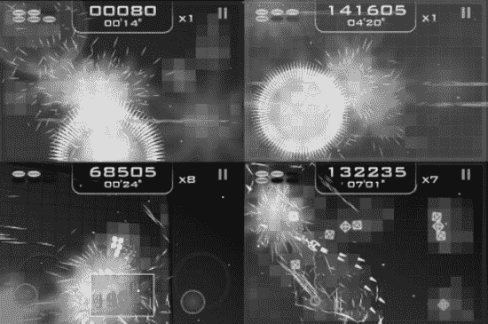

# 抽象战争 2.0  
是一款双摇杆射击游戏，拥有色彩鲜艳、充满活力的几何视觉风格（见图 17-9）。它显然深受 Xbox Live Arcade 上的《几何战争》启发。这是一款紧张刺激的太空射击游戏，拥有多种游戏模式。你甚至可以通过蓝牙连接进行多人对战，并且允许使用自己的 iPod 音乐。

**图 17–9.** *《抽象战争 2.0》，Forzefield Studios SL 出品*

