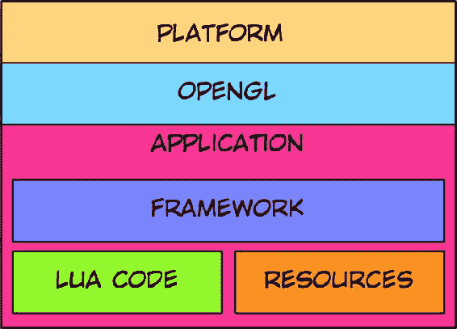
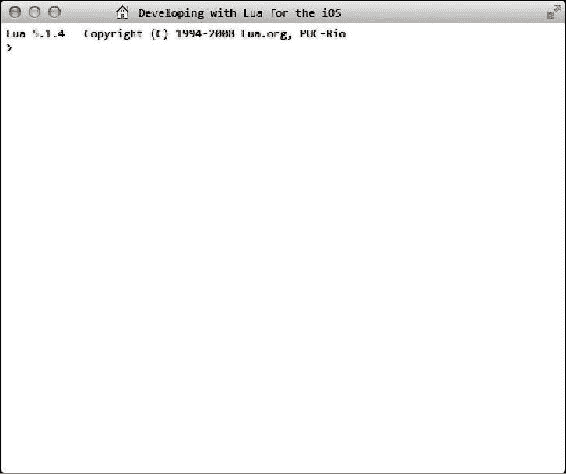

# Lua 入门

作为一名对开发感兴趣的人，你已经迈出了这段旅程的第一步。你可能是从未开发过的学生，也可能是能在几分钟内构建企业级应用的资深开发者。关键是，无论你的背景如何，你出于某种原因被这门听起来很奇怪的语言——`Lua`（发音为 *LOO-ah*）所吸引。

## 什么是 Lua？

`Lua` 是一种编程语言，它占用空间小，可跨多个平台运行，并且非常灵活且可扩展。此外，对于想要为移动设备编写应用的开发者来说，`Lua` 是一个颠覆性的工具。它驱动了苹果应用商店中的许多应用和游戏，已故的史蒂夫·乔布斯也曾提及它。它甚至与一种最先进的自复制和变异病毒 `Flame` 有关联。尽管如此，`Lua` 仍然是一门看起来更像普通英语而非晦涩程序员语言的语言，这使得它的学习曲线较为平缓。

## Lua 的历史

虽然了解 `Lua` 的历史不会让任何人成为更好的程序员，但了解为什么要使用 `Lua` 是很重要的。

`Lua` 是由巴西里约热内卢天主教大学的 `Roberto Ierusalimschy`、`Luiz Henrique de Figueiredo` 和 `Waldemar Celes` 创建的，他们是计算机图形技术组的成员。通常，大学研究的资金由工业界提供，工业界也期望解决他们面临的一些问题。巴西石油公司 `Petrobas` 是该组帮助解决数据录入相关问题的客户之一。石油公司的运营规模庞大，每天需要处理大量数据交易。他们请求该组设计一个图形化前端，以帮助消除数据录入中的错误，尤其是在处理来自固定格式文件的遗留代码时。

`TeCGraf` 审视了提供给他们的整个屏幕系列，并试图找到某种形式的统一性来帮助找到解决方案。为此，他们提出了一种简单且统一的数据录入语言（`DEL`），用于描述每个数据录入任务中的数据。我认为一个很好的类比是 `XML`，但没有那么多让人困惑的标签。这样，人们可以定义实体以及限制或规则。这变得非常流行，因为很容易定义实体并创建有助于验证数据的记录。

随着流行度的增加，功能需求也随之而来。使用 `DEL` 的用户现在要求更多的功能，这促使 `DEL` 从一门描述性语言向编程语言转变，需求包括循环、条件控制等。如果你是一名 90 年代的软件开发人员，你会意识到许多开发人员花费时间的一个方面是更改数据录入屏幕的颜色和字体。该组创建了另一种专门的描述语言来允许设置这些属性。这被称为简单对象语言（`SOL`），因为它允许用户创建对象并操作对象的颜色、字体和其他特性（*Sol* 在葡萄牙语中也意为 *太阳*）。

这种语言的架构更像是一种编译即运行的语言，而不是集成开发环境类型的应用。`API` 作为 `C` 库实现，并链接到主程序。每种类型都可以有一个充当构造函数的回调函数（即，当创建特定类型的对象时调用该函数）。1993 年，创建者意识到 `DEL` 和 `SOL` 可以合并为一门更强大的语言。这催生了一门名副其实的编程语言，它将拥有所有功能：赋值、控制结构、子程序、函数等。然而，它还必须满足能够提供类似 `DEL` 或 `SOL` 的数据描述功能的基本要求。他们希望它是一门易于使用的语言，没有晦涩的语法和语义，因为最终用户不一定是专业程序员。最后，他们希望它具有可移植性，能够在任何平台上运行（如果需要的话）。

因为这原来是 `SOL` 的一个修改版本，创建者将这门新程序称为 *Lua*（在葡萄牙语中意为 *月亮*）。

## Lua 时间线

截至撰写本文时，`Lua` 的版本是 5.2.1。它经历了许多变化，并被广泛应用于企业、娱乐、游戏和应用的众多项目中。对我们许多人来说，得知 `Lua` 几乎每天都在南美家庭中被使用可能会感到惊讶。它为他们的交互式电视提供动力。大学在研究中使用 `Lua` 来实现快速处理和结果。

1996 年，在 *Dr. Dobbs* 杂志上发表了一篇文章后，`Lua` 在国际上获得了关注。文章发表后，收到了来自开发者的电子邮件。在一篇论文中，`Roberto` 讲述了 `LucasArts`（因《冥界狂想曲》而闻名）的首席程序员 `Bret Mogilefsky` 如何想要用 `Lua` 替换他们的脚本语言 `SCUMM`。这引起了其他开发者的兴趣，`Lua` 开始出现在新闻组中。

## 开始使用 Lua

我在本书中会反复强调一个要点：对于 `Lua` 来说，使用什么框架并不重要；重要的是将所有部分粘合在一起的胶水：`Lua`。在 90 年代，微软正在推动客户端-服务器和三层架构（类似于苹果一直在推动的 MVC [模型-视图-控制器]）。MVC 背后的理念是它包含三个不同的部分：一个 *模型*，负责处理数据；一个 *视图*，显示来自模型的数据并提供与用户的交互；以及一个 *控制器*，在模型和视图之间进行通信，因为这两者彼此之间完全不了解对方的存在。控制器是帮助两者相互对话的中介。使用 MVC 最常见的方式是使用一个框架，该框架会为你处理许多细节。

在本书中，我将介绍几个框架：`CoronaSDK`、`Gideros Studio`、`Moai`、`Codea` 和 `LÖVE`。除 `LÖVE` 之外，所有这些框架都支持在 iOS 平台上开发和运行应用。基于 `Lua` 的移动应用架构很简单，如图 1-1 所示。



*图 1-1. 在移动设备平台上使用 Lua 的应用架构*

一个应用由所有资源（图形、音乐、文本等）组成，这些资源与 `Lua` 代码以及框架存根一起编译到应用中。运行时，框架或引擎会创建一个 `OpenGL` 表面，所有图形都在其上显示。这就是所有框架的工作方式，也是它们能够提供跨平台兼容性的原因。对框架的限制主要来自于 `OpenGL` 或框架引擎本身的限制。


### MVC 模式与架构

前面讨论的 MVC 模式在此架构中仍然适用。如果我们据此编写代码，不仅可以创建跨平台的应用程序，还能创建跨框架的应用程序。我们用`Lua`编写的控制器代码需要适配其他框架而变化，但其余代码将保持不变。

下一节中，我们将重点介绍`Lua`及其使用方法。之后，我们会专门研究各个框架，并整合你已学到的知识。

### 安装 Lua

要使用`Lua`，首先需要安装`Lua`。由于大多数框架都使用`Lua 5.1.4`，为兼容性起见，我们将使用该版本。`Lua`可以以预编译的二进制文件形式获取，也可以获取源代码自行编译。它还适用于多种平台，包括`Windows`、`Mac`、*nix、`iOS`和`Android`。

#### 在线 Lua Shell

这可能是测试`Lua`代码最简单的方式，无需任何安装或设置。你可以直接访问[www.lua.org/demo.html](http://www.lua.org/demo.html)。

### Windows、Mac OS X 和*nix

你可以从[`sourceforge.net/projects/luabinaries/files/5.1.4/Executables/`](http://sourceforge.net/projects/luabinaries/files/5.1.4/Executables/)下载`Lua 5.1.4`版本的二进制文件。

根据你的`Windows`版本，可以选择`lua5_1_4_Win32_bin.zip`或`lua_5_1_4_Win64_bin.zip`。

对于`Mac`，有适用于`Tiger`、`Leopard`、`Snow Leopard`和`Lion`的版本。

对于*nix，它们基于内核版本；在这种情况下，从各个发行版的应用程序目录中下载`Lua`会更方便。

#### iOS

据我所知，有两个应用程序允许交互式运行`Lua`代码。与前面提到的其他`Lua`产品不同，这两个应用是收费的。

*   *`iLuaBox`*：此应用使用较新版本的`Lua 5.2`，在 App Store 中的售价约为$2.99。
*   *`Lua Console`*：此应用使用`Lua 5.1.4`，在 App Store 中的售价为$1.99。

在这两者中，`iLuaBox`在文件和目录管理方面具有一些高级功能。

## Lua 的特性

`Lua`是作为用 C 语言编写的库实现的。它没有主程序，因为无需自动调用任何内容；它以嵌入式模式工作并调用嵌入程序。此代码可以调用其他函数、分配变量以及读写数据。由于是用 C 语言编写的，它也可以被扩展；但是，官方版本只会添加已经过委员会批准的功能。

### 变量

用简单的计算术语来说，*变量*是一个保存值的位置，并且可以通过给其命名来访问。可以把它想象成公司人力资源部门的一个文件柜。它可以保存许多包含员工详细信息的文件。当你需要访问某个文件中的数据时，可以通过文件的名称标签来查找。如果有两个同名同姓的员工，就需要有两个文件，并且名称标签需要某种形式的标识来区分两者。就像不能有两个相同标签的文件一样，也不能有两个同名的变量。必须有一个区分点（例如，使用`tag1`和`tag2`而不是仅用`tag`）。

变量的名称可以由一系列字母、数字和下划线组成；但是，它们不能以数字开头。名称区分大小写，因此`T`和`t`是有区别的。除变量外，`Lua`还使用*关键字*，这些关键字不能用作变量名，因为`Lua`将它们识别为代码的命令，而不是变量名。以下是系统关键字列表，它们不能用作变量名：

```
and
break
do
else
elseif
end
false
for
function
if
in
local
nil
not
or
repeat
return
then
true
until
while
```

### Hello World，变量方式

首先，我们需要以交互模式启动`Lua`，以便运行我们所有的代码。操作方法是：在`Mac OS X`或*nix 中打开终端，输入`lua`，然后按回车键。执行此操作后，你应该会看到图 1-2 所示的屏幕。在`Windows`下，你可以从开始菜单启动`Lua`控制台。

**注意** 本书中的大部分屏幕截图和引用都将基于`Mac OS X`版本。



图 1-2. Mac 上终端中运行的`Lua`交互式 Shell

行上的`>`是提示符，你可以在其中输入要运行的`Lua`代码。我们将从一个简单的`Hello World`示例开始。在提示符下输入以下内容：

```
print ("Hello World")
```

你应该会看到下一行打印出了文本“Hello World”。`print`函数用于在终端中显示文本。让我们进一步：

```
message = "Hello World"
print(message)
```

我们在这里所做的是将字符串`"Hello World"`赋值给`message`变量；然后使用`print`函数在终端中显示`message`的值。

与字符串类似，我们也可以打印数字，最简单的方法是：

```
print(5)
age = 1
print(age)
print("Age :", age)
print(1,2,3,4,5,"One")
```

这样做的目的是演示使用`print`，我们可以显示变量、数字和字符串到终端。

### 字符串

`Lua`中的字符串可以用单引号或双引号括起来。因此，例如'`Lua`'和"`Lua`"都是有效的。字面字符串可以像 C 语言一样，通过在它们前面加上反斜杠（`\`）并用单引号或双引号括起来来使用。这些可用于包含常用的转义序列，例如`\b`、`\t`、`\v`、`\r`、`\n`、`\\`、`\'`和`\"`。它们还可以用于指定带有`\ddd`格式的数值，其中`d`是一个数字。

```
print("\65")
```

有时你想要包含大量文本，而跟踪引号可能会变得有点棘手，尤其是在试图让它们匹配并对齐时。在这种情况下，你可以使用长括号格式，将文本括在`[[`和`]]`之间。示例如下：

```
message = [[That's "Jack O'Neill", with two ll's]]
```

如果在这样的场景中使用单引号括起来，你会得到一个错误：

```
message = 'That's "Jack O'Neill", with two ll's'
```

同样，使用下面这行代码也会产生错误，因为单引号和双引号需要有匹配的对或进行转义。

```
message = "That's "Jack O'Neill", with two ll's"
```

声明相同内容的正确方法是在字面引号前放置一个反斜杠，如下所示：

```
message = 'That\'s "Jack O\'Neill", with two ll\'s'
```

或者这样：

```
message = "That's \"Jack O'Neill\", with two ll's"
```

你会注意到很容易漏掉这些，在这种情况下，解释器只会产生错误。在这种情况下，使用长括号非常有用。

`Lua`也有带嵌套的长括号；你可以通过在两个左括号之间和两个右括号之间插入等号来设置不同的层级，如下所示：

```
testmsg = [=[ One ]=]
print(testmsg)
```

你可以用它来编写一些看起来非常有趣的源代码，例如：

```
testmsg = [======[ One ]======]
print(testmsg)       -- 打印 One
```

### 数值

`Lua`中的数字可以表示为十进制、浮点、十六进制和科学计数法。以下是每种类型的示例：

```
print(5)        -- 5             这是一个十进制数
print(5.3)       -- 5.3        这是一个浮点数
print(5.31e-2)   -- 0.0531       这是一个科学计数法数
print(0xfeed)    -- 65261       这是一个十六进制数
```

### 值和类型

在像 C 这样的语言中，你必须使用特定类型来定义变量。例如，你可能需要将变量`i`定义为整数（`int`），如下所示：

```
int i;
```


## Lua 基础

使用 Lua 时，您无需定义变量的类型；只需赋值即可，并且值可以随时更改。在 Visual Basic 6（不要与 Visual Basic.NET 混淆）中，这种类型的变量被称为 *variant* 变量，并且必须显式定义如下：

```vb
dim i as variant
```

相比之下，Lua 将变量存储在内存中。Lua 同时存储变量的值和类型。Lua 中的所有变量都是**一等值**。这仅仅意味着这些值可以存储在变量中、作为参数传递给其他函数，以及从函数返回。

Lua 中有八种不同类型的变量，下文将逐一介绍。

### `nil`

这与`null`相同。如果某个变量持有一个对最后持有值的引用，而垃圾回收器尚未清理它，则可以将该变量设置为`nil`，以指示该引用空间可以被垃圾回收。

### `boolean`

`boolean`变量就是我们熟悉的`true`和`false`。它们用于检查条件；但需要注意的是，`nil`和`false`都会导致条件为`false`，而任何其他值都会导致条件为`true`。

```lua
trusted = false
if (trusted) then print("Yes") end        -- 不输出任何内容
trusted = 1
if (trusted) then print("Yes") end        -- 输出 Yes
trusted = nil
if (trusted) then print("Yes") end        -- 不输出任何内容
```

### `number`

`number`变量是可以表示为小数、长整型、整数、十六进制数和浮点数的数字。Lua 将数字保存为双精度浮点数。

### `string`

Lua 字符串通常是 8 位干净的字符串（即，它们可以包含任何 8 位字符，包括嵌入的零值）。Unicode 变量略有不同，但如果平台支持 Unicode，Lua 也可以处理。

### `function`

在 Lua 中，函数也可以作为变量存储和传递。这种将函数作为参数存储和传递的功能，使得 Lua 中的函数成为“**一等函数**”。

### `userdata`

这是一个从 C 语言分配的内存块，允许 C 语言函数存储和访问数据。`userdata`变量不能在 Lua 中创建或操作，只能通过 C API 进行。

### `thread`

这是一种特殊的变量类型；它指定一个独立的执行线程。这与操作系统线程不同。

### `table`

`table`变量在 Lua 中就是我们所说的数组、关联数组、哈希表、集合、记录、列表、树，甚至是对象。

**注意**：`table`、`function`和`thread`实际上并不持有任何值——只持有对它们的引用。

## 代码块和作用域

在 Lua 中，每个变量都有一个作用域，这意味着其可访问性取决于由作用域决定的生命周期。变量要么是**全局**的，要么是**局部**的。默认情况下，变量定义为全局变量，除非显式定义为局部变量。

在代码中，在`do`和`end`块之间设置的变量在该块外部不可访问，而在该块外部设置的任何局部变量在该块内部是可访问的。

让我们通过一个示例来看：

```lua
i = 1
print("i = ", i)
do
  local i = 2
  print("i = ", i)
end
print("i = ", i)
```

**强制转换**是一个简单术语，指的是根据转换规则（如果可能）将字符串转换为数字，以便在字符串和数字之间进行算术运算的过程。

```lua
one = "1"
two = 2
print(one + two)       -- 输出 3
```

在许多语言中，尝试在两种不同数据类型（本例中为字符串和数字）之间进行此类算术运算会失败。在其他一些脚本语言中，此代码会将值添加到字符串中，得到字符串`"12"`。然而，在 Lua 中，这会输出值`3`，其中`one`被转换为数值`1`，然后与`two`的值相加，输出`3`。

但是，如果我们想要将两个字符串`"1"`和`"2"`拼接成`"12"`，则需要使用所谓的**连接**操作。在 Lua 中，连接运算符是双点（`..`）。它连接两个字符串并返回一个包含这两个字符串的新字符串。

## Lua 运算符

Lua 中的运算符可以分为不同类型，包括算术运算符、关系运算符和逻辑运算符等。

### 算术运算符

这些运算符无需过多介绍；它们简单直接。表 1-1 列出了它们。

**表 1-1.** 算术运算符

| 运算符 | 描述 |
| --- | --- |
| `+` | 加法 |
| `-` | 减法 |
| `*` | 乘法 |
| `/` | 除法 |
| `%` | 取模 |
| `^` | 指数 |
| `-` | 一元负号 |

### 关系运算符

这些是用于比较或条件的运算符。它们列在表 1-2 中。

**表 1-2.** 关系运算符

| 运算符 | 描述 |
| --- | --- |
| `==` | 等于（检查两个值是否相等） |
| `~=` | 不等于（等于的反义） |
| `<` | 小于 |
| `>` | 大于 |
| `<=` | 小于等于 |
| `>=` | 大于等于 |

这些运算符总是返回`true`或`false`。需要注意的是，比较两个数字或值时，使用`==`，而在 Lua 中单个`=`表示赋值。

### 逻辑运算符

Lua 中的逻辑运算符是：

```lua
and
or
not
```

`and`和`or`在 Lua 中的工作方式是通过所谓的**短路求值**。它检查一个值，并且仅在需要时才进一步检查。如果第一个参数值为`false`或`nil`，则`and`返回第一个参数；否则返回第二个参数。另一方面，如果第一个结果不为`false`或`nil`，则`or`返回第一个值；如果第一个参数为`false`或`nil`，则返回第二个参数。

`or`的最佳用途是在函数中分配默认值：

```lua
a = a or 5 -- 如果 a 的值为 nil 或 false，可用于将 a 赋值为 5
```

我们可以这样测试它们的工作方式：

```lua
testing = nil
print(testing)
print(testing and 5)
print(testing or 5)
print(not testing)
testing = 15
print(testing)
print(testing and 5)
print(testing or 5)
print(not testing)
```

### 其他运算符

除了我们讨论过的标准运算符之外，Lua 还为我们提供了其他几个运算符。它们用于连接操作和获取某物的长度等操作；这两个运算符都适用于字符串，不过`#`运算符也可以用于数组。

*   连接运算符：`..`
*   长度运算符：`#`

如前所述，Lua 中的连接运算符是双点（`..`）。它用于将两个字符串相加，如下所示：

```lua
print("one, two, " .. " buckle my shoe")
```

长度运算符返回字符串的长度。

```lua
print(#"this is a long string")       -- 输出 21 作为字符串的长度
```

## 总结

Lua 的可移植性意味着我们可以在各种设备和桌面系统上运行代码。Lua 的小巧体积以及非常灵活且容错的语法，使得快速原型开发和代码测试成为可能。我们已经看到 Lua 在游戏开发者中越来越受欢迎。在下一章中，我们将更详细地了解标准 Lua 库，这些库提供了构成标准 Lua 的所有命令。

---

**第二章**

