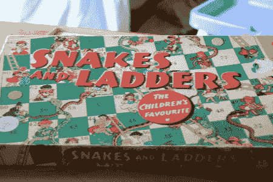
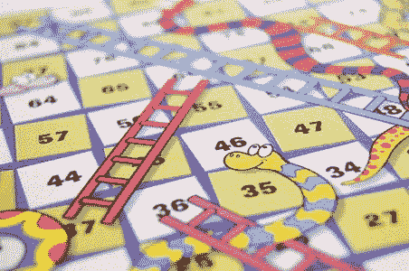
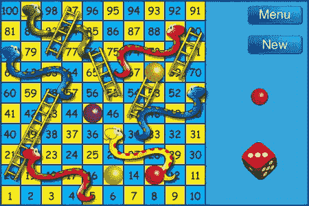
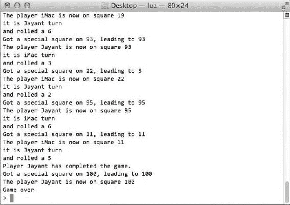
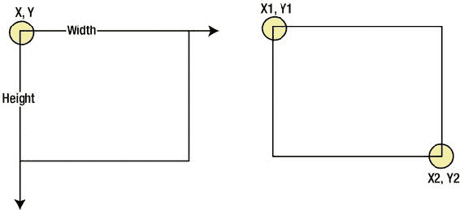
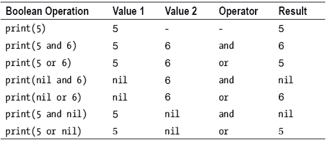

# 第 4 章：用 Lua 玩转数学

无论你喜欢还是讨厌它，如果你决定成为一名开发者，你就必须直面数学。看到有多少学生不喜欢或回避数学确实令人惊讶，但无论我们从事何种职业，数学总会以某种形式回到我们身边。会计师需要查看账目并对其进行加总（需要数学），测量员需要运用三角学原理来获取高程和地形信息，银行家需要计算投资利息和收益，等等。这让我想起了荷马·辛普森，他曾说过：“英语？谁需要它？我从来不去英格兰！” 然而，你已决定成为一名开发者，你会一次又一次地回到数学上，因为你需要做的许多事情都基于简单的数学原理。这些原理可以应用于任何框架或语言。

## Lua 数学简介

Lua 附带了一个系统库，提供了一系列数学函数。以下是可用函数的列表。这些函数大多不言自明。

### `math.abs (x)`

返回 *x* 的绝对值。如果你向此函数传递一个负值，它将返回 *x* 的正值。

```lua
print(math.abs(−10))   -- 将返回 10
```

### `math.acos (x)`

以弧度为单位返回值 *x* 的反余弦值。

```lua
print (math.acos(1))   -- 打印零 '0'
```

### `math.asin (x)`

以弧度为单位返回值 *x* 的反正弦值。

```lua
print(math.asin(1))  -- 打印 1.5707963267949
```

### `math.atan (x)`

以弧度为单位返回值 *x* 的反正切值。范围在 –pi/2 到 pi/2 之间。

```lua
print(math.atan(1))  -- 打印 0.78539816339745
```

### `math.atan2 (y,x)`

返回所传递的两个数字之商的反正切主值。

```lua
print(math.atan2(1, 0))     --   pi/2
print(math.atan2(−1, 0))    --   -pi/2
print(math.atan2(0, 1))     --   0
print(math.atan2(0, -1))    --   pi
```

**注意**  传入的参数是 *y* 然后是 *x*，而不是通常传递的 *x,y*。

### `math.ceil (x)`

返回传入值 *x* 的向上取整到下一个最接近整数的整数值。

```lua
print (math.ceil(0.1))  -- 返回 1
print (math.ceil(0.5))  -- 返回 1
print (math.ceil(0.6))  -- 返回 1
```

### `math.cos (x)`

返回以弧度传入的 *x* 的余弦值。

```lua
print(math.cos(1))  -- 0.54030230586814
```

### `math.cosh (x)`

返回一个值的双曲余弦值。

```lua
print(math.cosh(1)) -- 1.5430806348152
```

### `math.deg (x)`

此函数将弧度值转换为角度。

```lua
print(math.deg(math.pi))  -- 180
```

### `math.exp (x)`

返回 e（自然对数的底数）的给定次幂的值。

```lua
print (math.exp(2)) -- 7.3890560989307
```

### `math.floor (x)`

返回传入值 *x* 的向下取整的整数值。

```lua
print (math.floor(0.1))  -- 0
print (math.floor(0.5))  -- 0
print (math.floor(0.9))  -- 0
```

### `math.fmod (x)`

根据以下等式，返回参数相除后向零取整的余数：

余数 = 分子 – 商 * 分母

该函数的使用方法如下：

```lua
print(math.fmod(7.5,3))  -- 1.5
```

### `math.frexp (x)`

此函数将一个值分解为规格化分数和指数。结果返回两个数字。数字 *x* 可以表示如下：

分数 * 2^指数

以下是一些代码示例：

```lua
print(math.frexp(2))  -- 0.5       2
print(math.frexp(3))  -- 0.75       1
print(math.frexp(1))  -- 0.5       1
```

### `math.huge`

这是一个常量而非函数；它返回 inf，一个非常大的数字。

```lua
print(math.inf)
```

### `math.ldexp (m, e)`

返回由尾数 *m* 和指数 *e* 组合生成的数字。使用的公式是：

数字 = m * 2^e

以下是函数用法：

```lua
print(math.ldexp(0.5, 8)) -- 128
```

### `math.log (x)`

返回 *x* 的自然对数值。

```lua
print(math.log(0.5))  -- (−0.69314718055995)
```

### `math.log10 (x)`

返回 *x* 的以 10 为底的对数值。

```lua
print(math.log10(100))  -- 2.0
```


`print(math.log10(0.5))`  --  (−0.30102999566398)

`math.max (x, …)`

返回传入值中的最大值。

```
print(math.max(2,5,3,8,3,4,5))  -- 8
```

`math.min (x, …)`

返回传入值中的最小值。

```
print(math.min(2,5,3,8,3,4,5))  -- 2
```

`math.modf (x)`

返回传入数字的整数部分和小数部分。因此，如果传入`x.y`，它将返回`x`和`y`。

```
print(math.modf(3.75))  -- 3       0.75
```

`math.pi`

返回数学常数π。

```
print(math.pi)  -- 3.1415926535898
```

`math.pow (x,y)`

返回`x`的`y`次幂的结果（即`x ^ (y)`）。

```
print(math.pow(3,3))  -- 27 => 3³
print(math.pow(5,2))  -- 25 => 5⁵
```

`math.rad (x)`

返回角度`x`转换成的弧度值。

```
print(math.rad(math.pi))  -- 3.1415296535898
```

`math.random ( [m [,n]] )`

返回`m`到`n`之间的随机值。如果未传入`m`和`n`的值，则函数返回 0 到 1 之间的值。如果只传入一个值，则返回 1 到该数字之间的整数值。

```
print(math.random())  -- 0 到 1 之间的十进制数
print(math.random(10))  -- 1 到 10 之间的整数值
print(math.random(5,25))  -- 5 到 25 之间的整数值
```

`math.randomseed (x)`

设置随机数生成器的种子。如果设置了种子，则可以获得相同的随机值。

`math.sin (x)`

返回以弧度传入角度的正弦值。

```
print(math.sin(30))  -- (−0.98803162409286)
```

`math.sinh (x)`

返回一个值的双曲正弦。

```
print(math.sinh(1))  -- 1.1752011936438
```

`math.sqrt (x)`

返回`x`指定数字的平方根。

```
print(math.sqrt(144)) -- 12
print(math.sqrt(9))  -- 3
```

`math.tan (x)`

返回以弧度传入角度的正切值。

```
print (math.tan(45))  -- 1.6197751905439
```

`math.tanh (x)`

返回一个值的双曲正切。

```
print(math.tanh(1))  -- 0.76159415595576
```

## 数学在游戏中的实际应用

如果你开发游戏，你会被数学包围。任何游戏都会涉及的最简单场景就是移动角色，这涉及在 x 轴或 y 轴上移动角色，通俗地说就是左右或上下移动。角色左右移动被称为在`x 轴`上，上下移动则在`y 轴`上。

另一个使用数学的例子是简单的计分，根据在游戏中收集的对象类型来增加分数。你还会使用数学来处理拥有多条生命的玩家，每次回合减少一个值，直到归零，游戏结束。

但首先，让我们复习一些关于数学的基础知识（尽管我们在学校都学过）。

### 赋值

我们要看的第一件事是赋值。还记得学校里的那些日子，我们曾这样写：

令`x`等于 5  
令`y`等于 3  
`x + y = 5 + 3`  
`= 8`

这个概念至今依然存在。在 Lua 中，当我们给变量赋值时，这个值可以是第 1 章中讨论的八种基本类型之一。最常用的是数字、字符串和表。

上述代数方程将转换为：

```
x = 5
y = 3
print( "x + y = " .. x + y)
```

### 递增与递减

如果你是从 C/C++背景转到 Lua，你可能习惯了运算符重载。这就是为什么很多开发者会问 Lua 为什么没有`var++`或`var--`运算符来递增或递减值。虽然 Lua 没有这个功能有很多原因，但一个简单的理由是 Lua 被设计得易于使用。然而，在 Lua 中实现这种功能并不困难；它就像这样简单：

```
var = var + 1
```

或者

```
var = var – 1
```

如果这很关键，Lua 最棒的一点是你可以创建自己的函数，通过集成它们的语法，让你获得使用自己偏好语言的那种安全感。

通过代码修改 Lua 的程度存在不少限制。我们将尝试创建`inc`和`dec`函数，它们将根据传入的值来递增或递减数值。我们将创建两个函数：`inc`和`dec`。这些函数接受变量和我们要增减的数值，并返回增减后的值。

```
function inc(theVar, byVal)
    local byVal = byVal or 1
    return theVar + byVal
end
function dec(theVar, byVal)
    local byVal = byVal or 1
    return theVar - byVal
end
```

现在你可以按如下方式调用`inc`或`dec`：

```
local theValue = 20
print("The Value = ", theValue)
theValue = inc(theValue, 5)       -- 等效于 theValue = theValue + 5
print("The Value = ", theValue)
theValue = dec(theValue)   -- 等效于 theValue = theValue + 5
print("The Value = ", theValue)
```

函数`dec`没有获得`byVal`的值，因此`byVal`为`nil`。在函数中，我们首先声明一个局部变量并将其赋值为`byVal`，由于它是`nil`，我们将其赋值为 1。然后我们返回`theVar`减去`byVal`的值。

### 引入点

我们需要保存二维坐标：即`x`坐标和`y`坐标。在大多数语言中，我们使用两个变量：`x`和`y`。在 C 和其他类似语言中，我们使用包含成员`x`和`y`的结构体。在 Lua 中，我们可以使用表来保存这个结构体。我们将这个结构体称为`点`。

```
local myPoint = {x = 0,y = 0}
myPoint.x = 160
myPoint.y = 240
print(myPoint.x, myPoint.y)
```

使用`点`来存储坐标，比使用成对的变量如`playerX`、`playerY`、`monster1X`、`monster1Y`、`monster2X`、`monster2Y`等更好。通过使用`点`表结构，你只需要`playerCoords`、`monsterCoords`等即可。当我们研究比简单表稍微复杂的向量时，这也会非常有用。最棒的是，我们的两个函数`inc`和`dec`无需任何修改即可正常工作。编码就像这样简单：

```
myPoint.x = inc(myPoint.x,8)
myPoint.y = inc(myPoint.y,4)
```

### 条件分支

我们可能希望根据特定条件运行一些代码；例如，如果关卡完成，则显示“关卡完成”横幅。或者，如果关卡完成且分数高于某个特定分数，则显示“你获得了新的最高分”消息。否则，只显示分数。

```
local score = math.random(1,10)*1000
if score >= 
5000 then
    print("Well done")
elseif score >=
 2000 then
    print("There is always a second chance")
else
    print("you have missed even the second chance")
end
```

这里我们使用了`math.random`，一个帮助生成随机数的函数。我们请求一个 1 到 10 范围内的整数，然后将其乘以 1000，得到一个 1000 到 10000 范围内的分数。然后使用这个分数来决定打印的消息。对于条件评估，我们使用`if .. elseif .. end`块来检查条件。

### 抛硬币

你刚刚了解了在许多游戏和语言中使用的随机数生成器。在这个练习中，我们将尝试使用随机数生成器来模拟抛硬币。抛硬币的好处是结果要么是正面，要么是反面。有很多方法可以处理这种情况，但我们将尝试最简单的一种：生成一个 1 或 2 的随机数。因此，如果得到 1，我们称之为“正面”，如果得到 2，我们称之为“反面”。

```
local theFlip = math.random(1,2)
if theFlip ==1 then
    print("Got heads")
else
    print("Got tails")
end
```

### 掷骰子


在某些角色扮演类游戏中，抛硬币可能不够用。你可能希望有更多可能的数值，而不仅仅是 1 或 2——类似于掷骰子的效果。最常见的骰子有六个面，能得到的数字范围是 1 到 6。

```
local theDice = math.random(1,6)
print("we got ", theDice)
```

在角色扮演类游戏或类似类型的棋盘游戏中，骰子通常是非标准的，可能不止六个面。模拟这种情况就像之前的示例一样简单。我们只需要改变骰子能得到的最大值。例如，对于一个 20 面的骰子，我们可以这样写：

```
local maxValue = 20
local theDice = math.random(1,maxValue)
print("we got ", theDice)
```

如果你需要多次投掷，可以简单地将其改为一个函数来获取骰子值：

```
function diceRoll(maxSides)
  local maxSides = maxSides or 6
 return math.random(1,maxSides)
end
```

在前面的`inc`和`dec`示例中，你可能注意到我们使用了一个 Lua 的便捷特性，即允许为变量分配默认值。在刚刚展示的`diceRoll`函数中，如果调用该函数时没有传入任何值（即`maxSides`参数为`nil`），那么第二行会创建一个名为`maxSides`的局部变量，并将其赋值为参数`maxSides`的值（如果参数为`nil`或缺失，则赋值为 6）。

使用标志（Flags）

这里指的不是旗杆上飘扬的旗帜。这里的标志是一个保存布尔值`true`或`false`的变量。例如，在一个游戏中，一个标志可以指示你是否拥有宝箱的钥匙；如果你有钥匙，就可以打开宝箱；如果没有，则不能。因此，代码会检查你是否拥有钥匙，并相应地允许你打开宝箱。

```
function openTreasureChest(withKey)
    if withKey == true then
        print("The treasure chest opens")
    else
        print("Nothing happens, you are unable to open the chest")
    end
end
local hasKey = false
openTreasureChest(hasKey)
hasKey = true
openTreasureChest(hasKey)
```

注意，我们有一个名为`hasKey`的变量，初始值设为`false`。然后调用`openTreasureChest`函数，函数打印出"Nothing happens"。但当我们将`hasKey`设置为`true`后再次调用时，它打印出"The treasure chest opens"。这是标志的最简单示例。在游戏中，你可以有许多标志，它们可能一起使用来决定某些动作。

在某些情况下，你还可以使用标志来阻止某些事情发生。例如，你可以设置一个标志来阻止函数运行。

使用标志来管理某些动作是否可以执行，非常简单：

```
onHold = false
function giveBlessings()
    if onHold == true then return end
    print("Bless you")
end
giveBlessings()
onHold = true
giveBlessings()
```

开始时，`onHold`为`false`，所以当调用`giveBlessings`函数时，它会打印"Bless you"。下一次，我们调用它时`onHold`设置为`true`，函数直接返回，什么也不打印。

在标志之间游弋：多个标志

让我们设想一个场景：我们需要收集多件物品才能去屠龙。这些物品包括盔甲、剑、坐骑、盾牌和一些法术。共有五件物品。要检查多件物品，我们使用布尔运算符`and`和`or`。在 Lua 中，它们以短路方式工作——简单来说，这意味着它们只在需要时才评估条件。

假设我们物品的标志分别叫做`item1`到`item5`，我们可以这样做：

```
if item1 and item2 and item3 and item4 and item5 then
    print("The king blesses you on your journey to battle the dragon")
else
    print("You are still not ready for battling the dragon")
end
```

这段代码运行得很好，但可以改进。如果游戏需要向玩家报告已收集物品数量与需要收集的总物品数量，我们就会想知道如何实现。以下是实现方法之一：

```
local items = {}       -- 最好使用数组来存放多个物品
local maxItems = 5       -- 需要准备好的物品数量
function isPlayerReady(theItemsArray)
    local count = 0
    local i
    for i = 1,maxItems do
        if theItemsArray[i] then count = count + 1 end
    end
   return count
end
```

现在我们可以这样调用这个函数来检查玩家是否准备好了：

```
if isPlayerReady(items)==5 then
    print("The king blesses you on your journey to battle the dragon")
else
    print("You are still not ready for battling the dragon")
end
```

通过使用数组，我们不仅减少了所需的变量数量，还在保存物品列表时使操作更简单；换句话说，如果你可以收集的物品数量是 100，那么设置`item1`到`item100`会很愚蠢。创建数组来保存这些值要容易得多。

许多新手开发者常问的另一个问题是：如何创建动态变量？答案是使用数组；在它们被使用的上下文中，数组等效于动态变量。

使用数学进行循环

Lua 中最安全的循环是`for`循环。还有其他使用循环的方式，但如果使用不当，有些可能会导致 Lua 挂起。

```
local result = false
local  value = 0
while result == false do
  print("The value is ", value)
  value = value + 1
  if value>=
5 then
    result = true
  end
end
```

当值达到 5 或更大时，我们将`result`设置为`true`，这样`result==false`这个条件就不再为真，从而中断循环。使用一个标志来退出`while`循环是一个好习惯，但如果你遇到需要使用`while true do`循环的情况，可以使用`break`语句来退出循环。

```
local  value = 0
while true do
 print("The value is ", value)
value = value + 1
if value>= 5 then break end
end
```

在游戏中使用网格

如果你曾创建过一个简单的棋盘游戏，你会意识到游戏基本上是一个由存放物品的方格组成的网格。本例将探讨这种组织形式。为简单起见，棋盘上的每个方格在每个槽位上只存放一个棋子。

```
local board = {} -- 注意，这只是一个一维数组
local i,j
local boardW, boardH = 5,5..   -- 一个 5x5 的棋盘
for i = 1,boardH do
    board[i] = {}
    for j = 1,boardW do
        board[i][j] = 0  -- 初始化为空，即 0
    end
end
```

这样，我们就创建了一个 5x5 的棋盘，可以存放棋子。让我们用一些物品（即非零数字）来填充棋盘。

```
local board = {} -- 注意，这只是一个一维数组
local i,j
local boardW, boardH = 5,5     -- 一个 5x5 的棋盘
for i = 1,boardH do
    board[i] = {}        -- 现在为数组创建第二个维度
    for j = 1,boardW do
        board[i][j] = 0  -- 初始化为空，即 0
    end
end
for i = 1,7 do -- 让我们在 25 个格子中随机放置 7 个物品
    local xCo, yCo = math.random(1,boardW), math.random(1,boardH)
    board[yCo][xCo] = 1
end
for i = 1,boardH do
    for j = 1,boardW do
        print(i, j, board[i][j])
    end
end
```

我们可以看到哪些格子被随机填充了。

蛇梯棋


好的，作为一名高级文档工程师和翻译员，我已经理解了您的要求。以下是根据注意事项和示例，对给定英文文本进行翻译后的结果。


你非常可能在小时候玩过这个游戏。它由一个 10×10 的方格棋盘组成，棋盘上画着一些梯子和一些蛇。你掷骰子，并移动所掷点数对应的格子数。如果你落在有梯子顶端的格子上，你会移动到梯子底端的格子；如果你落在有蛇的格子上，你会移动到蛇尾的位置（见图 4-1 和 4-2）。



Figure 4-1. 蛇与梯子



Figure 4-2. 蛇与梯子棋盘

接下来，我们将尝试自己编写一个“蛇与梯子”的版本。请注意，我们目前还没有使用框架，所以屏幕上无法显示太多内容。稍后引入框架时，我们会将这个想法与它们整合。现在，我们先专注于游戏背后的逻辑，并首先使用 Lua 来实现它。

## 哪里有蛇？哪里有梯子？

我们以图 4-3 所示的棋盘作为游戏的起点。



Figure 4-3. 蛇与梯子游戏棋盘

棋盘上有六条蛇和五架梯子。梯子位于以下位置（从底部到顶部）：

*   起点 58，终点 20
*   起点 68，终点 47
*   起点 76，终点 55
*   起点 90，终点 69
*   起点 97，终点 78

蛇位于以下位置（从前往后）：

*   蛇头 22，蛇尾 5
*   蛇头 35，蛇尾 12
*   蛇头 51，蛇尾 34
*   蛇头 80，蛇尾 57
*   蛇头 89，蛇尾 66
*   蛇头 99，蛇尾 76

## 关于棋盘的一些事实

棋盘从 1 到 100 编号，采用蛇形排列：前十个数从左到右，接下来十个数从右到左，再下一组又从左到右，以此类推。

玩家可以在任何格子上，当他们到达第 100 格时，就赢得了游戏。这个游戏可以由多名玩家一起玩，并且多个玩家可以停留在同一个格子上。

## 将其转换为代码

我们可以将棋盘设置成一个类，用来保存蛇和梯子的信息，就像前面代码中我们随机向棋盘存储一个值那样。不过，现在我们把这个信息存储在一个数组中。这个表中的每条记录都有两个字段：`start`（起点）和 `end`（终点）。

```lua
local tableSquares = {
{startPos = 20, endPos = 58},
{startPos = 47, endPos = 68},
{startPos = 55, endPos = 76},
{startPos = 69, endPos = 90},
{startPos = 78, endPos = 97},
{startPos = 22, endPos = 5},
{startPos = 35, endPos = 12},
{startPos = 51, endPos = 34},
{startPos = 80, endPos = 57},
{startPos = 89, endPos = 66},
{startPos = 99, endPos = 76},
}
```

我们还需要一个数组来保存玩家的位置，所以我们创建了一个数组：

```lua
local players = {}
local playersInGame = 0
local playersTurn = 1
```

由于这是一个数组，我们可以通过简单地插入记录到表中来添加任意数量的玩家。让我们创建一个函数来添加新玩家：

```lua
function addPlayer(playerName)
    playersInGame = playersInGame+ 1
    table.insert(players, {name=
playerName, square=
0, isPlaying=
true})
end
```

这个函数的作用是：首先将代表游戏中玩家数量的变量 `playersInGame` 加 1，然后为玩家添加一条包含 `name`、`square` 和 `isPlaying` 字段的记录。`name` 取自我们传递给函数的参数，我们将玩家设置在 0 号格子，并将 `isPlaying` 设置为 `true`。这样我们就可以追踪玩家，并检查他们是否仍在游戏中，或者已经完成了游戏。

我们始终可以使用 `#` 运算符从数组中获取玩家数量，但当玩家完成游戏时，我们会减少 `playersInGame` 来反映仍在游戏中的玩家数量，而不是遍历所有玩家并检查他们是否在游戏中。

我们还需要另一个函数来返回掷骰子点数，类似于我们之前编写的一个：

```lua
function rollDice(maxSides)
    local maxSides = maxSides or 6
    return math.random(1,maxSides)
end
```

现在我们可以从骰子中得到一个点数，接下来需要根据这个点数移动玩家。让我们创建基于骰子点数移动玩家的函数：

```lua
function movePlayer(playerNo, paces)
    if paces < 1 or paces > 6 then return end
    -- Just to make sure that we do not get an invalid number of paces
    if playerNo > #players or playerNo <1 then return end
    -- Just to make sure that we do not get an invalid player number
    if players[playerNo].isPlaying == false then return end
    -- Make sure that the player is still playing
    local square = players[playerNo].square + paces
    if square > 100 then return end
    -- You need to have the exact paces to reach the 100th square
    if square == 100 then
        -- Reached the 100th square, won or finished the game
        player[playerNo].isPlaying = false
        print("Player " .. players[playerNo].name  .. " has completed the game.")
        playersInGame = playersInGame - 1
    end
    -- Check if we have reached a snake or a ladder
    local square1 = specialSquare(square)
    if square1 then
        print("Got a special square on " .. square .. ", leading to " .. square1)
    end
    players[playerNo].square = square
    -- The player is now at the new square
    print("The player " .. players[playerNo].name .. "is now on sqaure " .. square)
end
```

在上面的函数 `movePlayer` 中，它接收两个变量：`playerNo` 和 `paces`。首先，我们进行几项检查，以确保不会收到无效参数。首先检查 `paces`，它必须在 1 到 6 的范围内，因为这是我们从骰子中得到的点数。如果 `paces` 无效，我们就从函数返回。接下来，我们检查 `playerNo` 是否有效，它应该在 1 和 `players` 数组元素数量之间。我们还能通过检查 `player[playerNo].isPlaying` 标志来确认玩家是否仍在游戏中且尚未完成游戏。通过这些检查后，我们确信玩家是有效且在游戏中的，并且步数也是有效的。然后，我们将玩家当前所在的格子和步数相加的结果存储到一个名为 `square` 的变量中。根据游戏规则，玩家只能通过到达第 100 格来获胜，所以如果玩家在 99 格并掷出了 2，他们就不能移动；他们**必须**掷出 1 才能获胜。我们做的第一件事是检查总数是否大于 100；如果是，则从函数返回（即不做任何操作）。如果正好是 100，则标记该玩家已完成游戏，并将 `isPlaying` 标志设置为 `false`。同时，我们显示一条消息，表示该玩家已完成游戏。


由于这是“蛇与梯子”游戏，我们还需要检查玩家是否到达了蛇头或梯子底部。当玩家到达蛇头时，会移动到蛇尾；若到达梯子底部，则会移动到梯子顶端。我们通过一个名为 `specialSquare` 的函数来实现这一检查，该函数接收一个 `square` 参数，并返回蛇尾或梯子顶端对应的方格；如果未触发特殊方格，则直接返回原方格。这样一来，我们便可用较少的代码实现方格数值的设定。

```
function specialSquare(theSquare)
    local theSquare = theSquare
    local  i
    for i = 1,#tableSquares do
        local currSquare = tableSquares[i]
        if currSquare.startPos == theSquare then
            -- 到达了特殊方格
            return currSquare.endPos
        end
    end
    -- 没有特殊方格，直接返回原方格数值
    return theSquare
end
```

有了这些函数，我们就涵盖了游戏的大部分核心逻辑。其余函数主要用于界面展示，负责处理用户交互及显示更新。

在游戏开始前，我们还需要一个 `init` 函数来设置或重置游戏默认值：

```
function init()
    -- 清空玩家表格
    players = {}
    playersInGame = 0
end
```

首先，我们尝试用两名玩家来测试游戏。最简单的方式如下：

```
function reset()
  init()
  addPlayer("Jayant")
  addPlayer ("Douglas")
end
```

概念上所需的大部分代码都已就绪，但我们还需将它们整合起来才能生效。游戏启动时，我们需要一个函数来掷骰子、移动玩家到新方格、切换到下一玩家，并重复这一过程，直到只剩一名玩家。因此，游戏至少需要两名玩家才能开始。

由于我们将在 Lua 终端而非图形框架中运行此游戏，无法使用各种图形和触摸功能。这限制了我们当前示例的交互性。虽然许多游戏提供了丰富的交互体验，但这个游戏并不需要太多。在本游戏中，骰子由程序自动投掷（生成随机数），玩家棋子也由程序移动，所以我们所需的交互仅仅是让玩家在每个阶段点击屏幕以继续，以及点击掷骰子。由于处于文本模式，我们无法获取任何触摸事件，因此游戏看起来更像一个自动运行的模拟程序：它会在终端中依次显示当前轮到哪位玩家、掷出了几点、玩家当前位置，直至最后只剩一名玩家。

```
function startGame()
    if #players < 2 then return end
    -- 至少需要两名玩家
-- 这是我们的检查条件：当只剩一名玩家时，游戏结束
    while playersInGame > 1 do
        local thePlayer = players[playersTurn]
        if thePlayer.isPlaying == true then
            print("轮到 " .. thePlayer.name .. " 行动")
            local diceRoll = rollDice()
            print("掷出了 " .. diceRoll)
            movePlayer(playersTurn, diceRoll)
        end
        -- 轮到下一个玩家
        nextPlayer()
    end
    print("游戏结束")
end
```

在前面的函数块中，我们可以递增 `playersTurn`，但需要确保 `playersTurn` 的值在 1 到最大玩家数之间。同时，还需确保该玩家仍在游戏中。

```
function nextPlayer()
    playersTurn = playersTurn + 1
    -- 如果当前玩家是最后一名，则循环回第一位
    if playersTurn > #players then playersTurn = 1 end
    if players[playersTurn].isPlaying == false then
        nextPlayer()
    end
    -- 全部完成，无需其他操作...
end
```

将以上所有代码整合在一起，我们就得到了一个自动运行的“蛇与梯子”游戏。这段代码旨在教你如何创建模块化的函数，并说明运行应用的主要是 Lua 代码；框架更像是将“光彩”粘合在一起的“胶水”。

如果你好奇为什么终端窗口没有输出任何内容，那是因为我们尚未启动游戏。我们可以快速创建一个名为 `restart` 的函数，它会将所有变量重置为初始值，然后为我们启动游戏：

```
function restart()
  init()
  startGame()
end
```

要运行游戏，只需调用 `restart()`，游戏便会在控制台运行（见图 4-4）。



图 4-4. 在控制台运行的游戏

## 移动角色

在任何 2D 游戏中，你控制一个角色，该角色会随着你在移动设备屏幕上的点击或滑动而移动。让我们来研究让角色移动的代码。屏幕是一个具有两个维度（高度和宽度）的网格。大多数屏幕以屏幕左上角为原点 `(0,0)`，正 `x` 值表示角色位于原点右侧，负值表示位于左侧；同样，正 `y` 值表示角色位于原点下方，负值表示位于上方。基于此，我们可以推断：要向右移动角色，需为 `x` 坐标增加一个正值；要向左移动，则为 `x` 坐标增加一个负值。

我们来为角色创建一个类似点的表格结构，用于存储角色的 `x` 和 `y` 位置：

```
local point = {x = 0,y = 0}
-- 将点结构初始化为 x = 0, y = 0
```

现在，将角色向右移动 5 个单位：

```
local i
for i = 1,5 do
 point.x = point.x + 1
end
```

这段代码也可以用于逐像素地递增位置。不过在前面的例子中，我们也可以直接使用 `point.x = point.x + 5`，就像这样：

```
print(point.x, point.y)
```

目前我们看不到屏幕上的任何内容，因为我们还没有编写任何显示代码。有些人可能觉得这种方法相当枯燥，但从更大的角度看，你会发现，如果这段代码能完美运行，你就可以在任何框架和语言中使用它。这有助于你保持代码的最大模块化和可移植性。

## 脱离屏幕

许多初级开发者常遇到的一个问题是如何将角色限制在屏幕上的特定区域内。本书采用的方法可能与你预期的略有不同。我们不会描述图形化的解决方案，而是在调试窗口中分析这个问题。这不仅会强化你的调试技能，还能帮助你分析那些可能无法可视化呈现的概念性代码数据。

让我们在屏幕上弹跳一个球。这个球具有我们之前在 `point` 表格结构中定义的 `x` 和 `y` 坐标。球会持续朝特定方向移动，一旦到达限定区域的边缘，它就会向相反方向反弹。


```lua
local point = {x = 0, y = 0}
local speed = {x = 1, y = 1}
local dimensions = {0, 0, 320, 480}

function positionBall(thePoint)
    print("ball is at" .. thePoint.x .. " , " .. thePoint.y)
end

function moveBall()
    local newX, newY = point.x + speed.x, point.y + speed.y
    if newX > dimensions[3] or newX < dimensions[0] then speed.x = -speed.x end
    if newY > dimensions[4] or newY < dimensions[1] then speed.y = -speed.y end
    point.x = point.x + speed.x
    point.y = point.y + speed.y
end

-- When run, this will get into an infinite loop
while true do
    positionBall(point)
    moveBall()
end
```

其工作原理如下：结构体`point`和`speed`存储了用于指示小球移动方向的值。初始状态下，两者均为`1`，因此从左上角出发的小球会沿对角线向右下角移动；但由于屏幕宽度小于高度（竖屏模式），小球会在到达屏幕底部之前先碰到侧边。

`newX`和`newY`分别表示当前位置与速度值。如果这些值超出了限定框的范围，速度值就会被取反，从而使小球开始反向移动。原本在`x`方向上递增的值现在将开始递减。当小球碰到屏幕底部时，`speed.y`会变为负值，这将使小球向上移动，直到它在 x 轴上回到`0`位置，此时速度将再次被取反，小球将重新开始向右移动。

我们还有一个名为`positionBall`的函数，当前它仅将坐标打印到屏幕上；后续我们还会让小球实际显示在屏幕上。

## 判定角色与对象的距离

通常，你需要了解玩家角色与屏幕上某个特定对象之间的距离。你可能还需要知道该对象相对于玩家的角度。

假设我们希望玩家角色转身看向某个对象，因此需要知道两者之间的距离和角度。这时数学又能派上用场了——准确来说是三角学。为此，我们将借助勾股定理。根据维基百科的概述，该定理指出：“在任何直角三角形中，斜边（直角所对的边）为边的正方形面积，等于两条直角边（构成直角的两条边）为边的正方形面积之和”（参见 [`en.wikipedia.org/wiki/Pythagorean_theorem`](http://en.wikipedia.org/wiki/Pythagorean_theorem)）。

该定理可用公式表示为 `a² + b² = c²`。

如果玩家角色位于点`a`，而我们要计算距离的对象位于点`b`，就可以使用勾股定理进行计算。点`a`提供了`x1, y1`坐标，点`b`提供了`x2, y2`坐标。

如果我们从玩家角色处沿 x 轴方向画一条线，再从对象处沿 y 轴方向画一条线，就会发现这两条线相交于一点，形成一个直角。现在我们可以运用勾股定理求出斜边的长度，而这条斜边恰好就是两点之间的距离。

我们可以用代码表示如下：

```lua
local dx, dy = math.abs(object.x - player.x), math.abs(object.y - player.y)
local distance = math.sqrt(dx * dx + dy * dy)
```

要获取这两点之间的角度，我们需要使用`atan2`，如下所示：

```lua
local angle = math.deg(math.atan2(player.y - object.y, player.x - object.x))
```

有时你可能需要检查玩家是否位于某个特殊区域，或者玩家是否触碰了屏幕上的特定区域。判断这一点的最佳方法就是检查该点是否在那个矩形之内。简单来说，屏幕上的每个点都由两个值组合而成，即`x`和`y`。一个矩形可以由两个点（起点和终点）构成，也可以由一个起点以及宽度和高度等属性构成（参见图 4-5）。



图 4-5. 定义矩形的两种方式

如果我们有起点和终点，就可以计算出宽度和高度；反之，如果有了起点以及矩形的宽度和高度，我们也能轻松计算出终点。

```lua
function getPointsForRect(startX, startY, width, height)
    pointX = startX + width
    pointY = startY + height
    return startX, startY, pointX, pointY
end

function getRectDimensions(startX, startY, endX, endY)
    local width = endX - startX
    local height = endY - startY
    return startX, startY, width, height
end
```

现在我们需要判断某个点或位置（无论是从对象位置获取的还是从触摸坐标获取的）是否位于矩形之内。其背后的逻辑很简单：如果该点的 x 坐标在`startX`和`endX`之间，且 y 坐标在`startY`和`endY`之间，那么我们就可以得出结论：该点位于由`startX`、`startY`、`endX`和`endY`指定的矩形内部。

```lua
function isPointInRect(pointX, pointY, startX, startY, endX, endY)
    if (pointX > startX and pointX < endX) and
       (pointY > startY and pointY < endY) then
        return true
    else
        return false
    end
end
```

通常，大多数开发者会止步于使用`x,y`坐标的 2D 数学运算。不过，如果你在此基础上稍作延伸，利用向量数学，就能更轻松地执行旋转操作和距离计算。一些框架（例如 Codea）甚至将向量数学作为框架的一部分集成进来。

## 布尔运算

布尔运算是开发者工具箱中的重要工具。如果你理解并善用布尔运算的力量，就能减少代码行数并获得更好的结果。

让我们来看一个最简单的例子：

```lua
local function getTrueOrFalse(thisCondition)
    if thisCondition == true then
        return true
    else
        return false
    end
end
```

尽管大多数开发者会这样编写代码，但其中包含了可以避免的不必要的`if .. then`语句。这个函数可以简洁地重写为：

```lua
local function getTrueOrFalse(thisCondition)
    return thisCondition == true
end
```

可以看到，代码被精简了，只剩一行。这种做法同样适用于根据条件范围返回`true`或`false`的函数。例如，假设我们要编写一个函数`isNumberGreaterThanTen`：

```lua
local function isNumberGreaterThanTen(theNumber)
    return theNumber > 10
end
```

我们可以直接评估条件结果，而无需使用`if .. then`语句来返回`true`或`false`。

你可能还想知道如何根据条件来切换代码的特定部分。这个问题对于本次讨论来说范围有点太广了，但让我们尝试将其缩小到适合本节上下文的程度。

控制代码的某些部分是否允许执行的一种方法是使用一系列`if`语句：

```lua
local flag = false

function doSomething()
    if flag == true then
        -- 仅当标志为真时执行此部分
    end
    -- 无论标志为何，都会执行此部分
end

doSomething()
```

类似地，你也可以使用标志来禁用某些函数。假设我们每隔几秒就调用一个函数来更新玩家在屏幕地图上的位置。在地图完全加载并显示之前，没有必要在屏幕上显示信息。或者，在另一种场景中，有一个触摸处理器负责处理屏幕上的触摸或点击事件，但我们可能想临时禁用它，使其不处理这些事件。在下面的代码示例中，我们检查变量`fDisable`是否为`true`。如果是，我们就直接从代码中`return`，不再执行后续代码。

```lua
function someFunction()
    if fDisable == true then return end
    -- 后续代码是当该函数实际运行时你想要执行的内容
end
```


## 函数基础与字符串处理

通过从函数中直接返回，我们实际上并未执行函数的代码，这相当于暂时禁用了该函数。与此相反，你可能需要移除事件处理器然后再重新设置它们，这比简单的标志位方法更繁琐。

Lua 的另一个重要特性是 `and` 和 `or` 的工作方式。Lua 允许你不将它们用作位运算符（如果你有 C 语言背景）。

布尔运算符 `or` 在 Lua 中被广泛用于给变量分配默认值，就像这样：

```lua
local aVal = somevalue
if aVal == nil then
    aVal = defaultValue
end
```

在 Lua 中，前面的代码可以很容易地转换为一行，如下所示：

```lua
local aVal = somevalue or defaultValue
```

表 4-1 提供了 `and` 和 `or` 工作方式的快速概述。

表 4-1 布尔运算



## 总结

如果你认真对待游戏开发，你需要理解数学。有许多函数可以帮助你作为开发者。你可以检查碰撞；检查直线、矩形和圆形的交集；以及确定两个对象之间的角度和距离。许多 Lua 数学函数在各种框架中都是有效的，并且有些框架集成了数学库。我们在第 7 章中有很多这些通用函数，而在第 13 章中，我们将讨论第三方库，创建一个数学向量库，这对于没有向量函数的框架将非常有用。

