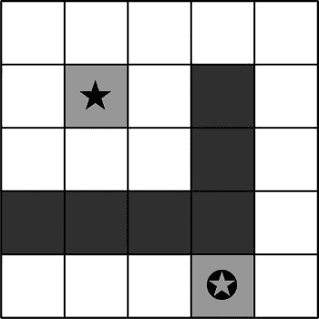

# 第 5 章：字符串

希望你能挺过上一章关于 Lua 数学的内容。这几章的整体思路是向你介绍，你可以在 Lua 中创建逻辑，然后使用任何框架来添加图形。因此，我们将在这些章节中创建的许多函数可以在大多数框架中通用，而无需太多更改。在本章中，我们将探讨字符串这个主题。

## 什么是字符串？

字符串是 Lua 中可用的多种变量类型之一。它可以保存任意长度的字母数字字符。它不能像表那样具有多个维度。如果字符串用于任何形式的算术运算，Lua 会自动将字符串转换为数字。这个过程称为*强制转换*，并且是自动的。

你之前已经见过多种形式的字符串，最简单的例子是：

```lua
print("hello world!")
```

这里的字符串是 `"hello world!"`。它的主要特征是将字母数字字符用双引号或单引号括起来。

在这种情况下，由于 `"hello world"` 没有被赋值给变量而直接使用，它被称为*常量字符串*。

大多数字符串函数用于操作文本。以下部分描述了 Lua 中可用的函数。

**注意** 许多可用的函数也在命名空间内提供。因此，你也可以以面向对象的风格使用这些函数。例如，`string.byte(s,i)` 可以表示为 `s:byte(i)`。

### `string.byte ( s [,i [,j ] ] )`

对于设备来说，一个字符是一个从 0 到 255 的 ASCII 数字。虽然我们将字符识别为 *A* 或 *a*，但每个字符都用数字表示，例如 65、97 等。`byte` 函数返回指定位置字符的数字或 ASCII 码。可以传递三个参数：字符串本身 (`s`) 以及可选的 `i` 和 `j`；`i` 标记字符串的起始位置（默认是 1），`j` 标记字符串的结束位置（默认与 `i` 相同）。这是一个例子：

```lua
print(string.byte("One"))
print(string.byte("One",1,3))
```

### `string.char (. . .)`

这个函数与前一个函数类似，区别在于它不是将字符转换为数值，而是将数值转换为字符。该函数接受一个整数，并返回一个长度等于传入整数数量的字符串。

```lua
print(string.char(72, 101, 108, 108, 111, 32, 87, 111, 114, 108, 100))
```

### `string.dump ( function )`

这个函数返回一个包含给定函数二进制表示的字符串。这个字符串之后可以与 `loadstring` 函数一起使用，返回该函数的一个副本。尽管大多数框架允许 `loadstring`，但 CoronaSDK 已屏蔽了此函数，因此如果使用 CoronaSDK，对此函数做不了太多事情。

### `string.find ( s, pattern [,init [,plain] ] )`

这个函数在字符串 `s` 中查找 `pattern` 的首次匹配。如果找到，则返回匹配开始和结束位置的索引。如果未找到匹配，则返回 `nil`。参数 `init`（如果传递）决定了搜索的起始位置。此参数的默认值是 1。参数 `plain` 是一个布尔值，要么是 `true`，要么是 `false`。它决定 `pattern` 是否只是用于子字符串匹配的纯文本。如果这是 `true`，那么 `pattern` 可以有占位符和通配符用于匹配。如果 `pattern` 有捕获，则该函数会在两个索引之后返回捕获的值。

### `string.format ( formatString, . . . )`

这个函数返回一个基于传入的格式和值格式化后的字符串。这类似于 C 函数 `printf`。选项/修饰符 `*`、`l`、`L`、`n`、`p` 和 `h` 不受支持。此函数有一个新选项 `q`，它以一种适合且安全的方式格式化字符串，以便与 Lua 解释器一起使用。所有字符都被正确转义以正常工作。例如：

```lua
string.format('%q', 'a string with "quotes" and \n new line')
```

将产生字符串：

```
"a string with \"quotes\" and \
new line"
```

虽然大多数选项 `c`、`d`、`E`、`e`、`f`、`g`、`G`、`I`、`o`、`u`、`X` 和 `x` 期望一个数字作为参数，但 `s` 和 `q` 期望一个字符串。

### `string.gmatch ( s, pattern )`

这个函数返回一个迭代器函数，每次调用时，它返回字符串 `s` 中 `pattern` 的下一个捕获。如果模式没有指定要捕获的内容，则返回整个匹配。

### `string.gsub ( s, pattern, repl [,n] )`

这个函数用 `repl` 中的字符串替换 `pattern` 中的字符串。`n` 决定了要进行的替换次数。

```lua
str = "this is a red apple"
newstr = str:gsub( "red", "green" )
print(newstr)
```

下面是另一个解释使用 `n` 参数进行替换字符串的例子。在这段代码中，注意第一个 `str:gsub` 函数将所有 "is" 的实例替换为 "are"。第二个函数将 "is" 的前四个实例替换为 "are"，而最后一次，`str:gsub` 将 "is" 的前两个实例替换为 "are"。

```lua
str = "The data is one, is two, is three, is four, is five"
print(str:gsub("is", "are"))
print(str:gsub("is", "are",4))
print(str:gsub("is", "are", 2))
```

### `string.len ( s )`

这个函数返回字符串 `s` 的长度。这类似于 `#` 运算符。该函数也包含嵌入的空字符；所以，例如，`"a\000bc\000"` 的长度是 5。

### `string.lower ( s )`

这是一个函数，它在将所有字符转换为小写后返回字符串，而所有其他字符保持不变。请注意，*大写*的定义取决于当前的区域设置。例如，在默认的英语区域设置中，带重音符号的字符不会转换为小写。

### `string.match ( s, patterns [,init] )`

这个函数查找并返回字符串 `s` 中 `pattern` 的首次匹配。如果没有找到，它将返回 `nil`。`init` 参数指定搜索的起始位置，并且可以为负数。

### `string.rep ( s, n )`

这个函数返回一个包含 `n` 次重复传入字符串 `s` 的字符串。这等同于其他一些语言中的 `replicate`。例如：


`print(string.rep("*",10))`

将输出：

```
**********
```

`string.reverse ( s )`

此函数返回字符串`s`的反转结果。

```
print(string.reverse("madam"))
```

将不是测试此函数的最佳示例。

`string.sub ( s, i [,j] )`

此函数返回一个子字符串，即原始字符串`s`的一部分，从位置`i`开始，直到`j`结束。许多其他语言会在起始位置后指定长度，而 Lua 使用绝对位置。`i`的默认值为`1`，也可以设为负数。如果省略`j`，则默认值为`-1`（即字符串末尾）。

`string.upper ( s )`

此函数返回字符串的副本，其中所有小写字符都转换为大写。其他所有字符保持不变。同样，这取决于当前区域设置对哪些字母视为小写。

#### 模式

如果您是开发新手，或者没有使用过内置模式匹配或类似正则表达式功能的语言，那么您可能想知道什么是模式。Lua 中有四个基本概念：

*   字符类
*   模式项
*   模式
*   捕获

#### 字符类

字符类用于表示一组字符，可以是以下任意一种：

*   `x`：表示字符`x`本身，而不是魔术字符`^`、`$`、`(`、`)`、`%`、`.`、`[`、`]`、`*`、`+`、`-`、`?`
*   `.`：功能类似于通配符，表示所有字符
*   `%a`：表示所有字母
*   `%c`：表示所有控制字符
*   `%d`：表示所有数字
*   `%l`：表示所有小写字母
*   `%p`：表示所有标点字符
*   `%s`：表示所有空格字符
*   `%u`：表示所有大写字母
*   `%w`：表示所有字母数字字符
*   `%x`：表示所有十六进制字符
*   `%z`：表示值为`0`的字符
*   `%*x*`：允许您转义任何魔术字符（注意，`*x*`不是字面字符`x`，而是任何非字母数字字符）
*   `[*set*]`：表示集合`*set*`中所有字符的并集。字符范围可以用连字符（`-`）指定，如`[0-9]`或`[a-z]`。
*   `[*^set*]`：表示集合`*set*`的补集。所以，`[⁰-9]`表示所有不在`0`到`9`范围内的字符。

对于所有由单个字母表示的类（例如`%a`、`%c`、`%s`等），相应的大写字母表示该类的补集。因此，`%S`表示所有非空格字符。

#### 模式项

模式项是一个单一的字符类，用于匹配该类中的任意单个字符。

有一些字符有助于量化匹配：

*   `*`：匹配该类中字符的零次或多次重复。这将始终返回最长的可能序列。
*   `+`：匹配该类中字符的一次或多次重复。这将返回最长的可能序列。
*   `-`：也匹配该类中字符的零次或多次重复，但与`*`不同，它将匹配最短的可能序列。
*   `?`：匹配该类中字符的零次或一次出现。

#### 模式

模式是一系列模式项。脱字符（`^`）表示模式的开头，`$`符号指定模式的结尾。在其他位置，它们没有特殊含义，仅代表自身。

#### 捕获

一个模式可以包含用圆括号括起来的子模式；这些被称为捕获。当匹配成功时，匹配所捕获的子字符串会被存储（捕获）以供后续使用。捕获根据其左括号进行编号。在模式`"(a*(.)%w(%s*))"`中，匹配`"(a*(.)%w(%s*))"`的字符串部分存储为第一个捕获，匹配点号（`.`）的字符存储为第二个捕获，匹配`%s*`的部分存储为第三个捕获。

### 使用字符串函数

虽然我们可以将文本存储为字符串并打印到屏幕上，但有时我们也需要操作或转换它们。使用前面描述的一些 Lua 函数，我们可以做到这一点。

#### 将字符串转换为大写

如前所述，将字符串转换为大写的函数非常简单。下面是一个使其更易于使用的函数：

```
function upper(theString)
    return string.upper(theString)
end
```

#### 将字符串转换为小写

这与前一个函数类似。

```
function lower(theString)
    return string.lower(theString)
end
```

#### 将字符串转换为首字母大写

此函数将字符串转换为首字母大写格式，其中所有单词的第一个字符都大写：

```
function title_case(theString)
  return (theString:gsub("^%a", string.upper):gsub("%s + %a", string.upper))
end
```

或者，我们可以让函数以面向对象的方式工作，直接作为字符串命名空间的一部分来调用，如下所示：

```
tString = "hello how are you?"
tString:title_case()
```

为此，我们需要按如下方式声明该函数：

```
function string:title_case()
    return (self:gsub("^%a", string.upper):gsub("%s + %a", string.upper))
end
```

#### 填充字符串

在处理文本时，有时需要对文本进行填充。此函数有助于通过填充来创建特定长度的字符串：

```
function pad(s, width, padder)
  padder = string.rep(padder or " ", math.abs(width))
  if width < 0 then return string.sub(padder .. s, width) end
  return string.sub(s .. padder, 1, width)
end
```

此函数兼顾了左填充和右填充。对于左填充，我们只需传递一个负数长度，如下面代码中的第二个示例所示：

```
print(pad("hello",20))
print(pad("hello",-10,"0"))
```

#### CSV 功能

在创建游戏时，可能需要以 CSV（逗号分隔值）格式保存数据，其中数据存储为用逗号分隔的值组成的长字符串。CSV 函数可以帮助您在表和 CSV 格式之间进行转换。

##### 将 CSV 字符串转换为表

第一个示例将 CSV 格式的字符串解析并转换为表：

```
-- Convert from CSV string to table (converts a single line of a CSV file)
function fromCSV (s)
    s = s .. ','        -- ending comma
    local t = {}        -- table to collect fields
    local fieldstart = 1
    repeat
    -- next field is quoted? (start with `"'?)
    if string.find(s, '^"', fieldstart) then
        local a, c
        local i  = fieldstart
        repeat
        -- find closing quote
              a, i, c = string.find(s, '"("?)', i + 1)
        until c ~ = '"'    -- quote not followed by quote?
        if not i then error('unmatched "') end
            local f = string.sub(s, fieldstart + 1, i-1)
            table.insert(t, (string.gsub(f, '""', '"')))
            fieldstart = string.find(s, ',', i) + 1
        else              -- unquoted; find next comma
            local nexti = string.find(s, ',', fieldstart)
            table.insert(t, string.sub(s, fieldstart, nexti-1))
            fieldstart = nexti + 1
        end
    until fieldstart > string.len(s)
    return t
end
```

##### 从表转换为 CSV

下一个函数将表转换为 CSV 格式。这对于将表数据导出为诸如 Excel 等电子表格程序可以打开和读取的文件非常有用。

```
-- Convert from table to CSV string
function toCSV (tt)
    local s = ""
    for _,p in pairs(tt) do
        s = s .. "," .. escapeCSV(p)
    end
    return string.sub(s, 2)      -- Remove first comma
end
```

##### 转义 CSV

此处的转义与避免不同，而是指替换字符或更改它们以用作字符串。以下是转义 CSV 格式数据的一个示例：

```
-- Used to escape "'s by toCSV
function escapeCSV (s)
    if string.find(s, '[,"]') then
        s = '"' .. string.gsub(s, '"', '""') .. '"'
    end
    return s
end
```


## 使用千位分隔符格式化数字

在显示得分时，你可能希望以更易读的格式呈现。可以使用*千位分隔符*来实现，具体代码如下：

```
function comma_value(amount)
    local formatted = amount
    while true do
        formatted, k = string.gsub(formatted, "^(−?%d+)(%d%d%d)", '%1,%2')
        if (k==0) then
            break
        end
    end
    return formatted
end
```

`comma_value` 函数可用于打印格式化后的数字，示例如下：

```
print(comma_value(123456.78))       -- 输出 123,456.78
```

## 字母频率统计

通过 `getFrequency` 函数，我们可以统计字符串中特定字母的出现频率。`gsub` 函数会为每个匹配模式的字符调用传入的函数。我们可以利用这个特性来获取字符频率。为此，我们创建一个名为 `tally` 的函数，该函数会递增传入字符的计数。

```
function string:getFrequency()
    local inst = {}
    function tally(char)
        char = string.upper(char)
        inst[char] = (inst[char] or 0) + 1
    end
    self:gsub("%a", tally)
    return inst
end
```

我们可以用以下代码测试这个函数：

```
testString = "Hello, how are you?"
tbl = testString:getFrequency()
for i,j in pairs(tbl) do
    print(i,j)
end
```

## 检测字符串是否为回文

我们可以使用 `reverse` 函数来检查一个字符串是否为回文。最简单的方法是判断该字符串正读和反读是否相同。

```
function string:isPalindrome( )
    return self == self:reverse()
end
```

## 分割字符串

之前，你已经学习了如何将字符串分割成函数并转换为表格。在此示例中，我们将使用 `string.gsub` 函数根据模式（如前所述）来分割字符串。以下是实现这一功能的简便方法：

```
function string:split(sep)
    local sep, fields = sep or ":", {}
    local pattern = string.format("([^%s]+)", sep)
    self:gsub(pattern, function(c) fields[#fields + 1] = c end)
    return fields
end
```

该函数返回一个表格，其中包含根据分隔符分割后的字符串。以下是使用示例：

```
str = "name = Jayant"
results = str:split(" = ")
print("The value of " .. results[1] .. " is " .. results[2])
```

## 关卡管理

如果你正在开发一个棋盘游戏，就需要为其创建关卡。虽然创建关卡的方法有很多，但最简单且最好的方法之一是创建一个与棋盘上每个方格对应的字符串。例如，如果游戏有一个 5 × 5 的棋盘，包含起始位置、结束位置和障碍物，那么可以按照图 5-1 所示的方式进行创建。



图 5-1 . 关卡的图形表示

在这个示例中， 标记了游戏开始时玩家的位置。 标记了玩家需要到达的位置才能完成关卡。灰色方块是阻碍玩家移动的墙壁。因此，我们可以将其转换为关卡数据。我们可以将其存储在二维数组中，如下所示：

```
level1 = {
  {0,0,0,0,0},
  {0,0,0,1,0},
  {0,0,0,1,0},
  {0,1,1,1,0},
  {0,0,0,0,0},
}

start = {x = 2,y = 2}
endPos = {y = 5,x = 4}
currlevel = level1
```

在这种安排中，起始位置是 2，结束位置是 3；墙壁用 1 表示。通过这个二维数组，我们可以用 `level[y][x]` 访问数组中的任何元素，其中 `y` 是行，`x` 是列。

我们可以从数据文件或代码中设置关卡信息：

```
-- 设置
position = {x=
start.x, y=
start.y}  -- 这表示玩家当前所处的位置
-- 移动
function move(direction)
    local pX, pY = position.x, position.y
    if direction==1 and pX > 1 and level1[pY][pX-1] == 0 then
            position.x = position.x – 1
            return true
        end
    elseif direction==2 and pX < 4 and level1[pY][pX + 1] == 0 then
        position.x = position.x + 1
        return true
    elseif direction==3 and pY > 1 and level1[pY- 1][pX] == 0 then
        position.y = position.y − 1
        return true
    elseif direction==4 and pY < 4 and level1[pY + 1][pX] == 0 then
        position.y = position.y + 1
        return true
    end
end
```

然后，我们可以利用此函数更新 GUI 部分，如下所示：

```
if move(direction) == true then
    local pX, pY = position.x, position.y
    if pX == endPos.x and pY == endPos.y then
        print("恭喜，你已成功到达终点。")
    else
        --updateGIU()
    end
end
```

## 总结

字符串操作在任何编程语言中都是重要的一部分。本章我们介绍了 Lua 中可用于字符串操作的各种函数，还创建了几个可以自己应用使用的函数。你可以将这些函数包含在自己的工具库中，作为应用开发的通用库。

第 6 章

