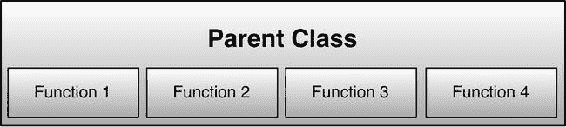
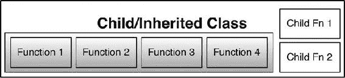

# 线程

在 20 世纪 80 年代，计算机一次只能执行一个任务。在 MS-DOS 和 CP/M 时代，你可以运行一个应用程序，退出后返回提示符，然后再调用另一个程序。此外，类 Unix 系统使用了多用户的概念，每个用户可以运行独立的应用程序。虽然操作系统可以多任务运行多个应用程序，但每个应用程序也可以执行不同的任务。例如，在播放音乐和更新进度条的同时异步下载文件。为了更好地理解这一概念，我们需要探讨三个重要主题：进程、多任务和线程。

*   *进程*是计算机程序（基于代码的指令列表）的一个实例，它正在被执行或运行。多个进程可以与同一个程序关联，并且同一程序的多个实例可以同时执行；例如，浏览器中的每个打开窗口都是其自身的进程。
*   *多任务*是一种允许多个进程共享处理器和其他系统资源的方法。通过多任务处理，CPU 可以在正在执行的任务之间切换，而无需等待一个任务完成。其工作方式可能因系统而异。
*   操作系统运行或执行的最小处理单元称为*线程*。一个进程可以有多个线程，CPU 可以在这些线程之间切换，从而营造出多个线程同时运行的假象。

## 协程

编程语言使用子程序或函数来调用一组指令。函数或子程序被调用并执行，完成后返回。*协程*是一种特殊类型的子程序；与子程序或函数一样，它有一个入口点，但它可以*让出*（在中间暂停）然后从该点恢复。协程在调用时可以在任何时候传递参数，而不仅仅是在入口点。

### 协程函数

有几个函数与协程的使用相关。本节将简要介绍这些函数。

#### coroutine.create ( f )

此函数使用函数体 `f` 创建一个新的协程，`f` 应该是一个 Lua 函数。创建成功后，它返回一个新的协程对象，其类型为线程。

```
thread = coroutine.create(function() print("Started") end)
coroutine.resume(thread)
```

#### coroutine.resume ( co [, val1, …] )


### Lua 协程函数

#### `coroutine.resume(co, val1, ...)`

该函数用于启动或恢复协程 `co` 的执行。首次调用时，它会启动协程体的运行。参数 (`val1`, ...) 全部作为主函数的参数传入。该函数返回 `true` 以及传递给 `yield` 的值或由协程体函数返回的任何值。如果协程体已执行完毕，或在执行协程体时发生错误，则 `resume` 返回 `false` 以及一条错误消息。

```
thread = coroutine.create(function() print("Started") end)
coroutine.resume(thread)
```

#### `coroutine.running()`

该函数返回正在运行的协程，如果正在运行的协程是主协程，则返回 `nil`。

```
print( coroutine.running(thread))
thread = coroutine.create( function() print("Hello") end)
print( coroutine.running(thread))
```

#### `coroutine.status(co)`

该函数以字符串形式返回协程 `co` 的状态。可能的返回值包括：

- `running`：如果协程正在运行
- `suspended`：如果协程在调用 `yield` 时被挂起，或者尚未开始运行
- `normal`：如果协程处于活动状态但未运行
- `dead`：如果协程已完成其主体函数或由于错误而停止

```
print( coroutine.status(thread))
thread = coroutine.create( function() print("Hello") end)
print( coroutine.status(thread))
```

#### `coroutine.wrap(f)`

该函数创建一个主体为 `f` 的新协程，类似于 `create`。然而，`coroutine.wrap` 返回一个可用于协程的函数。

```
thread = coroutine.wrap( function() print("Hello") end)
thread()       -- 启动协程。
```

#### `coroutine.yield(...)`

该函数挂起当前调用例程的执行。`yield` 的任何参数都会作为额外的结果传递给 `resume`。

### 创建新协程

你可以使用以下代码创建一个新协程：

```
co = coroutine.create(function() print("hello world") end)
print(co)
print(type(co))
coroutine.resume(co)
print(coroutine.status(co))
```

在这段代码中，我们使用函数 `coroutine.create` 创建了一个新协程，并向它传递了一个函数。请注意，传递的函数并未执行。当我们使用 `print(co)` 时，可以看到这是一个协程对象。`type(co)` 显示 `co` 是类型为 `thread` 的对象。`coroutine.resume(co)` 调用该函数，并在屏幕上打印出 "hello world"。最后，`coroutine.status(co)` 显示状态为 "dead"。

### 协程与恢复执行

在以下代码中，我们将了解如何处理协程，包括如何创建和恢复它们，以及让它们返回（yield）。

```
co = coroutine.create(function()
    for i=1, 10 do
        print("循环：", i)
        coroutine.yield(i)
    end
end)
 coroutine.resume(co)
print(coroutine.status(co))
coroutine.resume(co)
...
coroutine.resume(co)
```

### 进度条

协程的另一个实际应用案例是进度条，如下例所示：

```
function doLongProcessing(a)
    -- 执行某些操作
    thread1 = coroutine.yield("25%")

-- 执行某些操作
    thread1 = coroutine.yield("50%")

-- 执行某些操作
    thread1 = coroutine.yield("75%")

-- 执行某些操作
    return "100%"
end

thread = coroutine.create(doLongProcessing)
while coroutine.status(thread) ~= "dead" do
    local _, res = coroutine.resume(thread)
    print( "当前进度为 " .. res )
end
```

相比之下，请考虑以下代码：

```
tStep = 1000
for i=1,100000 do
  if i/tStep == math.floor(i/tStep) then print( i/tStep .. " % 完成")
end
```

这段代码在 Lua 终端中运行时是响应式的，但在某些框架上运行时可能会非常不稳定，因为它会在运行循环时占用大量 CPU（类似于应用程序冻结）。这是一个很好的例子，说明协程如何提供帮助。

我们有一个协程函数，它运行从 1 到 100,000 的代码。每次调用此协程时，它都会迭代到下一个数字并返回（yield）。我们设置了另一个循环，不断调用此代码，直到协程状态变为 "dead"，并且当迭代次数是 1,000 的倍数时，我们以百分比完成度打印进度。

```
tStep = 1000
function showProgress()
    for i=1,100000 do
        coroutine.yield(i)
    end
end
```

这是我们函数的主体；现在我们需要一个循环来操作它。

```
co = coroutine.create(showProgress)
while coroutine.status(co) ~= "dead" do
    _,res = coroutine.resume(co)
    if res/tStep == math.floor(res/tStep) then print(res/tStep .. " % 完成") end
end
```

在处理依赖于更新数据的函数时，能够在中途恢复执行并向函数传递新参数的能力非常有用。我们不会看一个复杂的示例，但为了说明这一点，这里有一个简单的例子：

```
a = 100
co = coroutine.create(function()
    print( "我们从 ", a, " 开始")
    a = coroutine.yield(a)
    print("我们用值 ", a, " 重启此函数")
end)
_, res = coroutine.resume(co)
print("我们在 ", res, " 处停止或返回")
_,res = coroutine.resume(co, 200)
```

### 游戏循环

用最简单的话来说，游戏是一个重复的循环，它接收输入并更新屏幕和角色。因此，用伪代码表示，一个游戏可能如下所示：

```
 while playing do
    getInput()
    updateCharacters()
    updateScreen()
end
```

在这种情况下，`getInput()` 是一个获取玩家输入的函数，可以来自键盘或触摸屏。`updateCharacters()` 是更新游戏玩法元素、屏幕上角色以及面板的函数。最后，`updateScreen()` 会更新分数、生命值、消息等。如果这是用 C、C++ 或类似语言编写的，这没问题，但在 Lua 中，while 循环不太稳定。协程可以方便地使这些例程更具响应性。

另一个有趣的地方是，尽管 Lua 中的协程不是线程，但它们可以像线程一样使用（即，你可以定义多个协程）。这里有一个例子：

```
c1 = coroutine.create(function()
    for i=1,20 do
        print( "函数 1: ", i)
    end
end)
c2 = coroutine.create(function()
    for i=1,5 do
        print( "函数 2: ", i)
    end
end)
c3 = coroutine.create(function()
    for i=10,1,-1 do
        print( "函数 3: ", i)
    end
end)
while true do
    co1 = coroutine.resume(c1)
    co2 = coroutine.resume(c2)
    co3 = coroutine.resume(c3)
    if coroutine.status(c1)=="dead" and coroutine.status(c2)=="dead" and coroutine.status(c3)=="dead" then break end
end
```

### 处理表

请记住，在 Lua 中，除了数字和字符串之外的所有变量都是内存位置，并且通过引用传递，这意味着如果我们声明表 `t`，然后将 `b` 赋值为 `t`，我们并没有在 `b` 中获得 `t` 的副本；相反，`b` 将指向与 `t` 相同的表。

```
t = {"一", "二", "三"}
b = t
print(b[2])
t[2]="二（法语）"
print(b[2])
```

在需要复制表，而不仅仅是提供指向同一内存地址的指针的情况下，我们需要进行所谓的*深拷贝*。这里有一个例子：

```
function deepcopy(t)
    if type(t) ~= "table" then return t end
    local res = {}
    local mt = getmetatable(t)
    for k,v in pairs(t) do
        if type(v)=="table" then
            v = deepcopy(v)
        end
        res[k] = v
    end
    setmetatable(res,mt)
    return res
end
```


这段代码首先创建一个新的空白表对象 `res`。接着，它保存元表签名——该签名用于标识某个表属于特定类型。若此元表被修改，该对象可能无法被识别为特定类型。随后，它将所有数据复制到新表中，如果某个元素类型是表，则会递归遍历该表中的每个元素和子表，完成后将数据保存到对应的新表数据元素中。最后，它为新表对象设置元表，并返回该表对象的副本。

## 自定义元表

请记住，在 Lua 中，最重要的变量类型之一就是表。如前所述，数组、关联数组和对象本质上都是表。数组的可定制性不高，但对象具备更强的定制性——它们拥有一些数组所没有的额外功能和函数。所有这些功能构成了对象的独特“指纹”，有助于识别对象类型。Lua 中的每个表都可以拥有一个元表。元表本质上只是一个定义了原始表和用户数据行为的普通表。如果在元表中设置特定字段，就能修改对象的行为。由此，我们可以创建对象并允许它们拥有自定义操作，类似于 C++ 中的运算符重载。不过，在 Lua 中可修改的内容是有限的。

以下小节将描述帮助 Lua 修改或自定义表行为的关键字段。

### `__index`

当我们尝试获取 Lua 表中某个元素的值时，Lua 会尝试定位该元素；如果元素不存在，Lua 会调用 `__index` 元函数。如果没有此方法，则返回 `nil`。

例如，假设我们运行以下代码：

```
t = {}
print(t.name)
print(t.age)
```

这会为 name 和 age 都打印 `nil`，因为我们尚未定义它们。如果修改代码，加入以下内容：

```
default = { name ="Lua" }
t = setmetatable( {}, {__index=default} )
print(t.name)
print(t.age)
```

我们会看到第一个 `print` 显示“Lua”，第二个仍然打印 `nil`。

`__index` 元函数可以是表中的数据（如前述代码所示），也可以是一个函数。当调用 `__index` 函数时，会传递两个参数：表（Table）和键（Key）。

我们可以通过以下代码看到这一行为：

```
t = setmetatable({}, {__index=function(theTable, theKey) print(theTable, theKey) return"." end})
print(t.name)
print(t.age)
print(t[1])
print(t[2][3])
print(t.whatever)
```

我们从函数中返回了一个 `.`，因此会看到它打印表的地址和试图访问的元素名称，随后是一个 `.`。

**注意** 每次访问表时，都会调用 `__index` 元函数。

因此，在 `__index` 函数内部访问表值时必须小心。这可能导致循环引用，造成栈溢出，如下面的定义所示：

```
__index = function(tbl, key)
    local a = tbl[key]
    if a <=0 then a = 0 end
    if a > 5 then a = 0 end
    return a
end
```

虽然上述代码看起来非常无害，试图将表中元素的值限制在某个范围内，但这段代码会引发问题并导致循环引用。函数中的第一行 `a = tbl[key]` 实际上会触发另一个 `__index` 函数调用，进而再触发下一个，依次类推。

既然我们已经发现了问题，仍需解决它。为此，我们可以使用 Lua 的 `rawget` 函数，该函数在获取表的值时不会调用 `__index` 元方法。因此，我们可以将同一个函数写成：

```
__index = function(tbl, key)
    local a = rawget(tbl, key)
    if a<=0 then a = 0 end
    if a > 5 then a = 0 end
    return a
end
```

### `__newindex`

该函数与 `__index` 函数类似，但不同之处在于它用于设置值；因此，当我们给表赋值时，会调用此函数。它接收三个参数：表、键和值。

```
a = setmetatable({},{
    __newindex = function(t, key, value)
      print("Setting  [" .. key .. "]=" .. value)
      rawset(t, key, value )
    end})
a.year = 2012
a.apps = 15
```

与之前的示例类似，`table[key]=value` 会调用 `__newindex` 函数，并可能陷入无限循环导致错误，因此此示例使用 `rawset` 来设置键的值。

**注意** 该函数仅在键的值从未被设置时首次调用。如果值已被设置，该函数不会被调用，值直接修改。

### `__mode`

在使用垃圾回收机制的编程语言（如 Lua）中，如果对象无法阻止自身被回收，则称其为*弱引用*对象。Lua 可以将表设置为弱表，其中键和值都是弱引用。如果此类表的键或值被回收，则表中的对应条目也会被回收。

这些弱表的模式可以通过 `__mode` 元函数设置，并可使用 `k` 或 `v` 参数将键或值设为弱引用，如下所示：

```
local weaktable = setmetatable({}, {__mode="k"})
```

### `__call`

这允许表像函数一样被使用。如果表后面紧跟着括号，元表会尝试定位 `__call` 函数并调用它；如果不存在，则返回错误。否则，会将表和传入的参数传递给它。

```
t = setmetatable({},{
    __call = function(t, value)
            print("Calling the table with " .. value)
    end})

t("2012")
```

**注意** 每次设置元表时，都会覆盖之前的元表条目，这意味着在上述示例中，我们没有 `__newindex` 的条目。如果之前定义了它，它将被移除，唯一设置的功能就是 `__call`。你需要一次性定义所有相关键，或者先获取元表，再添加或修改新的元函数。

### `__metatable`

此功能用于隐藏元表。当使用 `getmetatable` 函数且表具有 `__metatable` 字符串时，将返回该键的值，而不是实际的元表。

### `__tostring`

当请求表或对象的字符串表示形式时，会调用此函数。这可用于为自定义对象提供描述。

```
t=setmetatable({},{__tostring=function() return "This is my custom table" end})
print(t)
print(tostring(t))
```

### `__gc`

当表被设置为待垃圾回收时，会调用此函数。如果 `__gc` 指向一个函数，则首先调用该函数。此函数仅适用于用户数据（即通过 C API 使用）。

### `__unm`

此函数是一元负号运算符；等同于 `-` 符号。要将数字转换为负数（例如，将 5 转换为 `-5`），我们在前面添加一个 `-` 符号。一元负号函数用于在表或对象上执行此转换。它可用于对复杂对象执行取负操作；例如，一个包含值的表。

```
t = setmetatable({},{__unm=function() return -3 end})
print(t - 5)
print(5 - -t)
```

**注意** 在此示例中，我们返回一个固定数字 `-3`。在你的程序中，你可能需要计算要返回的值。

### `__add`

此函数是普通的加法函数；当使用 `+` 运算符向表对象添加变量时调用。在尝试添加没有简单数值表示的对象时，重写此函数非常有用。

首先想到的例子是分数。这或许是 C++ 中最常见的运算符重载示例之一，用于两个非数值对象之间的加法。

```
t = setmetatable({},{__add=function(tbl, val) return 5+val end})
print(t+5)
```


**警告** 请*不要*使用 `print(5 + t)` 的方式调用，这会导致栈溢出。表对象必须作为最左侧的值才能正常运作，因为函数 `__add` 要求第一个参数是表值。

`__sub`

此函数是普通的减法函数，当使用 `-` 运算符对表对象进行变量相减时被调用。当需要相减的对象不具有可直接相减的数值时，重写该函数会非常有用。

```
t = setmetatable({},{__sub=function(tbl, val) return 5-val end})
print(t-3)
```

**注意** 同样，请勿使用 `print(3 - t)` 的方式调用，这会导致栈溢出。表对象必须作为最左侧的值才能正常运作，因为函数 `__sub` 要求第一个参数是表值。

`__mul`

此函数是普通的乘法函数，当使用 `*` 运算符对表对象进行变量相乘时被调用。当需要相乘的对象不具有可直接相乘的数值时，重写该函数会非常有用。一个很好的例子是计算矩阵或向量的点积。

```
t = setmetatable({},{__mul=function(tbl, val) return 2^val end})
print(t * 3)
print(2 * 2)
```

在这个例子中，根据相乘的值，我们返回 2 的该次幂；这展示了如何在 Lua 中实现最接近运算符重载的功能。

`__div`

此函数是普通的除法函数，当使用 `/` 运算符对表对象进行变量相除时被调用。当需要相除的对象不具有可直接相除的数值时，重写该函数会非常有用。

```
t = setmetatable({},{__div=function(tbl, val) return 1/val end})
print(t/3)
```

`__pow`

此函数是普通的指数函数，当使用 `^` 运算符时被调用。当需要执行的操作不具有可直接使用的数值时，重写该函数会非常有用。

```
t = setmetatable({},{__pow=function(tbl, val) return 7^val end})
print(t³)
```

`__concat`

此函数是连接函数，当使用连接运算符（`..`）连接两个或更多表值时被调用。

```
t = setmetatable({}, {__concat=function(tbl,val) return "Hello " .. val end})
print(t .. "Jayant")
```

`__eq`

此函数是等于运算符（`==`）；可用于帮助比较不易比较的两个表值。非运算（`a==b`）等同于 `a~=b`。

`__lt`

此函数是*小于*运算符（`<`）；可用于帮助比较不易比较的两个表值。

`__le`

*小于或等于*运算符（`<=`）同样用于比较不易比较的两个表值。

### 一个实用的例子

让我们看一个示例，展示刚刚描述的函数及其在表中的实际用途。`+` 运算符在数字之间运行良好。如果我们尝试使用 `+` 运算符相加两个表，将无法工作。我们可以创建函数来管理此类表的加法操作。在以下示例中，我们重写了 `__add` 函数，允许我们使用 `+` 运算符相加两个表。

```
thePos = {}

thePos.__add = function (a, b)
    local res = {
        a[1] + b[1],
        a[2] + b[2]
    }
    setmetatable(res, thePos)
    return res
end

function make_pos(x,y)
    local res = { x, y }
    setmetatable(res, thePos)
    return res
end

p1 = make_pos(5,6)
p2 = make_pos(2,4)
p3 = p1 + p2
print(p3[1], p3[2])
```

## 面向对象的 Lua

Lua 不是一种面向对象的语言，但它具有使其能够像面向对象语言一样使用的功能。我在第 2 章中描述过，函数可以被添加到表中，通过 `:` 运算符调用，并传递给函数。

我们之前看过 `deepcopy`——一种创建表副本的方法，而不仅仅是传递内存指针。我们还研究了调整元表来覆盖表的某些功能。

逻辑编程语言 Prolog 具有帮助创建数据之间关系（从而建立数据连接）的功能，然后使用谓词查找这些信息。在最基本的层面上，Lua 可以提供类似的功能。

首先，这是一个如何创建关系的示例：

```
-- 创建关系
company(Jayant, OZApps)
language(CoronaSDK, Lua)
language(GiderosStudio, Lua)
language(Moai, Lua)
language(XCode, ObjectiveC)

-- 查询关系
print(is_language(CoronaSDK, ObjectiveC))
print(is_company(Jack, OZApps))
print(is_company(Jayant, OZApps))

-- 附加
father(Vader, Luke)
father(Vader, Leia)
brother(Luke, Leia)
sister(Leia, Luke)

print(is_sister(Leia, Luke))
print(is_sister(Leia, Han))
```

所有这些都可以在终端中运行。其中的一个挑战是 Lua 没有帮助关联这些关系的命令；如果你在终端窗口中输入 `father(Vader, Luke)`，首先会得到一个错误，提示没有名为 `father` 的全局变量。这是因为没有名为 `father`、`Vader` 或 `Luke` 的函数或变量。为了解决这个问题，我们借助元表。如前所述，每当 Lua 尝试获取一个缺失的值时，它都会调用 `__index` 函数。让我们看看当我们设置 `__index` 元方法并尝试调用 `father(Vader, Luke)` 时会发生什么：

```
setmetatable(_G, {__index =
    function(tbl, name)
        print("Retrieving the variable :", name)
    end
})

what(was, this)
```

注意我们仍然得到一个错误，提示未找到全局变量 `what`。当我们从表中访问成员时，会返回该成员，但如果成员不存在，则会使用 `__index` 函数来计算或确定要返回的数据。如果没有 `__index` 函数，那么我们就会得到这个错误。

我们可以通过使用 `rawset` 并确保存在一个全局函数（如果未找到）来解决这个问题，类似于自动声明，即如果变量尚未声明则进行声明。

```
setmetatable(_G, {__index =
    function(tbl, name)
        print("Retrieving the variable :", name)
        rawset(tbl,name,{})
    end
})

what(was, this)
```

虽然这应该可以消除错误，但我们发现这并没有解决问题，即使声明了一个名为 `what` 的新全局变量。这是因为 `what` 是一个表，而不是一个函数，而我们正试图像调用函数一样调用它。

一个简单的解决方法是，将 `rawset(tbl, name,{})` 替换为 `rawset(tbl, name, function() end)`。这样，我们返回一个可以在 Lua 中调用而不会引发错误的函数。这里最重要的一点是，`__index` 元方法必须返回上下文中所期望的内容。

```
setmetatable(_G, {__index =
    function(tbl, name)
        print("Name :", name)
        rawset(tbl,name,function() end)
        return rawget(tbl, name)
    end
})

what(was, this)
```

这样没问题；然而，由于 `Vader` 和 `Luke` 也没有被定义，我们不能将它们转换为函数。一个合理的解决方案是，识别所有以小写字母开头的变量名是函数，所有以大写字母开头的变量名是变量。因此，在 `father(Vader, Luke)` 的情况下，`Vader` 和 `Luke` 将是变量，而 `father` 将是一个函数。

```
setmetatable(_G, {__index =
    function(tbl, name)
         if name:match("^[A-Z]") then
            rawset(tbl, name, {} )
        else
            rawset(tbl, name, function() end)
        end
        return rawget(tbl,name)
    end
})

what(was, this)
```

现在我们可以根据需要创建任意数量的关系——前面的代码会检查单词是以大写字母还是小写字母开头；如果是大写，则创建一个函数，如果不是，则创建一个空表。然而，尽管如此，我们仍然需要在这两个元素之间创建关系。


```lua
setmetatable(_G, {__index =
    function(tbl, name)
         if name:match("^[A-Z]") then
            rawset(tbl, name, {} )
        else -- 在此创建规则
            local rule = create_rule(name)
            rawset(tbl, name, rule)
        end
        return rawget(tbl,name)
    end
})
function create_rule(name)
    return function(a,b)
        a[name .. "_of"]=b
        b[name]=a
end
```

这个小调整的作用是创建两个链接键：一个是在所设置的关系末尾加上 `_of` 后缀。

如果我们无法查询到正在尝试创建的关系，那么代码将返回一个错误。因此，我们添加一些检查，看看是否有 `is_` 前缀用于查询该关系。

```lua
function make_predicate(name)
    local rule = name:match("^is_(.*)")
    return function(a,b)
        return b[rule]==a
        end
end
```

我们还在元方法中添加了一处小改动：

```lua
setmetatable(_G, {__index =
    function(tbl, name)
         if name:match("^[A-Z]") then
            rawset(tbl, name, {} )
        elseif name:match("^is_") then
            local pred = make_predicate(name)
            rawset(tbl, name, pred)
        else -- 在此创建规则
            local rule = create_rule(name)
            rawset(tbl, name, rule)
        end
        return rawget(tbl,name)
    end
})
```

现在，我们可以安全地尝试设置和查询所创建的关系了：

```lua
-- 创建关系
company(Jayant, OZApps)
language(CoronaSDK, Lua)
language(GiderosStudio, Lua)
language(Moai, Lua)
language(XCode, ObjectiveC)

-- 查询关系
print(is_language(CoronaSDK, ObjectiveC))
print(is_company(Jack, OZApps))
print(is_company(Jayant, OZApps))
```

这可能会让人望而生畏，尤其是考虑到这实际上是对元表进行的高级操作。然而，它也展示了如何利用元表来改变应用程序与 Lua 的工作方式。

## 但对象是什么？

在前面的练习中，我们对元表进行了一些有趣的尝试，并创建了自己的元函数来管理对象。根据使用方式的不同，元表在应用程序中会很有用。接下来，我将讨论另一个在应用程序中绝对有用的东西：处理对象。不过，在开始创建对象之前，让我们先看看什么是对象，以及它们在 Lua 中是如何管理的。

以下是关于对象需要记住的一些重要事项：

* 所有 Lua 对象都是表。
* 所有包含函数的对象都将其作为成员函数。
* 对象可以拥有自定义元表。

利用这些信息，让我们创建一个对象：

```lua
vehicle = {}
function vehicle:isVehicle()
    print("Yes!")
end

vehicle:isVehicle()

car = {}
function car:name()
    print("Car")
end

car:name()

carTable= { __index = vehicle}
setmetatable(car, carTable)

car:isVehicle()
car:name()

vehicle:name()
```

从面向对象语言的角度来看，一个*虚拟*（或*抽象*）类拥有通用的函数，而从该类继承的每个对象（参见图 6-1）都拥有该类的所有函数。此外，你还可以添加更多特定于新继承类的函数，如图 6-2 所示。



图 6-1. 抽象或虚拟（父）类



图 6-2. 继承或子类

在上面的代码示例中，我们创建了一个名为 `vehicle` 的虚拟类，并将函数 `isVehicle` 作为该类的成员函数添加进去；调用该函数时会输出 `Yes`。然后，我们创建了一个名为 `car` 的新对象，它有一个名为 `name` 的成员函数，调用时会输出 `Car`。让我们重新审视这段代码：

```lua
vehicle = {}
function vehicle:isVehicle()
    print("Yes!")
end

vehicle:isVehicle()
```


```lua
car = {}
function car:name()
    print("Car")
end
carTable = {__index = vehicle}
setmetatable(car, carTable)

truck = {}
function truck:name()
    print("Truck")
end
truckTable = {__index = vehicle}
setmetatable(truck, truckTable)
```

这样，我们就可以创建多个交通工具对象。为了更方便，我们可以创建一个*工厂函数*，它就像一个工厂，可以批量创建对象。

```lua
function newObject()
    local newVehicle = {}
    local theTable = { __index = vehicle }
    setmetatable(newVehicle, theTable)
    return newVehicle
end
```

因此，每次调用该函数，我们都会得到一个属于 `vehicle` 类型的新对象。我们还可以用这个函数来设置对象的默认值，例如前例中交通工具的名称。

```lua
Vehicle = {}
function Vehicle:isVehicle()
    print("yes")
end

function newObject(theName)
    local newVehicle = {}
    newVehicle._name = theName
    setmetatable(newVehicle, {__index=Vehicle})
    function newVehicle:name()
        print(self._name)
    end

    return newVehicle
end

car = newObject("Car")
truck = newObject("Truck")
car:name()
truck:name()
car:isVehicle()
```

## 总结

在本章中，我们了解了协程，它相当于 Lua 中的线程。协程就像子程序，我们可以在调用过程中退出，或者从上次退出的位置恢复执行。

我们还深入了解了表和元表，以及它们如何帮助我们改变或修改表的行为，包括使用它们来创建 Lua 对象。

通过本章，我们结束了对 Lua 的简要介绍；希望你现在已经准备好使用 Lua 进行编码。下一章将提供使用 Lua 的各种技巧和诀窍。

