# 第 8 章：Corona SDK

如果你已踏上为移动设备开发跨平台应用的征程，那么你肯定听说过 Corona Labs（之前名为 Ansca Mobile）推出的 Corona SDK。它可用于 Windows 和 Mac OS X（但据报道，在 Wine 上运行并不稳定）。Corona SDK 的试用版允许进行无限制的测试和为设备构建（尽管会包含试用版消息）。一旦你购买了许可证，就可以将应用部署到应用商店。

## 设置 Corona SDK

要开始使用 Corona SDK，你需要从 [`developer.coronalabs.com/downloads/coronasdk`](https://developer.coronalabs.com/downloads/coronasdk) 下载试用版，无论是 `.dmg` 文件（适用于 Mac）还是 `.msi` 文件（适用于 Windows）。

要能够下载该文件，你必须在 Corona Labs 注册。你可以随时通过购买合适的许可证将试用版转换为完整版。有几种许可选项可供你选择。Indie 许可证（$199）允许你运行一个平台，无论是 iOS 还是 Android；Pro 许可证（$399）允许你同时运行 iOS 和 Android；Enterprise 许可证（价格在 $3000 范围——定价需向 Corona Labs 咨询）。关于 Enterprise 版的详情可以在本章末尾找到。


如果您之前没有使用过 Corona SDK 的经验，第一印象可能会相当令人生畏，因为它不附带任何 IDE 或编辑器。

## Corona SDK 的工作原理

Corona SDK 以*Corona 终端*和*Corona 模拟器*的形式提供。建议通过 Corona 终端启动 Corona SDK。这将启动一个终端（您可以在其中看到所有调试输出），然后终端会自动启动 Corona 模拟器。SDK 的欢迎屏幕如图 8-1 所示。

从这里，您可以导航到项目文件所在的目录，模拟器将运行您的代码。

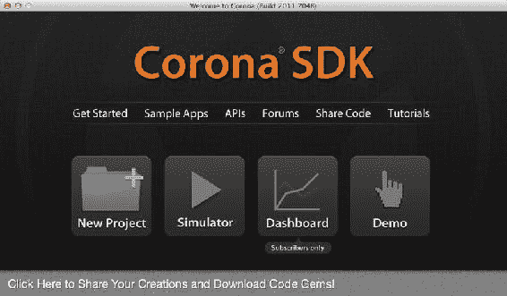

图 8-1 . 启动 Corona SDK 时的欢迎屏幕

Corona SDK 项目的入口点是`main.lua`文件。该文件与其他项目文件一起用于运行项目。

## Corona SDK 的 Hello World

Corona SDK 的架构如图 8-2 所示：Corona SDK 引擎在模拟器或设备上运行，并利用构成项目的所有资源，包括代码、美术资源、声音等。这些资源都位于模拟器查找入口点的目录中。入口点以`main.lua`文件的形式存在，该文件会被打开并执行。

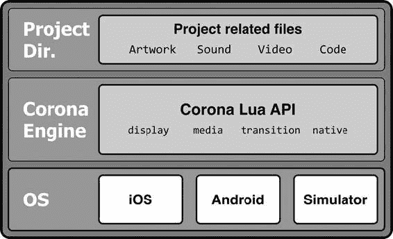

图 8-2 . Corona SDK 架构

首先，创建一个新目录`Proj_01`，然后使用您喜欢的文本编辑器，输入以下代码并将其保存为`Proj_01`目录中的`main.lua`。

```
-- Hello world for Corona SDK
print("Hello World")
```

现在启动 Corona SDK 并点击“模拟器”（Simulator）。然后导航到您刚刚创建的目录并点击“打开”（Open）。这将以一个空白屏幕启动模拟器，但如果您查看终端窗口，您会看到文本`Hello World`已显示。

### 图形版本

Corona 引擎由基本的 Lua 库以及其他负责显示、音频、视频等的库组成。表 8-1 列出了 Corona SDK 中可用的库，这些库构成了 Corona 引擎。

表 8-1. Corona SDK 中可用的命名空间

| 库 | 描述 |
| --- | --- |
| `ads` | 所有广告展示库 |
| `analytics` | 所有与使用分析相关的函数 |
| `audio` | 所有与音频相关的函数 |
| `credits` | 所有与虚拟货币相关的函数 |
| `crypto` | 所有与加密相关的函数 |
| `display` | 所有与显示元素相关的函数 |
| `easing` | 用于过渡动画的所有缓动选项 |
| `facebook` | 所有与 Facebook 相关的函数 |
| `gameNetwork` | 所有与 Apple Game Center 和 OpenFeint/Gree 相关的函数 |
| `graphics` | 所有帮助处理显示元素的图形相关函数 |
| `json` | 所有与读写 JSON 数据相关的函数 |
| `lfs` | 用于处理文件和文件夹的 Lua 文件系统库 |
| `media` | 用于显示视频和音频的媒体函数 |
| `native` | 用于处理设备原生功能（native functionality）的函数 |
| `network` | 与网络和数据通信相关的函数 |
| `physics` | Box2D 相关的物理库 |
| `socket` | 允许进行所有 TCP 和 UDP 套接字通信的 LuaSocket 库 |
| `sprite` | 用于处理精灵（sprite）库的函数 |
| `sqlite3` | 允许访问 SQLite3 数据库的函数 |
| `store` | 所有与应用内购买相关的函数 |
| `storyboard` | 所有与故事板（storyboard）相关的函数 |
| `timer` | 所有与定时器相关的函数 |
| `transition` | 所有用于执行过渡动画的函数 |
| `widget` | 所有用于创建小部件的函数 |

关于这些库和函数的更多详细信息，Corona Labs 网站上的在线 API 参考非常有用（请参见 [`docs.coronalabs.com/api/`](http://docs.coronalabs.com/api/)）。它列出了 API，如果有任何新增内容，此在线参考提供了所有最新的 API 更新。

### 在屏幕上显示 Hello World

在本练习中，让我们在设备上显示“Hello World”，让世界看到（图 8-3）。我们将使用一个警告框在设备上显示“Hello World”，而不是在终端中显示。

```
native.showAlert("Hello World", "via the showAlert", {"OK"})
```

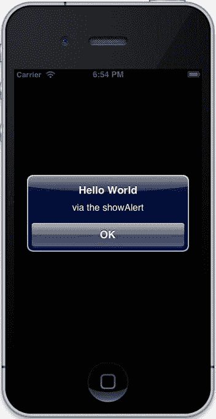

图 8-3 . 在 iOS 设备的警告对话框中显示的“Hello World”

这是向用户显示信息最简单、最快捷的方式，无需费心创建显示对象。最棒的是，它会根据您运行应用的平台自动适应原生样式。

### 在设备上显示 Hello World

`display`命名空间中的函数用于创建基本的显示对象，包括图像、文本、矩形、圆角矩形、圆形、线条、组等。首先，我们将创建一个文本对象并将其显示在屏幕上。

```
local lblText = display.newText("Hello World",10,50)
```

这一行代码将创建一个新的文本对象，其中包含文本`Hello World`，并将其放置在屏幕上的 (10, 50) 位置，使用默认的系统字体，如图 8-4 所示。`newText`函数的语法如下：

```
display.newText( [parentGroup,] string, left, top, font, size )
display.newText( [parentGroup,] string, left, top, [width, height,] font, size )
```

在任何时候，您都可以为设备构建应用程序并在设备上运行，而不是在模拟器中运行。要能够将构建好的应用上传到 iOS 设备，您需要加入 Apple 的 iOS 开发者计划，并拥有必要的证书来签名应用，以便能够上传到设备。在 Android 上，这应该不是问题，您可以构建一个 APK 并上传到 Android 设备。

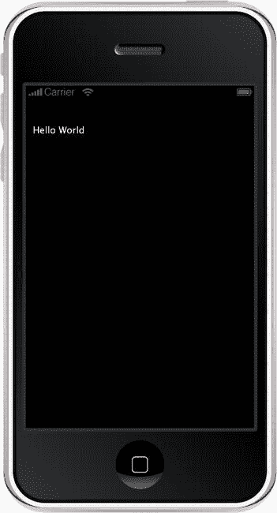

图 8-4 . 在设备上作为标签显示的“Hello World”

## 超越 Hello World：在屏幕上创建一个矩形

以同样的方式，我们可以在屏幕上创建一个矩形，如图 8-5 所示。

```
local rect_01 = display.newRect( 50, 50, 200, 200 )
```

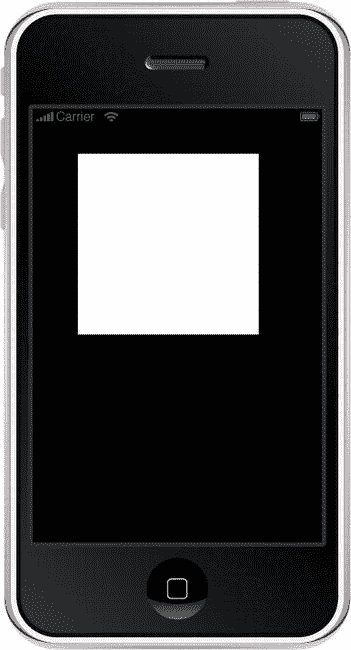

图 8-5 . 设备上带有默认填充颜色的矩形

这将在屏幕上创建一个矩形，该矩形位于 (50, 50) 位置，尺寸为 200x200。当创建显示元素时，它们会被分配默认设置；因此，即使我们没有指定填充，也会在屏幕上看到一个白色矩形。

我们可以更改一些属性，例如填充颜色、轮廓颜色、透明度（alpha），以及矩形的缩放和旋转。让我们修改矩形来操作所有这些属性。

```
rect_01:setFillColor(255,0,0)
```

`setFillColor`接受四个值作为颜色：红色（R）、绿色（G）、蓝色（B）和可选的透明度（A）。颜色的值范围是 0 到 255，透明度默认为不透明（255）。

我们可以通过指定描边颜色和描边线宽来为矩形添加轮廓，如下所示：

```
rect_01.strokeWidth = 2
rect_01:setStrokeColor(0,255,0)
```

`strokeWidth`设置描边线（轮廓）的宽度；将其设置为 0 相当于为对象指定无边框或无轮廓。`setStrokeColor`在参数方面与`setFillColor`类似。这些颜色以 RGBA 格式指定。

我们可以使用缩放函数来缩放矩形。


**注意**    你可使用 `scale()` 函数或 `xScale` 与 `yScale` 属性来调整对象的缩放比例，尽管它们的工作方式略有不同。前者是相对于当前缩放比例进行缩放，而后者则是为对象赋予绝对的缩放值。

在本练习中，我们将简单使用 `xScale` 或 `yScale` 方法来缩放矩形。其优势在于，当我们只需要在单一轴上缩放对象时，可以使用 `scale` 属性；而使用 `scale()` 函数时，则需要同时指定 x 轴和 y 轴的缩放值。

```
rect_01.xScale = 0.5
```

旋转对象同样简单——我们可以直接使用 `rotation` 属性或 `rotate()` 函数。与缩放函数和方法类似，`rotate` 和 `rotation` 也分别处理相对旋转或绝对旋转。如果我们对同一个对象连续调用三次 `rotate()` 函数，每次角度值为 30，那么对象将旋转 90 度（即 30 度 × 3）；而如果多次将 `rotation` 属性值设为 30，则对象始终只会旋转到绝对的 30 度位置。

```
rect_01.rotation = 30
```

以下是完整的代码：

```
local rect_01 = display.newRect( 50, 50, 200, 200 )
rect_01:setFillColor(255,0,0)
rect_01.strokeWidth = 2
rect_01:setStrokeColor(0,255,0, 128)
rect_01.xScale = 0.5
rect_01.rotation = 30
```

图 8-6 展示了应用上述所有变换后的效果。

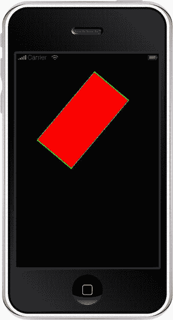

图 8-6 . 应用于矩形的变换

### 组

所有显示元素都可以被放入一个组中。可以将组视为一个能够容纳显示元素的容器。组的好处在于，通过操控组的位置和显示属性，你可以同时影响组内所有显示元素。你可以对它们进行移动、旋转和缩放，也可以修改它们的 `alpha` 属性和可见性。

```
local grp = display.newGroup()
local text1 = display.newText("One", 10, 10)
local text2 = display.newText("Two", 10, 30)
local text3 = display.newText("Cha-Cha Cha", 10, 50)
```

运行这段代码时，屏幕上会显示三行文本。我们可以通过修改元素的 `x` 或 `y` 位置来移动其中任何一个。将以下代码添加到上述代码的末尾。要重新运行或刷新，在 Mac 上只需按下 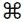 + `R`，在 Windows 上则按下 `Ctrl + R`。Corona SDK 还会监视目录中的更改，如果项目发生改变，它会提供重新启动项目的选项。

```
text2.y = 90
```

运行后，“Two”文本会显示在“Cha-Cha Cha”文本的下方，而原来显示“Two”的位置现在变成了空白。

让我们将文本“One”添加到组中：

```
grp:insert(text1)
```

刷新后，一切看起来应该和之前一样。现在我们来尝试定位包含文本“One”的那个组。

```
grp.x = 100
grp.y = 20
```

刷新模拟器后，文本“One”发生了移动，如 图 8-7 所示。它现在位于原来文本“Two”所在的位置，但稍微靠右一些。虽然我们修改的是组的位置，但因为文本包含在该组中，所以它也随着移动。

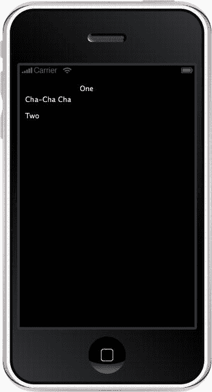

图 8-7 . 在组中显示文本

默认情况下，所有元素都有一个父级，或者说一个包含它们的组。所有已创建元素的根组或父组被称为*舞台*（stage）。我们可以通过 `display.getCurrentStage()` 函数来访问它。

### 图像

相较于 C、C++ 或 Objective-C 等语言，选择 Lua 的优势之一在于，它无需手动分配和释放内存。与原生代码相比，框架提供的封装器使得编码更加简便。使用 Corona SDK 时，我们可以轻松地加载并在屏幕上显示图像。


### 要加载图像，我们使用 `display` 命名空间中的 `newImage` 函数：

```
local img = display.newImage("image1.png")
```

或者，我们也可以提供图像可能所在位置的坐标：

```
local img = display.newImage("image1.png", 50, 50)
```

这样会加载一个名为 `image1.png` 的图像，并将其放置在屏幕上的 `50, 50` 位置。

## 基于事件的处理

在 DOS 和字符终端时代，即使与数字电视相比，计算机也显得原始，那时的程序流程是线性的。代码从第一行开始运行，一直执行到最后一行，然后程序结束。这非常适用于当时的技术。然而，在当今的触摸屏和基于 GUI 的应用程序中，线性流程模型已经不再适用。我们可能在任意时刻遇到触摸或某个事件，因此应用程序的流程不再必须是同步的。事件可能在应用程序生命周期的不同时间点发生，并需要被处理。

为了能够使用基于 GUI 的应用程序，引入了*基于事件的编程*概念。如 图 8-8 中的图表所示，在这种处理方式中，事件发生并被传递给应用程序进行处理，应用程序根据事件类型执行必要的操作。在我们的例子中，最常用到的事件是触摸事件。它是应用程序所有输入的主要来源。为了让代码能够监听发生的事件，程序必须将自身注册为特定事件的监听器，并为该事件传递一个处理程序（handler），当事件发生时，该处理程序会被调用。

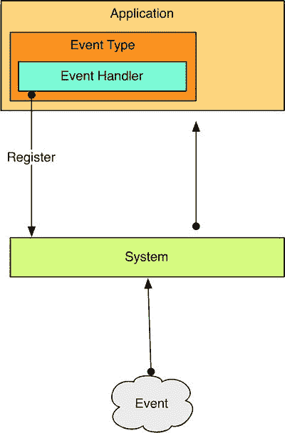

图 8-8 .  Corona SDK 中的事件处理架构

我们可以使用 `addEventListener` 函数，在我们想要监听事件的对象上注册程序来监听特定事件，并传递一个函数，该函数将在事件传递给它时处理该事件。

```
OBJECT:addEventListener(EVENT
,HANDLER
)
```

在这段代码中，`EVENT` 是我们可注册监听的事件之一，而 `HANDLER` 是接收到事件时被调用的函数。

### 输入：触摸

我们可以使用前面提到的方法在屏幕上放置图像和文本。但是，我们还需要处理各种形式的输入，例如触摸屏上的触摸。这相当于桌面上的鼠标点击。通常，触摸事件与显示元素相关联；你可以触摸显示元素并触发一个触摸阶段。然而，Corona SDK 也允许你拥有一个与 `Runtime` 对象关联的通用触摸处理程序，该处理程序会为所有对象触发触摸事件。

当用户将手指放在设备上时，会触发一个触摸事件。如 图 8-9 所示，该触摸事件有若干属性或成员。触摸事件始于手指触摸屏幕，事件将 `phase` 的值设置为 `began`。它还将 `target` 设置为被触摸的对象，并将 `x` 和 `y` 设置为用户手指接触屏幕点的坐标。

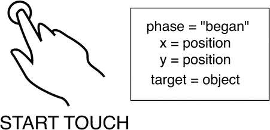

图 8-9 .  触摸“began”（开始）事件及其成员

如果用户在保持手指触摸屏幕的同时拖动手指，则会触发一个事件，但这次 `phase` 的值被设置为 `move`。`target`、`x` 和 `y` 仍然包含被触摸对象的值以及手指的当前位置。如果用户的手指在屏幕上移动，如 图 8-10 所示，则会触发一系列触摸事件，其中 `phase` 设置为 `move`，并且 `x` 和 `y` 会随着手指在屏幕上移动而反映其坐标变化。

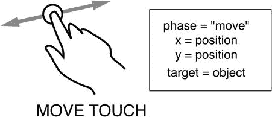

图 8-10 .  触摸“move”（移动）事件及其成员

当用户将手指从屏幕上抬起时，会触发一个触摸事件，其 `phase` 设置为 `ended`，如 图 8-11 所示。其他三个属性反映了触摸结束时的目标对象以及 `x` 和 `y` 位置。

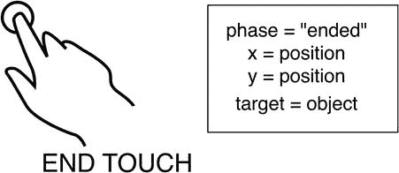

图 8-11 .  触摸“ended”（结束）事件及其成员

当触摸事件在触发 `began` 阶段后，但未完成 `ended` 阶段而被中断时，会触发 `cancelled` 阶段。这种中断可能是由于来电、系统触发的消息、通知等引起的。

让我们编写一些代码来显示触摸事件（即我们刚刚读到内容）：

```
function handler( event )
  print( "touch phase=" .. event.phase .. " at x=" .. event.x .. ", y=" .. event.y)
end
Runtime:addEventListener( "touch", handler )
```

运行这段代码后，我们可以在终端窗口查看输出。

与触摸事件类似，还有一个可以处理的点击事件。触摸和点击之间的区别在于，触摸以 `began` 阶段开始，以 `ended` 阶段结束。而点击事件则是在用户开始触摸并在没有移动的情况下结束触摸时触发的。点击事件有一个属性 `numTaps`，表示与该触摸事件相关的点击次数。

```
function onTap( event )
  print( "Taps :".. event.numTaps )
end
Runtime:addEventListener( "tap", onTap )
```

## 物理

Corona SDK 备受瞩目并深受开发者欢迎的特性是它能够在大约八行代码内将物理功能集成到代码中。你可以通过使用 `physics.addBody()` 函数将任何显示对象指定为物理物体，从而使其成为物理对象。

```
local ground = display.newRect( 0, 40, 320, 20)
```

运行这段代码后，屏幕上会显示一个矩形。为了使其成为物理对象，我们需要引入物理库。我在前面的章节中描述过，你可以使用 `require` 关键字来包含库，如下所示：

```
local physics = require "physics"
physics.start()
```

这两行代码至关重要：第一行获取了物理库的句柄，允许我们从 `physics` 命名空间调用与物理相关的函数；第二行实际上启动了物理引擎。将对象设置为物理对象并不会产生任何效果，直到调用 `physics.start`。这在游戏中经常用到，游戏允许用户将对象放置在屏幕上，然后调用 `physics.start` 函数来启动物理模拟，使其与放置的对象进行交互。使用此功能的例子包括《泡泡球》（Bubble Ball）和《愤怒的橘子》（Angry Orange）（非 Corona SDK 制作）。

然而，即使添加了这两行代码，我们创建的矩形仍然不会作为物理体运行，因为我们尚未将其标记为物理体。为此，请添加以下代码行：

```
physics.addBody( ground )
```

在模拟器中刷新项目后，矩形开始受重力影响并向下掉落，直至离开屏幕。

让我们创建另一个下落的对象；为简单起见，我们创建另一个矩形。为此，我们将修改前面代码的第一行，将 `ground` 对象放在靠近屏幕底部的位置，而不是靠近顶部的位置。

```
local physics = require "physics"
physics.start()
local ground = display.newRect( 0, 460, 320, 20 )
local rect1 = display.newRect( 140, 0, 40, 40 )
physics.addBody(ground)
physics.addBody(rect1)
```


请注意，两个物体都开始从屏幕上掉落。然而，我们不希望地面也掉落——如果我们不将其设为物理对象会怎样？它是否会如我们所愿保持不动？如果我们注释掉或移除将地面设置为物理体的那行代码，会发现`rect1`对象会直接穿过地面对象。

在继续之前，我们需要了解一些要点。创建物理体很简单，但我们可以创建几种不同类型的物理体，它们之间的区别很重要。物理体不会与其他显示对象交互，它只能与其他物理体交互。物理体主要有三种类型：`static`（静态）、`dynamic`（动态）和`kinematic`（运动学）。默认的物理对象类型是`dynamic`，这意味着一旦启动物理引擎，该对象就会开始遵循重力规则。第二种类型是`static`，这种类型的对象保持不动且不遵循重力，但仍会与物理对象交互。最后一种类型是`kinematic`，在这种类型中，速度会影响对象，但重力对其没有影响。运动学对象会在其自身速度的影响下移动。

了解了这些知识，我们可以编写以下代码：

```lua
local physics = require "physics"
physics.start()
local ground = display.newRect( 0, 460, 320, 20 )
local rect1 = display.newRect( 140, 0, 40, 40 )
physics.addBody( ground, "static")
physics.addBody( rect1 )
```

现在，如图 8-12 所示，地面的矩形不会掉出屏幕，而`rect1`矩形在撞击地面时会弹起。

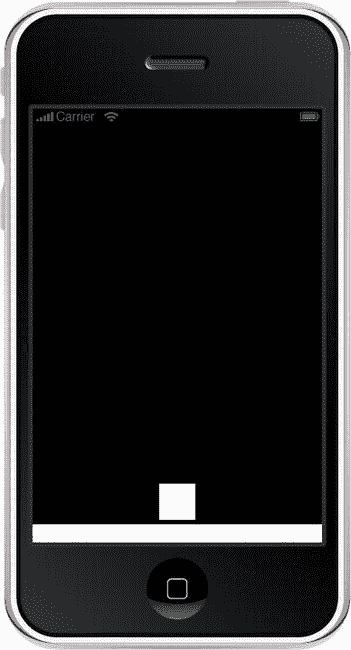

图 8-12 . 一个动态物理对象与静态物理对象交互

这个矩形可以用一个“贴图”（即图形）替换，这非常简单：

```lua
local physics = require "physics"
physics.start()
--
local ground = display.newRect( 0, 460, 320, 20 )
local rect = display.newImage( "DominoTile.png" )
--
physics.addBody( ground, "static")
physics.addBody( rect1 )
```

--

时机决定一切

许多游戏会为玩家提供特殊能力。例如，《打砖块》这类游戏会提供激光、多个球等能力。在其他游戏中，你可能会在有限时间内获得超速或超强力量，这些能力会以计时器的形式在屏幕上显示，时间一到能力就会消失。如果我们想让自己的游戏也实现类似功能呢？例如，我们希望在一小段时间内追踪或提供某些特殊能力。

计时器就派上用场了。虽然“计时器”这个词可能会让人联想到在指定时间响起的闹钟，但在 Lua 中，计时器更像是一种心跳——一种我们可以控制其节拍的心跳。我们可以决定在计时器每次“跳动”时让程序做什么。

设置计时器很简单——我们只需使用以下代码：

```lua
local heartbeat = timer.performWithDelay(1000,
   function()
     print("tick")
end, 0)
```

运行这段代码时，你会看到`tick`这个词每秒输出到终端一次。该函数位于`Timer`命名空间中，有四个函数：`timer.performWithDelay()`用于创建新计时器，`timer.cancel()`用于取消计时器，`timer.pause()`用于暂停计时器进一步触发，以及`timer.resume()`用于从执行暂停的位置继续执行。

在计时器相关的函数中，`performWithDelay`接受一个参数，即已创建计时器的句柄。当`performWithDelay`函数被调用时，它会返回一个指向将要运行该代码的实例的句柄。该函数接受三个参数：`delay`、`listenerFunction`和`iterations`。第一个参数`delay`指定计时器事件触发的频率，单位是毫秒。通俗地说，这意味着我们应当在每次心跳时做一些事情。第二个参数是`listenerFunction`，它指向一个 Lua 函数，并且在每次事件发生时被调用。最后一个参数是可选的，默认值为 1。它表示该事件应调用此函数的次数。

以下是如何使用计时器打印从 1 到 10 的数字列表：

```lua
local counter = 1
  function printNumber(event)
     print("Counter is :".. counter)
    counter = counter + 1
end
timer.performWithDelay(1000,printNumber, 10)
```

帧

虽然电视和电影的工作原理看起来很复杂，但实际上它们的工作方式非常简单。电影或电视屏幕会快速连续地显示一系列静态图像，速度快到让我们眼睛将这些图像感知为连续运动。这也是动画师制作动画的方式。他们会绘制一组连续的图像帧，当这些图像快速连续播放时，就给我们提供了运动的错觉。如果图像播放得太慢，我们会察觉到帧之间的图像切换；如果播放得太快，一切都会显得异常和加速。那么，这跟开发有什么关系呢？一切都有关系！

大多数动画软件都使用时间线。时间线通常是动画的蓝图，它决定了对象随时间或帧的位置和变换。应用程序从第 1 帧开始，遍历一定数量的帧来提供运动的错觉，直到到达帧的末尾时停止。然而，在某些情况下，时间线可能会“循环”——即从开头重新开始，仿佛在一个循环中。每秒显示的帧数称为“帧率”。每秒能显示的帧数越多，运动就越平滑。大多数软件使用术语“帧每秒”（`fps`）来描述屏幕上动画对象的帧率。

可以将这视为应用程序的心跳。例如，你可以将心跳设置为`30 fps`或`60 fps`，后者能提供更平滑的动画。然而，更高的帧率会给 CPU 带来更大负担，尤其是在触发一些处理的应用程序中，因此在某些情况下，较低的帧率是更好的选择。

当你在 Lua 中创建动画时，Corona SDK 允许你将应用设置为`30`或`60 fps`。

为简单起见，我们将编写一个处理程序来捕获事件并仅打印一条消息。

```lua
function ticker( event )
    print ( "tick" )
end
--
Runtime:addEventListener ( "enterFrame", ticker )
```

运行时，这将在终端窗口中输出大量显示`tick`的行。

**注意** `enterFrame`事件在屏幕渲染之前触发。

制作生命条

如果你玩过任何即时战略或塔防游戏，你会知道每个角色都有一定的生命值，每次角色被击中，生命条就会减少或改变颜色。

在这个例子中，我们将使用一个矩形来创建生命条，如图图 8-13 所示。然后我们可以通过`enterFrame`事件中操作矩形的高度来修改矩形的大小。


```lua
local bar = display.newRect ( 100, 300, 20, 70 )
bar:setFillColor (100,100,200,200)
local theText = display.newText( "value", 140, 300, nil, 20)
theText:setTextColor( 255, 255 ,255 )
--
local time = 20
local counter = 0
local direction = 1
local isStopped = false
--
function toggleMove ( event )
  isStopped = not isStopped
end
--
function move ( event )
  if isStopped == true then return end
   counter = counter + direction
   if counter>=time or counter<=0 then
    direction = -direction
   end

bar.height = 8 * counter
   bar:setReferencePoint(display.BottomLeftReferencePoint)
   bar.y=300
   theText.text = counter
end
--
Runtime:addEventListener ( "enterFrame", move )
```

`Runtime:addEventListener ( "tap", toggleMove )`

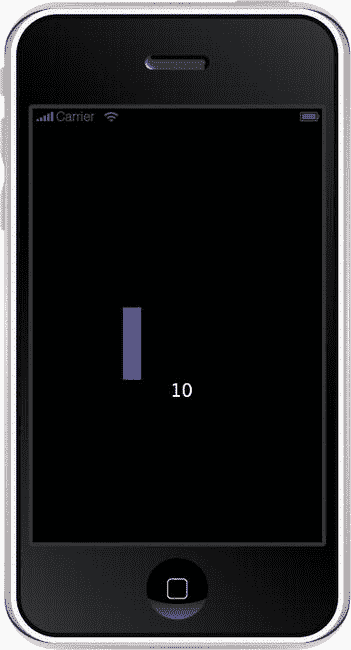

图 8-13 .  设备（或模拟器）上的生命值条，同时显示数值

请注意，生命值条开始上下摆动，先递增后递减。生命值条的摆动演示了每次调用 `enterFrame` 函数时如何修改对象。这可用于动画，例如改变对象在屏幕上的位置或改变对象的尺寸。

## 使用 `enterFrame` 实现动画

如图 8-14 所示，我们可以使用 `enterFrame` 在屏幕上移动对象。在第 4 章中，你学习了如何将对象约束在屏幕的特定尺寸内。我们当然不会像矩阵那样光靠看数字就能理解一切，因此我们将为相同的代码创建一个图形界面版本。

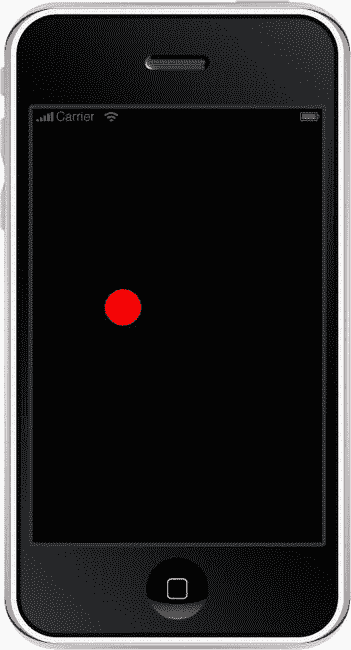

图 8-14 .  使用 `enterFrame` 处理程序让红色圆球在屏幕上弹跳

```lua
local point = {x=0,y=0}
local speed = {x=1,y=1}
local dimensions = {0,0,320,480}

local ball = display.newCircle(0,0,20)
ball:setFillColor(255,0,0)

function positionBall(thePoint)
   print("ball is at" .. thePoint.x .. " , ".. thePoint.y)
   ball.x = point.x
   ball.y = point.y
end
function moveBall()
  local newX, newY = point.x + speed.x, point.y + speed.y
  if newX > dimensions[3] or newX < dimensions[1] then speed.x = - speed.x end
  if newY > dimensions[4] or newY < dimensions[2] then speed.y = - speed.y end
  point.x = point.x + speed.x
  point.y = point.y + speed.y
end
function loop_it_all(event)
    positionBall(point)
    moveBall()
end
Runtime:addEventListener ( "enterFrame", loop_it_all )
```

你可以通过修改第二行中的速度值来加快移动速度，如下所示：

`local speed = { x = 1, y = 1 }`

## 回到生命值条

许多即时战略和塔防游戏都包含一个指示器，用于显示角色的剩余生命值。每当角色受到攻击时，生命值就会减少，并且生命值条可能会改变颜色以反映生命值的损失。

在本练习中，我们将创建一个类似的条。首先，创建一个条，将其设置为绿色表示满血，并赋予其 10 的生命值。每次点击屏幕，我们将生命值减少 1，生命值条也会相应变短。生命值条还会从绿色变为橙色再到红色，以指示情况的严重程度。

```lua
local barSize = 200
local barHeight = 30
local healthBar = display.newRect ( 10, 100, barSize, barHeight)
  healthBar:setFillColor ( 0, 255, 0 )       -- 将其设为绿色
  healthBar.health = 10       -- healthBar 的动态变量
--
function updateHealth()
  local theHealth = healthBar.health - 1
  if theHealth <0 then return end
  healthBar.health = theHealth
  --
  if theHealth > 6 then       --绿色
    healthBar:setFillColor ( 0, 255, 0 )
  elseif theHealth > 4 then       --橙色
    healthBar:setFillColor ( 180, 180, 0 )
  elseif theHealth > 0 then       --红色
    healthBar:setFillColor ( 255, 0, 0 )
  elseif theHealth == 0 then       --黑色
    healthBar:setFillColor ( 0, 0, 0 )
  end

if theHealth > 0 then
    healthBar.width = (barSize * theHealth/10)
  end
end
Runtime:addEventListener ( "tap", updateHealth )
```

运行此代码时，如图 8-15 所示，屏幕上将显示一个绿色的生命值条。每次点击屏幕，它都会变小，并从绿色变为黄色再到红色。在实际游戏中，这个生命值条可能会更小，并且与每个角色相关联，还可能使用多个生命值条——每个角色一个。

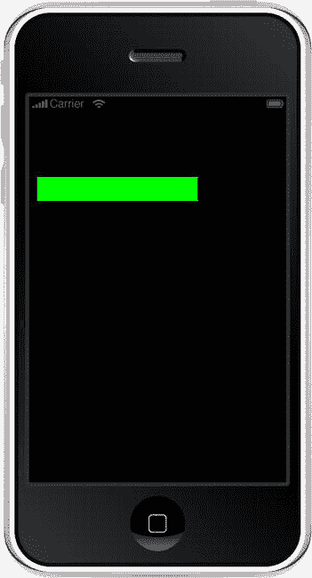

图 8-15 .  屏幕上显示的生命值条（当前为满血状态）

要让生命值条变小，你可以简单地调整 `barSize` 和 `barHeight` 为你想要的值。你还可以将 `healthBar` 传递给 `updateHealth` 函数来管理多个生命值条。最后，你可能想创建一个自包含的 `healthBar` 对象，使其像小部件一样拥有自己的一套函数和属性。我将把最后这些选项留给你自己尝试。

## 使用过渡函数

接下来，我们将介绍一些过渡效果。这些便捷的函数可以帮助我们修改对象的可视属性，从而营造动画效果。

**注**  在 Adobe Flash 的世界里，这类过渡效果被称为补间动画。

对对象进行过渡类似于在一段时间内将对象移动到新位置。在之前的弹跳球示例中，我们可以使用过渡效果；然而，过渡需要起点和终点，因此我们需要定义这些点。过渡是在特定时间段内执行的，在此期间，过渡代码会计算起始状态和结束状态之间的每一个中间步骤。

让我们将一个简单的圆从屏幕底部移动到屏幕顶部：

```lua
local ball = display.newCircle ( 160, 480, 50 )
transition.to ( ball, {time=1000, y = 0})
```

我们可以通过增加 `time` 值来减慢移动速度，或者通过减少 `time` 值来加快速度。在这里，我们调用了 `transition.to` 函数，并要求它在 1000 毫秒（即 1 秒）内将对象 `ball` 的 `y` 位置修改为 `0`。

以下代码将这个球染成红色，使其在移动时变大，并在出现时淡入，如同初升的太阳。

```lua
local ball = display.newCircle ( 160, 480, 50 )
ball:setFillColor(255,255,0)
ball.alpha = 0.5
ball:scale(0.5,0.5)
transition.to ( ball, {time=2000, y = 80, alpha = 1, xScale = 1.2, yScale = 1.2})
```

我们可以使用过渡效果在屏幕上滚动显示一些文本：

```lua
local theText = display.newText("Hello, hope you are enjoying your journey with Lua so far",0,440)
theText.x = theText.contentWidth
transition.to(theText,{time=8000, x = -theText.contentWidth})
--
```

你会看到文本在屏幕底部滚动。同时还要注意，其他过渡效果会以各自的速度进行，不受滚动文本的影响。简而言之，它们互不干扰。你可以在屏幕上同时进行多个独立的过渡效果。

在游戏中，如果我们使用过渡效果，还需要知道它们何时完成，因为我们可能希望在过渡结束时执行某些操作。使用 `transition.to` 函数，我们可以使用两个参数来指定过渡开始和结束时执行的具体动作。它们恰如其分地命名为 `onStart` 和 `onComplete`。

在本练习中，我们将像前面的代码一样让太阳升起，然后在 2 秒后让太阳落下。

由于 Lua 语言灵活且不挑剔，你可以用多种方式编写代码。为了保持代码可读性和简洁性，我们将把代码块拆分成一个函数。


```lua
--
local ball = display.newCircle ( 160, 480, 50 )
ball:setFillColor(255,255,0)
ball.alpha = 0.5
ball:scale(0.5,0.5)
--
local theText = display.newText("Hello, hope you are enjoying your journey with Lua so far",0,440)
theText.x = theText.contentWidth
transition.to(theText,{time=8000, x = -theText.contentWidth})
--
function sunset()
    transition.to ( ball, {delay=2000, time=2000, y=480, alpha=0.5, xScale = 0.5, yScale = 0.5})
end
--
function sunrise()
    transition.to ( ball, {time=2000, y=80, alpha=1, xScale = 1.2, yScale = 1.2, onComplete = sunset})
end
--
sunrise()
```

请注意，在 `sunset` 函数中，我们引入了一个新参数：`delay`。这会让过渡函数在开始过渡前，等待指定的时长。

**注意：** 任何可赋值给对象的属性，都能在指定的时间内进行过渡。如果你创建了自定义的显示对象（例如小组件），都可以通过在过渡函数中修改它们的值来实现动画效果。

`transition` 命名空间包含几个函数。其中使用最频繁的是 `transition.to`，另一个则是 `transition.from`。当调用过渡函数时，根据使用的是 `to` 还是 `from`，被过渡的对象会依据指定的属性进行修改。如果我们使用 `transition.from`，对象会先被设置为所提供的属性值，然后再过渡到对象当前的设置状态。因此，如果我们像这样使用 `transition.from`：`transform.from(theObject, {time=500, alpha=0})`，那么`theObject` 的 alpha 透明度设置会先被设为 `0`，随后过渡会以将当前属性值设置回 `theObject` 而结束。

另一方面，如果我们使用 `transition.to`，`theObject` 会从当前设置过渡到我们在过渡中指定的设置。这也是这个函数比 `transition.from` 更常用的原因。这两个过渡函数都会返回一个我们可以捕获的过渡句柄。这个句柄可以与 `transition.cancel` 函数配合使用，以取消过渡。

**提示：** 一个管理过渡句柄和过渡的好方法（无需创建额外变量），是将过渡保存到对象本身中。这样，无需查找太远，就能在删除对象前取消过渡，特别是当对象正处于过渡过程中时更是如此。

其工作原理是：当我们设置一个过渡时，该函数会返回一个句柄。在大多数情况下，程序员不会捕获这个句柄，因为对于一次性的过渡来说，这并非必要。在我们滚动文本的示例中，过渡持续约 8 秒，而我们的 `sunrise` 和 `sunset` 总共耗时 6 秒。如果在我们应用中，用户点击屏幕进入下一组过渡，滚动过渡由于仍处于激活状态将继续进行。如果我们的代码从内存中移除了文本对象，过渡函数会尝试为该文本对象设置下一个位置，发现它不存在时，便会抛出错误。为避免此类错误，我们可以取消过渡，这样它们就不会残留下来引发问题。

```lua
local theText = display.newText("Hello, hope you are enjoying your journey with Lua so far",0,440)
theText.x = theText.contentWidth
theText.trans = transition.to(
    theText,{time=8000, x=-theText.contentWidth})
--
local ball = display.newCircle ( 160, 480, 50 )
ball:setFillColor(255,255,0)
ball.alpha = 0.5
ball:scale(0.5,0.5)
--
transition.to (ball, {time = 2000, y = 80, onComplete=function()
    transition.cancel(theText.trans)
  end} )
```

请注意，当太阳到达屏幕顶部的那一刻，过渡会通过取消滚动文本来停止它。

你还可以向这些过渡函数传递另一个参数，即 `delta`。这是一个布尔值，可以是 `true` 或 `false`。默认值为 `false`，它指定传递的值是绝对值还是相对于当前值的相对值。

过渡不必是线性的（即步骤均匀）；例如，你可以让文本滑出屏幕时，在到达目标位置时产生加速或减速的效果。这种加速和减速的行为分别被称为*缓入*和*缓出*。Corona SDK 提供了一些可用的缓动选项。

```lua
local theText = display.newText("Hello, hope you are enjoying your journey with Lua so far",0,440)
theText.x = theText.contentWidth
theText.trans = transition.to(
    theText,{time=8000, x=-theText.contentWidth})
--
local ball = display.newCircle ( 160, 480, 50 )
ball:setFillColor(255,255,0)
ball.alpha = 0.5
ball:scale(0.5,0.5)
--
transition.to (ball, {time = 2000, y = 80,
transition = easing.outExpo
, onComplete=function()
    transition.cancel(theText.trans)
  end} )
```

在这段代码中，`transition = easing.outExpo` 使得球在向屏幕顶部移动时先减速然后加速。

你也可以通过编写自己的缓动函数来添加其他有趣的效果。这样的函数声明如下：

```lua
easing.function(t,tMax,start,delta)
```

在这个声明中，`t` 是自过渡开始以来的时间，`tMax` 是过渡的总时长，`start` 是初始值，`delta` 是过渡结束时的值变化量。最终值应始终为 `start` + `delta`。

以下是一个 `easeOutBounce` 的示例，其效果见图 8-16。

```lua
function easeOutBounce(t,b,c,d)
     t,d,b,c= t,b,c,d;
     t=t/d;
     if (t<(1/2.75)) then
          ret=c*(7.5625*t*t)+b
     elseif (t<(2/2.75)) then
          t=t-(1.5/2.75)
          ret=c*(7.5625*(t*t)+.75)+b
     elseif (t<(2.5/2.75)) then
          t=t-2.25/2.75;
          ret=c*(7.5625*t*t+.9375)+b
     else
          t=t-2.625/2.75;
          ret=c*(7.5625*t*t+.984375)+b
     end
return ret;
end
```

该代码取自 logHound 在 GitHub 上创作的 LHTween 库。

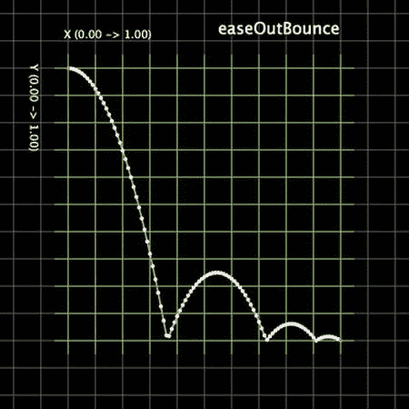

图 8-16 . `easeOutBounce` 函数的图形走势

## 从屏幕上移除对象

你刚刚学会了如何停止一个过渡。然而，对象仍然停留在屏幕上。例如，如果这是一个显示关卡间分数的屏幕，我们希望它消失。最简单的方法，我们可以通过将 `isVisible` 属性设置为 `false` 来关闭对象的可见性。但是，通过这种方法，对象仍会保留在内存中（尽管屏幕上看不到），并会被再次创建；如果你玩一个包含大量关卡的游戏，屏幕上会有相当多的对象占用宝贵的内存。

移除这些对象的一个更好的方法是将它们从舞台中移除。当我们创建一个对象时，它会自动添加到舞台或父对象中。要移除一个对象，我们只需将对象句柄传递给 `display` 命名空间中的 `remove()` 函数。例如，要移除前面示例中的文本，我们只需像下面这样做：

```lua
display.remove(theText)
```

另一种移除对象的方法——看起来更简单直接——是调用显示对象的 `removeSelf` 函数：

```lua
theText:removeSelf()
```

**注意：** 如果对象已被移除或为 `nil`，那么 `removeSelf` 函数将会执行失败并报错。然而，`display.remove` 函数则会优雅地退出，即使要移除的对象先前已被移除，也不会产生任何错误。

## 创建声音


## 游戏音频与视频处理

虽然我们已经涵盖了游戏玩法的视觉和触觉部分，但要完善体验，我们需要添加一些声音。这些声音可以很简单，例如触摸屏幕上元素时发出的声音，也可以更复杂，例如爆炸声或跳动的心脏音乐。我们可能还想包含用于广告目的的视频，作为帮助功能的替代，或帮助游戏故事从一个部分过渡到另一个部分。我们将在下一节中讨论创建视频。

### 让我们制造一些噪音

`Corona SDK`有两组可用于音频的命名空间。最初它使用`media`命名空间，但现在正趋向于使`media`冗余，并希望开发人员使用`audio`命名空间配合`OpenAL`（以实现最大的 Android 兼容性）。`OpenAL`代表开放音频库，一个跨平台的音频库。其 API 风格和约定类似于`OpenGL`。`OpenAL`还提供多个同时通道来播放声音，因此你可以真正地叠加声音。例如，你可以模拟坐在户外咖啡馆的美好时光——同时听到一个人唱歌和弹吉他、其他人的聊天声、交通噪音等等。

从基础开始，假设我们想要播放一个点击声，而我们的音频文件是`click.wav`。我们可以简单地使用`media`命名空间中的`playSound`函数：

```
media.playSound ( "click.wav" )
```

我们也可以使用`playEventSound`函数来播放短音（1 到 3 秒之间）。这要求我们在播放之前加载声音。此函数不接受文件名，而是接受已加载声音数据的句柄。

```
local snd = media.newEventSound ( "click.wav" )
media.playEventSound ( snd )
```

`playSound`函数也可以提供额外的参数，允许声音循环播放或在声音停止播放时调用函数。

这可以用来创建一个简单的 MP3 点唱机，如下所示：

```
local listMP3 = {
  "track1.mp3",
  "track2.mp3",
  "track3.mp3",
  "track4.mp3",
  "track5.mp3",
  "track6.mp3"
}
local currentTrack = 0
--
function getfilename(thisFile)
  local thePath = system.pathForFile( thisFile, system.ResourceDirectory)
  return thePath
end
--
function playNextTrack()
  currentTrack = currentTrack + 1
  if currentTrack > #listMP3 then currentTrack = 1 end
  media.playSound(getfilename(listMP3[currentTrack]), playNextTrack)
end
--
playNextTrack()
```

在这段代码中，我们必须包含另一个函数`getfilename`，它返回曲目的文件路径，而不仅仅是文件名。我们所有的曲目都放在项目的根目录中，然后它们会被放入移动设备上的`ResourceDirectory`。因此，通过`system.pathForFile`函数，我们获得完整路径，将传递的目录前缀添加到文件名之前。该函数根据我们传递的目录名和文件名生成绝对路径。传递的两个参数是文件名和目录名；该函数本质上等同于返回目录名加`/`再加文件名。

### 操控声音

在播放声音时，我们可以暂停或停止它。`media`命名空间提供了简单的方法：

```
media.stopSound()
media.pauseSound()
```

我们还可以通过以下函数来增大或减小音量：

```
media.getSoundVolume()
media.setSoundVolume()
```

音量表示为一个实数，范围从 0 到 1.0，其中 0 表示静音，1.0 表示最大音量。以下是一些以 10%为增量增加或减少音量的代码：

```
function increaseVolume()
  local currVol = media.getSoundVolume ( )
  if currVol >= 1.0 then return end -- 已处于最大音量
  media.setSoundVolume ( currVol+0.1 )
end
--
function decreaseVolume()
  local currVol = media.getSoundVolume ( )
  if currVol <= 0 then return end -- 已处于最小音量
  media.setSoundVolume ( currVol-0.1 )
end
```

作为练习，尝试制作一个 UI，可以显示当前正在播放的曲目名称，并在屏幕上放置用于播放、暂停以及跳到上一曲或下一曲的按钮。

### 使用 OpenAL 音频

`audio`命名空间包含`OpenAL`函数，这些函数最终可能会取代`media.playSound`和`media.playEventSound`函数。

使用`OpenAL`，你需要加载声音，然后在完成后释放它。如果不这样做，你可能会在内存中留下声音，并很快耗尽内存。

```
local snd = audio.loadSound( "click.wav" )
local channel = audio.play( snd )
```

我们有 32 个通道可以用来播放声音。每次我们使用`audio.play`函数时，API 会寻找一个空闲通道，然后在该通道上开始播放声音，并将通道号返回给我们。正是通过这个通道号，我们可以暂停或停止该通道上的声音播放。我们还可以查询通道以确定通道的状态，使用以下任一方法：

```
audio.isChannelActive
audio.isChannelPaused
audio.isChannelPlaying
```

一旦我们播放完声音，我们有责任使用`audio.dispose`函数来释放（释放用于声音的内存）声音：

```
audio.dispose ( snd )
```

#### 设置音量

使用`OpenAL`，我们不仅可以设置主音量，还可以设置每个通道的音量。与`media`命名空间中的音量类似，音量范围从 0（静音）到 1.0（最大）。

```
function increaseVolume()
  local currVol = audio.getVolume ( )
  if currVol >= 1.0 then return end -- 已处于最大音量
  media.setVolume ( currVol+0.1 )
end
--
function decreaseVolume()
  local currVol = media.getVolume ( )
  if currVol <= 0 then return end -- 已处于最小音量
  media.setVolume ( currVol-0.1 )
end
```

请注意，我们使用了与之前相同的函数名，并用`audio`函数替换了`media`函数来操控音量。这样，如果代码封装在通用函数中，我们可以在应用程序中使用`increaseVolume`和`decreaseVolume`函数。由于这些函数可以针对任何框架编写，我们的代码将非常可移植。许多开发者（尤其是初学者）常犯的一个基本错误是直接访问框架函数。由于代码与框架紧密耦合，导致难以移植。

### 使用视频

我们刚刚了解了如何处理声音；现在让我们看看如何处理视频。`media`命名空间有一个易于使用的 API，使得播放视频非常简单：

```
function done(event)
  print( "The video has finished playing" )
end
media.playVideo ( "video1.mov", true, done )
```

`playVideo`函数的语法是：

```
media.playVideo(path, showControls, listener)
```


第一个参数是视频文件的路径。第二个参数`showControls`指示是否显示播放界面，用户可以通过点击屏幕显示此界面并调整播放。但将此参数设为`false`会禁用该界面的显示。最后一个参数是播放完成时调用的函数。在 iOS 平台上，播放视频是异步操作，这意味着视频播放后的任何代码都会在视频播放期间运行。因此你可能需要暂停所有操作并等待视频播放完成，然后再继续执行。例如，在游戏开始时播放介绍视频时，你可能希望这样做，这样游戏直到视频播放完成才会开始运行。

Corona SDK 提供了另一个视频播放 API `native.newVideo`，它不跨平台，但允许在 iOS 平台上进行高级操作。通过此 API 创建的对象可以旋转、设置为物理体，并作为显示对象进行操作。

```
local video = native.newVideo ( 0, 0, 160, 240 )
--
function theHandler( event )
  print(event.phase, event.errorCode)
end
--
video:load ( "theVideo.mov", system.ResourceDirectory )
video:addEventListener( "video", theHandler )
video:play()
```

**注意**：此函数可能尚未公开发布，因此如果你使用的是 Corona SDK 的试用版，可能无法运行这段特定代码。

## 创建电梯

在制作游戏时，你可能会遇到角色需要乘坐电梯移动到不同关卡的情况。虽然这个概念非常简单，但理解具体细节很重要。

在本例中，我们将有四个对象：向上和向下的按钮、平台以及角色/玩家。为简单起见，如图 Figure 8-17 所示，我们将使用矩形。当程序启动时，作为物理体的角色会下落，平台会吸收下落并防止物体弹跳。按钮将控制平台上下移动。

```
local physics = require("physics")
physics.start()

display.setStatusBar(display.HiddenStatusBar)
local beam = display.newRect(50,300,200,50)
physics.addBody(beam,"static",{friction=1,density=1,bounce=0})
beam:setFillColor(0,255,0)
local box = display.newRect(120,120,40,40)
physics.addBody(box,{friction=1})
box:setFillColor(255,0,0)

function moveUp()
    box.bodyType="static"
    transition.to( box,
        {time=300, y=-100, delta = true,
          onComplete=function() box.bodyType="dynamic" end})
    transition.to(beam,{time=300,y=-100, delta=true})
end
function moveDown()
    box.bodyType="static"
    transition.to( box,
        {time=300, y=100, delta=true,
   onComplete=function() box.bodyType="dynamic" end})
    transition.to(beam,{time=300,y=100, delta=true})
end
local btnUp = display.newRect(10,10,20,40)
local btnDn = display.newRect(10,60,20,40)

btnDn:addEventListener("tap",moveDown)
```

`btnUp:addEventListener("tap",moveUp)`

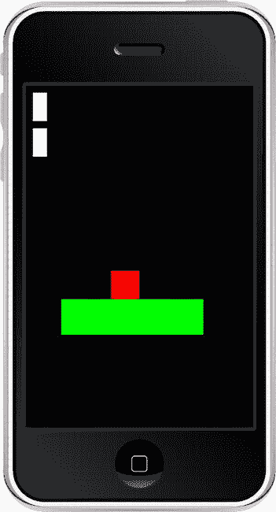

Figure 8-17 — 基于物理的电梯，响应向上和向下按钮

**注意**：使用`delta=true`可以实现相对移动，因此平台将相对于当前位置向上或向下移动 100 像素。

## 缩放以查看全景

许多游戏使用相机模式显示整个区域，然后放大到玩家开始游戏。我们将尝试重现这种效果。其工作原理是：元素被放置在屏幕上它们应该位于的位置。这个“世界空间”可能比屏幕尺寸大，因此它们可能位于可见屏幕区域之外。我们将允许用户通过触摸屏幕来缩放以查看全景，并在释放触摸时，屏幕将缩放回原始位置。

```
local _H = display.contentHeight
local _W = display.contentWidth
--
function position(theObject, xPos, yPos, refPoint)
  local refPt = refPt or display.TopLeftReferencePoint
  theObject:setReferencePoint(refPt)
  theObject.x = xPos
  theObject.y = yPos
end
--
local back
local function zoomer(event)
  local phase = event.phase
  local target=event.target

if phase=="began" then
 display.currentStage:setFocus(target)
 transition.to( back,{time=200,xScale=0.5, yScale=0.5} )
  elseif phase=="ended" then
 display.currentStage:setFocus(nil)
 transition.to( back,{time=200,xScale=1, yScale=1} )
  end
end
--
back = display.newGroup()
local wallpaper = display.newImage( back, "wallpaper.jpg", 0, 0, true )
local i
for i=1, 10 do
  local rect = display.newRect( back, i*50, i*50, 40, 40 )
  rect:setFillColor( 255-(i*10), 0, 0 )
end
position ( back, _W/2, _H/2, display.CenterReferencePoint )
local  button = display.newRect( 10, 400, 50, 50 )
button:setFillColor(255,0,0,100)
button:addEventListener( "touch", zoomer )
```

我们使用了一些有趣的新的 API 功能；在讨论它们如何协同工作之前，让我们先看看它们。

每个显示对象都有尺寸；我们可以通过代码使用`height`和`width`属性访问它。当我们缩放对象时，尺寸不会改变。然而，在视觉上，对象会根据缩放因子改变大小。因此，如果我们有一个宽度为 100 像素的矩形，并通过设置`xScale`为`0.5`来缩放它，矩形的宽度仍然是 100，但在屏幕上看起来更小——50 像素。当我们需要获取此对象在屏幕上的大小时，`width`不会返回正确的大小。这就是`contentWidth`和`contentHeight`发挥作用的地方。这两个属性反映了应用缩放后对象的实际尺寸。每个显示对象都有这两个属性。`display`命名空间也有`contentHeight`和`contentWidth`属性，它们对应设备屏幕尺寸。`display.contentWidth`在 iPhone 3 上返回 320，在 iPhone 4 上返回 640，在 iPad 上返回 768。

在程序开始时，我们将屏幕尺寸的值保存在变量`_H`和`_W`中；然后在整个程序中将它们用作设备屏幕的宽度和高度。

我们可以通过简单地操作`x`和`y`成员来定位对象。然而，每次我们更改`x`或`y`坐标时，对象的参考点会被设置为中心（即，对象围绕此位置居中）。这会导致需要多写几行代码来设置`x`和`y`坐标，然后将`referencePoint`设置为`TopLeft`。管理这个问题的最佳方法是创建一个定位对象的函数。这样，你只需要调用该函数，并且可以在任何框架中使用相同的函数名。

```
function position(theObject, xPos, yPos, refPoint)
  local refPoint = refPoint or display.TopLeftReferencePoint
  theObject:setReferencePoint(refPoint)
  theObject.x = xPos
  theObject.y = yPos
end
```

接下来，我们声明另一个负责缩放的函数：

```
function zoomer (event )
  local phase = event.phase
  local target = event.target
  if phase == "began"
    display.currentStage:setFocus(target)
    transition.to( back, {time=200, xScale=0.5, yScale=0.5} )
  elseif phase == "ended" then
    display.currentStage:setFocus(nil)
    transition.to( back, {time=200, xScale=1, yScale=1} )
  end
end
```

这个函数基本上是一个触摸事件的事件处理程序；我们关心两个阶段：触摸开始和触摸结束。当触摸开始时，我们将整个显示区域缩放至`0.5`，释放时缩放回`1.0`。如果你在游戏中使用此功能，可以根据需要更改这些值。

现在来看所有显示元素：


```lua
local back = display.newGroup()
local wallpaper = display.newImage( back, "wallpaper.jpg", 0, 0, true )
local i
for i=1, 10 do
  local rect = display.newRect( back, i*50, i*50, 40, 40 )
  rect:setFillColor( 255-(i*10), 0, 0 )
end
position ( back, _W/2, _H/2, display.CenterReferencePoint )
local  button = display.newRect( 10, 400, 50, 50 )
button:setFillColor(255,0,0,100)
button:addEventListener( "touch", zoomer )
```

现在，当你触摸屏幕时，所有显示对象都会向外缩放（因为它们都属于同一个组），而松开时则会向内缩放。

## 更多事件

我们为 `touch`、`tap` 和 `enterFrame` 添加了事件监听器。类似地，我们也可以为其他事件添加监听器，例如*系统*事件，它会引发与系统相关任务的事件。

如果我们想捕获以下事件，则需要为系统事件设置监听器：

*   应用程序启动（当用户点击图标时）
*   应用程序被挂起（当用户按下主页键且应用处于后台时）
*   应用程序恢复（当应用从先前状态而非从头启动时）
*   应用程序退出。

```lua
Runtime:addEventListener("system",
    function(event)
        print("System event : " .. event.type)
    end)
```

在其他情况下，当设备重新定向（例如，从纵向模式切换到横向模式）时，我们可以通过方向事件来捕获该变化。

```lua
Runtime:addEventListener("orientation",
    function(event)
        print("Orientation changed to.. " .. event.type)
    end)
```

**注意**：系统事件在 Corona 模拟器或终端窗口中无法看到，因为它们需要 Apple iOS 模拟器或实际设备才能运行。但是，`applicationStart`、`applicationSuspend` 和 `applicationResume` 事件可以在 Corona 模拟器中生成。

#### 自定义事件

除了系统事件，您还可以拥有自定义事件——即您专门为应用程序创建的事件。这样，您就可以管理游戏中的异步部分。假设游戏中有一场与巨型蜘蛛的头目战；每次您砍掉巨型蜘蛛的一条腿时，都可以引发一个事件，该事件将为您的分数添加一个特殊奖励，和/或让蜘蛛在该时刻执行特定动作。在俯视角飞机射击类游戏中，您可以在击中每架飞机时使用事件来更新分数。

假设我们有一个函数，可以通过指定数值增加分数；这些参数以表类型结构传递给函数：

```lua
function updateScore(event)
    local score = lblScore.score +  event.points
    lblScore.text = score
    lblScore.score = score
end
```

在飞机被击落或巨型蜘蛛失去一条腿的函数中，我们可以使用以下代码：

```lua
function triggerPoint(theObject)
    local points = theObject.value
    Runtime:dispatchEvent({
        name = "score",
        points = points,
        object = theObject
    })
end
```

为了将两者联系起来，我们还需要使用 `addEventListener` 函数设置一个监听器：

```lua
Runtime:addEventListener("score", updateScore)
```

需要注意的一点是，事件分发器可跨模块工作，这意味着同一应用程序中的两个模块可以在彼此不知情的情况下相互通信。将事件想象成一个无线电广播电台。无论有多少听众在收听，电台都会播放其节目。即使没有听众，广播也会照常进行，与有数百名听众时无异。听众唯一需要做的就是调谐到正确的电台。因此，广播使用 `dispatchEvent` 函数进行，而听众则使用监听 `score` 事件的 `addEventListener` 函数进行调谐。

**注意**：`dispatchEvent` 要求为事件对象提供一个名称；当监听器过滤事件并调用相应的处理函数时，会使用该名称进行识别。您可以在事件对象中传递任何数据。

## 事件的替代方案

作为使用事件的替代方案，您可以使用*回调*。然而，回调的缺点在于，它更像是电话交谈——两方之间的通信，而不是广播电台。当您设置一个回调时，它仅针对一个模块设置。这在诸如我们想要监控特定内容的情况下非常有用。例如，在游戏中，如果网络连接丢失，与其广播该事件并让所有依赖网络连接的函数都尝试处理这种情况，不如只让一个函数注册为该事件的回调并相应地处理情况。回调也提供了同一应用程序内模块之间通信的方式。

```lua
local theCallback = nil
local callback =
    function(event)
        print("callback called")
    end
local mainLoop =
    function()
        for i=1, 20 do
            if i==15 then
                if theCallback then
                    theCallback()
                end
            end
       end
       print("Loop ended")
    end
mainLoop()  -- 未设置回调时调用循环
theCallback = callback  -- 设置回调
mainLoop()  -- 设置回调后调用循环
```

## 使用地图

iOS 平台引起许多开发者兴趣的功能之一是在应用程序中放置地图的能力，如图 8-18 所示。UIMapKit（由 Apple 创建）有点过于复杂，因为它涉及在屏幕上显示地图的一系列步骤。

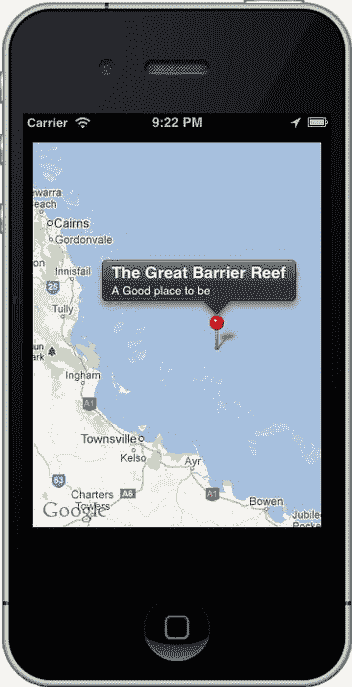

图 8-18 . 显示大堡礁的地图，带有标注和大头针

Corona SDK 提供了一种在屏幕上显示地图的简单方法：

```lua
local lat, lon = -18.2861, 147.7
local map = native.newMapView(10,30,300,200)
map:addMarker(lat, long, {
    title="The Great Barrier Reef", subtitle="A Good place to be"
    } )
```

map:setCenter( lat,lon )

## 互联网浏览器

在早期，当为 iOS 制作应用的唯一方法是使用 Objective-C 时，许多人试图将应用放在 HTML 包装器（UIWebView）中。他们在应用程序内部包装了一个网页浏览器。这在一定程度上帮助他们“作弊”，以便使用模板和书籍，从而制作出既不是原生应用也不是纯粹浏览器的应用。

涉及在屏幕上显示和移除网页视图的两个函数是：`native.showWebPopup` 和 `native.cancelWebPopup`。`cancelWebPopup` 不接收任何参数，因为在任何时间点只能存在一个 webPopup。您也可以使用它来显示一个网站，如图 8-19 所示，或者作为应用中的帮助文件，如图 8-20 所示。

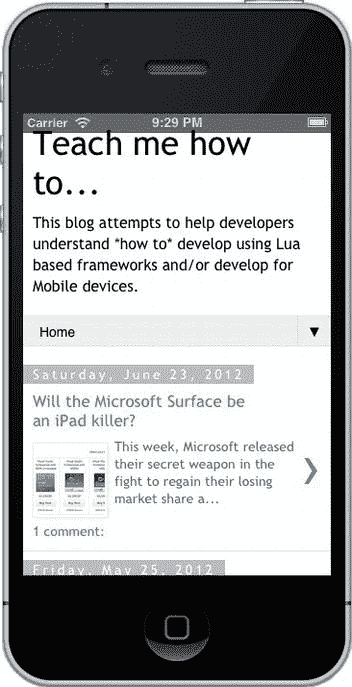

图 8-19 . 在设备上的网页浏览器中显示的博客

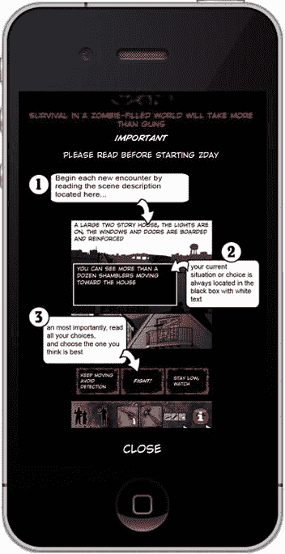

图 8-20 . ZDAY 生存模拟器中的说明屏幕

```lua
native.showWebPopup("http://howto.oz-apps.com")
```

要将其从屏幕上移除，请使用以下代码：

```lua
native.cancelWebPopup()
```

## 没有什么能够永恒

在您的游戏中，您可能希望赋予玩家一些临时的特殊能力或力量，或者您可能希望在屏幕上显示一个奖励物品，供玩家在很短的时间窗口内获取（如《吃豆人》中的水果奖励）。如果玩家未能在规定时间内获取该物体，则该物体将从屏幕上移除。


```  
print("displaying the special object for 3 seconds")  
timer.performWithDelay(3000,  
    function()  
        print("The object has now been removed")  
    end)  
```  

终端显示文本，表明对象正在显示 3 秒钟，3 秒后，文本替换为提示对象已被移除。  

```  
local dot = display.newCircle(160,240,20)  
dot.alpha = 0  
dot:setFillColor(255,72,72)  
transition.to(dot, {time=400, alpha = 1, onComplete =  
    function()  
        dot.timer = timer.performWithDelay(3000,  
            function()  
                transition.to(dot, {  
                    time = 400,  
                    alpha = 0,  
                    onComplete =  
                        function()  
                            dot:removeSelf()  
                            dot = nil  
                        end  
                })  
            end)  
    end})  
```  

至此，我们对 Corona SDK 的讨论告一段落，但需要注意的是，它包含了许多本章未提及的功能。Corona SDK 还支持其他事件，例如加速计、动画精灵、`gameNetwork`、陀螺仪、指南针、地图、本地通知、应用内购买以及场景管理器等。虽然这些超出了本章的讨论范围，但您可以在 [`docs.coronalabs.com/api/`](http://docs.coronalabs.com/api/) 获取更多相关信息。  

## 企业版  

企业版是 Corona Labs 新推出的一款产品，允许开发者使用原生 Objective-C 或 Java 为应用添加功能。它还提供了离线构建和自动化构建的功能。虽然价格相对较高，但它为使用 Corona SDK 的游戏工作室提供了所需的灵活性和强大功能。  

## 总结  

Corona SDK 是最易于使用的移动开发框架之一。其 API 提供了框架所需的对象和显示元素功能。使用物理引擎非常简便，因为 Corona SDK 抽象了 Box2D 的大部分函数，开发者几乎无需关心夹具等底层细节。它甚至包含让企业开发者能够添加原生代码功能的相关特性。  

在接下来的几章中，我们将探讨其他框架，并分析它们为 iOS 设备开发时的基本相似之处。  

