# 第 9 章：Gideros Studio  

在上一章中，我们学习了如何使用第一个基于 Lua 的移动框架——Corona SDK。在使用过程中，我们注意到它没有集成开发环境（IDE），并且试用版不允许创建可上传至应用商店的应用。考虑到您可能希望扩展框架功能，我们的另一款产品——Gideros Studio 正好弥补了这一不足。  

## 许可证  

Gideros Studio 提供四种许可证：  

*   *社区版*：此免费许可证提供其他版本的所有功能，但会显示“Made with Gideros”启动画面。  
*   *独立开发者版*：每年 149 美元，此许可证提供社区版的所有功能，并允许使用自定义启动画面。  
*   *学生版*：此许可证与独立开发者版类似，但面向学生和学术人员提供折扣（每年 79 美元）。  
*   *专业版*：建议年营业额超过 10 万美元的用户选择专业版（每年 449 美元）。  

## 安装 Gideros Studio  

下载 Gideros Studio 前，您需要先创建一个账户。之后便可下载适用于您操作系统的二进制文件。目前最新版本是 Gideros 2012.09.1。  

不过，构建移动应用需要满足一些前提条件。对于 iOS 平台，需要以下环境：  

*   64 位 Mac OS X 操作系统（Snow Leopard 或更高版本）  
*   Xcode  
*   Apple 开发者许可证  

构建 Android 平台的应用则稍微复杂一些，您需要准备以下内容：


*   Java SDK
*   最新版 Android SDK
*   Android 开发工具
*   Eclipse IDE

如果你想在 Unix 上安装 Gideros Studio，可以通过 Wine 来实现。详细的指南可以在线查阅 [`giderosmobile.com/DevCenter/index.php/Running\_Gideros\_Studio\_under\_Linux`](http://giderosmobile.com/DevCenter/index.php/Running_Gideros_Studio_under_Linux)。

## 包含内容

安装 Gideros Studio 时，它会附带一套工具（如图 9-1 所示），这些工具都已准备就绪，可助你创建应用程序。该软件包包含以下内容：

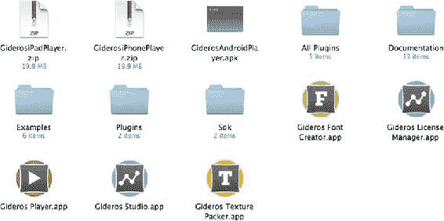

图 9-1. Gideros 软件包的内容

*   Gideros 许可证管理器
*   Gideros 字体创建器
*   Gideros 纹理打包器
*   Gideros 播放器
*   Gideros Studio

它还包含几个存放示例和文档的文件夹、一个适用于你安卓设备的安卓版播放器，以及 iPhone 和 iPad 播放器的源代码。

## 设置许可证

开始使用 Gideros Studio 时，第一件要做的事就是启动许可证管理器（如图 9-2 所示），它允许使用你在创建账户下载 Gideros Studio 时使用的用户名来授权许可证。输入详细信息并授权免费许可证后，你将看到如图 9-3 所示的许可证窗口。

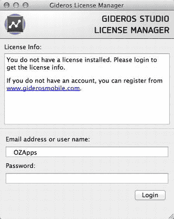

图 9-2. Gideros Studio 许可证管理器

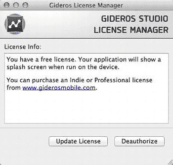

图 9-3. Gideros Studio 免费许可证激活

## 第一步

现在你可以开始使用 Gideros Studio 了。关闭窗口并启动 Gideros Studio，你将看到如图 9-4 所示的 IDE，它可以让你创建新项目、打开最近的项目、打开示例项目以及使用参考资料。

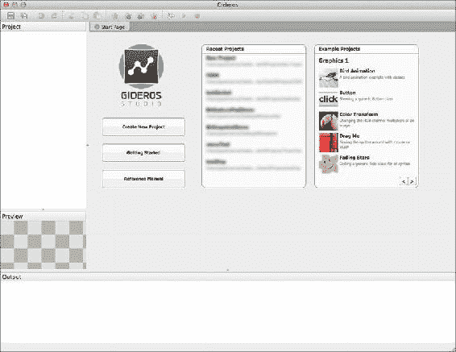

图 9-4. Gideros Studio 启动屏幕

要创建你的第一个应用程序，请选择“创建新项目”选项；如果需要，我们可以自定义项目路径和名称。之后，我们将看到一个空白的 IDE 界面，可供我们开始开发。

第一步是创建一个新的 Lua 文件，因此右键单击项目名称并选择“添加新文件”。如果你有文件要从硬盘添加到项目中，可以选择“添加现有文件”选项，然后导航到要添加的文件。

添加新文件后，将其命名为 `main.lua`。将位置设置为显示的值，然后双击项目名称下显示的文件名（`main.lua`）。编辑器将打开供我们输入代码。首先输入以下内容：

```
print ("Hello World")
```

## 运行代码

要运行代码，我们需要连接到 Gideros 播放器，无论是在桌面端还是设备端。我们可以选择使用桌面播放器或设备播放器来运行代码。选择“播放器”“播放器设置”，将弹出如图 9-5 所示的对话框，并允许我们设置播放器设备的 IP 地址。如果你想使用桌面播放器，请选中“本地主机”复选框，它会将 IP 地址设置为 `127.0.0.1`（本地主机）。当播放器应用启动时（无论是在设备上还是桌面上），它会显示一些基本信息，包括版本号和 IP 地址，如图 9-6 所示。

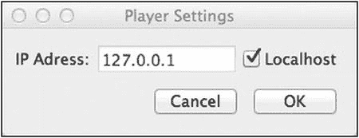

图 9-5. Gideros 播放器设置


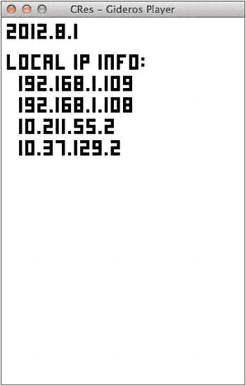

图 9-6. 准备连接的 Gideros Player

如果你已经设置了播放器，或正在使用默认桌面播放器设置，请点击看起来像 Xbox 手柄的图标，这将启动 Gideros 桌面播放器。播放器（包括桌面播放器和设备播放器）会在屏幕上显示 IP 地址。此 IP 地址可用于连接任意位置的 Gideros Player。

点击蓝色播放按钮（播放器启动后该按钮应变为可用状态，如图 9-7 所示）。

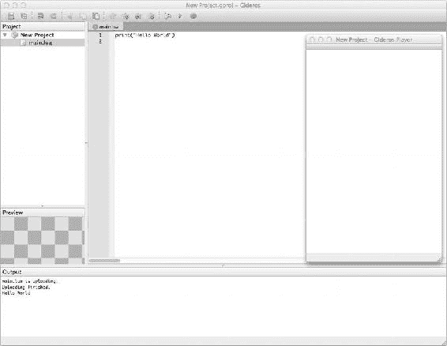

图 9-7. Gideros Studio IDE

你将看到输出窗口显示三行内容：

```
main.lua is uploading.
Uploading finished.
Hello World
```

最后一行是程序的输出，我们通过代码打印了它。第二行表示代码和资源的上传已完成。Gideros Studio 会将资源复制到播放器（上传到播放器），并在上传过程中逐一显示在输出面板上，打印确认信息，然后执行程序。

## 配置项目

右键单击屏幕左侧的项目名称，选择 `属性` 选项。在此可以设置项目的属性。你可以在这里设置应用的缩放模式、逻辑尺寸、方向、帧率，甚至根据需要设置图像文件的后缀。虽然这是你学习 Gideros Studio 初期可能不会用到的高级选项，但它非常实用，因此我将在此进行说明。

第一个选项 `缩放模式` 设置了应用在不同设备上运行时的缩放方式——本章后续内容将对此进行更详细的介绍。逻辑尺寸用于设置应用的基础参数；显示画面将基于这些尺寸，通过缩放模式在不同设备上进行适配。苹果系统使用 `@2x` 或 `@4x` 后缀来加载新款 iPhone 和 iPad 的视网膜图形。Gideros 作为一个多平台系统，也将这种格式扩展到了 Android 平台。因此，你可以使用 `@1.5`、`@2`、`@4` 等作为后缀。

**提示** 缩放后缀不仅可用于高清图形，还可以为每个平台提供对应的图形，而无需编写任何检测特定平台的代码。

`iOS` 标签页可用于配置 iOS 特定的其他设置；例如，应用是否应将目标设备视为视网膜屏设备，以及是否启用自动旋转。如果逻辑尺寸设置为 `320×480`，并且视网膜显示设置为 `非视网膜显示`，则显示尺寸被视为 `320×480`，如图 9-8 所示；而如果启用了视网膜显示选项，则设备被视为具有 `640×960` 的显示尺寸，如图 9-9 所示。这两张图片均来自运行在 iPhone 4 上的播放器，该设备实际尺寸为 `960×640`，但根据项目设置，显示效果会有所不同。

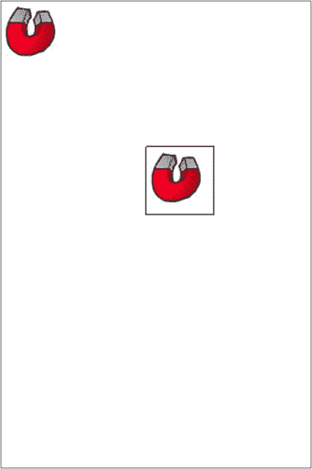

图 9-8. 以 `320×480` 分辨率运行的非视网膜显示模式的 Gideros Player

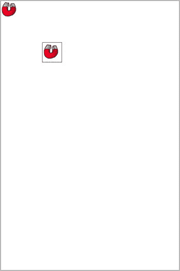

图 9-9. 以逻辑尺寸 `320×480` 并启用视网膜显示模式运行的 Gideros Player

## 架构

Gideros 的架构与其他框架类似。Gideros 核心引擎一方面与 Lua 代码交互，另一方面在后台通过 OpenGL 与设备或桌面端进行交互。图 9-10 展示了 Gideros Studio 的架构。构成 Gideros Studio 系列的工具还包括一些实用程序；这些在章节开头已经讨论过。


## Gideros Studio 架构

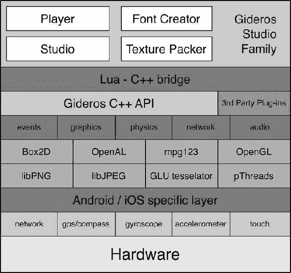

*图 9-10. Gideros Studio 家族架构*

我们编写的 Lua 代码会被编译成字节码并执行。

与 Corona SDK 不同，Gideros 提供离线编译功能，这一点深受众多开发者喜爱。整个 Gideros 引擎以库的形式存在，需要链接到最终的应用中（类似于 Corona SDK 的企业版）。因此，Xcode 或 Android 项目会包含一些包装代码，用于启动脚本并将 Gideros 库编译到最终的应用二进制文件中。任何插件也会作为静态库编译到应用中。

插件功能非常便捷且强大；我们将在本章后面进行探讨。

### Gideros 引擎

Gideros 引擎是一个框架，通过 Lua 语言进行开发。它包含所有用于访问 Gideros API 的特定命令，开发者可以借助这些命令编写代码并在设备上显示应用。

Gideros 是面向对象的，但请不要被这句话吓到。这仅仅意味着 Gideros API 使用冒号表示法而非点表示法——例如，它会使用 `image:setX(100)` 而不是 `image.x = 100`。

### Hello Birdie

延续我们的 Hello World 示例，接下来我们将把一个图像显示到屏幕上。

关于 Gideros Studio，需要注意一点：资源放在目录中并不意味着什么；你需要通过添加*新*文件或*现有*文件的方式，将项目中需要的每个文件都添加进来。因此，在应用中使用 `bird.png` 之前，我们需要先将其添加到项目中。

```
local texture = Texture.new("bird.png")
local image = Bitmap.new(texture)
stage:addChild(image)
image:setPosition(100,100)
```

这段代码首先从名为 `bird.png` 的文件创建了一个纹理，然后使用该纹理创建了一个位图图像。这个图像实例就是*精灵*，或者说我们在屏幕上显示的对象；我们可以使用 `setPosition` 函数随意调整其位置。

在 Gideros 中，当一个对象被创建时，它会被存储在内存中，但不会对用户可见。我们需要将创建的显示对象添加到舞台上，才能在设备屏幕上看到它。

```
local image = Bitmap.new(Texture.new("bird.png"))
```

为了方便起见，我们也可以创建自己的快捷方法或库：

```
function newImage (imageName, posX, posY)
  local image = Bitmap.new(Texture.new(imageName))
  stage:addChild(image)
  image:setPosition(posX, posY)
  return image
end
```

现在，我们只需像下面这样调用这个函数即可：

```
local birdie = newImage("bird.png", 100, 100)
```

关于 Gideros Studio 的另一点是，它加载多个 Lua 文件时无需使用 `require` 函数。我们可以利用这一点，创建一个单独的文件来存放项目中的所有实用函数。让我们创建一个 `myutils.lua` 文件，将 `newImage` 函数添加进去，并将其包含在我们的项目中。

### 对齐图像

所有图像都有一个*锚点*，图像以此点为轴心进行旋转；当图像旋转时，正是这个点决定了旋转的方式。锚点是一个从 0 到 1 的数值，代表图像的高度或宽度百分比。这一点在图 9-11 中进行了说明。你可以将这个值视为百分比：0 表示顶部，100 表示底部（在 y 轴上）；0 表示左侧，100 表示右侧（在 x 轴上）。要得到我们的值，只需将这个百分比除以 100。

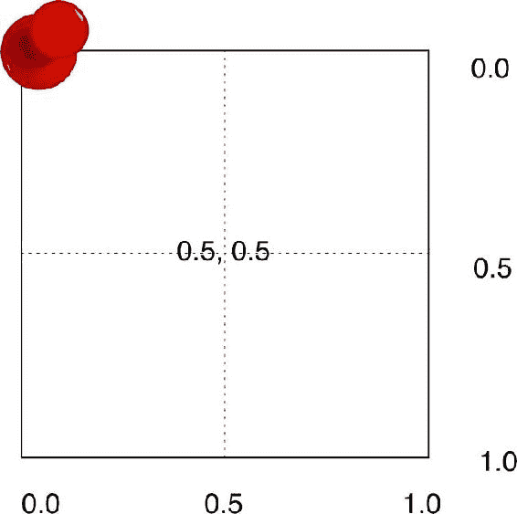

*图 9-11. 锚点设置在 (0, 0) 的位图对象*

中心锚点将在 x 轴和 y 轴上均为 0.5。考虑以下代码：

```
local birdie = newImage("post-it.png", 100, 100)
birdie:setAnchorPoint(0.5,0.5)
birdie:setRotation(45)
```

注意，运行时图像会围绕其中心旋转。现在尝试将 `0.5, 0.5` 改为不同的数值，以观察锚点的效果。

### 组

组是一个包含不同显示对象的容器。当组的属性被更改时，会影响其中包含的所有显示对象。舞台就是一个组；实际上，它是根组，是所有其他显示对象的容器。向组中添加对象的方法如下：

```
group:addChild(displayObject)
```

要从组中移除对象，使用以下函数：

```
displayObject:removeFromParent()
```

要创建一个新组，需要创建一个继承自 Gideros 类的新对象：

```
local obj = Core.class(Sprite).new()
```

现在我们需要将这个对象放置到舞台上：

```
stage:addChild(obj)
```

以下是添加到 `myUtils.lua` 文件中的一个新函数：

```
function newGroup()
  local obj = Core.class(Sprite).new()
  stage:addChild(obj)
  return obj
end
```

此后，我们可以使用这个函数来创建组对象。

我们使用 `stage:addChild` 将大多数对象添加到舞台。现在，我们可以通过 `group:addChild` 使用这个函数将对象添加到组中。

要获取特定组中某个对象的句柄，我们可以使用 `getChildAt` 函数，并传入索引。或者，我们可以通过将对象传递给 `getChildIndex` 函数来获取其索引位置。我们也可以使用这个函数，通过将显示对象传递给它，来检查某个父组是否包含该显示对象。

我们可以使用 `group:getNumChildren` 函数来确定父组中包含的对象数量。

当我们处理完组或组中的对象后，可以使用 `removeChild` 或 `removeFromParent` 函数，或者使用接受显示对象索引的 `removeChildAt` 函数，将对象从舞台或组中移除。

```
object:removeChild()
group:removeChildAt(index)
group:removeFromParent(object)
```

还有另一个函数 `addChildAt`，它允许在特定的索引位置添加子对象。这可以实现显示对象的定位，效果等同于将对象相对于其他对象移到前面或后面。

## 显示文本

本节将描述如何在应用中向屏幕显示文本。Gideros Studio 允许你在应用中使用自定义字体，并且支持 TrueType 字体和位图字体。请注意，如果你想使用自定义字体，则需要在用之前进行加载。

**注意：** Gideros Studio 自带 Gideros Font Creator 应用程序，用于创建可与 Gideros Studio 一起使用的位图字体。

显示文本首先要做的是创建文本字段，操作如下：

```
-- 要使用默认字体，请将字体参数传递为 nil
local text = TextField.new(nil, "Hello World")
text:setPosition(10,10)
stage:addChild(text)
text:setText("Hello from Gideros Studio")
-- 更改文本
```

这里，我们使用 `nil` 作为参数创建了一个新的文本字段，这将使用默认字体。然后，我们将文本定位到屏幕上。Gideros 中的文本使用*基线字体*显示。简单来说，y 参数是字体基线对齐的位置，这可能需要一点时间来适应。例如，如果我们不将文本定位在距顶部 10 像素的位置，文本可能不可见。然后，我们将文本添加到舞台并更改显示的文本。

`TextField` 对象可以像其他任何显示对象一样进行修改。文本颜色可以使用 `object:setTextColor(colour)` 函数设置，其中 `colour` 是由 `b + g * 256 + r * 65536` 计算得出的十六进制值，`r`、`g` 和 `b` 分别代表颜色的红色、绿色和蓝色值。

要使前面的文本变为红色，我们使用以下代码：


```
-- 若要使用默认字体，请为字体参数传递 nil 值
local text = TextField.new(nil, "Hello World")
text:setPosition(10,50)
text:setTextColor(0xff0000)
stage:addChild(text)
text:setText("Hello from Gideros Studio")
-- 修改文本
text:setScale(2,2)
```

运行时，播放器将以红色显示文本 “Hello from Gideros Studio”，且大小为默认字体的两倍，如图 9-12 所示。

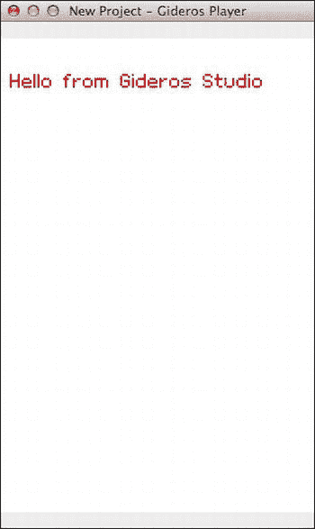

图 9-12.  在 Gideros 播放器中显示经过颜色修改的文本

### 绘制形状

Gideros Studio 还提供了一个 `Shape` 对象，当您需要创建矢量形状（如线条、矩形等）时，可以使用该对象。在 Gideros 中绘制形状的原理与许多其他语言中在 `deviceContext` 上绘图的原理相同。本节将介绍如何创建线条和矩形以及如何填充形状，帮助您入门。

### 线条

线条是最简单的可绘制形状。一条线条本质上由四个点定义：起点的 `x,y` 坐标和终点的 `x,y` 坐标，线条连接这两个点。

```
function newLine(x1, y1, x2, y2)
  local obj = Shape.new()
  obj:setLineStyle(2, 0x000000)
  obj:beginPath()
  obj:moveTo(x1, y1)
  obj:lineTo(x2, y2)
   obj:endPath()
  stage:addChild(obj)
  return obj
end
```

要绘制线条，按如下方式调用函数：

```
local line = newline(10,10,250,50)
```

这将创建一条从 `10, 10` 到 `250, 50`、宽度为 2 像素的线条。我们可以使用 `setLineStyle` 函数设置线条宽度和颜色。我们还可以扩展该函数，将宽度和颜色也作为参数，并默认宽度为 1、颜色为 `0x000000`。

```
function newLine(x1, y1, x2, y2, lineWidth, lineColour)
  local lineWidth = lineWidth or 1
  local lineColour = lineColour or 0x000000
  local obj = Shape.new()
  obj:setLineStyle(lineWidth, lineColour)
  obj:beginPath()
  obj:moveTo(x1, y1)
  obj:lineTo(x2, y2)
   obj:endPath()
  stage:addChild(obj)
  return obj
end
```

现在，我们可以像之前一样绘制线条，但还可以选择自定义的线条宽度和颜色，如下所示：

```
local line = newLine(10, 10, 250, 50, 4, 0x00FFFF)
```

### 矩形

矩形是线条的轻微变体。它由四条线组成，并且可以包含填充色。如果我们不为填充色传递参数，矩形将只有轮廓；否则，矩形将填充传入的颜色。图 9-13 展示了这两种情况的示例。

```
function newRectangle(x1, y1, x2, y2, lw, lc, fc)
  local obj = Shape.new()
  local lw = lw or 1
  local lc = lc or 0x000000
  obj:beginPath()
  obj:setLineStyle(lw, lc)
  if fc then
    obj:setFillStyle(Shape.SOLID, fc)
  end
  obj:moveTo(x1,y1)
  obj:lineTo(x2, y1)
  obj:lineTo(x2, y2)
  obj:lineTo(x1, y2)
  obj:lineTo(x1, y1)
  obj:closePath()
  obj:endPath()
  stage:addChild(obj)
  return obj
end

newRectangle(10,10,200,50,1,0x0000FF)
newRectangle(100,150,250,250,1,nil, 0xFF0000)
```

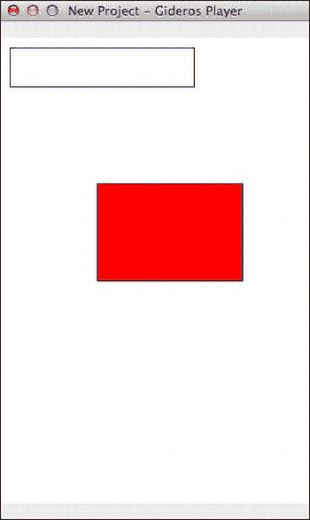

图 9-13.  带轮廓的矩形（上方）和填充色的矩形（下方）

**注意**：请注意上述代码存在一个问题。虽然它能得到预期结果，但如果您尝试重新定位矩形，它会产生少量像素偏移。这主要是因为我们在相对于矩形自身位置的地方绘制线条。我们更恰当的做法是：在位置 `0, 0` 处绘制所有内容，然后将形状移动到起始的 `x,y` 坐标处。

#### 填充形状

Gideros Studio 允许使用纯色或图像填充形状。这有助于实现一些有趣的效果，例如创建图像遮罩或无缝填充纹理。以下是一个使用图像填充形状的示例代码：


```lua
local texture = Texture.new("image.png") setFillStyle(Shape.TEXTURE, texture)
```

——将填充样式设置为带有`image.png`的纹理

我们可以使用这个来创建一个用纹理填充的矩形，方便创建平铺背景等。图 9-14 展示了一个示例。

```lua
function newImgRectangle(x1, y1, x2, y2, lw, lc, imgName)
  local obj = Shape.new()

-- 用于填充的图像
  local img = Texture.new(imgName)
  local lw = lw or 1
  local lc = lc or 0x000000

local wd, ht = x2-x1, y2-y1

obj:clear()
  obj:setLineStyle(lw, lc)
  obj:setFillStyle(Shape.TEXTURE, img)

obj:beginPath()
  obj:moveTo(0,0)
  obj:lineTo(0, ht)
  obj:lineTo(wd, ht)
  obj:lineTo(wd,0)
  obj:lineTo(0,0)
  obj:closePath()
  obj:endPath()

obj:setPosition(x1, y1)

stage:addChild(obj)

return obj
end

newImgRectangle(10, 10, 70, 70, 0, nil, "myImage2.png")
```

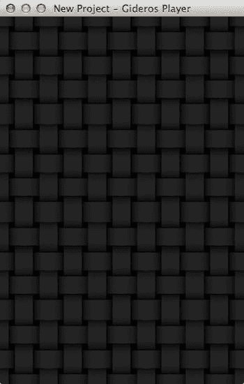

图 9-14. 使用填充形状平铺背景

在这个示例中，如果矩形更大，我们会看到图像被空白区域包围。但 Gideros Studio 也提供了在背景中平铺图像的选项。要使用此功能，只需将加载纹理的代码修改为以下内容：

```lua
local img = Texture.new(imgName, false, {wrap=Texture.REPEAT})
```

现在我们可以用同样的方式尝试这个示例：

```lua
newImgRectangle(10, 10, 220, 220, 1, nil, "myImage2.png")
```

我们甚至可以创建完整的背景图像，如下所示：

```lua
newImgRectangle(0,0,application:getDeviceWidth(),application:getDeviceWidth(), 0, nil, "tile.png")
```

### 绘制其他形状

由于 Gideros Studio 为用户提供了绘制任意形状的画布，因此没有针对线条、矩形、圆形或弧线的内置 API 函数。不过，你可以使用`moveTo`和`lineTo`绘制任何你想要的形状。这允许你创建自己的贝塞尔曲线、弧线、椭圆、圆形等。

**注意**：当你在形状上绘制内容时，它会与随后在形状上已有的内容一起保留。因此，最好在绘制前先调用`obj:clear()`清除形状。

### Application 对象

你可能需要获取设备宽度、设备高度或设备区域设置等细节（例如在制作多语言应用时）。你可能还想知道设备运行的是 iOS 还是 Android 等。Gideros Studio 提供了丰富的函数，允许我们查询`Application`对象来获取这些详细信息。以下是一些示例：

```lua
local width = application:getDeviceWidth()
local height = application:getDeviceHeight()
local model = application:getDeviceInfo()
print("On " .. model .. " (" .. width .. " x " .. height .. " )" )
```

**注意**：保存`Application`对象的变量是`application`，而不是`Application`（注意小写字母 a）。

查看 IDE 中的输出窗格。如果你在设备上运行此程序，输出将是当前运行的设备；如果像本例一样运行桌面版，则根据运行环境会显示“Mac OS”或“Windows”。在移动设备上，`application:getDeviceInfo()`返回多个值。对于 Android，它返回“Android”后跟版本号；对于 iOS 设备，它返回五个值：“iOS”、版本、设备类型、UI 习惯用法和设备型号。以下是在运行 Gideros Player 的 iPhone 上的一些示例输出：

```
iOS 5.1 iPhone iPhone iPhone3,1
```

#### 保持设备唤醒

如果你需要执行一些计算，并担心在此期间设备可能会变暗然后进入睡眠或关机状态，可以通过以下方式确保设备不会变暗：

```lua
application:setKeepAwake(true)
-- 防止设备变暗
```

或者，你可以使用以下代码：

```lua
application:setKeepAwake(false)
-- 允许设备变暗
```

### 方向

如果你需要获取设备在特定时间点的手持方式，可以查询设备的方向，如下所示：

```lua
application:getOrientation()
```

如果需要设置方向，可以使用以下代码：

```lua
application:setOrientation(theOrientation)
```

以下是可供选择的方向选项：

*   `Application.PORTRAIT`
*   `Application.PORTRAIT_UPSIDE_DOWN`
*   `Application.LANDSCAPE_LEFT`
*   `Application.LANDSCAPE_RIGHT`

**注意**：`Application`对象的常量都以大写字母 A 开头，而变量则如前所述以小写字母 a 开头。

你可以使用`setOrientation`将设备定向到所需方式——例如，如果你希望游戏固定在横屏模式，需要在设置中明确指定，或使用`setOrientation`函数更改方向。注意，如果设置了此函数，它将覆盖项目设置。

#### 缩放

开发者面临的挑战之一是确保支持所有屏幕分辨率。许多开发者仍采用的方式是将项目分辨率设置为 320×480，然后对更高分辨率使用自动缩放。缩放模式可以在项目属性窗口中设置，也可以通过代码使用`application:setScaleMode(theMode)`进行设置。图 9-15 展示了缩放选项及其对显示的影响。

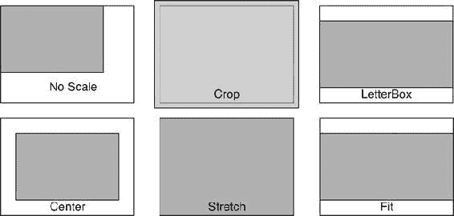

图 9-15. 各种缩放选项的图示

这将缩放屏幕以适应完全不同的分辨率，可选择的设置包括：

*   `Application.NO_SCALE`：不应用缩放，屏幕对齐到左上角。在更大屏幕的设备上，超出项目屏幕尺寸的区域保持空白。
*   `Application.CENTER`：不应用缩放，但屏幕居中显示。
*   `Application.PIXEL_PERFECT`：屏幕设置为设备可用的精确像素。
*   `Application.LETTERBOX`：屏幕以信箱模式显示，两侧出现黑边。
*   `Application.CROP`：缩放后多余的区域被裁剪掉。
*   `Application.STRETCH`：屏幕拉伸以适应设备分辨率，*不*考虑宽高比。
*   `Application.FIT_HEIGHT`：屏幕缩放至设备屏幕的高度。
*   `Application.FIT_WIDTH`：屏幕缩放至设备屏幕的宽度。

### 添加音效

如果你正在创建游戏，添加音效很重要——例如，用铿锵的节拍营造悬念，或用舒缓的旋律伴随平静的时刻。本节将介绍如何为游戏添加音效。

Gideros Studio 的声音库浓缩为几个函数；这些函数足以实现我们刚才讨论的内容。

使用 Gideros Studio 播放声音时，首先要注意有两个不同的对象：`Sound`对象和`SoundChannel`对象。`Sound`对象提供需要播放的数据，而`SoundChannel`对象实际播放声音。

```lua
local mySound = Sound.new("sound.wav")
local theChannel = mySound:play()
```

如果你想播放长音轨并可能循环播放文件，还可以指定声音开始播放的位置以及是否循环播放。

```lua
local channel = mySound:play(startTime, loops)
```

`startTime`默认为 0，`loops`定义声音循环播放的次数。`loops`值为 0（默认值）表示声音不循环，只播放一次；值为 1 表示循环一次；值为 2 表示循环两次，依此类推。如果你希望声音无限循环，可以使用`math.huge`。


## Gideros 声音、事件与定时器

你可以通过 `soundChannel` 对象进一步控制声音（暂停、停止、调节音量等）。以下是一个使用 `soundChannel` 对象按通道调节音量的示例：

```
channel:setVolume(0.5) -- 将通道音量设置为一半
```

### 事件

与大多数框架类似，Gideros 采用异步方式处理事件。当特定情况发生时便会触发事件——例如，用户触摸屏幕、帧更新以及系统事件（如应用启动、挂起、恢复或退出）。表 9-1 列出了 Gideros Studio 处理的事件。

**表 9-1.** Gideros Studio 处理的事件

| 事件类型 | 处理的事件 |
| --- | --- |
| 触摸 | `TOUCHES_BEGIN` `TOUCHES_MOVE` `TOUCHES_END` `TOUCHES_CANCEL` |
| 帧与舞台 | `ENTER_FRAME` `ADDED_TO_STAGE` `REMOVED_FROM_STAGE` |
| 系统与应用 | `APPLICATION_START` `APPLICATION_RESUME` `APPLICATION_SUSPEND` `APPLICATION_EXIT` |
| 声音与定时器 | `COMPLETE` `TIMER` `TIMER_COMPLETE` |
| 鼠标 | `MOUSE_DOWN` `MOUSE_UP` `MOUSE_MOVE` |
| URL 加载器 | `COMPLETE` `ERROR` `PROGRESS` |
| 物理 | `BEGIN_CONTACT` `END_CONTACT` `PRE_SOLVE` `POST_SOLVE` |

#### 触摸事件

应用程序需要设置事件监听器才能监听特定事件。事件监听器可以附加到任何显示对象上。

```
local image = newImage("myImage.png")
function handler(object, event)
  print("收到一个事件")
end

image:addEventListener(Event.TOUCHES_BEGIN, handler, image)
```

事件监听器接收事件、处理函数以及一个额外参数，该参数用于向事件处理函数传递数据。事件处理函数会收到两个参数：我们传递给处理函数的额外数据，以及包含事件相关数据的事件对象。

**注意：** 鼠标事件和触摸事件传递给函数的参数是不同的。触摸事件包含一个名为 `touches` 的记录，而鼠标事件中没有。这主要是因为用户可以用多个手指触摸屏幕——因此，每个 `touches` 记录都包含 `x,y` 坐标和 ID，而鼠标事件则没有。

触摸事件包含两个记录：`touches` 和 `allTouches`。`touches` 是当前触摸点，包含 `x,y` 坐标和 ID，而 `allTouches` 是一个数组，包含所有 `touches` 记录。要获取触发触摸事件的对象，可以使用 `event:getTarget()` 函数。

#### 进入帧事件

你可以设置进入帧事件来实现逐帧动画，例如：

```
local _W = application:getLogicalWidth()
local _H = application:getLogicalHeight()

local xD, yD, speed = 1, 1, 10
local img = newImage("myImage2.png",0,0)
local wd, ht = img:getWidth(), img:getHeight()

function onEnterFrame(event)
local xP, yP = img:getPosition()
xP = xP + xD*speed
yP = yP + yD*speed
if xP >= _W-wd or xP == 0 then xD = -xD end
if yP >= _H-ht or yP == 0 then yD = -yD end
img:setPosition(xP, yP)
end

img:addEventListener(Event.ENTER_FRAME, onEnterFrame)
```

进入帧事件包含一个 `frameCount` 属性，它返回自应用启动以来经过的帧数。`time` 返回自应用启动以来经过的秒数，`deltaTime` 包含上一帧与当前帧之间的时间差。这可用于动画制作，并有助于协调对时间敏感的动画。

#### 系统事件

`stage` 对象在应用生命周期的全程都存在。我们可以像在其他显示对象上一样，在 `stage` 对象上设置监听器。管理系统事件的推荐方式是将其设置在 `stage` 对象上。然而，系统事件类似于广播，它们会被发送给每个设置了监听器的对象，而非仅限于某一个。

```
stage:addEventListener(Event.APPLICATION_START,
    function(event)
      print("已启动")
    end)
```

你还可以监控应用被挂起或恢复的时间，以便保存应用状态，并在应用恢复时重新加载。

### 定时器

你可以通过使用 `Timer.new` 函数在 Gideros Studio 中设置定时器，然后添加一个事件监听器来监听定时器触发。你还可以监听定时器完成事件，该事件在所有定时器循环触发后发生。`loops` 的默认值为 0，这与指示定时器无限循环相同。

```
local theTimer = Timer.new(1000, 5)
theTimer:addEventListener(Event.TIMER,
    function(event)
        print("定时器触发")
    end)
theTimer:addEventListener(Event.TIMER_COMPLETE,
    function(event)
        print("所有定时器循环已完成")
    end)
```

这段代码创建了一个新的定时器，它以设定的频率触发并运行指定的次数。在本例中，频率为 1000 毫秒，循环运行五次。然后必须使用 `start` 函数启动定时器。

```
theTimer:start()
```

现在你可以在输出窗口中看到结果，显示定时器每 1 秒（1000 毫秒）触发一次，并在触发五次后完成。

定时器有一个 `currentCount` 属性（只读属性），用于保存定时器已触发的次数。`repeatCount` 保存定时器应重复的次数，当 `currentCount` 值达到 `repeatCount` 值时，定时器停止。我们可以使用 `reset` 函数将 `currentCount` 设置为 0。你可以使用 `setRepeatCount` 函数设置 `repeatCount`，并使用 `setDelay` 函数更改延迟时间。

定时器可以通过 `start`、`pause` 和 `stop` 函数进行精细控制。此外，所有活动的定时器可以分别使用 `pauseAll`、`resumeAll` 和 `stopAll` 函数暂停、恢复或停止。还可以使用 `isRunning` 函数查询定时器，该函数返回定时器是否正在运行。

如果你需要在延迟后触发一个函数，可以使用 `Timer.delayedCall` 函数。该函数接受三个参数：延迟时间（之后函数被调用）、一个函数以及一个可以传递给该函数的自定义参数。

```
Timer.delayedCall(1000,
    function(msg)
        print("你好 "..msg)
    end,
    "Gideros")
```

#### 自定义事件

你还可以创建自己的事件，这些事件可以被分发，并可以为这些自定义事件设置监听器，如下所示：

```
local theTimer = Timer.new(1000, 5)
theTimer:addEventListener(Event.TIMER,
  function(event)
    theTimer:setRepeatCount(10)
    if theTimer:getCurrentCount() == 4 then
      evt = Event.new("hi")
      stage:dispatchEvent(evt)
    end
  end)

theTimer:addEventListener(Event.TIMER_COMPLETE,
  function(event)
    print("所有定时器循环已完成")
  end)

theTimer:start()

stage:addEventListener("hi",
  function()
    print("你好")
  end)
```

管理自定义事件的方式是使用 `addEventListener` 为特定类型的事件设置事件监听器。使用 `Event` 类通过 `Event.new(eventName)` 创建事件后，当我们想要触发该事件时，可以使用 `dispatchEvent` 函数。

#### 移除事件

事件可以使用 `removeEventListener` 移除，其方式类似于使用 `addEventListener` 添加事件。要添加事件处理函数，可以使用以下方法：

```
object:addEventListener(EventName, evtHandler)
```

同样，以下是移除事件处理函数的方法：

```
object:removeEventListener(EventName, evtHandler)
```

还可以向事件添加额外的数据并将其传递给处理函数。以下是一个示例：

```
local myEvent = Event.new("myEvent")
 myEvent.data1 = "数据一"
 myEvent.data2 = "数据二"

function theFunc(param)
  print("已调用，参数为 \n\t" .. param.data1 .. ", " .. param.data2)
  stage:removeEventListener("myEvent", theFunc)
end

function raiseEvent(msg)
    print(msg)
    myEvent.data1 = msg
    stage:dispatchEvent(myEvent)
end

stage:addEventListener("myEvent", theFunc)
```


-- 调用事件
`print("------------\nInvoking the event")`
`Timer.delayedCall(1000, raiseEvent, "first time")`
`Timer.delayedCall(5000, raiseEvent, "second time")`
`Timer.delayedCall(10000, raiseEvent, "third time")`

程序运行时，定时器最初在 1000 毫秒触发，并调用 `raiseEvent` 处理函数。程序随后打印消息 "first time"，并进而分派自定义事件。当自定义事件被触发时，程序会打印传递给处理函数的参数中的 `data1` 和 `data2` 成员，最后该事件处理函数被移除。

5000 毫秒后，`raiseEvent` 函数再次被调用，打印消息 "second time"，并分派自定义事件。然而，由于我们上次移除了事件监听器，`theFunc` 函数并未被调用。

10000 毫秒后，打印消息 "third time"，但由于事件监听器已不再生效，不会有任何操作发生。

现在，你已经了解了如何设置事件监听器、分派自定义事件以及移除事件监听器。

### 查询事件

如果你已经设置了事件监听器，或者想知道某个特定事件监听器是否已在对象上设置，那么你可以使用 `hasEventListener` 函数。

```
print(stage:hasEventListener("noEvent"))
```

**提示** 自定义或标准事件可以使用 `dispatchEvent` 函数进行分派。这可用于模拟触摸事件，例如在教程中。因此，数据可以被读取并保存在数组或表中，然后传递给模拟用户与应用交互的过程。

### 动画

Gideros Studio 提供了 `MovieClip` 类用于创建动画。它允许创建帧，动画将基于这些帧进行播放。以下是一个代码示例：

```
Local image = newImage("myImage2.png")
```

```
local mc = MovieClip.new{
    {1, 100, sprite, {x = {0, 200, "linear"}}}}
```

这将创建一个 100 帧的动画，使精灵在 x 轴上从 0 到 200 线性变化。要播放动画，我们可以使用 `play` 函数。一旦我们创建了影片剪辑，动画会自动开始播放。

```
mc:play()
```

我们还可以设置在动画到达特定帧后要跳转到的帧。通常动画会按顺序播放下一帧，但我们可以将其设置为另一个帧号。例如，这可用于创建并无限循环播放动画，如下例所示：

```
mc:setGotoAction(100, 1)
```

该命令指示影片剪辑在到达第 100 帧时，将循环回第 1 帧。

与 `gotoAction` 类似，你可以设置 `stopAction`，当动画到达特定帧时停止播放；这可用于将动画分割成多个部分。你可以使用 `clearAction` 函数停止 `gotoAction` 和 `stopAction` 的活动。同样，还有 `gotoAndPlay` 和 `gotoAndStop` 函数，它们分别从 `gotoAndPlay` 指定的帧开始播放，或在 `gotoAndStop` 指定的帧停止。

### 网络与互联网

在你的游戏中，你可能想打开一个指向你网站的链接，或者上传或下载一些数据。在其他情况下，你可能想发送电子邮件或拨打电话号码。本节将描述如何执行这些操作。

导航到网站最简单的方法是使用函数 `application:openUrl(THE_URL)`，其中 URL 可以是以下任意一种：`http:`、`https:`、`tel:` 和 `mailto:`。

要打开一个网页，你可以使用以下代码：

```
application:openUrl("http://www.oz-apps.com ")
```

要发送一封电子邮件，你可以使用以下代码：

```
application:openUrl("mailto:dev.ozapps@gmail.com")
```

你还可以添加主题和消息，如下所示：

```
application:openUrl("mailto:dev.ozapps@gmail.com?subject=Hello Gideros&body=This is a test ")
```

如果你在 iPhone 上运行应用，你还可以使用以下代码拨打电话：

```
application:openUrl("tel:555-7827-9277")
```

在游戏中，你可能想要下载一个文件、一些 JSON 数据或一个包含关卡数据的文本文件。这无法通过 `openUrl` 函数实现。不过，我们可以使用 `UrlLoader` 类。以下是一个示例：

```
local loader = UrlLoader.new("http://example.com/image.png ")

local function onComplete(event)
    local out = io.open("|D|image.png", "wb")
    out:write(event.data)
    out:close()

local b = Bitmap.new(Texture.new("|D|image.png"))
    stage:addChild(b)
end

local function onError()
    print("error")
end

local function onProgress(event)
    print("progress: " .. event.bytesLoaded .. " of " .. event.bytesTotal)
end

loader:addEventListener(Event.COMPLETE, onComplete)
loader:addEventListener(Event.ERROR, onError)
loader:addEventListener(Event.PROGRESS, onProgress)
```

在这段代码中，我们首先创建了一个 `UrlLoader` 的新实例，这将启动下载。`UrlLoader` 的默认方法是 `UrlLoader.GET`。其他选项有 `POST`、`PUT` 和 `DELETE`。当使用 `POST` 或 `PUT` 时，可以将头部信息和数据传递给 URL。

```
local url = " http://www.[yourDomain].com/application.php?userid=gideros&login=guest"

local loader1 = UrlLoader.new(url)
local loader2 = UrlLoader.new(url, UrlLoader.GET) -- 与上一行相同
local loader3 = UrlLoader.new(url, UrlLoader.POST, "my post data")
local loader4 = UrlLoader.new(url, UrlLoader.PUT, "my put data")
local loader5 = UrlLoader.new(url, UrlLoader.DELETE)

local headers = {
    ["Content-Type"] = "application/x-www-form-urlencoded",
    ["User-Agent"] = "Gideros Browser",
}
local loader6 = UrlLoader.new(url, UrlLoader.PUT, headers, "key=value")
```

我们可以设置监听器来监听进度事件、完成事件和错误事件。每次接收到数据块时，都会触发进度事件，事件对象会传递 `bytesLoaded` 和 `bytesTotal`。这可用于跟踪并以字节或百分比形式显示进度。如果出现错误，则会触发错误事件；成功完成后，则会触发完成事件。

### GPS 与罗盘

可以查询设备的 GPS 位置和罗盘位置详情。我们可以通过为 GPS 设置 `Event.HEADING_UPDATE` 事件监听器，以及为罗盘设置 `Event.LOCATION_UPDATE` 事件监听器来获取这些读数，如下所示：

```
require "geolocation"

function onHeadingUpdate()

end

function onLocationUpdate(event)
  latitude  = event.latitude
  longitude = event.longitude
  altitude  = event.altitude
  print(latitude, longitude, altitude)
end

function onHeadingUpdate(event)
  local tHeading = event.trueHeading
  local mHeading = event.magneticHeading
  print(tHeading, mHeading)
end

geolocation:addEventListener(Event.HEADING_UPDATE, onHeadingUpdate)
geolocation:addEventListener(Event.LOCATION_UPDATE, onLocationUpdate)
geolocation:start()
```

你可以通过使用 `isAvailable` 函数来检查硬件是否支持 GPS，或者用户是否已启用 GPS 功能。你还可以通过 `geolocation` 对象上的 `isHeadingAvailable` 函数来检查方向详情的可用性。

你可以分别使用 `startUpdatingHeading` 和 `startUpdatingLocation` 函数来开始更新方向和位置信息，并使用 `stopUpdatingHeading` 和 `stopUpdatingLocation` 函数来停止更新。

### 加速度计

如果设备有加速度计，`Accelerometer` 类用于访问加速度计数据。为了能够访问加速度计，你需要调用 `require "accelerometer"`，当加载完毕后，会创建一个 `Accelerometer` 类型的变量。可以通过 `accelerometer` 来访问它。然后你可以在 `accelerometer` 对象上调用 `start` 函数。如果由于任何原因（包括节省电池寿命或防止触发不必要的事件）需要随时停止加速度计，你可以调用 `stop` 函数。


```lua
require "accelerometer"
accelerometer:start()
function onEnterFrame(event)
    local x, y, z = accelerometer:getAcceleration()
    print(x, y, z)
end
stage:addEventListener("enterFrame", onEnterFrame)
```

**注意**：在桌面播放器上运行此代码将只显示一系列零，因为桌面播放器没有加速度计。要测试此代码，应在设备播放器上运行。

### 陀螺仪

所有新的 iOS 设备都配有陀螺仪，可以从设备读取数据。首先，我们使用`require "gyroscope"`命令，这会创建一个名为`gyroscope`的变量，属于`Gyroscope`类。

使用`getRotationRate`函数读取陀螺仪数据，该函数返回以弧度表示的旋转速率。

```lua
require "gyroscope"
gyroscope:start()
local angx, angy, angz = 0,0,0
function onEnterFrame(event)
    local x, y, z = gyroscope:getRotationRate()

angx = angx + x * event.deltaTime
    angy = angy + y * event.deltaTime
    angz = angz + z * event.deltaTime

print(angx * 180 / math.pi, angy * 180 / math.pi, angz * 180 / math.pi)
end
stage:addEventListener("enterFrame", onEnterFrame)
```

### 物理引擎

Gideros Studio 提供了一个基于 Box2D 的封装以使用物理引擎。要在 Gideros Studio 中使用物理引擎，你需要使用`require "box2d"`，这会创建一个名为`b2`的局部变量，类型为`Box2D`，并提供所有物理相关的函数。

接下来需要创建一个物理世界，用于容纳物理对象。以下代码展示了一个示例。

**注意**：在 Gideros Studio 中，物理对象需要更新以让动态物理体同步更新；通常通过监听`enter_frame`事件来实现。

```lua
require "box2d"

local world = b2.World.new( 0 , 9.8) -- 设置重力
local ground = world:createBody({})

local shape = b2.EdgeShape.new(0, 480, 320, 480)
shape:set(-20, 290, 620, 290)
ground:createFixture({shape = shape, density = 0})

local shape = b2.PolygonShape.new()
shape:setAsBox(10,10)
local fixture = {shape = shape, density = 1, friction = 0.3}

local x, y = 100, 10
bodyD = {type = b2.DYNAMIC_BODY, position={x=x, y=y}}
body = world:createBody(bodyD)
body:createFixture(fixture)

function onEnterFrame()
  world:step(1/60, 8, 3)
end

stage:addEventListener(Event.ENTER_FRAME, onEnterFrame)
```

运行程序时，你会注意到没有任何反应。这是因为我们需要在屏幕上放置一个对象，并让它随着物理体的移动而更新。

因此，我们可以添加一个图像来代表这个物理体，并在屏幕上更新它。

```lua
local img = Bitmap.new(Texture.new("image2.png"))
img:setAnchorPoint(0.5,0.5)
stage:addChild(img)
```

然后，我们重新定义`onEnterFrame`函数如下：

```lua
function onEnterFrame()
  world:step(1/60, 8, 3)
  img:setPosition(body:getPosition())
end
```

图像会显示在动态体的中心位置。`world:step`函数用于更新物理体，它接受三个参数：第一个是`timeStep`，决定更新时间步长；另外两个参数分别是`velocityIterations`（速度迭代次数）和`positionIterations`（位置迭代次数）。速度和位置的迭代次数决定了计算物理体下一时刻速度和位置所需的计算量。

### 插件

Gideros Studio 的一个优势是你可以创建自己的插件，通过引入当前不具备的功能来扩展其能力。

**注意**：BhWax 插件（在[第 13 章]中讨论）提供了对 iOS API 的完全访问，你可以用它创建 UIWindow、UIView、UIKit 对象，几乎可以操作 Apple API 提供的所有功能。

Gideros 插件的骨架结构如下：

```c
#include "gideros.h"
#include "lua.h"
#include "lauxlib.h"

static int myFunc(lua_State *L)
{
  int first  = lua_tointeger(L, -1);
  int second = lua_tointeger(L, -2);
  int result = first + second;

lua_pushinteger(L, result);
  return 1;
}

static int luaMy_func(lua_State *L)
{
  const luaL_Reg functionlist[] = {
    {"myFunc", myFunc},
    {NULL, NULL},
  };
  luaL_register(L, "myPlugin", functionlist);
}

static void g_initializePlugin(lua_State *L)
{
  lua_getglobal(L, "package");
  lua_getfield(L, -1, "preload");

lua_pushcfunction(L, luaMy_func);
  lua_setfield(L, -2, "test");

lua_pop(L, 2);
}

static void g_deinitializePlugin(lua_State *L) {
}

REGISTER_PLUGIN("Test", "1.0")
```

这些插件可以用 C++、Objective-C 或 C 编写。首先，我们需要包含所需库的头文件：`gideros.h`，它提供了 Gideros 引擎的入口点；`lua.h`，用于访问 Lua 函数；以及`luaxlib.h`，提供了 Lua 接口函数。

我们需要编写两个函数和一个宏来注册我们的插件。

`g_initializePlugIn` 是初始化插件的入口点，在插件首次加载时调用；`g_deinitializePlugin` 在 Lua 不再需要该插件时（例如，卸载时）被调用。宏`REGISTER_PLUGIN` 用于注册插件，使其可在 Gideros Studio 中使用。

初始化插件时，我们使用`package.preload`函数并加载所需的函数。在上述示例代码中，我们通过调用`luaMy_func`函数来初始化插件。

在 Gideros Studio 中，要在 Lua 代码中使用此插件，首先需要引用（require）该库：

```lua
require "test"
local result = Test.myFunc(10,20)
print("The sum is : ", result)
```

要编写插件代码，请参考 Lua C API 文档（[`www.lua.org/manual/5.2/manual.html#4`](http://www.lua.org/manual/5.2/manual.html#4)）。插件类似于 Lua 字节码命令，C 代码可以与 Lua C API 混合使用。

以下 Lua 代码：

```lua
a = f("how", t.x, 14)
```

如果用 Lua C API 编写，则如下所示：

```lua
lua_getglobal(L, "f");
lua_pushstring(L, "how");
lua_getglobal(L, "t");
lua_getfield(L, -1, "x");
lua_remove(L, -2);
lua_pushinteger(L, 14);
lua_call(L, 3, 1);
lua_setglobal(L, "a");
```

**注意**：更多详细信息可以在 Lua 网站（[`www.lua.org`](http://www.lua.org)）上找到。由于 C 相关代码超出了本书的讨论范围，此处不再详述。

当你想要使用该插件时，需要将其添加到 Gideros Player（测试阶段）或 Xcode 中，并在最终构建时编译。对于桌面播放器，代码需要编译为动态库（`.dylib`）并存放在相应目录中。

如果你打算分发插件给其他用户使用，需要将其构建为库。所需的文件包括：

*   `.dll`：用于 Windows 桌面播放器
*   `.dylib`：用于 Mac 桌面播放器
*   `.so`：用于 Android 设备播放器
*   `.a`：用于 iOS 设备播放器

**注意**：编程语言的选择也决定了插件可运行的平台。用 C 或 C++ 编写的插件可以同时用于 iOS 和 Android 设备。用 Java 编写的插件只能用于 Android，而用 Objective-C 编写的插件只能用于 iOS。

## 总结

Gideros Studio 是一个在 Windows 和 Mac OS X 上完整的开发包，包含一系列用于开发和测试应用程序的工具。如果框架本身不能满足你的需求，或者你想通过添加一些额外代码（例如 C、C++、Objective-C 或 Java）来扩展应用，你可以通过 Lua API 桥接将代码封装成插件来实现。Gideros Studio 是一个不断发展且拥有不断壮大社区支持的框架。该框架与 ActionScript 非常相似，因此对于 ActionScript 3 开发者来说易于上手。Corona SDK 定位为易用型框架（也确实如此），而 Gideros Studio 则通过提供插件来填补其空白。虽然在 Gideros Studio 中像在屏幕上显示图像这样的简单任务可能略显复杂，但它允许你维护一个函数库以实现更简单的使用，正如本章示例所示。


## Moai 框架概述

在本章中，我们将介绍另一个框架：Moai。在开发跨平台移动应用程序的众多选项中，Moai 是专业游戏开发者的工具。它是一个开源平台，提供了封装在 Lua 中的 C++ 类。这些类可用于为多种平台开发基本的 2D 和 3D 游戏：iOS、Android、Windows、Mac OS X 和 Chrome。Moai 以免费使用的 Moai SDK 形式提供，但需要在应用中显示“Made with Moai”启动画面或在游戏致谢中提及。Moai 还提供付费服务 Moai Cloud Services，可以集成在使用 Moai 或不使用 Moai 构建的应用中。

## 什么是 Moai？

Moai 的创意源于其开发者，他们都是游戏行业的资深人士。它并不适合只想快速制作应用的个人爱好者；Moai 的学习曲线可能会有些陡峭。不过，这个小小的障碍可以通过 RapaNui 在某种程度上克服，它是一个开源层，通过一些高级 API 提供 Moai 的功能（详见第 13 章）。一些商业应用已经使用 Moai 开发，还有更多正在开发中。几乎所有这些应用都达到了大工作室所期望的 A 级卓越水准，并且大多数拥有巨大的下载量。Moai 的核心是 C++ 库，它们帮助你编写适用于移动设备、浏览器和桌面的跨平台应用程序。然而，Lua 接口消除了处理这些复杂库的需要。这些封装在 Lua 中的 C++ 库还允许访问许多底层函数。一旦你掌握了应用开发（尤其是游戏开发）的基础知识，Moai 便是一个符合逻辑的专业工具集选择。

## 获取 Moai

你的第一步是在 Moai 上创建一个账户，然后下载 SDK。你可以从以下选项中选择：

*   SDK 发布版本 1.3 (构建 98)
*   SDK 开发者构建版本 1.3 (构建 102)
*   Moai 源代码

开箱即用，Moai 没有像 Gideros Studio 那样的 IDE 或工具。然而，它确实包含了用于测试 Lua 代码的 `moai` 二进制文件。当你解压 ZIP 文件（所有平台的压缩包相同）后，`bin` 目录包含了所有平台的库，以及用于 Windows 和 Mac OS X 的可执行文件（这些可执行文件充当测试 Moai 代码的模拟器）。

## Moai SDK

开始使用 Moai 进行开发，你首先需要一个文本编辑器（第 13 章讨论了一些替代方案），因为没有集成 Moai 开发环境的 IDE（不过 ZeroBrane 填补了这一空白，但 Moai 默认不包含它）。

`bin` 目录包含用于 Windows 和 Mac 的可执行文件；你可以在终端窗口中运行 `moai`，并将要运行的 Lua 文件传递给它。对于 Windows，传递 `moai.exe main.lua`；对于 Mac OS X，传递 `moai main.lua`。

如果你通过 `run.bat` 或 `run.sh` 运行 samples 文件夹中的 Hello Moai 代码，你应该会在屏幕上看到如图 10-1 所示的输出。

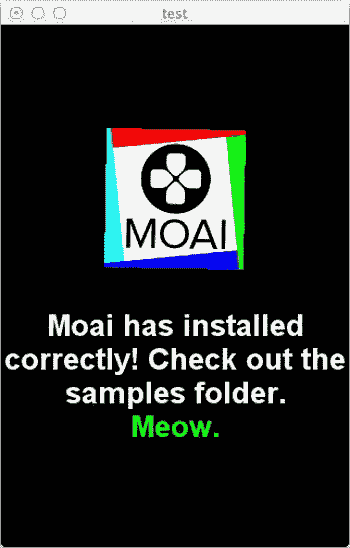

图 10-1. 正在运行示例应用的 Moai 模拟器

## Hello Moai

要让一个 Moai 应用运行起来，我们需要做几件事。首先，我们需要一个窗口来显示我们的应用程序，这个窗口在桌面上也充当模拟器。我们使用 `MOAISim` 类创建一个窗口，并调用 `openWindow` 函数。`openWindow` 函数接受三个参数：标题、宽度和高度。

```
MOAISim.openWindow("Hello World 窗口", 320,480)
```

然后我们需要创建一个视口。由于 Moai 使用 OpenGL，要创建一个绘制表面，我们需要设置用于渲染的表面大小。这个矩形区域被称为*视口*。在我们开始渲染之前，需要创建并设置好视口。方法如下：

```
viewport = MOAIViewport.new()
viewport:setSize(320,480)
viewport:setScale(320,480)
```

我们可以将大小设置为特定尺寸，或者不向 `setSize` 函数传递任何参数来简单地使用整个表面。所有渲染都基于单位；这些单位不一定与像素相同。但是，您可以使用 `setScale` 函数来设置这些单位。这些单位通过根据视口的大小和比例设置进行计算来定义渲染像素的大小。像素的大小由以下两个公式确定：

```
pixelsizeX = viewportSizeWidth / viewportScaleX
pixelsizeY = viewportSizeHeight / viewportScaleY
```

大小为 320×480，比例为 320、480，则将像素大小设置为 1。在大小为 320×480 的表面上设置比例为 10、15，将得到像素大小为 32×32。在大小为 640×960 的表面上使用相同的比例 10、15，则会得到像素大小为 64×64。在这种情况下，您会看到显示拉伸以填充空间。

Moai 中的坐标系以原点 (0,0) 位于屏幕中心进行组织。y 轴正方向朝上。值为 100 的点在屏幕上的位置高于像 20 这样的较低值。您可以通过将比例设置为负值来反转轴，从而获得负比例：

```
viewport:setScale(320, -480)
```

还可以使用 `setOffset` 函数更改视口。偏移量是在一个设置为 2×2 的投影空间中设置的。将偏移量设置为 −1, 1 会将投影系统向左移动一半，向上移动一半。这将有效地将原点置于屏幕的左上角。

```
viewport:setOffset(-1,1)
```

Moai 不会直接渲染任何精灵、图像或显示对象；相反，这些对象会被渲染到*图层*上。多个图层可以相互堆叠。每个图层都需要与一个视口关联。

```
layer = MOAILayer2D.new()
layer:setViewport(viewport)
```

然后，在渲染之前，需要将该图层推入渲染栈。

```
MOAISim.pushRenderPass(layer)
```

一旦我们设置了用于渲染的图层，我们就需要一个显示对象来显示在这个图层上。在 Moai 中，场景图对象被称为*道具*；它是表面上的位置和对象表示的组合。几何体或对象的表示（例如，三角形、四边形或样条曲线）保存在称为*组*的东西中。一个组可以包含多个几何体项目，也可以被称为*集合*。

有几种类型的组可供选择：

*   `MOAIGfxQuad2D`：这是一个单纹理四边形。
*   `MOAIGfxQuadDeck2D`：这是一个纹理四边形数组（来自同一纹理）。这类似于我们所说的精灵表。
*   `MOAIGfxQuadListDeck2D`：这是一个纹理四边形列表的数组（来自同一纹理）。可用于高级精灵表。
*   `MOAIMesh`：这是一个自定义顶点缓冲区对象（用于 3D）。
*   `MOAIStretchPatch2D`：这是一个包含可伸缩行和列的单个补丁。
*   `MOAITileDeck2D`：用于创建通过索引访问的瓦片地图和精灵表。纹理被分为 *n×m* 个瓦片，所有瓦片大小相同。可用于帧动画。

我们可以使用 `MOAIGfxQuad2D` 类创建一个单纹理四边形，并加载一个图像作为四边形的纹理：

```
gfxQuad = MOAIGfxQuad2D.new()
gfxQuad:setTexture("myTile.png")
gfxQuad:setRect(-32,-32, 32, 32)
```

创建四边形后，我们需要创建一个道具来显示该四边形。我们使用 `setRect` 函数设置矩形区域，这类似于设置四边形的尺寸：

```
prop = MOAIProp2D.new()
prop:setDeck(gfxQuad)
prop:setLoc(32,32)
```

最后，我们需要将这个道具添加到图层中，以便渲染：

```
layer:insertProp(prop)
```

完整的代码块如下所示。当我们运行它时，会在屏幕上看到图像。

```
MOAISim.openWindow ( "test", 320, 480 )

viewport = MOAIViewport.new ()
viewport:setSize ( 320, 480 )
viewport:setScale ( 320, 480 )
```


```lua
layer = MOAILayer2D.new ()
layer:setViewport ( viewport )
MOAISim.pushRenderPass ( layer )

gfxQuad = MOAIGfxQuad2D.new ()
gfxQuad:setTexture ( "moai.png" )
gfxQuad:setRect ( -64, -64, 64, 64 )

prop = MOAIProp2D.new ()
prop:setDeck ( gfxQuad )
prop:setLoc ( 0, 80 )
layer:insertProp ( prop )
```

与`Corona SDK`和`Gideros Studio`相比，在屏幕上显示一张图片似乎略显繁琐。这正是`Moai`被称为*专业*开发者工具的原因。它提供了对非常丰富的 API 的低级访问权限。然而，这并不意味着业余开发者不能使用`Moai`。如前所述，你可以使用`RapaNui`库，它为开发者提供了一个易于使用的高级封装，封装在`Moai`的低级 API 之上。`RapaNui`将所有`Moai`函数包装成更易用的函数，并减少了你完成工作所需编写的代码行数。

`Quads`也可以被*固定*，或者如`Moai`所描述的，可以设置其枢轴点；枢轴点是四边形旋转的中心点，(默认情况下) 0, 0 是中心。这类似于`Gideros`中的`anchorPoint`或`Corona`中的`referencePoint`：

```
prop:setPiv(xCenter, yCenter)
```

## 显示文本

在`Moai`中，可以使用 TrueType 字体或位图字体显示文本。`MOAITextBox`是用于在`Moai`中处理文本的类。

### TrueType 字体

显示文本最简单的方法是使用 TrueType 字体。你可以使用`MOAIFont`类创建一个新的字体对象，并向其传递要从字体加载的字符、字号（以点为单位）以及字体的 dpi。

```
charcodes = "abcdefghijklmnopqrstuvwxyzABCDEFGHIJKLMNOPQRSTUVWXYZ0123456789,.?!:()&/-"
font = MOAIFont.new()
font:loadFromTTF( 'arial.ttf', charcodes, 12, 163 )
```

然后你可以使用`MOAITextBox`创建一个文本框来显示文本：

```
textbox = MOAITextBox.new()
textbox:setFont(font)
textbox:setRect(-160, -80, 160, 80)
textbox:setLoc(0,160)
textbox:setAlignment(MOAITextBox.CENTER_JUSTIFY)
layer:insertProp( textbox )

textbox:setString( "来自 MOAI 的 Hello World" )
```

**注意：** 传递给`MOAIFont`函数的字符会被创建为纹理并缓存，如果使用了新的字形，它们会被动态创建并缓存，从而在渲染文本时提供更快的速度。

### 位图字体

另一种显示文本的方法是使用位图字体（来自图像文件），其中每个字形（字符）由纯色参考线分隔，如图 10-2 所示。这种方式使得创建位图字体变得容易；但是，这种格式不支持字距调整。

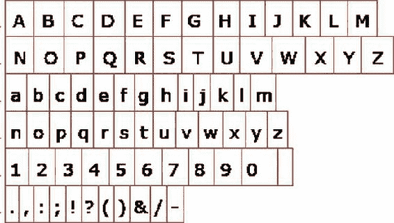

图 10-2 . 带有轮廓以指示字形尺寸的位图字体

要使用位图，你可以使用`MOAIBitmapFontReader`，并通过新创建的`bitmapFontReader`对象的`loadPage`函数加载字形。

```
charcodes = "ABCDEFGHIJKLMNOPQRSTUVWXYZabcdefghijklmnopqrstuvwxyz1234567890 .,:;!?()&/-"
font = MOAIFont.new()

bitmapFR = MOAIBitmapFontReader.new()
bitmapFR:loadPage( "Font.png", charcodes, 16 )

font:setReader( bitmapFR )
```

如果你使用像`Glyph Designer`（来自 71²；请参阅[www.71squared.com/](http://www.71squared.com/)）这样的应用来创建一个包含与位图图像文件相关数据的`.fnt`文件，你可以使用`MOAIFont`类中的`loadFromBMFont`函数，如下所示：

```
charcodes = "ABCDEFGHIJKLMNOPQRSTUVWXYZabcdefghijklmnopqrstuvwxyz1234567890 .,:;!?()&/-"
font = MOAIFont.new()

font:loadFromBMFont( "Font2.png" )
font:preloadGlyphs(charcodes, 64)
```

### 文本属性

`MOAITextBox`可以显示文本，可以使用`setString`函数进行修改。请注意，文本可以包含改变文本颜色的嵌入代码，类似于 HTML 标签：

```
textbox:setString("这段文字是<c:ff0000>红色<c>，而这一段是<c:00ff00>绿色<c>。")
```

改变颜色的标签以`<c:*xxxxxx*>`开头，以`<c>`结尾。*xxxxxx* 是颜色的十六进制值（采用`RRGGBBAA`格式）。你也可以对较低精度的颜色代码使用`<c:*xxx*>`和`<c:*xxxx*>`。

### 文本样式

你可以改变文本的字体、字号和颜色。我们刚刚讨论了如何使用`<c>`标签改变颜色，以及在创建`MOAIFont`对象时传入字号。如果你想创建在其他框架中需要不同字号字体的文本，你需要创建多个不同大小的`textbox`对象，然后相应地定位它们。然而，使用`Moai`，你可以创建可用于此目的的样式，也可以用于改变字体和颜色。这些样式可以像颜色`<c>`标签一样嵌入到文本中：

```
function newStyle(font, size)
  local style = MOAITextStyle.new()
  style:setFont(font)
  style:setSize(size)
  return style
end
textbox:setStyle(newStyle(font, 24))
textbox:setStyle( "foo", newStyle(font, 32))
textbox:setStyle("bar", newStyle(font, 48))
text = "这段文字是<foo>大号</>而这个是<bar>更大号</>，都比普通文字大。"
textbox:setString(text)
```

**注意：** 标签可以嵌套但绝不能重叠——也就是说，在关闭父标签之前，必须先关闭子标签。

### 对齐文本

创建`MOAITextBox`后，你可以更改其属性。可以使用`setAlignment`函数改变文本对齐方式。传递给`setAlignment`的参数可以是以下之一：

*   `MOAITextBox.LEFT_JUSTIFY`
*   `MOAITextBox.RIGHT_JUSTIFY`
*   `MOAITextBox.CENTER_JUSTIFY`

### 文本动画

`MOAITextBox`有一个`spool`函数，允许逐字逐句地显示文本。这在显示文本时提供了一些有趣的效果。

```
textbox:spool()
```

## 绘制矢量图元

`Moai`使用`MOAIDeck`类来创建一个画布，在其上可以进行绘制操作。所有绘制都在画布的局部空间中进行。

在绘制之前，你必须创建一个`MOAIScriptDeck`类型的对象，如下所示：

```
scriptDeck = MOAIScriptDeck.new()
```

需要注意的是，`Moai`的绘制坐标与大多数框架不同。大多数其他框架将左上角作为 (0,0)，而`Moai`将中心点作为 (0,0)。这样，一个 320×480 的屏幕在 x 轴上的两个方向各延伸 160 像素，在 y 轴上各延伸 240 像素。

`scriptDeck`对象依赖于一个回调函数来管理`scriptDeck`的绘制，该回调函数可以使用`setDrawCallback`函数设置。回调函数具有参数`index`、`xOffset`、`yOffset`、`xScale`和`yScale`。`index`确定需要重绘的画布，偏移量和缩放有助于绘制。

`MOAI`绘制类允许绘制以下所有内容：

*   线
*   矩形
*   填充矩形
*   圆形
*   填充圆形
*   椭圆
*   填充椭圆
*   多边形
*   点
*   绘制属性

### 绘制线条

可以使用`drawRay`函数绘制单条线，其语法为`MOAIDraw.drawRay(x, y, dx, dy)`。`x`和`y`是绝对坐标，`dx`和`dy`是从`x`和`y`坐标延伸出的线条方向。

### 绘制矩形

绘制矩形最简单的方法是使用语法`MOAIDraw.drawRect(x1, y1, x2, y2)`。它接受四个参数：矩形起始点的 x 和 y 坐标，以及包围矩形的端点。下面的代码在屏幕上绘制一个矩形，如图 10-3 所示。

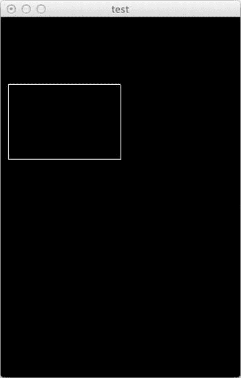

图 10-3 . 绘制带有描边（边框）的矩形

```
MOAISim.openWindow ( "test", 320, 480 )

viewport = MOAIViewport.new ()
viewport:setSize ( 320, 480 )
viewport:setScale ( 320, -480 )

layer = MOAILayer2D.new ()
layer:setViewport ( viewport )
MOAISim.pushRenderPass ( layer )

function onDraw ( index, xOff, yOff, xFlip, yFlip )
  MOAIDraw.drawRect(-150,-150,0,-50)
end
```


```lua
scriptDeck = MOAIScriptDeck.new ()
scriptDeck:setRect (-64, -64, 64, 64 )
scriptDeck:setDrawCallback ( onDraw )

prop = MOAIProp2D.new ()
prop:setDeck ( scriptDeck )
layer:insertProp ( prop )
```

## 绘制填充矩形

你可以使用 `MOAIDraw.fillRect(x1, y1, x2, y2)` 函数来绘制填充矩形。该函数接受四个参数，与 `drawRect` 函数类似。填充颜色通过 `MOAIGfxDevice.setPenColor` 函数设置。下面的代码在屏幕上绘制了一个填充矩形，如下图 图 10-4 所示。

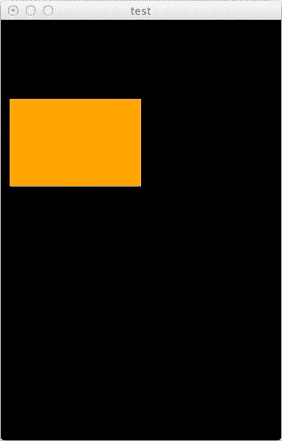

图 10-4 .  绘制一个带有填充色且无描边的矩形

```lua
MOAISim.openWindow ( "test", 320, 480 )

viewport = MOAIViewport.new ()
viewport:setSize ( 320, 480 )
viewport:setScale ( 320, -480 )

layer = MOAILayer2D.new ()
layer:setViewport ( viewport )
MOAISim.pushRenderPass ( layer )

function onDraw ( index, xOff, yOff, xFlip, yFlip )
  MOAIGfxDevice.setPenColor(1, 0.64, 0, 1)
  MOAIDraw.drawRect(-150,-150,0,-50)
end

scriptDeck = MOAIScriptDeck.new ()
scriptDeck:setRect ( -64, -64, 64, 64 )
scriptDeck:setDrawCallback ( onDraw )

prop = MOAIProp2D.new ()
prop:setDeck ( scriptDeck )
layer:insertProp ( prop )
```

## 绘制圆形

你可以使用 `drawCircle` 函数来绘制圆形。其语法为 `MOAIDraw.drawCircle(xPos, yPos, radius, steps)`，其中 `xPos` 和 `yPos` 是圆心坐标，`radius` 决定要绘制的圆的半径，`steps` 决定绘制圆所用的*精细度*（即线段数量）。`steps` 的推荐值为 100。

```lua
function onDraw ( index, xOff, yOff, xFlip, yFlip )
  MOAIDraw.drawCircle(0, 0, 100, 100)
end
```

## 绘制填充圆形

你可以使用 `fillCircle` 函数来绘制填充圆形。其语法为 `MOAIDraw.fillCircle(xPos, yPos, radius, steps)`，这与未填充的圆形相同。笔触颜色决定了圆的填充色。

```lua
function onDraw ( index, xOff, yOff, xFlip, yFlip )
  MOAIGfxDevice.setPenColor(1, 0.64, 0, 1)
  MOAIDraw.fillCircle(0, 0, 100, 100)
end
```

## 绘制椭圆

要绘制椭圆，你可以使用 `drawEllipse` 函数。其语法为 `MOAIDraw.drawEllipse(xPos, yPos, xRadius, yRadius, steps)`，其中 `xPos` 和 `yPos` 是中心坐标，`xRadius` 和 `yRadius` 决定了椭圆的纵向和横向半径，`steps` 决定了精细度。`steps` 的推荐值为 100。

```lua
function onDraw ( index, xOff, yOff, xFlip, yFlip )
  MOAIDraw.drawEllipse(0, 0, 100, 100)
end
```

## 绘制填充椭圆

类似地，你可以使用 `fillEllipse` 函数来绘制填充椭圆。其语法与常规椭圆相同，笔触颜色决定了填充色。

```lua
function onDraw ( index, xOff, yOff, xFlip, yFlip )
  MOAIDraw.drawEllipse(0, 0, 100, 100)
end
```

## 绘制多边形

要绘制多边形，你需要定义一系列顶点并将其传递给 `drawLines` 函数。这些顶点是屏幕上的绝对坐标点，而非相对于上一个坐标的偏移。

```lua
function onDraw ( index, xOff, yOff, xFlip, yFlip )
  MOAIDraw.drawLines(-50,50,50,50,50,-50,-50,-50,-50,50)
end
```

## 绘制点

`drawPoints` 函数可用于在给定的顶点列表处绘制点。以下代码给出了使用 `MOAIDraw.drawPoints` 函数的示例，其结果如图 图 10-5 所示。

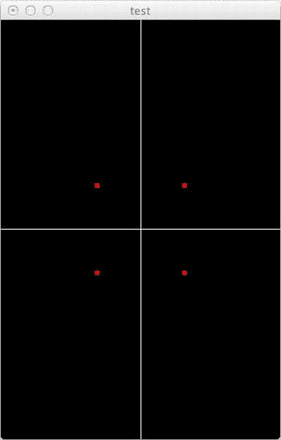

图 10-5 .  象限中设置的点，展示了 Moai 中的坐标系

```lua
function onDraw ( index, xOff, yOff, xFlip, yFlip )
  MOAIDraw.drawRay ( 0, 0, 1, 0)
  MOAIDraw.drawRay ( 0, 0, 0, 1)
  MOAIGfxDevice.setPointSize(5)
  MOAIGfxDevice.setPenColor(1,0,0,1)
  MOAIDraw.drawPoints(-50,50,50,50,50,-50,-50,-50,-50,50)
end
```

## 绘制属性

`MOAIDraw` 绘制矢量图元的画布称为 `MOAIGfxDevice`。你可以查询并设置某些绘制属性，例如颜色、线宽和点大小。本节将逐一介绍这些属性。

### 颜色

`MOAIGfxDevice.setPenColor` 函数用于设置绘制和填充的颜色。设置颜色的语法为 `setPenColor(r, g, b, a)`。`r`、`g`、`b` 和 `a` 的值在 0 到 1 的范围内。例如，以下代码将颜色设置为绿色：

```lua
MOAIGfxDevice.setPenColor(0,1,0,1)
```

### 线宽

`MOAIGfxDevice.setPenWidth` 函数用于设置在该函数调用之后绘制的所有线条的宽度。该函数接受一个宽度值，该值决定了线条的粗细，通常以正整数单位表示。

```lua
function onDraw ( index, xOff, yOff, xFlip, yFlip )
  MOAIGfxDevice.setPenWidth(3)
  MOAIGfxDevice.setPenColor(1,0,0,1)
  MOAIDraw.drawRect(-50,-50,50,50)
end
```

### 点大小

`MOAIGfxDevice.setPointSize` 函数用于设置使用 `drawPoints` 函数绘制的点的大小，通常以正整数单位表示。

```lua
function onDraw ( index, xOff, yOff, xFlip, yFlip )
  MOAIDraw.drawRay ( 0, 0, 1, 0)
  MOAIDraw.drawRay ( 0, 0, 0, 1)
  MOAIGfxDevice.setPointSize(5)
  MOAIGfxDevice.setPenColor(1,0,0,1)
  MOAIDraw.drawPoints(-50,50,50,50,50,-50,-50,-50,-50,50)
end
```

## 绘制图像

你已经了解到，在屏幕上创建显示对象的方法是通过创建一个需要添加到图层的 `MOAIProp`。类似地，要显示图像，你需要通过创建一个四边形对象（并为其设置纹理为要加载的图像）来创建 `MOAIProp` 对象。然后，这可以设置为合牌对象。

```lua
gfxQuad = MOAIGfxQuad2D.new ()
gfxQuad:setTexture ( "moai.png" )
gfxQuad:setRect ( -64, -64, 64, 64 )

prop = MOAIProp2D.new ()
prop:setDeck ( gfxQuad )
prop:setLoc ( 0, 80 )
layer:insertProp ( prop )
```

## 绘制自定义图像

你可以使用 `MOAIImage` 类创建一个空白图像作为画布，如下所示：

```lua
local image = MOAIImage.new()
image:init(width, height)
```

**注意：** 你创建的图像必须是 2 的幂次方大小——也就是说，宽度和高度必须是 2 的幂次方数。在动态创建图像时，如果你创建的图像不符合 2 的幂次方要求，可以使用 `padToPow2` 函数将图像填充到所需的大小。

创建的这个图像对象随后可用于创建 `Quad2D` 对象，并将其添加到图层中。

```lua
gfxQuad = MOAIGfxQuad2D.new ()
gfxQuad:setTexture ( image )
gfxQuad:setRect ( -64, -64, 64, 64 )

prop = MOAIProp2D.new ()
prop:setDeck ( gfxQuad )
layer:insertProp ( prop )
```

这段代码不会显示任何内容，因为创建的图像是空白图像。在下面的代码中，我们在内存中创建了一个位图并将其显示到屏幕上。这是通过代码创建动态图像的好方法。

```lua
local image = MOAIImage.new()
image:init(25, 40)
image:padToPow2()
image:fillRect(-70,-70,150,150,1,1,1,1)
image:fillRect( 20,20,50,50,1,0.6,0,1)

gfxQuad = MOAIGfxQuad2D.new ()
gfxQuad:setTexture ( image )
gfxQuad:setRect ( -64,-64,64,64 )

prop = MOAIProp2D.new ()
prop:setDeck ( gfxQuad )
layer:insertProp ( prop )
```

## 加载图像

可以使用 `load` 函数将图像加载到 `MOAIImage` 对象中，如下所示：

```lua
theImage = MOAIImage.new ()
theImage:load( "myImage2.png" )
```

加载图像后，你可以对其执行各种操作并应用变换。

## 复制图像

你可以使用 `copyRect` 或 `copyBits` 函数从另一个图像复制图像。请注意，`copyBits` 会复制源图像（此操作无法进行缩放或翻转）；源图像中的矩形区域可以被复制到目标图像的指定位置。以下是使用 `copyBits` 函数的示例：

```lua
srcImage = MOAIImage.new ()
srcImage:load ( "myImage2.png" )
iWd, iHt = srcImage:getSize()
destImage = MOAIImage.new()
destImage:init(64,64)
destImage:copyBits(srcImage,0,0,0,0,iWd, iHt)
```


如果你想能够缩放或翻转图像，可以使用`copyRect`函数，该函数将源图像中的一个矩形区域复制到目标图像中。你可以通过反转矩形的最小/最大参数来翻转图像。此函数将按照`srcMin`和`srcMax`指定的尺寸，将源图像绘制到`destMin`和`destMax`指定的目标区域中。如果目标尺寸更大，图像会放大；如果更小，图像会缩小。

```
copyRect(source, srcXMin, srcYMin, srcXMax, srcYMax, destXMin, destYMin, destXMax, destYMax, filter)
```

**保存图像**

你可能需要将图像保存到设备或硬盘上以备后用。可以使用`writePNG`函数保存图像：

```
image = MOAIImage:new()
image:init(64,64)
-- 此处为绘图代码
image:writePNG("myimage.png")
```

**调整图像大小**

可以使用`resize`或`resizeCanvas`函数调整图像大小。`resize`函数将图像复制到新尺寸的图像，而`resizeCanvas`函数将图像复制到新尺寸的画布。

```
image:resize(width, height)
image:resizeCanvas(width, height)
```

**图像像素访问**

通过`x`和`y`坐标，可以使用`getRGBA`函数或`getColor32`函数获取图像中某点的颜色。这两个函数分别以 RGBA 格式或 32 位整数格式返回数据。

```
image:getRGBA(xPos, yPos)
```

以及

```
image:getColor32(xPos, yPos)
```

同样，可以使用`setRGBA`和`setColor32`函数设置像素：

```
image:setRGBA(xPos, yPos, red, green, blue, alpha)
image:setColor32(xPos, yPos, colour)
```

**动画**

基本的逐帧动画是通过以固定频率改变帧中的图像来实现的。这个频率被称为帧率（`fps`）。然而，对于文本、矩形和圆形等其他对象，随着时间的推移修改它们的属性也能产生动画效果。

要获取或设置`prop`的位置，可以使用`getLoc`或`setLoc`函数。这相当于为`prop`设置一个属性。

```
x, y = prop:getLoc()
等同于
x = prop:getAttr( MOAISprite2D.ATTR_X_LOC )
y = prop:getAttr( MOAISprite2D.ATTR_Y_LOC )
```

`setLoc`和`getLoc`基本上是用于从`prop`访问属性的便捷方法。另一个非常有用的便捷方法是`moveRot`，它用于在指定的时间段内将对象旋转特定角度。

```
prop:moveRot(180, 2)
```

这段代码将在 2 秒内将`prop`旋转 180 度。

`MOAIEaseDriver`可以直接操作属性；我们只需指定要操作的对象和属性。`MOAIEaseDriver`对节点属性应用简单的缓动曲线。以下是其使用示例。

```
ease = MOAIEaseDriver.new()
ease:reserveLinks(3)
ease:setLink(1, prop, MOAIProp2D.ATTR_X_LOC, 64)
ease:setLink(2, prop, MOAIProp2D.ATTR_Y_LOC, 64)
ease:setLink(3, prop, MOAIProp2D.ATTR_Z_ROT, 360)
ease:start()
```

这段代码创建了一个缓动驱动器，然后设置每个通道以定位单个`prop`的特定属性。这将使`prop`从屏幕左上角旋转并移动到新位置。

**注意**：当你设置两个`prop`（称为图节点）之间的父子关系（以及依赖关系）时，父节点会先被更新，然后才是子节点。

**图块组（Tile Decks）**

本章前面我描述了可以使用的各种图块组。在本节中，我们将更深入地了解`MOAITileDeck2D`，它有助于创建逐帧动画。`TileDeck2D`的精灵表要求所有帧的尺寸相同。加载纹理时，需要设置横向的帧数和纵向的帧数。由于所有帧的尺寸相同，因此当你使用`setSize`函数设置尺寸时，精灵表会根据函数指定的参数被等分为若干帧。尺寸的计算方式如下：

```
frameWidth = spriteSheetWidth / columns
frameHeight = spriteSheetHeight / rows
```

以下示例展示了如何使用帧动画。代码的结果如图 10-6 所示。

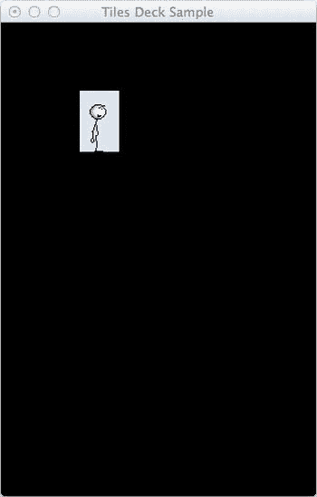

图 10-6. 在 Moai 中使用单独帧对精灵进行动画

```
_max_ = 11

MOAISim.openWindow("Tiles Deck Sample",320,480)

viewport = MOAIViewport.new()
viewport:setSize(320,480)
viewport:setScale(320,-480)
viewport:setOffset(-1,1)

layer = MOAILayer2D.new()
layer:setViewport(viewport)
MOAISim.pushRenderPass(layer)

tile = MOAITileDeck2D.new()
tile:setTexture("stick.png")
tile:setSize(_max_,1)
tile:setRect(-20,31,20,-31)

prop1 = MOAIProp2D.new()
prop1:setDeck(tile)
layer:insertProp(prop1)

curve = MOAIAnimCurve.new()
curve:reserveKeys(_max_)

for i=1,_max_ do
 curve:setKey(i, i*(1/_max_), i, MOAIEaseType.FLAT)
end

anim = MOAIAnim:new()
anim:reserveLinks(1)
anim:setLink(1, curve, prop1, MOAIProp2D.ATTR_INDEX)
anim:setMode(MOAITimer.LOOP)
anim:start()
prop1:setLoc(100,100)
```

在这个示例中，我们首先创建可用于动画的图块：

```
tile = MOAITileDeck2D.new()
tile:setTexture("stick.png")
tile:setSize(11,1)
tile:setRect(-20,31,20,-31)
```

我们的精灵表横向有 11 帧，纵向有 1 帧（见图 10-7）。所有帧的尺寸均为 40×62，我们通过`setRect`来设置。

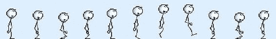

图 10-7. 我们将用于动画的`stick.png`图像

在`setRect`函数中为矩形尺寸设置负值，会将对象沿值为负的坐标轴翻转。由于 Moai 的 y 轴是递增的，我们将比例尺设置为以左上角为原点（0,0），因此我们的图像会沿 y 轴翻转显示。为了修正这一点，我们使用`tile:setRect(-20,31,20,-31)`而不是`tile:setRect(-20,-31,20,31)`。

```
prop1 = MOAIProp2D.new()
prop1:setDeck(tile)
layer:insertProp(prop1)
```

我们创建一个`MOAIProp2D`对象，将刚创建的图块设置为该`prop`的图块组，然后将该`prop`插入到图层中：

```
curve = MOAIAnimCurve.new()
_max_ = 11
curve:reserveKeys(_max_)
for i=1, _max_ do
  curve:setKey(I, I * (1/_max_), I, MOAIEaseType.FLAT)
end
```

我们创建一个`MOAIAnimCurve`对象，然后使用`reserveKeys`函数指定帧数。接着创建帧，并为每个帧设置索引和时间索引，以及曲线在该时间索引处的值。时间索引是看待动画的另一种方式，但不是基于索引，而是通过设置时间索引来指定该时间点上的动画/变换。

```
anim = MOAIAnim:new()
anim:reserveLinks(1)
anim:setLink(1, curve, prop1, MOAIProp2D.ATTR_INDEX)
anim:setMode(MOAITimer.LOOP)
anim:start()
```

我们使用`MOAIAnim`类来创建动画。我们在`prop1`和`curve`之间建立了一个关于`Index`属性的链接。将模式设置为循环（作为定时器）。然后通过`start`函数启动动画。

最后，我们将`prop1`对象重新定位到屏幕上的（100,100）位置。

我们还可以使用监听器来挂钩动画。可以捕获的监听器有：

*   `MOAITimer.EVENT_TIMER_KEYFRAME`。每次关键帧改变时都会调用此监听器，它是一个回调函数，签名如下：

```
    onKeyFrame ( MOAITimer_self, number_keyFrame, number_timesExecuted, number_time, number_value)
    ```

*   `MOAITimer.EVENT_TIMER_LOOP`。每次函数循环时都会调用此监听器，其回调签名如下：

```
    onLoop(MOAITimer_self,  number_timesExecuted)
    ```


## MOAITimer 事件

- `MOAITimer.EVENT_TIMER_BEGIN_SPAN`。当计时器播放模式达到通过 `setSpan` 函数设置的 `beginSpan` 时间时调用此事件；否则为 0（即动画开始时）。其回调签名如下：

```
onBeginSpan(MOAITimer_self, number_timesExecuted)
```

- `MOAITimer.EVENT_TIMER_END_SPAN`。当计时器播放达到通过 `setSpan` 函数设置的 `endSpan` 时间时调用此事件；否则设置为动画的结束时间。其回调签名如下：

```
onEndSpan(MOAITimer_self, number_timesExecuted)
```

以下是使用 `MOAITimer.EVENT_TIMER_KEYFRAME` 监听器的示例：

```
function onKeyFrame(self, index, time, value)
  print("Keyframe : ", index, time, value)
end
anim:setListener(MOAITimer.EVENT_TIMER_KEYFRAME, onKeyFrame)
```

## 线程（Threading）

默认情况下，所有用于变换 Moai 对象的函数都是非阻塞的，并且并行执行。例如，如果我们在一个属性（prop）上应用变换，它们将同时执行。示例如下：

```
prop:moveLoc(180, 180, 3)
prop:moveScl(1.2, 1.2, 1)
prop:moveLoc(-180, -180, 3)
prop:moveScl(0.9, 0.9, 1)
```

Moai 可以同时执行所有这些变换；如果你运行这段代码，只会看到四个变换的最终结果，而不会逐个看到它们。

Moai 拥有线程的概念；我们在之前的章节中已经简要了解了线程和协程。我们可以在 Moai 中创建阻塞线程，以便以阻塞模式运行每个动作。示例如下：

```
function threadFunction()
  action = prop:moveLoc(180, 180, 3.0)
  MOAIThread.blockOnAction(action)

  action = prop:moveScl(1.2, 1.2, 1.0)
  MOAIThread.blockOnAction(action)

  action = prop:moveLoc(-180, -180, 3.0)
  MOAIThread.blockOnAction(action)

  action = prop:moveScl(0.8, 0.8, 1.0)
  MOAIThread.blockOnAction(action)
end

thread = MOAIThread.new()
thread:run(threadFunction)
```

我们创建的阻塞动作只能用于动作项（变换）。

## 组（Groups）

其他框架对“组”的定义是一个容器——它容纳所有其他显示对象。通常，组是非可视的显示对象。在 Moai 中，这个概念略有不同——你可以在两个对象之间建立父子关系。当父对象被修改或移动时，子对象也会随之变化，如图 10-8 所示。

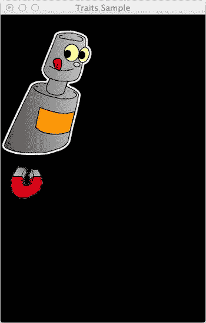

图 10-8. Moai 中利用特性（traits）实现的组

在 Moai 中，这被称为设置*特性源（trait source）*，其中*特性*是属性，例如位置、变换、颜色、可见性等。`setParent` 函数实际上是 `setTraitSource` 的别名。

```
MOAISim.openWindow("Group Test", 320, 480)

viewport = MAOIViewport.new()
viewport:setSize(320, 480)
viewport:setScale(320, -480)
viewport:setOffset(-1, 1)

layer = MOAILayer2D.new()
layer:setViewport(viewport)
MOAISim.pushRenderPass(layer)

function newImage(imageName, xPos, yPos)
  local xPos = xPos or 0
  local yPos = yPos or 0
  local wd, ht

  local img = MOAIImage.new()
  img:load(imageName)
  wd, ht = img:getSize()

  quad = MOAIGfxQuad2D.new()
  quad:setTexture(imageName)
  quad:setRect(-(wd/2), (ht/2), (wd/2), -(ht/2))

  prop = MOAIProp2D.new()
  prop:setDeck(quad)
  prop:setLoc(xPos, yPos)

  layer:insertProp(prop)
  return prop
end

magnet = newImage("myImage2.png", 40, 260)
robo = newImage("myImage3.png", 40, -140)

robo:setParent(magnet)

magnet:moveLoc(170, 170, 3)
```

注意，当移动磁铁时，机器人会随着磁铁一起移动。任何对父对象执行的操作都会影响到这两个属性。

让我们在代码末尾添加一些缩放操作：

```
magnet:moveScl(-0.5, -0.5, 3)
```

你会注意到，磁铁和机器人在移动时都开始缩放。当你将一个对象设置为另一个对象的父对象时，所有属性/特性都会从父对象继承。最终效果如图 10-9 所示。

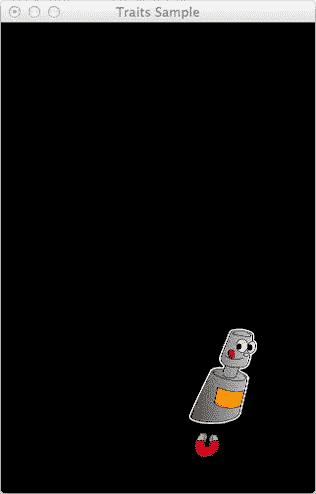

图 10-9. 缩放操作同时影响两个图像（利用特性）

## 处理输入（Handling Input）

由于 Moai 可以从单一源代码为移动设备、桌面和网页浏览器生成可执行文件，因此它拥有一个高度复杂的输入系统。这包括键盘、鼠标和触摸输入。

输入封装在 `MOAIInputMgr` 类中；该类依赖于一个回调函数来处理输入事件。

### 键盘事件

在开发过程中，你会在桌面上测试代码。为此，你需要捕获并测试键盘事件。要捕获这些事件，你需要为 `MOAIInputMgr.device.keyboard` 对象设置一个回调。

```
function onKeyEvent(key, down)
  if down == true then
    print("Key down : ", key)
  else
    print("Key up : ", key)
  end
end
MOAIInputMgr.device.keyboard:setCallback(onKeyEvent)
```

在 iOS 设备上，`MOAIInputMgr.device.keyboard` 不存在；你需要改用 `MOAIKeyboardIOS` 类，并为 `EVENT_INPUT` 和 `EVENT_RETURN` 设置监听器。

```
function onInput(start, length, text)
  print("on input")
  print(start, length, text)
  print(MOAIKeyboardIOS.getText())
end

function onReturn()
  print("on return")
  print(MOAIKeyboardIOS.getText())
end

MOAIKeyboardIOS.setListener(MOAIKeyboardIOS.EVENT_INPUT, onInput)
MOAIKeyboardIOS.setListener(MOAIKeyboardIOS.EVENT_RETURN, onReturn)
MOAIKeyboardIOS.showKeyboard()
```

### 鼠标事件

对于没有触摸事件的设备，Moai 提供了鼠标处理器。与键盘处理器类似，你需要为 `MOAIInputMgr.device.pointer` 对象设置一个回调。该回调用于捕获鼠标移动事件。

```
function onMove(evtX, evtY)
  print("Pointer : ", x, y)
end
MOAIInputMgr.device.pointer:setCallback(onMove)
```

如果我们想要捕获鼠标按钮点击事件，需要为鼠标按钮设置回调函数，例如 `mouseLeft`、`mouseRight` 和 `mouseCenter`。

```
function onMouseL(down)
  print("The Left Mouse button down is ", down)
end
function onMouseR(down)
  print("The Right Mouse button down is ", down)
end
function onMouseC(down)
  print("The Center Mouse button down is ", down)
end
MOAIInputMgr.device.mouseLeft:setCallback(onMouseL)
MOAIInputMgr.device.mouseRight:setCallback(onMouseL)
MOAIInputMgr.device.mouseCenter:setCallback(onMouseL)
```

在某些情况下，你可能不想设置鼠标按钮的回调函数。这时，你可以使用 `isUp` 和 `isDown` 函数来查询它们的状态。你可以在指针上设置回调，并在回调中检查按钮状态。

```
function handleMouse(x, y)
  if MOAIInputMgr.device.mouseLeft:isUp() then
    print("Left button clicked at : ", x, y)
  end
end

MOAIInputMgr.device.pointer:setCallback(handleMouse)
```

你可能在很多应用中注意到过“下拉刷新”功能。在 iOS 6 中，邮件应用就有下拉刷新功能；当你下拉时，圆圈会像粘液一样拉长，从顶部的较大块中向下拉伸。我们可以用 Moai 和鼠标快速重现相同的效果。在这个例子中，当你在窗口中移动鼠标时，粘液块会对鼠标指针向下移动做出反应。效果如图 10-10 所示。

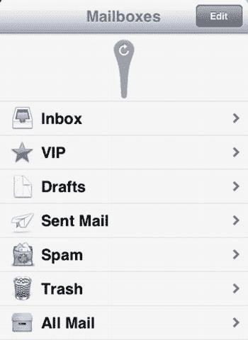

图 10-10. iOS 6 中全新的有机粘液下拉刷新效果

首先，我们创建窗口、视口以及用于放置所有显示对象的图层：

```
MOAISim.openWindow("Slimey Blob", 320, 480)

viewport = MOAIViewport.new()
viewport:setSize(320, 480)
viewport:setScale(320, -480)
viewport:setOffset(-1, 1)
```


```markdown

`layer = MOAILayer2D.new()`
`layer:setViewport(viewport)`
`MOAISim.pushRenderPass(layer)`

然后，我们创建用来绘制图形的`scriptDeck`：

`canvas = MOAIScriptDeck.new()`
`canvas:setRect(-64,-64,64,64)`
`canvas:setDrawCallback(onDraw)`

`prop = MOAIProp2D.new()`
`prop:setDeck(canvas)`
`layer:insertProp(prop)`

最后，我们需要创建负责所有绘制的函数：

```
bottomOriginY = 100
bottomRadius = 10
topRadius = 25
  topOrigin = {
    x = _W/2,
    y = 30
  }

function onDraw(index, xOrg, yOrg, xFlp, yFlp)
  MOAIGfxDevice.setPenColor(1,0.64,0.1)

MOAIDraw.fillCircle(topOrigin.x,topOrigin.y,topRadius,100)
  MOAIDraw.fillCircle(_W/2,bottomOriginY,bottomRadius,100)

MOAIDraw.fillFan(
    topOrigin.x-currentTopRadius, topOrigin.y,
    topOrigin.x+currentTopRadius, topOrigin.y,
    topOrigin.x+bottomRadius, bottomOriginY,
    topOrigin.x-bottomRadius, bottomOriginY
  )

end
```

在我们的绘制函数中，首先绘制两个圆，一个在上方，一个在下方，位置分别由`topOrigin.y`和`bottomOriginY`指定，半径由`topRadius`和`bottomRadius`指定。

接下来，我们从上方圆的中心到下方圆的中心绘制一个四边形，实际上是将两者连接起来。为了看起来更逼真一些，这条线可以是一条向内拱起的曲线，给人一种正在膨胀的粘液滴的印象。但为简单起见，我们只使用一个能提供类似外观的四边形。

你可以通过添加另一个线段来使其更逼真，但这作为练习留给你。

我们需要将下方的粘液块定位到鼠标当前所在的位置；这样，我们就能模拟将粘液块从较大的粘液块上拉下来的效果。

```
function onMove(mx, my)
  bottomOriginY = my
  if bottomOriginY < 40 then bottomOriginY = 40 end
  if bottomOriginY > 400 then bottonOriginY = 400 end

bottomRadius = 12 – ((my-currentTopRadius)/48)
end
MOAIInputMgr.device.pointe:setCallback(onMove)
```

在鼠标移动函数中，我们首先将`bottomOriginY`设置为鼠标指针当前的`y`坐标。我们还确保`bottomOriginY`保持在 40 到 400 的范围内。同时，我们设置下方圆的半径，使其在移动时缩小或扩大（参见图 10-11）。

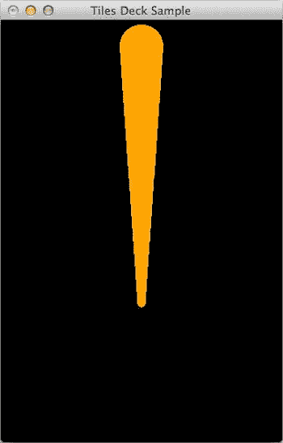

图 10-11 . 一个简化版的“下拉刷新”粘液块

触摸事件

在没有鼠标指针而是响应触摸的移动设备上，我们可以为触摸设置回调。要设置回调的对象是`MOAIInputMgr.device.touch`。它捕获触摸事件。回调函数接收一个`eventType`，它可以是以下值之一：

*   `MOAITouchSensor.TOUCH_DOWN`
*   `MOAITouchSensor.TOUCH_UP`
*   `MOAITouchSensor.TOUCH_MOVE`
*   `MOAITouchSensor.TOUCH_CANCEL`

```
function onTouch(eventType, idx, x, y, tapCount)
  print(eventType)
end
MOAIInputMgr.device.touch:setCallback(onTouch)
```

如果在桌面端运行此代码，将会出错，因为没有触摸设备。

设置处理程序的最佳方法是在设置回调之前确保设备存在。以下是如何检查设备是否存在：

```
if MOAIInputMgr.device.touch then
  MOAIInputMgr.device.touch:setCallback(onTouch)
end
```

**注意**：如果相关设备不受支持，设置回调可能会导致错误。最好在设置回调之前检查设备是否存在。这适用于涉及触摸、鼠标指针、键盘甚至 GPS 和加速度计的设备。

声音

虽然有些框架具有复杂繁复的音频功能，但 Moai 在`MOAIUntzSound`类中提供了一个非常简单的功能。但是，在使用音频功能之前，你需要像这样初始化`MOAIUntzSystem`：

```
MOAIUntzSystem.initialize ()

sound = MOAIUntzSound.new ()
sound:load ( 'mono16.wav' )
sound:setVolume ( 1 )
sound:setLooping ( false )
sound:play ()
```

显示对话框

Moai 允许你向用户显示消息，甚至可以通过是/否/取消类型的对话框从用户那里获取输入。在这种情况下，你可以使用`MOAIDialogIOS`类的`showDialog`函数。示例如下：

```
function onDialogDismiss(code)
  print("Dialog Dismissed")
  if (code==MOAIDialog.DIALOG_RESULT_POSITIVE) then
    print("Clicked Yes")
  elseif (code==MOAIDialog.DIALOG_RESULT_NEUTRAL) then
    print("Clicked Maybe")
  elseif (code==MOAIDialog.DIALOG_RESULT_NEGATIVE) then
    print("Clicked No")
  elseif (code==MOAIDialog.DIALOG_RESULT_CANCEL) then
    print("Clicked Cancel")
  else then
    print("Clicked Unknown")
  end
end

MOAIDialogIOS.showDialog("Sample Dialog", "", "Yes", "Maybe", "No", true, onDialogDismiss)
```

播放视频

如果你想在 iOS 设备上播放视频——例如，作为游戏关卡的介绍或引子——你可以使用`MOAIMoviePlayer`类。要播放视频，你需要使用视频路径进行初始化，然后调用`play`函数：

```
MOAIMoviePlayer.init ( 
"http://km.support.apple.com/library/APPLE/APPLECARE_ALLGEOS/HT1211/sample_iTunes.mov" )
MOAIMoviePlayer.play ()
```

设备方向

当涉及到方向变化时，许多框架会触发一个方向变化事件。然而，在 Moai 中，当设备方向改变时，会触发`EVENT_RESIZE`事件。我们可以通过向`MOAIGfxDevice`类添加一个监听器来监听此事件。

```
_W, _H = MOAIGfxDevice.getViewSize()
function onResize(width, height)
  viewport:setSize(width, height)
  viewport:setScale(width, height)
end
MOAIGfxDevice.setListener(MOAIGfxDevice.EVENT_RESIZE, onResize)
```

通知

在某些场景下，你可能希望向用户发送一些信息通知——例如，当任务完成时（比如，在类似 Farmville 的应用中作物可以收割时）。为了实现这一点，Moai 拥有一个`MOAINotifications`类，需要添加一个监听器来监听事件。下面的代码包含三个不同的部分。`onRegComplete`在我们尝试注册远程通知时被调用；它还会通知我们是成功还是失败。另一个函数在通知发生时，基于传递的数据显示通知。最后一部分设置并注册通知。

```
function onRegComplete(code, token)
  print("Registered")
  if code==MOAINotification.REMOTE_NOTIFICATION_RESULT_REGISTERED then
    print("Registered " .. token)
  elseif code==MOAINotification.REMOTE_NOTIFICATION_RESULT_UNREGISTERED then
  else
    print("Registration failed")
  end
end

function onRemoteNotification(event)
  print("Notification received")
  message = event.aps.alert

local action, data, title
  if event.action then action = event.action end
  if event.data then data = event.data end
  if event.title then title = event.title end

print("Message : " .. message)
  print("action : " .. action)
  print("data : " .. data)
  print("title : ", title)
end

MOAINotification.setListener(MOAINotification.REMOTE_NOTIFICATION_REGISTRATION_COMPLETE, onRegComplete)
MOAINotification.setListener(MOAINotification.REMOTE_NOTIFICATION_MESSAGE_RECEIVED, onRemoteNotification)
MOAINotification.setAppIconBadgeNumber(0)
MOAINotification.registerForRemoteNotification(
    MOAINotification.REMOTE_NOTIFICATION_BADGE +
    MOAINotification.REMOTE_NOTIFICATION_ALERT)
```

网络

在你的游戏中，你可能需要使用 HTTP 或 HTTPS 协议下载关卡数据或其他数据。Moai 有一个`MOAIHttpTask`类，允许从 HTTP/S 源下载数据。

```
function onDone(task, responseCode)
  print("Downloaded", responseCode)
  if task:getSize() then
    print(task:getString())
  else
    print("Got nothing")
  end
end

theTask = MOAIHttpTask.new("Download Webpage")
theTask:setCallback(onDone)
theTask:httpGet("http://www.oz-apps.com")
```

```


`httpGet`函数是同步工作的，然而，如果你希望数据被**异步**加载，则需要调用`performAsync`函数：

```
function onFinish ( task, responseCode )

print ( "onFinish" )
  print ( responseCode )

if ( task:getSize ()) then
    print ( task:getString ())
  else
    print ( "nothing" )
  end
end

task = MOAIHttpTask.new ()

task:setVerb ( MOAIHttpTask.HTTP_GET )
task:setUrl ( "www.cnn.com" )
task:setCallback ( onFinish )
task:setUserAgent ( "Moai" )
task:setHeader ( "Foo", "foo" )
task:setHeader ( "Bar", "bar" )
task:setHeader ( "Baz", "baz" )
task:setVerbose ( true )
task:performAsync ()
```

如果你想以阻塞方式（即整个应用冻结以执行一个操作，任务完成后恢复）运行某些命令，应使用`performSync`函数而非`performAsync`。

`HttpTask`是一个双向函数，这意味着它不仅可用于通过`HTTP_GET`下载数据，还可用于上传数据和设置标头。可以与`HttpTask`一起使用的命令有：

*   `HTTP_HEAD`
*   `HTTP_GET`
*   `HTTP_PUT`
*   `HTTP_POST`
*   `HTTP_DELETE`

## 使用 JSON

Moai 对 JSON 提供了很好的支持。要解码或编码 JSON 字符串，可以使用`MOAIJsonParser`对象。它只有两个函数：`encode`和`decode`。`decode`函数接受一个 JSON 字符串并将其转换为表层级结构，而`encode`则将表层级结构转换为 JSON 字符串。

```
local test = {name="Jayant", Msg={BaaBaa="BlackSheep", Line1="Have you any wool?"}}
print(MOAIJsonParser.encode(test))
```

## 使用 Base64

在开发游戏时，为了发送消息或上传/下载数据，你可能需要将数据编码为 Base64，以便能以文本格式发送数据。`MOAIDataBuffer`类提供了基础转换功能。

```
theText = "This is plain text, but..."
encoded = MOAIDataBuffer.base64Encode(theText)
print(encoded)
decoded = MOAIDataBuffer.base64Decode(encoded)
print(decoded)
```

在某些情况下，你可能需要处理流式数据；为此，你可以使用`MOAIStreamReader`和`MOAIStreamWriter`类。流可以像文件一样使用，你可以打开流、定位和写入数据。以下是一个示例：

```
stream = MOAIMemStream.new ()
stream:open ()

data = 'Lorem ipsum dolor sit amet, consectetur adipiscing elit. Duis id massa vel leo blandit pharetra.
 Aenean a nisl mi. Vestibulum ante ipsum primis in faucibus orci luctus et ultrices posuere cubilia Curae;
 Nam quis magna sit amet diam fermentum consequat. Donec dapibus pharetra diam vel convallis. 
Pellentesque quis tellus mauris.
 Sed eget risus tortor, in cursus nisi. Sed ultrices nulla non nunc ullamcorper id venenatis urna ultrices.
 Cum sociis natoque penatibus et magnis dis parturient montes, nascetur ridiculus mus.
 Nam sodales tellus et diam imperdiet pharetra sagittis odio tempus. Lorem ipsum dolor sit amet, consectetur adipiscing elit.
 Nunc mollis adipiscing nibh ut malesuada. Proin rutrum volutpat est sed feugiat. Suspendisse at imperdiet justo.
 Pellentesque ullamcorper risus venenatis tellus elementum mattis. Quisque adipiscing feugiat orci vitae egestas.'
len = #data

print ( data )

writer = MOAIStreamWriter.new ()
writer:openBase64 ( stream )
writer:write ( data, len )
writer:close ()

stream:seek ( 0 )

reader = MOAIStreamReader.new ()
reader:openBase64 ( stream )
data = reader:read ( len )
reader:close ()

print ()
print ( data )
```

## 压缩数据

处理在线数据时，你可能不仅希望转换数据，还希望对其进行压缩以节省数据传输和带宽。`MOAIDataBuffer`类允许你使用`deflate`和`inflate`函数对数据进行压缩或解压。

```
data = 'Lorem ipsum dolor sit amet, consectetur adipiscing elit. Duis id massa vel leo blandit
 pharetra. Aenean a nisl mi. Vestibulum ante ipsum primis in faucibus orci luctus et ultrices posuere
 cubilia Curae; Nam quis magna sit amet diam fermentum consequat. Donec dapibus pharetra diam vel
 convallis. Pellentesque quis tellus mauris. Sed eget risus tortor, in cursus nisi. Sed ultrices
 nulla non nunc ullamcorper id venenatis urna ultrices. Cum sociis natoque penatibus et magnis dis
 parturient montes, nascetur ridiculus mus. Nam sodales tellus et diam imperdiet pharetra sagittis
 odio tempus. Lorem ipsum dolor sit amet, consectetur adipiscing elit. Nunc mollis adipiscing nibh
 ut malesuada. Proin rutrum volutpat est sed feugiat. Suspendisse at imperdiet justo. Pellentesque
 ullamcorper risus venenatis tellus elementum mattis. Quisque adipiscing feugiat orci vitae egestas.'

print ( data )
print ()

print ( 'original length: ' .. #data )

data = MOAIDataBuffer.deflate ( data, 9 )
print ( 'deflated length: ' .. #data )
print ( "The compressed encoded data")
print ( MOAIDataBuffer.base64Encode(data))

data = MOAIDataBuffer.inflate ( data )
print ( 'inflated length: ' .. #data )

print ()
print ( data )
```

## 物理

物理是游戏应用中最常用的功能，而 Box2D 是大多数框架最常用的库。Moai 包含了 Box2D 以及 Chipmunk 库。本节将描述这两者。

### Box2D 物理

在 Moai 中使用物理时，首先要做的事情是使用`MOAIBox2dWorld`类创建一个世界。

```
MOAISim.openWindow("Physics", 640, 480)
viewport = MOAIViewport.new()
viewport:setSize(640,480)
viewport:setScale(16,0)

layer = MOAILayer2D.new()
layer:setViewport(viewport)
MOAISim.pushRenderPass(layer)

world = MOAIBox2dWorld.new()
world:setGravity(0,-9.8)
world:setUnitsToMeters(2)
world:start()
layer:setBox2DWorld(world)
```

创建世界后，我们需要添加一个物理物体。这将通过`addBody`函数与我们创建的物理世界进行交互，作为一个**动态物体**。通常，所有物体默认被创建为静态物体。**静态物体**是不可移动的，即力不会作用于静态物体，而动态物体对力有反应。

为了让重力真实地工作，我们需要将其设置为 −9.8；如果设置为 9.8，物体将开始漂浮。

Box2D 的单位与米-千克-秒（MKS）单位配合得很好，移动物体在 0.1 到 10 米的范围内工作良好。虽然可能很想使用像素作为单位，但这会导致一些奇怪的行为和糟糕的模拟。

最后，我们需要使用`world:start()`启动物理模拟。要停止物理模拟，可以使用`world:stop()`。

```
body = world:addBody( MOAIBox2DBody.DYNAMIC)
poly = {0,-1,1,0,0,1,-1,0}

fixture = body:addPolygon(poly)
fixture:setDestiny(1)
fixture:setFriction(0.3)
fixture:setFilter(0x01)
fixture:setCollisionHandler(onCollide, MOAIBox2DArbiter.BEGIN + MOAIBox2DArbiter.END, 0x02)
body:resetMassData()
body:applyAngularImpulse(2)
```

现在我们创建了一个动态物体，我们创建一个夹具（fixture），它将形状绑定到物体上，并赋予物体材料属性，如密度、摩擦力和弹性。

**注意**　*弹性*涉及物体在碰撞变形后恢复其原始形状或位置的方式。

如果我们运行代码，一个物理盒子将出现在屏幕上，如图 10-12 所示。

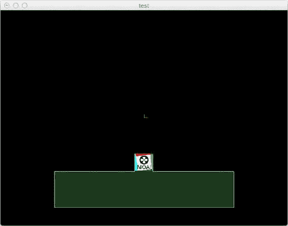

Figure 10-12. Moai Box2D 物理物体

```
body2 = world:addBody(MOAIBox2DBody.STATIC)
fixture2 = body2:addRect(-5,-5,5,-3)
fixture2:setFilter(0x02)
fixture2:setCollisionHandler(onCollide, MOAIBox2DArbiter.BEGIN + MOAIBox2DArbiter.END, 0x01)
```

这将创建一个静态物体，它充当地面，防止动态盒子掉出屏幕。


对于这两个 body fixtures，我们都设置了一个碰撞处理器，该处理器会针对`MOAIBox2DArbiter.BEGIN`和`MOAIBox2DArbiter.END`事件调用`onCollide`函数。`BEGIN`事件在碰撞开始时触发，`END`事件在碰撞结束时触发。我们可以在`onCollide`函数中捕获它。

```
function onCollide(event)
  if event == MOAIBox2DArbiter.BEGIN then
    print("Begin!")
  elseif event == MOAIBox2DArbiter.END then
    print("End!")
  end
end
```

我们可以向这个 body 添加一个图像，这样我们看到的就不是方框，而是其位置上的图像：

```
texture = MOAIGfxQuad2D.new()
texture:setTexture("moai.png")
texture:setRect(-0.5, -0.5, 0.5, 0.5)
```

现在我们需要将此图像添加到 body：

```
image = MOAIProp2D.new()
image:setDeck(texture)
image:setParent(body)
layer:insertProp(image)
```

我们使用`poly`创建的多边形是菱形的；如果我们希望它是正方形，可以使用以下代码：

```
poly = {-0.5, -0.5, 0.5, -0.5, 0.5, 0.5, -0.5, 0.5}
```

物体在接触地面时不会弹跳。我们可以通过使用`setRestitution`函数设置恢复系数，使两个物体都具有弹性。

```
fixture:setRestitution(0.5)
```

和

```
fixture:setRestitution(0.7)
```

为了让这个小代码示例更有趣，我们将世界的重力改为-1，这会使物体表现得像一个气球。为此，我们使用`world:setGravity(0,-1)`。现在物体下落得更慢了。我们还可以添加一个鼠标事件，使物体弹跳。

```
function onClick(down)
  body:setLinearVelocity(0,0)
  body:applyLinearImpulse(0,1)
end
MOAIInputMgr.device.mouseLeft:setCallback(onClick)
```

现在，每次我们单击鼠标左键时，都会将速度重置为 0，然后施加一个(0, 1)的线性冲量，这会在 x 轴上施加 0 的冲量，在 y 轴上施加 1 的冲量。这使得物体向上跳跃。

### Chipmunk Physics

我们也可以在 Moai 中使用 Chipmunk 物理引擎。其原理与 Box2D 类似。首先，我们需要使用`MOAICpSpace`类创建 Chipmunk 世界空间：

```
space = MOAICpSpace.new()
space:setGravity(0,-2000)
space:setIterations(5)
space:start()
```

`iterations`是用于确定物体之间是否发生碰撞的计算次数。较大的迭代次数将提供更平滑、更好的物理模拟；然而，这会占用大量的 CPU 时间和处理资源。另一方面，如果我们使用较小的迭代值，所需的 CPU 能力较少，但运动可能看起来过于弹跳和不真实。

要创建物理 body，我们可以使用`MOAICpBody`类，它会返回一个 Chipmunk 物理 body。然后，我们可以将一个多边形夹具添加到该物理 body。

```
poly = {-32, 32, 32, 32, 32, -32, -32, -32}
mass = 1
moment = MOAICpShape.momentForPolygon (mass, poly)
body = MOAICpBody.new(1, moment)
space:insertPrim(body)

shape = body:addPolygon( poly )
shape:setElasticity( 0.8 )
shape:setFriction( 0.8 )
shape:setType( 1 )
space:insertPrim( shape )
```

当我们现在运行代码时，物体会直接掉出屏幕。让我们创建一个地板类型的物体，这样物理 body 就不会掉出屏幕：

```
body = space:getStaticBody()

x1,y1,x2,y2 = -320, -240, 320, -240
shape = body:addSegment(x1,y1,x2,y2)
shape:setElasticity(1)
shape:setFriction(0.1)
shape:setType(2)
space:insertPrim(shape)
```

现在，物体到达屏幕底部时将会弹跳。

我们可以添加一些代码来让物体在屏幕上移动，但在此之前，让我们在屏幕的四个角创建一个墙壁，这样当移动物理 body 时，它不会从屏幕侧面掉出。

```
function addSegment(x1, y1, x2, y2)
  shape = body:addSegment(x1,y1,x2,y2)
  shape:setElasticity(1)
  shape:setFriction(0.1)
  shape:setType(2)
  space:insertPrim(shape)
end

addSegment(-320, -240, 320, -240)
addSegment(-320, 240, 320, 240)
addSegment(-320, -240, -320, 240)
addSegment(320, -240, 320, 240)
```

我们可以通过使用`space:shapeForPoint`函数来获取给定点处的 body。我们还可以通过在指针设备上设置回调函数，根据鼠标的位置移动该点。

```
mouseBody = MOAICpBody.new(MOAICp.INFINITY, MOAICp.INFINITY)
mx, my = 0,0
function onMove(x,y)
  mx, my = layer:wndToWorld(x,y)
  mouseBody:setPos(mx, my)
end
```

现在，随着鼠标移动，`mouseBody`对象被放置在指针当前所在的位置。我们还可以为鼠标左键函数设置一个回调，该函数可以帮助拾取和移动物体。

```
function onClick(down)
  if down then
    pick = space:shapeForPoint(mx, my)
    if pick then
      body = pick:getBody()
      mouseJoint = MOAICpConstraint.newPivotJoint(
        mouseBody, body, 0, 0, body:worldToLocal(mx, my))
      space:insertPrim(mouseJoint)
    else
      if mouseJoint then
        space:removePrim(mouseJoint)
        mouseJoint = nil
      end
    end
  end
end
```

我们还可以通过添加更多可以使用鼠标交互的物理物体来扩展这一点。为此，我们可以创建多个物体。

```
poly = {-32, 32, 32, 32, 32, -32, -32, -32}
mass = 1

function makeObject()
  moment = MOAICpShape.momentForPolygon (mass, poly)
  body = MOAICpBody.new(1, moment)
  space:insertPrim(body)

shape = body:addPolygon( poly )
  shape:setElasticity( 0.8 )
  shape:setFriction( 0.8 )
  shape:setType( 1 )
  space:insertPrim( shape )
end

for i=1, 15 do
  makeObject()
end
```

注意物体如何相互交互，以及如何使用鼠标进行操作。我们还可以将图像附加到物理 body 上；这将显示图像而不是物理 body。

```
image = MOAIProp2D.new()
image:setDeck(texture)
image:setParent(body)
layer:insertProp(image)
```

## Moai Cloud

当您登录 Moai 帐户时，会看到 Moai 仪表板，您可以在其中设置云帐户并选择其他选项。您可以在此处创建的云服务完全独立于您是否使用 Moai 或任何其他框架或浏览器来使用这些服务。

### 创建 Web 服务

让我们从创建一个 Web 服务开始。您可以通过在 Moai 云服务下单击“创建服务”按钮，从仪表板创建该服务。图 10-13 显示了创建服务的屏幕；您主要需要提供一个应用程序名称，同时接受剩余的默认设置。


图 10-13 在 Moai 仪表板中创建新服务

创建服务后，您会看到一个屏幕，允许您创建另一个服务或编辑现有服务。注意图 10-14 中，我们称为`Test01`的服务状态为“未部署”，这意味着它在 Web 上不可用。为了能够访问它，我们需要部署它。

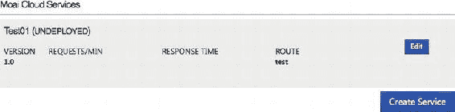

图 10-14 创建服务后的仪表板

首先单击“编辑”按钮以编辑此服务的设置，如图 10-15 所示。对于最简单的服务，我们无需更改任何内容；只需单击“部署服务”即可。

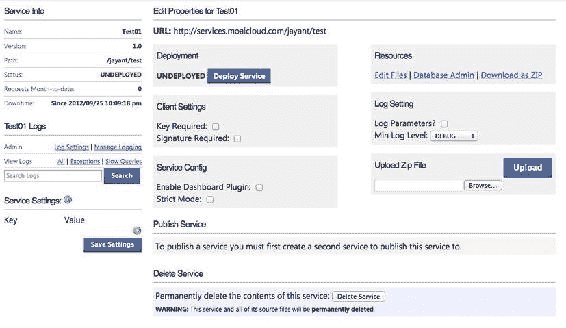

图 10-15 Moai 云服务的属性

一旦我们单击“部署服务”，该服务即可使用。注意顶部的 URL；在此示例中，它设置为`http://services.moaicloud.com/USERNAME/test`。您需要为您自己的服务使用该 URL。如果您打开一个新的浏览器窗口并导航到该 URL，您将看到显示文本“hello world!”。


如果你想要修改并创建一个更好、更有用的 Web 服务，可以点击右上角资源（Resources）下的“编辑文件”（Edit Files）链接，如图 Figure 10-15 所示。这将打开一个代码编辑器，允许你编写 Lua 代码。其中唯一存在的文件是 `main.lua`，包含以下代码：

```
function main(web,req)
    web:page('hello world!', 200, 'OK')
end
```

这类似于用于创建动态 Web 页面的 PHP 和 ASP 环境，但这里我们使用的是 Lua 语言。关于如何使用该服务的文档，请访问 [`getmoai.com/wiki/index.php?title=MoaiCloud`](http://getmoai.com/wiki/index.php?title=MoaiCloud)。

### 使用 Web 服务

该 Web 服务是一个简单的 HTTP 类型服务，通过 URL 访问。我们将尝试从 Moai 应用程序中访问我们创建的服务。简单的代码如下所示：

```
theURL = http://services.moaicloud.com/USERNAME/SERVICENAME
MoaiSim.openWindow("Consume Web Services", 320, 480)

function getData(theTask)
    print(theTask:getString())
end

task = MOAIHttpTask.new()
task:setCallback( getData )
task:httpGet (theURL)
```

运行代码时，终端将输出 `"hello world!"`。我们可以使用任何支持 HTTP 访问的语言或框架来从 Moai 云服务获取数据。

**注意**：Moai 云服务提供几种选项（类似手机套餐）。所有创建的账户默认使用沙盒（Sandbox）计划，该计划免费，提供 50 MB 空间、1 GB 传输量、100,000 条推送通知和 100,000 次 API 请求。如果你的需求超出这些限制，还有其他计划可供选择，价格从面向爱好者的每月 19 美元到面向工作室的每月 499 美元不等。

## 总结

本章讨论了 Moai 框架提供的许多功能，涵盖如何更改显示坐标系。还介绍了在 Moai 模拟器中运行的应用程序是该应用程序的桌面版本。因此，在为移动设备构建和部署应用程序之前，可以先准备好一个适用于 Mac App Store（如果需要）的桌面版本。此外，还讨论了 Moai 处理输入的方式：设置额外接口的侦听器并检查它们是否存在是很容易的。最后，介绍了独立于 Moai SDK 免费版的 Moai 云服务，它允许开发者直接在应用程序内部使用云功能。虽然一开始使用 Moai 开发可能令人生畏，但如果你坚持下去，它能够提供非常愉快的开发体验。

