# LÖVE

LÖVE 是一个使用 Lua 和 OpenGL 的开源框架，与大多数其他框架类似。它支持 Windows、Mac 和 Unix 操作系统。尽管 LÖVE 本身不能在 iOS 设备上使用，但它对于在桌面上快速创建游戏或应用程序的原型非常有价值。LÖVE 的另一个优势是，它可以用来创建应用程序的桌面扩展，这些扩展可以与移动应用程序通信。

LÖVE 还可以用来为你的游戏创建关卡编辑器，由于它使用 Lua 语言，你可以坚持使用单一语言。

## 架构

与其他框架不同，LÖVE 依赖于特定的回调函数。与其他框架不同，没有特定的结构需要遵循——对于 LÖVE，需要声明一些特殊的函数才能使应用程序运行。通过这些 *回调函数*，解释器会查找这些函数，如果它们被声明，就会被调用。LÖVE 应用程序的架构如 Figure 11-1 所示。

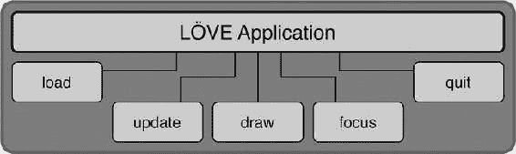

Figure 11-1 . LÖVE 的基本架构及其回调函数

LÖVE 基于回调原理工作，回调可以是用户通过代码设置的自定义函数，也可以是作为回调的预定义函数。在 LÖVE 中，回调用是预定义函数。因此，如果你定义了其中一个函数，它将在适当的时候被调用。

## 安装 LÖVE

LÖVE 运行在桌面上。你可以通过下载源码并构建二进制文件，或者直接下载预构建的二进制文件来安装 LÖVE。LÖVE 的源码托管在 Bitbucket 上，可以从 [`bitbucket.org/rude/love`](https://bitbucket.org/rude/love) 下载。适用于相应平台的预构建二进制文件可以从 [`love2d.org/#download`](https://love2d.org/#download) 下载。

## 运行 LÖVE

在 LÖVE 中创建第一个 Hello World 程序与许多其他框架类似。我们创建一个文件夹——称之为 `Love_01`——然后在其中创建一个名为 `main.lua` 的文本文件，内容如下：

```
print("Hello World from Love")
```

我们可以通过将项目文件夹拖放到 LÖVE 可执行文件上来启动应用程序。或者，我们可以在终端中输入以下命令：

```
love projectdir/main.lua
```

我们将看到一个空白的窗口，代码中的 `print` 语句显示在终端中。要显示文本，只需在 `main.lua` 文件中添加以下代码并重新运行，你会看到如 Figure 11-2 所示的输出。

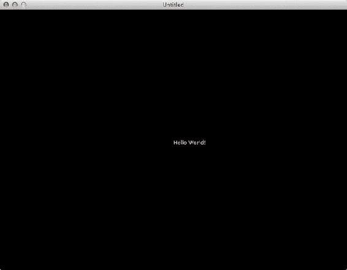

Figure 11-2 . 在 LÖVE 中运行的 Hello World

```
function love.draw()
    love.graphics.print('Hello World!', 400, 300)
end
```

## 回调函数

本节描述我们可以重写以使 LÖVE 为我们工作的回调函数。

### `love.load()`

该函数在游戏启动时被调用；它类似于 JavaScript 中的 `window_onLoad` 函数或 C 语言中的 `main()` 入口点。它只被调用一次，用于执行诸如加载资源、设置特定设置、初始化变量等任务。在面向对象的环境中，可以将其视为构造函数；它在 LÖVE 应用程序启动时只运行一次。

### `love.update(dt)`

该函数几乎连续不断地被调用。这就像一个 `enterFrame` 事件或应用程序的心跳。传递给该函数的参数是 `dt`，即 *增量时间*（delta time）——自上次调用该函数以来经过的时间，以秒为单位。这可能是一个非常小的值——小至 0.025714 秒（取决于你的平台）。帧率也会影响增量时间。

### `love.draw()`

这是所有屏幕绘制工作发生的地方。如果你之前有过使用 Visual C++、MFC、ATL、OWL 或 Objective-C 进行开发的经验，你会熟悉这种类型的函数。如果在此函数外部调用任何绘制命令，它们将不会产生任何效果。

### `love.mousepressed(x, y, button)`

每当按下鼠标按钮时，都会调用此函数；此函数是鼠标按下事件的处理程序，并传递鼠标按下时所在的 x 和 y 坐标。它还会获取按下了哪个鼠标按钮：左键、右键或中键。

### `love.mousereleased(x, y, button)`

当释放鼠标按钮时，会调用此函数；它充当鼠标释放事件的处理程序，并传递鼠标释放时所在的 x 和 y 坐标以及释放的鼠标按钮。

### `love.keypressed(key, unicode)`

当按下键盘上的某个键时，会调用此函数；此函数充当按键按下事件的处理程序，并传递键码。`key` 参数保存所按下键的字符，`unicode` 参数保存该键的 ASCII 码。如果你按下 `a` 键，那么 `key` 将是 `a`，`unicode` 将是 `97`。

### `love.keyreleased(key)`


## LÖVE 函数与命名空间

当按下某个按键被释放时，会调用此函数。此函数作为按键释放事件的处理程序，并接收按键码。按键码的完整参考可以在 [`love2d.org/wiki/KeyConstant`](https://love2d.org/wiki/KeyConstant) 找到。

`love.focus()`

当用户点击 LÖVE 窗口（或点击到其他任何窗口/桌面）时，会调用此函数。这对于判断游戏是否处于当前窗口非常有用；如果不是，您可以暂停游戏或限制处理进程。

`love.quit()`

当用户通过点击关闭按钮（Windows 下的 X 按钮和 Mac OS X 下的红点）关闭窗口时，会调用此函数。这可以被视为游戏退出时调用的析构函数；它可用于释放所有已加载对象的内存，甚至保存游戏数据（如果有的话）。

### LÖVE 命名空间

LÖVE 系统有多个命名空间，每个命名空间都包含相关函数。前面章节描述的函数属于全局 `love` 命名空间，因此以 `love.` 为前缀。其他命名空间将在本节中介绍。

#### `love.audio`

此命名空间提供了从扬声器输出音频的接口。该命名空间负责播放实际的声音。所有与音频处理相关的功能都可以在这里找到，包括更改音量、播放、暂停和停止声音。

#### `love.event`

正如我们之前所学，此命名空间管理事件。所有事件（例如按键、鼠标点击等）都属于 `love.event` 命名空间。

应用程序使用*事件队列*在应用内部进行通信。这类似于事件分发器和事件监听器。

```lua
-- 使用事件队列
function love.keypressed(k)
    if k == 'escape' then
       love.event.push('quit') -- 退出游戏
        -- 在 LÖVE 7.0 中，你只需将 'q' 压入事件队列
    end
end

-- 使用 event.poll
for event, arg1, arg2, arg3, arg4 in love.event.poll() do
    if event == "quit" then -- 退出！
        -- 在 LÖVE 7.0 中，你需要查找 'q'
    end
end
```

`love.event.wait` 是一个阻塞函数（即它会停止应用程序并等待，直到找到一个事件）。

```lua
event, arg1, arg2, arg3 = love.event.wait( )
```

**注意** LÖVE 0.7.2 和 0.8.0 在 `love.event` 函数返回的参数数量上存在一些差异。

#### `love.filesystem`

此命名空间提供了对用户文件系统的接口。可以说，这是一个沙盒环境，仅授权访问两个目录：

* `.love` 归档文件（或源目录）的根文件夹
* 游戏*保存目录*的根文件夹

写入权限仅授予游戏的保存目录。该目录在不同操作系统上的位置如下：

* *Windows XP*: `C:\Documents and Settings\user\Application Data\Love\` 或 `%appdata%\Love\`
* *Windows Vista 和 7*: `C:\Users\user\AppData\Roaming\LOVE` 或 `%appdata%\Love\`
* *Linux*: `$XDG_DATA_HOME/love/` 或 `~/.local/share/love/`
* *Mac*: `/Users/user/Library/Application Support/LOVE/`

#### `love.font`

此命名空间提供了一系列用于处理字体的函数。该命名空间中的函数允许创建或使用自定义字体。

#### `love.graphics`

此命名空间提供了非常大量的图形相关函数。所有图形功能相关的函数都位于此处。

#### `love.image`

`love.image` 命名空间包含一系列可用于解码和编码图像文件的函数。

#### `love.joystick`

此命名空间包含的功能类似于鼠标和触控板相关的函数。摇杆只是另一种输入选项。

#### `love.mouse`

此命名空间提供了对用户鼠标的接口。它包含一些函数，可以获取鼠标光标的 x、y 坐标，显示和隐藏光标，以及确定鼠标的状态（例如，某个按钮是否被按下）。

#### `love.physics`

此命名空间包含了用于在应用或游戏中引入物理效果的 Box2D 函数集。尽管大多数框架中物理接口都很简单，但其底层的 Box2D 仍然庞大且复杂。

#### `love.sound`

不要与 `love.audio` 命名空间混淆，`sound` 命名空间中的函数用于处理编码的声音文件。此命名空间提供了音频文件编码函数。

#### `love.thread`

此命名空间提供了用于处理线程的函数。

#### `love.timer`

此命名空间是所有计时器相关函数的所在地。

## 图形模块

图形库帮助创建所有的线条、形状、文本、图像和其他可绘制对象。它也负责处理诸如粒子和画布之类的特殊对象。

构成 LÖVE 的图形对象有几种类型：

*   **Canvas**（画布）：这是离屏渲染目标。
*   **Drawable**（可绘制对象）：包含所有可以绘制的项目。
*   **Font**（字体）：可以在屏幕上绘制的字符。
*   **Framebuffer**（帧缓冲）：这是离屏渲染目标。
*   **Image**（图像）：可以被绘制的图像。
*   **ParticleSystem**（粒子系统）：这是粒子系统，可用于创建酷炫特效。
*   **PixelEffect**（像素特效）：这是像素着色器。
*   **Quad**（四边形）：一个包含纹理信息的四边形。
*   **SpriteBatch**（精灵批处理）：将几何图形存储在缓冲区中以便稍后绘制。

### 图像

我们可以使用 `newImage` 函数加载图像；但是，要将其显示在屏幕上，执行绘制的代码必须放在 `love.draw` 回调函数中。下面的代码将显示如图 11-3 所示的输出。

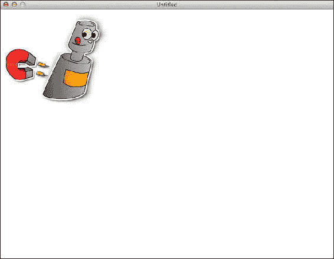

图 11-3。使用 LÖVE 显示图像

```lua
local theImage, x, y
function love.load()
   theImage = love.graphics.newImage("myImage.png")
   x = 50
   y = 50
end
function love.draw()
   love.graphics.draw(theImage, x, y)
end
```

在以下代码中，我们可以加载一个图像（可称为纹理），并且可以多次使用此纹理进行显示，而无需重新加载。

```lua
img = love.graphics.newImage("myImage.png")
wd, ht = img:getWidth(), img:getHeight()
function love.draw()
  love.graphics.draw(img, 10, 10)
  love.graphics.draw(img, 10+wd, 10)
  love.graphics.draw(img, 10, 10+ht)
  love.graphics.draw(img, 10+wd, 10+ht)
end
```

例如，你可以将此技术用于基于瓦片的游戏，其中需要平铺或重复显示图像。

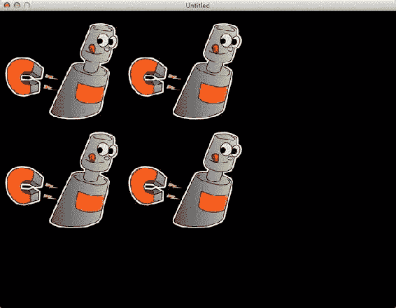

图 11-4。多次显示同一图像

如果我们想显示图像的轮廓，可以将图像重新着色为黑色，如图 11-5 所示。这可以通过简单的函数 `setColor` 实现。

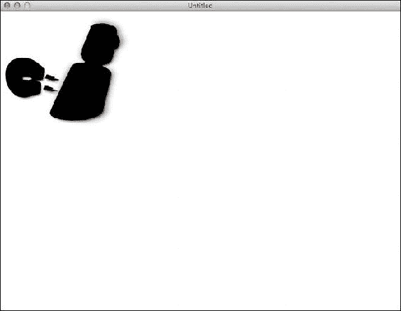

图 11-5。将图像着色为黑色以创建蒙版或剪影

```lua
local theImage, x, y
function love.load()
   theImage = love.graphics.newImage("myImage.png")
   x = 50
   y = 50
   love.graphics.setColor(0,0,0,255)
   love.graphics.setBackgroundColor(255,255,255,255)
end
function love.draw()
   love.graphics.draw(theImage, x, y)
end
```

你可以在儿童游戏中使用此技术——例如，让孩子们通过黑色剪影猜测物体是什么。

## 移动对象

你之前了解了 `love.update` 函数，它相当于其他框架中的 `enterFrame`。在此练习中，我们将使用它来使 `myImage2.png` 在屏幕上移动。

```lua
local _W, _H = love.graphics.getWidth(), love.graphics.getHeight()
local dirX, dirY = 10, 10

local theImage, x, y
function love.load()
   theImage = love.graphics.newImage("myImage2.png")
   x = 50
   y = 50
   love.graphics.setColor(0,0,0,255)
   love.graphics.setBackgroundColor(255,255,255,255)
end

function love.draw()
   love.graphics.draw(theImage, x, y)
end
```


### 使用键盘和鼠标控制图像

### 基本移动逻辑

```lua
function love.update(dt)
  x = x + dirX
  y = y + dirY

if x < 0 or x > _W then dirX = - dirX end
  if y < 0 or y > _H then dirY = - dirY end
end
```

首先，我们获取窗口的宽度和高度。这在不同的系统上可能不同，或者可以通过`conf.lua`文件设置。我们使用`getWidth`和`getHeight`函数来获取当前窗口的尺寸，并将其保存在`_W`和`_H`变量中。

接下来，我们设置移动速度；在本例中，我们将`dirX`和`dirY`变量设置为 10 和 10。这将用于在每次`update`调用时改变图像的位置。

在`love.load`函数中（该函数在应用启动时仅被调用一次），我们加载图像并将其赋值给变量`theImage`，然后将`x`和`y`变量设置为 50 和 50，这将是图像的起始位置。

在`love.draw`函数中，我们将图像定位在`x`和`y`处。

在我们的`love.update`函数中，我们通过`dirX`和`dirY`递增`x`和`y`，然后检查`x`或`y`的位置是否超出了窗口的边界（0,0 或宽度、高度）。如果`x`或`y`坐标超出窗口边界，我们相应地反转`dirX`或`dirY`，从而产生弹跳效果，并将图像放回窗口边界内。

### 活动窗口

`love.focus`函数可用于判断窗口是否处于活动状态并拥有焦点。例如，当当前窗口失去焦点时，可以使用该函数停止处理，并在重新获得焦点时继续处理。

我们在现有代码顶部添加一行：

```lua
local current = true
```

然后在代码末尾添加一个函数：

```lua
function love.focus(f)
    current = f
end
```

最后，我们重新定义`update`函数如下：

```lua
function love.update(dt)
  if current then
    x = x + dirX
    y = y + dirY

if x < 0 or x > _W then dirX = - dirX end
    if y < 0 or y > _H then dirY = - dirY end
  end
end
```

因此，每当我们离开窗口时，`love.focus`函数被触发，并根据窗口是否拥有焦点将`current`变量设置为`true`或`false`。在`update`中，如果`current`变量不为`false`或`nil`，我们则递增图像的位置。因此，当我们切换离开应用窗口时，图像会冻结，而当我们再次点击窗口时，图像会开始移动。

### 使用键盘移动

如果我们想使用键盘而不是`love.update`函数在屏幕上移动图像，可以使用`love.keypressed`函数。

```lua
local _W, _H = love.graphics.getWidth(), love.graphics.getHeight()
local dirX, dirY = 10, 10

local theImage, x, y
function love.load()
   theImage = love.graphics.newImage("myImage3.png")
   x = 50
   y = 50
   love.graphics.setColor(0,0,0,255)
   love.graphics.setBackgroundColor(255,255,255,255)
end

function love.draw()
   love.graphics.draw(theImage, x, y)
end

function love.keypressed(key, unicode)
    if key=="up" then
        y = y - dirY
    elseif key =="down" then
        y = y + dirY
    elseif key=="left" then
        x = x - dirX
    elseif key =="right" then
        x = x + dirX
    end
end
```

在这个例子中，图像仅在按下相应按键时移动。

我们可以添加另一个函数`love.mousepressed`，该函数在每次使用鼠标时被调用。我们可以将图像定位到鼠标点击的位置。仅当按下鼠标左键时，我们才重新定位图像。

```lua
function love.mousepressed(x1, y1, button)
    if button == "l" then
        x = x1
        y = y1
    end
end
```

您可能会注意到这并不流畅，在游戏设置中难以接受。您需要每次敲击按键然后释放它来让对象移动。然而，我们可以基于方向键创建更平滑的移动。为此，我们可以将按键处理例程从其自己的函数中移出，移到`update`函数中。这样我们就可以更频繁地检查按键状态。

```lua
local _W, _H = love.graphics.getWidth(), love.graphics.getHeight()
local dirX, dirY = 10, 10

local theImage, x, y
function love.load()
   theImage = love.graphics.newImage("myImage3.png")
   x = 50
   y = 50
   love.graphics.setColor(0,0,0,255)
   love.graphics.setBackgroundColor(255,255,255,255)
end

function love.draw()
   love.graphics.draw(theImage, x, y)
end

function love.update(dt)
    local key = love.keyboard.isDown
    if key("up") then
        y = y - dirY
    elseif key("down") then
        y = y + dirY
    elseif key("left") then
        x = x - dirX
    elseif key("right") then
        x = x + dirX
    end
end
```

现在移动应该更加流畅了。

最后，我们需要修复图像，使其能够朝我们选择的方向转动，而不是像太空步一样向后移动。以下是实现方法：

```lua
local _W, _H = love.graphics.getWidth(), love.graphics.getHeight()
local dirX, speed = 1, 10

local theImage, x, y
function love.load()
   theImage = love.graphics.newImage("myImage3.png")
   x = 50
   y = 50
   love.graphics.setColor(0,0,0,255)
   love.graphics.setBackgroundColor(255,255,255,255)
end

function love.draw()
   love.graphics.draw(theImage, x, y, 0, dirX, 1)
end

function love.update(dt)
    local key = love.keyboard.isDown
    if key("up") then
        y = y - dirY
    elseif key("down") then
        y = y + dirY
    elseif key("left") then
        x = x - dirX
                dirX = -1
    elseif key("right") then
        x = x + dirX
        dirX = 1
    end
end
```

这使我们无需创建新精灵就能实现所需效果。我们通过操纵缩放因子来实现。`draw`函数可以接受很多参数：

```lua
love.graphics.draw(imgObject, x, y, angle, sx, sy, ox, oy, kx, ky)
```

这里，`sx`和`sy`是我们感兴趣的参数。将它们保持为 1 时，我们不会改变图像的大小，但将其设置为 1 或-1 时，我们可以翻转图像，因此-1 是水平翻转图像，-1 是垂直翻转图像。图 11-6 显示了这如何在 x 轴上镜像我们的图像。

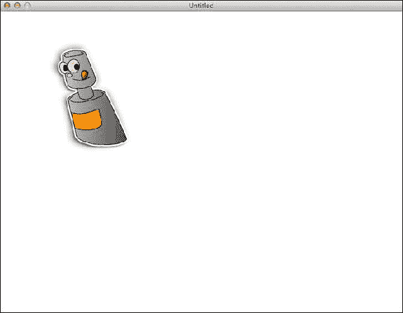

图 11-6 . 镜像图像

### 旋转玩家

在您的游戏中，您可能希望根据点击位置旋转玩家图形——例如，在塔防类游戏中，玩家手持枪支。

如前所述，数学或代码可应用于任何框架，因此要根据屏幕上的某个点确定旋转角度，我们可以使用以下公式：

```lua
theAngle = math.atan2(posY - startY, posX - startX)
```

`startX`和`startY`是玩家的坐标（如我们之前的例子所示），`posX`和`posY`是屏幕上某个点的坐标。

利用这个知识，让我们在屏幕上创建一个始终指向鼠标光标方向的图像。

```lua
local _W, _H = love.graphics.getWidth(), love.graphics.getHeight()
local dirX, dirY = 10, 10
local theImage, x, y
local theAngle = 0
function love.load()
   theImage = love.graphics.newImage("myImage.png")
   x = 50
   y = 50
   love.graphics.setColor(0,0,0,255)
   love.graphics.setBackgroundColor(255,255,255,255)
end

function love.draw()
   love.graphics.draw(theImage, x, y, theAngle)
end
function love.update(dt)
  local mouseX, mouseY = love.mouse.getX(), love.mouse.getY()
  theAngle = math.atan2(mouseY - y, mouseX - x)
end
```

现在，在屏幕上移动光标，您会发现图像转向指向光标当前所在的位置。为了使其看起来更好，我们可以添加一个显示在当前位置的十字准星。

我们对代码所做的更改是使用`love.mouse.setVisible`函数隐藏光标，并显示十字准星图像在光标应处的位置。


```lua
local _W, _H = love.graphics.getWidth(), love.graphics.getHeight()
local dirX, dirY = 10, 10
local theImage, x, y
local theAngle = 0
local crosshair
function love.load()
   theImage = love.graphics.newImage("myImage.png")
   crosshair = love.graphics.newImage("crosshair.png")
   x = _W/2
   y = _H/2
   love.graphics.setBackgroundColor(255,255,255,255)
   love.mouse.setVisible(false)
end

function love.draw()
   love.graphics.draw(theImage, x, y, theAngle)
   love.graphics.draw(crosshair, love.mouse.getX(), love.mouse.getY())
end
function love.update(dt)
  local mouseX, mouseY = love.mouse.getX(), love.mouse.getY()
theAngle = math.atan2(mouseY - y, mouseX - x)
end
```

**注意:** 当我们设置 x 和 y 坐标时，这通常是左上角的位置，所以图像并不完全以 (x, y) 为中心。

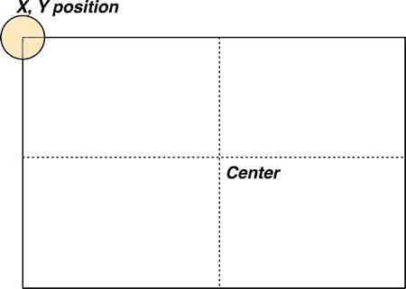

图 11-7. LÖVE 中的屏幕坐标

## 绘制基本图形

现在我们已经在图像上做了一些尝试，接下来将学习矢量图形——矩形、圆形等。在许多游戏中，这些基本图形可以帮助创建背景，而无需额外的图形图像开销。

### 线条

所有矢量绘图对象中最简单的就是线条。线条是连接两点之间的一系列点。绘制线条的语法是：

```lua
love.graphics.line(x1, y1, x2, y2,...)
```

你可以指定一系列的点，它们都会被绘制出来。线条对象也可以通过 `LineWidth` 和 `LineStyle` 属性进行修改，既可以单独修改，如 `love.graphics.setLineWidth` 和 `love.graphics.setLineStyle`，也可以一次性修改，如 `love.graphics.setLine(width, type)`。下面的代码中，我们设置线宽为 2 并使用平滑类型（`smooth`），然后从 (15, 15) 到 (70, 90) 绘制一条线。

```lua
love.graphics.setLine(2,"smooth")
love.graphics.line(15, 15, 70,90)
```

### 矩形

这是绘制矩形的语法：

```lua
love.graphics.rectangle( mode, x, y, width, height )
```

`mode` 可以是 `fill`（填充矩形）或 `line`（仅显示矩形轮廓，不填充）。

在这个例子中，我们将通过绘制国际象棋棋盘来实践矩形的概念。棋盘的特点是由交替颜色的方格组成，通常是 8×8 的大小。

```lua
local _W, _H = love.graphics.getWidth(), love.graphics.getHeight()
local smaller = math.min(_W, _H)
local tileSize = math.floor(smaller/10)  -- 为上下留出空间

function love.load()
    love.graphics.setColor(0,0,0,255)
    love.graphics.setBackgroundColor(255,255,255)
end

function drawBoard()
  local mode = 1
  for i = 1, 8 do
    for j = 1, 8 do
      if mode ==1 then
        theMode = "fill"
      else
        theMode = "line"
      end
      mode = 1 - mode
      love.graphics.rectangle(theMode, j*tileSize, i*tileSize, tileSize, tileSize)
    end
   mode = 1 - mode
  end
end
function love.draw()
  drawBoard()
end
```

代码相当简单直接，我们利用 `1 - 1 = 0` 和 `1 - 0 = 1` 这一事实来切换 `fill` 和 `line`。因此 `1 - mode` 帮助我们切换 `mode` 中保存的值（在 0 和 1 之间）。然后，使用 `if` 语句，如果 `mode` 值为 1，则设置 `theMode` 为 `fill`；如果 `mode` 值为 0，则设置为 `line`。由于我们处理的是偶数个方格，在内层循环结束时，`mode` 的值会恢复为初始值，因此我们再次进行一次切换。这样，下一行就会以交替的模式开始，从而形成交替的图案。如果想看看如果不这样做会发生什么，可以将矩形函数后面的 `mode = 1 - mode` 注释掉，然后查看代码渲染效果。

### 圆形

绘制圆形的函数语法是：

```lua
love.graphics.circle(mode, x, y, radius, segments)
```

`mode` 和之前一样，是 `fill` 或 `line`；`x` 和 `y` 是圆心点；`radius` 是圆的大小。默认的片段数（`segments`）是 10，这会导致绘制出一个有锯齿的圆，适用于调试或资源较少的系统。为了获得平滑高质量的圆，推荐片段数设为 100。

让我们尝试动画化一些圆形：

```lua
local circles = {}
function love.mousepressed(x, y, button)
  if button == "l" then
    newCircle = {
      size = 0,
      n = 20,
      x = x,
      y= y
      }
    table.insert(circles, newCircle)
  end
end
function love.update(dt)
  for _, c1 in pairs(circles) do
    c1.size = c1.size + c1.n * dt
  end
end

function love.keypressed(key)
  if key == " " then
    circles = {}
  end
end
function love.draw()
  for _, c in pairs(circles) do
    love.graphics.circle( "line", c.x, c.y, c.size, 100)
  end
end
```

这段代码使圆圈无限增长。但是，我们可以为圆圈的大小设置最大和最小限制。

让我们选择最大值为 20，最小值为 0。为此，我们只需要修改 `update` 函数，如下所示：

```lua
function love.update(dt)
  for _, c1 in pairs(circles) do
    c1.size = c1.size + c1.n * dt
    if c1.size < 0 then
      c1.size = 0
      c1.n = c1.n * -1
    elseif c1.size > 20 then
      c1.size = 20
      c1.n = c1.n * -1
    end
  end
end
```

### 多边形

多边形使用 `love.graphics.polygon` 函数绘制，其语法如下：

```lua
love.graphics.polygon(mode, vertices)
```

`vertices` 构成一个包含绘制形状所需点的表格。下面的例子绘制了一个朝下的三角形：

```lua
love.graphics.polygon ("fill", 100,100,200,100,150,200)
```

**注意：** 如果使用 `fill` 模式，多边形必须是凸且简单的；否则可能会产生渲染伪影。

### 四边形

我们还可以使用 `love.graphics.quad` 函数绘制四边形形状（四边多边形）。语法是：

```lua
love.graphics.quad( mode, x1, y1, x2, y2, x3, y3, x4, y4 )
```

虽然四边形看起来和多边形很相似，但它们可用于不同的目的——例如，将指定图像的一部分复制到屏幕上。你可以从一张存储了系列图像（纹理）的图片创建动画，然后利用四边形来帮助显示图像的部分区域。

我们可以使用 `newQuad` 函数创建一个四边形，然后使用 `drawq` 函数将其绘制到屏幕上。这对于创建动画表非常有用。

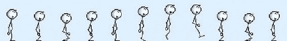

图 11-8. 用于动画化火柴人的精灵表（图片由 Bonzo Industries 提供；[`bonzo_industries.webs.com/sprites.htm`](http://bonzo_industries.webs.com/sprites.htm)）

```lua
lg = love.graphics
sheet = lg.newImage("stick.png")
wd, ht = sheet:getWidth(), sheet:getHeight()
frameCount = 11
frameSpeed = 5
tileWd, tileHt = 39, 62
delay = 0
curr = 1
scale = 2
frames = {}
function love.load()
   for i=1, frameCount do
    frames[i] = lg.newQuad((i-1)*tileWd, 0, tileWd, tileHt)
  end
end
function love.draw()
  lg.drawq(sheet, frames[curr], (_W-(tileWd*scale))/2, (_H-(tileHt*scale))/2, 0, scale, scale)
end
function love.update(dt)
  delay = delay + 1
  if delay > frameSpeed then
    delay = 0
   curr = curr + 1
   if curr > frameCount then curr = 1 end
  end
end
```

在我们的 `love.load` 函数中，我们创建并存储了代表每一帧的四边形。这有助于提高速度和效率。之后，我们只需引用存储在表格中的四边形，就可以简单地绘制序列中的任何一帧。要获取第四帧，我们只需引用第四个四边形（即 `frames[4]`）。在我们的 `drawq` 函数中，我们将 `tileWd` 和 `tileHt` 乘以缩放值（`scale`），并且也将缩放值作为参数传递。这有助于以指定的缩放比例创建动画，在我们的例子中是双倍大小（即 2）。


  
为了让动画可见，我们通过`love.update`函数中的循环使其减慢，每 5 次更新递增一帧。这仅用于演示目的；如果此动画至关重要，则必须依赖`dt`（经过时间）而非 5 次更新，以在所有平台上实现相同帧率。如果运行系统较慢，这可能导致某些帧被跳过。  

我们可以看到一个蹒跚行走的火柴人，如图 Figure 11-9 所示。  

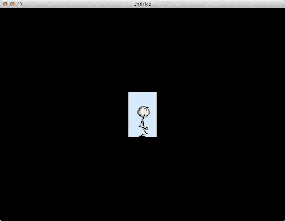  

Figure 11-9. 我们的火柴人动画  

## 应用程序设置 – `conf.lua`  

LÖVE 允许你配置应用程序的设置。为此，你需要一个`conf.lua`文件，其中必须包含一个`love.conf`函数。如果`conf.lua`文件存在，它会在`main.lua`之前运行。  

我们可以创建任意大小的应用程序窗口。此示例将应用程序设置为移动应用屏幕尺寸 320×480（参见 Figure 11-10）。  

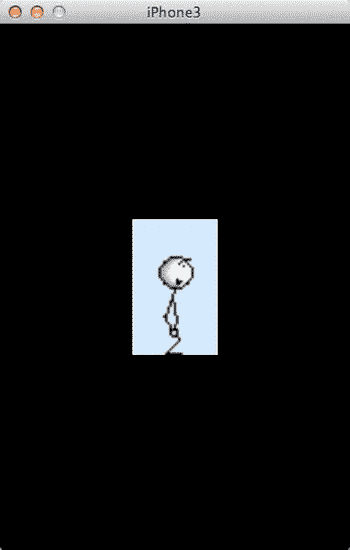  

Figure 11-10. 以移动应用尺寸运行应用程序  

```
function love.conf(t)
  t.screen.width = 320
  t.screen.height = 480
  t.title = "iPhone3"
  t.author = "Jayant C Varma"
end
```

可以添加到`love.conf`函数中的其他设置包括`t.screen.fullscreen`，其值可为`true`或`false`。  

你还可以使用模块设置来启用或禁用某些模块。以下是一些示例：  

```
t.modules.joystick = false
t.modules.keyboard = true
t.modules.event = true
t.modules.physics = false
```

## 创建效果  

LÖVE 预装了粒子效果，因此你可以在应用或游戏中创建许多壮观的效果，包括烟雾轨迹、雾和雪。  

要创建粒子，我们需要创建一个 *粒子发射器*——一个将发射粒子的源。然后我们需要设置粒子的参数（例如，移动速度、生命周期、衰变时间、粒子类型等）。  

```
function love.load()
  img = love.graphics.newImage("part2.png")
  p = love.graphics.newParticleSystem(img, 256)
  -- 创建一个新的粒子发射器，它发射具有图像 img 的粒子，最多可有 256 个粒子。
  p:setEmissionRate(20)
  p:setLifetime(1)
  p:setParticleLife(4)
  p:setPosition(50,50)
  p:setDirection(0)
  p:setSpread(2)
  p:setSpeed(10,30)
  p:setGravity(30)
  p:setRadialAcceleration(10)
  p:setTangentialAcceleration(0)
  p:setSize(1)
  p:setSizeVariation(0.5)
  p:setRotation(0)
  p:setSpin(0)
  p:setSpinVariation(0)
  p:setColor(200,200,255,240,255,255,255,10)
  p:stop()
end

function love.update(dt)
  p:start()  -- 创建一个粒子爆发
  p:update(dt) -- 根据需要更新粒子的位置
end

function love.draw()
  love.graphics.draw(p, 20, 0)
end
```

如果你希望粒子发射器跟随鼠标移动，只需将`love.update`函数修改如下：  

```
function love.update(dt)
  p:setLocation(love.mouse:getX(), love.mouse:getY())
  p:start()  -- 创建一个粒子爆发
  p:update(dt) -- 根据需要更新粒子的位置
end
```

现在，粒子发射器将移动到鼠标光标的位置。如果你希望移除指针，请在`love.load`函数中添加以下行：  

```
love.mouse.setVisible(false)
```

如图 Figure 11-11 所示，这将创建一个喷出粒子的粒子发射器。你可以尝试调整各种`setGravity`值；例如，负数会使粒子漂浮。你还可以调整`setSize`来改变粒子的大小，以及调整`setColor`来改变粒子的颜色。  

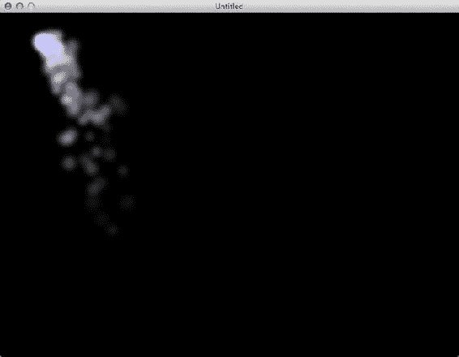  

Figure 11-11. 跟随鼠标指针的粒子效果  


  
**提示**：如果你希望可视化地创建粒子效果，有一款用 LÖVE 编写的应用程序可以实现交互式粒子创建。你可以在[`love2d.org/forums/viewtopic.php?f=5&t=8747&sid=9bf680d6ed9857549d63fb2ba63fc078`](https://love2d.org/forums/viewtopic.php?f=5&t=8747&sid=9bf680d6ed9857549d63fb2ba63fc078)找到它。

### 物理引擎

在物理引擎方面，Box2D 是所有框架的共同核心。如前所述，Box2D 是一个非常复杂且庞大的库。虽然有些框架封装并提供了少量函数来使用该库，但 LÖVE 为开发者提供了完整的访问权限，因此创建物理体需要多几个额外步骤。

首先，我们需要设置物理世界，在其中定义其边界。一个不错的起点是使用屏幕尺寸作为世界的大小。

```
world = love.physics.newWorld(0,0,_W,_H)
```

**注意**：在 LÖVE 0.8.0 中，`love.physics.newWorld`函数的参数已更改为接收重力的 x、y 分量以及是否允许物体休眠：`love.physics.newWorld( xg, yg, sleep )`。

接下来，我们设置物体的缩放比例（这在 Corona SDK 中是无法实现的，这也导致其在物理体方面存在一些缺陷）：

```
world:setMeter( number )
```

这个物理世界中的所有坐标都会除以这个数值。这是一种无需图形变换即可在屏幕上绘制的便捷方法。

然后，我们创建物理体：

```
local body = love.physics.newBody(world, 10, 10, 0, 0)
```

传递的参数依次是：世界对象、x 坐标、y 坐标、物体的质量以及物体的转动惯量。

物理世界不会自动更新自己，需要由我们来手动更新。我们可以通过`love.update`方法来确保它更新，如下所示：

```
function love.update(dt)
  world:update (dt)
end
```

**注意**：在 LÖVE 0.8.0 中，此函数已被修改，不再接受质量和惯量参数，而是接收一个定义物体类型的字符串，类型可以是静态（static）、动态（dynamic）或运动学（kinematic），定义方式为`love.physics.newBody( world, x, y, type )`。

创建物体后，我们需要赋予它一个形状。这是物理对象上的边界框，可以是矩形、圆形、多边形、边缘形状或链状形状。*边缘形状*是一个线段，而*链状形状*则由多个线段组成。

```
local bodyshape = local.physics.newRectangleShape(body, 0, 0, 20, 40, 0)
```

这段代码赋予了物体一个矩形形状，起始位置相对于物体为(0, 0)，宽度为 20 个单位，高度为 40 个单位。

如果此时运行这段代码，什么也不会发生。我们还需要将物体绘制到屏幕上。为此，我们需要在`love.draw()`函数中绘制形状：

```
function love.draw()
  love.graphics.rectangle("fill", body:getX(), body:getY(), 20, 40)
end
```

现在，你会看到屏幕左上角绘制了一个矩形。但它并不会像物理体那样自动移动。这是因为质量当前被设置为 0，意味着物体没有重量，因此不会移动。如果我们修改它，赋予它一点重量，它就会开始下落或上升（取决于重力设置）。如果在这个例子中给物体赋予一个正的质量值，它将会掉出屏幕，因为没有其他物体阻止它下落。

我们为`bodyShape`选择矩形而非多边形的原因之一是：由于这个对象将是一个动态对象，我们需要它随着移动而被绘制。使用`body:getX()`和`body:getY()`函数可以获取对象的当前 x 和 y 位置并在此绘制。如果我们使用了多边形方法，它会在固定位置创建一个静态对象。

我们在`love.load()`函数中添加以下两行代码：

```
ground = love.physics.newBody(world, 400,600,0,0)
groundShape = love.physics.newRectangleShape(ground, 0,0,800,65,0)
```

这创建了一个名为`ground`的静态对象，它是一个矩形形状的物体。然后我们在`love.draw()`函数中添加以下代码，用于渲染实心形状：

```
love.graphics.polygon("fill", groundShape:getPoints())
```

现在，底部有了一个地面，它可以防止较小的物理体掉出屏幕。

我们还可以通过鼠标点击为物体添加冲量来实现交互功能。这通过`love.mousepressed`函数实现：

```
function love.mousepressed(key, button)
  if button == "l" then
    body:addImpulse(0,-20)
  end
end
```

当我们在窗口中点击时，物体会跳起，然后再次落回地面。你可以将冲量值改为更大或更小的数字来改变结果。

当物体超出我们设置的世界范围时，它会被移除，所以如果它跳得过高，就不会再返回。如果你希望物体跳出屏幕后能返回，那么需要创建一个比屏幕尺寸更大的世界——例如：

```
world = love.physics.newWorld(−_W, -_H, _W*2, _H*2)
```

## 显示文本

在游戏中，除了精灵、物理体等元素之外，我们可能还希望在屏幕上显示文本。我们使用`love.graphics`库中的`print`或`printf`函数。以下是`print`函数的示例：

```
love.graphics.print("Hello world", 10, 10)
```

下面是`printf`函数的示例：

```
love.graphics.printf("Hello World finally but right aligned", 25, 45, 30, "right")
```

如前所述，这需要放在`love.draw`函数中；否则，它不会在屏幕上显示。

`print`函数只是将文本绘制在提供的 x、y 坐标处，而`printf`函数则绘制格式化、自动换行并对齐的文本。`printf`函数的语法是：

```
printf(text, x, y, width, alignment)
```

`alignment`参数是一个字符串，可以是`left`、`right`或`center`，`width`参数指定文本的宽度；任何超过该值的文本都会自动换行。

正如前面“图像”部分所述，我们可以通过`love.graphics.setColor`函数设置颜色。这将为后续绘制的所有对象设置颜色。因此，管理颜色的方法是在绘制每个对象之前为其设置颜色。

要打印彩虹的七种颜色，我们可以使用：

```
lg = love.graphics
lgc = love.graphics.setColor
function love.load()
  lg.setBackgroundColor(255,255,255)
end

function love.draw()
  lgc(141,56,201) -- 紫色
  lg.print("Violet", 10,10)
  lgc(46,08,84) -- 靛色
  lg.print("Indigo", 10,30)
  lgc(0,0,255) -- 蓝色
  lg.print("Blue", 10,50)
  lgc(0,255,0) -- 绿色
  lg.print("Green", 10,70)
  lgc(255,255,0) -- 黄色
  lg.print("Yellow", 10,90)
  lgc(255,165,0) -- 橙色
  lg.print("Orange", 10,110)
  lgc(255,0,0) -- 红色
  lg.print("Red", 10,130)
end
```

## 着色器

LÖVE 从 0.8.0 版本开始支持像素着色器，这些也被称为片段着色器。它们计算每个像素的颜色和其他属性。使用着色器，你可以生成各种效果，包括为图像添加颜色。

像素效果不是用 Lua 编程或描述的，而是使用 OpenGL 着色语言（GLSL），它是像素着色器使用的函数子集。请注意 GLSL 与 Lua 语法相比更接近 C 或 JavaScript 类型的语法。

让我们制作一个将图像着色为黑白效果的示例：

```
local image = love.graphics.newImage("myImage.png")
imagesx = image:getWidth()
imagesy = image:getHeight()

effect = {}
effect.name = "Black and White"
effect.effect = love.graphics.newPixelEffect [[
    extern number value;
    vec4 effect(vec4 color, Image texture, vec2 texture_coords, vec2 pixel_coords)
      {
        vec4 pixel = Texel(texture, texture_coords);
        float avg = max(0, ((pixel.r + pixel.g + pixel.b)/3) + value/10);
        pixel.r = avg;
        pixel.g = avg;
        pixel.b = avg;
        return pixel;
      }
]]

value = 0
```


```lua
function effect.func()
    effect.effect:send("value", value)
    love.graphics.setPixelEffect(effect.effect)
    love.graphics.draw(image)
end

function love.draw()
    love.graphics.setColor(255,255,255)
    effect.func()
    love.graphics.setPixelEffect()
end
```

要反转图像的颜色，我们可以简单地将效果修改如下：

```lua
effect.effect = love.graphics.newPixelEffect [[
    vec4 effect(vec4 color, Image texture, vec2 texture_coords, vec2 pixel_coords)
      {
        vec4 pixel = Texel(texture, texture_coords);
        pixel.r = 1.0 - pixel.r;
        pixel.g = 1.0 - pixel.g;
        pixel.b = 1.0 - pixel.b;
        return pixel;
      }
]]
```

这也需要对`effect.func`函数进行细微调整：

```lua
function effect.func()
    love.graphics.setPixelEffect(effect.effect)
    love.graphics.draw(image)
end
```

我们所做的只是将像素的`r`、`g`和`b`颜色值设置为 1 减去原值，这类似于反转图像的顏色。如需更多特效，可以阅读 [`www.opengl.org/documentation/glsl/`](http://www.opengl.org/documentation/glsl/) 上的 GLSL 文档，也可以自行尝试修改代码。论坛上有相当多的示例可供下载和学习。苹果公司有自己的 GLSL 文档，位于 [`developer.apple.com/library/mac/#documentation/GraphicsImaging/Conceptual/OpenGLShaderBuilderUserGuide/Introduction/Introduction.html`](https://developer.apple.com/library/mac/#documentation/GraphicsImaging/Conceptual/OpenGLShaderBuilderUserGuide/Introduction/Introduction.html)，该文档指向的是较旧的 1.20.8 版本。应该使用这个版本而非更新的版本，因为苹果公司提供信息的版本正是 iOS 设备上可用的版本。

### 制作声音

如果不能播放声音，游戏框架就是不完整的。使用 LÖVE 时，我们首先需要将声音加载到内存中，然后按需播放。

```lua
popSound = love.audio.newSource("pop.ogg", "static")
```

`"static"`参数告诉 LÖVE，它需要在开始播放之前完全加载并解码这个声音。这与流式播放不同，后者可以在从磁盘流式传输的过程中分段播放声音。

要播放声音，我们只需使用：

```lua
love.audio.play(popSound)
```

我们来创建一个示例，每次点击窗口时都会发出“砰”的一声：

```lua
function love.load()
  pop = love.audio.newSource("pop.ogg", "static")
end

function love.mousepressed(mx, my, mButton)
  if mButton == "l" then
    love.audio.play(popSound)
  end
end
```

除了播放声音，LÖVE 还提供了增大和减小音量的函数。你也可以通过使用`popSound:setPitch(value)`来改变音调，其中`value`的范围在 0 到 1 之间。`setVolume`也使用相同的范围，可以设置为`popSound:setVolume(value)`。

在这个示例中，我们会在音调上做一些有趣的变化：

```lua
count = 1

function love.load()
  pop = love.audio.newSource("pop.ogg", "static")
end

function love.mousepressed(mx, my, mButton)
  if mButton == "l" then
    count = count + 1
    if count>15 then count = 1 end
    pop:setPitch(count/10)
    love.audio.play(popSound)
  end
end
```

利用你学到的知识，尝试创建一个类似于重复气泡膜图案的网格，网格中的每个单元格使用一个气泡图像。当每个气泡被点击时，让图像变为一个已戳破的气泡，并发出“砰”的破裂声。

如果你想播放一些背景音乐——即在游戏期间持续循环播放，或直到你希望停止为止——可以使用`setLooping`函数：

```lua
backgroundMusic = love.audio.newSource("music.mp3")
backgroundMusic:setLooping(true)
love.audio.play(backgroundMusic)
```

## 示例游戏代码

最后这部分将给出一个游戏示例，它涵盖了本章讨论的所有主题。该示例创建了一个图片逻辑谜题（也称为数织谜题），类似于填字游戏，不同之处在于玩家需要根据提供的数字线索，用数字而不是字母来填充方格。例如，如果线索是`2`，表示该行或列包含两个连续的填充方格。线索`1,1`表示该行或列包含两个不连续的方格，且它们之间至少有一个空白方格。

在我们的示例中，我们将为 5×5 的网格随机创建一个谜题并生成线索，如图 11-12 所示。

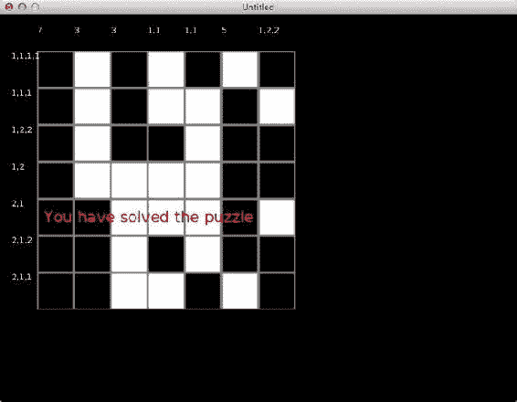

图 11-12 . 一个图片逻辑谜题游戏

```lua
squares = 5
_W = love.graphics:getWidth()
_H = love.graphics:getHeight()

math.randomseed(os.time())
local size = 400/squares
local boxes = {}
local solved = false

function make_board()
  solved = false
  size = 400/squares    -- 重新计算尺寸
  boxes = {}            -- 重置数组

  -- 通过填充棋盘创建一个随机谜题
  for x = 1, squares do
    for y = 1, squares do
      box = {Orig = math.random(0,1), X = x, Y = y, Curr = 0}
      -- 我们随机将该方格的原始值设为开或关
      table.insert(boxes, box)
    end
  end

  -- 将第一行设为开启状态
  for k,v in pairs(boxes) do
    if v.X == 1 then
      v.Orig = 1
    end
  end
end

make_board()

function findnumberx(x)
  -- 返回列 x 的线索
  local n = {}
  local c = 0

  for k,v in pairs(boxes) do
    if v.X == x then
      if v.Orig == 1 then
        c = c + 1
      else
        if c > 0 then
          table.insert(n, tostring(c))
        end
        c = 0
      end
    end
  end

  if c > 0 then
    table.insert(n, tostring(c))
  end

  return table.concat(n,",")
end

function findnumbery(y)
  -- 返回行 y 的线索
  local n = {}
  local c = 0
  for k,v in pairs(boxes) do
    if v.Y == y then
      c = c + 1
    else
      if c > 0 then
        table.insert(n, tostring(c))
      end
      c = 0
    end
  end
  if c > 0 then
    table.insert(n, tostring(c))
  end
  return table.concat(n, ",")
end

function love.load()
  button_off = love.graphics.newImage("buttonoff.png")
  button_on = love.graphics.newImage("buttonon.png")
  button_not = love.graphics.newImage("buttonnot.png")
end

function love.draw()
  love.graphics.setColor(255,255,255)  -- 白色
  love.graphics.setFont(love.graphics.newFont(12))  -- 12 磅字号

  -- 绘制对应的图像：开、关或未标记
  for k, v in pairs(boxes) do
    if v.Curr == 0 then
      love.graphics.draw(button_off, v.X*size, v.Y*size, size/30, size/30, 0, 0)
    elseif v.Curr == 1 then
      love.graphics.draw(button_on, v.X*size, v.Y*size, size/30, size/30, 0, 0)
    elseif v.Curr == 2 then
      love.graphics.draw(button_not, v.X*size, v.Y*size, size/30, size/30, 0, 0)
    end
  end

  -- 显示列的线索
  for x=1, squares do
    love.graphics.print(findnumberx(x), x*size, size - 40)
  end

  -- 显示行的线索
  for y=1, squares do
    love.graphics.print(findnumbery(y), size-40, size*y)
  end

  -- 显示谜题是否已解开
  if solved then
    love.graphics.setColor(255,0,0)  -- 红色
    love.graphics.setFont(love.graphics.newFont(24))  -- 24 磅字号
    love.graphics.print("你已解开谜题",
      size + 10, _H/2)
  end
end
```

```lua
function love.mousepressed(mx, my, button)
  for k, v in pairs(boxes) do
    theBox = mx > v.X * size and my > v.Y * size and
             mx < v.X * size + size and my < v.Y * size + size
    -- 检查鼠标点击位置是否在格子内
    -- v 为当前所在格子
    if theBox then
      if mouse=="l" then
        -- 若点击左键，则设置或取消网格
        if v.Curr == 0 or c.Curr == 2 then
          v.Curr = 1
        else
          v.Curr = 0
        end
      elseif mouse == "r" then
      -- 若点击右键，则标记或取消网格
        if v.Curr == 0 or v.Curr == 1 then
          v.Curr = 2
        else
          v.Curr = 0
        end
      end
    end
  end

solved = true
  for k,v in pairs(boxes) do
    if v.Curr == 2 then v.Curr = 0 end
    if v.Orig == v.Curr then
      -- 不做任何操作，一切正常
    else
      -- 若 Orig 与 Curr 不相等，则表示谜题尚未解开
      solved = false
      break
    end
  end
end

function love.keypressed(key)
  if key == "up" or key == "w" then
  -- 若按下 w 或上箭头键，则增加棋盘尺寸
    if sqaures < 9 then
      squares = squares + 1
      make_board()
    end
  elseif key == "down" or key == "s" then
  -- 若按下 s 或下箭头键，则减小棋盘尺寸
    if sqaures > 2 then
      squares = squares - 1
      make_board()
    end
  end
end
```

**注**：此代码取自 LÖVE 论坛，由用户 GijsB 编写，原文链接：[`love2d.org/forums/viewtopic.php?f=5&t=3391`](https://love2d.org/forums/viewtopic.php?f=5&t=3391)。

## 摘要

本章讨论了 LÖVE 中可用的各种函数。这是一款功能全面且强大的桌面应用框架，可用于将桌面特性集成到移动应用中。LÖVE 在多个方面堪称完备框架：它具备跨平台能力，功能完善，集物理、音效、粒子系统和绘图函数于一身。此外，它是极少数能支持像素级访问的框架之一。

下一章我们将介绍 Codea，该框架受 LÖVE 启发并借鉴了 Processing 库的设计。

