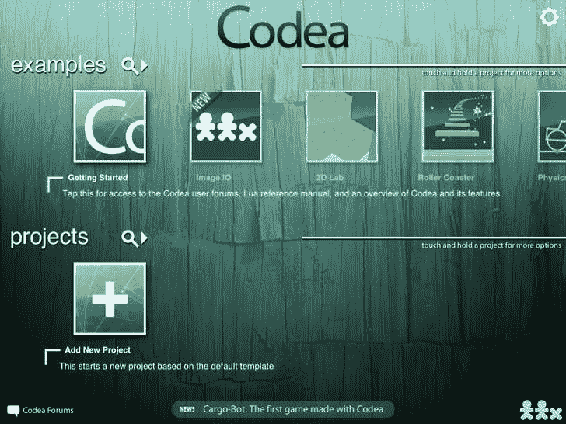
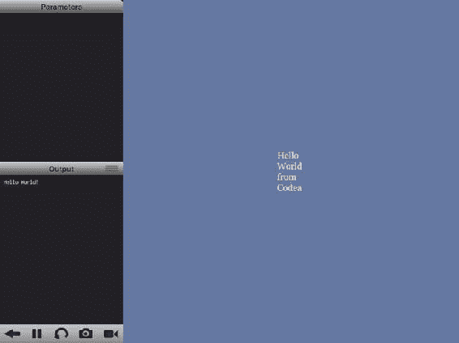
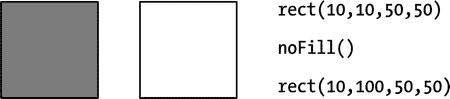
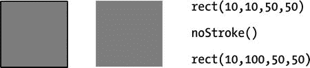
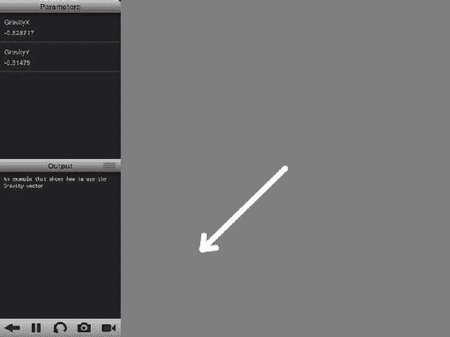
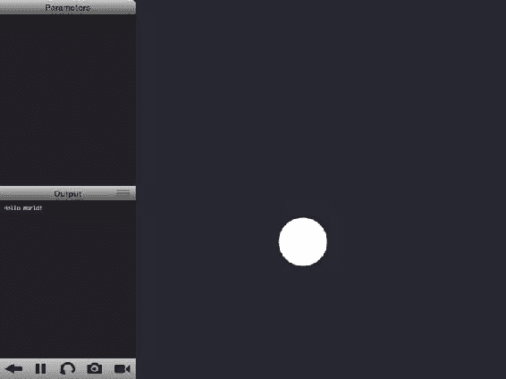

# 第 12 章：Codea

我们列表中的最后一个框架是 Codea。它最初是作为 iPad 上的集成开发环境创建的。该应用最大的亮点（至今依然如此）是其编辑器，它让在 iPad 上编辑（或更准确地说，编写）代码变得充满乐趣。编辑器具备自动补全功能，并配备定制键盘，将常用键触手可及，无需在键盘布局间切换来输入特定数字或符号。

Codea 的最大优势在于，你可以直接在目标设备上测试应用，无需像其他框架那样上传至设备或使用模拟器。从这个意义上讲，Codea 是可用的最快、最精确的模拟器和运行器。

## 获取 Codea

获取 Codea 的第一步是从 iTunes 商店购买；目前它仅支持 iPad。Codea 应用的下载链接为：[`itunes.apple.com/au/app/codea/id439571171?mt=8`](http://itunes.apple.com/au/app/codea/id439571171?mt=8)。

启动 Codea 后，你会看到如图 12-1 所示的启动画面，你既可以选择打开示例项目进行学习，也可以创建新项目。新建项目时，Codea 会自动生成一个骨架模板供你扩展。点击“入门指南”按钮将跳转至 Codea 的完整参考文档，包括参考手册、论坛、维基以及 Lua 参考手册。



图 12-1 . 启动 Codea 时的初始界面

## Codea 架构

Codea 的主要部分是编辑器，它具备 Lua 语法高亮功能。驱动 Codea 的引擎与 Processing 语言（参见 [`processing.org`](http://processing.org)）有很多共通之处。其概念和 API 取自 Processing，Codea 受益于 Processing 成熟稳定的 API。

借助 Codea 运行时，你可以使用 Mac 上的 Xcode 在桌面端编译代码。使用 Codea 编写的代码可通过运行时编译，并可将应用上传至 iOS App Store。首个使用 Codea 运行时创建的应用是 Cargo-Bot，这证明了 Codea 运行时已具备作为框架使用的成熟度。

## Hello World

与大多数基于 Lua 的框架一样，Codea 使用 `main.lua` 作为代码运行的入口点。`main.lua` 文件中包含两个辅助应用运行的函数。

第一个是 `setup` 函数，该函数仅在应用启动时运行一次，可用于执行所有初始化代码。第二个是 `draw` 函数，负责在每一帧绘制（或者说更新）屏幕内容。以下是这两个函数的示例：

```
function setup()
  print("Hello World")
end

function draw()
  background(100,120,160,255)
  font("Georgia")
  fill(255)
  fontSize(20)
  textWrapWidth(70)
  text("Hello World from Codea", WIDTH/2, HEIGHT/2)
end
```

运行这些函数时，屏幕中央会显示文字“Hello World from Codea”，如图 12-2 所示。Codea 运行窗口左侧有两个属性面板，分别显示参数和控制台输出窗口，其余区域则显示代码的图形输出。



图 12-2 . 使用 Codea 实现的 Hello World

**注**：可以通过 `displayMode(FULLSCREEN)` 函数移除左侧两个窗口，以获取更多屏幕空间。

参数可用于对代码进行交互式输入，通常以滑块形式呈现，帮助设置数值范围。

## 参数

在交互式运行模式下，你可能希望实时修改部分代码以观察输出变化。例如，假设你想调整线条宽度或圆的半径，无需在代码中设置并重新运行，而可以使用参数滑块实时调整。

参数通过 `parameter` 函数创建。`parameter` 函数接受三个参数：参数*名称*、*起始*范围和*结束*范围。参数名称同时也是可在代码中访问的全局变量名。示例如下：

```
parameter("Radius", 1, 10)
```

这将在“参数”窗口中创建一个滑块，用于选择半径。创建参数滑块的最佳位置是 `setup` 函数。`parameter` 函数允许滑块值为浮点数，而 `iparameter` 则用于选择范围内的整数值。

```
function setup()
  parameter("Radius", 100, 500)
  iparameter("BlueAmount", 0, 255)
end

function draw()
  background(10,10,20)
  stroke(255)
  fill(255,0,BlueAmount)

strokeWidth(1)
  ellipseMode(RADIUS)
  ellipse(0,0,Radius, Radius)
end
```

运行代码后，我们可以调整绘制椭圆的半径，并修改蓝色分量值，从而使颜色从红色渐变为品红色。

**注**：可以为 `parameter` 或 `iparameter` 函数添加第四个参数，用于设置全局变量的初始值。

## 使用 Codea 绘图

由于 Codea 是基于图形用户界面的框架，我们重点介绍用于创建图形的 `draw` 函数。


## Codea 绘制基础

在 `Codea` 绘制表面上，屏幕每秒刷新（或者说绘制）超过 60 次。然而，不能保证 `draw` 函数每秒会被调用 60 次，因为这取决于 `draw` 内部的代码完成并返回所需的时间。

`Codea` 中的屏幕与其他框架略有不同。在大多数框架中，左上角是原点 `(0, 0)`，`x` 轴值向右增加，`y` 轴值向下增加。在 `Codea` 中，左下角是原点，`x` 轴值向右递增，`y` 轴值向上递增。

其次，由于侧面板的存在，屏幕会被遮挡，在横屏模式下报告的大小为 750×768，在竖屏模式下为 494×1024。你可以通过调用 `displayMode(FULLSCREEN)` 函数来移除这个面板。然而，即使在全屏模式下，Figure 12-2 底部显示的按钮仍然存在。要同时移除这些按钮，你可以使用 `displayMode(FULLSCREEN_NOBUTTONS)` 函数。

如果你使用 `displayMode` 函数并传入 `FULLSCREEN_NO_BUTTONS` 参数，则需要手动调用 `close` 函数才能返回到编辑器。

### 方向

可以使用 `supportedOrientation` 函数来设置 `Codea` 应用程序的方向。`supportedOrientation` 的默认值是 `ANY`，它支持所有方向。但是，你可以将其预设为你需要的方向。

选项如下：

*   `ANY`
*   `LANDSCAPE_ANY`
*   `LANDSCAPE_LEFT`
*   `LANDSCAPE_RIGHT`
*   `PORTRAIT`
*   `PORTRAIT_ANY`
*   `PORTRAIT_UPSIDE_DOWN`

### 系统键盘

可以根据需要使用 `showKeyboard` 和 `hideKeyboard` 函数来显示或隐藏键盘。还有另一个与键盘相关的函数 `keyboardBuffer`，它返回键盘缓冲区中的文本。每次显示键盘时，键盘缓冲区都会被清除。以下是使用 `showKeyboard` 和 `keyboardBuffer` 函数的示例：

```lua
function touched(touch)
  showKeyboard()
end

function draw()
  background(40,40,50)
  fill(255)
  textMode(CORNER)

buffer = keyboardBuffer()
  _, bufferHeight = textSize(buffer)
  if buffer then
  text (buffer, 10, HEIGHT – 30 – bufferHeight)
  end 
end
```

#### 绘制模式

当你绘制某些内容时，它不会自动持久化，即每次都会被擦除并需要重新绘制。但是，你可以设置模式，使先前绘制的帧保留在屏幕上而不会被擦除。你可以通过将 `backingMode` 设置为 `RETAINED` 来实现这一点。默认模式是 `STANDARD`。

**注意**：当 `RETAINED` 模式与新 iPad 一起使用时，iOS5 中的一个 bug 会导致其无法按预期工作。不过 Apple 在 iOS6 中修复了这个问题，现在可以正常工作。

### 背景颜色

可以使用 `background` 函数来更改背景颜色。该函数接受 RGBA 格式的颜色值。使用 `Codea` 编辑器时，你也可以通过简单地点击数字来手动选择和设置颜色，这会弹出一个颜色选择器供手动选择。

`background(red, green, blue, alpha)`

### 笔颜色

可以使用 `stroke` 函数来设置用于所有绘图的笔颜色（或*前景*颜色）。`stroke` 函数接受的参数也是 RGBA 格式的。

```lua
stroke(0,0,0,255)  -- 会将笔颜色设置为黑色
```

### 填充颜色

可以使用 `fill` 函数来设置填充颜色。其参数的设置方式与前面两个颜色函数类似。

```lua
fill(255,164,0)  -- 将填充颜色设置为橙色
```

### 线宽

可以使用 `strokeWidth` 函数来更改绘图的线宽。

```lua
strokeWidth(3)  -- 将描边宽度设置为 3
```

**注意**：虽然你可以通过 `fill(255,164,0)` 设置填充颜色，或通过 `stroke(0,0,0)` 设置笔颜色，或通过 `strokeWidth(3)` 设置描边宽度，但你也可以不传递任何参数来获取这些值，例如 `fill()` 会返回当前填充颜色，`stroke()` 会返回描边颜色，`strokeWidth()` 会返回宽度。

### 绘制线条

绘制线条的函数是 `line`。它接受四个参数：线条起点的 `x` 和 `y` 坐标以及终点的 `x` 和 `y` 坐标。线条在这两点之间绘制。

```lua
line(10,10,300,300)  -- 在 (10,10) 和 (300,300) 之间绘制一条线
```

*线帽*模式用于确定线条端点的绘制方式。绘制线条时有三种*线帽*模式：`ROUND`、`SQUARE` 和 `PROJECT`。默认模式是 `ROUND`。

*   `ROUND`：绘制末端为圆形的线条
*   `SQUARE`：绘制末端为方形的线条
*   `PROJECT`：绘制方形边缘但向外突出的线条，类似于 `ROUND` 模式。

### 抗锯齿

绘制线条时，最终可能会出现锯齿边缘，这会造成不愉快的视觉体验。为了解决这个问题，`Codea` 有一个平滑边缘的函数——即所谓的*抗锯齿*。要执行抗锯齿，你可以调用 `smooth` 函数，之后绘制的所有线条都将被抗锯齿处理。

**注意**：在绘制细线时，你可能希望使用 `noSmooth` 函数切换到无抗锯齿模式。抗锯齿处理后的细线可能看起来比没有抗锯齿的细线更差。

### 绘制圆和椭圆

绘制圆或椭圆的函数是 `ellipse`。它接受四个参数，这些参数取决于绘制椭圆所使用的*椭圆模式*（如下所述）。在其中一种模式 `CENTER` 下，四个参数分别是绘制圆的中心点的 `x`、`y` 坐标，然后是直径——一个用于 `x` 轴，一个用于 `y` 轴。如果这两个值相同，则绘制一个圆。如果不同，则绘制一个椭圆。

以下是绘制圆的语法：

```lua
ellipse(50,50,20,20)
```

以下是绘制椭圆的语法：

```lua
ellipse(100,100,20,50)
```

如前所述，有四种椭圆模式允许你以多种方式绘制椭圆：

*   `CENTER`：在这种模式下，参数是中心点的 `x`、`y` 坐标，然后是 `x` 和 `y` 方向的直径。这是前面示例中使用的模式。
*   `RADIUS`：此模式使用中心点的 `x`、`y` 坐标，然后是 `x` 和 `y` 方向的*半径*（而不是直径）。
*   `CORNER`：此模式接受椭圆左下角的 `x`、`y` 坐标，然后是宽度和高度。椭圆在参数指定的边界矩形内绘制。
*   `CORNERS`：此模式接受椭圆左下角的 `x`、`y` 坐标，然后是椭圆右上角的 `x`、`y` 坐标。椭圆在参数指定的边界矩形内绘制。

以下代码片段提供了上述模式的示例：

```lua
ellipseMode(CENTER)
ellipse(100,100,50,50)

ellipseMode(RADIUS)
ellipse(100,200,50,50)

ellipseMode(CORNER)
ellipse(200,100,50,50)

ellipseMode(CORNERS)
ellipse(200,200,50,50)
```

### 绘制矩形

绘制矩形的函数是 `rect`。它接受四个参数，与椭圆一样，这些参数取决于绘制矩形时所处的模式。在 `CENTER` 模式下，参数是起始点的 `x`、`y` 坐标，然后是矩形的宽度和高度。

```lua
rect(10,10,300,100)  -- 绘制一个 300×100 的矩形，并将其放置在 (10,10) 位置
```

以下是绘制矩形的四种模式：


#### 矩形的绘制模式

`rect()` 函数支持以下几种绘制模式：

- `CENTER`：此模式以中心点的 x、y 坐标为参数，后接宽度和高度。
- `RADIUS`：此模式以中心点的 x、y 坐标为参数，后接宽度和高度的一半。
- `CORNER`：此模式以矩形左下角的 x、y 坐标为参数，后接宽度和高度。矩形将被绘制在参数指定的边界矩形内。
- `CORNERS`：此模式以矩形左下角的 x、y 坐标为参数，后接右上角的绝对坐标，而非宽度和高度。矩形将被绘制在参数指定的边界矩形内。

以下代码片段展示了上述模式的用法：

```
rectMode(CENTER)
rect(100,100,50,50)

rectMode(RADIUS)
rect(100,200,50,50)

rectMode(CORNER)
rect(100,100,50,50)

rectMode(CORNERS)
rect(100,200,50,50)
```

### 绘制文本

用于在屏幕上绘制文本的函数是 `text`。它需要三个参数：文本本身，以及文本显示位置的 x、y 坐标。

```
text("This is sample text", 10,200)
```

还有其他函数可以帮助设置所显示文本的属性，例如字体名称和大小。以下函数会创建文本，同时返回所创建文本的宽度和高度：

```
w, h = textSize("Hello World")
print(w, h)
```

#### 绘制模式

`text` 函数也有两种绘制模式，用于指定如何解析传入的参数以及如何显示文本：

- `CENTER`：在此模式下，文本将围绕传递给 `text` 函数进行绘制的 x、y 坐标居中显示。这是默认的文本绘制模式。
- `CORNERS`：在此模式下，传递给 `text` 函数的 x、y 坐标指定文本的左下角。

#### 文本对齐

绘制文本时，可以将其设置为左对齐（`LEFT`）、右对齐（`RIGHT`）或居中对齐（`CENTER`）。默认的文本对齐设置为 `LEFT`。

#### 文本换行

在绘制文本时，你还可以设置要显示的文本宽度，任何超出该宽度的文本都将自动换行。如果文本换行设置设为 `0`，则文本不会换行。

```
textWrapWidth(80)
text("This text would get wrapped onto multiple lines",100,100)
```

#### 更改字体

`font` 函数可用于渲染文本。在 iOS 设备上，可以设置的字体仅限于设备上可用的字体列表，默认使用的字体是 `Helvetica`。

#### 更改字号

`fontSize` 函数可用于更改正在渲染的字体大小。文本渲染的默认大小是 17 磅。

### 显示图像

Codea 中的精灵（Sprite）是可以使用 `sprite` 函数加载并显示在屏幕上的图像。但是，根据 Codea 架构的定义方式，存在*精灵包（sprite packs）*，你可以从中使用图像。要加载图像，不像其他框架那样使用图像的路径，而是将图像引用为 `SpritePack:SpriteName`。此函数至少需要三个参数：`spriteName`（即*图像句柄*），以及精灵将放置的 x、y 坐标。该函数也可以将宽度和高度作为参数。

```
sprite("Planet Cute:Grass Block", WIDTH/2, HEIGHT/2)
```

**注意** 在当前版本的 Codea 中，你还可以使用来自设备相册或剪贴板的图像，以及来自 Dropbox 和 Codea 内置免费精灵库（来自 Dan Cook 的 [`lostgarden.com`](http://lostgarden.com)）的图像。

从设备或在线来源加载的图像可以在 Codea 中用作精灵。要确定精灵的大小，你可以使用 `spriteSize` 函数，该函数会返回传递给它的精灵名称的宽度和高度。

```
sprWidth, sprHeight = spriteSize("Planet Cute:Grass Block")
print(sprWidth, sprHeight)
```

你还可以设置*精灵模式（sprite mode）*，它决定了精灵在屏幕上的显示方式。x、y 坐标用于定位精灵，这与绘图的选项类似。`SpriteMode` 的默认值是 `CENTER`。其他可设置的模式有 `RADIUS`、`CORNER` 和 `CORNERS`，它们的功能类似于绘制椭圆和矩形时使用的模式。

在 Codea 中，*图像（images）* 与精灵不同。图像是通过代码创建的*画布（canvases）*，其像素点通过 `set` 方法结合 x、y 坐标和颜色来设置。特定像素的颜色可以通过 `get` 方法获取。可以使用 `image.copy` 函数复制图像的部分区域来创建新图像。

#### 离屏绘制

正如我们在上述段落中所看到的，大多数绘图函数都是直接在屏幕上绘制的。我们可以使用 `setContext` 函数指示绘图函数在我们指定的上下文（绘图区域）上进行绘制。当我们希望恢复在屏幕上下文上进行绘制时，只需再次调用 `setContext` 函数而不传递任何参数即可。

```
myImage = image(400,400)

setContext(myImage)
ellipse(200,200,200)
rect(0,0,100,100)
setContext()

sprite(myImage, WIDTH/2, HEIGHT/2)
```

#### 将精灵加载到图像中

虽然图像可以通过获取或设置像素颜色来操作，并且可以使用 `image.copy` 函数创建，但精灵不能以这些方式操作。为了能够操作精灵图像，你可以使用 `readImage` 函数将精灵复制或加载到图像中，该函数会从精灵创建一个图像对象，如下所示：

```
myImage = readImage("Planet Cute:Heart")
```

#### 保存图像

`saveImage` 函数可以帮助创建图像并将其保存到设备或 Dropbox。保存图像的方式是向它传递精灵包名称（可以是 `Documents` 或 `Dropbox`），后跟文件名。请注意，如果文件名已经存在，原始文件将被覆盖；如果图像被设置为 `nil`，则指定的文件将被删除。

```
saveImage("Documents:theSprite", image)
```

**注意** 如果设备是视网膜（Retina）设备，使用此函数将保存两个文件：一个带有 `@2x` 后缀的视网膜尺寸图像，和一个缩放到 50% 的非视网膜图像。

#### 保存数据

在开发应用程序时，你可能希望保存数据以使其持久化。数据可以保存在本地，仅对当前的 Codea 项目可用，也可以全局保存，使其对设备上的所有 Codea 项目可用。以下是本地保存数据的示例：

```
local theName = (readLocalData("username"))
if theName == nil then
  theName = "Default"
  saveLocalData("username", theName)
end
print(theName)
```

如果你运行这段代码，“Default” 将被打印到输出控制台。

如果你想要重新开始并移除所有存储的值，可以使用 `clearLocalData` 函数。

## 无颜色绘制

有时你可能会想用透明颜色绘制某些内容——例如，如果你想要一个无填充（透明）的形状或一个没有轮廓的形状。这可以通过前缀为 `no` 的示例函数来实现。这些函数将在以下小节中描述。

### `noFill`

`noFill` 函数将填充颜色设置为透明，绘制一个没有填充（但可能有轮廓）的形状。图 12-3 演示了绘制有填充和无填充的矩形。



图 12-3. 一个有填充的矩形（左）和一个没有填充的矩形（右）

### `noStroke`

`noStroke` 函数将用于绘制的颜色设置为透明。此函数会移除形状的轮廓。（见图 12-4。）



图 12-4. 一个有轮廓的矩形（左）和一个没有轮廓的矩形（右）

### `noTint`


## Codea 文档排版

`tint`函数根据图像处理软件中的乘法效果改变精灵的颜色。`noTint`函数在绘制精灵时移除所有色调。

### 变换函数

我们可以创建的显示对象可以通过多种方式进行变换，包括旋转和缩放，使用的函数有`rotate`、`scale`、`translate`和`zLevel`（许多开发人员称之为 z 轴索引）。这些函数将相应的变换应用于后续所有绘制，而不仅仅是单个显示对象。

#### `rotate`

`rotate`函数接受角度参数，单位为度。

```
rotate(30)
rect(226,226,52,52)
```

#### `scale`

`scale`函数接受缩放参数，可以是应用于所有轴的单个缩放因子，也可以是各个轴的独立缩放因子。

```
scale(amount)
scale(xScale, yScale)
scale(xScale, yScale, zScale)
```

#### `translate`

`translate`函数指定后续绘制的位移量。*位移*就像添加到坐标上的偏移量。

```
rect(0,0,50,50)
translate(20,20)
rect(0,0,50,50)
translate(40,40)
rect(0,0,50,50)
```

**注意**：所有变换函数都是相对的，这意味着它们将根据当前值执行给定值的操作。例如，`rotate(10)`将使对象从其当前位置旋转 10 度。

变换函数会改变*显示矩阵*。显示矩阵类似于栈，可以使用`pushMatrix`函数保存当前设置，使用`popMatrix`函数恢复原始设置。在某些情况下，还可以使用`resetMatrix`函数将整个显示矩阵重置为默认值。

### 录制视频

Codea 具有用于录制视频的内置函数。用于视频录制的函数很简单：

* `startRecording`：通过调用此函数开始录制。不要在`setup`函数中调用此函数。
* `stopRecording`：通过调用此函数停止录制。停止录制时，视频将保存到设备的相机胶卷中。
* `isRecording`：通过此函数可以查询是否正在录制视频。

### 触摸

Codea 运行在 iPad 上，这是一种触摸设备，因此除了键盘输入之外，获取输入的方式是通过触摸。

管理屏幕触摸事件的函数是`touched`函数。每个触摸点生成一个触摸对象，该对象具有以下成员：

* `id`：触摸的唯一标识符
* `x`：触摸在屏幕上的 x 坐标
* `y`：触摸在屏幕上的 y 坐标
* `prevX`：触摸上一帧的 x 坐标
* `prevY`：触摸上一帧的 y 坐标
* `deltaX`：触摸在 x 轴上移动的距离
* `deltaY`：触摸在 y 轴上移动的距离
* `state`：触摸的状态，可以是`BEGAN`、`MOVING`或`ENDED`
* `tapCount`：触摸点被轻触的次数

有一个名为`CurrentTouch`的全局变量，它包含屏幕上最近的触摸点。以下是一个使用示例：

```
function draw()
  background(0)
  fill(255)
  ellipse(CurrentTouch.x, CurrentTouch.y, 300)
end
```

这段代码在屏幕上生成一个白色圆圈，看起来像聚光灯，当手指在屏幕上滑动时，它会跟随触摸移动。

#### 使用触摸绘图

我之前讨论过如何根据触摸点移动显示对象。如果创建一个触摸点数组，你可以渲染它们以生成有趣的结果。以下是一个示例：

```
points = {}
index = 0
maxPts = 99

function setup()
  watch("index")
end

function touched(touch)
  index = index + 1
  if index > maxPts then
    index = maxPts
    table.remove(points, 1)
  end
  table.insert(points, touch)
end

function draw()
  background(40,40,50)

strokeWidth(3)
  lineCapMode(ROUND)

if index > 1 then
    ptx, pty = points[1].x, points[1].y

for i=2, index do
      sx, sy = points[i].x, points[i].y
      line(ptx,pty, sx, sy)
      ptx, pty = sx, sy
    end
  end
end
```

为了增加一些变化，你也可以调整`maxPts`变量并查看结果。

**注意**：要监视变量，只需使用`watch`函数，但记得将变量名用引号括起来才能生效。如果变量是一个表，它会显示为`Table`和内存地址，而 Codea 创建的内部对象可以在不指定单个组件的情况下进行监视，例如`watch("Gravity")`可以用来监视所有三个轴的数据，而不是分别监视`watch("Gravity.x")`、`watch("Gravity.y")`和`watch("Gravity.z")`。

### 多点触控

iPad 支持多点触控，但不会自动处理。你可以通过将触摸保存到数组，并在`BEGAN`和`ENDED`状态触发之间迭代它们来处理多点触控。以下是一个示例：

```
touches = {}
function touched(touch)
  if touch.state == ENDED then
    touches[touch.id] = nil
  else
    touches[touch.id] = touch
  end
end

function draw()
  background(0)
  for k,v in pairs(touches) do
    math.randomseed(v.id)
    fill(math.random(255), math.random(255), math.random(255))
    ellipse(v.x, v.y, 100, 100)
  end
end
```

**警告**：如果你启用了系统范围的多手势功能，你可能还需要在 iPad 的“设置”中关闭它们，因为当有两个以上手指触摸时，它们会优先处理并干扰触摸。

### 制作声音

虽然其他框架播放 WAV 或 MP3 文件，但 Codea 允许播放动态生成的波形。这样做的好处是在最终分发版本中占用更少的空间，并且允许你创建动态声音。

以下是如何创建跳跃声音的示例：

```
function touched(touch)
  sound(SOUND_JUMP, 1234)
end
```

现在，当你触摸屏幕时，它会播放一个声音。

以下是 Codea 中预定义的内置声音类型，每种类型都有各种设置，可以像上面的示例中使用设置#1234：

* `SOUND_BLIT`
* `SOUND_EXPLODE`
* `SOUND_HIT`
* `SOUND_JUMP`
* `SOUND_PICKUP`
* `SOUND_POWERUP`
* `SOUND_RANDOM`
* `SOUND_SHOOT`
* `DATA`

Codea 编辑器还允许你将声音的不同参数微调为 Base64 编码字符串，该字符串可以传递给函数，根据字符串中的编码字符播放声音。自定义声音通常类型为`DATA`，后跟指定设置的字符串。

```
sound(DATA, "ZbBAJgBAQEBAQEBAQEBAMqqQPXtbpz3NzMw+QABAf0BAQEBAQEBA")
```

或者，可以使用合成器波形来制作声音。以下是 Codea 内置支持的波形类型：

* `SOUND_NOISE`
* `SOUND_SAWTOOTH`
* `SOUND_SINEWAVE`
* `SOUND_SQUAREWAVE`

这些波形可以通过向`sound`函数传递参数进行微调：

```
function touched(touch)
  sound({
    Waveform = SOUND_NOISE,
    AttackTime = 1.2,
    SustainTime = 1
  })
end
```

其他可微调的设置包括：

* `AttackTime`
* `SustainTime`
* `SustainPunch`
* `DecayTime`
* `StartFrequency`
* `MinimumFrequency`
* `Slide`
* `DeltaSlide`
* `VibratoDepth`
* `VibratoSpeed`
* `SquareDuty`
* `DutySweep`
* `RepeatSweep`
* `PhaserSweep`
* `LowPassFilterCutOff`
* `LowPassFilterCutOffSweep`
* `LowPassFilterResonance`
* `HighPassFilterCutOff`
* `HighPassFilterCutOffSweep`
* `Volume`

### iOS 硬件

iOS 设备的一个优势是集成了加速度计和陀螺仪。如前所述，Codea 的一个优点是，由于你在设备上编写和运行应用程序，因此你也可以在设备上进行实际测试，并从硬件获取真实数据反馈。

加速度计返回重力加速度。加速度计的数据可以从`Gravity`变量获取，该变量包含`x`、`y`和`z`成员。


`ht = HEIGHT - 20`  
`function draw()`  
`  text(Gravity.x, 100,ht)`  
`  text(Gravity.y, 200,ht)`  
`  text(Gravity.z, 300,ht)`  
`end`

现在，当你倾斜 iPad 时，可以观察到这些数值的变化。

```
GravityX = 0
GravityY = 0
supportedOrientation(LANDSCAPE_LEFT)

function setup()
  watch("Gravity")
end

function draw()
  GravityX = Gravity.x
  GravityY = Gravity.y

background(127,127,127,255)
  stroke(255,255,255,255)
  strokeWidth(15)
  lineCapMode(ROUND)
  pushMatrix()
  translate(WIDTH/2, HEIGHT/2)

grav = vec2(Gravity.x * 300, Gravity.y * 300)

line(0,0,grav.x, grav.y)

down = vec2(1,0)
  orient = down:angleBetween(grav)

pushMatrix()
  resetMatrix()

translate(WIDTH/2, HEIGHT/2)
  translate(grav.x, grav.y)
  rotate(math.deg(orient))

line(0,0,-25,-20)
  line(0,0,-25,20)

popMatrix()

popMatrix()
end
```

上述代码来自 Codea 示例项目；它用于测量设备的倾斜角度。如图 12-5 所示，该代码绘制了一个箭头来演示设备的倾斜状态。



图 12-5. 在 Codea 中运行的加速度计应用

### 下载数据

在你的应用中，你可能希望在运行时从互联网下载数据，这些数据可能是信息、图形或新闻。LuaSocket 库已集成到 Codea 中，提供了处理网络数据和功能的方法。`http` 类拥有一个 `request` 函数，可用于从互联网下载数据。

```
function done(theData, status, headers)
  data = theData
  if status == 200 then
    print("YAY!! Done")
    print(theData)
  else
    print("Error downloading the file")
  end
end

http.request("http://www.oz-apps.com", done)
```

当我们调用 `request` 函数时，向其传递我们希望下载数据的 URL，以及一个在下载完成时被调用的函数。该函数接收三个参数：`theData`、`status` 和 `headers` 表。`status` 是 HTTP 状态码，成功时为 `200`，页面未找到时为 `404`，禁止访问时为 `403`，等等。

### 显示网页

在某些应用中，你可能希望浏览网页，而不仅仅是下载数据或文件。在这种情况下，我们使用 `openURL` 函数。此函数会启动移动版 Safari 浏览器并打开传入的 URL。

```
openURL("http://www.oz-apps.com")
```

### 物理引擎

与本书涵盖的所有框架一样，Codea 使用 Box2D 作为其物理引擎。以下示例展示了如何创建一个物理体，然后根据物理对象的位置更新显示对象：

```
bouncy = 0.5

function createPhysicsObj(x1, y1, x2, y2)
  local temp = physics.body(EDGE, vec2(x1,t1), vec2(x2,y2))
  temp.type = STATIC
  temp.restitution = bouncy
 return bouncy
end

function setup()
ball.physics.body(CIRCLE, 50)
  ball.x = WIDTH/2
  ball.y = HEIGHT/2
  ball.restitution = bouncy
ball.sleepingAllowed = false

createPhysicsObject(0,0,0,HEIGHT)
  createPhysicsObject(0,0,WIDTH,0)
  createPhysicsObject(WIDTH,0,WIDTH,HEIGHT)
  createPhysicsObject(WIDTH,HEIGHT,0,HEIGHT)
end

function draw()
  background(40,40,50)
  strokewidth(0)
  fill(255)

physics.gravity(Gravity)
  ellipse(ball.x, ball.y, ball.radius*2)
end
```

现在，当你倾斜设备时，可以看到球在移动（见图 12-6）。



图 12-6. 当你倾斜设备时，椭圆移动并弹离屏幕边缘

如前所述，随着每一帧位置更新，我们可以将显示对象放置在物理对象的坐标上。在前面的例子中，我们使用了椭圆。在这里，我们可以简单地将绘制椭圆的代码行替换为绘制精灵的代码：

```
sprite("Planet Cute:Character Boy", ball.x, ball.y, ball.radius*2)
```

并非所有物理函数都在 Codea 中可用。以下列表描述了 Codea 允许我们使用的函数：

*   `body.applyForce`：此函数以向量的形式对物理体施加力。
*   `body.applyTorque`：此函数对物理体施加扭矩。
*   `body.destroy`：此函数销毁物理体，之后该物理体将被垃圾回收。
*   `body.getLinearVelocityFromLocalPoint`：此函数获取物理体在局部空间中某一点的线速度。
*   `body.getLinearVelocityFromWorldPoint`：此函数获取物理体在世界空间中某一点的线速度。
*   `body.getLocalPoint`：此函数返回物理体在局部坐标系中的点。
*   `body.getWorldPoint`：此函数返回物理体在世界坐标系中的点。
*   `body.testOverlap`：此函数测试物理体是否与给定的物理体相交。
*   `body.testPoint`：此函数可用于判断一个世界点是否在物理体内部。

### 向量数学

Codea 内置了向量数学功能。向量结构有两种类型：`vec2` 和 `vec3`。`vec2` 结构包含用于二维向量数学的函数，而 `vec3` 包含用于三维数学的函数。可用的函数类似，但 `vec2` 需要两个参数，而 `vec3` 需要三个参数。

#### `angleBetween`

`angleBetween` 函数返回以弧度为单位的夹角。它接受另一个点作为参数，以 `vec2` 点形式计算两点之间的角度。

```
v1 = vec2(100,100)
angle = math.deg(v1:angleBetween(vec2(100,200)))
print(angle)
```

#### `cross`

`cross` 函数返回两个 `vec2` 类型的叉积。

```
v1 = vec2(1,1)
vec = v1:cross(vec2(2,5))
print(vec)
```

#### `dist`

`dist` 函数返回两个向量之间的距离。

```
v1 = vec2(1,1)
vec = v1:dist(vec2(2,5))
print(vec)
```

#### `distSqr`

`distSqr` 函数返回两个向量之间的距离的平方。

```
v1 = vec2(1,1)
vec = v1:distSqr(vec2(2,5))
print(vec)
```

#### `dot`

`dot` 函数返回两个向量的点积。

```
v1 = vec2(1,1)
vec = v1:dot(vec2(2,5))
print(vec)
```

#### `len`

`len` 函数返回向量的长度。

```
v1 = vec2(1,1)
print(vec:len())
```

#### `lenSqr`

`lenSqr` 函数返回向量长度的平方。

```
v1 = vec2(1,1)
vec = v1:lenSqr()
print(vec)
```

#### `normalize`

`normalize` 函数返回向量的归一化版本。

```
v1 = vec2(1,1)
vec = v1:normalize()
print(vec)
```

#### `rotate`

`rotate` 函数返回旋转后的向量副本。角度必须以弧度为单位。

```
v1 = vec2(1,1)
vec = v1:rotate(math.rad(45))
print(vec)
```

#### `rotate90`

`rotate90` 函数返回向量旋转 90 度后的副本。

```
v1 = vec2(1,1)
vec = v1:rotate90()
print(vec)
```

## 总结

如本章所述，Codea 是迄今为止唯一一款能在设备本身上运行的 Lua 框架。这使得它成为所有现有框架中最准确的模拟器。其 API 基于 Processing，涵盖了移动应用开发所需的大部分功能。它还包含一些超出本章范围但在渲染复杂 2D 和 3D 图形时有所帮助的额外功能。其中一个用于实现高级效果的函数是 `mesh` 对象。

本章还讨论了如何使用 Codea 创建视频和生成声音。Codea 提供对 iPad 硬件的完全访问权限，为您提供 Box2D 物理引擎功能的实质性子集，并内置了 2D 和 3D 图形处理能力。借助 Codea 运行时，应用现在可以被编译并上传至 Mac App Store 进行销售。最后，Codea 在设备本身上包含了完整的 API 参考和集成开发环境（IDE），使其成为移动开发者随时随地进行开发的绝佳解决方案。

