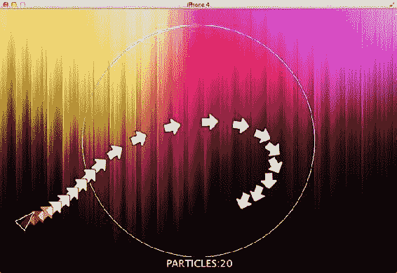
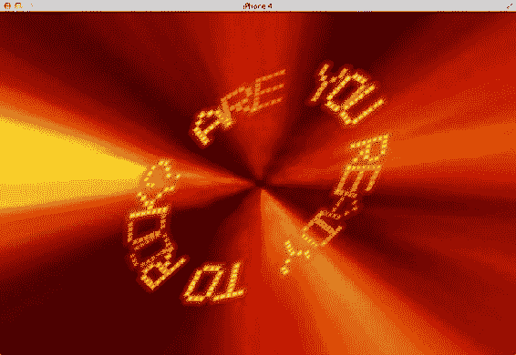
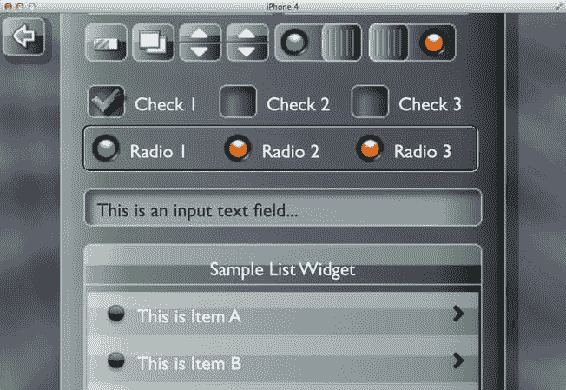
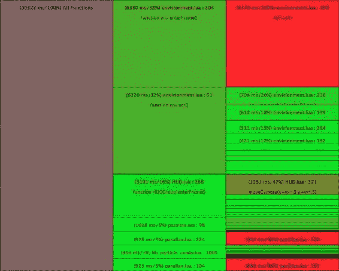
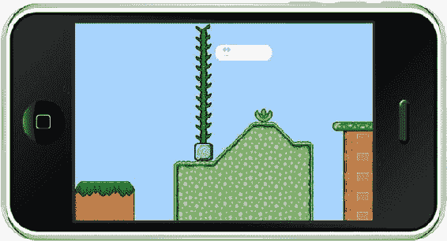
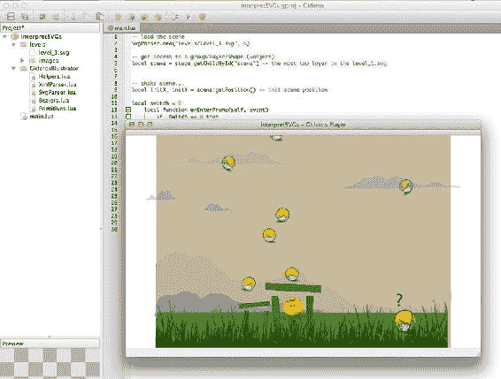
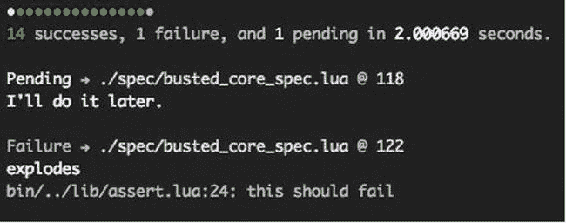
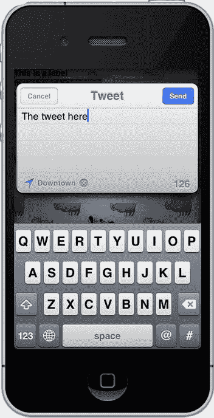

# 第三方库与工具

虽然本书讨论的这些框架各自功能完备，但开发者们总会需要更多。这种细微的需求通常会转化为供内部使用的库和工具。有些人也会以商业形式或遵循 MIT 许可协议分享这些工具和库。使用这些第三方库不会削弱这些框架的能力，反而会进一步增强它们。在本章中，我们将探讨一些在开发过程中有用的库——其中一些库还可以适配到最初开发框架之外的其它框架。

本章不会列出所有库的完整清单，因为有许多才华横溢的开发者一直在创造新的库。其中许多库都是先前库的变体。例如，针对 Corona SDK 就有好几个粒子引擎库，不可能全部涵盖。

## Particle Candy

*   *网址*：[www.x-pressive.com/ParticleCandy_Corona/index.html](http://www.x-pressive.com/ParticleCandy_Corona/index.html)
*   *价格*：€ 39.95
*   *平台*：Corona SDK

这是一个流行且极其有用的粒子生成器库，用 Lua 编写，来自 [www.x-pressive.com](http://www.x-pressive.com)。它专为 Corona SDK 设计。由于 Corona SDK 代码必须以纯文本形式分发，因此该库以完整源代码形式提供，方便你研究其工作原理。希望你**不要**重新分发代码或以任何修改形式转售。该库附带几个非常有用且令人印象深刻的示例。它让许多特效变得简单易行，并抽象了实现这些特效所需的计算。除了标准的烟雾和火焰类型特效外，它还允许你创建更高级的特效，并提供了对吸引子（如图 13-1 所示）、排斥子和发射形状等功能的访问。



图 13-1 .  Particle Candy 发射器运行吸引子示例

**注意**   第 14 章将讨论一个相关工具 Particle Designer，它可以用来可视化创建粒子特效并将设置导出到 Particle Candy。

### 示例代码

```
Particles.CreateEmitter("E1", screenW*0.05, screenH*0.5, 45, true, true)
-- 定义一个粒子类型
Particles.CreateParticleType ("Test",
    {
    imagePath    = "arrow.png",
    imageWidth   = 32,    -- 粒子图像宽度 (newImageRect)
    imageHeight   = 32,          -- 粒子图像高度 (newImageRect)
    velocityStart = 150,   -- 像素每秒
    alphaStart    = 0,          -- 粒子起始透明度
    fadeInSpeed   = 2.0,   -- 每秒
    fadeOutSpeed  = -1.0,  -- 每秒
    fadeOutDelay  = 3000,  -- 开始淡出的时间
    scaleStart    = 1.0,   -- 粒子起始大小
    weight        = 0,  -- 粒子重量 (>0 下落, <0 上升)
    bounceX       = false, -- 从屏幕左右边界反弹
    bounceY       = false, -- 从屏幕上下边界反弹
    bounciness    = 0.75,  -- 回弹能量
    emissionShape = 0,          -- 0 = 点, 1 = 线, 2 = 环, 3 = 盘
    emissionRadius= 140,   -- 发射形状的大小/半径
    killOutsideScreen  = true,       -- 父图层不得嵌套或旋转!
    lifeTime      = 4000,       -- 粒子的最大生命周期
    autoOrientation    = true,       -- 自动旋转至运动方向
    useEmitterRotation = true,       -- 继承发射器的当前旋转
        } )

-- 输入发射器
-- (发射器名称, 粒子类型名称, 发射速率, 持续时间, 延迟)
Particles.AttachParticleType("E1", "Test", 10, 9999,0)
-- 触发发射器
Particles.StartEmitter("E1")
local Emitter1 = Particles.GetEmitter("E1")
-- 吸引场
Particles.CreateFXField("A1", 0, screenW*0.5,screenH*0.5, 1.5, 140, true)
```

## Text Candy

*   *网址*：[www.x-pressive.com/TextCandy_Corona/index.html](http://www.x-pressive.com/TextCandy_Corona/index.html)
*   *价格*：€39.95
*   *平台*：Corona SDK

这是 X-Pressive.com 的另一款产品，主要用于处理文本。它提供特殊效果，可用于旋转、动画以及以其他方式操作文本（见 图 13-2）。例如，它只需一行代码就能创建 80 年代风格的正弦滚动文本。



图 13-2 .  Text Candy 文本动画

运行上述动画的代码非常简单，如下所示：

### 示例代码

```
local MyText = TextCandy.CreateText({
    fontName    = "FONT1",
    x           = screenW*.5,
    y           = screenH*.5,
    text        = "ARE YOU READY TO ROCK? ",
    originX     = "CENTER",
    originY     = "CENTER",
    textFlow    = "CENTER",
    charSpacing = -5,
    lineSpacing = -4,
    showOrigin  = false,
    })

MyText:applyDeform({
    type          = TextCandy.DEFORM_CIRCLE,
    radius        = 120,
    autoStep      = true,
    ignoreSpaces  = false,
    })

MyText:applyAnimation({
    startNow        = true,
    restartOnChange = true,
    charWise        = true,
    frequency       = 60,
    alphaRange      = 0.5,
    })
```

## Widget Candy

*   *网址*：[www.x-pressive.com/WidgetCandy_Corona/index.html](http://www.x-pressive.com/WidgetCandy_Corona/index.html)
*   *价格*：€ 39.95
*   *平台*：CoronaSDK

这是 X-Pressive.com 的第三款产品。这个库使用可视化元素创建图形用户界面 (GUI)。它具有使用主题的功能，这意味着你不仅可以创建自定义小部件，还可以随时为它们*换肤*（改变外观）。它提供了大多数常用的小部件，包括列表框、单选按钮、复选框、按钮和滑块。Widget Candy 的一个显著特点是其缩放小部件的能力。你可以将小部件设置为百分比（如同在 HTML 中一样），这样当你在不同设备上运行时，显示元素将相应地缩放。此功能无需你为每个新设备专门设计用户界面。图 13-3 展示了一些可以使用 Widget Candy 创建的 UI 元素。



图 13-3 .  Widget Candy，在设备上显示各种小部件

### 示例代码

```
_G.GUI.NewList(
    {
    x            = "center",
    y            = "center",
    width        = "80%",
    height       = "90%",
    scale        = _G.GUIScale,
    parentGroup  = nil,
    theme        = "theme_1",
    name         = "LST_MAIN",
    caption      = "WIDGET CANDY SAMPLES:",
    list         = ListData,
    allowDelete  = false,
    readyCaption = "Quit Editing",
    border       = {"shadow", 8,8, 64},
    onSelect     = function(EventData) _G.LoadSample(EventData) end,
    } )
```

## Corona AutoLAN

*   *网址*：[www.mydevelopersgames.com/AutoLAN/](http://www.mydevelopersgames.com/AutoLAN/)
*   *价格*：免费
*   *平台*：Corona SDK

这个库是一个 Lua sockets 实现，允许通过结合使用 UDP 和 TCP socket 通信，在无线网络上进行多人通信。它具有自动网络发现和集成功能，只需几行代码即可实现。由于 AutoLan 使用纯 Lua socket 通信，它可以被适配以在 Corona SDK 之外的其它框架上工作。它还具备文件传输和流量控制功能。

### 示例代码

```
local client = require "Client"
client:start()
client:autoconnect()
```

在服务器端，则简单如下：

```
local server = require "Server"
server:start()
```

传输文件也同样简单：

```
client:sendFile(filename, srcPath, destFile)
```

## Corona Profiler


-   **URL**: [www.mydevelopersgames.com/site/](http://www.mydevelopersgames.com/site/)
-   **价格**: 9.99 美元
-   **平台**: Corona SDK

这或许是唯一一款能在你在 CoronaSDK 模拟器中运行应用时，进行性能分析的检测工具。它能帮助你判断代码的运行状况。你可以通过应用中的 Lua 命令来启动和停止性能分析器。分析器运行时，会逐行创建分析数据，检查每一行代码或每个函数的执行耗时。虽然它是专为 Corona SDK 创建的，但其运行依赖于纯 Lua。稍作修改，就能适配任何框架。`Corona Profiler` 的示例输出如图 13-4 所示。



图 13-4 . 运行 `Corona Profiler` 后，你的应用的视觉分析/结果

示例代码

```
profiler = require "Profiler"
profiler.startProfiler()
```

## Director

-   **URL**: [`rauberlabs.blogspot.com.au/2011/08/director-14-books.html`](http://rauberlabs.blogspot.com.au/2011/08/director-14-books.html)
-   **价格**: 免费
-   **平台**: Corona SDK

`Director` 是一个可用的场景管理器库——虽然非常有用且广受欢迎，但正在被逐步淘汰，因为 Corona Labs 正在用其自带的版本 `Storyboard` 取代它。曾几何时，`Director` 比 Corona SDK 本身还要受欢迎。然而，由于 `Storyboard` 受 Corona Labs 官方支持且提供类似功能，建议你使用 `Storyboard`（尽管 `Director` 在许多电子书和游戏中仍被广泛使用）。

示例代码

```
director = require("director")
local mainGroup = display.newGroup()

mainGroup :insert(director.directorView)
director:changeScene("Screen1")
```

请注意，`Screen1.lua` 包含了 `screen1` 的代码和显示逻辑。

## Lime

-   **URL**: [www.justaddli.me](http://www.justaddli.me)
-   **价格**: 20.00 英镑
-   **平台**: Corona SDK

`Lime` 是一个提供函数来加载由瓦片编辑器 `Tiled` 创建的地图的库。`Gideros Studio` 和 `Moai` 有内建函数来加载 `Tiled` 地图，因此这个库主要适用于 Corona SDK。以下示例代码可以显示如图 13-5 所示的地图。



图 13-5 . 使用 `Lime` 显示的地图

示例代码

```
local lime = require("lime")
local map = lime.loadMap("platform.tmx")
local visual = lime.createVisual(map)
```

## RapaNui

-   **URL**: [`github.com/ymobe/rapanui`](https://github.com/ymobe/rapanui)
-   **价格**: 免费
-   **平台**: Moai

`RapaNui` 是一个高级的 Moai 独占库，它构建在 Moai SDK 之上，提供类似于 Corona SDK 的易用语法。在 Moai 中，加载并在屏幕上显示图像需要几行代码，而使用 `RapaNui` 则只需一行代码。

示例代码

```
ball = RNFactory.createImage("ball.png")
ball.x = 10
ball.y = 10
```

## Gideros Illustrator (SVG 库)

-   **URL**: [`go.to/gideros-illustrator`](http://go.to/gideros-illustrator)
-   **价格**: 免费
-   **平台**: Gideros Studio

如果你使用 Adobe Illustrator 或类似应用创建设计，那么生成图形和美术作品的质量远高于缩放后的位图。这个库与 `Gideros Studio` 配合使用，目前可以解析从 Adobe Illustrator 导出的 SVG 文件。该库目前是免费的，并提供了便于处理矢量图形的函数。你只需使用一行代码即可加载 SVG 图像并将其渲染到设备上。图 13-6 中显示的图形，就是在 Gideros 中借助 SVG 库使用矢量对象绘制的。



图 13-6 . 在 Gideros Player 中显示的 SVG 图像

示例代码


`SvgParser.new("myFile.svg")`

## TNT 粒子库

*   *URL*: [www.tntparticlesengine.com/](http://www.tntparticlesengine.com/)
*   *价格*: 免费
*   *平台*: Gideros Studio

这是 Gideros Studio 中唯一可用于处理粒子的库。最棒的是，它是免费的。

**示例代码**

```
local particleGFX = (Texture.new("smoke.png"))
local cloud1 = CParticles.new(particleGFX, 5, 12, 12, "screen")
cloud1:setSpeed(10, 40)
cloud1:setSize(3, 5)
cloud1:setAlpha(0)
cloud1:setRotation(0, -10, 360, 10)
cloud1:setAlphaMorphIn(20, 3)
cloud1:setAlphaMorphOut(0, 3)
local emitter1 = CEmitter.new(cloud1)
emitter1:start()
```

## Busted

*   *URL*: [`github.com/Olivine-Labs/busted/`](https://github.com/Olivine-Labs/busted/)
*   *价格*: 免费
*   *平台*: 所有基于 Lua 的平台

开发者们有一个常见的抱怨：Lua 不具备单元测试功能。单元测试是一个非常重要的概念，尤其是在处理抽象类和预显示渲染类时。这个库不依赖于任何框架，而是使用纯 Lua 函数。Busted 测试脚本的规格说明读起来很自然，就像英语一样。输出结果非常易于理解且视觉上清晰明了，如图 Figure 13-7 所示。



图 13-7 .  Busted 运行单元测试

**示例代码**

```
require ("busted")
describe("Busted unit testing framework", function()
  describe("should be awesome", function()
    it("should be easy to use", function()
      assert.truthy("Yup.")
    end)

it("should have lots of features", function()
      -- deep check comparisons!
      assert.same({ table = "great"}, { table = "great" })
      -- or check by reference!
      assert.is_not.equals({ table = "great"}, { table = "great"})
      assert.true(1 == 1)
      assert.falsy(nil)
      assert.error(function() error("Wat") end)
    end)

it("should provide some shortcuts to common functions", function()
      assert.unique({{ thing = 1 }, { thing = 2 }, { thing = 3 }})
    end)
    it("should have mocks and spies for functional tests", function()
      local thing = require("thing_module")
      spy.spy_on(thing, "greet")
      thing.greet("Hi!")

assert.spy(thing.greet).was.called()
      assert.spy(thing.greet).was.called_with("Hi!")
    end)
  end)
end)
```

## Moses

*   *URL*: [`github.com/Yonaba/Moses/`](https://github.com/Yonaba/Moses/)
*   *价格*: 免费
*   *平台*: 所有基于 Lua 的平台

Moses 库由 Roland Yonaba 创建，用于帮助管理 Lua 中的表，包括弹出和推入、切片、返回第一个元素以及返回下一个元素等功能。Moses 不依赖于任何其他函数或类，并且可以跨框架使用。

**示例代码**

```
local moses = require("moses")
local list = moses.range(10)
-- => {0,1,2,3,4,5,6,7,8,9,10}
list = moses.map(list, function(_,value) return value*10+value end)
-- => {0,11,22,33,44,55,66,77,88,99,110}
list = moses.filter(list,function(i,value) return value%2==0 end)
-- => {0,22,44,66,88,110}
moses.each(list,print)
-- =>  1    0
-- =>  2    22
-- =>  3    44
-- =>  4    66
-- =>  5    88
-- =>  6    110
```

## Allen

*   *URL*: [`github.com/Yonaba/Allen/`](https://github.com/Yonaba/Allen/)
*   *价格*: 免费
*   *平台*: 所有基于 Lua 的平台

Allen 是 Roland Yonaba 的另一个作品。它为表提供与字符串相关的函数——也就是说，Moses 处理表，而 Allen 处理字符串。

**示例代码**

```
local allen = require("allen")
local lyrics = 'hey I just met you\nand this is crazy\nbut here is my number\nso call me maybe'
lyrics = allen.lines(lyrics)
for i,line in ipairs(lyrics) do
  line = allen.capitalizeFirst(line)
end
```

## BhWax

*   *URL*: [`github.com/bowerhaus/BhWax`](https://github.com/bowerhaus/BhWax)
*   *价格*: 免费
*   *平台*: Gideros Studio

BhWax 是 Gideros 的一个插件，基于 Corey Johnsons 为 Objective-C 编写的 Wax 库。它将 iOS API 暴露给 Lua，更具体地说是暴露给 Gideros。使用这个插件，可以创建原生的 UIKit 元素和 UIWindow、UIView 等。

**示例代码**

```
require "wax"
function show()
    print("Down")
end
function hide()
    print("Up")
end
btn = UIButton:buttonWithType(UIButtonTypeRoundedRect)
btn:setFrame(CGRect(110,110,100,37))
btn:setTitle_forState("Press Me", UIControlStateNormal)
btn:setTitle_forState("Pressed", UIControlStateHighlighted)
getRootViewController():view():addSubview(btn)
btn:addTarget_action_forControlEvents(self,"hide", UIControlEventTouchDown)
btn:addTarget_action_forControlEvents(self,"show", UIControlEventTouchUpInside)
```

这个插件提供的功能可以使开发者将新的 iOS API 集成到他们的应用中，而无需等待框架开发者添加相应功能。

有趣的是，要在你的应用中实现完整的 Twitter 功能，使用这个插件只需 3 行代码即可获得 Twitter UI 界面，如下图 图 13-8 所示。

```
   twit = TWTweetComposeViewController:init()
   twit:setInitialText("The tweet here")
   getRootViewController():presentModalViewController_animated(twit, true)
```



图 13-8 .  Gideros Player 中使用原生 Twitter UI 撰写推文

## 总结

本章涵盖了许多 Lua 常用的库。如需更多信息，你还可以查阅 lua-users 维基 ([`lua-users.org/wiki/`](http://lua-users.org/wiki/))，该网站提供了许多旨在解决特定问题的 Lua 代码片段，同时也包含了社区为扩展 Lua 及其功能所做的尝试。

