# 第 14 章：第三方应用程序

虽然制作游戏的旅程充满了学习，但同样也始终需要工具来自动化或简化各种繁琐的任务，以便你可以将时间和精力集中在编码上。现在你读到此处，要么是跳过了前面的内容，要么是已经读到了本书的这一部分。无论哪种情况，本章都应该能独立地为你介绍一些有价值的工具，它们能让你的开发工作更加轻松。本章将介绍一系列适用于多种框架的第三方工具。

## 集成开发环境（IDEs）

IDE（集成开发环境）或许是整个开发过程中最重要的部分。它是几个元素的结合体：文本编辑器、模拟器、资源管理器以及错误和运行时消息控制台。通常，当你第一次开始使用某个框架时，你期望能在屏幕上看到一些切实可见、可以与之交互的东西。对于 Corona SDK、Moai 和 LÖVE 而言，它们没有提供内置的 IDE，因此可能会让人有些不安，难以确定下一步该做什么。不过，有大量第三方 IDE 可以帮助填补这一空白。本节将讨论其中一些。

### Glider

*   *URL*: [www.mydevelopersgames.com/CIDER/](http://www.mydevelopersgames.com/CIDER/)
*   *价格*: $39.99
*   *平台*: Mac OS X, Windows

## IDE 与文本编辑器概览

这是 M.Y. Developers 推出的一款功能丰富、跨平台的优秀 IDE（最初名为 Cider）。较新的版本（如图 14-1 所示）支持 Corona SDK、Gideros Studio 和 Moai。它具备预览功能，可列出 Lua 文件中的函数和变量，以及它们的类类型和继承成员。此外，它还提供智能的类感知自动补全功能，能在给定上下文中给出最相关的选项。该 IDE 拥有高级调试特性，如**单步进入**、**单步跳出**、**单步跳过**、**运行到光标处**、**调用堆栈**等。在运行过程中，变量可以被监视，甚至能动态更改。当前 Glider 中的 Ultimote 功能可在 IDE 中模拟 Corona SDK 硬件事件。它还集成了对 Git、Subversion 和 Mercurial 的版本控制支持，并包含本地文件历史记录功能，可以保留对文件所做的每一次更改。

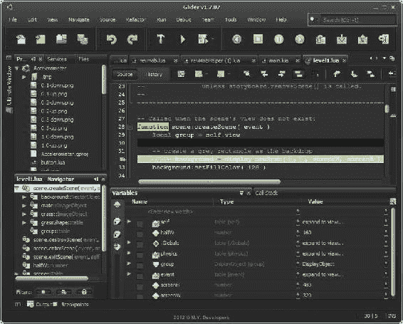

图 14-1 . Glider IDE

### CoronaComplete

-   *URL*: [`coronacomplete.com`](http://coronacomplete.com)
-   *价格*: 26.99 美元（Mac App Store 上为 29.99 美元）
-   *平台*: Mac OS X

CoronaComplete 是一款仅适用于 Mac OS X 的 IDE（目前仅支持 Corona SDK）。它由 Vladu Bogdan 创建，他也是出色的工具 SpriteHelper 和 LevelHelper 的作者（本章稍后会提到）。CoronaComplete 包含查看资源的功能，并拥有智能参数，因此你可以使用自动补全来选择函数。它甚至内置了作者添加的文档，因此你无需上网去网站获取 API 文档。该 IDE 集成了 Corona 调试器，并在调试时提供显示变量、单步执行或跳过代码的功能。它最好的功能之一是可以录制运行中的应用并创建视频，该视频可放置在网站上或用于推广活动。CoronaComplete 的截图如图 14-2 所示。

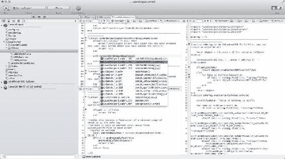

图 14-2 . 展示项目资源的 CoronaComplete

**注意**   CoronaComplete 现已由 CodeHelper Pro 取代。

### Lua Studio

-   *URL*: [`lua-studio.luaforge.net`](http://lua-studio.luaforge.net)
-   *价格*: 免费
-   *平台*: Windows

这是一款仅适用于 Windows 的应用程序，是专为 Lua 设计的完整 IDE。它不针对基于 Lua 的框架。Lua Studio 是一款集成度很高的 Lua IDE；它会显示局部和全局变量的列表，以及关于调用堆栈的信息（参见图 14-3）。它甚至允许在调试时使用**单步进入**、**单步跳出**和**单步跳过**功能。

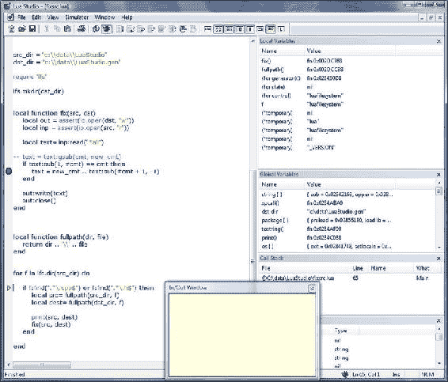

图 14-3 . 在 Windows 上运行带 Lua 代码调试会话的 Lua Studio

### ZeroBrane Studio

-   *URL*: [`studio.zerobrane.com/`](http://studio.zerobrane.com/)
-   *价格*: 免费
-   *平台*: Windows、Mac OS X、Linux

这是唯一一款用 Lua 编写并支持 Lua 的 IDE，支持我们讨论过的大多数框架，包括 Gideros、Moai 和 LÖVE。它体积小巧、易于使用，提供了开发者期望 IDE 所具备的大多数专业功能，包括语法高亮、远程调试器、代码分析器、实时编码和调试。它还支持自动补全和用于运行和测试 Lua 代码片段的草稿板。该软件可以从作者网站以二进制格式获取，也可以从他的 GitHub 账户以源代码形式获取：[`github.com/pkulchenko/zerobranestudio/`](https://github.com/pkulchenko/zerobranestudio/)。

## 文本编辑器

虽然 IDE 提供了完整的开发环境，但随着你的深入，对 IDE 的依赖程度可能会有所不同。很多人会达到一个阶段，他们觉得自己不再需要 IDE，而只需要一个非常好的文本编辑器。Mac OS X 和 Windows 上都有一些出色的免费和付费文本编辑器。由于 Lua 是一种非常简单的语言，理论上，类似记事本的文本编辑器就足以编写代码。但是，拥有语法高亮、代码折叠、函数间跳转、动态调试等功能总是有益的。

### Notepad++

-   *URL*: [`notepad-plus-plus.org`](http://notepad-plus-plus.org)
-   *价格*: 免费
-   *平台*: Windows

这是一款仅适用于 Windows 的编辑器；它是开源的，功能相当强大，并且会定期更新。它具有语法高亮、代码折叠和多标签编辑功能（如图 14-4 所示）。它支持除 Lua 之外的多种语言，并且可以通过插件进行扩展。

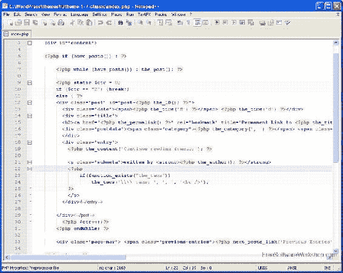

图 14-4 . Notepad++

### TextMate

-   *URL*: [`macromates.com/`](http://macromates.com/)
-   *价格*: 50 美元
-   *平台*: Mac OS X

TextMate 是为数不多的 Mac 文本编辑器之一，它通过包（用于语法、函数等）来扩展其功能。早期版本 1.5.x 是付费应用，而较新的版本 TextMate 2.0 是开源的且免费可用。除了基本的 Lua 之外，它还包括为 Corona SDK 和 Gideros Studio 创建的包。图 14-5 显示了在 TextMate 中编辑 Lua 文件。

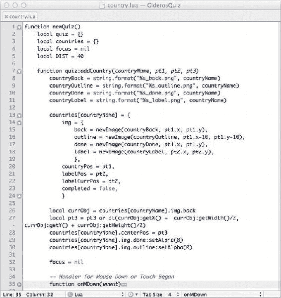

图 14-5 . 在 TextMate 1.5 中编辑 Lua 文件

### TextWrangler

-   *URL*: [`barebones.com/products/TextWrangler`](http://barebones.com/products/TextWrangler)
-   *价格*: 免费
-   *平台*: 仅限 Mac OS X

TextWrangler 是一款来自 Bare Bones Software 的免费文本编辑器。它有许多功能，包括代码折叠、语法高亮和项目浏览。TextWrangler 是免费的，本质上是 BBEdit（下文介绍）的轻量版本。TextWrangler 的部分功能如图 14-6 所示。

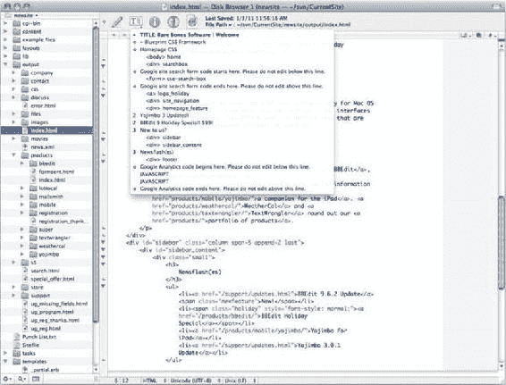

图 14-6 . TextWrangler

### BBEdit

-   *URL*: [`itunes.apple.com/us/app/bbedit/id404009241?mt=12`](http://itunes.apple.com/us/app/bbedit/id404009241?mt=12)
-   *价格*: 49.99 美元
-   *平台*: Mac OS X

BBEdit 是一款功能完整的文本编辑器，同样来自 Bare Bones Software。它包含 TextWrangler 的所有功能，以及自动补全和一些额外的与 SSH 相关的功能。图 14-7 展示了 BBEdit 中提供的许多功能。

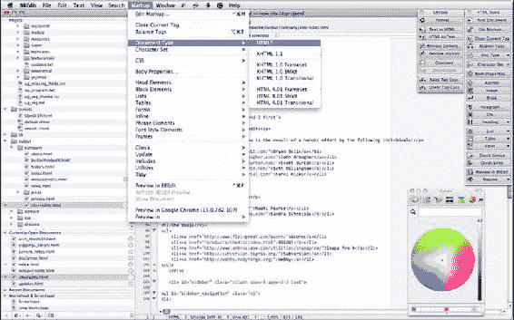

图 14-7 . BBEdit 及其功能

### Sublime Text 2

-   *URL*: [www.sublimetext.com](http://www.sublimetext.com)
-   *价格*: 59 美元
-   *平台*: 仅限 Mac OS X

与 TextMate 和 BBEdit 类似，Sublime Text 2 是一款现代文本编辑器，包含语法高亮、代码折叠等功能。它相对来说有点贵，但它允许无限期使用而不禁用任何功能，所以实际上它可以作为免费软件使用。（然而，它并*不*是免费的，如果你持续使用它，那么你应该为其购买许可。）图 14-8 展示了带有语法高亮和行号的 Lua 代码编辑。

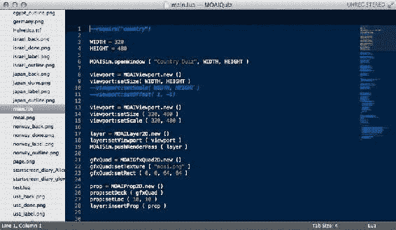

图 14-8 . 在 Sublime Text 2 中编辑 Lua 文件

### Textastic 代码编辑器

### Textastic 代码编辑器

- **URL**: [`itunes.apple.com/us/app/textastic-code-editor/id383577124?mt=8`](http://itunes.apple.com/us/app/textastic-code-editor/id383577124?mt=8)
- **价格**: 9.99 美元
- **平台**: iOS

这是目前唯一推荐用于在 iOS 平台上编写代码的选项。它可以用于将文档保存在设备本地，或通过网络/Wi-Fi 进行保存。它支持 `WebDAV`、`FTP` 服务器，甚至 `Dropbox`。它支持超过 80 种语言的语法高亮，还支持 `TextMate` 主题和定义。可以通过符号浏览器中的列表浏览文件中的函数并跳转到对应位置。它仅包含 `HTML` 和 `CSS` 关键字的自动完成功能（目前）。它还提供一个屏幕光标，有助于导航和选择，如图 Figure 14-9 所示。

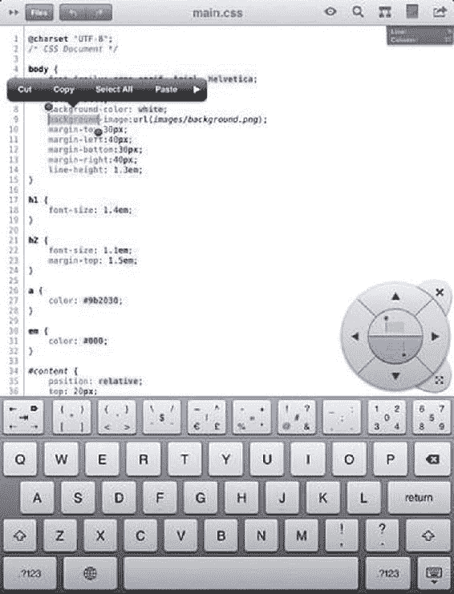

图 14-9 . iPad 上的 Textastic 代码编辑器

## 代码片段收集器

你偶尔可能会遇到一些有趣的功能或例程，但它们当时可能与你的项目无关。之后当你需要用到它们时，却可能对这段代码毫无印象。在这种情况下，代码片段收集器总是一个好用的工具。本节介绍两个有用的收集器。

### CodeBox

- **URL**: [`itunes.apple.com/us/app/codebox/id412536790?mt=12`](http://itunes.apple.com/us/app/codebox/id412536790?mt=12)
- **价格**: 4.99 美元
- **平台**: Mac OS X

这是一个非结构化的代码片段收集器。它允许将代码片段添加到数据文件中。每个代码片段可以有多个表格，每个表格可以有不同的语法语言高亮。你可以混合使用网页和文本文件，如图 Figure 14-10 所示。这对开发者来说是一个特别有用的工具，因为它没有“一个文件对应一个代码片段”的问题；相反，每个代码片段条目可以存储整个项目。

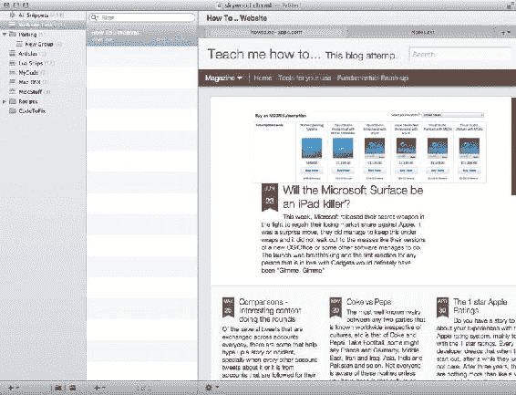

图 14-10 . CodeBox 及其代码片段，包含一个 URL 和一个文本文件

### Code Collector Pro

- **URL**: [www.mcubedsw.com/software/codecollectorpro/](http://www.mcubedsw.com/software/codecollectorpro/)
- **价格**: 免费（即将开源）
- **平台**: Mac OS X

这是较早推出的一款工具，结构感稍强；它看起来类似于电子邮件客户端——也就是说，它包含文件夹，每个文件夹包含一个代码片段，并且可以在底部窗格中预览该代码片段（如图 Figure 14-11 所示）。每个片段只有一个文本框或标签页，并且可以设置为特定的语言。

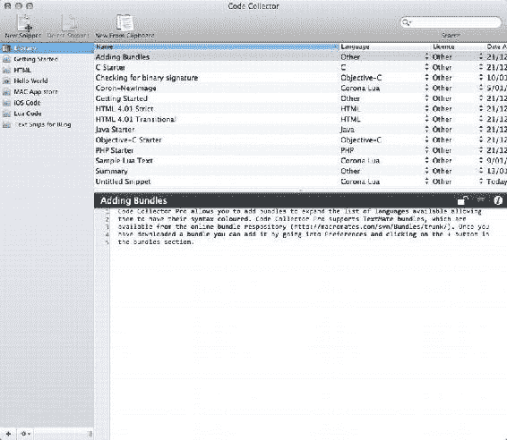

图 14-11 . Code Collector Pro 中的代码片段

## 版本控制

代码总是在演变——在开发或测试过程中，你经常需要在文件中添加或更改数据。因此，采用某种形式的版本控制是好的，这样你可以跟踪更改并在不同代码版本之间来回切换。虽然你可以选择 `CVS`、`Subversion`、`Mercurial` 和 `Git`，但我发现 `Git` 作为独立版本控制系统效果最好，并且能够扩展到团队仓库。有很多 `Git` 客户端可以帮助管理桌面端和在线端的 `Git` 仓库。对于在线仓库，你可以从在 `GitHub` 或 `Bitbucket` 上创建仓库开始。

## 位图编辑器

大多数非 3D 游戏的卖点通常是图形——大多数用户购买游戏的决定是基于 App Store 中的截图。当然，图形不会自己产生，但并非每个人都能负担得起（甚至需要）`Photoshop`（尽管它已经成为创建图形的实际标准软件）。本节描述了一些备选软件产品，你可以根据需求使用它们来创建图形。

### Pixen

- **URL**: [`pixenapp.com/`](http://pixenapp.com/)
- **价格**: 9.99 美元（从 Mac App Store 购买）
- **平台**: Mac OS X

如果你正在创建 8 位图形或像素图形，那么你需要适合该任务的工具；放大画布并使用网格是一种方法，但位图编辑器是为像素艺术操作等特定任务而设计的，如图 Figure 14-12 所示。`Pixen` 是一款针对 Mac OS X 的工具，现在可在 Mac App Store 上购买，价格为 9.99 美元；免费版本已从网站上下架。不过，其源代码仍在 `GitHub` 上可用。

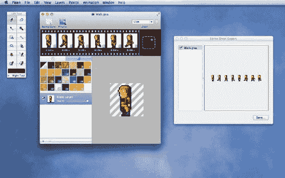

图 14-12 . 使用 Pixen 编辑精灵或图像

### GraphicsGale

- **URL**: [www.humanbalance.net/gale/us/](http://www.humanbalance.net/gale/us/)
- **价格**: 1995 日元（约 25 美元；也提供免费版）
- **平台**: 仅限 Windows

`GraphicsGale` 是一款在 Windows 平台上处理 8 位或像素图形的出色工具。虽然你可以使用 `Microsoft Paint` 完成某些任务，例如放大和设置网格，但 `GraphicsGale` 提供的额外功能使其成为首选工具。它具备洋葱皮功能以辅助单元格动画，并支持多种格式的导出和导入。它是一个单一工具，可以帮助创建动画光标、图标等。图 14-13 展示了 `GraphicsGale` 的实际应用。

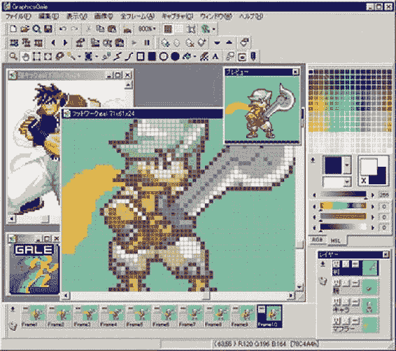

图 14-13 . 在 GraphicsGale 中编辑像素精灵

### Pixelmator

- **URL**: [`itunes.apple.com/us/app/pixelmator/id407963104?mt=12`](http://itunes.apple.com/us/app/pixelmator/id407963104?mt=12)
- **价格**: 14.99 美元（首发价格）
- **平台**: Mac OS X

`Pixelmator` 在过去几年中不断进化，是一款在 Mac 上运行的绘画应用程序。它的用户界面非常美观，并提供了许多你可能只期望在更高级程序（如 `Photoshop`）中才有的功能，例如图层、效果、处理多种文件格式、画笔等，而价格却低得多。其名为 `Cherry` 的新版本是一款功能强大的工具，提供了超过 150 种效果的视觉仓库，这些效果比 `Photoshop` 中的类似功能更快、响应更灵敏（其中一种万花筒效果如图 Figure 14-14 所示）。它可以处理 `RAW` 文件以及许多其他文件格式。

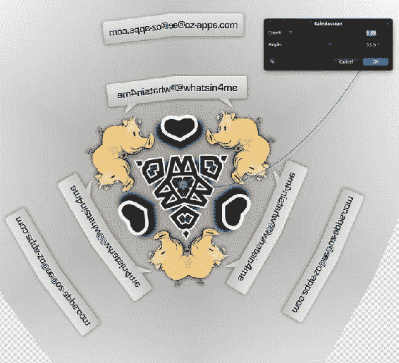

图 14-14 . 在 Pixelmator 中应用了万花筒效果的图像

### Axialis IconWorkshop

- **URL**: [www.axialis.com/iconworkshop/](http://www.axialis.com/iconworkshop/)
- **价格**: 69.95 美元
- **平台**: Windows

这是一款仅限 Windows 的应用程序，主要设计为图标创建工具。它有一些漂亮的视觉模板，你可以用来创建出色的效果。这些图标可以用作标签栏等的图像。图像包甚至包含光泽和高光等效果，因此你可以创建具有与专业图标相同光泽感的图标。图 14-15 展示了其中一些可用功能。

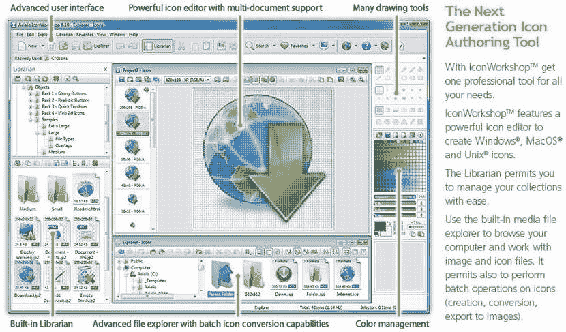

图 14-15 .  Axialis IconWorkshop

### Inkscape

- *URL*: [`inkscape.org/`](http://inkscape.org/)
- *价格*: 免费
- *平台*: Mac OS X, Windows

随着视网膜显示屏的出现，苹果要求以不同分辨率创建资源：普通分辨率、`@2x`（针对视网膜设备），以及现在的 `@HD` 或 `@4x`（针对视网膜 iPad）。从普通分辨率放大到大型高清图形时，光栅或位图图像很容易出现缩放感和像素化。而使用矢量图形，图像可以缩放以适应各种分辨率，而不会明显丢失细节。Adobe Illustrator 和 Corel Draw 在该领域确立了标准；然而，Inkscape 拥有一套庞大的工具集，可与这些程序相媲美（如图 14-16 的示例图所示）。更棒的是，它是开源且免费的。

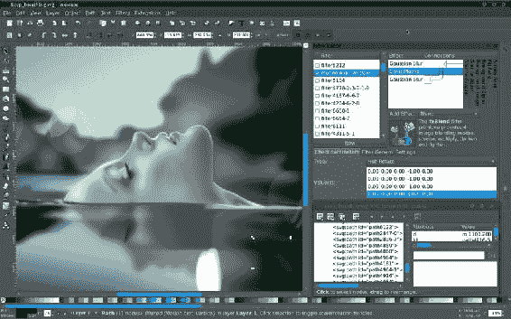

图 14-16 .  使用 Inkscape 通过矢量对象创作的艺术作品示例

### Paint.NET

- *URL*: [www.getpaint.net](http://www.getpaint.net)
- *价格*: 免费
- *平台*: Windows

这款适用于 Windows 的开源绘画软件提供了类似 Photoshop 的图层和功能，但完全免费。Paint.NET 提供了 Photoshop 的大部分功能，包括同时编辑多张图像的能力。它的图层功能支持合成效果和编辑。它拥有无限的撤销历史记录。它运行在 Windows 平台上，速度相当快。它还支持插件。图 14-17 展示了运行中的 Paint.NET。

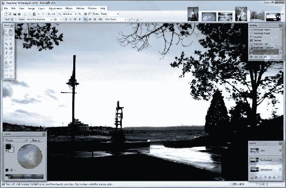

图 14-17 .  在 Paint.NET 中编辑的图像

### iConify

- *URL*: [`itunes.apple.com/us/app/iconify/id416289784?mt=12`](http://itunes.apple.com/us/app/iconify/id416289784?mt=12)
- *价格*: 免费
- *平台*: 仅限 Mac OS X

当你完成游戏或应用的创建后，需要为打包应用创建图标和资源。尤其是苹果，要求你使用几个特定尺寸的图标，然后才能在 App Store 中上架你的应用。iConify 是众多可用的实用工具之一，可以帮助你创建各种所需尺寸的图标。图 14-18 展示了 iConify 的简洁界面。

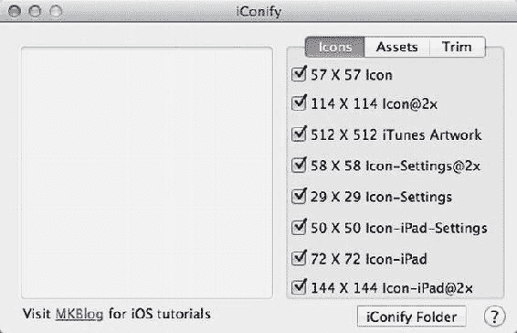

图 14-18 .  使用 iConify 为 iOS 设备创建合适尺寸的图标

以下是它的一些主要功能：

- 应用程序使用简单。
- 你可以将 `512×512` 像素或 `1024×1024` 像素的图标拖拽到画布上，所有必要的较小图标都会自动为你创建。

## 精灵动画与关卡创建工具

本节介绍多种工具，用于在你的游戏中创建精灵动画和关卡，以增加额外的精致感和视觉吸引力。

### SpriteHelper

- *URL*: [`itunes.apple.com/us/app/spritehelper/id416068717?mt=12`](http://itunes.apple.com/us/app/spritehelper/id416068717?mt=12)
- *价格*: $12.99
- *平台*: Mac OS X

这是一款工具，它接收单个帧并创建一个包含这些帧的单一精灵表单纹理。SpriteHelper 的功能更进一步，它还可以为帧设置物理对象属性，如图 14-19 所示。Corona SDK 是目前唯一一个 SpriteHelper 原生支持的框架。不过，调整 SpriteHelper 以用于 Gideros Studio 或 Moai 也相当容易。SpriteHelper 仅可通过 Mac App Store 获取。它还有一个功能有限的免费精简版，但足以用于测试该产品。

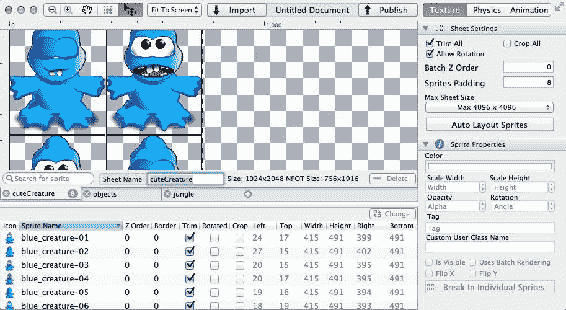

图 14-19 .  使用 SpriteHelper 编辑精灵的物理边界

### LevelHelper

- *URL*: [`itunes.apple.com/us/app/levelhelper/id421740820?mt=12`](http://itunes.apple.com/us/app/levelhelper/id421740820?mt=12)
- *价格*: $19.99
- *平台*: Mac OS X

作为 SpriteHelper 的补充，此应用可帮助你为游戏创建关卡。它类似于基于图块的编辑器，但不同之处在于，它还可以向关卡中添加物理对象和形状，如图 14-20 所示。它目前只能输出适用于 cocos2D 和 Corona SDK 的关卡。与 SpriteHelper 类似，LevelHelper 也仅可通过 Mac App Store 获取，并提供一个免费的精简版。

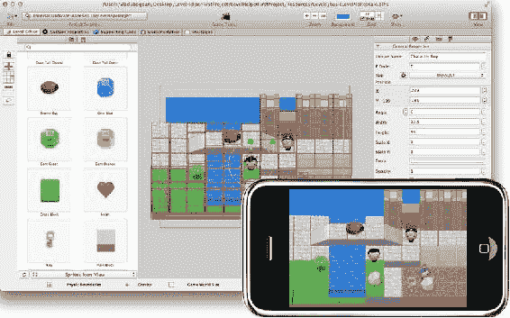

图 14-20 .  LevelHelper，屏幕上显示关卡并在设备上进行模拟

### Tiled

- *URL*: [www.mapeditor.org/](http://www.mapeditor.org/)
- *价格*: 免费
- *平台*: Mac OS X, Windows, `*nix`

Tiled 是一款广受推荐且被广泛使用的开源编辑器，用于创建图块地图。它通过生成包含地图定义的 `TMX` 文件来工作。Gideros Studio 拥有读取此格式的原生 API。生成的图块地图可以被其他框架读取，并用于 RPG 风格或基于图块的游戏中。图 14-21 显示了在 Tiled 中创建 RPG 地图的过程。

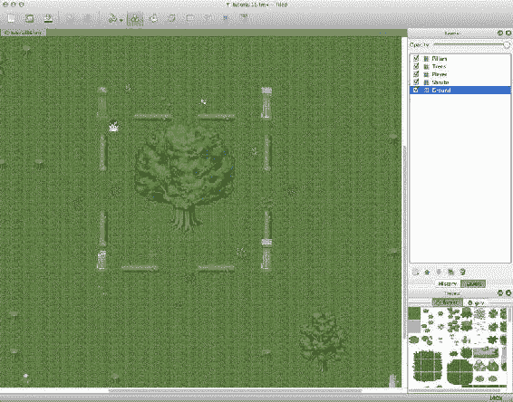

图 14-21 .  在 Tiled 编辑器中进行地图编辑

### TexturePacker

- *URL*: [www.codeandweb.com/texturepacker](http://www.codeandweb.com/texturepacker)
- *价格*: $24.84
- *平台*: Mac OS X, Windows, Ubuntu

此实用工具有助于创建精灵表单和纹理图谱。它甚至可以从 `PSD` 和 `SWF` 文件创建精灵表单。它拥有多样化的输出格式，支持 Corona SDK、Gideros Studio 和 Moai，以及其他一些框架，甚至还支持通用 JSON 格式，该格式解析后可用于任何框架。TexturePacker 网站上提供了一些关于纹理打包的有趣信息，以及教程和文章，帮助你了解如何使用 TexturePacker。TexturePacker 还可以通过使用 Xcode、Ant、CMake 等工具与构建过程自动化集成。图 14-22 展示了在 TexturePacker 中从一个 Flash 动画（`SWF`）创建精灵表单的过程。

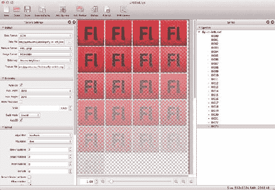

图 14-22 .  TexturePacker 从一个 Flash 动画（`SWF`）创建精灵表单

### PhysicsEditor

- *URL*: [www.codeandweb.com/physicseditor](http://www.codeandweb.com/physicseditor)
- *价格*: $19.87
- *平台*: Mac OS X 和 Windows

PhysicsEditor 是 TexturePacker 作者开发的配套应用。PhysicsEditor 是一款为你的图形定义物理对象的工具，以便在你的游戏框架中使用。它允许你创建逼真的碰撞和其他物理事件。它甚至具备在对象之间创建碰撞掩码的功能，并且能与多种框架配合使用，包括 Corona SDK、Gideros Studio 和 Moai。PhysicsEditor 的作者非常积极主动地调整该工具，使其能与尽可能多的框架配合使用。图 14-23 展示了一个工作中的 PhysicsEditor 示例。

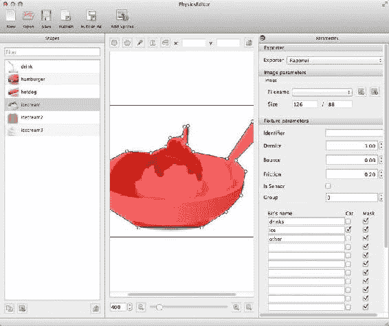

图 14-23 .  在 PhysicsEditor 中勾勒图像轮廓，以便与物理引擎配合使用

### Particle Designer

- *URL*: [`particledesigner.71squared.com/`](http://particledesigner.71squared.com/)
- *价格*: $7.99
- *平台*: Mac OS X

好的，作为一名高级文档工程师和翻译员，我将严格按照您提供的注意事项和示例，将给定的英文文本翻译成中文。

