# 随着现代设备的普及，玩家不再满足于简单的特效。开发者正在创建越来越逼真的游戏，而这很大程度上归功于粒子引擎的使用。`Particle Designer` 是一款用于创建粒子效果的视觉化工具。`Particle Designer` 允许您试验和调整粒子的参数，甚至可以将您的设置保存为预设（保存在`PEX`文件中）以便重复使用。特别是 `Moai`，它具有直接加载和使用 `PEX` 文件的 `API` 函数。图 14-24 展示了您可以使用 `Particle Designer` 创建的各种效果。

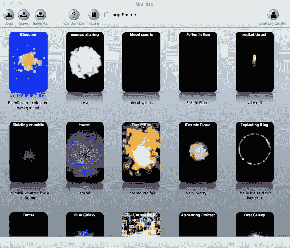

图 14-24. 使用 `Particle Designer` 可以创建的各种效果

### Glyph Designer

* *URL*: [`glyphdesigner.71squared.com/`](http://glyphdesigner.71squared.com/)
* *价格*: $29.99
* *平台*: Mac OS X

这是 `Particle Designer` 作者的另一个应用。`Glyph Designer` 有助于创建位图字体。只需点击几下，您就可以生成外观精美的字体表，用于您的应用程序中。大多数框架都支持位图字体。图 14-25 显示了一个使用 `Glyph Designer` 创建的位图字体表。`Corona SDK` 需要使用 `Text Candy` 库（在第 13 章中讨论过）来使用通过 `Glyph Designer` 创建的字体。`Gideros` 和 `Moai` 有内置的处理位图或字形字体的 `API`，而 `Glyph Designer` 的优势在于几乎可以即时创建渐变填充、应用阴影和创建字体纹理。

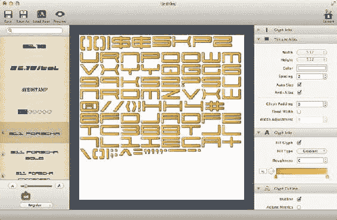

图 14-25. 在 `Glyph Designer` 中创建位图字体

### Spriteloq

* *URL*: [www.loqheart.com/spriteloq](http://www.loqheart.com/spriteloq)
* *价格*: $49 或 $99（包含 2 小时高级支持）
* *平台*: Mac OS X

这是另一个有助于从 Flash SWF 影片中创建精灵表的工具。如果您在 Flash 中创建了一些动画，可以使用 `Spriteloq` 非常轻松地将它们转换为精灵表，以便在您的应用程序中进行动画制作，如图 14-26 所示。尽管 `Spriteloq` 的输出是专门针对 `Corona SDK` 的，但生成的文件可以被解析并与任何框架一起使用。

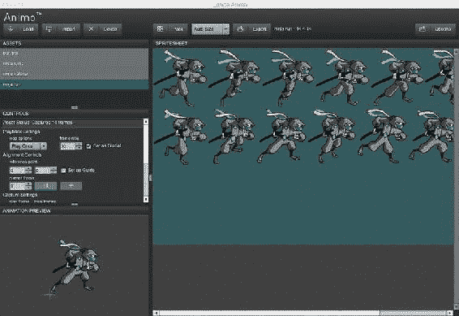

图 14-26. 在 `Spriteloq` 中从 Flash 动画（SWF）创建精灵表

**注** Lanica 已收购 `Spriteloq`，现更名为 `Animo` ([`lanica.co/about/animo/`](http://lanica.co/about/animo/))，价格已上涨至 149 美元。

### Zoë

* *URL*: [`easeljs.com/zoe.html`](http://easeljs.com/zoe.html)
* *价格*: 免费
* *平台*: Mac OS X

`Zoë` 是一个用于从 Flash 影片创建精灵表的免费程序。与 `Spriteloq` 和 `TexturePacker` 相比，`Zoë` 提供的选项有限，但其优点是免费。图 14-27 展示了 `Zoë` 逐帧播放 SWF 动画的实际效果。

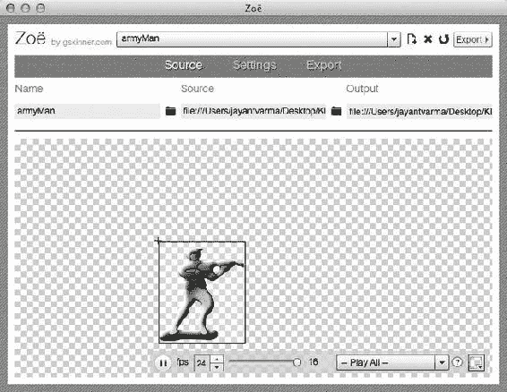

图 14-27. `Zoë` 播放 Flash 动画

### TNT Animator Studio

* *URL*: [www.tntparticlesengine.com](http://www.tntparticlesengine.com)
* *价格*: 免费
* *平台*: Mac OS X, Windows

之前提到的大多数工具都是从单个图像生成精灵表，而 `TNT Animator Studio` 是一个从这些精灵表生成动画的工具。该应用程序目前面向 `Gideros Studio` 使用，并包含一个用于加载和使用这些动画的 `Lua` API。生成的 `TAN` 文件是 XML 文件，因此可以被解析并与任何其他框架一起使用。图 14-28 展示了 `TNT Animator Studio` 简洁的用户界面。

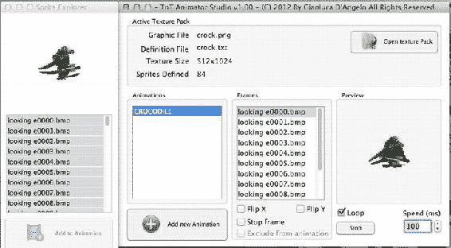

图 14-28. 使用 `TNT Animator Studio` 创建动画

## 声音工具

没有声音的游戏是不完整的。即使是最精彩的烟花动画，如果没有伴随的嗖嗖声、砰声、噼啪声和爆裂声，也会显得乏味。作为画面的补充，声音在应用程序的成功中扮演着重要的角色。本节将介绍一些可以帮助您为应用程序创建和处理声音及效果的应用。

### Audacity

* *URL*: [`audacity.sourceforge.net/`](http://audacity.sourceforge.net/)
* *价格*: 免费
* *平台*: Mac OS X, Windows

这是一个开源且跨平台的波形编辑器。它允许以多种方式处理声音文件，包括裁剪、延长、添加效果、减慢或加快播放速度以及改变音高。许多人使用 `Audacity` 创建用于有声读物的音频文件标记。图 14-29 显示了在 `Audacity` 中编辑的音频波形。

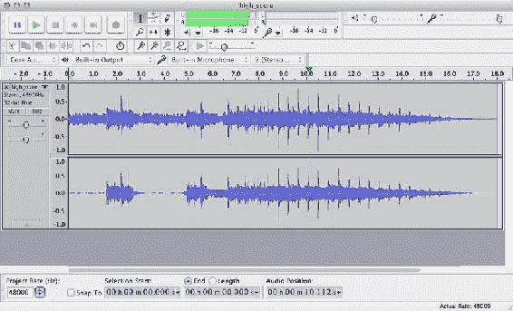

图 14-29. 在 `Audacity` 中编辑波形

### Bfxr

* *URL*: [www.bfxr.net/](http://www.bfxr.net/)
* *价格*: 免费
* *平台*: 网页浏览器，基于 Adobe Air 的桌面版

此实用程序允许您创建可通过调整各种参数来操控的 8 位声音。生成的声音可用于您游戏中的各种音效。`Bfxr` 提供了一种非常简单且经济的方式来为您的游戏创建有趣的音效。图 14-30 显示了 `Bfxr` 的界面以及可为您的音效设置的各种参数。

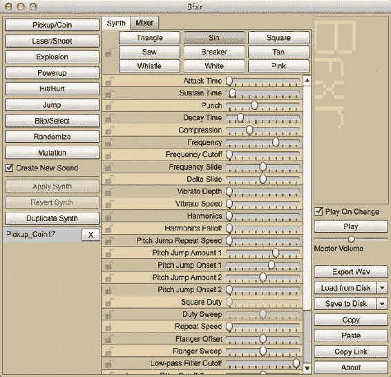

图 14-30. `Bfxr`——用于创建 8 位音效的实用工具

### NodeBeat

* *URL*: [`itunes.apple.com/us/app/nodebeat/id428440804?mt=8`](http://itunes.apple.com/us/app/nodebeat/id428440804?mt=8)
* *价格*: $0.99
* *平台*: iOS 4.2+

`NodeBeat` 是一个在 iOS 上运行的应用，可用于创建随机但有趣的音乐。虽然许多乐器应用需要不同程度的技能和知识来创作音乐，但 `NodeBeat` 让您可以生成随机音乐，并且可以在应用播放时动态更改。图 14-31 展示了 `NodeBeat` 中的一个作品。该作品可以录制为 `wav` 文件，并通过 iTunes 或电子邮件导出。还有一个免费的 Flash 版 `NodeBeat`，功能比 iOS 版少，适用于所有 Windows、Mac OS X 和 Linux 系统。可从 [`nodebeat.com/`](http://nodebeat.com/) 获取。

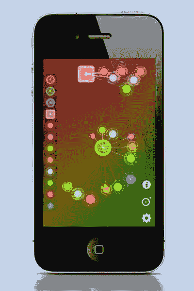

图 14-31. `NodeBeat`，一个允许您以可视化方式创作音乐的 iOS 应用

## 总结

本章介绍了各种第三方工具，它们可以帮助您创建应用或游戏。我介绍的大多数工具都经过了众多开发者的测试（或者是少数适用于特定框架的工具之一）。您还会遇到许多其他可以自己尝试的第三方工具。本章绝非一个详尽的可用工具列表，每天都有更多的工具和实用程序发布。

## 第 15 章 示例源代码

您已经快读完本书了；希望您阅读愉快并学到了很多知识。在本书的第一部分，我向您介绍了 Lua 及其函数；在第二部分，我向您介绍了可用于为 iOS 设备开发的各种基于 Lua 的框架。本章将提供一个名为 `Chopper Rescue` 的应用程序的完整源代码，您可以将其作为创建自己游戏的基础。


## 直升机救援

在`Chopper Rescue`中，你将操控一架救援直升机，目标是营救幸存者。直升机移动时，你需要避开各种可能导致坠毁的障碍物。当幸存者出现时，你的任务就是收集他们。在某些情况下，你需要点击屏幕发射子弹；每次只能发射有限数量的子弹，因此必须谨慎使用这一功能。游戏通过设备的加速计进行控制。

本章将详细介绍游戏的运作方式。完整源代码可从`apress.com`上本书的页面下载。该源代码专为`Corona SDK`和`Gideros Studio`设计。

### 图形设计

当你开始设计一款游戏时，在产生绝妙创意之后，第二件事就是制作图形。对于`Chopper Rescue`这款游戏，我清楚自己需要什么，但由于没有图形设计师，我手绘了一些图像并进行扫描。图 15-1 展示了我绘制的图像，而图 15-2 则展示了生成的精灵表。

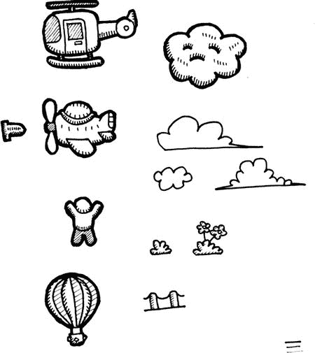

图 15-1. 转换为精灵之前的手绘扫描图像


图 15-2. 为`Chopper Rescue`游戏图形创建的精灵表

### 环境设置

我们的代码需要持续计算位置。除非我们为特定分辨率开发应用，否则永远无法预知应用将在何种分辨率下运行。因此，我们需要设置环境并收集这些信息，这将在后续派上用场，避免重复计算。

要获取设备的宽度和高度，你可以在`Corona SDK`中使用以下代码：

```lua
local  _W, _H = display.contentWidth, display.contentHeight
```

在`Gideros Studio`中使用以下代码：

```lua
local _W, _H = application:getDeviceWidth(), application:getDeviceHeight()
_H, _W = _W, _H
```

**注意**：在`Gideros`中，设备的高度和宽度始终以竖屏方向为参考返回。由于本游戏将在横屏模式下运行，我们需要交换高度和宽度。

我们还会设置一些在整个游戏中都有用的其他变量：

```lua
local MAX_BULLETS = 5   -- 可发射的最大子弹数量
local MAX_FUEL = 500    -- 加油时获得的燃料量
local MAX_LIVES = 3     -- 最大生命数
local lives = MAX_LIVES -- 最大尝试次数
local fuel = MAX_FUEL   -- 最大可用燃料量
local score = 0
local distance = 0
local hiscore = 0
local collected = 0
local filter = 0.8
local gameover = false
```

我们为`Corona SDK`设置以下内容：

```lua
local NORMAL = 6  -- 移动物体的正常速度
local FAST = 12   -- 快速移动物体的速度
```

为`Gideros Studio`设置以下内容：

```lua
local NORMAL = 3  -- 移动物体的正常速度
local FAST = 6    -- 快速移动物体的速度
local TOPLINE = 100 
local BOTTOMLINE = 500

local random = math.random
local floor = math.floor
local background
```

我们还要为`Corona SDK`设置以下内容：

```lua
local performAfter = timer.performWithDelay
background = display.newRect(0,0,_W,_H)
background:setFillColor(255,255,255)
-- Corona SDK 默认有黑色背景，因此我们需要一个白色矩形，
-- 直到被背景图片替换。
```

为`Gideros Studio`设置以下内容：

```lua
local performAfter = Timer.delayedCall
local bullets = {}      -- 存放发射子弹的容器
local scenery = {}      -- 组成场景的对象
local sounds = {}       -- 存放所有声音的数组
local restartGame = nil -- 处理函数
local survivor, tanker
local waiting = 0
local baseLine = 578

local wTime = 0
local fwait = false
local fx, fy = 0,0
```

### 让直升机飞行

图形准备就绪后，将直升机放置在屏幕上就很简单了。为了保持应用的可移植性，我们依赖于创建通用的函数，这些函数可以替换以适配其他框架。

以下是`Corona SDK`的代码：

```lua
function loadImage(imageName, x, y)
    local x = x or 0
    local y = y or 0
    local image = display.newImage(imageName, x, y) 
    return image 
 end
```

在`Gideros Studio`中，我们使用以下代码：

```lua
function loadImage(imageName, x, y)
  local x = x or 0
  local y = y  or 0
  local image = Bitmap.new(Texture.new(imageName))
  stage:addChild(image)
  image:setPosition(x,y)
  image.width = image:getWidth()
  image.height = image:getHeight()
  return image
end
```

我们只需创建一个名为`loadImage`的通用函数，它接受`imageName`和`x,y`坐标，并为我们加载图像。如果你决定将代码切换到其他框架，只需修改此函数，其余代码即可正常工作。使用此函数，我们将直升机显示在屏幕中央：

```lua
local heli = loadImage("_chopper.png", _W/2, _H/2) -- 屏幕中央
```

为了稍后定位我们的项目，我们创建一个名为`position`的通用函数，并将要定位的对象以及`x,y`坐标传递给它。

以下是`Corona SDK`的代码：

```lua
function position(theObj, x, y)
  if theObj == nil then return end
  theObj:setReferencePoint(display.TopLeftReferencePoint)
  theObj.x = x
  theObj.y = y
end 
```

以下是`Gideros Studio`的代码：

```lua
function position(theObj, x, y)
  if theObj ~= nil then
    theObj:setPosition(x,y)
  end
end 
```

### 使用加速计

我们可以接入加速计，按如下方式在屏幕上移动直升机。

以下是`Corona SDK`的代码：

```lua
local isSimulator = system.getInfo("environment") == "simulator"
local _hasAccel = not isSimulator
```

以下是`Gideros Studio`的代码：

```lua
require ("accelerometer")
local _hasAccel = accelerometer:isAvailable()
if _hasAccel then 
  accelerometer:start()
end 
```

`Corona SDK`中没有与`accelerometer:start()`等效的函数。要处理此问题，我们必须设置一个`EventListener`来监听事件；事件随后会根据设置的更新频率被触发。

```lua
function onAccelerometer(event)
  -- 在此处捕获事件
end 
Runtime:addEventListener("accelerometer", onAccelerometer)
```

### 移动直升机

现在我们已经设置好加速计，可以根据加速计返回的数据来移动直升机。我们设置一个`enterFrame`事件，该事件每秒运行 30 或 60 次（取决于`fps`设置和代码的响应速度）。

以下是`Corona SDK`的代码：

```lua
Runtime:addEventListener("enterFrame", update)
```

以下是`Gideros Studio`的代码：

```lua
stage:addEventListener(Event.ENTER_FRAME, update)
```

`update`是一个如下定义的函数：

```lua
function update(event)
 -- 检查游戏是否结束
  if gameOver == true then return end
  fWait = (wTime > 0)
  if fWait then
    wTime = wTime – 0.01
    if wTime < 0 then 
      wTime = 0 
    end
    return 
  end

if _hasAccel==true then
    local gx, gy = getAcceleration()
    fx = gx * filter + fx * (1-filter)
    fy = gy * filter + fy * (1-filter)
    updatePlayer(fx, fy)
  end
end 
```

我们使用通用函数`getAcceleration()`，因为`Corona SDK`将加速度返回给`onAccelerometer`函数。而在`Gideros`中，我们需要在需要时轮询数据。

以下是`Corona SDK`的代码：

```lua
local gpx, gpy, gpz
function onAccelerometer(event)
  -- 在此处捕获事件
  gpx, gpy, gpz = event.xGravity, event.yGravity, event.zGravity
end 
function getAcceleration()
    return gpx, gpy, gpz
end
```

以下是`Gideros Studio`的代码


```lua
function getAcceleration()
  local px, py = accelerometer:getAcceleration()
  return py, px -- 注意顺序交换，因为我们的应用是横屏模式
end 
```

如果我们将直升机移动到屏幕底部，它会撞到地面，因此我们需要一个处理碰撞的函数。该函数将 `lives` 值减 1，当 `lives` 值降至 0（即没有剩余生命）时，游戏结束。

```lua
function reduceLife()
  lives = lives - 1
  fuel = MAX_FUEL  -- 每次重新开始时将燃料重置为最大值

gameOver = lives <= 0
  if lives <= 0 then
    -- 游戏结束
    print("Game Over")
  else
    position(heli, _W/2, _H/2)
    wTime = 2
  end 
end 
```

在 `updatePlayer` 函数中，可以使用加速度计返回的数据来更新玩家，如下所示：

```lua
function updatePlayer(theX, theY)
  local PLAYERSPEED = FAST * 2 -- 速度为最快物品的两倍
  local  px, py = getPosition(heli)
  px = px - (theX * PLAYERSPEED)
  py = py - (theY * PLAYERSPEED)

if px < 0 then px = 0 end 
  if px > _W - heli.width then 
    px = _W - heli.width
  end
  if py < TOPLINE then py = TOPLINE end
  if py > BOTTOMLINE + 10 then 
    -- 撞到地面 reduceLife() return
  end
  position(heli, px, py)
end 
```

函数 `getPosition` 返回图像的当前位置。

以下是 Corona SDK 的代码：

```lua
function getPosition(theObj)
  if theObj == nil then return end
  theObj:setReferencePoint(display.TopLeftReferencePoint)
  return theObj.x, theObj.y
end 
```

以下是 Gideros Studio 的代码：

```lua
function getPosition(theObj)
  if theObj == nil then return end
  return theObj:getPosition()
end 
```

现在当你在设备（Corona SDK）或设备播放器（Gideros Studio）上运行代码时，倾斜设备，直升机就会在屏幕上移动。如果你让直升机移动到屏幕底部，它会重新出现在屏幕中央。当所有生命耗尽后，程序将停止并在终端/控制台打印消息“Game Over”。

### 制作声音

如果没有任何音效，任何游戏都是不完整的。在前面的代码中，我们有一个名为 `playSound` 的函数，它根据需要播放声音。

以下是 Corona SDK 版本：

```lua
function playSound(theSound)
  audio.play(handle)
end
```

以下是 Gideros Studio 版本：

```lua
function playSound(theSound)
  local channel = theSound:play()
  return channel
end
```

我们需要更改设置 `sounds` 数组的方式，因为播放声音时的索引方式不同了。

以下是我们需要在 Corona SDK 中使用的代码：

```lua
function setupSound()
  sounds = {
    explosion       = audio.loadSound("_001.wav"),  -- 爆炸
    shoot           = audio.loadSound("_002.wav"),  -- 射击子弹
    collectSurvivor = audio.loadSound ("_003.wav"),  -- 收集幸存者
    collectFuel     = audio.loadSound ("_004.wav"),  -- 收集燃料
    crash           = audio.loadSound ("_005.wav"),  -- 碰撞
  }
end
```

以下是 Gideros Studio 版本：

```lua
function setupSound()
  sounds = {
    explosion       = Sound.new("_001.wav"),  -- 爆炸
    shoot           = Sound.new("_002.wav"),  -- 射击子弹
    collectSurvivor = Sound.new("_003.wav"),  -- 收集幸存者
    collectFuel     = Sound.new("_004.wav"),  -- 收集燃料
    crash           = Sound.new("_005.wav"),  -- 碰撞
  }
end
```

由于我们将所有声音都封装在 `setupSound` 函数中，我们需要在开始时调用一次，如下所示：

```lua
setupSound()
```

### 射击子弹

为了让直升机能够发射子弹，我们设置了一个事件监听器来捕获点击或触摸以触发射击。

在 Corona SDK 中，我们使用：

```lua
Runtime:addEventListener("tap",shoot)
```

在 Gideros Studio 中，我们使用：

```lua
stage:addEventListener(Event.TOUCHES_END, shoot)
```

在 `shoot` 函数中，我们检查屏幕上子弹的数量是否小于 `MAX_BULLETS` 值，只有在满足条件时才生成新子弹。当我们射击时，还会播放射击音效；这是通过我们的 `playSound` 函数实现的。

```lua
function shoot()
  if gameOver == true or wTime > 0 then return end
  if #bullets < MAX_BULLETS then 
    local hx, hy = getPosition(heli)
    local spr = loadImage("_bullet.png", hx+heli.width, hy + (heli.height/2))
    blt = {
      sprite = spr,
      x = hx + heli.width,
      y = hy + (heli.height/2),
      wd = spr.width,
      ht = spr.height,
    }
    table.insert(bullets, blt)
    playSound(sounds.shoot) -- 播放射击音效
  end
end 
```

### 移动子弹

射出子弹后，还需要移动它们；否则，它们会像图 15-3 所示那样停留在屏幕的原位置。当子弹到达屏幕边缘或与物体碰撞时，我们需要将其从屏幕上移除，为新子弹腾出空间。

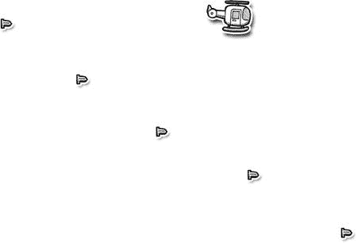

图 15-3 . 子弹冻结在发射位置

```lua
function moveBullets()
  local blt
  for i = #bullets, 1, -1 do
    blt = bullets[i]
    blt.x = blt.x + FAST -- 子弹快速移动
    position(blt.sprite, blt.x, blt.y)

-- 检查碰撞
    if blt and blt.x > _W then 
      destroyObject(blt.sprite)
      table.remove(bullets,i)
      blt = nil
    end
  end
end
```

这个 `moveBullets` 函数需要根据需要被多次调用，以保持子弹持续移动。我们在 `update` 函数内部调用它，从而可以重复调用 `moveBullets` 函数。图 15-4 展示了这在屏幕上的呈现效果。


图 15-4 . 子弹现在从直升机向屏幕右侧移动

我们使用另一个通用函数 `destroyObject` 将对象从屏幕上移除。它的定义因框架而异。

以下是 Corona SDK 版本：

```lua
function destroyObject(theObj)
  if theObj == nil then return end 
  display.remove(theObj)
end
```

以下是 Gideros Studio 版本：

```lua
function destroyObject(theObj)
  if theObj == nil then return end 
  if theObj.removeFromParent then theObj:removeFromParent() end
end
```

### 生成敌人

现在我们有了一个可以在屏幕上移动并发射子弹的直升机，子弹到达屏幕边缘后就会消失。接下来，我们将随机生成一些物品作为敌人。我们将生成以下类型的物品：

*   飞机
*   气球
*   花朵
*   草地
*   路灯柱
*   房屋
*   高楼
*   云朵 1
*   云朵 2
*   云朵 3
*   怒云

这些物品的图片之前已在图 15-1 和图 15-2 中展示。

不使用绝对数值，我们创建了一个表来通过 `enumerate` 函数引用这些物品，如下所示：

```lua
function enumerate(theTextArray)
  local returnVal = {}
  for i,j in pairs(theTextArray) do
    returnVal[j] = i
  end 
  return returnVal
end

local objects = enumerate{"plane","balloon","flower","grass","lamppost","house","tallHouse","cloud1","cloud2","cloud3","angryCloud"}
function spawnEnemies()
  waiting = waiting + 1           -- 计数器，用于降低生成速度
  if waiting < 60 then return end -- 希望每秒生成一个物品
  waiting = 0
  local spr = nil
  local yDir = 0
  local speed = NORMAL
  local rnd = random(1,11) -- 获取一个介于 1 和 11 之间的物品
  local xPos, yPos = 0,0
```


```lua
if rnd == objects.plane then       -- 生成新飞机
    spr = loadImage("_plane.png")
    yPos = random(2,5) * spr.height
    speed = FAST
  elseif rnd == objects.balloon then -- 生成气球
    spr = loadImage("_balloon.png")
    yPos = random(2,5) * spr.height
    yDir = 1
  elseif rnd == objects.flower then  -- 生成花
    spr = loadImage("_flower.png")
    yPos = BOTTOMLINE - spr.height
  elseif rnd == objects.grass then   -- 生成草
    spr = loadImage("_grass.png")
    yPos = BOTTOMLINE - spr.height
  elseif rnd == objects.lamppost then -- 生成路灯柱
    spr = loadImage("_post.png")
    yPos = BOTTOMLINE - spr.height
  elseif rnd == objects.house then   -- 生成房子
    spr = loadImage("_house.png")
    yPos = BOTTOMLINE - spr.height
  elseif rnd == objects.cloud1 then  -- 生成云 1
    spr = loadImage("_cloud1.png")
    yPos = TOPLINE + random(1,5) * spr.height
    speed = random(NORMAL, FAST)
  elseif rnd == objects.cloud2 then  -- 生成云 2
    spr = loadImage("_cloud2.png")
    yPos = TOPLINE + random(1,5) * spr.height
    speed = random(NORMAL, FAST)
  elseif rnd == objects.cloud3 then  -- 生成云 3
    spr = loadImage("_cloud3.png")
    yPos = TOPLINE + random(1,5) * spr.height
    speed = random(NORMAL, FAST)
  elseif rnd == objects.tallHouse then -- 生成高楼
    spr = loadImage("_tallhouse.png")
    yPos = BOTTOMLINE - spr.height
  elseif rnd == objects.angryCloud then -- 生成愤怒的云
    spr = loadImage("_cloud.png")
    yPos = TOPLINE + random(1,5) * spr.height
    speed = random(NORMAL, FAST)
  end
  xPos = _W + random(3,8) * spr.width
  position(spr, xPos, yPos)
  table.insert(scenery,{
    sprite = spr,
    speed = speed,
    x = xPos,
    y = yPos,
    dir = yDir,
    wd = spr.width,
    ht = spr.height,
    objType = rnd
   })
end
```

### 移动场景对象

在上一节中，我们生成了 11 个对象，但将其`x`位置设置在屏幕之外。这样，物体会从屏幕外的位置开始，逐渐滚动进入视野，而不是突然出现在屏幕上。然而，我们还没有编写场景滚动的代码。在我们的`update`函数中，需要在`moveBullets`函数之后添加`moveScenery()`。其思路与`moveBullets`函数类似。不过，在这个函数中，除了移动物体以营造直升机在天空中飞行的错觉（物体会从旁掠过）之外，我们还需要更新飞行距离和消耗的燃料。当燃料储备达到临界值 100 单位时，我们会显示加油机，玩家可以收集它来补充燃料。

```lua
function moveScenery()
    for i = #scenery, 1, -1 do
        local nme = scenery[i]
        nme.x = nme.x - nme.speed
        nme.y = nme.y + nme.dir

if nme.y < TOPLINE or nme.y > BOTTOMLINE then 
            nme.dir = -nme.dir 
        end

local rnd = random(1,10)
        if rnd > 3  and rnd < 4 then
            nme.dir = -nme.dir 
        end

position(nme.sprite, nme.x, nme.y)
        if nme.x < -nme.wd then
            destroyObject(nme.sprite)
            table.remove(scenery, i)
        end
    end 
  fuel = fuel - 0.1
  distance = distance + 0.1

-- updateAllText() -- 更新 HUD
  -- 如果燃料耗尽，则失去一条命
  if fuel <= 0 then 
    reduceLife()
    return
  end 
end
```

现在，我们可以随着直升机在天空中移动，看到场景滚动的效果，如图 15-5 所示。稍后，我们还会在这个`moveScenery`函数中调用`checkCollision`函数。

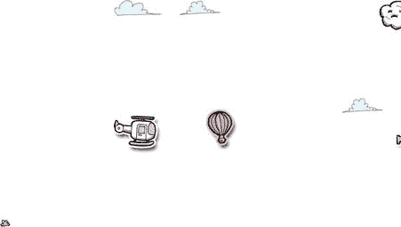

图 15-5 . 场景对象从右向左滚动

### 失去一条命

当你撞到地面或其他物体，或者燃料耗尽时，就会失去一条命。这需要减少生命数量，当生命数量归零时，游戏结束。我们之前创建了`reduceLife`函数；现在让我们为该函数添加更多功能。

```lua
function reduceLife()
  lives = lives - 1
  fuel = MAX_FUEL -- 每条新命都重新开始

-- updateAllText() -- 更新 HUD
  playSound(sounds.crash) -- 撞击音效
  wTime = 2
  performAfter(1000, -- 一秒钟后执行
    function()
      -- 移除所有场景物品
      for i=#scenery, 1, -1 do
        destroyObject(scenery[i].sprite)
        table.remove(scenery, i)
      end
      -- 移除所有子弹
      for i = #bullets, 1, -1 do
        destroyObject(bullets[i].sprite)
        table.remove(bullets, i)
      end
      wTime = 2
      position(heli,_W/2,_H/2)
      gameOver = lives <= 0
      setVisible(heli, not gameOver)
      setVisible(txtGameOver, gameOver)
      setVisible(txtTapAgain, gameOver)

setVisible(tanker, false)
      position(tanker, _W + random(3,5) * tanker.width, baseLine - tanker.height)
      if gameOver == true then
        if floor(distance) + score > hiscore then 
          hiscore = floor(distance) + score
        end

-- showReplayScreen()
      end
    end)

end
```

由于我们需要创建一组通用的函数来适配多种框架，因此我们引入了一些新函数，例如`setVisible`和`bringToFront`，它们允许我们显示或隐藏对象，或者重新调整对象的显示顺序。

以下是 Corona SDK 的代码：

```lua
function setVisible(theObject, setHow)
    if theObject == nil then return end
  theObject.isVisible = setHow or false
end
```

以下是 Gideros Studio 的代码：

```lua
function setVisible(theObject, setHow)
    if theObject == nil then return end
  local setHow = setHow or false
  theObject:setVisible(setHow)
end
```

`bringToFront`函数在 Corona SDK 中定义如下：

```lua
function bringToFront(theObject)
    if theObject == nil then return end
  theObject:toFront()
end
```

在 Gideros Studio 中定义如下：

```lua
function bringToFront(theObject)
    if theObject == nil then return end
  stage:addChild(theObject, 1)
end
```

### 增添一些色彩

我们为游戏创建的图形都是黑白的。为了增加一些变化，我们可以通过代码为对象赋予特定的 RGB 值来为其着色。我们可以建立一个基本颜色表，然后用它来为图形着色。

```lua
Local Colors = {
  {0,   0,   255},    -- 蓝色
  {255, 0,   0},      -- 红色
  {0,   255, 0},      -- 绿色
  {255, 0,   255},    -- 洋红色
  {0,   255, 255},    -- 青色
  {255, 255, 0},      -- 黄色
  {255, 255, 255},    -- 白色
  {179, 115, 255},    -- 橙色
}
```

以下是 Corona SDK 特有的代码：

```lua
Function Colorize(Theobject, Thecolor)
  If Thecolor < 1 Or Thecolor > #Colors Then
    Return
  End
  Local R, G, B, A = Unpack(Colors[Thecolor])
  A = A Or 255
  Theobject:Setfillcolor(R, G, B, A) 
End 
```

以下是 Gideros Studio 特有的代码：

```lua
Function Colorize(Theobject, Thecolor)
  If Thecolor < 1 Or Thecolor > #Colors Then
    Return
  End 
  Local R, G, B, A = Unpack(Colors[Thecolor])
  A = A Or 255
  R = R / 255 
  G = G / 255 
  B = B / 255 
  A = A / 255

Theobject:Setcolortransform(R, G, B, A)
End 
```

我们可以在生成敌人时为其添加颜色属性来着色，如下所示：

```lua
  Clr = Random(1,7)
If Rnd == Objects.Plane Then       -- 生成新飞机
  Spr = Loadimage("_Plane.Png")
  Ypos = Random(2,5) * Spr.Height
  Speed = FAST
  Clr = Colors.
Elseif Rnd == Objects.Balloon Then -- 生成气球
  Spr = Loadimage("_Balloon.Png")
  Ypos = Random(2,5) * Spr.Height
  Ydir = 1
  Clr = 8 -- 覆盖随机颜色
End
```

在`If...Then`代码块之后，我们调用`colorize`方法，并将颜色索引传递给它。

```lua
Colorize(Spr, Color)
```


我们可以使用命名引用而非数字索引来设置颜色，但因为我们希望为对象赋予特定范围内的随机颜色，使用数字索引更合适。如果我们想改用命名颜色，可以使用以下代码：

```
Colors = {
  Red = {255, 0, 0},
  Blue = {0, 0, 255},
  Green = {0, 255, 0},
  -- and so on...
}
```

### 显示信息

我们还需要向玩家显示已救出幸存者数量、剩余燃料量、已行驶距离等信息。为此，我们使用文本对象。

以下是针对 Corona SDK 的代码：

```
function newText(theText, xPos, yPos, theFontName, theFontSize)
  local xPos, yPos = xPos or 0, yPos or 0
  local theFontSize = theFontSize or 14
  local theFontName = theFontName or native.systemFont
  local _text = display.newText(theText, xPos, yPos, font, 24)
  position(_text, xPos, yPos)
  _text:setTextColor(0,0,0)
  return _text
end
```

以及针对 Gideros Studio 的代码：

```
function newText(theText, xPos, yPos, theFontName, theFontSize)
  local xPos, yPos = xPos or 0, yPos or 0
  local theFontSize = theFontSize or 24
  local theFontName = theFontName or "Helvetica.ttf"
  local _font = TTFont.new(theFontName, theFontSize)
  local _text = TextField.new(_font, theText)
  _text.width = _text:getWidth()
  _text.height= _text:getHeight()

stage:addChild(_text)
  position(_text, xPos, yPos - _text.height) -- Gideros 使用基线字体
  return _text
end
```

现在我们有了创建文本项的`newText`函数，接下来可以创建用于更新文本对象内容的函数。

以下是针对 Corona SDK 的代码：

```
function updateText(theObject, theNewText)
  if theObject == nil then return end
  theObject.text = theNewText or ""
end 
```

以及针对 Gideros Studio 的代码：

```
function updateText(theObject, theNewText)
  if theObject == nil then return end
  theObject:setText(theNewText or "")
end 
```

接下来我们可以创建 HUD 项目。

以下是 Corona SDK 代码：

```
local textLine = baseLine + 10
```

以及 Gideros Studio 代码：

```
local textLine = baseLine + 55
local txtLives, txtFuel, txtSaved, txtScore, txtGameOver, txtTapAgain
function createHUDItems()
  -- 创建生命数、燃料、已救人数、分数和游戏结束文本

txtLives = newText(lives, 170, textLine)
  txtFuel = newText(fuel, 610, textLine)
  txtSaved = newText(collected, 840, textLine)
  txtScore = newText(score, 410, textLine)
  txtGameOver = newText("G a m e  O v e r", 0, 0)
  position(txtGameOver, (_W - txtGameOver.width)/2, _H/2)
  txtTapAgain = newText("点击重玩", 0, 0)
  position(txtTapAgain, (_W - txtGameOver.width)/2, _H/2 + 40)
end 
```

要创建这些文本对象，我们需要先调用`createHUDItems`，然后根据需要切换它们的可见性：

```
createHUDItems()
```

游戏结束文本会保持在屏幕正中央。我们希望它只在游戏实际结束时显示，而在游戏进行中不显示。为此，我们可以简单地将该文本的可见性设为`false`——即使用`setVisible`函数隐藏它：

```
setVisible(txtGameOver, false)
setVisible(txtTapAgain, false)
```

当游戏结束且我们需要显示游戏结束文本时，只需将可见性设为`true`。

要更新我们创建的所有文本对象中的文本内容，可以使用`updateAllText`函数：

```
function updateAllText()
  updateText(txtLives, lives)
  updateText(txtFuel, fuel)
  updateText(txtScore, score)
  updateText(txtSaved, collected)
end 
```

开始时，我们调用`createHUDItems`函数来初始显示文本对象，然后在更新函数循环中加入`updateAllText`函数，以便持续更新剩余燃料量、已收集幸存者数量和剩余生命数。

### 游戏结束；再来一次？

当生命数归零时，我们显示“Game Over”消息，并让用户选择是否重玩。然后程序等待玩家轻触屏幕以重新开始游戏。

要处理屏幕上的轻触或触摸事件，需要设置事件监听器。我们可以像这样在 Corona SDK 中添加或移除事件处理器：

```
function addHandler(theEventName, theHandler, theObject)
  local theObject = theObject or Runtime
  theObject:addEventListener(theEventName, theHandler)
end 
function removeHandler(theEventName, theHandler, theObject)
  local theObject = theObject or Runtime
  theObject:removeEventListener(theEventName, theHandler)
end 
```

以及在 Gideros Studio 中类似这样：

```
function addHandler(theEventName, theHandler, theObject)
  local theObject = theObject or stage
  theObject:addEventListener(theEventName, theHandler)
end

function removeHandler(theEventName, theHandler, theObject)
  local theObject = theObject or stage
  theObject:removeEventListener(theEventName, theHandler)
end 
```

现在我们已经添加了处理器，需要为屏幕轻触设置监听器。

以下是针对 Corona SDK 的代码：

```
tapEvent = "tap"
```

以及针对 Gideros Studio 的代码：

```
tapEvent = Event.TOUCHES_END
```

利用这一点，我们可以创建一个通用的处理器：

```
function showReplayScreen()
  removeHandler(tapEvent, shoot) 
  addHandler(tapEvent, restartGame)
end
```

而`tapped`处理器可以定义如下：

```
function restartGame(event)
  -- 通过将大多数值重置为默认值来重新开始游戏
  wTime = 2
  -- 我们可以在这里设置重新初始化代码；例如重置数值、重新定位元素等。
  setVisible(txtGameOver, false)
  setVisible(txtTapAgain, false)
  score = 0
  distance = 0
  collected = 0
  fuel = MAX_FUEL
  lives = MAX_LIVES 
  setVisible(heli,true)

updateText(txtFuel, fuel)
  updateText(txtScore, score)
  updateText(txtSaved, saved)
  updateText(txtLives, lives)

-- 移除将重新开始游戏的处理器
  removeHandler(tapEvent, restartGame)
  gameOver = false
  -- 添加在轻触时发射子弹的处理器
  addHandler(tapEvent, shoot)
end 
```

### 碰撞

在整体方案中，最后一件事是检测直升机何时与任何场景物品发生碰撞（这将导致坠毁），以及直升机何时与幸存者发生碰撞（这将救下幸存者）。

```
function checkCollisions()
  -- 创建玩家矩形
  local hx, hy = getPosition(heli)
  pRect = {
    x = hx,
    y = hy,
    wd = heli.width,
    ht = heli.height,
  }

-- 检测直升机是否与场景对象碰撞
  for i = #scenery, 1, -1 do
    local nme = scenery[i]
    if nme.objType == objects.plane or nme.objType == objects.balloon or
      nme.objType == objects.lamppost or nme.objType == objects.house or
      nme.objType == objetcs.tallHouse or nme.objType == objects.angryCloud then
      hx, hy = getPosition(nme.sprite)
      nRect = {
        x = hx,
        y = hy,
        wd = nme.sprite.width,
        ht = nme.sprite.height,
      }

if collides(nRect, pRect) == true then
        reduceLife()
        break
      end
    end
  end
  hx, hy = getPosition(survivor)
  sRect = {
    x = hx,
    y = hy,
    wd = hx + survivor.width,
    ht = hy + survivor.height,
  }

-- 检测是否已收集幸存者
  if collides(sRect, pRect) == true then
    collected = collected + 1
    updateText(txtSaved, collected)
    setVisible(survivor, false)
    score = score + 100
    updateText(txtScore, score)
    playSound(sounds.collectSurvivor)
  end
  -- 检测是否已收集燃料
  if tanker~= nil then
    hx, hy = getPosition(tanker)
    tRect = {
      x = hx,
      y = hy,
      wd = hx + tanker.width,
      ht = hy + tanker.height,
    }
    if collides(tRect, pRect) == true then
      fuel = MAX_FUEL
      updateText(txtFuel, fuel)
      setVisible(tanker, false)
```


-   `position(tanker, _W + random(3,5) * tanker.width, baseLine - tanker.height)`
-   `playSound(sounds.collectFuel)`

函数`collides`是一个简单的函数，用于检查两个精灵的边界矩形是否重叠。这类似于`overlappingRectangle`函数调用的`rectOverlaps`，在第 7 章中讨论过。

```lua
function collides(rect1, rect2)
  local x,y,w,h = rect1.x,rect1.y, rect1.wd, rect1.ht
  local x2,y2,w2,h2 = rect2.x,rect2.y, rect2.wd, rect2.ht
  return not ((y+h < y2) or (y > y2+h2) or (x > x2+w2) or (x+w < x2))
end
```

为了让游戏更有趣，我们还可以在直升机每次撞到物体或地面时，在其位置显示/隐藏坠毁图像，如下所示：

```lua
hx, hy = getPosition(heli)
setVisible(heli, false)
position(crash, hx, hy)
setVisible(crash, true)
```

之后，在由`showReplayScreen`函数显示的重玩屏幕中，我们可以移除坠毁图像，并将直升机重新设置为可见，如下所示：

```lua
setVisible(crash, false)
setVisible(heli, true)
position(heli, _W/2, _H/2)
```

### 射击飞机和气球

之前，我们生成了子弹并使它们向屏幕右侧移动。现在，我们必须处理子弹击中物体的情况，此时我们将移除被击中的物体。这个游戏只允许我们击落飞机和气球，所以在`moveBullets`函数中，我们检查子弹是否与任何物体发生碰撞；如果它击中了`angryCloud`或`tallHouse`，则会被吸收。

```lua
local function moveBullets()
  local blt
  for i=#bullets,1,-1 do
    blt = bullets[i]
    blt.x = blt.x + FAST
    position(blt.sprite, blt.x, blt.y)
    tRect = {
      x=blt.x,
      y=blt.y,
      wd=blt.wd,
      ht=blt.ht,
    }
    for j = #scenery, 1, -1 do
      local nme = scenery[j]
      if nme.objType == objects.plane or nme.objType == objects.balloon then 
        hx, hy = getPosition(nme.sprite)
        nRect = {
          x = hx,
          y = hy,
          wd = nme.sprite.width,
          ht = nme.sprite.height,
        }
        if collides(nRect, tRect) == true then
          -- 增加分数
          if nme.objType == objects.plane then score = score + 50 end
          if nme.objType == objects.balloon then score = score + 30 end
          updateText(txtScore, score)
          destroyObject(blt.sprite)
          table.remove(bullets,i)
          blt = nil
          destroyObject(nme.sprite)
          table.remove(scenery,j)
          nme=nil
          return
        end
      elseif nme.objType == objects.angryCloud or 
             nme.objType == objects.tallHouse then 
        hx, hy = getPosition(nme.sprite)
        nRect = {
          x = hx,
          y = hy,
          wd = nme.sprite.width,
          ht = nme.sprite.height,
        }
        if collides(nRect, tRect) == true then
          destroyObject(blt.sprite)
          table.remove(bullets,i)
          blt = nil
        end 
      end
      if blt and blt.x > _W then
        -- 如果子弹超出屏幕右侧，则将其移除
        destroyObject(blt.sprite)
        table.remove(bullets, i)
        blt = nil
      end 
    end 
  end
end
```

碰撞检测基于矩形重叠，这意味着在某些情况下，直升机如果靠近某个物体（即使看起来并没有接触），也会在空中坠毁。图 15-6 说明了这一点。有一些方法可以进行更精确的碰撞检测，但这超出了本章的范围。有关一些可以提供帮助的函数，请参见第 7 章。

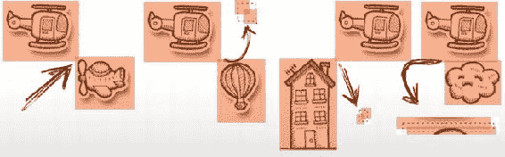

图 15-6. 当直升机的矩形与某个场景对象的矩形重叠时，就会发生碰撞。

### 营救幸存者与加油

我们还需要测试直升机与幸存者或加油车接触的条件。对于这两个对象，我们不像场景对象那样频繁生成加油车和幸存者，而是简单地隐藏它们并在需要时显示。这样，检查对象的可见性就变得很重要，因为这将是碰撞计算的关键。

以下是在 Corona SDK 中检查可见性的方法：

```lua
function isVisible(theObject)
  if theObject == nil then return false end
  return theObject.isVisible
end
```

以下是在 Gideros Studio 中的实现方法：

```lua
function isVisible(theObject)
  if theObject == nil then return false end
  return theObject:isVisible()
end
```

在`moveScenery`函数中，我们可以添加对加油车和幸存者的检查，并如下所示显示它们：

```lua
if tanker ~= nil and isVisible(tanker) then
  local tx, ty = getPosition(tanker)
  tx = tx - NORMAL
  ty = baseLine - survivor.height
  position(tanker, tx, ty)
  if tx < - tanker.width then
    setVisible(tanker, false)
    position(tanker, _W + random(5,10) * tanker.width, ty)
  end
elseif tanker ~= nil and fuel <=100 then
  setVisible(tanker, true)
end
if survivor ~= nil then 
  if isVisible(survivor) then
    position(survivor, _W+random(5,10)*survivor.width, ty)
    setVisible(survivor, true)
  else
    local tx, ty = getPosition(survivor)
    tx = tx - NORMAL
    ty = baseLine - survivor.height
    position(survivor, tx, ty)
    if tx < - survivor.width then
      position(survivor , _W + random(5,10) * survivor.width, ty)
      score = score - 50  -- 未接住幸存者的惩罚
      if score < 0 then score = 0 end 
    end
  end 
end
```

### 整合所有代码

前面的代码可以工作，但某些函数需要初始化。为此，我们将以下代码放入`init`函数中：

```lua
function init()
  background = loadImage("background.png") 
  heli = loadImage("_chopper.png", _W/2, _H/2) -- 屏幕中央
  objects =     enumerate{"plane", "balloon", "flower", "grass", "lamppost",
   "house", "tallHouse", "cloud1", "cloud2", "cloud3", "angryCloud"}
  survivor = loadImage("_man.png")
  tanker   = loadImage("_tanker.png")
  setupSound()
  colors = {
    {0,   0,   255},    -- 蓝色
    {255, 0,   0},      -- 红色
    {0,   255, 0},      -- 绿色
    {255, 0,   255},    -- 洋红色
    {0,   255, 255},    -- 青色
    {255, 255, 0},      -- 黄色
    {255, 255, 255},    -- 白色
    {179, 115, 255},    -- 橙色
  }
  createHUDItems()
  setVisible(txtGameOver,false)
  setVisible(tanker,     false)
  setVisible(survivor,   false)
  setVisible(txtTapAgain,false)
end
```

图 15-7 展示了游戏的最终版本。

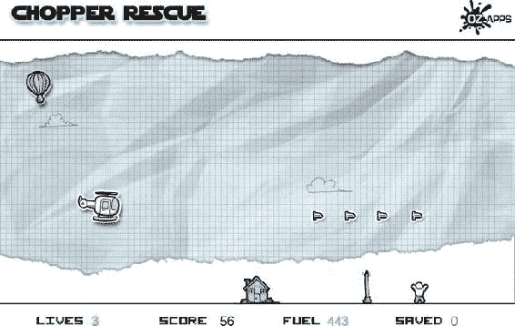

图 15-7. 可运行的 Chopper Rescue 游戏，添加了背景。

**注意** 上述代码仅为完整源代码的摘录。虽然它可以运行并演示本章所述的功能，但并非完全功能完备。要体验完整的游戏，请从 Apress 网站下载完整的源代码并运行。

## 总结

本章向您介绍了创建一个在不同框架之间只需少量修改即可移植的游戏的过程。您可以对代码应用很多优化，但我将把这留作您在进一步学习 Lua 和本书所涵盖的框架时的练习。大部分逻辑是用 Lua 编写的，而特定于框架的函数被抽象为可以修改以适应不同 SDK 的函数。

Lua 的灵活性和易用性可以帮助您快速开发游戏，并且 Lua 使您的游戏易于测试、调试和实现。

至此，我们的旅程已接近尾声。期待看到您使用 Lua 创建的游戏。

索引

 **A**

Allen 库


  **B**

BhWax

失效的测试脚本

  **C**

回调函数，爱

`love.draw()`

`love.focus()`

`love.keypressed(key, unicode)`

`love.keyreleased(key)`

`love.load()`

`love.mousepressed(x, y, button)`

`love.mousereleased(x, y, button)`

`love.quit()`

`love.update(dt)`

直升机救援

加速度计

碰撞

`checkCollisions()` 函数

`collides` 函数

救援幸存者与加油

射击飞机和气球

`colorize` 函数

`destroyObject` 函数

显示信息

`enterFrame` 事件

事件处理程序

`getAcceleration()` 函数

`getPosition` 函数

图形

手绘扫描图像

精灵图

`init` 函数

`LoadImage` 函数

`moveBullets` 函数

`moveScenery()` 函数

`playSound` 函数

`position` 函数

`reduceLife` 函数

`reduceLife()` 函数

设置

`setVisible` 和 `bringToFront` 函数

`shoot` 函数

生成项目

`update` 函数

`updatePlayer` 函数

Codea

优势

架构

下载数据

绘图

抗锯齿

背景颜色

圆形和椭圆

填充颜色

`line` 函数

线条宽度

方向

画笔颜色

矩形

RETAINED 和 STANDARD 模式

系统键盘

绘制文本

对齐方式

`font` 函数

`fontSize` 函数

模式

文本换行

Hello World

图像

加载精灵图

`noFill` 函数

`noStroke` 函数

`noTint` 函数


旋转函数

保存图像函数

保存数据

缩放函数

设置上下文函数

精灵函数

平移函数

iOS 设备

加速度计应用

优势

参数

物理函数

购买

设置与绘制函数

声音

内置类型

微调设置

波形类型

向量数学函数

angleBetween 函数

cross 函数

dist 函数

distSqr 函数

dot 函数

len 函数

lenSqr 函数

normalize 函数

rotate90 函数

旋转函数

视频录制

内置函数

多点触控

touch 函数

网页

类型强制转换

Corona AutoLAN 库

Corona Profiler

Corona SDK

架构

Corona 终端与模拟器

电梯

回调函数

自定义事件

系统事件

使用地图

缩放

enterFrame

生命条

移除对象

过渡函数

图形版本

Hello World

在设备上

在屏幕上

命名空间

屏幕上的矩形

基于事件的编程

组

图像

物理引擎

rotate( ) 函数

缩放函数

setFillColor

strokeWidth

触摸事件

设置

声音

音频命名空间

getfilename 函数

操作

主音量

媒体命名空间

OpenAL

playSound 函数

system.pathForFile 函数

计时器

延迟


帧

生命条

迭代

listenerFunction

timer.cancel( ) 函数

timer.pause() 函数

timer.performWithDelay( ) 函数

timer.resume( ) 函数

视频

网页浏览器

工作原理

协程

coroutine.create ( f )

coroutine.create 函数

[coroutine.resume ( co [, val1, …] )](#9781430246626_Ch06.xhtml#cXXX.202)

coroutine.running ( )

coroutine.status ( co )

coroutine.wrap ( f )

coroutine.yield ( … )

定义

游戏循环

进度条

恢复

  **D, E**

Director 库

绘图图元，LÖVE

圆形

线条

多边形

四边形

矩形

  **F**

文件操作

动态变量

显式函数

file:close ( )

file:flush ( )

file:lines ( )

[file:read ( [format] )](#9781430246626_Ch03.xhtml#cXXX.32n)

[file:seek ( [whence] [, offset] )](#9781430246626_Ch03.xhtml#cXXX.33a)

[file:setvbuf (mode [, size] )](#9781430246626_Ch03.xhtml#cXXX.33b)

file:write( … )

在游戏中

隐式函数

[io.close ( [file] )](#9781430246626_Ch03.xhtml#cXXX.96)

io.flush ( )

[io.input ( [file] )](#9781430246626_Ch03.xhtml#cXXX.98)

[io.lines ( [filename] )](#9781430246626_Ch03.xhtml#cXXX.99)

[io.open ( filename [,mode] )](#9781430246626_Ch03.xhtml#cXXX.100)

[io.output ( [file] )](#9781430246626_Ch03.xhtml#cXXX.101)

io.read ( … )

io.tmpfile ( )

io.type ( obj )

io.write ( … )

保存表格

变量

检索数据

保存数据

writeToFileSingle 函数

写入数据

  **G, H, I, J, K**

Gideros Illustrator (SVG 库)

Gideros Studio

加速度计

动画

应用程序对象

设备唤醒

方向选项

缩放选项

架构

桌面播放器

显示文本

事件

自定义事件


帧事件

查询

移除事件监听器

系统事件

定时器事件

触摸事件

类型

GPS 与指南针

组

陀螺仪

Hello Birdie

IDE

图像对齐

安装

许可证管理器，设置

包

iOS 标签页

许可证

网络与互联网

物理

插件

运行代码

缩放模式

形状对象

画布

填充形状

线条

矩形

音效

启动画面

 **L**

库

Allen

BhWax

损坏的测试脚本

Corona AutoLAN

Corona Profiler

Director

Gideros Illustrator

Lime

Moses 库

Particle Candy

RapaNui

Text Candy 库

TNT 粒子库

Widget Candy

Lime 库

LÖVE 应用

优点

架构

回调函数

love.draw ( )

love.focus ( )

love.keypressed ( key, unicode )

love.keyreleased ( key )

love.load ( )

love.mousepressed ( x, y, button )

love.mousereleased ( x, y, button )

love.quit ( )

love.update ( dt )

conf.lua

图形模块

活动窗口

绘制基本图形

图像函数

使用键盘移动

移动

旋转玩家

类型

Hello world

安装

播放声音

命名空间

love.audio

love.event

love.filesystem

love.font

love.graphics


love.image

love.joystick

love.mouse

love.physics

love.sound

love.thread

love.timer

粒子效果

物理

图片逻辑谜题游戏

print/printf 函数

着色器

Lua

架构

代码块与作用域

强制类型转换

全局/局部变量

定义

特性

文件操作（*参见* 文件操作）

函数

[assert ( v [, message] )](#9781430246626_Ch02.xhtml#cXXX.38)

[collectgarbage ( [opt [,arg]] )](#9781430246626_Ch02.xhtml#cXXX.39)

[dofile ( [filename] )](#9781430246626_Ch02.xhtml#cXXX.40)

点号（.）*与* 冒号（:）

[error ( message [,level] )](#9781430246626_Ch02.xhtml#cXXX.41)

_G

[getfenv ( [f] )](#9781430246626_Ch02.xhtml#cXXX.43)

getmetatable ( object )

ipairs ( t )

[load ( func [,chunkname] )](#9781430246626_Ch02.xhtml#cXXX.46)

[loadstring ( string [,chunkname] )](#9781430246626_Ch02.xhtml#cXXX.47)

[next ( table [,index] )](#9781430246626_Ch02.xhtml#cXXX.48)

pairs ( t )

pcall ( f, arg1, … )

print( … )

rawequal ( v1, v2 )

rawest ( table, index, value )

rawget ( table, index )

select ( index, … )

setfenv ( f, table )

setmetatable ( table, metatable )

将表作为对象使用

[tonumber( e [,base] )](#9781430246626_Ch02.xhtml#cXXX.58)

tostring ( e )

type ( v )

[unpack ( list [, i [, j] ] )](#9781430246626_Ch02.xhtml#cXXX.61)

_VERSION

xpcall ( f, err )

Hello World 程序

历史

在 iOS 中

在 Mac OS X 中

局限性

数学函数（*参见* 数学函数）

MVC

*nix

数字

在线 Lua Shell

运算符

算术

连接

长度

逻辑

关系

模式（*参见* 模式）

字符串（*参见* 字符串）

系统库（*参见* 系统库，Lua）

表

作为数组

作为关联数组

时间线

值和类型

布尔值

函数


nil

number

string

table

thread

userdata

variant

variables

在 Windows 中

Lua 文件系统 (LFS)

 **M**

数学函数

布尔运算

在游戏中的应用

赋值

角色移动

代码转换

掷硬币

条件分支

递增与递减

循环

多重标志

分数

蛇梯棋游戏

掷骰子

使用标志

`math.abs (x)`

`math.acos (x)`

`math.asin (x)`

`math.atan2 (y,x)`

`math.atan (x)`

`math.ceil (x)`

`math.cosh (x)`

`math.cos (x)`

`math.deg (x)`

`math.exp (x)`

`math.floor (x)`

`math.fmod (x)`

`math.frexp (x)`

`math.huge`

`math.ldexp (m, e)`

`math.log10 (x)`

`math.log (x)`

`math.max (x, …)`

`math.min (x, …)`

`math.modf (x)`

`math.pi`

`math.pow (x,y)`

`math.rad (x)`

[`math.random ( [m [,n]] )`](#9781430246626_Ch04.xhtml#cXXX.139)

`math.randomseed (x)`

`math.sinh (x)`

`math.sin (x)`

`math.sqrt (x)`

`math.tanh (x)`

`math.tan (x)`

Moai

动画

`getLoc`/`setLoc` 函数

`MOAIEaseDriver`

音频函数

Base64

位图字体

云端, Web 服务

创建

HTTP 类型服务

压缩/解压缩数据

层叠

定义

设备方向

显示文字

绘图属性

颜色

线宽

点大小

绘制图像

`copyRect`/`copyBits` 函数

自定义图像

加载函数


像素访问

resize/resizeCanvas 函数

writePNG 函数

绘图操作

圆形

椭圆

实心圆

实心椭圆

实心矩形

线条

点

多边形

矩形

组

处理输入

键盘事件

鼠标事件

触摸事件

JSON 字符串

MOAIMoviePlayer 类

网络

HTTP/HTTPS 协议

HttpTask 函数

performAsync/performSync 函数

通知

物理

Box2D 物理

Chipmunk 物理

prop 对象

RapaNui 库

SDK

showDialog 函数

模拟器

文本属性

对齐

动画

样式

线程

图块面板

TrueType 字体

视口

模型-视图-控制器 (MVC)

Moses 库

多任务

  **N**

命名空间，Love

love.audio

love.event

love.filesystem

love.font

love.graphics

love.image

love.joystick

love.mouse

love.physics

love.sound

love.thread

love.timer

  **O**

面向对象的 Lua

对象

抽象类或虚类

工厂函数

继承类或子类

  **P, Q**

Particle Candy 库

模式

捕获

字符类

模式

模式项

进程

  **R**

RapaNui

  **S**

简单对象语言 (SOL)

字符串

常量字符串

CSV 函数


转义
转表格
表格转 CSV
`getFrequency`函数
层级管理
小写转换
填充
回文
拆分
[`string.byte ( s [,i [,j ] ] )`](#9781430246626_Ch05.xhtml#cXXX.163)
`string.char (…)`
`string.dump ( function )`
[`string.find ( s, pattern [,init [,plain] ] )`](#9781430246626_Ch05.xhtml#cXXX.166)
`string.format ( formatString, … )`
`string.gmatch ( s, pattern )`
[`string.gsub ( s, pattern, repl [,n] )`](#9781430246626_Ch05.xhtml#cXXX.169)
`string.len ( s )`
`string.lower ( s )`
[`string.match ( s, patterns [,init] )`](#9781430246626_Ch05.xhtml#cXXX.172)
`string.rep ( s, n )`
`string.reverse ( s )`
[`string.sub ( s, i [,j] ] )`](#9781430246626_Ch05.xhtml#cXXX.175)
`string.upper ( s )`
千位分隔符
标题大小写转换
大写转换

## 系统库，Lua

文件函数
数学函数
操作系统函数
`os.clock ( )`
[`os.date ( [format [,time] ] )`](#9781430246626_Ch02.xhtml#cXXX.78)
`os.difftime ( t2, t1 )`
[`os.execute ( [command] )`](#9781430246626_Ch02.xhtml#cXXX.80)
`os.exit ( )`
`os.getenv ( varname )`
`os.remove ( filename )`
`os.rename ( oldname, newname )`
[`os.setlocale ( locale [,category] )`](#9781430246626_Ch02.xhtml#cXXX.85)
[`os.time ( [table] )`](#9781430246626_Ch02.xhtml#cXXX.86)
`os.tmpname ( )`
字符串函数
表函数
[`table.concat ( aTable [,sep [,i [,j] ] ] )`](#9781430246626_Ch02.xhtml#cXXX.72)
[`table.insert ( aTable, [pos,] value )`](#9781430246626_Ch02.xhtml#cXXX.73)
`table.maxn ( aTable )`
[`table.remove ( aTable [, pos] )`](#9781430246626_Ch02.xhtml#cXXX.75)
[`table.sort ( aTable [, comp] )`](#9781430246626_Ch02.xhtml#cXXX.76)

## T、U、V

表
`__add`
数组
关联数组
`__call`
`__concat`
深拷贝
`__div`
`__eq`
`__gc`
`__index`元函数
`__le`
`__lt`
`__metatable`
`__mode`
`__mul`
`__newindex`
对象
+运算符函数
`__pow`
`__sub`
`__tostring`
`__unm`
TeCGraf


文本糖果

第三方应用

位图编辑器

Axialias IconWorkshop

GraphicsGale

iConify

Inkscape

Paint.NET

Pixelmator

Pixen

集成开发环境（IDE）

CoronaComplete

Glider

Lua Studio

ZeroBrane Studio

代码片段收集工具

CodeBox

Code Collector Pro

声音工具

Audacity

Bfxr

NodeBeat

精灵动画与关卡创建工具

Glyph Designer

LevelHelper

Particle Designer

PhysicsEditor

SpriteHelper

Spriteloq

TexturePacker

Tiled

TNT Animator Studio

Zoë

文本编辑器

BBEdit

Notepad++

Sublime Text 2

Textastic Code Editor

TextMate

TextWrangler

版本控制

线程

线程处理

技巧与提示

碰撞检测

`circleInCircle` 函数

`circleOverlaps` 函数

`circleOverlapsRectangle` 函数

`isPointInRect` 函数

`pointInCircle` 函数

`pointInPolygon` 函数

`pointInTriangle` 函数

`rectInRect` 函数

`rectOverlaps` 函数

通用 Lua 函数

类 C 和类 Java 的循环翻译

比较布尔值

空棋盘格

物体摩擦力

弹簧玩偶函数

`sineScroll` 函数

使用数组

通用 Lua 函数

`angleBetween` 函数

数组组件，复制

复制表

计数值

深拷贝

`differenceOfTables`

频率测定

`getDistance` 函数

`getLinearInterpolation` 函数

`getMonthName`

哈希表或数组

`IsEmpty` 变量

`isValueInTable`

`keepInRange` 函数

获取索引

链表

`math.sign` 函数

合并表

非数组组件，复制

`paddWithZero`

`printf` 函数

返回表

设置默认值

`string.sub` 函数

`table.sort` 函数

标记化变量展开

`toRoman` 函数

参数处理

固定参数

解析

`readonlyTable` 函数

栈实现

类型

使用可变参数（Varargs）

可变命名参数

可变参数

*vs*. 表

二维向量

TNT 粒子库

  **W、X、Y、Z**

Widget Candy 库
