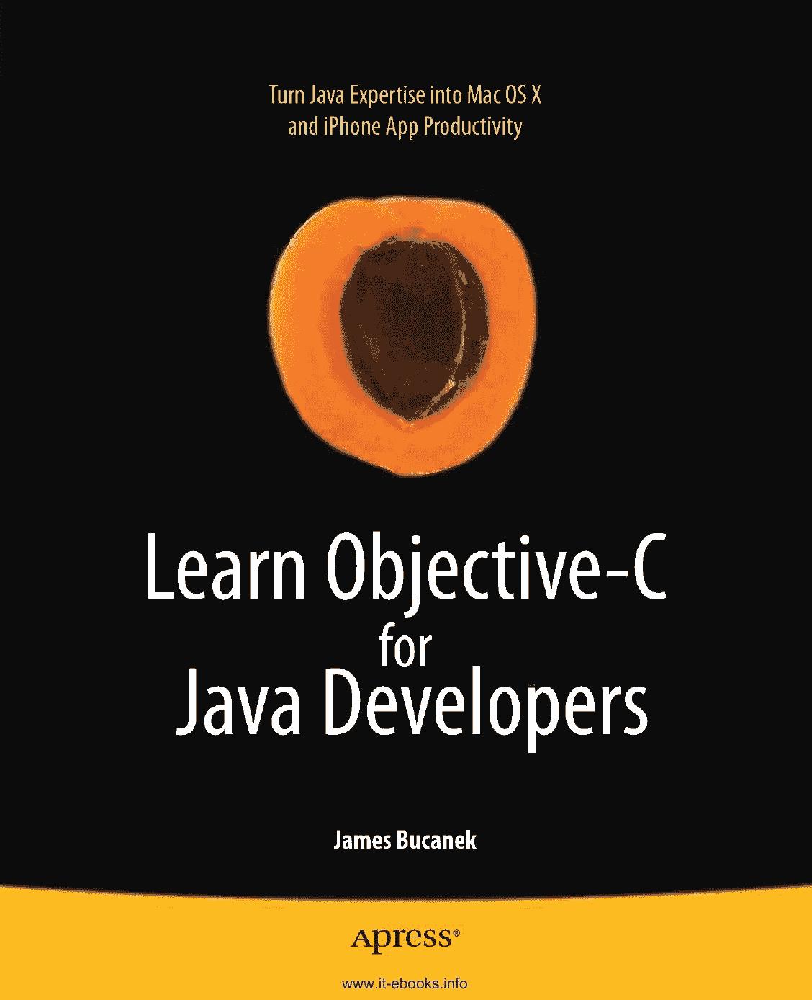

# 为 Java 开发者学习 Objective-C

[www.it-ebooks.info](http://www.it-ebooks.info/)

## 目录

**为 Java 开发者学习 Objective-C**

James Bucanek

xxv

[www.it-ebooks.info](http://www.it-ebooks.info/)

为 Java 开发者学习 Objective-C

版权所有 © 2009 James Bucanek

保留所有权利。未经版权所有者及出版人事先书面许可，不得以任何形式或通过任何方式（电子或机械，包括影印、录音或任何信息存储与检索系统）复制或传播本作品的任何部分。

ISBN-13（平装）：978-1-4302-2369-6

ISBN-13（电子版）：978-1-4302-2370-2

在美国印刷并装订 9 8 7 6 5 4 3 2 1

本书中可能出现商标名称。对于每次出现的商标名称，我们并非都使用商标符号，而是仅以编辑方式使用这些名称，并旨在维护商标所有者的利益，无意侵犯商标权。

首席编辑：Clay Andres, Douglas Pundick

技术审阅：Evan DiBiase

编委会：Clay Andres, Steve Anglin, Mark Beckner, Ewan Buckingham, Tony Campbell, Gary Cornell, Jonathan Gennick, Jonathan Hassell, Michelle Lowman, Matthew Moodie, Jeffrey Pepper, Frank Pohlmann, Douglas Pundick, Ben Renow-Clarke, Dominic Shakeshaft, Matt Wade, Tom Welsh

项目经理：Kylie Johnston

文字编辑：Elizabeth Berry

排版员：Lynn L’Heureux

索引编制：Ann Rogers/Ron Strauss

插画师：April Milne

封面设计：Anna Ishchenko

生产总监：Michael Short

全球图书贸易发行：Springer-Verlag New York, Inc., 233 Spring Street, 6th Floor, New York, NY 10013。电话：1-800-SPRINGER，传真：201-348-4505，电子邮件：orders-ny@springer-sbm.com，或访问 http://www.springeronline.com。

如需翻译相关信息，请发送电子邮件至 info@apress.com，或访问 http://www.apress.com。

Apress 及 friends of ED 图书可批量购买用于学术、企业或推广用途。大多数图书也提供电子版及许可证。更多信息请参考我们的特殊批量销售–电子版许可网页：http://www.apress.com/info/bulksales。

本书中的信息按“现状”提供，不作任何担保。尽管在编写本书时已采取一切预防措施，但作者及 Apress 对因本书所含信息直接或间接引起的任何损失或损害，不承担任何责任。

本书的源代码可供读者在 http://www.apress.com 获取。

ii

[www.it-ebooks.info](http://www.it-ebooks.info/)

## 内容概览

*谨以此书纪念我的兄长约翰和我的父亲“B 博士”。*

iii

[www.it-ebooks.info](http://www.it-ebooks.info/)

## 目录

**内容概览**

关于作者 ........................................................................................................ xxi

关于技术审阅者 ......................................................................................... xxii

致谢 ........................................................................................................... xxiii

引言 ................................................................................................................xiv

### 第一部分 ■ ■ ■ 语言

**第 1 章：引言** ............................................................................................. 3

**第 2 章：Java 与 C：关键差异** ................................................................... 11

**第 3 章：欢迎来到 Objective-C** ................................................................ 27

**第 4 章：创建 Xcode 项目** ..................................................................... 55

**第 5 章：探索协议和类别** ...................................................... 75

## 第 6 章：发送消息
## 第 7 章：与 `nil` 交朋友
## 第 2 部分 ■ ■ ■ 翻译技术
## 第 8 章：字符串和原始值
## 第 9 章：垃圾回收
## 第 10 章：自省
## 第 11 章：文件
## 第 12 章：序列化
## 第 13 章：远近通信
## 第 14 章：异常处理

[www.it-ebooks.info](http://www.it-ebooks.info/)

■ 内容一览

## 第 15 章：线程
## 第 3 部分 ■ ■ ■ 编程模式
## 第 16 章：集合模式
## 第 17 章：委托模式
## 第 18 章：提供者/订阅者模式
## 第 19 章：观察者模式
## 第 20 章：模型-视图-控制器模式
## 第 21 章：懒加载模式
## 第 22 章：工厂模式
## 第 23 章：单例模式
## 第 4 部分 ■ ■ ■ 高级 Objective-C
## 第 24 章：内存管理
