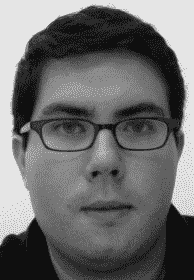

# 第 4 部分 ■ ■ ■ Objective-C 进阶

## 第 24 章：内存管理

- C 语言内存分配
- Objective-C 引用计数
- 自动释放池
    - 自动释放池生命周期
    - 返回的引用
    - 自动释放的对象
- 托管内存模式
    - 新对象模式
    - 自动释放对象模式
    - 返回自动释放的对象
    - Setter 模式
    - `init` 模式
    - `dealloc` 模式
    - 隐式保留的对象
- 托管内存问题
    - 过度保留或未释放的对象
    - 过度释放或未保留的对象
    - 过早释放的对象
    - 循环引用
- 创建自动释放池
- 混合使用托管内存与垃圾回收
- 总结

## 第 25 章：混合使用 C 与 Objective-C

- 在 Objective-C 中使用 C
    - 从 Objective-C 调用 C 函数
    - 在 C 中使用 Objective-C 对象
- Core Foundation

免桥接服务 …………………………………………………………………………… 459

*[第 xix 页]*

[www.it-ebooks.info](http://www.it-ebooks.info/)

■ 目录

C 语言内存管理 ……………………………………………………………………… 462  
使用 Core Foundation 内存管理模式 ……………………………………………… 463  
在垃圾回收机制下使用 Core Foundation ………………………………………… 463  
在托管内存环境下使用 Core Foundation ………………………………………… 464  
小结 ………………………………………………………………………………… 464  

**第 26 章：运行时** …………………………………………………………………… 465  
进程 ………………………………………………………………………………… 465  
环境 ………………………………………………………………………………… 466  
命令行参数 ………………………………………………………………………… 466  
进程属性 …………………………………………………………………………… 466  
版本 ………………………………………………………………………………… 467  
控制开发与部署版本 ……………………………………………………………… 467  
测试类、方法和函数 ……………………………………………………………… 467  
包与捆绑包 ………………………………………………………………………… 468  
框架 ………………………………………………………………………………… 468  
用户默认设置 ……………………………………………………………………… 470  
isa 指针交换 ………………………………………………………………………… 472  
64 位编程 …………………………………………………………………………… 473  
小结 ………………………………………………………………………………… 475  
后记 ………………………………………………………………………………… 475  
索引 ………………………………………………………………………………… 477  

*[第 xx 页]*

[www.it-ebooks.info](http://www.it-ebooks.info/)

■ 目录

**关于作者**

**James Bucanek** 在过去 30 年中一直从事微处理器系统的编程与开发工作。他拥有广泛的计算机硬件与软件经验，涵盖从嵌入式消费产品到工业机器人的各个领域。他的开发项目包括 Apple II 的第一个局域网、分布式空调控制系统、钢琴教学系统、数字示波器、硅晶圆沉积炉以及 K-12 教育协作写作工具。James 持有 Sun Microsystems 的 Java 开发者认证，并因优化局域网而获得一项专利。目前，James 专注于 Macintosh 和 iPhone 软件开发，他将在这一领域将他深厚的 UNIX 与面向对象语言知识，与对优雅设计的热忱融为一体。

James 持有皇家舞蹈学院的古典芭蕾副学士学位。

*[第 xxi 页]*

[www.it-ebooks.info](http://www.it-ebooks.info/)

■ 目录

**关于技术审校**

**Evan DiBiase** 与未婚妻 Ellen 以及他们的猫 Millie 居住在宾夕法尼亚州匹兹堡。高中毕业后，他在一家软件初创公司工作数年，使用 Java 开发机器学习应用，之后进入卡内基梅隆大学计算机科学学院学习，预计将于 2010 年 5 月毕业。Evan 还在 2007 年至 2009 年间主持了匹兹堡的 Cocoaheads 聚会，曾在苹果公司的 Objective-C 小组实习，并喜欢在业余时间使用 Cocoa 为 Mac OS X 和 iPhone 进行编程。

*[第 xxii 页]*

[www.it-ebooks.info](http://www.it-ebooks.info/)

■ 目录

**致谢**

本书的完成离不开 Apress 编辑们不辞辛劳的努力。我永远感激我的技术编辑 Evan DiBiase，他一丝不苟地核对了每个符号、方法和代码行的准确性。我感谢 Douglas Pundick 提出的睿智的结构性修改意见，而如果没有我的文字编辑 Elizabeth Berry 那才华横溢的批改，我将完全不知所措。坚定的 Kylie Johnson 引导着整个项目始终在正轨上运行，并且令人惊叹地按时完成了任务。

最后，我想对 Clay Andres 表达些许调侃，他曾在一场 WWDC 大会上将我拉到一边，告诉我说我能写书。

*[第 xxiii 页]*

[www.it-ebooks.info](http://www.it-ebooks.info/)

■ 目录

## 引言

Objective-C 是一种精彩的语言，但它所获得的关注远低于其应得的。随着苹果 Mac OS X 和 iPhone 的成功——在这两个平台上它是首屈一指的开发语言——它突然变得（更加）流行。如果你打算学习一门语言来为 Mac OS X 或 iPhone 编写应用程序，Objective-C 就是*那门*值得学习的语言。

Objective-C 语言给人的感觉不像是某个委员会或计算机科学专业学生开发出来的。它是一门为极简主义者和无政府主义者准备的语言。然而，它保留了许多使 Java 成为我们时代伟大编程语言之一的特性。Objective-C 允许你编写在结构和形式上与 Java 编写的任何程序一样严谨的应用程序。但同时，如果你想在语言上钻个洞，踏上一条从未有人探索过的道路，它也不会阻拦你。

在用 Objective-C 编程几年后，我惊讶地发现我的程序是多么“像 Java”。如果我当时就知道我的 Java 技术和概念中有多少可以直接移植到 Objective-C 上，就能省下我数月的学习和试验时间。我写这本书就是为了让你能避免同样的命运。

### 本书读者对象

本书面向任何希望尽快学习和探索 Objective-C 的 Java 开发者。

### 本书结构

本书分为四个部分：Objective-C 语言、技术转换、设计模式以及高级 Objective-C。

第一部分描述了 Objective-C 语言本身的基础知识。它解释了 Objective-C 如何与 Java 相似，以及如何不同。它详细阐述了语言语法、类声明、继承等。

第二部分考察了特定的技术，如垃圾回收、文件系统和内省。每一章都并排展示了 Java 代码示例以及对应的 Objective-C 代码示例。表格列出了你熟悉的 Java 类以及执行相同角色的 Cocoa 类。然后，每一章会继续深入探讨高级主题，通常涉及 Objective-C 独有的技术。

第三部分按设计模式组织。Java 开发者使用许多重要的设计模式，例如工厂模式和模型-视图-控制器模式。这些章节展示了每种模式如何在 Objective-C 中实现——其方式往往可能会让你感到惊讶。

本书的最后一部分探讨了高级 Objective-C 主题：内存管理、Objective-C 与 C 的集成，以及 Objective-C 运行时环境。

*[第 xxiv 页]*

[www.it-ebooks.info](http://www.it-ebooks.info/)

■ 引言

