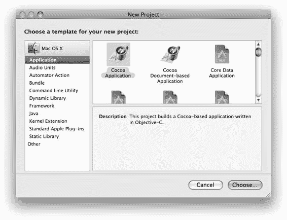
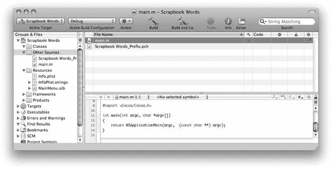

# 排版后内容

Objective-C 没有继承自对象数组的概念。对象数组可以作为对象指针的 C 数组来处理，或者使用 `NSArray` 集合类。

Objective-C 中没有 `final` 关键字。你无法阻止一个类或方法被子类化或重写。当应用于变量时，关键字 `const` 在很大程度上与 `final` 同义。

Objective-C 中的所有类和方法都是具体的。

Objective-C 中没有包的概念，因此也没有包作用域。

Java 中的接口、线程同步和异常，在 Objective-C 中有对应的实现，这些将在后续章节中详细介绍。

Java 的许多其他特性，例如序列化、内省、远程方法调用和复制，并非由 Objective-C 语言定义；与构造器类似，Cocoa 框架使用类和方法来实现这些特性。

在接下来的章节中，你还将发现 Objective-C 独有的许多特性和功能。

[www.it-ebooks.info](http://www.it-ebooks.info/)

## 第 4 章：创建 Xcode 项目

前几章包含了大量需要消化的理论和抽象概念，接下来几章的内容甚至更多。对我来说，没有什么比尝试学习一个复杂主题却无法探索每个单独概念更令人沮丧的了。为此，我将暂时从理论中抽身，投入到创建一个可运行的 Objective-C 应用程序这一纯粹务实的任务中，使用苹果公司的免费软件开发工具包 Xcode。

拥有一个你可以摆弄和测试的可工作项目，是一种无价的学习体验。在阅读本书其余部分的过程中，我鼓励你为所探索的概念编写一些小的代码示例。将代码添加到一个测试项目中，并使用调试器单步执行。几行代码就能解答许多疑问。

如果你还没有安装苹果的 Xcode 开发工具，请现在就安装。Xcode 在线获取地址为 `http://developer.apple.com/`。本教程假定你使用的是运行 Mac OS X 10.5 或更高版本的 Macintosh 计算机，并且正在安装 Xcode 3。术语 *Xcode* 实际上指代两样东西：苹果公司的整套开发工具，以及 Xcode IDE（集成开发环境）应用程序。在本书中，*Xcode* 指代 Xcode 应用程序，而 *Xcode 开发工具* 指代整套开发应用程序、工具、文档、示例代码和其他支持材料。

### 下载项目

这个项目是一个名为 Scrapbook Words 的简单桌面应用程序。给这个应用程序一组字母，它会告诉你用这些字母可以拼出哪些单词。代码量很小（几百行），但涉及了多项技术。它使用了集合和字符串对象、从文件读取数据、在后台线程中异步调度任务、使用队列消息在线程间通信，并采用控制器和绑定来实现模型-视图-控制器设计。

你可以在以下章节中了解更多关于这些特定技术的信息：

-   字符串对象将在第 8 章中探讨。
-   程序化消息发送将在第 6 章中解释。
-   集合将在第 16 章中探讨。
-   第 20 章讨论数据模型、视图和控制器对象（模型-视图-控制器模式），以及绑定。
-   线程将在第 15 章中涉及。

在开始之前，请从 `www.apress.com` 的源代码/下载区域下载完成的项目文件。本章将引导你完成从头创建此项目所采用的步骤，但并未包含所有细节。本章中的代码摘录用于说明概念，但不一定完整。请参考完成的项目以获取完整的实现。

本章有多种学习方式：

• 阅读本章，感受一下 Xcode 开发。下载完成后的项目，并亲自操作一番。

• 在 Xcode 中按照本章的每个步骤，从完成的项目中复制所需的源代码，自己重新创建项目。

• 将本章的步骤作为你自己项目的起点。

接下来，你将创建一个新的 Xcode 项目，配置项目，设计应用程序，创建控制器和数据模型对象以实现模型-视图-控制器（Model-View-Controller）设计，最后添加业务逻辑以生成一个可正常工作的应用。完成这一过程将带你简要了解 Xcode、Interface Builder、Objective-C 和 Cocoa 框架。本章中很少与 Java 进行比较，因为这更多地涉及开发工具而非编程语言本身。

### 创建项目

安装完成后，启动 Xcode 应用程序。

首先创建一个新项目。选择“File”→“New Project…”以打开新项目助理（Apple 对向导的称呼）。新项目总是基于众多内置模板之一。每个模板都会创建一个针对特定用途预先配置好的完整项目。这是实现最终目标的一个极好开端，因此请选择最接近你最终产品的模板。大多数项目需要经过大量配置才能生成有用的内容，所以我强烈建议你不要选择“`Empty Project`”模板。

对于本项目，请选择如图 4-1 所示的“`Cocoa Application`”模板。将项目命名为 `Scrapbook Words`，并选择项目及其文件存储的位置。Xcode 会创建一个以项目名称命名的文件夹。该文件夹将包含一个同名项目文档以及模板中包含的任何其他资源文件。对于某些模板来说，这可能为空，而对于其他模板，则可能包含大量项目。

[www.it-ebooks.info](http://www.it-ebooks.info/)

**图 4-1.** *选择项目模板*

项目窗口用于组织和管理项目的所有组件。如图 4-2 所示的项目窗口采用默认的 Xcode 布局。你可以在“Xcode”→“Preferences”中选择使用一体化窗口或多窗口布局，以符合你的个人喜好和习惯。

[www.it-ebooks.info](http://www.it-ebooks.info/)

**图 4-2.** *项目窗口*

大多数模板生成的项目可以立即构建并运行，但并无实际用途。`Cocoa Application` 模板也不例外。如果你愿意，现在就可以构建并启动该应用程序（“Build”→“Build and Run”）。

项目窗口的“`Group & Files`”窗格用于组织项目的资源。你可以通过创建新的组和子组，以及拖拽重新排列项目，来创建任意复杂的源项目层级结构。你可以直接在项目中创建新文件，或导入现有文件。默认情况下，实际文件都存储在项目根文件夹中。可以将物理文件组织成层级结构，或将其放置在项目文件夹之外，但对于规模适中的项目，将组织工作限制在项目窗口内会简单得多。

### 开始之前

在开始主要设计之前，需要进行一些整理工作。为了获得最接近 Java 的体验，你希望应用程序使用垃圾收集机制。截至本书编写时，垃圾收集是选择加入的；除非重新配置，否则一个新的 Cocoa 项目将使用遗留内存管理。

从菜单中选择“Project”→“Edit Project Settings”。切换到“`Build`”选项卡，选择“`All Configurations`”和“`All Settings`”，然后在搜索字段中输入 `garbage`。你应看到如图 4-3 所示的“`Objective-C Garbage Collection`”构建设置。点击值弹出菜单，将设置更改为“`Required`”。构建设置的更改会立即生效。

