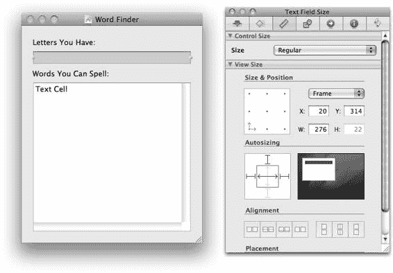
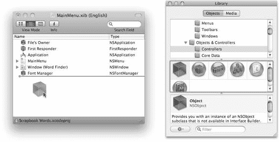
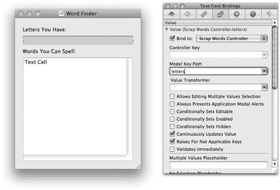

# 第 4 章 ■ 创建 Xcode 项目

**图 4-3.** *垃圾回收构建设置*

可以在此处随意探索其他构建设置（清除搜索字段）。构建设置组织成一个三维的值矩阵。前两个维度由构建设置的层级树构成：项目级别一组、每个目标一组、每个文件有限的一组。每个实体都可以定义或覆盖任何构建设置。目标的构建设置会覆盖项目的设置，文件的设置则覆盖目标的设置。在确定构建设置之前，需要判断它是适用于整个项目、特定目标，还是仅针对单个文件。第三个维度由*构建配置*构成。每个配置都包含一组完全独立的构建设置，对应项目中的每个实体。Cocoa 应用模板自带两种构建配置：`Debug` 和 `Release`。`Debug` 构建配置的设置包含调试符号，并禁用大多数代码优化，适用于调试和分析。`Release` 构建配置则去除符号信息，并开启大多数代码优化。你也可以创建自己的构建配置，但请谨慎操作，因为这会成倍增加需要维护的构建设置。

### 设计应用程序

现在让我们进入应用程序设计阶段。本应用将呈现一个图形用户界面，因此采用模型-视图-控制器（MVC）设计模式。我们的数据模型很简单——一个字母字符串和一个可拼写的单词列表，由 `string` 和 `NSArray` 对象提供。`ScrapWordsController` 类将是我们的主控制器对象。视图对象均为 `NSView` 的子类，由 `AppKit` 框架提供。

应用程序将呈现一个包含四个组件的窗口，如图 4-4 所示。输入字段让用户输入他们拥有的字母。输出视图列出用这些字母可以拼写的单词。界面很简单：你输入字母，就能看到单词。

**图 4-4.** *Scrapbook Words 用户界面*

要开始设计，请创建一个 `ScrapWordsController` 类。这将是我们主要的控制器对象。点击 `Classes` 组以选中它。在组上 `control+点击`（或右键点击），选择 **添加** > **新建文件…**，或者从主菜单中选择 **文件** > **新建文件…**。在新建文件助理中，从 `Cocoa` 组中选择 **Objective-C 类** 模板。将其命名为 `ScrapWordsController.m`，并让它创建一个对应的 `ScrapWordsController.h` 文件。点击 **完成** 按钮，助理将创建新文件并将其添加到你的项目中。

`ScrapWordsController` 对象需要执行以下操作：
1.  从输入文本字段获取用户输入的字母。
2.  每当用户输入新内容时，清除输出列表。
3.  在单词列表中搜索那些能用这些字母拼写出来的单词。
4.  将找到的每个单词添加到输出列表中，供用户查看。

代码清单 4-1 显示了 `ScrapWordsController.h` 文件的初始版本。完成版项目中的 `ScrapWordsController.h` 版本多了一个实例变量，你现在可以忽略它。它有一个 `letters` 属性，用于保存用户输入的字母字符串。`NSMutableArray` 对象将包含可拼写的单词列表。`wordsController` 变量将引用一个 `NSArrayController` 对象，该对象负责完成将数据模型绑定到显示单词列表的视图对象所需的所有工作——稍后会详细介绍。最后，分别定义了清除输出显示列表和向其中添加一个单词的方法。

**代码清单 4-1.** *ScrapWordsController 接口的初始版本*

```
@interface ScrapWordsController : NSObject {

NSString *letters;

NSMutableArray *words;

NSArrayController *wordsController;

}

@property (assign) NSString *letters;

@property (assign) IBOutlet NSArrayController *wordsController;

- (void)removeWords;

- (void)foundWord:(NSString*)word;

@end
```

### 设计用户界面

为了实现功能，应用程序需要有一个包含输入文本字段和输出列表的界面窗口。用户界面将使用 Interface Builder 开发。Interface Builder 是一个与 Xcode 紧密配合的界面设计工具。Interface Builder 编辑 NIB 文档。NIB 文档包含一个归档（序列化）的对象图。你可以在 NIB 文档中创建任何你需要的对象。NIB 中的对象通过点选设计工具来创建、配置并连接在一起。当应用程序运行并加载 NIB 文档时，对象会被实例化，其属性会得到设置，对象间的引用也会被连接起来。NIB 文档作为资源文件存储在应用程序的捆绑包中。

**注意** 历史上，Xcode 项目会包含一个二进制的 `.nib` 文档，Interface Builder 会直接编辑它。Xcode 3 引入了 `.xib` 文档类型，这是一种更健壮、更灵活的基于 XML 的 Interface Builder 文档。`.xib` 文档是一种源文档，在构建应用程序时会被编译成二进制的 `.nib` 文档。我通常将所有 Interface Builder 文档统称为 NIB 文档，因为这是 Cocoa 开发者和文档中使用的语言，并且它们也最终会由应用程序加载。

在项目窗口中双击 `MainMenu.xib` 文档；你可以在 `Resources` 组中找到它。这将启动 Interface Builder 并打开项目的 `MainMenu` NIB 文档。

Interface Builder 在窗口中呈现 `MainMenu` NIB 文档的内容，作为对象的层级集合，如图 4-5 所示。NIB 中的顶级可视对象（如窗口和菜单栏）也会单独显示。在任一视图中都可以编辑内容。

**图 4-5.** *MainMenu NIB 文档和顶级可视化容器*

创建用户界面就像拖放一样简单。打开库窗口（**工具** > **库**）。在 **对象** 标签页中，找到 **视图与单元格** 下的 **输入与值** 组。从库窗口中拖拽两个标签和一个文本字段到应用程序的窗口中，如图 4-6 所示。调整它们的位置。找到 **数据视图** 组，将一个表格视图拖入窗口。调整对象和窗口的大小与位置，直到这些对象与图 4-4 中的位置一致。双击标签来编辑其文本。

**图 4-6.** *向窗口添加视图对象*

对象的属性通过多种检查器面板进行编辑。选择 **工具** > **检查器**，然后选择输入文本字段。检查器面板会显示所选对象（或多个对象）的属性。

要编辑表格视图对象的属性，必须先选中它。在主菜单文档窗口中，深入视图对象的嵌套层级来选中表格视图对象，如图 4-7 所示。另一种方法是，在窗口中单击一次视图。这会选中顶层的滚动视图对象。再次单击内部，会向下深入视图并选中表格视图对象。再次点击则会选中表格内的某一列，依此类推。

**图 4-7.** *编辑表格视图属性*

编辑表格视图的属性：将列数设置为 1。关闭表头、重新排序和调整大小。关闭列选择功能。


视图对象应随窗口大小调整而缩放。打开尺寸检查器（`Tools > Size Inspector`）。在面板中，编辑输入文本字段和滚动视图的自动调整大小设置，如图 4-8 所示。确定对象哪些边缘锚定到窗口，然后选择水平或垂直尺寸是否随窗口变化。你需要将输入字段锚定至顶部和两侧并水平调整大小，而输出列表应在所有边缘锚定并同时水平和垂直调整大小。动画预览会显示这些设置的效果。

[www.it-ebooks.info](http://www.it-ebooks.info/)



### 图 4-8. 编辑视图对象的自动调整大小属性

### 添加控制器

应用程序需要创建一个`ScrapWordsController`的实例。它将连接到 NIB 文档中的其他对象，因此 NIB 文档也应实例化该控制器。从库中选择`Objects & Controllers`组，将一个新的`Object`对象拖入`MainMenu.xib`文档窗口，如图 4-9 所示。选中新创建的对象，切换到身份检查器（`Tools > Identity Inspector`）。将其类设置为`ScrapWordsController`。你可以手动输入或从下拉菜单中选择；Interface Builder 会跟踪你在项目中定义的类。

[www.it-ebooks.info](http://www.it-ebooks.info/)



### 图 4-9. 向 NIB 文档添加自定义对象

当此 NIB 文档在运行时加载，它将创建一个`ScrapWordsController`的实例，就像应用程序执行了以下语句一样：

```
[ScrapWordsController new]
```

这是一个需要理解的重要概念。NIB 文档中的所有对象都代表在 NIB 加载时将被实例化的真实对象。其效果等同于创建这些对象的新实例、设置其所有属性、将其添加到容器对象（针对嵌套对象），以及设置它们之间的引用。但通过使用 Interface Builder，你可以免去编写大量代码的工作。

### 建立绑定

在 MVC 设计中，数据模型对象在发生变化时会向视图对象广播更改。当用户更改值时，视图对象会更新数据模型对象。这需要视图和数据模型对象之间的连接和通信。本应用程序的数据模型是由控制器对象创建的一组简单值（一个字符串和一个数组）。

有多种方法可以将数据值与视图对象连接起来，但本应用程序将使用绑定。绑定实际上是一组支持 MVC 设计模式的技术。绑定连接两个对象，使得一个对象属性的变化会自动通知给另一个对象。第二个对象可以发起更改，从而改变第一个对象的属性。通常，第一个对象是数据模型对象，第二个对象是视图对象。一旦绑定在一起，一个对象的变化会自动反映在另一个对象中。这无需你编写任何代码。你只需声明属性并将其绑定到对象即可。

在 Interface Builder 中，选择文本字段对象（可以在`MainMenu.xib`或窗口本身中）。调出绑定检查器（`Tools > Bindings Inspector`）。展开文本字段的 Value 绑定。使用键路径`letters`将其绑定到`ScrapWordsController`对象，设置为`Continuously Update Value`，并取消选中其他选项，使其与图 4-10 所示一致。

[www.it-ebooks.info](http://www.it-ebooks.info/)



### 图 4-10. 将文本字段绑定到`ScrapWordsController`的`letters`属性

此绑定已完成。控制器`letters`属性的任何更改（例如，`[controller setLetters:@"hello"]`，或`controller.letters = @"hello"`）都会立即反映在文本字段视图中。编辑文本字段将更新控制器中`letters`的值。

如果觉得如此少的代码背后竟有如此多的魔法，那么我将稍微揭开帷幕，让你一窥幕后的一些情况。需要牢记的关键点是，Interface Builder 并没有做任何特殊的事情。使得绑定能够工作的技术——键值编码、键值观察和控制器——都是你可以直接使用的。它们可以单独使用，也可以协同使用，以实现广泛的解决方案，而不仅仅是让 MVC 设计变得简单。

### KVC

键值编码（KVC）允许以解释性方式访问对象的属性。它结合了非正式协议（在第 5 章中解释）和内省机制。例如，假设有一个符合键值编码的`Person`类，它有三个属性：一个字符串类型的`name`属性，以及`father`和`mother`属性，分别引用另外两个`Person`对象。可以使用键值路径`@"name"`来查看一个人的姓名。可以通过路径`@"father.name"`来访问其父亲的姓名，通过路径`@"mother.father.name"`来访问其外公的姓名。KVC 将在内省章节中更详细地讨论。

[www.it-ebooks.info](http://www.it-ebooks.info/)

### KVO

键值观察（KVO）是一种用于观察对象变化的通知服务。要观察的属性通过 KVC 路径指定。一旦对象开始观察某个属性，该属性的任何更改都会向观察者（监听器）发送通知。与 Java 不同，这不需要源对象管理一组监听器或自行触发通知消息——尽管它也可以这样做。它只需声明一个属性。KVO 框架负责管理观察者列表、检测属性何时更改以及发送适当通知的所有工作。KVO 在第 19 章中解释。

### 控制器

Cocoa 框架定义了一个`NSController`类，为数据模型对象和视图对象之间提供“粘合剂”。Cocoa 框架提供了许多有用的控制器，用于数组、字典（映射）、树和用户偏好设置。如果需要定义自己的控制器，你可以将`NSController`子类化。关于控制器的更多内容请参见第 20 章。

#### 绑定

绑定框架利用 KVC、KVO 和控制器创建了一个统一的 MVC 通知和同步服务。绑定可以在 Interface Builder 中创建，也可以通过`[NSObject bind:toObject:withKeyPath:options:]`方法以编程方式创建。绑定也在第 20 章中介绍。

### 添加数组控制器

表格视图和数组对象之间的绑定自然要复杂一些。为了协调显示与数据，需要两个绑定：一个绑定将表格视图中的列连接到数组控制器。第二个绑定将数组控制器连接到实际的值对象数组。数组控制器位于视图和数据模型对象之间，并维护状态信息——例如排序顺序和当前用户选择——这些信息不属于视图或数据模型。这通常被称为调解 MVC 设计模式，因为控制器对象位于视图和数据模型之间并调解它们的通信。


首先，通过从库中拖拽一个新的 Array Controller 对象到 NIB 文档中，添加一个 `NSArrayController` 实例。你可以在控制器组中找到 Array Controller。首先，选中 Table View 对象中的第一个（也是唯一一个）表列。将其值绑定到 Array Controller，控制器键（controller key）设为 `arrangedObjects`，模型键路径（model key path）设为 `self`。`self` 键值路径会让视图对象显示集合中每个对象的值，而不是每个对象的某个属性。

这样做是合适的，因为数组包含的是简单的字符串对象。

现在，需要将数组控制器连接到它的数据模型对象。在 `MainMenu` NIB 文档中选中新创建的 Array Controller 对象，并将其 Content Array 绑定设置为 `ScrapWordsController`，模型键路径设为 `words`。键值路径 `words` 告诉控制器，`ScrapWordsController` 的 `words` 属性是数组的数据源。

最后，`ScrapWordsController` 需要以编程方式与数组控制器对象进行交互。为此，它需要一个指向由 NIB 文档创建的数组控制器实例的对象指针（引用）。这可以通过 outlet 和连接来实现。outlet 只是一个指向另一个对象的实例变量。如代码清单 4-1 所示，`IBOutlet` 类型修饰符将对象指针属性变成了 Interface Builder 中的公共 outlet。连接在 NIB 中创建了一种关系，这样当 NIB 文档加载时，实例变量将指向其连接的对象。

用 `IBOutlet` 关键字修饰的对象指针会在 Interface Builder 中自动显示为 outlet。`IBOutlet` 关键字可以放在实例变量之前，或者放在 `@property` 指令中。在 `MainMenu` NIB 文档中选择 `ScrapWordsController`，并切换到连接检查器（Connections Inspector）。Interface Builder 会将 `wordsController` 列为该对象的一个 outlet。要将该 outlet 连接到数组控制器对象——即在运行时将该实例变量设置为指向数组控制器对象的地址——请将 outlet 的连接器拖拽到 Array Controller 对象上并释放鼠标按钮，如图 4-11 所示。

***图 4-11.** 将 arrayController Outlet 连接到 Array Controller 对象*

现在应用程序有了一个界面并且可以运行，但没有任何实际功能。所有的视图和数据模型对象协同工作，但由于在输入字段中键入内容时没有任何反应，用户体验不佳。应用程序需要业务逻辑。

### 开始业务逻辑

应用程序将读取并构建一个包含大约 20 万个常用单词的字典。每当有字母被输入时，它将搜索所有能用这些字母拼写出的单词。解决此类问题的方法有很多，但此应用程序选择了一种简单的方法：暴力搜索所有 20 万个单词。这可能会很耗时，因此搜索不应发生在应用程序的主 UI 线程上。否则，每当输入一个新字母时，应用程序都会看起来像是卡住了。

解决方案是在后台线程上执行搜索。搜索线程每找到一个单词，就会向主线程发送消息。这可以通过线程和信号量来实现，但让 `NSOperationQueue` 来代劳繁重的工作会更简单。

回到 Xcode 项目，选择 Classes 组并添加一个新的 Objective-C 类文件，命名为 `WordFinder.m`，以及它的配套头文件 `WordFinder.h`。将 `WordFinder` 设为 `NSOperation` 的子类，如代码清单 4-2 所示。

***代码清单 4-2.** WordFinder 接口*

```
@class ScrapWordsController;

@interface WordFinder : NSOperation {

  ScrapWordsController *controller; // 对控制器的引用
  NSArray *letterSet; // 要搜索的字母集合

}

+ (NSArray*)words;
- (id)initWithLetters:(NSString*)letters
  controller:(ScrapWordsController*)windowController;
- (void)main;

@end
```

当用户输入一些字母时，视图对象会通过向控制器发送 `setLetters:` 消息来更新数据模型。`setLetters:` 的实现（如代码清单 4-3 所示）会创建一个新的 `WordFinder` 操作并将其加入队列等待执行。当 `WordFinder` 线程运行时，它会通过主线程向 `ScrapWordsController` 发送 `removeWords` 和 `foundWord:` 消息。

主应用程序线程所要做的就是启动操作，然后静静地等待结果涌入。应用程序的界面永远不会阻塞，也永远不会无响应。`removeWords` 和 `foundWords:` 方法必须通过数组控制器对象来修改数据模型。数组控制器负责保持数据模型、视图以及其自身之间的同步。

***代码清单 4-3.** ScrapWordsController 实现*

```
@implementation ScrapWordsController
@synthesize wordsController;

- (id) init
{
  self = [super init];
  if (self != nil) {
    words = [NSMutableArray new];
    finderQueue = [NSOperationQueue new];
  }
  return self;
}

- (NSString*)letters
{
  return (letters);
}

- (void)setLetters:(NSString*)newLetters
{
  if (newLetters==nil)
    newLetters = @"";
  if (![letters isEqualToString:newLetters])
  {
    letters = newLetters;
    [finderQueue cancelAllOperations];
    WordFinder *finder = [[WordFinder alloc] initWithLetters:newLetters
                              controller:self];
    [finderQueue addOperation:finder];
  }
}

- (void)removeWords
{
  NSRange all = NSMakeRange(0,[words count]);
  NSIndexSet *everyItemIndex = [NSIndexSet indexSetWithIndexesInRange:all];
  [wordsController removeObjectsAtArrangedObjectIndexes:everyItemIndex];
}

- (void)foundWord:(NSString*)word
{
  if ([words count]==0 || ![[words lastObject] isEqualTo:word])
    [wordsController addObject:word];
}

@end
```

`WordFinder` 实现的框架如代码清单 4-4 所示。简而言之，它包含一个类方法，用于构造并返回一个包含所有可能单词的单例数组。为了防止被多个 `WordFinder` 线程同时调用，该方法被加了同步锁。`main` 方法被调用来执行操作。它简单地测试每个单词是否与字母集合中的字母匹配。如果匹配，则使用 `[controller performSelectorOnMainThread:@selector(foundWord:) withObject:candidate waitUntilDone:YES]` 向主线程发送一条消息。关于向对象发送消息的更多信息，请参阅第 6 章。

***代码清单 4-4.** WordFinder 实现框架*

```
static NSArray *DictionaryWords; // 单词列表的单例副本

@implementation WordFinder

+ (NSArray*)words
{
  @synchronized(self) {
    if (DictionaryWords==nil) {
      NSMutableArray *words = [NSMutableArray new];
      ...
      DictionaryWords = [NSArray arrayWithArray:words];
    }
  }
  return DictionaryWords;
}

- (void)main
{
  // 获取可能的单词列表
  NSArray* possibleWords = [WordFinder words];

  // 首先，向控制器发出信号，表示新的单词搜索已开始
  [controller performSelectorOnMainThread:@selector(removeWords)
            withObject:nil
            waitUntilDone:YES];

  // 暴力搜索字典中的每一个单词...
  for ( NSString *candidate in possibleWords ) {
    ...
  }

}

@end
```

完成的应用程序如图 4-12 所示。当输入字母时，会生成一个搜索线程来查找可能的单词。

***图 4-12.** 完成的 Scrapbook Words 应用程序*

### 调试应用程序


`debugger`是开发过程中不可或缺的工具，同时也是学习语言时极佳的沙盒环境。你可以编写代码、观察执行过程、检查结果，甚至修改数据。要试用沙盒笔记应用，请确保构建配置设置为`Debug`。在构建结果窗口（`Build` > `Build Results`）中完成此操作。要设置断点，点击代码左侧的行号空白区域。断点显示为蓝色标签，如图 4-13 所示。再次点击断点可禁用它。拖动断点可移动其位置，或将其拖出空白区域以删除。选择`Run` > `Debug`启动应用，使其在调试器控制下执行。

***图 4-13.** 停在 Xcode 调试器中断点处* 一旦在断点处停止，你可以从任何源代码窗口、使用菜单命令或主调试器窗口（`Run` > `Debugger`，如图 4-13 所示）控制应用的执行。调试器窗口还会显示调用栈和局部变量。

[www.it-ebooks.info](http://www.it-ebooks.info/)

第 4 章 ■ 创建 Xcode 项目

#### 创建沙盒应用

在尝试代码时，沙盒应用非常有用。按照以下步骤快速创建一个简单的 Cocoa 应用，可用于测试代码，甚至可作为完整应用的基础：

1. 使用 Cocoa 应用模板创建一个新项目。
2. 在构建设置中启用垃圾回收。
3. 向项目中添加一个新类。这是你的测试类。
4. 为类添加一个动作。动作是一个方法，它接受一个对象标识符作为唯一参数，并返回`IBAction`，例如`- (IBAction)doSomething:(id)sender`。`IBAction`与`void`同义，因此动作实际上不返回任何值。`sender`参数是发送该动作的对象（即步骤 8 中定义的按钮或菜单项）。它通常被忽略。
5. 将测试代码添加到动作方法中。
6. 打开`MainMenu` NIB 文档。
7. 在 NIB 文档中创建测试类的一个实例。
8. 向窗口添加一个按钮，或向菜单添加一个新的菜单项。
9. 选择该按钮或菜单项，将其发送动作连接到步骤 4 中定义的动作方法。具体操作为：将发送动作连接器拖动到测试对象，释放鼠标按钮，然后选择该动作。

现在你有了一个应用，点击按钮或从菜单中选择测试命令时，即可执行代码。如果需要可编辑参数，可以向窗口添加输入文本字段、复选框、滑块甚至日期选择器视图对象，并将它们绑定到测试类中的`IBOutlet`属性。Objective-C 绑定会自动执行明显的类型转换。例如，如果你将文本字段绑定到一个整数属性值，字段中的文本将被转换为整数。

随着需求增长，可以添加更多测试方法、按钮或菜单命令。

还可以使用 Foundation 命令行工具创建更简单的环境：

1. 使用 Foundation 工具模板创建一个新项目。
2. 在构建设置中启用垃圾回收。
3. 将测试代码添加到`main()`函数中。

Foundation 工具没有图形用户界面，也不与 AppKit 框架链接。因此，它们无法访问处理图形或用户登录环境的类。

应用的`main()`函数将在运行应用后立即执行。

### 总结

现在你应该对如何使用 Xcode 开发应用以及创建自己的应用有了基本了解。几乎任何项目（无论是浏览器插件还是 iPhone 应用）的基本步骤和工具都大同小异。我提醒你，本章只是触及了 Xcode 的表面。Xcode 本身既广泛又深入——已有整本书专门介绍它。请将本介绍视为在香榭丽舍大街的一次漫步，而非对巴黎的详尽游览。


现在你已经掌握了一些实际开发的基础，接下来几章将深入探讨特定的 Objective-C 技术。

**第五章**

■ ■ ■

探索协议和分类

Objective-C 提供了两种额外的方案来定义方法：协议和分类。本章将介绍这两种方案，解释它们的区别，展示它们的用法，并提供一些结合它们的设计模式。

Objective-C 协议等同于 Java 接口。协议的使用方式与 Java 中的接口类似，尽管使用频率较低。Objective-C 程序员更倾向于使用一种称为非正式协议的更宽松的形式。

Objective-C 分类可以向一个类添加方法，而无需修改其主要的类声明（`@interface`）。分类的概念对于 Java 开发者来说可能非常陌生，但实际上它非常简单。分类用于隔离或隐藏某个类实现的一部分，将复杂的类分解为易于管理的部分，以及将通常不属于某类范畴的功能附加到该类上。

协议

协议（接口）使用`@protocol`指令定义，如代码清单 5-1 所示。该指令列出了协议所需的方法。与 Java 接口一样，协议不包含任何实例变量——只包含方法。

代码清单 5-1. 游戏协议

```objectivec
@interface VenusAttacks : Game
...
@end

@class Thing;

@protocol Living
- (float)age;
- (float)health;
- (NSDictionary*)healthInfo;
@end

@protocol Communicating
- (NSArray*)recipientsInRange;
- (void)sendMessage:(NSString*)messsage to:(id<Communicating>)recipient;
@end

@protocol Storing
- (NSDictionary*)inventory;
- (BOOL)giveItem:(Thing*)item to:(id<Storing>)recipient;
- (BOOL)acceptItem:(Thing*)item from:(id<Storing>)recipient;
@end

@interface Thing : NSObject
...
@end

@interface Weapon : Thing
...
@end

@interface Radio : Thing <Communicating>
...
@end

@interface StorageLocker : Thing <Storing>
...
@end

@interface Character : Thing <Living,Communicating>
...
@end

@interface Earthling : Character <Storing>
...
@end

@interface Venusian : Character
...
@end
```

代码清单 5-1 中的代码为 `VenusAttacks` 冒险游戏中的对象定义了三个协议。

这些协议（接口）是 `Living`、`Communicating` 和 `Storing`。一个类通过在父类名称后面的尖括号中声明它所实现的协议。`StorageLocker` 类实现了 `Storing` 协议定义的所有方法。`Character` 类实现了 `Living` 和 `Communicating` 这两个协议定义的所有方法。

用 Objective-C 的说法，`StorageLocker` 符合 `Storing` 协议。

当一个类符合某个协议时，它必须实现该协议定义的所有方法。未能实现协议中定义的方法是编译时错误。符合一个协议意味着该协议中的方法原型已经隐式声明。因此，`StorageLocker` 类的 `@interface` 中不需要显式声明它实现了 `-(NSDictionary*)inventory` 方法；这一点已经由 `<Storing>` 隐含了。

与 Java 接口一样，协议会被子类继承并且是可累加的。`Earthling` 类符合 `Storing`、`Living` 和 `Communicating` 协议。`Venusian` 对象符合 `Living` 和 `Communicating` 协议，但不符合 `Storing` 协议——金星人没有口袋。

协议名可以与类名在类型表达式中结合使用。声明 `Weapon<Communicating> *weapon = nil` 定义了一个指向 `Weapon` 类对象的指针，并假定该对象实现了 `Communicating` 协议。编译器将允许将来自 `Weapon` 和 `Communicating` 的消息发送给该对象。

■注意 与 Java 不同，Objective-C 在赋值时不会测试对象所属的类或协议。如果你将一个武器对象指针赋值给 `Weapon<Communicating> *weapon` 变量，而该对象并不符合 `Communicating` 协议，这一点直到该对象收到 `sendMessage:to:` 消息时才会被发现（并抛出无法识别的选择器异常）。

在 Java 中，你可以像使用类类型一样使用接口名。当你想在 Objective-C 中声明或转型一个对象，使其表示“一个实现了所述协议的任意类对象的引用”时，可以将协议名与 `id` 类型结合，如 `id<Storing>`。当 `id` 以这种形式使用时，它就失去了常规的随意性。这种类型的变量被假定为只接受该协议定义的消息。

协议可以扩展和组合其他协议。代码清单 5-2 定义了 `FTLCommunicating` 协议，该协议本身符合 `Communicating` 协议。任何符合 `FTLCommunicating` 的类都必须实现由 `FTLCommunicating` 和 `Communicating` 定义的所有方法。子协议不必声明任何新方法；它可以仅仅用来聚合多个协议。

代码清单 5-2. 子协议

```objectivec
@protocol FTLCommunicating <Communicating>
- (id)receiveMessageBeforeBeingSent;
@end
```

每个协议定义通常保存在其自己的头文件（`.h`）中，然后由符合或引用它的类通过 `#import`（如 `#import "Living.h"`）导入。

非正式协议

非正式协议是一组程序员期望某个对象实现的方法。这组方法没有以任何正式的方式声明，这就是为什么 Objective-C 协议有时被称为正式协议，以区别于非正式协议。非正式协议几乎只是一种编程约定——最好由程序员记录在案。

非正式协议在 Objective-C 中很受欢迎，原因有二。如前所述，Objective-C 在进行赋值时不会验证对象的类。对象是否实现某个协议或方法，在消息实际发送给该对象之前是被忽略的。这使得定义一个假定对象实现了一组方法，但不对其实际实现作任何保证的对象引用变得很容易。

以编程方式确定一个对象是否实现某个方法也非常简单。结合这两个特性，你可以轻松地传递一个能力不确定的对象，并在需要时评估该对象的能力。

为了说明正式协议（接口）和非正式协议之间的对比，考虑拦截关闭窗口的请求这一任务。`javax.swing.JWindow` 类有一个 `addWindowStateListener(WindowStateListener l)` 方法。为了将自己注册为监听器，一个对象必须实现 `WindowStateListener` 接口，以便在 `addWindowStateListener()` 调用中作为参数传递。注册后，该对象会接收事件回调并监视 `WINDOW_CLOSING` 事件。

Cocoa 框架对同一个问题采取了更为宽松的方法。一个想要拦截关闭窗口事件的对象会将自己设置为窗口的委托对象。在窗口关闭之前，`NSWindow` 会检查委托对象，看它是否实现了 `-(BOOL)windowShouldClose:(id)window` 方法。如果实现了，它就会向该对象发送 `windowShouldClose:` 消息并检查结果。如果没有实现，它就会忽略该委托，继续关闭窗口。

`-windowShouldClose:` 方法定义了一个非正式协议：要么对象实现了 `-windowShouldClose:`，要么没有。代码清单 5-3 展示了一个假设的窗口关闭逻辑实现。

代码清单 5-3. 测试非正式协议

```objectivec
BOOL shouldClose = YES;
```


`if ([delegate respondsToSelector:@selector(windowShouldClose:)]) shouldClose = [delegate windowShouldClose:self]; // 询问代理是否允许关闭 if (!shouldClose)`

`return;`

这种编程风格具有面向切面编程的元素，其中通用能力（“切面”）分散在不同的类中。这种设计模式也重复用于其他窗口相关活动。窗口代理可以干预窗口的缩放，但仅当它实现了 `-windowWillResize:toSize:` 方法时。代理有机会为模态对话框做准备，但仅当它实现了 `-window:willPositionSheet:usingRect:` 方法时。

关于测试对象的类成员身份、协议一致性以及方法实现的更多细节，请参见第 10 章。

#### 结合正式协议与非正式协议

从 Objective-C 2.0 开始，正式协议和非正式协议可以结合使用。一个 `TableDataSource` 协议的示例如代码清单 5-4 所示。该协议定义了一组数据模型对象应实现的方法，以便为假设的 `Table` 对象提供数据。

**代码清单 5-4.** `TableDataSource` 协议

```
@protocol TableDataSource

@required

- (int)numberOfRowsInTable:(Table*)table;

- (id)table:(Table*)table objectForColumn:(int)col row:(int)row;

@optional

- (void)table:(Table*)table setObject:(id)object forColumn:(int)col row:(int)row;

@end
```

[www.it-ebooks.info](http://www.it-ebooks.info/)

第 5 章 ■ 探索协议与类别

该协议有两个必需方法（数据集中行数的方法，以及获取特定单元格对象的方法）和一个可选方法（用于设置特定单元格的值）。`Table` 类使用前两个方法获取数据集中的值，并使用第三个方法更改数据集中的数据。如果数据源对象未实现最后一个方法，则 `Table` 将数据集视为不可变。

符合此协议的类必须实现在 `@required` 之后声明的所有方法，但可以选择实现任意个或零个 `@optional` 方法。在 `@required` 或 `@optional` 指令之前（或未指定指令）声明的方法，默认情况下是 `@required`。

测试一个对象是否遵守 `TableDataSource` 协议，可以告诉你该对象实现了所有 `@required` 方法，但未必实现任何 `@optional` 方法。这些方法需要逐个测试。

声明可选方法的一个重要原因——除了记录它们之外——是为了编译器的利益。当方法已被原型化时，Objective-C 编译器可以最可靠地组装方法调用。这在第 6 章中有更详细的解释。`TableDataSource` 协议提供了所有方法的原型，即使是那些从未实现的方法。

> **注意** 在 Objective-C 2.0 之前，常见的做法是声明一个从未被任何类正式采用的正式协议，目的仅仅是为编译器提供方法原型。非正式协议的方法原型也可以使用类别来声明，这将在本章后面介绍。

选择使用正式协议、非正式协议，还是两者结合，取决于你的需求。正式协议确保协议中的所有方法都已实现，并且可以通过单个测试来验证一致性。非正式协议更加灵活和动态，但可能需要额外的文档和程序员的配合。

### 类别

类别是类定义的一个命名片段。在 Java 中，类是在一个单一的总体语句中定义的。在 Objective-C 中，类定义的部分内容可以拆分为若干组辅助方法。每个组就是一个类别。类别有多种应用。

类别的定义方式与类类似，使用 `@interface` 和 `@implementation` 指令，区别在于类别是使用现有的类名后跟括号中的类别名称来标识的。与协议（接口）一样，类别不能向类添加新的实例变量——只能添加方法。类别可以定义实例方法和类方法。

代码清单 5-5 中的代码是食谱管理应用程序的控制器。`RecipeBoxController` 对象处理顶级应用程序命令，例如创建新食谱和购物清单文档。

**代码清单 5-5.** 单一式食谱盒控制器

```
@interface RecipeBoxController : NSObject {

NSMutableArray* recipes;

NSMutableDictionary* recipeIndex;

}

- (id)init;

- (Document*)newRecipe;

- (Document*)newShoppingList;

- (Document*)newShoppingListFromRecipes:(NSIndexSet*)recipeIndexes;

@end

@implementation RecipeBoxController

…

@end
```

[www.it-ebooks.info](http://www.it-ebooks.info/)

第 5 章 ■ 探索协议与类别

随着程序的复杂性增加，在单个类定义中维护所有控制器方法变得繁琐。类别用于将类定义细分为可管理的模块，如代码清单 5-6 所示。

**代码清单 5-6.** 食谱盒类别

```
@interface RecipeBoxController : NSObject {

NSMutableArray* recipes;

NSMutableDictionary* recipeIndex;

}

- (id)init;

- (Document*)newRecipe;

@end

@implementation RecipeBoxController

…

@end

@interface RecipeBoxController (ShoppingLists)

- (Document*)newShoppingList;

- (Document*)newShoppingListFromRecipes:(NSIndexSet*)recipeIndexes;

@end

@implementation RecipeBoxController (ShoppingLists)

…

@end
```

重组后，新的食谱文档方法仍然在主 `RecipeBoxController` 类中实现。所有创建购物清单文档的方法都被隔离到 `ShoppingLists` 类别中，该类别可以作为单独的模块进行编译。`ShoppingLists` 类别中定义的方法是 `RecipeBoxController` 类的一等公民。它们与主 `RecipeBoxController` 类中定义的方法具有相同的作用域和变量访问权限。在运行时，代码清单 5-5 中的类与代码清单 5-6 中的类及类别功能完全相同。

#### 使用类别进行组织

将大型类细分为可管理部分是类别的一个用途。它对于封装类的功能子部分所需的知识或依赖项也很有用。在食谱应用程序示例中，`ShoppingLists` 类别的实现无疑需要导入购物清单、配料清单、杂货店编辑器等的类定义。而主 `RecipeBoxController` 类的实现不需要了解这些类。

类别允许将类的相关方法组织到它们自己的模块中，而无需任何额外的类或复杂性。这减少了依赖性并保持应用程序设计的模块化。这在协作开发环境中特别有用，其中一名程序员可能正在开发新的食谱功能，而另一名程序员正在开发新的购物清单功能。两位程序员可以在相互独立的情况下对同一个类进行更改。

Builder 模式是类别的另一个应用。Builder 模式将复杂的对象构造移出类。在 Java 中，Builder 模式通常实现为一个单独的类（有时称为辅助类）。在 Objective-C 中，复杂的构造代码可以通过类别与主类定义隔离开来。

#### 隐藏方法


类别的一个常见用途是隐藏类的部分接口，通常是为了阻止设计仅供内部使用的方法被调用。在 Java 中，方法可以被声明为 `private` 或 `protected`，使其在类外部不可访问。在 Objective-C 中，你可以通过类别来“隐藏”一组方法。清单 5-7 展示了 `Toaster` 类的内部方法如何被隔离在 `Private` 类别中。

清单 5-7. `Private` 类别中的方法

```objc
@interface ToasterController : NSObject {

@private

float darkness;

}

- (void)setDarkness:(float)level;

- (void)startToasting;

- (void)stopToasting;

@end

@interface ToasterController (Private)

- (float)darkness;

- (CarrierState)carrierPosition;

- (NSTimeInterval)cycleTime;

- (void)setCycleTime:(NSTimeInterval)cycleTime;

- (void)finishedToasting:(NSTimer*)timer;

@end
```

[www.it-ebooks.info](http://www.it-ebooks.info/)

第 5 章 ■ 探索协议和类别

为了使其有效，`ToasterController (Private)` 类别的声明被保存在其自己的头文件（`.h`）中。使用 `ToasterController` 类的模块只导入 `ToasterController.h` 文件，该文件不包含任何 `Private` 类别的方法。在缺少 `Private` 类别声明的情况下，编译器——以及程序员——将不知道这些内部控制方法的存在。

■ 注意 按照惯例，类别被保存在以类名“+”类别名命名的头文件中。在清单 5-7 的示例中，`ToasterController (Private)` 类别将被保存在 `ToasterController+Private.h` 文件中。

这也可以仅通过两个源文件来实现。`ToasterController.h` 文件只包含主要的 `@interface ToasterController` 声明。实现文件（`.m`）首先导入其头文件。然后它会声明 `Private` 类别的 `@interface`，紧接着是 `ToasterController` 类及其 `Private` 类别方法的 `@implementation` 指令。没有其他模块会知道这些内部方法。

这是类别的一种常见用法，以至于 Objective-C 2.0 添加了扩展的概念（将在本节后面描述），将这种技术形式化。

### 扩充外来类

一个对 Java 开发者来说几乎会感到奇怪的特性是，类别可以将方法附加到任何类。这允许在不创建子类或修改原始类定义的情况下扩展一个类。

更重要的是，该类的子类会继承这些类别方法。

Cocoa 框架中的 `NSArray` 类定义了一个便捷方法 `-(id)lastObject`，大致等价于语句 `[array objectAtIndex:[array count]-1]`。为了对称，我希望 `NSArray` 类的设计者也包含了一个 `-(id)firstObject` 方法。Objective-C 在清单 5-8 中实现了我的愿望。

清单 5-8. `NSArray` 类别

```objc
@interface NSArray (MyCollectionAdditions)

- (id)firstObject;

@end

@implementation NSArray (MyCollectionAdditions)

- (id)firstObject

{

return ([self objectAtIndex:0]);

}

@end
```

[www.it-ebooks.info](http://www.it-ebooks.info/)

第 5 章 ■ 探索协议和类别

`MyCollectionAdditions` 通过插入一个新方法，动态地改变了操作系统 `NSArray` 类的行为。我的应用程序现在可以向其进程中的任何 `NSArray` 对象发送 `-firstObject` 消息。

■ 警告 当一个类别和一个类都实现了相同的方法时，类别的方法会替换类中的方法。它不是覆盖（override）；无法调用原始方法。在类别代码中调用 `[super method]` 会调用父类的方法，而不是类的原始方法。如果两个或多个类别为同一类实现了相同的方法，那么在运行时调用哪个方法是不可预测的。

除了能够用便捷特性装饰类之外，类别对于向不属于其领域的类添加功能也非常有用。回到本书引言中的示例，`AppKit` 框架定义了 `NSStringDrawing` 类别，它为基类 `NSString` 扩展了清单 5-9 中显示的其他方法。

清单 5-9. `NSStringDrawing` 类别

```objc
@interface NSString(NSStringDrawing)

- (NSSize)sizeWithAttributes:(NSDictionary *)attrs;

- (void)drawAtPoint:(NSPoint)point withAttributes:(NSDictionary *)attrs;

- (void)drawInRect:(NSRect)rect withAttributes:(NSDictionary *)attrs;

@end
```

所有 `NSString` 对象都继承这些方法。这允许你编写更自然、更简洁的 `[string draw]`，而不是被迫编写 `[currentDrawingContext drawString:string]`。

■ 注意 类别强调了 Objective-C 类是在运行时动态组装的事实。一个加载了 `AppKit` 框架（包含 `NSStringDrawing` 类别）的 GUI 应用程序会将这些额外的绘图方法注入到基类 `NSString` 中。一个仅链接到 `Foundation` 框架（不包含图形绘制类）的 Objective-C 命令行工具不会加载 `AppKit` 框架，并且其 `NSString` 对象将不会实现这些方法。

类别允许你在方便且合理的地方实现方法，而不会牺牲像封装和模块化这样的良好编程实践。

当你探索各种框架时，你会发现许多类别为类扩展了有用的方法，而这些方法如果直接实现在这些类中是完全不合适的。`NSStringPathExtensions` 类别为 `NSString` 对象添加了一整套文件系统路径操作。

类似地，`NSURLUtilities` 类别为 `NSString` 添加了 URL 字符编码方法。`NSPasteboardSupport` 为 `NSURL` 类添加了剪贴板复制和粘贴方法，等等。

需要记住的重要事情是，Objective-C 类中的方法并不局限于类的领域。在文档中查找方法时，不要将搜索范围限制在职责领域内的类中。`NSGraphicsContext` 没有实现任何绘图方法。被绘制的对象（`NSString`、`NSImage`、`NSAttributedString` 等）各自拥有自己的 `-draw` 方法，其中一些是由 `NSGraphicsContext` 提供的类别提供的。

在编写自己的代码时，努力打破严格的 Java 方法组织模式。在 Java 中，一个编码游戏角色名称的方法自然会是 `Character` 类的一个方法——因为该类拥有编码角色名称所需的知识。在 Objective-C 中，可以考虑编写一个类别，将你自己的 `-(id)encodedCharacterName` 方法添加到核心的 `NSString` 类中。

■ 警告 向根类 `NSObject` 添加类别时需要格外小心和考虑。它可能会导致未预料到的潜在危险副作用。每个类对象（在运行时定义类的准对象）也是 `NSObject` 的子类，因此任何 `NSObject` 方法同时成为一个实例方法和一个类方法。这意味着 `self` 变量可能指向一个实例对象或一个类对象，具体取决于上下文。此外，`NSObject` 方法不能向 `super` 发送消息。

#### 扩展

Objective-C 2.0 引入了扩展的概念。扩展本质上是一个匿名的类别。扩展用于细化类的 `@interface`，但不细化其 `@implementation`。它特别适用于从类的公共接口中排除方法原型，如前文“隐藏方法”部分所述。


扩展的 `@interface` 指令与分类相同，唯一的区别在于分类名称为空。扩展没有独立的 `@implementation`。在扩展中声明的方法必须在类的 `@implementation` 中实现，并与类的其他常规方法放在一起（参见列表 5-10）。

**列表 5-10.** 扩展

```objc
@interface CaseDocument : NSObject {
@private
    CaseNumber caseNumber;
}

- (CaseNumber)caseNumber;

@end

@interface CaseDocument ()

- (void)setCaseNumber:(CaseNumber)number;

@end

@implementation CaseDocument

- (CaseNumber)caseNumber { return (caseNumber); }
- (void)setCaseNumber:(CaseNumber)number { caseNumber = number; }

@end
```

[www.it-ebooks.info](http://www.it-ebooks.info/)

## 第 5 章：探索协议与分类

假设列表 5-10 中的第一个 `@interface` 指令存储在 `CaseDocument.h` 文件中，并被使用 `CaseDocument` 类的其他模块导入。扩展的 `@interface` 可以在其自己的头文件中，也可以是 `CaseDocument` 实现文件的一部分。无论哪种方式，扩展中的方法都不是公开的，这使得 `caseNumber` 属性对于其他模块表现为不可变的，但在类内部实现中却是可变的。在编译扩展声明时，也要同时编译原始类的声明。当编译器能够将扩展与类关联起来时，其工作效果最佳。

请记住，分类和扩展只是从编译器和程序员的角度隐藏了方法的声明。在运行时，所有这些方法都存在，并且可以通过内省机制发现。在列表 5-10 的 `CaseDocument` 示例中，`caseNumber` 属性对于键值观察等技术而言将是可变的。这些技术会在运行时动态检查对象，以确定它是否实现了 `caseNumber` 属性的 getter 和 setter 方法对——而 `CaseDocument` 确实实现了。为了让 `caseNumber` 对内省机制表现为只读属性，内部方法 `setCaseNumber:` 应重命名为类似 `-(void)assignToCase:(CaseNumber)number`。这打破了属性的命名约定，使得 `caseNumber` 只有 getter 方法而没有 setter 方法。

**总结**

可以看出，Objective-C 的协议和分类比 Java 的接口更加灵活和动态。

它们可以声明可选方法，将类的实现细分为多个模块，以及为其他类增加新功能。

类、协议和分类涵盖了声明方法的所有技术。下一章将解释调用方法的各种方式。

[www.it-ebooks.info](http://www.it-ebooks.info/)

**第 6 章**

■ ■ ■

**发送消息**

发送消息（调用方法）是编程的基础。你已经了解了 Objective-C 消息的基础知识。本章深入探讨消息发送的机制，描述三种通过编程方式调用方法的不同技术，并解释如何编写接受可变数量参数的方法。虽然并非必须详细了解这些主题，但扩展知识面可以使通知、动作、远程调用和键值观察等技术更容易理解。

正如第 3 章简要说明的那样，Objective-C 中的方法并非像 Java 那样被调用。

消息通过动态派发函数发送给对象。向对象发送消息大致涉及以下步骤：

1.  消息参数被组装并复制到堆栈上。
2.  指向接收者的指针和消息选择器常量被复制到堆栈上。
3.  调用消息派发函数。在苹果的 Objective-C 实现中，通常调用的函数是 `objc_msgSend()`，但通常来说，最好忽略运行时系统的实现细节。
4.  如果接收者值为 `nil`，派发函数立即返回。
5.  消息派发函数使用接收对象的指针来获取其 `isa` 实例变量。该变量指向对象的 `Class` 对象，其中包含该类的派发表。
6.  使用选择器在派发表中查找方法代码的地址。
7.  CPU 的程序计数器加载该地址，并开始执行方法的代码。
8.  执行一直持续到方法结束，程序控制权返回到最初发送消息的代码。

**注意** 消息派发看起来可能是一个复杂且低效的过程，但它已经过高度优化。

选择器是常量，方法派发表也被缓存。在大多数情况下，在现代系统上发送一条消息只需要几纳秒。对于性能敏感的应用程序，甚至可以消除此开销（参见本章末尾的“直接调用方法”）。通常情况下，不必过分担心消息的性能问题。

[www.it-ebooks.info](http://www.it-ebooks.info/)

## 第 6 章：发送消息

类方法会将所有消息参数作为自动变量接收，包括接收者和选择器。`self` 变量包含指向接收者的指针，`_cmd` 变量包含消息选择器。`_cmd` 变量通常不引人注意，因为它总是该方法的选择器。

### 编译消息

Objective-C 编译器将每个方法调用转换为将发送消息的机器指令。为了生成正确的机器指令，编译器必须知道每个参数的大小和类型以及返回值的类型。

Java 会不遗余力地确保编译器确切知道如何构造每个方法调用。Java 总是拥有每个类的详细信息，对象引用的类总是已知的，并且 Java 方法签名确保方法期望的参数类型永远不会存在任何歧义。可以想象，Objective-C 则要宽松得多。这偶尔会导致方法调用的确切含义变得模糊不清。我将解释为什么会发生这种情况以及你可以采取哪些措施来纠正它。

请记住这些属于特殊情况。绝大多数情况下，编译器确切知道该怎么做。如果接收者的变量类型是指向特定类的指针，并且该类的原型已经编译过，那么编译器就拥有了所需的所有信息。

然而，如果编译器尚未编译该方法的原型，或者接收者的类不明确（例如 `id`），则编译器必须要么猜测参数的类型，要么从其已知的方法原型中任意选择一个。

#### 未声明的方法

第一种情况发生在方法原型从未被编译时，其原因可能是类定义被遗漏，或者类定义不完整——该方法可能在该类的某个分类中声明，或者根本没有声明。当发生这种情况时，如列表 6-1 所示，编译器会根据调用推断参数类型。换句话说，编译器会进行猜测。

**列表 6-1.** 未声明的方法调用

```objc
@class ToasterController;
ToasterController *toaster;
…
[toaster setDarkness:1];
```

**警告：未找到方法‘-setDarkness:’**


  
**警告：没有匹配方法签名的消息将被假定返回`id`并接受`...`作为参数。** 清单 6-1 中的代码会导致编译器发出“未找到方法”的警告。编译器不知道名为`-setDarkness:`的方法。在没有任何信息的情况下，它假设消息的参数类型与调用中的参数类型相同，并且该方法返回一个对象标识符（类型为`id`的对象指针）。假设`ToasterController`类是上一章中的那个类，编译器将生成错误的代码。这是因为调用中的参数是一个整数，而实际的`-setDarkness:`方法期望的是一个`float`。整数和浮点数不能互换，因此`-setDarkness:`方法将接收到一个垃圾值。

这个问题的解决方案很简单：包含方法声明。包含此代码的模块本应使用`#import`指令，如清单 6-2 所示。现在编译器有了该类的方法原型。它知道`-setDarkness:`方法接受一个`float`参数，并且编译器会在发送消息之前正确地将整型常量提升为浮点值。

```
清单 6-2. 声明的方法调用

#import "ToasterController.h"

ToasterController *toaster;

…

[toaster setDarkness:1];
```

作为一条规则，永远不要忽略“未找到方法”的编译器警告。始终导入或声明你使用的类和方法。很少有正当理由不能包含所需的声明，这能确保编译出的代码是正确的。

#### 歧义方法

当接收者的类型未知（类型`id`）或不完整（仅通过`@class`指令定义），但编译器至少看到了一个与方法标识符匹配的方法原型时，会出现一个更微妙的问题。

在这些情况下，编译器会自信地假设接收者实现了你调用的方法——你是程序员；你一定知道自己在做什么，对吧？它会搜索所有已知的方法原型，并使用与语句匹配的第一个方法标识符来编译消息。

大多数情况下这都能正常工作。从统计上看，方法标识符往往是唯一的，或者在功能上是相同的。在整个 Cocoa 框架（相当庞大）中，只有一个`-setLocation:`方法。有六个不同的`-setTag:`方法由不同的类实现，但它们都有相同的原型（`-(void)setTag:(int)tag`）。因此，编译器选择使用哪个原型并不重要；编译出的代码将是正确的。

问题出现在极少数情况下：存在两个或更多具有相同标识符但参数或返回类型不同的方法（参见清单 6-3）。`-options`消息就是这样一个例子。Cocoa 框架中定义了六个`-options`方法。其中两个返回指向字典的指针，三个返回整数，一个返回自定义的枚举值。

```
清单 6-3. 歧义方法调用

id mystery;

…

NSDictionary *options = [mystery options];

**警告：初始化时未进行类型转换，将整数转换为指针**
```

清单 6-3 向`mystery`对象发送了`-options`消息。没有任何类信息的情况下，Objective-C 使用它找到的第一个`-options`原型。之所以出现警告，是因为编译器再次猜错了。它使用的`-options`原型返回的是一个整数，而不是指向字典对象的指针。正是整数被隐式提升为指针才生成了警告。

要解决这种歧义，可以对接收者进行类型转换。在清单 6-4 中对`mystery`变量进行类型转换，告诉编译器假设接收者是一个`NSTextTab`对象。编译器将自身限制为使用来自`NSTextTab`类的方法原型。它编译出正确的代码，并且不会生成虚假的警告。在第二个示例中，`sidekick`变量被转换为任何遵循上一章`Communicating`协议的类。同样，编译器将接收者限制为`Communicating`中定义的方法。

```
清单 6-4. 消除消息歧义

id mystery;

id hero, sidekick;

…

NSDictionary *options = [(NSTextTab*)mystery options];

[(id<Communicating>)sidekick sendMessage:@"Help!" to:hero];
```

如果歧义是因为接收者是一个尚未定义的类类型（仅通过`@class`指令声明），那么解决方案是`#import`其完整的声明。

## 强制转换

类型转换可用于有意识地强制 Objective-C 允许你发送一个它认为对象并未实现的方法。一个`Character`对象不接受`-giveItem:to:`消息。如果通过编程，你发现一个`Character`对象实际上是一个`Earthling`对象（或其子类之一），你可能希望向它发送一个子类特有的消息。类型转换允许你覆盖编译器对接收者的常规假设，并编译正确的方法调用，如清单 6-5 所示。

```
清单 6-5. 强制方法调用

Character *player;

Earthling *hero;

Thing *secret;

…

if ([player respondsToSelector:@selector(giveItem:to:)])

    [(Earthling*)player giveItem:secret to:hero]; // 假设 player 是 Earthling
```

### 以编程方式发送消息

Objective-C 使得向对象发送消息非常容易——不仅可以使用到目前为止讨论的方法调用语法，还可以通过编程方式让变量决定发送什么消息。

以编程方式构建消息的便捷性，促进了 Objective-C 在多种解决方案和设计模式中的采用。你会遇到许多服务，它们使用指向接收者的指针、选择器（`SEL`），或两者兼有，向你的代码发送消息，或代表你的代码发送消息。一些例子包括：

- **控件：** 每个可视化控件对象（按钮、菜单项、复选框、单选按钮、滑块等）都有一个动作。动作由一个目标属性（接收者）和一个动作属性（选择器）组成。当控件被激活时，它会向目标发送该动作。参见第 20 章。
- **通知：** 定时器和通知服务会在事件发生时向一个对象发送消息。你使用对象标识符和选择器来确定对象和要调用的方法。参见第 18 章。
- **回调：** 像模态对话框这样的组件会在对话框被关闭时，通过向你选择的对象发送你指定的消息来通知你的代码。
- **委托：** 委托模式在 Cocoa 框架中被广泛使用。委托总是一个变量。有时它接收的消息也是可变的，通过你指定的选择器来确定。参见第 17 章。

在 Java 中，以编程方式调用方法很复杂且有些繁琐，涉及多个内省对象。通常，Java 接口被定义出来，只是为了对象有一个定义明确的入口点来接收消息。在 Objective-C 中，一个简单的消息极其轻量，只需要一个指向接收者的指针和一个整数选择器。实际上，消息选择器是指向内部运行时数据结构的指针，当程序的二进制文件被加载到内存中时由链接器解析。从程序员的角度来看，选择器应被视为不透明的整型常量。


在编程中，大致有三种发送消息的方式。最常用且最快捷的方式是使用根类提供的 `-performSelector:` 方法族。最灵活且类似 Java 的方式是构建一个 `NSInvocation` 对象。最后，Objective-C 方法也可以直接作为 C 函数来调用。最后一种方式在高性能要求的应用中很受欢迎。

**警告** 所有消息的首要规则是：消息中提供的参数必须与方法所期望的参数在类型、大小和顺序上完全匹配。所有这些编程式消息发送技术都不提供任何类型检查、类型转换、类型提升或自动装箱功能。

#### 即时消息

根类 `NSObject` 实现了一系列 `-performSelector:` 方法。你可以使用它们向任何对象发送消息，就像你的代码直接调用了该方法一样。代码清单 6-6 展示了向任意对象发送 `-className` 消息的两种方式：一种是直接调用，另一种是使用 `-performSelector:` 方法进行编程式调用。

代码清单 6-6. 使用 `-performSelector:` 发送消息

```
id anything = …;

NSString *name;

name = [anything className];

SEL variableMessage = @selector(className);

name = [anything performSelector:variableMessage];
```

代码清单 6-6 中对 `-className` 的两次调用在功能上是完全相同的。第二次调用稍慢，因为它实际上发送了两条消息：首先向对象发送 `performSelector:`，然后对象立即向自身发送 `className` 消息。`className` 方法返回的值会传回给调用者。

使用 `-performSelector:` 发送消息快速、简单且轻量。`-performSelector:` 的主要缺点在于它最多只能接受零个、一个或两个对象标识符作为参数，并且总是返回一个对象标识符作为返回值。通过类型转换，你可以强制编译器传递或返回任何类型的指针值；所有指针的大小和格式都是相同的。代码清单 6-7 展示了如何传递一个整型指针而不是对象指针。指向整数的指针被强制转换为对象标识符，以便与消息的参数类型匹配。这仅仅是为了通过编译器的检查，实际上并没有进行任何值的转换。

代码清单 6-7. 向 `-performSelector:` 传递其他类型的指针

```
@implementation ShiftyMethods

- (void)incrementAnInteger:(int*)valuePtr

{

*valuePtr += 1;

}

@end

…

ShiftyMethods *shifty = [ShiftyMethods new];

int i = 1;

[shifty performSelector:@selector(incrementAnInteger:) withObject:(id)&i];
```

如果调用的方法需要更多参数，或者需要更特殊的参数，例如 `long long` 整数、浮点数或结构体，则必须使用本章中介绍的其他技术。

表 6-1 列出了 `NSObject` 实现的基本 `-performSelector:` 方法。所有这些方法都兼容返回某种类型的指针或 `void` 的方法。当用于 `void` 方法时，应忽略 `-performSelector:` 的返回值。

**表 6-1.** 即时调用方法

| 方法 | 描述 |
| --- | --- |
| `-(id)performSelector:(SEL)message` | 向接收者发送由选择子指定的消息。该消息不包含参数，并返回由方法返回的对象标识符。 |
| `-(id)performSelector:(SEL)message withObject:(id)firstParam` | 向接收者发送消息。该消息包含一个指针作为第一个参数，并将返回的指针返回给调用者。 |
| `-(id)performSelector:(SEL)message withObject:(id)firstParam withObject:(id)secondParam` | 向接收者发送消息。该消息包含两个指针参数，并将返回的指针返回给调用者。 |

#### 延迟消息

消息也可以被放入队列，并在未来的某个时间发送给对象。该方法可能在不同的线程上被调用，在过了一段时间后，或者只是“在某个时候”被调用。要理解消息是如何被延迟的，你需要对运行循环有所了解。

运行循环是一个在其自身线程中执行的事件队列。每个 Cocoa 应用程序至少有一个运行循环。启动的第一个运行循环被命名为主运行循环或主线程。所有用户交互（鼠标点击、键盘命令、界面更新、动画等）都被输入到主运行循环中，并在主线程中执行。

你可以在你的进程中创建额外的线程。启动一个运行循环将接管一个线程，并将其转变为事件驱动的线程。运行循环的生命周期就是不断从事件队列中取出一个事件、处理它、然后立即“循环”回去处理下一个等待的事件。如果没有挂起的事件，线程就会挂起。你可以在第 15 章中了解更多关于创建线程和运行循环的内容。

可以推送到运行循环队列中的一种事件类型就是方法调用。它基本上就是对象引用、以及该对象将要接收的消息和参数的组合。当一个对象消息事件到达事件队列的顶部时，运行循环就会将该消息发送给目标对象。

根类 `NSObject` 实现了多个用于在运行循环上排队消息以供稍后执行的方法。主要的几个方法如表 6-2 所示。

**表 6-2.** 延迟调用方法

| 方法 | 描述 |
| --- | --- |
| `-(void)performSelector:(SEL)message withObject:(id)arg afterDelay:(NSTimeInterval)delay` | 将一条消息放入队列，该消息将在当前线程中发送给接收者。消息至少在 `delay` 秒之后才会被放入队列。 |
| `-(void)performSelectorOnMainThread:(SEL)message withObject:(id)arg waitUntilDone:(BOOL)wait` | 将一条消息放入队列，该消息将在主线程中发送给接收者。如果 `wait` 为 YES，该调用将挂起当前线程，直到方法执行完毕。 |
| `-(void)performSelector:(SEL)message onThread:(NSThread*)thread withObject:(id)arg waitUntilDone:(BOOL)wait` | 将一条消息放入队列，该消息将在附加到指定线程的运行循环上发送给接收者。如果 `wait` 为 YES，该调用将挂起当前线程，直到方法执行完毕。 |
| `-(void)performSelectorInBackground:(SEL)message withObject:(id)arg` | 创建并启动一个新线程。当新线程开始执行时，消息和 `arg` 参数会被发送给接收者，后者在该线程中执行。当方法返回时，线程终止。 |

`-performSelector:withObject:afterDelay:` 方法会将消息事件推送到当前运行线程的运行循环中。延迟时间是一个以秒为单位的浮点数值。运行循环首先等待 `delay` 秒过去，然后将事件排队，以便在下一个机会执行。该方法并不保证消息发送的具体时间，只是保证消息不会在未来的 `delay` 秒之前发送。要将消息排队以便在运行循环的下一个机会发送，请传递 `0.0` 作为延迟值。

`-performSelectorOnMainThread:…` 和 `-performSelector:onThread:…` 方法都会将消息排队，以便在特定线程上执行。

如前所述，主线程运行应用程序的主要运行循环。`-performSelectorOnMainThread:` 消息对于需要（例如，为了更新窗口中某个字段的值）在主线程中执行某些操作的辅助线程尤其有用。这些方法必须在主线程上执行。后台线程可以通过在 `wait` 参数中传递 `NO` 来选择异步发送消息，或者通过传递 `YES` 来挂起当前线程直到延迟的消息执行完毕。


`-performSelector:onThread:`变体将一个消息排队，以便在任何具有运行循环的线程上执行。如果传递给此方法（或`-performSelectorOnMainThread:`方法隐含的）的目标线程与当前正在运行的线程相同，则该消息会立即发送给对象（使用`-performSelector:`），而不涉及任何运行循环。

上述三种方法都有一个接受额外`mode`参数的替代形式。运行循环在模态（modes）下运行。模式是一种过滤器，会忽略队列中那些在当前模式下不合适的某些事件。更多关于运行循环模式的内容，请参阅“线程”章节。

最后的`-performSelectorInBackground:...`方法在一个新创建的线程中向对象发送消息。此方法不使用运行循环。会创建一个专门用于执行消息的线程，并在执行完毕后销毁该线程。

所有这些方法都提供了一个单一的对象标识符参数，该参数会与消息一起包含在内。如果被调用的方法不期望参数，则该值会被忽略；将其设置为`nil`。

### 面向对象的方法调用

Java 中`java.lang.reflect.Method`类的角色在 Cocoa 中主要由`NSMethodSignature`和`NSInvocation`承担。这些类形成了一个高级的、面向对象的接口，用于访问方法的定义以及调用方法的手段。`NSMethodSignature`是方法参数和返回类型的一个不可变描述。`NSInvocation`封装了接收者、消息、参数值以及返回值，这些构成了一次方法调用。可以将`NSMethodSelector`视为方法的原型，而将`NSInvocation`视为发送消息的行为。

虽然简单的`-performSelector:`方法快速且易于使用，但它们缺乏灵活性。

`NSInvocation`可以处理接受任何类型或数量参数的方法。这包括从单个字节到整个结构体的所有内容。

要创建一个`NSInvocation`对象，必须首先获取该方法的`NSMethodSignature`。

任何对象在收到`-methodSignatureForSelector:`消息时，都会返回其某个方法的签名。如果没有代表对象，则向`Class`对象发送`+instanceMethodSignatureForSelector:`消息。一旦获取了方法的`NSMethodSignature`，就可以使用`+invocationWithMethodSignature:`创建一个`NSInvocation`对象。

目标、参数值和返回值是单独设置的，并持久保存在`NSInvocation`对象中。这与 Java 不同。在 Java 中，`Method`对象在调用`invoke()`时被传递目标对象和所有参数，该方法在返回后不会保留关于此次调用的任何信息。

`NSInvocation`的参数和返回值通过`-setArgument:atIndex:`一次配置一个。每个参数值都是通过向`-setArgument:atIndex:`传递参数值的地址（而不是要传递的值）来设置的。即使对于对象指针值也是如此；传递指向对象指针的指针，而不是指针本身。`NSInvocation`利用其对参数类型的了解，将该地址处的值复制到参数流中。

清单 6-8 演示了如何使用`NSInvocation`向`NSString`对象发送`-substring:`消息，以及 Java 中功能等效的代码。

**清单 6-8.** 面向对象的方法调用

**Java**

```
try {
    String prose = "Do nine men interpret?";

    // Get Method for String.substring(int,int)
    Class[] paramTypes = { int.class, int.class };
    Method method = prose.getClass().getMethod("substring", paramTypes);

    // Invoke prose.substring(3,7)
    Object[] paramValues = { new Integer(3), new Integer(7) };
    String count = (String)method.invoke(prose, paramValues);

    System.out.println(count + " men, I nod.");
}
catch (Exception e) {
    e.printStackTrace();
}
```

**Objective-C**

```
NSString *prose = @"Do nine men interpret?";
NSMethodSignature *signature;
NSInvocation *invocation;
NSString *count;

// Create invocation for -[NSString substringWithRange:] method
signature = [prose methodSignatureForSelector:@selector(substringWithRange:)];
invocation = [NSInvocation invocationWithMethodSignature:signature];

[invocation setSelector:@selector(substringWithRange:)];

// Set range structure as first parameter (after self and _cmd)
NSRange range = NSMakeRange(3,4);
[invocation setArgument:&range atIndex:2];

// Invoke method and extract the return value
[invocation invokeWithTarget:prose];
[invocation getReturnValue:&count];

NSLog(@"%@ men, I nod.", count);
```

与 Java 的`Method`对象不同，`NSInvocation`不执行任何形式的参数类型转换。必须向`-setArgument:atIndex:`传递一个指向方法所期望的精确类型变量的指针。在清单 6-8 的 Java 示例中，参数类型被指定为`int.class`，但作为参数传递的值是`Integer`对象。Java 知道在将`Integer`对象传递给`substring(int,int)`方法之前，必须将其转换为原始的`int`值。`NSInvocation`不执行此类转换。如果某个方法期望一个`int`参数，那么传递给`-setArgument:atIndex:`的值必须是一个指向包含要发送值的原始`int`变量（`&myValue`）的指针。

变量参数的索引从 2 开始。前两个参数始终是传递给每个方法的隐藏的`self`和`_cmd`参数。使用`-setTarget:`和`-setSelector:`来配置这两个属性。为方便起见，`-invokeWithTarget:`通过单条消息设置目标并调用方法。

可能会觉得奇怪，为什么必须配置将要发送的方法？毕竟，一开始就是使用方法选择器来创建`invocation`对象的。这是因为`NSMethodSignature`不与特定消息相关联，它只定义参数的“形状”。可以重新配置`NSInvocation`，以发送期望相同类型、数量和顺序参数的不同消息。例如，可以创建一个单一的`NSInvocation`对象，向监听器发送带有四个参数的回调消息，但让服务的客户端选择他们想要接收的消息。只要客户端的方法期望正确的参数，他们就可以灵活地创建任何名称的方法。你的代码可以高效地重用单个`NSInvocation`对象来处理所有回调。

### 直接调用方法

你编写的每个方法最终都会被编译成一个静态的 C 函数。指向这些函数的指针填充了每个`Class`对象的调度表。

编译器隐藏了这些函数的名称，因此你永远不会接触到它们。但 Objective-C 会提供每个函数的地址，从而可以直接调用方法——绕过所有常规的消息调度逻辑。这项技术有点专业，但如果你需要从其他编程语言调用 Objective-C 方法，或者当消息调度对性能有显著影响时，它会非常有用。

`-methodForSelector:`方法返回实现——方法代码的地址——当接收者收到该消息时将会执行该实现。类方法`+instanceMethodForSelector:`返回当实例收到该消息时名义上会执行的代码的地址。我在这里非常谨慎地选择了措辞。可以修改单个对象，使得当它收到一条消息时执行的代码，与另一个相同类的对象执行的代码不同，甚至与`Class`对象认为每个实例都会执行的代码不同。不要轻易假设一个对象的方法实现地址与另一个实例相同，或者等于`-[Class instanceMethodForSelector:]`返回的地址。最安全的做法是查询单个对象以获取其实现地址，并且只为该对象使用该地址。


