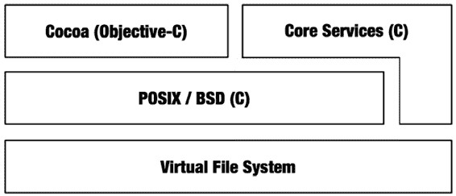

# 第十一章

## 文件

文件系统对于几乎所有计算机操作系统都是至关重要的。操作系统本身、应用程序、文档和其他信息都持久化在文件系统中。从概念上讲，文件非常简单：文件是一个命名的字节序列，按层次结构组织在文件系统中。

您可能会认为这会是一个简短的章节，但事实并非如此。可能正是因为文件系统的重要性，它一直是大量开发工作的焦点。几十年来，文件系统稳步发展，现在已相当复杂。文件拥有复杂的权限、属性和多个数据分支。还有设备文件、内存文件、串行通信文件和符号链接文件。文件系统融合了高级缓存、异步数据传输、日志记录和变更跟踪等功能。这种复杂性中的大部分已经渗透到与文件系统交互的`API`和对象中。

在 Objective-C 中使用文件时，需要处理的细节比在 Java 中更多。

为了可移植性，Java 试图尽可能地隐藏或抽象底层的文件系统细节。

Objective-C 则展现了所有底层的`POSIX`文件系统细节的全部面貌。另一方面，Objective-C 提供了许多更高级别的方法，允许您用尽可能少的语句来读取、写入或访问整个文件的内容。

本章将介绍文件和路径名称的基础知识、如何处理目录中的文件、文件元数据的操作，以及读写数据文件的各种方法。在此过程中，还会涉及其他的`API`。

### 文件系统 API

您用来与文件系统交互的函数、类和方法统称为文件系统的应用程序编程接口（`API`）。在 Java 中，文件系统`API`被整齐地组织在`java.io`包中。在 Objective-C 中则不是这样。Objective-C 的 Cocoa 框架提供了一个简单的文件系统接口，足以满足大多数需求。与之并行的是 Core Services 框架。Core Services 提供了许多高级文件系统函数，以及一组模仿经典 Macintosh 操作系统（通常称为 Carbon API）原始文件服务的 C 语言`API`。在这两种`API`之下是核心的`BSD` `API`。这些是实际在 Mac OS X 中实现大多数文件服务的 C 函数。Cocoa 和 Core Services 的许多部分仅仅是兼容性`API`，它们所做的只不过是调用`BSD`函数来完成工作。

Objective-C 和 Java 之间的一个概念性区别是，Java 的大部分内容都是围绕读取和写入序列化数据的抽象类（如`java.io.Reader`、`java.io.Writer`、`java.io.InputStream`、`java.io.OutputStream`）组织的，这些抽象类有用于处理数据文件的子类。Objective-C（和 C）倾向于使用专门构建的函数来处理数据文件，并将数据流类保留用于网络端口和通信管道。两者之间存在一些重叠，但比 Java 中要少得多。

[www.it-ebooks.info](http://www.it-ebooks.info/)

## 第十一章 ■ 文件

***图 11-1.** Mac OS X 中的文件系统 API 组织*

