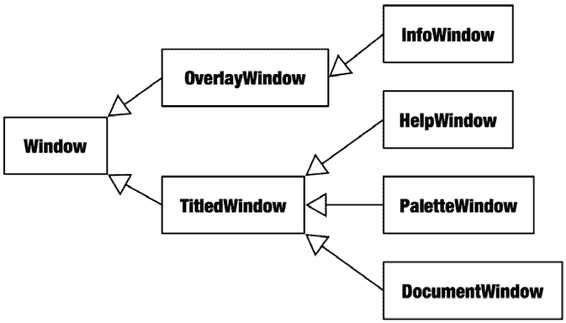

# 第 16 章 集合模式

如果你将清单 16-9 中的`NSEnumerator`赋值语句替换为清单 16-10 中的代码，那么该清单中的代码就变得特别有趣。`-keysSortedByValueUsingSelector:`消息会返回一个排序后的键数组，允许你以可预测的顺序遍历字典的值。


关于如何控制排序顺序，请参阅"`排序集合`"一节。

**列表 16-10. 有序字典枚举**

```
NSEnumerator *e = [[dictionary keysSortedByValueUsingSelector:@selector(compare:)]
    objectEnumerator];
```

> **提示:** 一个鲜为人知的事实是，`NSEnumerator` 也遵循 `NSFastEnumeration` 协议。这使得任何 `NSEnumerator` 对象都可以作为快速枚举语句中的集合。在列表 16-9 中，`while(…)` 语句可以替换为 `for ( key in e )`。枚举器对象承担了集合的角色。这并非优化方案——枚举器只是向自身发送 `-nextObject` 消息——因此不要期望它具有典型快速枚举的性能。

Objective-C 中没有与 `java.util.Map.Entry` 对象等价的东西。最接近的方式是使用 `-[NSDictionary getObjects:andKeys:]` 来填充两个 C 数组，一个存储键，另一个存储值，如列表 16-11 所示。

**列表 16-11. 枚举字典键/值对**

```
NSDictionary *dictionary = …
NSUInteger count = dictionary.count;

__strong id *keys = NSAllocateCollectable(sizeof(id)*count, NSScannedOption); 
__strong id *values = NSAllocateCollectable(sizeof(id)*count, NSScannedOption);

[dictionary getObjects:values andKeys:keys];

NSUInteger i;
for (i=0; i<count; i++) {
    id key = keys[i];
    id object = values[i];
    // ...
}
```

#### 添加枚举支持

你可以轻松地继承 `NSEnumerator` 来实现自己的枚举器。它实际上只需要实现一个 `-nextObject` 方法。仅在你认为有用，或者你的枚举器对象面向广泛用户时，才实现很少使用的 `-allObjects` 方法。关于自定义 `NSEnumerator` 的示例，请参见第 20 章的 TicTacToe 项目。另外，正如前面提示中提到的，任何 `NSEnumerator` 都可以在快速枚举语句中使用。

[www.it-ebooks.info](http://www.it-ebooks.info/)

第 16 章 ■ 集合模式

为自定义对象提供快速枚举支持需要稍微复杂一些。概念上很简单：只需遵循 `NSFastEnumeration` 协议，并实现 `-countByEnumeratingWithState:objects:count:` 方法。

快速枚举代码会重复向你的对象发送此消息，直到返回 0。每次你的集合收到该消息时，它必须将下一批要处理的对象组装到一个 C 数组中，并返回准备好的数量。当你的类批量组装对象时，快速枚举效率最高，但也可以通过一次返回一个对象来实现简单的非优化方案。

单次迭代的进度通过一个 `NSFastEnumerationState` 结构体来维护。当该结构体首次传递给你的方法时是空的，后续每次传递的消息中会再次传入相同的结构体。你的集合必须更新该结构体以跟踪枚举进度，并防止枚举过程中集合发生更改。如果在枚举过程中修改了集合，快速枚举应抛出异常。

关于 `-countByEnumeratingWithState:objects:count:` 方法和 `NSFastEnumerationState` 结构体的完整描述，请参阅 `NSFastEnumeration` 协议的文档。

### 排序集合

有序集合提供了三种对成员对象进行排序的基本技术：使用 Objective-C 消息排序、使用 C 回调函数比较对象排序、以及使用排序描述符排序。对集合进行排序的方法列于表 16-15 中。

**表 16-15. 排序方法**

| 方法 | 描述 |
|--------|-------------|
| `-[NSArray sortedArrayUsingDescriptors:]` | 返回使用排序描述符排序后的数组副本。 |
| `-[NSArray sortedArrayUsingSelector:]` | 返回使用 Objective-C 消息排序后的数组副本。 |
| `-[NSArray sortedArrayUsingFunction:context:]` | 返回使用 C 函数比较对象排序后的数组副本。 |
| `-[NSArray sortedArrayUsingFunction:context:hint:]` | 与 `-sortedArrayUsingFunction:context:` 相同，但接受一个通过 `-sortedArrayHint` 获得的优化提示。 |


-[`NSMutableArray sortUsingDescriptors:`]

使用排序描述符对数组进行原地排序。

-[`NSMutableArray sortUsingFunction:context:`]

使用 C 函数比较对象，对数组进行原地排序。

-[`NSMutableArray sortUsingSelector:`]

使用 Objective-C 消息对数组进行原地排序。

-[`NSDictionary keysSortedByValueUsingSelector:`]

以数组形式返回字典中所有键的副本，并使用 Objective-C 消息进行排序。

#### Objective-C 消息排序

方法 `-sortedArrrayUsingSelector:`、`-sortUsingSelector:` 和 `-keysSortedByValueUsingSelector:` 使用 Objective-C 消息比较对象，从而对对象数组进行排序。你可以使用任何消息，只要它兼容以下原型，并且集合中的所有对象都能响应它：

```
-(NSComparisionResult)comparisonMethod:(id)object
```

左侧对象会收到消息以及指向右侧对象的指针。它将自身与另一对象进行比较，并返回一个 `NSComparisionResult` 值。返回值必须是 `NSOrderedAscending`、`NSOrderedSame` 或 `NSOrderedDescending` 之一。如果接收者认为自身应排在另一对象之前，则返回 `NSOrderedAscending`；如果相等则返回 `NSOrderedSame`；否则返回 `NSOrderedDescending`。一个合适的排序消息的典型示例是 `NSString`、`NSNumber` 和 `NSDate` 实现的 `-compare:` 方法。包含 `NSString` 对象的可变数组可以使用 `[array sortArrayUsingSelector:@selector(compare:)]`、`[array sortArrayUsingSelector:@selector(caseInsensitiveCompare:)]`、`[array sortArrayUsingSelector:@selector(localizedCompare:)]` 等方法进行排序。

#### C 函数排序

一种无需对象实现自身比较方法的排序技术，是提供一个接受两个 Objective-C 对象指针、比较它们并返回结果的 C 函数。该函数必须具有与 `NSInteger comparisonFunction( id leftObject, id rightObject, void *context )` 兼容的原型。该函数执行与比较消息相同的操作：它将左侧对象与右侧对象进行比较，并返回 `NSOrderedAscending`、`NSOrderedSame` 或 `NSOrderedDescending`。传递给排序方法的可选 `context` 指针会一并传递给比较函数，从而允许你的函数调整其行为，或使用单个函数实现不同的排序方案。清单 16-12 按字符串长度对字符串数组进行排序。

**清单 16-12.** 字符串排序函数

```
static NSInteger sortStringsByLength( id left, id right, void *ignored )
{
    // 首先按长度排序对象，然后按内容排序
    NSUInteger lLength = [left length];
    NSUInteger rLength = [right length];
    if (lLength<rLength)
        return NSOrderedAscending;
    else if (lLength>rLength)
        return NSOrderedDescending;
    return [left compare:right];
}
…
NSMutableArray *array = …
[array sortUsingFunction:sortStringsByLength context:NULL];
```

#### 排序描述符

最后，集合类提供了一种比 C 函数方法更面向对象的排序替代方案，即使用排序描述符。排序描述符是 `NSSortDescriptor` 的实例，本质上是对封装在对象中的属性进行比较。一个 `NSSortDescriptor` 标识对象的某个属性、排序方向（升序或降序），以及用于比较这两个属性的可选 Objective-C 消息。如果未指定比较方法，排序描述符将使用 `-compare:` 来比较对象。与之前讨论的 `-sortUsingSelector:` 消息不同，排序描述符比较的是通过键值编码获取的两个对象的公共属性，而非对象本身（除非属性是 `@"self"`）。清单 16-13 中的代码与清单 16-12 中实现的排序等效，但速度较慢。

**清单 16-13.** 使用 `NSSortDescriptor` 对字符串进行排序


`NSSortDescriptor *lengthSort = [[NSSortDescriptor alloc] initWithKey:@"length" ascending:YES];`

`NSSortDescriptor *selfSort = [[NSSortDescriptor alloc] initWithKey:@"self" ascending:YES];`

`NSArray *sortDescriptors = [NSArray arrayWithObjects:lengthSort, selfSort, nil];`

`NSMutableArray *array = …`

`[array sortUsingDescriptors:sortDescriptors];`

集合的`-sortUsingDescriptors:`方法接受一个`NSSortDescriptor`对象数组，用于形成比较层次结构。集合中的对象会首先使用数组中的第一个描述符进行比较，如果第一个描述符判定对象相等，则使用第二个描述符，以此类推。

`NSSortDescriptor`在用户界面中非常实用。许多以列和行形式显示对象集合的视图，通常都具备一个用户界面，用户可以通过点击列标题，依据该属性对显示的项目进行排序。其幕后原理是，每一列都与一个对象属性相关联，并为该属性生成一个`NSSortDescriptor`对象。将所有活跃的排序描述符收集到一个数组中，就形成了一个适用于`-sortUsingDescriptors:`方法的排序定义。

### 过滤集合

`NSArray`和`NSSet`集合支持使用谓词（predicate）进行复杂的过滤。谓词是一个由表达式对象构成的树状结构，用于描述抽象的求值过程，例如`timeRemaining==0 AND projectStatus!='finished'`。谓词可以通过图形界面从用户处获取，通过解释像上述例子那样的谓词语句字符串来创建，或者（较少情况下）通过编程方式构建。

不可变集合实现了返回一个新集合的方法，该新集合仅包含那些使谓词求值为`YES`的对象。可变集合则拥有额外的方法，这些方法会移除所有使谓词求值为`NO`的对象。

有关谓词对象和谓词表达式语法的完整描述，请参阅《谓词编程指南》¹。

¹ Apple, Inc.，《谓词编程指南》，http://developer.apple.com/documentation/Cocoa/Conceptual/Predicates/，2008 年。

[www.it-ebooks.info](http://www.it-ebooks.info/)

**第 16 章 ■ 集合模式**

### 集合并发性

在枚举期间不应修改集合，也不应从其他线程并发修改集合。本节将介绍几种在枚举完成前避免修改集合的技术，随后会讨论线程安全问题。

#### 枚举集合的副本

避免在迭代集合时修改它的第一种方法，是简单地复制集合，然后遍历该副本，从而使原始集合能够自由地被修改。清单 16-14 中的代码演示了这种技术。

**清单 16-14. 枚举集合的副本**

```
NSMutableDictionary *zombies = …
for ( NSString *key in [zombies allKeys] ) {
    Zombie *zombie = [zombies objectForKey:key];
    if ([zombie hasExpired])
        [zombies removeObjectForKey:key];
}
```

表达式`[zombies allKeys]`会返回一个新的、不可变的数组，其中包含字典中所有键的副本。随后，快速枚举是在这个数组的键上进行，而不是字典本身的键，因此你可以在枚举期间自由地修改字典的内容。

这种技术同样适用于数组和集合。

#### 延迟对集合的修改

另一种技术是推迟修改，即先收集待修改的信息，然后在枚举完成后再执行修改。清单 16-15 演示了如何使用数组和`NSIndexSet`来实现这项技术。

**清单 16-15. 延迟集合的修改**

```
NSMutableArray *zombies = …
NSMutableIndexSet *deadZombies = [NSMutableIndexSet indexSet];
NSUInteger i;
for (i=0; i<[zombies count]; i++) {
    Zombie *zombie = [zombies objectAtIndex:i];
    if ([zombie hasExpired])
        [deadZombies addIndex:i];
}
[zombies removeObjectsAtIndexes:deadZombies];
```

`NSMutableIndexSet`收集了我们打算从集合中删除的对象的索引。在枚举结束时，所有被标识出的对象会通过一条`-removeObjectsAtIndexes:`消息被一次性删除。

[www.it-ebooks.info](http://www.it-ebooks.info/)

**第 16 章 ■ 集合模式**

#### 线程安全

与 Java 一样，没有任何可变集合类是线程安全的。与 Java 不同的是，Objective-C 不提供任何线程安全的可变集合。然而，所有不可变集合本质上都是线程安全的。

所有不可变集合（`NSArray`、`NSDictionary`、`NSSet`）都是线程安全的，因为无法更改其内容。如果你能保证不对集合进行任何修改，那么可变集合也是线程安全的。你可以安全地将一个`NSMutableArray`作为`NSArray`对象与另一个线程共享，只要你能确保该底层可变数组将来永远不会被修改。

如果你无法保证这一点，那么就制作该集合的一个不可变副本并返回它。

> **注意** 一个线程安全的集合并不能自动保护该集合内的对象。任何被多个线程使用的对象都必须是线程安全的。

如果你需要在线程间共享一个可变集合，请使用`@synchronized`访问器函数或信号量来保护对集合的修改。第 15 章中展示的`AutoSafeFIFO`和`FastFIFO`类就是很好的例子。

#### 垃圾回收与弱引用集合

与线程安全间接相关的是，维护对象弱引用的集合可能会存在问题。垃圾回收是并发运行的，可能在任何时候回收弱引用对象。维护弱引用的集合可能会自发地丢失对象或返回`nil`值。

这会影响它们的`count`和枚举操作。具体来说，请注意以下潜在问题：

- 集合的`-count`方法返回值可能随时变化。
- 数组中任何先前存储的值都可能返回`nil`。字典或集合中的任何成员都可能自发消失。
- 快速枚举可能在枚举过程中的任何位置遇到`nil`值。
- 当集合使用弱引用时，不应使用`NSEnumerator`对象。`-nextObject`消息可能为任何值返回`nil`，这会被解释为枚举结束。请使用快速枚举或编程式迭代。

如果这些问题会带来困扰，你可以通过使用强引用集合对象制作一个集合的临时副本来解决。枚举副本中的值，然后丢弃临时集合。

### 总结

Objective-C 中的集合与 Java 中的集合扮演着非常相似的角色。你需要留意一些细微的差异，例如不要在枚举期间修改集合。但只要注意了这些，数组、字典（映射）和集合的常用编程模式及用途在很大程度上是保持一致的。

[www.it-ebooks.info](http://www.it-ebooks.info/)



**第 17 章**

■ ■ ■

