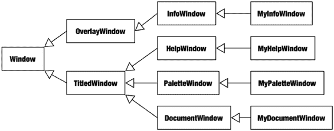
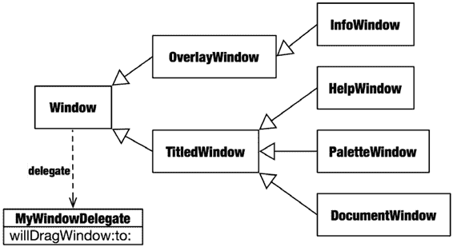

# 委托模式

委托模式将特定决策或操作外部化（即委托）给另一个对象，称为委托对象。它体现了一种被称为责任反转的设计原则。委托对象可以使用不包含在对象类层次结构中的代码来定制或影响对象的正常行为。委托对象可以被查询以做出决策、过滤数据、定义条件行为，或在关键时刻注入额外处理。委托对象始终是可选的。当没有委托对象或方法时，类会实现一个默认策略。

定制的传统方式是创建子类并重写特定方法。要重新定义对象如何被复制，你可以重写 `-copyWithZone:` 方法。要重新定义它与其他对象比较的方式，你可以重写 `-isEqual:` 方法，以此类推。然而，当试图定制现有类树的行为时，继承模式就不那么有效了。以图 17-1 中的示例为例。

**图 17-1.** 窗口类模型



图 17-1 展示了一组窗口类。最底层是抽象的 `Window` 类，它定义了通用属性（如位置、尺寸和顺序）以及通用行为（如拖拽、调整大小、最小化和重新排序）。`TitledWindow` 类定义了额外属性，如窗口标题，以及行为，如将窗口标题插入应用程序的“窗口”菜单。`Window` 类下有非标题子类，以及标题窗口类的专用子类。简而言之，这是一个简洁且逻辑清晰的类层次结构。

现在，应用程序开发者（也就是你）希望通过实现窗口在用户拖拽时“吸附”到最佳位置来增强用户体验。使用继承，你唯一的定制策略是创建 `DocumentWindow` 的子类并重写其 `-dragWindow` 方法。但这只重新定义了 `DocumentWindow` 的行为。要为面板、帮助和信息窗口实现相同的定制，必须定义额外的子类，每个子类都重复相同的定制。修改后的类树如图 17-2 所示。

**图 17-2.** 使用继承进行定制

这不仅工作量大且代码重复，而且这位可怜的开发者（也就是你）现在发现应用程序无法在有多台显示器的系统上工作。显然，`Window` 的 `-dragWindow` 方法处理了一些在显示器之间拖拽时的特殊情形，而这些情形只有原始设计者知道。由于不清楚那个解决方案是什么，因此在子类中有效复制 `-dragWindow` 的行为是不可能的。这个特性是一场灾难，必须放弃，否则你将面临额外的开发和未来不兼容的风险。

如果 `Window` 类的原始开发者预见到了这种情况，他们本可以通过采用委托模式轻松避免此问题。解决方案是在 `Window` 基类中定义一个委托对象，如图 17-3 所示。

**图 17-3.** 使用委托进行定制



在其 `-dragWindow` 方法中，当用户拖拽窗口时，`Window` 类会反复向委托对象发送 `-willDragWindow:to:` 消息。该消息包含窗口对象和用户最新的拖拽位置。委托对象预期会返回相同或修改后的位置，而 `Window` 类在实际定位窗口时会使用该位置。

这是一个简单但强大的接口。委托对象可以自由实现其想要的任何拖拽位置方案。它可以将窗口位置“吸附”到附近的边缘，阻止窗口被拖拽到某些区域，或者利用该信息移开其他窗口。

更重要的是：

- 所有子类（`InfoWindow`、`HelpWindow`、`PaletteWindow` 和 `DocumentWindow`）都可以使用单个委托对象进行定制。
- 可以创建不同的委托对象来定义不同的定制行为。
- 定制可以应用于每个窗口实例，而不是每个类。
- 新特性将与 `Window` 类及其所有子类的未来版本兼容。
- 创建 `DocumentWindow` 对象的现有类和接口无需修改。
- 任何没有委托对象的 `Window` 对象将使用标准的窗口拖拽行为。

### 使用委托

使用委托对象非常简单，这也是其如此有用的特性之一。

1. 在你的类中实现相应的委托方法。
2. 将你想要定制的对象的委托属性设置为你的委托对象，通常通过发送 `-setDelegate:` 消息来实现。

就是这样。一旦设置好，对象就会向你的委托对象发送该类已定义的委托消息。

委托预期要实现的方法通常是非正式定义的。然而，它们的使用非常普遍，以至于 Objective-C 类的文档会明确将其标识为“委托方法”，或将它们分组到“委托方法”部分。请记住，这些文档记录的是委托属性对象应该或可以响应的方法，而不是类本身实现的方法。当希望定制任何对象的行为时，首先应在文档中查找其委托方法。

> **注意：** 文档委托方法部分列出的某些方法实际上是发送给观察者的通知，而不是发送给委托对象的消息。文档应明确区分这一点，但最大的线索在于，通知方法始终接收一个 `NSNotification` 对象作为其唯一参数。更多关于通知的内容，请参见第 18 章。

委托模式在 Cocoa 框架中被广泛使用。以至于刚开始时会让 Java 和 C++ 开发者措手不及。例如，对单个 `NSApplication` 对象的大部分定制并非通过创建 `NSApplication` 的子类来实现，而是在初始化期间将一个委托对象附加到 `NSApplication` 上。以下是 `NSApplication` 委托给其委托对象的一些任务示例：

- 打开一个或多个文档文件。
- 打开临时文档文件。
- 自动重新打开文档。
- 打开无标题的文档窗口。
- 打印文档。
- 向用户呈现错误消息。
- 确定当最后一个窗口关闭时应用程序是否应退出。
- 确定应用程序是否准备好退出。

在其他面向对象编程语言中，此类定制通常通过创建 `Application` 类的子类并重写其方法来实现。由于委托能够增强 `NSApplication` 对象行为的能力，实际中创建 `NSApplication` 的子类非常罕见。

清单 17-1 展示了一个为 `NSControl` 视图对象执行验证的简单委托对象。每当需要验证其输入值时，`NSControl` 对象会向其委托发送一条 `-control:isValidObject:` 消息。

**清单 17-1.** 输入值验证委托

```objectivec
@interface PositiveIntValidationDelegate : NSObject

- (BOOL)control:(NSControl*)control isValidObject:(id)object;

@end

@implementation PositiveIntValidationDelegate

- (BOOL)control:(NSControl*)control isValidObject:(id)object
{
    return ([object intValue] > 0);
}

@end

…

NSTextField *inputTextField = …
[inputTextField setDelegate:[PositiveIntValidationDelegate new]];
```

一旦为输入视图设置了委托对象，`NSTextField`（`NSControl` 的子类）将只接受被解释为正整数的文本值。


通常，类的设计会使委托成为可选项。如果没有委托对象，或者委托未实现可选的委托方法，对象将采用一些默认行为。在少数情况下，委托对对象的运行至关重要。例如，`NSURLConnection` 对象会将所有连接事件发送给其委托。如果没有委托对象来接收这些消息，该对象将无法完成太多工作。

### 委托方法

一些委托方法是必须实现的，而另一些则是可选的。委托必须实现任何必须实现的委托方法。使用委托的对象会无条件地向委托对象发送必须实现的委托消息。如果委托未能实现这些方法，运行时将抛出无法识别的选择子异常。

可选的委托方法更为常见，并使得委托模式异常灵活。发送委托消息的对象会首先测试委托对象是否响应该消息。如果响应该消息，则向委托发送该消息。如果不响应，对象将回退到其基准行为。委托对象可以自由地仅实现其所需的那些可选委托方法。

可选委托方法特别灵活，因为委托对象只需实现它想要或需要影响的方法。如果一个类定义了 4 个委托方法，委托对象就有 15 种不同的自定义组合可供选择。可选委托方法还避免了常见的 Java 实践，即创建所谓的“简单”类，这些类为一组接口方法实现默认行为，期望你继承该“简单”类并仅覆盖你想要修改的方法。这既简化了类层次结构，又将默认委托行为定位在对象的类中，而非“简单”类中。

委托对象通常是“真实”的对象，而不是专门设计为委托的类。例如，一个文档对象也可能实现 `NSToolbar` 的委托方法。工具栏委托定义了哪些工具栏控件显示合适，这些信息源自文档对象的特定信息。文档对象无需复杂的对象间依赖，就能透明地影响工具栏用户界面。

一个委托对象也可以实现多组委托方法，并将其自身设置为各种对象的委托。这在应用程序委托对象的情况下很常见。一个应用程序委托会将自己设置为单个 `NSApplication` 对象的委托对象，但也可能将自己设置为其他对象（如窗口、文件管理器等）的委托。然后，这个单一的应用程序委托对象就可以利用集中在一个对象中的信息来影响广泛的行为。如果应用程序委托类变得难以管理，可以将其各个角色细分为类别以提高模块化程度。有关类别的更多信息，请参见第 5 章。

### 委托协议

委托实现的方法在 Cocoa 框架中通常被定义为非正式协议。（如果您需要复习非正式协议和正式协议，请参见第 5 章。）委托对象属性的类型是`id`，允许将其设置为任何对象。委托对象预期实现的方法在文档中有定义。

您可以在设计中自由地采用相同方式，或者采取更正式的方法，如代码清单 17-2 所示。在 Java 中无法做到这一点，因为 Java 没有可选接口方法的概念。如果您好奇，第 10 章演示了在 Java 中通过测试方法是否存在来实现非正式协议的代码。

**代码清单 17-2. 带正式委托的自动防御炮**

```
@interface Gun : NSObject

…

@end

@protocol Targeting

@required

- (BOOL)gun:(Gun*)gun shouldShootAt:(id)target;

@optional
```


```objc
- (NSArray*)gun:(Gun*)gun prioritizeTargets:(NSArray*)targets;

- (BOOL)gunShouldStopFiring:(Gun*)gun;

@end
```

```objc
@interface AutomaticPerimeterDefenseGun : Gun {
    id<Targeting> delegate;
}
```

- [`www.it-ebooks.info`](http://www.it-ebooks.info/)

## 第 17 章 — 委托模式

```objc
@property (assign) id<Targeting> delegate;

- (void)engage;
- (void)disengage;
- (float)ammunitionRemaining;
- (void)reload;

@end
```

…

```objc
@interface AutomaticPerimeterDefenseGun () // 私有方法

- (void)defendPerimeter;
- (NSArray*)acquireTargets;
- (NSArray*)targetsFromSensor;
- (void)fireAtTarget:(id)target;

@end

@implementation AutomaticPerimeterDefenseGun

@synthesize delegate;

- (void)defendPerimeter
{
    // 向委托检查枪械是否应该停止开火
    if ([(id)delegate respondsToSelector:@selector(gunShouldStopFiring:)]) {
        if ([delegate gunShouldStopFiring:self]) {
            [self disengage];
            return;
        }
    }

    // 收集潜在目标
    NSArray *targets = [self aquireTargets];

    // 只向委托识别为敌人的目标开火
    for ( id target in targets ) {
        if ([delegate gun:self shouldShootAt:target]) {
            [self fireAtTarget:target];
        }
    }
}
```

- [`www.it-ebooks.info`](http://www.it-ebooks.info/)

## 第 17 章 — 委托模式

```objc
- (NSArray*)acquireTargets
{
    NSArray *targets = [self targetsFromSensor];

    // 将目标列表传递给委托，由它进行优先级排序、过滤等操作
    if ([(id)delegate respondsToSelector:@selector(gun:prioritizeTargets:)])
        targets = [delegate gun:self prioritizeTargets:targets];

    return targets;
}

- (NSArray*)targetsFromSensor
{
    …
}

- (void)fireAtTarget:(id)target
{
    …
}

…

@end
```

这段代码为我们虚构的冒险游戏实现了一个自动周界防御枪械。一旦启动，它会自主获取目标并开火射击。它将多个目标识别和枪械控制决策委托给一个委托对象。其中最为重要的决策是识别应该射击哪些目标。

`delegate` 属性被正式声明为遵循 `Targeting` 协议的对象。

通过使用 Objective-C 2.0 的 `@required` 和 `@optional` 指令，委托的需求被明确告知编译器。委托必须实现 `-gun:shouldShootAt:` 方法，并且可以选择性地实现 `-gun:prioritizeTargets:` 或 `-gunShouldStopFiring:` 方法。

如果你不为你创建的类生成文档，那么这是向编译器和其他程序员传达委托需求的一种有效方式。

> **提示：** 在向委托发送 `-respondsToSelector:` 消息时，需要将其转换为 `(id)` 类型。原因是 `id<Targeting>` 类型定义的对象指针被认为仅会响应 `Targeting` 协议中定义的方法。这并不包括 `NSObject` 中定义的任何方法，因此编译器会警告该委托可能不响应 `-respondsToSelector:`。另一种替代方案是将委托对象的指针声明为 `id<Targeting,NSObject>`。这里的 `NSObject` 协议（并非类）是一个便利协议，它声明了由 `NSObject` 及其子类定义的核心方法集。

- [`www.it-ebooks.info`](http://www.it-ebooks.info/)

## 第 17 章 — 委托模式

这种方法的唯一缺点出现在你之后继承 `AutomaticPerimeterDefenseGun` 并希望定义额外的委托方法时。`delegate` 属性已被定义为 `id<Targeting>`，而子类无法更改继承属性的类型。子类可选的方案不多，只能记录它们使用的额外委托方法，并将其作为非正式协议。

### 结合委托模式

委托模式简化了许多棘手的继承和领域设计问题。在应用程序中融入委托模式时，请考虑以下原则：

- 当对象的行为应允许定制，且实现该定制所需的知识或性质超出了该类的领域时，应使用委托模式。在 `AutomaticPerimeterDefenseGun` 示例中，该类封装了一种射击目标的武器，但判断哪些目标是友军则超出了它的领域。

- 当在基类中实现多个子类时，委托模式特别有效。每个子类都可以一致地使用委托，而不会增加子类的数量或组织的复杂性。

- 当委托对象不存在时（`delegate == nil`），对象应具有明确定义的行为。在 `-defendPerimeter` 方法中，无条件地向委托发送 `-gun:shouldShootAt:` 消息。如果委托为 `nil`，则消息返回 `nil`，枪械将不射击任何目标——这恰是在没有目标识别信息时的理想特征。请参见第 7 章中的“缺失行为”和“与空值保持一致”的设计模式。

- 类似地，当可选的委托方法缺失时，对象应提供一些自然的基准功能。清单 17-2 中的 `-acquireTargets` 方法会测试委托是否响应 `-gun:prioritizeTargets:`。如果响应，则将已知的目标列表传递给委托，由它进行优先级排序、过滤或提供自己的目标列表。如果委托未实现该方法，枪械则使用从其传感器获取的目标。请注意，这也符合前述原则，因为如果委托为 `nil`，`-respondsToSelector:` 将返回 `NO`。

- 对象应始终在委托消息中提供上下文。清单 17-2 中的委托方法均包含了正在发送消息给接收者的 `Gun` 对象。这允许委托将发送者纳入其决策过程，例如在弹药过低时通知枪械停止开火。请记住，单个委托对象可能被设置为两个甚至一百个不同对象的委托。有些委托充当可重用的特征，例如清单 17-1 中的验证例程，它可以被任意一组相似对象共享。

### 总结

委托模式在 Objective-C 中无处不在。它简化了类的结构，并为你提供了广泛的定制空间。Objective-C 程序员和 Cocoa 框架都热情地拥抱这一模式，建议你也这样做。委托模式同样适用于 Java 开发，但 Java 接口的形式化特性以及缺乏简单的“方法是否已实现”的测试，使得它的使用更加繁琐。

- [`www.it-ebooks.info`](http://www.it-ebooks.info/)

