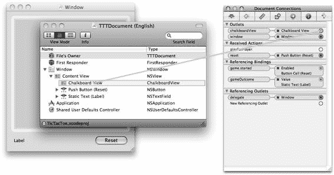
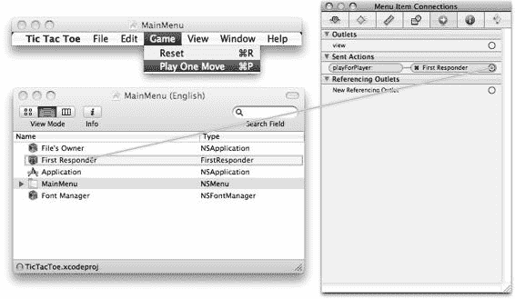
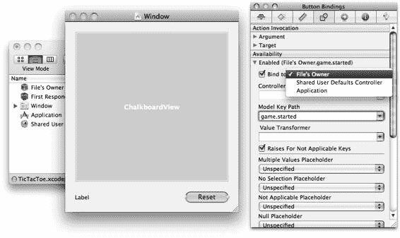
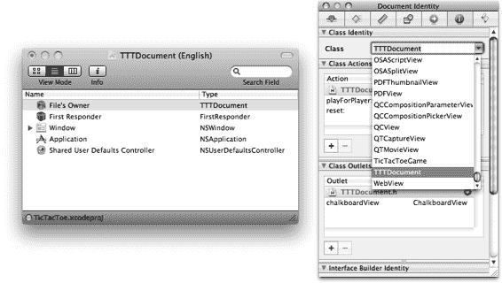

# 模型-视图-控制器模式变体

基本 MVC 模型具有很大的自由度。各个角色的职责可以相互融合，或使用替代的通信路径。

接下来的几节将介绍几种重要的变体。

#### 控制器与数据模型合并

控制器和数据模型可以是同一个对象，如图 20-2 所示。当数据模型非常简单时，这种情况经常出现。从技术上讲，单个整数就是一个数据模型，但仅仅为了封装一个数字而去创建一个数据模型类，会浪费你的编程才能。相反，该值存储在控制器中，并附加到视图对象上进行显示。

**图 20-2.** *合并的控制器与数据模型*

这限制了设计的模块化程度，正如本章后面所述。但只要数据模型和控制器没有不恰当地纠缠在一起，将来将应用程序重构为独立的控制器和数据模型类就应该是容易的，并且不会破坏你的设计。关键是要保持数据模型的概念独立于你的控制器，即使它们存在于同一个对象中。

#### 中介控制器

模型-视图-控制器设计模式的一种流行变体是中介 MVC 模式，如图 20-3 所示。这种模式在 Cocoa 框架中反复出现；它也是`NSController`类所采用的模式，本章末尾将会描述。

**图 20-3.** *中介模型-视图-控制器设计模式*

在中介 MVC 设计中，控制器也充当视图的数据模型。它是一个数据模型代理。中介控制器将数据模型消息传递给实际的数据模型，并将来自数据模型的任何更改通知转发给它的观察者。

这种设计特别适合数据库应用程序。数据模型对象封装了原始数据。它负责从持久化存储中获取数据、缓存数据以及对其进行任何修改。控制器对象在履行其正常角色的同时，还将数据（以将在应用程序中呈现的形式）呈现给视图对象。这可能涉及过滤、排序和转换数据。数据如何排序、用户在表格中的当前选择等等，都是特定于应用程序的，而非数据本身。从视图对象的角度来看，控制器就是数据模型。视图显示由控制器提供给它经过排序、过滤和转换的数据，并且对底层数据模型没有直接了解。

#### 视图与数据模型的直接绑定

通常，显示值的更改本身并不与特定的“操作”相关联。如果视图对象显示的是一个简单的值（数字、字符串或布尔值），它可以直接将更改传达给数据模型对象，如图 20-4 所示。

**图 20-4.** *数据模型与视图的直接绑定*

数据模型属性与视图之间的关系被描述为一种绑定。视图对象显示该值，并在值发生更改时（通过观察机制）更新其显示。如果用户编辑了显示的值，视图对象会通过直接设置新值的方式将其传达给数据模型。绑定将在本章后面更详细地描述。

#### 其他变体

基本的 MVC 设计模式的其他一些常见变体如下：

-   **视图对象绑定到控制器属性：** 通常视图对象会绑定到控制器对象的属性值。例如，控制器可能会定义数据对象来保存临时事务或搜索结果。这对数据模型来说不是一个合适的属性；它对控制器来说是合适的，但从视图的角度来看，它就是一个数据模型。

-   **视图与数据模型对象合并：** 一个复选框按钮会维护其当前值（选中或未选中），实际上它本身就是自己的数据模型。控制器可以选择不存储复选框的状态，而是选择查询视图对象的状态来获知其值。这不是一种推荐的模式，但使用得非常普遍。

### MVC 的优势

那么，MVC 到底有什么值得大惊小怪的呢？乍一看，MVC 似乎给程序员增加了大量额外的工作，将一个可能很简单的对象拆分成多个对象，并伴随着复杂的通信。例如，要使用 MVC 创建一个自定义按钮，你需要创建一个新的单元格子类（请参阅“缩放”部分），重写其绘制方法，创建一个控制器类，实现一个操作方法，创建这两个类的实例，并将它们附加到一个`NSButton`视图对象上。如果你认为仅需继承`NSButton`并重写其绘制和“鼠标点击”方法会更简单，那么你需要阅读这一节。

在极少数情况下，你说得对——仅仅继承`NSButton`会更简单。但大多数应用程序并没有那么简单，或者无法保持简单。MVC 在许多方面就像面向对象编程本身一样。它是一种纪律，偶尔会产生更多的工作，但更多时候，它允许设计出大型、优雅、灵活且复杂的应用程序，这些应用程序既易于理解又行为良好。

以下部分重点介绍了采用模型-视图-控制器设计模式的一些显著优势。

#### 模块化

模型-视图-控制器设计模式是关注点分离和封装这两项计算机科学原则的延伸。它鼓励你识别应用程序扮演的角色，并将这些角色分装到不同的对象中。

这些原则能够改进你的 MVC 设计，其原因与它们通常能改进面向对象编程的原因相同。它们将相互关联的功能本地化到具有可识别边界的容器中。对类的更改往往是被局限的。当更改影响到其他类时，由于被更改类的接口定义良好，分析它们将如何受影响会更容易。

这些类以后可以被继承、替换或重用，而对你设计的其余部分几乎没有影响。

#### 灵活性

模型-视图-控制器设计模式的最大优势之一就是其灵活性。通过将数据模型和控制器的关注点与显示视图分离，这两者可以随意混合和匹配。

MVC 最强大的功能可能在于能够轻松地替换视图对象，或使用多个视图对象，而无需更改数据模型或控制器。你可能每天都在使用许多利用此功能的应用程序。这里有两个例子。

苹果的 iTunes 应用程序使用几个不同的视图对象来显示你的音乐和视频库的内容。有表格列表视图、浏览器视图、缩略图视图和 Cover Flow 视图。所有这四个视图都呈现来自同一数据模型的相同信息，只是方式不同。通过将数据模型与视图分离，可以开发新的视图，而无需对数据模型或其他视图进行任何更改。甚至许多控制器逻辑，例如当前歌曲选择、拖放、播放歌曲操作和获取信息，都可以只实现一次，并在四个视图中的任何一个中互换使用。


Xcode 应用程序是一个很好的基于文档的 MVC 多视图应用示例。一个数据模型对象代表一个文档（源文件）的内容。出现在 Xcode 环境中的源代码编辑窗格就是视图对象。你可以在多个窗口或窗格中打开同一个源文档，它们都会显示相同的内容。更神奇的是，编辑一个窗格会立即更新所有其他窗格。这种机制之所以有效，是因为数据模型和所有视图都遵循相同的 MVC 通信规则。当某个视图对象被编辑时，它会将这些编辑请求发送给其控制器，控制器再更新数据模型，数据模型再将更改广播给所有观察者。无需编写任何特殊代码，单个数据模型的多个视图就能保持完美的同步。

[www.it-ebooks.info](http://www.it-ebooks.info/)

## 第 20 章 ■ 模型-视图-控制器模式

使用设计良好的 MVC 对象进行编程，就像在玩一套巨大的乐高积木。任何对象（数据模型、控制器或视图）都可以与任何功能等价的对象互换。替换对象或附加多个对象，都不会干扰设计的其他部分。MVC 的口头禅是：通过连接简单的对象来创建复杂的应用程序。

#### 复用

复用与灵活性密切相关。通过抽象类的功能，你可以在其他应用程序中或为了其他目的复用你的对象。最常被复用的对象是数据模型和视图对象。Cocoa 核心视图对象（按钮、文本字段、图像查看器）每天都被用于成千上万种不同目的，只需将它们连接到不同的数据模型和控制器对象即可。

#### 扩展

模型-视图-控制器设计模式会出现在不同规模的场景中。如果你仔细观察一个像 `NSButton` 这样的 Cocoa 视图对象，你会发现在其内部实际上有一个微型的 MVC 设计在工作。你通常视为单个视图对象（一个按钮）的东西，实际上是两个或三个对象：

-   `NSButton` 对象是一个 `NSControl`，在 MVC 设计中扮演控制器的角色。`NSButton` 决定了按钮的行为。
-   视图的角色由一个 `NSButtonCell` 对象（`NSCell` 的子类）来处理。该对象负责绘制按钮图像，并处理鼠标和键盘事件。
-   `NSButton` 对象可以维护自己的状态（充当数据模型），也可以绑定到一个独立的数据模型对象。

要自定义按钮的外观，你不是去创建 `NSButton` 的子类。相反，你应该创建你自己的 `NSCell` 子类来实现你想要的外观，然后将其附加到一个普通的 `NSButton` 实例上。

正如 iTunes 可以使用不同的视图来改变你音乐库的外观而无需改变其任何功能一样，你可以改变按钮的外观而不影响其行为。灵活性和复用意味着你自定义的 `NSCell` 将与未来版本的 `NSButton` 兼容，并且可能也与其他的 `NSControl` 子类一起使用。

现在，我希望你已经开始认识到使用模型-视图-控制器设计模式的优势了。是时候让我从高谈阔论中下来，详细讲讲 MVC 是如何在应用程序设计中被使用的。

#### 绑定

到目前为止，我已经以通用的方式讨论了 MVC 通信，但 Cocoa 框架定义了一种非常具体的 MVC 通信形式，称为绑定。绑定定义了不同对象中两个属性之间的关系。绑定形成一种连接，将一个观察者对象的一个属性绑定到另一个对象的一个属性。绑定使这两个属性保持同步。Cocoa 为此提供了一个框架和一个非正式的绑定通信协议。这两个对象可以是任意对象，但观察者通常是一个视图对象，而被观察的属性则位于数据模型或控制器对象中。

[www.it-ebooks.info](http://www.it-ebooks.info/)

## 第 20 章 ■ 模型-视图-控制器模式

**注意：** 在撰写本文时，iPhone OS 不支持 Cocoa 绑定技术。如果你的目标是 iPhone OS，你将不得不使用 Objective-C 消息、动作、插座变量、键值观察、通知或其他技术来实现你的 MVC 通信。动作和插座变量在“Interface Builder”部分有描述。

在实践中，视图对象显示属性的值。在视图中编辑值会通过绑定发送消息给数据模型，以改变其值。对数据模型值的任何更改都会通知视图。绑定具有以下属性：

-   属性使用键值路径进行标识。两个对象都必须实现符合键值编码的属性。
-   观察者对象使用键值观察来监听属性值的变化。被绑定的属性必须是 KVO 兼容的。
-   `NSController` 对象被设计用来与绑定一起工作。具体来说，`NSController` 对象可以绑定复合值，例如集合和数组。`NSController` 还定义了选择（selection）的概念，因此你可以将一个属性绑定到复合属性的选定值。
-   绑定可以指定编辑后的值何时提交，以及被绑定属性的更改何时更新。
-   绑定可以提供一个默认值，用于当被绑定属性为 `nil` 时。
-   绑定可以通过一个值转换器进行过滤，该转换器将绑定值转换为适合观察者使用的形式，反之亦然。例如，一个转换器可能自动在货币之间转换，或者将摄氏度转换为华氏度。

绑定可以通过编程方式创建，但这很少见。更不常见的是创建主动参与绑定的自定义类；你可能想要绑定的大多数类（Cocoa 框架提供的 `NSView` 对象）以及具有复杂可绑定属性的对象（`NSController` 的子类）都已经为你实现了。大多数时候，你是在 Interface Builder 中，将库中的视图对象属性绑定到任何对象的 KVO 兼容属性，或者绑定到 `NSController` 的子类——这些都不涉及任何严肃的编程。你可能想要创建自己的 `NSController` 或 `NSObjectController` 子类，但基类本身已经是 Cocoa 绑定兼容的类，所以你还是无需深入绑定的内部机制。如果你发现需要探索这些选项，请参考 Cocoa Bindings Programming Topics 指南¹。

绝大多数情况下，你将视图绑定到你自己的对象的属性，唯一的前提条件是这些属性符合键值观察——大多数属性都符合，或者通过少量工作就能轻松使其符合 KVO。如果需要确认，请参考第 19 章。

到目前为止，我主要关注的是查看属性的值，但绑定对于许多其他类型的属性也非常有用。像复选框控件这样的视图对象有很多属性：按钮的标题、标题的字体、复选框的状态、是否启用、是否可见等等。这些属性中的任何一个都可以绑定到另一个对象的属性。以 TicTacToe 项目为例。界面有一个重置按钮，用于清空棋盘并开始新游戏。这个按钮的启用属性被绑定到游戏对象的 `isStarted` 属性。在游戏开始前，当 `isStarted` 为 `NO` 时，按钮是禁用的。一旦游戏开始，按钮就变为启用状态。

游戏对象中没有用于启用或禁用按钮的代码，按钮也对井字游戏一无所知。视图的启用属性仅仅是被绑定到了另一个对象的一个可被观察的 `BOOL` 属性上；不需要额外的编程。

[www.it-ebooks.info](http://www.it-ebooks.info/)

¹ Apple Inc., Cocoa Bindings Programming Topics, http://developer.apple.com/documentation/Cocoa/Conceptual/CocoaBindings/, 2009.


如果你需要以编程方式创建绑定——比如为你以编程方式创建的视图对象——请向符合绑定规范的观察者发送一条`-bind:toObject:withKeyPath:options:`消息。

如果你正在创建自定义视图对象来显示自定义数据，那么在视图和数据模型对象之间建立非正式绑定会更便捷。这本质上就是“构建你自己的 MVC 通信机制”。你的自定义视图应使用 Objective-C 消息、通知和观察机制来实现基本的 MVC 通信。视图应直接了解控制器和数据模型，而不是试图创建一个通过绑定通信的抽象、可复用的视图类。在 TicTacToe 项目中，`ChalkboardView`对象就是一个很好的例子。它显示一个井字棋游戏，并在用户点击棋盘时向控制器发送“移动”操作。该对象知道自己连接到了一个`TTTDocument`控制器，并显式观察其`game`属性的变化。该对象符合 MVC 设计模式，但并没有超出其用途进行抽象化。

### Interface Builder

在我深入讨论视图对象、事件和控制器之前，先花点时间解释一下 Cocoa 应用开发中的一些“魔法”。如果你不习惯使用 Cocoa 进行开发——我假设你并不熟悉，否则你也不会读这本书——当你打开 TicTacToe 项目时，很可能会挠头不解。Objective-C 源代码显然实现了各对象的功能，但你可以逐行查看代码，却找不到以下任何内容：

- 创建文档窗口或该窗口中任何视图对象的代码
- 将文档对象连接到其任何视图对象的代码
- 将视图对象绑定到控制器或数据模型属性的代码
- 将视图对象（如按钮和菜单项）与实现这些操作的控制器对象连接的代码

所有这些任务都是通过 Interface Builder 完成的，这是一个重要的开发工具，它让 Cocoa 应用开发变得轻松且同时充满神秘感。

简而言之，Interface Builder 用于编辑 NIB 文件。你在第 4 章中已经了解过，NIB 文件包含了要在运行时实例化的对象的归档（序列化）表示。归档的对象包括属性和对象间的引用。NIB 文件是应用包的一部分。当 NIB 文件在运行时被“加载”时，对象会被解档；这会将对象图实例化，设置它们的属性，并连接任何对象间的引用。

如果你读过第 12 章关于归档的内容，那么 NIB 文件完成的工作并不神秘。如果你来自其他开发环境，请记住 Interface Builder 不是代码生成器。它所做的只是编辑那些将在运行时通过标准归档解码实例化的对象的虚拟表示。这没有任何“魔法”成分，也不会生成任何代码。最终结果与解档一组先前以编程方式创建的对象图完全相同。

理解了这个基本概念，Interface Builder 在开发中的作用以及 NIB 文档中的对象如何创建和初始化就不再是谜团了。说“当用户点击视图对象时，它会向控制器发送一个操作消息”是一回事，而实际实现它又是另一回事。在 Cocoa 开发中，这些对象之间的连接以及发送的消息（通常）是在 Interface Builder 中定义的。熟悉 Interface Builder 是成为一名高效 Cocoa 开发者的重要一步。

#### NIB 文档

如前所述，Interface Builder（IB）主要是一个 NIB 文档编辑器。在其现代形式中，Interface Builder 编辑的是 Interface Builder 文档，这相当于源代码文件。当应用构建时，源文件会被编译成最终的二进制形式。在过去，Interface Builder 会直接编辑实际的二进制归档文件，没有单独的编译阶段；NIB 文件只是简单地被复制到应用包中。

NIB 文档有名称，你的应用可以根据需要拥有任意数量的 NIB 文档。Cocoa 应用会指定一个作为主 NIB 文档，通常是`MainMenu.nib`。主 NIB 文档在程序初始化时加载，应包含应用的所有标准视图元素。这必然包括菜单对象，但也可能包括共享窗口或其他对象。

标准的 Cocoa 文档控制器会为你的应用支持的每种文档类型指定一个 NIB 文档。当你在应用中打开一个文档时，会创建一个`NSDocument`实例，然后加载它的 NIB 文件；这会为文档创建`NSWindow`，并用所需的额外视图对象（按钮、字段、表格、标签页、工具栏、抽屉、辅助窗口、对话框窗口和自定义对象）填充它。

此外，你可以创建额外的 NIB 文档，并以编程方式为你能想到的任何用途加载它们。例如，你可能有一个使用许多不同子视图的非常复杂的文档窗口。你可以在文档的 NIB 文档中定义该窗口和容器视图，然后在辅助 NIB 文档中定义每个子视图的视图对象，按需以编程方式加载它们。加载 NIB 文档时唯一需要建立的是所有者对象，稍后在“所有者对象”部分会对此进行描述。

### NIB 文档窗口

当你在 Interface Builder 中打开一个 NIB 文档时，你会看到 NIB 中对象的图形或符号表示。你可以使用各种检查器面板编辑这些对象的属性。你可以通过从库面板拖动图标到文档中来创建新对象。你还可以重新组织和删除它们。

视图对象（窗口、控件、字段、菜单）也可以有视觉表示，就像它们在你的应用中实例化时一样。一个典型的 NIB 文档窗口如图 20-5 所示，其后是窗口和视图对象的图形表示。在大多数情况下，对象的符号表示和视觉表示是等同的。

### 对象属性

既然你明白了 NIB 文档只是包含对象图的归档版本，那么 Interface Builder 的属性就容易理解了。在 Interface Builder 中，你可以使用各种检查器面板编辑这些对象的属性。图 20-5 显示了基本属性的检查器：大小、位置、调整大小行为、动画效果、连接、绑定等。

**图 20-5.** Interface Builder 属性

你可以通过选择 NIB 文档主窗口中的符号表示或视觉表示来编辑对象的属性。在图 20-5 中，可以通过选择`Push Button (Reset)`对象或其后窗口中的 Reset 按钮来编辑 Reset 按钮的属性。

显式属性（如对象的标题、大小和位置）可以通过点击、拖动和调整视图对象的视觉表示来直接操作。

你设置的属性会存储在对象的归档流中，并在 NIB 文档解档时隐式恢复。

### 占位对象


在您的`NIB`文档中，会出现一些特殊对象。它们是占位符，代表当`NIB`加载时已存在的对象，仅用于允许您与这些对象建立连接。您在`NIB`中可能包含的代理对象包括：

- `文件所有者`
- `第一响应者`
- `应用`
- `字体管理器`
- `用户默认控制器`

例如，您可以创建`NIB`中某个对象与全局唯一的`NSApplication`对象之间的连接，即使`NSApplication`对象并非`NIB`的一部分。

[www.it-ebooks.info](http://www.it-ebooks.info/)



## 第 20 章 ■ 模型-视图-控制器模式

#### 连接

在 Interface Builder 的术语中，`NIB`文档中两个对象之间的关系称为连接。连接共有三种类型：出口、动作和绑定。

#### 出口

出口本质上就是对象引用。通过出口，您可以在 Interface Builder 中使用图形化设计工具设置对象引用。任何对象指针属性都可以成为出口。如果在实例变量声明中包含关键字`IBOutlet`，如代码清单 20-1 所示，Interface Builder 将自动将其识别为出口，并允许您在`NIB`中设置该变量。您也可以在 Interface Builder 的身份检查器面板中编辑类的定义来手动声明出口，但`IBOutlet`方法更受推荐，其优势在于可以在源文件中记录出口信息。

**代码清单 20-1.** Interface Builder 出口声明

```
@interface TTTDocument : NSDocument {

TicTacToeGame *game;

NSString *gameOutcome;

IBOutlet ChalkboardView *chalkboardView;

}
```

在`TicTacToe`项目中，`TTTDocument`对象需要引用显示`井字棋`游戏的`ChalkboardView`对象。在 Interface Builder 中建立连接需要两个步骤：首先，在`TTTDocument`的`@interface`中将出口变量声明为`IBOutlet`，如代码清单 20-1 所示。

然后打开`TTTDocument`的`NIB`文档，选择`TTTDocument`对象，在连接检查器中将出口的连接点拖拽到`ChalkboardView`对象上，如图 20-6 所示。

***图 20-6.** 在 Interface Builder 中连接出口* 363

[www.it-ebooks.info](http://www.it-ebooks.info/)

## 第 20 章 ■ 模型-视图-控制器模式

当`NIB`被加载时，`TTTDocument`的`chalkboardView`属性将被设置为指向新创建的`ChalkboardView`实例的指针。这在功能上等同于编写以下代码：

```
document.chalkboardView = [ChalkboardView new];
```

在 Interface Builder 中建立连接是一项非常常见的任务，因此提供了多种快捷方式：

- 对对象执行**右键/Control-单击**，弹出出口检查面板。您可以像使用检查器面板一样设置或断开任何连接。
- 从包含出口的对象**右键/Control-拖拽**到您想要连接的目标对象。将弹出一个出口补全面板，点击您想要设置的出口。
- 在对象之间拖拽时，您可以从`NIB`文档窗口中的符号对象开始或结束拖拽，也可以从任何其他窗口中的可视化表示开始或结束拖拽。

#### 动作

第二种连接是动作。动作是在某些事件发生时发送给某个对象的 Objective-C 消息。动作由一对属性定义，它们构成了一种非正式协议：一个类型为`SEL`的动作属性，用于确定要发送的 Objective-C 消息；一个类型为`id`的目标属性，用于确定消息的接收者。当“某事件”发生时，动作消息被发送给接收者（通常是一个控制器对象）。“某事件”的具体定义由视图对象自行决定，但通常包括鼠标点击（按钮、复选框、菜单项）、编辑事件（按回车键或从输入文本字段中跳出）或键盘快捷键（菜单项）。

动作的接收者必须实现一个方法来接收消息。消息的形式必须如下所示：

```
- (IBAction)playForPlayer:(id)sender;
```


一个动作始终接收一个指向消息发送对象的指针作为其唯一参数。

`IBAction`关键字与`void`同义，但被`Interface Builder`用于自动识别动作方法。一旦`Interface Builder`识别出一个动作，你可以像设置输出口连接一样设置它。选择发送动作的对象，然后将其“发送的动作”连接拖拽到将要接收该动作的对象，如图 20-7 所示。将动作连接拖拽到接收者后，`Interface Builder`会弹出一个动作完成面板，你可以在其中选择要发送的消息来完成连接。

[www.it-ebooks.info](http://www.it-ebooks.info/)



**图 20-7.** 在`Interface Builder`中连接动作

在`Interface Builder`中建立动作连接会同时设置动作（消息标识符）和目标接收者（对象指针）。`First Responder`目标是一个特殊的占位对象，它设置动作消息和`nil`目标。实际目标将在运行时动态确定，如后续响应者链部分所述。

#### 绑定

使用“绑定”面板为对象设置绑定。在前面的绑定章节中，我描述了将“重置”按钮的`enabled`属性绑定到游戏对象的`started`属性。

图 20-8 展示了如何在`Interface Builder`中设置该绑定。

[www.it-ebooks.info](http://www.it-ebooks.info/)



**图 20-8.** 在`Interface Builder`中设置绑定

要设置绑定，选择要绑定的对象并打开“绑定”面板。在图 20-8 中，选择了“重置”按钮的可视化表示。展开要绑定的属性，然后选择要绑定到的对象和键路径（属性名）。在此示例中，按钮的`enabled`属性绑定到 NIB 拥有者的`game`属性的`started`属性。由于这是文档的 NIB 文件，NIB 拥有者是`TTTDocument`对象——拥有者对象将在下一节中解释。

绑定中有许多设置，其中很多将根据属性类型和绑定值的类型而变化。最受关注的设置如下：

*   **要绑定到的对象**：这是包含要绑定到的属性的对象。
*   **模型键路径**：要绑定到的属性的键值路径。这可以是相对于绑定对象的任何 KVC 路径。要绑定到对象本身，请使用路径`self`。
*   **控制器键**：如果绑定到`NSController`对象，模型键路径分为两部分。控制器键描述控制器的属性，模型键路径随后指定由控制器键描述的对象的属性。例如，使用控制器键`selection`和模型键路径`name`进行绑定，会将属性绑定到控制器集合中当前选中对象的`name`——相当于路径`selection.name`。以下是一些常见的`NSController`属性：

    *   `content` 绑定到控制器封装的整个内容。这可能是一个对象或整个集合。
    *   `arrangedContent` 绑定到由控制器排序和过滤后的内容。在表格或其他排序列表中显示内容时绑定到此属性。
    *   `selection` 是控制器当前选中的对象。
    *   `selectedObjects` 是控制器当前选中的对象集合。对允许同时选择多个对象的控制器使用此绑定。
    *   `isEditable`、`canAdd`和`canRemove`是控制器提供的众多信息属性中的一部分。例如，你可以将“添加记录”按钮的`enabled`属性绑定到控制器的`canAdd`属性。仅当控制器允许添加新对象时，该按钮才会被启用。

[www.it-ebooks.info](http://www.it-ebooks.info/)


Value Transformer: 选择你希望用于在两个对象间转换属性值的转换器对象。

Null Placeholder: 选择当绑定属性为`nil`时，绑定所使用的对象。

Owner Object

加载 NIB 文档与解档对象图有一个细微差别。当你解档对象图时，会得到全新的对象，这些对象通常连接到一个返回给发送方的根对象上。当你加载 NIB 文档时，你会传入一个已有的单一对象，该对象成为 NIB 的拥有者（owner）。拥有者本质上是 NIB 文档对象图的根，但它存在于 NIB 加载之前。

NIB 的拥有者对象在 NIB 文档中表示为文件拥有者（File’s Owner）占位符对象。NIB 中的所有对象都应直接或间接连接到文件拥有者，以便能够被访问。

在程序初始化期间加载主 NIB 文件时，拥有者是单一的`NSApplication`对象。当文档控制器加载 NIB 以创建文档窗口时，拥有者是负责该界面的`NSDocument`对象。当你通过编程方式加载 NIB 文件时，可以指定任何你想要的拥有者对象，只需确保它与 NIB 文档中定义的文件拥有者类一致。

在 TicTacToe 示例中（见代码清单 20-1 与图 20-6），NIB 包含一个`ChalkboardView`实例，该实例连接到拥有者的`chalkboardView`属性。由于这是一个文档 NIB，`TTTDocument`是 NIB 的拥有者。加载后，其`chalkboardView`属性被设置为新创建的`ChalkboardView`对象。

Custom Objects

TicTacToe 项目中的 NIB 文档实例化了两个我创建的类：`TTTDocument`和`ChalkboardView`。这是通过创建或选择 Interface Builder 已理解的通用对象，然后在标识检查器中更改其类来实现的，如图 20-9 所示。

[www.it-ebooks.info](http://www.it-ebooks.info/)



**图 20-9.** 更改 NIB 对象的类  

对于`TTTDocument`，我首先在 Xcode 中通过继承`NSDocument`创建了`TTTDocument`子类。在 Interface Builder 中，我在`TTTDocument` NIB 文档中选择了已有的文件拥有者实例，并将其类改为`TTTDocument`。Interface Builder 现在将文件拥有者对象视为`TTTDocument`的实例。Interface Builder 理解继承关系：`TTTDocument`继承了`NSDocument`的所有属性、输出口和行为。

为了创建`ChalkboardView`对象，我首先在 Xcode 中创建了`ChalkboardView`类（继承自`NSView`）。在 Interface Builder 中，我将一个自定义视图（Custom View）对象从库拖到窗口中，然后将其类从`NSView`改为`ChalkboardView`。该对象继承了基类`NSView`的所有属性。也就是说，Interface Builder 知道它是一个具有位置、大小、可见性、子视图等属性的视图对象。

你可以通过将通用对象（Object）从库拖到 NIB 中，然后将其类改为任意类，来创建任意的类实例。`Object`只继承了`NSObject`的基本属性——也就是说几乎没有任何属性。一旦添加，该对象可以连接到任何合适的输出口。

Interface Builder 不会自动提供对你自定义类属性的编辑功能，但会识别你定义的输出口和动作。如果你希望设计的自定义类出现在 Interface Builder 的库面板中，并使其属性可通过属性面板编辑，你可以创建一个 Interface Builder 插件。这是一个较为复杂的过程，但如果你感兴趣，可以参考《Interface Builder Plug-in Programming Guide》2。

2 Apple Inc., *Interface Builder Plug-in Programming Guide*, [`developer.apple.com/documentation/DeveloperTools/Conceptual/IBPlugInGuide/`](http://developer.apple.com/documentation/DeveloperTools/Conceptual/IBPlugInGuide/), 2007.

[www.it-ebooks.info](http://www.it-ebooks.info/)


