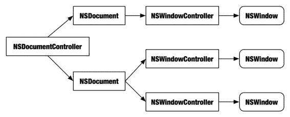

# 排版后内容

## 绘图方法

`int,ImageObserver)`
`drawAtPoint:fromRect:operation:fraction:]`
`clearRect(int,int,int,int)`
`NSEraseRect(…)`, `NSRectFill(…)`
`drawArc(int,int,int,int,int,int)`
`-[NSBezierPath stroke]`
`drawString(AttributedCharacterIterator,int,int)`
`-[NSString drawAtPoint:withAttributes:]`
`drawLine(int,int,int,int)`
`-[NSBezierPath stroke]`
`drawOval(int,int,int,int)`
`-[NSBezierPath stroke]`
`drawPolygon(Polygon)`
`-[NSBezierPath stroke]`
`drawPolyline(int[],int[],int)`
`-[NSBezierPath stroke]`
`drawRect(int,int,int,int)`
`NSFrameRect(…)`
`drawRoundRect(int,int,int,int,int,int)`
`-[NSBezierPath stroke]`
`fillArc(int,int,int,int,int,int)`
`-[NSBezierPath fill]`
`fillOval(int,int,int,int)`
`-[NSBezierPath fill]`
`fillPolygon(Polygon)`
`-[NSBezierPath fill]`
`fillRect(int,int,int,int)`
`NSRectFill(…)`
`fillRoundRect(int,int,int,int,int,int)`
`-[NSBezierPath fill]`

## 动画

Core Animation，作为 Mac OS X 的新增功能，创造了一个全新的视图对象家族，专门设计用于动画化用户界面。这个新框架使得为应用程序添加非常复杂的动画变得异常简单。

Core Animation 类实际上在模型上比传统的 Cocoa 视图类更接近 Swing。例如，Core Animation 视图使用布局管理器。在为视图对象添加动画时，需要掌握几个重要概念：

- Core Animation 的核心角色是 `CALayer` 类。这在逻辑上等同于 `NSView`，但两者不可互换。一个图层具有大小、位置、内容，并作为任意数量子图层的容器。

- `CALayer` 对象是功能性的视图对象，能够自行绘制基本数据类型（如图像和文本）。要创建自定义图层，你可以子类化 `CALayer`（很像 `NSView`），或者将绘制委托给一个委托对象。很像 Java 的 `paint(Graphics)` 方法，`-[CALayer drawInContext:]` 被传递了绘图所使用的图形上下文引用。上下文的裁剪边界包含了需要重新绘制的区域。

- 要将动画对象添加到 `NSView` 中，请在 `NSView` 的 `layer` 属性中设置根 `CALayer` 对象，然后向其发送 `-setWantsLayer:` 并传递 `YES`。此时 `NSView` 成为 `CALayer` 对象层次结构的宿主，就像 `NSWindow` 宿主一个根 `contentView` 对象一样。

- 动画通过从一个状态过渡到另一个状态发生；大多数动画只需设置一个属性并让 Core Animation 完成余下工作即可创建。例如，设置图层对象的大小会自发地创建一个动画，使视图平滑地从旧大小过渡到新大小。

- 你添加到视图中的图层对象统称为**图层树**。Core Animation 会创建一组并行的对象，初始时是你添加的对象的副本，统称为**表现树**。表现对象持有正在被动画化的属性。在改变图层大小的例子中，图层树对象的大小立即改变，而其表现对象的大小则随着动画的进行随时间变化。你可以通过向图层对象发送 `-presentationLayer` 消息来检查其表现对象——例如，获取移动对象的当前位置。

- 设置新的图层对象属性会创建**隐式动画**。你可以通过创建**显式动画**来控制这一点。这使你可以控制动画属性，如速度和加速度。显式动画的一种常见用途是完全抑制动画，允许你更改图层属性而不对其进行动画化。

- 与 `NSView` 不同，`CALayer` 使用一个符合非正式 `CALayoutManager` 协议的**布局管理器**对象来重新定位和调整图层大小。Core Animation 提供了 `CAConstraintLayoutManager`，它与 `javax.swing.SpringLayout` 非常相似。

- Core Animation 使用 Quartz 和 Core Graphics 数据类型，而不是目前讨论的 Cocoa 数据类型。大多数数据类型易于转换；例如，有 `NSRectToCGRect()` 和 `NSRectFromCGRect()` 函数可以在 `NSRect` 和 `CGRect` 结构之间转换。其他数据类型，如 `NSImage` 和 `CGImage`，则不那么容易转换。不幸的是，这给在 Cocoa 应用程序中使用动画增加了一定程度的繁琐性。

TicTacToe 项目演示了如何使用隐式和显式动画。例如，简单地从其视图中移除一个对象会创建一个隐式动画，导致视图平滑淡出——而不是简单地闪烁消失。

```
[xoLayer removeFromSuperlayer]; // (淡出)
```

在 `[CATransaction begin]` 和 `[CATransaction commit]` 语句之间进行属性更改会形成一个显式动画。你可以在 `-commit` 消息分组并排队动画效果开始之前设置动画属性（如速度）或完全抑制动画。

如果你想了解更多关于动画的信息，请参考 *Core Animation 编程指南*[¹]。

[¹]: Apple Inc., Core Animation Programming Guide, http://developer.apple.com/documentation/Cocoa/Conceptual/CoreAnimation_guide/, 2008.

## iPhone 视图类

如果你针对 iPhone OS 开发，将使用一套完全不同的视图类：`UIView` 代替 `NSView`，`UIWindow` 代替 `NSWindows` 等。然而，它们在概念上与 Cocoa 对应类非常相似：

- `UIView` 在功能上与 `NSView` 相同。主要属性，如 `frame`、`bounds` 和 `subviews`，都是相同的。

- 自定义 `UIView` 几乎与自定义 `NSView` 相同，区别在于绘图上下文是 Quartz 2D 绘图目标。所有绘图都使用 Core Graphics C 函数完成，例如“绘图工具”部分描述的那些函数。概念和能力（坐标系、裁剪、贝塞尔路径、颜色、图形上下文堆栈等）与为 `NSGraphicsContext` 描述的几乎相同——只是没有面向对象的接口。

- `UIView` 被设计为可动画化，并带有永久安装的 `CALayer` 对象。

- iPhone OS 比 Cocoa 框架更严格地遵循 MVC 设计模式。几乎每个 iPhone 界面都需要一个 `UIViewController` 对象。框架还提供了许多专用的子类，如 `UINavigationController` 和 `UITabBarController`。这些是控制你的视图对象的类，也是添加应用程序功能的自然位置。你可以根据需要直接使用或子类化这些类。

- 与 `NSCell` 不同，`UICell` 是 `UIView` 的子类。因此，iPhone OS 中的 cell 对象是完全功能的视图，可以进行动画化并包含子视图。你还可以在 Interface Builder 中设计它们。

- 许多你在 Swing 中熟悉的常见用户界面元素，如菜单栏、多窗口、文件选择器对话框等，在 iPhone OS 中根本不存在。相反，iPhone OS 提供了许多独特的界面对象。虽然你对 Objective-C 的知识将为你提供创建 iPhone 应用程序的工具，但你需要查阅 Apple 的指南，了解 iPhone 用户界面设计与传统桌面应用程序的不同之处。

## 高级视图主题

Cocoa 中的图形编程是一个广阔的主题，本身值得用一整本书来讲述。除了目前讨论的基本 `NSView` 类之外，这里还有一些你应该了解的高级主题：

- 你可以执行离屏绘制到 `NSImage` 中。创建一个具有所需属性的 `NSImage`，然后向其发送 `-lockFocus` 消息。这将当前图形上下文设置为以 `NSImage` 作为其输出设备。后续的绘制命令将直接在 `NSImage` 中渲染。绘制完成后发送 `-unlockFocus`。


• 一个`NSOpenGLView`在单个视图对象中实现了完整的 3D 绘制环境。

• `WebKit`将功能完整的网页作为视图嵌入。它使用共享的`WebKit`框架，与`Safari`、`iTunes`以及其他应用程序所使用的框架相同。许多流畅的应用程序仅通过在`WebKit`视图中呈现`XHTML`内容来实现交付。

• 可以使用`QTMovieView`嵌入电影和其他多媒体内容。

• 如果你正在编写一个展示图像集合的应用程序，`Image Kit`框架提供了用于显示图像组（类似 iPhoto）的现成类，并带有动画效果。

[www.it-ebooks.info](http://www.it-ebooks.info/)



