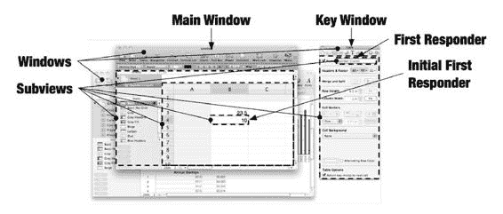

# 第 20 章 ■ 模型-视图-控制器模式

基于文档的应用程序拥有一个单一的`NSDocumentController`对象。该对象负责创建新的文档对象（当你从菜单中选择“新建”或“打开”时），将文档类型与实现它们的文档类关联起来，并跟踪当前打开的文档。一个应用程序通常只定义一种文档类型，但`NSDocumentController`可以任意地将多种文件类型映射到多个文档类。当你选择打开一个现有文档时，`NSDocumentController`会使用文件的类型来确定实例化`NSDocument`的哪个子类。

> **提示** 在 Xcode 中创建基于文档的应用程序项目时，请从“Cocoa Document-based Application”模板开始。这将在以后为你节省大量工作。

文档的数据模型是一个`NSDocument`对象。`NSDocument`，或者你的`NSDocument`子类，是负责实际编码和解码文档文件中数据的对象。

每个文档对象可以在一个或多个窗口中查看，每个窗口由一个`NSWindowController`/`NSWindow`对控制。通常，一个文档只出现在单个窗口中，但可以覆盖此行为以允许用户打开同一数据的多个视图。

非文档窗口不与文档对象关联，通常也没有窗口控制器。文档窗口和非文档窗口可以自由混合。

### 事件与响应者

虽然`Objective-C`中的视图和绘制与`Java`类似，但事件处理完全不同。基本上，您需要忘记关于`Java`事件和监听器的一切知识。

用户事件——鼠标事件、键盘事件、滚轮事件、绘图板事件和触控板事件——驱动用户界面。事件的处理方式以及应用程序对它们的响应大致分为两个阶段：事件阶段和响应阶段。每个阶段都使用一个对象链，该链由应用程序界面的当前状态动态定义。

一个事件从操作系统的硬件驱动程序开始，通过主运行循环进入应用程序，并在此传递给应用程序对象。从那里，它沿着一条路径向下进入文档、窗口、视图和子视图对象的层次结构，直到找到一个可以解释它的对象。这个对象序列称为**事件链**。

一旦某个对象解释了事件，它就变成了一个动作。动作沿着子视图、视图、窗口、文档和应用程序对象的层次结构向上搜索，寻找一个能响应该动作的对象。这个对象序列称为**响应者链**。

本节描述应用程序中对象的组织方式以及它如何与事件和动作处理交互。它描述了事件是如何分发的，以及您的视图对象如何接收基本事件，但这可能是多余的；大多数应用程序不直接处理事件。

核心`Cocoa`视图类已经解释了事件，并将它们转化为与响应者链交互的动作。因此，享受事件部分的阅读，但请特别注意接下来的响应者链部分。这是理解`Cocoa`应用程序工作方式的关键。

## 动态应用程序

`Cocoa`应用程序中的一个重要概念是，事件或动作的处理方式是由用户界面当前状态所隐含的对象链决定的。要理解这一点，您需要学习一些`Cocoa`术语。从图 20-14 所示的用户界面开始。

[www.it-ebooks.info](http://www.it-ebooks.info/)

**图 20-14.** 主窗口、关键窗口和第一响应者

`Cocoa`应用程序形成一个对象层次结构，顶部是单个`NSApplication`（非文档应用程序）或`NSWindowController`（基于文档的应用程序）对象。

在应用程序对象之下可能有`NSDocument`对象。在其之下是`NSWindow`对象，这些对象包含一个嵌套的`NSView`对象树。图 20-14 显示了该层次结构的可见部分。

事件和动作处理由活动的窗口和视图指导。`Cocoa`使用特定术语来指代它们，如表 20-5 所列。

**表 20-5.** 活动窗口和视图术语

| 术语 | 描述 |
| --- | --- |
| 活动应用程序 | 当前活动的、最前端的应用程序。 |
| 主窗口 | 单个的、前端的活动应用程序窗口。大多数菜单命令应用于主窗口。主窗口具有视觉上不同的标题和边框，以区别于其后面的非活动窗口。 |
| 关键窗口 | 包含第一响应者的窗口。 |
| 第一响应者 | 活动或具有当前“焦点”的视图对象。这通常是响应击键的对象。窗口对象也可以是第一响应者。 |
| 初始第一响应者 | 非关键窗口中的视图，当该窗口成为关键窗口时，（默认情况下）它将变为第一响应者。初始第一响应者在不是关键窗口的主窗口中是有意义的。 |

[www.it-ebooks.info](http://www.it-ebooks.info/)

图 20-14 中的情况并不常见，但它有助于区分主窗口和关键窗口。用户在主窗口中打开了一个电子表格文档，然后打开了一个浮动面板并选择了一个文本字段。在这种情况下，面板中的文本字段成为第一响应者，这使得面板窗口成为关键窗口。但面板窗口不会使文档窗口变为非活动状态，因此它仍然是主窗口。

更典型的情况发生在用户编辑电子表格中某个单元格的内容时（在图 20-14 中标识为初始第一响应者）。电子表格单元格成为第一响应者。这使得文档窗口既是主窗口又是关键窗口。

当用户切换窗口和视图时，从第一响应者到顶层应用程序对象的对象链或“路径”会发生变化。这隐式地改变了应用程序处理事件和动作的方式。对象不会主动参与这些变化——也就是说，它们不会收到“您现在处于响应者链中”的事件。一个对象要么在响应者链中，要么不在。

#### 事件

事件由操作系统作为对鼠标移动、鼠标点击、键盘活动、滚轮移动等的响应传递给应用程序。事件所走的路径根据事件类型而有所不同——例如，键盘事件遵循的路径与鼠标事件不同。您可能对创建接收和响应事件的对象感兴趣，但您不太可能参与事件的实际分发。如果您有本节未描述的事件处理或过滤需求，请参考`Cocoa`事件处理指南。¹

##### 事件对象

事件通过附加到主运行循环的事件端口之一进入应用程序。主运行循环对事件做的第一件事是将其封装在一个`NSEvent`对象中。一个`NSEvent`对象具有表 20-6 中列出的属性。

**表 20-6.** `NSEvent`属性

| 属性 | 描述 |
| --- | --- |
| `type` | 事件的类型。典型的事件有`NSLeftMouseDown`、`NSLeftMouseDragged`、`NSLeftMouseUp`、`NSKeyDown`、`NSKeyUp`和`NSScrollWheel`。 |
| `timestamp` | 事件发生的时间。 |
| `window` | 与事件关联的`NSWindow`。 |
| `locationInWindow` | 事件发生时鼠标在窗口坐标中的位置。 |
| `clickCount` | 快速连续发生的鼠标点击次数。用于区分单击、双击和三击。 |
| `modifierFlags` | 事件发生时按下的键盘修饰符（Shift、Option、Command、Control、Caps Lock）。 |
| `characters` | 与按键事件关联的字符串。 |
| `charactersIgnoringModifiers` | 与按键事件关联的字符串，去除了任何按键修饰符（Control、Option 等）。 |
| `isARepeat` | 如果按键事件是由按住一个键直到其自动重复引起的，则为`YES`。 |
| `keyCode` | 按键的虚拟键盘码。 |

并非所有属性都适用于所有事件，还有许多其他不常见的属性（如压力）仅适用于绘图板或力反馈输入设备。您几乎永远不需要自己创建`NSEvent`对象，但每个事件处理方法都会将事件作为`NSEvent`对象接收。

##### 按键事件

¹ Apple Inc., *Cocoa Event-Handling Guide*, http://developer.apple.com/documentation/Cocoa/Conceptual/EventOverview/, 2009.

