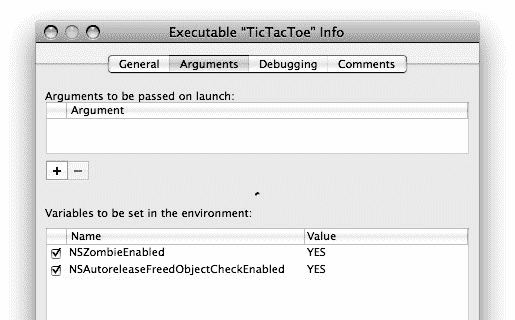

# Objective-C 中的内存管理

这三个问题在过去半个世纪的计算机科学中，一直是寻找更好方式来管理内存块（以及扩展而来的对象）的驱动力。

### Objective-C 的引用计数

虽然垃圾回收是一种优雅得多的解决方案——能一举优雅地解决所有三个问题——但它是一个复杂的系统，需要大量资源，并且直到最近才成熟起来。在垃圾回收之前的 Objective-C 采用的是简单的替代方案：引用计数。

引用计数引入了“所有者”的概念：持有指向其他对象的指针的代码或对象，被称为拥有该对象。当某个对象或代码块想要持有对一个对象的引用时，它首先会`retain`（保留）该对象。当它使用完该对象后，它会`release`（释放）它。

引用计数的目标是将与垃圾回收相同的逻辑应用于对象管理：只要一个对象有所有者（引用），它就会保持存活。引用计数和垃圾回收的主要区别在于，在引用计数中，由程序员负责在建立或忘记对某个对象的引用时通知该对象。

以下是引用计数的工作原理：

1. 当一个对象被初始分配时，它的引用计数为 1。
2. 任何想要使用该对象的代码首先将其引用计数增加 1。这称为保留（retain）。
3. 当持有步骤 1 或 2 中指针的代码不再使用它时，它会将对象的引用计数减少 1，并忘记该指针。这称为释放（release）。
4. 当对象的引用计数减少到 0 时，该对象会立即被销毁，其内存被释放。

引用计数的一个示例显示在列表 24-2 中。

**列表 24-2. 基本引用计数模式**

```
id myObject = [[MyClass alloc] init];
…
[myObject doSomething];
…
[myObject release];
```

在列表 24-2 中，该引用指向一个刚创建的对象。新创建的对象隐式具有引用计数 1（否则它们就不存在了）。程序使用该对象，然后向其发送一个`-release`消息，以指示它将不再使用该对象。`-release`消息会减少对象的保留计数并立即销毁该对象。这假设在此期间没有其他对象或代码`-retain`过该对象。如果有，该对象将继续存在，因为它仍然至少有一个所有者。

在实践中，手动管理释放计数并不像看起来那么繁重。接下来的几节将解释自动释放池的作用，并描述使用引用计数处理对象的常见编程模式。自动释放池非常出色，而且这些模式易于应用。

如果持续一致地应用（这是一个很大的“如果”），引用计数在约 80% 的情况下能提供与使用垃圾回收等效的体验。实际上，从垃圾回收环境转过来时可能遇到的最大问题，是在剩余 20% 的情况下忘记应用所需的模式。

### 自动释放池

自动释放池引入了一个非常类似垃圾回收的概念：将对未引用对象的销毁推迟到未来的某个不确定时间。自动释放池似乎让许多 Objective-C 新手感到困惑，但它们实际上非常简单：

-   自动释放池是一个对象集合，这些对象最终都会收到一条`-release`消息。

仅此而已。要使用自动释放池，向对象发送一条`-autorelease`消息，而不是`-release`消息。接收者不会立即被释放；它只是被添加到自动释放池中。

稍后——通常是在你的代码完成后很久——池会被排空，池中的每个对象都会收到它的`-release`消息。

需要记住的基本规则是：通过向对象发送`-release`或`-autorelease`消息来释放它，但绝不能同时发送两者。这两条消息在逻辑上是等价的，唯一的区别在于时机。前者会立即释放对象。后者将其添加到自动释放池中，以便在将来的某个时间释放。

#### 自动释放池的生命周期

通常，你不需要自己创建自动释放池。（本章后面的一节会解释为什么以及如何创建它们。）在大多数情况下，始终假设存在一个活跃的自动释放池，并且`-autorelease`消息会将接收者添加到当前池中。尽管它们含糊地保证会“最终”释放对象，但自动释放池具有非常明确的生命周期。大多数自动释放池由工作运行循环在每个事件分发开始时创建。在处理事件的代码返回后，池被排空。这个机制定义了关于自动释放池生命周期的重要规则：

-   在你的方法或函数返回之前，当前的自动释放池绝不会被排空。

这条规则的重要性可能不是立竿见影的，但当你阅读接下来的几节时，它会变得清晰。

#### 返回的引用

上一节中列出的引用计数规则看起来简单合理，但实际上它们包含一个巨大的缺陷：在代码不再持有指向某个对象的指针后，如何释放该对象（减少其引用计数）？在很多情况下，通过仔细编码可以避免这种情况，但有一种你无法避免的、不可避免的情况——将对象引用返回给调用者。使用目前学到的引用计数规则，你可能会倾向于编写类似列表 24-3 中所示的代码。

**列表 24-3. 保留与返回问题**

```objective-c
@implementation Zombie

- (void)recitePoetry
{
    NSString *myName = [[self zombieName] retain];
    [self speakFormat:@"Hello, my name is %@. This is my poem.",myName];
    …
    [myName release];
}

- (NSString*)zombieName
{
    NSMutableString *z = [[NSMutableString alloc] init];
    [z appendString:@"Zombie "];
    [z appendString:[self humanName]]; // 例如 "Zombie Bob"
    return z;
    // [z release] ? ? ? ? ?
}

…
@end
```

在`-recitePoetry`方法中，由`-zombieName`返回的`NSString`对象被保留，在方法体中使用，然后被释放。在`-zombieName`方法中，字符串对象在创建时被隐式保留，在方法体中使用，并返回给调用者。但是等等！它也需要被释放，因为`-zombieName`不会再使用它。然而，在方法返回给调用者之后，就没有办法做到这一点了。

自动释放池通过将所需的释放推迟到稍后的某个时间来解决这个问题。`-zombieName`方法在列表 24-4 中被重写，以使用自动释放池。

**列表 24-4. 自动释放返回的对象**

```objective-c
- (NSString*)zombieName
{
    NSMutableString *z = [[NSMutableString alloc] init];
    [z appendString:@"Zombie "];
    [z appendString:[self humanName]];
    return [z autorelease];
}
```

字符串对象在返回给调用者之前被添加到自动释放池中。这正确地平衡了对象创建时发生的隐式保留，并确保它最终会被销毁。

> **注意** `-retain`和`-autorelease`消息会将接收者返回给发送者，允许将其链接到诸如`return [obj autorelease]`和`property = [obj retain]`这样的表达式中。这避免了必须将`[obj autorelease]`和`return obj`写成独立的语句。

当一个对象引用被返回给调用者时，它已经接收到了正确数量的`-release`或`-autorelease`消息。用 Objective-C 的行话来说，这被称为自动释放对象。

这为 Objective-C 对象创建了另一条规则。


- 从方法返回的每个对象要么是持有的（owned），要么是自动释放的（autoreleased）。

这意味你不必担心从其他对象接收到的对象的持有权。这些对象可能是被持有的，可能是自动释放的，或者两者兼而有之。关键在于，你的代码只负责其自身对对象的持有权。永远不要担心其他对象对某个对象的持有权（除了本章后面会提到的极少数情况）。

上述规则的一个例外是那些创建新对象的消息：`+alloc`、`+new`、`-copy` 和 `-mutableCopy`。这些几乎是仅有的返回保留（retained）对象的方法。也就是说，该对象有一个不平衡的 `retain`，而接收者隐式地成为它的新持有者。你可能会遇到其他返回保留对象的方法。按照约定，这些方法的名字以 `new` 开头，例如 `-[NSObjectController newObject]`。

## 自动释放的对象

清单 24-4 中的代码之所以能工作，是因为自动释放池的生命周期规则：在 `-recitePoetry` 开始时使用的自动释放池，在该方法返回之前不会被排空。这意味着任何被添加到自动释放池的对象都会在方法执行完毕前一直存在。

了解了这一点，清单 24-2 和 24-4 中的代码可以进一步简化，如清单 24-5 所示。

### 清单 24-5. 简化的释放管理

```
- (void)recitePoetry

{

NSString *myName = [self zombieName];

[self speakFormat:@"Hello, my name is %@. This is my poem.",myName];

…

}

- (NSString*)zombieName

{

NSMutableString *z = [[[NSMutableString alloc] init] autorelease];

[z appendString:@"Zombie "];

[z appendString:[self humanName]];

return z;

}
```

`清单 24-5` 开始看起来很像为垃圾回收环境编写的代码。唯一的区别在于创建 `NSMutableString` 时调用的那一个 `-autorelease` 消息。

原因是字符串对象已被自动释放，并且对该对象的所有引用都包含在执行方法的作用域内。请记住，自动释放池在方法返回之前绝不会被排空，并且其他方法返回的对象总是保留的或自动释放的对象。这为管理对象的保留计数（retain counts）创建了一条新的、重要的规则：

-   只有一个自动释放对象在当前自动释放池的生命周期之外仍被引用时，才需要保留它。

自动释放池的这个特性正是其如此有用的原因，也是为什么我认为托管内存和垃圾回收在 80% 的情况下是无法区分的。大多数对象引用都是短暂的——在单个方法中定义并使用后就被遗忘。只要这些引用指向的是自动释放的对象，它们就不需要任何内存管理。

由于这种便利性，大多数对象都会像 `清单 24-5` 所示的那样被立即创建并自动释放，而不是采用 `清单 24-4` 中的模式。一旦自动释放，该对象几乎不需要任何管理，除非其他代码需要保留它——而那将是其他代码的责任。唯一例外的情况是，代码意图创建并保留一个对象。当 `[[MyClass alloc] init]` 就能达到相同目的时，却写出 `[[[[MyClass alloc] init] autorelease] retain]` 是很愚蠢的。

那么，对于在当前自动释放池生命周期之外持续存在的引用，该如何处理呢？接下来几节中的编程模式正是针对这些情况。

### 托管内存模式

以下各节展示了在托管内存环境中工作时使用的基本编程模式。其中一些模式已经展示过，但为了完整性和将来参考，这里再次包含它们。

#### 新对象模式

当创建一个新对象时，它的保留计数（retain count）从 1 开始，隐式地使其创建者成为第一个持有者。返回新对象的主要消息是：`+alloc`、`+new` 和 `-copy`。当对象不再使用时，这种隐含的持有权必须通过 `-release` 消息（如清单 24-6 所示）或 `-autorelease` 消息（如清单 24-7 所示）来平衡。

### 清单 24-6. 保留新对象模式

```
id object = [[NSObject alloc] init];

…

[object release];
```

### 清单 24-7. 自动释放新对象模式

```
id object = [[[NSObject alloc] init] autorelease];

…
```

#### 自动释放对象模式

大多数消息返回的对象都是以自动释放对象的形式返回的。也就是说，该对象已经接收到了一组正确平衡的 `-retain`、`-release` 或 `-autorelease` 消息，并且不需要任何额外管理。具体来说，类的便利构造器（convenience constructors），例如 `+[NSMutableArray arrayWithCapacity:]`，会返回自动释放的对象。即使便利构造器用于创建新对象，但从内存管理的角度来看，这些对象并不是“新的”。常见的例子如清单 24-8 所示。

### 清单 24-8. 自动释放的对象

```
NSNumber *number = [NSNumber numberWithInt:10];

NSString *path = [NSString stringWithFormat:@"Folder %@",number]; NSFileManager *fileManager = [NSFileManager defaultManager]; NSDictionary *attrs = [fileManager attributesOfItemAtPath:path error:NULL]; NSArray *attrKeys = [attrs keysSortedByValueUsingSelector:@selector(compare:)];
```

`清单 24-8` 中每个由类方法或实例方法返回的对象都是自动释放的，不需要额外管理。如果你要将引用存储在持久化的位置（例如实例变量），那么你应该像这样保留该对象：

```
myArray = [[NSMutableArray arrayWithCapacity:100] retain];
```

更多关于在属性中保留引用的信息，请参阅下面的“设置器模式”部分。

#### 返回自动释放的对象

为了使你的代码与 Objective-C 的其他部分保持一致，你的方法应该始终返回自动释放的对象，如清单 24-9 所示。

### 清单 24-9. 返回一个自动释放的对象

```
- (id)someObject

{

id object = [[[NSObject alloc] init] autorelease];

…

return object; // 自动释放

}
```

#### 设置器模式

在设置对象的属性时，你应该保留被引用的对象，直到你用其他东西替换该引用。被替换的引用应该被释放或自动释放。编写设置器方法有四种流行的模式，如清单 24-10 所示。

### 清单 24-10. 设置器模式

```
@interface MyClass : NSObject {

id one;

id two;

id three;

id four;

}

@property (retain,nonatomic) id one;

@property (retain,nonatomic) id two;

@property (retain,nonatomic) id three;

@property (copy,nonatomic) id four;

@end

@implementation MyClass

- (id)one

{

return one;

}

- (void)setOne:(id)object

{

[one autorelease];

one = [object retain];

}

- (id)two

{

return two;

}

- (void)setTwo:(id)object

{

id oldTwo = two;

two = [object retain];

[oldTwo release];

}

- (id)three

{

return three;

}

- (void)setThree:(id)object

{

if (three!=object) {

[three release];

three = [object retain];

}

}

- (id)four

{

return four;

}

- (void)setFour:(id)object

{

[four autorelease];

four = [object copy];

}

@end
```

`清单 24-10` 中的所有设置器模式都完成了三个重要任务：

-   向正在存储的对象发送 `-retain` 消息。
-   向正在被遗忘的对象发送 `-release` 或 `-autorelease` 消息。
-   在发送 `-release` 消息之前发送 `-retain` 消息。

最后一点很微妙。如果正在设置的对象与已存储在属性中的对象相同，那么在 `-retain` 消息之前向其发送 `-release` 消息可能会过早地销毁该对象。


`object`。第三种模式（如`-setThree:`中所示）通过显式测试该条件来避免此问题。

最后一个属性会存储原始对象的一份副本。它可以采用前三种模式中的任何一种；只需将`[object retain]`替换为`[object copy]`即可。需要注意的是，所有这些模式都与`nil`值兼容。

■注意 你的属性设置器方法的行为必须与你的`@property`指令一致。前三种模式与`retain`属性特性一致，最后一种模式与`copy`特性一致。如果你让 Objective-C 编译器为你`@synthesize`设置器方法，它将生成与所示代码等效的代码。

设置器模式代码示例是编写行为良好的属性访问器的指南，但这些原则适用于你存储在持久变量中的任何对象引用。如果你直接设置实例变量或静态变量，你的代码必须遵循相同的模式——保留新引用并释放旧引用。

## `init`模式

这实际上是“对象应保留其引用的对象”这一规则的推论，但仍然值得强调。大多数对象的`-init`方法会创建新对象，并且这些对象必须被保留，如清单 24-11 所示。

**清单 24-11. `-init`模式**

```
@interface ZombiePoetryGroup : NSObject {

NSMutableSet *zombies;

}

@end

@implementation ZombiePoetryGroup

- (id) init

{

self = [super init];

if (self != nil) {

zombies = [[NSMutableSet set] retain];

}

return self;

}

@end
```

请记住，使用`+new`、`+alloc`和`-init`或`-copy`创建的新对象已经被保留。与清单 24-11 中高亮语句等价的语句是`zombies = [NSMutableSet new];`。

## `dealloc`模式

当一个引用计数为 1 的对象接收到`-release`消息时，它会立即被销毁。这是通过向该对象发送一条`-dealloc`消息来实现的。对象的`-dealloc`方法执行的角色与`-finalize`方法大致相同，但它还负责释放所有被保留的对象、分配的内存以及它拥有的任何其他资源，并最终释放其占用的内存。如果你的对象保留了任何对象引用，那么它必须有一个`-dealloc`方法。清单 24-12 和 24-13 展示了编写`-dealloc`方法的两种常见模式。

**清单 24-12. 使用`-release`的`-dealloc`**

```
- (void)dealloc

{

[one release];

[two release];

[three release];

[four release];

[super dealloc];

}
```

**清单 24-13. 使用属性设置器的`-dealloc`**

```
- (void)dealloc

{

[self setOne:nil];

[self setTwo:nil];

[self setThree:nil];

[self setFour:nil];

[super dealloc];

}
```

`-dealloc`方法必须执行以下操作：

*   关闭所有打开的文件，释放所有资源，释放所有非对象内存，以及任何其他在`-finalize`方法中合适的操作。
*   使用`-release`或`-autorelease`消息释放所有被保留的对象。
*   将`[super dealloc]`作为其最后一条语句发送。

清单 24-12 中的模式是最快且最高效的，它避免了属性设置器的副作用，并且是最常用的模式。

清单 24-13 中的模式效率较低，但有几个优点。它使用属性设置器来清除引用。如果设置器需要通知观察者或执行其他内务处理，此模式允许它们这样做。除了释放持有的属性外，它还将属性值设置为`nil`。如果`-dealloc`方法中的后续代码试图将该属性用于任何目的（如果该属性仍然指向一个已释放的实例，后果将非常严重），那么这一点可能很重要。第一个模式（如代码所示）试图通过在解除分配期间不向自身发送任何其他消息来避免此问题。但随着对象关系变得更加复杂，很难确保这一点始终有效。例如，一个被保留的对象可能有一个指向其拥有者（`self`）的指针，并且在被解除分配时可能会尝试使用其拥有者的某个属性。

■注意 `-dealloc`是由`-release`发送给对象的。你绝不应向另一个对象发送`-dealloc`消息。

向超类发送`-dealloc`是绝对的要求。现代 Objective-C 编译器现在如果检测到你没有这样做，就会发出警告。基类的`-dealloc`方法是实际解除分配（释放）实例所占内存的方法。未能发送`-dealloc`将导致内存泄漏。在超类的`-dealloc`消息返回后，该对象不再存在，并且`self`是无效的。你不能访问该对象的任何实例变量，也不能向它发送消息。

### 隐式保留的对象

被你的对象所保留的其他对象所保留的对象，被称为隐式保留的对象。一个对象只应保留它保持直接引用的对象；被其他对象保留的对象由那些对象管理。清单 24-14 展示了一个隐式保留 Zombie 对象的例子。

**清单 24-14. 隐式保留的对象**

```
@class Zombie;

@interface ZombiePoetryGroup : NSObject {

NSMutableDictionary *members;

}

- (BOOL)hasMemberNamed:(NSString*)zombieName;

- (void)addMember:(Zombie*)newZombie;

- (void)removeMember:(Zombie*)zombieZombie;

@end

@implementation ZombiePoetryGroup

- (id) init

{

self = [super init];

if (self != nil) {

members = [NSMutableDictionary new];

}

return self;

}

- (void) dealloc

{

[members release];

[super dealloc];

}

- (BOOL)hasMemberNamed:(NSString*)zombieName

{

return ([members objectForKey:zombieName]!=nil);

}

- (void)addMember:(Zombie*)newZombie

{

[members setObject:newZombie forKey:[newZombie zombieName]];

}

- (void)removeMember:(Zombie*)zombie

{

[members removeObjectForKey:[zombie zombieName]];

}

@end
```

`ZombiePoetryGroup`对象创建并保留了一个`NSMutableDictionary`对象。所有 Cocoa 集合类都会保留添加到集合中的对象，并在它们被移除时再次释放它们。`ZombiePoetryGroup`对象保留其对`NSMutableDictionary`对象的直接引用，并让字典对象自行保留和释放其对象。

### 管理内存的问题

在使用托管内存时，会遇到一些独特的编码难题。接下来的几节将描述最常见的问题以及你可以如何处理它们。

#### 过度保留或释放不足的对象

过度保留（或释放不足）的对象是指那些接收到的`-retain`消息次数超过了适当次数，或者未能接收到平衡数量的`-release`消息的对象。该对象永远不会被解除分配，从而导致内存泄漏。这通常是一个难以察觉的微妙问题，因为即使泄漏几千个对象，其影响也不会很明显。

解决这个问题的最佳方法是明智地使用开发者工具。Xcode 开发者工具包含了多种内存泄漏检测工具，但对于 Objective-C 开发者来说，最重要的工具是`ObjectAlloc`，如图 24-1 所示。

***图 24-1. ObjectAlloc***


`ObjectAlloc` 追踪应用程序中所有 Objective-C 对象的生命周期。它记录每个对象何时被分配、保留、释放和销毁。它以图形方式呈现每个类的总实例数，使您能够快速识别一组被分配但从未释放的对象。您应偶尔在 `ObjectAlloc` 的监视下运行应用程序，以查找对象泄漏。

一旦发现泄漏，再次使用 `ObjectAlloc` 来检查发送给这些对象的 `+alloc`、`-retain`、`-release` 和 `-dealloc` 消息的历史记录。实例的历史记录应能暴露失衡发生的位置。

**过度释放或未充分保留的对象**

过度释放或未充分保留的对象是指接收到一次过多 `-release` 消息的对象。该对象在其他对象仍持有对其的引用时被销毁。孤立的对象指针随后指向无效内存。使用无效对象指针的影响范围可能从不一致到灾难性。

用于查找过度释放对象的最佳调试工具是 `NSZombie`，请勿与本书中的任何僵尸示例混淆。Objective-C 运行时内置了多种可通过环境变量启用的调试工具。表 24-1 列出了最常用于查找过度释放对象的两个环境变量。

[www.it-ebooks.info](http://www.it-ebooks.info/)



第 24 章 ■ 内存管理

**表 24-1.** `NSZombie` 环境变量

| 环境变量 | 描述 |
| --- | --- |
| `NSZombieEnabled` | 如果设置为 `YES`，被销毁的对象将被替换为僵尸对象，该对象在收到任何消息时会抛出异常。 |
| `NSAutoreleaseFreedObjectCheckEnabled` | 如果设置为 `YES`，自动释放池在尝试释放一个已被销毁的对象时会打印警告信息。 |

要使用这些工具，请设置所需的环境变量，并在启动应用程序时将该环境传递给它。其中一些功能也可以在应用程序中通过编程方式启用。

僵尸对象在对象被销毁时创建。它不会被释放，而是将其类更改为特殊的僵尸类。它仍是一个对象，任何发送给该对象的消息都将抛出异常，帮助您识别哪个对象被过度释放了。一旦识别出来，您可以使用 `ObjectAlloc` 工具来检查该对象的历史记录，并定位提前释放它的代码。

图 24-2 显示了如何在 Xcode 中为可执行文件设置环境变量。

**图 24-2.** 设置 `NSZombie` 调试环境变量

[www.it-ebooks.info](http://www.it-ebooks.info/)

第 24 章 ■ 内存管理

关于用于检测内存泄漏和过度释放错误的工具的完整描述，请参见苹果公司的“技术说明 TN2124：Mac OS X 调试魔法”。¹

**提前释放的对象**

与过度释放对象密切相关的一个问题是对象被简单地提前释放——当仍有活跃的引用指向它时。最常见的原因是在设置属性或从集合中移除对象时，作为副作用释放了对象。清单 24-15 和 24-17 展示了两种非常常见的对象被提前销毁的场景。

**清单 24-15.** 对象被集合销毁

```objectivec
@implementation FIFO

…

- (id)pop

{

id object = [stack objectAtIndex:0];

[stack removeObjectAtIndex:0];

return object; // |object| 不存在！

}

@end
```

在清单 24-15 中，`FIFO` 中的对象被集合隐式保留。要从栈中取出一个对象，需将其从集合中移除并返回给调用者。问题在于，集合可能是该对象的唯一所有者。移除它会释放该对象，从而销毁它。`-pop` 方法随后返回一个指向已销毁对象的指针。解决方案是重新自动释放该对象，如清单 24-16 所示。

**清单 24-16.** 重新自动释放对象

```objectivec
- (id)pop

{

id object = [[[stack objectAtIndex:0] retain] autorelease];

[stack removeObjectAtIndex:0];

return object;

}
```

解决方案是在从集合中移除对象之前，向其发送 `-retain` 和 `-autorelease` 消息。额外的 `-retain` 防止对象被立即销毁，而 `-autorelease` 则创建一个适合返回给调用者的自动释放对象。

¹ Apple Inc., “Technical Note TN2124: Mac OS X Debugging Magic,” http://developer.apple.com/technotes/
tn2004/tn2124.html, 2006.

[www.it-ebooks.info](http://www.it-ebooks.info/)

第 24 章 ■ 内存管理

■ **注意** `[[object retain] autorelease]` 模式被许多 Objective-C 新手过度使用。它有其适用之处，但通常表明试图应用内存管理“玄学”，而非解决实际问题。

在清单 24-17 中，从属性 getter 返回了一个自动释放的对象。随后更改属性，释放了之前的对象，而该对象仍在被引用。

**清单 24-17.** 对象被设置器销毁

```objectivec
id two = [self two];

[self setTwo:nil];

// |two| 不存在！
```

对此问题有三种解决方案：

*   使用清单 24-10 中的 `-setOne:` 所演示的设置器模式。该设置器会先自动释放之前的对象，而不是立即释放它。
*   在赋值时显式保留属性对象（例如，`id two = [[[self two] retain] autorelease]`），这将保护它不被 `-setTwo:` 消息释放。
*   编写属性 getter，使其每次返回值时都重新自动释放该对象（例如，`return [[two retain] autorelease]`）。

在这些解决方案中，第一种是首选方案。它不需要调用者的介入，保留了返回属性值的自动释放约定，并且高效。如果您无法控制类的实现，则应使用第二种方案。最后一种方案效率低下，并且常被经验不足的程序员无休止地使用。

**循环引用**

引用计数的一个主要问题是循环引用，对此没有通用解决方案。如果两个对象都持有了对彼此的引用，这两个对象将永远不会被释放。

如何解决这个问题取决于具体情况。一种常见的解决方案是存储未保留的引用，即所谓的弱引用。这不应与垃圾回收中使用的术语“弱引用”混淆，因此我将使用术语“未保留引用”。未保留引用通常用于委托、观察者和父对象引用。清单 24-18 展示了一个对象树中节点的接口，该节点持有对它的父节点的未保留引用。

**清单 24-18.** 未保留的对象属性

```objectivec
@interface TreeNode : NSObject {

TreeNode *parent;

NSMutableArray *children;

}

[www.it-ebooks.info](http://www.it-ebooks.info/)

第 24 章 ■ 内存管理

@property (assign) TreeNode *parent;

…

@end
```

通过使用 `assign` 属性特性，设置 `parent` 属性时不会保留该属性。风险在于，该节点可能从树中被移除，随后尝试向其父对象发送消息，而父对象可能已不存在。如果您仔细设计对象，使其在那些对象可能已被释放的情况下，绝不可能试图使用任何未保留的引用，那么这种方法是可行的。

对此类问题的最佳解决方案是添加代码，在节点从树中移除之前，显式清除对父节点的引用。在引用被保留的情况下，这打破了循环引用并允许节点被销毁。在引用未被保留的情况下，这确保了节点不会尝试使用过时的引用。

**创建自动释放池**

通常，您不会自己创建自动释放池，但在少数情况下您必须创建，或者您可能希望创建。


