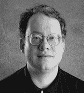

# 本书作者均来自苹果开发者技术服务团队的资深成员，他们曾无数次解答初入苹果技术领域的软件工程师们的疑问。他们始终致力于帮助开发者培养良好习惯。正是这份经验汇聚成本书，它不仅能预判最常见的误解，更会细致讲解苹果开发平台不仅是"如何做"，还有"为何如此"。

例如第 3 章《面向对象编程入门》提供的概念基础，能让你将后续内容串联成一幅清晰的图景，而非直接抛给你一堆陌生的类、方法和技巧，指望你通过实践自行消化。

《学习 Mac 上的 Objective-C》是进入苹果 iOS 与 OS X 开发平台核心语言的优秀指南。

约翰·C·伦道夫

## 关于作者

|  | **斯科特·克纳斯特** 在苹果尚未成为潮流时就已入职。他早年帮助开发者编写 Mac 软件，那时 Cocoa 还只是一个等待诞生的伟大构想。如今斯科特任职于谷歌开发者关系团队，并运营 Google Mac 博客。他住在硅谷，身边尽是技术宅同行。 |

|  | **瓦卡尔·马利克** 是位资深 UNIX 技术宅。他在 Mac OS X 早期就加入苹果，帮助开发者掌握 Cocoa 与 UNIX。如今他在圣地亚哥的 MeLLmo 公司开发出色的 iOS 软件。 |

|  | **马克·达林普尔** 是资深 Mac 与 Unix 程序员，参与过跨平台工具包、互联网出版工具、高性能 Web 服务器及桌面应用开发。他也是《高级 Mac OS X 编程》（Big Nerd Ranch 2005）的主要作者。业余时间他演奏长号、巴松管，还制作气球动物。 |

## 关于技术审校

**尼克·韦尼克** 从事 IT 领域逾 13 年，涉足网络管理到 Web 开发。2008 年 SDK 发布时他开始编写 iOS 应用，随后创立专注 iOS 开发的公司。业余时间他爱陪伴妻儿家人、打高尔夫。博客位于[nickwaynik.com](http://nickwaynik.com)，推特账号@n_dubbs。

## 致谢

这本书当然不会自己写成。而我们作者也绝非独自完成——甚至远远不够。没错，我们敲了许多文字和代码，但若非我们出色的书籍团队，这些会变成什么？可能只是一篇冗长的博客帖子。

特别感谢布伦特·杜比，他用永不疲倦的乐观邮件和专注的电话协调着全球虚拟团队。感谢尼克·韦尼克在技术上保持我们的严谨性——鉴于苹果如今在 Xcode 和 Cocoa 中注入的强大与复杂，这绝非易事。感谢格温南·斯佩林，她仔细审阅了每段文字（连蹩脚的双关语都不放过），确保内容尽可能清晰简洁。还要感谢第一版的优秀文字编辑希瑟·朗，她再次回归，允许我们游走在语法与风格的边缘，只为再开一个技术宅《星球大战》的玩笑。每一位都让这本书获益匪浅，使我们展现出最佳状态。

瓦卡尔还要感谢他可爱的子女亚当和米沙勒，以及美丽的妻子伊卢姆，感谢他们给予他足够的时间完成本书。

## 如何使用本书

如需下载源代码或报告错误，请访问本书在 Apress 网站的页面：
[www.apress.com/9781430241881](http://www.apress.com/9781430241881)。

使用本书时，最好让电脑保持在手边。备好喜爱的饮品也不错，但请远离电脑——液体损坏的维修费用足以毁掉你一整天。

最重要的是，在学习过程中保持乐趣！

