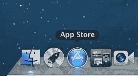
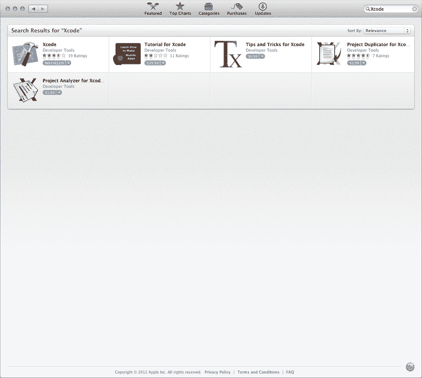
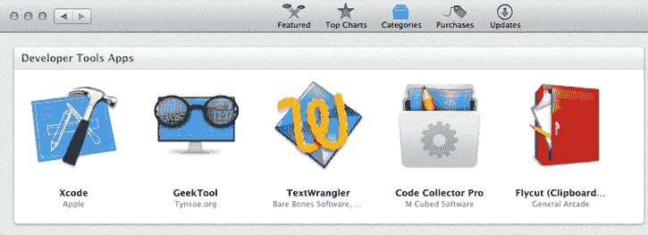
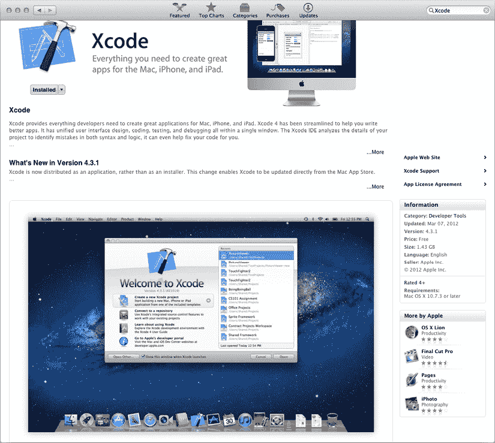

# 第 1 章

## 你好

欢迎阅读《学习 Mac 上的 Objective-C》！本书旨在教授 Objective-C 语言的基础知识。Objective-C 是 C 语言的超集，是许多（甚至绝大多数）具有纯正 OS X 或 iOS 外观的应用所使用的语言。

除了介绍 Objective-C，本书还将引导你认识它的搭档——苹果的 Cocoa（适用于 OS X）和 Cocoa Touch（适用于 iOS）工具包。Cocoa 和 Cocoa Touch 用 Objective-C 编写，包含了 OS X 和 iOS 用户界面的所有元素，以及更多内容。学会 Objective-C 后，你就能通过完整项目或另一本书（如《学习 Mac 上的 Cocoa》（Apress 2010）或《iOS 5 开发入门》（Apress 2011））深入探索 Cocoa。

本章将介绍学习 Objective-C 前所需的基础知识。我们还会简要回顾 Objective-C 的历史，并预览后续章节的内容。

### 开始之前

阅读本书前，你应具备类似 C 的编程语言经验，例如 C++、Java 或 C 语言本身。无论哪种语言，你应熟悉其基本原则：了解变量、方法和函数的概念，理解如何使用条件语句和循环控制程序流程。本书将重点介绍 Objective-C 在其基础语言 C 上添加的特性，以及从苹果 Cocoa 工具包中精选的实用功能。

如果你是从非 C 语言转向 Objective-C？依然可以跟上节奏，但建议先阅读本书附录，或参考《学习 Mac 上的 C 语言》（Apress 2009）。

### 未来诞生于昨日

Cocoa 和 Objective-C 是苹果 OS X 与 iOS 操作系统的核心。尽管 OS X（尤其是 iOS）相对年轻，但 Objective-C 和 Cocoa 的历史要悠久得多。布拉德·考克斯在 20 世纪 80 年代初发明了 Objective-C，旨在融合流行且便携的 C 语言与优雅的 Smalltalk 语言。1985 年，史蒂夫·乔布斯创立 NeXT 公司，致力于打造强大且实惠的工作站。NeXT 选择 Unix 作为操作系统，并创建了用 Objective-C 开发的强大用户界面工具包 NextSTEP。尽管功能出众且拥有忠实的小众追随者，NextSTEP 在商业上并未获得成功。

1996 年苹果收购 NeXT（亦或相反？）后，NextSTEP 更名为 Cocoa，并推广至更广泛的 Macintosh 程序员群体。苹果免费提供包括 Cocoa 在内的开发工具，任何程序员都可使用。你只需一点编程经验、Objective-C 基础知识，以及深入学习的渴望。

你可能会想："如果 Objective-C 和 Cocoa 诞生于 80 年代——那个《家有阿福》《天龙特攻队》盛行，还有陈旧的 Unix 时代——它们现在岂不是又老又过时？"绝非如此！Objective-C 和 Cocoa 是优秀程序员团队多年努力的结晶，并不断更新与增强。随着时间的推移，它们已演变为极其优雅而强大的工具集。过去几年间，iOS 已成为计算领域最热门的开发平台，而 Objective-C 正是编写优秀 iOS 应用的关键。因此，在 NeXT 采用 Objective-C 二十多年后的今天，所有潮人都在使用它。

### 后续内容

Objective-C 是 C 的超集：它始于 C，然后添加了一些小而显著的语言扩展。如果你曾经接触过 C++ 或 Java，你可能会惊讶于 Objective-C 的实际规模如此之小。我们将在本书的各个章节中详细讲解 Objective-C 对 C 的扩展：

*   第 2 章“C 的扩展”重点介绍 Objective-C 引入的基本特性。
*   第 3 章“面向对象编程入门”通过展示面向对象编程的基础知识来开启学习之旅。
*   第 4 章“继承”描述了如何创建继承父类特性的类。
*   第 5 章“组合”讨论了组合对象以使其协同工作的技术。
*   第 6 章“源文件组织与使用 Xcode 4”介绍了创建程序源代码的实用策略。
*   第 7 章“更多关于 Xcode”为您展示一些快捷方式和高级用户功能，帮助您充分利用编程时光。
*   我们在 第 8 章“Foundation Kit 快速浏览”中短暂脱离 Objective-C，通过使用其核心框架之一来展示 Cocoa 的一些酷炫特性。
*   您将在 Cocoa 应用程序中花费大量时间处理 第 9 章 的主题“内存管理与 ARC”。
*   第 10 章“对象初始化”全面探讨了对象创建这一神奇时刻所发生的一切。
*   第 11 章“属性”为您详细介绍了 Objective-C 的点语法及一种更简单的对象访问器创建方式。
*   第 12 章“类别”描述了 Objective-C 这项超酷的特性，它允许您向现有类（甚至包括您未编写的类）添加自己的方法。
*   第 13 章“协议”讲述了 Objective-C 中一种继承形式，它允许类实现打包好的功能集。
*   第 14 章“块与并发”向您展示如何使用 Objective-C 的新特性，该特性将函数增强为可以包含数据及代码的块。
*   第 15 章“UIKit 入门”让您初步体验使用其核心框架可以为 iOS 开发出多么精美的应用程序。
*   第 16 章“AppKit 入门”与 第 15 章 类似，但它介绍了适用于 OS X 应用程序的基本框架。
*   第 17 章“文件加载与保存”向您展示如何保存和检索数据。
*   第 18 章“键值编码”为您提供了间接处理数据的方法。
*   第 19 章“使用静态分析器”向您展示如何使用强大的 Xcode 工具来发现程序员常犯的错误。
*   最后，在 第 20 章“NSPredicate”中，我们向您展示如何对数据进行切片和切块。

如果你来自其他语言（如 Java 或 C++），或来自其他平台（如 Windows 或 Linux），你可能想查阅本书附录《从其他语言过渡到 Objective-C》，其中指出了你在拥抱 Objective-C 时需要跨越的一些思维障碍。

## 准备工作

`Xcode` 是 Apple 提供的用于创建 iOS 和 OS X 应用程序的开发环境。Mac 并未预装 `Xcode`，但下载并安装它既简单又免费。你只需要一台运行 OS X 10.7 Lion 或更高版本的 Mac。

踏上漫长而精彩的 OS X 或 iOS 编程之路的第一步是获取一份 `Xcode` 副本。如果你还没有，可以从 Mac App Store 下载。要到达那里，请点击 Dock 中的 App Store 图标（参见 图 1-1），或者在 *Applications* 文件夹中找到 App Store。

图 1-1. Dock 中的 App Store 图标

在 Mac App Store 中，点击右上角的搜索框，搜索 `Xcode`（参见 图 1-2）。

图 1-2. 在 Mac App Store 中搜索 `Xcode`

或者，点击 *Categories*，然后点击 *Developer Tools*，你会在左上角（参见 图 1-3）或附近看到 `Xcode`。点击 *Xcode* 查看其下载页面（参见 图 1-4）。

图 1-3. Developer Tools 应用

图 1-4. Mac App Store 中的 `Xcode` 下载页面

点击 *Free*，然后点击 *Install App*。App Store 会将 `Xcode` 安装到你的 Applications 文件夹中。

现在，你已准备好开始你的旅程。祝你好运！至少在旅途的第一部分，我们会陪你同行。

## 总结

OS X 和 iOS 程序使用 Objective-C 编写，这项技术起源于上世纪 80 年代，现已发展为一套强大的工具。在本书中，我们假设你具备一定的 C 语言或其它通用编程语言知识，并以此为基础展开。

我们希望你喜欢这次冒险！

