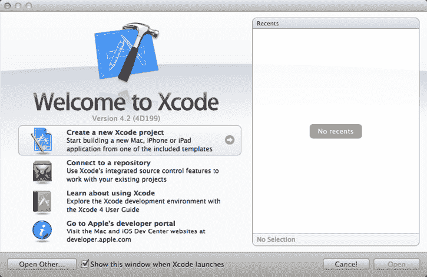
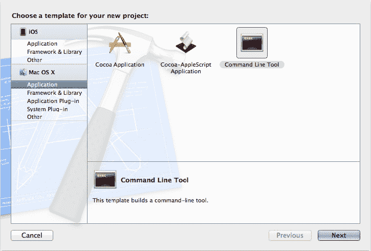
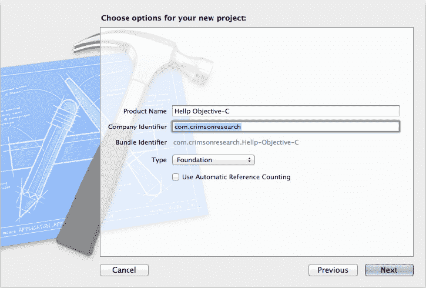
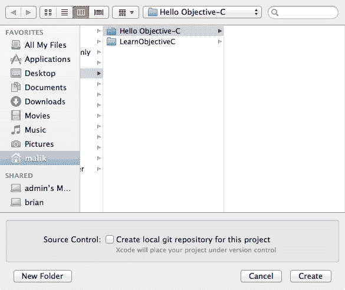
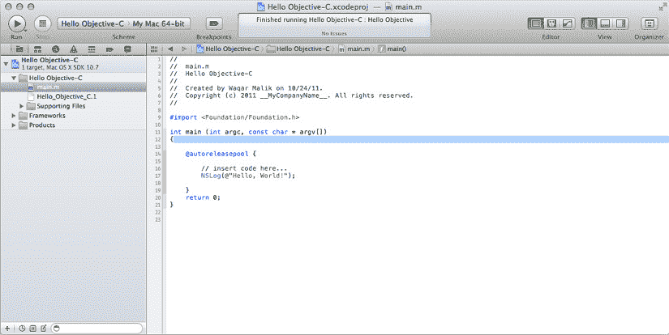
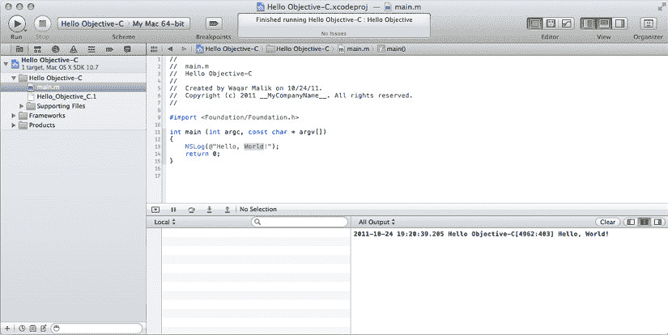

# 第 2 章

## C 语言的扩展

Objective-C 无非是 C 语言加上一些额外的特性——它非常棒！在本章中，我们将带你构建你的第一个 Objective-C 程序（以及第二个），并在此过程中介绍一些关键的扩展特性。

## 最简单的 Objective-C 程序

你可能见过经典 C 语言版本的 Hello World 程序，它会输出 “Hello, world!” 或类似的精辟语句。Hello World 通常是 C 语言新手学习的第一个程序。我们不想打破传统，所以我们将编写一个类似的程序，名为 Hello Objective-C。

### 构建 Hello Objective-C

在阅读本书的过程中，我们假设你已经安装了 Apple 的 `Xcode` 工具。如果你还没有 `Xcode`，或者以前从未使用过它，Dave Mark 的 *Learn C on the Mac*（Apress 2008）一书的 第 2 章 中有一个精彩章节，会引导你完成使用 `Xcode` 获取、安装和创建程序的步骤。

在本节中，我们将逐步介绍使用 `Xcode` 创建你的第一个 Objective-C 项目的过程。如果你已经熟悉 `Xcode`，请随意跳过；我们不会介意。但在继续之前，请确保解压本书归档文件中的 Learn ObjC Projects 归档（你可以从 Apress 网站的 Source Code/Download 页面下载）。该项目位于 `02.01 - Hello Objective-C` 文件夹中。

要创建项目，请首先启动 `Xcode`。你可以在 `/Developer/Applications` 中找到 `Xcode` 应用程序。我们将 `Xcode` 图标放在 Dock 中以便快速访问。你可能也想这样做。


好的，作为一名高级文档工程师和翻译员，我将严格遵循您提供的注意事项和示例格式，将给定的英文文本翻译成中文。


Xcode 启动完成后，您会看到欢迎界面，如图 2-1 所示。在左侧，您可以选择接下来要执行的操作。或者，您也可以从右侧的列表中选择打开一个最近的项目。（如果您是 Xcode 新手，则不会看到任何最近的项目。）如果您没有看到欢迎界面，您始终可以通过选择“窗口”菜单上的“欢迎使用 Xcode”或键入 1 来显示它。



图 2-1. Xcode 欢迎界面

在欢迎界面上，点击“创建一个新的 Xcode 项目”（参见图 2-1），或者直接选择“文件”“新建”“新建项目”。Xcode 会显示一个列表，列出它可以创建的各种项目类型。请集中注意力，忽略其中大多数引人入胜的项目类型，然后在窗口的左侧选择“应用程序”，在右侧选择“命令行工具”，如图 2-2 所示。点击“下一步”。



图 2-2. 创建一个新的命令行工具

在下一个界面（图 2-3）上，您将为新项目选择选项。对于“产品名称”，请输入经典的“Hello Objective-C”。对于“公司标识符”，您通常会输入公司或网站名称的逆向 DNS 版本，例如 `com.mywebsite`；目前，您可以只输入 `com.thinkofsomethingclever`。



图 2-3. 设置您的项目选项

此界面将最重要的选项留到了最后：即您要创建的命令行工具的类型：请确保选择“Foundation”。完成后，您的界面应该与图 2-3 非常相似。完成此操作后，点击“下一步”。

Xcode 会弹出一个表单，询问您保存项目的位置（参见图 2-4）。为了保持条理清晰，我们将它保存在我们的一个项目目录中，但您可以将其保存在任何您想要的地方。



图 2-4. 为新的 Foundation 工具命名

点击“保存”后，Xcode 会显示其主窗口，称为项目窗口（参见图 2-5）。此窗口显示组成项目的各个部分以及一个编辑窗格。`main.m` 是包含 Hello Objective-C 代码的源文件。



图 2-5. Xcode 的主窗口

`main.m` 包含样板代码，由 Xcode 为每个新项目友好地提供。我们可以使我们的 Hello Objective-C 应用程序比 Xcode 提供的示例更简单一些。删除 `main.m` 中的所有内容，并将其替换为以下代码：

```
#import <Foundation/Foundation.h>

int main (int argc, const char *argv[])

{

NSLog (@"Hello, Objective-C!");

return (0);

} // main
```

如果您现在还看不懂所有这些代码，请不要担心。我们很快就会逐行详细地讲解这个程序。

如果无法将源代码变成可运行的程序，那就没什么乐趣了。通过点击“运行”按钮或按下  **R** 来构建并运行程序。如果没有令人头疼的语法错误，Xcode 会编译、链接您的程序，然后运行它。打开 Xcode 控制台窗口（通过选择“视图”“调试区域”“激活控制台”或按下 **C**），它会显示程序的输出，如图 2-6 所示。



图 2-6. 运行 Hello Objective-C

好了，您已经完成了：您的第一个可运行的 Objective-C 程序。恭喜！让我们来剖析它，看看它是如何工作的。

## 解构 Hello Objective-C

以下是 `main.m` 的内容，再次列出：

```
#import <Foundation/Foundation.h>

int main (int argc, const char *argv[])

{

NSLog (@"Hello, Objective-C!");

return (0);

} // main
```

Xcode 使用 `.m` 扩展名来指示一个包含 Objective-C 代码的文件，并将由 Objective-C 编译器处理。以 `.c` 结尾的文件由 C 编译器处理，而 `.cpp` 文件则由 C++ 编译器处理。（在 Xcode 中，默认情况下所有编译都由 LLVM 编译器处理），这是一个能理解这三种语言变体的单一编译器。

`main` 文件包含两行代码，如果您已经熟悉纯 C 语言，应该会对它们很熟悉：`main()` 的声明和末尾的 `return (0)` 语句。请记住，Objective-C 本质上就是 C 语言，声明 `main()` 和返回值的语法与 C 语言相同。其余的代码看起来与常规 C 语言略有不同。例如，那个古怪的 `#import` 是什么？要了解，请继续阅读！

**注意** 当 Objective-C 首次被引入时，`.m` 扩展名最初代表“消息”（messages），指的是 Objective-C 的一个核心特性，我们将在后续章节中讨论。如今，我们只是称它们为“点-m 文件”。

### 那个古怪的 `#import` 玩意儿

与 C 语言一样，Objective-C 也使用**头文件**来保存诸如结构体、符号常量和函数原型等元素的声明。在 C 语言中，您使用 `#include` 语句来告知编译器它应该查阅某个头文件以获取一些定义。您也可以在 Objective-C 程序中出于相同目的使用 `#include`，但您可能永远不会这样做。相反，您会使用 `#import`，像这样：

```
#import <Foundation/Foundation.h>
```

`#import` 是 Xcode 使用的编译器提供的一个特性，当您编译 Objective-C、C 和 C++ 程序时，Xcode 都会使用它。`#import` 保证一个头文件只会被包含一次，无论该文件的 `#import` 指令被看到多少次。

**注意** 在 C 语言中，程序员通常使用基于 `#ifdef` 指令的方案来避免一个文件包含第二个文件，然后第二个文件递归地又包含了第一个文件的情况。在 Objective-C 中，程序员使用 `#import` 来实现相同的效果。

`#import <Foundation/Foundation.h>` 语句告诉编译器查找 Foundation 框架中的 `Foundation.h` 头文件。

### 框架简介

什么是框架？很高兴您问到点上了。**框架** 是一组部件的集合——头文件、库、图像、声音等等——被整合到一个单元中。Apple 将诸如 Cocoa、Carbon、QuickTime 和 OpenGL 等技术作为一组组的框架来提供。Cocoa 由一对框架组成：Foundation 和 Application Kit（也称为 AppKit），以及一套辅助框架，包括 Core Animation 和 Core Image，这些框架为 Cocoa 添加了各种很酷的功能。

Foundation 框架处理用户界面层之下的功能，例如数据结构和通信机制。本书中的所有程序都基于 Foundation 框架。

**注意** 读完本书后，您成为 Cocoa 大师的下一步就是掌握 Cocoa 的 Application Kit，它包含了 Cocoa 的高级特性：用户界面元素、打印、颜色和声音管理、AppleScript 支持等等。要了解更多信息，请查阅 Jack Nutting、David Mark 和 Jeff LaMarche 合著的 *Learn Cocoa on the Mac*（Apress 出版，2010 年）。


每个框架都是一组重要的技术集合，通常包含数十甚至上百个头文件。每个框架都有一个主头文件，它包含了该框架的所有独立头文件。通过对主头文件使用 `#import`，你就能访问该框架的所有功能。

Foundation 框架的头文件占用了近兆字节的磁盘存储空间，包含超过 14,000 行代码，分散在上百个文件中。当你使用 `#import <Foundation/Foundation.h>` 引入主头文件时，你就获得了整个庞大的集合。你可能会认为，为每个文件都遍历所有这些文本会耗费编译器大量时间，但 Xcode 非常智能：它通过使用**预编译头文件**来加快此任务——这是一种经过压缩和提炼的头文件格式，当你 `#import` 它时，能快速加载。

如果你好奇 Foundation 框架包含了哪些头文件，可以窥探其 *Headers* 目录（`/System/Library/Frameworks/Foundation.framework/Headers/`）。浏览其中的文件不会有任何破坏；只是不要移除或修改任何内容。

## `NSLog()` 与 `@"strings"`

既然我们已经对 Foundation 框架的主头文件使用了 `#import`，现在就可以编写利用一些 Cocoa 特性的代码了。Hello Objective-C 中第一行（也是唯一）真正的代码使用了 `NSLog()` 函数，如下所示：

`NSLog (@"Hello, Objective-C!");`

这行代码会在控制台打印 “Hello, Objective-C!”。如果你曾经使用过 C 语言，肯定在编程旅途中遇到过 `printf()`。`NSLog()` 是一个 Cocoa 函数，其工作方式与 `printf()` 非常相似。

就像 `printf()` 一样，`NSLog()` 将字符串作为其第一个参数。这个字符串可以包含格式说明符（例如 `%d`），并且该函数会接收与格式说明符匹配的额外参数。`printf()` 在打印前会将这些额外参数填入字符串中。

正如我们之前所说，Objective-C 就是在 C 语言基础上添加了一点“特色酱料”，所以如果你愿意，完全可以使用 `printf()` 来代替 `NSLog()`。但我们仍然推荐使用 `NSLog()`，因为它增加了诸如时间戳和日期戳等功能，并且会自动为你追加换行符（`'\n'`）。

## NS 前缀：防止名称冲突的良方

你可能会觉得 `NSLog()` 这个函数名有点奇怪。那个 “NS” 到底是怎么回事？原来，Cocoa 为其所有函数、常量和类型名称都加上了 “NS” 前缀。这个前缀告诉你该函数来自 Cocoa，而非其他工具包。

该前缀有助于防止**名称冲突**——即当同一个标识符被用于两个不同的东西时产生的严重问题。如果 Cocoa 将此函数命名为 `Log()`，那么它很可能与某个无辜程序员创建的 `Log()` 函数发生名称冲突。当包含 `Log()` 的程序与 Cocoa 一起构建时，Xcode 会报错说 `Log()` 被多次定义，从而带来麻烦。

既然你明白了使用前缀是个好主意，你可能会对具体的选择产生疑问：例如，为什么是 “NS” 而不是 “Cocoa”？嗯，“NS” 前缀的历史可以追溯到该工具包被称为 NextSTEP、并作为 NeXT 软件公司（前身为 NeXT, Inc.）产品的时代，该公司于 1996 年被 Apple 收购。为了不破坏已为 NextSTEP 编写的代码的兼容性，Apple 只是继续使用了 “NS” 前缀。现在这算是一个历史趣闻，就像你的阑尾一样。

Cocoa 已经将 “NS” 前缀据为己有，因此显然，你不应该为你自己的任何变量或函数名添加 “NS” 前缀。如果这样做了，你会让你的代码阅读者感到困惑，让他们误以为你的东西属于 Cocoa。此外，如果将来 Apple 恰好向 Cocoa 添加了一个与你同名的函数，你的代码可能会出问题。目前没有一个集中式的前缀注册表，所以你可以选择自己的前缀。许多人会使用自己姓名首字母或公司名称作为前缀。为了让我们的例子更简单一些，本书中的代码将不会使用前缀。

## `NSString`：其中的 `@`

让我们再看一下那个 `NSLog()` 语句：`NSLog (@"Hello, Objective-C!");`

你注意到字符串前面的 at 符号 (`@`) 了吗？这可不是通过我们警惕的编辑之手的笔误。这个 at 符号是 Objective-C 在标准 C 基础上添加的特性之一。在双引号前带有 at 符号的字符串，意味着该引号内的字符串应被视为一个 Cocoa `NSString` 元素。

那么什么是 `NSString` 元素呢？将名称上的 “NS” 前缀剥离，就会看到一个熟悉的术语：“String”。你已经知道字符串是一个字符序列，通常是人类可读的，因此你大概能猜到（并且猜对了）`NSString` 就是 Cocoa 中的字符序列。

`NSString` 元素中集成了大量功能，每当需要字符串时，Cocoa 都会使用它。以下是 `NSString` 能做的几件事：

*   告诉你它的长度
*   与另一个字符串进行比较
*   将其自身转换为整数或浮点数值

这可比 C 风格字符串能做的事情多得多。我们将在第 8 章中更多地使用和探索 `NSString` 元素。

一个容易犯的错误是将 C 风格字符串传递给 `NSLog()`，而不是使用那些高级的 `NSString` `@"strings"` 元素。如果你这样做，编译器会给你一个警告：

```
main.m:46: warning: passing arg 1 of 'NSLog' from incompatible pointer type
```

如果你运行这个程序，它可能会崩溃。为了捕捉此类问题，你可以告诉 Xcode 始终将警告视为错误。要做到这一点，在项目导航器中选择项目文件，在 targets（目标）下选择 Hello Objective-C，然后选择 Build Settings（构建设置）标签，在搜索框中输入 *error*，并勾选 Treat Warnings as Errors（将警告视为错误）复选框，如下图所示。同时确保顶部的 Configuration（配置）弹出菜单设置为 All（全部）。

**注意这些字符串**

关于 `NSString` 还有另一个很酷的事实：其名称本身就突显了 Cocoa 的一个优秀特性。大多数 Cocoa 元素的命名都非常直接，力求描述它们实现的功能。例如，`NSArray` 提供数组；`NSDateFormatter` 帮助你以不同方式格式化日期；`NSThread` 为你提供多线程编程工具；而 `NSSpeechSynthesizer` 则让你能够听到语音。

现在，我们将回到逐步解析小程序的过程中。程序的最后一行是返回语句，它结束了 `main()` 的执行并完成程序：

`return (0);`

返回的零值表示我们的程序成功完成。这正是 C 语言中 return 语句的工作方式。

再次恭喜！你刚刚完成了第一个 Objective-C 程序的编写、编译、运行和剖析。

## 你是布尔类型吗？

许多语言都有布尔类型，这当然是一个用于存储真（true）和假（false）值的变量的高级术语。Objective-C 也不例外。

C 语言有一个布尔数据类型 `bool`，它可以取值为 `true` 和 `false`。Objective-C 提供了一个类似的类型 `BOOL`，它可以取值为 `YES` 和 `NO`。顺便提一下，Objective-C 的 `BOOL` 类型比 C 语言的 `bool` 类型早了十多年。这两种不同的布尔类型可以在同一个程序中共存，但当你在编写 Cocoa 代码时，你将使用 `BOOL`。


**注意**：Objective-C 中的 `BOOL` 实际上只是有符号字符类型（`signed char`）的一个类型定义（`typedef`），占用 8 位存储空间。`YES` 被定义为 `1`，`NO` 被定义为 `0`（通过 `#define` 实现）。

Objective-C 并未将 `BOOL` 视为只能存储 `YES` 或 `NO` 值的真正布尔类型。编译器将 `BOOL` 视为一个 8 位数，而 `YES` 和 `NO` 的值仅代表一种约定。这会导致一个微妙的陷阱：如果你不小心将一个超过 1 字节长度的整数值（例如 `short` 或 `int` 类型值）赋给 `BOOL` 变量，那么只有最低字节会被用于 `BOOL` 的值。如果该字节恰好为零（例如 `8960`，其十六进制表示为 `0x2300`），则 `BOOL` 值将为零，即 `NO` 值。

## 强大的 `BOOL` 实战演示

为了展示强大的 `BOOL` 在实际中的应用，我们进入下一个项目 `02.02 - BOOL Party`，该项目通过比较整数对来判断它们是否不同。除了 `main()` 函数外，程序还定义了两个函数。第一个函数 `areIntsDifferent()` 接收两个整数值并返回一个 `BOOL`：如果整数不同则返回 `YES`，相同则返回 `NO`。第二个函数 `boolString()` 接收一个 `BOOL` 参数，如果参数是 `YES` 则返回字符串 `@"YES"`，如果是 `NO` 则返回 `@"NO"`。当需要打印人类可读的 `BOOL` 值表示时，这个函数非常方便。`main()` 使用这两个函数来比较整数并打印结果。

创建 `BOOL Party` 项目的过程与创建 `Hello Objective-C` 项目完全相同：

1.  如果 Xcode 尚未运行，请启动它。
2.  选择 File  New  New Project。
3.  在左侧选择 *Application*，在右侧选择 *Command Line Tool*。
4.  点击 *Next*。
5.  将项目名称输入为 `BOOL Party`，然后点击 Next。
6.  点击 *Create*。

编辑 `main.m` 文件，使其内容如下：

```
#import <Foundation/Foundation.h>

// 如果两个整数具有相同的值则返回 NO，否则返回 YES
BOOL areIntsDifferent (int thing1, int thing2)
{
    if (thing1 == thing2) {
        return (NO);
    } else {
        return (YES);
    }
} // areIntsDifferent

// 给定 NO 值，返回人类可读的字符串 "NO"，否则返回 "YES"
NSString *boolString (BOOL yesNo)
{
    if (yesNo == NO) {
        return (@"NO");
    } else {
        return (@"YES");
    }
} // boolString

int main (int argc, const char *argv[])
{
    BOOL areTheyDifferent;

    areTheyDifferent = areIntsDifferent (5, 5);
    NSLog (@"are %d and %d different? %@",
           5, 5, boolString(areTheyDifferent));

    areTheyDifferent = areIntsDifferent (23, 42);
    NSLog (@"are %d and %d different? %@",
           23, 42, boolString(areTheyDifferent));

    return (0);
} // main
```

构建并运行程序。你需要调出控制台来查看输出，可以通过选择 View  Debug Area  Activate Console，或使用键盘快捷键 `R`。你应该会看到类似如下的输出：

```
2012-01-20 16:47:09.528 02 BOOL Party[16991:10b] are 5 and 5 different? NO
2012-01-20 16:47:09.542 02 BOOL Party[16991:10b] are 23 and 42 different? YES

The Debugger has exited with status 0.
```

同样，让我们逐个函数地解析这个程序，看看具体发生了什么。

### 第一个函数

我们要分析的第一个函数是 `areIntsDifferent()`。

```
BOOL areIntsDifferent (int thing1, int thing2)
{
    if (thing1 == thing2) {
        return (NO);
    } else {
        return (YES);
    }
} // arelntsDifferent
```

`areIntsDifferent()` 函数接收两个整数参数并返回一个 `BOOL` 值。这个语法你应该从 C 语言的经验中已经很熟悉了。这里，你可以看到 `thing1` 与 `thing2` 进行比较。如果它们相同，则返回 `NO`（因为它们没有不同）。如果它们不同，则返回 `YES`。这很直观，对吧？

### 不再上当

有经验的 C 语言程序员可能会尝试将 `areIntsDifferent()` 函数写成单个语句：

```
BOOL areIntsDifferent_faulty (int thing1, int thing2)
{
```


```c
return (thing1 - thing2);

} // areIntsDifferent_faulty
```

他们会在假设非零值等同于`YES`的前提下进行操作。但事实并非如此。没错，在 C 语言看来，这个函数返回的值确实是真或假，但调用返回`BOOL`类型函数的程序员会期望返回`YES`或`NO`。如果程序员像下面这样使用该函数，将会失败，因为 23 减 5 等于 18：

```c
if (areIntsDifferent_faulty(23, 5) == YES) {
  // ….
}
```

虽然上述函数在 C 语言中返回一个真值，但在 Objective-C 中它并不等于`YES`（即值为 1）。

最佳实践是永远不要直接将`BOOL`值与`YES`比较，因为过于聪明的程序员有时会耍类似于`areIntsDifferent_faulty()`的花招。相反，应该像这样编写前面的`if`语句：

```c
if (areIntsDifferent_faulty(5, 23)) {
  // ….
}
```

直接与`NO`比较始终是安全的，因为在 C 语言中，假值只有一个：零。

## 第二个函数

第二个函数`boolString()`将数字型`BOOL`值映射为人类可读的字符串：

```objectivec
NSString *boolString (BOOL yesNo)
{
  if (yesNo == NO) {
    return (@"NO");
  } else {
    return (@"YES");
  }
} // boolString
```

函数中间的`if`语句并不意外。它只是将`yesNo`与常量`NO`进行比较，如果相等则返回`@"NO"`。否则，`yesNo`必须是一个真值，因此返回`@"YES"`。

请注意，`boolString()`的返回类型是指向`NSString`的指针。这意味着该函数返回一个你在初次接触`NSLog()`时见过的华丽的 Cocoa 字符串。如果你查看返回语句，会看到返回值前面有 at 符号，这清楚地表明它们是`NSString`类型的值。

## `main()`函数

`main()`是最后一个函数。在声明了`main()`的返回类型和参数之后，有一个局部的`BOOL`变量：

```objectivec
int main (int argc, const char *argv[])
{
  BOOL areTheyDifferent;
```

`areTheyDifferent`变量保存`areIntsDifferent()`返回的`YES`或`NO`值。我们当然可以直接在`if`语句中使用函数的`BOOL`返回值，但添加这样一个额外的变量来让代码更易读也无妨。深层嵌套的结构往往令人困惑且难以理解，并且是 Bug 容易隐藏的地方。

### 比较本身

接下来的两行代码使用`areIntsDifferent()`比较两个整数，并将返回值存入`areTheyDifferent`变量中。`NSLog()`打印出数值以及由`boolString()`返回的人类可读字符串：

```objectivec
areTheyDifferent = areIntsDifferent (5, 5);
NSLog (@"are %d and %d different? %@",
        5, 5, boolString(areTheyDifferent));
```

如你之前所见，`NSLog()`本质上是一个 Cocoa 风格的`printf()`函数，它接受一个格式字符串，并使用额外参数的值来替换格式说明符。你可以看到，两个 5 将替换我们调用`NSLog()`时的两个`%d`格式占位符。

在我们提供给`NSLog()`的字符串末尾，你会看到另一个 at 符号。这次是`%@`。这是怎么回事？`boolString()`返回一个`NSString`指针。`printf()`不知道如何处理`NSString`，因此没有我们可以使用的格式说明符。`NSLog()`的创建者添加了`%@`格式说明符，以指示`NSLog()`获取相应的参数，将其视为`NSString`，使用该字符串中的字符，并将其输出到控制台。

> **注意：** 我们还没有正式向你介绍对象，但这里先剧透一下：当你使用`NSLog()`打印任意对象的值时，你会使用`%@`格式说明符。当你使用这个说明符时，对象会通过一个名为`description`的方法提供其自身的`NSLog()`格式。`NSString`的`description`方法只是简单地打印字符串的字符。

接下来的两行与你刚才看到的非常相似：

```objectivec
areTheyDifferent = areIntsDifferent (23, 42);
NSLog (@"are %d and %d different? %@",
        23, 42, boolString(areTheyDifferent));
```

该函数比较了值 23 和 42。这一次，由于它们不同，`areIntsDifferent()`返回`YES`，用户将看到文本表明 23 和 42 是不同的值，这是一项重大发现。

最后是返回语句，这将结束我们的 BOOL 派对：

```objectivec
  return (0);
} // main
```

在这个程序中，你看到了 Objective-C 的`BOOL`类型，以及用于指示真值和假值的常量`YES`和`NO`。你可以像使用`int`和`float`等类型一样使用`BOOL`：作为变量、函数参数和函数返回值。

## 总结

在本章中，你编写了最初的两个 Objective-C 程序，这很有趣！你还了解了一些 Objective-C 对语言的扩展，例如`#import`，它告诉编译器引入头文件且仅引入一次。你学习了`NSString`字面量，即前面带有 at 符号的字符串，比如`@"hello"`。你使用了重要且多功能的`NSLog()`，这是 Cocoa 提供的用于向控制台写入文本的函数，以及`NSLog()`的特殊格式说明符`%@`，它允许你将`NSString`值插入到`NSLog()`的输出中。你还获得了一个秘密知识：当你在代码中看到 at 符号时，你就知道你在看 Objective-C 对 C 语言的扩展。最后，你学习了 Objective-C 的`BOOL`类型。

敬请期待下一章，我们将进入面向对象编程的神秘世界。

---

