# 排版后的文本

由于我们将单词直接存储在了程序中，因此不得不编辑源码，用新名称替换原始单词列表。编辑时需特别注意标点符号，例如乔·鲍勃名字中的引号，以及条目间的逗号。以下是更新后的程序，位于`03.05 Word-Length-2`文件夹中：

```
#import <Foundation/Foundation.h>

int main (int argc, const char * argv[])

{

const char *words[4] = { "Joe-Bob \"Handyman\" Brown",

"Jacksonville \"Sly\" Murphy",

"Shinara Bain",

"George \"Guitar\" Books" };

int wordCount = 4;

for (int i = 0; i < wordCount; i++) {

NSLog (@"%s is %lu characters long", words[i], strlen(words[i]));

}

return (0);

} // main
```

由于我们修改时足够谨慎，程序仍能按预期运行（请注意空格和标点符号也算作字符）：

```
Joe-Bob "Handyman" Brown is 24 characters long
Jacksonville "Sly" Murphy is 25 characters long
Shinara Bain is 12 characters long
George "Guitar" Books is 21 characters long
```

完成这一改动需要大量工作：我们必须编辑`Word-Length-2.m`，修正任何拼写错误，然后重新构建程序。如果程序运行在网站上，我们还需要重新测试并重新部署才能升级到`Word-Length-2`。

构建该程序的另一种方法，是将所有名称完全移出代码，放入一个文本文件中，每行一个名称。让我们一起说：这就是间接性。程序不再将名称直接写在源代码中，而是从其他地方查找名称。程序从文本文件中读取名称列表，然后逐个打印出来及其长度。这个新程序的项目文件位于`03.06 Word-Length-3`文件夹中，代码如下：

```
#import <Foundation/Foundation.h>

int main (int argc, const char * argv[])

{

FILE *wordFile = fopen ("/tmp/words.txt", "r");

char word[100];

while (fgets(word, 100, wordFile))

{

// 移除末尾的换行符 \n

word[strlen(word) - 1] = '\0';

NSLog (@"%s is %lu characters long", word, strlen(word));

}

fclose (wordFile);

return (0);

} // main
```

我们来梳理一下`Word-Length-3`的运作方式。首先，`fopen()`以只读模式打开`words.txt`文件。接着，`fgets()`从文件中读取一行文本并放入`word`中。`fgets()`调用会保留分隔每行的换行符，但我们并不需要它：如果保留，它会被计入单词的字符数。为了解决这个问题，我们将换行符替换为表示字符串结束的零字符。最后，使用我们的老朋友`NSLog()`打印出单词及其长度。

**注意** 请查看我们与`fopen()`一起使用的路径名：`/tmp/words.txt`。这意味着`words.txt`是一个位于`/tmp`目录（Unix 临时目录）中的文件，该目录在计算机重启时会被清空。您可以使用`/tmp`来存放想摆弄但无需保留的临时文件。对于真正的实际程序，您应该将文件放在更持久的位置，例如用户主目录。

在运行程序之前，请使用文本编辑器在`/tmp`目录中创建`words.txt`文件。将以下名称输入文件：

```
Joe-Bob "Handyman" Brown
Jacksonville "Sly" Murphy
Shinara Bain
George "Guitar" Books
```

要从文本编辑器将文件保存到`/tmp`目录，请输入文件文本，选择“保存”，按下斜杠键（`/`），输入`tmp`，然后按回车键。

如果您愿意，也可以不从`03.06 Word-Length-3`目录中复制`words.txt`文件到`/tmp`，而是直接键入名称。要在访达中查看`/tmp`，请选择“前往” “前往文件夹”。

**提示** 如果您使用的是我们预构建的`Word-Length-3`项目，我们已经施展了一点 Xcode 魔法，自动为您将`words.txt`文件复制到了`/tmp`。看看您能否发现我们是怎么做的。这里有一个提示：查看“组与文件”面板中的“目标”区域。

当您运行`Word-Length-3`时，程序输出看起来和之前一样：

```
Joe-Bob "Handyman" Brown is 24 characters long
Jacksonville "Sly" Murphy is 25 characters long
Shinara Bain is 12 characters long
George "Guitar" Books is 21 characters long
```

`Word-Length-3`是间接性的一个绝佳例子。您不再将单词直接编码到程序中，而是说：“去`/tmp/words.txt`查找单词。”通过这种方案，我们只需编辑这个文本文件，就可以随时更改单词集，而无需修改程序。请亲自动手试试：在您的`words.txt`文件中添加几个单词，然后重新运行程序。我们在这儿等着您。

这种方法更好，因为文本文件比源代码更容易编辑，也远不那么脆弱。您可以让非程序员朋友使用 TextEdit 来进行编辑。您的市场人员可以随时更新单词列表，这样您就能腾出手来处理更有趣的任务。

如您所知，人们总会提出升级或增强程序的新想法。也许您的投资者已经决定，计算烹饪术语的长度是新的盈利途径。现在，您的程序从文件中读取数据，您就可以随意更改单词集，而无需触及代码。

尽管在间接性方面取得了巨大进步，`Word-Length-3`仍然相当脆弱，因为它坚持使用单词文件的完整路径名。而且该文件本身的位置也不稳定：如果计算机重启，`/tmp/words.txt`就会消失。此外，如果其他人也在您的机器上使用该程序，并使用他们自己的`/tmp/words.txt`文件，他们可能会意外覆盖您的副本。您可以每次都编辑程序以使用不同的路径，但我们知道这毫无乐趣可言，所以让我们再添加一点间接性技巧，让生活更轻松。

我们将修改程序，不再从`/tmp/words.txt`获取单词，而是告诉它“去查看程序的第一个启动参数，以确定单词文件的位置。”以下是`Word-Length-4`程序（位于`03.07 Word-Length-4`文件夹中）。它使用命令行参数来指定文件名。我们对`Word-Length-3`所做的更改已高亮显示：

```
#import <Foundation/Foundation.h>

int main (int argc, const char * argv[])

{

if (argc == 1) {

NSLog (@"you need to provide a file name");

return (1);

}

FILE *wordFile = fopen (argv[1], "r");

char word[100];

while (fgets(word, 100, wordFile))

{

// 移除末尾的换行符 \n

word[strlen(word) - 1] = '\0';

NSLog (@"%s is %lu characters long", word, strlen(word));

}

fclose (wordFile);

return (0);

} // main
```

处理文件的循环与`Word-Length-3`相同，但设置代码是全新改进的。`if`语句验证用户是否提供了作为启动参数的路径名。代码查阅传给`main()`的`argc`参数，该参数保存了启动参数的数量。由于程序名称总是作为启动参数传递，`argc`总是大于或等于 1。如果用户没有传递文件路径，`argc`的值为 1，我们就没有文件可读，因此会打印一条错误信息并停止程序。

如果用户考虑周到地提供了文件路径，`argc`就会大于 1。然后我们查看`argv`数组，找出该文件路径。`argv[1]`包含了用户给我们的文件名。（如果您好奇，`argv[0]`参数保存的是程序名称。）

如果您在终端中运行程序，很容易在命令行指定文件名，如下所示：

```
$ ./Word-Length-4 /tmp/words.txt
Joe-Bob "Handyman" Brown is 24 characters long
Jacksonville "Sly" Murphy is 25 characters long
Shinara Bain is 12 characters long
George "Guitar" Books is 21 characters long
```

## 在 Xcode 中提供文件路径


好的，作为高级文档工程师和翻译员，我将严格按照您提供的注意事项和示例格式，对给定的英文文本进行翻译。

译文如下：


如果您在 Xcode 中跟随我们一起编辑程序，那么运行程序时提供文件路径会稍微复杂一些。**启动参数**（也称为**命令行参数**）在 Xcode 中比在终端中更难控制。以下是更改启动参数所需执行的操作：

首先，在 Xcode 中，选择 Product  > Edit Scheme，然后点击 Arguments 标签页。

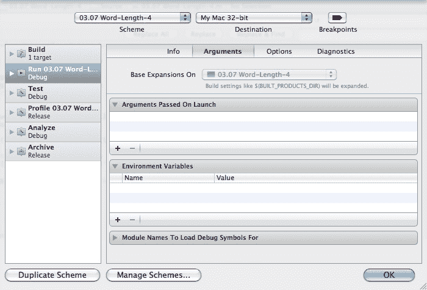

**图 3-1.** Arguments 标签页

接下来，如下一张屏幕截图所示，点击“Arguments Passed On Launch”部分的加号，然后输入启动参数——在本例中，输入`words.txt`文件的路径：

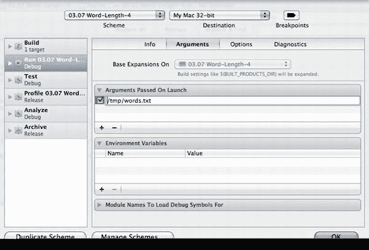

图 3-2. Arguments Passed On Launch

现在，当您运行程序时，Xcode 会将您的启动参数传递到`Word-Length-4`的`argv`数组中。运行程序后，您将看到以下内容：

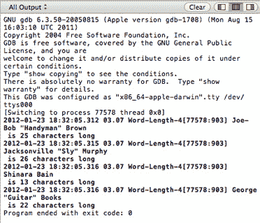

图 3-3. `argv`数组输出

只是为了好玩，请用`/usr/share/dict/words`来运行您的程序，该文件包含超过 230，000 个单词。您的程序可以处理海量数据！当您厌倦了在 Xcode 控制台窗口中看着单词飞速闪过时，可以点击“停止”按钮来终止程序。

由于您在运行时提供了参数，每个人都可以使用您的程序来获取任何单词集的长度，即使是荒谬的大单词集也是如此。用户无需更改代码即可更改数据，正如自然所设计的那样。这就是间接性的本质：它告诉我们在哪里获取所需的数据。

## 在面向对象编程中使用间接性

面向对象编程全是关于间接性的。OOP 使用间接性来访问数据，就像我们在之前的示例中使用变量、文件和参数所做的那样。OOP 真正的革命在于它使用间接性来*调用代码*。您不是直接调用函数，而是间接地调用它。

现在您明白了这一点，您就是 OOP 方面的专家了。其他一切都只是这种间接性的副作用。

## 过程式编程

为了完整地领略 OOP 的灵活性，我们将快速了解一下过程式编程，这样您就能明白 OOP 是为了解决哪些问题而创建的。过程式编程已经存在了非常非常久远的时间，几乎可以追溯到事物的发明之后。过程式编程是典型的入门编程书籍和课程中教授的类型。大多数使用 BASIC、C、Tcl 和 Perl 等语言编写的程序都是过程式的。

在过程式程序中，数据通常保存在简单的结构中，例如 C 语言的`struct`元素。也存在更复杂的数据结构，例如链表和树。当您调用一个函数时，您将数据传递给该函数，然后函数对数据进行操作。函数是过程式编程体验的核心：您决定要使用哪些函数，然后调用这些函数，并传入它们所需的数据。

## 待绘制图形的形状

考虑一个在屏幕上绘制一堆几何形状的程序。多亏了计算机的魔力，您不仅可以思考它——您可以在`03.08 Shapes-Procedural`文件夹中找到该程序的源代码。为简单起见，`Shapes-Procedural`程序实际上不会在屏幕上绘制形状，它只是有趣地打印出一些与形状相关的文本。我们省略了实际绘制形状的代码，因为这会增加复杂性并分散我们期望的重点，即编写一个程序来处理几种以类似方式处理的元素。

`Shapes-Procedural`使用了纯 C 语言和过程式编程风格。代码首先定义一些常量和结构体。


```content
在必需的 foundation 头文件之后，是一个枚举，列出了可以绘制的基本形状：圆形、矩形和蛋形实体：

```objc
#import <Foundation/Foundation.h>

typedef enum {
    kCircle,
    kRectangle,
    kEgg
} ShapeType;
```

接下来是一个枚举，定义了绘制形状时可以使用的颜色：

```objc
typedef enum {
    kRedColor,
    kGreenColor,
    kBlueColor
} ShapeColor;
```

然后，我们有一个描述矩形的结构体，它指定了形状在屏幕上绘制的区域。对于本章的示例，我们不关心这个矩形具体如何用于放置每种形状，只关心它最终能以某种方式实现即可。

```objc
typedef struct {
    int x, y, width, height;
} ShapeRect;
```

最后，我们有一个结构体，它将所有要素组合在一起，用于描述一个形状：

```objc
typedef struct {
    ShapeType type;
    ShapeColor fillColor;
    ShapeRect bounds;
} Shape;
```

## 执行工作的部分

在我们示例的后续部分，`main()` 声明了一个我们将要绘制的形状数组。声明数组后，通过赋值其字段来初始化数组中的每个形状结构体。以下代码创建了一个红色圆形、一个绿色矩形和一个蓝色蛋形，它们位于不同的随机位置：

```objc
int main (int argc, const char * argv[])
{
    Shape shapes[3];

    ShapeRect rect0 = { 0, 0, 10, 30 };
    shapes[0].type = kCircle;
    shapes[0].fillColor = kRedColor;
    shapes[0].bounds = rect0;

    ShapeRect rect1 = { 30, 40, 50, 60 };
    shapes[1].type = kRectangle;
    shapes[1].fillColor = kGreenColor;
    shapes[1].bounds = rect1;

    ShapeRect rect2 = { 15, 18, 37, 29 };
    shapes[2].type = kEgg;
    shapes[2].fillColor = kBlueColor;
    shapes[2].bounds = rect2;

    drawShapes (shapes, 3);
    return (0);
} // main
```

## 一个方便的 C 语言快捷方式

`Shapes-Procedural` 程序的 `main()` 方法中的矩形是使用一个方便的 C 语言小技巧声明的：当你声明一个结构体变量时，可以一次性初始化该结构体的所有元素。

```objc
ShapeRect rect0 = { 0, 0, 10, 30 };
```

结构体元素按照它们声明的顺序获取值。回想一下，`ShapeRect` 是这样声明的：

```objc
typedef struct {
    int x, y, width, height;
} ShapeRect;
```

上述对 `rect0` 的赋值意味着 `rect0.x` 和 `rect0.y` 的值都将为 `0`；`rect0.width` 将为 `10`；而 `rect0.height` 将为 `30`。

这种技术让你可以在不牺牲可读性的前提下，减少程序中的打字量。

初始化 `shapes` 数组后，`main()` 调用 `drawShapes()` 函数来绘制形状。

`drawShapes()` 中有一个循环，用于检查数组中的每个 `Shape` 结构体。一个 `switch` 语句查看结构体的 `type` 字段，并选择一个绘制该形状的函数。程序调用相应的绘图函数，传入绘制所用的屏幕区域和颜色参数。请看：

```objc
void drawShapes (Shape shapes[], int count)
{
    for (int i = 0; i < count; i++) {
        switch (shapes[i].type) {
            case kCircle:
                drawCircle (shapes[i].bounds,
                            shapes[i].fillColor);
                break;
            case kRectangle:
                drawRectangle (shapes[i].bounds,
                               shapes[i].fillColor);
                break;
            case kEgg:
                drawEgg (shapes[i].bounds,
                         shapes[i].fillColor);
                break;
        }
    }
} // drawShapes
```

以下是 `drawCircle()` 的代码，它仅打印出传入的边界矩形和颜色：

```objc
void drawCircle (ShapeRect bounds, ShapeColor fillColor)
{
    NSLog (@"drawing a circle at (%d %d %d %d) in %@",
           bounds.x, bounds.y,
           bounds.width, bounds.height,
           colorName(fillColor));
} // drawCircle
```

在 `NSLog()` 内部调用的 `colorName()` 函数，只是对传入的颜色值执行一个 `switch` 判断，并返回一个如 `@"red"` 或 `@"blue"` 之类的字面量 `NSString`：

```objc
NSString *colorName (ShapeColor colorName)
{
    switch (colorName) {
        case kRedColor:
            return @"red";
            break;
        case kGreenColor:
            return @"green";
            break;
        case kBlueColor:
            return @"blue";
            break;
    }
    return @"no clue";
} // colorName
```

其他绘图函数与 `drawCircle` 几乎相同，区别在于它们分别绘制矩形和蛋形。

以下是 `Shapes-Procedural` 的输出（不包括 `NSLog()` 添加的时间戳和其他信息）：

```
drawing a circle at (0 0 10 30) in red
```


绘制一个矩形`(30 40 50 60)`，颜色为绿色

绘制一个椭圆`(15 18 37 29)`，颜色为蓝色

这一切看起来都非常简单直接，对吧？当你使用过程式编程时，你会花时间将数据与专门处理该类型数据的函数连接起来。你必须小心地为每种数据类型使用正确的函数：例如，你必须调用`drawRectangle()`来处理类型为`kRectangle`的形状。将一个矩形传递给一个本该处理圆形的函数是过于容易发生的。

像这样的编码还有另一个问题，即它会使得程序的扩展和维护变得困难。为了说明这一点，让我们增强`Shapes-Procedural`，添加一种新的形状：三角形。你可以在*03.09 Shapes-Procedural-2*项目中找到修改后的程序。为了完成这个任务，我们至少需要在四个不同的地方修改程序。

首先，我们将在`ShapeType`枚举中添加一个`kTriangle`常量：

```c
typedef enum {
   kCircle,
   kRectangle,
   kEgg,
   kTriangle
} ShapeType;
```

然后，我们将实现一个`drawTriangle()`函数，它看起来与它的同类函数完全相同：

```c
void drawTriangle (ShapeRect bounds,
                   ShapeColor fillColor)
{
   NSLog (@"drawing triangle at (%d %d %d %d) in %@",
          bounds.x, bounds.y,
          bounds.width, bounds.height,
          colorName(fillColor));
} // drawTriangle
```

接下来，我们将在`drawShapes()`的`switch`语句中添加一个新的`case`分支。这将检查`kTriangle`并在适当的情况下调用`drawTriangle()`：

```c
void drawShapes (Shape shapes[], int count)
{
   for (int i = 0; i < count; i++) {
      switch (shapes[i].type) {
         case kCircle:
            drawCircle (shapes[i].bounds, shapes[i].fillColor);
            break;
         case kRectangle:
            drawRectangle (shapes[i].bounds, shapes[i].fillColor);
            break;
         case kEgg:
            drawEgg (shapes[i].bounds, shapes[i].fillColor);
            break;
         case kTriangle:
            drawTriangle (shapes[i].bounds, shapes[i].fillColor);
            break;
      }
   }
} // drawShapes
```

最后，我们将在`shapes`数组中添加一个三角形。别忘了增加`shapes`数组中的形状数量：

```c
int main (int argc, const char * argv[])
{
   Shape shapes[4];
   ShapeRect rect0 = { 0, 0, 10, 30 };
   shapes[0].type = kCircle;
   shapes[0].fillColor = kRedColor;
   shapes[0].bounds = rect0;
   ShapeRect rect1 = { 30, 40, 50, 60 };
   shapes[1].type = kRectangle;
   shapes[1].fillColor = kGreenColor;
   shapes[1].bounds = rect1;
   ShapeRect rect2 = { 15, 18, 37, 29 };
   shapes[2].type = kEgg;
   shapes[2].fillColor = kBlueColor;
   shapes[2].bounds = rect2;
   ShapeRect rect3 = { 47, 32, 80, 50 };
   shapes[3].type = kTriangle;
   shapes[3].fillColor = kRedColor;
   shapes[3].bounds = rect3;
   drawShapes (shapes, 4);
   return (0);
} // main
```

好了，让我们看看`Shapes-Procedural-2`的实际运行效果：

绘制一个圆形`(0 0 10 30)`，颜色为红色

绘制一个矩形`(30 40 50 60)`，颜色为绿色

绘制一个椭圆`(15 18 37 29)`，颜色为蓝色

绘制一个三角形`(47 32 80 50)`，颜色为红色

添加对三角形的支持并不算太糟，但我们的小程序只做一种操作——绘制形状（或者至少是打印关于绘制形状的文本）。程序越复杂，扩展起来就越棘手。例如，假设程序对形状做了更多的处理；假设它计算它们的面积并判断鼠标指针是否位于它们内部。在这种情况下，你必须修改所有对形状执行操作的函数，接触那些一直运行良好的代码，并可能引入错误。

另一个充满风险的情景是：添加一个需要更多信息来描述的新形状。例如，圆角矩形需要其他形状都不需要的信息：其圆角的半径。为了支持圆角矩形，你可以向`Shape`结构体添加一个`radius`字段，但这会浪费空间，因为该字段不会被其他形状使用；或者你可以使用 C 语言的联合体在同一结构体中叠加不同的数据布局，这会使所有形状都需要深入到联合体中才能获取它们感兴趣的数据，从而让事情变得复杂。

面向对象编程（OOP）优雅地解决了这些问题。当我们教我们的程序使用 OOP 时，我们将看到 OOP 如何处理第一个问题，即修改已经运行的代码以添加新的形状种类。

## 实现面向对象

过程式程序基于函数。数据围绕着函数转。面向对象则反转了这一观点，将程序的数据置于中心，让函数围绕着数据转。与其关注程序中的函数，不如将注意力集中在数据上。

这听起来很有趣，但它如何工作呢？在 OOP 中，数据通过间接寻址包含了对操作它的代码的引用。与其告诉`drawRectangle()`函数“使用这个形状结构体去绘制一个矩形”，不如要求一个矩形“去绘制你自己”（天哪，这听起来很粗鲁，但确实如此）。通过间接寻址的神奇魔力，矩形的数据知道如何找到执行绘制的函数。

那么对象到底是什么？它不过是一个花哨的 C 语言结构体，能够找到与之关联的代码，通常是通过一个函数指针。 图 3-4 展示了四个`Shape`对象：两个矩形、一个圆形和一个椭圆。每个对象都能够找到一个函数来执行其绘制。

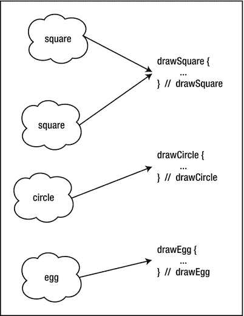

图 3-4. 基本形状对象

每个对象都有自己的`draw()`函数，该函数知道如何“绘制”其特定的形状。例如，一个圆形对象的`draw()`知道如何绘制圆形。一个矩形的`draw()`知道如何绘制矩形。

`Shapes-Object`程序（位于*03.10 -Shapes-Object*）执行与`Shapes-Procedural`相同的功能，但使用了 Objective-C 的面向对象特性来实现。这是来自`Shapes-Object`的`drawShapes()`：

```objc
void drawShapes (id shapes[], int count)
{
   for (int i = 0; i < count; i++) {
      id shape = shapes[i];
      [shape draw];
   }
} // drawShapes
```

这个函数包含一个循环，遍历数组中的每个形状。在循环中，程序告诉形状绘制自身。

注意这个版本的`drawShapes()`与原始版本之间的差异。首先，这个版本短得多！代码不必询问每个单独的形状它是什么类型。

另一个变化是`shapes[]`，函数的第一个参数：它现在是一个`id`对象的数组。什么是`id`？它是一个心理学术语，指代心灵中先天本能冲动和初级过程得以显现的那部分吗？在这个上下文中并非如此：它代表**identifier**（标识符），发音为“eye dee”。`id`是一种通用类型，用于指代任何类型的对象。回想一下，对象只是一个带有一些附加代码的 C 结构体，所以`id`实际上是指向这些结构体之一的指针；在这种情况下，这些结构体构成了各种形状。

`drawShapes()`的第三个变化是循环体：

```objc
id shape = shapes[i];
[shape draw];
```

第一行看起来像普通的 C 代码。代码从`shapes`数组中获取`id`——即指向对象的指针——并将其存入名为`shape`的变量中，该变量的类型是`id`。这只是一个指针赋值：它实际上并没有复制形状的全部内容。看看 图 3-5 ，了解`Shapes-Object`中可用的各种形状。`shapes[0]`是指向红色圆形的指针；`shapes[1]`是指向绿色矩形的指针；`shapes[2]`是指向蓝色椭圆的指针。

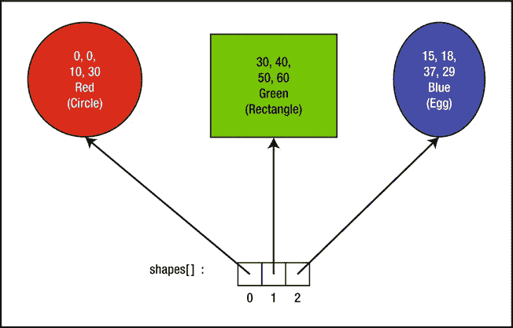

图 3-5. `shapes`数组

现在我们来到了函数中的最后一行代码：

```objc
[shape draw];
```


这相当奇怪。到底是怎么回事？我们知道 `C` 语言使用方括号来引用数组元素，但这里似乎并未涉及数组操作。在 Objective-C 中，方括号还有另一层含义：它们用于向对象发送指令。方括号内的第一个条目是对象，其余部分是你希望该对象执行的操作。在这个例子中，我们让名为 `shape` 的对象执行 `draw` 操作。如果 `shape` 是一个圆形，那么一个圆形就会被“绘制”。如果 `shape` 是一个矩形，我们就会得到一个矩形。

在 Objective-C 中，让对象执行某个操作被称为**发送消息**（尽管有些人也称之为“调用方法”）。代码 `[shape draw]` 将消息 `draw` 发送给对象 `shape`。`[shape draw]` 的一种读法是“向 shape 发送 draw”。`shape` 具体如何执行绘制操作，取决于 `shape` 自身的实现。

当你向对象发送消息时，所需的代码是如何被调用的？这需要在幕后辅助角色（称为**类**）的协助下完成。

请看一下图 3-6。图的左侧显示，这是 `shapes` 数组中索引为零的圆形对象，它最后一次出现在图 3-2 中。该对象包含一个指向其类的指针。类是一种结构，它描述了如何成为该类的一个对象。在图 3-3 中，`Circle` 类包含一个指向绘制圆形代码、计算圆形面积代码以及其他必要代码的指针，以便成为一个合格的 `Circle` 对象。

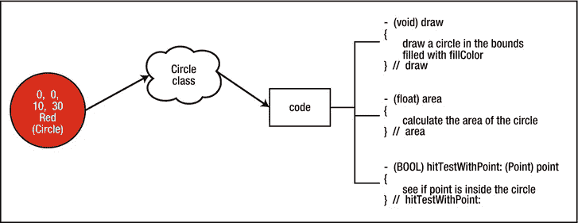

图 3-6。圆形及其类

拥有类对象的意义何在？让每个对象直接指向其代码岂不是更简单？确实，这会更简单，一些面向对象编程系统正是这样做的。但拥有类对象有一个巨大优势：如果你在运行时修改了类，该类的所有对象都会自动应用这些更改（我们将在后续章节中详细讨论这一点）。

图 3-7 展示了 `draw` 消息如何最终为圆形对象调用正确的函数。

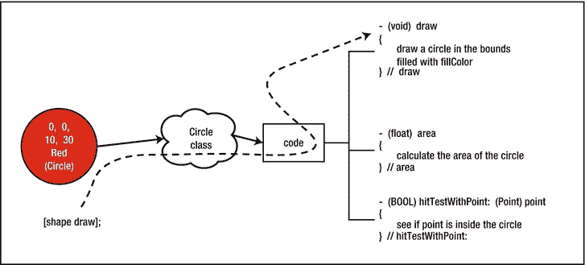

图 3-7。圆形找到其绘制代码。

以下是图 3-4 中所展示的步骤：

1.  首先检查作为消息目标的对象（此处为红色圆形），找出它属于哪个类。
2.  该类在其代码中查找 `draw` 函数的位置。
3.  找到后，执行用于绘制圆形的函数。

图 3-8 展示了当你对数组中的第二个形状（即绿色矩形）调用 `[shape draw]` 时会发生什么。

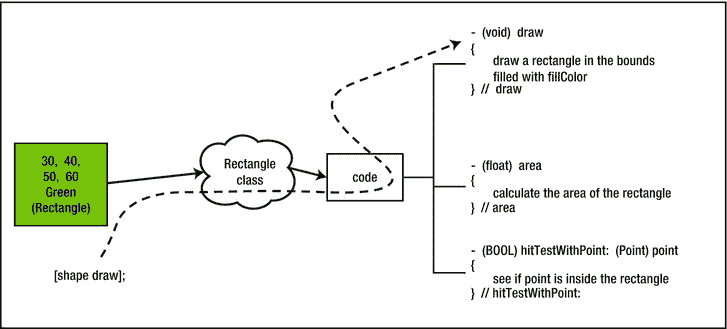

图 3-8。矩形找到其绘制代码。

图 3-5 中使用的步骤与上图几乎相同：

1.  首先检查消息的目标对象（绿色矩形），找出它属于哪个类。
2.  矩形类在其代码库中查找，获取 `draw` 函数的地址。
3.  Objective-C 运行用于绘制矩形的代码。

这个程序展示了非常酷的间接操作！在程序的函数式版本中，我们必须编写代码来决定调用哪个函数。而现在，这个决策由 Objective-C 在幕后做出，它通过询问对象属于哪个类来完成。这降低了调用错误函数的可能性，并使我们的代码更易于维护。

## 术语小憩

在我们深入研究 `Shapes-Object` 程序的其余部分之前，让我们花点时间回顾一些面向对象编程的术语。我们已经讨论过其中一些术语；其他术语则是全新的。

*    `类` — **类**是一种表示对象类型的结构。对象通过引用其类来获取关于自身的各种信息，特别是处理每个操作时要运行的代码。简单的程序可能只有少数几个类；中等复杂度的程序可能有几十个类。Objective-C 的风格建议开发者将类名首字母大写。
*    `对象` — **对象**是一种包含值以及指向其类的隐藏指针的结构。运行中的程序通常有成百上千个对象。引用对象的 Objective-C 变量通常首字母不大写。
*    `实例` — **实例**是“对象”的另一种说法。例如，一个圆形对象也可以被称为 `Circle` 类的一个实例。
*    `消息` — **消息**是对象可以执行的一个操作。你通过向对象发送消息来指示它执行某个动作。在 `[shape draw]` 代码中，`draw` 消息被发送给 `shape` 对象，告诉它绘制自身。当一个对象收到消息时，会查询其类以找到要运行的适当代码。
*    `方法` — **方法**是针对消息而运行的代码。同一个消息（例如 `draw`）可以根据对象的类不同而调用不同的方法。
*    `方法调度器` — **方法调度器**是 Objective-C 用于判断针对特定消息将执行哪个方法的机制。我们将在下一章中深入挖掘 Objective-C 的方法调度机制。

这些是你阅读本书后续内容所需的关键面向对象编程术语。此外，还有一些通用的编程术语很快就会变得非常重要：

*    `接口` — **接口**是对某类对象所提供功能的描述。例如，`Circle` 类的接口声明了圆形对象可以接受 `draw` 消息。

**注** 接口的概念并不仅限于面向对象编程。例如，在 `C` 语言中，头文件为标准 I/O 库（通过 `#include <stdio.h>` 获得）和数学库（`#include <math.h>`）等库提供了接口。接口不提供实现细节，通常的理念是你无需关心它们。

*    `实现` — **实现**是使接口生效的代码。在我们的示例中，圆形对象的实现包含了在屏幕上绘制圆形的代码。当你向圆形对象发送 `draw` 消息时，你不需要知道也不关心该函数是如何工作的，只需要知道它能在屏幕上绘制一个圆形即可。

## Objective-C 中的面向对象编程

如果你的大脑现在开始感到吃力，这很正常。我们一直在往里面灌输大量新知识，消化所有这些术语和技术需要一些时间。在你的潜意识默默消化前几节内容的同时，让我们来看看 `Shapes-Object` 程序的其余代码，其中包括一些用于声明类的新语法。

### `@interface` 部分

在创建特定类的对象之前，Objective-C 编译器需要了解该类的一些信息。具体来说，它必须知道对象的数据成员（即该对象的 `C struct` 长什么样）以及它提供了哪些功能。你使用 `@interface` 指令将这些信息提供给编译器。

**注** 在 `Shapes-Object` 中，我们把所有内容都放在了它的 *Shapes-Object.m* 文件中。在更大的程序中，你会使用多个文件，为每个类提供自己的一组文件。我们将在第 6 章探讨组织类和文件的方法。

以下是 `Circle` 类的接口：

```
@interface Circle : NSObject

{
@private
ShapeColor fillColor;
ShapeRect bounds;
}

- (void) setFillColor: (ShapeColor) fillColor;
```


```objc
- (void) setBounds: (ShapeRect) bounds;

- (void) draw;

@end // Circle
```

这段代码包含了一些我们尚未讨论过的语法，让我们来逐一讲解。这几行代码中包含了大量信息，我们逐行拆解分析。

第一行代码如下：

```objc
@interface Circle : NSObject
```

正如我们在第 2 章中所说，每当你在 Objective-C 中看到 `@` 符号时，你看到的就是对 C 语言的扩展。`@interface Circle` 告诉编译器：“接下来是一个名为 `Circle` 的新类的接口。”

**注意**：`@interface` 行中的 `NSObject` 告诉编译器 `Circle` 类是基于 `NSObject` 类的。这句话表明每个 Circle 对象同时也是 NSObject 对象，并且每个 Circle 对象都将继承 `NSObject` 类定义的所有行为。我们将在下一章更详细地探讨继承。

接下来是一些看起来类似于 C 函数原型的代码行：

```objc
- (void) draw;
- (void) setFillColor: (ShapeColor) fillColor;
- (void) setBounds: (ShapeRect) bounds;
```

在 Objective-C 中，这些被称为**方法声明**。它们很像传统的 C 函数原型，用来表示：“这是我支持的功能。”这些方法声明给出了每个方法的名称、返回类型以及任何参数。

让我们从最简单的 `draw` 方法开始：

```objc
- (void) draw;
```

前导短横线表示这是一个 Objective-C 方法的声明。这也是区分方法声明和函数原型的方式之一（函数原型没有前导短横线）。短横线之后是方法的返回类型，用括号括起来。在本例中，`draw` 方法只负责绘制图形，不返回任何内容。Objective-C 使用 `void` 表示没有返回值。

Objective-C 方法可以返回与 C 函数相同的类型：标准类型（`int`、`float` 和 `char`）、指针、对象引用以及结构体。

接下来的方法声明更有趣：

```objc
- (void) setFillColor: (ShapeColor) fillColor;
- (void) setBounds: (ShapeRect) bounds;
```

每个方法都接受一个参数。`setFillColor:` 接受一个颜色作为参数。Circle 对象在绘制自身时会使用这个颜色。`setBounds:` 接受一个矩形作为参数。Circle 对象使用这个矩形来定义其边界。

### 了解中缀表示法

Objective-C 使用一种称为**中缀表示法**的语法技巧。方法的名称及其参数是交织在一起的。例如，调用一个单参数的方法如下：

```objc
[circle setFillColor: kRedColor];
```

而接受两个参数的方法调用如下：

```objc
[textThing setStringValue: @"hello there" color: kBlueColor];
```

其中 `setStringValue:` 和 `color:` 是参数名称（实际上也是方法名的一部分——稍后会详细说明），而 `@"hello there"` 和 `kBlueColor` 则是传入的参数。

这种语法与 C 语言不同。在 C 语言中，你调用函数时，函数名后面跟着所有参数，像这样：

```c
setTextThingValueColor (textThing, @"hello there", kBlueColor);
```

我们非常喜欢中缀表示法，尽管它初看起来有点奇怪。它让代码非常易读，并且能轻松地将参数与其作用对应起来。使用 C 和 C++ 代码时，函数有时会有四五个参数，如果不查阅文档，很难确切知道每个参数的作用。

`setFillColor:` 声明以常见的短横线和括号内的返回类型开始：

```objc
- (void)
```

与 `draw` 方法一样，短横线表示“这是一个新方法的声明”。`(void)` 表示此方法不返回任何内容。我们继续查看代码：

```objc
setFillColor:
```

方法的名称是 `setFillColor:`。后面的冒号是名称的一部分。它向编译器和人类提示，接下来将有一个参数。

```objc
(ShapeColor) fillColor;
```

参数的类型在括号中指定，本例中是 `ShapeColor` 值之一（`kRedColor`、`kBlueColor` 等）。紧随其后的 `fillColor` 是参数名称。你可以在方法体中使用这个名称来引用该参数。通过选择有意义的参数名称（而不是以宠物或最喜欢的超级英雄命名），可以让代码更易于阅读。

### 冒号大集合

务必记住，冒号是方法名称中非常重要的一部分。方法：

```objc
- (void) scratchTheCat;
```

与以下方法不同：

```objc
- (void) scratchTheCat: (CatType) critter;
```

许多初学 Objective-C 的程序员经常犯的一个错误是在无参数的方法名称末尾随意添加冒号。遇到编译器错误时，你可能会忍不住多加一个冒号，希望它能解决问题。需要遵循的规则是：如果方法接受一个参数，它就有冒号；如果不接受参数，就没有冒号。

`setBounds:` 的声明与 `setFillColor:` 完全一样，只是参数类型是 `ShapeRect` 而不是 `ShapeColor`。

最后一行代码告诉编译器 `Circle` 类的声明已完成：

```objc
@end // Circle
```

尽管不是必须的，但我们建议在所有 `@end` 语句后添加注释注明类名。这样，当你滚动到文件末尾或查看长打印稿的最后一页时，就能轻松知道当前查看的是什么内容。

以上就是 `Circle` 类的完整接口。现在，任何阅读代码的人都知道，这个类有几个实例变量和三个方法。一个方法设置边界，一个方法设置颜色，第三个方法绘制图形。

接口部分完成后，接下来该编写使这个类真正发挥作用的代码了。你不会以为我们已经完成了吧？

## `@implementation` 部分

我们刚刚讨论的 `@interface` 部分定义了一个类的公共接口。这个接口通常被称为 API，是“应用程序编程接口”的三字母缩写（而 TLA 本身也是“三字母缩写”的三字母缩写）。让对象真正工作的实际代码位于 `@implementation` 部分。

以下是 `Circle` 类的完整实现：

```objc
@implementation Circle

- (void) setFillColor: (ShapeColor) c
{
    fillColor = c;
} // setFillColor

- (void) setBounds: (ShapeRect) b
{
    bounds = b;
} // setBounds
```

现在，我们以惯常的方式详细检查这段代码。`Circle` 的实现从这一行开始：

```objc
@implementation Circle
```

`@implementation` 是一个编译器指令，表示你即将提供类的内部实现代码。类的名称出现在 `@implementation` 之后。这行末尾没有分号，因为 Objective-C 的编译器指令不需要分号。

在开始声明一个新类之后，我们告诉编译器 Circle 对象需要的各种数据：

```objc
{
    ShapeColor fillColor;
    ShapeRect bounds;
}
```

花括号内的内容是一个模板，用于生成新的 `Circle` 对象。它表明当创建一个新的 `Circle` 对象时，该对象将由两个元素组成。第一个元素 `fillColor`（类型为 `ShapeColor`）是用于绘制 Circle 对象的颜色。第二个元素 `bounds` 是 Circle 对象的边界矩形，其类型为 `ShapeRect`。这个矩形决定了图形在屏幕上的绘制位置。再次强调，关键是矩形是图形数据的一部分；*如何*使用这些数据在此处并不重要。

你在类声明中指定了 `fillColor` 和 `bounds`。每次创建 `Circle` 对象时，它都包含这两个元素。因此，每个 `Circle` 类的对象都有自己的 `fillColor` 和 `bounds`。`fillColor` 和 `bounds` 值被称为 `Circle` 类对象的**实例变量**。

右花括号告诉编译器，我们已经完成了 `Circle` 实例变量的声明。


## 方法定义详解

各个方法的定义将在下文逐一介绍。这些方法的出现顺序不必与`@interface`指令中的声明顺序保持一致。你甚至可以在`@implementation`中定义那些在`@interface`中没有对应声明的方法。你可以将这些方法视为私有方法，仅供类的实现内部使用。

**注意**：你可能会认为，仅在`@implementation`指令中定义方法就能使其在实现外部不可访问，但事实并非如此。Objective-C 实际上并没有真正的私有方法。没有任何办法能将方法标记为私有，并阻止其他代码调用它。这是 Objective-C 动态特性的一个副作用。

`setFillColor:`是第一个被定义的方法：

```objectivec
- (void) setFillColor: (ShapeColor) c
{
    fillColor = c;
} // setFillColor
```

`setFillColor:`方法定义的第一行看起来与`@interface`部分中的声明非常相似。主要区别在于，这里的定义末尾没有分号。你可能注意到我们将参数重命名为`c`。在`@interface`和`@implementation`中，参数名可以不同。在本例中，如果我们保留参数名为`fillColor`，它将隐藏`fillColor`实例变量，并导致编译器产生警告。

**注意**：为什么我们必须重命名`fillColor`？我们已经在类中定义了一个名为`fillColor`的实例变量。在这个方法中，我们可以引用该变量——它处于作用域内。因此，如果我们再定义一个同名的变量，编译器将切断我们对实例变量的访问。使用相同的变量名会隐藏原始变量。我们通过为参数使用新名称来避免这个问题。我们也可以将实例变量命名为其他名称，例如`myFillColor`，然后保留`fillColor`作为参数名。正如你将在第 16 章中看到的，如果我们将实例变量命名为与方法名称相似的方式，Cocoa 可以施展一些魔法。

在`@interface`部分，我们使用方法声明中的`fillColor`，因为它能准确告知读者参数的用途。而在实现中，我们必须区分参数名和实例变量名，最简单的做法就是直接重命名参数。

方法体只有一行代码：

```objectivec
fillColor = c;
```

如果你特别好奇，可能会想知道实例变量存储在哪里。在 Objective-C 中调用方法时，会有一个名为`self`的秘密隐藏参数被传递给接收对象，该参数指向接收对象本身。例如，在代码`[circle setFillColor: kRedColor]`中，该方法将`circle`作为其`self`参数传递。由于`self`是秘密且自动传递的，你无需手动处理。在方法内部，引用实例变量的代码实际上是这样工作的：

```objectivec
self->fillColor = c;
```

顺便提一下，传递隐藏参数又是间接性的一种体现（你以为我们已经讲完间接性了，是吧？）。因为 Objective-C 运行时可以将不同的对象作为隐藏的`self`参数传递，所以它可以改变哪些对象的实例变量被修改。

**注意**：Objective-C 运行时是一段支持应用程序（包括我们的应用）在用户运行时执行的代码。运行时执行重要的任务，比如向对象发送消息和传递参数。从第 9 章开始，你将在后续章节中了解更多关于运行时的内容。

第二个方法`setBounds:`与我们的`setFillColor:`方法类似：

```objectivec
- (void) setBounds: (ShapeRect) b
{
    bounds = b;
} // setBounds
```

这段代码将圆形对象的边界矩形设置为传入的矩形。

最后一个方法是我们的`draw`方法。注意，方法名末尾没有冒号，这表明它不接受任何参数：

```objectivec
- (void) draw
{
    NSLog (@"drawing a circle at (%d %d %d %d) in %@",
           bounds.x, bounds.y,
           bounds.width, bounds.height,
```


`colorName(fillColor)`);

} // draw

`draw`方法使用隐藏的`self`参数来查找其实例变量的值，就像`setFillColor:`和`setBounds:`所做的那样。这个方法接着使用`NSLog()`来打印文本，供所有人查看。

其他类（`Rectangle`和`Egg`）的`@interface`和`@implementation`与`Circle`的几乎完全相同。

## 实例化对象

现在，我们准备好进入`Shapes-Object`最后、也是最核心的部分了。在这里，我们将创建可爱的形状对象，例如红色的圆形和绿色的矩形。这个过程的高大上术语是**实例化**。当你实例化一个对象时，首先会分配内存，然后将该内存初始化为一些有用的默认值——也就是不同于刚分配的内存中那些随机值。当分配和初始化步骤完成后，我们就说一个新的**实例**已被创建。

**注意** 由于对象的局部变量特定于该对象的实例，我们称它们为实例变量，通常简称为“`ivars`”。

要创建一个新对象，我们向感兴趣的类发送`new`消息。一旦类接收并处理了`new`消息，我们就有了一个新的对象实例可供使用。

Objective-C 的一个精巧特性是，你可以将类像对象一样对待并发送消息给它。这对于不绑定到特定对象、而是面向整个类的行为非常有用。此类消息的最佳示例就是分配一个新对象。当你想要一个新的圆形时，向`Circle`类请求该新对象是合适的，而不是向一个已有的圆形对象请求。

以下是`Shapes-Object`的`main()`函数，它创建了圆形、矩形和蛋形：

```
int main (int argc, const char * argv[])
{
    id shapes[3];
    ShapeRect rect0 = { 0, 0, 10, 30 };
    shapes[0] = [Circle new];
    [shapes[0] setBounds: rect0];
    [shapes[0] setFillColor: kRedColor];
    ShapeRect rect1 = { 30, 40, 50, 60 };
    shapes[1] = [Rectangle new];
    [shapes[1] setBounds: rect1];
    [shapes[1] setFillColor: kGreenColor];
    ShapeRect rect2 = { 15, 19, 37, 29 };
    shapes[2] = [Egg new];
    [shapes[2] setBounds: rect2];
    [shapes[2] setFillColor: kBlueColor];
    drawShapes (shapes, 3);
    return (0);
} // main
```

你可以看到，`Shapes-Object`的`main()`与`Shapes-Procedural`的非常相似。不过有几个区别。`Shapes-Object`没有使用形状数组，而是使用了一个`id`元素数组（你可能还记得，`id`是指向任何类型对象的指针）。你通过向要创建的对象的类发送`new`消息来创建单个对象：

```
shapes[0] = [Circle new];
...
shapes[1] = [Rectangle new];
...
shapes[2] = [Egg new];
```

另一个区别是，`Shapes-Procedural`通过直接赋值结构体成员来初始化对象。而`Shapes-Object`则不直接操作对象。相反，`Shapes-Object`使用消息来请求每个对象设置其边界矩形和填充颜色：

```
[shapes[0] setBounds: rect0]; [shapes[0] setFillColor: kRedColor];
[shapes[1] setBounds: rect1]; [shapes[1] setFillColor: kGreenColor];
[shapes[2] setBounds: rect2]; [shapes[2] setFillColor: kBlueColor];
```

在这场初始化狂欢之后，形状通过我们之前看到的`drawShapes()`函数绘制，如下所示：

```
drawShapes (shapes, 3);
```

## 扩展 Shapes-Object

还记得我们之前向`Shapes-Procedural`程序添加三角形的时候吗？让我们为`Shapes-Object`做同样的事情。这次的任务应该会整洁得多。你可以在*Learn ObjC Projects*的*03.11 Shapes-Object-2*文件夹中找到该项目的代码。

为了教`Shapes-Procedural-2`认识三角形，我们不得不做了很多事情：编辑`ShapeType`枚举、添加`drawTriangle()`函数、在形状列表中添加一个三角形、以及修改`drawShapes()`函数。其中一些工作是相当侵入性的，尤其是对`drawShapes()`进行的手术——我们不得不编辑控制所有形状绘制的循环，这潜在地引入了错误。

而对于`Shapes-Object-2`，我们只需要做两件事：创建一个新的`Triangle`类，然后在要绘制的对象列表中添加一个`Triangle`对象。

以下是`Triangle`类，它与`Circle`类完全一样，只是将所有出现的“`Circle`”改为了“`Triangle`”。（当然，我们只是打印文本而没有进行真正的绘制。如果我们真的在绘制，代码会更具辨识度。）

```
@interface Triangle : NSObject
{
    ShapeColor fillColor;
    ShapeRect bounds;
}
- (void) setFillColor: (ShapeColor) fillColor;
- (void) setBounds: (ShapeRect) bounds;
- (void) draw;
@end // Triangle

@implementation Triangle
- (void) setFillColor: (ShapeColor) c
{
    fillColor = c;
} // setFillColor

- (void) setBounds: (ShapeRect) b
{
    bounds = b;
} // setBounds

- (void) draw
{
    NSLog (@"drawing a triangle at (%d %d %d %d) in %@",
           bounds.x, bounds.y,
           bounds.width, bounds.height,
           colorName(fillColor));
} // draw
@end // Triangle
```

**注意** 像我们的`Triangle`类这种复制粘贴式编程的一个缺点是，它往往会产生大量重复的代码，比如`setBounds:`和`setFillColor:`方法。我们将在下一章向你介绍继承，这是避免此类冗余代码的好方法。

接下来，我们需要编辑`main()`以便创建新的三角形。首先，将`shapes`数组的大小从 3 改为 4，以便有足够的空间来存储新对象：

```
id shapes[4];
```

之后，添加一段代码来创建一个新的`Triangle`，就像我们创建新的`Rectangle`或`Circle`一样：

```
ShapeRect rect3 = { 47, 32, 80, 50 };
shapes[3] = [Triangle new];
[shapes[3] setBounds: rect3];
[shapes[3] setFillColor: kRedColor];
```

最后，使用`shapes`数组的新长度更新对`drawShapes()`的调用：

```
drawShapes (shapes, 4);
```

就这样。我们的程序现在认识三角形了：

```
drawing a circle at (0 0 10 30) in red
drawing a rectangle at (30 40 50 60) in green
drawing an egg at (15 19 37 29) in blue
drawing a triangle at (47 32 80 50) in red
```

请注意，我们能够在不触碰`drawShapes()`函数或任何其他处理形状的函数的情况下添加这个新功能。这就是面向对象编程的威力所在。

**注意** `Shapes-Object-2`中的代码体现了面向对象编程大师 Bertrand Meyer 的“开闭原则”（Open/Closed Principle），该原则指出软件实体应对扩展开放，对修改关闭。`drawShapes()`函数对扩展是开放的：只需在数组中添加一种新的形状对象即可绘制。`drawShapes()`对修改也是关闭的：我们可以在不修改它的情况下扩展它。遵循开闭原则的软件在面临变更时往往更加健壮，因为你不必编辑已经正确运行的代码。

## 总结

这一章内容充实、烧脑——包含了许多概念和想法——而且篇幅也很长。我们讨论了间接性的强大概念，并展示了你在程序中已经使用过间接性，例如在处理变量和文件时。然后，我们讨论了过程式编程，并向你展示了其“函数优先，数据其次”世界观所带来的一些限制。

我们介绍了面向对象编程，它利用间接性将数据与操作数据的代码紧密关联。这允许一种“数据优先，函数其次”的编程风格。我们讨论了消息，消息被发送给对象。对象通过执行方法来处理这些消息，这些代码块让对象“唱歌跳舞”。你还了解到每个方法调用都包含一个名为`self`的隐藏参数，它就是对象本身。方法通过使用这个`self`参数来查找和操作对象的数据。方法的实现和对象数据的模板由对象的类定义。你通过向类发送`new`消息来创建一个新对象。


# 第 4 章：继承

下一章我们将介绍继承，这项特性让你能够利用现有对象的行为，从而用更少的代码完成工作。嘿，听起来不错！我们到时候见！

## 继承

当你编写面向对象程序时（我们希望你会编写*大量*这类程序），你创建的类与对象之间会存在相互关系。它们协同工作，让程序实现其功能。

在处理类与对象之间的关系时，面向对象编程有两个最重要的方面。第一个是**继承**，也就是本章的主题。当你创建一个新类时，通常可以根据它相对于另一个已有类的差异来定义这个新类。通过继承，你可以定义一个拥有父类所有能力的类：它*继承*了这些能力。

另一种与相关类配合使用的面向对象编程技术是**组合**，在这种技术中，对象包含对其他对象的引用。例如，赛车模拟器中的汽车对象可能拥有四个轮胎对象，供其游戏过程中使用。当你的对象持有对其他对象的引用时，你就可以利用其他对象提供的功能：这就是组合。我们将在下一章介绍组合。

## 为什么要使用继承？

还记得上一章中我们那位老朋友 Shapes-Object 程序吗？它包含几个具有非常相似接口和实现的类。当然，它们之所以相似，是因为我们是通过复制粘贴来创建的。

我们将通过展示 `Circle` 和 `Rectangle` 类的接口来唤起你的记忆：

```objc
@interface Circle : NSObject
{
@private
    ShapeColor fillColor;
    ShapeRect bounds;
}
- (void) setFillColor:(ShapeColor)fillColor;
- (void) setBounds:(ShapeRect)bounds;
- (void) draw;
@end // Circle

@interface Rectangle : NSObject
{
@private
    ShapeColor fillColor;
    ShapeRect bounds;
}
- (void) setFillColor:(ShapeColor)fillColor;
- (void) setBounds:(ShapeRect)bounds;
- (void) draw;
@end // Rectangle
```

这些类的接口非常相似——非常，*非常*相似。事实上，除了类名之外，它们简直是双胞胎。

`Circle` 和 `Rectangle` 的实现也非常相似。回顾上一章，`setFillColor:` 和 `setBounds:` 在这两个类中是相同的：

```objc
@implementation Circle
- (void)setFillColor:(ShapeColor)c
{
    fillColor = c;
} // setFillColor

- (void)setBounds:(ShapeRect)b
{
    bounds = b;
} // setBounds
// …
@end // Circle

@implementation Rectangle
- (void) setFillColor: (ShapeColor) c
{
    fillColor = c; } // setFillColor

- (void)setBounds:(ShapeRect)b
{
    bounds = b;
} // setBounds
// …
@end // Rectangle
```

这些方法完成的工作完全相同；它们设置 `fillColor` 和 `bounds` 实例变量。然而，`Circle` 和 `Rectangle` 的实现并不完全相同。例如，`draw` 方法的签名（即方法名和参数）在两个类中相同，但实现不同：

```objc
@implementation Circle
// …
- (void) draw
{
    NSLog (@"drawing a circle at (%d %d %d %d) in %@",
           bounds.x, bounds.y,
           bounds.width, bounds.height,
           colorName(fillColor));
} // draw
@end // Circle

@implementation Rectangle
// …
- (void) draw
{
    NSLog (@"drawing rect at (%d %d %d %d) in %@",
           bounds.x, bounds.y,
           bounds.width, bounds.height,
           colorName(fillColor));
} // draw
@end // Rectangle
```

显然，Shapes-Object 在 `Circle` 和 `Rectangle` 类之间重复了大量代码和行为。图 4-1 是这些类的示意图。

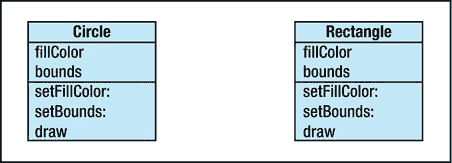

图 4-1. 无继承的 Shapes-Object 架构

**注意** 在图 4-1 中，类的名称位于每个框的顶部。中间部分给出实例变量，底部显示该类提供的方法。这种图由统一建模语言（UML）定义，是绘制类、其内容及其关系的常用方式。


图 4-1 中存在大量重复，这看起来效率极低。在编程中，这种重复往往意味着糟糕的架构。你需要维护两倍的代码量，修改代码时还需在两处（甚至更多）位置进行改动，这大大增加了引入错误的概率。若忘记在某个位置进行修改，就可能导致诡异的 Bug。

如果所有重复内容能整合到一处，岂不美哉？而如果我们还能在需要的地方（比如绘制圆形和矩形时）保留自定义方法的能力，那就更棒了。我们需要一种机制，能告诉编译器：“`Circle` 类就像另一个东西，只需稍微调整几处即可。”你可能已经猜到，恰好能满足这一需求的强大面向对象特性就是**继承**。

图 4-2 展示了引入继承后的架构。我们创建了一个全新的类 `Shape`，用于存放通用实例变量并声明方法。类 `Shape` 包含了 `setFillColor:` 和 `setBounds:` 的实现。

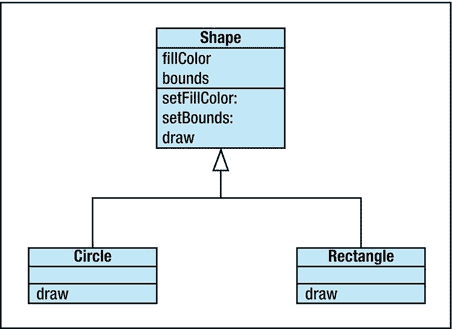

图 4-2 使用继承优化后的几何形状对象架构

**注** 如图 4-2 所示，末端带箭头的线条是 UML 中表示继承的方式。该线条展示了 `Circle` 与 `Shape` 之间，以及 `Rectangle` 与 `Shape` 之间的继承关系。

看看图 4-2 中我们焕然一新的 `Circle` 和 `Rectangle` 类。它们比以前精简了许多。所有通用元素都被提取到了 `Shape` 中。留在 `Circle` 和 `Rectangle` 中的，只剩下它们独特的元素，尤其是 `draw` 方法。现在我们说 `Circle` 和 `Rectangle` *继承*自 `Shape`。

就像你可能从亲生父母那里继承了发色、鼻形或使用 Mac 的偏好一样，面向对象编程中的继承意味着一个类从另一个类（其父类或**超类**）获取特性。`Circle` 和 `Rectangle` 因继承自 `Shape`，而获得了 `Shape` 的两个实例变量。

**注** 直接修改继承来的实例变量值被视为不良做法。请务必使用方法或属性来修改它们。

除了实例变量，继承也顺带提供了方法。每个 `Circle` 和 `Rectangle` 都知道如何响应 `setFillColor:` 和 `setBounds:`。它们从类 `Shape` 继承了这一能力。

## 继承语法

让我们看一下声明新类时使用的语法：`@interface Circle : NSObject`。

冒号后的标识符就是你要继承的类。在 Objective-C 中，你可以不继承任何类，但如果使用 Cocoa，你应该继承自 `NSObject`，因为它提供了许多有用的特性（当你继承自一个继承自 `NSObject` 的类时，你也能获得这些特性）。我们将在第 9 章讨论内存管理时详细介绍 `NSObject` 的特性。

### 单一继承

某些语言（如 C++）包含一种称为**多重继承**的特性，即一个类可以直接继承自两个或多个类。Objective-C 不支持多重继承。如果你试图在 Objective-C 中使用多重继承（可能类似下面的语句），编译器会非常不高兴：

`@interface Circle : NSObject, PrintableObject`

你可以通过使用 Objective-C 的其他特性（如分类，见第 12 章；以及协议，见第 13 章）来获得多重继承的许多好处。

既然你已经了解了继承，并且我们正在优化架构使类继承自 `Shape`，那么 `Circle` 和 `Rectangle` 的接口将变为如下所示（你可以在 *04.01 Shapes-Inheritance* 中找到此程序的代码）：

```  
@interface Circle : Shape  

@end // Circle  

@interface Rectangle : Shape  

@end // Rectangle  
```

没有比这更简洁的了。当代码简洁时，Bug 就无处藏身。

注意我们不再声明实例变量：它们作为继承的一部分来自 `Shape`。你可能会发现我们没有为缺失的实例变量包含花括号：如果没有实例变量，你可以省略花括号。我们也没有声明从 `Shape` 继承的方法（`setBounds:` 和 `setFillColor:`）。

现在，让我们看看使 `Shape` 生效的代码。以下是 `Shape` 的声明：

```  
@interface Shape : NSObject {  

ShapeColor fillColor;  

ShapeRect bounds;  

}  

- (void) setFillColor:(ShapeColor)fillColor;  

- (void) setBounds:(ShapeRect)bounds;  

- (void) draw;  

@end // Shape  
```

可以看到，`Shape` 将所有之前在不同类中重复的内容整洁地打包在一起。

`Shape` 的实现简洁且意料之中：

```  
@implementation Shape  

- (void)setFillColor:(ShapeColor)c  

{  

fillColor = c;  

} // setFillColor  

- (void)setBounds:(ShapeRect)b  

{  

bounds = b;  

} // setBounds  

- (void) draw  

{  

} // draw  

@end // Shape  
```

尽管 `draw` 方法没有做任何事情，我们仍然定义了它，以便 `Shape` 的所有子类都能实现自己的版本。方法定义中允许有空实现体，或返回一个虚拟值。

现在，让我们检查 `Circle` 的实现。你可能已经猜到，它现在简单多了：

```  
@implementation Circle  

- (void) draw  

{  

NSLog(@"drawing a circle at (%d %d %d %d) in %@", bounds.x, bounds.y, bounds.width,  

bounds.height, colorName(fillColor));  

} // draw  

@end // Circle  
```

以下是新的、简化的 `Rectangle` 实现：

```  
@implementation Rectangle  

- (void)draw  

{  

NSLog(@"drawing rect at (%d %d %d %d) in %@",  

bounds.x, bounds.y,  

bounds.width, bounds.height,  

colorName(fillColor));  

} // draw  

@end // Rectangle  
```

`Triangle` 和 `Egg` 类也同样变得更加精简。详情请查看 *04.01 Shapes-Inheritance* 文件夹。

现在你可以运行 `Shapes-Inheritance`，会发现它和之前运行得一模一样。注意一个有趣的事实：我们完全没有改动 `main()` 中设置和使用对象的代码。这是因为我们没有改变对象响应的方法，也没有修改它们的行为。

**注** 这种移动和简化代码的方式称为**重构**，这是面向对象社区中非常流行的做法。重构时，你移动代码以改善架构（就像我们在这里消除重复代码一样），而不改变代码的行为或结果。典型的开发周期包括向代码添加一些功能，然后进行重构以消除重复。

你可能会惊讶地发现，面向对象程序在*添加*新功能后往往会变得更简单——这正是我们添加 `Shapes` 类时发生的情况。

## 术语小憩

没有新术语要学，还算什么新技术？以下是掌握继承概念所需的词汇：


-    **超类（superclass）** 是你继承的类。`Circle` 的超类是 `Shape`。`Shape` 的超类是 `NSObject`。
-   **父类（Parent class）** 是“超类”的另一种说法。例如，`Shape` 是 `Rectangle` 的父类。
-   **子类（subclass）** 是执行继承的类。`Circle` 是 `Shape` 的子类，`Shape` 是 `NSObject` 的子类。
-   **子类（Child class）** 是“子类”的另一种说法。`Circle` 是 `Shape` 的子类。你可以选择使用 `subclass`/`superclass` 或 `parent class`/`child class`。在现实中你可能会遇到这两对术语。在本书中，我们使用 superclass 和 subclass，大概是因为我们比“父母”更书呆子气。
-   当你想要改变一个继承方法的实现时，你 **重写（override）** 它。`Circle` 有自己的 `draw` 方法，所以我们说它重写了 `draw`。当代码运行时，Objective-C 会确保调用被重写方法的正确类的实现。

## 继承如何工作

我们对 `Shapes-Object` 进行了大手术，将 `Circle` 和 `Rectangle` 中的所有代码取出并移入 `Shape`。很酷的是，程序的其余部分无需修改仍能工作。在 `main()` 中创建和初始化所有不同形状的代码没有改变，`drawShapes()` 函数也是一样，但程序仍然能工作：

```
drawing a circle at (0 0 10 30) in red
drawing a rect at (30 40 50 60) in green
drawing an egg at (15 19 37 29) in blue
drawing a triangle at (47 32 80 50) in red
```

在这里，你可以看到 OOP 力量的另一个方面：你可以对程序进行彻底的更改，如果足够小心，完成后一切仍能正常工作。当然，你也可以用过程式编程做到这一点，但使用 OOP 成功率通常更高。

## 方法分发

对象在接收消息时如何知道要运行哪个方法？例如，`setFillColor:` 的代码已经从 `Circle` 和 `Rectangle` 类中移出，那么当你向一个 `Circle` 对象发送 `setFillColor:` 时，`Shape` 代码如何知道该做什么？秘密在于：当代码发送消息时，Objective-C 方法分发器会在当前类中查找该方法。如果分发器在接收消息的对象所属的类中没有找到该方法，它就会去该对象的超类中查找。

Figure 4-3 展示了在我们程序的旧版（`Shape` 之前）中，代码向 `Circle` 对象发送 `setFillColor:` 消息时的方法分发过程。为了处理像 `[shape setFillColor:kRedColor]` 这样的代码，Objective-C 方法分发器会查看接收消息的对象；在本例中，它是一个 `Circle` 类的对象。该对象有一个指向其类的指针，而该类有一个指向其代码的指针。分发器使用这些指针来找到要运行的正确代码。

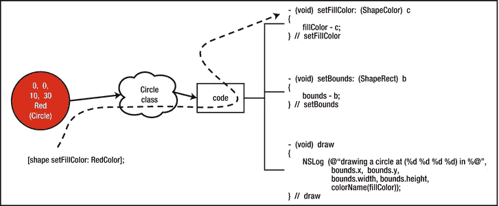

Figure 4-3. 没有继承的方法分发

请看 Figure 4-4，它展示了我们时髦的、强化了继承的新结构。在这段代码中，`Circle` 类有一个指向其超类 `Shape` 的引用。当消息到来时，Objective-C 方法分发器使用这个信息来找到方法的正确实现。

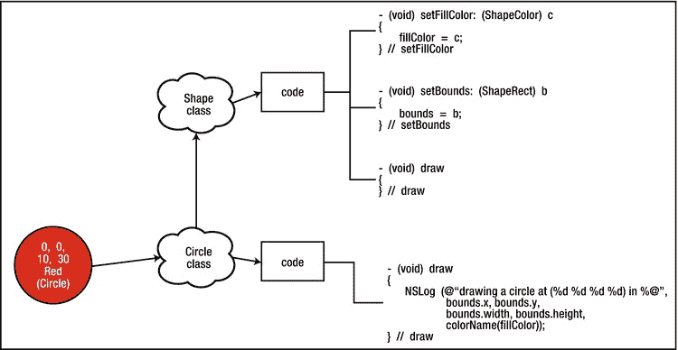

Figure 4-4. 继承和类代码

Figure 4-5 展示了涉及继承时的方法分发过程。当你向 `Circle` 对象发送 `setFillColor:` 消息时，分发器首先查询 `Circle` 类，看它是否能用自己代码响应 `setFillColor:`。在本例中，答案是否定的：分发器发现 `Circle` 没有 `setFillColor:` 的定义，于是去超类 `Shape` 中查找。分发器然后在 `Shape` 中搜索并找到了 `setFillColor:` 的定义，然后运行那段代码。

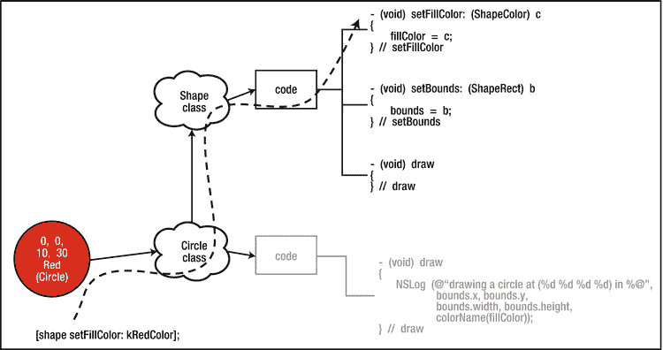

Figure 4-5. 带继承的方法分发

这种“我在这里找不到，所以我去超类里找”的动作，会根据需要在继承链中的每个类上重复。如果在 `Circle` 或 `Shape` 类中都找不到某个方法，分发器会检查 `NSObject` 类，因为它是链中的下一个超类。如果该方法在超类中最顶层的 `NSObject` 中也不存在，你会得到一个运行时错误（并且你在编译时也会得到一个警告）。

## 实例变量

我们已经讨论了方法如何响应消息而被调用。现在，让我们看看 Objective-C 如何访问实例变量。`Circle` 的 `draw` 方法是如何找到在 `Shape` 中声明的 `bounds` 和 `fillColor` 实例变量的呢？

当你创建一个新类时，它的对象会从它的超类继承实例变量，然后（可选地）添加它们自己的实例变量。为了了解实例变量继承是如何工作的，让我们发明一个新的、添加了新实例变量的形状。这个新类 `RoundedRectangle` 需要一个变量来保存在绘制矩形圆角时使用的半径。类定义大致如下：

```objectivec
@interface RoundedRectangle : Shape
{
@private
    int radius;
}
@end // RoundedRectangle
```

Figure 4-6 展示了一个 `RoundedRectangle` 对象的内存布局。`NSObject` 声明了一个名为 `isa` 的实例变量，它持有指向对象类的指针。接下来是两个由 `Shape` 声明的实例变量：`fillColor` 和 `bounds`。最后是 `radius`，这是 `RoundedRectangle` 声明的实例变量。

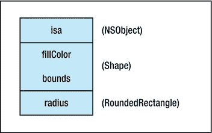

Figure 4-6. 对象实例变量布局

**注意** `NSObject` 的实例变量被称为 `isa`，因为继承在子类和超类之间建立了一种“是一个”（is a）的关系；也就是说，`Rectangle` *是一个* `Shape`，`Circle` *是一个* `Shape`。使用 `Shape` 的代码也可以使用 `Rectangle` 或 `Circle` 来代替。

使用更具体的对象类型（`Rectangle` 或 `Circle`）代替一般类型（`Shape`）的能力称为多态（polymorphism），这个词来自希腊语，意为“多种形态”，这很恰当。

请记住，每个方法调用都会获得一个隐藏的参数，称为 `self`，它是一个指向接收消息的对象的指针。方法使用 `self` 参数来找到它们使用的实例变量。

Figure 4-7 展示了 `self` 指向一个 `RoundedRectangle` 对象。`self` 指向继承链中第一个类的第一个实例变量。对于 `RoundedRectangle`，继承链从 `NSObject` 开始，然后是 `Shape`，最后以 `RoundedRectangle` 结束，所以 `self` 指向第一个实例变量 `isa`。Objective-C 编译器知道对象中实例变量的布局，因为它已经看到了这些类的 `@interface` 声明。有了这个重要的知识，编译器可以生成代码来找到任何实例变量。

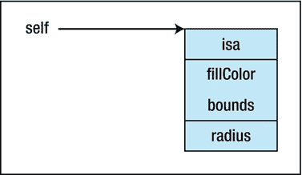

Figure 4-7. `self` 参数指向一个圆对象

**警告：脆弱性！**


编译器通过一种“基地址加偏移量”的机制施展其魔法。给定一个对象的基地址——即第一个实例变量首字节的内存位置——编译器可以通过向该地址添加一个偏移量来找到所有其他实例变量。

例如，如果圆角矩形对象的基地址是`0x1000`，那么`isa`实例变量位于`0x1000 + 0`，即`0x1000`。`isa`是一个 4 字节的值，因此下一个实例变量`fillColor`起始于偏移量 4 处，即`0x1000 + 4`或`0x1004`。每个实例变量都有一个相对于对象基地址的偏移量。

当你在方法中访问`fillColor`实例变量时，编译器会生成代码，获取`self`持有的值并加上偏移量（本例中为 4），以指向该变量值存储的位置。

这种做法随着时间的推移会带来问题。这些偏移量被硬编码到了编译器生成的程序中。即使苹果公司的工程师想要向`NSObject`添加另一个实例变量，他们也做不到，因为那会改变所有实例变量的偏移量。这被称为**脆弱的基类问题**。苹果公司已经通过随 Leopard 引入的新的 64 位 Objective-C 运行时解决了这个问题，该运行时使用间接方式来确定 ivar 的位置。

## 方法重写

当你创建自己的全新子类时，你通常会添加自己的方法。有时，你会添加一个为你的类引入独特功能的新方法。其他时候，你会替换或增强由你新类的某个超类定义的现有方法。

例如，你可以从 Cocoa 的`NSTableView`类开始，该类显示一个可供用户点击的滚动列表，然后添加一个新行为，比如用语音合成器播报列表内容。你可能会添加一个名为`speakRows`的新方法，用于将表格内容馈送给语音合成器。

或者，与其添加一个全新的功能，不如创建一个子类，调整从某个超类继承的现有行为。在*Shapes-Inheritance*中，`Shape`已经完成了我们期望形状所做的大部分工作，比如设置形状的填充颜色和边界，但`Shape`不知道如何绘制任何东西。而且它也无法知道如何绘制：`Shape`是一个通用的抽象类，每个形状的绘制方式都不同。因此，当我们想要创建一个`Circle`类时，我们子类化`Shape`并编写一个知道如何绘制圆形的`draw`方法。

当我们创建`Shape`时，我们知道它的所有子类都必须进行绘制，尽管我们不知道它们具体会如何实现其绘制功能。因此，我们为`Shape`提供了一个`draw`方法，但将其设为空，以便每个子类都可以做自己的事情。当诸如`Circle`和`Rectangle`这样的类实现它们自己的`draw`方法时，我们说它们**重写**了`draw`方法。

当向一个圆形对象发送`draw`消息时，方法调度器会运行被重写的方法——即`Circle`对`draw`的实现。超类（如`Shape`）定义的任何`draw`实现都会被完全忽略。在这种情况中没问题——`Shape`在其`draw`实现中没有代码。但其他时候，你可能*不想*忽略超类版本的方法。更多内容请继续阅读。

## 我感觉超棒！

Objective-C 提供了一种方法来重写一个方法，同时仍然调用超类的实现——当你希望让超类做它自己的事情，并在之前或之后执行一些额外的工作时，这非常有用。要调用继承的方法实现，你可以使用`super`作为方法调用的目标。

例如，假设我们刚了解到某些文化对红色圆形有忌讳，而我们想在这些国家销售我们的*Shapes-Inheritance*软件。我们不继续像之前那样绘制红色圆形，而是希望所有圆形都绘制成绿色。因为这个限制只影响圆形，一种实现方法是修改`Circle`，使所有圆形都绘制成绿色。其他用红色绘制的形状则没有问题，所以我们不需要消除它们。为什么不直接修改`Circle`的填充颜色方法呢？在这里，我们可以这样做。不过，你并不总是有这个便利；例如，你可能没有你想要修改的那个类的代码。

回想一下，`setFillColor:`是在`Shape`类中定义的。因此，我们可以在`Circle`类中重写`setFillColor:`，专门为圆形解决这个问题。我们将检查颜色参数，如果是红色，就将其改为绿色。然后，我们将使用`super`告诉超类（`Shape`）将这个改变后的颜色存储到`fillColor`实例变量中（该程序的完整代码清单在`04.02 Shapes-Green-Circles`中）。

`Circle`的`@interface`部分没有变化，因为我们没有添加任何新方法或实例变量。我们只需要在`@implementation`部分添加代码：

```
@implementation Circle

- (void)setFillColor:(ShapeColor)c
{
  if (c == kRedColor)
  {
    c = kGreenColor;
  }
  [super setFillColor: c];
} // setFillColor

// Circle @implementation 的其余部分 // 保持不变

@end // Circle
```

在这个`setFillColor:`的新实现中，我们检查`ShapeColor`参数是否为红色。如果是，我们就将其改为绿色。接下来，我们请求超类通过代码`[super setFillColor: c]`来完成将颜色放入实例变量的工作。

`super`从何而来？它不是一个参数也不是一个实例变量，而是 Objective-C 编译器提供的一点魔法。当你向`super`发送消息时，你是在要求 Objective-C 将消息发送给该类的超类。如果在超类中没有定义，Objective-C 会像往常一样继续沿着继承链向上查找。

图 4-8 展示了`Circle`的`setFillColor:`方法的执行流程。圆形对象被发送了`setFillColor:`消息。方法调度器找到了由`Circle`类实现的`setFillColor:`的自定义版本。

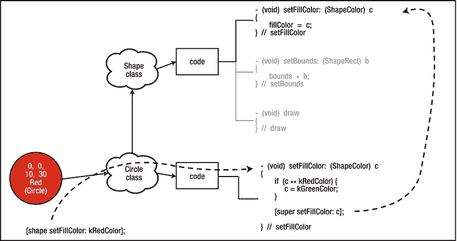

图 4-8. 调用超类方法

**注意**   当你重写一个方法时，调用超类方法几乎总是一个好主意，以防它正在执行比你意识到的更多的工作。在这种情况下，我们可以访问`Shape`的源代码，所以我们知道`Shape`在其`setFillColor:`方法中只做了一件事，就是将新颜色存入一个实例变量。但如果我们对`Shape`没有那么熟悉，我们就不会知道`Shape`是否在做其他事情。而且即使我们现在知道`Shape`做了什么，如果该类之后被更改或增强，我们可能也不了解了。通过调用继承的方法，我们确保获得了它实现的所有功能。

在`Circle`版本的`setFillColor:`完成对`kRedColor`的检查并在必要时更改颜色后，通过调用`[super setFillColor: c]`来调用超类的方法。`super`调用会运行`Shape`版本的`setFillColor:`方法。

## 总结

继承是面向对象编程中的一个核心概念，因为面向对象编程的许多高级技术都涉及它。在本章中，你了解了继承，并看到了如何使用它来美化和简化*Shapes-Object*代码。我们讨论了如何从现有类创建新类，以及超类的实例变量如何出现在子类中。

我们讲解了 Objective-C 的方法调度机制，并注意到它如何沿着继承链向上查找，以寻找响应特定消息的方法。最后，我们介绍了`super`关键字，并展示了如何在重写的方法中利用它来利用超类的代码。


你将在下一章了解组合，这是另一种让不同对象协作完成工作的方式。它可能不像继承那样充满极客式的酷感，但非常重要，我们到时见。

# 第 5 章

## 组合

在上一章中，你接触了继承——一种在两个类之间建立关系、从而省去大量重复代码的方式。我们还（简要）提到，你也可以使用组合来建立关系，这正是本章的主题。你可以利用组合将对象结合起来，让它们协同工作。在典型的程序中，创建自己的类时会同时使用继承和组合，因此，熟练掌握这两个概念非常重要。

### 什么是组合？

编程中的组合就像音乐中的作曲：你将各个独立的组成部分结合起来，让它们共同构建出更大的作品。在音乐中，你可能会将巴松管声部和双簧管声部结合起来创作一部交响曲。在软件中，你可能会将`pedal`（踏板）对象和`tire`（轮胎）对象组合起来，作为虚拟独轮车的一部分。

在 Objective-C 中，组合通过将指向对象的指针作为实例变量来实现。因此，我们的虚拟独轮车会有一个指向`Pedal`对象的指针和一个指向`Tire`对象的指针，看起来大致如下：

```
@interface Unicycle : NSObject
{
    Pedal *pedal;
    Tire *tire;
}
@end // Unicycle
```

通过组合，一个`Unicycle`（独轮车）由`Pedal`（踏板）和`Tire`（轮胎）构成。

**注意** 在 Shapes-Object 程序中，你已经见过一种组合形式：`Shape`类使用了矩形（`struct`）和颜色（`enum`）。严格来说，只有对象才被称为组合。更原始的类型，如`int`、`float`、`enum`和`struct`，被视为仅是对象的一部分。

### 汽车讨论

让我们暂时把 Shapes 程序放到一边（我们是否听到了如释重负的叹息？），来看看如何对汽车进行建模。在我们简化的模型中，一辆汽车有一个发动机和四个轮胎。我们不会深入实际的轮胎和发动机的物理建模，而是使用两个类，每个类只有一个方法用于打印它们代表哪个部件：轮胎对象会说它们是轮胎，发动机对象会说它是发动机。在实际程序中，轮胎会有气压、操控性能等属性，发动机则会有马力、油耗等变量。该程序的代码可以在*05.01 CarParts*中找到。

与 Shapes 程序类似，CarParts 的所有代码都在其`mainCarParts.m`文件中。CarParts 首先导入 Foundation 框架头文件：

```
#import <Foundation/Foundation.h>
```

接下来是`Tire`类，除了一个`description`方法外，它几乎没什么内容：

```
@interface Tire : NSObject
@end // Tire

@implementation Tire
- (NSString *) description {
    return (@"我是一条轮胎。我能用一阵子。");
} // description
@end // Tire
```

**注意** 如果你的类定义中没有实例变量，可以省略花括号。

`Tire`中唯一的方法是`description`，而且它并没有在接口中声明。它从何而来？如果它没有包含在接口中，别人怎么会知道可以对`Tire`使用`description`方法呢？这借助了一点 Cocoa 的魔法。

#### 为`NSLog()`进行自定义

回想一下，`NSLog()`允许你使用`%@`格式说明符来打印对象。当`NSLog()`处理`%@`说明符时，它会要求参数列表中对应的对象提供其`description`。从技术上讲，`NSLog()`向该对象发送`description`消息，对象的`description`方法会构建一个`NSString`并返回它。然后`NSLog()`将该字符串包含在输出中。通过在类中提供`description`方法，你可以自定义`NSLog()`打印对象的方式。

在你的`description`方法中，你可以返回一个文字`NSString`，例如`@"我是一个奶酪丹麦酥对象"`，或者可以构建一个描述对象各种信息的字符串，例如奶酪丹麦酥的脂肪含量和卡路里。Cocoa 的`NSArray`类（用于管理对象集合）的`description`方法会提供关于数组本身的信息，例如它包含的对象数量以及其中每个对象的描述。当然，这些描述是通过向数组中每个对象发送`description`消息而获得的。

回到 CarParts，让我们看看`Engine`类。与`Tire`一样，它只有一个`description`方法。在真实程序中，你的发动机会有诸如`start`和`accelerate`之类的方法，以及`RPMs`之类的实例变量。但这里我们只是为了展示一个简单的组合例子，所以只给`Engine`一个`description`方法：

```
@interface Engine : NSObject
@end // Engine

@implementation Engine
- (NSString *) description
{
    return (@"我是一个发动机。轰隆隆！");
} // description
@end // Engine
```

最后一部分是汽车本身，它有一个发动机和一个由四个轮胎组成的 C 语言数组。汽车使用组合来组装自己。`Car`还有一个名为`print`的方法，使用`NSLog()`打印轮胎和发动机：

```
@interface Car : NSObject
{
    Engine *engine;
    Tire *tires[4];
}
- (void) print;
@end // Car
```

`engine`和`tires`实例变量就是组合，因为`tires`和`engine`是`Car`的实例变量。你可以说`Car`由四个轮胎和一个发动机*组成*。当然，人们通常不会那样说话，所以你也可以说`Car`有四个轮胎和一个发动机。

每个汽车对象都为指向发动机和轮胎的*指针*分配内存。汽车内部并没有嵌入一个完整的发动机和四个轮胎，而是嵌入了指向内存中其他对象的引用。当一个新的`Car`被分配时，这些指针被初始化为`nil`（零值），表示该汽车没有发动机也没有轮胎。你可以想象它只是架在砖块上。

让我们来看看`Car`类的实现。首先是`init`方法，它初始化实例变量。`init`方法创建一个发动机和四个轮胎来装备汽车。当你用`new`创建一个新对象时，实际上在底层发生了两个步骤。首先，对象被分配，这意味着获得了一块用于存放实例变量的内存。然后自动调用`init`方法，使对象进入可用状态。

```
@implementation Car

- (id) init
{
    if (self = [super init]) {
        engine = [Engine new];
        tires[0] = [Tire new];
        tires[1] = [Tire new];
        tires[2] = [Tire new];
        tires[3] = [Tire new];
    }
    return (self);
} // init
```

`Car`的`init`方法创建了四个新轮胎并将它们赋值给`tires`数组。然后`init`创建一个新发动机并将其赋值给`engine`实例变量。

接下来是`Car`的`print`方法：

```
- (void) print
{
    NSLog (@"%@", engine);
    NSLog (@"%@", tires[0]);
    NSLog (@"%@", tires[1]);
    NSLog (@"%@", tires[2]);
    NSLog (@"%@", tires[3]);
} // print
@end // Car
```

#### 关于那个`if`语句...

`init`方法中的这行代码看起来有点奇怪：

```
if (self = [super init]) {
```

我们来解释一下这里发生了什么。你需要调用`[super init]`，以便父类（这里是`NSObject`）可以执行它需要做的任何一次性初始化工作。`init`方法返回一个值（类型为`id`，即通用对象指针），代表被初始化后的对象。

将`[super init]`的结果赋值回`self`是 Objective-C 的标准约定。我们这样做是因为父类在初始化过程中，可能会返回一个与最初创建的对象不同的对象。我们将在后面更详细地介绍`init`方法时深入探讨这一点，所以现在，请对着这行代码点头微笑，然后我们继续往下讲。


`print`方法使用`NSLog()`来打印实例变量。请记住，`%@`会调用每个对象的`description`方法，然后显示结果。在实际程序中，你会利用轮胎和引擎来判断汽车在路面上的抓地表现。

`CarParts.m`的最后一部分是程序的`main()`函数，即此程序的“驱动程序”（请原谅这个双关语）。`main()`创建一辆新车，通过调用`print`方法让汽车执行其任务，然后退出。

```
int main (int argc, const char * argv[])
{
    Car *car;
    car = [Car new];
    [car print];
    return (0);
} // main
```

构建并运行`CarParts`，你应该会看到类似如下的输出：

```
I am an engine. Vrooom!
I am a tire. I last a while.
I am a tire. I last a while.
I am a tire. I last a while.
I am a tire. I last a while.
It won’t win any car awards, but it works!
```

## 访问器方法

程序员很少对自己编写的程序感到满意，因为软件永远没有完工的时候。总会有更多的 bug 需要修复，更多的功能需要添加，或者更多的途径让程序变得更大、更强或更快。因此，`CarParts`尚未完美也就不足为奇了。我们可以通过使用访问器方法来改进它，使其代码更加灵活。这个新版本的代码位于`05.02 CarParts-Accessors`文件夹中。

一位经验丰富的程序员看到`Car`的`init`方法时可能会问：“为什么汽车要自己创建轮胎和引擎？”如果能自定义汽车使用不同类型的轮胎（例如冬季使用的雪地胎）或各种类型的引擎（燃油喷射而非化油器式），程序会好得多。

如果我们能指示汽车使用特定的轮胎或引擎，那就太好了。这样我们就可以让用户混合搭配汽车部件来创建自定义的车辆。

我们可以通过添加访问器方法来实现这一点。**访问器**方法是读取或更改对象特定属性的方法。例如，`Shapes-Object`中的`setFillColor:`就是一个访问器方法。如果我们在`Car`对象中添加一个更改引擎的新方法，那它也是一个访问器方法。这种特定类型的访问器方法被称为**设置器**方法，因为它会在对象上设置一个值。你可能还会听到术语**更改器**，用于描述更改对象状态的方法。

你可能已经猜到，另一种访问器方法是**获取器**。获取器方法为使用对象的代码提供了一种访问其属性的途径。在一款赛车游戏中，物理逻辑需要访问汽车轮胎的属性，来判断汽车在当前速度下是否会在湿滑路面上打滑。

**注意** 在操作另一个对象的属性时，应始终使用任何可用的访问器方法——切勿直接深入对象内部并直接更改值。例如，`main()`不应直接访问`Car`的引擎实例变量（使用`car->engine`）来更改其引擎。相反，你的代码应使用设置器方法来执行更改。

访问器方法又是间接性的一个例证。通过访问器方法间接访问汽车的引擎，你为汽车的实现提供了灵活性。

让我们为`Car`添加一些设置器和获取器方法，这样使用它的代码就能控制所用的轮胎和引擎类型。以下是`Car`的新接口，新增内容以粗体显示：

```
@interface Car : NSObject
{
    Engine *engine;
    Tire *tires[4];
}

- (Engine *) engine;
- (void) setEngine: (Engine *) newEngine;
- (Tire *) tireAtIndex: (int) index;
- (void) setTire: (Tire *) tire atIndex: (int) index;
- (void) print;
@end // Car
```

实例变量的集合没有改变，但新增了两对方法：`engine`和`setEngine:`处理引擎属性，`tireAtIndex:`和`setTire:atIndex:`处理轮胎。访问器方法几乎总是成对出现，一个用于设置值，一个用于获取值。偶尔，只提供获取器（用于只读属性，如磁盘上文件的大小）或只提供设置器（如设置秘密密码）可能是有意义的，但大多数情况下，你需要同时编写设置器和获取器。

Cocoa 对于命名访问器方法有约定。当你为自己的类编写访问器方法时，应遵循这些约定，以免你和阅读你代码的其他人产生混淆。

设置器方法以其要更改的属性命名，并在前面加上`set`。以下是设置器方法名称的示例：`setEngine:`、`setStringValue:`、`setFont:`、`setFillColor:`和`setTextLineHeight:`。

获取器方法则直接以其返回的属性命名。与上述设置器对应的获取器应命名为`engine`、`stringValue`、`font`、`fillColor`和`textLineHeight`。不要在方法名称中使用`get`这个词。例如，命名为`getStringValue`和`getFont`的方法会违反约定。某些语言（如 Java）有不同的约定，会在访问器方法名称中使用`get`，但如果你在编写 Cocoa 代码，请不要使用它。

**注意** 在 Cocoa 中，“`get`”这个词有特殊含义：在 Cocoa 方法名中，它表示该方法通过你作为参数传入的指针来返回值。例如，`NSData`（一个 Cocoa 类，用于存储任意字节序列的对象）有一个名为`getBytes:`的方法，该方法接受一个参数，该参数是用于存放字节的内存缓冲区的地址。`NSBezierPath`（用于绘图）有一个名为`getLineDash:count:phase:`的方法，该方法接受一个指向浮点数组的指针（用于线型模式）、一个指向整数的指针（用于模式中的元素数量）以及一个指向浮点的指针（用于开始绘制的模式位置）。

如果你在访问器方法名称中使用`get`，使用你代码的经验丰富的 Cocoa 程序员会期望向你的方法提供指针作为参数，然后当他们发现这只是一个简单的访问器时会感到困惑。最好不要让程序员感到困惑。

### 设置引擎

第一对访问器方法影响引擎：

```
- (Engine *) engine;
- (void) setEngine: (Engine *) newEngine;
```

使用`Car`对象的代码调用`engine`来访问引擎，调用`setEngine:`来更改它。以下是这些方法实现的示例：

```
- (Engine *) engine
{
    return (engine);
} // engine

- (void) setEngine: (Engine *) newEngine
{
    engine = newEngine;
} // setEngine
```

获取器方法`engine`返回`engine`实例变量的当前值。请记住，Objective-C 中所有对象交互都通过指针进行，因此`engine`方法返回一个指向`Car`所包含引擎对象的指针。

类似地，设置器方法`setEngine:`将`engine`实例变量的值设置为指向的值。实际的引擎本身不会被复制，只是复制了指向该引擎的指针的值。换句话说：在对一个汽车对象调用`setEngine:`之后，整个世界中只存在一个引擎，而不是两个。

**注意** 为了全面说明，我们需要指出，引擎的设置器和获取器在内存管理和对象所有权方面存在一些问题。在现在就把内存和对象生命周期管理抛给你，会让你感到困惑和沮丧，因此我们将推迟讨论编写绝对正确的访问器方法，直到第 8 章。

要实际使用这些访问器，你可以编写如下代码：

```
Engine *engine = [Engine new];
[car setEngine: engine];
NSLog (@"the car's engine is %@", [car engine]);
```

### 设置轮胎

针对轮胎的访问器方法稍微复杂一些：


#### 轮胎访问器

- `(void) setTire: (Tire *) tire atIndex: (int) index;`
- `(Tire *) tireAtIndex: (int) index;`

由于汽车有多个轮胎安装位置（车辆四个角落各一个），`Car`对象包含一个轮胎数组。为了不直接暴露轮胎数组，这里使用了索引访问器。当为汽车设置轮胎时，你需要告诉汽车使用哪个轮胎以及安装位置。同样，当访问轮胎时，你需要指定特定位置。

以下是轮胎访问器的实现：

```objectivec
- (void) setTire: (Tire *) tire atIndex: (int) index
{
    if (index < 0 || index > 3) {
        NSLog (@"bad index (%d) in setTire:atIndex:", index);
        exit (1);
    }
    tires[index] = tire;
} // setTire:atIndex:

- (Tire *) tireAtIndex: (int) index
{
    if (index < 0 || index > 3) {
        NSLog (@"bad index (%d) in tireAtIndex:", index);
        exit (1);
    }
    return (tires[index]);
} // tireAtIndex:
```

轮胎访问器包含一些通用代码，用于检查轮胎实例变量的数组索引是否有效。如果索引超出 0 到 3 的范围，程序会打印错误信息并退出。这种做法被称为**防御性编程**，这是一个好习惯。防御性编程能在开发早期捕获错误，例如使用了错误的轮胎位置索引。

由于`tires`是一个 C 风格数组，编译器在访问数组时不会对索引进行任何错误检查，因此我们必须检查索引的有效性。我们可以写出`tires[-5]`或`tires[23]`而不会收到编译器警告。当然，该数组只有四个元素，因此使用`-5`或`23`作为索引将访问随机内存，导致错误和程序崩溃。

索引检查完成后，`tires`数组会被操作，将新轮胎放入正确位置。使用这些访问器的代码如下：

```objectivec
Tire *tire = [Tire new];
[car setTire: tire atIndex: 2];
NSLog (@"tire number two is %@", [car tireAtIndex: 2]);
```

#### 跟踪对`Car`的修改

在声明`CarParts-Accessors`完成之前，还有几个细节需要处理。

第一个细节是`Car`的`init`方法。由于`Car`现在有了发动机和轮胎的访问器，其`init`方法不再需要创建这些部件。创建汽车的代码负责配置发动机和轮胎。事实上，我们可以完全移除`init`方法，因为`Car`不再需要做这些工作。获取新车的人将得到一辆没有轮胎和发动机的车，但这些部件可以轻松制造（有时，软件世界比现实世界要容易得多）。

由于`Car`不再创建自己的活动部件，`main()`必须更新以创建它们。将`main()`函数修改为如下：

```objectivec
int main (int argc, const char * argv[]) {
    Car *car = [Car new];
    Engine *engine = [Engine new];
    [car setEngine: engine];
    for (int i = 0; i < 4; i++) {
        Tire *tire = [Tire new];
        [car setTire: tire atIndex: i];
    }
    [car print];
    return (0);
} // main
```

`main()`创建了一辆新车，和之前版本一样。然后，创建一个新的`Engine`并将其放入汽车。接着，一个`for`循环执行四次。每次循环，创建一个新轮胎，并告诉汽车使用该轮胎。最后，打印汽车信息并退出程序。

从用户的角度看，程序没有任何变化：

```
I am an engine. Vrooom!
I am a tire. I last a while.
I am a tire. I last a while.
I am a tire. I last a while.
I am a tire. I last a while.
```

和`Shapes-Object`一样，我们重构了程序，改进了内部结构，但保持了外部行为不变。

### 扩展`CarParts`

既然`Car`有了访问器，让我们利用它们。我们将使用标准发动机和轮胎的变体，而不是默认部件。我们将使用继承创建新的发动机和轮胎类型，然后通过`Car`的访问器（即组合）为汽车配备这些新部件。该程序的代码位于`05.03 CarParts-2`文件夹中。

首先是新型发动机`Slant6`（如果你更喜欢 V8 或`ThreeFiftyOneWindsor`，也可以尝试）：

```objectivec
@interface Slant6 : Engine
@end // Slant6

@implementation Slant6
- (NSString *) description
{
    return (@"I am a slant- 6. VROOOM!");
} // description
@end // Slant6
```

`Slant6`是一种发动机，因此继承`Engine`是合理的。记住，继承建立了一种关系，允许我们在期望超类（`Engine`）的地方传递子类（`Slant6`）。由于`Car`的`setEngine:`方法接受类型为`Engine`的参数，我们可以安全地传递一个`Slant6`。

`Slant6`重写了`description`方法，使其打印新消息。由于`Slant6`没有调用超类的`description`方法（即不包含`[super description]`），它完全替换了继承的`description`。

实现新轮胎类`AllWeatherRadial`的步骤与`Slant6`类似。我们继承现有类（`Tire`）并提供新的`description`方法：

```objectivec
@interface AllWeatherRadial : Tire
@end // AllWeatherRadial

@implementation AllWeatherRadial
- (NSString *) description
{
    return (@"I am a tire for rain or shine.");
} // description
@end // AllWeatherRadial
```

最后，我们修改`main()`以使用新的发动机和轮胎类型（更改的代码已加粗）：

```objectivec
int main (int argc, const char * argv[]) {
    Car *car = [Car new];
    for (int i = 0; i < 4; i++) {
        Tire *tire = [AllWeatherRadial new];
        [car setTire: tire atIndex: i];
    }
    Engine *engine = [Slant6 new];
    [car setEngine: engine];
    [car print];
    return (0);
} // main
```

我们添加了两个新类，并稍微修改了两行代码，完全没有改动`Car`本身。我们的`Car`愉快地使用你设计的任何发动机和轮胎，而无需更改`Car`自身。程序的行为现在发生了根本变化：

```
I am a slant- 6. VROOOM!
I am a tire for rain or shine.
I am a tire for rain or shine.
I am a tire for rain or shine.
I am a tire for rain or shine.
```

### 组合还是继承？

`CarParts-2`同时使用了继承和组合，这是本章和上一章介绍的工具包中的两个新工具。一个很好的问题是：“什么时候使用继承，什么时候使用组合？”

继承建立了一种“是（is a）”关系。三角形*是一个*形状。`Slant6`*是一个*发动机。`AllWeatherRadial`*是一个*轮胎。当你能说“X 是 Y”时，可以使用继承。

相反，组合建立了一种“有（has a）”关系。形状*有*填充颜色。汽车*有*一个发动机，并且*有*轮胎。相比之下，汽车不是一个发动机，汽车也不是一个轮胎。当你能说“X 有一个 Y”时，应该使用组合。

初学面向对象编程的程序员经常犯的错误是试图对一切使用继承，例如让`Car`继承`Engine`。继承是一个有趣的新玩具，但并不适用于所有情况。你可以用这种结构创建一个可运行的程序，因为你可以在`Car`代码内部访问发动机工作所需的内容。但对于阅读代码的人来说，这没有意义。汽车是一个发动机？嗯？因此，只在合适的情况下使用继承。

下面是一个在设计数据结构时如何思考的例子：创建新对象时，花一些时间思考何时应使用继承，何时应使用组合。例如，在设计汽车相关对象时，你可能思考：“一辆汽车有轮胎、一个发动机和一个变速箱。”因此，你会使用组合，在`Car`类中为所有这些部件创建实例变量。


在其他情况下，你会使用继承。例如，你可能需要“持证车辆”的概念，即需要某种许可证才能合法使用的车辆。汽车、摩托车和牵引式挂车都属于持证车辆。汽车*是一种*持证车辆，摩托车*是一种*持证车辆——这听起来很适合用继承来实现。因此，你可能会创建一个`LicensedVehicle`类，其中包含像市政当局和许可证号码这样的信息（使用组合！），而`Automobile`、`MotorCycle`等类则会继承自`LicensedVehicle`。

## 总结

组合，即创建包含对其他对象引用的对象的技术，是面向对象编程的一个基本概念。例如，汽车对象包含对发动机对象和四个轮胎对象的引用。在本章讨论组合的过程中，我们介绍了访问器方法，它提供了一种途径，让外部对象可以在保持实例变量封装的同时更改属性。

访问器方法和组合是相辅相成的，因为你通常需要为每个被组合的对象编写访问器方法。你还学习了两种类型的访问器方法：设置器方法告诉对象将属性更改为什么，获取器方法则向对象询问属性的值。

在本章中，你还了解了关于命名访问器方法的 Cocoa 规则。特别地，我们提醒你，不要在返回属性值的访问器方法名中使用“get”。

在下一章中，我们将暂时从这些精彩的 OOP 理论中喘口气，以便研究如何将类拆分到多个源文件中，而不是把所有内容都塞进一个大文件里。

# 第 6 章

## 源文件组织

到目前为止，我们讨论过的每个项目，其所有源代码都塞进了`main.m`文件里。`main()`函数以及我们所有类的`@interface`和`@implementation`部分都堆积在同一个文件中。这种结构对于小程序和快速实现来说还行，但它无法扩展到大型项目。随着程序的增大，你将不得不滚动浏览一个庞大的文件，这使得查找东西变得更加困难。

回想你的学生时代（假设你已经毕业了），你不会把所有学期论文都放在同一个文字处理文档里（假设你用过文字处理器）。你会把每篇论文放在各自的文档中，并配上描述性的文件名。类似地，将程序的源代码拆分成多个文件也是个好主意，你可以为每个文件起一个有益的名称。

将程序分割成较小的文件，可以让你更快地找到重要的代码片段，同时也有助于其他人在查看你的项目时快速了解概况。将代码放在多个文件中，还能让你更容易地将某个有趣的类的源码发送给朋友：你只需打包几个文件，而不是整个项目。在本章中，我们将讨论将程序的不同部分放在不同文件中的策略和思路。

### 拆分接口与实现

正如你所见，Objective-C 类的源代码分为两部分。一部分是接口，它提供了类的公共视图。接口包含了某人使用该类所需的所有信息。通过向编译器展示`@interface`部分，你将能够使用该类的对象、调用类方法、将对象组合到另一个类中，以及创建子类。

类源代码的另一部分是实现。`@implementation`部分告诉 Objective-C 编译器如何让该类实际工作。这部分包含了实现接口中声明的方法的代码。

由于类的定义天然地分为接口和实现，类的代码也通常会沿着同样的界限拆分成两个文件。一个文件包含接口组件：类的`@interface`指令、任何公共结构体定义、枚举常量、`#define`宏、`extern`全局变量等。由于 Objective-C 继承自 C 语言，这些东西通常会放入一个头文件中，该头文件与类同名，并以`.h`结尾。例如，类`Engine`的头文件应命名为`Engine.h`，`Circle`的头文件则命名为`Circle.h`。

所有实现细节，例如类的`@implementation`指令、全局变量的定义、私有结构体等，都放入一个与类同名且以`.m`结尾的文件中（有时称为**点 m 文件**）。`Engine.m`和`Circle.m`就是这些类的实现文件。

**注意：** 如果你使用`.mm`作为文件扩展名，你是在告诉编译器你已经用 Objective-C++ 编写了代码，这允许你同时使用 C++ 和 Objective-C。

### 在 Xcode 中创建新文件

当你构建一个新类时，Xcode 会自动为你创建`.h`和`.m`文件，让你的工作更轻松。当你在 Xcode 中选择 File  New  New File 时，你会看到一个如图 6-1 所示的窗口，其中列出了 Xcode 知道如何创建的文件类型。

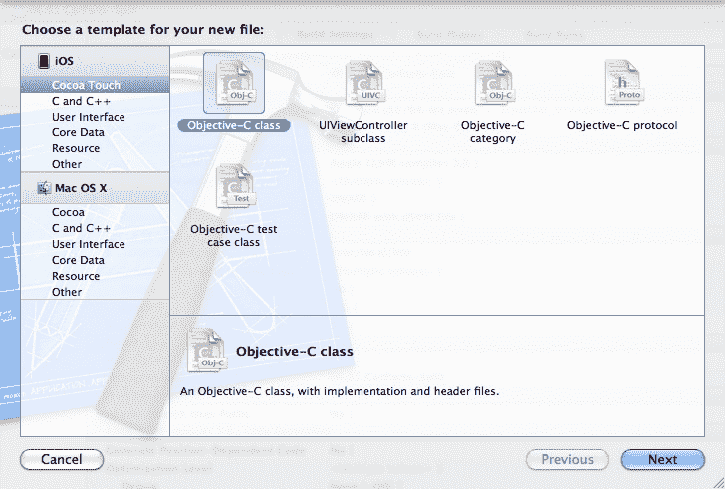

图 6-1。在 Xcode 中创建新文件

选择“Objective-C class”，然后点击 Next。将会出现另一个窗口，要求你填写类的名称，如图 6-2 所示。

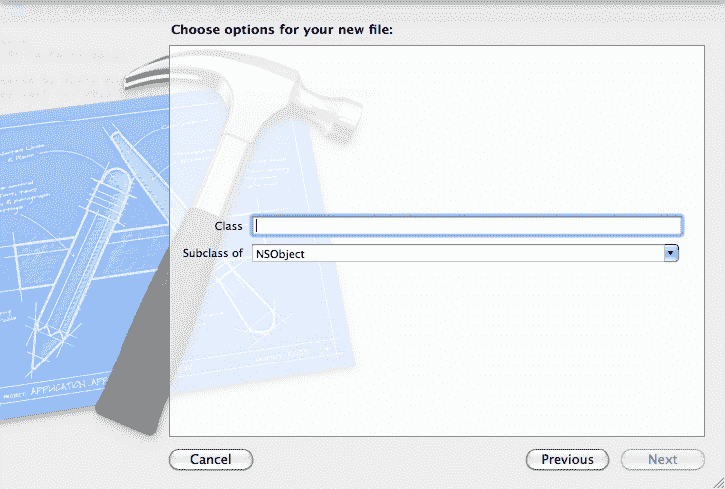

图 6-2。命名新文件

你还可以选择新类的父类。默认情况下，父类是`NSObject`。每个类都必须有一个父类（除了`NSObject`本身，它是所有类的父类）。你可以通过从弹出菜单中选取或直接输入类名来指定新类的父类。

当你点击 Next 时，Xcode 会询问你想将文件保存到哪里（见图 6-3）。选择你为此项目存放其他文件的目录。

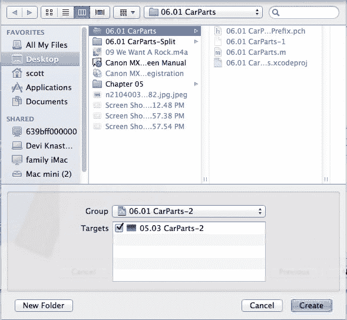

图 6-3。选择目录

你还可以在该窗口中看到一些其他有趣的东西。例如，你可以选择新文件应包含在哪个组中。我们现在不会讨论 Targets 部分，只需知道复杂的项目可以有多个目标，每个目标都有自己的源文件配置和构建规则。

创建新类后，Xcode 会将适当的文件添加到项目中，并在项目窗口中显示结果，如图 6-4 所示。

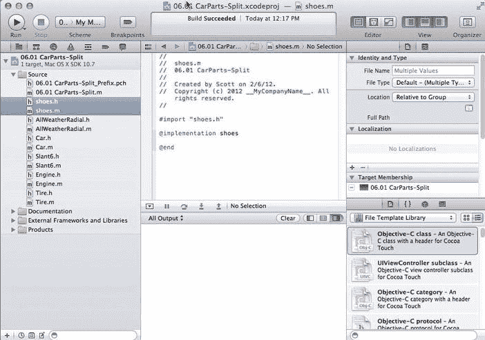

图 6-4。在 Xcode 项目窗口中显示的新文件


## Xcode 项目文件组织与依赖管理

`Xcode`创建一个以项目名称命名的组，然后将文件放入该组内的文件夹中。（你可以在项目导航面板中看到项目的结构。）这些文件夹（`Xcode`称之为*组*）提供了一种组织项目中源文件的方式。例如，你可以为用户界面类创建一个组，为数据处理类创建另一个组，从而使项目更易于导航。当你设置组时，`Xcode`实际上不会移动任何文件，也不会在硬盘上创建任何目录。组关系只是由`Xcode`维护的一个美好的幻象。如果你愿意，你可以设置一个组，使其指向文件系统中的特定位置。然后，`Xcode`会将新创建的文件放入该目录中。

创建文件后，你可以在列表中点击它们进行编辑。`Xcode`会贴心地包含一些标准的样板代码，即你在这些文件中始终需要的内容，例如`#import <Cocoa/Cocoa.h>`，以及空的`@interface`和`@implementation`部分，供你填充。

**注意**：到目前为止，在本书中，我们在程序中使用的是`#import <Foundation/Foundation.h>`，因为我们只使用了`Cocoa`的那一部分。但使用`#import <Cocoa/Cocoa.h>`也是可以的。该语句为我们引入了`Foundation`框架头文件以及其他一些内容。

### 拆分`Car`类

位于`06.01 CarParts-Split`项目文件夹中的`CarParts-Split`，将所有的类从`CarParts-Split.m`文件中取出，并移入它们自己的文件中。每个类位于自己独立的头文件（`.h`）和实现文件（`.m`）中。让我们看看自己创建这个项目需要做些什么。我们将从两个继承自`NSObject`的类开始：`Tire`和`Engine`。选择新建文件，然后选择`Objective-C Class`，并输入名称`Tire`。对`Engine`执行相同操作。图 6-5 显示了项目列表中的四个新文件。

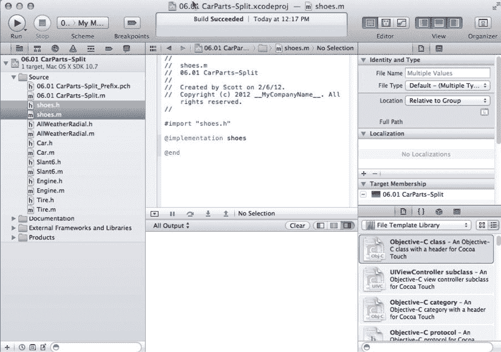

图 6-5. 向项目中添加`Tire`和`Engine`

现在，将`Tire`的`@interface`从`CarParts-Split.m`中剪切出来，并粘贴到`Tire.h`中。文件应如下所示：

```objectivec
#import <Cocoa/Cocoa.h>

@interface Tire : NSObject

@end // Tire
```

接下来，我们将`Tire`的`@implementation`从`CarParts-Split.m`中剪切出来，并粘贴到`Tire.m`中。你还需要在顶部添加一个`#import "Tire.h"`。`Tire.m`应如下所示：

```objectivec
#import "Tire.h"

@implementation Tire

- (NSString *) description

{

return (@"I am a tire. I last a while");

} // description

@end // Tire
```

该文件的第一个`#import`值得注意。它并没有像之前那样导入`Cocoa.h`或`Foundation.h`头文件，而是导入了该类的头文件。这是标准做法，并且你在几乎创建的每个项目中都会这样做。编译器需要知道类中实例变量的布局，以便生成正确的代码，但它不会自动知道存在一个与该源文件对应的头文件。因此，我们需要通过添加`#import "Tire.h"`语句来告知编译器。在编译时，如果遇到类似“找不到`Tire`的接口声明”的错误信息，通常意味着你忘记导入该类的头文件了。

### 导入中心

请注意，导入有两种不同的方式：带引号的和带尖括号的。例如，有`#import <Cocoa/Cocoa.h>`和`#import "Tire.h"`。带尖括号的版本用于导入系统头文件。带引号的版本表示项目本地的头文件。如果你看到头文件名在尖括号内，则表明它是项目只读的，因为它属于系统。当头文件名在引号中时，你知道你（或项目中的其他人）可以对其进行修改。

现在对`Engine`类执行相同的过程。将`Engine`的`@interface`从`CarParts-Split.m`中剪切出来，并粘贴到`Engine.h`中。`Engine.h`现在看起来像这样：

```objectivec
#import <Cocoa/Cocoa.h>

@interface Engine : NSObject

@end // Engine
```

接下来，将`Engine`的`@implementation`剪切出来，并粘贴到`Engine.m`中，现在应如下所示：

```objectivec
#import "Engine.h"

@implementation Engine

- (NSString *) description

{

return (@"I am an engine. Vrooom!");

} // description

@end // Engine
```

如果你现在尝试编译程序，`CarParts-Split.m`会报错，因为缺少对`Tire`和`Engine`的声明。修复这些问题相当简单。只需在`CarParts-Split.m`的顶部，紧跟在`#import <Foundation/Foundation.h>`语句之后，添加以下两行：

```objectivec
#import "Tire.h" 
#import "Engine.h"
```

**注意**：请记住，`#import`类似于`#include`，是一个由`C`预处理器处理的命令。在这种情况下，`C`预处理器实际上只是进行剪切和粘贴操作，在继续处理之前将`Tire.h`和`Engine.h`的内容插入到`CarParts-Split.m`中。

现在你可以构建并运行`CarParts-Split`，你会发现它的行为与使用`AllWeatherRadials`和`Slant6`的原始版本没有变化：

```
I am a slant-6\. VROOOM!
I am a tire for rain or shine
I am a tire for rain or shine
I am a tire for rain or shine
I am a tire for rain or shine
```

## 使用跨文件依赖关系

**依赖关系**是两个实体之间的一种关系。在程序设计和开发过程中，依赖关系问题经常出现。依赖关系可以存在于两个类之间：例如，`Slant6`依赖于`Engine`，因为它们之间存在继承关系。如果`Engine`发生更改（例如添加一个新的实例变量），则需要重新编译`Slant6`以适应更改。

依赖关系可以存在于两个或多个文件之间。`CarParts-Split.m`依赖于`Tire.h`和`Engine.h`。如果这些文件中的任何一个发生更改，`CarParts-Split.m`将需要重新编译以获取更改。例如，`Tire.h`可能有一个名为`kDefaultTirePressure`的常量，其值为`30 psi`。编写`Tire.h`的程序员可能决定将头文件中的默认胎压更改为`40 psi`。现在需要重新编译`CarParts-Split.m`以使用新的值`40`，而不是旧的值`30`。

导入头文件会在头文件和进行导入操作的源文件之间建立强依赖关系。如果头文件发生更改，所有依赖于该头文件的其他文件都必须重新编译。这可能会导致需要重新编译的文件出现级联更改。假设你有 100 个`.m`文件，它们都包含同一个头文件——我们称之为`UserInterfaceConstants.h`。如果你对`UserInterfaceConstants.h`进行了更改，那么所有 100 个`.m`文件都将被重新构建，即使你拥有一堆性能强劲、多核`Mac Pro`集群，这也可能需要相当长的时间。

由于依赖关系是可传递的，重新编译问题可能会变得更糟：头文件之间可能相互依赖。例如，如果`Thing1.h`导入了`Thing2.h`，而`Thing2.h`又导入了`Thing3.h`，那么对`Thing3.h`的任何更改都将导致导入了`Thing1.h`的文件被重新编译。尽管编译可能需要很长时间，但至少`Xcode`会为你跟踪所有依赖关系。

## 基于“需要知道”原则进行重新编译

但好消息是：`Objective-C`提供了一种方法来限制由依赖关系引起的重新编译的影响。依赖关系问题之所以存在，是因为`Objective-C`编译器需要某些信息才能完成其工作。有时，编译器需要知道关于一个类的所有信息，例如其实例变量布局以及它最终继承自哪些类。但有时，编译器只需要知道类的名称，而不是其完整的定义。


例如，当对象被组合时（如前一章所见），组合使用指向对象的指针。这之所以可行，是因为所有 Objective-C 对象都使用动态分配的内存。编译器只需要知道某个特定项是一个类，然后它就知道该实例变量是一个指针的大小，在整个程序中这个大小始终相同。

Objective-C 引入了`@class`关键字，作为一种告诉编译器“这是一个类，因此我只通过指针来引用它”的方式。这能让编译器放心：它不需要了解更多关于这个类的信息，只需知道它是通过指针引用的东西即可。

在将`Car`类移入其自己的文件时，我们将使用`@class`。继续用 Xcode 创建`Car.h`和`Car.m`文件，就像你之前处理`Tire`和`Engine`一样。将`Car`的`@interface`复制并粘贴到`Car.h`中，现在它看起来像这样：

```
#import <Cocoa/Cocoa.h>

@interface Car : NSObject

- (void) setEngine: (Engine *) newEngine;

- (Engine *) engine;

- (void) setTire: (Tire *) tire
atIndex: (int) index;

- (Tire *) tireAtIndex: (int) index;

- (void) print;

@end // Car
```

如果现在尝试使用这个头文件，编译器会报错，指出它不理解`Tire`或`Engine`是什么。错误信息很可能是`error: expected a type "Tire"`，这是编译器在说“我不明白这个。”

我们有两种选择来修复这个错误。第一种是直接`#import "Tire.h"`和`"Engine.h"`，这会给编译器提供关于这两个类的大量信息。

但还有一种更好的方法。如果你仔细查看`Car`的接口，会发现它只通过指针引用`Tire`和`Engine`。这正是`@class`的用武之地。下面是添加了`@class`行之后的`Car.h`：

```
#import <Cocoa/Cocoa.h>

@class Tire;

@class Engine;

@interface Car : NSObject

- (void) setEngine: (Engine *) newEngine;

- (Engine *) engine;

- (void) setTire: (Tire *) tire
atIndex: (int) index;

- (Tire *) tireAtIndex: (int) index;

- (void) print;

@end // Car
```

这些信息足以告诉编译器处理`Car`的`@interface`所需的一切。

**注意**：`@class`设置了一个前向引用。这是一种告诉编译器的方式：“相信我，你最终会了解这个类是什么，但现在，你只需要知道这些。”

`@class`在存在循环依赖时也很有用。也就是说，类 A 使用类 B，并且类 B 也使用类 A。如果试图让每个类都`#import`另一个类，最终会出现编译错误。但如果在`A.h`中使用`@class B`，并在`B.h`中使用`@class A`，那么这两个类可以愉快地相互引用。

让`Car`跑起来

这解决了`Car`的头文件问题。但`Car.m`需要关于`Tire`和`Engine`的更多信息。编译器必须看到`Tire`和`Engine`继承自哪些类，以便进行一些检查，确保这些对象能够响应发送给它们的消息。为此，我们将在`Car.m`中导入`Tire.h`和`Engine.h`。我们还需要将`Car`的`@implementation`从`CarParts-Split.m`中剪切出来。现在`Car.m`看起来像这样：

```
#import "Car.h"

#import "Tire.h"

#import "Engine.h"

@implementation Car {
    Tire *tires[4];
    Engine *engine;
}

- (void) setEngine: (Engine *) newEngine
{
    engine = newEngine;
} // setEngine

- (Engine *) engine
{
    return (engine);
} // engine

- (void) setTire: (Tire *) tire
atIndex: (int) index
{
    if (index < 0 || index > 3) {
        NSLog (@"bad index (%d) in setTire:atIndex:",
               index);
        exit (1);
    }
    tires[index] = tire;
} // setTire:atIndex:

- (Tire *) tireAtIndex: (int) index
{
    if (index < 0 || index > 3) {
        NSLog (@"bad index (%d) in setTire:atIndex:",
               index);
        exit (1);
    }
    return (tires[index]);
} // tireAtIndex:

- (void) print
{
    NSLog (@"%@", tires[0]);
    NSLog (@"%@", tires[1]);
    NSLog (@"%@", tires[2]);
    NSLog (@"%@", tires[3]);
    NSLog (@"%@", engine);
} // print

@end // Car
```

你可以再次构建并运行程序，得到与之前相同的输出。没错，我们又在重构了（嘘，别告诉任何人）。我们一直在改进程序的内部结构，同时保持其行为不变。


## 导入与继承

我们需要从`CarParts-Split.m`中再解放两个类：`Slant6`和`AllWeatherRadial`。处理它们稍微有点棘手，因为它们继承了我们已经创建的类：`Slant6`继承自`Engine`，`AllWeatherRadial`继承自`Tire`。由于我们继承这些类，而不仅仅是使用指向类的指针，我们不能在它们的头文件中使用`@class`技巧。我们必须在`Slant6.h`中使用`#import "Engine.h"`，并在`AllWeatherRadial.h`中使用`#import "Tire.h"`。

那么，为什么我们在这里不能直接使用`@class`呢？因为编译器需要完全了解超类，才能成功编译其子类的`@interface`。编译器需要超类实例变量的布局（类型、大小和顺序）。回忆一下，当你在子类中添加实例变量时，它们会被附加到超类实例变量的末尾。编译器随后使用这些信息来确定实例变量在内存中的位置，从每个方法调用中隐藏的`self`指针开始。编译器需要查看类的全部内容才能正确计算实例变量的位置。

下一个要处理的是`Slant6`。在 Xcode 中创建`Slant6.m`和`Slant6.h`文件，然后将`Slant6`的`@interface`从`CarParts-Split.m`中剪切出来。如果你的切割和粘贴操作正确，`Slant6.h`现在应该如下所示：

```objc
#import "Engine.h"

@interface Slant6 : Engine

@end // Slant6
```

该文件只导入了`Engine.h`，而没有导入`<Cocoa/Cocoa.h>`。为什么？我们知道`Engine.h`已经导入了`<Cocoa/Cocoa.h>`，所以我们在这里不必自己再做一次。不过，如果你想要在此文件中放入`#import <Cocoa/Cocoa.h>`也是可以的，因为`#import`足够智能，不会多次包含同一个文件。

`Slant6.m`只是从`CarParts-Split.m`中剪切并粘贴的`@implementation`部分，并惯例性地导入了`Slant6.h`头文件：

```objc
#import "Slant6.h"

@implementation Slant6

- (NSString *) description

{

return (@"I am a slant-6. VROOOM!");

} // description

@end // Slant6
```

执行相同的步骤将`AllWeatherRadial`移至它自己的文件对中。相信你此刻已经掌握了诀窍。下面是`AllWeatherRadial.h`的内容：

```objc
#import "Tire.h"

@interface AllWeatherRadial : Tire

@end // AllWeatherRadial
```

以下是`AllWeatherRadial.m`：

```objc
#import "AllWeatherRadial.h"

@implementation AllWeatherRadial

- (NSString *) description

{

return (@"I am a tire for rain or shine");

} // description

@end // AllWeatherRadial
```

可怜的`CarParts-Split.m`只剩下原来的一副空壳。它现在只是一堆`#import`指令和一个孤零零的函数，如下所示：

```objc
#import <Foundation/Foundation.h>

#import "Tire.h"

#import "Engine.h"

#import "Car.h"

#import "Slant6.h"

#import "AllWeatherRadial.h"

int main (int argc, const char * argv[])

{

Car *car = [Car new];

int i;

for (i = 0; i < 4; i++) {

Tire *tire = [AllWeatherRadial new];

[car setTire: tire

atIndex: i];

}

Engine *engine = [Slant6 new];

[car setEngine: engine];

[car print];

return (0);

} // main
```

如果我们现在构建并运行项目，我们将得到与之前将代码分散到各个文件时完全相同的输出。

## 总结

在本章中，你学习了使用多个文件组织源代码的基本技能。通常，每个类对应两个文件：一个包含类`@interface`的头文件，以及一个包含`@implementation`的`.m`文件。类的使用者随后通过导入（使用`#import`）头文件来访问类的特性。

在这个过程中，我们遇到了跨文件依赖，即头文件或源文件需要来自另一个头文件的信息。混乱的导入网络可能会增加你的编译时间，并导致不必要的重新编译。明智地使用`@class`指令——它告诉编译器“请相信稍后你会看到一个以此命名的类”——可以减少需要导入的头文件数量，从而缩短编译时间。

接下来我们将参观一些有趣的 Xcode 特性。那里见。

# 第 7 章 更多关于 Xcode 的内容

Mac 和 iOS 程序员大部分时间都在 Xcode 中编写代码。Xcode 是一个出色的工具，拥有许多强大的特性，但并非所有特性都显而易见。当你将长期使用一个强大的工具时，你会想尽可能多地了解它。在本章中，我们将向你介绍一些在编写和导航代码以及定位所需信息时很有用的 Xcode 技巧和窍门。我们还将提及 Xcode 帮助你调试代码的一些方式。

Xcode 是一个庞大的应用程序，并且极具可定制性，有时甚至到了荒谬的程度。（我们提到它很庞大了吗？）关于 Xcode 本身就可以（并且已经）写成整本书，因此我们将专注于亮点，让你快速上手。我们建议你在刚开始时使用 Xcode 的默认设置。当某些问题困扰你时，你会发现很可能有一个设置可以按照你的喜好进行调整。

面对像 Xcode 这样的大型工具，一个好的策略是快速浏览文档，直到你开始感到眼花缭乱为止。使用 Xcode 一段时间，然后再次快速浏览文档。每次阅读，你都会理解更多内容。反复进行，你就会拥有极好的体验。

我们将在本书中讨论 Xcode 4.3.2，即撰写本文时的当前版本。苹果公司喜欢在 Xcode 版本之间添加新功能并移动旧功能，所以如果你使用的是 Xcode 42.0，屏幕截图可能已经过时。现在，开始我们的技巧之旅！

## 一统天下的窗口

作为 Xcode 程序员，你主要生活在 Xcode 主窗口中。让我们讨论这个窗口的各个部分，以确保我们了解所谈论的内容。

*    **工具栏**：这是窗口的最顶部，大部分控件都位于此处。
*    **导航面板**：这是左侧面板。该面板通常包含项目中的文件列表，但你也可以在那里看到其他视图：符号、搜索、问题、调试、断点和日志。你可以通过按 Command（）加上数字键（1 到 7）或单击面板顶部的图标来切换视图。
*    **编辑面板**：这个面板正好位于中间，你将在这里花费大部分时间，编写将改变世界并为你带来财富的精彩源代码。
*    **检查器面板**：在右侧，该区域显示上下文相关的信息以及可用于修改所选项目属性的控件。
*    **调试器面板**：这是底部中央的面板。当调试器运行时，堆栈和调试器控制台会出现在这里。
*    **库面板**：隐藏在窗口的右下角，此面板包含项目资产、对象、代码片段以及在项目中使用的其他好东西。

现在你已经了解了基本布局。让我们立即开始我们的旅程。

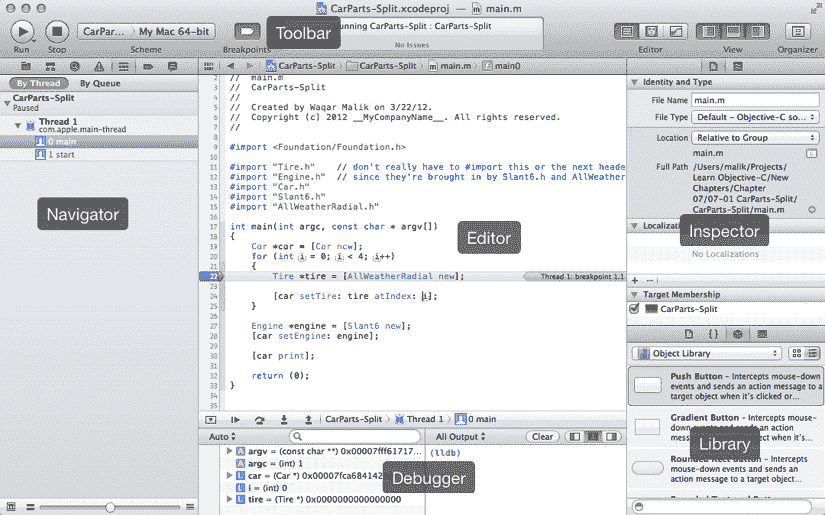

**图 7-1.** 如果你是 OS X 或 iOS 开发者，你整天盯着看的窗口

## 更改公司名称

你可能注意到的一件事是，当你创建一个新的 Objective-C 源文件时，Xcode 为你生成的注释块：

```objc
//
// Calculator
// CKStoreManager.m
//
// Created by Waqar Malik on 4/15/12.
// Copyright 2012 __MyCompanyName__. All rights reserved.
//
```


## Xcode 包含文件名和项目名称

Xcode 包含文件名和项目名称，以及创建用户和时间，因为这些信息能让你一眼就知道正在查看的是哪个文件、由谁创建，并大致了解其创建时间。不过，默认的公司名称实在不太理想。上次我们注意到，`__MyCompanyName__` 并没有在招聘 Mac 程序员，只招 TPS 报告创建者。

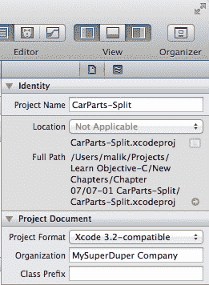

**图 7-2.** 更改公司名称

更改公司名称是一个简单的过程。在导航窗格和编辑窗格中选择项目。查看右侧的检查器窗格。在“项目文档”下，你会看到“组织”字段。在此处输入你的公司名称。从此以后，项目将使用你的公司名称，而不是 `__MyCompanyName__`。

## 使用编辑器技巧和窍门

Xcode 提供了几种组织项目和源代码编辑器的基本方法。到目前为止，我们展示了默认界面，它主要是一个多合一窗口，用于处理你每分钟的项目和编码任务。一个编辑窗格用于所有源文件，而编辑器的内容会根据你在窗口左侧导航窗格中选择的源文件而变化。

以下是关于你在导航窗格中看到内容的更多细节。文件列表显示了你项目的所有活动部分：你的源文件、你链接的框架，以及描述如何实际构建各个程序的 *Products* 文件夹。你还会发现一些实用工具，例如用于访问源代码控制仓库（如果你与其他程序员合作，这很方便）、你项目的所有符号以及一些智能文件夹。

当你选择一个文件时，你会在窗口顶部工具栏下方看到一个文件路径，显示该文件在你的项目中的位置。你可以使用导航窗格底部的搜索框来缩小显示的文件列表。图 7-3 展示了在文件名中搜索“car”一词的结果。你可以将此过滤框用于任何导航器视图。

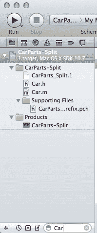

图 7-3. 缩小文件列表

浏览器会显示名称中包含“car”的每个匹配源文件。你可以点击浏览器中的文件将其放入编辑器。由于较大的项目可能有超过一百个源文件，如果你有很多文件，浏览器是一种方便的导航方式。我们将在本章后面进一步讨论如何浏览源文件。

在处理代码时，你会希望隐藏浏览器以最大化利用屏幕空间。窗口最右侧的一个工具栏图标标记为 *View*。它有三个按钮；你可以将鼠标悬停在它们上方以查看其功能（但我们仍会在此处告诉你）。左侧按钮用于隐藏或显示导航窗格，或者你也可以使用快捷键 `0`。中间按钮用于切换调试器区域，右侧按钮用于检查器。

将每个源文件放在其自己的窗口中可能很有用，尤其是在比较两个不同文件时。在导航窗格中双击源文件会在新窗口中打开该文件。你可以在两个窗口中打开同一个文件，但需要注意，有时这两个窗口可能会不同步（你可以点击每个窗口来同步）。

你可能更喜欢使用标签（就像在 Safari 中一样）而不是多个窗口——Xcode 能满足你。这感觉就像是 Xcode 团队认识 Safari 团队似的。要显示标签，请选择 View `` Show Tab Bar（参见图 7-4）。要添加更多标签，请点击标签栏右侧的 +。

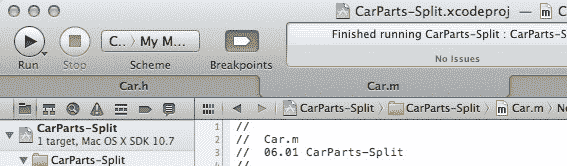

图 7-4. 在标签栏打开标签

## 在 Xcode 的帮助下编写代码

许多程序员整天编写代码。许多程序员也整夜编写代码。对于所有这些程序员，Xcode 提供了一些功能，使编写代码更轻松、更有趣。

### 缩进（漂亮打印）

你可能已经注意到，本书中的所有代码都进行了良好的缩进，`if` 语句和 `for` 循环的主体都进行了偏移，使其缩进比周围代码更深。Objective-C 不要求你缩进代码，但这样做是个好主意，因为它能让你一目了然地看清代码的结构。Xcode 会在你输入代码时自动进行缩进。

有时，大量的编辑可能会使代码变得混乱。Xcode 在这点上也能提供帮助。选中文本后，按住 Control 键并单击（或右键单击）以查看编辑器的上下文菜单，然后选择 Structure `` Re-Indent。Xcode 会遍历所选内容，将所有内容整理整齐。你也可以使用快捷键 `control-I` 来实现相同的功能。

使用 Structure 菜单，或按 `` 和 `![image]`，可以将选中的代码向左或向右移动。如果你刚刚在某个代码周围添加了一个 `if` 语句，这种重新格式化会非常方便。

假设编辑器中有以下代码：

```
Engine *engine = [Slant6 new];

[car setEngine: engine];
```

后来，你决定仅当用户设置了偏好时才创建新引擎：

```
if (userWantsANewEngine) {

Engine *engine = [Slant6 new];

[car setEngine: engine];

}
```

你可以选择中间两行代码，然后按 `]` 将它们向右移动。

你可以无限调整 Xcode 的缩进引擎。你可能更喜欢用空格而不是制表符。你可能希望每个左大括号都放在新行上，而不是与 `if` 语句放在同一行。无论你想做什么，你都有可能定制 Xcode 以遵循你独特的代码格式化风格：大部分魔力都在 Xcode `` Preferences `` Text Editing `` Indentation 中找到。这里有个小技巧：如果你想要快速轻松地在程序员之间引发一场激烈的网络讨论，那就开始谈论代码格式偏好吧。

### 自动补全

你可能已经注意到，Xcode 有时会在你输入代码时提供建议。这是 Xcode 的“代码感知”功能，通常称为 **代码补全**。在编写程序时，Xcode 会建立大量内容的索引，包括项目和包含的框架中的变量和方法名称。它知道局部变量名称及其类型。它甚至可能知道你是否调皮或乖巧。在输入时，Xcode 会不断地将你输入的内容与其符号索引进行比较。如果匹配，Xcode 会提供建议，如图 7-5 所示。

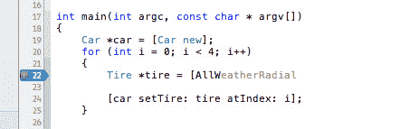

图 7-5. Xcode 代码补全

在这里，我们开始输入 `All*`，Xcode 认为我们可能想要向 `AllWeatherRadial` 类发送消息（参见[图 7-5 中 `AllW*` 后面的灰色文本）。Xcode 碰巧猜对了，所以我们可以按 Tab 键接受 `AllWeatherRadial` 作为补全。

“哎呀，”你说，“这太简单了！我们只有一个以‘All’开头的类！” 确实如此，但即使有很多可能性，Xcode 也会提供一个补全菜单（[图 7-6）。如果你想让菜单消失，只需按 Esc 键，或者再次按 Esc 键将其重新打开。

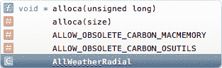

图 7-6. “all”的可能补全项


你可以看到有很多以“all”开头的选项。Xcode 会识别出当前项目中有一个以“all”开头的符号，并默认将其作为首选。名称旁边的彩色方框标识了符号的类型：E 代表枚举符号，f 代表函数，`#` 代表 `#define`，m 代表方法，C 代表类，等等。

你可以输入 `control+.(句号)` 来逐个浏览选项，或者输入 `shift+control+.` 来向后翻页。如果在此过程中没能记住所有这些键盘快捷键，也不必担心。本章末尾提供了一份方便的速查表。

你可以将补全菜单用作类的快速 API 参考。以 `NSDictionary` 为例，它有一个方法，允许你指定一个参数列表，这些参数代表构建字典的键和对象。是 `+dictionaryWithKeysAndObjects` 还是 `+dictionaryWithObjectsAndKeys`？谁能记得住？一种简单的查找方法是开始对一个方法进行调用，输入 `NSDictionary`，然后输入一个空格表示你已完成类名的输入，再按下 escape 键。Xcode 会意识到你将要在此处放置方法名，并显示 `NSDictionary` 响应的所有方法。果然，在[图 7-7 的菜单底部附近显示了 `dictionaryWithObjectsAndKeys`。

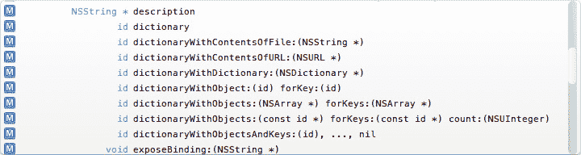

图 7-7. 使用代码感知浏览类

更棒的是，如果你将鼠标悬停在一个方法名称上，会看到每个方法在窗口右侧都有一个小的问号。点击任何方法的问号，就会弹出一个针对该方法的帮助窗口（参见图 7-8）。

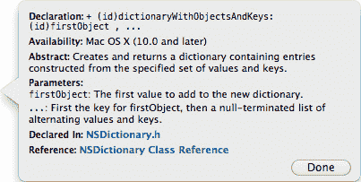

图 7-8. 在方法的帮助窗口中，文件名是链接；点击其中一个可在新窗口中打开

有时，当你使用代码补全时，会在补全内容中看到一些奇怪的小方框，如图 7-9 所示。这是怎么回事？

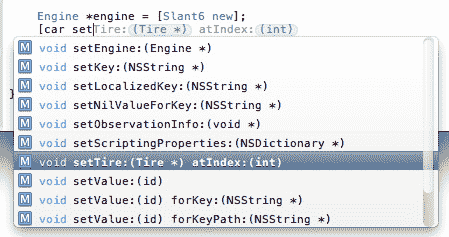

图 7-9. 代码补全占位符

注意，Xcode 建议的是 `-setTire:atlndex:`，它接受两个参数。Xcode 的代码感知功能不仅仅是填写名称。这里显示的两个参数实际上是占位符。如果你再次按 tab 键，该方法会补全为 `setTire`，如图 7-10 所示。

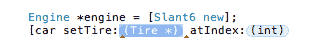

图 7-10. 选择一个占位符

第一个占位符被高亮显示。输入任何内容即可将其替换为实际参数。你也可以点击第二个占位符并替换它。你甚至不必将手从键盘上移开。只需再次按 tab 键即可移动到下一个占位符。

## 亲吻括号

在输入代码时，你可能会注意到，当你输入某些字符（例如 `)`、`]` 或 `}`）时，屏幕偶尔会轻微闪烁。发生这种情况时，Xcode 会显示与你刚输入的闭合符号相对应的开放符号。在图 7-11 中，我们正在输入第二行末尾的右括号。当输入完成时，该行前部匹配的左括号会短暂闪烁，并带有彩色背景。

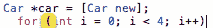

图 7-11. 亲吻括号

此功能有时被称为“亲吻括号”，当你闭合一组复杂的定界符时，它非常方便。确保你输入的每个闭合字符都与期望的开放字符匹配。如果你搞混了，比如在应该输入 `*)` 时试图输入 `*]*`，Xcode 会发出提示音，并且不会显示这种“亲亲”效果。

你也可以双击其中一个定界符，Xcode 将会选中该定界符与其成对匹配符号之间的所有代码。

## 批量编辑

有时，你希望在一处代码更改在多个地方生效，但不想逐个编辑每个实例。手动进行大量类似的编辑充满了风险，因为人类通常不擅长枯燥重复的工作。幸运的是，计算机擅长枯燥重复的工作。

首先介绍的 Xcode 功能并非直接操作代码，而是设置一个安全网。选择 文件  创建快照...（或其便捷快捷键 `+control+S`），Xcode 将会记住你项目的当前状态。你现在可以自由地编辑源文件，随心所欲地折叠、旋转和修改你的内容。如果之后你意识到犯了大错，可以使用快照窗口（通过文件  恢复快照... 访问）从之前的快照中恢复。在进行任何过于冒险的操作前拍照是个好主意。

**注意** 快照存储在 `~/Library/Developer/Xcode/Snapshots/` 中。

当然，Xcode 也具备查找和替换功能。编辑  查找 子菜单包含几个方便的选择。选择在工作区中查找 (`command+shift+F`)，或选择导航器面板中的搜索选项。此功能让你可以在项目中的文件中进行搜索和替换。图 7-12 展示了项目范围的查找和替换窗口。

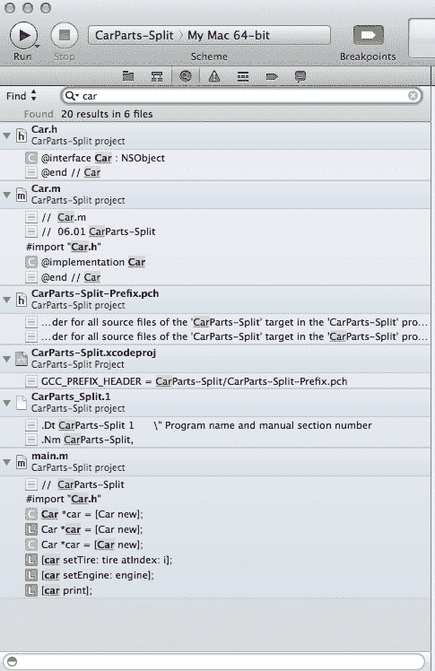

图 7-12. 项目范围的查找和替换

假设我们正在考虑将“car”改为“automobile”。在填写空白并点击*查找*后，你会看到存在对 `Car` 类和 `car` 局部变量的引用。你可以点击全部替换以全局进行更改。

然而，查找和替换功能是进行此类修改的一种生硬工具。如果你只是想重命名函数中的变量，它可能做得太多（因为它可能影响整个文件中的内容）；而如果你想重命名一个类，它又做得不够。具体来说，它不会重命名源文件。

Xcode 有两个功能来填补这些空白。第一个功能有个优雅的名称“Scope 内全部编辑”。你可以选择一个符号，比如局部变量或参数，然后点击它，其旁边会出现一个下拉菜单箭头。点击箭头查看菜单，然后选择“Scope 内全部编辑”。然后，在你输入时，该符号的所有出现位置会立即更新。这不仅是进行大量更改的快速方法，而且在操作过程中看起来也相当酷。

图 7-13 展示了在 scope 内编辑“`car`”。注意每个 `car` 局部变量周围都有一个方框。一旦你开始输入“automobile”，所有方框都会改变，如图 7-14 所示。

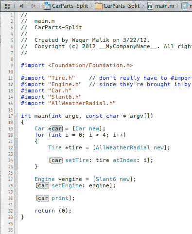

图 7-13. 开始通过将 `car` 更改为“automobile”进行 scope 内全部编辑

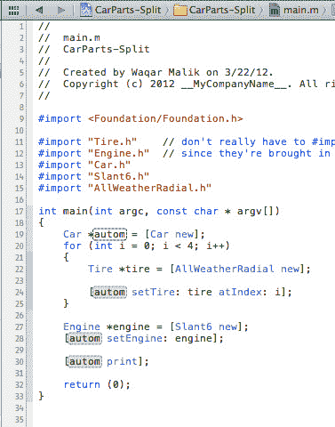

图 7-14. Scope 内全部编辑

完成后，只需点击源编辑窗口中的其他位置，即可退出“Scope 内全部编辑”模式。

有时，当你尝试进行此类修改时，会发现“Scope 内全部编辑”菜单项是禁用的。此功能与 Xcode 中的语法着色密切相关，因此如果你关闭了该功能或对其进行了大量修改，“Scope 内全部编辑”可能无法工作。要解决此问题，请返回偏好设置并再次调整语法着色，直到它生效——这需要一点“玄学”操作。


还记得我们在前几章中使用"重构"这个术语吗？我们可不是为了显得高深而凭空编造这个词。Xcode 内置了一些重构工具。其中一个重构助手可以让你轻松重命名类。它不仅会重命名类，还会做一些精巧的事情，比如同步重命名源文件。如果你有 GUI 程序，它甚至能深入 nib 文件并修改其中的内容。（如果你现在完全看不懂最后这句话，别担心。这确实是一个非常酷的功能，我们会在后续章节中详细解释 nib 文件。）

让我们尝试将所有 `Car` 类改为 `Automobile`。在编辑器中打开 `Car.h`，将插入点放在 `Car` 这个单词中。选择 Edit  Refactor  Rename . . . 。你会看到一个如图 7-15 所示的对话框，其中我们已输入 `Automobile` 作为"Car"的替换名称。


图 7-15. 开始重构

Xcode 会计算出你点击 Preview 后将要执行的操作，并将其呈现给你，如图 7-16 所示。

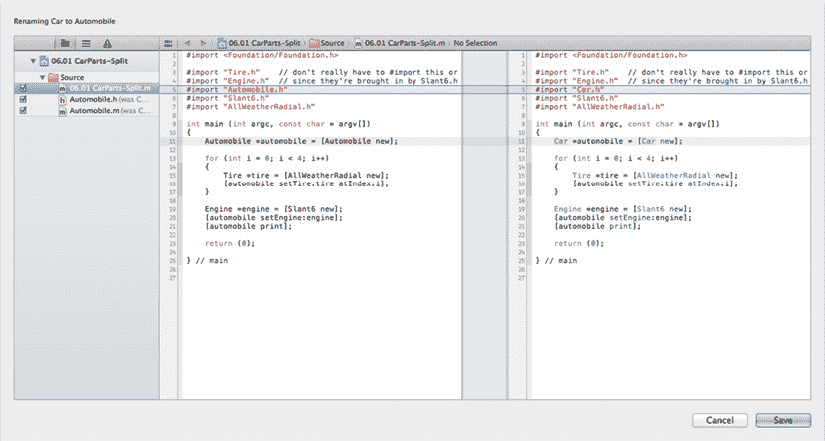

图 7-16. Xcode 告诉我们它在重构中打算做什么。

你可以看到 Xcode 会将 `Car.h` 和 `Car.m` 重命名为对应的 Automobile 风格名称。你可以点击某个源文件，在窗口底部的文件合并查看器中查看 Xcode 将要进行的更改。在那里，你会看到 Xcode 已经将 `#import` 中的"Car"改成了"Automobile"，并且在适当的位置修改了类名。

审查完更改后，点击 Save。如果这是你第一次在此项目中重构代码，Xcode 会询问你是否要启用自动快照。选择"是"是个好主意，因为这样如果你做了一个大改动并认为它不够好，可以轻松回退到重构前的版本。

遗憾的是，重构并不会重命名注释中的内容，因此类结束注释、Xcode 生成的文件头注释，或者你可能编写的任何文档注释都需要手动修复。你可以使用搜索和替换来简化这个过程。

## 在代码中导航

大多数源文件都有一个相似的生命周期。它们被新建，然后快速添加大量代码以实现其神奇功能。接下来，它们进入一个添加和修改各占一半的模式，然后进入维护模式，在这种模式下，你必须在添加新代码或进行修改之前阅读大量文件。最后，在一个类成熟之后，你会浏览其代码以了解该类的工作原理，然后才能在程序的其他地方使用它。本节将探讨在代码生命周期中进行导航的各种方法。

### emacs 不是 Mac

一个名为 `emacs` 的古老文本编辑器，发明于 1970 年代，在现代 Mac 上仍然可用。一些老派开发者（包括 Waqar Malik）每天都在使用它。我们这里不会过多讨论 `emacs`，只是描述它的一些键绑定——我们甚至会告诉你这意味着什么。

短语"emacs 键绑定"指的是那些可以让你在不将手从键盘主区域移开的情况下移动文本光标的按键组合。就像许多人更喜欢用方向键而不是伸手去够鼠标一样，emacs 用户更喜欢使用这些光标移动键，而不是伸手去够方向键。最关键的是：令人惊讶的是，这些相同的移动键在任何 Cocoa 文本字段中都有效，不仅限于 Xcode，还包括 TextEdit、Safari 的 URL 栏和文本字段、Pages 和 Keynote 的文本区域等等。具体如下：

*    `control-F`：向**前**移动，向右（与右箭头键相同）。
*    `control-B`：向**后**移动，向左（与左箭头键相同）。
*    `control-P`：移动到**上**一行（与上箭头键相同）。
*    `control-N`：移动到**下**一行（与下箭头键相同）。
*    `control-A`：移动到行**首**（与 Command-左箭头键相同）。
*    `control-E`：移动到行**末**（与 Command-右箭头键相同）。
*    `control-T`：**互换**（交换）光标两侧的字符。
*    `control-D`：**删除**光标右侧的字符。
*    `control-K`：**删除**（删除）该行剩余部分。如果你想重做一行代码的结尾，这很方便。
*    `control-L`：将插入点置于窗口中央。如果你找不到文本光标，或者想快速滚动窗口使插入点位于正中央，这个功能非常棒。

如果你将这些按键组合熟记于心并熟练掌握，你就能更快速地完成小范围的光标移动和编辑操作——而且不仅仅是在 Xcode 中。

### 芝麻开门！

当你查看一个源文件时，会看到顶部的 `#import`。如果能快速打开那个头文件，而不必进行大量的鼠标操作，那该多好？你可以做到！只需选择文件名（甚至可以省略 `.h`），然后选择 File  Open Quickly。Xcode 就会为你打开头文件。

如果你没有选中任何文本，选择 Open Quickly 会打开一个对话框，这是查找文件的另一种方式。你也可以通过快捷键 `O` 来执行 Open Quickly 命令。Open Quickly 对话框是一个非常简单的窗口，只包含一个搜索字段和一个表格，但它是在项目中搜索内容的一种非常快速的方式。在搜索框中输入 `tire` 来查找与轮胎相关的内容，如图 7-17 所示。你也可以输入其他术语，比如 `NSArray` 来查看 `NSArray` 头文件。

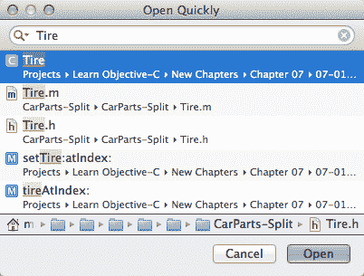

图 7-17. Open Quickly 对话框

如果你有幸拥有一个大显示器，可以使用助手编辑器（View  Assistant Editor  Show Assistant Editor）并排显示窗口。默认情况下，你会在一个窗格中看到头文件，在另一个窗格中看到实现文件，但如果你愿意，可以更改此设置。点击工具栏中的 `Counterparts` 查看诸多选项。

### 集中精力

你可能注意到了源代码左侧的几个栏。左边较宽的栏称为**装订线**，我们稍后讨论调试时会重点介绍它。较窄的那个称为**聚焦条**，顾名思义，它可以帮助你将注意力集中在代码的不同部分。

注意聚焦条中的灰色阴影：代码嵌套得越深，它在聚焦条中对应的灰色就越深。这种颜色编码让你能一眼看出代码的复杂程度。你可以将鼠标悬停在聚焦条的不同灰色区域上，以高亮显示对应的代码块，如图 7-18 所示。

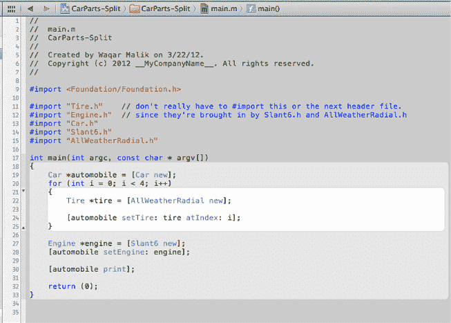


## 代码折叠与聚焦功能

图 7-18 展示了使用聚焦条（focus ribbon）高亮代码的效果。

您可以点击聚焦条来折叠代码块。假设您确信 图 7-18 中展示的 `if` 语句和 `for` 循环是正确的，并且不想再看它们，那么可以将注意力集中在函数中的其余代码上。点击 `if` 语句左侧，其代码体将会折叠，如 图 7-19 所示。

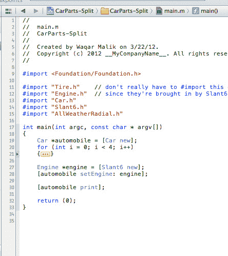

图 7-19 展示了代码折叠效果。您以为我们会在这里放一个《沙丘》的梗，对吧？

现在您可以看到，`if` 语句的代码体已被替换为一个带有省略号的方框。双击该方框即可将代码展开回原来的样子，或者点击聚焦条中的展开三角形。代码并未被删除，只是被隐藏了，因此您的文件即使在这种状态下也能正常编译和运行。**代码折叠**（Code folding）是这类功能的另一种名称。请查看 Editor →  Code Folding 菜单，那里有许多额外的选项。

## 导航栏已打开

在代码编辑器的顶部有一个小小的控制条，如 图 7-20 所示，它被称为**导航栏**（navigation bar）。其中的许多控件用于让您快速在项目中的源文件之间跳转。

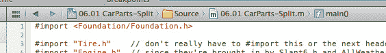

图 7-20 展示了导航栏。

最左侧是一个菜单按钮，它提供对编辑器最近历史记录以及其他一些高级功能的快速访问。接下来是后退和前进按钮，让您可以在本次编辑会话中打开过的文件历史记录中循环切换。它们的工作方式类似于 Safari 的后退和前进箭头。这些按钮旁边是一个路径，显示当前文件（`Car.m`）及其在项目中的位置，而非其目录路径。路径中的每一项都是一个按钮；点击任一按钮，就会弹出一个导航菜单。

导航栏中的最后一个项是函数菜单。它显示插入点当前位于方法 `-setTire:atIndex:` 中。点击该菜单即可查看所有感兴趣符号，如 图 7-21 所示。

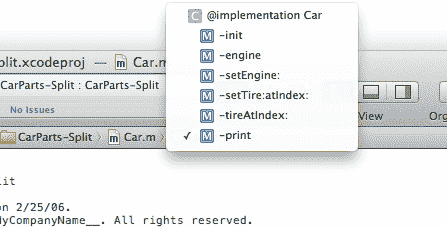

图 7-21 展示了文件中的符号。

`-setTire:atIndex:` 被高亮显示，因为这是插入点所在位置。您可以看到它上方和下方的其他方法，按它们在文件中的出现顺序排序。您可以  点击函数菜单以按字母顺序排序。

除了方法名称之外，您还可以向此菜单添加自己的项。有几种不同的添加方式。一种方式是使用 `#pragma mark whatever` 将字符串 `whatever` 放入菜单中。这对于添加人类可读的锚点非常有用，方便您和其他生物体查看和使用。`#pragma mark -`（减号）会在菜单中放入一条分隔线。Xcode 还会查找以特定字符串 `MARK:`、`TODO:`、`FIXME:`、`!!!:` 和 `???：` 开头的注释。Xcode 也会将这些文本添加到函数菜单中。这些都是程序员留下的信号，意思是“在将此程序发布给毫无防备的公众之前，最好回来看看这个。”

**注意**：“Pragma”一词源自希腊语，意为“行动”。`#pragma` 是一种向编译器和代码编辑器传递信息或指令的方式，这些信息超出了 Objective-C 代码的常规行。Pragma 通常被忽略，但它们可能对软件开发中使用的工具具有意义。如果某个工具不理解 pragma，该工具应该点头、微笑并忽略它，而不产生警告或错误。

## 获取信息

在您自己的代码和 Cocoa 头文件之间跳转固然很好，但有时您需要从自身代码之外获取一些信息。幸运的是，Xcode 附带了一个包含文档和参考资料的知识宝库（解释什么是宝库超出了本书的范围）。

### 帮帮忙，谢谢

检查器（inspector）顶部有两个图标。到目前为止，在我们探索中，第一个图标被选中，检查器显示的是当前文件的属性。另一个图标启用检查器中的快速帮助（Quick Help）。要使用快速帮助，请点击代码中的某些内容，然后查看检查器中显示的内容。如果您点击源代码中的其他位置，快速帮助面板会自我更新。

例如，假设您的插入点位于单词 `NSString` 内部。快速帮助将会显示如 图 7-22 所示的内容。

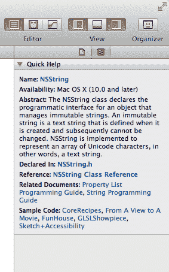

图 7-22 展示了快速帮助。

这里有大量可用的信息。前两个项在文档窗口中打开 `NSString` 类参考文档。`NSString.h` 项在编辑器中打开头文件。

“Abstract”（摘要）部分描述了该类。如果您将光标放在方法调用的中间，此部分将描述该方法以及相关的调用。这里还有指向更高级别文档的链接，以及大量使用 `NSString` 的代码示例。蓝色文字是可以点击以获取更多信息的链接。您还可以通过按住 Option 键点击符号来从快速帮助中获取更多信息。如果这样做，您会看到类似 图 7-23 的内容。如需更多信息，请点击右上角的书籍图标以打开该符号的文档。

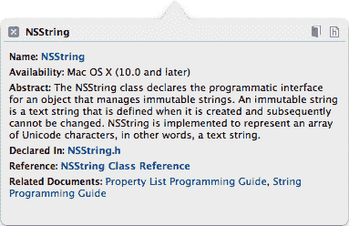

图 7-23 展示了点击 `NSString` 后获得的更多信息，正如所承诺的那样。

### 文档员在家吗？

如果您想直接进入 Apple 官方 API 文档，一个非常快的方法是按住 Option 键并双击某个符号。这实际上是执行该符号文档搜索的一个快捷方式。

假设您有一行代码如 `[someString UTF8String]`，它将 `someString`（一个 `NSString`）转换为用 Unicode 表示的 C 风格字符串。如果您按住 Option 键并双击 `UTF8String`，文档浏览器将会打开并搜索 `UTF8String`，如 图 7-24 所示。

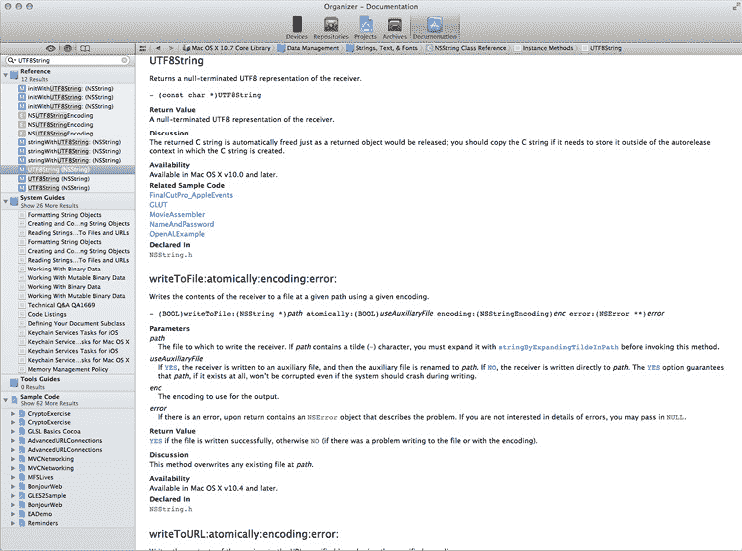

图 7-24 展示了 Xcode 文档窗口。

那个窗口非常繁忙，并塞满了大量信息。左上角是一个搜索框，其中已预先填入了 `UTF8String`。工具栏下方的按钮条允许您精确定制搜索哪些文档集。您可以查看所有文档，或仅查看 OS X 或 iOS 文档。

按钮条下方是一个窗格（左侧），其中包含文档集和一组书签。您可以通过弹出菜单向特定的文档块添加书签。文档书签是全局的，不限于特定项目。

窗口顶部左侧窗格中是一个浏览器，显示所有搜索匹配项。在 图 7-24 中，它显示了三个方法和一个常量。最有趣的是最后一个 `UTF8`，这正是我们实际调用的方法。您还会注意到同一项列出了多个版本。这是因为您可能安装了多套文档：iOS、OS X 或其他。请为您感兴趣的平台选择文档。请记住，某些方法可能并非在所有平台上都可用。

该浏览器下方是一个显示文档的窗格。这个区域对于阅读文档来说有点小，但可以轻松地将文档打开到另一个 Xcode 窗口甚至网页浏览器中。

## 调试


## 调试：识别并修复程序错误

错误在所难免。当你刚开始学习一门新语言和新平台时，程序中难免会出现错误。面对问题时，深呼吸，喝一口你最喜欢的饮料，然后系统地找出问题所在。这个找出程序错误的过程被称为**调试**（debugging）。

### 粗暴式调试

最简单的调试方式是暴力破解，有时被称为**原始人调试**（caveman debugging），即插入`NSLog`等打印语句来显示程序的控制流以及一些数据值。你可能一直都在这样做，只是不知道它的名字。你可能会遇到一些看不起原始人调试的人，但它确实是一种有效的工具，尤其是在你刚开始学习新系统时。所以，忽略那些反对者吧。

### Xcode 的调试器

除此之外，Xcode 还包含一个调试器。**调试器**是一个位于你的程序和操作系统之间的程序，它可以中断你的程序，使其停止运行，并允许你查看程序的数据，甚至修改内容。当你查看完毕后，可以恢复执行以观察结果。你还可以单步执行代码，将计算机的速度降低到人类可感知的速度，从而精确地查看代码对数据产生了什么影响。

Xcode 还提供了一个调试器面板，可以一目了然地显示大量信息，以及一个调试控制台，你可以在其中直接向调试器输入命令。

**注意**：Xcode 提供了两种调试器供你选择：`GDB`和`LLDB`。`GDB`是 GNU 项目的一部分，已在无数不同的平台上可用，并且已经存在多年。`LLDB`是炙手可热的新竞争者，是 LLVM 项目的一部分，该项目也是许多其他 Xcode 工具的源代码。目前，这两种调试器之间的差异很微妙，且主要在于内部实现。

我们将在 Xcode 文本编辑器中讨论调试。如果你想了解更多，一定要尝试一下其他调试模式。

### 微妙的符号化

当你计划调试程序时，需要确保使用的是**调试**（Debug）构建配置。你可以在 Xcode 工具栏的 **Edit Scheme** 弹出菜单项中检查此项。构建配置会告诉编译器发出额外的调试符号，调试器利用这些符号来确定程序中各元素的位置。

### 开始调试！

与之前使用的命令行程序相比，在 GUI 程序中使用调试器要稍微容易一些。GUI 程序习惯于等待用户操作，因此使用它让我们有充足的时间找到调试器按钮、中断程序并开始检查。而我们的命令行程序则来去匆匆，让你来不及进行太多调试。因此，让我们首先在 `main` 中设置一个断点。我们将使用 `07.01 CarParts-split`，它只是上一章中同一项目的一个副本。

打开 `CarParts-Split.m`，然后点击装订线（如之前所见，这是焦点功能区左侧的宽条）。你会看到一个蓝色的箭头标记（是的，这是技术术语），表示你新的断点，如图 Figure 7-25 所示。你可以通过将断点拖出装订线来删除它，也可以通过点击它来禁用它。

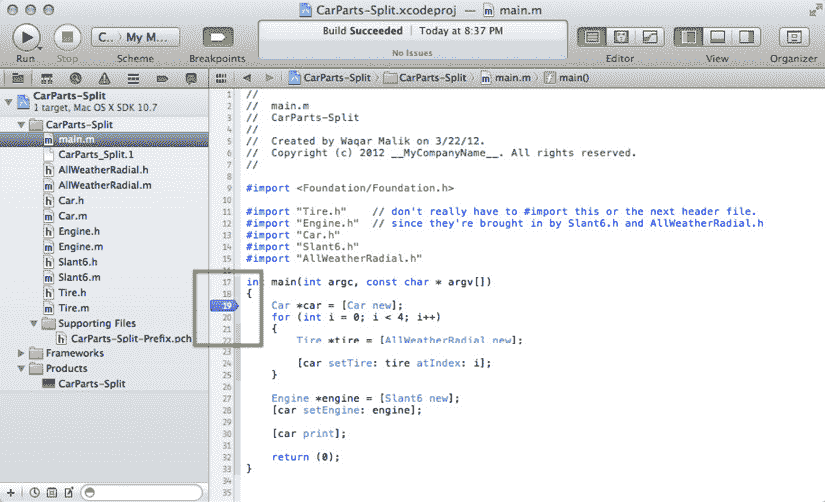

Figure 7-25. 设置断点

现在，选择 **Run** 来运行你的程序。你的程序应在断点处停止，如图 Figure 7-26 所示。注意指向一行代码的绿色箭头。这就像商场地图上的“你在这里”标志。

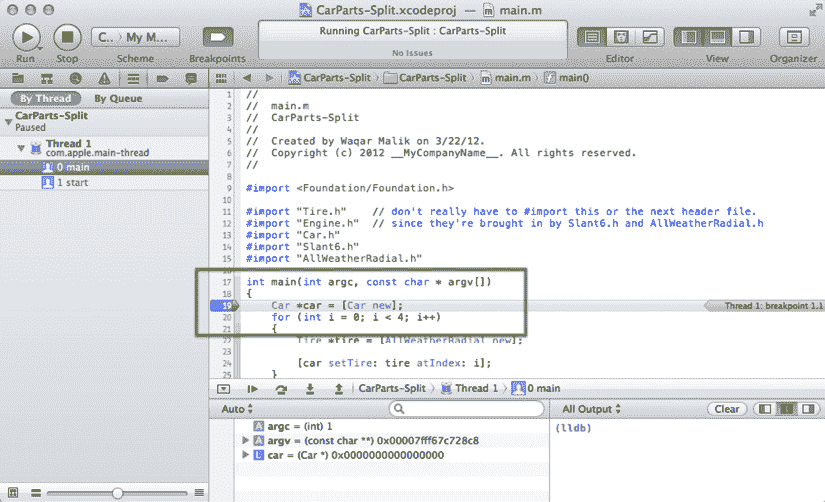

Figure 7-26. 你在这里

程序停止后，你会看到导航栏上方出现了一个新的控制条，如图 Figure 7-27 所示。

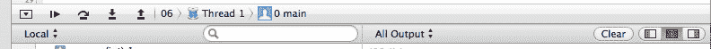

Figure 7-27. 调试器控件

耶，又多了些按钮。它们是做什么的？从左到右，第一个按钮用于打开和关闭调试面板。

接下来的四个按钮控制程序下一步做什么。第一个按钮看起来像 CD 播放器上的播放按钮（如果你不知道 CD 播放器是什么，去问问你的父母）。这是**继续**（continue）按钮。点击它后，程序会一直运行，直到遇到断点、结束或崩溃。

下一个控件看起来像一个圆点，上面有一个人跳过它，这是**单步跳过**（step over）按钮。它执行一行代码，然后将控制权返回给你。如果你点击**单步跳过**按钮三次，“你在这里”箭头将移动到 `-setTire:atIndex:` 调用处，如图 Figure 7-28 所示。

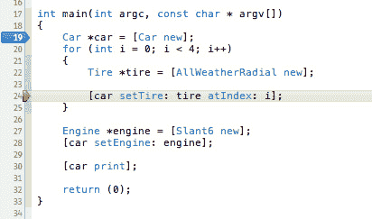

Figure 7-28. 单步执行三次后

下一个按钮，箭头向下指向一个圆点，是**单步进入**（step into）按钮。如果你当前所在的函数或方法有源代码，Xcode 将进入该函数，调出其代码，并将“你在这里”箭头设置在其开头，如图 Figure 7-29 所示。

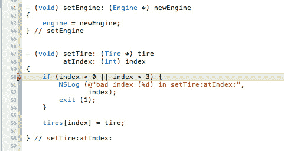

Figure 7-29. 进入一个方法后（本例中为 `setTire`）

最后一个按钮是**单步跳出**（step out），它让当前函数执行完毕，然后将控制权返回到调用函数的下一条语句。如果你在跟着操作，暂时不要使用这个按钮。稍后我们将查看此方法中的一些数据值。

最后一个控件是一个弹出菜单，让你选择要查看哪个线程。你暂时还不需要处理多线程编程，因此可以先忽略线程选择。

在按钮的右侧，我们看到**调用堆栈**（call stack），即当前活动的函数集合。如果 A 调用了 B，而 B 又调用了 C，那么 C 被认为在堆栈的顶部，B 和 A 在其下方。如果你现在点击打开调用堆栈菜单，它会显示 `-[Car setTire:atIndex:]`，然后是 `main`。这意味着 `main` 调用了 `-setTire:atIndex:`。对于更复杂的程序，这个调用堆栈（也称为**堆栈跟踪**（stack trace））中可能包含数十个条目。有时，调试过程中解决的最佳问题是：“这段代码到底是怎么被调用的？”通过查看调用堆栈，你可以看到是谁调用了谁，才导致当前的（混乱）状态。

### 查看一下

现在程序已经停止，下一步该做什么？通常，当你设置断点或单步执行到程序的某个特定部分时，你关心的是**程序状态**（program state）——即变量的值。

Xcode 提供了**数据提示**（datatips），类似于当你悬停在按钮上时，工具提示会告诉你该按钮的功能。在 Xcode 编辑器中，你可以将鼠标悬停在一个变量或方法参数上，Xcode 会弹出一个显示其值的小窗口，如图 Figure 7-30 所示。

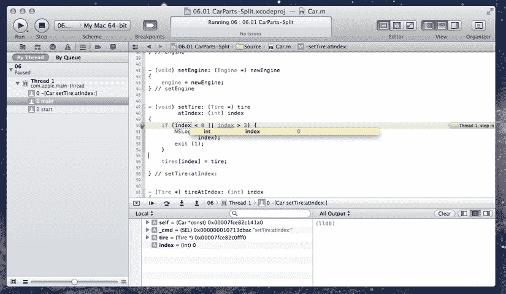

Figure 7-30. Xcode 数据提示

Figure 7-30 显示我们正悬停在 `index` 上。数据提示弹出并显示其值为零，正如我们所预期的。这真的很酷：我们可以通过点击该值并输入一个新值来修改它。例如，你可以输入 `37`，然后使用几次**单步跳过**命令，观察程序因索引越界而退出。


好的，作为高级文档工程师和翻译员，我将遵循您提供的注意事项和示例，将给定的英文文本翻译成中文。


当你还在调试循环中时，将鼠标悬停在轮胎（tires）上，会看到一个数组。将鼠标向下滑动到箭头处悬停，直到它展开，显示所有四个轮胎。接着，向下移动到第一个轮胎上，Xcode 会向你展示轮胎的内部结构。我们的轮胎中没有实例变量，所以看不到太多东西。但如果该类有实例变量，它们就会被显示出来并且可以编辑。你可以在图 7-31 中看到所有这些悬停和鼠标移动操作的结果。

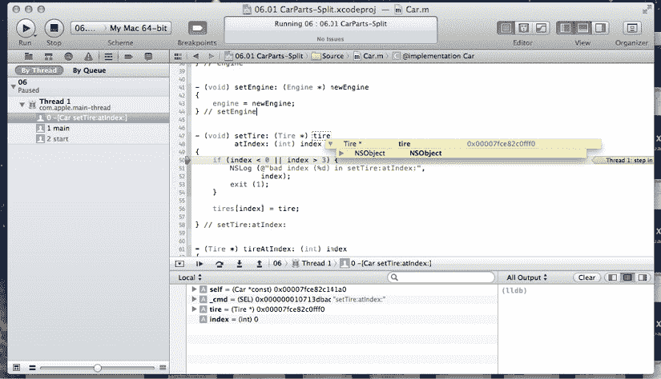

图 7-31. 深入挖掘程序的数据

以上就是对 Xcode 调试器的快速概览。这些信息，加上你大量的时间投入，应该足以让你调试遇到的任何问题。祝调试愉快！

### 速查表

我们在本章中提到了很多键盘快捷键。如之前所承诺的，我们将它们都收集到了一个方便查阅的地方：表 7-1。为了方便你，我们还加入了几个本章未提及的快捷键。如果你读的是纸质版书籍，在把这本书送给别人之前，可以随意撕下这几页，除非你认为这不太礼貌。

表 7-1. Xcode 键盘快捷键

| 按键 | 描述 |
| --- | --- |
|  `` | 将代码块向左移动 |
| ![image `]` | 将代码块向右移动 |
| `tab` | 接受一个自动补全建议 |
| `esc` | 显示或隐藏自动补全菜单 |
| `control +. (句点)` | 循环浏览自动补全建议 |
| `control + shift +. (句点)` | 反向循环浏览自动补全建议 |
|  `+ control + S` | 创建快照 |
| `control + F` | 向前移动光标 |
| `control + B` | 向后移动光标 |
| `control + P` | 将光标移动到上一行 |
| `control + N` | 将光标移动到下一行 |
| `control + A` | 将光标移动到行首 |
| `control + E` | 将光标移动到行尾 |
| `control + T` | 调换光标两侧的字符 |
| `control + D` | 删除光标右侧的字符 |
| `control + K` | 删除当前行 |
| `control + L` | 将光标居中于文本编辑器中 |
|  `+ shift + O` | 显示“快速打开”窗口 |
|  `+ control + ↑` | 打开对应的头/实现文件 |
| `⌥ + 双击` | 在文档中搜索 |
|  `Y` | 激活 / 停用断点 |
|  `-control-Y` | 继续（在调试器中） |
| `F6` | 单步跳过 |
| `F7` | 单步进入 |
| `F8` | 单步跳出 |

## 总结

本章信息量很大，而且我们实际上并没有太多地讨论 Objective-C。这是怎么回事？就像木匠需要了解的不仅仅是木头（例如，他们还需要了解所有关于工具的知识）一样，Objective-C 程序员需要了解的不仅仅是这门语言本身。能够在 Xcode 中快速编写、导航和调试代码，意味着你可以花更少的时间与环境作斗争，而将更多的时间用于做有趣的事情。

接下来是对 Cocoa 中一些类的重要介绍。那应该会很有趣！

# 第 8 章：Foundation Kit 快速浏览

你已经看到 Objective-C 是一门非常棒的语言，而我们甚至还没有探索完它提供的所有特性。现在，我们将快速绕道，看看 Cocoa 的 Foundation 框架。尽管严格来说是 Cocoa 的一部分，而非内置于 Objective-C 中，但 Foundation 框架如此重要，以至于我们认为值得在本书中探讨。

正如你在第 2 章中看到的，Cocoa 实际上由许多不同的框架组成。其中，桌面（OS X）应用程序最常用的是 Foundation 和 Application Kit。Application Kit 拥有所有的用户界面对象和高级类。你将在第 16 章中体验 AppKit（酷孩子们这么称呼它）。

如果你将要开发 iOS 应用程序，那么你将使用 User Interface Kit（`UIKit`）。我们将在第 15 章中对 `UIKit` 进行一个高屋建瓴的概述。`UIKit` 被认为是 iOS 平台上的 AppKit，它包含了 iOS 应用程序的所有界面对象。

## 坚实的基础

Foundation，顾名思义，是所有 UI 框架的基础。因为它没有 UI 对象，所以你可以为 iOS 和 OS X 应用程序使用相同的对象。

Foundation 框架包含许多有用的、底层的、面向数据的类和类型。我们将访问其中一些，例如 `NSString`、`NSArray`、`NSEnumerator` 和 `NSNumber`。Foundation 有一百多个类，你可以通过查看 Xcode 安装的文档来探索它们。你可以在 Xcode 的组织器窗口中选择工具栏中的“文档”项来阅读文档。

Foundation 框架是构建在另一个名为 CoreFoundation 的框架之上的。CoreFoundation 完全是用 C 语言编写的，如果你愿意，也可以使用它，但我们不会在本书中讨论它。在谈论两个可能名称相似的框架时，不要感到困惑。如果你遇到以“CF”开头的函数名或变量名，它们属于 CoreFoundation。其中大部分在 Foundation 框架中有对应的对象，并且有些可以轻松地相互转换。

## 使用项目模板代码

在继续之前，这里有一个关于本章及本书剩余部分项目的说明。我们仍将创建 Foundation 工具项目，但我们会保留模板代码，如下所示：

```
#import <Foundation/Foundation.h>

int main (int argc, const char * argv[])

{

@autoreleasepool

{

// insert code here…

NSLog(@"Hello, World!");

} return 0;

}
```

仔细看看这段代码。`main()` 以关键字 `@autoreleasepool` 开始，所有 Cocoa 代码都写在该关键字和 `return` 语句之间的大括号内。这是对 Cocoa 内存管理的一个预览，我们将在下一章讨论。现在，请点头微笑，并保留 `@autoreleasepool` 这部分代码。如果你把它删掉了，你不会伤到自己，但在运行程序时会得到一些非常奇怪的消息。

## 一些有用的类型

在深入探讨真正的 Foundation 类之前，让我们先看看 Cocoa 为我们提供的一些结构体。

### 范围（Range）概述

第一个结构体是 `NSRange`：

```
typedef struct _NSRange

{

unsigned int location;

unsigned int length;

} NSRange;
```

这个结构体用于表示事物的范围，通常是字符串中的字符范围或数组中的元素范围。`location` 字段保存范围的起始位置，`length` 是范围内的元素数量。对于字符串 “Objective-C is a cool language”，单词 “cool” 可以用从位置 17 开始、长度为 4 的范围来描述。`location` 可以取值 `NSNotFound` 来表示该范围不指向任何东西，很可能是因为它未初始化。

你可以通过三种不同的方式创建一个新的 `NSRange`。首先，可以直接赋值给字段：

```
NSRange range;

range.location = 17;

range.length = 4;
```

其次，可以使用 C 语言的聚合结构赋值机制（听起来是不是很厉害？）：

```
NSRange range = { 17, 4 };
```

最后，Cocoa 提供了一个名为 `NSMakeRange()` 的便捷函数：

```
NSRange range = NSMakeRange (17, 4);
```

`NSMakeRange()` 的好处在于，你可以在任何可以使用函数的地方使用它，例如作为方法调用的参数。


```objc
[anObject flarbulateWithRange:NSMakeRange(13, 15)];
```

## 几何类型

你经常会见到以“CG”为前缀、处理几何数据的类型，例如 `CGPoint` 和 `CGSize`。这些类型来自 Core Graphics 框架，用于二维渲染。Core Graphics 使用 C 语言编写，因此我们也用 C 类型与之交互。`CGPoint` 表示笛卡尔平面上的 (x, y) 坐标点：

```c
struct CGPoint
{
    float x;
    float y;
};
```

`CGSize` 包含宽度和高度：

```c
struct CGSize
{
    float width;
    float height;
};
```

在 Shapes 系列程序中，我们可以使用 `CGPoint` 和 `CGSize` 替代自定义的矩形结构体，但当时我们希望尽可能保持简单。Cocoa 提供了矩形类型，它由点与尺寸组合而成：

```c
struct CGRect
{
    CGPoint origin;
    CGSize size;
};
```

Cocoa 还为我们提供了便捷的构造函数：`CGPointMake()`、`CGSizeMake()` 和 `CGRectMake()`。

**注：** 为什么这些类型是 C 结构体而不是完整的对象？这归根结底是性能问题。程序（尤其是 GUI 程序）在运行时需要大量临时点、尺寸和矩形。请记住，所有 Objective-C 对象都是动态分配的，而动态分配是相对昂贵的操作，会消耗不少时间。将这些结构体设计为第一类对象会带来巨大的使用开销。

## 字符串引导

我们旅程中第一个真正的类是 `NSString`，即 Cocoa 的字符串处理类。字符串只是人类可读字符的序列。由于计算机需要定期与人类交互，拥有存储和操作可读文本的方式是个好主意。你之前已经见过 `NSString`，它使用特殊的 `NSString` 字面量（在双引号字符串前加 `@` 符号），例如 `@"Hi!"`。这些字面量字符串与编程方式创建的 `NSString` 完全一样。

如果你曾在 C 语言中进行过字符串处理（例如 Dave Mark 所著《在 Mac 上学 C》中介绍的内容），就知道这相当痛苦。C 语言将字符串实现为简单的字符数组，并以尾随的零字节标记结束。Cocoa 的 `NSString` 内置了许多方法，使字符串处理变得轻松许多。

### 构建字符串

你已经见过 `printf()` 和 `NSLog()` 这类函数，它们接受格式字符串和参数并输出格式化内容。`NSString` 的 `stringWithFormat:` 方法也能类似地根据格式和参数创建新的 `NSString`：

```objc
+ (id) stringWithFormat: (NSString *) format, …;
```

你可以像这样创建新字符串：

```objc
NSString *height;
height = [NSString stringWithFormat:@"Your height is %d feet, %d inches", 5, 11];
```

结果字符串是“Your height is 5 feet, 11 inches”。

## 类方法

`stringWithFormat:` 的声明中有几个有趣的地方。首先是末尾的省略号 (`…`)，它向你（和编译器）表明该方法可以接受任意数量的额外参数，以逗号分隔列表形式指定，就像 `printf()` 和 `NSLog()` 一样。

关于 `stringWithFormat:` 的另一个奇特且更重要的点是声明中非常特殊的前导字符：加号。这跟谷歌的社交网络有关系吗？其实没有。当 Objective-C 运行时构建一个类时，它会创建一个代表该类的**类对象**。类对象包含指向父类的指针、类名以及类的方法列表。类对象还包含一个 `long` 类型的值，用于指定该类新创建实例对象的大小（以字节为单位）。

当你使用加号声明方法时，你就将该方法标记为**类方法**。该方法属于类对象（而非类的实例对象），通常用于创建新实例。用于创建新对象的类方法称为**工厂方法**。

`stringWithFormat:` 就是一个工厂方法。它根据你提供的参数为你创建一个新对象。使用 `stringWithFormat:` 创建新字符串比从空字符串开始逐个构建所有组件要简单得多。

类方法也可用于访问全局数据。AppKit（用于 OS X）中的 `NSColor` 和 UIKit（用于 iOS）中的 `UIColor` 提供了一些以颜色命名的类方法，例如 `redColor` 和 `blueColor`。要获取用于绘制的蓝色对象，你可以这样写：

```objc
NSColor *haveTheBlues = [NSColor blueColor];
```

或者

```objc
UIColor *blueMan = [UIColor blueColor];
```

你创建的方法绝大多数都是实例方法，并使用前导减号 (`-`) 声明。这些方法会在特定对象实例上操作，例如获取某个 `Circle` 的颜色或 `Tire` 的气压。如果方法执行更通用的功能（例如创建实例对象或访问某些全局类数据），则很可能使用前导加号 (`+`) 将其声明为类方法。

### 大小问题

另一个实用的 `NSString` 方法（实例方法）是 `length`，它返回字符串中的字符数：

```objc
- (NSUInteger) length;
```

你可以这样使用它：

```objc
NSUInteger length = [height length];
```

或者在表达式中这样使用：

```objc
if ([height length] > 35)
{
    NSLog (@"wow, you're really tall!");
}
```

**注：** `NSString` 的 `length` 方法在处理国际字符串（例如包含俄语、中文或日文字符的字符串）时能正确处理，其底层使用了 Unicode 国际字符标准。在纯 C 语言中处理这些国际字符串尤其痛苦，因为单个字符可能占用超过 1 个字节。这意味着像 `strlen()` 这样仅统计字节数的函数可能返回错误的值。

### 比较策略

字符串的比较是一种常见操作。有时，你需要判断两个字符串是否相等（例如，`username` 是否等于 `'wmalik'`？）。有时，你需要了解两个字符串的排序顺序，以便对名称列表进行排序。`NSString` 提供了多个比较函数来帮助你完成这些任务。

`isEqualToString:` 将接收者（消息发送到的对象）与作为参数传入的字符串进行比较。`isEqualToString:` 返回一个 `BOOL` 值（`YES` 或 `NO`），指示两个字符串的内容是否相同。其声明如下：

```objc
- (BOOL) isEqualToString: (NSString *) aString;
```

使用方法如下：

```objc
NSString *thing1 = @"hello 5";
NSString *thing2 = [NSString stringWithFormat: @"hello %d", 5];

if ([thing1 isEqualToString: thing2])
{
    NSLog (@"They are the same!");
}
```

要比较字符串，请使用 `compare:` 方法，声明如下：

```objc
- (NSComparisonResult) compare: (NSString *) aString;
```

`compare:` 会逐字符比较接收对象与传入的字符串。它返回一个 `NSComparisonResult`（实际上是一个 `enum`），表示比较结果：

```objc
enum
{
    NSOrderedAscending = -1,
    NSOrderedSame,
    NSOrderedDescending
};
typedef NSInteger NSComparisonResult;
```

**比较字符串：正确做法**

在比较字符串是否相等时，应使用 `isEqualToString:` 而不是直接比较它们的指针值，例如：

```objc
if ([thing1 isEqualToString: thing2])
{
    NSLog (@"The strings are the same!");
}
```

与以下代码不同：

```objc
if (thing1 == thing2)
{
    NSLog (@"They are the same object!");
}
```

这是因为 `==` 运算符只作用于 `thing1` 和 `thing2` *指针*本身的值，而非它们指向的内容。由于 `thing1` 和 `thing2` 是不同的字符串，第二种比较会认为它们不同。

有时，你确实需要检查两个对象是否相同：`thing1` 是否就是 `thing2` 这个对象本身？此时应使用 `==` 运算符。如果你需要检查等价性（即这两个字符串是否表示相同的内容），则应使用 `isEqualToString:`。


如果您曾经使用过 C 语言的 `qsort()` 或 `bsearch()` 函数，可能会对此感到熟悉。如果 `compare:` 的结果是 `NSOrderedAscending`，则左侧的值小于右侧的值——也就是说，进行比较的对象在字母顺序上早于传入的字符串。例如，`[@"aardvark" compare: @"zygote"]` 会返回 `NSOrderedAscending`。

同样地，`[@"zoinks" compare:@"jinkies"]` 会返回 `NSOrderedDescending`。而正如您所料，`[@"fnord" compare: @"fnord"]` 会返回 `NSOrderedSame`。

### 大小写不敏感性

`compare:` 执行的是区分大小写的比较。换句话说，`@"Bork"` 和 `@"bork"` 进行比较时，不会返回 `NSOrderedSame`。还有另一个方法 `compare:options:`，它赋予了您更多的控制权：

```
- (NSComparisonResult) compare: (NSString *) aString
options: (NSStringCompareOptions) mask;
```

`options` 参数是一个位掩码，这是一种利用每一位来表示某个选项是否开启的值。您可以使用按位或运算符（`|`）来组合多个选项标志。以下是一些常用的选项：

*   `NSCaseInsensitiveSearch`：大小写字符被视为相同。
*   `NSLiteralSearch`：执行精确比较，包括大小写。
*   `NSNumericSearch`：字符串中的数字被当作数值进行比较，而不是作为字符值。如果没有这个选项，`“100”` 会排在 `“99”` 之前，这对于大多数非程序员来说相当奇怪，甚至被认为是错误的。

例如，如果您想执行一个忽略大小写但正确排序数字的比较，可以这样做：

```
if ([thing1 compare: thing2 options: NSCaseInsensitiveSearch | NSNumericSearch]
    == NSOrderedSame)
{
    NSLog (@"They match!");
}
```

### 是否包含在内？

有时，您想查看一个字符串是否包含另一个字符串。例如，您可能想知道一个文件名是否以 `“.mov”` 结尾，以便在 QuickTime Player 中打开它，或者检查它是否以 `“draft”` 开头，以判断它是否是文档的草稿版本。这里有两个方法可以帮到您：第一个方法检查字符串是否以另一个字符串开头，第二个方法判断字符串是否以另一个字符串结尾：

```
- (BOOL) hasPrefix: (NSString *) aString;
- (BOOL) hasSuffix: (NSString *) aString;
```

您可以像下面这样使用这些方法：

```
NSString *fileName = @"draft-chapter.pages";

if ([fileName hasPrefix: @"draft"])
{
    // this is a draft
}

if ([fileName hasSuffix: @".mov"])
{
    // this is a movie
}
```

因此，`draft-chapter.pages` 会被识别为一个草稿版本（因为它以 `“draft”` 开头），但不会被识别为一个电影文件（其结尾是 `“.pages”` 而不是 `“.mov”`）。

如果您想查看一个字符串是否位于另一个字符串内部，请使用 `rangeOfString:`：

```
- (NSRange) rangeOfString: (NSString *) aString;
```

当您向一个 `NSString` 对象发送 `rangeOfString:` 消息时，传入要查找的字符串。它会返回一个 `NSRange` 结构体，用于显示字符串中匹配部分的位置和大小。因此，下面的示例：

```
NSRange range = [fileName rangeOfString: @"chapter"];
```

返回的 `range.location` 为 `6`，`range.length` 为 `7`。如果在接收者中未找到参数，`range.location` 将等于 `NSNotFound`。

### 可变性

`NSString` 是**不可变**的。这不意味着您无法让它们保持安静；它指的是，一旦它们被创建，就无法改变它们。您可以对它们进行各种操作，比如用它们创建新字符串、查找字符以及与其他字符串进行比较，但您无法通过移除字符或添加新字符来改变它们。

Cocoa 提供了一个名为 `NSMutableString` 的 `NSString` 子类。如果您想就地修改字符串，请使用它。

> **注意**：来自 Java 的程序员应该对这个区别感到很熟悉。`NSString` 的行为类似于 Java 的 `String` 类，而 `NSMutableString` 就像 Java 的 `StringBuffer` 类。

您可以使用类方法 `stringWithCapacity:` 来创建一个新的 `NSMutableString`，其声明如下：

```
+ (id) stringWithCapacity: (NSUInteger) capacity;
```

`capacity` 参数只是给 `NSMutableString` 的一个建议，就像您告诉一个青少年回家的时间一样。字符串并不受限于您提供的容量——它只是一种优化。例如，如果您知道您要构建一个 40 兆字节大小的字符串，`NSMutableString` 可以预先分配一块内存来容纳它，从而使后续操作快得多。像这样创建一个新的可变字符串：

```
NSMutableString *string = [NSMutableString stringWithCapacity:42];
```

一旦您有了一个可变字符串，您就可以对它执行各种奇妙的操作。一个常见的操作是使用 `appendString:` 或 `appendFormat:` 追加一个新字符串，如下所示：

```
- (void) appendString: (NSString *) aString;
- (void) appendFormat: (NSString *) format, …;
```

`appendString:` 接受其 `aString` 参数，并将其复制到接收对象的末尾。`appendFormat:` 的工作方式类似于 `stringWithFormat:`，但它不是创建一个新的字符串对象，而是将格式化后的字符串追加到接收字符串的末尾，例如：

```
NSMutableString *string = [NSMutableString stringWithCapacity:50];
[string appendString: @"Hello there "];
[string appendFormat: @"human %d!", 39];
```

在这段代码执行完毕后，`string` 将拥有友好的值 `“Hello there human 39!”`。

您可以使用 `deleteCharactersInRange:` 方法从字符串中移除字符：

```
- (void) deleteCharactersInRange: (NSRange) aRange;
```

您通常会结合使用 `deleteCharactersInRange:` 和 `rangeOfString:`。请记住，`NSMutableString` 是 `NSString` 的一个子类。通过面向对象编程的奇迹，您也可以在 `NSMutableString` 上使用 `NSString` 的所有特性，包括 `rangeOfString:`、比较方法以及所有其他方法。例如，假设您列出了所有的朋友，但后来您决定不再喜欢 Jack，并想把他从列表中移除：

首先，创建朋友列表：

```
NSMutableString *friends = [NSMutableString stringWithCapacity:50];
[friends appendString: @"James BethLynn Jack Evan"];
```

接下来，找到 Jack 所在的范围：

```
NSRange jackRange = [friends rangeOfString: @"Jack"];
jackRange.length++; // 吃掉后面的空格
```

在这个例子中，范围起始于 `15`，长度为 `5`。现在，我们可以将 Jack 从我们的圣诞贺卡名单中移除：

```
[friends deleteCharactersInRange: jackRange];
```

这将使字符串变为 `“James BethLynn Evan”`。

可变字符串对于实现 `description` 方法非常方便。您可以使用 `appendString` 和 `appendFormat` 为您的对象创建一个漂亮的描述。

因为 `NSMutableString` 是 `NSString` 的子类，我们免费获得了几种行为。第一个好处是，在任何使用 `NSString` 的地方，我们都可以用 `NSMutableString` 替代。任何接受 `NSString` 的方法也将接受 `NSMutableString`。字符串的使用者并不关心它是可变的还是不可变的。

另一个免费的行为来自于继承在类方法和实例方法上同样适用。因此，`NSString` 中方便的类方法 `stringWithFormat:` 也可用于创建新的 `NSMutableString`。您可以轻松地从一个格式字符串填充一个可变字符串：

```
NSMutableString *string = [NSMutableString stringWithFormat: @"jo%dy", 2];
```

`string` 的初始值是 `“jo2y”`，但您可以执行其他操作，例如从给定范围删除字符或在特定位置插入字符。请查阅 `NSString` 和 `NSMutableString` 的文档，以了解这些类中提供的数十种方法的完整细节。

### 集合代理

单个对象四处浮动是挺不错的，但通常，您需要让东西变得井井有条。Cocoa 提供了许多集合类，例如 `NSArray` 和 `NSDictionary`，它们的实例存在的目的就是为了容纳其他对象。

### NSArray


您已经在 C 语言中使用过数组。实际上，在本书的前面部分，我们就曾使用数组为一辆汽车存放四个轮胎。你可能还记得那段代码带来了一些困难。例如，我们必须检查数组索引是否有效：它不能低于 0 或超出数组末尾。另一个问题是：数组长度 4 被硬编码在`Car`类中，这意味着我们无法拥有超过四个轮胎的汽车。当然，这看起来不算太大的限制，但你永远不知道，我们一直被承诺的未来飞行喷气汽车是否会在平稳着陆时需要超过四个轮胎。

`NSArray`是一个 Cocoa 类，用于保存对象的有序列表。你可以在`NSArray`中放入任何类型的对象：`NSString`、`Car`、`Shape`、`Tire`，或者任何你想要的，甚至其他数组和字典。

一旦你有了一个包含对象的`NSArray`，你可以通过各种方式使用它，例如让对象的实例变量指向该数组，将数组作为参数传递给方法或函数，获取其中存储的对象数量，抓取特定索引处的对象，在数组中查找对象，遍历其内容，或者执行其他无数神奇的操作。

`NSArray`有两个限制。首先，它只能保存 Objective-C 对象。你不能在`NSArray`中存放基本 C 类型，比如`int`、`float`、`enum`、`struct`或随机指针。此外，你不能在`NSArray`中存放`nil`（对象的零值或 NULL 值）。有一些方法可以绕过这些限制，稍后你将看到。

你可以使用类方法`arrayWithObjects:`创建一个新的`NSArray`。你需要给它一个逗号分隔的对象列表，末尾加上`nil`来表示列表结束（顺便说一句，这也是你不能在数组中存放`nil`的原因之一）：

`NSArray *array = [NSArray arrayWithObjects:@"one", @"two", @"three", nil];`

这会创建一个由`NSString`字面量对象组成的三个元素的数组。你也可以使用数组字面量格式创建数组，这与`NSString`字面量格式非常相似。不是使用引号，而是使用方括号，如下所示：

`NSArray *array2 = @[@"one", @"two", @"three"];`

尽管`array`和`array2`是不同的对象，但它们的内容是相同的，而且第二种版本显然比第一种更容易输入。

**注意：** 当你使用字面量语法时，不需要在末尾包含`nil`。

一旦你有了一个数组，你可以获取它所包含的对象数量：

`- (NSUInteger)count;`

并且你可以获取特定索引处的对象：

`- (id)objectAtIndex:(NSUInteger)index;`

使用字面量语法访问数组中的对象就像在 C 语言中访问数组元素一样：

`id *myObject = array1[1];`

你可以结合计数和获取来打印数组的内容：

```
for (NSInteger i = 0; i < [array count]; i++)
{
    NSLog (@"index %d has %@.",i, [array objectAtIndex:i]);
}
```

你也可以使用数组字面量语法编写前面的代码：

```
for (NSInteger i = 0; i < [array count]; i++)
{
    NSLog (@"index %d has %@.",i, array[i]);
}
```

两种情况的输出看起来相同：

```
index 0 has one.
index 1 has two.
index 2 has three.
```

如果你引用的索引大于数组中的对象数量，Cocoa 会在运行时打印一条报错信息。例如，运行以下代码：

`[array objectAtIndex:208000];`

`array[208000];`

你会看到：

```
*** Terminating app due to uncaught exception 'NSRangeException',
reason: '*** -[__NSArray objectAtIndex:]: index 208000 beyond bounds [0 .. 2]'
```

就是这样。

因为你可能在 Cocoa 编程生涯中时不时看到类似的消息，让我们花点时间仔细看看。在通过说“终止了你的程序”给你一个下马威之后，消息提到它这样做是因为一个“未捕获的异常”。异常是 Cocoa 表达“我不知道如何处理这个”的方式。有些方法可以在代码中捕获异常并自行处理，但当你刚开始时，你不需要这样做。这个特定的异常是`NSRangeException`，这意味着传递给方法的范围参数有问题。具体的方法是`NSArray`的`objectAtIndex:`。

异常消息中最后的信息片段是最有趣的。消息的这一部分说我们请求数组中索引 208000 处的某个东西，但哎呀，数组只有三个元素——差得*那么远*。利用这些信息，你可以回溯到有问题的代码并找到错误。

追踪异常的原因可能会令人沮丧。你在控制台窗口中只得到这条消息。对于 GUI 程序，程序会继续运行。有一种方法可以让 Xcode 在异常发生时进入调试器，这样会好一些。要这样做，请在工作区导航面板中选择断点标签。你会得到一个断点列表。现在，我们设置了一个断点，如图 Figure 8-1 所示。

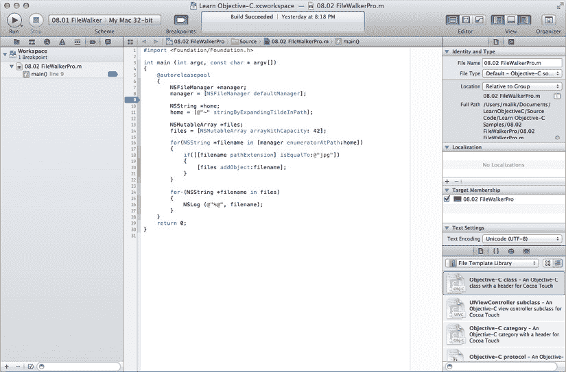

Figure 8-1. Xcode 的断点窗口

要添加另一个断点，只需点击面板左下角的 + 按钮，并从弹出菜单中选择“添加异常断点”项。你会看到另一个弹出窗口，如图 Figure 8-2 所示。

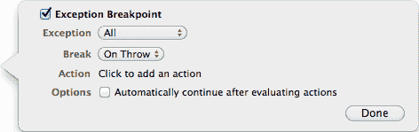

Figure 8-2. 添加异常断点

在 Xcode 设置断点之前，它允许你自定义断点的行为。例如，你可以让它打印错误消息或停止并为你执行一些命令。现在，我们不打算做任何花哨的事情。我们只是让程序在抛出异常的地方停止。要完成，我们点击“完成”来添加断点。添加断点后，窗口看起来像 Figure 8-3。现在，当你运行程序并且抛出异常时，调试器将停止并指向包含断点的行，如图 Figure 8-4 所示。

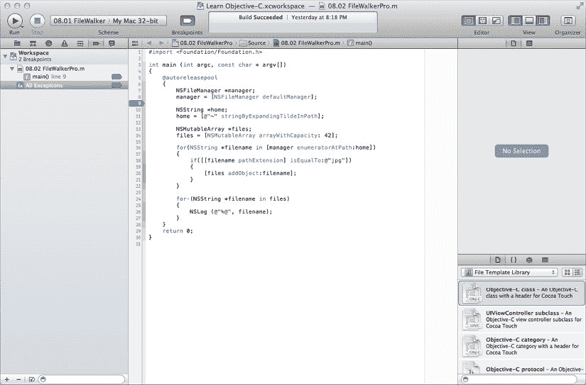

Figure 8-3. XCode 调试器指向包含断点的行

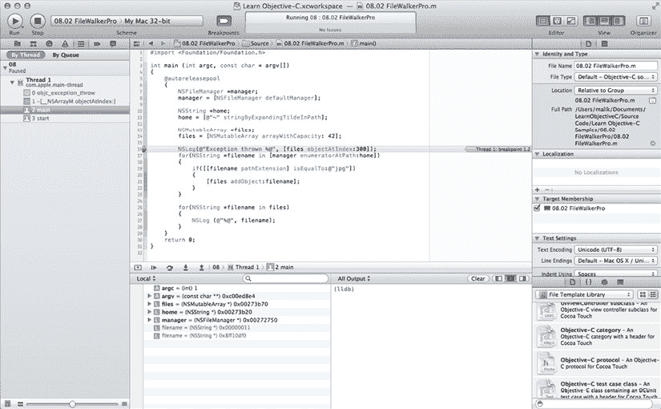

Figure 8-4. 现在，程序在断点处停止

你可能对 Cocoa 仅仅因为你的程序越过了数组边界就如此激烈地抱怨感到不满。但请相信我们：你会意识到这实际上是一件*很棒的事情*，因为它让你能够捕获那些否则可能未被检测到的错误。

像`NSString`一样，`NSArray`有很多特性。例如，你可以告诉数组返回特定对象的位置，基于当前数组中的一系列元素创建一个新数组，使用给定的分隔符将所有元素连接成一个字符串（这对于制作逗号分隔的列表很方便），或者创建一个已排序版本的新数组。

**拆分操作** 如果你使用过 Perl 或 Python 等脚本语言，你可能习惯于将字符串拆分成数组以及将数组元素连接成单个字符串。你也可以用`NSArray`做到这一点。

要拆分`NSArray`，请使用`-componentsSeparatedByString:`，如下所示：

`NSString *string = @"oop:ack:bork:greeble:ponies";`


```objc
NSArray *chunks = [string componentsSeparatedByString: @":"];
```

要将一个 `NSArray` 连接起来并创建其内容的字符串，可以使用 `componentsJoinedByString:`：
```objc
string = [chunks componentsJoinedByString: @" :- ) "];
```
上面这行代码会生成一个 `NSString`，其内容为 `"oop :- ) ack :- ) bork :- ) greeble :- ) ponies"`。

## 可变数组

和 `NSString` 一样，`NSArray` 创建的是不可变对象。一旦你创建了一个包含特定数量对象的数组，该数组就固定了：你无法添加或移除任何成员。当然，数组中所包含的对象本身可以自由变化（比如一辆`Car`在安全检测不合格后换上一套新的`Tires`），但数组对象本身将永远保持不变。

作为 `NSArray` 的补充，`NSMutableArray` 允许我们随时添加和移除对象。它使用一个类方法 `arrayWithCapacity` 来创建新的可变数组：
```objc
+ (id) arrayWithCapacity: (NSUInteger) numItems;
```
就像 `NSMutableString` 的 `stringWithCapacity:` 一样，数组的容量只是一个关于其最终大小的提示。该容量值的存在是为了让 Cocoa 能够在代码中执行一些优化。Cocoa 不会预先用对象填充数组，也不会用容量值来限制数组。你可以这样创建一个新的可变数组：
```objc
NSMutableArray *array = [NSMutableArray arrayWithCapacity: 17];
```

使用 `addObject:` 将对象添加到数组的末尾。
```objc
- (void) addObject: (id) anObject;
```
你可以通过一个像这样的循环将四个轮胎添加到数组中：
```objc
for (NSInteger i = 0; i < 4; i++)
{
    Tire *tire = [Tire new];
    [array addObject: tire];
}
```

你可以移除特定索引处的对象。例如，如果你不喜欢第二个轮胎，可以使用 `removeObjectAtIndex:` 将其删除。该方法的定义如下：
```objc
- (void) removeObjectAtIndex: (NSUInteger) index;
```
你可以这样使用它：
```objc
[array removeObjectAtIndex:1];
```
注意第二个轮胎位于索引 1。`NSArray` 对象像 C 数组一样，是从零开始索引的。

现在还剩三个轮胎。移除对象后数组中不会留下空洞。被移除对象之后的所有数组元素都会向前移动来填补这个空缺。

可变数组的其他方法还能实现很多很酷的功能，比如在特定索引处插入对象、替换对象、对数组进行排序，以及 `NSArray` 作为父类提供的所有好功能。

**注意** 没有用于创建 `NSMutableArray` 对象的字面量语法。

## 枚举天地

对数组的每个元素执行操作是 `NSArray` 的常见操作。例如，如果你非常喜欢绿色，你可以让数组中的所有形状将颜色改为绿色。或者，在构建你的匹兹堡驾驶模拟器时，为了使模拟更逼真，你可能想让车里的每个轮胎都漏气。你可以编写一个从 `0` 到 `[array count]` 的循环来获取索引处的对象，也可以使用 `NSEnumerator`，这是 Cocoa 描述这种集合迭代方式的方法。要使用 `NSEnumerator`，你需要通过 `objectEnumerator` 向数组请求枚举器：
```objc
- (NSEnumerator *)objectEnumerator;
```
你可以这样使用该方法：
```objc
NSEnumerator *enumerator = [array objectEnumerator];
```
此外还有一个 `reverseObjectEnumerator` 方法，如果你想从后往前遍历集合的话。

获取枚举器后，你启动一个 `while` 循环，每次循环时向枚举器请求其 `nextObject`：
```objc
- (id) nextObject;
```
当 `nextObject` 返回 `nil` 时，循环结束。这也是你不能在数组中存储 `nil` 值的另一个原因：无法区分 `nil` 结果是数组中存储的值，还是表示循环结束的 `nil`。

整个循环如下所示：
```objc
NSEnumerator *enumerator = [array objectEnumerator];
while (id thingie = [enumerator nextObject])
{
    NSLog (@"I found %@", thingie);
}
```
若你在枚举一个可变数组，有一个陷阱：你不能修改这个容器，比如添加或移除对象。如果你这样做了，枚举器会变得混乱，你会得到未定义的结果。“未定义结果”可能意味着从“嘿，好像成功了！”到“哎呀，它让我的程序崩溃了”的任意情况。

## 快速枚举

苹果在将 Objective-C 语言版本提升到 2.0 时，引入了一些小的改进。我们将看到的第一个改进叫做**快速枚举**，它使用了脚本语言用户熟悉的语法。它的样子如下：
```objc
for (NSString *string in array)
{
    NSLog (@"I found %@", string);
}
```
循环体会为数组中的每个元素执行一次，变量 `string` 持有每个数组的值。这比枚举器语法简洁得多，速度也快得多。

像所有 Objective-C 2.0 的特性一样，这在运行非常旧系统软件（Mac OS X 10.5 Leopard 之前的版本）的 Mac 上不可用。如果你或你的用户需要在不支持 Objective-C 2.0 或更高版本的系统上运行程序，你就不能使用这个新语法。真可惜——不过到了现在，这种情况也不太可能发生了。

苹果编译器的最新版本（基于 Clang 和 LLVM 项目）为基础 C 语言增加了一个叫做**块**的特性。我们将在第 14 章中详细讨论块。为了支持块特性，苹果在 `NSArray` 中添加了一个使用块来枚举对象的方法，如下所示：
```objc
- (void)enumerateObjectsUsingBlock:(void (^)(id obj, NSUInteger idx, BOOL *stop))block
```
哇！这到底是什么鬼？你可能觉得你连怎么读它都不知道，更别提使用了。别担心，这比它看起来要简单得多。使用之前的数组，我们可以将前面的代码重写为：
```objc
[array enumerateObjectsUsingBlock:^(NSString *string, NSUInteger index, BOOL *stop) {
    NSLog (@"I found %@", string);
}];
```
现在，问题是，“为什么我们要用它来代替快速枚举？”使用块的一个好处是，循环可以并行执行。而使用快速枚举时，执行是按顺序逐个元素进行的。

好了，现在我们有了四种遍历数组的方法：按索引、使用 `NSEnumerator`、使用快速枚举，以及使用块。你该用哪一种呢？

如果你不必担心在古老的、10.5 之前的系统上运行，那就使用快速枚举或块。它们更简洁，速度也快得多。此外，块只在苹果的 LLVM 编译器上可用。

在不寻常的情况下，如果你需要支持 Mac OS X 10.4 Tiger 或更早版本，那就采用 `NSEnumerator` 方式。Xcode 提供了一个重构功能，可以将代码转换为 Objective-C 2.0，并且会自动将 `NSEnumerator` 循环转换为快速枚举。

只有在你确实需要按索引访问元素时，才使用 `-objectAtIndex:`，比如你在数组中跳跃式访问（例如，访问每隔两个的元素）或者同时遍历多个数组的情况。

## NSDictionary

毫无疑问你听说过字典。也许你偶尔还会用一下。在编程中，**字典**是关键词及其定义的集合。Cocoa 有一个名为 `NSDictionary` 的集合类来执行这些任务。一个 `NSDictionary` 在给定的键（通常是 `NSString`）下存储一个值（可以是任意类型的 Objective-C 对象）。然后你可以使用该键来查找对应的值。例如，如果你有一个 `NSDictionary` 存储了一个人的所有联系信息，你可以问这个字典：“把键 `home-address` 对应的值给我。”或者“把键 `email-address` 对应的值给我。”


**注意**：为什么不用数组然后查看数组里的值呢？字典（也称为哈希表或关联数组）使用一种针对键查找而优化的存储机制。字典不是扫描整个数组来寻找某个项目，而是能立即找到它要的数据。对于频繁的查找和大数据集，字典的速度可以比数组快几百倍。这，真的很快。

正如你可能猜到的，`NSDictionary` 和 `NSString`、`NSArray` 一样，是一个不可变对象。不过，`NSMutableDictionary` 类允许你随意添加和删除内容。要创建一个新的 `NSDictionary`，你需要在创建时提供字典中所有的对象和键。

使用字典最简便的方法是使用字典字面量语法，它类似于类方法 `dictionaryWithObjectsAndKeys:`。

字面量语法定义为 `@{key:value,…};`。请注意，它使用的是花括号而不是方括号。还要注意，`dictionaryWithObjectsAndKeys:` 使用对象后跟键，但字面量语法是相反的：键在前，值在后。每个键值对由冒号分隔，每个键值对之间由逗号分隔。

```
+ (id) dictionaryWithObjectsAndKeys: (id) firstObject, …;
```

这个方法接受交替的对象和键序列，以 `nil` 值结束（正如你可能想到的，你不能在 `NSDictionary` 中存储 `nil` 值，而且你可能也猜到了，使用字面量语法时不需要 `nil`）。假设我们想创建一个字典，用人类可读的标签而不是数组中任意的索引来存放我们汽车的轮胎。你可以像这样创建这样一个字典：

```
Tire *t1 = [Tire new];
Tire *t2 = [Tire new];
Tire *t3 = [Tire new];
Tire *t4 = [Tire new];

NSDictionary *tires = [NSDictionary dictionaryWithObjectsAndKeys: t1,
    @"front-left", t2, @"front-right", t3, @"back-left", t4, @"back-right", nil];
```

或

```
NSDictionary *tires = @{@"front-left" : t1, @"front-right" : t2, @"back-left" : t3,
    @"back-right" : t4};
```

要访问字典中的值，请使用 `objectForKey:` 方法，给它传入你之前存储值所用的键：

```
- (id) objectForKey: (id) aKey;
```

或

```
tires[key];
```

因此，要找到右后轮胎，你可以这样做：

```
Tire *tire = [tires objectForKey:@"back-right"];
```

或

```
Tire *tire = tires[@"back-right"];
```

如果字典里没有右后轮胎（比如它是一辆奇特的三轮车），字典会返回 `nil`。

要创建一个新的 `NSMutableDictionary`，请向 `NSMutableDictionary` 类发送 `dictionary` 消息。你也可以通过使用 `dictionaryWithCapacity:` 创建一个新的可变字典，并给 Cocoa 一个关于其最终大小的提示（你有没有开始注意到 Cocoa 有一个非常规则的命名系统？）。

```
+ (id) dictionaryWithCapacity: (NSUInteger) numItems;
```

正如我们之前对 `NSMutableString` 和 `NSMutableArray` 所说的，这个容量只是一个提示，而不是字典大小的限制。你可以使用 `setObject:forKey:` 向字典添加内容。

```
- (void)setObject:(id)anObject forKey:(id)aKey;
```

这是创建存放轮胎的字典的另一种方法：

```
NSMutableDictionary *tires = [NSMutableDictionary dictionary];
[tires setObject:t1 forKey:@"front-left"];
[tires setObject:t2 forKey:@"front-right"];
[tires setObject:t3 forKey:@"back-left"];
[tires setObject:t4 forKey:@"back-right"];
```

如果你对一个已经存在的键使用 `setObject:forKey:`，它会用新值替换旧值。如果你想从可变字典中删除一个键，请使用 `removeObjectForKey:` 方法：

```
- (void) removeObjectForKey: (id) aKey;
```

所以，如果我们想模拟一个轮胎掉下来，我们可以直接移除它：

```
[tires removeObjectForKey:@"back-left"];
```

就像 `NSArray` 一样，`NSMutableDictionary` 没有字面量语法。

**使用但不要扩展**

因为你富有创造力，你可能会想创建 `NSString`、`NSArray` 或 `NSDictionary` 的子类。抵制住这种冲动。在某些语言中，你最终确实会通过子类化字符串和数组类来完成工作。但在 Cocoa 中，许多类实际上是作为**类集群**实现的，这是一系列隐藏在通用接口背后的特定于实现的类。当你创建一个 `NSString` 对象时，你最终得到的可能是一个 `NSLiteralString`、`NSCFString`、`NSSimpleCString`、`NSBallOfString` 或任何数量的未文档化的实现细节对象。

作为 `NSString` 或 `NSArray` 的用户，你不必关心底层使用的是哪个类。但是，尝试对类集群进行子类化是一件充满痛苦和挫败感的事情。与其子类化，通常你可以通过将 `NSString` 或 `NSArray` 组合到你的一个类中，或者使用类别（如第 12 章所述）来解决此类编程问题。

**家族价值观**

`NSArray` 和 `NSDictionary` 只持有对象。它们不能直接包含任何原始类型，比如 `int`、`float` 或 `struct`。但是你可以使用嵌入了原始值的对象。例如，将一个 `int` 放入一个对象，然后将该对象放入 `NSArray` 或 `NSDictionary`。

如果你想要为基本类型使用对象，你可以使用 `NSInteger` 和 `NSUInteger`。这些类型也统一了 32 位和 64 位处理器的值。

**NSNumber**

Cocoa 提供了一个名为 `NSNumber` 的类，它**包装**（即，作为对象实现）原始数字类型。你可以使用这些类方法创建一个新的 `NSNumber`：

```
+ (NSNumber *) numberWithChar: (char) value;
+ (NSNumber *) numberWithInt: (int) value;
+ (NSNumber *) numberWithFloat: (float) value;
+ (NSNumber *) numberWithBool: (BOOL) value;
```

还有更多这样的创建方法，包括无符号版本以及 `long` 和 `long long` 整数的变体，但这些是最常见的。

你也可以使用字面量语法来创建这些对象：

```
NSNumber *number;
number = @'X';          // char
number = @12345;        // integer
number = @12345ul;      // unsigned long
number = @12345ll;      // long long
number = @123.45f;      // float
number = @123.45;       // double
number = @YES;          // BOOL
```

创建 `NSNumber` 后，你可以将其放入字典或数组中：

```
NSNumber *number = @42;
[array addObject: number];
[dictionary setObject: number forKey: @"Bork"];
```

一旦你将原始类型包装在 `NSNumber` 中，你可以使用以下实例方法之一将其取出：

```
- (char) charValue;
- (int) intValue;
- (float) floatValue;
- (BOOL) boolValue;
- (NSString *)stringValue;
```

混合使用创建和提取方法完全没问题。例如，使用 `numberWithFloat:` 创建 `NSNumber` 并使用 `intValue` 获取值是可以的。`NSNumber` 会为你进行适当的转换。

**注意**：将原始类型包装在对象中的过程通常称为装箱，而将原始类型取出称为拆箱。某些语言具有自动装箱功能，可以自动将原始类型转换为其对应的包装类型，反之亦然。Objective-C 不支持自动装箱。

**NSValue**

`NSNumber` 实际上是 `NSValue` 的一个子类，后者包装任意值。你可以使用 `NSValue` 将结构体放入 `NSArray` 和 `NSDictionary` 对象中。使用以下类方法创建一个新的 `NSValue`：

```
+ (NSValue *) valueWithBytes: (const void *) value objCType: (const char *) type;
```

你传入要包装的值的地址（例如 `NSSize` 或你自己的 `struct`）。通常，你获取你想保存的变量的地址（使用 C 语言的 `&` 运算符）。你还需要提供一个描述类型的字符串，通常是通过报告结构体中条目的类型和大小。你实际上不需要自己编写代码来构建这个字符串。有一个名为 `@encode` 的编译器指令，它接受一个类型名称并为你生成正确的魔法字符串。因此，要将 `NSRect` 放入 `NSArray`，你需要这样做：

```
NSRect rect = NSMakeRect (1, 2, 30, 40);
```


```objectivec
NSValue *value = [NSValue valueWithBytes:&rect objCType:@encode(NSRect)];
[array addObject:value];
```

你可以使用 `getValue:` 来提取这个值：

```objectivec
- (void)getValue:(void *)buffer;
```

当你调用 `getValue:` 时，需要传入一个你希望用来保存该值的变量的地址：

```objectivec
value = [array objectAtIndex: 0];
[value getValue: &rect];
```

**注意：**在 `getValue:` 示例中，你可以看到方法名称中使用了 `get`，这表示我们提供了一个指针作为存储方法所生成值的位置。

苹果提供了便捷方法用于将常用的 Cocoa 结构体放入 `NSValues` 中，我们在这里方便地列出了它们：

```objectivec
+ (NSValue *)valueWithPoint:(NSPoint)aPoint;
+ (NSValue *)valueWithSize:(NSSize)size;
+ (NSValue *)valueWithRect:(NSRect)rect;
- (NSPoint)pointValue;
- (NSSize)sizeValue;
- (NSRect)rectValue;
```

要在 `NSArray` 中存储和检索一个 `NSRect`，你可以这样做：

```objectivec
value = [NSValue valueWithRect:rect];
[array addObject: value];
…
NSRect anotherRect = [value rectValue];
```

## NSNull

我们之前告诉过你，不能将 `nil` 放入集合中，因为 `nil` 对 `NSArray` 和 `NSDictionary` 有特殊含义。但有时，你确实需要存储一个表示“这里根本没有东西”的值。例如，假设你有一个字典用于存储某人的联系信息，并且你使用键 `@"home fax machine"` 来存储用户的家庭传真号码。如果该键保存了一个电话号码值，那么你就知道这个人有传真机。但是，如果字典中没有这个值，这意味着这个人没有家庭传真机，还是你不知道他是否有传真机呢？

通过使用 `NSNull`，你可以消除这种歧义。你可以决定，对于键 `@"home fax machine"`，如果其值为 `NSNull`，则表示此人肯定没有传真机；如果该键没有值，则表示你不知道这个人是否有传真机。

`NSNull` 可能是所有 Cocoa 类中最简单的。它只有一个方法：

```objectivec
+ (NSNull *) null;
```

你可以像这样将它添加到集合中：

```objectivec
[contact setObject: [NSNull null]
            forKey: @"home fax machine"];
```

你可以像这样访问它：

```objectivec
id homefax = [contact objectForKey: @"home fax machine"];
if (homefax == [NSNull null])
{
    // … 没有传真机，真遗憾。
}
```

`[NSNull null]` 总是返回相同的值，因此你可以使用 `==` 将其与其他值进行比较。

## 示例：查找文件

好了，理论性的闲扯到此为止。下面是一个实际可运行的程序，它使用了本章中介绍的一些类。`FileWalker`（位于 *08-01 FileWalker 项目* 文件夹中）将遍历你 Mac 的主目录，查找 `*.jpg*` 文件，并打印出找到的文件列表。我们承认，这并不十分令人兴奋，但它确实能干点实事。

`FileWalker` 使用了 `NSString`、`NSArray`、`NSEnumerator` 以及另外两个 Foundation 类来与文件系统交互。

我们的示例还使用了 `NSFileManager`。`NSFileManager` 类让你可以对文件系统进行操作，比如创建目录、删除文件、移动文件以及获取文件信息。在这个示例中，我们将请求 `NSFileManager` 为我们创建一个 `NSDirectoryEnumerator`，我们将用它来遍历文件层次结构。

整个程序都位于 `main()` 函数中，因为我们没有创建任何自己的类。以下是完整的 `main()` 函数：

```objectivec
int main (int argc, const char * argv[])
{
    @autoreleasepool
    {
        NSFileManager *manager;
        manager = [NSFileManager defaultManager];
        
        NSString *home;
        home = [@"~" stringByExpandingTildeInPath];
        
        NSDirectoryEnumerator *direnum;
        direnum = [manager enumeratorAtPath:home];
        
        NSMutableArray *files;
        files = [NSMutableArray arrayWithCapacity:42];
        
        NSString *filename;
        while (filename = [direnum nextObject])
        {
            if ([[filename pathExtension] isEqualTo: @"jpg"]) {
                [files addObject: filename];
            }
        }
        
        NSEnumerator *fileenum;
        fileenum = [files objectEnumerator];
        while (filename = [fileenum nextObject])
        {
            NSLog (@"%@", filename);
        }
    }
    return 0;
} // main
```

现在，让我们逐段拆解这个程序。顶部是 `@autoreleasepool` 样板代码（详见第 9 章）。

下一步是获取一个 `NSFileManager` 来使用。`NSFileManager` 有一个名为 `defaultManager` 的类方法，它为我们提供了一个专属的 `NSFileManager` 对象：

```objectivec
NSFileManager *manager = [NSFileManager defaultManager];
```

这是 Cocoa 中一种常见的惯用法。有许多类采用了**单例架构**：我们只需要一个实例。你确实只需要一个文件管理器、一个字体管理器或一个图形上下文。这些类提供一个类方法，让你可以访问一个单一的、共享的对象，然后你使用这个对象来完成工作。

在这个例子中，我们需要一个目录迭代器。但在我们向文件管理器请求一个目录迭代器之前，我们必须确定从文件系统的哪个位置开始查找文件。从硬盘的顶层开始查找可能会花费很长时间，所以让我们只查看你的主目录。

我们如何指定这个目录呢？我们可以使用绝对路径，比如 `/Users/wmalik/`，但这有一个限制：它只在你的主目录名为 `wmalik` 时有效。幸运的是，Unix（以及 OS X）有一个表示主目录的简写字符，即 `~`（也称为*波浪号*）。是的，即使你不是在输入西班牙语，这个字符也确实有用处。`~/Documents` 代表*文档*目录，而在 Waqar 的机器上，`~/junk/oopack.txt` 则对应 `/Users/wmalik/junk/oopack.txt`。`NSString` 有一个方法可以接收波浪号并将其展开。该方法用在接下来的两行代码中：

```objectivec
NSString *home = [@"~" stringByExpandingTildeInPath];
```

`stringByExpandingTildeInPath` 将 `~` 替换为当前用户的主目录。在 Waqar 的机器上，`home` 的值为 `/Users/wmalik`。接下来，我们将这个路径字符串传递给文件管理器：

```objectivec
NSDirectoryEnumerator *direnum = [manager enumeratorAtPath: home];
```

`enumeratorAtPath:` 返回一个 `NSDirectoryEnumerator`，它是 `NSEnumerator` 的子类。每次你在这个枚举器对象上调用 `nextObject`，它都会返回该目录中另一个文件的路径。这个方法也会深入到子目录中。当迭代循环结束时，你将获得主目录中每个文件的路径。`NSDirectoryEnumerator` 还提供了一些额外的功能，例如获取每个文件的属性字典，但我们在这里不会用到这些。

因为我们正在查找 `*.jpg*` 文件（即路径名以 `.jpg` 结尾的文件），并且我们要打印它们的名称，所以我们需要一个地方来存储这些名称。我们可以在枚举过程中直接用 `NSLog()` 记录它们，但将来，我们可能希望在程序的其他位置对所有文件执行某些操作。`NSMutableArray` 在这里是一个绝佳的选择。我们将创建一个可变数组，并将匹配的路径添加到其中：

```objectivec
NSMutableArray *files = [NSMutableArray arrayWithCapacity:42];
```

我们不知道实际会找到多少个 `*.jpg*` 文件，所以我们随便选了 42 —— 嗯，你知道为什么的。而且因为容量并不是对数组大小的永久限制，所以无论如何我们都没问题。

最后，我们进入了程序的核心部分。其他所有内容都已设置好，现在是时候进入循环了：

```objectivec
NSString *filename;
while (filename = [direnum nextObject]) {
```

目录枚举器返回一个 `NSString`，其中包含它所指向文件的路径。并且，与 `NSEnumerator` 一样，当遍历完成时，它会返回 `nil`，这将在没有其他事情可做时停止循环。

`NSString` 提供了许多用于处理路径名和文件名的便捷工具。例如，`pathExtension` 方法会返回文件的扩展名（不包含前面的点）。因此，对名为 `oopack.txt` 的文件调用 `pathExtension` 将返回 `@"txt"`，而对 `VikkiCat.jpg` 调用 `pathExtension` 将返回 `@"jpg"`。


我们通过嵌套方法调用来获取路径扩展名，并将该字符串发送`isEqualTo:`消息。如果该调用返回`YES`，则将文件名添加到文件数组中，如下所示：

```
if ([[filename pathExtension] isEqualTo: @"jpg"])
{
    [files addObject: filename];
}
```

目录循环结束后，枚举`files`数组，并使用`NSLog()`打印其内容：

```
NSEnumerator *fileenum = [files objectEnumerator];
while (filename = [fileenum nextObject])
{
    NSLog (@"%@", filename);
}
```

接着，我们让`main()`返回`0`以表示成功退出：

```
return (0);
} // main
```

以下是在 Waqar 机器上示例运行的开头部分：

```
cocoaheads/DSCN0798.jpg
cocoaheads/DSCN0804.jpg
cow.jpg
Development/Borkware/BorkSort/cant-open-file.jpg
Development/Borkware/BSL/BWLog/accident.jpg
```

它生效了！不过可能需花一些时间才能显示结果，因为它可能需要遍历成千上万张图片才能完成工作。

## 在“小心猎豹”警示牌背后

`FileWalker`使用了经典的迭代风格。项目*08.02 FileWalkerPro*展示了如何使用快速枚举实现这些功能。快速枚举语法的一个绝妙特性是，你可以向其传入一个已存在的`NSEnumerator`或其子类。而`NSDirectoryEnumerator`恰好是`NSEnumerator`的子类，因此我们可以愉快地将`-enumeratorAtPath:`的结果传递给快速枚举：

```
int main (int argc, const char * argv[])
{
    @autoreleasepool
    {
        NSFileManager *manager;
        manager = [NSFileManager defaultManager];
        NSString *home;
        home = [@"~" stringByExpandingTildeInPath];
        NSMutableArray *files;
        files = [NSMutableArray arrayWithCapacity: 42];
        for(NSString *filename in [manager enumeratorAtPath:home])
        {
            if([[filename pathExtension] isEqualTo:@"jpg"])
            {
                [files addObject:filename];
            }
        }
        for(NSString *filename in files)
        {
            NSLog (@"%@", filename);
        }
    }
    return 0;
} // main
```

如你所见，这个版本比之前的更简单：我们去掉了两个枚举器变量及其相关的支持代码。

## 本章小结

本章我们涵盖了大量内容！我们介绍了三种新的语言特性：类方法（即由类本身而非特定实例处理的方法）、用于需要 C 类型描述的方法的`@encode()`指令，以及快速枚举。

我们研究了一些有用的 Cocoa 类，包括`NSString`、`NSArray`和`NSDictionary`。`NSString`用于存储人类可读的文本，而`NSArray`和`NSDictionary`则用于存储对象的集合。这些对象是不可变的：创建后不能改变。Cocoa 还提供了这些类的可变版本，允许你随意修改其内容。

尽管我们付出了诸多努力（也尽管本章篇幅很长），我们对 Cocoa 中数百个不同类的探讨仍只是触及皮毛。你可以通过深入研究并学习更多这些类来获得乐趣，并变得更聪明。

最后，我们运用所学的类遍历了我们的主目录，寻找酷炫的图片。

在下一章中，我们将深入探讨内存管理的奥秘，并学习如何在进行某些“破坏”后清理善后。

# 第 9 章

## 内存管理

接下来我们要处理的是使用 Objective-C 和 Cocoa 进行内存管理（美味！）。内存管理是编程中一个更普遍问题的一部分，称为**资源管理**。每台计算机系统为程序提供的资源都是有限的，包括内存、打开的文件和网络连接。如果你使用了一个资源，比如打开了一个文件，就需要自己进行清理（这种情况下就是关闭文件）。如果你持续打开文件却从不关闭，最终会耗尽文件容量。想想你的公共图书馆。如果每个人都借书却从不归还，图书馆最终会因为无书可借而关门，大家都会很伤心。谁都不想这样。

当然，当程序结束时，操作系统会回收它使用的资源。但只要你程序在运行，它就会使用资源，如果你不保持清洁，某些资源最终会被耗尽，程序很可能会崩溃。而且随着操作系统的发展，“程序何时真正结束”这一概念变得越来越模糊。

并非所有程序都使用文件或网络连接，但所有程序都使用内存。与内存相关的错误是所有使用 C 风格语言的程序员的噩梦。我们那些使用 Java 和脚本语言的朋友们则轻松得多：内存管理对他们来说是自动进行的，就像父母替他们打扫房间一样。而我们，则必须确保在需要时分配内存，并在使用完毕后释放内存。如果只分配不释放，就会**内存泄漏**：程序的内存消耗会不断增长，直到内存耗尽，然后程序崩溃。我们同样需要小心，不要在释放内存后继续使用它。我们可能会用到过时的数据，这会导致各种错误，或者可能有其他东西占用了那块内存，进而破坏新数据。

> **注** 内存管理是一个难题。Cocoa 的解决方案相当优雅，但确实需要花些时间来理解。即使是拥有数十年经验的程序员，初次接触这些内容时也会遇到问题，所以如果它让你一时感到困惑，不必担心。

## 对象的生命周期

就像现实世界中的鸟儿和蜜蜂一样，程序中的对象也有生命周期。它们出生（通过`alloc`或`new`）；存活（接收消息并执行操作）、结交朋友（通过组合和方法参数），最终在生命结束时消亡（被释放）。当消亡发生时，它们的原材料（内存）被回收，用于下一代。

## 引用计数

现在，对象的诞生显而易见，我们也讨论了很多关于如何使用对象的问题，但我们如何知道一个对象的有用生命何时结束？Cocoa 使用一种称为**引用计数**的技术，有时也称为**保留计数**。每个对象都关联一个整数，称为其**引用计数**或**保留计数**。当某段代码对一个对象感兴趣时，该代码会增加对象的保留计数，表示“我对这个对象感兴趣”。当该代码使用完对象时，它会减少保留计数，表示它已对该对象失去兴趣。当保留计数变为 0 时，没有人再关心这个对象了（可怜的对象！），因此它被销毁，其内存返回给系统以供重用。

当对象通过`alloc`或`new`创建，或通过`copy`消息（复制接收对象）创建时，对象的保留计数被设为 1。要增加其保留计数，可以向对象发送`retain`消息。要减少其保留计数，可以向对象发送`release`消息。

当对象因其保留计数达到 0 而即将被销毁时，Objective-C 会自动向对象发送`dealloc`消息。你可以在自己的对象中重写`dealloc`，以便释放你可能分配的任何相关资源。切勿直接调用`dealloc`。你可以相信 Objective-C 会在需要销毁对象时调用你的`dealloc`方法。

要查找当前的保留计数，发送`retainCount`消息。以下是`retain`、`release`和`retainCount`的方法签名：

```
- (id) retain;
- (oneway void) release;
- (NSUInteger) retainCount;
```

`retain`调用返回一个`id`。这使你可以将`retain`调用与其他消息发送链接起来，先增加对象的保留计数，然后要求它执行一些工作。例如，`[[car retain] setTire: tire atIndex: 2];`要求`car`提高其保留计数并执行`setTire:`动作。


# RetainCount1 项目详解

本章的第一个项目是`RetainCount1`，位于*09.01 RetainCount-1*项目文件夹中。该程序创建了一个对象（`RetainTracker`），该对象在初始化时和释放时会调用`NSLog()`：

```objc
@interface RetainTracker : NSObject

@end // RetainTracker

@implementation RetainTracker

- (id) init
{
    if (self = [super init]) {
        NSLog (@"init: Retain count of %d.", [self retainCount]);
    }
    return (self);
} // init

- (void) dealloc
{
    NSLog (@"dealloc called. Bye Bye.");
    [super dealloc];
} // dealloc

@end // RetainTracker
```

`init`方法遵循标准的 Cocoa 对象初始化习惯用法，我们将在下一章探讨。如前所述，当对象的引用计数达到 0 时，系统会自动发送`dealloc`消息（并因此调用`dealloc`方法）。我们的`init`和`dealloc`版本使用`NSLog()`来输出一条消息，表明它们已被调用。

在`main()`中创建了一个新的`RetainTracker`对象，并由该类定义的两个方法间接调用。当创建新的`RetainTracker`时，会发送`retain`和`release`消息来增加和减少引用计数，而我们通过`NSLog()`来观察这一过程：

```objc
int main (int argc, const char *argv[])
{
    RetainTracker *tracker = [RetainTracker new];
    // count: 1

    [tracker retain];    // count: 2
    NSLog (@"%d", [tracker retainCount]);

    [tracker retain];    // count: 3
    NSLog (@"%d", [tracker retainCount]);

    [tracker release];   // count: 2
    NSLog (@"%d", [tracker retainCount]);

    [tracker release];   // count: 1
    NSLog (@"%d", [tracker retainCount]);

    [tracker retain];    // count 2
    NSLog (@"%d", [tracker retainCount]);

    [tracker release];   // count 1
    NSLog (@"%d", [tracker retainCount]);

    [tracker release];   // count: 0, dealloc it
    return (0);
} // main
```

当然，在实际编程中，你不会像这样在单个函数中执行多次`retain`和`release`操作。在对象的生命周期中，可能会从程序的不同地方看到类似的`retain`和`release`模式。运行程序可查看引用计数：

```
init: Retain count of 1.
dealloc called. Bye Bye.
```

因此，如果你对对象调用了`alloc`、`new`或`copy`，只需释放它即可使其消失并回收内存。

## 对象所有权

“等等，”你可能会想，“你不是说这很难吗？这有什么大不了的？你创建一个对象，使用它，释放它，内存管理就万事大吉了。听起来并不复杂。”当你引入**对象所有权**的概念时，事情会变得更加复杂。当某物“拥有一个对象”时，该物负责确保该对象得到清理。

拥有指向其他对象的实例变量的对象被称为**拥有**那些其他对象。例如，在`CarParts`中，一辆汽车拥有它指向的引擎和轮胎。类似地，创建对象的函数被认为拥有该对象。在`CarParts`中，`main()`创建了一个新的汽车对象，因此`main()`被认为拥有该汽车。

当多个实体拥有同一个对象时，就会出现复杂情况，这就是引用计数可能大于 1 的原因。在`RetainCount1`程序中，`main()`拥有`RetainTracker`对象，因此`main()`负责清理该对象。

回顾`Car`的引擎设置方法：

```objc
- (void) setEngine: (Engine *) newEngine;
```

以及它是如何从`main()`中调用的：

```objc
Engine *engine = [Engine new];
[car setEngine: engine];
```

现在谁拥有这个引擎？是`main()`还是`Car`？谁负责确保在引擎不再有用时向其发送`release`消息？不能是`main()`，因为`Car`正在使用引擎。也不能是`Car`，因为`main()`稍后可能还会使用引擎。

诀窍是让`Car`保留引擎，将其引用计数增加到 2。这很合理，因为两个实体（`Car`和`main()`）现在都在使用引擎。`Car`应该在`setEngine:`内部保留引擎，而`main()`应该释放引擎。然后`Car`在完成使用引擎时（在其`dealloc`方法中）释放引擎，引擎的资源就会被回收。


## 存取器中的保留与释放

初次尝试编写一个具备内存管理意识的 `setEngine` 方法可能如下所示：

```
- (void) setEngine: (Engine *) newEngine
{
    engine = [newEngine retain];
    // 错误代码：请勿模仿。下方为修正版本。
} // setEngine
```

遗憾的是，这还远远不够。想象一下在 `main()` 中发生如下调用序列：

```
Engine *engine1 = [Engine new];       // 计数：1
[car setEngine: engine1];             // 计数：2
[engine1 release];                    // 计数：1
Engine *engine2 = [Engine new];       // 计数：1
[car setEngine: engine2];             // 计数：2
```

糟糕！现在 `engine1` 出了问题：它的保留计数仍为 1。`main()` 已经释放了对 `engine1` 的引用，但 `Car` 从未释放它。此时我们泄露了 `engine1`，而泄露的引擎从来都不是好事。第一个引擎对象将闲置并消耗一块内存。

下面是编写 `setEngine:` 的另一种尝试：

```
- (void) setEngine: (Engine *) newEngine
{
    [engine release];
    engine = [newEngine retain];
    // 更多错误代码：请勿模仿。下方为修正版本。
} // setEngine
```

这修复了之前你看到的 `engine1` 泄露问题。但当 `newEngine` 与旧引擎是同一个对象时，它就会崩溃。考虑这种情况：

```
Engine *engine = [Engine new];        // 计数：1
Car *car1 = [Car new];
Car *car2 = [Car new];
[car1 setEngine: engine];             // 计数：2
[engine release];                     // 计数：1
[car2 setEngine: [car1 engine]];      // 糟糕！
```

为什么这是个问题？下面是实际发生的事情。`[car1 engine]` 返回一个指向 `engine` 的指针，其保留计数为 1。`setEngine` 的第一行是 `[engine release]`，这使保留计数变为 0，对象被释放。现在，`newEngine` 和 `engine` 实例变量都指向已释放的内存，这很糟糕。以下是编写 `setEngine` 的更好方法：

```
- (void) setEngine: (Engine *) newEngine
{
    [newEngine retain];
    [engine release];
    engine = newEngine;
} // setEngine
```

如果你先保留新引擎，且 `newEngine` 与 `engine` 是同一个对象，保留计数会增加并立即减少。但计数不会降到 0，引擎也不会意外销毁——而这正是糟糕的情况。在你的存取器中，如果你在释放旧对象之前保留新对象，就会是安全的。

**注意**：关于如何编写正确的存取器存在不同的学派，各种邮件列表上会定期爆发争论和口水战。“存取器中的保留与释放”部分展示的技术效果良好且（某种程度上）易于理解，但如果看到其他人的代码中使用不同的存取器管理技术，也无需惊讶。

## 自动释放

正如我们在编写设置器方法时遇到的一些微妙之处所看到的，内存管理可能是一个棘手的问题。现在我们需要研究另一个难题。你知道对象在用完后需要被释放。在某些情况下，判断何时用完一个对象并不那么简单。考虑一个 `description` 方法，它返回一个描述对象的 `NSString`：

```
- (NSString *) description
{
    NSString *description;
    description = [[NSString alloc]
        initWithFormat: @"我今年 %d 岁", 4];
    return (description);
} // description
```

这里我们使用 `alloc` 创建了一个新的字符串实例，其保留计数为 1，然后返回它。谁负责清理这个字符串对象？

不可能是 `description` 方法本身。如果在返回描述字符串之前释放它，保留计数变为 0，对象立即被销毁。

使用该描述字符串的代码可以将字符串保存在一个变量中，然后在用完后释放它，但这会使描述的使用变得极其不便。本应是一行代码的事情变成了三行：

```
NSString *desc = [someObject description];
NSLog (@"%@", desc);
[desc release];
```

一定有更好的办法。幸运的是，确实有！

### 都到池子里来！

Cocoa 具有**自动释放池**的概念。你可能已经见过 Xcode 生成的样板代码中的 `@autoreleasepool` 或 `NSAutoreleasePool`。现在来看看这究竟是怎么回事。

名称提供了很好的线索。它是一个存放东西（应该是对象）的池子，并且会自动被释放。

`NSObject` 提供了一个名为 `autorelease` 的方法：

```
- (id) autorelease;
```

这个方法安排在未来某个时间发送一条 `release` 消息。返回值是接收该消息的对象；`retain` 使用相同的技术，这使得方法调用可以轻松地链式组合。当你向一个对象发送 `autorelease` 时，该对象实际上被添加到一个自动释放池中。当该池被销毁时，池中的所有对象都会收到一条 `release` 消息。

**注意**：自动释放的概念中并没有魔法。你可以使用 `NSMutableArray` 来持有对象，并在 `dealloc` 方法中向所有这些对象发送 `release` 消息来编写你自己的自动释放池。但没有必要重新发明轮子——苹果已经为你完成了这项艰巨的工作。

我们现在可以编写一个正确处理内存管理的 `description` 方法：

```
- (NSString *) description
{
    NSString *description;
    description = [[NSString alloc]
        initWithFormat: @"我今年 %d 岁", 4];
    return ([description autorelease]);
} // description
```

这样你就可以编写如下代码：

```
NSLog (@"%@", [someObject description]);
```

现在，内存管理运行得非常正确，因为 `description` 方法创建了一个新字符串，将其自动释放，并返回给 `NSLog()` 使用。由于该描述字符串被自动释放，它已被放入当前活动的自动释放池中，并且在稍后执行 `NSLog()` 的代码运行完毕后，该池将被销毁。

### 毁灭前夕

自动释放池何时会被销毁，以便向其中包含的所有对象发送 `release` 消息？或者说，池子最初何时被创建？有两种方法可以创建自动释放池。

- 使用 `@autoreleasepool` 语言关键字。
- 使用 `NSAutoreleasePool` 对象。

在我们一直在使用的 Foundation 工具中，池的创建和销毁是通过语言关键字完成的。因此，当你使用 `@autoreleasepool {}` 时，花括号之间的所有代码都被放入这个新池中。如果你的计算非常占用内存，你可以嵌套自动释放池。

需要记住的一点是，在花括号内定义的任何变量在花括号外都是不可见的；与循环一样，遵循标准的 C 作用域规则。

第二种更显式的方法是使用 `NSAutoreleasePool` 对象。当你这样做时，`new` 和 `release` 之间的代码将使用这个新池。

```
NSAutoreleasePool *pool;
pool = [NSAutoreleasePool new];
…
[pool release];
```

当你创建一个自动释放池时，它会自动成为活动池。当你释放该池时，它的保留计数变为 0，因此它会被释放。在释放过程中，该池会释放其所有对象。

那么你应该使用哪种方法呢？使用关键字方法。它比对象方法更快，因为语言比我们更了解如何创建和销毁内存。

当你使用 AppKit 时，Cocoa 会定期自动为你创建和销毁自动释放池。它会在程序处理完当前事件（如鼠标点击或按键）后执行此操作。你可以随意使用任意数量的自动释放对象，每当用户执行操作时，池就会自动为你清理它们。


**注意** 你可能会在 Xcode 自动生成的代码中看到另一种销毁自动释放池对象的方法：`-drain` 方法。该方法会清空池中的对象，但不会销毁池本身。`-drain` 适用于 Mac OS X 10.4 (Tiger) 及更高版本。在我们自己编写的代码（非 Xcode 生成）中，我们将使用 `-release`，以此演示如何支持旧版 OS X。

## 池的实际运作

`RetainCount2` 展示了自动释放池的工作原理。该程序位于 `09-02 RetainCount-2` 项目文件夹中。此程序使用了我们在 `RetainCount1` 中构建的同一个 `RetainTracker` 类，该类会在 `RetainTracker` 对象被初始化及被释放时通过 `NSLog()` 输出信息。为完整起见，我们将同时演示 `NSAutoreleasePool` 对象和 `@autoreleasepool` 关键字的使用。

`RetainCount2` 的 `main()` 函数如下所示：

```
int main (int argc, const char *argv[])
{
    NSAutoreleasePool *pool;
    pool = [[NSAutoreleasePool alloc] init];
    RetainTracker *tracker;
    tracker = [RetainTracker new]; // 计数: 1
    [tracker retain]; // 计数: 2
    [tracker autorelease]; // 计数: 仍为 2
    [tracker release]; // 计数: 1
    NSLog (@"释放池");
    [pool release];
    // 池被销毁，并向 tracker 发送 release 消息
    
    @autoreleasepool
    {
        RetainTracker *tracker2;
        tracker2 = [RetainTracker new]; // 计数: 1
        [tracker2 retain]; // 计数: 2
        [tracker2 autorelease]; // 计数: 仍为 2
        [tracker2 release]; // 计数: 1
        NSLog (@"自动释放池");
    }
    return (0);
} // main
```

首先，我们创建自动释放池：

```
NSAutoreleasePool *pool;
pool = [[NSAutoreleasePool alloc] init];
```

现在，每当我们向一个对象发送 `autorelease` 消息时，该对象就会进入这个池中：

```
RetainTracker *tracker;
tracker = [RetainTracker new]; // 计数: 1
```

这里创建了一个新的 tracker。由于它是通过 `new` 消息创建的，因此其保留计数为 1：

```
[tracker retain]; // 计数: 2
```

接下来，为了演示和趣味性，对其执行 retain 操作。对象的保留计数增加到 2：

```
[tracker autorelease]; // 计数: 仍为 2
```

然后对象被自动释放。其保留计数未改变：仍为 2。需要注意的是，之前创建的池现在持有对该对象的引用。当池销毁时，tracker 对象会收到一条 `release` 消息。

```
[tracker release]; // 计数: 1
```

接着，我们释放它，以抵消之前使用的 `retain` 调用。对象的保留计数仍大于 0，因此它仍然存在：

```
NSLog (@"释放池");
[pool release];
// 池被销毁，并向 tracker 发送 release 消息
```

现在，我们释放池。`NSAutoreleasePool` 是一个普通对象，遵循与其他对象相同的内存管理规则。由于我们通过 `alloc` 创建了池，其保留计数为 1。release 操作将其保留计数减至 0，因此池被销毁，并调用其 `dealloc` 方法。

最后，`main` 返回 0，表示一切正常：

```
return (0);
} // main
```

你能猜出输出会是什么样吗？哪个会先出现：是释放池之前的 `NSLog()`，还是 `RetainTracker` 的 `dealloc` 方法中的 `NSLog`？

`@autoreleasepool` 方法执行相同的操作，但省去了分配和销毁对象的麻烦。

以下是运行 `RetainCount2` 的输出：

```
init: Retain count of 1.
releasing pool
dealloc called. Bye Bye.
init: Retain count of 1.
auto releasing pool
dealloc called. Bye Bye.
```

正如你可能猜到的，释放池之前的 `NSLog()` 发生在 `RetainTracker` 的 `NSLog()` 之前。

## Cocoa 内存管理规则

现在你已经看到了全部内容：`retain`、`release` 和 `autorelease`。Cocoa 有许多内存管理约定。这些规则非常简单，并且在工具包中始终如一地应用。

**注意** 忘记 Cocoa 的内存管理规则是一个常见错误，试图把它们搞得太复杂同样如此。如果你发现自己漫无目的地随意添加 `retain` 和 `release`，希望修复某个 bug，那你很可能对规则并不清楚。这意味着是时候慢下来、深呼吸，或许去吃点零食，然后重新阅读它们。

以下是规则：

-   当你使用 `new`、`alloc` 或 `copy` 创建对象时，该对象的保留计数为 1。你有责任在使用完对象后向其发送 `release` 或 `autorelease` 消息。这样，当它的生命周期结束时，它就会被清理。
-   当你通过任何其他机制获取对象时，假设其保留计数为 1，并且已经自动释放。你无需做进一步的工作来确保它被清理。如果你打算长时间持有该对象，请对其进行 `retain`，并确保在完成后对其进行 `release`。
-   如果你对某个对象执行了 `retain`，你（最终）需要对其执行 `release` 或 `autorelease`。保持这些 `retain` 和 `release` 的平衡。

就是这样——只有三条规则。

如果你记住这句口诀：“如果我通过 `new`、`alloc` 或 `copy` 得到它，我就必须 `release` 或 `autorelease` 它”，就会安全无误。

每当你获取一个对象时，你必须注意两点：你是如何获取它的，以及你计划持有它多长时间（参见表 9-1）。

表 9-1 内存管理规则

| 获取方式… | 临时使用 | 长期持有（长时间使用） |
| --- | --- | --- |
| `new`、`alloc` 或 `copy` | 使用完毕时释放 | 在 `dealloc` 中释放 |
| 任何其他方式 | 无需做任何操作 | 获取时 retain，在 `dealloc` 中 release |

在接下来的章节中，我们将讨论对象的临时使用与长期使用的具体细节。

## 临时对象

让我们看看一些常见的内存管理生命周期场景。第一种场景是，你在某些代码中临时使用一个对象，但不会长时间保留它。如果你通过 `new`、`alloc` 或 `copy` 获取该对象，你需要安排它的销毁，通常通过 `release`：

```
NSMutableArray *array;
array = [[NSMutableArray alloc] init]; // 计数: 1
// 使用数组
[array release]; // 计数: 0
```

如果你通过任何其他机制获取对象，例如 `arrayWithCapacity:`，则无需担心销毁它：

```
NSMutableArray *array;
array = [NSMutableArray arrayWithCapacity: 17];
// 计数: 1，已自动释放
// 使用数组
```

`arrayWithCapacity:` 不是 `alloc`、`new` 或 `copy`，因此你可以假设返回的对象保留计数为 1，并且已经自动释放。当自动释放池销毁时，`array` 会收到 `release` 消息；其保留计数变为 0，其内存被回收。

以下是一段使用 `NSColor` 的代码：

```
NSColor *color;
color = [NSColor blueColor];
// 使用颜色
```

`blueColor` 不是 `alloc`、`new` 或 `copy`，因此你可以假设其保留计数为 1，并且已自动释放。`blueColor` 返回一个全局**单例**对象——一个所有需要它的程序共享的单一对象——并且实际上永远不会被销毁，但你无需担心这些实现细节。你只需要知道，你*不*需要显式地 `release` color。

## 持有对象

通常情况下，你会希望让一个对象存在超过几行代码的时间。通常，你会将这些对象放入其他对象的实例变量中，添加到像 `NSArray` 或 `NSDictionary` 这样的集合中，或者（更为少见地）将其作为全局变量保留。

如果你通过 `init`、`new` 或 `copy` 获取一个对象，则无需执行任何特殊操作。该对象的保留计数将为 1，因此它会一直存在。只需确保在该持有对象的拥有者的 `dealloc` 方法中释放该对象即可：

```
- (void) doStuff
{
    // flonkArray 是一个实例变量
    flonkArray = [NSMutableArray new]; // 计数: 1
} // doStuff

- (void) dealloc
{
    [flonkArray release]; // 计数: 0
    [super dealloc];
} // dealloc
```


如果你从 `init`、`new` 或 `copy` 之外的方法获取一个对象，需要记得 `retain` 它。当你在编写 GUI 应用程序时，要以事件循环（event loop）来思考。你需要 `retain` 那些会存活超过当前事件循环的自动释放（autoreleased）对象。

什么是事件循环？典型的图形用户界面（GUI）应用程序会花费大量时间等待用户操作。程序无所事事地等待，直到控制它的非常缓慢的人类决定点击鼠标或触碰屏幕。当这些事件之一发生时，程序被唤醒并开始工作，执行响应事件所需的任何操作。事件处理完毕后，应用程序再次进入休眠状态，等待下一个事件。为了保持程序的内存占用较低，Cocoa 在开始处理事件前会创建一个自动释放池（autorelease pool），并在事件处理完毕后销毁该池。这会将累积的临时对象数量保持在最低限度。

当使用自动释放对象时，之前的方法可以这样编写：

```
- (void) doStuff
{
    // flonkArray 是一个实例变量
    flonkArray = [NSMutableArray arrayWithCapacity: 17];
    // count: 1, autoreleased
    [flonkArray retain]; // count: 2, 1 autorelease
} // doStuff

- (void) dealloc
{
    [flonkArray release]; // count: 0
    [super dealloc];
} // dealloc
```

在当前事件循环结束时（如果是 GUI 程序）或当自动释放池被销毁时，`flonkArray` 会收到一条 `release` 消息，使其 retain 计数从 2 降至 1。由于计数仍大于 0，对象得以继续存在。我们仍然需要在 `dealloc` 中释放该对象，以便它能被清理。如果我们在 `doStuff` 中没有调用 `retain`，`flonkArray` 将意外地被销毁。

请记住，自动释放池会在明确定义的时机被清空：当你自己的代码显式销毁它时，或者在使用 AppKit 时的事件循环结束时。你不必担心有一个恶魔会随机地销毁自动释放池。你也不必 `retain` 你使用的每一个对象，因为池不会在函数执行过程中突然消失。

**保持池的清洁**：有时自动释放池的清空频率不如你所愿。以下是 Cocoa 邮件列表中经常出现的一个问题：“我对我使用的所有对象都进行了自动释放，但我的程序内存增长到了极其庞大的水平。”这个问题通常是由类似下面的代码引起的：

```
int i;
for (i = 0; i < 1000000; i++) {
    id object = [someArray objectAtIndex: i];
    NSString *desc = [object description];
    // 对 description 做一些处理
}
```

这个程序运行着一个循环，每次迭代都会产生一个（或两三个）自动释放的对象。请记住，自动释放池只在明确定义的时机被清空，而这个循环的中间并不符合那些时机。在这个循环内部，创建了一百万个 `description` 字符串，它们都被放入当前的自动释放池中，因此我们有一百万个字符串在内存中。一旦池被销毁，这一百万个字符串最终会被释放，但在此之前它们会一直存在。

解决这个问题的方法是在循环内部创建你自己的自动释放池。这样，每循环一千次，你就可以销毁旧池并创建一个新池（如下所示，新增代码以粗体显示）：

```
NSAutoreleasePool *pool;
pool = [[NSAutoreleasePool alloc] init];
int i;
for (i = 0; i < 1000000; i++) {
    id object = [someArray objectAtIndex: i];
    NSString *desc = [object description];
    // 对 description 做一些处理
    if (i % 1000 == 0) {
        [pool release];
        pool = [[NSAutoreleasePool alloc] init];
    }
}
[pool release];
```

每循环一千次，旧池就被销毁，并创建一个新池。这样，同一时刻最多只有一千个 `description` 字符串存在，程序也能更轻松地运行。自动释放池的分配和销毁是相当廉价的操作，你甚至可以在每次循环迭代中都创建一个新池。


## 自动释放池

`Autorelease`池以栈的形式维护：当你创建一个新的`autorelease`池时，它会被添加到栈顶。一条`autorelease`消息会将接收者放入最顶层的池中。如果你将一个对象放入池中，然后创建新池并销毁它，被自动释放的对象仍然存在，因为持有该对象的池依然存在。

`keyword`方法在这里不起作用，因为它必须使用花括号来平衡。

## 清理废纸与垃圾

Objective-C 2.0 引入了自动内存管理，也称为垃圾回收。熟悉 Java 或 Python 等语言的程序员对垃圾回收的概念非常了解。你只需创建和使用对象，然后，令人惊讶地，可以完全忘记它们。系统会自动判断哪些对象仍在使用，哪些可以被回收。启用垃圾回收非常容易，但这是一种选择性加入（opt-in）功能。只需进入项目信息窗口的构建设置（Build Settings），并选择`Required [-fobjc-gc-only]`，如图 Figure 9-1 所示。

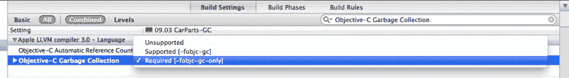

图 9-1. 启用垃圾回收

**注意**：`-fobjc-gc`适用于同时支持垃圾回收和`retain/release`的代码，例如可在两种环境中使用的库代码。

当你启用垃圾回收时，常规的内存管理调用都会变成空操作指令；这不过是一种花哨的说法，表示它们什么也不做。

Objective-C 的垃圾回收器是一个分代垃圾回收器。新创建的对象比那些已存在一段时间的对象更可能变成垃圾。在常规时间点，垃圾回收器会开始检查你的变量和对象，并追踪它们之间的指针。任何它发现没有指针指向的对象都是垃圾，适合被丢弃。你能做的最糟糕的事，就是保留一个指向你已经用完的对象的指针。因此，如果你在一个实例变量中指向一个对象（回忆一下组合的概念），请务必给该实例变量赋值`nil`，这将移除你对这个对象的引用，并让垃圾回收器知道它可以被清除。

与`autorelease`池类似，垃圾回收会在事件循环结束时触发。如果你不在 GUI 程序中，也可以自行触发垃圾回收，但这超出了我们这里要讨论的范围。

有了垃圾回收，你无需过多担心内存管理。当使用从`malloc`函数或 Core Foundation 对象获得的内存时，存在一些微妙的细节，但这些细节较为生僻，我们就不涉及了。现在，你只需创建对象，而无需担心释放它们。我们将在后续内容中继续讨论垃圾回收。

请注意，垃圾回收仅适用于 OS X 编程；你不能在 iOS 应用中使用它。事实上，在 iOS 编程中，苹果建议你避免在自己的代码中使用`autorelease`，同时也避免使用那些会返回自动释放对象的便捷方法。

通常，便捷方法是返回新对象的类方法。例如，对于`NSString`，所有以`stringWith`开头的方法都是便捷方法。

## 自动引用计数

为什么 iOS 没有垃圾回收？反对在 iOS 中使用垃圾回收的主要理由是，你无法确切知道垃圾回收器何时会出现。就像在现实生活中，你可能知道垃圾会在星期一被收走，但永远不确定具体时间。如果你正准备出门时，垃圾车恰好到了怎么办？垃圾回收对移动设备的可用性影响很大，移动设备比电脑更具私密性，且通常资源远不如电脑丰富。用户可不想在系统清理内存时，游戏中断或电话暂停。

苹果的解决方案叫做`自动引用计数 (ARC)`。顾名思义，`ARC`会跟踪你的对象，并决定哪些是你想保留的，哪些不是。这有点像在你的内存管理中配备了一位管家或私人助理。当你使用`ARC`时，你像往常一样分配和使用对象，编译器会为你插入保留（retain）和释放（release）操作——你无需自己编写这些代码。

`ARC`*不是*垃圾回收器。正如我们已讨论过的，垃圾回收是在运行时通过定期运行代码并检查对象来完成工作的。相比之下，`ARC`在编译时完成其工作。它插入适当的保留和释放操作，因此内存管理的方式与编写良好的手动管理代码完全一致。只不过，内存管理不再由你来做，而是由编译器替你完成。程序运行时，保留和释放操作会按预期发生。系统并不知道也不关心这些命令是你插入的还是编译器插入的。

`ARC`是一项选择性加入（opt-in）功能，这意味着你必须明确地启用或禁用它。

以下是编写`ARC`代码所需的组件：

- Xcode 4.2+
-  Apple LLVM 3.0+ 编译器（随 Xcode 提供）
- OS X 10.7+

以下是运行你的代码所需的条件：

-  iOS 4.0+ 或 OS X 10.6+（配备 64 位运行时）
-  零弱引用（Zeroing weak references）（稍后详述）需要 iOS 5.0+ 或 OS X 10.7+

**注意**：`ARC`仅适用于可保留对象指针（ROPs）。有三种可保留对象指针：

1. 块指针
2. Objective-C 对象指针
3. 使用`__attribute__((NSObject))`标记的 typedefs

我们将在本章稍后部分详细讨论 ROPs，尤其是在描述 Xcode 的`ARC`转换工具时。

所有其他指针类型，例如`char *`和 CF 对象（如`CFStringRef`），均与 ARC 不兼容。

如果你使用不由`ARC`处理的指针，你需要自己管理它们。这没问题，因为`ARC`可以与手动管理的内存互操作。

如果你想在代码中使用`ARC`，必须满足三个要求：

-  必须能够可靠地识别哪些对象需要被管理。
-  必须能够指明如何管理一个对象。
-  必须有一种可靠的方式来传递对象的所有权。

让我们逐一处理这些要求。第一个要求意味着，作为对象集合的根级对象必须知道如何管理其子对象。例如，假设你有一个使用`malloc`创建的字符串数组：

```
NSString **myString;
myString = malloc(10 * sizeof(NSString *));
```

这段代码创建了一个指向十个字符串的 C 数组。因为 C 数组是不可保留的，你无法在此结构上使用`ARC`。

这就引出了第二个要求。这个要求通常意味着你必须能够增加和减少对象的保留计数，这基本上意味着任何派生自`NSObject`的对象都是可行的。这个类别涵盖了你需要管理的大部分对象。

第三个要求指出，在传递对象时，你的程序需要能够在调用者和被调用者之间传递对象的所有权——更多内容稍后介绍。

面对所有这些限制，你可能会问自己，我真的有必要费心使用`ARC`吗？答案是：是的，绝对有必要！我们保证从长远来看，它能让你少受罪，节省时间。

## 有时候弱引用是好事


正如本章前面所讨论的，当拥有一个指向对象的指针时，你可以管理其内存（通过`retain/release`），也可以仅指向它而不参与其内存管理。如果管理了对象的内存，则称为对该对象具有`强引用`。如果不管理其内存，则拥有（你猜对了）`弱引用`。例如，当在属性中使用`assign`属性时，你就是在创建一个`弱引用`。

为什么需要弱引用？因为它们有助于我们处理`保留环`。我们稍后将讨论这一点。

假设有一个对象`A`，它由其他对象创建，其保留计数为 1（图 9-2）。对象`A`创建了一个子对象`B`，对象`B`的保留计数为 1（参见图 9-3）。对象`B`需要访问其父对象；这在`Objective-C`程序中是非常常见的模式。


图 9-2. 对象`A`的保留计数为 1


图 9-3. 对象`B`（对象`A`的子对象）的保留计数也为 1

在此示例中，对象`A`对对象`B`持有强引用，因为对象`A`创建了对象`B`。现在，如果对象`B`对对象`A`持有了强引用，则对象`A`的保留计数增加到 2（参见图 9-4）。


图 9-4. 对象`B`对`A`持有强引用，对象`A`的保留计数增加

万物皆有始终，最终，对象`A`的所有者不再需要它。所有者对对象`A`调用`release`，将其保留计数减至 1。

但是，由对象`A`创建的对象`B`拥有这 1 个保留计数。由于两个对象的保留计数都不为零，因此两者都不会被释放。这是一个典型的内存泄漏：程序无法访问这些对象，但它们仍然占用着内存（参见图 9-5）。


图 9-5. 一个典型的内存泄漏

为了解决这个问题，我们使用`弱引用`。我们使用`assign`来获取对象`B`对对象`A`的引用。通过弱引用，保留计数不会增加。因此，当对象`A`的所有者释放它时，其保留计数变为零，它释放`B`，然后`A`和`B`都释放它们宝贵的内存（参见图 9-6）。完美！对吧？

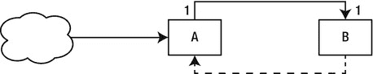

图 9-6. 对象`B`对对象`A`持有弱引用

更好了，但还不够完美。当涉及三个对象时（将它们称为对象`A`、`B`和`C`），最终可能出现对象`A`拥有并对对象`B`持有强引用，而对象`C`对对象`B`持有弱引用（参见图 9-7）。

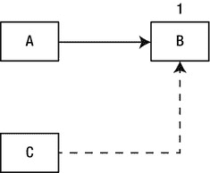

图 9-7. 两个对象引用`B`：一个强引用，一个弱引用

如果对象`A`随后释放了对象`B`，对象`C`仍然持有对它的弱引用，但该引用已不再有效，使用它很可能会导致崩溃，因为该位置不再存在有效的对象（参见图 9-8）。

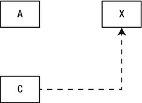

图 9-8. 对象`C`仍然持有一个指向已释放对象的引用。这很糟糕

解决方案是：那些能自动清理其弱引用的对象。这些特殊的弱引用被称为`归零弱引用`，因为当它们所指向的对象被释放时，它们会被设置为零（`nil`），并且可以像处理任何其他`nil`指针一样处理它们（参见图 9-9）。归零弱引用仅适用于`iOS 5`或更高版本以及`OS X 10.7`或更高版本。

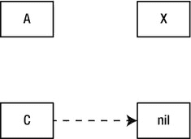

图 9-9. 对象`C`有一个归零弱引用，当不再有效时，它会转换为`nil`

要使用归零弱引用，必须显式声明它们。有两种声明归零弱引用的方法：在声明变量时使用`__weak`关键字，或者在属性上使用`weak`属性：

`__weak NSString *myString;`

`@property(weak) NSString *myString;`

如果想在归零弱引用不可用的较旧系统上使用`ARC`，该怎么办？`Apple`提供了`__unsafe_unretained`关键字和`unsafe_unretained`属性，两者都告知`ARC`指定的引用是弱引用。

使用`ARC`时，需要注意一些命名限制：

*   不能有名称以“new”开头的属性。例如，`@property NSString *newString`是不允许的。
*   不能有没有内存管理属性的只读属性。没有`ARC`，可以使用`@property (readonly) NSString *title`。但在启用`ARC`后，必须指定谁来管理内存，因此一个简单的修复方法是使用`unsafe_unretained`，因为默认的`assign`属性。

为了保持正交性，还有一个`__strong`关键字和`strong`属性。请记住，内存管理关键字和属性是互斥的。

好的！我们现在准备将`CarParts`转换为使用`ARC`。完成转换后，你会注意到代码甚至比以前更少了。我们的格言，也是所有程序员的格言，就是“少即是多。”

一个新颖的转换方案

`Xcode`提供了一个便捷的过程来将现有项目转换为`ARC`。在开始之前，我们必须确保未启用垃圾回收；垃圾回收和`ARC`不能混用。如果在不关闭垃圾回收的情况下尝试转换项目，你将看到一条警告，如图 9-10 所示。

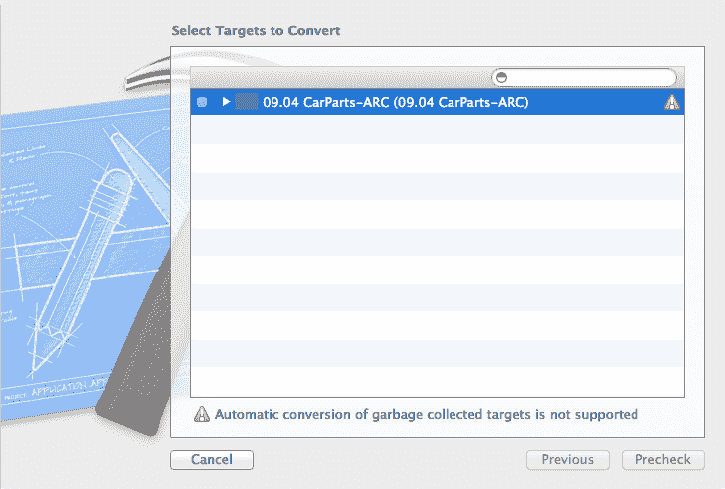

图 9-10. 在转换项目之前，必须关闭垃圾回收

让我们逐步了解为某个目标关闭垃圾回收的过程。第一步是选择要禁用垃圾回收的目标。打开你的项目（如果尚未打开），在导航器中选择项目。在编辑器窗格中，你将看到项目编辑器，顶部是你的项目，下方是目标（参见图 9-11）。

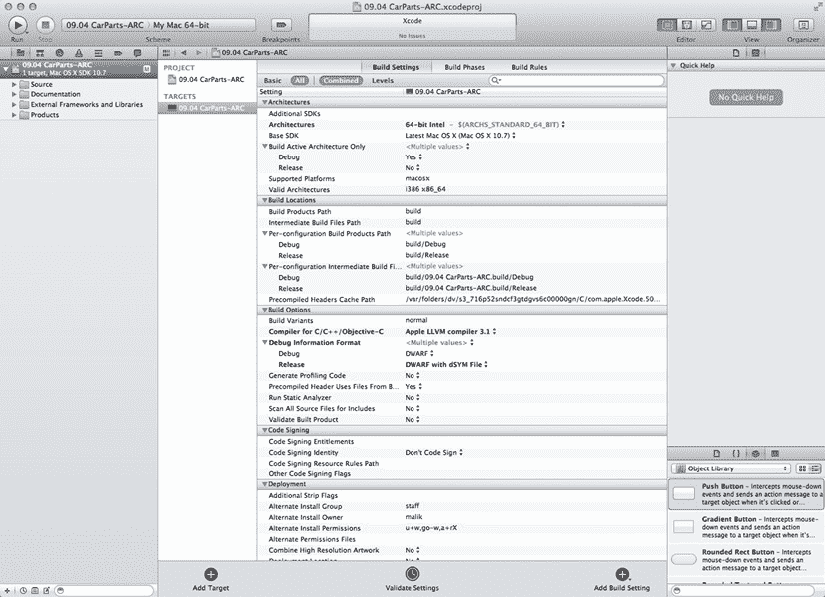

图 9-11. 在`Xcode`中打开你的项目

现在，选择应禁用垃圾回收的目标。然后，单击编辑器窗格顶部的“构建设置”选项卡。你会看到目标有大约一百万个设置，这可能会让人不知所措。你可以浏览选项查找“Objective-C Garbage Collection”，但有更好的方法。

`Apple`知道可能很难找到你想要的设置，因此，如果你在构建设置的正下方查看，会看到一个方便的搜索字段。输入文本`garbage collection`。搜索字段会将选择范围缩小到与垃圾回收相关的设置。这样好多了！现在，你有两个项目需要查看。

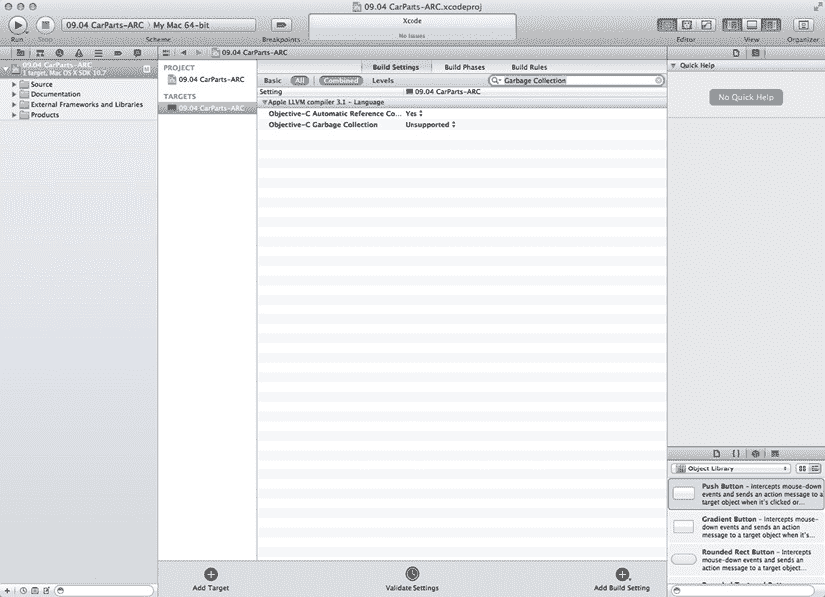

图 9-12. 垃圾回收的设置

当查看“Objective-C Garbage Collection”项时，一个弹出选项菜单会提供三个选择：


-     *不支持*：当你的项目使用了 `ARC`，或者你出于某种原因不想启用垃圾回收时，必须选择此选项。
-     *支持*：你的应用程序可以使用垃圾回收。
-     *必需*：你的应用程序*必须*使用垃圾回收。

我们的选择是第一项：不支持（参见图 9-13）。这将关闭垃圾回收。

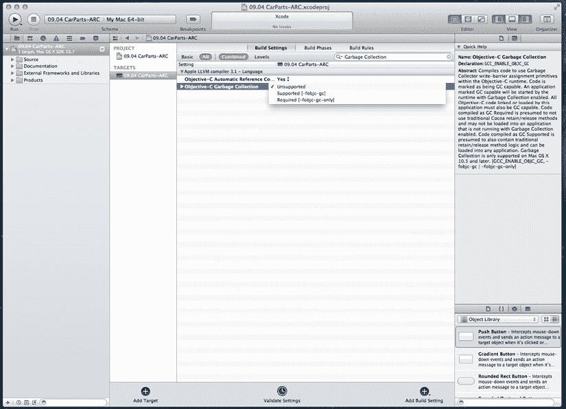

图 9-13. 选择“不支持”以关闭垃圾回收

转换是一个两步过程。首先，你必须确保代码符合 `ARC` 的要求，然后执行实际的转换。

**注意**  `ARC` 转换是一条单行道。一旦你转向 `ARC`，就无法回头了。

要开始这个过程，请选择你要转换的目标，然后选择 `Edit`  `Refactor`
 `Convert to Objective-C ARC`（参见图 9-14）。

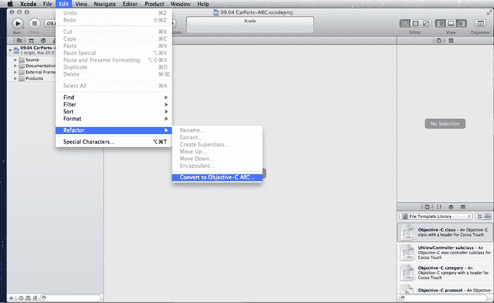

图 9-14. 使用 `Edit` 菜单选择 `ARC` 转换项

因为 `ARC` 是在文件级别工作的，你可以在同一个目标中混用 `ARC` 和非 `ARC` 文件。

接下来，你会看到一个要转换的目标列表（参见图 9-15）。如果你的目标依赖于其他目标，你可以选择逐步进行这个过程。例如，你可以先从框架和库开始，等这些完成后，再处理使用它们的那些目标。

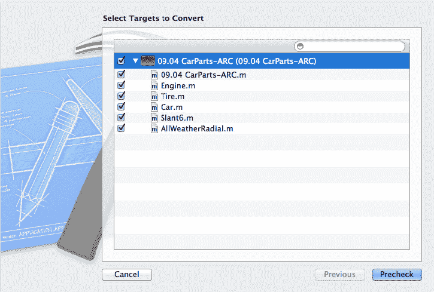

图 9-15. 选择你想要转换的文件

当你选择要转换的目标时，默认会选中所有实现文件。如果你有一些在不同项目间共享的文件，并且不想转换它们，你可以只选择你想要转换的文件。选择完文件后，点击 `Precheck`。预检查过程结束后，你可以进入下一步：实际转换（终于到这一步了），如图 9-16 所示。

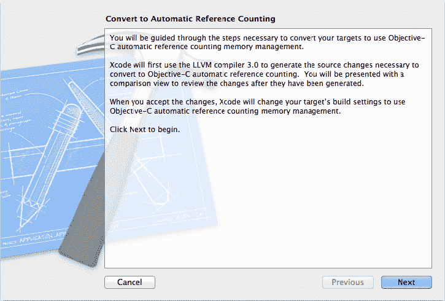

图 9-16. `ARC` 转换介绍界面

阅读完有用的介绍信息并点击*下一步*后，转换步骤会处理你的项目并将其转换为使用 `ARC`。在这步中，`Xcode` 会找到每个要用 `ARC` 编译的文件，并根据需要修改你的源代码。

一旦过程完成，`Xcode` 会显示一个源代码比较视图，你可以在其中看到每个文件转换前后的情况，以便决定是否喜欢这些更改。

我们越来越接近了，但项目尚未完全转换完成。这些更改是对你的文件副本进行的，以便给你机会改变主意并退出该过程（我们有没有提到它是不可逆的？）。要完成转换，你将有另一次机会保存“转换前”文件的副本，然后就大功告成了。

这相当简单，但我们必须指出，这是最理想的情况，一切都能完美且自动进行。但现实生活并不总是那么简单。转换器只作用于源代码；它不查看注释，并且当前版本无法读取你的心思来确定你的意图。如果转换器发现任何歧义，它会被标记出来，你必须在转换继续之前解决这个问题。

## 所有权即特权

我们之前讨论的一个要求是，`ARC` 代码中的指针必须是可保留对象指针（`ROP`）。这意味着，例如，你不能简单地将一个 `ROP` 赋值给一个非 `ROP`，因为这会转移指针的所有权。考虑以下代码：

```
NSString *theString = @"Learn Objective-C";
CFStringRef cfString = (CFStringRef)theString;
```

如果你看过很多 `Objective-C` 代码，你很可能见过这种模式。它在做什么？一个指针 `theString` 是 `ROP`，而另一个 `CFStringRef` 则不是。为了有一个愉快的 `ARC` 体验，我们需要告诉编译器谁拥有这个指针。为此，我们可以使用一种称为**桥接转换**的 `C` 语言技术。这是一种标准的 `C` 类型转换，但带有额外的关键字：
`__bridge`, `__bridge_retained` 或 `__bridge_transfer`。术语“桥接”指的是为同一目的使用不同数据类型的能力，而不是指当你陷入一个棘手 `ARC` 转换时想要跳下去的那种东西。以下是三种桥接转换的说明：

-   (`__bridge Type`) *operand*：这种转换会转移指针，但不会转移其所有权。在我们上面的例子中，操作数是 `theString`，`Type` 是 `CFStringRef`。使用此关键字时，一个指针是 `ROP`，另一个则不是。使用此转换时，指针的所有权仍归操作数所有。以下是我们示例使用这种情况的样子：

```
cfString = (__bridge CFStringRef)theString;
```

`cfString` 获得了赋值，但所有权仍属于 `theString`。

-   (`__bridge_retained Type`) *operand*：在这种类型中，所有权被转移到非 `ROP` 上。一个指针是 `ROP`，另一个则不是。因为 `ARC` 只负责管理 `ROP`，所以你需要负责在使用完此对象后释放它。此转换会递增对象的保留计数，因此你必须递减它，就像传统的旧式内存管理一样。以下是我们示例的样子：

```
cfString = (__bridge_retained CFStringRef)theString
```

在这种情况下，`cfString` 字符串拥有该指针，并且其保留计数增加了。你需要用 `retain`/`release` 来管理它。

-     (`__bridge_transfer Type`) *operand*：此转换的作用与前一种相反；它将所有权转移到 `ROP` 上。在这种情况下，`ARC` 拥有该对象，并确保它会像任何其他 `ARC` 对象一样被释放。

另一个限制是 `structs` 和 `unions` 不能有 `ROP` 成员，因此类似下面的代码是不允许的：

```
// 错误的代码。请勿窃取或销售。
struct {
    int32_t foo;
    char *bar;
    NSString *baz;
} MyStruct;
```

你可以通过使用 `void *` 和桥接转换来绕过这个限制。为了赋值并取回字符串，我们的代码应该像这样：

```
struct {
    int32_t foo;
    char *bar;
    void *baz;
} MyStruct;

MyStruct.baz = (__bridge_retained void *)theString;
NSString *myString = (__bridge_transfer NSString *)MyStruct.baz;
```

如你所见，在边界情况下，编写 `ARC` 代码并非总是那么自动。这是一个相当深入的课题，值得深入研究。为了完成关于 `ARC` 的讨论，我们将列出你不应在 `ARC` 管理对象上调用的内存管理方法：

-   `retain`
-     `retainCount`
-     `release`
-     `autorelease`
-   `dealloc`

因为你有时需要释非 `ARC` 对象或执行其他清理工作，你仍然可以编写 `dealloc` 方法，但不能调用 `[super dealloc]`。

还有一些方法不允许在 `ARC` 对象上重写：

-     `retain`
-     `retainCount`
-     `release`
-     `autorelease`

## 异常处理

什么是异常？它是一个意外事件，例如数组越界，会中断程序流程，因为程序真的不知道该如何处理它。


当这种情况发生时，程序会创建一个异常对象并将其交给运行时系统，运行时系统随后会决定接下来如何处理。Cocoa 中的异常由 `NSException` 类表示。Cocoa 要求所有异常必须是 `NSException` 类型，因此即使你可以从其他对象抛出异常，Cocoa 也无法处理这些异常。相反，你应该通过继承 `NSException` 来创建自己的异常。

**注意** 异常处理机制实际上用于处理程序自身产生的错误。Cocoa 框架通常通过退出程序来处理错误，这并非你所期望的结果。你应当在代码中抛出并捕获异常，而不是让它们逃逸到框架层面。

要启用异常支持，请确保 `-fobj-exceptions` 标志已开启。你可以在 Xcode 的 *Enable Objective-C* *Exceptions* 编译选项中启用此功能（如图 9-17 所示）。

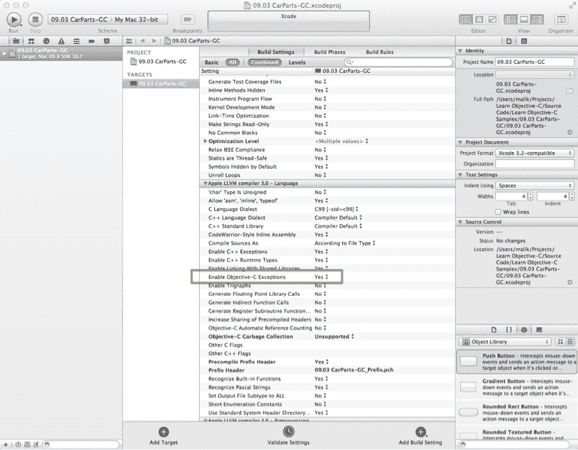

**图 9-17.** 启用异常

创建异常并将其交给运行时系统的行为称为**抛出**异常，有时也称为**引发**异常。请注意，`NSException` 有几个以 `raise` 开头的方法。其中一些是类方法，而 `raise` 本身是一个实例方法。

**捕获**异常是指处理已抛出异常的行为。

**注意** 当异常被抛出但未被捕获时，程序会在异常点停止并传播该异常。

## 异常的关键字

所有异常关键字都以 `@` 开头。以下是每个关键字的作用：

*    `@try`：定义一个代码块，该块将被测试以确定是否应抛出异常。
*    `@catch()`：定义一个用于处理已抛出异常的代码块。它接受一个参数，通常为 `NSException` 类型，但也可以是其他类型。
*    `@finally`：定义一个无论是否抛出异常都会执行的代码块。此代码将始终被执行。
*    `@throw`：抛出异常。

**注意** 前面我们提到，你可以从 `NSException` 实例以外的对象抛出异常，但应避免这样做。原因是并非每个 Cocoa 框架都能捕获由 `NSException` 以外的对象抛出的异常。为了确保 Cocoa 能正确处理你的异常，你只应抛出 `NSException` 对象。可以将此理解为老话所说的：你不需要用牙线清洁所有牙齿，只需清洁你想保留的那些即可。

你通常会结合使用 `@try`、`@catch` 和 `@finally` 来构建一个结构。它大致如下所示：

```
@try
{
   // 你想要执行的代码，这些代码可能会抛出异常。
}
@catch (NSException *exception)
{
   // 用于处理异常的代码。
}
@finally
{
   // 始终会被执行的代码。通常用于清理工作。
}
```

## 捕获不同类型的异常

你可以根据要处理的异常类型，使用多个 `@catch` 块。你的处理器应按从最具体到最不具体的顺序排列，并在所有其他处理器之后放置一个通用处理器。示例如下：

```
@try{
} @catch (MyCustomException *custom) {
} @catch (NSException *exception) {
} @catch (id value) {
} @finally {
}
```

**注意** C 语言程序员经常在异常处理代码中使用 `setjmp` 和 `longjmp`。如果跳转的目标超出 `@try` 花括号的范围，则不能在 `@try` 块中使用 `setjmp` 和 `longjmp`。但是，你可以使用 `goto` 和 `return` 来退出异常处理代码。

## 抛出异常

当程序检测到异常时，必须将该异常传播到处理它的代码块，该代码块被巧妙称为异常处理器。如前所述，传播异常的过程称为抛出或引发异常。


程序通过创建`NSException`实例并使用以下两种技术之一来抛出异常：

*   `@throw exception;`
*   向`NSException`对象发送`raise`消息

例如，我们将创建一个异常：

```
NSException *theException = [NSException exceptionWithName: …];
```

然后我们可以通过以下任一方式抛出它：

```
@throw theException;
```

或

```
[theException raise];
```

请使用其中一种技术，不要同时使用两者。两种技术的区别在于：`raise`只能用于`NSException`对象，而`@throw`也可以与其他对象一起使用。

你通常会在异常处理代码内部抛出异常。你的代码可以通过发送另一条`raise`消息或使用`@throw`关键字来传播异常。

```
@try
{
    NSException *e = …;
    @throw e;
}
@catch (NSException *e) {
    @throw; // 重新抛出 e。
}
```

**注意**：在`@catch`异常处理块中，你可以在不指定异常对象的情况下重新抛出异常。

与本地`@catch`异常处理器关联的`@finally`块会在`@throw`导致调用下一个更高层级的异常处理器之前执行，因为`@finally`会在`@throw`发生之前被调用。

Objective-C 异常与 C++ 异常系统兼容。

**注意**：Objective-C 中的异常是资源密集型的。你不应将异常用于常规流程控制或仅仅用于表示错误。使用`@try`设置异常没有成本，但捕获异常会消耗大量的程序资源和速度。

### 异常也需要内存管理

当涉及异常时，内存管理可能变得棘手。让我们看看下面这段简单的代码：

```
- (void)mySimpleMethod
{
    NSDictionary *dictionary = [[NSDictionary alloc] initWith….];
    [self processDictionary:dictionary];
    [dictionary release];
}
```

现在假设`processDictionary`抛出了一个异常。程序会跳出该方法并寻找异常处理器。但由于方法在此刻退出，`dictionary`对象没有被释放，从而导致内存泄漏。

一种简单的处理方法是使用`@try`和`@finally`，在`@finally`中执行清理工作，因为它总是会被执行（如前所述）。

```
- (void)mySimpleMethod
{
    NSDictionary *dictionary = [[NSDictionary alloc] initWith….];
    @try {
        [self processDictionary:dictionary];
    }
    @finally {
        [dictionary release];
    }
}
```

这种模式也可以用于 C 风格的内存管理，例如`malloc`和`free`。

### 异常与自动释放池

异常处理有时会遇到一个微妙的问题：异常对象会被自动释放。异常几乎总是作为自动释放对象创建的，因为你不知道它们何时需要被释放。当自动释放池被销毁时，池中的所有对象也会被销毁，包括异常。考虑以下代码，它看起来确实无害：

```
- (void)myMethod
{
    NSAutoreleasePool *pool = [[NSAutoreleasePool alloc] init];
    NSDictionary *myDictionary =
        [[NSDictionary alloc] initWithObjectsAndKeys:@"asdfads", nil];
    @try {
        [self processDictionary:myDictionary];
    } @catch (NSException *e) {
        @throw;
    } @finally {
        [pool release];
    }
}
```

这段代码看起来没问题：我们创建了对象，也释放了它们，因为我们都是合格的开发者。但是等等！当我们考虑异常处理时，这里有一个问题。我们之前讨论过，可以在`@catch`块中重新抛出异常，这会导致`@finally`块在异常被重新抛出之前执行。这会导致本地池在异常被传递之前被释放，从而将其变成一个可怕的**僵尸异常**。幸运的是，我们有一个简单的修复方法：只需在池外部保留它。

修改后的方法如下：

```
- (void)myMethod
{
    id savedException = nil;
    NSAutoreleasePool *pool = [[NSAutoreleasePool alloc] init];
    NSDictionary *myDictionary =
        [[NSDictionary alloc] initWithObjectsAndKeys:@"asdfads", nil];
    @try {
        [self processDictionary:myDictionary];
    } @catch (NSException *e) {
```


```objc
savedException = [e retain];

@throw;

} @finally {

[pool release];

[savedException autorelease];

}

}
```

通过使用 `retain`，我们将异常保存在父池中。当我们的池被释放时，我们已保存了一个指针，而当父池被释放时，该异常也会随之释放。

## 总结

在本章中，你学习了 Cocoa 的内存管理方法：`retain`、`release` 和 `autorelease`。我们还讨论了垃圾回收机制，并深入探讨了自动引用计数（ARC），即苹果最新的内存管理技术。

每个对象都维护着一个引用计数。对象在创建时引用计数为 1。当对象被 retain 时，其引用计数增加 1；当对象被 release 时，其引用计数减少 1。当引用计数降至 0 时，对象被销毁。首先会调用对象的 `dealloc` 方法，然后其内存被回收，可供其他对象使用。

当对象收到 `autorelease` 消息时，其引用计数不会立即改变；相反，该对象会被放入一个 `NSAutoreleasePool` 中。当这个池被销毁时，池中的所有对象都会被发送一条 `release` 消息。所有被自动释放的对象的引用计数随后都会减 1。如果计数降至 0，对象即被销毁。当你使用 AppKit 或 UIKit 时，自动释放池会在明确定义的时机（如当前用户事件处理完毕时）为你创建和销毁。否则，你需要自行创建自动释放池。Foundation 工具的模板中包含了相关代码。

Cocoa 关于对象及其引用计数有三条规则：

*   如果你通过 `new`、`alloc` 或 `copy` 操作获得对象，则该对象的引用计数为 1。
*   如果你通过其他方式获得对象，则假定其引用计数为 1，并且已被自动释放。
*   如果你 retain 了一个对象，则必须用一次 `release` 来平衡每一次 `retain`。

总的来说，ARC 通过在编译时插入这些调用来为你处理 `retain` 和 `release`。

接下来，我们将讨论 `init` 方法：如何让你的对象从创建之初就高效运行。

# 第 10 章：对象初始化

到目前为止，我们以两种不同的方式创建新对象。第一种方式是 `[SomeClass new]`，第二种是 `[[SomeClass alloc] init]`。这两种技术是等价的，但 Cocoa 的常见约定是使用 `alloc` 和 `init`，而不是 `new`。通常，Cocoa 程序员在使用 `new` 作为初学工具，直到他们积累足够背景知识，能够熟练使用 `alloc` 和 `init` 为止。现在是时候抛弃这些初学工具了。

## 分配对象

**分配** 是新对象诞生的过程。这是一个令人愉快的时刻，从操作系统中获取一块内存，并将其指定为存放对象实例变量的位置。向某个类发送 `alloc` 消息会使该类分配一块足够容纳其所有实例变量的内存。`alloc` 还会方便地将所有内存初始化为 0。这样，你就不会遇到未初始化内存导致各种随机错误（困扰许多语言的问题）。你所有的 `BOOL` 变量起始值为 `NO`；所有的 `int` 变量为 0；所有的 `float` 变量为 0.0；所有的指针为 `nil`；而所有你的基地都属于我们（抱歉，忍不住玩了个梗）。

一个新分配的对象还不能立即使用：你需要先对其进行初始化才能使用。某些语言（包括 C++ 和 Java）通过构造函数在单一操作中完成对象分配和初始化。Objective-C 则将这两个操作分为显式的分配阶段和初始化阶段。初学者常犯的错误是只使用 `alloc` 操作，例如：

```objc
Car *car = [Car alloc];
```

这样可能也能工作，但未经初始化，后续可能会出现一些奇怪的行为（也就是“bug”）。本章剩余部分将重点讨论初始化这一重要概念。

## 初始化对象

分配的对立面是初始化。**初始化** 就是获取一块内存并将其准备好，使之成为程序中有用的成员。`init` 方法——即执行初始化操作的方法——几乎总是返回它们正在初始化的对象。你可以（并且应该）像这样链式调用 `alloc` 和初始化：

```objc
Car *car = [[Car alloc] init];
```

而不是这样：

```objc
Car *car = [Car alloc]; [car init];
```

这种链式调用技术之所以重要，是因为初始化方法可能返回一个与已分配对象不同的对象。如果你觉得这很奇怪，那你的感觉没错。但这种情况确实可能发生。

为什么程序员会希望 `init` 方法返回一个不同的对象呢？回顾一下第 8 章末尾关于类簇的讨论，你会看到像 `NSString` 和 `NSArray` 这类类实际上只是大量专用类的门面。`init` 方法可以接受参数，因此方法代码有机会检查参数，并决定另一个类的对象可能更合适。例如，假设要从一个非常长的字符串或一个阿拉伯字符字符串创建新字符串。基于此信息，字符串初始化器可能会决定创建一个更适合目标字符串需求的、属于不同类的对象，并返回该对象而非原始对象。

## 编写初始化方法

之前，当我们展示初始化方法时，我们请大家忍受一些“点头微笑”的时刻，主要是因为它们看起来有点奇怪。以下是 CarParts 早期版本中的 `init` 方法：

```objc
- (id) init
{
    if (self = [super init])
    {
        engine = [Engine new];
        tires[0] = [Tire new];
        tires[1] = [Tire new];
        tires[2] = [Tire new];
        tires[3] = [Tire new];
    }
    return (self);
} // init
```

主要的奇怪之处在第一行就出现了：

```objc
if (self = [super init]) {
```

这段代码暗示 `self` 可能会改变。在方法中间改变 `self`？我们疯了吗？好吧，或许，但这次没有。该语句中首先执行的代码是 `[super init]`。这段代码让超类完成其初始化工作。对于继承自 `NSObject` 的类，调用超类可以让 `NSObject` 执行它所需的处理，以便对象能够响应消息并处理引用计数。对于继承自其他类的类，这是它们执行自己版本的全新初始化的机会。

我们刚刚说过，像这样的 `init` 方法可能会返回完全不同的对象。请记住，实例变量位于距离隐藏参数 `self` 固定偏移量的内存位置。如果 `init` 方法返回了一个新对象，我们需要更新 `self`，以便后续的实例变量引用能影响正确的内存位置。这就是我们需要 `self = [super init]` 赋值的原因。请记住，此赋值仅影响该方法内部的 `self` 值。它不会改变方法作用域之外的任何内容。

如果初始化对象时出现问题，`init` 方法可能返回 `nil`。例如，你可能使用一个接受 URL 的 `init` 方法，通过网站上的图像文件来初始化一个图像对象。如果网络断开，或者网站改版导致图片被移动，你将无法获得有用的图像对象。此时 `init` 方法会返回 `nil`，表示对象无法被初始化。如果 `[super init]` 返回 `nil`，则 `if (self = [super init])` 测试将不会执行方法体代码。像这样将赋值与检查非零值结合，是 Objective-C 中存续的经典 C 语言惯用法。


## 代码排版与优化

启动并运行对象的代码位于`if`语句主体的花括号内。在原始的`Car init`方法中，`if`语句的主体创建了一个引擎和四个轮胎。从内存管理的角度来看，这段代码是正确的，因为通过`new`返回的对象其引用计数初始值被设置为 1。

最后，该方法的最后一行是`return (self);`。

`init`方法返回刚刚初始化完成的对象。由于我们将`[super init]`的返回值赋值给了`self`，因此这正是我们应当返回的内容。

## 用初始化赢在起跑线

有些程序员不喜欢将赋值操作与非零值检查合并在一起。相反，他们这样编写`init`方法：

```
self = [super init];
if (nil != self)
{
}
return (self);
```

这样写也没问题。关键在于，你需要将返回值重新赋值给`self`，尤其是在访问任何实例变量时更是如此。无论你采用哪种方式，都要明白将赋值与检查合并是一种常见技巧，你会在其他人的代码中经常看到。

`self = [super init]`这种写法引发了一些争议。一派认为你应该始终这样做，以防父类在初始化过程中改变了某些东西。另一派则认为，这种对象变更的情况极其罕见且难以捉摸，不必费心——直接使用`[super init]`即可。这一派指出，即使`init`改变了对象，这个新对象也可能无法容纳你新增的实例变量。

这个问题在理论上确实棘手，但在实际开发中并不常见。我们建议始终使用`if (self = [super init])`技巧，以确保安全并捕捉某些`init`方法返回`nil`的行为。但如果你选择直接使用`[super init]`，那也完全可以。只是如果你碰巧遇到那些极其罕见的边缘情况，就需要做好进行一些调试的准备。

## 初始化时该做什么

你的`init`方法中应该放入什么内容？这里是进行“白板初始化”工作的地方。你需要为实例变量赋值，并创建对象运行所需的其他对象。在编写`init`方法时，你必须决定要在其中完成多少工作。`CarParts`程序在其演变过程中展示了两种不同的方法。

第一种方法使用`init`方法来创建引擎和所有四个轮胎。这使得`Car`对象开箱即用：调用`alloc`和`init`后，就可以直接把车开出去试驾了。在下一个版本中，我们改为在`init`方法中不创建任何东西。我们只为引擎和轮胎保留了空位置。然后，创建对象的代码必须自行创建引擎和轮胎，并通过存取方法来设置它们。

哪种方法适合你？这个决定归结为灵活性与性能之间的权衡，正如编程中许多其他取舍一样。最初的`Car init`方法非常方便。如果`Car`类的预期用途是创建一个基础汽车然后直接使用，那么这就是正确的设计。

另一方面，如果汽车经常需要用不同类型的轮胎和引擎进行定制，比如在赛车游戏中，那么我们创建引擎和轮胎只是为了随后丢弃它们。真是浪费！对象被创建出来，然后又被销毁，从未被使用过。

**注意** 即使你没有提供自定义对象属性的调用，你仍然可以等到调用方真正需要时才创建它们。这种技术被称为**懒加载**，如果你在`-init`中创建了可能实际并不会用到的复杂对象，懒加载可以提升性能。

## 这不是很方便吗？

有些对象拥有多个以`init`开头的方法。事实上，重要的是要记住`init`方法并没有什么特别之处。它们只是遵循命名约定的普通方法。

许多类都提供了**便捷初始化方法**。这些`init`方法会做一些额外的工作，省去你自己动手的麻烦。为了让你更直观地理解，这里列举了一些`NSString`的`init`方法示例：

- `(id) init;`

这个基本方法初始化了一个新的空字符串。对于不可变的`NSString`，这个方法并不是特别有用。但你可以分配并初始化一个新的`NSMutableString`，然后开始往里面添加字符。你可以这样使用它：

```
NSString *emptyString = [[NSString alloc] init];
```

这段代码会给你一个空字符串。

- `(id) initWithFormat: (NSString *) format, …;`

这个版本将新字符串初始化为格式化操作的结果，就像我们使用`NSLog()`以及你在第 7 章看到的`stringWithFormat:`类方法一样。下面是一个使用此`init`方法的示例：

```
string = [[NSString alloc]
          initWithFormat: @"%d or %d", 25, 624];
```

这会给你一个值为"25 or 624"的字符串。

- `(id) initWithContentsOfFile:(NSString *) path encoding:(NSStringEncoding) enc error:(NSError **) error`

`initWithContentsOfFile:encoding:error:`方法会打开指定路径的文本文件，读取其中所有内容，并用这些内容初始化一个字符串。以下代码读取了`/tmp/words.txt`文件：

```
NSError *error = nil;
NSString *string =
    [[NSString alloc] initWithContentsOfFile:@"/tmp/words.txt"
                                    encoding:NSUTF8StringEncoding
                                       error:&error];
```

`encoding`参数告诉 API 文件中内容的编码类型。通常，你会使用`NSUTF8StringEncoding`，表示文件采用 UTF8 格式编码。

如果无错误，第三个参数返回`nil`。如果出现错误，你可以使用`localizedDescription`方法查明具体情况。综合起来，代码如下：

```
NSError *error = nil;
NSStringEncoding encoding = NSUTF8StringEncoding;
NSString *string = [[NSString alloc] initWithContentsOfFile:@"/tmp/words.txt"
                                               usedEncoding:&encoding
                                                      error:&error];
if(nil != error)
{
    NSLog(@"无法从文件读取数据，%@", [error localizedDescription]);
}
```

这是相当强大的功能。如果使用 C 语言，这将需要一大段代码（你需要打开文件，读取数据块，追加到字符串，确保末尾的零字节在正确位置，然后关闭文件）。而对于我们这些 Objective-C 的忠实用户来说，这变成了一行代码。真不错。

**注意** 关于不同初始化方法的一般规则是：如果你的对象必须依赖某些信息才能完成自身初始化，你应该将这些信息作为`init`方法的一部分提供。这通常适用于不可变对象。

## 更多零件

让我们重新审视`CarParts`，上次在第 6 章中我们将其拆分为每个类一个独立的源文件。这一次，我们将为`Tire`类添加一些初始化的好处，并同时清理`Car`的内存管理。对于在家跟着操作的读者，本章完成后的项目目录是`10.01 CarPartsInit`。

**注意** 正如我们在第 9 章中详细讨论的，苹果正从垃圾回收的内存管理方式迁移到一种名为自动引用计数（ARC）的新技术。对于 iOS 开发，你*必须*使用 ARC；不支持垃圾回收。我们在`10.01 CarPartsInit-ARC`目录中提供了本章程序的 ARC 版本。但由于垃圾回收仍然存在，我们也提供了一个使用垃圾回收的版本，名为`10.01 CarPartsInit-GC`。

### 轮胎的初始化


# 排版后的文档

在现实世界中，轮胎远比我们在`CarParts`中模拟的要有趣得多。在真实的轮胎中，你需要跟踪胎压（不希望它变得太低）和胎纹深度（一旦低于几毫米，轮胎就不再安全了）。让我们扩展`Tire`类来跟踪胎压和胎纹深度。以下是添加了两个实例变量及相应访问器方法的类声明：

```
#import <Cocoa/Cocoa.h>

@interface Tire : NSObject
{
    float pressure;
    float treadDepth;
}

- (void) setPressure: (float) pressure;
- (float) pressure;
- (void) setTreadDepth: (float) treadDepth;
- (float) treadDepth;

@end // Tire
```

以下是`Tire`的实现，相当直接明了：

```
#import "Tire.h"

@implementation Tire

- (id) init
{
    if (self = [super init])
    {
        pressure = 34.0;
        treadDepth = 20.0;
    }
    return (self);
} // init

- (void) setPressure: (float) p
{
    pressure = p;
} // setPressure

- (float) pressure
{
    return (pressure);
} // pressure

- (void) setTreadDepth: (float) td
{
    treadDepth = td;
} // setTreadDepth

- (float) treadDepth
{
    return (treadDepth);
} // treadDepth

- (NSString *) description
{
    NSString *desc;
    desc = [NSString stringWithFormat:
            @"Tire: Pressure: %.1f TreadDepth: %.1f", pressure, treadDepth];
    return (desc);
} // description

@end // Tire
```

访问器方法为轮胎的使用者提供了改变胎压和胎纹深度的方法。我们来快速看一下`init`方法：

```
- (id) init
{
    if (self = [super init])
    {
        pressure = 34.0;
        treadDepth = 20.0;
    }
    return (self);
} // init
```

这里应该没有意外。父类（本例中为`NSObject`）被指示初始化自身，并且该调用的返回值被赋值给`self`。然后，实例变量被赋予有用的默认值。我们可以这样创建一个全新的轮胎：

```
Tire *tire = [[Tire alloc] init];
```

轮胎的胎压将为 34 psi，胎纹深度为 20 毫米。我们也应该修改`description`方法：

```
- (NSString *) description
{
    NSString *desc;
    desc = [NSString stringWithFormat:
            @"Tire: Pressure: %.1f TreadDepth: %.1f", pressure, treadDepth];
    return (desc);
} // description
```

`description`方法现在使用`NSString`的`stringWithFormat:`类方法来创建一个包含胎压和胎纹深度的字符串。这个方法是否遵循了我们的良好内存管理行为规则？是的，它遵循了。因为该对象不是通过`alloc`、`copy`或`new`创建的，它的引用计数为 1，我们可以认为它是自动释放的。所以，当自动释放池被销毁时，这个字符串会被清理。

## 更新`main()`函数

以下是`main.m`文件，它比之前稍微复杂了一些：

```
#import "Engine.h"
#import "Car.h"
#import "Slant6.h"
#import "AllWeatherRadial.h"

int main (int argc, const char * argv[])
{
    @autoreleasepool
    {
        Car *car = [[Car alloc] init];

        for (int i = 0; i < 4; i++)
        {
            Tire *tire;
            tire = [[Tire alloc] init];
            [tire setPressure: 23 + i];
            [tire setTreadDepth: 33 - i];
            [car setTire: tire atIndex: i];
            [tire release];
        }

        Engine *engine = [[Slant6 alloc] init];
        [car setEngine: engine];
        [car print];
        [car release];
    }

    return (0);
} // main
```

让我们逐部分分析`main()`函数。我们首先创建一个自动释放池，让自动释放的对象在其中游荡，等待池的销毁：

```
@autoreleasepool {
```

然后，我们使用`alloc`和`init`创建一辆新车：

```
Car *car = [[Car alloc] init];
```

之后，一个循环旋转四次（从 0 到 3）。这是制造新轮胎的地方：

```
for (int i = 0; i < 4; i++) {
```

每次循环中，都会创建一个新的轮胎并进行初始化：

```
Tire *tire;
tire = [[Tire alloc] init];
```

每个轮胎开始时，其胎压和胎纹深度都设置在`Tire`的`init`方法中。但为了有趣，我们要自定义这些值。因为在现实世界中，没有两个轮胎是完全相同的，我们将使用访问器方法来调整胎压和胎纹深度：

```
[tire setPressure: 23 + i];
[tire setTreadDepth: 33 - i];
```

接着，我们将轮胎交给汽车：

```
[car setTire: tire atIndex: i];
```


现在我们已经处理完轮胎，将其释放：

```
[tire release];
```

这段代码假定`Car`正在正确地管理内存，安排保留该对象。请注意，第 6 章中展示的`Car`并没有遵守我们的内存管理指南——那时我们还太年轻天真——但我们稍后会向你展示如何修复这个问题。

轮胎组装完成后，和之前一样创建一个新发动机，并将其放入汽车中：

```
Engine *engine = [[Slant6 alloc] init];
[car setEngine: engine];
[engine release];
```

与轮胎一样，发动机也被释放，因为我们不再使用它了。由`Car`负责确保发动机被释放。

最后，`Car`被要求打印自身，然后被释放，因为我们不再需要它：

```
[car print];
[car release];
```

现在，自动释放池被释放，这会导致其引用计数归零，释放池本身，并向池中的每个对象发送`release`消息。此时，`Tire`的`description`方法生成的`NSString`对象被清理，`main`函数最终结束。但在运行程序之前，我们需要修复`Car`类，使其正确进行内存管理。不过首先，这里是在垃圾回收环境下`main`函数的典型写法：

```
int main (int argc, const char * argv[])
{
    Car *car = [[Car alloc] init];
    for (int i = 0; i < 4; i++)
    {
        Tire *tire;
        tire = [[Tire alloc] init];
        [tire setPressure: 23 + i];
        [tire setTreadDepth: 33 - i];
        [car setTire: tire atIndex: i];
    }
    Engine *engine = [[Slant6 alloc] init];
    [car setEngine: engine];
    [car print];
    return (0);
} // main
```

如你所见，没有额外的内存管理调用，代码简洁了许多。

## 清理`Car`类

与其在`Car`中使用普通的 C 数组，不如改用`NSMutableArray`。为什么？因为这样可以免费获得边界检查。为此，我们将`Car`类的`@interface`部分修改为使用可变数组（修改的行用粗体标注）：

```
#import <Cocoa/Cocoa.h>
@class Tire;
@class Engine;

@interface Car : NSObject
{
    NSMutableArray *tires;
    Engine *engine;
}

- (void) setEngine: (Engine *) newEngine;
- (Engine *) engine;
- (void) setTire: (Tire *) tire atIndex: (int) index;
- (Tire *) tireAtIndex: (int) index;
- (void) print;

@end // Car
```

我们升级了`Car`的几乎每个方法，使其遵循内存管理规则。先从`init`开始：

```
- (id) init
{
    if (self = [super init])
    {
        tires = [[NSMutableArray alloc] init];
        for (int i = 0; i < 4; i++)
        {
            [tires addObject: [NSNull null]];
        }
    }
    return (self);
} // init
```

你已经见过`self = [super init]`无数次了；几乎背下来了。现在你应该知道，这只是确保父类正确初始化对象。

接下来，我们创建一个`NSMutableArray`。`NSMutableArray`有一个方便的方法`replaceObjectAtIndex:withObject:`，非常适合实现`setTire:atIndex:`。要使用`replaceObjectAtIndex:withObject:`，我们需要在给定索引处有一个对象以供替换。全新的`NSMutableArray`没有任何内容，因此我们需要一个占位对象。`NSNull`非常适合这种场景。于是在数组中放入四个`NSNull`对象（你第一次见到它是在第 8 章）。一般来说，你不需要用`NSNull`预填充`NSMutableArray`，但在本例中，这样做会让后续操作更简单。

在`init`的末尾，我们返回`self`，因为这是我们刚刚初始化完成的对象。

接下来是发动机的存取器方法：`setEngine:`和`engine`。`setEngine:`使用了我们之前展示的“保留传入对象并释放当前对象”技术：

```
- (void) setEngine: (Engine *) newEngine
{
    [newEngine retain];
    [engine release];
    engine = newEngine;
} // setEngine
```

而`engine`存取器方法直接返回当前的发动机：

```
- (Engine *) engine
{
    return (engine);
} // engine
```

现在来实现轮胎的存取器。首先是设置方法：

```
- (void) setTire: (Tire *) tire atIndex: (int) index
{


```markdown

`[tires replaceObjectAtIndex: index withObject: tire];`

`} // setTire:atIndex:`

此方法使用 `replaceObjectAtIndex:withObject:` 从集合中移除现有对象，并用新对象替换它。我们不需要对轮胎对象进行任何显式内存管理，因为 `NSMutableArray` 会自动保留新轮胎并释放索引处的对象，无论它是一个 `NSNull` 占位符还是之前存储的轮胎对象。当 `NSMutableArray` 被销毁时，它会释放其所有对象，因此轮胎对象会被清理干净。

`tireAtIndex:` 取值器使用 `NSArray` 提供的 `objectAtIndex:` 方法从数组中获取轮胎：

```
- (Tire *) tireAtIndex: (int) index
{
    Tire *tire;
    tire = [tires objectAtIndex: index];
    return (tire);
} // tireAtIndex:
```

**快速返回**：通过直接返回 `objectAtIndex:` 的结果值，将以下方法写成一行是完全合法的：

```
- (Tire *) tireAtIndex: (int) index
{
    return ([tires objectAtIndex: index]);
} // tireAtIndex:
```

原始版本中的额外变量使代码稍微更易读（至少对我们如此），并且设置断点更容易，以便可以看到正在返回哪个对象。这种技术也使原始调试者更容易在 `objectAtIndex:` 调用和方法结束（返回轮胎对象时）之间插入一个 `NSLog()`。

我们仍需确保汽车清理其持有的对象——具体来说是引擎和轮胎数组。`dealloc` 方法是执行此操作的地方：

```
- (void) dealloc
{
    [tires release];
    [engine release];
    [super dealloc];
} // dealloc
```

这足以确保当这辆车被送往废车场时所有内存都能被回收。请务必调用父类的 `dealloc` 方法！忽略这一点是一个常见错误。同时，确保 `[super dealloc]` 是 `dealloc` 方法中的最后一条语句。

最后，汽车的打印方法会打印出轮胎和引擎：

```
- (void) print
{
    for (int i = 0; i < 4; i++)
    {
        NSLog (@"%@", [self tireAtIndex: i]);
    }
    NSLog (@"%@", engine);
} // print
```

`print` 方法遍历轮胎并记录每一个。有趣的是，循环使用了 `tireAtIndex:` 方法，而不是直接操作数组本身。如果你想直接访问数组，尽管去做。但是，如果你使用存取器（即使在类的实现内部），你将使该代码与任何更改隔离开。例如，如果将来轮胎存储机制再次发生变化（比如，改回 C 风格数组），你就不必修改 `print` 方法。

现在（终于！），我们可以运行 `CarPartsInit` 了。结果如下：

```
Tire: Pressure: 23.0 TreadDepth: 33.0
Tire: Pressure: 24.0 TreadDepth: 32.0
Tire: Pressure: 25.0 TreadDepth: 31.0
Tire: Pressure: 26.0 TreadDepth: 30.0
I am a slant-6. VROOOM!
```

## Car Cleaning, GC and ARC Style

好了，那么垃圾回收呢？在这个世界中，这个类是什么样子？`setEngine` 变得更加简洁。

```
- (void) setEngine: (Engine *) newEngine
{
    engine = newEngine;
} // setEngine
```

我们更改了 `engine` 实例变量。当 Cocoa 的垃圾回收机制运行时，它会意识到没有其他人指向旧引擎，因此垃圾回收器会清除那个引擎。另一方面，因为我们有一个指向 `newEngine` 的实例变量，它不会被回收；垃圾回收器知道有人在用它。

`dealloc` 方法完全消失了：在垃圾回收的世界中不需要使用 `dealloc`。如果你需要在对象销毁时做一些工作，可以重写 `-finalize`，它在对象最终被回收时被调用，但与 `finalize` 相关有一些微妙之处。不过，对于你在 Cocoa 中进行的编程类型，无需担心 `finalize`。

ARC 版本与 GC 版本非常相似。我们唯一需要添加的是 `@autoreleasepool`，以告诉编译器我们希望它处理 `retain` 和 `release` 周期。

## Making a Convenience Initializer
```


没有代码是天生完美的。你总能做出改进。回想一下 `main()` 函数以及我们创建轮胎的方式：

```
tire = [[Tire alloc] init];
[tire setPressure: 23 + i];
[tire setTreadDepth: 33 - i];
```

这涉及四次消息发送和三行代码。如果能一步完成就好了。让我们创建一个便捷初始化方法，它同时接受气压和胎面深度这两个参数。以下是添加了便捷初始化方法的 `Tire` 类（新增内容以粗体显示）：

```
@interface Tire : NSObject
{
    float pressure;
    float treadDepth;
}
- (id) initWithPressure: (float) pressure
             treadDepth: (float) treadDepth;
- (void) setPressure: (float) pressure;
- (float) pressure;
- (void) setTreadDepth: (float) treadDepth;
- (float) treadDepth;
@end // Tire
```

该方法的实现非常简单，没有任何意外之处：

```
- (id) initWithPressure: (float) p treadDepth: (float) td
{
    if (self = [super init]) {
        pressure = p;
        treadDepth = td;
    }
    return (self);
} // initWithPressure:treadDepth:
```

现在，分配和初始化一个轮胎成为一步操作：

```
Tire *tire;
tire = [[Tire alloc]
        initWithPressure: 23 + i
              treadDepth: 33 - i];
```

## 指定初始化方法

不幸的是，初始化并非一切顺利。当我们开始添加便捷初始化方法时，会出现一些细微的问题。让我们为 `Tire` 再添加两个便捷初始化方法：

```
@interface Tire : NSObject
{
    float pressure;
    float treadDepth;
}
- (id) initWithPressure: (float) pressure;
- (id) initWithTreadDepth: (float) treadDepth;
- (id) initWithPressure: (float) pressure treadDepth: (float) treadDepth;
- (void) setPressure: (float) pressure;
- (float) pressure;
- (void) setTreadDepth: (float) treadDepth;
- (float) treadDepth;
@end // Tire
```

这两个新的初始化方法 `initWithPressure:` 和 `initWithTreadDepth:` 适用于那些知道他们想要特定气压或特定胎面深度的轮胎，但不太关心另一个属性值，并乐意接受默认值的人。以下是初始化的首次尝试（稍后我们会修正）：

```
- (id) initWithPressure: (float) p
{
    if (self = [super init])
    {
        pressure = p;
        treadDepth = 20.0;
    }
    return (self);
} // initWithPressure

- (id) initWithTreadDepth: (float) td
{
    if (self = [super init])
    {
        pressure = 34.0;
        treadDepth = td;
    }
    return (self);
} // initWithTreadDepth
```

我们现在有四个初始化方法：`init`、`initWithPressure:`、`initWithTreadDepth:` 和 `initWithPressure:treadDepth:`。每个方法都了解默认气压（34）、默认胎面深度（20），或者两者都了解。这能够正常工作，并且代码是正确的。

但当我们开始对 `Tire` 进行子类化时，问题就出现了。

## 子类化的问题

我们已经有 `Tire` 的一个子类 `AllWeatherRadial`。现在，假设 `AllWeatherRadial` 想要添加两个新的实例变量 `rainHandling` 和 `snowHandling`，它们是用于表示轮胎在湿滑路面和雪地路面上抓地表现的浮点值。我们需要确保在创建新的 `AllWeatherRadial` 时，这些值被设置为合理的数值。

因此，以下是 `AllWeatherRadial` 的新接口，包含了新的实例变量和访问方法：

```
@interface AllWeatherRadial : Tire
{
    float rainHandling;
    float snowHandling;
}
- (void) setRainHanding: (float) rainHanding;
- (float) rainHandling;
- (void) setSnowHandling: (float) snowHandling;
- (float) snowHandling;
@end // AllWeatherRadial
```

而访问方法则*非常*无聊：

```
- (void) setRainHandling: (float) rh
{
    rainHandling = rh;
} // setRainHandling

- (float) rainHandling
{
    return (rainHandling);
} // rainHandling

- (void) setSnowHandling: (float) sh
{
    snowHandling = sh;
} // setSnowHandling

- (float) snowHandling
{
    return (snowHandling);
} // snowHandling
```

我们更新了描述方法，以显示各种轮胎参数：

```
- (NSString *) description
{
    NSString *desc;
    desc = [[NSString alloc] initWithFormat:
            @"AllWeatherRadial: %.1f / %.1f / %.1f / %.1f",
            [self pressure], [self treadDepth],
            [self rainHandling],
            [self snowHandling]];
    return (desc);
} // description
```

以下是 `main()` 中的 for 循环，用于创建带有默认值的 `AllWeatherRadials` 对象：

```
for (int i = 0; i < 4; i++)
{
```


```objectivec
AllWeatherRadial *tire;

tire = [[AllWeatherRadial alloc] init];

[car setTire: tire atIndex: i];

[tire release];
```

但运行程序时却出了问题：

```
AllWeatherRadial: 34.0 / 20.0 / 0.0 / 0.0
AllWeatherRadial: 34.0 / 20.0 / 0.0 / 0.0
AllWeatherRadial: 34.0 / 20.0 / 0.0 / 0.0
AllWeatherRadial: 34.0 / 20.0 / 0.0 / 0.0
```

I am a slant-6. VROOOM!

`AllWeatherRadial` 的属性没有被设为合理的默认值。这是怎么回事？我们需要在 `init` 方法中设置这些值，因此必须重写 `init`。但 `Tire` 还有 `initWithPressure:`、`initWithTreadDepth:` 以及 `initWithPressure:treadDepth:` 这些初始化方法。难道我们也要重写它们吗？即使我们这么做了，如果 `Tire` 新增了一个初始化方法怎么办？`Tire` 的改动导致 `AllWeatherRadial` 出现问题，这种后果可不妙。

幸运的是，Cocoa 的设计者们早已预见到这个问题。他们提出了**指定初始化方法**的概念。一个类中的某个 `init` 方法就是指定初始化方法，类的所有初始化方法都会通过它来完成初始化工作。子类则通过父类的指定初始化方法来执行父类的初始化操作。通常，参数最多的 `init` 方法会成为指定初始化方法。如果你在使用他人编写的代码，请务必查阅文档，确认哪个方法是指定初始化方法。

### 修复 Tire 的初始化方法

首先，我们需要确定 `Tire` 的哪个初始化方法应被指定为指定初始化方法。`initWithPressure:treadDepth:` 是个不错的选择，它参数最多，也是最灵活的初始化方法。

为了履行指定初始化方法的职责，其他所有初始化方法都应基于 `initWithPressure:treadDepth:` 来实现。代码示例如下：

```objectivec
- (id) init
{
  if (self = [self initWithPressure: 34 treadDepth: 20])
  {
  }
  return (self);
} // init

- (id) initWithPressure: (float) p
{
  if (self = [self initWithPressure: p treadDepth: 20.0])
  {
  }
  return (self);
} // initWithPressure

- (id) initWithTreadDepth: (float) td
{
  if (self = [self initWithPressure: 34.0 treadDepth: td])
  {
  }
  return (self);
} // initWithTreadDepth
```

**注意** 你并不需要在 `initWithPressure:treadDepth:` 的 `if` 语句中保留空方法体。我们之所以这样写，是为了让所有 `init` 方法保持一致的风格。

### 添加 AllWeatherRadial 的初始化方法

现在，轮到为 `AllWeatherRadial` 添加初始化方法了。我们只需重写指定初始化方法：

```objectivec
- (id) initWithPressure: (float) p
  treadDepth: (float) td
{
  if (self = [super initWithPressure: p treadDepth: td])
  {
    rainHandling = 23.7;
    snowHandling = 42.5;
  }
  return (self);
} // initWithPressure:treadDepth
```

现在再次运行程序时，默认值已经正确设置：

```
AllWeatherRadial: 34.0 / 20.0 / 23.7 / 42.5
AllWeatherRadial: 34.0 / 20.0 / 23.7 / 42.5
AllWeatherRadial: 34.0 / 20.0 / 23.7 / 42.5
AllWeatherRadial: 34.0 / 20.0 / 23.7 / 42.5
```

I am a slant-6. VROOOM!

确实好使！

### 初始化方法规则

-   你并非一定要为类创建初始化方法。如果不需要设置任何状态，或者 `alloc` 将内存全部清零的默认行为已经足够，你可以选择不编写 `init` 方法。
-   如果确实要编写初始化方法，请确保在自己的指定初始化方法中调用了父类的指定初始化方法。
-   如果包含多个初始化方法，请选定一个作为指定初始化方法。该方法将负责调用父类的指定初始化方法。如前所述，所有其他初始化方法都应基于你的指定初始化方法来实现。

## 总结

本章介绍了关于对象分配与初始化的全部内容。在 Cocoa 中，这是两个独立的过程：`alloc`（来自 `NSObject` 的类方法）负责分配一块内存并将其清零；而 `init` 方法（实例方法）则负责将对象启动并运行起来。


一个类可以有多个`init`方法。这些`init`方法通常是便捷方法，可以让你更方便地按照期望的方式配置对象。你需要选择其中一个`init`方法作为指定初始化器（`designated initializer`）。所有其他的`init`方法都应基于该指定初始化器来编写。

在你自己的`init`方法中，你需要调用你自己的指定初始化器或父类的指定初始化器。请务必将父类初始化器的返回值赋值给`self`，并从你的`init`方法中返回该值。父类有可能决定返回一个完全不同的对象。

接下来要介绍的是属性（`Properties`），这是一种快速便捷地创建访问器方法的方式。

