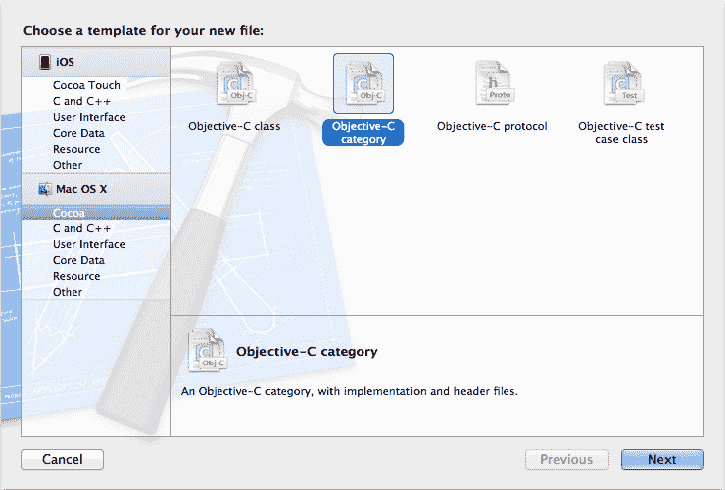
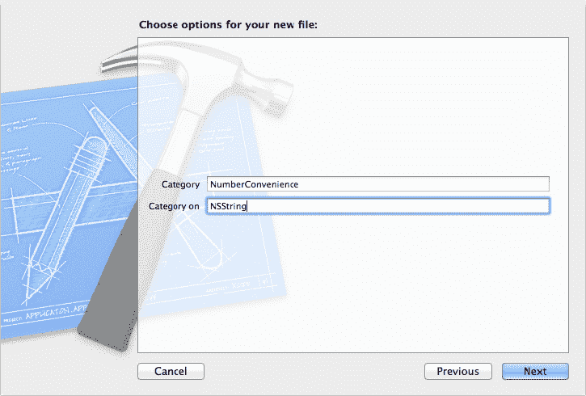
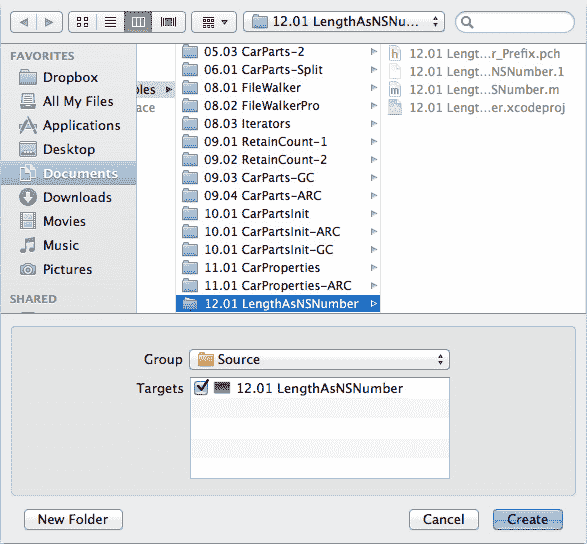

# 第 12 章

### 类别

在编写面向对象程序时，你常常需要为现有类添加一些新行为：你总是可以为对象创建新的“技能点”。例如，你设计了一种新型轮胎，因此你可以子类化 `Tire` 并添加炫酷的新功能。当你想为现有类添加行为时，通常的做法就是创建一个子类。


但有时，子类化并不方便。例如，你可能想为 `NSString` 添加一些新行为，但你知道 `NSString` 实际上是类簇的前端，这使得子类化变得困难。在其他情况下，你或许能够创建子类，但你使用的工具包或库可能无法处理新类的对象。例如，当你使用 `stringWithFormat:` 类方法创建新字符串时，你的 `NSString` 子类并不会被返回。

Objective-C 采用的动态运行时派发机制允许你向现有类添加方法。嘿，听起来很不错！这些新方法在 Objective-C 中被称为**分类（Categories）**。

## 创建分类

分类是一种向现有类添加新方法的方式。想给某个类添加新方法？放手去做吧！你可以对任何类执行此操作，甚至包括你没有源代码的类。

例如，假设你正在编写一个填字游戏程序，它会接收一系列字符串，计算每个字符串的长度，并将这些长度放入 `NSArray` 或 `NSDictionary` 中。在将每个长度值添加到 `NSArray` 或 `NSDictionary` 之前，你需要先将其包装成 `NSNumber` 对象。

你可以编写如下代码：

```
NSNumber *number;

number = [NSNumber numberWithUnsignedInt: [string length]];

// ……对 number 进行某些操作
```

但这很快就会变得繁琐。相反，你可以为 `NSString` 添加一个替你完成此任务的分类。事实上，我们现在就这么做。`LengthAsNSNumber` 项目位于 *12.01 LengthAsNSNumber* 项目目录中，其中包含了向 `NSString` 添加此类分类的代码。

程序员通常将分类放在单独的文件中，文件名通常遵循 *ClassName+CategoryName* 的格式。因此，在我们的例子中，文件名将是 *NSString+NumberConvenience*。这不是强制要求，但这是一个好习惯。

## 让我们来创建一个分类

Xcode 让添加分类变得非常简单。它甚至根据我们刚才描述的约定，自动为文件正确命名。

要创建分类，请打开项目，转到导航器，选择希望文件出现的分组。然后，选择 File  New  New File 或输入快捷键  N。在“新建文件”窗口中，单击左侧窗格中的 Cocoa，然后在右侧选择 *Objective-C category*（参见图 12-1）。



图 12-1. 为分类创建一个新文件

点击 Next，在下一个屏幕（参见图 12-2）中，在“Category”字段输入 *NumberConvenience*，在“Category on”字段输入 *NSString*；`NSString` 是我们想要添加方法的类。点击 Next 继续。



图 12-2. 输入分类名称和关联的类

下一个屏幕（如图 12-3 所示）会要求你选择文件保存位置以及将其添加到哪个目标和分组。通常，你可以接受 Xcode 已经做出的选择。点击 Create，现在我们有了一个包含分类接口的头文件和一个可供我们添加方法的实现文件。



图 12-3. 指定文件位置、源分组和目标

### `@interface`

分类的声明看起来与类的声明非常相似：

```
@interface NSString (NumberConvenience)

- (NSNumber *) lengthAsNumber;

@end // NumberConvenience
```

你应该会注意到这个声明中有几个有趣的地方。首先，提到了一个现有类，后面跟随着括号中的一个新名称。这意味着该分类叫做 `NumberConvenience`，并且它为 `NSString` 添加了方法。另一种说法是：“我们正在向 `NSString` 添加一个名为 `NumberConvenience` 的分类。”你可以为一个类添加任意多个分类，只要分类名称是唯一的即可。

你指定了要添加分类的类（`NSString`）和分类的名称（`NumberConvenience`），然后列出你要添加的方法，最后以 `@end` 结尾。你不能添加新的实例变量，因此这里没有像类声明中那样的实例变量部分。

你也可以向分类添加属性。由于不能添加实例变量，这些属性必须是 `@dynamic` 类型。添加属性的好处是可以使用点语法来访问 setter 和 getter 方法。

### `@implementation`

毫不意外，`@interface` 部分有一个对应的 `@implementation` 部分。你将编写的方法放在 `@implementation` 中：

```
@implementation NSString (NumberConvenience)

- (NSNumber *) lengthAsNumber

{

NSUInteger length = [self length];

return ([NSNumber numberWithUnsignedInt:length]);

} // lengthAsNumber

@end // NumberConvenience
```

与分类的 `@interface` 类似，`@implementation` 也包含了类名和分类名，以及新方法的具体实现。

`lengthAsNumber` 方法通过调用 `[self length]` 获取字符串的长度。你将向该字符串发送 `lengthAsNumber` 消息。然后，使用该长度创建一个新的 `NSNumber`。

让我们花点时间讨论一下我们最喜欢的新话题之一：内存管理。这段代码正确吗？是的！`numberWithUnsignedInt` 不是 `alloc`、`copy` 或 `new` 方法。因为它不属于这三者之一，所以它会返回一个我们可以假定其引用计数为 1 且已自动释放的对象。我们创建的 `NSNumber` 对象将在当前活跃的自动释放池被销毁时得到清理。

以下是这个新分类的实际应用。`main()` 创建了一个新的 `NSMutableDictionary`，添加了三个字符串作为键，并将这些字符串的长度作为值：

```
int main(int argc, const char * argv[])

{

@autoreleasepool

{

NSMutableDictionary *dict = [NSMutableDictionary dictionary];

[dict setObject:[@"hello" lengthAsNumber]

forKey:@"hello"];

[dict setObject:[@"iLikeFish" lengthAsNumber]

forKey:@"iLikeFish"];

[dict setObject:[@"Once upon a time" lengthAsNumber]

forKey:@"Once upon a time"];

NSLog (@"%@", dict);

}

return 0;

}
```

让我们按照老办法，一点一点地拆解这段代码。

我们需要做的第一件事是将头文件导入到 `main()` 中，以便我们知道 `NSString` 已经定义了此方法。在其他 `#import` 语句的末尾，我们添加如下内容：

```
#import "NSString+NumberConvenience.h"
```

接下来，我们创建一个自动释放池，采用 ARC 友好的方式：

```
@autoreleasepool {
```

不要忘记代码末尾的结束花括号。顺便提醒一下，这个池用于存放所有自动释放的对象。特别地，可变字典以及我们分类创建的所有 `NSNumber` 对象最终都会在这个池中。

创建完池之后，创建一个新的可变字典。回想一下，这个方便的 Cocoa 类允许我们存储键值对。

```
NSMutableDictionary *dict = [NSMutableDictionary dictionary];
```

我们不能将像 int 这样的基本类型放入字典中，因此必须使用像 `NSNumber` 这样的包装类。幸运的是，我们闪亮的新分类使得将字符串长度嵌入到 `NSNumber` 中变得轻而易举。下面的代码将值 5 添加到字典中，使用了键 `@"hello"`：

```
[dict setObject: [@"hello" lengthAsNumber] forKey: @"hello"];
```


那段代码看起来有点奇怪，但实际上它做的事情是正确的。请记住，`@"string"` 这种字符串实际上是完整的 `NSString` 对象。它们像其他 `NSString` 对象一样响应消息。因为我们在 `NSString` 上添加了这个分类，所以任何字符串都会响应 `lengthAsNumber`，即使是像这样的字面量字符串。

这一点值得重复强调。这一点值得重复强调！**任何** `NSString` 都会响应 `lengthAsNumber`——这包括字面量字符串、来自 `description` 方法的字符串、可变字符串、来自工具包其他部分的字符串、从文件加载的字符串、从广袤互联网获取的字符串等等。这种兼容性使得分类成为一个非常强大的概念。无需对 `NSString` 进行子类化就能获得这种行为——它**就是行得通**。

当你运行这个程序时，你会得到如下输出：

```
{
    "Once upon a time" = 16;
    hello = 5;
    iLikeFish = 9;
}
```

### 糟糕的分类

现在你已经对分类有些上瘾了，让我们稍微把你拉回现实。分类有两个限制。第一个是你不能向类添加新的实例变量。没有地方放置它们。

第二个限制涉及名称冲突，即你分类中的某个方法与现有方法同名。当名称冲突时，分类胜出。你的分类方法将完全替换原始方法，并且无法找回原始方法。有些程序员会给他们的分类方法添加前缀，以确保不会发生冲突。

**注意**：有一些技巧可以绕过无法添加新实例变量的限制。例如，你可以使用一个全局字典来存储对象与你想要关联的任何额外变量之间的映射。但如果你发现自己依赖于这些技巧，你可能需要考虑一下分类是否真的适合你当前的工作。

### 好的分类

在 Cocoa 中，分类主要用于三个目的：将类的实现拆分到多个文件或多个框架中、为私有方法创建前向引用、以及为对象添加非正式协议。如果你不知道“非正式协议”是什么意思，不用担心。我们稍后会介绍。

### 克林特·伊斯特伍德会喜欢这个

现在我们已经讨论了糟糕的和好的分类，让我们介绍一种特殊的分类，它有一个特殊的描述：**类扩展**。这个分类的特殊之处之一在于它没有名字。这意味着什么？嗯，我们刚刚经历了一个过程：为分类命名，并在定义 `@interface` 时使用那个名字。而这个特殊的类扩展分类是没有名字的。下面是关于类扩展分类的完整说明：

*   就像我们指出的，它没有名字。
*   你可以将其用于你有源代码的类（也就是说，你自己的类）。
*   你可以添加实例变量。
*   你可以将变量的可变性从 `readonly` 改为 `readwrite`。
*   你可以拥有任意数量的类扩展。

看看项目 *12.02 Class Extension*。我们创建了一个简单的类，叫做 `Things`，它看起来像这样：

```
@interface Things : NSObject

@property (assign) NSInteger thing1;

@property (readonly, assign) NSInteger thing2;

- (void)resetAllValues;

@end
```

这个类有两个属性和一个方法。我们将 `thing2` 属性标记为 `readonly`，这就是该类公共接口中可见的全部内容。但事情远不止于此，当我们窥探其实现时就会看到。首先，注意这段代码：

```
@interface Things ()
{
    NSInteger thing4;
}

@property (readwrite, assign) NSInteger thing2;
@property (assign) NSInteger thing3;

@end
```

这看起来几乎就像我们在定义一个类，只是没有父类。我们实际上是在对 `Things` 类进行**扩展**，通过添加私有属性和方法。这就是为什么它被称为**类扩展**。

看看 `thing2` 属性，你可能会注意到我们已经在头文件中定义了这个属性。我们在这里对它在做什么？我们正在改变它的可变性，将其标记为 `readwrite`，这样编译器就会生成一个 setter，但对该类的访问保持私有。公共接口只有 getter。

我们还添加了一个私有的 `thing3` 属性，只能在此类内部使用。我们还添加了一个名为 `thing4` 的实例变量，它也是私有的。

那是什么警报声？是的，内存警察来了，想看看我们打算如何处理我们的新对象。因为我们使用的是 ARC，所以我们不需要释放对象，它们在自动释放池结束时会被自动释放。内存警察很满意。

那么，你为什么要做这样的事情呢？面向对象编程的一个特点是信息隐藏。你只想暴露用户需要看到的东西，而隐藏其他内容，比如实现细节。这些技术能帮你实现这一点。

我们将这个分类放在 `.m` 文件中，但我们也可以将其放在私有头文件（`ThingsPrivate.h`）中，并允许 `Things` 的子类或友类访问这些内容。

你可以有多个类扩展分类，这可能会导致难以发现的 bug，所以请明智地使用这个特性。

现在运行程序会得到：

```
1    0    0
200  300  400
```

## 使用分类拆分实现

正如你在第 6 章中看到的，你可以将类的接口放在头文件中，将实现放在 `.m` 文件中。但你无法将一个 `@implementation` 拆分到多个 `.m` 文件中。如果你有一个很大的类想要拆分到多个 `.m` 文件中，你可以使用分类来完成这个工作。

以 AppKit 提供的 `NSWindow` 类为例。如果你查看 `NSWindow` 的文档，你会发现成百上千个方法；`NSWindow` 文档打印出来超过 60 页（别在家试这个）。

将 `NSWindow` 的所有代码放在一个文件中会使其变得巨大且难以维护，这对 Cocoa 开发团队来说负担不小，更不用提我们这些可怜的开发者了。如果你查看头文件并搜索 `@interface`，你会看到官方的类接口：

```
@interface NSWindow : NSResponder
```

然后，还有一大堆分类，包括这些：

```
@interface NSWindow(NSKeyboardUI)
@interface NSWindow(NSToolbarSupport)
@interface NSWindow(NSDrag)
@interface NSWindow(NSCarbonExtensions)
```

这种分类的用法允许所有键盘用户界面相关的东西放在一个源文件中，工具栏代码放在另一个文件中，拖放功能放在另一个文件中，等等。这些分类还将方法分成了逻辑组，让阅读头文件的人更容易理解。这正是我们将要尝试的，只不过规模小一些。

### 在我们的项目中使用分类

`CategoryThing` 项目位于 *12.03 CategoryThing* 文件夹中，它有一个简单的类，分布在几个实现文件中。

首先是 `CategoryThing.h`，它包含了类声明和一些分类。这个文件以导入 Foundation 框架开头，然后是用三个整型实例变量声明的类：

```
#import <Foundation/Foundation.h>

@interface CategoryThing : NSObject
{
    NSInteger thing1;
    NSInteger thing2;
    NSInteger thing3;
}

@end // CategoryThing
```

在类声明之后，有三个分类，每个分类都有一个实例变量的访问器方法。我们将把这些方法的实现放到不同的文件中。

```
@interface CategoryThing (Thing1)
- (void)setThing1:(NSInteger)thing1;
- (NSInteger)thing1;
@end // CategoryThing (Thing1)

@interface CategoryThing(Thing2)
- (void)setThing2:(NSInteger)thing2;
- (NSInteger)thing2;
@end // CategoryThing (Thing2)
```


好的，作为高级文档工程师和翻译员，我将遵循您提供的注意事项和示例，将给定的英文文本翻译成中文。


## CategoryThing 与 Categories

`@interface CategoryThing (Thing3)`

- `- (void)setThing3:(NSInteger)thing3;`
- `- (NSInteger)thing3;`

`@end // CategoryThing (Thing3)`

*CategoryThing.h* 的内容到此为止。

*CategoryThing.m* 相当简单，包含一个我们可以在 `NSLog()` 中配合 `%d` 格式说明符使用的 `description` 方法：

```objc
#import "CategoryThing.h"

@implementation CategoryThing

- (NSString *) description
{
    NSString *desc;
    desc = [NSString stringWithFormat: @"%d %d %d", thing1, thing2, thing3];
    return (desc);
} // description

@end // CategoryThing
```

现在来做一个内存管理检查。`description` 方法的行为正确吗？是的，它是正确的。因为 `stringWithFormat` 并非 `alloc`、`copy` 或 `new` 方法，它返回的对象我们可以假定其保留计数为 1 并且已被自动释放，因此当当前的自动释放池消失时，它将被清理掉。

接下来是 categories。*Thing1.m* 包含了 Thing1 category 的实现：

```objc
#import "CategoryThing.h"

@implementation CategoryThing (Thing1)

- (void)setThing1:(NSInteger)t1
{
    thing1 = t1;
} // setThing1

- (NSInteger) thing1
{
    return (thing1);
} // thing1

@end // CategoryThing
```

值得注意的一点是，category 可以访问它被添加到的那个类的实例变量。Category 方法是一等公民。

*Thing2.m* 的内容与 *Thing1.m* 非常相似：

```objc
#import "CategoryThing.h"

@implementation CategoryThing (Thing2)

- (void)setThing2:(NSInteger) t2
{
    thing2 = t2;
} // setThing2

- (NSInteger)thing2
{
    return (thing2);
} // thing2

@end // CategoryThing
```

阅读到这里，您大概能猜到 *Thing3.m* 长什么样了（提示：剪切；粘贴；搜索；替换）。

*main.m* 文件包含了 `main()`，它实际使用了我们一直在构建的这些 categories。首先是 `#import` 语句：

```objc
#import "CategoryThing.h"
```

我们需要导入 `CategoryThing` 的头文件，以便编译器能看到类定义和 categories。接着是 `main()`：

```objc
int main (int argc, const char *argv[])
{
    @autoreleasepool {
        CategoryThing *thing = [[CategoryThing alloc] init];
        [thing setThing1: 5];
        [thing setThing2: 23];
        [thing setThing3: 42];
        NSLog (@"Things are %@", thing);
    }
    return (0);
} // main
```

`main()` 的第一行包含了我们已经熟知且呃，“喜爱”的标准自动释放池代码。这个池最终会持有被 `NSLog()` 所使用的那个自动释放的 description 字符串。

接下来，分配并初始化了一个 `CategoryThing` 对象：

```objc
CategoryThing *thing = [[CategoryThing alloc] init];
```

这是我们向内存管理巡逻队所做的例行报告：因为这是 `alloc`，它的保留计数为 1，并且不在自动释放池中。而且由于这个项目使用了 ARC，我们无需担心添加 `release`；我们的编译器朋友会为我们做正确的事情并添加一个。

接下来，向该对象发送一些消息来设置 `thing1`、`thing2` 和 `thing3` 的值：

```objc
[thing setThing1: 5];
[thing setThing2: 23];
[thing setThing3: 42];
```

当你使用一个对象时，方法是在接口中、父类中还是 category 中声明的，这并不重要。

在设置了 thing 的值之后，`NSLog()` 打印出该对象。正如你在 `CategoryThing` 的 `description` 方法中所见，这会显示三个 thing 实例变量的值：

```objc
NSLog (@"Things are %@", thing);
```

最后，自动释放池被释放，`main()` 返回 0：

```objc
}
return (0);
} // main
```

我们的这个小程序就到此为止。运行程序会得到以下结果：

```
Things are 5 23 42
```

你不仅可以将一个类的实现拆分到多个源文件中，还可以将其分散到多个框架中。`NSString` 是一个位于 Foundation 框架中的类，该框架包含许多面向数据的类，例如字符串、数字和集合。所有视觉上的华丽功能（窗口、颜色、绘图等）都位于 AppKit 和 UIKit 中。尽管 `NSString` 在 Foundation 中声明，但 AppKit 有一个名为 `NSStringDrawing` 的 `NSString` category，它允许你向字符串对象发送绘制消息。当你绘制一个字符串时，该方法会在屏幕上渲染该字符串的文本。因为这属于花哨的图形处理，所以它是 AppKit 的功能。但 `NSString` 是 Foundation 的对象。Cocoa 设计者使用 categories 将数据功能放入 Foundation，将绘图功能放入 AppKit。作为程序员，我们只需处理 `NSString`，通常不需要关心某个特定方法来自何处。

## 使用 Categories 进行前向引用

正如我们之前提到的，Cocoa 没有任何真正的私有方法。如果你知道一个对象支持的方法名称，就可以调用它，即使该方法的声明没有出现在类的 `@interface` 中。

然而，编译器会尝试提供帮助。如果它看到你在一个对象上调用一个方法，但尚未看到该方法的声明或定义，它会像这样发出警告：`warning: 'CategoryThing' may not respond to '–setThing4:'`。通常，这种抱怨是好的，因为它能帮助你捕捉到许多拼写错误。

但是，如果你的实现中使用了没有在类的 `@interface` 部分列出的方法，编译器的警惕性可能会导致问题。有很多充分的理由说明你为什么不想在那里列出所有方法。这些方法可能纯粹是实现细节，或者你可能正在尝试不同的方法名称以决定要使用哪些。但是，如果你在使用方法之前不声明它们，就会收到编译器的警告。修复所有编译器警告是件好事，那么你能做些什么呢？

如果你能在使用某个方法之前安排好它的定义，编译器就会看到你的定义，就不会产生警告。但如果不方便这样做，或者你正在使用另一个类中未公开的方法，那么你就需要另寻他法。

### 用 Categories 来救场！

在 category 中声明一个方法足以让编译器认为：“好的，这个方法存在。如果我看到程序员使用它，我不会抱怨。” 即使你不想实现它，也无需实际去做。

一种常见的技术是将一个 category 放在实现文件的顶部。假设 `Car` 有一个名为 `rotateTires` 的方法。我们可以通过另一个名为 `moveTireFromPosition:toPosition:` 的方法来实现 `rotateTires`，以交换两个位置的轮胎。这第二个方法是一个实现细节，我们不希望把它放进汽车的公共接口中。通过在 category 中声明它，`rotateTires` 就可以使用 `moveTireFromPosition:toPosition:` 而不会产生任何编译器警告。这个 category 看起来像这样：

```objc
@interface Car (Private)

- (void) moveTireFromPosition: (int) pos1 toPosition: (int) pos2;

@end // Private
```

当你实现这个方法时，它不必存在于一个 `@implementation Car (Private)` 块中，但如果不这样做，编译器会给你一个警告，所以一个好的做法是将它们放在 `@Implementations` 中。另外，以后如果你需要查找这些方法，它们会集中在一个地方，易于查找。你可以把这个方法留在 `@implementation Car` 部分。这样，你就可以将你的方法按类别进行组织，作为文档和结构化的便利，同时仍然可以将所有方法存放在实现文件的一个大块中。


当你访问其他类的私有方法时，甚至不需要提供该方法的实现。只需在类别中声明它，就足以让编译器满意。顺便说一句，你真不应该访问其他类的私有方法，但有时为了规避 Cocoa 或其他人的代码中的漏洞，或者为了编写测试代码，你必须这么做。

不过要小心。苹果对于接受 Mac 和 iOS App Store 中的应用有一些指导原则。其中一条是你的应用不能访问类的私有变量和方法。如果你的应用这么做了，苹果可能会拒绝它。

## 非正式协议与委托类别

现在，是时候谈谈那些你在面向对象编程中经常遇到的“大词”和“大思想”了——你知道的，那些听起来比实际复杂得多的概念。

Cocoa 类经常使用一种涉及**委托**的技术，委托是被另一个对象请求执行某些工作的对象。例如，AppKit 类 `NSApplication` 会询问其委托是否应该在应用程序启动时打开一个无标题窗口。`NSWindow` 对象会询问其委托是否应该允许关闭窗口。

大多数情况下，你将是编写委托对象并将其提供给其他对象的一方，通常是 Cocoa 提供的某个对象。通过实现特定的方法，你可以控制 Cocoa 对象的行为方式。

Cocoa 中的滚动列表由 AppKit 类 `NSTableView` 处理。当 `NSTableView` 准备执行某些工作（例如选择用户刚刚点击的行）时，该对象会询问其委托是否可以选择该行。`NSTableView` 向其委托发送一条消息：

```
- (BOOL) tableView: (NSTableView *) tableView shouldSelectRow: (NSInteger) rowIndex;
```

委托方法可以查看 `tableView` 和行，以决定是否应选择该行。如果表格包含不应选择的行，委托可能会实现禁用行（即不可选择）的概念。

## `ITunesFinder` 项目

让你通过 Bonjour（原名为 Rendezvous 的技术）查找网络服务的 Cocoa 类名为 `NSNetServiceBrowser`。你告诉网络服务浏览器你要查找的服务，并给它一个委托对象。然后，浏览器对象会在发现新服务时向委托对象发送消息。

`ITunesFinder` 位于 *12.04 ITunesFinder* 项目文件夹中，它使用 `NSNetServiceBrowser` 来列出它所能找到的所有共享 iTunes 音乐库。

对于这个项目，我们从 `main()` 开始，它位于 *main.m* 中。委托对象是 `ITunesFinder` 类的一个实例，因此我们需要导入它的头文件：

```objc
#import <Foundation/Foundation.h>
#import "ITunesFinder.h"
```

然后 `main()` 开始。我们设置自动释放池：

```objc
int main (int argc, const char *argv[]) {
    @autoreleasepool {
```

接下来，一个新的 `NSNetServiceBrowser` 诞生了：

```objc
NSNetServiceBrowser *browser = [[NSNetServiceBrowser alloc] init];
```

然后，创建一个新的 `ITunesFinder`：

```objc
ITunesFinder *finder = [[ITunesFinder alloc] init];
```

因为我们使用 `alloc` 来创建它们，所以必须确保在使用完它们后它们会被释放。我们使用的是 ARC，所以不需要添加 `release`，但如果你不使用 ARC，则必须手动释放。

接下来，我们告诉网络服务浏览器将 `ITunesFinder` 对象用作委托：

```objc
[browser setDelegate: finder];
```

然后，我们告诉浏览器去查找 iTunes 共享：

```objc
[browser searchForServicesOfType: @"_daap._tcp" inDomain: @"local."];
```

字符串 `"_daap._tcp"` 告诉网络服务浏览器查找类型为 `daap`（“daap”是“Digital Audio Access Protocol”的缩写）的服务，并使用 TCP 网络协议。这种咒语可以找到由 iTunes 发布的共享库。域名 `local.` 表示在本地网络上查找服务。互联网编号分配机构（IANA）维护着一个互联网协议族列表，这些协议族通常映射到 Bonjour 服务名称。


