# 第 15 章

## UIKit 简介

到目前为止，我们已经在学习为 Mac 操作系统 OS X 编写应用程序的过程中获得了不少乐趣。不过，关于 Mac 的内容我们先告一段落。是时候转换一下方向，看看如何为 iOS 编写应用程序了。就像 Mac 应用使用 AppKit 一样，iOS 应用则使用 UIKit。它包含了构成 iOS 应用的所有 UI 组件和精华。

iOS 没有命令行访问功能，因此我们无法像在 OS X 中那样创建命令行工具。相反，我们将从复制我们在第 14 章中为 OS X 编写的 `CaseTool` 程序开始。你甚至不需要 iOS 设备来完成这个练习。你只需要安装了 iOS SDK 的 Xcode 即可，当你从 Mac App Store 获取 Xcode 时，默认就会安装。

请记住 iOS 与 OS X 的几处不同：


- 没有 shell 或控制台。
- 应用在 Mac 上的模拟器中运行。
- 某些非 UI 的 API 不可用。
- 大多数程序员认为开发 iOS 应用要容易得多。

我们的最终产品在 iPhone 上看起来会像图 15-1。与第 14 章中的`CaseTool`一样，这个应用会将你的字符串全部转换为大写或全部小写。

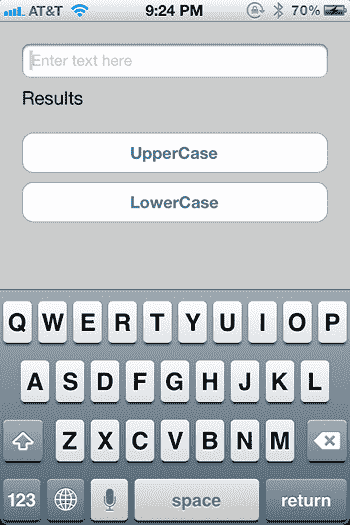

图 15-1. iPhone 上的`CaseTool`预览

让我们通过启动`Xcode`（如果尚未运行的话）来开始冒险。我们需要做的第一件事是使用 iOS SDK 创建一个项目。选择**文件**  **新建**  **新建项目**或`⌘+Shift+N`，如图 15-2 所示。

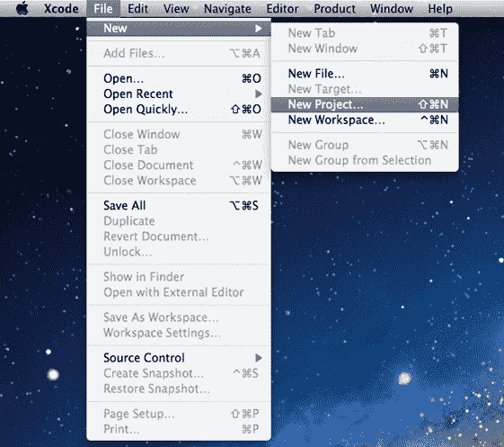

图 15-2. 创建一个新项目

这将弹出一个窗口来选择项目类型。我们从左侧列表中选择**iOS 应用程序**，然后会显示应用程序类型（见图 15-3）。

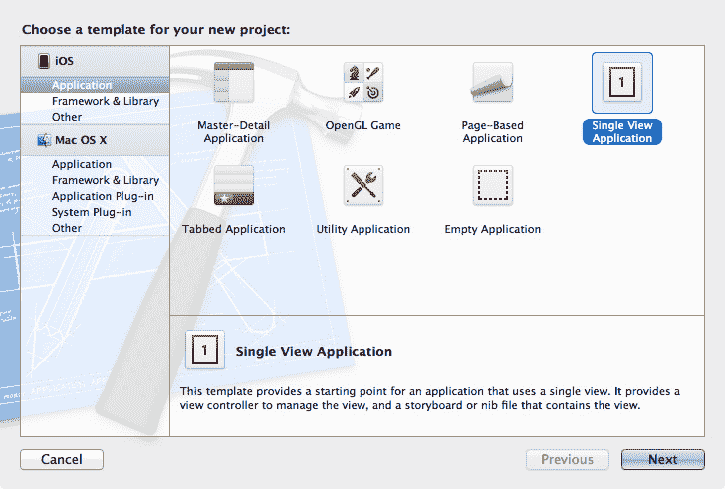

图 15-3. 选择应用程序类型

我们选择**单视图应用程序**。顾名思义，这个应用只显示一个视图。此类应用通常非常简单，不需要太多的用户界面。

其他模板的用途如下：

- **主从视图**使用导航控制器和表格视图来列出项目，并在选中时显示项目的详细信息。
- **OpenGL 游戏**用于制作超级棒的消磨时间的游戏。
- **基于页面的**让你构建类似图书的应用，具有翻页动画（仅限`iPad`）。
- **标签式**创建多视图应用，常见于底部有标签栏且每个标签对应一个视图的 iPhone 应用。
- **实用工具应用**模板有一个主视图，类似于单视图应用，但增加了翻转视图。
- **空应用程序**是一个高级选项，如果没有合适的模板，或者你确切地知道如何构建你的应用，可以使用此选项。

一旦你选择了**单视图应用程序**，点击**下一步**。你会看到要求为应用命名的对话框。我们将使用与 OS X 应用相同的名称：`CaseTool`。

在此屏幕上，确保**使用故事板**和**包含单元测试**未被选中，但一定要选中**使用自动引用计数**。对于设备系列，我们选择**通用**，这意味着我们的应用可以在`iPhone`、`iPod touch`和`iPad`上运行。完成所有选择后，点击**下一步**进入下一个屏幕，在这里你可以选择保存项目的目录（见图 15-5）。

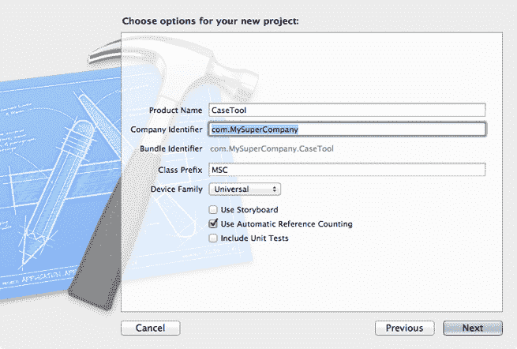

图 15-4\. 是时候“命名应用”了

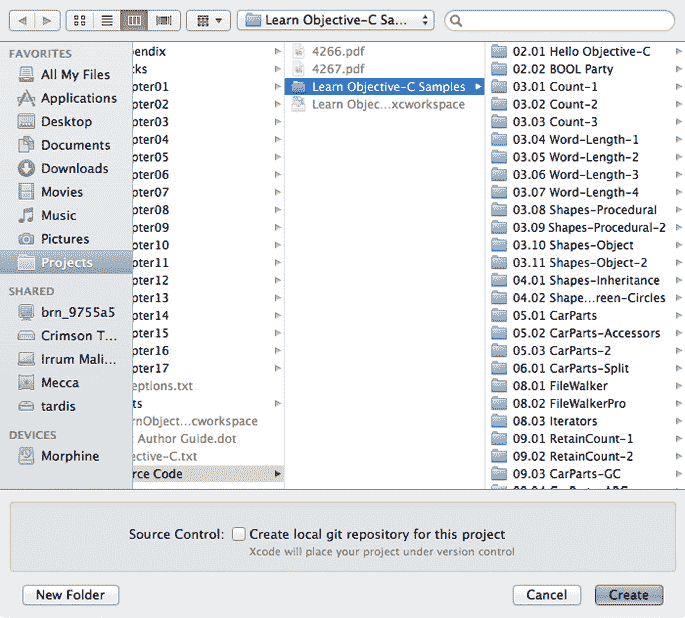

图 15-5. 为项目选择位置

项目创建完成后，`Xcode`会打开并显示它（见图 15-6）。

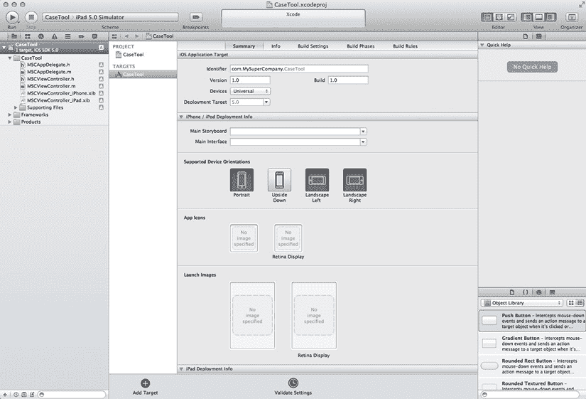

图 15-6. 我们的新项目


浏览文件列表，我们会看到应用委托（application delegate）的相关文件，此外还有一个类文件以及两个 nib 文件，分别对应 iPhone 和 iPad。（如果在创建项目时未选择*通用（Universal）*，则只会得到其中一种文件。）

接下来深入研究应用委托的头文件。首先看到的是我们信赖的 `#import`，你可能还记得，早在第 14 章中我们就接触过它。iOS 的界面元素以 `UI` 为前缀，因为我们使用的是 `UIKit` 而非 `AppKit`。此外还有 `Foundation` 框架，它在 iOS 上的工作方式与在 OS X 上相同。因此，像 `NSString` 这样的类是可用的，并且其行为与在 OS X 中一致。

```objectivec
#import <UIKit/UIKit.h>

@class MSCViewController;

@interface MSCAppDelegate : UIResponder <UIApplicationDelegate>

@property (strong, nonatomic) UIWindow *window;

@property (strong, nonatomic) MSCViewController *viewController;

@end
```

在代码中，你会看到我们有一个窗口对象和一个视图控制器对象。下面是具体的实现：

```objectivec
- (BOOL)application:(UIApplication *)application
didFinishLaunchingWithOptions:(NSDictionary *)launchOptions
{
    self.window = [[UIWindow alloc] initWithFrame:[[UIScreen mainScreen] bounds]];
    // 应用启动后的自定义覆盖点。
    if ([[UIDevice currentDevice] userInterfaceIdiom] == UIUserInterfaceIdiomPhone) {
        self.viewController = [[MSCViewController alloc] initWithNibName:
                               @"MSCViewController_iPhone" bundle:nil];
    } else {
        self.viewController = [[MSCViewController alloc] initWithNibName:
                               @"MSCViewController_iPad" bundle:nil];
    }
    self.window.rootViewController = self.viewController;
    [self.window makeKeyAndVisible];
    return YES;
}
```

这段代码首先创建一个窗口对象。所有应用都在这个主窗口中运行。接着，我们创建视图控制器，其类型会根据运行代码的设备而有所不同。然后，我们请求视图控制器提供要添加到视图层次结构中的视图。这是几乎所有应用都会用到的样板代码。事实上，即使你基于其他模板创建应用，代码结构也会与此非常相似。

## 视图控制器

Cocoa 使用的主要模式是“模型-视图-控制器”（Model-View-Controller），正如我们在第 14 章中所讨论的。果然，在我们的应用中，有一个视图、一个控制器以及某种模型。

我们的视图来自一个 nib 文件。这样做很方便，因为从 nib 文件设计和加载视图比手动创建要快。

`MSCViewController` 类是 `UIViewController` 的子类。`UIViewController` 知道如何执行管理视图的典型任务，例如将视图放到屏幕上、调整大小、旋转等。由于我们在管理一个视图，因此将其作为我们子类的基类是合理的。

为什么不能直接使用 `UIViewController` 呢？因为我们需要向视图中添加一些元素，而 `UIViewController` 并不知道这些元素。所以我们创建子类，并教会子类如何处理我们添加的内容。

## 向 Nib 文件中添加元素

选择 iPhone 专用的 nib 文件 `MSCViewControler_iPhone.xib`。你会看到应用视图以 iPhone 屏幕的大小显示。同时注意，对象窗格中显示的是 iOS 特有的项目（参见图 15-7）。

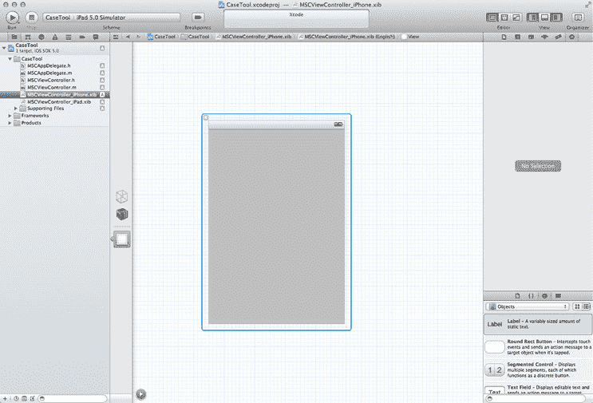

图 15-7. iPhone nib 文件

我们来处理这个 nib 文件。从右下角的“对象”窗格中选择一个“文本字段”（Text Field）对象，并将其拖到视图中。调整其大小以适应屏幕宽度，同时注意调整大小时出现的参考线（参见图 15-8）。

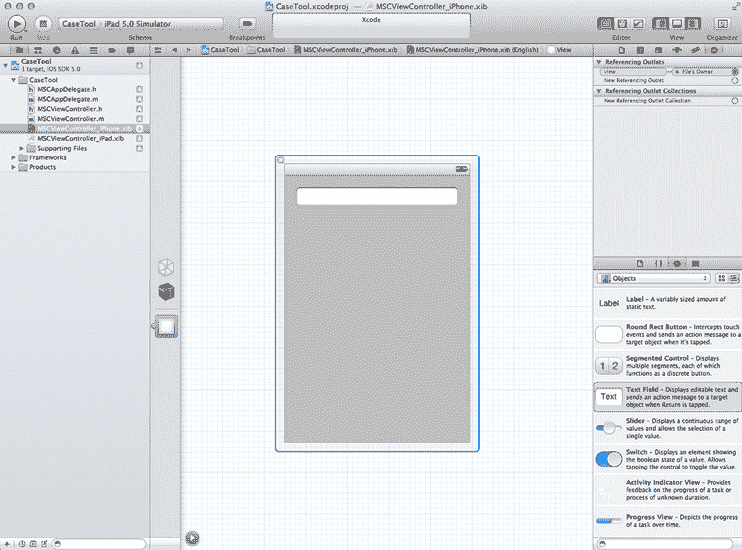

图 15-8. 添加一个文本字段

接下来，拖拽一个“标签”（Label）对象并添加到视图中，然后调整其大小。结果如图 15-9 所示。

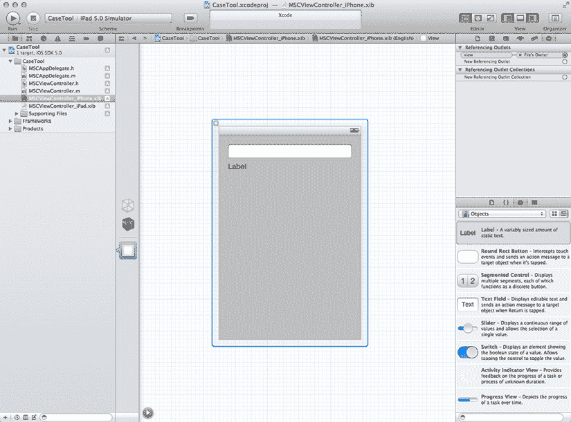

图 15-9. 在文本字段下方放置一个标签

下一步是添加一个按钮。在“对象”窗格中选择“圆角矩形按钮”（Round Rect Button），并将其拖到视图中，放置在文本字段和标签的下方。按钮放置好后，调整其大小和布局，使其与文本字段的宽度匹配，如图 15-10 所示。

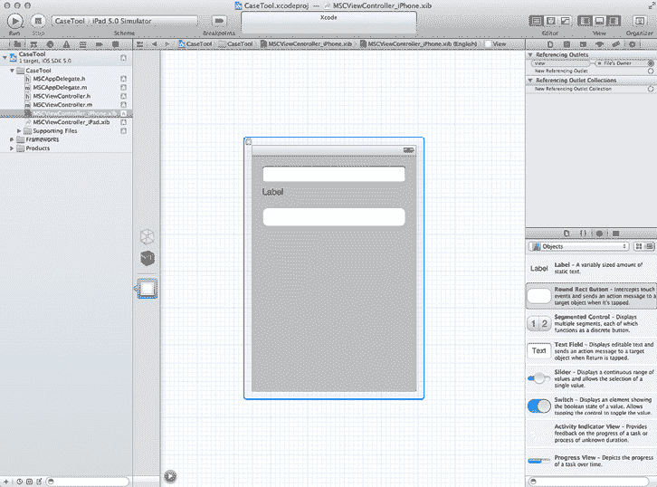

图 15-10. 我们添加了一个宽大的圆角矩形按钮。圆角矩形的应用随处可见！

现在双击圆角矩形按钮为其设置标题。我们将其命名为 `UpperCase`（参见图 15-11）。

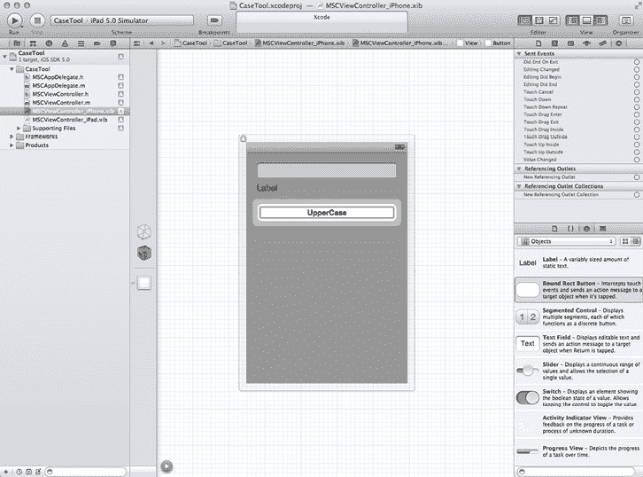

图 15-11. 为按钮命名

我们有了一个用于将文本转换为大写的按钮。还需要一个用于相反功能的按钮。再拖拽一个圆角矩形按钮到视图中，并将其放在第一个按钮的下方。调整其大小使其与第一个按钮一致，并将其命名为 `LowerCase`，如图 15-12 所示。（这里有一个快捷提示：你也可以通过选中第一个按钮，然后选择“编辑  复制”，或直接按 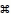 +D 来创建第二个按钮。）

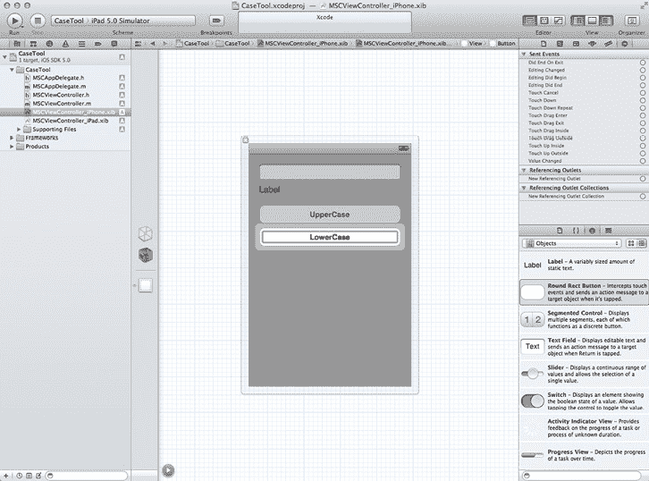

图 15-12. 将第二个按钮放置到位

当然，你不必完全按照我们的方式来布局视图。你可以根据自己的喜好随意调整对象的大小和位置。我们的完整视图布局如图 15-13 所示。

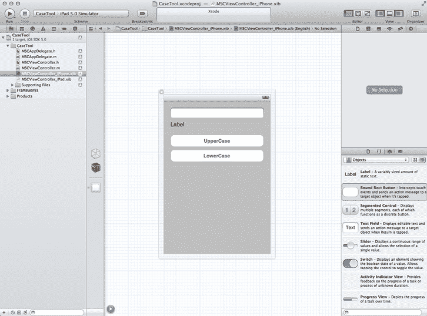

图 15-13. 完全布局好的视图

现在我们按照期望设置了视图，接下来就是连接输出口（outlet）和动作（action）的乐趣了。在工具栏右侧，点击“编辑器”（Editor）组中的中间按钮以打开助理编辑器，或者如果你更喜欢快捷键，可以在键盘上按  +option+return。调整 nib 文件和头文件 `MCSViewController.h` 的排列，以便于在它们之间拖拽和连接。还记得在第 14 章中我们使用 control-拖拽的乐趣吗？让我们再来一次。从视图中的文本字段向头文件进行 control-拖拽（参见图 15-14）。

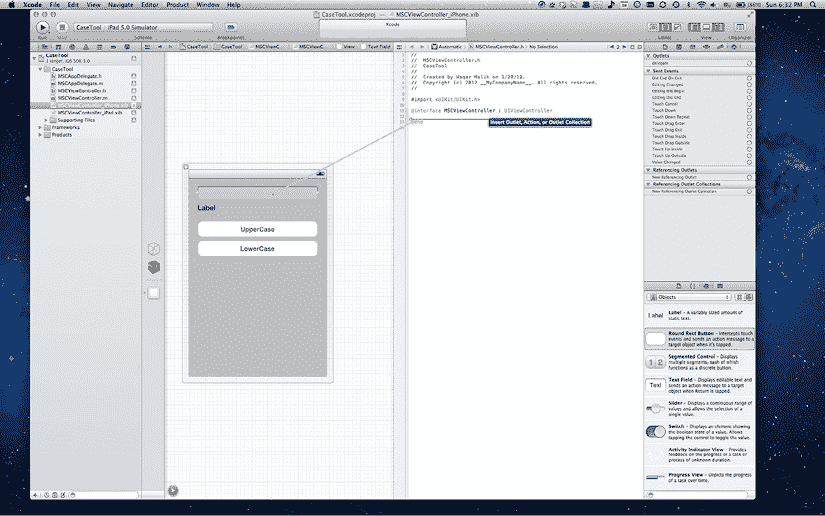

图 15-14. control-拖拽以建立第一个连接

将拖拽的线条放置在头文件中 `@interface` 和 `@end` 之间（同样参见图 15-14）。Xcode 会弹出一个漂亮的小窗口（参见图 15-15）。

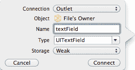

图 15-15. 创建新连接时出现的窗口

图 15-15 中的窗口要求你输入输出口的名称。但在操作之前，请注意“对象”（Object）旁边显示的是“文件所有者”（File's Owner）。这是什么意思呢？当你加载一个 nib 文件时，它由一个控制器拥有。当模板创建了 nib 文件和控制器文件时，它让我们的控制器成为了该 nib 文件的所有者。如果需要，你可以通过选择 nib 文件中的“文件所有者”并更改其类来修改 nib 文件的所有者。但就目前而言，我们保持现状。

现在我们已经准备好为输出口命名了。输入 `textField`，然后点击“连接”（Connect）。


通过执行此过程，我们刚刚添加了一个`outlet`（参见图 15-16）。如果你查看头文件，会发现添加了用于指定`outlet`的代码。注意此类名为`UITextField`。回想一下第 14 章中关于 Mac 的示例，我们使用了`NSTextField`，它与`UITextField`相似，但并不完全相同。

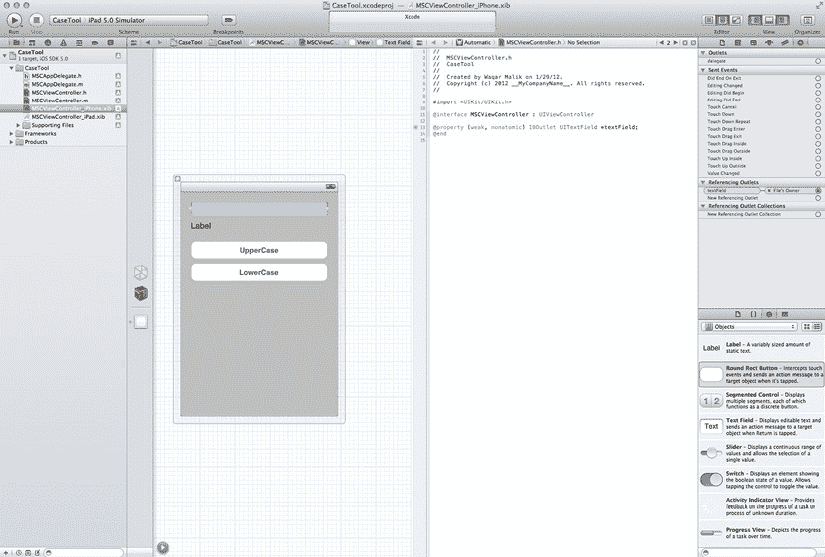

图 15-16. 我们已添加了一个`outlet`

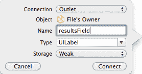

图 15-17. 为标签命名`outlet`

现在，让我们连接标签以保存结果。从标签按住`Control`键拖动，直至`textField` `outlet`代码的下方。

输入`resultsField`作为名称，并点击`Connect`。现在，我们有两个`outlet`，如头文件所示（参见图 15-18）。

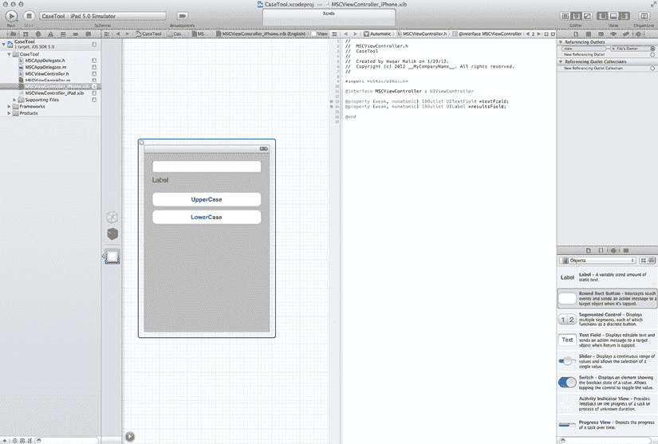

图 15-18. 我们有两个`outlet`

现在是时候让按钮生效了。我们通过为按钮添加`action`来实现这一点。我们不需要为它们设置`outlet`，因为`outlet`用于更改它们的值，而目前我们不需要这样做。

要创建第一个按钮`action`，从`UpperCase`按钮按住`Control`键拖动，并放置到头文件中的`resultsField`下方，如图 15-19 所示。

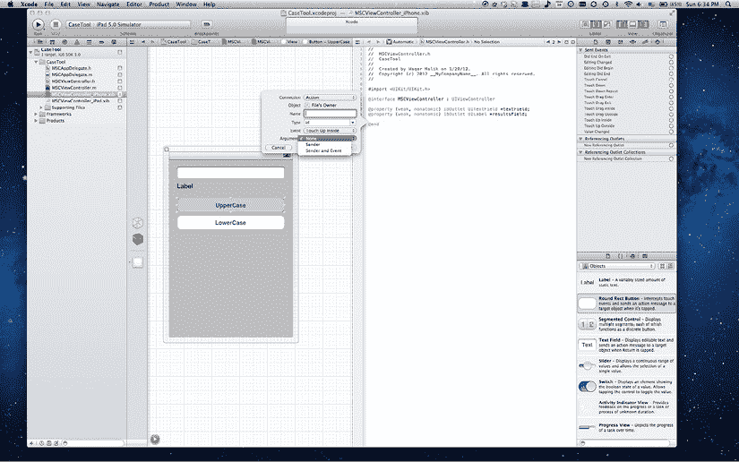

图 15-19. 按住`Control`键拖动以创建第一个按钮`action`

这次我们要创建一个`action`，因此点击`Outlet`并将其更改为`Action`。这会改变对话框中可用的选项（参见图 15-20）。

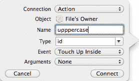

图 15-20. 用于设置`UpperCase`按钮的对话框

以下是`Connection`对话框中每个选项的说明：

*    **名称**：此项包含我们正在创建的`action`的名称。
*    **类型**：这是`action`参数的类型名称。默认情况下，该值为`id`（通用类型），但你可以将其改为发送`action`的类。在我们的例子中，发送`action`的类是`UIButton`。
*    **事件**：此项在 OS X 和 iOS 之间差异很大。在 iOS 中，由于触摸界面的原因，事件类型更多。在这种情况下，我们将使用`Touch Up Inside`事件。这意味着当用户的手指在按钮内部离开屏幕时，将调用按钮`action`。图 15-21 展示了 iOS `action`可用的所有不同类型的事件。

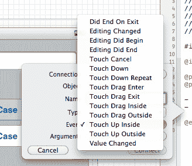

图 15-21. 为`action`选择事件类型

*    **参数**：在 OS X 应用程序中，我们没有参数选项，因为所有`action`都有一个参数。在愉快的 iOS 世界中，我们有三个选项：`None`、`Sender`（即 OS X 中的情况）和`Sender and Event`（其中包含一个`UIEvent`参数，你可以查询它来决定做什么）。对于我们的`action`，我们将选择`None`（参见图 15-22）。

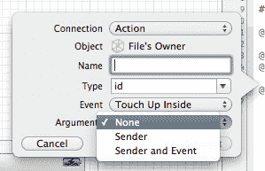

图 15-22. 选择`None`作为参数

完成此步骤将为`action`生成代码，并将其添加到头文件中。

接下来，我们为`LowerCase`按钮创建一个`action`。

界面连接完成后，我们来添加一些代码。（遗憾的是，编程仍然需要这一步。）一些样板代码已经存在，例如`synthesizing`属性和`action`的空实现。

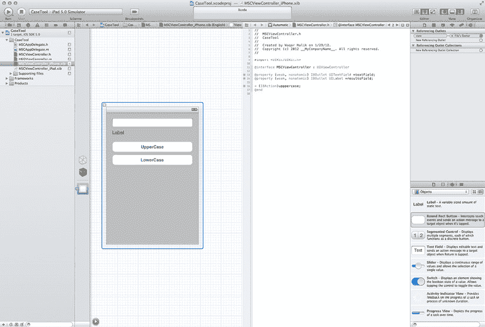

图 15-23. 已添加`UpperCase action`的代码

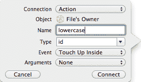

图 15-24. 为第二个按钮创建`action`

回顾第 14 章，我们从应用程序委托中调用：

```
- (id)initWithNibName:(NSString *)nibNameOrNil bundle:(NSBundle *)nibBundleOrNil
```

这个方法在我们的父类中，因此我们无需实现它。我们调用此方法来加载`nib`文件，如果想要访问`outlet`，就需要这样做。因此，我们将调用此方法：

```
- (id)initWithNibName:(NSString *)nibNameOrNil bundle:(NSBundle *)nibBundleOrNil
{
    self = [super initWithNibName:nibNameOrNil bundle:nibBundleOrNil];
    if (nil != self)
    {
        NSLog (@"init: text %@ / results %@", textField, resultsField);
    }
    return self;
}
```

同样在第 14 章中，我们讨论了`awakeFromNib`。`view controller`在`nib`被加载且对象初始化后会调用`viewDidLoad`。早期的一些 iOS 版本也会调用`awakeFromNib`，但在 iOS 5 中则不会调用。

让我们添加`awakeFromNib`：

```
- (void)awakeFromNib
{
    NSLog(@"awake: text %@ / results %@", textField, resultsField);
}
```

我们将添加一个`viewDidLoad`的最小实现。这通常是你修改`outlet`或设置其他`UI`元素的地方，因为在调用`viewDidLoad`时，可以保证`nib`文件已经加载。我们将用它为文本字段设置一些默认值。

```
- (void)viewDidLoad
{
    [super viewDidLoad];
    // Do any additional setup after loading the view, typically from a nib.
    NSLog (@"viewDidLoad: text %@ / results %@", textField, resultsField);

    [textField setPlaceholder:@"Enter text here"];
    resultsField.text = @"Results";
}
```

此代码为`textField`设置了`placeholder`，即用户在其中输入任何内容之前显示的灰色文本。我们还为标签设置了默认值，以便让用户知道在哪里可以看到结果。

接下来在代码中，你会看到`viewDidUnload`。当视图从视图层级结构中移除后，会调用此方法。我们为什么关心这个？答案是为了节省内存。

iOS 不使用虚拟内存。应用程序受设备可用内存的限制。此外，如果我们使用过多内存，iOS 会以极大的报复和愤怒打击我们，杀死我们的应用程序。我们可以使用`viewDidUnload`来帮助清理资源。

在 iOS（尤其是 iPhone）应用程序中，大多数情况下，当一个视图消失时，屏幕上会被另一个视图替换。此时，前一个视图不再可见，因此我们不需要保留它。iOS 会卸载视图以节省内存，因此`viewDidUnload`给了我们从视图中移除元素的机会，从而节省一些内存。在这种情况下，我们移除`textField`和`resultsField`。这两个方法在视图的整个生命周期中只会被调用一次。

还有另外四个方法（`viewWillAppear:`、`viewDidAppear:`、`viewWillDisappear:`和`viewDidDisappear:`），它们在视图将要消失或出现时被调用。这些方法会在每次适当时被调用，即使视图没有被卸载也会如此。

现在，让我们添加实际执行大小写转换的代码。

```
- (IBAction)uppercase
{
    NSString *original = textField.text;
    NSString *uppercase = [original uppercaseString];
    resultsField.text = uppercase;
}

- (IBAction)lowercase
{
    NSString *original = textField.text;
    NSString *lowercase = [original lowercaseString];
    resultsField.text = lowercase;
}
```


对于 iOS 文本字段，我们要求字段使用`NSString`方法来转换其文本（就像我们在第 14 章的 OS X 代码中所做的那样），然后设置标签的`text`属性为修改后的字符串。与 OS X 版本类似，我们将使用`stringValue`和`setStringValue:`来实现。

我们声称正在构建一个通用应用程序，一个可以在 iPhone 和 iPad 上运行的应用程序，但我们尚未处理 iPad 的 nib 文件。让我们来解决这个问题。

选择 iPad 版本的 nib 文件`ViewController_iPad.xib`。添加必要的 UI 元素，使其看起来像我们之前创建的 iPhone 版本。我们可以像为 iPhone 版本那样逐个创建元素，或者为了更快地操作，可以在 iPhone 视图中按住 Shift 键选择多个元素，复制它们，然后粘贴到 iPad 视图中。结果应类似于图 15-25。

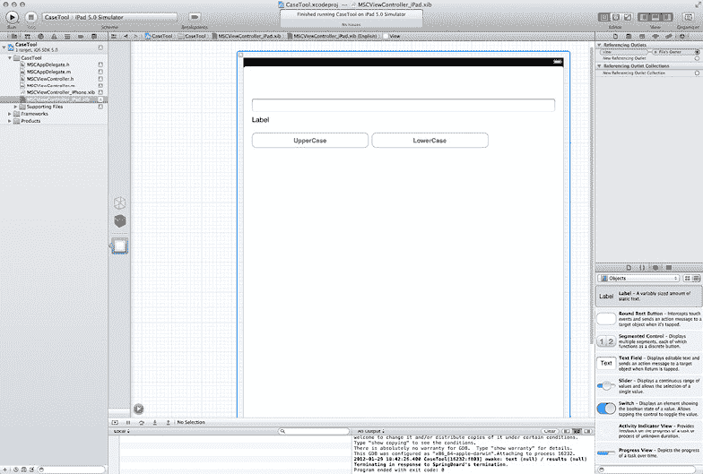

图 15-25. 创建 iPad 用户界面

我们现在更接近了，但还没有完全完成。如果现在构建并运行应用程序，我们实际上可以在文本字段中输入文本并点击按钮，但它们不会执行任何操作。为了使其正常工作，我们必须连接输出口（outlets）和操作（actions）。

在 iPad nib 文件中，按住 Control 键从文件所有者拖动到文本字段（参见图 15-26）。

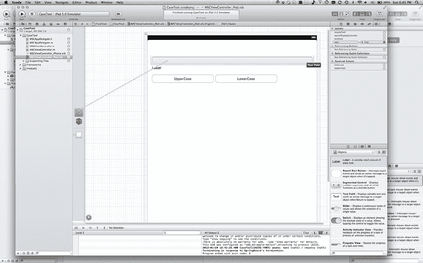

图 15-26. 从文件所有者按住 Control 键拖动到文本字段

当出现小的弹出菜单时，选择`textField`（参见图 15-27）。

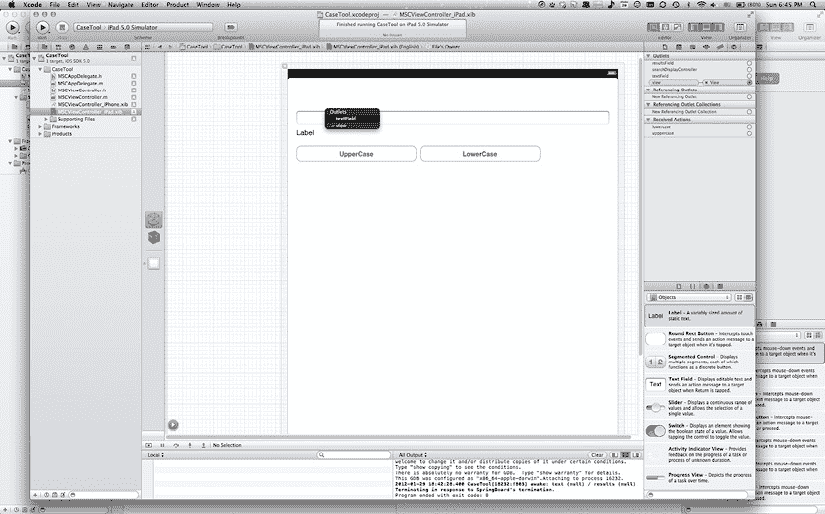

图 15-27. 从弹出窗口中选择`textField`

对标签重复此过程：按住 Control 键从文件所有者拖动到标签（参见图 15-28），然后从弹出菜单中选择`resultsField`（参见图 15-29）。

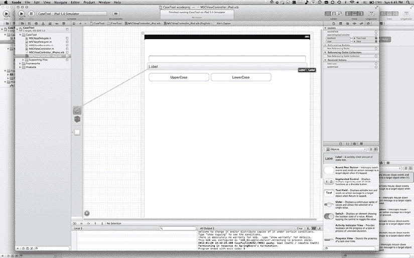

图 15-28. 将标签连接到文件所有者

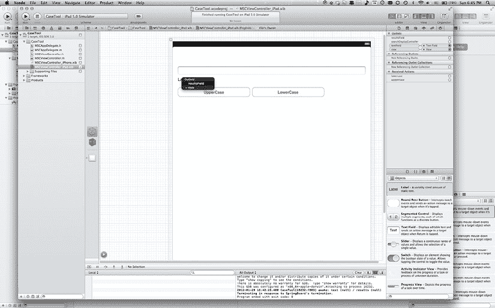

图 15-29. 连接到`resultsField`输出口

好了，让我们让它执行一些操作！我们准备连接操作。按住 Control 键从`UpperCase`按钮拖动到文件所有者（参见图 15-30）。然后，从弹出菜单中选择`UpperCase`。

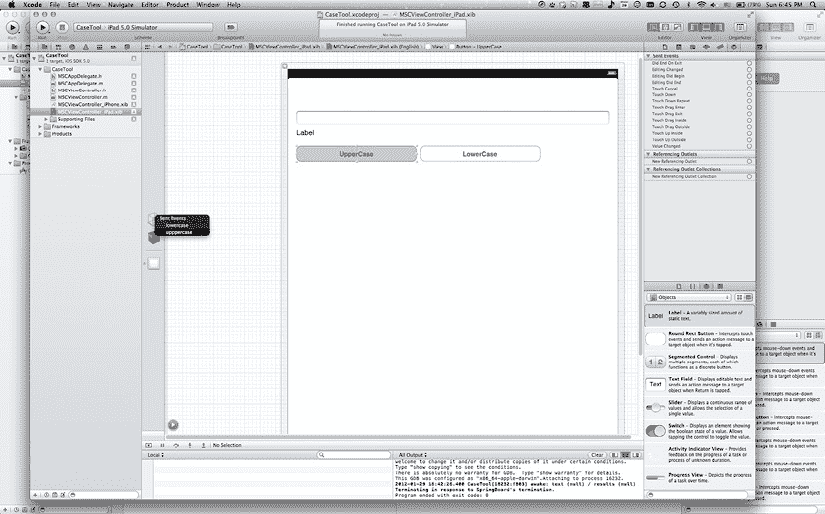

图 15-30. 将`upperCase`操作连接到其按钮

对`LowerCase`按钮执行相同操作（参见图 15-31）。

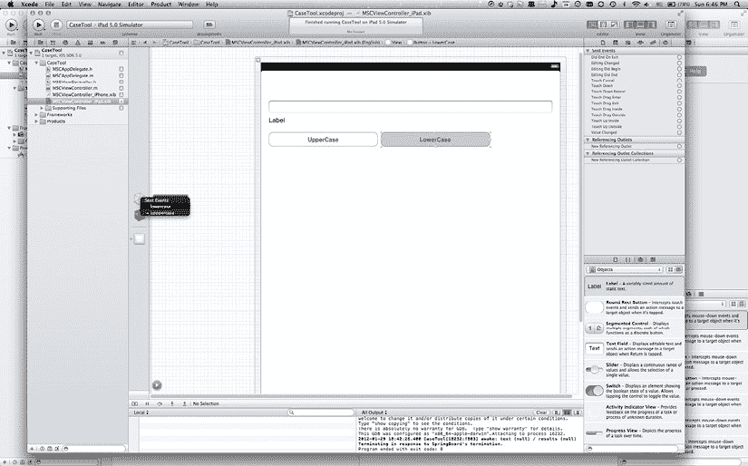

图 15-31. 连接`LowerCase`按钮

您可能会注意到弹出菜单中`upperCase`方法旁边有一个减号。这意味着已存在到此方法的连接。您可以将一个方法分配给多个操作。

最后，点击 Scheme 弹出菜单，选择 iPad。然后，点击工具栏左侧的 Run。这将启动 iPad 模拟器并运行我们的应用程序。哇哦！我们还可以查看其 iPhone 版本。在模拟器中，选择 Hardware  Device  iPhone。

**总结**

呼！为了让一个简单的应用程序在模拟器中运行，我们了解了大量信息，尽管 Xcode 确实帮了我们很多忙。显然，我们只是触及了可用于开发 iOS 应用程序的庞大 API 集的皮毛。

在本章中，我们向你展示了如何在 iOS 应用程序中使用视图控制器，以及 iOS 如何为视图管理内存。我们讨论了 iOS 特有的类。我们花时间探讨了 iOS 与 OS X 的相似之处和不同之处。

如果你计划为 iOS 开发应用程序并想了解更多，请查阅 David Mark、Jack Nutting 和 Jeff LaMarche 合著的《*Beginning iOS 5 Development*》（Apress，2011 年）。

